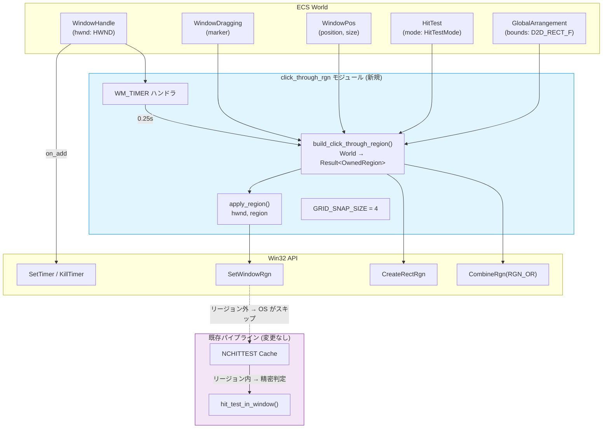
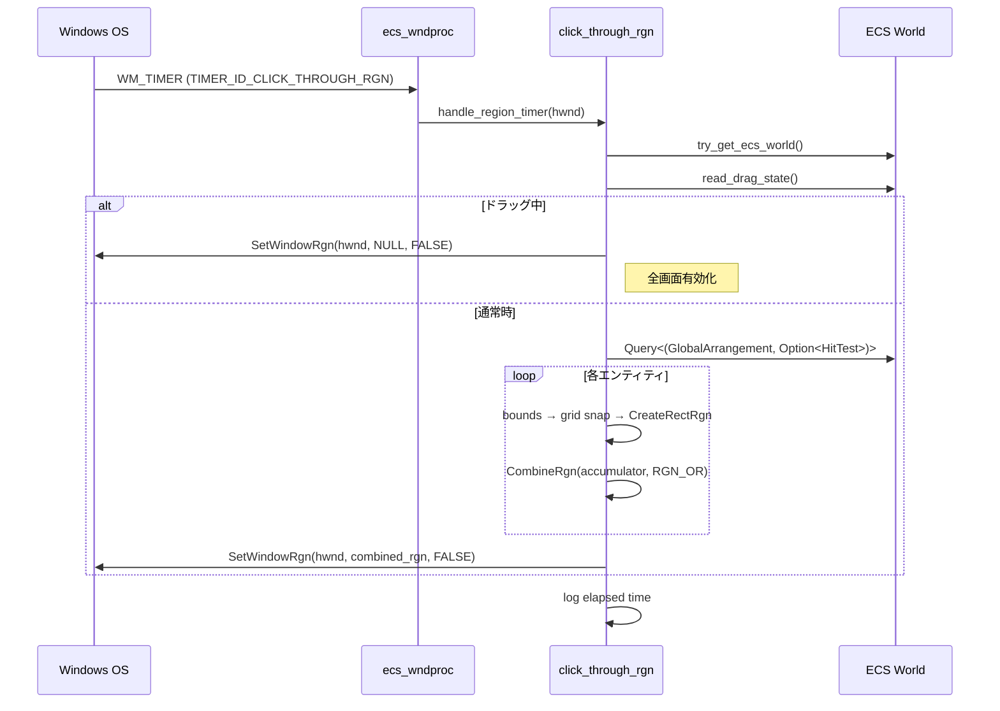
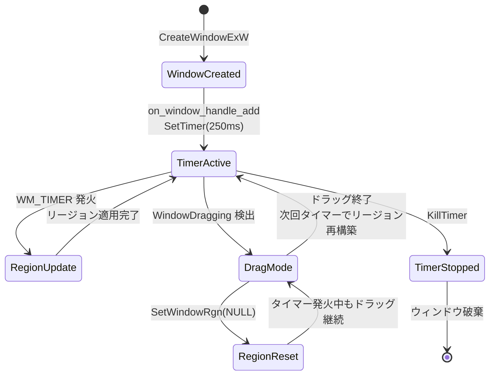
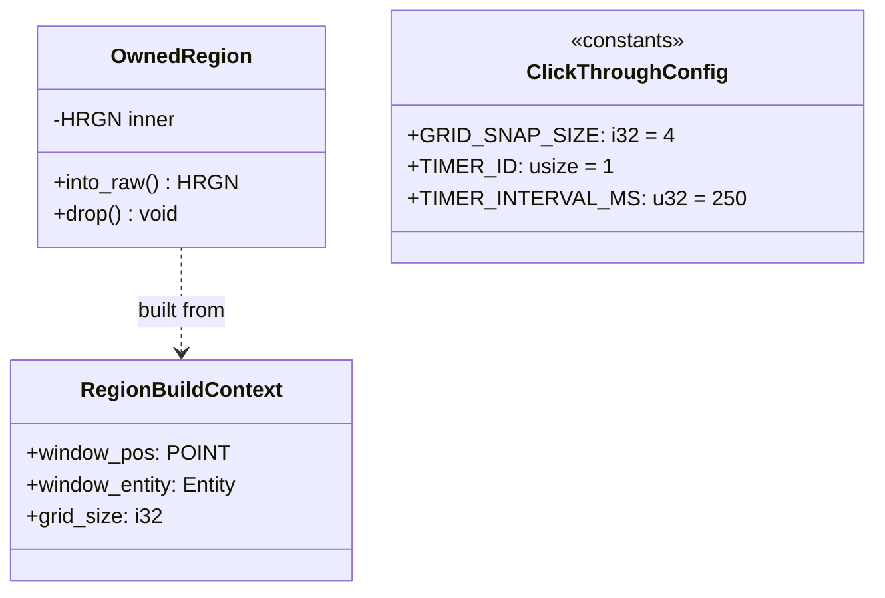

# Technical Design: wintf-P0-click-through-rgn

## Overview

**Purpose**: SetWindowRgn ベースのクリックスルー実装により、HitTestMode::None エンティティの領域を通して他プロセスのウィンドウにクリックイベントを貫通させる。従来の HTTRANSPARENT アプローチが同一スレッド内に限定される制約を克服し、デスクトップマスコットアプリケーションの透過領域操作を実現する。

**Users**: wintf フレームワーク開発者。デスクトップマスコット（ぱすたさん等）のシェルウィンドウにおけるクリックスルー体験を構築する。

**Impact**: 既存の NCHITTEST ベースクリックスルー機構を補完する二層アーキテクチャを追加。本機能は**実験的性質**を持ち、DirectComposition との互換性検証結果により破棄される可能性がある。

### Goals
- クロスプロセスのクリックスルーを SetWindowRgn で実現
- 既存の NCHITTEST パイプラインとの安全な共存
- モジュール化によるリジェクション容易性の確保
- 0.25秒間隔の定期リージョン更新による動的追従

### Non-Goals
- ピクセル単位の AlphaMask クリックスルー（将来拡張として許容するが本仕様では実装しない）
- WS_EX_TRANSPARENT の代替実装
- ECS レンダリングパイプラインへの変更
- 複数ウィンドウの独立リージョン管理（本仕様は単一ウィンドウを対象）

## Architecture

### Existing Architecture Analysis

現在の wintf クリックスルーは NCHITTEST ベースの単層アーキテクチャ:

1. `WM_NCHITTEST` → `cached_nchittest()` → `hit_test_in_window()` → HTTRANSPARENT / HTCLIENT
2. HTTRANSPARENT は DWM Step 2 で同一スレッド内の兄弟ウィンドウのみに転送
3. クロスプロセスのクリック貫通は不可能

**維持すべきパターン**:
- `ecs_wndproc` の match-dispatch パターン
- `try_get_ecs_world()` → `try_borrow_mut()` による World アクセス
- `WindowHandle` コンポーネントの on_add フック活用
- `read_drag_state()` によるドラッグ状態判定

**技術的制約**:
- WS_EX_NOREDIRECTIONBITMAP がすべての ECS ウィンドウのデフォルト
- SetWindowRgn との互換性が未検証（最大リスク）

### Architecture Pattern & Boundary Map



**Architecture Integration**:
- **Selected pattern**: Observer + Timer Callback（既存の VSync パターンに類似）
- **Domain boundaries**: click_through_rgn モジュールが全リージョンロジックを所有。既存のレイアウト・ヒットテスト・ドラッグシステムには読み取りアクセスのみ
- **Existing patterns preserved**: ecs_wndproc dispatch、try_get_ecs_world、WindowHandle フック
- **New components rationale**: 単一モジュール（click_through_rgn.rs）に全ロジックを集約しリジェクション容易性を最大化
- **Steering compliance**: モジュール単位の責務分離（structure.md）、tracing ベースロギング（logging.md）

### Technology Stack

| Layer | Choice / Version | Role in Feature | Notes |
|-------|------------------|-----------------|-------|
| Window Region | Win32 GDI (SetWindowRgn, CreateRectRgn, CombineRgn) | HRGN 構築・適用 | windows crate 0.62.2 経由。`Win32_Graphics_Gdi` feature 設定済み |
| Timer | Win32 SetTimer/KillTimer | 0.25秒定期トリガー | WM_TIMER → ecs_wndproc |
| ECS Query | bevy_ecs 0.18.0 | エンティティ bounds・HitTestMode 取得 | 既存コンポーネント読み取りのみ |
| Logging | tracing crate | パフォーマンス計測・診断 | 既存インフラ活用 |

## System Flows

### リージョン更新フロー（通常時）



### ウィンドウライフサイクルとタイマー管理



**Key Decisions**:
- `bRedraw=FALSE`: DirectComposition が描画を管理するため、SetWindowRgn による GDI 再描画は不要。描画ちらつき回避
- ドラッグ中は SetWindowRgn(NULL) でリージョンリセット（NCHITTEST のドラッグガードと協調）

## Requirements Traceability

| Requirement | Summary | Components | Interfaces | Flows |
|-------------|---------|------------|------------|-------|
| 1.1-1.4 | リージョン定期更新 (0.25s) | ClickThroughRgnModule | setup_timer, kill_timer | ウィンドウライフサイクル |
| 2.1-2.7 | 矩形ベースリージョン構築 | ClickThroughRgnModule | build_click_through_region | リージョン更新フロー |
| 3.1-3.3 | グリッドスナップ構成可能性 | ClickThroughRgnModule (定数) | GRID_SNAP_SIZE | — |
| 4.1-4.3 | レイアウト変更検知 | ClickThroughRgnModule | region_dirty フラグ | リージョン更新フロー |
| 5.1-5.4 | ドラッグ時リージョン拡張 | ClickThroughRgnModule | handle_region_timer 内分岐 | リージョン更新フロー (ドラッグ中) |
| 6.1-6.4 | DirectComposition 互換性検証 | ClickThroughRgnModule | apply_region 内ログ出力 | — |
| 7.1-7.3 | クロスプロセスクリックスルー | ClickThroughRgnModule + Win32 | SetWindowRgn | リージョン更新フロー |
| 8.1-8.4 | パフォーマンス測定 | ClickThroughRgnModule | tracing span | リージョン更新フロー |
| 9.1-9.5 | モジュール化/リジェクション | ClickThroughRgnModule | 全インターフェース | ウィンドウライフサイクル |

## Components and Interfaces

| Component | Domain/Layer | Intent | Req Coverage | Key Dependencies | Contracts |
|-----------|--------------|--------|--------------|-----------------|-----------|
| ClickThroughRgnModule | ECS / Window Region | リージョン構築・適用・タイマー管理を一元化 | 1-9 全要件 | GlobalArrangement (P0), HitTest (P0), WindowHandle (P0), WindowPos (P0), DragState (P1) | Service, State |
| ecs_wndproc (変更) | Window Proc | WM_TIMER ディスパッチ追加 | 1.2 | ClickThroughRgnModule (P0) | — |
| WindowHandle on_add (変更) | Window | SetTimer 呼び出し追加 | 1.1 | ClickThroughRgnModule (P0) | — |

### ECS / Window Region

#### ClickThroughRgnModule

| Field | Detail |
|-------|--------|
| Intent | SetWindowRgn ベースのクリックスルー領域を構築・適用する独立モジュール |
| Requirements | 1.1-1.4, 2.1-2.7, 3.1-3.3, 4.1-4.3, 5.1-5.4, 6.1-6.4, 7.1-7.3, 8.1-8.4, 9.1-9.5 |

**Responsibilities & Constraints**
- HRGN の構築（CreateRectRgn + CombineRgn）と SetWindowRgn への適用
- 0.25秒タイマーの設定・解除
- ドラッグ状態に応じたリージョン切り替え
- パフォーマンス計測ログ出力
- **制約**: ECS World への読み取りアクセスのみ（state 変更はしない）
- **制約**: GDI リソース（HRGN）のリーク防止を保証

**Dependencies**
- Inbound: ecs_wndproc — WM_TIMER ディスパッチ (P0)
- Inbound: WindowHandle on_add — SetTimer 呼び出しトリガー (P0)
- Outbound: GlobalArrangement — エンティティ bounds 読み取り (P0)
- Outbound: HitTest — エンティティ HitTestMode 読み取り (P0)
- Outbound: WindowPos — ウィンドウ座標取得 (P0)
- Outbound: DragState — ドラッグ状態読み取り (P1)
- External: Win32 GDI — CreateRectRgn, CombineRgn, DeleteObject (P0)
- External: Win32 User — SetWindowRgn, SetTimer, KillTimer (P0)

**Contracts**: Service [x] / State [x]

##### Service Interface

```rust
/// click_through_rgn モジュールの公開インターフェース

/// グリッドスナップサイズ（物理ピクセル単位）
/// HRGN 複雑度とクリック精度のトレードオフ調整用
pub(crate) const GRID_SNAP_SIZE: i32 = 4;

/// タイマー ID（SetTimer / KillTimer で使用）
pub(crate) const TIMER_ID_CLICK_THROUGH_RGN: usize = 1;

/// タイマー間隔（ミリ秒）
pub(crate) const TIMER_INTERVAL_MS: u32 = 250;

/// RAII ラッパー: HRGN の自動解放
pub(crate) struct OwnedRegion(HRGN);

impl Drop for OwnedRegion {
    fn drop(&mut self); // DeleteObject(self.0)
}

/// ECS World からクリックスルーリージョン（HRGN）を構築する
///
/// 全 GlobalArrangement + HitTest エンティティをクエリし、
/// HitTestMode::None 以外のエンティティの bounds を
/// グリッドスナップ → CreateRectRgn → CombineRgn(RGN_OR) で合成。
///
/// # Arguments
/// * `world` - bevy_ecs World（読み取りアクセス）
/// * `window_entity` - 対象ウィンドウの Entity
///
/// # Returns
/// * `Ok(OwnedRegion)` - 構築された HRGN（所有権は呼び出し側に）
/// * `Err(...)` - エンティティなし or GDI API エラー
pub(crate) fn build_click_through_region(
    world: &World,
    window_entity: Entity,
) -> windows_core::Result<OwnedRegion>;

/// 構築された HRGN をウィンドウに適用する
///
/// # Important
/// SetWindowRgn 成功後、HRGN の所有権は OS に移転する。
/// OwnedRegion は forget する（Drop で DeleteObject しない）。
pub(crate) fn apply_region(
    hwnd: HWND,
    region: OwnedRegion,
) -> windows_core::Result<()>;

/// WM_TIMER ハンドラ（ecs_wndproc から呼び出し）
///
/// ドラッグ中: SetWindowRgn(NULL) でリージョンリセット
/// 通常時: build_click_through_region → apply_region
pub(crate) fn handle_region_timer(hwnd: HWND) -> Option<LRESULT>;

/// WindowHandle 追加時に SetTimer を設定
pub(crate) fn setup_timer(hwnd: HWND) -> windows_core::Result<()>;

/// ウィンドウ破棄時に KillTimer を呼び出し
pub(crate) fn kill_timer(hwnd: HWND) -> windows_core::Result<()>;

/// リージョン更新を無効化（パフォーマンス比較用）
pub(crate) fn set_region_updates_enabled(enabled: bool);
```

- **Preconditions**:
  - `build_click_through_region`: World が borrow 可能であること。window_entity に WindowHandle + WindowPos が存在すること
  - `apply_region`: hwnd が有効なウィンドウハンドルであること
  - `setup_timer`: hwnd が CreateWindowExW によって作成済みであること
- **Postconditions**:
  - `build_click_through_region`: 返却された OwnedRegion は有効な HRGN を保持。一時 HRGN は全て DeleteObject 済み
  - `apply_region`: SetWindowRgn 成功後、OwnedRegion の HRGN は OS に所有権移転（mem::forget）
  - `kill_timer`: タイマーが停止し、以降 WM_TIMER は発火しない
- **Invariants**:
  - HRGN リークなし: 全一時リージョンは DeleteObject、最終リージョンは SetWindowRgn による OS 移転または OwnedRegion::Drop で解放
  - タイマーは WindowHandle の存続期間中のみアクティブ

##### State Management
- **State model**:
  - `REGION_UPDATES_ENABLED: AtomicBool` — リージョン更新の有効/無効（パフォーマンス比較用）
  - `REGION_DIRTY: AtomicBool` — レイアウト変更によるダーティフラグ（将来拡張用。現在はタイマー毎に無条件更新）
  - `CONSECUTIVE_ERROR_COUNT: AtomicUsize` — 連続エラーカウンタ（恒久的エラー検出用）
- **Persistence**: なし（プロセスライフタイム内のみ）
- **Concurrency**: AtomicBool/AtomicUsize + メインスレッド固定アクセス。ecs_wndproc はメインスレッドでのみ実行される

**Implementation Notes**
- **Integration**: ecs_wndproc に `WM_TIMER if wparam == TIMER_ID_CLICK_THROUGH_RGN` の match arm を追加。WindowHandle on_add フックに `setup_timer()` 呼び出しを追加。on_remove フックに `kill_timer()` 呼び出しを追加
- **Validation**: 互換性テスト（Req 6）を最優先で実装。SetWindowRgn の戻り値、DirectComposition Visual の描画状態、クロスプロセスクリック貫通を検証
- **Risks**: SetWindowRgn + WS_EX_NOREDIRECTIONBITMAP 互換性が最大リスク。失敗時はモジュール全体を削除

### Window Proc (変更箇所)

#### ecs_wndproc WM_TIMER Dispatch

**Implementation Notes**
- `ecs_wndproc` の match 式に以下を追加:
  ```
  WM_TIMER if wparam.0 == TIMER_ID_CLICK_THROUGH_RGN => handle_region_timer(hwnd)
  ```
- 他の WM_TIMER（将来追加される可能性）との衝突を timer_id ガードで防止
- リジェクション時: この1行を削除するだけで WM_TIMER ディスパッチ無効化

### Window Handle Hooks (変更箇所)

#### on_window_handle_add / on_window_handle_remove

**Implementation Notes**
- `on_window_handle_add` 末尾に `setup_timer(hwnd)` 呼び出しを追加
- `on_window_handle_remove` に `kill_timer(hwnd)` 呼び出しを追加
- リジェクション時: これらの呼び出しを削除

## Data Models

### Domain Model



**Key invariants**:
- OwnedRegion は常に有効な HRGN を保持する（無効化は into_raw() でのみ行う）
- RegionBuildContext は build_click_through_region 内のローカル構造体

### Logical Data Model

**グリッドスナップ変換**:
- 入力: `D2D_RECT_F { left, top, right, bottom }` （f32, 物理ピクセル, スクリーン座標）
- 変換1: ウィンドウ相対座標に変換 (`- window_pos`)
- 変換2: グリッドスナップ (`left = floor(left / grid) * grid`, `right = ceil(right / grid) * grid`)
- 変換3: i32 キャスト
- 出力: `RECT { left, top, right, bottom }` （i32, 物理ピクセル, ウィンドウ相対座標）

**座標空間の流れ**:
```
GlobalArrangement.bounds (f32, screen coords)
  → subtract WindowPos.position (f32, window-relative)
    → grid snap (f32, aligned)
      → as i32 (i32, window-relative, grid-aligned)
        → CreateRectRgn (HRGN)
```

## Error Handling

### Error Strategy
- **GDI API エラー** (CreateRectRgn/CombineRgn 失敗): `windows_core::Result` で伝播。`warn!` レベルでログ出力し、リージョン更新をスキップ（次回タイマーでリトライ）
- **SetWindowRgn 失敗**: `error!` レベルでログ出力。HRESULT コードを含む互換性診断メッセージ（Req 6.3）
- **ECS World borrow 失敗**: `try_borrow()` が Err の場合、`trace!` レベルでログし更新スキップ（他のハンドラが World を借用中の場合に発生しうる）
- **エンティティ 0 件**: HitTestMode::None 以外のエンティティが存在しない場合、空リージョン（NULLREGION）を構築し SetWindowRgn に適用（全領域クリックスルーになる）

### Error Categories and Responses
- **互換性エラー** (Req 6): SetWindowRgn 失敗 or Visual 描画異常 → `error!` + 互換性診断 → アプローチ破棄判断材料
- **一時的エラー**: World borrow 失敗、CreateRectRgn 失敗 → スキップ + 次回リトライ
- **設定エラー**: SetTimer 失敗 → `warn!` + クリックスルー無効状態で続行

### Error Recovery and Self-Healing

#### 恒久的エラーの検出と自動無効化
GDI API エラー（CreateRectRgn, CombineRgn）が連続して発生する場合、リソース枯渇などの恒久的な問題の可能性がある。無限リトライによるログスパムと CPU 負荷を防止するため、以下の自己修復機構を実装する:

- **State**: `CONSECUTIVE_ERROR_COUNT: AtomicUsize` — 連続エラーカウンタ（thread_local）
- **Threshold**: 連続エラー 10 回で恒久的エラーと判定
- **Action**: 
  1. `set_region_updates_enabled(false)` を呼び出し、リージョン更新を恒久的に無効化
  2. `error!` レベルで `"Click-through region updates permanently disabled due to repeated GDI errors (count: {})"`をログ記録
  3. 以降の WM_TIMER では early return し、リージョン構築を試行しない
- **Reset**: リージョン更新が成功した場合、カウンタを 0 にリセット

#### SetTimer 失敗時の明示的な状態管理
SetTimer 失敗時、クリックスルー機能が完全に無効化されるが、現在の設計では `warn!` ログのみで状態が追跡されない。以下の方式で状態を明示的に管理する:

- **Option A (推奨)**: `setup_timer()` が `Err` を返した場合、呼び出し側（`on_window_handle_add`）で警告ログを出力し、処理を継続
  - 実装: `if let Err(e) = setup_timer(hwnd) { warn!("SetTimer failed, click-through disabled: {:?}", e); }`
  - メリット: 既存のエラーハンドリングパターンに準拠、追加の状態管理不要
  
- **Option B**: WindowHandle に `ClickThroughDisabled` マーカーコンポーネントを追加
  - 実装: `commands.entity(entity).insert(ClickThroughDisabled);`
  - メリット: ECS query で無効化されたウィンドウを検出可能、診断ツールで状態を可視化できる
  - デメリット: リジェクション時の削除対象が増加

**本仕様では Option A を採用**: 実験的仕様としてシンプルさを優先し、SetTimer 失敗は稀なケースとして扱う。

## Implementation Priority

### Phase 0: DirectComposition 互換性検証（GO/NO-GO 判定）
**本アプローチ最大のリスク項目を最優先で検証**し、失敗時は即座に実装を中止する。

#### 実装内容
最小限のプロトタイプコードで以下を検証:
1. WS_EX_NOREDIRECTIONBITMAP スタイルのウィンドウを作成
2. DirectComposition Visual を設定し、描画を確認
3. SetWindowRgn で簡単なリージョン（例: 画面中央の矩形のみ有効）を設定
4. 以下の3点を目視確認:
   - **API 成功**: SetWindowRgn が成功する（戻り値チェック）
   - **Visual 描画維持**: DirectComposition Visual の描画が壊れていない（ビジュアルが表示され続ける）
   - **クロスプロセスクリック貫通**: リージョン外をクリックした際、他プロセス（例: エクスプローラのデスクトップアイコン）にクリックが貫通する

#### 完了条件（GO/NO-GO 判定）
- **GO**: すべての検証項目が成功 → Phase 1（本実装）に進む
- **NO-GO**: いずれかの検証項目が失敗 → 実装を中止し、以下のいずれかを選択:
  - DirectComposition を破棄し、レガシー描画（GDI+ / UpdateLayeredWindow）に切り替え
  - SetWindowRgn アプローチ全体を破棄し、代替案（プロセス間通信経由のクリック転送等）を検討
  - 本機能（クロスプロセスクリックスルー）を諦め、Requirement 7 を削除

#### 実装優先度
**Task 1 として配置**。他のすべての実装タスクは Phase 0 の GO 判定後に実施する。

### Phase 1: 本実装（Phase 0 が GO の場合のみ）
Phase 0 で互換性が確認された場合のみ、以下の順序で実装を進める:
1. ClickThroughRgnModule の基本構造（OwnedRegion, 定数定義）
2. build_click_through_region の実装（エラーリカバリ含む）
3. ecs_wndproc への WM_TIMER ディスパッチ追加
4. WindowHandle on_add/on_remove フック追加
5. 統合テスト・パフォーマンステスト

## Testing Strategy

### Unit Tests
- `build_click_through_region`: モック World にエンティティを配置し、生成される HRGN が期待通りの矩形を包含するか検証（GetRegionData で矩形リストを取得）
- グリッドスナップ変換: 各種 bounds 入力に対する RECT 出力の検証
- ドラッグ状態判定: DragState の各状態でリージョンリセットが正しく行われるか

### Integration Tests
- DirectComposition 互換性テスト（**最優先**): WS_EX_NOREDIRECTIONBITMAP ウィンドウに SetWindowRgn を適用し、(1) API 成功、(2) Visual 描画維持、(3) リージョン外クリック貫通を目視確認
- タイマー動作テスト: SetTimer → WM_TIMER 受信 → リージョン更新の一連フロー
- ドラッグ連携テスト: ドラッグ開始→全画面リージョン→ドラッグ終了→リージョン再構築
- パフォーマンスプロファイリング: 10-50 エンティティでのリージョン構築時間を tracing で計測

### Performance / Load
- 16ms しきい値テスト: エンティティ数を段階的に増加させ、リージョン構築が 16ms を超えるポイントを特定
- CombineRgn スケーラビリティ: N=10, 50, 100, 500 でのリージョン構築時間を測定

## Performance & Scalability

**Target metrics**:
- リージョン構築時間: < 16ms (60 FPS 相当)
- タイマー精度: 250ms ± 50ms
- GDI リソース使用: 一時 HRGN = エンティティ数 + 1（アキュムレータ）。最終的に OS に移転 + 一時を DeleteObject

**Optimization techniques**:
- グリッドスナップ: 4x4px 単位のスナップで重複矩形を低減し、CombineRgn の呼び出し回数を間接的に削減
- bRedraw=FALSE: DirectComposition が描画を管理するため、SetWindowRgn の再描画フラグを無効化してオーバーヘッド削減
- 条件付き更新（将来拡張）: REGION_DIRTY フラグが false の場合、リージョン再構築をスキップ。本仕様では無条件更新だが、フラグのインフラは用意

**Scaling limits**:
- エンティティ数 100 以下: 問題なし（CombineRgn は O(N)）
- エンティティ数 500+: パフォーマンス測定で要検証。矩形数削減の最適化が必要になる可能性
## Future Considerations

### HitTestMode::AlphaMask 拡張（スコープ外）

**現在の方針**: 本仕様は矩形ベースのクリックスルー実装に専念し、HitTestMode::AlphaMask のピクセル単位クリックスルーは**当面スコープ外**とする。

**理由**:
- 本仕様は「実験的性質」を持ち、DirectComposition 互換性やパフォーマンス問題により**アプローチ全体を破棄する可能性がある**
- AlphaMask 対応にはビットマップ中間表現、alpha channel 合成、HBITMAP → HRGN 変換などの大規模な追加実装が必要
- 実験段階で過剰な設計を行うことは、迅速なリジェクションを妨げる

**将来の拡張可能性**:
現在の API 設計は AlphaMask 拡張を**完全に妨げるものではない**:
- `build_click_through_region(world, window_entity)` の内部実装を拡張し、HitTestMode を判定して矩形/ビットマップを切り替えることが可能
- または、`build_click_through_region_bitmap()` のような専用 API を追加し、`handle_region_timer` で切り替えることも可能

**拡張時の想定作業**:
AlphaMask 対応が必要になった場合、以下の大規模リファクタリングを実施する:
1. ビットマップバッファ管理機構の追加（ウィンドウサイズに応じた HBITMAP 割り当て）
2. alpha channel 読み取りと合成ロジック（HitTest コンポーネントからのピクセルデータ取得）
3. HBITMAP → HRGN 変換の実装（既存ライブラリ調査 or 自前実装）
4. パフォーマンス最適化（ビットマップ処理は矩形処理より重い）
5. グリッドスナップとの共存戦略（ビットマップ精度 vs パフォーマンスのトレードオフ）

**本仕様での対応**: 拡張時の大規模リファクタリングを許容し、現時点ではシンプルな矩形ベース実装に専念する。