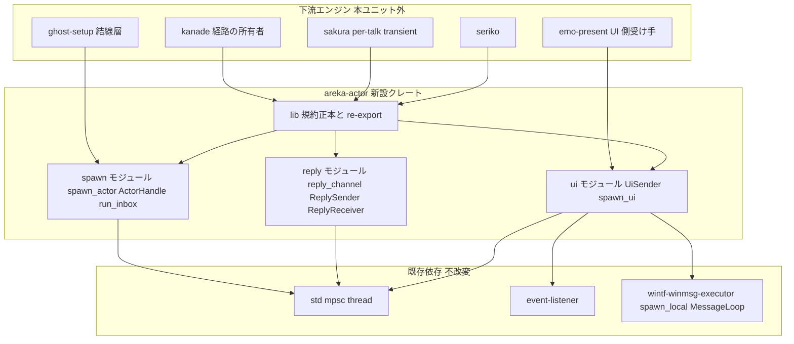
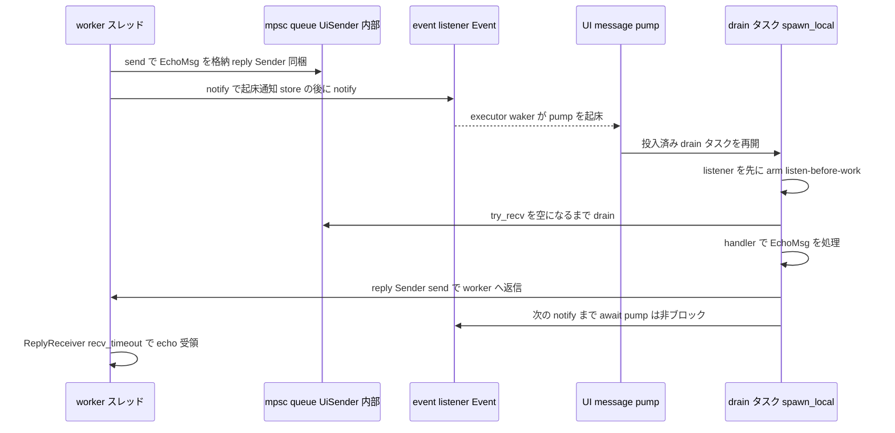
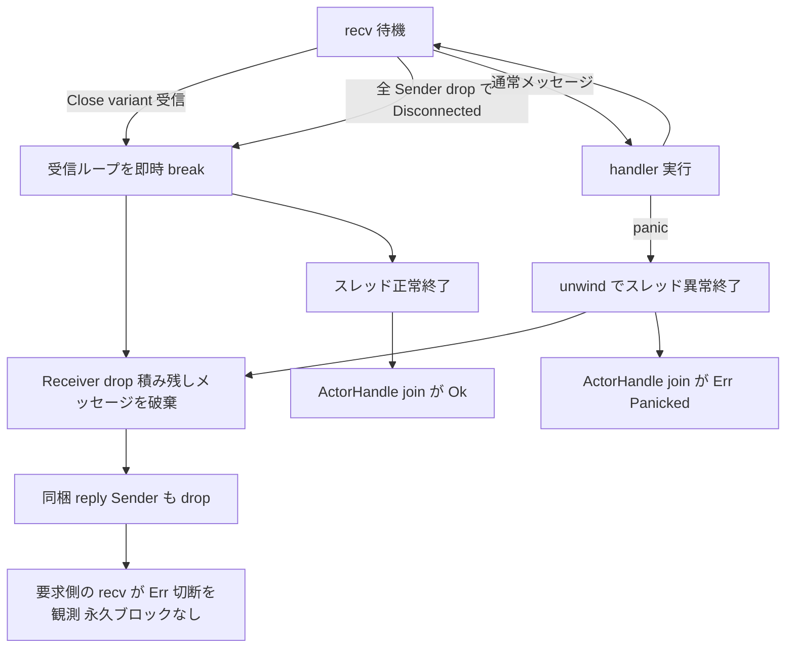

# 技術設計書 — areka-P0-actor-foundation

## Overview

**Purpose**: 本機能は、areka の全エンジン（kanade / sakura / seriko / emo / ghost-setup 等）が同じ原語で会話するための**最小アクター基盤**を、新設独立クレート `areka-actor` として提供する。提供物は「規約（クレート rustdoc に明文化）＋薄いヘルパ（spawn/join・request/reply・受信ループ）＋UI 配送ブリッジ（queue＋wakeup）」の 3 点に限定し、共通トレイトによる actor framework 化は行わない。

**Users**: 下流エンジンユニットの実装者が利用する。kanade（イベント循環＝最大消費者）・sakura（per-talk transient spawn）・seriko（emo への毎フレーム駆動）・emo-present（UI 配送ブリッジの受け手）・ghost-setup（結線層＝spawn/join の呼び出し側）が、各自のメッセージ enum（`XxxMsg`）を本基盤の規約に載せて相互通信する。

**Impact**: 新設クレートの追加のみ。既存クレート（wintf / areka / dola / shiori-host32-* 等）への変更は**ゼロ**。workspace members は `crates/*` glob のためルート `Cargo.toml` も不変。既存エンジンの実アクター化は本ユニットでは行わない。

### Goals
- アクター spawn/join の原語（名前付きスレッド・`Sender`＋JoinHandle 返却・panic の join 時観測・軽量 spawn）
- inbox／request/reply／停止（Close＝即時停止・積み残し破棄・reply Sender drop＝切断シグナル）の規約と薄いヘルパ
- UI スレッド（message pump）への配送ブリッジ（queue＋wakeup・pump 非ブロック・起床ごと drain）
- backpressure／大型データ手渡し規約の明文化（クレート rustdoc＝規約正本）
- toy アクター試験 (a)(b) による単一 pass/fail 観測

### Non-Goals
- 各エンジンの実アクター化（kanade/sakura/seriko/emo 各ユニットの領分）
- I/O 契約 4 クラスタ（撫で／選択肢／二人立ち／移動）のメッセージ型の中身定義（本基盤は器のみ）
- crossbeam-channel 導入・select／MPMC／有界キュー（実需まで凍結・新規依存＝開発者承認要）
- 監督ツリー・再起動戦略（M2 以降・実需駆動）
- async runtime（tokio 禁止）・tracing Subscriber の初期化（アプリ層の責務）
- wintf 本体の改修（本ユニットは wintf のコードに一切触れない）

## Boundary Commitments

### This Spec Owns
- クレート `crates/areka-actor/` の全体（規約正本＝`lib.rs` rustdoc・`spawn`/`reply`/`ui` の 3 モジュール・toy 試験 2 本）
- envelope 規約の**器**: `ReplySender`/`ReplyReceiver`・`ActorHandle`・`UiSender` の具体型と、メッセージ enum（`XxxMsg` 命名・Close variant 内包・Send 所有データ）の形状規約
- 停止規約の意味論: Close＝即時停止（積み残し破棄）・全 Sender drop＝正常終了・切断は reply Sender drop（`Err`）で要求側へ伝わる

### Out of Boundary
- 各エンジンのメッセージ enum の中身（各消費者ユニットが所有・I/O 契約 4 クラスタ含む）
- 結線・lifecycle（どの actor を起こしどの channel を繋ぎいつ join するか）＝ ghost-setup の領分
- 実行時経路（誰が誰へ何を流すかの運行表）＝ kanade の領分
- wintf の pump／tick／クリック透過等の既存実装（参照のみ・不改変）
- host-32 のプロセス跨ぎ IPC（WM_COPYDATA・完了済み別基盤・天然のアクター境界として本基盤と矛盾しないことのみ確認）

### Allowed Dependencies
- `std`（`std::sync::mpsc`＋`std::thread` が唯一のチャンネル／スレッド実装）
- `tracing`・`thiserror`（全クレート共通規約・既存 workspace 依存）
- `event-listener` (5)・`wintf-winmsg-executor` (=0.0.5)：**`ui` モジュールのみ**が使用（既存 workspace 依存・i686 ビルド実証済み・非 wintf クレートからの直接依存は `shiori-host32-host` が本番前例）
- dev-dependencies のみ: `windows`（toy 試験(b) の heartbeat 用 `PostThreadMessageW` 等・本体依存にはしない）
- **禁止**: tokio・crossbeam-channel（凍結・導入時は開発者承認）・bevy_*・wintf 本体・その他新規 crates.io 依存

### Revalidation Triggers
- `spawn_actor`/`ActorHandle`/`ReplySender`/`UiSender` の公開シグネチャ変更 → 全下流エンジンユニットの再確認
- Close 意味論（即時停止・破棄）の変更 → 要件 R3 の再交渉（要件フェーズ差し戻し）
- `ui` モジュールの起床方式変更（event-listener 以外へ） → emo-present／wintf pump 統合の再検証
- チャンネル実装の差し替え（std mpsc → crossbeam 等） → 開発者承認＋全消費者の再テスト

## Architecture

### Existing Architecture Analysis
本ユニットは新技術の導入ではなく、wintf に散在する実証済みパターンの「エンジン非依存な規約化・最小ヘルパ化」である。再利用する既存パターン:

- **名前付き spawn＋join**: `VsyncEventBridge`（`crates/wintf/src/runtime/tick_bridge.rs`）・`CursorMonitorBridge`（`ecs/clickthrough/monitor.rs`）が `thread::Builder::new().name(..)`＋`JoinHandle` 保持＋`join().is_err()` による panic 観測を実証済み。
- **queue＋wakeup＋pump 内 drain**: `ClickThroughController::start`／`run_click_through`（`ecs/clickthrough/controller.rs`）が「worker スレッド → `event_listener::Event::notify` → `spawn_local` async ループが listen-before-work で処理」の完成形。`WintfTaskPool`（`ecs/widget/bitmap_source/task_pool.rs`）が std mpsc queue＋drain の本番採用例。
- **bounded pump 試験**: `ParentMessageWindow::pump_until_hello_or`（`crates/shiori-host32-host/src/parent_window.rs`）が「別スレッド heartbeat（`WM_NULL` 送出）＋deadline 再評価＋`msg_loop.quit()`」で `MessageLoop::run` を決定的に bounded 化する前例＝toy 試験(b) の写経元。
- **store→notify 順序不変**・**listen-before-work 規律**: monitor.rs／tick_bridge.rs に明文化済み。本基盤の送信（queue→notify）と drain ループはこの規律を継承する。

**discovery による精緻化（gap 分析からの更新）**: gap 分析は「UI ブリッジは wintf 依存が不可避」としたが、コード精査の結果、搬送機構そのものは `wintf_winmsg_executor::spawn_local`＋`event_listener::Event`＋`std::sync::mpsc` で完結し、**wintf 本体（World/ECS）への依存は不要**である（`run_click_through` が World を触るのは clickthrough 固有の消費部分）。executor のクロススレッド waker が notify 時に pump を起こすため、追加の `PostMessage` 経路も不要。非 wintf クレートが `wintf-winmsg-executor`＋`event-listener` に直接依存して pump を回す構成は `shiori-host32-host` が本番実証済み。よって **wintf は不改変のまま**、UI ブリッジを新設クレート内に置ける。areka の `WinApp::run` は同じ executor の `MessageLoopDriver::block_on` で pump を駆動するため、本ブリッジで spawn したタスクはその**同一 pump 上で実行**される（4.4 の整合性保証）。

### Architecture Pattern & Boundary Map



**Architecture Integration**:
- **選定パターン**: 「規約＋薄いヘルパ＋ブリッジ」。actor framework（共通 `Actor` トレイト・`Envelope<T>` ジェネリック・監督ツリー）は作らない（7.1）。
- **二層構造＝モジュール境界**: 純粋層（`spawn`/`reply`＝std のみ・決定的単体テスト可）と UI ブリッジ層（`ui`＝event-listener＋executor 依存）を同一クレート内のモジュールで分離する。依存方向は `lib`（規約・re-export）→ { `spawn`, `reply`, `ui` } → 外部依存、の一方向のみ。**`ui` は `spawn`/`reply` に依存しない**（両者は消費者のメッセージ enum の中で合流する＝reply Sender をメッセージに同梱して UI へ送る、等）。この依存方向の違反は実装・レビューでエラーとして扱う。
- **既存パターン保存**: store→notify 順序・listen-before-work・名前付きスレッド・thiserror 構造化エラー・tracing 規約（logging.md）。
- **新規コンポーネントの根拠**: request/reply（oneshot 相当の同梱規約）と「Close＝即時停止」の停止規約は既存コードに再利用可能な形で存在しない＝本ユニットの新規核。UI ブリッジは clickthrough の実証構造から World 依存を除いた一般化。
- **steering 準拠**: Rust 2024・tokio 禁止・新規依存ゼロ・UI スレッド MTA／render 固定／D2D 単一スレッド前提を破らない（ブリッジは pump をブロックせず、UI 側処理は既存 pump タスクと同じ協調実行）。

### 設計判断（research.md §5 DD-1〜DD-8 の解決）

| DD | 決定 | 根拠（要点） |
|----|------|-------------|
| DD-1 | 純粋層は**新設独立クレート `areka-actor`**（Option B 系） | kanade が直後の先行依存＝2 例目が即来る（Option C の抽出コストを近い将来必ず払う）。`areka-parsers`（parser-foundation）と同型の「⓪ ghost 帰属の横断基盤＝最小依存独立クレート」。非 UI エンジン（kanade/sakura）を wintf に引きずらせない |
| DD-2 | UI ブリッジも**同クレートの `ui` モジュール**。wintf 本体は不改変 | 必須依存は `wintf-winmsg-executor`＋`event-listener` の 2 つで足りる（World 不要＝discovery 精緻化）。非 wintf クレートからの executor 直接依存は `shiori-host32-host` が本番前例。i686 も両依存とも実証済み。二層分離はクレート分割でなくモジュール境界＋依存規律で担保（クレート 2 個新設は過剰） |
| DD-3 | 具体型（`ReplySender`/`ReplyReceiver`/`ActorHandle`/`UiSender`）は基盤が所有。メッセージ enum `XxxMsg` と Close variant は**各消費者が所有**（形状規約は lib.rs rustdoc に明文） | 共通トレイト・`Envelope<T>` ラッパは 1 例目しか根拠がなく 7.1/7.2 違反。std mpsc の `Sender<XxxMsg>` をそのまま返し、規約は文書＋toy 試験の実例で拘束する |
| DD-4 | oneshot 相当＝**per-request `std::sync::mpsc::channel()` を薄い newtype で包む**（`ReplySender::send(self, T)`＝consume で 1 回送信を型で強制） | std のみで依存ゼロ。drop 意味論がそのまま切断シグナル（3.6）。自作 oneshot（Mutex+Condvar/unsafe）はコード増に見合う利得なし。newtype が将来の実装差し替えシーム（5.3 と同型） |
| DD-5 | toy 試験(b)＝**`crates/areka-actor/tests/toy_ui_pump_test.rs`（integration test・独立プロセス）で bounded pump**。`MessageLoop::run` を `pump_until_hello_or` 方式（別スレッド heartbeat＋deadline 再評価＋完了フラグ→quit）で bounded 化 | 機械 pass/fail（8.2/8.3）を CI 可能な cargo test で満たす。`MessageLoop`＝wintf `WinApp::run` が駆動するのと同一の pump 機構ゆえ「wintf の pump 上」の実走検証に相当。example（手動検証）は pass/fail 要件を満たさないため棄却 |
| DD-6 | 解決済み（要件反映済み）: Close＝即時停止・積み残し破棄・reply drop＝切断観測（3.3/3.6） | 2026-07-03 要件ディスカッション #1 確定（設計は本意味論を実装形に落とすのみ） |
| DD-7 | spawn 返却は**素のタプル `(mpsc::Sender<M>, ActorHandle)`**。`ActorHandle` は JoinHandle＋アクター名の薄い newtype で**非 RAII**（drop で join しない） | 1.1 の字義（Sender と JoinHandle を返す）を最小表面で満たす。drop-join RAII は Close 送信権限（Sender）を handle が持たないためデッドロック源になり得る＝停止駆動は結線層（ghost-setup）が「Close 送信→join」の順で明示的に行う規約。RAII 束ねが欲しい消費者は上に自作（実需 2 例目まで基盤は作らない） |
| DD-8 | panic 伝搬＝`ActorHandle::join(self) -> Result<(), ActorError>` が `std::thread::Result` の `Err` を **thiserror 構造化エラー（アクター名＋panic payload 文字列）へ写像** | 1.3「join 時に観測可能な失敗」を最小＋診断可能な形で満たす。生の `Box<dyn Any>` を返すよりログ・上位伝搬（結線層）に扱いやすい。監督・再起動はしない（7.2） |

### Technology Stack

| Layer | Choice / Version | Role in Feature | Notes |
|-------|------------------|-----------------|-------|
| チャンネル / スレッド | `std::sync::mpsc`＋`std::thread`（std） | inbox・reply・UI queue・アクタースレッドの唯一の実装 | unbounded＝5.1 の既定。`WintfTaskPool` の本番前例 |
| 起床通知 | `event-listener` 5（既存 workspace 依存） | worker→UI pump の wakeup（`ui` モジュールのみ） | `VsyncEventBridge`/clickthrough と同一資産（4.4） |
| UI スレッド async / pump | `wintf-winmsg-executor` =0.0.5（既存 workspace 依存・完全 pin） | `spawn_local`（drain タスク投入）・`MessageLoop::run`（toy(b) の pump 実走） | wintf `WinApp` が駆動する pump と同一機構。i686 実証済み |
| ロギング | `tracing`（既存 workspace 依存） | span にアクター名（＝スレッド名）を載せる（6.1）。Subscriber 初期化はしない（6.2） | logging.md 準拠 |
| エラー | `thiserror` 2（既存 workspace 依存） | `ActorError`/`ReplyError`/`UiSendError` の構造化 enum | tech.md 全クレート共通規約 |
| テスト補助 | `windows`（dev-dependencies のみ） | toy(b) heartbeat（`PostThreadMessageW(WM_NULL)`・`GetCurrentThreadId`） | 本体依存にしない |

新規 crates.io 依存: **なし**（全て既存 workspace 依存の参照追加のみ）。

## File Structure Plan

```
crates/areka-actor/
├── Cargo.toml               # deps: tracing, thiserror, event-listener, wintf-winmsg-executor / dev-deps: windows
├── src/
│   ├── lib.rs               # 規約正本（envelope/XxxMsg/Close/backpressure/大型データ/拡張シーム）を crate rustdoc に明文化＋ re-export のみ。ロジックなし
│   ├── spawn.rs             # spawn_actor / ActorHandle / ActorError / run_inbox（worker 側受信ループヘルパ）＋ in-source 単体テスト
│   ├── reply.rs             # reply_channel / ReplySender / ReplyReceiver / ReplyError（oneshot 相当）＋ in-source 単体テスト
│   └── ui.rs                # UiSender / spawn_ui（queue＋wakeup＋pump 内 drain）/ UiSendError ＋ in-source 単体テスト（pump 非依存の同期部分のみ）
└── tests/
    ├── toy_worker_test.rs   # toy(a): worker⇄worker request/reply・Close→join 決定的完走・積み残し破棄→reply Err・全 Sender drop 終了・panic join 観測
    └── toy_ui_pump_test.rs  # toy(b): worker→UI（MessageLoop 実走）echo・bounded pump（heartbeat＋deadline）・独立プロセス（integration test バイナリ）
```

### Modified Files
- **なし**。ルート `Cargo.toml` は members glob `crates/*` により自動包含。wintf・既存クレートは不改変（7.3 の構造的保証）。

> 各ファイルの責務は 1 つ。`lib.rs` は規約文書＋re-export に限定し、実装を持たない（規約の所在を一意にする）。

## System Flows

### UI 配送ブリッジ: worker→UI pump への echo（toy(b) の正常経路）



**フロー上の決定**: (1) 送信側は「queue へ格納→notify」の順序固定（store→notify 規律・monitor.rs 継承）。(2) drain 側は「listener arm→drain→await」の listen-before-work 規律（tick_bridge.rs 継承）。両規律の組で notify 取りこぼしが構造的に起きない。(3) drain は `try_recv` ループで**同期実行**され await を跨がない＝pump をブロックせず、1 起床で積滞を全量処理する（4.2/4.3）。

### 停止の全経路（worker アクター）



**フロー上の決定**: Close は「即時停止」＝積み残しを処理しない（3.3）。破棄は `Receiver` の drop に委ね、std mpsc の drop 意味論により「同梱 reply Sender の drop→要求側の `Err` 観測」（3.6）が**追加コードなしで**成立する。graceful 停止（積み残し処理後の停止）は送信側が「後続なしを確認して Close を送る」運用で原語の上に構築する（基盤は関与しない）。UI アクター（`spawn_ui`）も同一の意味論（Break→タスク return→Receiver drop）。

## Requirements Traceability

| Requirement | Summary | Components | Interfaces | Flows |
|-------------|---------|------------|------------|-------|
| 1.1 | spawn が Sender＋JoinHandle を返す | spawn | `spawn_actor` | — |
| 1.2 | アクター名＝スレッド名 | spawn | `spawn_actor`（`thread::Builder::name`） | — |
| 1.3 | panic を join で観測 | spawn | `ActorHandle::join` → `ActorError::Panicked` | 停止経路図 |
| 1.4 | 軽量 spawn/停止/join（per-talk transient 耐性） | spawn | `spawn_actor`（素の `std::thread`・常駐機構なし） | toy(a) |
| 1.5 | アクターごと単一 inbox 構造の規約 | conventions＋spawn | `mpsc::Receiver<M>` を body が単独所有 | — |
| 2.1 | 単一受信端・`XxxMsg` enum 規約 | conventions | rustdoc 規約＋toy 試験の実例 | — |
| 2.2 | reply Sender 同梱（oneshot 相当） | reply | `reply_channel`/`ReplySender`/`ReplyReceiver` | echo シーケンス |
| 2.3 | 応答が送信側に届く保証 | reply | `ReplySender::send`→`ReplyReceiver::recv` | echo シーケンス・toy(a) |
| 2.4 | メッセージ＝Send な所有データ規約 | conventions＋spawn/ui | `M: Send + 'static` 境界（型で強制） | — |
| 2.5 | 大型データの Arc 手渡し規約 | conventions | rustdoc 明文（`Arc<T>`/`Arc<[u8]>` フィールド） | — |
| 3.1 | 各 enum に Close variant を含める規約 | conventions | rustdoc 明文＋toy 試験の実例 | 停止経路図 |
| 3.2 | Close で受信ループ終了 | spawn／ui | `run_inbox`/`spawn_ui`（handler の `ControlFlow::Break`） | 停止経路図 |
| 3.3 | 積み残し破棄＝即時停止に固定 | conventions＋spawn/ui | Break 後 Receiver drop（破棄） | 停止経路図 |
| 3.4 | 停止・join の決定的完了 | spawn | `ActorHandle::join`（body 終了で必ず復帰） | toy(a) |
| 3.5 | 全 Sender drop で正常終了 | spawn／ui | `run_inbox`/`spawn_ui`（Disconnected で終了） | 停止経路図 |
| 3.6 | 未処理 reply の drop→要求側 Err 観測 | reply＋spawn/ui | `ReplyReceiver::recv` が `Err(ReplyError::Dropped)` | 停止経路図・toy(a) |
| 4.1 | UI アクターへの配送ブリッジ提供 | ui | `spawn_ui`/`UiSender` | echo シーケンス |
| 4.2 | pump 非ブロック・queue 積み＋起床 | ui | `UiSender::send`（unbounded send→notify・ブロックなし） | echo シーケンス |
| 4.3 | 起床ごと UI 側 drain | ui | drain ループ（listen→try_recv 全量→await） | echo シーケンス |
| 4.4 | MTA/render 固定/D2D 単一維持・既存起床資産と整合 | ui | `event_listener::Event`＋`wintf_winmsg_executor::spawn_local`（既存資産そのもの・スレッド構成不変） | echo シーケンス |
| 4.5 | emo-present／窓移動指令の将来搬送路 | ui | `UiSender<M>` が任意の `M: Send` を搬送（型は下流定義） | — |
| 5.1 | 制御経路 unbounded 明文化 | conventions | rustdoc 明文（std mpsc unbounded・低レート前提） | — |
| 5.2 | 毎フレーム大量データを channel に流さない規約 | conventions | rustdoc 明文（共有バッファ/Arc 手渡し） | — |
| 5.3 | select/MPMC/有界の拡張シーム（導入しない） | conventions | rustdoc 明文（newtype 内実装差し替え・crossbeam は要承認） | — |
| 6.1 | span にスレッド名・アクター名 | spawn／ui | `info_span!("actor", actor = name)`（スレッド名＝アクター名） | — |
| 6.2 | Subscriber 初期化しない | クレート全体 | 依存に tracing-subscriber を含めない（構造的保証） | — |
| 7.1 | 規約＋薄いヘルパ＋ブリッジに限定 | クレート全体 | 公開 API は本書 Components 節の型・関数のみ | — |
| 7.2 | 抽象は 2 例目まで見送り | クレート全体 | 公開トレイト 0・監督/再起動/select なし（設計制約） | — |
| 7.3 | 既存エンジンの実アクター化を含めない | クレート全体 | Modified Files なし（構造的保証） | — |
| 8.1 | toy(a): request/reply＋Close→join 完走 | toy tests | `tests/toy_worker_test.rs`（`cargo test -p areka-actor`） | toy(a) |
| 8.2 | toy(b): worker→UI pump 実走 echo | toy tests | `tests/toy_ui_pump_test.rs`（bounded pump） | echo シーケンス |
| 8.3 | 失敗を fail として観測 | toy tests | deadline 超過/応答不一致/切断で assert 失敗 | — |

## Components and Interfaces

| Component | Domain/Layer | Intent | Req Coverage | Key Dependencies (P0/P1) | Contracts |
|-----------|--------------|--------|--------------|--------------------------|-----------|
| conventions（lib.rs） | 規約層 | envelope/停止/流量規約の正本（rustdoc）＋re-export | 1.5, 2.1, 2.4, 2.5, 3.1, 3.3, 5.1, 5.2, 5.3, 7.1 | なし | State |
| spawn | 純粋層（std のみ） | 名前付きアクター spawn/join・panic 観測・受信ループヘルパ | 1.1–1.5, 3.2, 3.4, 3.5, 6.1 | std::thread（P0）・tracing（P2） | Service |
| reply | 純粋層（std のみ） | request/reply（oneshot 相当）・切断観測 | 2.2, 2.3, 3.6 | std::sync::mpsc（P0） | Service |
| ui | UI ブリッジ層 | worker→UI pump の queue＋wakeup 配送・pump 内 drain | 4.1–4.5, 3.2, 3.3, 3.5 | event-listener（P0）・wintf-winmsg-executor（P0） | Service, Event |
| toy tests | 観測層（tests/） | 基盤原語の単一 pass/fail 検証 | 8.1, 8.2, 8.3 | windows（dev・P1） | Batch |

### 規約層

#### conventions（lib.rs）

| Field | Detail |
|-------|--------|
| Intent | 規約正本（クレート rustdoc）と公開面の re-export。実装ロジックを持たない |
| Requirements | 1.5, 2.1, 2.4, 2.5, 3.1, 3.3, 5.1, 5.2, 5.3, 7.1 |

**Responsibilities & Constraints**
- crate-level rustdoc に以下の規約を**規範文で明文化**する:
  1. **inbox 規約**（1.5/2.1）: アクター 1 個につき受信端は `mpsc::Receiver<XxxMsg>` を 1 本のみ。メッセージはアクターごとの enum 型（命名 `XxxMsg`）。
  2. **envelope 規約**（2.2/2.4/2.5）: request/reply が要る variant は `ReplySender<T>` をフィールドに同梱。メッセージは `Send + 'static` な所有データ（借用を跨がせない・型境界で強制）。大型データ（画素バッファ等）はコピーせず `Arc<T>`／`Arc<[u8]>` フィールドで手渡す。
  3. **停止規約**（3.1/3.3）: 各 `XxxMsg` に横断制御の Close variant を必ず含める。Close＝**即時停止**（受信ループを直ちに抜け、積み残しは破棄）。graceful 停止は送信側が「後続なし確認→Close 送信」で原語の上に構築する。
  4. **流量規約**（5.1/5.2）: 制御メッセージ経路は unbounded（低レート前提）。毎フレーム大量データは channel に流さない（共有バッファ／`Arc` 手渡し）。
  5. **拡張シーム**（5.3）: select／MPMC／有界キューが実需（2 例目）になったら crossbeam-channel 等を**開発者承認の上で** newtype（`ReplySender` 等）の内部実装差し替えとして導入する。本ユニットでは導入しない。
- 公開 re-export: `spawn_actor`, `run_inbox`, `ActorHandle`, `ActorError`, `reply_channel`, `ReplySender`, `ReplyReceiver`, `ReplyError`, `spawn_ui`, `UiSender`, `UiSendError`。**これ以外の公開面を持たない**（7.1）。

**Implementation Notes**
- Integration: 規約は toy 試験 2 本が「動く実例」として拘束力を補強する（規約文＋リファレンス実装）。
- Validation: 公開面の追加・公開トレイト導入はレビューで 7.1/7.2 違反として却下する。
- Risks: 文書のみで型強制されない規約（2.5/5.2 等）は toy 試験・下流レビューで担保する（過剰な型仕掛けはフレームワーク化＝7.1 違反側に倒れるため意図的に文書へ留める）。

### 純粋層（std のみ・wintf/executor 非依存）

#### spawn

| Field | Detail |
|-------|--------|
| Intent | 名前付きスレッドとしてアクターを起動し、inbox Sender と join ハンドルを返す原語＋worker 側受信ループヘルパ |
| Requirements | 1.1, 1.2, 1.3, 1.4, 1.5, 3.2, 3.4, 3.5, 6.1 |

**Responsibilities & Constraints**
- `std::thread::Builder::new().name(name)` による spawn（1.2）。スレッド body は `tracing::info_span!("actor", actor = %name)` に入れて実行し、span にアクター名を載せる（スレッド名＝アクター名・6.1）。
- inbox は spawn 内部で `mpsc::channel()` を生成し、`Receiver` を body へ move（body が単独所有＝1.5 の構造保証）、`Sender` を呼び出し側へ返す（1.1）。
- 追加の常駐機構（レジストリ・監督・stop_flag）を持たない素の thread spawn＝per-talk transient の軽量性（1.4）。停止はメッセージ Close／全 Sender drop の 2 経路が原語（3.2/3.5）。
- `run_inbox` は「Break で即時終了・Disconnected で正常終了」の正準受信ループ形。使用は任意（`recv_timeout` で周期 tick したいアクターは自前ループを書いてよい・rustdoc に明記）。

**Dependencies**
- Outbound: `std::thread`／`std::sync::mpsc` — スレッドとチャンネルの実体（P0）
- External: `tracing` — span（P2）・`thiserror` — エラー型（P2）

**Contracts**: Service [x]

##### Service Interface

```rust
/// アクターを名前付きスレッドとして起動し、inbox の送信端と join ハンドルを返す。
pub fn spawn_actor<M, F>(name: &str, body: F) -> (std::sync::mpsc::Sender<M>, ActorHandle)
where
    M: Send + 'static,
    F: FnOnce(std::sync::mpsc::Receiver<M>) + Send + 'static;

/// 正準受信ループ: Ok(msg) → handler。Break で即時 return（積み残しは Receiver drop で破棄）。
/// 全 Sender drop（Disconnected）でも return（正常終了）。
pub fn run_inbox<M>(
    rx: std::sync::mpsc::Receiver<M>,
    handler: impl FnMut(M) -> std::ops::ControlFlow<()>,
);

/// アクタースレッドの join ハンドル（非 RAII・drop しても join しない＝detach）。
pub struct ActorHandle { /* name: Box<str>, handle: std::thread::JoinHandle<()> */ }
impl ActorHandle {
    pub fn name(&self) -> &str;
    /// body 正常終了で Ok。panic は ActorError::Panicked（アクター名＋payload 文字列）へ写像。
    pub fn join(self) -> Result<(), ActorError>;
    pub fn is_finished(&self) -> bool;
}

#[derive(Debug, thiserror::Error)]
pub enum ActorError {
    #[error("actor '{actor}' panicked: {message}")]
    Panicked { actor: String, message: String },
}
```

- Preconditions: `spawn_actor` は任意スレッドから呼べる。`join` は body の終了（Close 送信済み／全 Sender drop／panic）を停止駆動側（結線層）が引き起こした後に呼ぶ（**Sender を握ったまま Close も送らず join するとデッドロックし得る**＝rustdoc に明記する運用規約）。
- Postconditions: spawn 成功で名前付きスレッドが稼働し inbox が開通。`join` は body 終了後に必ず復帰する（3.4・OS thread join の決定性）。panic は握り潰されず `Err` で観測される（1.3）。
- Invariants: `Receiver` は body が単独所有（inbox 1 本・1.5）。`ActorHandle::drop` は detach（join しない）。

**Implementation Notes**
- Integration: `VsyncEventBridge`/`CursorMonitorBridge` の named-spawn パターンの一般化（stop_flag は不採用＝停止はメッセージ原語に一本化）。
- Validation: in-source 単体テスト（スレッド名付与・join Ok/Err・run_inbox の Break/Disconnected 終了）＋toy(a)。
- Risks: `Builder::spawn` の OS 失敗（リソース枯渇）は既存 wintf 資産と同じく **panic（expect）で統一**（スレッド起動不能はプロセス継続不能級・rustdoc に明記）。

#### reply

| Field | Detail |
|-------|--------|
| Intent | メッセージに同梱する返信端（oneshot 相当）。応答 1 回・切断は Err で観測 |
| Requirements | 2.2, 2.3, 3.6 |

**Responsibilities & Constraints**
- per-request に `mpsc::channel()` を生成し newtype 対で包んで返す。`ReplySender::send(self, T)` が self を consume することで「応答は 1 回」を型で強制する（2.2 の oneshot 相当）。
- `ReplySender` が未使用のまま drop される（アクター停止時の積み残しメッセージ drop・明示キャンセル）と、`recv` は `Err(ReplyError::Dropped)` を返す＝切断の自己シグナル（3.6・std mpsc の drop 意味論をそのまま利用し追加機構を持たない）。

**Dependencies**
- Outbound: `std::sync::mpsc` — 実体（P0）。External: `thiserror`（P2）

**Contracts**: Service [x]

##### Service Interface

```rust
/// request/reply 用の返信チャンネル対を生成する（oneshot 相当・per-request）。
pub fn reply_channel<T: Send>() -> (ReplySender<T>, ReplyReceiver<T>);

pub struct ReplySender<T>(/* mpsc::Sender<T> */);
impl<T: Send> ReplySender<T> {
    /// 応答を 1 回だけ送る（self consume）。受信側が既に drop 済みなら Err(value)。
    pub fn send(self, value: T) -> Result<(), T>;
}

pub struct ReplyReceiver<T>(/* mpsc::Receiver<T> */);
impl<T: Send> ReplyReceiver<T> {
    /// 応答を待つ。ReplySender が応答せず drop されたら Err(Dropped)（永久ブロックしない）。
    pub fn recv(self) -> Result<T, ReplyError>;
    /// 上限時間付き待機。Timeout / Dropped を区別して返す。
    pub fn recv_timeout(self, timeout: std::time::Duration) -> Result<T, ReplyError>;
}

#[derive(Debug, thiserror::Error)]
pub enum ReplyError {
    #[error("reply sender dropped (actor stopped or request cancelled)")]
    Dropped,
    #[error("reply not received within timeout")]
    Timeout,
}
```

- Preconditions: なし（任意スレッド間で使用可・`T: Send`）。
- Postconditions: 応答が送られれば受信側は必ずそれを受け取れる（2.3・mpsc の配送保証）。送られず Sender が drop されれば `Err(Dropped)`（3.6・要求側は切断として観測し永久ブロックしない）。
- Invariants: 送信・受信とも高々 1 回（consume で型強制）。

**Implementation Notes**
- Integration: 消費者はメッセージ enum の variant に `reply: ReplySender<T>` フィールドとして同梱する（規約は conventions・実例は toy 試験）。
- Validation: in-source 単体テスト（send→recv 往復・Sender drop→Dropped・timeout→Timeout）。
- Risks: mpsc channel の per-request 生成コストは制御メッセージレート（低頻度）では無視できる。毎フレーム経路には使わない（5.2 で規約側から禁止）。

### UI ブリッジ層（event-listener＋wintf-winmsg-executor 依存・wintf 本体非依存）

#### ui

| Field | Detail |
|-------|--------|
| Intent | message pump 上で動く UI アクターへ、他スレッドから queue＋wakeup でメッセージを届け、pump 内で drain させる配送ブリッジ |
| Requirements | 4.1, 4.2, 4.3, 4.4, 4.5, 3.2, 3.3, 3.5 |

**Responsibilities & Constraints**
- `spawn_ui` は **UI スレッド（pump を回すスレッド）上で**呼び、`wintf_winmsg_executor::spawn_local` で drain タスクを投入する（4.1。実行は pump＝`MessageLoop::run`／wintf `WinApp::run` の `block_on` に委ねる）。
- `UiSender<M>` は Clone かつ Send。`send` は「`mpsc::Sender::send`（queue 格納）→ `Event::notify(usize::MAX)`」の順序固定（store→notify 規律）。unbounded ゆえ**送信は決してブロックせず、UI pump もブロックさせない**（4.2）。notify は executor のクロススレッド waker を介して pump を起床する（`VsyncEventBridge`→`AsyncTickTask` で実証済みの経路・4.4）。
- drain タスクは listen-before-work 規律のループ: `listener = event.listen()` を arm → `try_recv` で**空になるまで**同期 drain（各メッセージを handler へ）→ `listener.await`（4.3）。handler 実行は await を跨がない（UI スレッド束縛リソースを安全に扱える）。
- 終了は 2 経路: handler が `ControlFlow::Break` を返す（消費者定義の Close variant 受領時・3.2）→ 即時 return（残 queue を読まずに抜け、タスク所有 `Receiver` の drop で積み残し破棄＝3.3・同梱 reply Sender drop で要求側は切断を観測＝3.6 の UI 側成立）。または `try_recv` が `Disconnected`（全 `UiSender` drop・3.5）→ return。
- スレッド構成を一切変えない: 新スレッドを作らず、UI スレッドの MTA・render/window 固定・D2D 単一スレッド前提は不変（4.4）。搬送する `M` は任意の `Send + 'static`＝emo-present の指令メッセージ・窓移動指令の型を下流がそのまま載せられる（4.5・器のみ提供）。

**Dependencies**
- Outbound: `std::sync::mpsc` — queue 実体（P0）
- External: `event-listener` — wakeup（P0）／`wintf-winmsg-executor` — `spawn_local`・`JoinHandle`（P0・=0.0.5 pin・i686 実証済み）

**Contracts**: Service [x] / Event [x]

##### Service Interface

```rust
/// UI スレッド上で UI アクター（pump 内 drain ループ）を起動する。
/// 必ず pump を回す UI スレッドから呼ぶこと（spawn_local の前提・rustdoc 明記）。
pub fn spawn_ui<M>(
    name: &str,
    handler: impl FnMut(M) -> std::ops::ControlFlow<()> + 'static,
) -> (UiSender<M>, wintf_winmsg_executor::JoinHandle<()>)
where
    M: Send + 'static;

/// UI アクター宛の送信端（Clone・Send・非ブロック）。
pub struct UiSender<M> { /* tx: mpsc::Sender<M>, wake: Arc<event_listener::Event> */ }
impl<M: Send> UiSender<M> {
    /// queue へ積み UI スレッドを起床する（store→notify）。UI アクター停止後は Err。
    pub fn send(&self, msg: M) -> Result<(), UiSendError<M>>;
}

#[derive(Debug, thiserror::Error)]
#[error("UI actor inbox closed (drain task stopped)")]
pub struct UiSendError<M>(pub M); // 未達メッセージを返す（mpsc::SendError と同型）
```

- Preconditions: `spawn_ui` は UI スレッドで呼ぶ。handler は `!Send` 可（UI スレッド束縛リソースを握れる＝emo-present 適合）。
- Postconditions: `send` 成功メッセージは必ず以降の起床の drain で handler に到達する（store→notify＋listen-before-work により取りこぼしなし）。Break/Disconnected 後の `send` は `Err`。
- Invariants: drain は UI スレッド同期実行。`JoinHandle` の drop はタスクを**停止させない**（executor 仕様＝`AsyncTickTask`/relay と同じ self-terminate 規律・rustdoc に明記）。

##### Event Contract
- Published events: なし（本ブリッジはイベントバスではない・点対点の inbox 搬送のみ）。
- Subscribed events: `event_listener::Event`（内部 wakeup 専用・公開 API に露出しない）。
- Ordering / delivery guarantees: 同一 queue 経由のメッセージは FIFO で handler に到達（mpsc 保証）。複数 sender 間の相対順序は保証しない（mpsc 仕様・rustdoc 明記）。pump 非稼働中もメッセージは queue に安全に滞留し、pump 開始後の最初の poll で drain される。

**Implementation Notes**
- Integration: `run_click_through`（clickthrough/controller.rs）の「Event＋spawn_local＋listen-before-work」構造から World 依存を除いた一般化。M-boot では emo-present は直接呼出で開始し、kanade/seriko 結線時に本ブリッジへ channel 化する（brief のクロスユニット契約の seam 実体）。
- Validation: 同期部分（queue 格納・Err 変換）は in-source 単体テスト、pump 実走は toy(b)（integration test）。
- Risks: UI スレッド以外から `spawn_ui` を呼んだ場合の挙動は executor 依存＝rustdoc で禁止し、toy(b) で正用法のみ検証する。

### 観測層（tests/）

#### toy tests

| Field | Detail |
|-------|--------|
| Intent | 基盤原語の健全性を単一 pass/fail で機械検証する（下流の消費開始前ゲート） |
| Requirements | 8.1, 8.2, 8.3 |

**Responsibilities & Constraints**
- **toy(a)** `tests/toy_worker_test.rs`（8.1）: `EchoMsg { Echo { payload, reply: ReplySender<String> }, Close }` の toy アクターで、(i) request/reply の応答一致（2.3）、(ii) Close→join の決定的完走（3.4）、(iii) **Close の後ろに積んだ Echo が破棄され要求側が `Err(Dropped)` を観測**（3.3/3.6 の実証）、(iv) 全 Sender drop で join Ok（3.5）、(v) panic する body の join が `Err(Panicked)`（1.3）を検証。全ケース `recv_timeout` 使用で無限ブロックなし。
- **toy(b)** `tests/toy_ui_pump_test.rs`（8.2）: テストスレッドを UI スレッド役とし、`spawn_ui`（echo handler: Echo→reply.send・Close→Break）→ worker スレッドが `UiSender` で Echo 送信→`ReplyReceiver::recv_timeout` で echo 受領→done フラグ store→Close 送信、という往復を行う。UI スレッド役は `wintf_winmsg_executor::MessageLoop::run` を **bounded pump** で実走する（`pump_until_hello_or` 写経: 別スレッド heartbeat が `PostThreadMessageW(ui_thread_id, WM_NULL)` を約 25ms 間隔で送出し、filter クロージャが「done フラグ or deadline 超過」で `msg_loop.quit()`）。pump 復帰後 `assert!(done)`＝echo 不達・期限超過は fail（8.3）。
- **試験規律**: toy(b) は integration test（独立バイナリ＝独立プロセス）とし、thread-local executor／pump の他テストとの干渉を排す。deadline は CI 余裕込み（例 5 秒）・heartbeat により無入力でもハングしない（bounded 保証）。

**Dependencies**
- External: `windows`（dev・`Win32_UI_WindowsAndMessaging`＋`Win32_System_Threading`＝`PostThreadMessageW`/`WM_NULL`/`GetCurrentThreadId`）（P1）

**Contracts**: Batch [x]

##### Batch / Job Contract
- Trigger: `cargo test -p areka-actor`（CI・ローカル共通）。
- Input / validation: 自己完結（GPU・実窓・管理者権限 不要。HWND 生成なし）。
- Output / destination: テスト exit code（単一 pass/fail・8.3）。
- Idempotency & recovery: 全試験 bounded（timeout/deadline/heartbeat）＝ハングせず決定的に完走・再実行安全。

**Implementation Notes**
- Integration: `parent_window.rs` の bounded pump（heartbeat＋deadline quit）と「単一テストへの集約」規律を写経する。
- Validation: toy 2 本が要件 R8 の観測そのもの。
- Risks: `PostThreadMessageW` は対象スレッドのメッセージキュー生成前に失敗し得る → heartbeat は失敗を無視して送出し続ける（キュー生成後に到達・`pump_until_hello_or` と同様）。万一 thread message（hwnd なし）が executor の `MessageLoop` フィルタへ届かない場合のフォールバックは `parent_window.rs` 同様の message-only 窓＋`PostMessageW`（実装時に一度だけ確認・公開 API 不変の局所差し替え）。
- Risks（三点組合せ未実証・validation Issue 1）: `spawn_local`＋`MessageLoop::run`＋`PostThreadMessageW` の**同時使用は in-repo 前例がない**（host-32 は async タスクなしで pump を回し・pilot は `block_on` を使用）。特に「`MessageLoop::run` 単独で spawn_local タスクが poll されるか」は実装時最初の確認事項。よって **tasks 生成時に「toy(b) 最小 spike（echo 1 本の組合せ確認）」を実装系タスクの先頭に配置する**。spike 不成立時は実証済み組合せへ公開 API 不変で局所差し替え: (a) `block_on`（完了 future 待ち・pilot 前例）または (b) message-only 窓＋`PostMessageW`（`parent_window.rs` 前例）。

## Data Models

### Domain Model（envelope 規約＝データ形状の規範）

本基盤に永続データ・ストレージはない。データモデル＝**メッセージの形状規約**である（正本は lib.rs rustdoc・ここに結論を再掲）:

- **メッセージ enum（`XxxMsg`）**: アクターごとに 1 型。variant＝そのアクターが受ける指令の全集合。**Close variant を必ず含む**（3.1）。型の所有者は各消費者ユニット（基盤は持たない・DD-3）。
- **フィールド規約**: すべて `Send + 'static` な所有データ（2.4・型境界で強制・借用を跨がせない）。request/reply variant は `reply: ReplySender<T>` を同梱（2.2）。大型データは `Arc<T>`／`Arc<[u8]>`（2.5・コピー禁止）。
- **不変条件**: メッセージに `!Send` 型（`Rc`・COM ポインタ等）を含めない（コンパイルエラーで強制）。

```rust
// 規約の実例（toy 試験＝下流のリファレンス形）
enum EchoMsg {
    Echo { payload: String, reply: ReplySender<String> },
    Close,
}
```

### Logical Data Model
該当なし（永続構造・エンティティ関係を持たない）。

### Data Contracts & Integration
- I/O 契約 4 クラスタ（撫で／選択肢／二人立ち／移動）のメッセージ型は、この envelope 規約の上に各クラスタ着手時に定義される（本基盤は器のみ・Out of Boundary）。

## Error Handling

### Error Strategy
「失敗は戻り値・切断は drop 意味論・panic は join で観測」の 3 本立て。エラー型は thiserror 構造化 enum（tech.md 全クレート共通規約）。

### Error Categories and Responses
- **アクター panic**（1.3）: body の unwind はスレッド終了として封じ込め、`ActorHandle::join` が `ActorError::Panicked { actor, message }` で呼び出し側（結線層）へ伝搬する。基盤は再起動しない（7.2）＝方針決定は結線層の領分。panic 時も inbox drop→reply Sender drop により要求側は `Err(Dropped)` を観測（3.6・連鎖ハングなし）。
- **切断（送信先消滅）**: `mpsc::Sender::send`／`UiSender::send` の `Err`（未達メッセージ同梱）。送信側は「相手が停止済み」を同期観測できる。
- **切断（応答消滅）**（3.6）: `ReplyReceiver::recv` の `Err(ReplyError::Dropped)`。要求側は永久ブロックしない。`recv_timeout` で上限時間も併用可能（`Timeout` と区別）。
- **spawn 失敗**: OS リソース枯渇のみ＝プロセス継続不能級として panic（既存 wintf 資産の `expect` と同一方針・rustdoc 明記）。

### Monitoring
- tracing による観測（6.1）: spawn 時 `debug!`（アクター名）・span `actor`（スレッド名＝アクター名）・Close/Disconnected 終了時 `debug!`・panic join 時 `warn!`。Subscriber は初期化しない（6.2・依存に tracing-subscriber を含めないことで構造的に保証）。logging.md のスコーププレフィックス・構造化フィールド規約に従う。

## Testing Strategy

### Unit Tests（in-source `#[cfg(test)]`）
1. `spawn.rs`: spawn がスレッド名＝アクター名を付与し `(Sender, ActorHandle)` を返す（1.1/1.2）／panic body の `join` が `Err(Panicked)` かつアクター名を含む（1.3）／`run_inbox` が Break で即時終了・Disconnected で正常終了（3.2/3.5）。
2. `reply.rs`: send→recv 往復（2.3）／Sender drop→`Err(Dropped)`（3.6）／`recv_timeout` の `Timeout`。
3. `ui.rs`: `UiSender::send` の queue 格納（同期観測部）／drain タスク停止（Receiver drop）後の send が `Err(UiSendError)`。

### Integration Tests（`tests/`・toy アクター試験）
1. `toy_worker_test.rs` = toy(a)（8.1）: request/reply 応答一致＋Close→join 決定的完走＋Close 後続メッセージの破棄→要求側 `Err(Dropped)`（3.3/3.6）＋全 Sender drop 終了（3.5）＋panic join 観測（1.3）。
2. `toy_ui_pump_test.rs` = toy(b)（8.2）: `MessageLoop::run` 実走 pump 上での worker→UI echo 往復（bounded: heartbeat＋deadline・独立プロセス）。
3. 失敗観測（8.3）: 上記全ケースが timeout/deadline を持ち、echo 不達・応答不一致・join ハングは assert 失敗として観測される（無限ブロックする試験を書かない）。

### Performance/Load
- 該当なし（M1 の制御メッセージは低レート前提＝5.1。毎フレーム経路は本基盤の channel に載せない＝5.2。数値目標は下流の実消費ユニットで設定する）。

## Performance & Scalability

- **backpressure 方針**（5.1/5.2・規約正本は lib.rs rustdoc）: 制御メッセージ経路は unbounded std mpsc（低レート前提・send 非ブロック＝UI pump 保護と送信側の単純性を優先）。毎フレーム大量データ（画素バッファ等）は channel に流さず `Arc` 手渡し・共有バッファで受け渡す（emo 系の 1 枚物合成データを想定）。
- **拡張シーム**（5.3）: 有界キュー／select／MPMC の実需（2 例目）が生じた場合、`crossbeam-channel` 等の導入を開発者承認の上で newtype 内部の実装差し替えとして行う（公開 API 不変が目標）。本ユニットでは導入しない。
- **スケール上限の明示**: 想定アクター数は M1 で 10 未満（7 エンジン＋per-talk transient）。per-request mpsc 生成・unbounded queue はこのスケールで測定不要に安全側。
