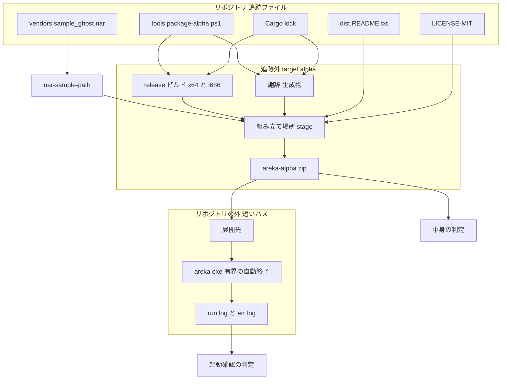
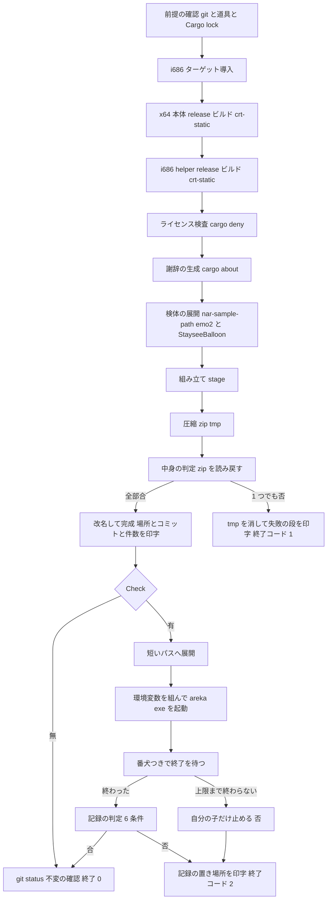

# Technical Design: areka-P0-alpha-package

> 2026-09-26・worktree の HEAD `a8fde786`（main `2f5bd24a` の上に spec の文書だけ）で書き、設計レビュー（`design-validation.md`・HEAD `16d39f86`）の指摘 3 件と細かい点 5 件を設計ディスカッションで反映した。コードの引用は「何を定義している行か」で指し、書く前に今の木で実在を確かめた。設計時に取った実測は `research.md` の「設計時の調べ物」に置き、結論だけをここに写した。

## Overview

**Purpose**: α の配布物（zip）を**組む・確かめる・説明する**道具と文書を用意する。組むのは PowerShell スクリプト 1 本、確かめるのは同じスクリプトの `-Check`、説明するのは第三者向け README 1 本と根の `README.md` の是正である。あわせて `Cargo.lock` の追跡を始め、同じコミットから組んだ zip の依存の版と謝辞が機械によらず同じになるようにする。

**Users**: α の完成宣言を出す開発者（組む・確かめる）と、α を受け取る第三者（README を読む）。下流の `areka-P0-alpha-release-signoff` はこの zip で実機一周をし、README の空欄を仕上げる。

**Impact**: `crates/` の変更は 0。新しい Rust コードは 0、新しい依存は 0。変えるのは `tools/`（新規 1 本）・`dist/`（新規 1 本）・根の `README.md`・`.gitignore`・`Cargo.lock`（追跡開始）・`THIRD-PARTY-NOTICES.md`（生成器で作り直し）・完了と開発の手順の文書 2 本・steering `structure.md` の 1 行。

### Goals

- `pwsh -NoProfile -File tools/package-alpha.ps1` 1 回で、今のソースから同じ中身の zip が `target/alpha/` に出来る。
- `-Check` を付けると、zip をリポジトリの外の短いパスへ展開して起動し、「窓が立ち・SHIORI が生きて・会話が始まり・0 で終わる」を有界の自動終了で判定する。
- zip の中身は決めたものだけで、zip の実物から判定する（印字するだけで済ませない）。
- zip の実行ファイルは Visual C++ 再頒布可能パッケージが無い機械でも起動する。
- 第三者向け README の骨子が在り、同梱物ごとの作者と条件が正しく載る。
- 根の `README.md` のライセンス表記と到達点の数が実物と一致する。
- `Cargo.lock` が追跡され、配布スクリプトは `--locked` で追跡ファイルを 1 つも書き換えない。

### Non-Goals

- 検証項目表と第三者の手順の実機一周・第三者向け README の仕上げ（`.nar` の入れ方を含む）・署名と宣言（`alpha-release-signoff`）。
- 既定ゴーストの差し替え・インストーラ・署名付き exe・自動更新・ARM64 版の zip。
- 常時のテスト（`cargo test --workspace`・`tools/test-all.ps1`）への組み込み。
- `THIRD-PARTY-NOTICES.md` を手で直すこと（直すなら生成器）。
- `pasta` 側の `Cargo.toml` の「MIT OR Apache-2.0」の是正。

## Boundary Commitments

### This Spec Owns

- 配布スクリプト `tools/package-alpha.ps1`（ビルド・展開・組み立て・圧縮・中身の判定・起動確認・判定の目印と較正値）。
- zip の最上位の形と中に入れるものの一覧（下の「zip の中身」）。
- 第三者向け README `dist/README.txt`（骨子・同梱物の条件の文面）。
- 根の `README.md` のライセンス表記・到達点の数・第三者向け README への 1 行の案内。
- `Cargo.lock` の追跡の開始（`.gitignore`・`Cargo.lock`・作り直した `THIRD-PARTY-NOTICES.md` を 1 つの変更で）と、それに伴う完了の手順（`.claude/skills/kiro-complete/SKILL.md`）・開発の手順（`.kiro/steering/workflow.md`）の注記。
- steering `structure.md` の「その他の最上位」への `dist/` の登記 1 行（新しい最上位フォルダを作るため）。

### Out of Boundary

- `crates/` の一切（触る必要が出たら `alpha-release-signoff` へ送る）。起動の解決・自動終了・告知の抑止・記録の行は既存のものをそのまま使う。
- `tools/test-all.ps1`・`vendors/sample_ghost/`・`about.toml`・`about.hbs`・`deny.toml`・根の `Cargo.toml`・`LICENSE-MIT`・`crates/*/README.md` の変更は 0。
- 右クリックメニューの項目の増減（`ghost-shell-balloon-switch` 等）。README のメニューの欄は着地した main に合わせて `alpha-release-signoff` が仕上げる。
- `.nar` の入れ方の手順（`ghost-install` の入口で決まる）。

### Allowed Dependencies

- 完了 `areka-P0-baseware-root-layout`: 根は exe の隣（`boot_config.rs` の `resolve_root_from`）・記憶は `<exe>/profile/areka`（`default_app_profile_dir`）・helper は exe の隣の `shiori-host32-helper.exe`（`default_helper_exe_path`）・既定の名前（`boot_resolve.rs` の `DEFAULT_GHOST_FOLDER`＝`emo2`・`DEFAULT_BALLOON_FOLDER`＝`StayseeBalloon`）・告知の抑止（`alert.rs` の `NO_ALERT_ENV`）。
- 完了 `areka-P0-nar-install`: 検体の展開の窓口 `nar-sample-path`（`crates/sample-ghost-kit/src/bin/nar-sample-path.rs`・出力の形は `tests/nar_sample_path_test.rs` が固定）。
- 完了 `areka-P0-default-balloon-nar-fold`: `vendors/sample_ghost/StayseeBalloon.nar`。
- 既存の自動終了 `main.rs` の `SMOKE_EXIT_ENV`（`AREKA_APP_SMOKE_EXIT_MS`）と記録の行（下の「起動確認の判定」）。
- 開発機の道具: `cargo`・`rustup`・`cargo-about 0.9.2`・`cargo-deny 0.20.2`・PowerShell 7・.NET の `System.IO.Compression.ZipFile`。新しい道具の導入は 0。
- 前例: `tools/test-all.ps1`（段・`link.exe` の除外・コミットと未コミットの件数）・`tools/perf/invoke-perf-run.ps1`（`Start-Process` で出力をファイルへ・番犬・環境変数の設定と復元）・`crates/areka/tests/smoke_boot_loop_exit.rs`（判定の目印・環境変数の外し方・PE の機種の見分け）。

### Revalidation Triggers

- 記録の行の文言が変わる: 「本物のゴースト窓を開きました」（`ghost_session.rs`）・「バルーンを決めました」の `route=`（`boot_config.rs` の `event = "balloon_resolved"`）・「起動グリーティングを再生起動」（`areka-kanade/src/schedule/boot.rs` の `event = "boot_talk"` の Value 側）・「SHIORI が動かなくなりました」（`alert.rs` の `SHIORI_FAULT_TITLE`）・`connect_failed`／`helper_exited`（`areka-kanade/src/shiori/real.rs`）・「smoke 自動 close ゲート有効」（`main.rs`）。変わるとスクリプトの判定が偽の否になる。
- 根の形・helper の名前・記憶の置き場・既定の名前が変わる（zip の形と README の事実が古くなる）。
- `nar-sample-path` の出力の鍵（`root=`／`folder=`／`balloon.<名>=`）が変わる。
- `about.toml` の `accepted`・`about.hbs`・`deny.toml` が変わる（謝辞の生成が止まる）。
- 環境変数 `AREKA_*` の追加（起動確認の外し漏れではなく「全部外す」形なので影響は無いが、判定に要るものが増えたら渡す表を直す）。

## Architecture

### Existing Architecture Analysis

- 起動の解決・自動終了・告知の抑止・判定に使える記録はすべて既存（`research.md` §2 の対応表）。本仕様は**外部の道具を順に呼ぶ手順**と**文書**だけを足す。アルゴリズムの難所は 0。
- 開発機でだけ通る経路が 4 つ在り（VC++ ランタイム・長いパス・自動終了が接続の結果より先・謝辞の範囲）、設計の判断はそこに集まる。
- `tools/test-all.ps1` は「赤でも最後まで回す」、本スクリプトは「最初の赤で止め、完成品に見える zip を残さない」。流れが逆なので `test-all.ps1` に足さず、別の 1 本にする（要件の境界どおり）。

### Architecture Pattern & Boundary Map



**Architecture Integration**:

- 選んだ形: **スクリプト 1 本・段の直列・最初の赤で止める**（`research.md` §6 の選択肢 B）。組む（既定）と確かめる（`-Check`）を同じ 1 本に入れ、確かめるは組んだ直後に続けて回す。別の場所で組んだ zip だけを確かめる入口は作らない（要件 1.1「その場のソースから作り直す」が常に先に立つ）。
- 責務の分離: スクリプトは**呼ぶ・写す・固める・判定する**だけ。ビルドは `cargo`、展開は `nar-sample-path`、謝辞は `cargo about`、検査は `cargo deny`、圧縮は .NET の `ZipFile`。展開の仕組みも圧縮の仕組みも新しく持たない。
- 追跡ファイルと追跡外の線: 書くのは `target/alpha/` の下とリポジトリの外だけ。ビルドと謝辞は `--locked` で `Cargo.lock` を書き換えない。
- 依存の向き: `tools/` → `crates/`（実行ファイルを組む・窓口を呼ぶ）の一方向。`crates/` は `tools/` を知らない。
- steering との整合: `structure.md` の「その他の最上位」に `dist/` を 1 行足す（新しい最上位フォルダの登記）。それ以外の steering の変更は `workflow.md` の 1 節（要件 7.5）だけ。

### Technology Stack

| Layer | Choice / Version | Role in Feature | Notes |
|-------|------------------|-----------------|-------|
| スクリプト | PowerShell 7（`#Requires -Version 7.0`） | 段の直列・判定・番犬 | 前例 2 本と同じ。Git Bash から呼ばれても i686 のリンクが落ちないよう `link.exe` の除外を写す |
| ビルド | `cargo build --locked --release --target <triple> --target-dir target/alpha` | x64 本体・i686 helper | `RUSTFLAGS` を `-C target-feature=+crt-static` に**置き換え**（継ぎ足さない）て**このプロセスだけ**に設定し、`CARGO_ENCODED_RUSTFLAGS`・`CARGO_BUILD_RUSTFLAGS` はこの 2 段の間だけ外す（下の「VC++ ランタイム」） |
| 展開 | `cargo run -q --locked -p sample-ghost-kit --bin nar-sample-path -- <検体>` | `emo2`（同梱 `emo2-kakukaku` 込み）・`StayseeBalloon` | 出力の `folder=`／`balloon.emo2-kakukaku=` を読む |
| 謝辞 | `cargo about generate 0.9.2` | zip の謝辞（機種 2 つに絞る） | `--locked`（`--fail` は足さない） |
| 検査 | `cargo deny 0.20.2` | 謝辞の前提のライセンス検査 | `cargo deny --locked check licenses` |
| 圧縮 | .NET `System.IO.Compression.ZipFile` | zip の作成と読み戻し | 半角でない名前に UTF-8 の印（bit 11）を付ける。エクスプローラーが読むことは設計時に実測済み |
| 判定 | PowerShell（PE ヘッダの読取・バイト比較・正規表現） | 機種・依存 DLL・説明書の同一性・記録の grep | 新しい道具 0 |

## File Structure Plan

### Directory Structure

```
tools/
└── package-alpha.ps1          # 新規: 配布物を組む・確かめる 1 本（較正値は冒頭の 1 か所）
dist/
└── README.txt                 # 新規: 第三者向け README（zip の最上位へそのまま入る・UTF-8 BOM・改行は作業コピーのまま）
README.md                      # 修正: バッジ・ライセンスの節・到達点の数・dist/README.txt への 1 行
.gitignore                     # 修正: `Cargo.lock` の 1 行を外す
Cargo.lock                     # 追跡開始: 着手時の main のソースから解決したもの
THIRD-PARTY-NOTICES.md         # 作り直し: 追跡する Cargo.lock から生成器で（手編集 0）
.claude/skills/kiro-complete/SKILL.md   # 修正: 謝辞の再生成の段の「環境差として戻す」を追跡後の扱いへ
.kiro/steering/workflow.md     # 修正: 「Cargo.lock の扱い」の節を 1 つ足す
.kiro/steering/structure.md    # 修正: 「その他の最上位」に dist/ を 1 行
target/alpha/                  # 追跡外（実行時に出来る・リポジトリには入らない）
├── x86_64-pc-windows-msvc/release/areka.exe
├── i686-pc-windows-msvc/release/shiori-host32-helper.exe
├── stage/                     # 組み立て場所（毎回消して作る）
├── THIRD-PARTY-NOTICES.md     # 謝辞の生成物（zip へ写す元）
├── areka-alpha-x64-<日付>-<コミット>[-dirty].zip
└── areka-alpha-…​.zip.tmp     # 判定が通るまでの名前（通らなければ消す）
```

### Modified Files

- `README.md` — バッジのリンク先を `LICENSE-MIT` に、バッジと「ライセンス」の節を「MIT」に、「現在の到達点」の数を数え直した値と日付に、「約70%」を消し、`dist/README.txt` への 1 行を足す。それ以外（クレート構成・技術スタックの版など）は触らない（要件 6.7）。
- `.gitignore` — 2 行目 `Cargo.lock` を外す（他の行は不変）。
- `THIRD-PARTY-NOTICES.md` — `cargo about generate --workspace about.hbs -o THIRD-PARTY-NOTICES.md`（`tools/test-all.ps1 -License` と同じ形）で作り直す。手で直す箇所は 0。
- `.claude/skills/kiro-complete/SKILL.md` — 「License Gate (b)」の段落 1 か所。
- `.kiro/steering/workflow.md` — 「ブランチ＆マージ戦略」の直後に「`Cargo.lock` の扱い」の節を足す。
- `.kiro/steering/structure.md` — 「その他の最上位」の 1 行に `dist/`＝配布物へそのまま入れる文書 を足す。

### 変更 0 と明記するもの

`crates/**`・`tools/test-all.ps1`・`tools/perf/**`・`vendors/**`・`about.toml`・`about.hbs`・`deny.toml`・根の `Cargo.toml`・`LICENSE-MIT`・`crates/*/README.md`・`.gitattributes`（作らない）。ワークスペースの常時のテストに足すテストは 0。

## System Flows

### 組む（既定）と確かめる（`-Check`）



- どの段も失敗したら**その段の名前を印字して即終了**（`test-all.ps1` の「最後まで回す」とは逆）。段の名前は上の箱の日本語をそのまま使う。
- zip は `.zip.tmp` の名前で作り、中身の判定が全部通ってから最終名へ改名する。判定が 1 つでも否なら `.zip.tmp` を消す。完成品に見える zip が残るのは判定が通ったときだけ（要件 1.5）。
- `-Check` の否は zip を消さない（zip は判定を通った完成品・否なのは起動確認）。終了コードで区別する（組む段の失敗＝1・起動確認の否＝2・引数と前提の不正＝3）。

## Requirements Traceability

| Requirement | Summary | 実現する箱 | 判定・契約 |
|---|---|---|---|
| 1.1 | release で作り直す | 段「x64 本体ビルド」「i686 helper ビルド」 | `--target-dir target/alpha` の下に出す。以前の成果物は cargo の増分に任せるが、写す元は必ずその走行の出力先 |
| 1.2 | i686 ターゲット導入 | 段「i686 ターゲット導入」 | `rustup target add i686-pc-windows-msvc`（`test-all.ps1` と同じ） |
| 1.3 | 展開は `nar-sample-path` | 段「検体の展開」 | 出力の `folder=`／`balloon.emo2-kakukaku=` を読む。無ければ段の失敗 |
| 1.4 | 置き場・コミット・件数 | 段「完成」・`BUILD-INFO.txt` | 印字と同じ値を zip の `BUILD-INFO.txt` に書く |
| 1.5 | 段の名前と非 0・半端な zip を残さない | 全段共通の失敗処理・`.zip.tmp` | 上の流れ図 |
| 1.6 | 追跡ファイルを書き換えない・`--locked` | 全段の呼び方・段「git status 不変の確認」 | `cargo build`／`run`／`about`／`deny` に `--locked`。始めと終わりの `git status --porcelain` が同じ |
| 1.7 | 使い方に「実機の木を消す」 | スクリプト冒頭の `.SYNOPSIS`／`.DESCRIPTION` | 文面は `nar-sample-path.rs` の doc を写す |
| 2.1 | 最上位の形 | 段「組み立て」・「zip の中身」 | 判定: 必須の項目が全部在る |
| 2.2 | 説明書 2 本を 1 バイトも違えず | 段「中身の判定」 | zip の 2 本と `emo2.nar` の中の 2 本をバイト比較 |
| 2.3 | 起動記録を入れない | 段「中身の判定」 | 名前に `profile/` の区切りを含む項目が 0 |
| 2.4 | 入れてはいけないもの | 段「中身の判定」 | `ghost/` 直下＝`emo2` だけ・`balloon/` 直下＝`emo2-kakukaku`・`StayseeBalloon` だけ・`.exe`／`.dll` は許可表の 3 本だけ |
| 2.5 | `emo2-kakukaku` を入れる | 段「組み立て」 | `balloon.emo2-kakukaku=` の木を `balloon/emo2-kakukaku/` へ |
| 2.6 | 実物から判定・helper は 0x14c | 段「中身の判定」 | zip から読み戻したバイト列で PE の機種を見る（helper＝`0x014c`・本体＝`0x8664`） |
| 2.7 | VC++ 再頒布可能パッケージに頼らない | 段「ビルド」の `+crt-static`・段「中身の判定」の依存 DLL 検査 | 下の「VC++ ランタイム」 |
| 3.1 | 外の短いパスへ展開・引数なし | 段「短いパスへ展開」 | `[IO.Path]::GetTempPath()` の下・`-CheckDir` で上書き・展開先の長さの上限 |
| 3.2 | 環境変数 | 段「起動」 | `AREKA_*`・`WINTF_*` を全部外し、決めた 4 つだけ入れる |
| 3.3 | 4 条件（終了 0・窓・接続失敗なし・会話開始） | 段「記録の判定」 | 下の「起動確認の判定」 |
| 3.4 | 上限で自分の子だけ止める | 段「番犬」 | `Start-Process -PassThru` の `Process` を `Kill()`。helper は OS のジョブが道連れにする（`shiori-host32-host/src/job.rs`）＝他へ手を出さない |
| 3.5 | 初回のバルーンは同梱 | 段「記録の判定」 | 「バルーンを決めました」の行に `route=Companion` と `emo2-kakukaku` |
| 3.6 | 記録の置き場所を残す | 段「記録の判定」の否の出口 | `run.log`／`run.stderr.log` の絶対パスを印字。展開先は消さない |
| 3.7 | 手で回す | 変更 0 | 常時のテストと `test-all.ps1` に触らない |
| 4.1 | 追跡する新規ファイル・日本語 | `dist/README.txt` | 根の `README.md` とは別 |
| 4.2 | 7 つの欄 | `dist/README.txt` の見出し | 下の「第三者向け README の骨子」 |
| 4.3 | 未記入の目印 | 同 | 目印の文面を 1 つに固定 |
| 4.4 | 事実は着手時の main で確かめる | 同・実装の最初のタスク | 下の「事実の出どころ」 |
| 4.5 | 既知の制限の 4 点 | 同 | 署名なし・Windows 専用・深いフォルダ不可・α でできないこと |
| 4.6 | README をそのまま zip へ | 段「組み立て」「中身の判定」 | zip の `README.txt` と `dist/README.txt` をバイト比較 |
| 5.1 | 資産を 1 つずつ・作者と条件と出どころ | `dist/README.txt` の「同梱物とライセンス」 | 下の「同梱物の条件の文面」の表（7 行） |
| 5.2 | `emo2` のシェルは MIT でない・抜き出し不可・説明書の場所・\1 は `CityPop.txt` の条件 | 同 | 表の \0・\1 の行 |
| 5.3 | `StayseeBalloon` は CC0 | 同 | 表の行 |
| 5.4 | areka の MIT は本体だけ・謝辞の文書を示す | 同 | 表の先頭の行 |
| 5.5 | `emo2-kakukaku` の作者・素材の出どころ・抜き出し不可 | 同 | 表の行 |
| 5.6 | 確かめられない条件は「未確認」 | 同・`alpha-release-signoff` への申し送り | 該当する資産は 0（\1 は `CityPop.txt` で確かめられた・2026-09-26 実装時） |
| 5.7 | `konnoyayame` を入れない | スクリプトの写す元の表（9 行）と判定 2 | `ghost/` 直下は `emo2` だけ |
| 5.8 | `emo2` を部分ごとに分けて書く | 同 | 表の辞書・`pasta.dll`・画像の行 |
| 6.1・6.2・6.4 | 根の README のライセンス表記 | `README.md` | バッジのリンク先 `LICENSE-MIT`・2 か所を「MIT」・食い違い 0（`Cargo.toml`／`about.hbs`／`dist/README.txt`／zip の `LICENSE-MIT`） |
| 6.3 | （要件側で削除済み） | — | 設計に対応物は無い（0） |
| 6.5 | 到達点の数 | `README.md` | `.kiro/specs/completed/` 直下のフォルダ数（設計時 200）と日付。「約70%」は消す |
| 6.6 | README の案内 1 行 | `README.md` | `dist/README.txt` を指す |
| 6.7 | 直す範囲を限る | `README.md` | 上の 3 点以外は触らない |
| 7.1 | zip の謝辞は同じ版から | 段「謝辞の生成」 | ビルドの直後・同じ作業コピー・`--locked`・出力先 `target/alpha/` |
| 7.2 | 生成の失敗は失敗 | 段「ライセンス検査」「謝辞の生成」 | 非 0 で止める・出力ファイルが無ければ止める |
| 7.3 | `Cargo.lock` を追跡・謝辞を同じ変更で作り直す | `.gitignore`・`Cargo.lock`・`THIRD-PARTY-NOTICES.md` | 下の「Cargo.lock の追跡の始め方」 |
| 7.4 | 完了の手順の改め（謝辞の扱い・PR 前の `Cargo.lock` の一致の確認） | `.claude/skills/kiro-complete/SKILL.md` の 2 か所 | 同 |
| 7.5 | 開発の手順に取り込み方（入る側）と PR 前の確認（出る側） | `.kiro/steering/workflow.md` | 同 |

## Components and Interfaces

| Component | Layer | Intent | Req | Key Dependencies | Contracts |
|---|---|---|---|---|---|
| `tools/package-alpha.ps1` | 開発用スクリプト | zip を組み、判定し、`-Check` で起動確認する | 1.1〜1.7・2.1〜2.7・3.1〜3.7・4.6・5.7・7.1・7.2 | cargo／rustup／cargo-about／cargo-deny（P0）・`nar-sample-path`（P0）・.NET ZipFile（P0） | Batch |
| `dist/README.txt` | 文書 | 第三者が最初に読む説明書の骨子 | 4.1〜4.5・5.1〜5.6・5.8・6.4 | 実装の着手時の main のソース（事実の出どころ） | — |
| `README.md`（根） | 文書 | ライセンス表記と到達点の数の是正 | 6.1・6.2・6.4〜6.7 | `LICENSE-MIT`・`.kiro/specs/completed/` | — |
| `Cargo.lock` の追跡 | リポジトリの規律 | 依存の版を固定し謝辞と一致させる | 1.6・7.3〜7.5 | `.gitignore`・`kiro-complete/SKILL.md`・`workflow.md` | — |

### tools/package-alpha.ps1

| Field | Detail |
|-------|--------|
| Intent | 配布物を組む・中身を判定する・`-Check` で起動確認する 1 本 |
| Requirements | 1.1〜1.7・2.1〜2.7・3.1〜3.7・4.6・5.7・7.1・7.2 |

**Responsibilities & Constraints**

- 書く場所は `target/alpha/` の下と、`-Check` の展開先（リポジトリの外）だけ。追跡ファイルは 1 つも書き換えない（始めと終わりで `git status --porcelain` が同じであることを最後の段で判定する）。
- 最初の赤で止め、失敗した段の名前を印字し、非 0 で終わる。完成品に見える zip は判定が全部通ったときだけ残す。
- 判定は**集めてから 1 回主張する**（中身の判定・記録の判定とも、否の項目を全部並べてから否とする。1 つ目で止めると残りの赤が見えない）。
- 較正値（自動終了のミリ秒・番犬の猶予・展開先の長さの上限・依存 DLL の拒否表・記録の目印・許可する実行ファイルの表）は冒頭の 1 か所にまとめ、`invoke-perf-run.ps1` と同じ体裁で一覧する。
- 使い方の説明に「同じ検体で実機を回している最中に実行すると、その走行の展開した木（`target/nar-samples/manual/<検体>/`）を消す」を書く（要件 1.7・文面は `nar-sample-path.rs` の doc を写す）。

**Dependencies**

- External: `cargo`／`rustup`（P0）・`cargo-about 0.9.2`／`cargo-deny 0.20.2`（P0・無ければ「前提の確認」の段で止める）・PowerShell 7＋.NET `System.IO.Compression.ZipFile`（P0）・`git`（P0・コミットと未コミットの件数）。
- Outbound: `nar-sample-path`（P0・`crates/sample-ghost-kit`）。`Start-Process` で起こす `areka.exe`（P0・`-Check` のみ）。
- Inbound: 開発者が手で呼ぶ。`alpha-release-signoff` が同じコマンドで zip を作る。

**Contracts**: Batch [x]

##### Batch / Job Contract

- **Trigger**: `pwsh -NoProfile -File tools/package-alpha.ps1 [-Check] [-CheckDir <dir>] [-SmokeExitMs <ms>]`。カレントはどこでもよい（`Set-Location (Split-Path $PSScriptRoot -Parent)` でリポジトリの根へ）。
- **Input / validation**（段「前提の確認」）: `git` が動く・`Cargo.lock` が在る・`cargo about`／`cargo deny` が在る。`-CheckDir` は絶対パスで、展開先（`<CheckDir>\areka-alpha-check-<HHmmss>`）の長さが上限（較正値・160 文字）以下。`-SmokeExitMs` は正の整数。外れたら終了コード 3。
- **Output / destination**: `target/alpha/areka-alpha-x64-<yyyyMMdd>-<コミット 7 桁>[-dirty].zip`。標準出力の末尾に絶対パス・コミット・未コミットの件数・（`-Check` のとき）記録の置き場所と合否。
- **Idempotency & recovery**: 何度呼んでも同じコミットなら同じ中身（`--locked`）。`stage/` は毎回消して作る。前回の `.zip.tmp` が残っていれば消してから始める。同名の zip が在れば上書きする（同じコミットから組み直したものは同じ中身）。

##### 段の一覧（印字する名前と、失敗の条件）

| 段 | 何をするか | 失敗の条件 |
|---|---|---|
| 前提の確認 | `git rev-parse --short=7 HEAD`（`--short` だけだと曖昧なとき 8 桁以上を返す）・`git status --porcelain` の件数（後で比べるため全文も保持）・道具の有無・`Cargo.lock` の実在・`-Check` の引数 | 道具が無い・`Cargo.lock` が無い・引数が不正（3） |
| i686 ターゲット導入 | `rustup target add i686-pc-windows-msvc` | 非 0 |
| x64 本体ビルド | `RUSTFLAGS` を `-C target-feature=+crt-static` に**置き換え**（開発者のシェルの値に継ぎ足さない。`-C target-cpu=native` 等が混ざると開発機の CPU でしか動かない exe になり、取り込み表の判定では見つけられない）、`CARGO_ENCODED_RUSTFLAGS`・`CARGO_BUILD_RUSTFLAGS` を外して（在ると cargo が `RUSTFLAGS` を無視し `+crt-static` が黙って効かない）、`cargo build --locked --release -p areka --target x86_64-pc-windows-msvc --target-dir target/alpha` | 非 0（`Cargo.lock` が `Cargo.toml` と食い違うときも cargo が非 0 で止める＝要件 1.6） |
| i686 helper ビルド | 同じく `-p shiori-host32-helper --target i686-pc-windows-msvc`。**3 つの環境変数の差し替えはこの 2 段の間だけで、終わったら元へ戻す**（後の `cargo run`（検体の展開）へ波及させて普段の `target/` を作り直させない） | 非 0 |
| ライセンス検査 | `cargo deny --locked check licenses` | 非 0 |
| 謝辞の生成 | `cargo about generate --locked --workspace --target x86_64-pc-windows-msvc --target i686-pc-windows-msvc about.hbs -o target/alpha/THIRD-PARTY-NOTICES.md`（`--fail` は足さない＝完了の手順と同じ厳しさ。`accepted` 外のライセンスは元から非 0） | 非 0・出力が無い |
| 検体の展開 | `cargo run -q --locked -p sample-ghost-kit --bin nar-sample-path -- emo2` と `-- StayseeBalloon`。`folder=`・`balloon.emo2-kakukaku=` を読む | 非 0・鍵が無い・パスが実在しない |
| 組み立て | `target/alpha/stage/` を消して作り、下の「zip の中身」を写す。`BUILD-INFO.txt` を書く | 写す元が無い |
| 圧縮 | `ZipFile::CreateFromDirectory(stage, <zip>.tmp, Optimal, includeBaseDirectory: $false)`（`$false` を落とすと `stage/` が最上位に入る） | 例外 |
| 中身の判定 | `.zip.tmp` を読み戻し、項目名の `\` を `/` に揃えてから下の「zip の中身の判定」を全部行う | 1 つでも否（`.zip.tmp` を消す） |
| 完成 | `.zip.tmp` → 最終名へ改名。絶対パス・コミット・件数を印字 | — |
| 短いパスへ展開（`-Check`） | 展開先を新しく作り `ZipFile::ExtractToDirectory` | 展開先が既に在る・長さの上限超え |
| 起動（`-Check`） | 環境変数を組んで `Start-Process`（下の「起動確認」） | 起動できない |
| 番犬（`-Check`） | `SmokeExitMs + 60 秒` まで待つ | 超えたら `Kill()` して否 |
| 記録の判定（`-Check`） | 6 条件を全部見て 1 回主張 | 1 つでも否（2） |
| git status 不変の確認 | 始めの `git status --porcelain` と同じか | 違えば 1（zip は残す・何が変わったかを印字） |

##### zip の中身（組み立ての表・要件 2.1〜2.5・4.6）

| zip の中のパス | 写す元 | 備考 |
|---|---|---|
| `areka.exe` | `target/alpha/x86_64-pc-windows-msvc/release/areka.exe` | x64・`+crt-static` |
| `shiori-host32-helper.exe` | `target/alpha/i686-pc-windows-msvc/release/shiori-host32-helper.exe` | i686・`+crt-static`。`target/alpha/x86_64-…/release/` に同名の x64 が居ても写さない |
| `ghost/emo2/**` | `nar-sample-path -- emo2` の `folder=` | `install.txt`・`readme.txt`・`shell/master/readme.txt`・`ghost/master/pasta.dll` を含む。`profile/` は展開直後なので無い（判定で確かめる） |
| `balloon/emo2-kakukaku/**` | 同じ出力の `balloon.emo2-kakukaku=` | 20 ファイル |
| `balloon/StayseeBalloon/**` | `nar-sample-path -- StayseeBalloon` の `folder=` | 29 ファイル・`LICENSE`（CC0 全文）を含む |
| `README.txt` | `dist/README.txt` | バイトそのまま |
| `LICENSE-MIT` | 根の `LICENSE-MIT` | バイトそのまま・名前もそのまま |
| `THIRD-PARTY-NOTICES.md` | `target/alpha/THIRD-PARTY-NOTICES.md`（この走行の生成物） | リポジトリの `THIRD-PARTY-NOTICES.md` は写さない（範囲が違う・下の「謝辞の範囲」） |
| `BUILD-INFO.txt` | スクリプトが書く | `commit=<7 桁>`・`dirty=<件数>`・`built=<UTC>`・`script=tools/package-alpha.ps1 <版>`・`rustflags=<ビルドに使った RUSTFLAGS の値>` の 5 行 |

入れないもの（要件 2.4・5.7）: `konnoyayame`・`claudia`・`R_POST_and_KOMAINU`・`emo2-kakukaku-offsetdpi`・`emo2-kakukaku-wplimit`・`shiori-host32-testdll*`・`shiori4-testdll`・`profile/`。写す元がこの表の 9 行しか無いので混入の経路は無いが、判定で改めて確かめる。

##### zip の中身の判定（要件 2.2〜2.7・4.6・6.4・全部集めてから 1 回主張）

1. 必須の項目が全部在る: `areka.exe`・`shiori-host32-helper.exe`・`ghost/emo2/ghost/master/descript.txt`・`ghost/emo2/install.txt`・`balloon/emo2-kakukaku/descript.txt`・`balloon/StayseeBalloon/descript.txt`・`README.txt`・`LICENSE-MIT`・`THIRD-PARTY-NOTICES.md`・`BUILD-INFO.txt`。
2. `ghost/` の直下は `emo2` だけ、`balloon/` の直下は `emo2-kakukaku`・`StayseeBalloon` だけ。最上位の項目はこの表にあるものだけ。
3. 名前に `profile/` の区切りを含む項目が 0。
4. `.exe`／`.dll` の項目は `areka.exe`・`shiori-host32-helper.exe`・`ghost/emo2/ghost/master/pasta.dll` の 3 本だけ。
5. PE の機種: `shiori-host32-helper.exe`＝`0x014c`・`areka.exe`＝`0x8664`・`ghost/emo2/ghost/master/pasta.dll`＝`0x014c`（`smoke_boot_loop_exit.rs` の `is_i686_pe` と同じ読み方＝`0x3c` の 4 バイトが PE ヘッダの位置・その 4 バイト先の 2 バイトが機種）。
6. 依存 DLL: `areka.exe`・`shiori-host32-helper.exe` の取り込み表（PE の import directory）を読み、名前が拒否表（大文字小文字を区別しない前方一致: `vcruntime`・`msvcp`・`msvcr`・`api-ms-win-crt-`・`ucrtbase`・`concrt`）に当たるものが 0。当たった名前と、読めた全部の名前を印字する（下の「VC++ ランタイム」）。
7. 説明書のバイト比較: zip の `ghost/emo2/readme.txt`・`ghost/emo2/shell/master/readme.txt` が `vendors/sample_ghost/emo2.nar` の `readme.txt`（3,105 バイト）・`shell/master/readme.txt`（2,903 バイト）と 1 バイトも違わない。
8. `README.txt` は `dist/README.txt` と、`LICENSE-MIT` は根の `LICENSE-MIT` と、`THIRD-PARTY-NOTICES.md` は `target/alpha/THIRD-PARTY-NOTICES.md` とバイトが同じ。`BUILD-INFO.txt` の `commit=`・`dirty=` が印字する値と同じ。

##### 起動確認（`-Check`・要件 3.1〜3.6）

- **展開先**: `-CheckDir` が無ければ `[IO.Path]::GetTempPath()`（開発機で 34 文字・設計時に実測）。その下に `areka-alpha-check-<HHmmss>` を新しく作る（既に在れば失敗）。展開先のフルパスが較正値 `EXPAND_DIR_MAX_CHARS`＝160 を超えるなら起動せず失敗（3）。理由は `emo2` の SHIORI（pasta）が初回に `ghost\master\profile\pasta\pasta_scripts\pasta\shiori\event\virtual_dispatcher.lua`（zip の最上位から約 93 文字）を書き、260 文字を超えると接続の失敗を出さずに黙るため（`research.md` §4.2）。
- **起動**: 展開先の `areka.exe` を**引数なし**・作業フォルダ＝展開先で `Start-Process -RedirectStandardOutput run.log -RedirectStandardError run.stderr.log -NoNewWindow -PassThru`（`invoke-perf-run.ps1` と同じ形。release の exe はコンソールを持たないが、親が渡した標準出力の取っ手には書ける＝`invoke-perf-run.ps1 -Build release` の実績）。記録は展開先の隣の `areka-alpha-check-<HHmmss>-logs/` に置く（展開先の中に置くと根の列挙に混ざる）。
- **環境変数**（要件 3.2・自分のプロセスに設定して継承させ、終わったら元に戻す＝前例と同じ）: `AREKA_` と `WINTF_` で始まるものを**全部外し**（実行時に読むものは `AREKA_*` 14 種と `WINTF_*` 1 種・`research.md` §4.5）、次の 4 つだけ入れる。

  | 名前 | 値 | 理由 |
  |---|---|---|
  | `AREKA_APP_SMOKE_EXIT_MS` | 較正値 `SMOKE_EXIT_MS`＝20000（`-SmokeExitMs` で上書き） | 有界の自動終了。接続（helper 起動＋`pasta.dll` 読込＋初回の Lua の自己展開）の結果より後に来る値。前例は debug で 3000（`emo2_real_run.rs`）・失敗方向で 20000（`smoke_boot_loop_exit.rs`） |
  | `AREKA_NO_ALERT` | `1` | 告知のモーダルで番犬まで止まらない（`alert.rs` の `suppressed_from`） |
  | `RUST_LOG` | `info` | 目印はすべて `info`。開発者のシェルの `warn` 等を持ち込まない |
  | `NO_COLOR` | `1` | 着色の制御文字が `route=Companion` を分断しない |

  `AREKA_ROOT`・`AREKA_PROFILE_DIR` を外すので、根も記憶の置き場も展開先から決まる（`resolve_root_from` の exe の親・`default_app_profile_dir` の `<exe>/profile/areka`）。
- **番犬**（要件 3.4）: `SMOKE_EXIT_MS + WATCHDOG_MARGIN_SEC`（較正値 60 秒）まで 250 ms ごとに `HasExited` を見る。超えたら `$proc.Kill()`（自分が起こしたその 1 つだけ）。helper は `shiori-host32-host/src/job.rs` のジョブ（親が終わると OS が道連れにする）で片付くので、名前で探して止めるコードは書かない。
- **記録の判定**（要件 3.3・3.5・`run.log` と `run.stderr.log` を連結して見る・全部集めてから 1 回主張）:

  | 条件 | 目印（出どころ） | 合の形 |
  |---|---|---|
  | 有界で走った | 「smoke 自動 close ゲート有効」（`main.rs` の `SMOKE_EXIT_ENV` の `info!`） | 1 件以上（無ければ環境変数が届いていない＝判定に入らず否） |
  | 終了コード 0 | `$proc.ExitCode` | `0`（SHIORI の失敗で終わると `finish_after_run` が `Err`＝1） |
  | ゴーストの窓が立った | 「本物のゴースト窓を開きました」（`ghost_session.rs`） | 1 件以上 |
  | SHIORI の接続の失敗が無い | 「SHIORI が動かなくなりました」（`alert.rs` の `SHIORI_FAULT_TITLE`）・`event="connect_failed"`・`event="helper_exited"`（`areka-kanade/src/shiori/real.rs`） | いずれも 0 件 |
  | 会話が始まった | 「起動グリーティングを再生起動」（`areka-kanade/src/schedule/boot.rs` の `to_baseware_version` の Value 側） | 1 件以上。**同じ `event="boot_talk"` でも「epilogue-only 起動記録トークを再生起動（挨拶トーク皆無）」は 204 側の文言なので数えない**（`event` の名前ではなく文言で見る） |
  | 初回のバルーンは同梱 | 「バルーンを決めました」の行（`boot_config.rs` の `event = "balloon_resolved"`） | その行が `route=Companion` を含み、`dir=` が `\balloon\emo2-kakukaku` で終わる |

  否なら `run.log`・`run.stderr.log` の絶対パスと展開先を印字して終了コード 2。合でも同じパスを印字する（展開先は消さない＝あとで読める・要件 3.6）。

**Implementation Notes**

- Integration: `Step` 関数は `test-all.ps1` の形（名前＋秒＋終了コード）を写すが、非 0 なら**その場で**失敗処理へ入る点だけが違う。`link.exe` の除外の数行も写す（Git Bash から呼ばれたときの i686 のリンク落ちを防ぐ）。**実装の順序**: `Cargo.lock` の追跡（下の「始め方」）を最初に済ませる——スクリプトは `--locked` で動くので、追跡された `Cargo.lock` が無いと全段が「前提の確認」で止まる。文書 2 本（`dist/README.txt`・根の `README.md`）はスクリプトと並行して書ける（共有するファイルは 0）。
- Validation（実装の最初のタスクで実測して確定するもの）: ① `+crt-static` の release の `areka.exe`・i686 helper の取り込み表に拒否表の名前が 0 であること（設計時は debug の `areka.exe` に `VCRUNTIME140.dll`＋`api-ms-win-crt-*` が在ることまで実測） ② release の exe の記録が `Start-Process` の取っ手に全部残ること（正の目印 4 種＝有界・窓・会話・バルーン が `run.log` に出る） ③ `SMOKE_EXIT_MS`＝20000 で「起動グリーティングを再生起動」が自動終了より前に出ること（短くできるなら較正値を下げる）。
- Risks: release ビルドの時間（`lto=true`・`codegen-units=1`）。`-j` は絞らない（前例の os error 1455 は `cargo test --workspace` の多数の並行リンクで起きた。1 本の release ビルドで出たら較正値として `-j 4` を足す）。`RUSTFLAGS` を変えると cargo の鍵が変わるので普段の `target/` と取り合わないよう `--target-dir target/alpha` に分ける（普段の増分ビルドを壊さない）。

### VC++ ランタイム（要件 2.7・`research.md` §4.1／§10.1 の決定）

- **決定: 静的に結ぶ**。配布スクリプトだけが `RUSTFLAGS` を `-C target-feature=+crt-static` に**置き換えて**（開発者のシェルの値に継ぎ足さない）自分のプロセスに設定し、`CARGO_ENCODED_RUSTFLAGS`・`CARGO_BUILD_RUSTFLAGS` を外してビルドし、終わったら 3 つとも元に戻す。使った `RUSTFLAGS` の値は `BUILD-INFO.txt` の `rustflags=` に残す（何で組んだかが zip から読める）。今の開発機では 3 つとも未設定（設計時に実測）。`crates/`・`.cargo/config.toml`（作らない）・追跡ファイルの変更は 0。`--target` を明示するので、この指定はビルドスクリプトや手続きマクロ（ホスト側）には及ばない。
- **見張り**: zip から読み戻した 2 本の exe の取り込み表を読み、拒否表に当たる名前が 0 であることを判定に含める（上の判定 6）。設計時に PowerShell で書いた読み手が PE32（`pasta.dll`）と PE32+（`areka.exe`）の両方を正しく読むことを実測した。`dumpbin`（VS が要る）は使わない。
- **却下した手**: README の「既知の制限」に再頒布可能パッケージを書く（第三者の最初の起動を失敗させる）。動的のまま `VCRUNTIME140.dll` を zip に入れる（再配布の条件の確認が増える）。

### 謝辞の範囲（要件 7.1・`research.md` §4.4／§10.5 の決定）

- **決定: `--workspace`＋機種 2 つ**（`--target x86_64-pc-windows-msvc --target i686-pc-windows-msvc`）。設計時の実測（main の `Cargo.lock`・264 パッケージ）: 機種の指定なし＝225 crate・機種 2 つ＝189 crate・`-m crates/areka/Cargo.toml`＋x64＝175 crate。189 は zip の 2 本の exe の依存の和集合を少し上回る（`areka-nar`・検体の窓口などワークスペースの他の crate の依存を含む）が、**版はすべて同じ `Cargo.lock` から**なので要件 7.1 の「同じ依存の版」は満たす。多めに載せることは法的に安全側。
- リポジトリの `THIRD-PARTY-NOTICES.md` は今までどおり `cargo about generate --workspace about.hbs -o THIRD-PARTY-NOTICES.md`（機種の指定なし・`tools/test-all.ps1 -License` の形・変更 0）で作る。zip の謝辞はその**部分集合**（機種で絞ったもの）で、版は同じ。2 つの文書の crate の数が違うのは範囲の違いであって版の食い違いではない。
- 前提の検査は `cargo deny --locked check licenses`（`licenses` だけ・advisories はネットの DB を要し、配布物の中身と無関係）。完了の手順の `cargo deny check`（全部）は変えない。

### dist/README.txt（第三者向け README の骨子）

| Field | Detail |
|-------|--------|
| Intent | zip を開いた第三者が最初に読む説明書。本仕様では骨子と同梱物の条件まで |
| Requirements | 4.1〜4.5・5.1〜5.6・5.8・6.4 |

**置き場と形**（`research.md` §10.7 の決定）: 新しい最上位フォルダ `dist/`（配布物へそのまま入れる文書）に `README.txt`。zip の中でも `README.txt`（要件 4.6「そのまま」＝改名もしない）。文字コードは UTF-8（BOM 付き）。改行は作業コピーのまま写す（リポジトリは LF で持ち、`.gitattributes` は作らない。開発機は `core.autocrlf=true` なので組んだ zip の中は CRLF になるが、それを約束にはしない——Windows 10 以降の「メモ帳」は LF も読める）。`docs/` は steering `structure.md` が「単発の技術メモ」と説明しているので使わない。

**欄（要件 4.2・見出しはこの 7 つ・この順）**: 「起動」「終了」「右クリックメニュー」「記憶の置き場」「既知の制限」「`.nar` の入れ方」「同梱物とライセンス」。書けない中身は 1 つの目印 `（未記入: alpha-release-signoff が仕上げます）` を置く（要件 4.3）。「`.nar` の入れ方」は見出しとこの目印だけ。

**事実の出どころ**（要件 4.4・実装の最初のタスクで着手時の main で再確認する）:

| 欄 | 書く事実 | 出どころ |
|---|---|---|
| 起動 | `areka.exe` を開く。引数なし。初回は `emo2` が `emo2-kakukaku` のバルーンで立つ。2 回目からは前回のゴーストとバルーン | `boot_resolve.rs` の `resolve_ghost`／`resolve_balloon`（記憶 → 同梱 → 唯一 → 既定 → 無作為） |
| 終了 | 右クリックメニューの「終了」。Windows からの閉じる要求（タスクバーから閉じる等）でも別れの台詞のあと終わる | `menu/captions.rs` の `FRAME_CAPTIONS` の「終了」・`app_exit.rs` の `quit_app` |
| 右クリックメニュー | 項目 7 つの既定名（ゴースト・シェル・バルーン・ネットワーク更新・インストール…・説明書・終了）。ゴーストが名前を持つ場合はその名前で出る。α の時点で働く項目と働かない項目は着地した main で確かめて書く | `FRAME_CAPTIONS`・`readme.rs` |
| 記憶の置き場 | `areka.exe` の隣の `profile\areka\`（areka の記憶）と `ghost\emo2\ghost\master\profile\`（ゴーストの記憶）。消すと初回の起動に戻る | `boot_config.rs` の `default_app_profile_dir`・`.gitignore` の注記 |
| 既知の制限 | exe に署名が無い（Windows が警告を出すことがある）・Windows 10/11 の 64 ビット専用・深いフォルダに展開しない（パスが長いと既定ゴーストが黙る）・α の時点でできないこと（ゴースト／シェル／バルーンの切替・インストール・ネットワーク更新など、着手時の main で未着地のもの） | 要件 4.5・`research.md` §4.2 |
| `.nar` の入れ方 | 目印だけ | 要件 4.3 |
| 同梱物とライセンス | 下の表 | 要件 5 |

**同梱物の条件の文面**（要件 5.1〜5.6・5.8・`research.md` §5 の事実だけ・推測は書かない）:

| 要件 | 資産 | 作者 | 条件 | 出どころ（zip の中の文書または配布元） |
|---|---|---|---|---|
| 5.4・6.4 | areka 本体（`areka.exe`・`shiori-host32-helper.exe`） | ekicyou | MIT。**同梱の第三者の資産には及ばない** | `LICENSE-MIT`。cargo の依存の謝辞は `THIRD-PARTY-NOTICES.md` |
| 5.1・5.8 | ゴースト `emo2` の辞書・スクリプト | えちょ（ekicyou） | 書庫の中に利用条件の記載は無い（そのまま書く・推測で足さない） | `ghost/emo2/readme.txt`・`https://ekicyou.github.io/ghost_dev/emo2/` |
| 5.1・5.8 | SHIORI `pasta.dll`（32 ビット） | ekicyou | MIT | pasta の `LICENSE`（`https://github.com/ekicyou/pasta`） |
| 5.2・5.8 | シェル \0「コンフィズリー」 | ゆゆぴか | シェル作者の条件に従う（MIT ではない）。**areka のファーストゴーストとして使うことはできるが、シェルを抜き出して利用することはできない**。禁止: フリーシェルとしての再配布・伺か関連物以外での使用・商用利用・立ち絵の左右反転 | `ghost/emo2/shell/master/readme.txt` |
| 5.2 | シェル \1「City-Pop'n」 | 大槻 | シェル作者の条件に従う（MIT ではない）。作者の説明書に「改変や転用、伺かゴースト以外での使用の一切は自由」「使用許可の請求も不要」。ただし \0 と 1 つのシェルにまとまっているので、シェルごとの抜き出しは \0 の条件により不可。作者のサイト `http://th88.blog.shinobi.jp/` を示す | `ghost/emo2/shell/master/CityPop.txt` |
| 5.5・5.8 | バルーン `emo2-kakukaku` | ekicyou | 画像素材はフキダシデザインのもの（規約: 表記不要・アプリへの組み込みは 20 点まで無料・データの再配布は禁止）。**areka と `emo2` のバルーンとして使うことはできるが、画像を抜き出して利用することはできない** | `balloon/emo2-kakukaku/`・`https://fukidesign.com/terms` |
| 5.3 | バルーン `StayseeBalloon` | ぽな | CC0 1.0 | `balloon/StayseeBalloon/LICENSE`・`https://github.com/ponapalt/StayseeBalloon` |

City-Pop'n は当初「未確認」としていたが、2026-09-26 の実装の裏取りで書庫の中の `shell/master/CityPop.txt` に作者の条件が見つかったので、その文書を出どころとして書く。この書き方でよいか・作者のサイトでの確認を要するかは `alpha-release-signoff` の brief に申し送る（設計の外の判断）。

**Implementation Notes**

- Validation: 実装のタスクは、書く前に上の出どころを `git grep` で着手時の main に対して引き直し、消えた事実は書かない。文面にプロジェクト内の言い回し（内輪の比喩）は持ち込まず、平易な語で書く。
- Risks: `ghost-shell-balloon-switch` の着地でメニューの項目の働きが変わる（README の欄は `alpha-release-signoff` が仕上げる・本仕様は「着手時の main の事実」と日付を添える）。

### README.md（根）

| Field | Detail |
|-------|--------|
| Intent | ライセンス表記と到達点の数を実物に揃え、第三者向け README を案内する |
| Requirements | 6.1・6.2・6.4〜6.7 |

- バッジ: `[](LICENSE-MIT)`（リンク先を実在する `LICENSE-MIT` に）。
- 「ライセンス」の節: 「MIT（[LICENSE-MIT](LICENSE-MIT) 参照）」。
- 「現在の到達点」: 「200 件の仕様を完了（2026-09-26 時点・`.kiro/specs/completed/` 直下のフォルダ数）」の形に。数は実装の着手時に `Get-ChildItem -Directory` で数え直し、日付をその日に。「基盤レイヤーの約70%」は消す。
- 1 行の案内: 「配布物（zip）を受け取った方向けの説明書は [`dist/README.txt`](dist/README.txt) にあります。」を「プロジェクト概要」の末尾に。
- それ以外の古い記述（クレート構成・`bevy_ecs 0.18.0`・`Taffy 0.9.2`・DirectComposition の呼称など）は本仕様で直さない（要件 6.7・気付いたことは報告に書く）。

### Cargo.lock の追跡の始め方（要件 1.6・7.3〜7.5・`research.md` §10.10 の決定）

**1 つの変更（1 コミット）に入れるもの**: `.gitignore` の `Cargo.lock` の行の削除・`Cargo.lock`・作り直した `THIRD-PARTY-NOTICES.md`。

手順:

1. worktree の追跡外の `Cargo.lock`（在れば）を消し、`cargo generate-lockfile` で着手時の main のソースから解決し直す（worktree はこれまでも最初のビルドでその日の版を解決していたので、これが「いつもの解決」）。
2. `cargo about generate --workspace about.hbs -o THIRD-PARTY-NOTICES.md`（完了の手順と同じ形）で謝辞を作り直す。差分はすべてこの `Cargo.lock` の版に由来する。
3. `.gitignore` の 2 行目を外し、3 つを一緒にコミットする。
4. 以後、`cargo build`／`cargo test` は `Cargo.lock` を読む。依存を変えた（`Cargo.toml` を触った）ときだけ `Cargo.lock` に差分が出る＝それをコミットに含める。
5. **本仕様の PR を出す直前にもう 1 回**: main を取り込み、`cargo metadata --locked` を通す（数秒・lock が `Cargo.toml` より古ければ非 0）。止まったら `cargo update -w` で揃え、謝辞も作り直してコミットに含める。並走していた枝が先に依存を足していても、main の `Cargo.lock` を古いまま着地させない。

改行: `Cargo.lock` は LF で書かれる。`.gitattributes` は作らない（開発機は `core.autocrlf=true` で作業コピーは CRLF になるが、cargo は行単位で比べるので書き換えを起こさない。もし着手時の `cargo build --locked` が「lock が古い」で止まったら、原因を確かめてから `.gitattributes` に `Cargo.lock -text` を足す＝設計の外の是正として報告する）。

**完了の手順の改め**（要件 7.4・`.claude/skills/kiro-complete/SKILL.md`）: 2 か所。
- License Gate (b): 「`Cargo.lock` を追跡していないリポジトリで…環境差として戻す」の文を、「`Cargo.lock` を追跡しているので、`THIRD-PARTY-NOTICES.md` の差分は同じコミットの `Cargo.lock` の差分と対応する。**戻さずに**、`Cargo.lock` に差分が無いのに謝辞だけが変わったら原因（`cargo about` の版・`about.toml`・`about.hbs`）を確かめる」へ改める。2026-09-26 の `thiserror` の実例は履歴として残す。
- PR 作成の前に 1 行: 「main を取り込んだあと `cargo metadata --locked` を 1 回通す（非 0 なら `cargo update -w` で `Cargo.lock` を揃え、謝辞を作り直して最終コミットに含める）」。`Cargo.lock` は本仕様が新規に足すファイルなので、`Cargo.toml` だけを触った並走の枝とは文字上の衝突が起きず、何もしないと main の `Cargo.lock` が `Cargo.toml` より古いまま着地しうる（そうなると配布スクリプトは綺麗な main でもビルドの段で止まる）。

**開発の手順**（要件 7.5・`.kiro/steering/workflow.md` に「`Cargo.lock` の扱い」の節を 1 つ）:

- `Cargo.lock` は追跡する。依存を変えた枝は `Cargo.lock` の差分をその枝のコミットに含める。
- **PR を出す前（出る側）**: main を取り込み、`cargo metadata --locked` を 1 回通す（数秒・lock が古ければ非 0）。非 0 なら `cargo update -w` で揃えてコミットに含める。並走の枝が先に依存を足していても、main の `Cargo.lock` を古いまま着地させないための 1 手。
- **並走中の worktree が本仕様の着地した main を取り込むとき**: 手元の追跡外の `Cargo.lock` を先に消す（`Remove-Item Cargo.lock`）。消さないと git が「追跡外のファイルを上書きする」と拒む。取り込んだあと、その枝が依存を変えていれば `cargo update -w`（ワークスペースの `Cargo.toml` の差分だけを lock に反映し、他の版は動かさない）で `Cargo.lock` を直してコミットする。
- **`Cargo.lock` で衝突したとき**: 取り込む側（main）の `Cargo.lock` を採り（`git checkout --theirs -- Cargo.lock` か `git checkout main -- Cargo.lock`）、`cargo update -w` で自分の枝の `Cargo.toml` の差分を反映してから `git add`。手で行を直さない。
- 配布スクリプトは `--locked` で動くので、`Cargo.lock` と `Cargo.toml` が食い違う枝ではビルドの段で止まる（黙って解決し直さない）。

## Error Handling

### Error Strategy

- 段ごとに終了コードを見て、非 0 ならその段の名前と（あれば）外部コマンドの出力の末尾を印字し、後始末（`.zip.tmp` の削除・環境変数の復元・自分が起こした子の停止）をして終わる。`test-all.ps1` の「最後まで回す」は採らない。
- 判定（中身・記録）は否の項目を**全部**列挙してから 1 回否とする。
- 外部コマンドの標準エラーで PowerShell の例外を起こさせない（`$PSNativeCommandUseErrorActionPreference = $false`・終了コードは自前で見る＝`invoke-perf-run.ps1` と同じ）。

### Error Categories and Responses

| 種類 | 例 | 応答 |
|---|---|---|
| 前提の不備（3） | `cargo about` が無い・`Cargo.lock` が無い・`-CheckDir` が長い・`-SmokeExitMs` が不正 | 何を入れるか／どう直すかを 1 行で印字して終了 |
| 段の失敗（1） | ビルド非 0・`--locked` で lock が古い・謝辞の生成非 0・展開の鍵が無い・中身の判定の否・`git status` が変わった | 段の名前＋否の項目の一覧。`.zip.tmp` は消す。完成した zip は（`git status` の段だけ）残す |
| 起動確認の否（2） | 終了コード非 0・目印が無い・接続の失敗あり・番犬で止めた | 6 条件の合否の一覧＋`run.log`／`run.stderr.log`／展開先の絶対パス |

### Monitoring

- 記録は標準出力（段の名前・秒・合否の一覧・zip の絶対パス・コミット・件数）と `-Check` の `run.log`／`run.stderr.log`。`invoke-perf-run.ps1` の `run-meta.txt` のような別の記録ファイルは作らない（`BUILD-INFO.txt` の 5 行で足りる）。

## Testing Strategy

常時のテストに足すテストは 0（要件 3.7・境界）。確かめ方は次の 3 種。

### スクリプトの自己検査（決定論・release ビルド不要・実装のタスクの中で 1 回）

判定の部品（PE の機種と取り込み表の読み手・zip の中身の判定・記録の判定）は関数に切り、**既知の入力で合と否の両方が出ること**を実装の中で確かめる（較正）:

- PE の読み手: `vendors/sample_ghost/emo2.nar` の `pasta.dll`（機種 `0x014c`・`VCRUNTIME` を読まない＝合）と、開発機の `target/debug/areka.exe`（機種 `0x8664`・`VCRUNTIME140.dll` を読む＝拒否表に当たる＝否）。
- 中身の判定: 正しい stage から作った zip（合）と、`profile/` を 1 つ足した zip・helper を x64 に差し替えた zip・`readme.txt` を 1 バイト変えた zip（それぞれ否）。
- 記録の判定: 正の目印 4 種が在り失敗の目印が無い記録（合）と、「起動グリーティングを再生起動」を「epilogue-only 起動記録トークを再生起動（挨拶トーク皆無）」に替えた記録（否・204 だけが返る状態の再現）・`route=Only` の記録（否）。

これらは使い捨ての確かめであり、リポジトリにテストとして残さない（要件の境界）。結果は tasks の完了報告に書く。

### 実機（release ビルド・開発者が手で回す）

1. `pwsh -NoProfile -File tools/package-alpha.ps1` — 全段が緑・zip の絶対パス・コミット・件数が出る・`git status` が前後で同じ。
2. `pwsh -NoProfile -File tools/package-alpha.ps1 -Check` — 6 条件が合・終了コード 0。`run.log` に正の目印 4 種が在り、失敗の目印 3 種が 0 件。
3. 取り込み表の実測: 完成した zip の 2 本の exe を読み、`VCRUNTIME`・`api-ms-win-crt-*` が 0 件（`+crt-static` の効果の確定）。
4. 否の方向 1 つ: `-SmokeExitMs 300` で回し、終了コード 2 で終わり、**かつ**合否の一覧に「会話が始まった＝否」が出ること（空振りを通さないことの確認。300 ms では「窓が立った」も否になりうるので、終了コードだけでなく一覧の行で見る）。

### 文書

- `dist/README.txt` の事実 7 欄と同梱物の表の各行に、出どころ（file:定義名または URL）を実装の報告に添える。
- 根の `README.md` の 4 か所の差分だけであること（`git diff --stat README.md` で他の行が動いていない）。
- `THIRD-PARTY-NOTICES.md` は生成器の出力そのもの（生成し直して差分 0）。

## Security Considerations

- 第三者が受け取る exe に署名は無い（既知の制限として README に書く・署名は `alpha-release-signoff` の外）。
- zip に起動記録（`profile/`）を入れない判定を機械で行う（開発者の記憶ファイルを配らない）。
- 環境変数は全部外して入れ直すので、開発機の設定（`AREKA_SHIORI_DEMO` 等）が起動確認へ漏れない。

## Supporting References

- `research.md` §2（既存物の対応表）・§4（要件に書かれていない落とし穴）・§5（同梱物の条件の事実）・§8（設計へ持ち越した調べ物とその結果）・§10（設計で決めたこと）・「設計時の調べ物」（本設計で取った実測）。
