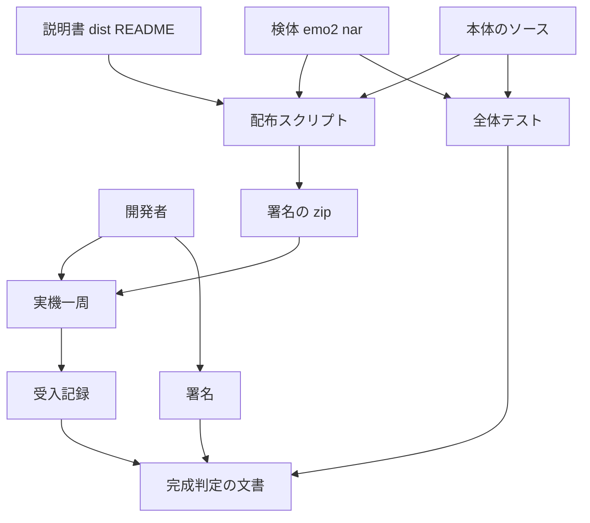
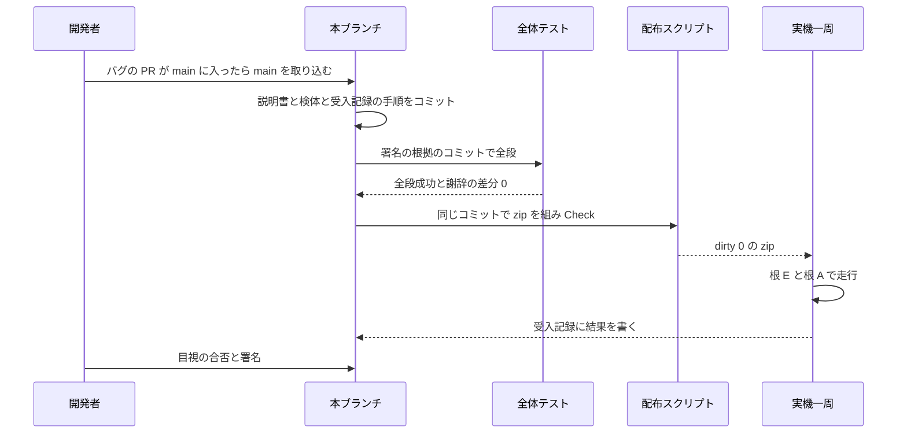
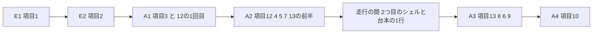

# 設計書: areka-P0-alpha-release-signoff

> 2026-10-01 生成（`kiro-spec-design -y`）。根拠は確定した `requirements.md`（要件 1〜7）と `research.md`（ギャップ分析 §1〜§9・設計の段の調べもの §10）。file:line はワークツリーの HEAD `26699e55`（main `238db25d`＋本 spec の要件の段）で読み直した値で、**何の定義行か**を併記する。実装の段では、バグ `balloon-reappear-short-talk` の PR を取り込んだ後のコミットで引き直す。

## Overview

**Purpose**: 本仕様は α（M2）の完成の器である。署名の根拠にする配布 zip を組み直し、第三者の手順の検証項目表（13 項目と付随の確認 2 つ）でその zip を開発者の機械で一周し、第三者向けの説明書を着地した機能と既知の制限に合わせて仕上げ、根拠を 1 つの文書に束ねて開発者の署名で α の完成を宣言する。

**Users**: 署名する開発者（一周の操作・目視の合否・署名）と、zip を受け取る第三者（説明書の読み手）。AI は文書の作成・記録の採取と引用・手順の準備までを行い、目視の合否と宣言は行わない。

**Impact**: 製品の振る舞いは変えない。変わるのは `dist/README.txt`（説明書）・`vendors/sample_ghost/emo2.nar`（既定ゴーストの検体を開発者の最新の配布物へ差し替える）・同フォルダの `README.md` の 1 行と、本 spec の `verification/` に新しく置く 2 つの文書だけである。

### Goals

- 署名の根拠のコミット 1 つから、全体テスト・謝辞・zip・実機一周の結果を辿れる（要件 1・7）。
- 第三者の手順を、項目ごとに「操作・期待・証跡の取り方」が決まった表で一周し、合否を開発者が決める（要件 2・3）。
- 説明書の偽の記述を 0 件にし、入れ方・更新のしかた・既知の制限を 1 か所にまとめる（要件 4・5）。
- 前回きれいに終わらなかった次の起動で、えも？？ が落ちたゴーストのことを話す版を zip に入れる（要件 6）。

### Non-Goals

- `crates/` のソースの変更（要件 3.8 で開発者が「本仕様の中で直す」と決めたときだけ例外）。
- `tools/package-alpha.ps1` の変更（許可表・判定・`BUILD-INFO.txt` の桁を含む・要件 1.2）。
- 一周の手順の自動化（起動の補助スクリプト・判定器の新設）。M1 と同じく、手順書と手の操作と既存の `-Check` で足りる。
- インストーラ・アプリ本体の自動更新・コード署名・配布サイト・arm64 の必須化・性能目標の引き直し・`emo2` の辞書の編集・新しい機能（要件の Boundary Context の Out of scope）。

## Boundary Commitments

### This Spec Owns

- 第三者向け説明書 `dist/README.txt` の本文（全欄の記述が署名の根拠のコミットの実物と合っていること）。
- `vendors/sample_ghost/emo2.nar` の差し替えと、`vendors/sample_ghost/README.md` の `emo2.nar` の行（項目数・バイト数）。
- 検証項目表（項目 1〜13 と付随の確認 2 つ）・走行の型・走行の順序と、その結果を書く受入記録 `verification/acceptance-record.md`。
- 完成判定の文書 `verification/alpha-completion.md`（3 つの根拠の参照・署名欄・持ち越しと引受先の表・議題 5 の記録）。
- 一周の根と生の記録の置き場の取り決め（リポジトリの外・`C:\` の直下に作らない）。

### Out of Boundary

- 製品の振る舞い（ゴースト・シェル・バルーンの切替・インストール・投げ込み・更新・終了・記憶・起動中の印）はすべて先行 spec の持ち物で、本仕様は観測するだけである。一周で欠陥が見つかったときの直し先は要件 3.8 の開発者の判断に従う（本仕様の中で直すか、別の spec を起票する）。
- 配布スクリプト `tools/package-alpha.ps1` の中身（判定の項目・許可表・`commit=` の 7 桁）。本仕様は走らせて結果を使うだけ。
- `THIRD-PARTY-NOTICES.md` の中身（`tools/test-all.ps1 -License` が生成する。手で直す箇所は 0）。
- `emo2` の辞書（リポジトリの外の `ghost_dev`）。本仕様は届いた配布物を受け取るだけ。
- バグ `balloon-reappear-short-talk` の直し（`crates/areka/src/emo2_boot/balloon_visibility.rs`）。本仕様はその着地の有無で説明書と持ち越しの行を書き分けるだけ。
- `.kiro/steering/roadmap.md` の更新は完了の手順（`/kiro-complete`）の持ち物。本仕様の作業で触るのは、一周で欠陥を起票すると開発者が決めたときの台帳の行の追加（`/kiro-discovery` 経由）だけ。

### Allowed Dependencies

- 道具: `tools/package-alpha.ps1`（版 1.0.0・`-Check`）・`tools/test-all.ps1`（`-License`）・`sample-ghost-kit` の `nar-sample-path`・PowerShell 7・git・Explorer・タスクマネージャ相当の `Get-CimInstance Win32_Process`／`Stop-Process -Id`。
- 写し元: 完了 `areka-P0-emo2-conformance-e2e/verification/`（`acceptance-record.md`・`lap-procedure.md`・`m1-completion.md` の形）、完了 `areka-P0-default-balloon-bundle/verification/signoff-record.md` §6.2（説明書へ写す本文）と §6.3（写せたことの確かめ方）。
- 期待の裏付け: 完了 spec の要件と実機記録（`ghost-install`・`file-drop`・`network-update`・`shell-balloon-switch`・`ghost-shell-balloon-switch`・`session-mark-residue`・`shell-implicit-surface`）と、本書の「期待の裏付け」の file:line。
- 外部: `emo2` の配布サイト `https://ekicyou.github.io/ghost_dev/emo2/emo2/`（項目 8 の更新先）・開発者の配布物 `C:\home\maz\git\ghost_dev\release\emo2\emo2.nar`（ghost_dev `e2df8cb`）。

### Revalidation Triggers

- バグ `balloon-reappear-short-talk` の着地の有無（要件 5.4 ⒞・7.4 の行・項目 7 の観測。§「バグの着地に依る条項」）。
- main の取り込みで `crates/` か `dist/`・`vendors/sample_ghost/` が変わったとき＝本書の「期待の裏付け」と説明書の突き合わせを引き直す。
- `emo2.nar` を別の版へ替えるとき（`install.txt` の `balloon.directory`・`package-alpha.ps1` の判定 7 が比べる説明書 2 本・`halt` の台詞の有無を確かめ直す）。
- 一周の後に zip の中身（説明書・検体・本体のソース）を変えたとき＝要件 1.3 の組み直しと採り直し（§「採り直しの規則」）。
- `tools/package-alpha.ps1` の版が変わったとき（本仕様は 1.0.0 の判定を前提にしている）。

## Architecture

### Existing Architecture Analysis

本仕様が使う既存の仕組みと、その事実（本書の期待はすべてここに立つ）:

| 事実 | 出どころ（何の定義か） |
|---|---|
| zip は `tools/package-alpha.ps1`（版 `1.0.0`）が組む。`commit=` は 7 桁固定、`dirty=` は始めの `git status --porcelain` の行数 | `tools/package-alpha.ps1:65` の `$SCRIPT_VERSION`・`:196` の `git rev-parse --short=7 HEAD`・`:198-199` の `$script:Dirty` |
| zip の名前は `areka-alpha-x64-<yyyyMMdd>-<7 桁>[-dirty].zip`、置き場は `target/alpha/` | `:335-336` の `Step '圧縮'` の `$name` |
| 許可表: `ghost/` は `emo2` だけ、`balloon/` は `emo2-kakukaku` と `StayseeBalloon` | `:374-378` の `$allowed` |
| 判定 7: zip の `ghost/emo2/readme.txt` と `ghost/emo2/shell/master/readme.txt` は `vendors/sample_ghost/emo2.nar` の中身とバイトが同じ | `:403-411` の「7. 説明書 2 本は emo2.nar の中身とバイトが同じ」 |
| 判定 8: zip の `README.txt` は `dist/README.txt` とバイトが同じ・`BUILD-INFO.txt` に `commit=`・`dirty=` | `:412-422` の「8. README・ライセンス・謝辞は写す元とバイトが同じ」 |
| `-Check` は `AREKA_*`／`WINTF_*` を外して 4 つだけ入れ、初回のバルーンが `route=Companion` の `\balloon\emo2-kakukaku` であることを判定する。展開先（`-CheckDir`）はリポジトリの外でなければ断る | `:489-495` の `Step '起動'`・`:76-78` の `$LOG_MARKER_BALLOON_*`・`:189-193` の展開先の検査 |
| 全体テスト `tools/test-all.ps1` は i686 の成果物・fmt・x64 全テスト・i686 テスト、`-License` で `cargo deny check` と `cargo about generate` を回し、謝辞に差分があれば知らせる | `tools/test-all.ps1:41-49` の各 `Step`・`:60-63` の差分の知らせ |
| 起動中の印は App スコープ `[last] running`。空の値は読み取りで捨てる | `crates/areka-sylphya/src/persist/format.rs:245` の `last_running: read_last("running").filter(|v| !v.is_empty())` |
| 印の値はゴーストの `descript.txt` の `name`（無ければフォルダ名）。空の値の鍵は列挙で落とす | `crates/areka/src/boot_resolve.rs:420-434` の `running_name`・`crates/areka-ghost/src/catalog.rs:332-337` の `lowercased`（空の値を鍵ごと落とす） |
| 印が残っていれば `Halted { ghost_name }` で起こし、`OnBoot` の Ref6＝`halt`・Ref7＝その名前 | `crates/areka/src/boot_config.rs:174-183`（印を読む）・`crates/areka/src/main.rs:429-431` の `first_boot_origin`・`crates/areka-kanade/src/schedule/events.rs:273-279` の `on_boot` |
| 初回の起動（ゴーストの起動記録が無い）は `OnFirstBoot` が優先し、`Halted` でも `OnBoot` は送らない | `crates/areka-kanade/src/schedule/boot.rs:231-235` の `boot_root` |
| 窓の位置を保存するのは掴んで離したときだけ。台本からの位置の書き込みは拒まれる | `crates/areka/src/placement/follow/drag_follow.rs:217-226`（「char DragEnd 保存」と `char_pos_entries` の唯一の呼び手）・`crates/areka-ghost/src/prop_sink.rs:231-250` の `window_pos_key_is_rejected_no_write` |
| 復元の記録 `merge_scope restore`（`saved_win_x`／`saved_win_y` が保存の有無を示す） | `crates/areka/src/placement/persist.rs:422-434` |
| メニューの枠は 7 つで並びは `Frame::ORDER`、既定の名前は「ゴースト」「シェル」「バルーン」「ネットワーク更新」「インストール…」「説明書」「終了」 | `crates/areka/src/menu/mod.rs:64-72`・`crates/areka/src/menu/captions.rs:30-40` の `FRAME_CAPTIONS` |
| 「ゴーストが見つかりません。」の告知は 3 行（何が無いか・置く場所・置くもの） | `crates/areka/src/alert.rs:98-112` の `AlertScene::GhostMissing`・`:60` の `GHOST_SHAPE`・`:163-168` の `error!(event = "alert")` |
| 記憶の置き場: アプリは exe の隣の `profile\areka\`、ゴーストとシェルはそれぞれのフォルダの下の `profile\areka\` | `crates/areka/src/boot_config.rs:291-299` の `default_app_profile_dir`・`crates/areka-ghost/src/sylphya_wiring.rs:87-89` の `profile_areka_root` |
| 根と記憶の置き場を上書きする環境変数は `AREKA_ROOT`・`AREKA_PROFILE_DIR`、告知の抑止は `AREKA_NO_ALERT` | `crates/areka/src/boot_config.rs` の `AREKA_ROOT`／`AREKA_PROFILE_DIR` の読み口・`crates/areka/src/alert.rs:27` の `NO_ALERT_ENV` |
| 台本の入口 `\![open,readme]` は登記済み・開いたときの記録は `readme_opened` | `crates/areka/src/emo2_boot/consumer_ledger.rs:325`・`crates/areka/src/readme.rs:193` |
| シェル・バルーンの切替は `OnShellChanged`／`OnBalloonChange` を送る | `crates/areka/src/emo2_boot/frame/switch.rs:464`・`:507` |

### Architecture Pattern & Boundary Map

**選んだ形**: 「器」＝既存の道具の上に、文書 2 本と説明書と検体だけを載せる（ギャップ分析の案 A。`commit=` の桁は要件 1.2 で「受入記録で完全な識別子を添える」に決まっている）。新しいコードは書かない。



- **責務の分け方**: 説明書と検体は「zip の中身」、受入記録は「一周の手順と結果」、完成判定の文書は「根拠の束と署名」。受入記録の中身を完成判定の文書へ写さない（要件 7.1）。
- **守る既存の型**: M1 の器（同定 → 構成 → 環境変数 → 走行 → 項目ごとの結果 → 登記／根拠 3 つ → 署名欄 → 持ち越し → 次の段階）。`-Check` の判定。
- **新しく置く理由**: `acceptance-record.md` は要件 3.4、`alpha-completion.md` は要件 7.1 が名前と置き場を決めている。M1 が別に持った `lap-procedure.md` は置かず、手順は受入記録の前半に置く（1 本で同定・手順・結果が読める・ファイルを増やさない）。
- **steering との整合**: PR 経由の統合・`tools/` の既存スクリプトの再利用・記録は日本語の平易な語・`C:\` の直下に実機の根を作らない。

### Technology Stack

| 層 | 選んだもの／版 | 本仕様での役割 | 備考 |
|---|---|---|---|
| 配布 | `tools/package-alpha.ps1` 1.0.0（PowerShell 7） | zip を組み、中身 8 項目と `-Check` の起動を判定 | 変更 0 |
| 検査 | `tools/test-all.ps1 -License`（cargo・cargo-deny・cargo-about） | 要件 7.1 ⑴⑵・要件 6.2 | 変更 0 |
| 検体 | `sample-ghost-kit` の `nar-sample-path` | 項目 2 の `konnoyayame` を展開する | 変更 0 |
| 実機 | Windows 10／11 x64・Explorer・ふつうの権限の PowerShell 7 | 一周の起動・投げ込み・強制終了 | 管理者で起動しない（投げ込みが届かない） |
| 外部 | `emo2` の配布サイト（https） | 項目 8 の更新先 | ネットワークが要る |

## File Structure Plan

### Directory Structure

```
.kiro/specs/areka-P0-alpha-release-signoff/
└── verification/
    ├── acceptance-record.md   # 受入記録: 同定・構成・環境変数・置き場・検証項目表・走行の手順・項目ごとの結果・登記・説明書の突き合わせ・採り直し
    └── alpha-completion.md    # 完成判定: 3 つの根拠の参照・署名欄・宣言・持ち越しと引受先・議題 5 の記録・次の段階の起点
```

リポジトリの外（追跡しない・`target` は `.gitignore` の 1 行目で無視される）:

```
<ワークツリー>\target\alpha\         # 署名の zip（package-alpha.ps1 の出力先・変更 0）
<ワークツリー>\target\alpha-lap\     # 一周の根（短いパス・ワークツリーの片付けで消えてよい）
├── E\                             # 空の根（項目 1・2）
└── A\                             # 本走の根（項目 3〜13）
C:\home\maz\lap-records\alpha-signoff-<準備日>\   # 生の記録（ワークツリーの片付けで消えない・M1 の前例）
├── <zip の写し>・zip.sha256.txt
├── test-all.log・cargo-deny.txt
└── run-E1.log … run-A4.log・各 .err.log
```

### Modified Files

- `dist/README.txt` — 説明書の仕上げ（§「説明書の仕上げ」）。UTF-8（BOM つき）と改行の扱いは今のまま保つ。
- `vendors/sample_ghost/emo2.nar` — ghost_dev `e2df8cb` の `release/emo2/emo2.nar`（4,586,381 バイト・md5 `3f5d8777deeeb91fecc587c9071ded32`・111 項目）へ置き換える（バイナリの丸ごとの置き換え）。
- `vendors/sample_ghost/README.md` — 7 行目の `emo2.nar` の行を `111`・`4,586,381 バイト` に直す（ほかの行は変えない。119 行目の「全エントリが deflate」は新しい版でも真）。

変えないもの（変更 0 と明記）: `crates/`（要件 3.8 の例外を除く）・`tools/package-alpha.ps1`・`tools/test-all.ps1`・`THIRD-PARTY-NOTICES.md`（生成し直して差分 0 を確かめるだけ）・`.kiro/steering/`（完了の手順の分を除く）。

## System Flows

### 全体の段取り



- **ゲート 0（要件 1.1）**: 一周の zip は、バグ `balloon-reappear-short-talk` の PR が main に入り、本ブランチへ main を取り込んだ後のコミットで組む。取り込みで触れ合うのは `.kiro/steering/roadmap.md` だけの見込み（ギャップ分析 §6）。
- **署名の根拠のコミット**＝zip の `BUILD-INFO.txt` の `commit=` が指すコミット。全体テストと zip はこの 1 つのコミットで回す。それより後のコミットは受入記録と完成判定の文書（zip の中身ではない）だけに限る。zip の中身を変えたら §「採り直しの規則」に従う。
- **順序の禁止**: 根 A の最初の起動（走行 A1）から最後の走行（A4）を終えるまで、`tools/test-all.ps1`・`cargo test`・`tools/package-alpha.ps1` を回さない（要件 3.3。保存された位置を消すテストと、検体の展開の作り直しを避ける）。

### 走行の順序



- **項目 11（表示の拡大率）は、根 A の走行 A1〜A4 をすべて拡大率 100% 以外（例 150%）で回して満たす**。拡大率は一周の前に決め、一周の途中で変えない。項目 3〜10 の目視のたびに「絵・当たり判定・窓の大きさ・バルーンの位置が崩れない」を一緒に見る。
- **項目 13 を項目 8 より前に置く（D4）**。項目 8 は根 A の `emo2` を配布サイトの版で上書きするので、その後に回すと「zip の `emo2` が話した」とは言えない。項目 13 は「強制終了 → 次の起動」を走行の切れ目に要るので、A2 の終わり（強制終了）と A3 の始め（観測）に置く。A3 の `emo2` は A1・A2 で起動記録を持つので、`OnFirstBoot` ではなく `OnBoot` が送られ、台詞の条件（`boot.lua` の「Reference6 が `halt` かつ Reference7 が空でない」）が成り立つ。
- **項目 10 の前提を A3 で作る**: 位置は掴んで離したときだけ保存されるので、A3 で窓を 1 度掴んで離す。既定でない状態（`R_POST_and_KOMAINU`・2 つ目のシェル・既定でないバルーン）で終えると、項目 10 で 3 つの記憶と位置がすべて試される。
- **項目 12 の観測（A2 の始め）を記録し終えるまで窓を掴まない**。

## Requirements Traceability

| 要件 | 要約 | 担う要素 | 手順・契約 | 流れ |
|---|---|---|---|---|
| 1.1 | 全段成功＋`-Check` 合格の zip をバグの取り込みの後に組む | 署名の zip | ゲート 0・署名の根拠のコミット | 全体の段取り |
| 1.2 | zip の名前・`commit=`・完全な識別子・`dirty=0` | 受入記録 §1 同定 | `git rev-parse <commit=>` を添える | — |
| 1.3 | 一周の後に中身を変えたら組み直して採り直す | 受入記録 §9 | 採り直しの規則の表 | — |
| 1.4 | `ghost/` は `emo2` だけ | 署名の zip | 許可表（`package-alpha.ps1:376`）をそのまま使う | — |
| 1.5 | x64 の 1 種 | 署名の zip | `package-alpha.ps1` は x64 だけを組む | — |
| 2.1 | 12 項目の操作・期待・証跡 | 受入記録 §5 | 検証項目表 | 走行の順序 |
| 2.2 | `\![open,readme]` と左クリックの後の右クリック | 受入記録 §5 | 付随の確認（D9） | A2・A3 |
| 2.3 | 項目 13 | 受入記録 §5 | 強制終了の手順（要件 3.9） | A2→A3 |
| 2.4 | 各項目は 1 分以内 | 受入記録 §5 | 項目は操作 1〜3 回で観測できる単位に切る | — |
| 2.5 | 期待は実物で確かめたものだけ | 受入記録 §5 の「期待の裏付け」列 | 本書の Existing Architecture Analysis | — |
| 3.1 | ふつうの権限・引数なし・短いパス・`C:\` 直下でない | 走行の型・置き場 | `<ワークツリー>\target\alpha-lap\` | — |
| 3.2 | 環境変数・記録の水準・安全弁 | 走行の型 | 起動の書き方 | — |
| 3.3 | 項目 12 の前に位置を消すテストを回さない | 順序の禁止 | A1〜A4 の間は cargo を回さない | 全体の段取り |
| 3.4 | M1 の形を写す | 受入記録 | 章立て | — |
| 3.5 | 結果・根拠・種別・縮退の理由 | 受入記録 §7 | 結果の書式 | — |
| 3.6 | ERROR／WARN の除外 | 受入記録 §7・§8 | 除外の表 | — |
| 3.7 | 目視は開発者が決める | 受入記録 §0・§7 | AI は記録だけ | — |
| 3.8 | 欠陥の登記と開発者の判断 | 受入記録 §8 | 欠陥の行 | — |
| 3.9 | 自分が起こしたプロセスだけを止める | 走行の型 | PID で止める | A2 の終わり |
| 4.1 | 冒頭の日付 | 説明書 | 欄ごとの仕上げ「冒頭の日付」 | — |
| 4.2 | メニューの 7 項目 | 説明書 | 欄ごとの仕上げ「右クリックメニュー」 | — |
| 4.3 | .nar の入れ方 | 説明書 | 欄ごとの仕上げ「.nar の入れ方」・D10 | — |
| 4.4 | 更新のしかた | 説明書 | 欄ごとの仕上げ「更新のしかた」 | — |
| 4.5 | 2 回目の起動と落ちた次の起動 | 説明書 | 欄ごとの仕上げ「起動」 | — |
| 4.6 | §6.2 の写しと地の文の 1 文 | 説明書・受入記録 §10 | §6.2 の写し方 | — |
| 4.7 | 偽の記述 0 件 | 説明書・受入記録 §10 | 突き合わせの表 | — |
| 4.8 | 内部の言葉を出さない | 説明書・受入記録 §10 | 言葉の決まり・語の探し方 | — |
| 4.9 | zip の `README.txt` が仕上げた説明書と同じ | 署名の zip | `package-alpha.ps1` の判定 8・採り直しの規則 | — |
| 5.1 | 既知の制限の基本の行 | 説明書 | 既知の制限の表 | — |
| 5.2 | 入れ方と投げ込みの制限 | 説明書 | 既知の制限の表 | — |
| 5.3 | 更新の制限 | 説明書 | 既知の制限の表 | — |
| 5.4 | 条件つきの制限 ⒜⒝⒞ | 説明書 | 条件つきの制限の決め方・バグの着地に依る条項 | — |
| 5.5 | 裏付けのある行だけ・直った制限を書かない | 説明書・受入記録 §10 | 既知の制限の表の裏付けの列 | — |
| 5.6 | 確かめられない候補の登記 | 受入記録 §8 | 候補の表 | — |
| 6.1 | `emo2.nar` を差し替え README の行を直す | 検体の差し替え | ghost_dev `e2df8cb` の版 | — |
| 6.2 | 差し替えの後に `test-all.ps1` 全段 | 署名の根拠のコミットの全体テスト | 1 回で 6.2 と 7.1 ⑴ を兼ねる（D6） | 全体の段取り |
| 6.3 | 同梱物とライセンスの突き合わせ | 説明書・検体の差し替え | 突き合わせの結果（下） | — |
| 6.4 | 項目 13 の台詞の目視 | 受入記録 §7 | A3 の始め | A2→A3 |
| 6.5 | 届いていないときの枝 | 説明書・完成判定 | 差し替えを取りやめたときだけ使う | — |
| 6.6 | 辞書を編集しない | 検体の差し替え | 配布物を丸ごと置き換えるだけ | — |
| 7.1 | 完成判定の文書と 3 つの根拠 | 完成判定 §1〜§3 | 参照の書式 | — |
| 7.2 | ⑴ の欄の中身 | 完成判定 §1 | コマンド・コミット・日時・段・生の記録 | — |
| 7.3 | 確かめる 1 文と署名欄 | 完成判定 §4 | AI は埋めない | — |
| 7.4 | 持ち越しの表 | 完成判定 §6 | M1 の項目 12 の結果の行を含む | — |
| 7.5 | 議題 5 の記録 | 完成判定 §7 | 署名の前に開発者に尋ねる | — |
| 7.6 | 持ち越しが判定を書き換えないこと | 完成判定 §6 | 行ごとの記述 | — |
| 7.7 | 引受先は台帳に実在する spec か開発者の手 | 完成判定 §6 | 台帳の行を確かめる | — |
| 7.8 | M3 の起点 | 完成判定 §8 | 1 文 | — |

## Components and Interfaces

| 要素 | 層 | 目的 | 要件 | 主な依存 | 契約 |
|---|---|---|---|---|---|
| 説明書 `dist/README.txt` | zip の中身 | 第三者が開発者に聞かずに使い始められる | 4.1〜4.9・5.1〜5.5・6.3・6.5 | 本体のソース（P0）・§6.2 の本文（P0） | State |
| 検体 `emo2.nar` と README の行 | zip の中身 | `halt` の台詞を持つ既定ゴーストを zip に入れる | 6.1〜6.3・6.5・6.6 | ghost_dev の配布物（P0） | Batch |
| 署名の zip | 配布物 | 一周と署名の根拠の実行体 | 1.1〜1.5 | `package-alpha.ps1`（P0） | Batch |
| 受入記録 | 文書 | 一周の手順と結果 | 1.2・1.3・2.1〜2.5・3.1〜3.9・5.6・6.4 | 署名の zip（P0）・先行 spec の記録（P1） | State |
| 完成判定の文書 | 文書 | 根拠の束と署名 | 7.1〜7.8・6.5 | 受入記録（P0）・全体テスト（P0） | State |

### zip の中身

#### 説明書 `dist/README.txt`

| 欄 | 内容 |
|---|---|
| Intent | 着地した機能と既知の制限を、第三者の言葉で 1 本にまとめる |
| Requirements | 4.1〜4.9・5.1〜5.5・6.3・6.5 |

**Responsibilities & Constraints**
- 欄の並び（仕上げた後）: 起動／終了／右クリックメニュー／.nar の入れ方／更新のしかた／記憶の置き場／既知の制限／同梱しているバルーンについて／同梱物とライセンス。
- 言葉: 記録の名前・イベントの名前・ソースの名前・プロジェクトの中の呼び名を本文に出さない（4.8）。SSTP・SAORI は第三者がゴーストの説明で目にする語なので、意味を添えて書いてよい。せりふを出す枠はメニューの名前に合わせて「バルーン」と書き、最初の 1 か所で「バルーン（せりふを表示する吹き出し）」と意味を添える（今の本文の「吹き出し」と「バルーン」の混在を解く）。
- 文字コード: UTF-8（BOM つき）。改行の扱いは今のファイルと同じに保つ（`package-alpha.ps1` の判定 8 は作業木のバイトを zip と比べる）。

**欄ごとの仕上げ**

| 欄 | 今（行） | 仕上げ | 要件 |
|---|---|---|---|
| 冒頭の日付 | 5 行目「2026-09-26 時点」 | 署名の根拠のコミットの内容を書いた日付 | 4.1 |
| 起動 | 13 行目「前回使ったゴーストと吹き出し」 | 「前回使ったゴースト・シェル・バルーン」で立つこと、前回きれいに終わらなかった（強制終了した・落ちた）次の起動は前回のゴーストではなく えも？？ で立つこと | 4.5 |
| 右クリックメニュー | 26 行目「5 つ」・33 行目「出ません」 | 7 つを実物の並びで挙げ、「シェル」「バルーン」の説明（一覧から選ぶと今のゴーストのまま替わる）を足し、33 行目を消す | 4.2 |
| .nar の入れ方 | 57 行目「未記入」 | 「インストール…」から選ぶ手順と、ゴーストの窓へ落とす手順。どちらも入れた後は今のゴーストのまま・替えるときは「ゴースト」から選ぶ（ゴーストが自分から切り替えることもある）・利用条件のファイルを持つ `.nar` は入れる前に「はい」「いいえ」を尋ねる | 4.3 |
| 更新のしかた | 無い | 新しい欄。要件 4.4 の流れ（進捗の台詞 → 入れ替わったときだけいったん引っ込んで同じゴーストが戻り「更新成功」の台詞 → 差分が無ければ引っ込まずに「更新無し」）・更新先の無いものは飛ばす・3 つのどれにも更新先が無いときと更新している間は選べない | 4.4 |
| 記憶の置き場 | 40-42 行目（`ghost\emo2\...` だけ） | どのゴーストにも当てはまる形: アプリ＝`areka.exe` の隣の `profile\areka\`・ゴースト＝`ghost\<ゴーストのフォルダ>\ghost\master\profile\areka\`・シェル＝`ghost\<ゴーストのフォルダ>\shell\<シェルのフォルダ>\profile\areka\` | 4.7 |
| 既知の制限 | 49-52 行目 | 下の「既知の制限の表」の行だけ。52 行目を消す | 5.1〜5.5 |
| 同梱しているバルーンについて | 無い | §6.2 の本文を写す（下の「写し方」） | 4.6 |
| 同梱物とライセンス | 60-105 行目 | 新しい `emo2.nar` と突き合わせる（下の「突き合わせの結果」） | 6.3 |

**既知の制限の表**（説明書に書く行と、署名の根拠のコミットで確かめる裏付け。裏付けが取れない行は書かない＝5.5）

| 行 | 裏付け（実装の段で引き直す） | 要件 |
|---|---|---|
| exe に署名が無い・Windows 10／11 の 64 ビット版専用・深いフォルダに展開しない（今ある 3 行） | `package-alpha.ps1` に署名の段が無い・x64 だけを組む・`-Check` の展開先の上限（`:186` の `EXPAND_DIR_MAX_CHARS`） | 5.1 |
| α の表現力の範囲（えも？？ が普通に動く水準で、ゴーストによっては表現が欠ける） | `.kiro/steering/product.md` の α の段の定義 | 5.1 |
| メニューは Windows の標準の見た目 | 完了 `popup-menu-minimal`（OS のネイティブのメニュー） | 5.1 |
| 複数のゴーストを同時に出せない | `crates/areka/src/main.rs` の置き場 `GhostSlot`（1 体） | 5.1 |
| 外部のアプリからゴーストへ話しかける仕組み（SSTP）が無い | 本体に SSTP の受け口が無い。実装の段で `crates/` を語で検索し、当たった行（設計の段では `crates/areka/src/input_events/user_break.rs:98` の注記「SSTP に関する判定は 1 つも置かない」だけ）を読んで受け口でないことを書く | 5.1 |
| SAORI はゴースト（SHIORI）自身が読み込むものだけが動く | 本体に SAORI の読み込み口が無い。同じく語で検索し、当たった行（設計の段では `crates/areka/src/session_end.rs` の 1 本だけ）を読んで読み込み口でないことを書く | 5.1 |
| キャラクターが 3 人以上のゴーストでは 3 人目以降の窓が出ない | `crates/areka/src/emo2_boot/mod.rs:274-276` の `derive_scopes`（`[0, 1]` 固定） | 5.1 |
| 管理者として起動した areka へ、ふつうの権限のエクスプローラから落としても届かない | 完了 `file-drop` 要件 8.9 | 5.2 |
| 入れる途中で元へ戻せなかったときの元の中身が一時的な作業のフォルダに 7 日まで残る | `crates/areka-nar/src/install.rs:40` の `SURVIVOR_RETENTION` | 5.2 |
| 更新のオプション（確かめるだけ・試すだけ・やり直し）は受けない | `crates/areka/src/emo2_boot/update_cue.rs:32` の `UPDATE_OPTIONS` | 5.3 |
| ゴーストがシェル・バルーンの更新先を差し替える仕組みには応えない | `crates/areka-kanade/src/schedule/resources.rs:59`（`other_homeurl_override` を載せない） | 5.3 |
| ゴーストが指示する取得の種別は `.nar` だけ | 完了 `network-update` の申し送り ⑶（brief「2026-09-30」3） | 5.3 |
| 取得したファイルが一時フォルダに最大 7 日残る | `crates/areka/src/install/fetch_url.rs:25` の `KEEP` | 5.3 |
| 更新の確定を元へ戻せなかったときの残りが対象のフォルダの下に残り、救い出しは手で行う | `crates/areka-update/src/paths.rs:7`（作業場所 `.update-work`） | 5.3 |
| 引数でゴーストのフォルダを指して始めたとき・表示していないシェル・バルーンを更新したときは読み直さない | 完了 `network-update` の申し送り ⑹⑺ | 5.3 |
| 読み直した後のまとめの知らせが「更新成功」の台詞の終わりを待たない | 完了 `network-update` 要件 5.3・α 後 `network-update-canon-order` | 5.3 |
| ⒜ `halt` の台詞が無い／⒝ `emo2-kakukaku` の古い更新先／⒞ 隠れたバルーンが 1 文字の台詞で現れない | 条件つき（下の「条件つきの制限の決め方」） | 5.4 |

書かない行（5.5）: SHIORI が動かないと黙って消える・Windows の終了を数十秒止める・シェル／バルーンの切り替えができない・https の更新が通らない。

**条件つきの制限の決め方**（署名の根拠のコミットの実物で決める・5.4）

| 行 | 書く条件 | 確かめ方 | 差し替えの後の見込み |
|---|---|---|---|
| ⒜ | zip の `ghost/emo2` が `halt` の台詞を持たない | zip の `ghost/emo2/ghost/master/dic/boot.pasta` に `＊起動halt` の場面があるか | 持つ＝書かない |
| ⒝ | zip の `balloon/emo2-kakukaku/descript.txt` に `homeurl` の行がある | その行の有無 | 無い＝書かない |
| ⒞ | バグ `balloon-reappear-short-talk` が未着地 | 取り込んだ main に `.kiro/specs/completed/areka-P0-balloon-reappear-short-talk/` が在り、台帳の行が完了か | ゲート 0 により着地済み＝書かない |

**§6.2 の写し方**（要件 4.6・D3 の残り＝記法の線引き）

- 置き場: 「既知の制限」の後、「同梱物とライセンス」の前に新しい欄を置く。
- 見出し: §6.2 の `### 同梱しているバルーンについて` を説明書の欄の見出し「■ 同梱しているバルーンについて」にする（見出しの言葉は変えない）。`####` の 2 つは説明書の小見出しの記号「◆」で始める。
- 地の文の 1 文: 見出しの直後、本文の最初の段落（「areka には、…1 つ入っています。」）の直前に置く。中身は「えも？？ に付いてくるバルーン emo2-kakukaku は えも？？ の同梱物で、下の数には入っていません（条件は『同梱物とライセンス』の ◆ バルーン「emo2-kakukaku」の欄にあります）」の趣旨の 1 文。今の説明書は `emo2-kakukaku` に独立の ◆ の欄を持つので、指す先はその欄にし、欄の組み立ては変えない（4.6・4.7 のぶつかりを解く）。言い回しは説明書の仕上げで決める。
- 記法の移し方（言い回しの書き換えに当たらないもの）: 行頭の `> ` と素の `>` を落とす／表は見出しの行と区切りの行を落とし、各行を「・名前　内容」の形の 1 行にする（`<br>` は改行＋全角空白の字下げ）／`**` と `` ` `` を落とす／行頭の `- ` を「・」にする／見出しの記号を上のとおりにする。語・句読点・数字・URL は 1 文字も変えない。
- 写せたことの確かめ方（受入記録 §10 に結果を書く）: §6.2 の引用ブロックと説明書の新しい欄のそれぞれから、上の記法の記号（`>`・`#`・`|`・`**`・`` ` ``・`<br>`・行頭の `- `／`・`／`■`／`◆`・すべての空白）を除き、表の見出しの行と区切りの行と地の文の 1 文を除いた文字の列が一致すること。較正: 本文の 1 文字を変えた写しに同じ比べ方を当てると一致しないこと。加えて §6.3 の判定 ⑵ の語の探し方を説明書の新しい欄に当てて 0 件であること（4.8）。
- 説明書の全文の語の探し（4.8・4.7）: 新しい欄だけでなく説明書の全文に、内部の言葉の探し方を当てて 0 件であること。探す語は少なくとも spec 名の形（`areka-P`・`alpha-`・`-signoff` などを含む名前）・crate やソースのファイルの名前（`areka_`・`.rs`）・`AREKA_`・`WINTF_`・`RUST_LOG`・`event=`・括弧の外の `On` で始まるイベントの名前。較正: 仕上げる前の説明書（「■ .nar の入れ方」の spec 名）に当てると 1 件以上当たること。結果は受入記録 §10。

**同梱物とライセンスの突き合わせの結果**（要件 6.3・設計の段で新しい `emo2.nar` を読んだ結果。実装の段で zip の実物に当て直す）

- 説明書が出どころに挙げる `readme.txt`・`shell/master/readme.txt`・`shell/master/confiserie.txt`・`shell/master/CityPop.txt` は、古い版と新しい版でバイトが同じ。作者・条件・出どころの記述に食い違いは無い。
- 新しい版は `ghost/master/THIRD_PARTY_LICENSES.txt`（pasta.dll が使う部品の著作権表示とライセンス）を足した。説明書の「SHIORI『pasta.dll』」の欄の出どころに `ghost\emo2\ghost\master\THIRD_PARTY_LICENSES.txt` を足す（同梱した実行体の表示の置き場を第三者に示す）。

**Implementation Notes**
- 突き合わせ（4.7）: 説明書の全行を「本体のソース・zip の中身・完了 spec の記録」のどれで確かめたかを受入記録 §10 の表に 1 行ずつ書く。確かめられない行は書かずに §8 の登記へ回す（5.6）。
- 一周の後に説明書を変えたら §「採り直しの規則」（4.9・1.3）。

#### 検体 `emo2.nar` と README の行

| 欄 | 内容 |
|---|---|
| Intent | `halt` の台詞を持ち、`emo2-kakukaku` の古い更新先を消した開発者の配布物を、既定ゴーストの検体にする |
| Requirements | 6.1〜6.3・6.5・6.6 |

**Batch / Job Contract**
- Trigger: ゲート 0 の後、説明書の仕上げと同じ枝の上で 1 回。
- Input / validation: `C:\home\maz\git\ghost_dev\release\emo2\emo2.nar` の大きさ 4,586,381 バイト・md5 `3f5d8777deeeb91fecc587c9071ded32`・ghost_dev の `release/emo2` に未コミットの変更が無いこと。置き換える前に、中身が次を満たすことを確かめる: `install.txt` に `balloon.directory,emo2-kakukaku` がある（`-Check` の初回のバルーンの判定が成り立つ）／判定 7 が比べる説明書 2 本が古い版とバイトで同じ／`dic/boot.pasta` に `＊起動halt` の場面がある／`emo2-kakukaku/descript.txt` に `homeurl` の行が無い。設計の段で全部成り立つことを確かめた（research §10）。
- Output: `vendors/sample_ghost/emo2.nar` を丸ごと置き換え、`vendors/sample_ghost/README.md` 7 行目を `111`・`4,586,381 バイト` にする。辞書は 1 文字も編集しない（6.6）。
- 確かめ（6.2）: 署名の根拠のコミットの `tools/test-all.ps1 -License` の全段成功で兼ねる（D6）。設計の段の静的な読みでは赤になるテストは 0 本の見込みで、新しい版で影響を受けうるのは本物の `pasta.dll` を動かす `crates/areka/tests/smoke_boot_loop_exit.rs`（と明示実行の `emo2_real_run.rs`）だけ。

**Implementation Notes**
- 6.5 の枝: 差し替えた版で全体テストが赤になり、開発者が差し替えを取りやめると決めたときだけ、`emo2.nar` を変えず、説明書に ⒜ と ⒝ を書き、完成判定の持ち越しに「`emo2` の `halt` の台詞」（引受先＝開発者の手）を載せる。項目 13 は記録の確認だけになる（2.3）。

#### 署名の zip

| 欄 | 内容 |
|---|---|
| Intent | 署名の根拠のコミットから組んだ、`-Check` に合格した x64 の zip |
| Requirements | 1.1〜1.5 |

**Batch / Job Contract**
- Trigger: 署名の根拠のコミットで全体テストが全段成功した後（ゲート 0 の後）。
- Input / validation: 作業木がきれいであること（`git status --porcelain` が 0 行＝`dirty=0`）。一周の生の記録はリポジトリの外に置くので数に入らない。
- 実行: `pwsh -NoProfile -File tools/package-alpha.ps1 -Check`（`-CheckDir` は付けない＝既定の一時フォルダ。展開先はリポジトリの外で短い）。終了コード 0。
- Output: `target/alpha/areka-alpha-x64-<日付>-<7 桁>.zip`（名前に `-dirty` が付かないこと）。受入記録 §1 に、zip の名前・`commit=`・`git rev-parse <commit=>` で引いた 40 桁・`dirty=0`・`-Check` の終了コードと日時・zip の sha256 を書き、zip の写しを生の記録の置き場へ置く。
- 1.4・1.5 は `package-alpha.ps1` の許可表と組み方がそのまま満たす（変更 0）。

### 文書

#### 受入記録 `verification/acceptance-record.md`

| 欄 | 内容 |
|---|---|
| Intent | 一周の手順と、項目ごとの合否と根拠を、後から辿れる形で残す |
| Requirements | 1.2・1.3・2.1〜2.5・3.1〜3.9・5.6・6.4 |

**State Management**（章立て＝M1 の形を写す・3.4）

| 節 | 中身 | いつ書くか |
|---|---|---|
| §0 書く前に | AI は記録の作成だけ・目視の合否は開発者（3.7）／根拠の種別（目視・記録の引用・両方）／縮退して合格とするときは理由と開発者の裁定（3.5） | zip を組む前（コミットに含める） |
| §1 同定 | zip の名前・`commit=` と 40 桁・`dirty=0`・sha256・`-Check` の結果（1.2） | zip を組んだ直後 |
| §2 機械の構成 | OS の版・画面の拡大率（一周を通して 100% 以外の 1 つの値）・ふつうの権限であること | 一周の前 |
| §3 環境変数 | 下の「走行の型」の表を逐語で。指定しない変数は「未指定」と書く | 一周の前 |
| §4 置き場 | 根 E・根 A の絶対パスと長さ・生の記録の置き場 | 一周の前 |
| §5 検証項目表 | 項目 1〜13 と付随 2 つ（下の表）。期待の裏付けの列を持つ（2.5） | zip を組む前 |
| §6 走行の手順 | E1〜A4 の順と、走行の間の準備（下の「走行の手順」） | zip を組む前 |
| §7 項目ごとの結果 | 項目ごとに 結果（合格・不合格・中断）／根拠（誰が何を見たか・記録の行を時刻つきで逐語）／種別。ERROR と WARN の数え方と除外の理由（3.6） | 走行の後 |
| §8 登記 | 判定に載せない既知の症状・確かめられなかった既知の制限の候補（5.6）・欠陥と開発者の判断（3.8）。今わかっている候補は 2 つ＝表示中のシェル・使用中のバルーンのフォルダを上書きするインストールが失敗するか／起動中のゴーストへ入れる間に Windows を終えたときの後始末。どちらも一周の項目では踏まないので、推測で説明書へ書かず、確かめられなかった理由と扱い（完成判定の持ち越しへ載せるか）をここに書く | 走行の後 |
| §9 採り直し | 一周の後に中身を変えたときの組み直しと採り直し（1.3） | 該当するときだけ |
| §10 説明書の突き合わせ | 説明書の各行の裏付け・§6.2 の写しの確かめ（4.6・4.7） | zip を組む前 |

**走行の型**（全走行で同じ・3.1・3.2・3.9）

- 根: zip を根のフォルダへ展開する（`[IO.Compression.ZipFile]::ExtractToDirectory`）。根は `<ワークツリー>\target\alpha-lap\<E|A>`（フルパスは `package-alpha.ps1` の展開先の上限と同じ 160 文字以内・`C:\` の直下ではない）。ワークツリーの場所が長すぎるときの次善は `C:\tmp\alpha-lap\<E|A>`。
- 起動（ふつうの権限の PowerShell 7・引数なし）:

```powershell
$ROOT = '<根の絶対パス>'
$REC  = 'C:\home\maz\lap-records\alpha-signoff-<準備日>'
$RUN  = '<走行名 E1〜A4>'
[Console]::OutputEncoding = [System.Text.Encoding]::UTF8
Get-ChildItem Env: | Where-Object { $_.Name -like 'AREKA_*' -or $_.Name -like 'WINTF_*' } | ForEach-Object { Remove-Item "Env:$($_.Name)" }
$env:RUST_LOG = 'info,areka=debug,areka_kanade=debug,kanade=trace'
$env:NO_COLOR = '1'
$env:AREKA_APP_SMOKE_EXIT_MS = '1800000'
$p = Start-Process -FilePath "$ROOT\areka.exe" -WorkingDirectory $ROOT -PassThru `
     -RedirectStandardOutput "$REC\run-$RUN.log" -RedirectStandardError "$REC\run-$RUN.err.log"
"$RUN pid=$($p.Id) start=$(Get-Date -Format o)" | Add-Content "$REC\runs.txt"
```

| 変数 | 値 | 理由 |
|---|---|---|
| `AREKA_ROOT`・`AREKA_PROFILE_DIR` | 未指定（消す） | 根と記憶の置き場を上書きしない（3.2） |
| `AREKA_NO_ALERT` | 未指定（消す） | 項目 1 の告知を出す |
| `RUST_LOG` | `info,areka=debug,areka_kanade=debug,kanade=trace` | 判定に使う分岐の記録（切替・記憶・印・位置の保存と復元）と、`OnBoot` などの参照（`kanade` の `shiori_request` は trace）まで開ける |
| `NO_COLOR` | `1` | 記録に色の制御の文字を混ぜない |
| `AREKA_APP_SMOKE_EXIT_MS` | `1800000`（30 分） | 安全弁。1 回の走行の所要より長い。走行の終わりは開発者のメニューの「終了」（A2 だけは強制終了）で決める。安全弁が先に発火したら、その走行で未観測の項目は「中断」 |

- 終わり: メニューの「終了」を選び、`$p.WaitForExit()` の後の `$p.ExitCode` を `runs.txt` に書く。
- 強制終了（A2 の終わりだけ・3.9）: 止める前に `Get-CimInstance Win32_Process -Filter "ParentProcessId=$($p.Id)"` で `$p` の子（`shiori-host32-helper.exe`）の PID を `runs.txt` に書き、`Stop-Process -Id $p.Id -Force` で `$p` だけを止める。数秒後に、書き留めた子の PID がまだ在るときに限り、その PID だけを止めて記録に書く。名前で探して止めることはしない。

**検証項目表**（§5 に写す。操作・期待は要件 2.1・2.3 の字面に従い、ここでは証跡と裏付けと走行を決める）

| 項目 | 走行 | 証跡の取り方 | 期待の裏付け |
|---|---|---|---|
| 1 空の根の告知 | E1 | 目視（3 行の本文・置く場所が `<根 E>\ghost` の絶対パス・OK で終わる）＋記録（`event="alert"` の 1 行） | `alert.rs:98-112`・`:60`・`:163-168` |
| 2 告知のとおりに置く | E2 | 目視（`konnoyayame` の挨拶・目の周りの地色・字形・抜き色の場所のクリックが背後へ抜ける）＋記録（ゴーストの決定と挨拶の行） | 完了 `shell-implicit-surface`・`keycolor-clickthrough-coverage`（roadmap の目視 5 件の節） |
| 3 初回の起動 | A1 | 記録（`balloon_resolved` の `route=Companion`・`\balloon\emo2-kakukaku`・`OnFirstBoot`）＋目視（挨拶・透明な場所のクリックが抜ける・項目 11） | `boot_resolve.rs:199-202` の段 3（同梱）・`package-alpha.ps1:76-78` |
| 4 2 体目・3 体目を入れる | A2 | 記録（`install_done` が 2 件・`file_drop_received` が 1 件・切替の行が 0 件）＋目視（インストールの台詞・えも？？ のまま） | 完了 `ghost-install`（要件 12 裁定 5＝入れた後に切り替えない）・`crates/areka/src/input_events/file_drop.rs` の `file_drop_received` |
| 5 ゴーストを替えて戻る | A2 | 目視（一覧に 3 体・送り出しの台詞・挨拶・絵・字形・抜き色のクリック）＋記録（`ghost_switch_done` が 3 件） | 完了 `ghost-shell-balloon-switch`・`menu/ghost_frame.rs:45` |
| 6 シェルの切り替え | A3 | 目視（絵が替わる・降りない）＋記録（`skin_switch_done`・`OnShellChanged` の送出） | 完了 `shell-balloon-switch`・`frame/switch.rs:464` |
| 7 バルーンの切り替え | A2 | 目視（次の台詞から新しいバルーン）＋記録（`skin_switch_done`・`OnBalloonChange`） | 完了 `shell-balloon-switch`・`frame/switch.rs:507` |
| 8 ネットワーク更新 | A3 | 記録（1 回目＝`OnUpdateComplete` の後に `OnUpdateResult`・`OnGhostChanged`／`OnBoot` が 0 件／2 回目＝読み直し無しで更新無し → `OnUpdateResult`）＋目視（進捗の台詞・いったん引っ込んで戻る）。手で変えたファイルの名前と、変える前・変えた後・更新の後の md5（更新の後は変える前に戻る） | 完了 `network-update` の `signoff.md`・`schedule/boot.rs:244-252`（読み直しの起動の根） |
| 9 終了 | A3 の終わり | 記録（`app_exit`・`session_mark_cleared`・A3 の ERROR が除外の後 0 件）＋終了コード 0（`runs.txt`）＋目視（別れの台詞） | `app_exit.rs:107`・`boot_resolve.rs` の `clear_session_mark`（`session_mark_cleared`） |
| 10 前回の状態の復元 | A4 | 記録（`session_mark_found` が 0 件・起こしたゴーストとシェルとバルーンの決定の行・`merge_scope restore` の `saved_win_*` が A3 の「char DragEnd 保存」の `saved_*` と同じ）＋目視 | `boot_resolve.rs:253-279`（記憶の直読み）・`placement/persist.rs:422-434` |
| 11 表示の拡大率 | A1〜A4 | 目視（項目 3〜10 のたびに）＋§2 の拡大率 | `.kiro/steering/` の DPI 追従の方針・M1 の項目 18 |
| 12 初回だけの位置合わせ | A1→A2 | 記録（A1 は `OnFirstBoot`、A2 は `OnBoot`。A2 の相方〔scope 1〕の `merge_scope restore` が `saved_win_x=None`）＋目視（初回のずらしが繰り返されず既定の配置） | `drag_follow.rs:217-226`（保存は掴んで離したときだけ）・`prop_sink.rs:231-250`・`schedule/boot.rs:233-235` |
| 13 強制終了の次の起動 | A2→A3 | 記録（A2 の印は消えない＝`session_mark_cleared` が 0 件／期待する名前は A2 の最後の `session_mark_steady` の `ghost=` の値を逐語で写したもの〔印の値は `descript.txt` の `name` で、フォルダ名 `claudia` ではない〕。A3 の `session_mark_found` の `ghost=` と、`OnBoot` の `references` の 8 番目がその値と同じ・7 番目が `halt`）＋目視（えも？？ で立ち、落ちたゴーストのことを話す。6.4） | `format.rs:245`・`boot_config.rs:174-183`・`main.rs:429-431`・`events.rs:273-279`・`boot.rs:231-235`・新しい `emo2` の `boot.lua`（Reference6 が `halt` かつ Reference7 が空でないとき「起動halt」） |
| 付随 `\![open,readme]` | A3（項目 6 の中） | 目視（説明書が開く）＋記録（`readme_opened`） | `consumer_ledger.rs:325`・`readme.rs:193` |
| 付随 左クリックの後の右クリック | A2 | 目視（メニューが出る）＋記録（`menu_shown`） | 完了 `wintf-drag-state-rest-contract` |

**件数を数える区間**（§5・§6・§7 に写す・2.1・3.5）: A2 と A3 には同じ記録を出す操作が複数入る（例: A2 の `ghost_switch_done` は項目 5 の 3 件と項目 13 の前の 1 件で計 4 件・A3 の `OnBoot` は項目 13 の 1 件）。証跡の件数は走行全体ではなく、**その項目の操作の始まりから次の項目の操作の始まりまでの区間**で数える。区間の境目は、開発者が各項目の操作の直前に `runs.txt` へ 1 行（`<走行> item=<番号> start=<時刻>`）を足して決める。§7 には項目ごとに区間の始まりと終わりの時刻を書き、件数はその区間の行だけを数える。表の「N 件」「0 件」はすべてこの区間での数である。

**走行の手順**（§6 に写す。操作の細部は §6 で逐語にする）

| 走行 | 根 | 中身 |
|---|---|---|
| 準備 | — | 生の記録の置き場を新しく作る／画面の拡大率を 100% 以外にする／`cargo run -q -p sample-ghost-kit --bin nar-sample-path -- konnoyayame` の `folder=` を根 E の外の作業用に控える（一周の間は回さない） |
| E1 | E（zip を展開し `ghost\` の中を空にする） | 項目 1 |
| E2 | E（控えた `konnoyayame` のフォルダを `ghost\konnoyayame` へ写す） | 項目 2 → メニューの「終了」 |
| A1 | A（zip をそのまま展開） | 項目 3 → 窓を掴まずにメニューの「終了」（項目 12 の 1 回目） |
| A2 | A | 項目 12 の観測 → 項目 4 ⒜（`vendors\sample_ghost\R_POST_and_KOMAINU.nar` を「インストール…」で選ぶ）⒝（`vendors\sample_ghost\claudia.nar` を Explorer からえも？？ の窓へ落とす）→ 項目 5（`R_POST_and_KOMAINU` → `claudia` → えも？？）→ 項目 7（えも？？ で `StayseeBalloon` → `emo2-kakukaku`）→ 付随（左クリックの後の右クリック）→ `claudia` へ替え、`session_mark_steady` の行（`ghost=` が `claudia` の `name`）が記録に出てから 5 秒置く（印の書き込みは書き手への投函で非同期のため）→ 強制終了（項目 13 の前半） |
| 走行の間 | A（areka を止めた状態） | 項目 6 の 2 つ目のシェル: `ghost\R_POST_and_KOMAINU\shell\master\` を `shell\second\` へ写し、写した `descript.txt` の `name,master` を `name,second` に置き換え、写した側の `surface0000.png` と `surface0001.png` を入れ替える（完了 `shell-balloon-switch` の `signoff.md` の作り方）。付随の確認: `ghost\R_POST_and_KOMAINU\ghost\master\dic02_Event.txt` の `＊OnShellChanged` の台詞に `：\![open,readme]` の 1 行を足す（Shift_JIS と CRLF を保つ）。どちらも根 A の写しだけを変え、リポジトリの検体と zip は変えない |
| A3 | A | 項目 13 の観測 → 項目 8（えも？？ のまま・手で 1 ファイルを変えてから 2 回選ぶ）→ `R_POST_and_KOMAINU` へ替える → 項目 6（「シェル」で `second` → `master`。付随の `\![open,readme]` をここで見る）→ 項目 10 の準備（もう 1 度 `second` を選び、「バルーン」で既定でないバルーン〔例 `claudia`〕を選び、本体の窓を掴んで離す）→ 項目 9（メニューの「終了」） |
| A4 | A | 項目 10 → メニューの「終了」 |

- 項目 8 で手で変えるファイル: 配布サイトの更新の一覧（`emo2` の `updates.txt`）に載っている、読むだけのテキストのファイル 1 つ（例 `readme.txt`）の末尾に 1 行足す。変えた名前と md5 を記録に書く。配布サイトの版が zip の版より進んでいれば差分は 2 件以上になってよい（件数を書く）。
- 3.6 の除外の例: 項目 1 の `event="alert"`（E1 の ERROR・期待どおり）／`R_POST_and_KOMAINU` の辞書が持たない面を呼ぶ合成の失敗／先行 spec の記録で判定の外と決まっている既存の警告。除外するたびに行と理由を §7 に書く。
- 利用条件の画面（D10）: 検体に利用条件のファイルを持つものが 0 体なので、一周では出ない。項目 4 の「出たときは『はい』」は踏まれない旨を §7 に書き、説明書の記述（4.3）は `crates/areka/src/install/terms.rs:10` の `TERMS_FILES` と完了 `ghost-install` の `signoff.md`（手で作った `konnoyayame-terms.nar` で画面を確かめた回）で裏付ける（§10）。

**採り直しの規則**（§9・要件 1.3・4.9）

| 一周の後に変えた中身 | 組み直し | 採り直す項目 |
|---|---|---|
| 説明書だけ | 要る（判定 8 が `README.txt` の一致を見る） | 0（説明書を観測する項目は無い）。理由を書く |
| `emo2.nar` | 要る | 3・5（えも？？ へ戻る）・7・8・12・13 |
| 本体のソース | 要る（全体テストも署名の根拠のコミットで回し直す） | 変えた振る舞いに関わる項目を開発者が決める。バルーンの見え方なら少なくとも 3・5・7・8・9（ギャップ分析 §6） |

変えていない項目の結果は持ち越してよく、持ち越す理由を書く。新しい `commit=` と採り直した項目を §1 と §9 に書く。

#### 完成判定の文書 `verification/alpha-completion.md`

| 欄 | 内容 |
|---|---|
| Intent | 3 つの根拠を参照先つきで束ね、開発者の署名で α の完成を宣言する |
| Requirements | 6.5・7.1〜7.8 |

**State Management**（章立て＝M1 の `m1-completion.md` を写す）

| 節 | 中身 | 要件 |
|---|---|---|
| §1 ⑴ 全体テスト | コマンド `pwsh -NoProfile -File tools/test-all.ps1 -License`・回したコミット（40 桁・署名の根拠のコミットと同じ）・開始と終了の日時（日本時間）・成功した段の一覧（`test-all.ps1` の結果の表）・開始時の未コミットの変更が 0 件・生の記録の置き場 | 7.1・7.2 |
| §2 ⑵ 許諾と謝辞 | `cargo deny check` の結果・`cargo about generate` の成功・`git diff --quiet -- THIRD-PARTY-NOTICES.md` が 0（差分 0）・生の記録 | 7.1 |
| §3 ⑶ 実機一周 | 受入記録の §7（項目ごとの結果）・§8（登記）を指すだけ。写しを作らない。縮退があれば行番号ではなく節の名前で指す | 7.1 |
| §4 サインオフ | 開発者が確かめる 1 文「第三者の手順の検証項目表の実機サインオフを確定し、α の完成を宣言する。」と署名欄。AI は埋めず、開発者の返信を転記したことを書く | 7.3 |
| §5 宣言 | 3 つの根拠がこの文書から辿れること・宣言は署名の時点で成り立つこと | 7.1 |
| §6 持ち越した事項 | 表（持ち越した事項・理由・引受先・判定を書き換えないことか、残したまま宣言するとの開発者の裁定）。必ず載せる行: M1 の持ち越し 1 行目（初回だけの位置合わせ）の結果＝項目 12 の結果で閉じたこと。条件つきで載せる行: 一周と説明書の仕上げで見つかった未達・判定に載せなかった症状・確かめられなかった既知の制限の候補・⒞ の行（バグが未着地のとき・引受先 `balloon-reappear-short-talk`）・6.5 の行（差し替えを取りやめたとき・引受先＝開発者の手） | 7.4・7.6・7.7・6.5 |
| §7 議題 5 の記録 | City-Pop'n（\1 側のシェル）の条件の書き方について、開発者の判断（書庫の `CityPop.txt` を出どころとするままでよいか・作者のサイトでの確認を要するか）を記録。説明書の書き換えを求めるなら、署名の前に直して採り直しの規則に従う | 7.5 |
| §8 次の段階の起点 | 本宣言が α 後の組み直し（M3「伺かの冠」の起点）の始まりであること。完了の手順のアーカイブの後の全体テストは本判定の外（M1 §7 と同じ） | 7.8 |

**Implementation Notes**
- 引受先（7.7）: `.kiro/steering/roadmap.md` の台帳に行を持つ spec 名か、その時点で `/kiro-discovery` で起票した spec 名か、「開発者の手」だけを書く。引受先の無い行を 0 にする。
- 議題 5 は、署名を求める前に開発者へ尋ねる（会話で）。答えを §7 に書いてから §4 の署名を求める。

## バグの着地に依る条項

ゲート 0 により、一周の zip はバグ `balloon-reappear-short-talk` の着地の後に組む。着地の判定は「取り込んだ main に `.kiro/specs/completed/areka-P0-balloon-reappear-short-talk/` が在り、台帳の行が完了であること」。それでも、着地しないまま進めると開発者が決めたときのために、条項を次のとおり書き分けて残す（ギャップ分析 §6 を写す）。

| 本仕様の条項 | 着地したとき | 未着地のとき |
|---|---|---|
| 5.4 ⒞ | 書かない（5.5） | 「隠れたバルーンが、次の台詞が 1 文字だけのときに現れないことがある」を書く |
| 7.4・7.7 | 行を作らない | 行を作る（引受先 `balloon-reappear-short-talk`＝`roadmap.md` に台帳の行が実在） |
| 1.1・1.3 | 組み直しは要らない | 一周の後に着地を取り込めば本体のソースが変わる＝組み直し、採り直しの規則の「本体のソース」の行 |
| 2.1 の 7 | 期待どおり | 切替の直後の台詞が 1 文字だと吹き出しが出ない。踏んだら既知の症状として §8 に登記し、引受先をバグの spec にするか開発者が決める |

## Error Handling

### Error Strategy

本仕様の「失敗」はどれも人の判断へ戻す。黙って先へ進めない。

| 起きること | 扱い |
|---|---|
| 全体テストが赤 | 署名の根拠のコミットにしない。`emo2.nar` の差し替えに依る赤なら 6.5 の枝を含めて開発者が決める。それ以外は欠陥として登記し 3.8 |
| 謝辞に差分が出る | 手で直さない。生成し直したファイルをコミットし、そのコミットで全体テストを回し直す（7.1 ⑵） |
| `package-alpha.ps1` が 1〜3 で終わる | 印字された段の名前で原因を直す（スクリプトは変えない）。`dirty` が 0 でなければ作業木をきれいにして組み直す |
| 走行の途中で項目が成り立たない | その走行を止め、観測できたところまでを §7 に書き、未観測の項目は「中断」。採り直しは新しい記録の名前で（前の記録は消さない） |
| 項目が不合格 | 欠陥を §8 に登記し、「本仕様の中で直す」か「別の spec を起票する」かを開発者が決める（3.8） |
| 安全弁の自動終了が発火 | その走行の未観測の項目は「中断」。安全弁の終わりはきれいな終わりに数えられる（`main.rs` の `ExitOrigin::Smoke`）ので、A2 で発火したら項目 13 の前半はやり直す |
| 強制終了で子が残る | 書き留めた子の PID だけを止め、残ったことを §8 に登記する |

### Monitoring

証跡は生の記録（`run-*.log`）の逐語の引用と、開発者の目視の記述の 2 種類。記録の行を引くときは時刻と `event=` を含めて逐語で写す。

## Testing Strategy

本仕様はコードを足さないので、新しい自動テストは作らない（決定論のテストを足す対象の判断分岐が無い）。確かめは次の 4 層で行う。

- **全体テスト（1 回・署名の根拠のコミット）**: `tools/test-all.ps1 -License` の全段成功。`emo2.nar` の差し替えで影響を受けうるのは本物の `pasta.dll` を動かす `crates/areka/tests/smoke_boot_loop_exit.rs` の方向 ①②（新品の木で `OnFirstBoot`・`route=Companion`・SHIORI の失敗が無いこと）で、ここが緑であることを §1 の段の一覧で示す（6.2・7.1）。
- **配布の判定（1 回・同じコミット）**: `package-alpha.ps1 -Check` の 8 項目＋起動の 6 条件。判定 7（説明書 2 本）と判定 8（`README.txt` が仕上げた説明書と同じ）が、検体の差し替えと説明書の仕上げを zip の上で確かめる（4.9・6.1）。
- **文書の機械の確かめ（zip を組む前）**: §6.2 の写しの一致と較正・説明書の全文で内部の言葉が 0 件（較正つき・4.6・4.8）／条件つきの制限 ⒜⒝⒞ の確かめ（5.4）／既知の制限の各行の裏付け（5.5・SSTP と SAORI は 0 件の検索に較正を添える）。結果は受入記録 §10。
- **実機一周（E1〜A4）**: 検証項目表の 13 項目と付随 2 つ。とくに落としてはならない経路は、第三者が最初に出会う 1・3、入れて替える 4・5、記憶が戻る 10、初回だけの位置合わせ 12、落ちた後の 13。

## Security Considerations

- 投げ込みと強制終了は、ふつうの権限の areka と Explorer で行う（管理者で起動すると投げ込みが届かない＝既知の制限の行そのもの）。
- 一周で止めるプロセスは、その一周で起こして PID を書き留めたものだけ（3.9）。
- 配布サイトからの取得（項目 8）は https で、更新の照合（md5）は areka の既存の手続きに任せる。

## Supporting References

- ギャップ分析と設計の段の調べもの: `research.md`（§6 バグの着地・§7 調べもの・§8 決めごと・§10 設計の段）。
- 写し元: `.kiro/specs/completed/areka-P0-emo2-conformance-e2e/verification/`・`.kiro/specs/completed/areka-P0-default-balloon-bundle/verification/signoff-record.md` §6.2・§6.3。
- 実機の手順の前例: `.kiro/specs/completed/areka-P0-shell-balloon-switch/signoff.md`（2 つ目のシェルの作り方）・`.kiro/specs/completed/areka-P0-ghost-install/signoff.md`（利用条件の画面）・`.kiro/specs/completed/areka-P0-network-update/signoff.md`（更新の観測）・`.kiro/specs/completed/areka-P0-session-mark-residue/signoff.md`（印と `halt`）。
