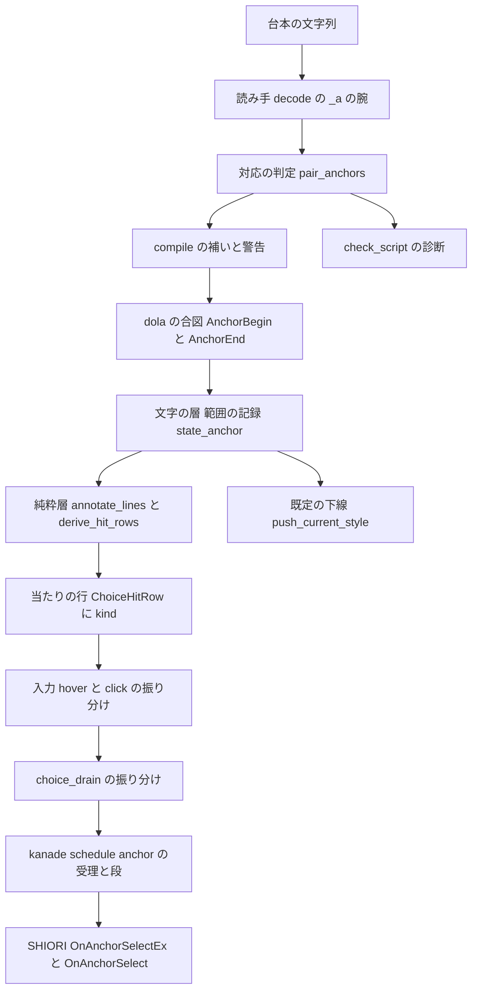
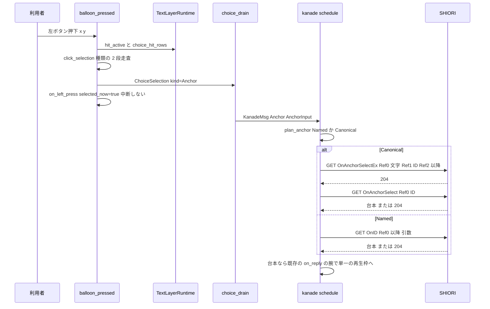
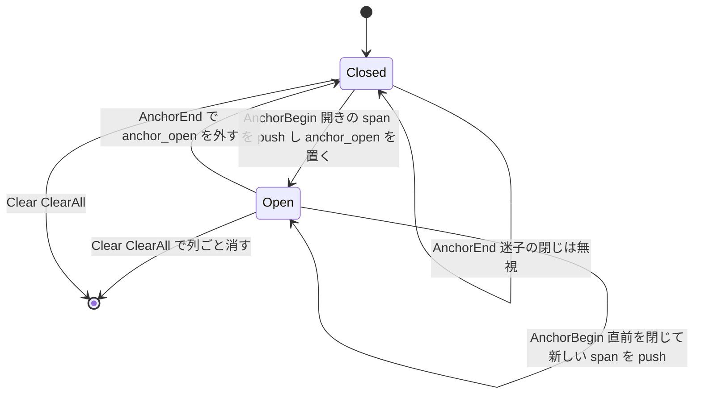

# 技術設計: areka-P0-anchor-tag-canon

> 2026-10-10・`kiro-spec-design`。入力は `requirements.md`（確定済み・要件討議の裁定 3 件を含む）・`research.md`（ギャップ分析 §1〜§8）・`brief.md`・steering（product／tech／structure／logging）・roadmap の C5 の行。コードは現在のワークツリーを読んで確かめた（引用は型名・関数名で指す）。

## Overview

**目的**: さくらスクリプトのアンカー `\_a[ID]…\_a`（バルーンの本文の中の押せるリンク）を areka で働かせる。今はタグが読み捨てられ、文字は出るが押しても何も起きず、`OnAnchorSelect`／`OnAnchorSelectEx` も送られない。本設計はアンカーの**働き**だけを扱う——4 つの形の読み取り・範囲の保持・ホバーとクリック・イベントの送出・既定の見た目 1 種類。

**利用者**: ゴースト作者（既存の辞書を書き換えずにアンカーが届く）と利用者（台詞の中のリンクを押せる）。

**影響**: 選択肢（`\q`）が通っている道——読み手 → compile → dola の合図 → 文字の層の範囲 → 当たりの行 → ホバー／押下 → kanade のカスケード——を、**同じ道のまま種類を 1 つ増やす**形で広げる。新しく作るのは「範囲の開きと閉じ」（選択肢に無い構造）と「kanade の受理（柵も帳簿も無い）」の 2 点だけで、残りは既存の部品に条件を 1 つ足すか、種類を見て振り分けるだけにする。

### Goals

- `\_a` の 4 つの形を読み、開きから閉じまでに表示された文字の並びを押せる範囲にする（要件 1・2）。
- 範囲のホバーは選択肢と同じ強調、押下はアンカーの選択として消費し、台詞を中断しない（要件 3）。
- `OnAnchorSelectEx` → 204 のときだけ `OnAnchorSelect`、`On` 始まりは逐語の直接送出。Reference は ukadoc どおり（要件 4）。
- 既定の見た目＝マウスが乗っていないときは下線・乗っているときは選択肢と同じ強調（要件 5）。
- `check_script` が `\_a` を誤診しない・崩れた形は本番と同じ内容の警告（要件 6）。
- 互換記録・網羅台帳の更新（要件 7）と決定論テスト（要件 8）。
- 後の 3 spec（`range-choice-tag`・`link-context-copy`・`balloon-link-hover`）が同じ範囲の仕組みに乗れること。

### Non-Goals

- 見た目の作者指定（`\f[anchor*]` 16 項目×3 状態・descript `anchor.*` 族・訪問済み・縦書きの下線の位置）→ `areka-P0-anchor-style-canon`。本 spec では受け取って保持するだけ（今の `unowned_vocab` のまま）。
- `\__q`（範囲の選択肢）→ `areka-P0-range-choice-tag`。
- `OnAnchorHover`・行き先の説明 → `areka-P0-balloon-link-hover`。右クリックのコピー → `areka-P0-link-context-copy`。
- アンカーから OS を呼ぶこと（ゴーストが `\j[…]` 等を返す正典の作法で足りる）。
- 選択肢 `\q` の働き・見た目・時間切れの変更。

## Boundary Commitments

### This Spec Owns

- 読み手の命令 `Instruction::Anchor`／`Instruction::AnchorEnd` と、`decode_tag`／`decode_bare` の `"_a"` の腕。
- 開きと閉じの対応の判定（純粋関数 `pair_anchors`）と、その結果を使う compile の補いと警告、`check_script` の診断。
- dola の合図 `CueCommand::AnchorBegin`／`CueCommand::AnchorEnd` と、その網羅の match の追随。
- 文字の層の**範囲の種類** `SpanKind`（選択肢／アンカー）と、アンカーの範囲の記録（開き・伸長・閉じ・消去）・既定の下線。
- 当たりの行とホバー・押下の**種類の振り分け**（`ChoiceHitRow.kind`・`ChoiceSelection.kind`・`KanadeMsg::Anchor`）。
- kanade のアンカーの受理（`schedule/anchor.rs`）・`OnAnchorSelectEx`／`OnAnchorSelect` の組み立て・`On` 始まりの直接送出・失敗の 204 扱い。
- 互換記録 `doc/anchor-compat.md`・`COMPAT_ARCHITECTURE.md` §8 の 1 行・網羅台帳 3 本と `roadmap-draft.md` の宛先の数。

### Out of Boundary

- `\f[anchor*]`・`anchor.font.color`・descript `anchor.*` 族の意味付け（`look.rs` の `is_unowned`／`Note::AnchorColorAsDefault` の腕には触らない）。
- 選択肢の柵（`BarrierKind::WaitForChoice`）・時間切れ・帳簿（`ChoiceState`）・dola の `pending_choices`——アンカーはこれらに**乗らない**。
- `emo2_boot/consumer_ledger.rs` と emo2_boot のほかのファイル・`menu/`・seriko・`shell/` の読み手（C5 の約束）——本設計は専用の合図を選ぶので触らない。
- バルーンの時間切れの抑止の観測（`observe_suppression`）——`choice_active` の意味を「選択肢だけ」に保つことで触らない。

### Allowed Dependencies

- `areka-parsers`（字句は `sakura-bare-tag-lexer` で済み・`Token::Tag{word:"_a"}` と `Token::Bare("_a")` をそのまま使う）。
- `dola::cue`（`CueCommand` に種類を 2 つ足す・`command_carrier` は使わない）。
- `areka-emo-text` の純粋層（`annotate_lines`／`derive_hit_rows`／`decorate_canvas`／`to_window_physical` は無改変で使う）と `text-decoration-canon` の下線の描画（`apply_font_ranges` の `SetUnderline`）。
- `crates/areka/src/input_events/` の選択肢の結線（`hit_choice_row`／`hover_action`／`click_selection`／`judge_box_*`／`on_left_press`／`on_box_press`）。
- `areka-kanade` の `events::on_choice_named`・`EventId::Choice`・`is_allowed_choice_event`・`value_replaces_active_talk`・`on_reply` の置き換えの腕。
- 依存の向き（変えない）: `areka-parsers` → `dola` → `areka-sakura` → `areka-emo-text` → `areka`（結線）／`areka-kanade` は `areka` から受け取るだけ。`areka-mcp` の `Kind` は `areka` が使う。

### Revalidation Triggers

- `ChoiceSpan`／`ChoiceHitRow`／`ChoiceSelection` に `kind` が乗る → `range-choice-tag`・`link-context-copy`・`balloon-link-hover` はこの欄を前提にしてよい（本 spec の後に設計する 3 本の前提）。
- `CueCommand` の種類が 2 つ増える → dola の次の版は公開 API の追加（`release-cycle` の記録へ）。
- `choice_active` の意味が「選択肢の範囲があるか」に固定され、新しい `hit_active` が「押せる範囲があるか」になる → 入力側でどちらを見るかを変える spec は本書の表で確かめる。
- `check_script` の診断の種類に `unpaired_tag` が増える → `doc/ssp-mcp/areka-tools.md` ⑶ の表に行が増える。

## Architecture

### Existing Architecture Analysis

`research.md` §2 のとおり、選択肢の道は全段そろっていて箱（シェルの中のバルーン）も同じ純関数を使う。アンカーと構造が違う点は 2 つ——⑴ 開きと閉じのあいだに別の合図（文字・改行・装飾）が流れる「範囲」であること、⑵ kanade に待ちの帳簿が無いこと。設計はこの 2 点だけを新しく作り、ほかは「種類を見る」に留める。

確かめた事実のうち設計を左右するもの:

- 文字の層の純粋関数（`annotate_lines`／`derive_hit_rows`／`decorate_canvas`）は `ordinal` と `glyph_range` しか読まない。`ChoiceSpan` に種類を足しても無改変で両方に効く。
- `hit_choice_row` は後ろから走査（後定義が手前）。選択肢がアンカーの範囲の中に入る形（`\_a[x]…\q[題,ID]…\_a`）では選択肢の方が後に記録されるので構造的に選択肢が勝つが、要件 3.5 は**種類で**順を決めるものなので、走査を種類の 2 段にして固定する。
- 普通のバルーンの「中断」は左ダブルクリックだけ（`on_left_press` の `judge_press`）。単クリックの押下で `selected_now=true` を渡せば、続く 2 打目が `ConsumedBySelection` になる＝選択肢と同じ仕組みで要件 3.3／3.4 を満たす。箱は `judge_box_press` の ⑴ で `selected_now` が真なら `ConsumedBySelection`。
- kanade のアクターは SHIORI の往復を**同期**で行い、応答を `Input::ShioriReply` として直ちに状態機械へ戻す（`execute_batch` の `round_trip_request` → 次の `step`）。ほかの `KanadeMsg` はその間に読まれない。したがって「送出から応答までの間に別の押下が割り込む」ことは構造上起きず、アンカーの段の記憶は 1 回の `step` の連鎖の中だけで生き、要件 4.11（高々 1 回）は入力 1 件＝GET の連鎖 1 本で成立する。
- `ActorTextState` の空回し（`lookahead.rs` の `begins_with`）は `items`・`glyph_styles`・`styles` の前方一致だけを比べる。アンカーの下線を装飾番号に焼いても、空回しと本番は同じ合図を同じ順に適用するので一致が崩れない。
- `check_script` は `parse_noted` の `Read`（命令＋位置＋印）の列を `diagnose` に渡す。開きと閉じの対応は `Read` の `instruction` の列から同じ純粋関数で判定できる。

### Architecture Pattern & Boundary Map



**Architecture Integration**:

- 選んだ型: 「選択肢の道に種類を 1 つ足す」。新しい層は作らず、各層に腕（match の arm）を足す。
- 境界: 範囲の**構造**（開き・閉じ・対応の判定）は読み手〜compile〜文字の層が持ち、範囲の**働き**（当たり・ホバー・押下）は選択肢と共通の純関数が持ち、**イベント**は kanade の新しいファイルが持つ。
- 保つ既存の型: `ordinal` を主キーとするホバー／当たり、`Clear`／`ClearAll` での原子的な消去、箱と普通のバルーンの同一関数、kanade の `origin` 文字列による応答の経路、`On` 始まりの逐語受理。
- 新しい部品の理由: `pair_anchors`（判定を 1 か所にして compile と `check_script` で同じ内容にする・要件 6.3）、`state_anchor.rs`（範囲の開き・伸長・閉じは選択肢に無い）、`schedule/anchor.rs`（帳簿の無い受理と 2 段のカスケード・肥大ファイルへ腕だけ）。
- steering との整合: `\!` の汎用キャリアは `\!` の話であり、`\q`→`Choice`・`\_l`→`Cursor` と同じ「第一級の合図」を選ぶ（memory `areka-bang-commands-generic-carrier` の規律の内）。記録はログ優先（棄却の経路に必ず `warn!`／`error!`）。1 ファイル 1,000 行の目安を守り、kanade の肥大ファイルには腕だけを足す。

### 主要な設計判断（research §7 の議題への答え）

| 議題 | 選んだ案 | 理由（短く） |
|---|---|---|
| 1. dola の合図の形 | **②-A 専用の種類 2 つ** `CueCommand::AnchorBegin{id, references}`／`CueCommand::AnchorEnd` | 汎用キャリア（②-C）は `\_a[]`（空 ID の開き・要件 1.11）と閉じ `\_a` がどちらも空の引数列になり区別できない。印を足すと正準形から外れる。さらに `consumer_ledger.rs` に行が要り C5 の約束に触れる。②-A は網羅の match 4 か所＋檻 2 本の追随で済み、`has_choice`・`pending_choices`・`choice_active` に条件を足さずに要件 2.5／2.6 を満たす |
| 2. 範囲の持ち方 | **③-i 1 つの列に種類を乗せる**＝`ChoiceSpan` に `kind: SpanKind` を足し、`ordinal` は選択肢とアンカーで共通の通し番号 | 純粋層・ホバー・当たり・箱の結線が無改変で両方を扱う。後の 3 spec が同じ列に乗れる。`choice_active` だけを `kind == Choice` で絞り、押せる範囲の有無は新しい `hit_active` で見る |
| 3. 既定の下線 | **⑤-a 装飾番号に焼く**＝アンカーが開いている間、`push_current_style` が `current` の写しに `underline = true` を立てて `intern` する | 描画は無改変（`apply_font_ranges` が `SetUnderline`）、縦書きの位置も既存どおり（要件 5.3）、空回しと本番が同じ番号になる。作者の `\f[underline,false]` を範囲の中で書いてもアンカーの下線が勝つ（areka の裁定・互換記録へ） |
| 4. 崩れた形の判定の置き場 | **④-b 共有の純粋関数** `areka_sakura::anchor_pair::pair_anchors`（compile と `check_script` が同じ結果を読む）。`check_script` の種類は新しい **`unpaired_tag`** | 読み手は転記層のまま。判定が 1 か所なので「本番と同じ内容の警告」が構造で成立する。既存の種類（`unreadable_argument`＝引数の話・`ignored`＝効かない話）はどれも内容が違うため新設 |
| 7. `On` 始まりの受理 | **`EventId::Choice` と `on_choice_named` をそのまま使う**（新しい variant は足さない） | 受理規則（`starts_with("On")`）も Reference の割付（Ref0 以降＝引数）も選択肢と同一。`actor.rs` の `origin` の固定ラベル `"OnChoiceEvent"` がアンカー由来にも付く点は記録だけの違いで、応答の経路は段の記憶（`State.anchor`）で決まる。variant の doc を「作者が ID に書いた任意名（選択肢・アンカー）」に改める 1 行だけ |

そのほかの決め:

- **読み手の命令の形**（research §4.1）: ①-a 専用 variant。`Instruction::Anchor(Anchor{id, references})`（開き・`\_a[ID]`／`\_a[ID,r2,…]`／`\_a[OnID,r0,…]` は全部これ）と `Instruction::AnchorEnd`（閉じ）。`On` 始まりかどうかは読み手で区別しない（意味付けは kanade の `plan_anchor`）。
- **`\_a[]`**（要件 1.11）: `id = ""`・印なし。`ArgumentDefaulted` を付けない。
- **Reference0 の文字**（research §8-2）: 開きから閉じまでに items へ追記された書記素クラスタをそのまま連ねた文字列（改行・装飾の印は含めない）。1 字ずつ出ている途中でも、合図を適用した時点の範囲全体の文字（表示待ちを含む）を載せる。
- **kanade の在庫の記憶**: `State.anchor: Option<AnchorStage>`（`SelectEx{id}`＝`OnAnchorSelectEx` の応答待ち・`Final`＝最終段の応答待ち）。往復が同期なので 1 回の `step` の連鎖の中だけで生きる。
- **research §8-5（in-flight 中の 2 回目）**: 上の同期の事実により到達しない。棄却の腕は作らず、設計の注記と互換記録に残す。
- **互換記録の置き場**（research §7-7）: 新しい `doc/anchor-compat.md`（`choice-cascade-compat.md` と同じ provenance 3 値）。既存の選択肢の台帳は「正典引用はその spec の research から転記」と宣言しているので混ぜない。
- **文書のずれ**（research §8-6・`areka-tools.md` の「23 組」）: 本 spec は `consumer_ledger.rs` に触らないので直さない（`/kiro-discovery` へ）。

### Technology Stack

| 層 | 選択 | 本 feature での役割 | 注記 |
|---|---|---|---|
| 台本の読み手 | `areka-parsers`（Rust・既存） | `"_a"` の腕 2 つ | 新しい依存なし |
| 合図 | `dola` 0.0.2（crates.io 公開） | `CueCommand` に 2 種類 | 次の版は API 追加（`release-cycle` へ申し送り） |
| 文字の層 | `areka-emo-text`（DirectWrite） | 範囲・下線・当たり | 新しいファイルは `lib.rs` の一覧へ登記（C5 の席） |
| 入力 | `crates/areka/src/input_events/` | 種類の振り分け | 新しい依存なし |
| 運行 | `areka-kanade` | 受理と 2 段のカスケード | `tracing` の記録 |
| 道具 | `areka-mcp`（`check_script`） | 診断の種類 1 つ | `doc/ssp-mcp/areka-tools.md` の表 |

## File Structure Plan

### 新しいファイル

```
crates/areka-sakura/src/
├── anchor_pair.rs              # 純粋: 開きと閉じの対応の判定 pair_anchors（compile と check_script が共有）
└── anchor_pair_tests.rs        # 1.8〜1.10 と End/Quit で止まることの固定
crates/areka-sakura/src/
└── compile_anchor_tests.rs     # 4 形 → 合図・補いの閉じ・警告 1 件・柵を出さない（2.5）
crates/areka-parsers/src/sakura/
└── decode_anchor_tests.rs      # 1.1〜1.6・1.11（文字列だけから）
crates/areka-emo-text/src/
├── state_anchor.rs             # ActorTextState のアンカーの範囲: 開き・伸長・閉じ・消去・開いている印（state.rs の #[path] の子）
├── state_anchor_tests.rs       # 範囲の伸長・Reference0 の文字・重なり/迷子の閉じの防御・Clear・下線の焼き込み・空回しは記録を出さない
└── choice_anchor_tests.rs      # アンカーの範囲が折り返しをまたぐ行の分割・部分表示の打ち切り・選択肢との混在（kind を持つ列で annotate_lines/derive_hit_rows）
crates/areka-kanade/src/
├── anchor_input.rs             # AnchorInput（UI → kanade の知らせの型）
└── schedule/anchor.rs          # AnchorStage・plan_anchor・on_anchor・on_anchor_reply（choice.rs に倣う）
crates/areka-kanade/src/schedule/
└── anchor_tests.rs             # 4.1〜4.6・4.9〜4.11・Steady 以外の棄却・Reference の割付（模擬 SHIORI 不要の純粋状態機械）
doc/
└── anchor-compat.md            # 互換記録（provenance 3 値・要件 7.1／7.2）
```

`crates/areka-emo-text/src/lib.rs` の `PURE_SOURCES`（母数 73）へ `state_anchor.rs`・`state_anchor_tests.rs`・`choice_anchor_tests.rs` を登記する（純粋層。`windows` 系を使わない）。

### 変更するファイル

| ファイル | 変更 |
|---|---|
| `crates/areka-parsers/src/sakura/model.rs` | `Instruction::Anchor(Anchor)`・`Instruction::AnchorEnd`・`pub struct Anchor{id, references}` |
| `crates/areka-parsers/src/sakura/decode.rs` | `decode_tag` の `"_a"` → `decode_anchor(args)`（第 1＝id・以降＝references・空は id=""）／`decode_bare` の `"_a"` → `AnchorEnd` |
| `crates/areka-parsers/src/sakura/mod.rs` | `pub use model::Anchor` |
| `crates/areka-parsers/src/sakura/parse_bare_tag_tests.rs`・`parse_word_boundary_tests.rs`・`parse_noted_tests.rs` | `\_a` を素通しと固定している見本を `\_n`／`\_s` 等の無所有タグへ置き換え、`anchor_pair_shows_only_the_body` は本 spec の読み取り（`Anchor`・`Text`・`AnchorEnd`・`Text`）に書き換える（要件 8.2） |
| `crates/areka-sakura/src/lib.rs` | `pub mod anchor_pair; pub use anchor_pair::{pair_anchors, AnchorFinding, AnchorIssue}` |
| `crates/areka-sakura/src/compile.rs` | 走査の前に `pair_anchors` を 1 回呼び、`Anchor`／`AnchorEnd` の腕 2 つ（補いの閉じ・迷子の閉じの無視・警告）、走査の終わりで閉じ無しの補い。柵の判定 `has_choice` は無改変 |
| `crates/areka-sakura/src/compile_arm_tests.rs` | catch-all の除外集合が `Raw` だけであることの檻に新しい variant を足す（必要なら） |
| `crates/dola/src/cue/command.rs` | `CueCommand::AnchorBegin{id, references}`・`CueCommand::AnchorEnd`（`references` は `Choice` と同じ `serde(default, skip_serializing_if)`） |
| `crates/dola/src/cue/sink.rs` | `cue_target_of` の腕 2 つ → `Some(CueTarget::Balloon)` |
| `crates/dola/tests/cue/sink_test.rs` | 網羅の檻 `cue_target_of_classifies_every_variant` に 2 種類 |
| `crates/dola/src/cue/command_tests.rs`・`crates/dola/tests/cue/sheet_test.rs` | 手書きの「全 variant」の列（`cue_command_ten_variants`・「presentation コマンドは 10 種」）を 12 種へ揃える（赤にはならないが主張が嘘になる） |
| `crates/areka-ghost/src/sink.rs` | `command_kind` の腕 2 つ（`"AnchorBegin"`／`"AnchorEnd"`）とその檻 |
| `crates/areka-emo-text/src/state.rs` | `ChoiceSpan.kind: SpanKind`・`pub enum SpanKind{Choice, Anchor}`・`ActorTextState.anchor_open: Option<usize>`・`apply_cue` の腕 2 つ（`state_anchor.rs` へ委譲）・`Text`／`Choice` の腕で追記の直後に `extend_open_anchor`・`#[path = "state_anchor.rs"] mod anchor;` |
| `crates/areka-emo-text/src/state_decoration.rs` | `push_current_style` が開いているアンカーの間は `underline = true` の写しを `intern`（3 行） |
| `crates/areka-emo-text/src/actor.rs` | `ChoiceHitRow.kind`・`choice_active` を `kind == Choice` に絞る・新しい `hit_active(actor)`（種類を問わず範囲があるか）・`apply_cue` の「状態へ渡すだけ」の腕の列に 2 種類 |
| `crates/areka-emo-text/src/actor_present.rs` | `ChoiceHitRow` を組むときに `kind: span.kind` を写す（1 行） |
| `crates/areka-emo-text/src/lib.rs` | `PURE_SOURCES` に 3 ファイル・母数 73 → 76 |
| `crates/areka/src/input_events/balloon.rs` | `ChoiceSelection.kind: SpanKind`・`hit_choice_row` を種類の 2 段走査（選択肢を後ろから → 当たらなければアンカーを後ろから）・`click_selection` が `kind` を写す |
| `crates/areka/src/input_events/balloon_pressed.rs`・`balloon_moved.rs`・`balloon_exit.rs` | `rt.choice_active(&actor)` → `rt.hit_active(&actor)`（各 1 行）。押下の `selected_now` は種類を問わず真 |
| `crates/areka/src/input_events/shell_box_handler.rs` | `read_point` の `active` と、**窓の離脱の道**（`hover_action` に `rt.choice_active(&actor)` を渡している箇所）の 2 か所を `hit_active` に（各 1 行。離脱で箱のアンカーの強調を戻す＝要件 3.2／3.7）。`send_selection` の記録に `kind` |
| `crates/areka/src/input_events/shell_box.rs` | 無改変（`judge_box_click`／`judge_box_press` はそのまま）。`BoxPressVerdict::ConsumedBySelection` の doc を「選択肢・アンカーのどちらでも」に |
| `crates/areka/src/input_events/choice_drain.rs` | `forward_all` が `kind` で `KanadeMsg::Choice`／`KanadeMsg::Anchor` に振り分ける（`to_anchor_input` を足す） |
| `crates/areka/src/input_events/balloon_pure_core_tests.rs`・`shell_box_tests.rs`・`balloon_test_support.rs`・`balloon_wiring_tests.rs` | `kind` の欄の追随と、3.5 の順・箱の結論のアンカー版 |
| `crates/areka-kanade/src/msg.rs` | `KanadeMsg::Anchor(AnchorInput)`（1 行）・`EventId::Choice` の doc 1 行 |
| `crates/areka-kanade/src/lib.rs` | `pub mod anchor_input; pub use anchor_input::AnchorInput;` |
| `crates/areka-kanade/src/actor.rs` | `KanadeMsg::Anchor(a) => Input::Anchor(a)`（1 行） |
| `crates/areka-kanade/src/schedule/mod.rs` | `Input::Anchor(AnchorInput)`・`State.anchor: Option<AnchorStage>`・`Input::Anchor` の腕（`anchor::on_anchor` を呼ぶ 1 行。Steady の判定と棄却の `warn!` は `anchor.rs` の中）・横断の `Failed`→Fault の免除条件に `state.anchor.is_some()`・`mod anchor;` |
| `crates/areka-kanade/src/schedule/steady.rs` | `on_reply` の先頭に段の記憶の腕（`anchor::on_anchor_reply` へ委譲・`Value` は既存の腕へ流す）。5〜6 行 |
| `crates/areka-kanade/src/schedule/events.rs` | `ALLOWED_EVENT_IDS` に `OnAnchorSelectEx`・`OnAnchorSelect`／`on_anchor_select_ex`・`on_anchor_select`（`on_choice_select_ex`／`on_choice_select` と同じ形）。ファイル冒頭の表に 2 行 |
| `crates/areka-kanade/src/schedule/events_change_tests.rs` | 許可表の数の檻（`ALLOWED_EVENT_IDS.len()` の 51）を 53 へ |
| `crates/areka/src/mcp/check_script_judge.rs` | `pair_anchors` を 1 回呼び、`Anchor`／`AnchorEnd` の腕で当該位置の見つかりを `Kind::UnpairedTag` で出す。文言の定数 3 つ |
| `crates/areka/src/mcp/check_script_judge_tests.rs` | 4 形で `unknown_tag`／`unknown_command` が出ないこと・崩れた 3 形の行（表の 15〜17 行目） |
| `crates/areka-mcp/src/tools/check_script.rs` | `Kind::UnpairedTag` → `"unpaired_tag"` |
| `crates/areka-mcp/src/tools/check_script_tests.rs` | 種類と名前の対応の表（`Kind::UnknownTag` → `"unknown_tag"` の列挙）に `UnpairedTag` → `"unpaired_tag"` を足す |
| `doc/ssp-mcp/areka-tools.md` | ⑶ の表に `unpaired_tag` の 3 行（15〜17）と文言 |
| `doc/ukadoc-coverage/ledger/sakura-script.toml` | 根 2 件（`\_a[ID,r2,r3...]`・`\_a[OnID,r0,r1...]`）を `implemented`・`\f[anchor*]` 16 行の `owner` を `areka-P0-anchor-style-canon` へ |
| `doc/ukadoc-coverage/ledger/assets.toml` | descript `anchor.*` 43 行の `owner` を `areka-P0-anchor-style-canon` へ |
| `doc/ukadoc-coverage/ledger/shiori.toml` | `OnAnchorSelect`・`OnAnchorSelectEx` を `implemented`・`owner = "areka-P0-anchor-tag-canon"` |
| `doc/ukadoc-coverage/roadmap-draft.md` | `[[spec]] areka-P0-anchor-tag-canon` の `owner_count` を数え直し（61 → 4）・`[[spec]] areka-P0-anchor-style-canon`（`stage = "A"`・`bundle = "バルーンのリンク"`・`owner_count = 59`）を足し `[briefs].count` を 1 増やす（`ukadoc-survey` の整合の檻 a・b・c・f が見る） |
| `doc/ukadoc-coverage/briefing.md` | `[[barrier]] page = "list_shiori_event"` の `implemented`（50 → 52）と `absent`（236 → 234）を数え直す（`briefing_arms.rs::distribution_findings` が見る） |
| `doc/ukadoc-coverage/report/{sakura-script,shiori,assets}.md`・`report/summary.md` | **手で直さず**作り直す: `cargo run -p ukadoc-survey -- report` と `report-summary`（`DomainReportStale`・`summary_findings` の全文一致が見る。先例は `choice-script-prefix` のタスク）。台帳・`briefing.md`・`roadmap-draft.md`・報告の作り直しは **1 タスク**にまとめる |
| `doc/COMPAT_ARCHITECTURE.md` | §8 に 1 行（詳細は `doc/anchor-compat.md` へのポインタ） |

### C5 の約束との照合

- 触らない約束のファイル（`emo2_boot/consumer_ledger.rs`・emo2_boot のほか・`menu/`・seriko・`shell/` の読み手）には**触らない**。専用の合図（②-A）を選んだので `consumer_ledger.rs` は不要。
- 約束の一覧に名前の無い（禁止もされていない）ファイル: `crates/areka-mcp/src/tools/check_script.rs`（種類 1 つ）・`doc/ssp-mcp/areka-tools.md`（表 3 行）・`doc/ukadoc-coverage/roadmap-draft.md`（宛先の数）・`crates/areka-ghost/src/sink.rs`（網羅の腕）・`crates/dola/tests/cue/sink_test.rs`（檻）・`doc/ukadoc-coverage/ledger/assets.toml`（持ち主の付け替え）。C5 の 8 本でこれらを触るものは居ない（⑦ `mcp-stdio-bridge` は `areka-mcp/src/help.rs` と `help_tests.rs` だけ）。

## System Flows

### 押下からイベントまで



- 段の記憶 `State.anchor` は GET を出す直前に置き、応答で `take` する。往復が同期なので別の入力は割り込まない。
- `Value` はアンカーの腕では扱わず既存の `on_reply` へ流す（`talk: None` なら起動・`talk: Some` なら `value_replaces_active_talk(origin)` で置き換え＝要件 4.8）。`NoContent`／`Failed`／想定外は段の記憶だけで捌く。

### 文字の層の範囲



- 重なりと迷子の閉じは compile が既に補っているので、文字の層の腕は**防御**（`debug!`）であり警告は出さない（要件 1.9／1.10 の警告 1 件は compile の責務・要件 2.10）。

## Requirements Traceability

| 要件 | 要約 | 部品 | 契約 | 流れ |
|---|---|---|---|---|
| 1.1 | `\_a[ID]` | `decode_anchor` | `Instruction::Anchor{id, references: []}` | — |
| 1.2 | `\_a[ID,r2,…]` | `decode_anchor` | `references` 記述順 | — |
| 1.3 | `\_a[OnID,r0,…]` | `decode_anchor`・`plan_anchor` | 読み手は区別せず kanade が `On` を見る | 押下→イベント |
| 1.4 | 閉じ `\_a` | `decode_bare` | `Instruction::AnchorEnd` | — |
| 1.5 | 区切り・引用 | 字句（既存） | `Token::Tag{args}` | — |
| 1.6 | 知らないタグにしない | `decode_tag`／`decode_bare` の腕 | `UnknownTag` を付けない | — |
| 1.7 | あいだの文字・改行・装飾 | compile（0 秒の合図）・`state_anchor` | 範囲＝開き〜閉じの追記 | 範囲 |
| 1.8 | 閉じ無し | `pair_anchors`・compile | `AnchorIssue::Unclosed`→末尾に `AnchorEnd`＋`warn!` | — |
| 1.9 | 開きの重なり | `pair_anchors`・compile | `AnchorIssue::Reopened`→直前を閉じる＋`warn!` | — |
| 1.10 | 迷子の閉じ | `pair_anchors`・compile | `AnchorIssue::StrayClose`→無視＋`warn!` | — |
| 1.11 | 空の ID | `decode_anchor` | `id = ""`・印なし | — |
| 2.1 | 表示中は押せる | 純粋層（既存）・`hit_active` | `derive_hit_rows` | 範囲 |
| 2.2 | 未表示は含めない | `annotate_lines`（既存） | 配置済みグリフ数で打ち切り | 範囲 |
| 2.3 | 折り返し | `annotate_lines`（既存） | 行ごとの `LineChoiceSegment` | 範囲 |
| 2.4 | 話している間も押せる | 入力（既存） | hover/click は `talking` を見ない | — |
| 2.5 | 柵・時間切れ無し | compile | `has_choice` は `Choice` だけ | — |
| 2.6 | 閉じを遅らせない | `choice_active` | `kind == Choice` に絞る | — |
| 2.7 | 消えたら押せない | `actor.rs` の `Clear`／`ClearAll`（既存） | 列・hover・snapshot を原子的に消す | 範囲 |
| 2.8 | 複数アンカー | `ordinal` | 通し番号 | — |
| 2.9 | 箱も同じ | `present_actor`（既存） | 同じ関数 | — |
| 2.10 | 空回しで二重に出さない | compile（1 回）・`state_anchor`（`quiet`） | 警告は compile だけ | — |
| 3.1 | ホバーの強調 | `decorate_canvas`（既存） | `hover` の ordinal | — |
| 3.2 | 離れたら戻す | `hover_action`・`balloon_exit` | `hit_active` を見る | — |
| 3.3 | 押下を重ねない | `balloon_pressed` | `selected_now = true` | 押下 |
| 3.4 | 話している最中 | `on_left_press`／`judge_press`（既存） | `ConsumedBySelection` | 押下 |
| 3.5 | 選択肢を先に | `hit_choice_row` | 種類の 2 段走査 | 押下 |
| 3.6 | ほかの押下は不変 | 入力（既存） | `None` なら今の道 | — |
| 3.7 | 箱 | `judge_box_click`／`judge_box_press`（既存） | `selected_now` | 押下 |
| 3.8 | 右・中は無視 | `left_down`（既存） | — | — |
| 4.1 | `OnAnchorSelectEx` の Reference | `on_anchor_select_ex` | Ref0=文字・Ref1=ID・Ref2..=引数 | 押下→イベント |
| 4.2 | 204 なら `OnAnchorSelect` | `on_anchor_reply` | `AnchorStage::SelectEx{id}`→`on_anchor_select` | 押下→イベント |
| 4.3 | 台本なら送らない | `on_anchor_reply` | `Value` は既存の腕へ・次段なし | 押下→イベント |
| 4.4 | `On` 始まり | `plan_anchor`→`on_choice_named` | Ref0..=引数 | 押下→イベント |
| 4.5 | 逐語の受理 | `EventId::Choice`・`is_allowed_choice_event`（既存） | `starts_with("On")` | — |
| 4.6 | 引数無しは位置を作らない | `on_anchor_select_ex`／`on_choice_named`（既存の規則） | `Vec` をそのまま | — |
| 4.7 | 共通ヘッダ | `ExecutionStatus::derive(snapshot)`（既存） | `state.snapshot()` | — |
| 4.8 | 単一の再生枠 | `on_reply` の置き換えの腕（既存） | `value_replaces_active_talk` | 押下→イベント |
| 4.9 | 204 で続ける | `on_anchor_reply` | `Final` の 204→何もしない | — |
| 4.10 | 失敗は 204 と同じ | `on_anchor_reply`・`mod.rs` の免除 | `error!` `anchor_shiori_failed_as_204` | — |
| 4.11 | 高々 1 回 | 同期の往復（構造） | 入力 1 件＝GET の連鎖 1 本 | — |
| 4.12 | kanade で照合しない | `on_anchor`（帳簿なし） | 届いたものをそのまま送る | — |
| 5.1 | 下線 | `push_current_style` | `underline = true` を焼く | — |
| 5.2 | ホバーは選択肢と同じ | `decorate_canvas`（既存） | — | — |
| 5.3 | 下線の位置 | `apply_font_ranges`（既存） | `SetUnderline` | — |
| 5.4 | 作者指定は保持だけ | `look.rs`（触らない） | `unowned_vocab` | — |
| 5.5 | 箱も同じ | 同じ装飾番号 | — | — |
| 6.1 | `unknown_tag` を出さない | 読み手の腕 | `UnknownTag` 無し | — |
| 6.2 | `unknown_command` を出さない | 専用 variant | `GenericCommand` でない | — |
| 6.3 | 崩れた形の警告 | `check_script_judge`・`pair_anchors` | `Kind::UnpairedTag` 3 文言 | — |
| 7.1 | Reference の記録 | `doc/anchor-compat.md` §1 | provenance=`ukadoc` | — |
| 7.2 | 裁定の記録 | `doc/anchor-compat.md` §2 | provenance=`areka_discretion` | — |
| 7.3 | 台帳の根 2 件＋イベント 2 件 | `sakura-script.toml`・`shiori.toml` | `implemented` | — |
| 7.4 | 見た目の行の付け替え | `sakura-script.toml`・`assets.toml`・`roadmap-draft.md` | `owner` | — |
| 7.5 | §8 の 1 行 | `COMPAT_ARCHITECTURE.md` | ポインタ | — |
| 8.1 | 読み取りのテスト | `decode_anchor_tests.rs` | — | — |
| 8.2 | 素通しの見本の置き換え | 検査 3 本 | — | — |
| 8.3 | Reference とカスケード | `schedule/anchor_tests.rs`（関数を直に呼ぶ）・`schedule/anchor_step_tests.rs`（最上位の `step` から） | — | — |
| 8.4 | 範囲の当たりと順 | `choice_anchor_tests.rs`・`balloon_pure_core_tests.rs` | — | — |
| 8.5 | 押下の結論 | `balloon_pure_core_tests.rs`・`shell_box_tests.rs` | — | — |
| 8.6 | 話している最中・消えた後 | `user_break_tests.rs`／`shell_box_tests.rs`・`actor_clear_atomicity_tests.rs` | — | — |
| 8.7 | `check_script` | `check_script_judge_tests.rs` | — | — |
| 8.8 | 実機 | 手順（Testing Strategy） | — | — |

## Components and Interfaces

| 部品 | 層 | 役割 | 要件 | 主な依存 | 契約 |
|---|---|---|---|---|---|
| `decode_anchor`／`AnchorEnd` の腕 | 読み手 | `\_a` 4 形の転記 | 1.1〜1.6・1.11・6.1・6.2 | 字句（P0） | State |
| `pair_anchors` | areka-sakura 純粋 | 開きと閉じの対応 | 1.8〜1.10・6.3・2.10 | `Instruction`（P0） | Service |
| compile の腕 | areka-sakura | 合図の発行と補い | 1.7〜1.10・2.5 | `pair_anchors`（P0）・dola（P0） | Event |
| `CueCommand::AnchorBegin`／`AnchorEnd` | dola | 合図の語彙 | 1.7 | — | Event |
| `state_anchor` | emo-text 純粋 | 範囲の記録 | 1.7・2.1〜2.3・2.7・2.8・2.10・5.1 | `ChoiceSpan`（P0） | State |
| `SpanKind`・`hit_active`・`choice_active` | emo-text | 種類と活性 | 2.6・3.2 | — | State |
| `hit_choice_row` の 2 段走査・`ChoiceSelection.kind` | 入力 | 当たりの順と振り分け | 3.3〜3.8 | `ChoiceHitRow`（P0） | Service |
| `choice_drain` の振り分け | 入力 | kanade への知らせ | 4.12 | `KanadeMsg`（P0） | Event |
| `schedule/anchor.rs` | kanade | 受理と 2 段 | 4.1〜4.11 | `events.rs`（P0）・`on_reply`（P0） | State／Event |
| `on_anchor_select_ex`／`on_anchor_select` | kanade | Reference の組み立て | 4.1・4.2・4.6・4.7 | `ExecutionStatus`（P0） | Event |
| `check_script_judge` の腕 | 道具 | 診断 | 6.1〜6.3 | `pair_anchors`（P0）・`Kind`（P0） | Service |
| 文書と台帳 | 記録 | 互換記録・網羅台帳 | 7.1〜7.5 | `ukadoc-survey` の檻（P1） | — |

### 読み手（`areka-parsers`）

#### `Instruction::Anchor`／`Instruction::AnchorEnd`

| 項目 | 内容 |
|---|---|
| 役割 | `\_a` の 4 形を意味の読みなしに転記する |
| 要件 | 1.1〜1.6・1.11・6.1・6.2 |

```rust
// model.rs
pub struct Anchor {
    /// `\_a[ID,…]` の第 1 引数（空なら ""・意味は読まない）。
    pub id: String,
    /// 第 2 引数以降（記述順・空のトークンも潰さない）。
    pub references: Vec<String>,
}
// Instruction に 2 variant: Anchor(Anchor) / AnchorEnd
```

- 事前条件: 字句が `Token::Tag{word:"_a", args}`（角括弧付き）か `Token::Bare("_a")`（閉じ）を作る（済み）。
- 事後条件: `\_a[…]` → `Anchor{id: args[0] or "", references: args[1..]}`・印なし。`\_a` → `AnchorEnd`・印なし。`\_a[]` も `Anchor{id: ""}`（`ArgumentDefaulted` を付けない）。
- 不変: 引数の区切りと引用は他の角括弧付きタグと同じ（字句の責務・1.5）。`On` 始まりの区別はしない。

### 対応の判定と compile（`areka-sakura`）

#### `pair_anchors`（新・`anchor_pair.rs`）

| 項目 | 内容 |
|---|---|
| 役割 | 命令の列から、開きと閉じの対応の崩れを位置付きで返す純粋関数 |
| 要件 | 1.8〜1.10・6.3・2.10 |

```rust
pub enum AnchorIssue {
    /// 開きに閉じが無い（走査の終わりまで）。`index` は開きの位置。
    Unclosed,
    /// 開いている間の新たな開き。`index` は新しい開きの位置（直前をここで閉じる）。
    Reopened,
    /// 開いていないのに閉じ。`index` は閉じの位置（無視する）。
    StrayClose,
}
pub struct AnchorFinding { pub index: usize, pub issue: AnchorIssue }
/// `End`／`Quit` で走査を止める（compile と同じ・それより後ろは数えない）。
pub fn pair_anchors<'a>(instructions: impl IntoIterator<Item = &'a Instruction>) -> Vec<AnchorFinding>;
```

- 事後条件: 出力は `index` 昇順（同じ位置の中は台本の出来事の順）。同じ位置に同じ種類は重ならない。同じ位置に 2 件付くのは 1 つの場合だけ — 重なりの開きが閉じられないまま終わる（`\_a[x]あ\_a[y]い`）とき、その開きの位置に `Reopened`・`Unclosed` の順で 2 件（必ず列の末尾・`Unclosed` は高々 1 件）。要件 1.8 と 1.9 がそれぞれ警告 1 件を求めるため（実装 2.1 で判明・当初の「同じ位置に 2 件は付かない」を改めた）。位置で引く側（compile・`check_script_judge`）は当該位置の全件を見る。失敗経路なし。
- compile は結果を位置で引き（`Reopened` の位置で `AnchorEnd` を先に発行・`StrayClose` の位置は発行しない・`Unclosed` は走査の終わりに `AnchorEnd` を発行）、各 1 件を `warn!` する。`check_script_judge` は同じ結果を `reads[index].span` に付けて診断にする。

#### compile の腕

- `Instruction::Anchor(a)` → `emit(scope, offset, 0.0, CueCommand::AnchorBegin{id, references})`（0 秒・`Choice`／`Cursor` と同じ）。直前が `Reopened` なら先に `AnchorEnd` を発行。
- `Instruction::AnchorEnd` → `emit(…, CueCommand::AnchorEnd)`。`StrayClose` なら発行しない。
- 走査が `End`／`Quit`／末尾で終わった時点で `Unclosed` があれば `AnchorEnd` を発行（「表示の終わりまで」）。
- 記録: `warn!(event = "anchor_unclosed" | "anchor_reopened" | "anchor_stray_close", index, id?)` を各 1 件（宛先は付けない＝既定の `areka_sakura::compile`。同じ関数の既存の警告と同じで、`RUST_LOG=areka_sakura=warn` で拾える。`id` は開きにだけある＝`anchor_stray_close` は `index` だけ）。compile は 1 台本 1 回なので空回しと二重にならない（2.10）。
- `has_choice`（柵）は `Choice` だけを数える＝アンカーだけの台本は柵を出さない（2.5）。

### 合図（`dola`）

```rust
// CueCommand に追加（Choice と同じ serde 規約）
AnchorBegin {
    id: String,
    #[serde(default, skip_serializing_if = "Vec::is_empty")]
    references: Vec<String>,
},
AnchorEnd,
```

- `cue_target_of` → `Some(CueTarget::Balloon)`（文字の層が消費）。
- 網羅の match の追随: `dola/src/cue/sink.rs`・`areka-ghost/src/sink.rs::command_kind`・`areka-emo-text/src/actor.rs`（状態へ渡すだけの列）・`areka-emo-text/src/state.rs`（実消費）。`matches!`／`if let` の所（dola `lookahead.rs`・seriko `actor.rs`・`runtime.rs` の `pending_choices`）は触らない。`emo2_boot/*_cue.rs` は `Custom` だけを見るので触らない。
- `dola` は crates.io 公開＝次の版は API の追加（minor）。`release-cycle` の記録へ申し送り（research §9）。

### 文字の層（`areka-emo-text`）

#### `SpanKind` と `ChoiceSpan.kind`

```rust
#[derive(Clone, Copy, Debug, PartialEq, Eq)]   // ChoiceSelection が Eq を派生するので Eq まで
pub enum SpanKind { Choice, Anchor }
pub struct ChoiceSpan {
    pub kind: SpanKind,          // 追加
    pub ordinal: usize,          // 選択肢とアンカーで共通の通し番号（列の添字）
    pub id: String,
    pub label: String,           // アンカーは開き〜閉じの書記素クラスタを連ねた文字
    pub references: Vec<String>,
    pub glyph_range: Range<usize>,
}
```

- 不変: `ordinal` は追記順に単調・**同じ種類の**範囲の `glyph_range` は互いに素（アンカーは選択肢を包んでよい・Data Models の不変条件を参照）・空回しの写しでは記録を出さない。
- 型名は `ChoiceSpan` のまま（名前替えの波及を避ける。doc に「選択肢とアンカーの共通の範囲」と記す）。

#### `state_anchor.rs`（新・`ActorTextState` の impl）

| 項目 | 内容 |
|---|---|
| 役割 | アンカーの範囲の開き・伸長・閉じ |
| 要件 | 1.7・2.1〜2.3・2.7・2.8・2.10・5.1 |

```rust
impl ActorTextState {
    /// AnchorBegin: kind=Anchor・glyph_range=now..now・label="" の span を push し anchor_open=Some(ordinal)。
    pub(super) fn anchor_begin(&mut self, id: &str, references: &[String]);
    /// AnchorEnd: anchor_open を外す（記録と「開いていたか」の判定は集約の側・下の項）。
    pub(super) fn anchor_end(&mut self);
    /// Text／Choice の追記の直後に呼ぶ: 開いていれば end += n・label に clusters を継ぐ。
    pub(super) fn extend_open_anchor(&mut self, clusters: &[&str]);
    /// 開いているか（push_current_style が下線を焼く判定に使う）。
    pub(super) fn anchor_is_open(&self) -> bool;
}
```

- `Clear`／`ClearAll` は既存の初期化で `choices` と一緒に `anchor_open` も `None` にする。
- `apply_cue` の `Text`・`Choice` の腕は items を extend した直後に `extend_open_anchor` を呼ぶ（2 か所）。
- 空回し（`quiet`）では記録を出さない（既存の選択肢の腕と同じ）。
- **開いた場所と閉じの届く場所のずれ**（実装 2.2 のレビューで判明・3.2 で補った）: compile は開きも閉じも「その時点のスコープ」宛てに出すが、文字の層の状態は場所（`PlaceKey`＝スコープ＋行き先）ごとなので、開いたままスコープや行き先が替わる台本（`\_a[x]あ\1い\_a\0う`）では閉じが別の場所へ届く。集約（`TextLayerState`）の側で吸収する — `open_anchor(dest, id, references)` は先に全部の場所の印を外してから宛先の場所で `anchor_begin` を呼び、`close_anchor(actor)` は宛先に関わらず全部の場所の印を外す（compile が「開いているアンカーは台本全体で高々 1 つ」を保証している）。伸長は場所ごとなので、別の場所へ追記された文字は範囲に入らない（上の例は、スコープ 0 に範囲 1 件・文字「あ」・閉じ済み、スコープ 1 は範囲なし）。開いたまま寄り道して戻ると範囲は続く（`\_a[x]あ\1い\0う\_a` → 「あう」）。
- 上の帰結として、記録（`debug!`）と `quiet` の判定は集約の側で持ち、`ActorTextState::anchor_begin(id, references)`／`anchor_end()` は記録を出さない。`Clear`／`ClearAll` の初期化は `state_decoration.rs::clear_content` にある（`choices.clear()` の隣で `anchor_open = None`）。

#### 既定の下線（`state_decoration.rs::push_current_style`）

- 開いているアンカーの間は `current` の写しに `underline = true` を立てて `intern` する。`current` そのものは変えない（作者の装飾状態に混ぜない・`\f[default]`／`\f[disable]` で戻る対象にしない）。
- 作者が範囲の中で `\f[underline,false]` を書いてもアンカーの下線が勝つ（areka の裁定・互換記録 §2）。
- `anchor-style-canon` は後にここを `anchor.style`（`square`／`underline`／`none`）の解決に差し替える。

#### `TextLayerRuntime`（`actor.rs`）

```rust
pub struct ChoiceHitRow { pub kind: SpanKind, /* 既存の欄 */ }
/// 選択肢の範囲があるか（柵・時間切れの抑止の観測に使う。意味は変えない）。
pub fn choice_active(&self, actor: &ActorKey) -> bool;   // kind == Choice に絞る
/// 押せる範囲（選択肢かアンカー）があるか（hover／click／箱の前段が見る）。
pub fn hit_active(&self, actor: &ActorKey) -> bool;      // 新
```

- `inject_choice_hover_at`・`choice_hit_rows_at`・`Clear`／`ClearAll` の原子的な消去は無改変（同じ列・同じ ordinal）。
- `present_actor` は `ChoiceHitRow` を組むときに `kind` を写す（1 行）。ホバーの強調（`decorate_canvas`）は ordinal だけを見るので無改変（3.1／5.2）。

### 入力（`crates/areka/src/input_events/`）

```rust
pub(crate) struct ChoiceSelection { pub kind: SpanKind, /* id, label, scope, references */ }
/// 種類の 2 段走査: 選択肢を後ろから → 当たらなければアンカーを後ろから（3.5）。
pub(crate) fn hit_choice_row(rows: &[ChoiceHitRow], x: f32, y: f32) -> Option<usize>;
```

- `balloon_pressed`／`balloon_moved`／`balloon_exit`／`shell_box_handler::read_point` の活性は `hit_active` を見る。`click_selection` は `kind` を写す。押下の `selected_now` は種類を問わず「選択で使った」＝`on_left_press`／`judge_box_press` は無改変で 3.3／3.4／3.7 を満たす。
- `choice_drain::forward_all` は `kind` で `KanadeMsg::Choice(to_choice_input)`／`KanadeMsg::Anchor(to_anchor_input)` に振り分ける。判断はこの 1 分岐だけ（届いたものを全件そのまま送る＝4.12）。
- 記録: 発行は `info!(event = "anchor_selected", scope, id, label, references_len)`（箱は `r#box` 付き）。送出失敗は既存の `choice_selection_send_failed` と同型の `error!`。

### kanade（`areka-kanade`）

#### `AnchorInput`（新・`anchor_input.rs`）

```rust
pub struct AnchorInput {
    pub id: String,          // 不透明・`On` 始まりならその名のイベント
    pub text: String,        // 範囲に表示された文字（Ref0 へ）
    pub scope: u32,          // 記録だけ・Reference 非搬送
    pub references: Vec<String>,
}
// KanadeMsg::Anchor(AnchorInput) / Input::Anchor(AnchorInput)
```

#### `schedule/anchor.rs`（新）

| 項目 | 内容 |
|---|---|
| 役割 | 帳簿の無い受理と 2 段のカスケード |
| 要件 | 4.1〜4.4・4.9〜4.12 |

```rust
pub(crate) enum AnchorPlan { Named, Canonical }          // script: は無い（4.1）
pub(crate) fn plan_anchor(id: &str) -> AnchorPlan;       // starts_with("On") → Named
pub(crate) enum AnchorStage {
    /// OnAnchorSelectEx の応答待ち（204 なら OnAnchorSelect へ）。
    SelectEx { id: String },
    /// 最終段（OnAnchorSelect か On 始まり）の応答待ち。`id` は記録のために持つ
    /// （空の ID は正当な形なので、空文字で代用しない。On 始まりはイベント名そのもの）。
    Final { id: String },
}
/// Steady で受理: plan → GET を 1 本積み State.anchor に段を置く。info! anchor_accepted。
pub(super) fn on_anchor(state: State, input: AnchorInput) -> (State, Vec<Action>);
/// 応答: Value → None（呼び手が既存の on_reply の腕へ流す）。
/// NoContent／Failed（error! anchor_shiori_failed_as_204）／想定外（warn!）:
///   SelectEx → on_anchor_select の GET を積み Final を置く。Final → 何もしない。
pub(super) fn on_anchor_reply(state: &mut State, stage: AnchorStage, outcome: &ShioriOutcome, origin: &'static str) -> Option<Vec<Action>>;
```

- `schedule/mod.rs` の腕は `Input::Anchor(a) => anchor::on_anchor(state, a)` の 1 行（`user_break::on_user_break` などと同じ形）。`Phase::Steady` だけ受理し、それ以外を `warn!(event = "anchor_rejected_phase")` で棄却する判定は `anchor::on_anchor` の中に置く。横断の `Failed`→Fault の免除条件を `choice_in_flight || state.anchor.is_some()` に広げる（4.10）。
- `steady::on_reply` の先頭: `if let Some(stage) = state.anchor.take() { if let Some(actions) = anchor::on_anchor_reply(&mut state, stage, &outcome, origin) { return (state, actions); } }`——`Value` はそのまま下の既存の腕へ（`talk: None` なら起動・`talk: Some` なら `value_replaces_active_talk` で置き換え・`clear_choice_ledger` も既存どおり＝4.8）。
- スナップショットは `state.snapshot()`（選択待ちの有無は帳簿から導く・アンカーは `choosing` を立てない・4.7）。
- 段の記憶は 1 回の `step` の連鎖の中だけで生きる（往復が同期）。close 系の掃除点に足す項目は無い（`take` で必ず消える）。
- 終了や切替の保留（`pending_close`／`pending_change`）がある間もアンカーは受理する（選択肢と同じ・マウスのような保留中の防御は足さない）。`On` 始まりのアンカーの応答の出所ラベルは、選択肢の `On` 始まりと同じ `"OnChoiceEvent"` のまま。

#### `events.rs`

```rust
pub fn on_anchor_select_ex(text: &str, id: &str, references: &[String], snapshot: &ExecutionSnapshot) -> ShioriCall; // Ref0=text・Ref1=id・Ref2..=references
pub fn on_anchor_select(id: &str, snapshot: &ExecutionSnapshot) -> ShioriCall;                                        // Ref0=id
// ALLOWED_EVENT_IDS に "OnAnchorSelectEx"・"OnAnchorSelect"（ukadoc の URL 注記付き）
```

- `On` 始まりは `on_choice_named(id, refs, snapshot)` をそのまま使う（`EventId::Choice`・`is_allowed_choice_event`）。
- 引数が無ければ対応する位置を作らない（既存の規則＝4.6）。

### 道具（`check_script`）

- `check_script_judge::diagnose` は `pair_anchors(reads.iter().map(|r| &r.instruction))` を 1 回計算し、`Instruction::Anchor`／`AnchorEnd` の腕で当該 `index` の見つかりを `Kind::UnpairedTag` で出す（診断は台本の順のまま）。
- 文言（ASCII）: `MSG_ANCHOR_UNCLOSED = "the anchor is not closed; playback extends it to the end of the script"`／`MSG_ANCHOR_REOPENED = "a new anchor opens before the previous one closes; playback closes the previous one here"`／`MSG_ANCHOR_STRAY_CLOSE = "no anchor is open; playback ignores this close"`。
- `areka-mcp` の `Kind::UnpairedTag` → `"unpaired_tag"`。`areka-tools.md` ⑶ の表に 15〜17 行目として足す。
- `diagnose` は `\e`・`\-` で打ち切らないが、`pair_anchors` は `End`／`Quit` で止まる。`\e` の後ろの `\_a` は再生でも読まれないので「本番と同じ内容」のまま＝`\e` の後ろの開き／閉じには診断を出さない（意図した差ではなく一致）。

## Data Models

### Domain Model

- **アンカー（範囲）**: 開きの合図から閉じの合図までに追記された文字の並び。属性＝ID・引数・表示された文字。選択肢と同じ列に `kind` 違いで並ぶ。寿命＝バルーンの本文と同じ（`Clear`／`ClearAll` で消える）。
- **選択の知らせ**: `ChoiceSelection{kind, id, label, scope, references}` → `AnchorInput{id, text, scope, references}`。
- **段の記憶**: `AnchorStage`（`SelectEx{id}` → `Final{id}`）。帳簿（候補・期限・talk_id）は持たない。
- **対応の見つかり**: `AnchorFinding{index, issue}`。

### 不変条件

- 同じ場所（普通のバルーン／箱）の列の中で `ordinal` は添字に等しく単調。**同じ種類の**範囲の `glyph_range` は互いに素。アンカーの範囲は選択肢の範囲を包んでよい（`\_a[x]…\q[題,ID]…\_a`＝要件 1.7「開きから閉じまでに表示される文字の並び」の読みどおり。Reference0 には選択肢の文字も含まれる。押下は選択肢が勝つ＝3.5）。`state.rs` の `ChoiceSpan` の doc「互いに素かつ追記順に単調」はこの文言に改め、`choice_anchor_tests.rs` の混在の檻もこの文言で固定する。
- 開いているアンカーは高々 1 つ（`anchor_open`）。compile が重なりを補っているので文字の層では到達しない（防御で閉じる）。
- `choice_active` ⇒ 列に `kind == Choice` がある。`hit_active` ⇒ 列が非空。

## Error Handling

| 場面 | 扱い | 記録 |
|---|---|---|
| 閉じ無し・重なり・迷子の閉じ | compile が補う／無視する | `warn!` `anchor_unclosed`／`anchor_reopened`／`anchor_stray_close`（各 1 件・`index`。`id` は開きにだけ付く） |
| 文字の層での重なり・迷子（到達しない防御） | 閉じる／無視 | `debug!`（空回しは出さない） |
| Steady 以外でのアンカーの知らせ | 棄却 | `warn!` `anchor_rejected_phase`（`id`・`scope`・phase） |
| SHIORI の失敗（送れない・内部の誤り） | 204 と同じ扱いで続行 | `error!` `anchor_shiori_failed_as_204`（`id`・`stage`＝`select_ex`／`final`・`origin`・`error`） |
| 想定外の応答（`Notified` 等） | 204 と同じ | `warn!` `anchor_unexpected_reply`（`id`・`stage`） |
| 送出の口が無い（`BalloonWiring` 不在等） | no-op | 既存の `error!` と同型 |
| `check_script` の崩れた形 | 診断 `unpaired_tag` | — |

棄却の経路に沈黙は無い（steering `areka-log-first-no-silent-failure`）。実機の確認は `RUST_LOG=areka_kanade=info,areka_sakura=warn` で `anchor_accepted`・`anchor_unclosed` 等を grep できる。

## Testing Strategy

判断の分岐だけを固定し、配線は再テストしない。テストは兄弟 `*_tests.rs`（1,000 行以下）。

- **読み取り**（8.1・8.2）: `decode_anchor_tests.rs`——4 形・空 ID・引数の空トークン保持・印が付かないこと。既存 3 本は `\_a` の見本を `\_n`／`\_s` 等へ置き換え、`CANONICAL_BRACKETLESS_SPELLINGS` を 10 綴りに、`anchor_pair_shows_only_the_body` を `Anchor`・`Text`・`AnchorEnd`・`Text` の期待へ。
- **対応と compile**（1.8〜1.10・2.5・2.10）: `anchor_pair_tests.rs`（正常・閉じ無し・重なり・迷子・`\e` の後ろは数えない）／`compile_anchor_tests.rs`（合図の順と 0 秒・補いの `AnchorEnd` の位置・`log-capture-kit` で `warn!` が各 1 件・アンカーだけの台本に `WaitForChoice` が無い）。
- **範囲**（8.4）: `state_anchor_tests.rs`（開き→追記→閉じで `glyph_range` と `label`・`\n` と `\f` をまたいでも文字だけ継ぐ・`Clear` で消える・下線の装飾番号が範囲の中だけに付く・`quiet` で記録なし）／`choice_anchor_tests.rs`（折り返しをまたぐ 2 行の `LineChoiceSegment`・部分表示の打ち切り・選択肢とアンカーの混在で `derive_hit_rows` の矩形）。
- **順と結論**（3.5・8.5）: `balloon_pure_core_tests.rs`——重なる矩形で選択肢が勝つ（定義順が逆でも）・`click_selection` が `kind` を写す。`shell_box_tests.rs`——アンカーの `judge_box_click` → `selected_now` → `ConsumedBySelection`。
- **話している最中・消えた後**（8.6）: `user_break_tests.rs` に「単クリックで選択（アンカー）→ 2 打目は `ConsumedBySelection`」の 1 件（`judge_press` の純粋判定）／`actor_clear_atomicity_tests.rs` にアンカーを含む列が `Clear` で `hit_active=false`・`choice_hit_rows` 空になる 1 件。
- **kanade**（8.3）: `schedule/anchor_tests.rs`（関数を直に呼ぶ 11 本）と、そこから載せる兄弟 `schedule/anchor_step_tests.rs`（最上位の `step` から通す 8 本・実装 4.3 で分けた）——`plan_anchor`・`on_anchor` の GET（Ref0=text・Ref1=id・Ref2..・空なら位置なし）・204→`OnAnchorSelect`（Ref0=id）・`Value`→`OnAnchorSelect` を送らず `StartTalk`（`talk: Some` なら置き換えで新 talk_id）・`Failed`→204 と同じ・`On` 始まり→`EventId::Choice`・Steady 以外は棄却・`choosing` を立てない・`Failed` が Fault へ倒れない（`mod.rs` の免除）。
- **道具**（8.7）: `check_script_judge_tests.rs`——4 形で `unknown_tag`／`unknown_command` が 0 件・崩れた 3 形で `unpaired_tag` と文言（表の 15〜17 行目）。
- **網羅の檻**: dola `sink_test.rs`・ghost `command_kind` の檻に 2 種類、dola の手書きの「10 種」2 檻（`command_tests.rs`・`sheet_test.rs`）を 12 種へ。kanade `events_change_tests.rs` の許可表の数 51 → 53。emo-text `lib.rs` の母数 76。`ukadoc-survey` の整合（`owner_count`・`[briefs].count`・宛先の名前の実在・`briefing.md` の barrier の数・報告 4 本の作り直し）。
- **実機**（8.8）: `AREKA_NO_ALERT=1`・`RUST_LOG=areka_kanade=info,areka_sakura=warn` で、辞書にアンカーを持つ検体ゴースト（`sample-ghost-kit` の `SAMPLES` から辞書を展開して `\_a[` を含むものを選ぶ。無ければ `target\` の下に `\_a` を使う台詞と `OnAnchorSelectEx` の答えを持つ小さな検体を置く）を起動し、⑴ 押す → 答えの台本に置き換わる、⑵ 話している最中に押しても台詞が続く、を人が見てログで裏取りする。検体はワークツリーの `target\` の下だけ。

## Supporting References

### 互換記録 `doc/anchor-compat.md` の骨子

- §1 Reference の割付（provenance=`ukadoc`）: `OnAnchorSelectEx`＝Ref0 文字／Ref1 ID／Ref2.. 引数・`OnAnchorSelect`＝Ref0 ID・`On` 始まり＝Ref0.. 引数（正典の引用は `requirements.md` 冒頭から転記）。
- §2 areka の裁定（provenance=`areka_discretion`）: 話している最中のクリックは消費して中断しない／閉じ無し＝表示の終わりまで・重なり＝直前を閉じる・迷子の閉じ＝無視／空 ID はアンカーとして成立／ID の綴りに意味を持たせない（`script:` 無し）／`OnAnchorSelect` は 204 のときだけ／選択肢を先に判定／既定の見た目は descript `anchor.style` の既定値 `underline` から借りる／範囲の中の `\f[underline,false]` よりアンカーの下線が勝つ／Reference0 は範囲の書記素クラスタを連ねた文字（改行・装飾は含めない・表示待ちを含む）／引数が無ければ位置を作らない／往復が同期なので 2 回目の押下は割り込まない。
- §3 波及: `range-choice-tag`・`link-context-copy`・`balloon-link-hover`・`anchor-style-canon`。

### `release-cycle` への申し送り

- `dola` の `CueCommand` に `AnchorBegin`／`AnchorEnd` を足した＝次の公開は API の追加（minor）。
