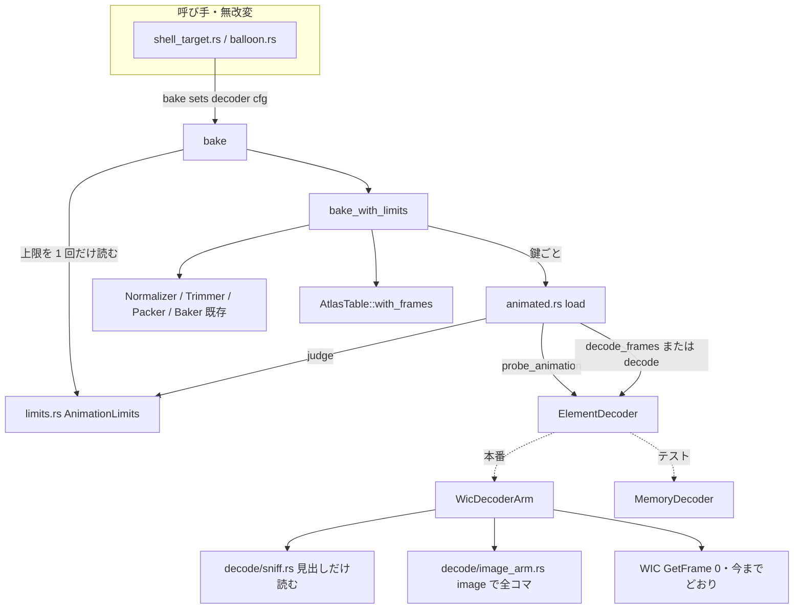
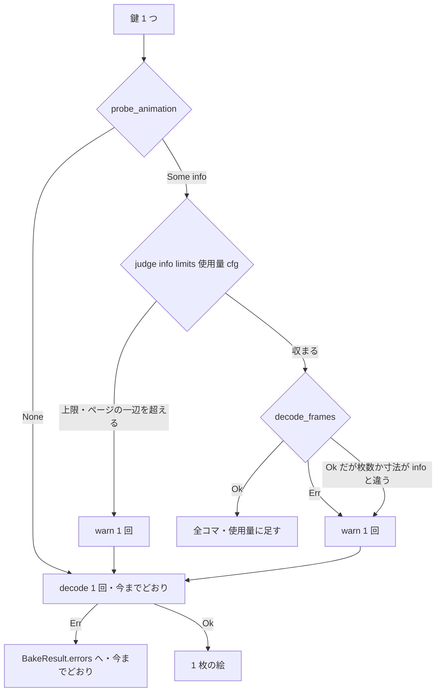

# Design Document: areka-P0-animated-image-decode

> コードの引用は「何の定義か（関数名・型名＋ファイル）」で指す。版・件数・実測値は **2026-10-04・コミット `ff308cf1` の上**で取ったもの。実測の手順と生の結果は `research.md` 9 節にある。
> 「動かして確かめた」と「ソースを読んだだけ」は本文で書き分ける。

## Overview

**Purpose**: 動く APNG・WebP をシェル（とバルーン）の絵に置いたとき、重ね済みの全コマ・コマごとの待ち時間・繰り返し回数を読み、全コマをアトラスに載せてコマの番号で引けるようにする。再生はしない（後続 `areka-P0-animated-image-playback`）。

**Users**: シェルの作者（動く絵を置くだけでよい）と、再生の spec の実装者（形式の違いを気にせず同じ形でコマを受け取る）。

**Impact**: アトラスのクレート `areka-emo-atlas` の中だけが変わる。読み手の口 `ElementDecoder` に既定の実装つきのメソッドが 2 つ増え、焼く入口 `bake` に動く絵の枝が 1 本増え、表 `AtlasTable` にコマを引く口が 1 つ増える。静止画しか持たない集合の焼いた結果は 1 つも変わらない。外部クレート `image`（機能 `png`・`webp`）が本番の依存に入り、`image-webp` は上流の GitHub の固定コミットから取り込む。

### Goals

- 動く絵かどうかを中身（先頭のチャンクの見出し）だけで見分ける。静止画の復号は今までどおり 1 回。
- 全コマ・待ち時間（ミリ秒の整数）・繰り返し回数を 2 形式で同じ形で渡す。
- 各コマを静止画 1 枚と同じ `AtlasEntry` として `ElementId` で引けるようにする（合成の側は無改変で描ける）。
- 上限（3 つ＋ページの一辺）と読み込みの失敗では 1 枚へ縮め、`warn!` を 1 回出す。失敗の一覧には載せない。
- 今の呼び手・`AtlasKey`・`manifest.rs`・`AtlasTable::new` を変えない（変更 0）。

### Non-Goals

- コマを時間で切り替えること・SERIKO への写し・`import`・interval `always`（後続 `areka-P0-animated-image-playback`）。本 spec が動かす絵は 0 枚。
- 動く GIF（開発者裁定で非対応）。GIF のための読み方・依存は 0 個。
- `.png` 以外の名前での面の発見、element定義のオプション（`--clipping` ほか）、`.pna`、`overlay` 以外の描画メソッド（いずれも変更 0）。
- 静止画の読み方の取り替え（静止画の WebP が Windows の拡張機能しだいである性質は変えない）。
- 設定ファイル・設定画面（0 個。上限は環境変数だけ）。
- 合成の側 `areka-emo-compose`・seriko の時計（触るファイル 0 個）。

## Boundary Commitments

### This Spec Owns

- 読み手の口 `ElementDecoder`（`crates/areka-emo-atlas/src/decode.rs`）の動く絵の 2 メソッドと、その入出力の型（`AnimationInfo`・`AnimatedImage`・`AnimationFrame`）。
- 動く絵の見分け（`decode/sniff.rs`）と、`image` クレートを使う読み込み（`decode/image_arm.rs`）。**`image` の型を綴るファイルはこの 1 つだけ**。
- 上限の型 `AnimationLimits`・環境変数 3 つ・判定（`limits.rs`）。
- 焼く入口の動く絵の枝（`lib.rs` の `bake`／`bake_with_limits` と `animated.rs`）。
- 表 `AtlasTable` のコマの欄（`Animation`・`LoopCount`・`AtlasTable::with_frames`・`AtlasTable::animation`）。**下流が頼る契約はここ**。
- 検体（APNG・WebP・GIF）とその作り方、決定論テスト。
- 依存の登記（`Cargo.toml`・`Cargo.lock`・`deny.toml`・`THIRD-PARTY-NOTICES.md`・steering `tech.md`）と、`image-webp` の固定が効いていることの検査。
- 記録（沈黙ルール対応表・網羅台帳の注記・後続 brief への追記・`--clipping` を引き受ける spec の起票・利用者向けの上限の説明）。

### Out of Boundary

- `AtlasKey` の形・`manifest.rs`・`AtlasTable::new` の形と中身（並走 `areka-P0-surface-element-nesting` との約束。**触らない**）。
- `SurfaceSet` の欄（足さない。約 50 か所の書き換えを起こさない）。
- 読み手を受け取る呼び手 5 ファイル（`crates/areka/src/emo2_boot/assets.rs`・`emo2_boot/switch_assets.rs`・`placement/measure.rs`・`crates/areka-emo-present/src/balloon.rs`・`shell_target.rs`）。変更 0 ファイル。
- `BakeResult` の欄・`BakeError` の種類（足さない。縮めたことは `warn!` と表の中身で分かる）。
- 待ち時間 0 の丸め・繰り返し回数の使い方・`--clipping` の決まり（下流が決める）。
- 網羅台帳の `element*` の項の段（「縮退」のまま）。

### Allowed Dependencies

- `areka-emo-atlas` → `image` 0.25.10（`default-features = false`・機能 `png`・`webp`）。**本番でこれを使うのはこのクレートだけ**。公開面（`pub` な型・関数の署名）に `image` の型を出さない。
- `image-webp` は根の `Cargo.toml` の `[patch.crates-io]` で `https://github.com/image-rs/image-webp` のコミット `75f810915d02ae4ff55d3f825bf6a4b07efdf994`（枝 `release-0.2.5` の先頭・版 0.2.5）へ固定する。直の依存としては書かない。
- `png`・`image-webp`・`gif` を `Cargo.toml` に直に書かない（開発専用の依存としても書かない。承認は `image` と `image-webp` の取り込みだけ）。
- 既存: `areka-parsers`・`rectangle-pack`・`tracing`・`windows`。新しいワークスペース内の依存は 0 本。
- `wintf`・`dola` の `Cargo.toml` は変えない。

### Revalidation Triggers

- `ElementDecoder` の 2 メソッドの署名、`AnimationInfo`・`AnimatedImage` の欄を変える → `MemoryDecoder` を使う全テストと下流 playback。
- `AtlasTable::animation` の戻り値・`Animation` の欄・「0 番のコマは親の `ElementId`」「2 枚目以降は末尾に足す」の採番を変える → 下流 playback と `emo2_golden.rs`。
- 上限の既定値・環境変数の名前を変える → 利用者向けの文書と沈黙ルール対応表。
- `image`・`image-webp` の版や固定コミットを変える → 検体のテスト全部と `webp_pin_tests.rs`、`tech.md` の登記。
- `image-webp` 0.2.5 以上が crates.io に出た → 取り込みを外す作業（`tech.md` の取り外し条件）。

## Architecture

### Existing Architecture Analysis

- `bake`（`lib.rs`）は鍵ごとに `decode` → `probe_pna` → `Normalizer::key_color` → `normalize` → `Trimmer::trim` を行い、生き残りを `Packer::pack` → `Baker::bake_pages` → `AtlasTable::new` へ渡す。鍵 1 つにつき `decode` は 1 回。
- 合成の側は `BlitOp.element: ElementId` を `atlas.entry(op.element)` で引いて描く（`crates/areka-emo-compose/src/blit.rs`・`plan.rs`）。つまり**コマが `ElementId` を持てば、合成は無改変で描ける**。
- `AtlasTable::new` の逆引き表は同じ鍵が 2 回あると後のものが勝つ。コマを足す組み立ては別の口にする必要がある。
- 本番の読み手 `WicDecoderArm` は具体の型で 3 ファイルから受け取られている。読み手の型を増やすと呼び手が変わるので、分岐は `WicDecoderArm` の中に置く。
- 環境変数の読み方の先例: `crates/areka-mcp/src/port.rs`（名前の `const` の隣に、`std::env::var` の結果を受け取る純粋な関数を置く）と `crates/areka/src/emo2_boot/balloon_visibility.rs`（`TIMEOUT_ENV_KEY`）。

### Architecture Pattern & Boundary Map



**Architecture Integration**:

- 選んだ形: 今の部品を広げる（`research.md` 6 節の案 A）。読み手の口に既定の実装つきのメソッドを足し、`bake` の中で枝を分ける。新しい読み手の型は作らない。
- 責務の分かれ目: 「動くか・何コマか」（見出しだけ）と「全コマを読む」を別のメソッドにし、**上限の判定を全コマを読む前に終える**。判定は `bake` の側（読み手の種類に依らない 1 か所）。
- 守る型: `AtlasKey`・`manifest.rs`・`AtlasTable::new`・`SurfaceSet`・`BakeResult`・`BakeError` は無改変。
- 新しい部品の理由: `sniff.rs`＝静止画を 2 回解かないため／`image_arm.rs`＝`image` を 1 ファイルに閉じ込めるため／`limits.rs`＝上限を外から渡せる形で持つため／`animated.rs`＝`lib.rs` を太らせないため。
- steering との整合: 外部クレートは承認済みの 1 本だけ・1 ファイル 1,000 行以内・テストは兄弟ファイル・記録の無い失敗の経路 0 本・本番の環境変数は `AREKA_` 冠。

### Technology Stack

| Layer | Choice / Version | Role in Feature | Notes |
|-------|------------------|-----------------|-------|
| 画像の復号（動く絵） | `image` 0.25.10（`png`・`webp`） | APNG・WebP の重ね済みのコマ・待ち時間・繰り返し回数 | `areka-emo-atlas` の本番の依存へ足す（承認 2026-10-04） |
| WebP の重ね合わせ | `image-webp` 0.2.5（git・コミット `75f81091…`） | 透過のあるコマの正しい重ね合わせ | `[patch.crates-io]`。公開版 0.2.4 は欠陥を再現した（下の「実測」） |
| 画像の復号（静止画） | WIC（既存 `WicDecoderArm`） | 今までどおり。縮めた絵の 1 枚もここで読む | 変更 0 |
| 記録 | `tracing` | 縮めたとき・設定値が読めないときの `warn!` | 既存 |

**本番の木に新しく入るクレート（`cargo tree -e normal -p areka-emo-atlas` と `cargo about` を実際に走らせて確かめた）**: `Cargo.lock` に新しく入るパッケージは **0 本**（`image-webp` は 0.2.4 が 0.2.5 に置き換わる）。謝辞に新しく載るのは **12 本**:

| クレート | 版 | ライセンス |
|---|---|---|
| `image` | 0.25.10 | MIT OR Apache-2.0 |
| `image-webp` | 0.2.5（git） | MIT OR Apache-2.0 |
| `png` | 0.18.1 | MIT OR Apache-2.0 |
| `bytemuck` | 1.25.2 | Zlib OR Apache-2.0 OR MIT |
| `byteorder-lite` | 0.1.0 | Unlicense OR MIT |
| `moxcms` | 0.8.1 | BSD-3-Clause OR Apache-2.0 |
| `pxfm` | 0.1.30 | BSD-3-Clause OR Apache-2.0 |
| `quick-error` | 2.0.1 | MIT/Apache-2.0 |
| `crc32fast` | 1.5.2 | MIT OR Apache-2.0 |
| `fdeflate` | 0.3.7 | MIT OR Apache-2.0 |
| `flate2` | 1.1.10 | MIT OR Apache-2.0 |
| `simd-adler32` | 0.3.10 | MIT |

全部が今の `deny.toml` の許可表に収まる（`cargo deny check` が `advisories ok, bans ok, licenses ok, sources ok` を返すことを、git の許可 1 行を足した状態で確かめた）。`num-traits`・`bitflags`・`miniz_oxide`（0.8.9 と 0.9.1）・`adler2`・`cfg-if` は既に謝辞に在る。

### 実測で決めたこと（要約。詳細は `research.md` 9 節）

| 何を | 結果 | 設計への効き方 |
|---|---|---|
| 公開版 `image-webp` 0.2.4 で透過のある動く WebP を読む | 「背景へ戻す」指定の次のコマに、前のコマが残った（欠陥を再現） | 固定コミットの取り込みが要る |
| 固定コミット（0.2.5）で同じ検体を読む | 正しく重なった。`set_background_color` を呼ばなくても同じ結果 | **`set_background_color` は呼ばない**（呼ぶ場所 0 か所） |
| `[patch.crates-io]` を足しただけの状態 | `Cargo.lock` は 0.2.4 のままで、`[[patch.unused]]` が付き、cargo は警告だけ出して公開版を使った | 足した後に `cargo update -p image-webp` が要る。検査は `Cargo.lock` を判定する |
| git の依存を足した状態で `cargo deny check sources` | `source-not-allowed` で落ちた。`allow-git` に 1 行足すと通った | `deny.toml` に名指しの 1 行 |
| git の依存を足した状態で `tools/crates-io.ps1`（包むだけの形） | 緑。包まれた `wintf` の `Cargo.lock` の `image-webp` は crates.io の 0.2.4 | crates.io への公開に影響しない（`-Verify` の形は走らせていない） |
| WIC が動く絵の 1 枚目をどう返すか | 動く WebP: 絵の全体の寸法・`has_alpha = true`（透明度を持たないファイルでも）。APNG: 既定の絵・`has_alpha` は色の形式どおり | 0 番のコマと今の 1 枚の違いは下の「見た目が変わる所」 |
| 乗算の丸め | `(c × a + 127) / 255` が WIC の結果と全 65,536 通りで一致（不一致 0） | この式を使う |
| `Packer::pack` の時間（release） | 300 枚・10 ページ 6.4 ms／268 枚・17 ページ 9.6 ms／1,024 枚・64 ページ 330 ms／2,000 枚・67 ページ 783 ms | 上限の中では 1 秒未満。debug は測っていない |
| 動く WebP の「重ねる」指定のコマ | 不透明な画素の色が 255 → 254 になった（上流の重ね算の丸め。静止画の往復では 255 のまま） | 検体のテストは、重ねる指定のコマの色だけ ±1 を許す |

## File Structure Plan

### Directory Structure

```
crates/areka-emo-atlas/
├── Cargo.toml                      # 変更: image を [dependencies] へ
├── examples/
│   └── gen_animated_samples.rs     # 新規: 検体を作る（image と std だけ）
└── src/
    ├── lib.rs                      # 変更: bake → bake_with_limits、動く絵の枝、re-export
    ├── animated.rs                 # 新規: 鍵 1 つの読み込みの段取り（見分け→判定→全コマ／1 枚）
    ├── animated_tests.rs           # 新規: MemoryDecoder で bake の枝を判定
    ├── limits.rs                   # 新規: AnimationLimits・環境変数・判定
    ├── limits_tests.rs             # 新規
    ├── decode.rs                   # 変更: ElementDecoder の 2 メソッド・型・MemoryDecoder の登録口
    ├── decode/
    │   ├── wic_arm.rs              # 変更: 2 メソッドの実装（sniff と image_arm を呼ぶだけ）
    │   ├── sniff.rs                # 新規: PNG／RIFF の見出しだけを読む純粋関数
    │   ├── sniff_tests.rs          # 新規
    │   ├── image_arm.rs            # 新規: image を綴る唯一のファイル
    │   └── image_arm_tests.rs      # 新規: 検体で画素・時間・回数を判定
    ├── normalize.rs                # 変更: 抜き色で消す数行を関数に出す（振る舞い不変）
    ├── table.rs                    # 変更: Animation・LoopCount・with_frames・animation を足す
    ├── table_frames_tests.rs       # 新規
    ├── samples_e2e_tests.rs        # 新規: 本物の読み手で検体を bake まで通す
    ├── webp_pin_tests.rs           # 新規: Cargo.lock の image-webp の出どころを判定
    └── testdata/animated/          # 新規: 検体と README.md
```

### Modified Files（クレートの外）

- `Cargo.toml`（根）— `[patch.crates-io]` に `image-webp` の 1 行。
- `Cargo.lock` — `cargo update -p image-webp` の結果（`image-webp` の 1 項目と、`areka-emo-atlas` の依存の並びに `image`）。
- `deny.toml` — `[sources]` に `allow-git = ["https://github.com/image-rs/image-webp"]`。
- `THIRD-PARTY-NOTICES.md` — 生成し直す（12 行増える）。
- `.kiro/steering/tech.md` — Key Libraries に `image`・`image-webp` の登記、取り外し条件、`miniz_oxide` の項の「`flate2` は入れない」が `areka-nar` の話であることの一言。
- `.kiro/steering/roadmap.md` — 予約「設定画面と設定ファイル」への追記／取り込みを外す作業の持ち主／`--clipping` を引き受ける spec の行。
- `doc/COMPAT_ARCHITECTURE.md` — 8 節「沈黙ルール対応表」に本 spec の 1 節。
- `doc/ukadoc-coverage/ledger/assets.toml` — `element*` の項（`ukadoc:descript_shell_surfaces:element_2a…:1`）に注記。段は変えない。
- `dist/README.txt` — 上限の設定項目（名前・意味・既定・変え方）。
- `.kiro/specs/areka-P0-animated-image-playback/brief.md` — 渡すもの・残したものの追記。
- `.kiro/specs/<--clipping を引き受ける spec>/brief.md` — 新規（起票は `/kiro-discovery` で行う。名前はそこで決める）。

各ファイルは 1,000 行以内（今の最大は `lib.rs` の 614 行。足すのは 100 行前後）。

## System Flows

### 鍵 1 つの読み込み（`animated.rs` の `load`）



- 静止画は `probe_animation` が `None` を返し、`decode` は 1 回だけ（要件 1.5）。
- 上限の判定は全コマを読む前に終わる。`decode_frames` は `info.frame_count` 枚を超えて読まない（要件 6.3）。
- 使用量（合計の上限 ㋒ の勘定）に足すのは、実際に動く絵として載せた絵だけ。縮めた絵は足さない。鍵は（集合の番号・相対パス）の昇順で回るので、どの絵から縮むかは並び順だけで決まる（要件 6.8）。
- 合計は `bake` の 1 回の呼び出しごとに 0 から数える（シェルの 1 回・バルーンの 1 回がそれぞれ「1 つを焼くとき」）。

### 動く絵 1 つを焼く（`bake_with_limits` の枝）

1. `probe_pna` を聞く（今までどおり）。
2. 透明度を持たない絵（`has_alpha = false`）なら、**0 番のコマ**に `Normalizer::key_color` を聞き、色が返ったら全コマからその色を消して `has_alpha = true` にする。`debug!`「抜き色で透過しました」は絵 1 つにつき 1 回。
3. 0 番のコマを `Normalizer::normalize` に通す。失敗（未実装の透過の腕）なら今までの静止画と同じ `BakeError::Normalize` にして、この絵を載せない。全コマは同じ `has_alpha`・同じ設定なので、0 番が通れば残りも通る。
4. 各コマを `Trimmer::trim` に通す。0 番のコマは今までの鍵のエントリになる。2 枚目以降は脇の列に貯める。
5. 全部の鍵を回り終えた後、貯めたコマに番号を振る: 鍵のエントリの数を K として、K から順に（親の番号の昇順・コマの番号の昇順）。
6. `Packer::pack` → `Baker::bake_pages` → `AtlasTable::with_frames`。

全画素が透明なコマは `placement = None` のエントリとして残る（欠番にしない・要件 3.5）。「全透明…制作者ミスの可能性」の `warn!` は、動く絵のコマには出さない（0 回）。**全部のコマが透明な動く絵**にだけ、今と同じ文で 1 回出す。

## Requirements Traceability

| Requirement | Summary | Components | Interfaces | Flows |
|---|---|---|---|---|
| 1.1 | 2 枚以上の APNG・WebP だけを動く絵に | sniff | `sniff` | 読み込み |
| 1.2 | 中身で判定 | sniff | `sniff`（署名で分ける） | 読み込み |
| 1.3 | 1 枚だけの APNG・WebP は静止画 | sniff | `frame_count >= 2` のときだけ `Some` | 読み込み |
| 1.4 | 2 形式以外（GIF を含む）は静止画 | sniff | 署名が合わなければ `None` | 読み込み |
| 1.5 | 静止画を 2 回解かない | sniff・load | 見出しだけ読む | 読み込み |
| 2.1 | 全コマ・0 からの番号 | image_arm・table | `AnimatedImage.frames`・`Animation.frames` | 焼く |
| 2.2 | 重ね済み・全コマ同じ寸法 | image_arm | `decode_frames` の事後条件 | — |
| 2.3 | 待ち時間はミリ秒の整数（四捨五入） | image_arm | `delay_ms` | — |
| 2.4 | 0 は 0 のまま | image_arm | `delay_ms` | — |
| 2.5 | 繰り返し回数は同じ意味 | image_arm・table | `LoopCount` | — |
| 2.6 | （欠番） | — | — | — |
| 2.7 | 透過のある動く WebP | 依存の登記 | `[patch.crates-io]` | — |
| 2.8 | 何度読んでも同じ | image_arm | 状態を持たない | — |
| 3.1 | 静止画と同じ透過の決まり | bake の枝 | `Normalizer` | 焼く |
| 3.2 | 透明度を持つならそのまま | image_arm・bake の枝 | `has_alpha = true` | 焼く 3 |
| 3.3 | 持たないなら 1 枚目の左上の色を全コマから | bake の枝・normalize | `clear_key_color` | 焼く 2 |
| 3.4 | 「透明度を持つか」の見分け方 | image_arm | `ColorType::has_alpha()` | — |
| 3.5 | 全透明のコマも残す | bake の枝 | `placement = None` | 焼く 6 の下 |
| 4.1 | 全コマをアトラスに | bake の枝 | — | 焼く |
| 4.2 | 今までの鍵から引ける | table | `resolve` → `animation` | — |
| 4.3 | 番号を指定しなければ 0 番 | table | `with_frames`（小さい番号が勝つ） | — |
| 4.4 | 各コマは静止画と同じ情報 | table | `entry(ElementId)` | — |
| 4.5 | 鍵・集め方・`new` を変えない | table・bake | 変更 0 | — |
| 4.6 | 静止画は枚数 1・時間なし | table | `animation` が `None` | — |
| 4.7 | 何度焼いても同じ表 | bake の枝 | 採番の規則 | 焼く 5 |
| 5.1 | 静止画の結果は不変 | load・bake | `None` の枝は今のコード | 読み込み |
| 5.2 | `emo2` の照合を書き換えずに通す | bake | 既存 `emo2_golden.rs` | — |
| 5.3 | 検体の動く絵の数 | — | **0 枚**（`research.md` 4 節で実測） | — |
| 5.4 | バルーンも同じ | bake | 入口は 1 つのまま | — |
| 5.5 | 呼び手は変更 0 ファイル | bake・WicDecoderArm | `bake` の署名は不変 | — |
| 6.1 | 3 つの上限と既定 | limits | `AnimationLimits::default` | — |
| 6.2 | 超えたら 1 枚＋`warn!` | limits・load | `judge` | 読み込み |
| 6.3 | 読む前に判定 | sniff・load | `probe_animation` → `judge` | 読み込み |
| 6.4 | 途中で失敗したら 1 枚＋`warn!` | load・image_arm | `decode_frames` の `Err` | 読み込み |
| 6.5 | 1 枚も読めなければ今までの失敗 | load | `BakeError::Decode` | 読み込み |
| 6.6 | 記録の無い失敗 0 本・縮めは失敗でない | load | `errors` に載せない | 読み込み |
| 6.7 | ほかの絵を止めない | bake | 鍵ごとに続ける | — |
| 6.8 | 並び順だけで決まる | load | 鍵の順 | 読み込み |
| 6.9 | 外から渡せる | limits・bake | `bake_with_limits` | — |
| 6.10 | `AREKA_` の環境変数 | limits | 3 つの `const` | — |
| 6.11 | 読めない値は項目ごとに既定＋`warn!` | limits | `resolve_limit` | — |
| 6.12 | 利用者向けの文書・roadmap の予約 | 記録 | `dist/README.txt`・`roadmap.md` | — |
| 7.1 | 足すクレートの一覧 | 依存の登記 | Technology Stack の表 | — |
| 7.2 | 承認 | 依存の登記 | 承認済み（2026-10-04）。直の依存は `image` だけ | — |
| 7.3 | `tech.md` の登記 | 記録 | — | — |
| 7.4 | `cargo deny`・謝辞・全体テスト | 依存の登記 | `tools/test-all.ps1 -Format -License` | — |
| 7.5 | 使うのは 1 クレート・型を外へ出さない | image_arm | `use image` は 1 ファイル | — |
| 7.6 | 固定して取り込み、効いていることを検査 | 依存の登記・pin の検査 | `webp_pin_tests.rs` | — |
| 7.7 | git は 1 件だけ名指し・取り外し条件 | 依存の登記・記録 | `deny.toml`・`tech.md`・`roadmap.md` | — |
| 7.8 | 公開に影響させない | 依存の登記 | `tools/crates-io.ps1` | — |
| 8.1 | 検体と作り方 | 検体 | `testdata/animated/` | — |
| 8.2 | 2 形式の中身の一致 | image_arm_tests | — | — |
| 8.3 | 境目 | image_arm_tests・sniff_tests | — | — |
| 8.4 | 上限・壊れた絵 | animated_tests・samples_e2e_tests | — | — |
| 8.5 | 焼いて番号で引く | animated_tests・samples_e2e_tests | — | — |
| 8.6 | 拡張機能・ネットに依らない | 全テスト | 動く絵は `image` で読む | — |
| 9.1 | 対応表 | 記録 | `doc/COMPAT_ARCHITECTURE.md` 8 節 | — |
| 9.2 | 後続 brief へ | 記録 | — | — |
| 9.3 | `--clipping` の spec の起票 | 記録 | — | — |
| 9.4 | 台帳の段は不変 | 記録 | — | — |
| 9.5 | GIF 非対応の記録 | 記録 | — | — |

## Components and Interfaces

| Component | Layer | Intent | Req Coverage | Key Dependencies | Contracts |
|---|---|---|---|---|---|
| 読み手の口（`decode.rs`） | 口 | 動く絵の 2 メソッドと型・偽の読み手 | 1.1, 2.1–2.5, 8.4 | — | Service |
| sniff（`decode/sniff.rs`） | 読み手 | 見出しだけで「動くか・何コマか・寸法」 | 1.1–1.5, 6.3 | std | Service |
| image_arm（`decode/image_arm.rs`） | 読み手 | `image` で全コマを読み、乗算済み BGRA へ | 2.1–2.5, 2.7, 2.8, 3.2, 3.4, 6.4, 7.5 | `image`（P0） | Service |
| `WicDecoderArm`（`decode/wic_arm.rs`） | 読み手 | 2 メソッドを sniff と image_arm へつなぐ | 5.5 | sniff・image_arm | Service |
| limits（`limits.rs`） | 設定 | 上限・環境変数・判定 | 6.1, 6.2, 6.9–6.11 | `tracing` | Service, State |
| load（`animated.rs`） | 焼く | 鍵 1 つの段取りと `warn!` | 5.1, 6.2–6.8 | 口・limits | Service |
| bake の枝（`lib.rs`） | 焼く | 抜き色・切り詰め・採番・表の組み立て | 3.1–3.5, 4.1, 4.7, 5.2, 5.4, 5.5, 6.9 | load・table | Service |
| 表のコマの欄（`table.rs`） | 契約 | コマを引く口 | 4.2–4.6 | — | Service, State |
| 依存の登記と pin の検査 | 構成 | 取り込みと、その効き目の判定 | 2.7, 7.1–7.8 | cargo | Batch |
| 検体（`testdata/animated/`・`examples/`） | テスト | 自作の 2 形式＋GIF | 8.1–8.6 | `image` | — |
| 記録 | 文書 | 対応表・台帳・brief・roadmap・README | 5.3, 6.12, 7.3, 9.1–9.5 | — | — |

### 口

#### 読み手の口（`decode.rs`）

| Field | Detail |
|---|---|
| Intent | 動く絵を「見出しを聞く」「全コマを読む」の 2 段で読めるようにする |
| Requirements | 1.1, 2.1, 2.2, 2.3, 2.4, 2.5, 8.4 |

**Contracts**: Service [x]

##### Service Interface

```rust
/// 動く絵の見出し（全コマを読む前に分かること）。
#[derive(Clone, Copy, Debug, PartialEq, Eq)]
pub struct AnimationInfo {
    pub width: u32,       // 絵の全体の幅
    pub height: u32,      // 絵の全体の高さ
    pub frame_count: u32, // 動きのコマの枚数（2 以上）
}

/// 重ね済みの 1 コマ。
#[derive(Clone, Debug)]
pub struct AnimationFrame {
    pub image: DecodedImage, // 乗算済み BGRA・絵の全体の寸法
    pub delay_ms: u32,       // 待ち時間（ミリ秒・0 は 0 のまま）
}

/// 動く絵の全部。
#[derive(Clone, Debug)]
pub struct AnimatedImage {
    pub frames: Vec<AnimationFrame>,
    pub loop_count: LoopCount, // 定義は table.rs
}

pub trait ElementDecoder {
    fn decode(&self, path: &Path) -> Result<DecodedImage, DecodeError>; // 既存
    fn probe_pna(&self, _path: &Path) -> bool { false }                 // 既存

    /// 動く絵（コマが 2 枚以上の APNG・WebP）なら見出しを返す。既定は None（動かない）。
    fn probe_animation(&self, _path: &Path) -> Option<AnimationInfo> { None }

    /// 動く絵の全コマを読む。info は probe_animation が返した見出し（読むのは info.frame_count 枚まで）。
    /// 既定は Err（この読み手は動く絵を読めない）。
    fn decode_frames(&self, path: &Path, info: AnimationInfo) -> Result<AnimatedImage, DecodeError> { /* Err */ }
}
```

- Preconditions: `decode_frames` は `probe_animation` が `Some` を返したパスにだけ、その見出しを渡して呼ぶ。
- Postconditions（`Ok` のとき）: コマは `info.frame_count` 枚ちょうど。全コマの `image` は `info` と同じ `width`・`height` で、`has_alpha` も全コマ同じで、`bgra.len() == stride * height`。画素は乗算済み BGRA。コマはファイルの順。1 コマでも読めなければ `Err`（読めた分だけを返さない）。
- Invariants: 既存の 2 メソッドの意味は変わらない。既定の実装があるので、今ある `impl ElementDecoder`（`WicDecoderArm`・`MemoryDecoder` の 2 つだけ）のほかに書き換えは起きない。

**`MemoryDecoder` の登録口（追加 1 つ）**:

```rust
impl MemoryDecoder {
    /// 動く絵として登録する。frames が Err なら decode_frames は Decode の失敗を返す（渡された info は見ない）。
    /// 縮めたときに読まれる 1 枚は、今までの insert で別に登録する。
    pub fn insert_animated(
        &mut self,
        path: impl Into<PathBuf>,
        info: AnimationInfo,
        frames: Result<AnimatedImage, String>,
    );
}
```

見出しと中身を別々に渡せるので、「見出しは 2,000 枚と言う（中身は読まれない）」「見出しと枚数が食い違う」「途中で壊れる」を偽の読み手で作れる。

### 読み手

#### sniff（`decode/sniff.rs`）

| Field | Detail |
|---|---|
| Intent | ファイルの見出しだけを読み、動く APNG・WebP かどうかとコマの枚数・寸法を答える |
| Requirements | 1.1, 1.2, 1.3, 1.4, 1.5, 6.3 |

```rust
/// 動く APNG・WebP なら見出しを返す。それ以外（静止画・GIF・読めない）は None。
pub(crate) fn sniff<R: Read + Seek>(reader: &mut R) -> Option<AnimationInfo>;
```

- **PNG**: 先頭 8 バイトが PNG の署名。チャンクの見出し（長さ・種類）を順にたどり、`IHDR` から幅と高さ、`IDAT` より前の `acTL` からコマの枚数を読む。`IDAT` に着いたら止める。`acTL` が在って枚数が 2 以上なら `Some`。
- **WebP**: 先頭 12 バイトが `RIFF`＋長さ＋`WEBP`。最初のチャンクが `VP8X` で動きの旗（0x02）が立っているとき、幅と高さ（各 24 ビット＋1）を読み、残りのチャンクの見出しをたどって `ANMF` の数を数える（中身は飛ばす）。2 以上なら `Some`。
- **それ以外**（GIF・JPEG・BMP・TIFF・短すぎるファイル）: 署名が合わないので `None`。
- 途中で読めなくなったら、そこまでで数えた結果で答える（`None` になるか、枚数が実物と食い違って後段の `decode_frames` が `Err` を返し、`warn!` つきで 1 枚へ縮む）。ここで記録の無い失敗は作らない: `None` を返した絵は今までの `decode` が読み、読めなければ今までの失敗になる。
- 読むのは見出しだけで、画素は 1 つも解かない。静止画の PNG では `IDAT` の手前まで（数個のチャンクの見出し）。
- `png`・`image-webp` を直に使えば同じことを聞けるが、直の依存が増える（承認の外）ので、チャンクの見出しをたどる数十行を自前で持つ。`image` の口（`is_apng`・`has_animation`）はコマの総数を答えない（`research.md` 3.4 節）ので、上限の `warn!` に枚数を書けず、読む前の判定もできない。

#### image_arm（`decode/image_arm.rs`）

| Field | Detail |
|---|---|
| Intent | `image` で全コマを読み、areka の画素の形（乗算済み BGRA）へ直す。`image` を綴る唯一のファイル |
| Requirements | 2.1, 2.2, 2.3, 2.4, 2.5, 2.7, 2.8, 3.2, 3.4, 6.4, 7.5 |

```rust
/// info は sniff が返した見出し。枚数・寸法が info と違えば Err。
pub(crate) fn read_frames(path: &Path, info: AnimationInfo) -> Result<AnimatedImage, String>;
```

- 先頭の署名で読み手を選ぶ（拡張子は見ない）: PNG は `image::codecs::png::PngDecoder::new(..)?.apng()?`、WebP は `image::codecs::webp::WebPDecoder::new(..)?`。`set_background_color` は呼ばない。
- **透明度を持つか**（要件 3.4）: 2 形式とも、読む前に `ImageDecoder::color_type().has_alpha()` を聞く。APNG は色の形式が α つき、または `tRNS` を持つとき真（`image` は `tRNS` を α へ展開する設定で読む。この 1 点はソースを読んだだけで、テストで判定する）。WebP は `VP8X` の α の旗が立っているとき真。全コマの `has_alpha` はこの 1 つの値。
- **コマ**: `into_frames()` を 1 枚ずつ進める。最初の `Err` で止めて `Err` を返す。`info.frame_count` 枚を読んだ後にまだコマが出たら `Err`。枚数が足りなくても `Err`。寸法が `info` と違っても `Err`。
- **画素**: `image` の乗算していない RGBA を、`B,G,R` の順に並べ替え、各色を `(c × a + 127) / 255` で乗算する（WIC と全 65,536 通りで一致することを確かめた式）。
- **待ち時間**: `Delay::numer_denom_ms()` の分数を**四捨五入**して整数のミリ秒にする（`(分子 × 2 + 分母) / (分母 × 2)`・64 ビットで計算し `u32` の上限で止める）。0 は 0。端数が出るのは APNG だけ（実測: 1/3 秒 → 分数 1000/3 → 333）。
- **繰り返し回数**: `image` の `LoopCount::Infinite` → `LoopCount::Infinite`、`Finite(n)` → `LoopCount::Finite(n)`。2 形式とも「全体を合計 n 回」（実測: APNG の `num_plays = 2` → `Finite(2)`・0 → `Infinite`／WebP の 3 → `Finite(3)`・0 → `Infinite`）。
- **既定の絵を持つ APNG**: `image` が既定の絵を飛ばすので、0 番のコマは動きの 1 枚目になる（実測）。
- 状態を持たない関数なので、同じファイルからは同じ結果になる。

**Implementation Notes**

- 16 ビットの APNG は `image` が 1 枚目で `Err` を返す（ソースを読んだだけ。動かしていない）。`Err` は上の決まりで 1 枚へ縮む。テストで判定する（Testing Strategy）。
- 絵 1 つの全コマ（最大で上限 ㋑＝256 MiB）を一度に持つ。切り詰めた後に手放すので、山は絵 1 つにつきその 2 倍まで。

#### `WicDecoderArm`（`decode/wic_arm.rs`）

`probe_animation` はファイルを開いて `sniff` を呼ぶ（開けなければ `None`。続く `decode` が `NotFound` を返す）。`decode_frames` は受け取った見出しをそのまま `image_arm::read_frames` へ渡し、`Err(String)` を `DecodeError::Decode { path, source }` に包む。`decode`・`probe_pna`・`decode_inner` は変えない。

### 設定

#### limits（`limits.rs`）

| Field | Detail |
|---|---|
| Intent | 3 つの上限を外から渡せる形で持ち、環境変数から読み、絵 1 つを判定する |
| Requirements | 6.1, 6.2, 6.9, 6.10, 6.11 |

**Contracts**: Service [x] / State [x]

```rust
pub const MAX_FRAMES_ENV: &str = "AREKA_ANIMATED_IMAGE_MAX_FRAMES";
pub const MAX_PIXELS_ENV: &str = "AREKA_ANIMATED_IMAGE_MAX_PIXELS";
pub const MAX_TOTAL_PIXELS_ENV: &str = "AREKA_ANIMATED_IMAGE_MAX_TOTAL_PIXELS";

#[derive(Clone, Copy, Debug, PartialEq, Eq)]
pub struct AnimationLimits {
    pub max_frames: u64,       // ㋐ 既定 1_024
    pub max_pixels: u64,       // ㋑ 既定 67_108_864（コマの枚数 × 幅 × 高さ）
    pub max_total_pixels: u64, // ㋒ 既定 268_435_456（bake 1 回の合計）
}
impl Default for AnimationLimits { /* 上の既定 */ }

impl AnimationLimits {
    /// 環境変数 3 つから作る（プロセスで 1 回だけ読み、以後は同じ値）。
    pub fn from_env() -> Self;
}

/// 1 項目を決める純粋な関数。raw が None なら既定。
/// 正の整数でなければ（数でない・0・負）既定を返し、名前と値を warn! で記録する。
pub(crate) fn resolve_limit(name: &str, raw: Option<&str>, default: u64) -> u64;

#[derive(Clone, Copy, Debug, PartialEq, Eq)]
pub(crate) enum Exceeded { Frames, Pixels, TotalPixels, PageSide }

/// 収まれば、この絵が使う画素の量を返す。used は、この bake で既に載せた動く絵の合計。
pub(crate) fn judge(
    info: AnimationInfo, limits: AnimationLimits, used: u64, cfg: PackConfig,
) -> Result<u64, Exceeded>;
```

- 判定の順: ㋐ 枚数 → ㋑ 絵 1 つの画素の量 → ページの一辺（幅か高さ＋余白 2 つ分がページの一辺を超える）→ ㋒ 合計（`used` ＋この絵）。掛け算は 64 ビットで、あふれは上限超えとして扱う。
- **ページの一辺**は利用者が変える上限ではないが、同じ縮め方にする: 動く絵の全体がページに入らないと、コマごとに `Packer::pack` が `error!` を出して外し、穴の空いた動きになる。それより 1 枚へ縮めて `warn!` 1 回のほうが原因を探しやすい。縮めた 1 枚は今までの静止画と同じ扱い（今も一辺が 2,046 画素を超える静止画は `Packer::pack` が外す。変更 0）。
- `from_env` は `std::sync::OnceLock` で 1 回だけ読む。読めない値の `warn!` はプロセスで項目ごとに 1 回。
- 名前は steering の決まり（`AREKA_` 冠・領域の語）。`ANIMATION` は SERIKO のアニメーションと紛れるので `ANIMATED_IMAGE` とした。
- 設定ファイルが出来たら、`bake_with_limits` へ渡す値をそこから作る（この型はそのまま使える）。

### 焼く

#### load（`animated.rs`）

| Field | Detail |
|---|---|
| Intent | 鍵 1 つを「全コマ」「1 枚」「失敗」のどれかにし、縮めたら `warn!` を 1 回出す |
| Requirements | 5.1, 6.2, 6.3, 6.4, 6.5, 6.6, 6.7, 6.8 |

```rust
pub(crate) enum Loaded {
    Still(DecodedImage),
    Frames(AnimatedImage),
    Failed(DecodeError),
}

pub(crate) fn load(
    decoder: &impl ElementDecoder,
    path: &Path,
    key: &AtlasKey,
    limits: AnimationLimits,
    cfg: PackConfig,
    used: &mut u64,
) -> Loaded;
```

- 流れは System Flows の図のとおり。
- `warn!`（どれも `target: "areka_emo_atlas"`・欄 `set`・`rel_path`）:
  - 上限: 欄 `frame_count`・`width`・`height`・`exceeded`（`frames`／`pixels`／`total_pixels`／`page_side`）。文「bake: 動く絵が上限を超えたので 1 枚だけ読みます」。
  - 失敗: 欄 `reason`（`DecodeError` の文）。文「bake: 動く絵として読めなかったので 1 枚だけ読みます」。
- 縮めた絵は `Loaded::Still` になり、`BakeResult.errors` には載らない。`balloon.rs` の `build_balloon_target_from_faces` は `errors` が空でないと組み立てを失敗にするが、縮めただけでは `errors` は空のまま。
- 記録の無い失敗の経路は 0 本: 縮めは `warn!`、1 枚も読めなければ `Failed` → `errors`。

#### bake の枝（`lib.rs`）

| Field | Detail |
|---|---|
| Intent | 入口を 2 つに分け、動く絵のコマを表へ載せる |
| Requirements | 3.1, 3.2, 3.3, 3.5, 4.1, 4.7, 5.1, 5.2, 5.4, 5.5, 6.9 |

```rust
/// 既存の入口。署名は変えない。中身は bake_with_limits(…, AnimationLimits::from_env())。
pub fn bake(sets: &[SurfaceSet<'_>], decoder: &impl ElementDecoder, cfg: PackConfig) -> BakeResult;

/// 上限を外から渡す入口（テストと、将来の設定ファイル）。
pub fn bake_with_limits(
    sets: &[SurfaceSet<'_>], decoder: &impl ElementDecoder, cfg: PackConfig, limits: AnimationLimits,
) -> BakeResult;
```

- `Loaded::Still` の枝は今のコードをそのまま通る（行の移動だけ）。動く絵が 0 枚の集合では、鍵・番号・位置・画素が今と同じになる。
- `Loaded::Frames` の枝は System Flows「動く絵 1 つを焼く」のとおり。
- 抜き色を全コマから消す数行は、`normalize.rs` の抜き色の腕が今持っているループを関数 `clear_key_color(bgra: &mut [u8], key: [u8; 4])` に出して共用する（`pub(crate)`。`Normalizer::normalize` の振る舞いは変えない）。
- 再輸出に `AnimationInfo`・`AnimationFrame`・`AnimatedImage`・`AnimationLimits`・`Animation`・`LoopCount`・`bake_with_limits` を足す。

### 契約

#### 表のコマの欄（`table.rs`）

| Field | Detail |
|---|---|
| Intent | 動く絵のコマを、今までの鍵から番号で引けるようにする。下流 playback が頼る契約 |
| Requirements | 4.2, 4.3, 4.4, 4.5, 4.6 |

**Contracts**: Service [x] / State [x]

```rust
/// 繰り返し回数。2 形式で同じ意味。
#[derive(Clone, Copy, Debug, PartialEq, Eq)]
pub enum LoopCount {
    Infinite,                         // 終わりなく繰り返す
    Finite(std::num::NonZeroU32),     // 全体を合計 n 回
}

/// 動く絵 1 つのコマの並び。
#[derive(Clone, Debug)]
pub struct Animation {
    pub frames: Vec<ElementId>, // frames[n] が n 番のコマ。frames[0] は親（今までの鍵の ElementId）
    pub delays_ms: Vec<u32>,    // delays_ms[n] が n 番のコマの待ち時間。frames と同じ長さ
    pub loop_count: LoopCount,
}

impl AtlasTable {
    pub fn new(keys, entries, pages) -> Self;            // 既存・無改変

    /// 動く絵つきの表を組む（bake とテストの入口）。
    /// keys と entries は同じ長さ。同じ鍵が複数あれば、いちばん小さい番号が resolve の答えになる。
    pub fn with_frames(
        keys: Vec<AtlasKey>, entries: Vec<AtlasEntry>, pages: Vec<AtlasPage>,
        animations: Vec<(ElementId, Animation)>,
    ) -> Self;

    /// id が動く絵の親なら Some。静止画と、2 枚目以降のコマの id には None。
    pub fn animation(&self, id: ElementId) -> Option<&Animation>;
}
```

**コマの持ち方（`research.md` 6 節の ㋐ を採る）**:

- 各コマは `ElementId` を持つ普通の `AtlasEntry`。合成の側は `atlas.entry(id)` で静止画と同じに描ける（要件 4.4）。
- 0 番のコマは今までの鍵のエントリそのもの。`resolve(set, rel_path)` はその番号を返すので、番号を指定しなければ 0 番のコマが出る（要件 4.3）。
- 2 枚目以降のコマは、鍵のエントリが全部並んだ**後ろ**へ足す。鍵の欄には親と同じ `AtlasKey` を入れる（`key(id)` は親の鍵を返す。作り物のパスは作らない）。静止画と親の番号は今と同じ。
- `len()` はコマを含む全エントリの数になる。
- 静止画は `animation(id)` が `None`＝コマの枚数 1・待ち時間と繰り返しは無し（要件 4.6）。
- 持つ欄は `animations: Arc<HashMap<ElementId, Animation>>` を 1 つ足す（`Clone` が安いまま・`Send + Sync` のまま）。`new` は空の表を入れるだけで、署名も逆引きの作り方も変えない。
- 捨てた案: ㋑ 別の番号の型で引く（合成の側が `ElementId` でコマを描けず、下流で合成に手が入る）／㋒ 作り物の相対パス（実在のファイル名と当たりうる。連結した綴りを鍵にしない決まりに反する）。

- Preconditions（`with_frames`）: `keys.len() == entries.len()`。`animations` の各 `frames` は表の中の番号で、`frames.len() == delays_ms.len() >= 2`。違えば panic（呼ぶ側の誤り。`new` の `assert_eq!` と同じ扱い）。

### 構成

#### 依存の登記と pin の検査

| Field | Detail |
|---|---|
| Intent | `image` を足し、`image-webp` を固定コミットから取り込み、それが効いていることを全体テストで判定する |
| Requirements | 2.7, 7.1, 7.2, 7.4, 7.5, 7.6, 7.7, 7.8 |

##### Batch / Job Contract

- **手順**（この順。1 と 2 だけでは取り込みは効かない＝実測）:
  1. `crates/areka-emo-atlas/Cargo.toml` の `[dependencies]` に `image = { version = "0.25.10", default-features = false, features = ["png", "webp"] }`。
  2. 根の `Cargo.toml` に `[patch.crates-io]` と `image-webp = { git = "https://github.com/image-rs/image-webp", rev = "75f810915d02ae4ff55d3f825bf6a4b07efdf994" }`。
  3. `cargo update -p image-webp`（`Cargo.lock` の `image-webp` が 0.2.4・crates.io から 0.2.5・git へ替わる）。
  4. `deny.toml` の `[sources]` に `allow-git = ["https://github.com/image-rs/image-webp"]`（`unknown-git = "deny"` はそのまま）。
  5. `tools/test-all.ps1 -Format -License`（謝辞の生成し直しを含む）。
- **検査 `webp_pin_tests.rs`**（x64 のワークスペース全テストの中で走る・ネットを使わない）: 根の `Cargo.lock` と `Cargo.toml` を読み、純粋な関数 `judge_pin(lock: &str, manifest: &str) -> Result<(), String>` で判定する。
  - `Cargo.lock` の `name = "image-webp"` の項目がちょうど 1 つで、その `source` が `git+https://github.com/image-rs/image-webp?rev=<固定コミット>#<固定コミット>` である。
  - `Cargo.lock` に `[[patch.unused]]` が無い。
  - 根の `Cargo.toml` の `rev` が同じ固定コミットである。
  - 較正（同じファイルの中のテスト）: 公開版の `source` の文・`[[patch.unused]]` つきの文・コミットが違う文を渡して、どれも赤になることを判定する。文は今の `Cargo.lock` と、実測で得た `[[patch.unused]]` の実物から取る。
- **コミットの選び方**: 枝 `release-0.2.5` の先頭 `75f81091…`（版 0.2.5）。公開版 0.2.4 に直し 3 件（#171・#178・#179）と版上げだけを載せた枝で、`main`（公開版から 18 コミット先・版は 0.2.4 のまま）より差が小さい。この枝でも、`cargo update` をしなければ取り込みは効かなかった（上の実測）。`main` を指した場合は試していない。
- **取り外し条件**（`tech.md` に記す）: `image-webp` 0.2.5 以上が crates.io に公開されたら、`[patch.crates-io]` の行・`deny.toml` の `allow-git` の行・`webp_pin_tests.rs` を外し、`cargo update -p image-webp` で公開版へ戻して検体のテストを通す。持ち主は `roadmap.md` に 1 行で載せる（登記だけの行。棚卸のたびに crates.io を引く）。
- **公開への影響**（要件 7.8）: `[patch]` は根の `Cargo.toml` にだけ在り、`wintf`・`dola` の `Cargo.toml` は変えない。取り込みを足した状態で `tools/crates-io.ps1`（包むだけの形）が緑で、包まれた `wintf` の `Cargo.lock` の `image-webp` は crates.io の 0.2.4 だった。`-Verify` の形（索引を読む）は本設計では走らせていない。タグを打つ前の確認として手順に残す。

### テスト

#### 検体（`testdata/animated/`・`examples/gen_animated_samples.rs`）

| ファイル | 中身 | 使い道 |
|---|---|---|
| `basic.apng` | 8×8・α つき・4 コマ・待ち時間 1/3 秒・0・7/0（分母 0）・1/1000 秒・`num_plays = 2`・「残す／背景へ戻す／前へ戻す」・最後は全透明 | 2.1–2.5, 3.5, 8.2, 8.3 |
| `default_image.apng` | 既定の絵（黒）＋動きの 2 コマ（赤・緑） | 4.3 |
| `rgb.apng` | 透明度なし・2 コマ・左半分が白 | 3.3 |
| `trns.apng` | RGB＋`tRNS`（透明色の指定）・2 コマ | 3.4 |
| `single.apng` | コマ 1 枚 | 1.3 |
| `truncated.apng` | `basic.apng` の 2 コマ目の途中で切ったもの | 6.4 |
| `alpha.webp` | 8×8・α つき・3 コマ・「背景へ戻す」の次に透けたコマ・待ち時間 100・0・70・繰り返し 3 | 2.7, 8.2, 8.3 |
| `rgb.webp` | 透明度の旗なし・2 コマ | 3.3, 3.4 |
| `single.webp` | 動きの旗つき・コマ 1 枚 | 1.3 |
| `webp_named.png` | `alpha.webp` と同じ中身 | 1.2 |
| `two_frames.gif` | 2 コマの GIF（手書きのバイト列） | 1.4 |
| `README.md` | 作り方と、各ファイルのコマの枚数・寸法・待ち時間・繰り返し回数・決め手の画素 | 8.1 |

- 作り方: `cargo run -p areka-emo-atlas --example gen_animated_samples`。使うのは `image` と std だけ。APNG は `image` の PNG の書き手で 1 コマずつ静止画を作り、`IDAT` の中身を `fcTL`・`fdAT` に包み直して組む（CRC は数行で自前）。WebP は `image` の可逆の書き手で 1 コマずつ作り、`VP8L` のチャンクを `VP8X`・`ANIM`・`ANMF` に包んで組む。GIF は固定のバイト列。
- 本設計の実測では、WebP は上と同じ包み方で作り（読めることを確かめた）、APNG は `png` クレートの書き手で作った。APNG を `image` だけで包み直す作り方は**まだ動かしていない**。出来た検体が正しいかは `image_arm_tests.rs` が判定する。
- 第三者の著作物は 0 件（単色の矩形だけ）。

### 文書

#### 記録

| 何を | どこへ | Req |
|---|---|---|
| 沈黙ルール対応表の 1 節（下の「対応表に書くこと」） | `doc/COMPAT_ARCHITECTURE.md` 8 節 | 9.1, 9.5 |
| 「動く GIF の自動アニメーションは非対応（開発者裁定 2026-10-04・理由: 古い形式）」の注記。段は「縮退」のまま | `doc/ukadoc-coverage/ledger/assets.toml` の `element*` の項 | 9.4, 9.5 |
| 渡すもの（`AtlasTable::animation`・`Animation`・`LoopCount`・コマは `ElementId`）と残したもの（待ち時間 0 の丸め・繰り返し回数の使い方・`--clipping`・GIF 非対応） | `areka-P0-animated-image-playback` の `brief.md` | 9.2, 9.5 |
| `--clipping` を付けた element定義では動く絵として読まない、を引き受ける spec の起票 | `/kiro-discovery` で brief と `roadmap.md` の行 | 9.3 |
| `image`・`image-webp` の登記（名前・版・機能・使うクレート・承認日）・取り外し条件・`flate2` が本番の木に入ること | `.kiro/steering/tech.md` | 7.3, 7.7 |
| 取り込みを外す作業の持ち主／予約「設定画面と設定ファイル」に「動く絵の 3 つの上限を設定項目として引き取る」 | `.kiro/steering/roadmap.md` | 6.12, 7.7 |
| 上限の設定項目（名前・意味・既定・変え方） | `dist/README.txt` | 6.12 |
| リポジトリ内の検体の動く絵は 0 枚（シェル・バルーンとも）。見た目が変わる絵は 0 枚 | 本書と `research.md` 4 節 | 5.3 |

**対応表に書くこと**:

- 動く GIF は動く絵として扱わない（開発者裁定）。
- 透明度を持つかの見分け: APNG＝色の形式が α つき、または `tRNS` を持つ／WebP＝`VP8X` の α の旗。
- 透明度を持たない動く絵は、1 枚目のコマの左上の色を全コマから抜く。
- 待ち時間はミリ秒へ四捨五入。0 は 0 のまま。
- 繰り返し回数は「終わりなし」か「合計 n 回」。
- 3 つの上限の既定と環境変数。ページの一辺を超える動く絵も 1 枚へ縮む。
- 既定の絵を持つ APNG は、出る絵が既定の絵から動きの 1 枚目へ変わる。**上限や失敗で 1 枚へ縮んだときは、今までどおり既定の絵が出る**（1 枚は WIC が読む）。
- 透明度を持たない動く WebP は、今は WIC が `has_alpha = true` で返すので抜き色が効いていない（実測）。本 spec の後は 1 枚目の左上の色が全コマから抜かれる（裁定どおり）。
- 透明度を持たない動く WebP で「背景へ戻す」指定の次に部分のコマが来ると、戻された所は黒い不透明になる（実測。上流の読み手の振る舞い）。
- 動く WebP の「重ねる」指定のコマは、色が 1 ずれることがある（実測 255 → 254。上流の重ね算の丸め）。
- 1 枚へ縮んだ動く WebP は WIC が読むので、Windows の WebP の拡張機能が無い機械では今までの静止画の失敗になる。

## Data Models

### Domain Model

- 表の不変条件: `keys.len() == entries.len()`。番号 `0..K` は鍵のエントリ（今と同じ採番）、`K..` は 2 枚目以降のコマ（親の番号の昇順・コマの番号の昇順）。
- `Animation.frames[0]` は必ず親の番号で、`K` 未満。`frames[1..]` は `K` 以上で、表の中で連続している。
- 動く絵が 0 枚なら `animations` は空で、表は今の `AtlasTable::new` が作るものと同じ中身。

## Error Handling

### Error Strategy

| 起きること | 扱い | 記録 | `BakeResult.errors` |
|---|---|---|---|
| 上限・ページの一辺を超える | 1 枚へ縮める | `warn!` 1 回 | 載せない |
| 全コマを読む途中で失敗（壊れている・16 ビット・見出しと食い違う） | 1 枚へ縮める | `warn!` 1 回 | 載せない |
| 縮めた 1 枚も読めない | その絵を表に載せない | 今までどおり | `BakeError::Decode` |
| 未実装の透過の腕（`.pna` など） | その絵を表に載せない | 今までどおり | `BakeError::Normalize` |
| 上限の設定値が読めない | その項目だけ既定 | `warn!` 項目ごとに 1 回 | — |
| 見出しが途中で読めない | 静止画として読む（読めなければ上の行） | 今までどおり | 今までどおり |

1 つの絵の縮めや失敗は、ほかの絵の処理を止めない（鍵ごとに続ける）。

### Monitoring

`warn!` はどれも `target: "areka_emo_atlas"`。実機では `RUST_LOG=areka_emo_atlas=warn` で拾える。

## Testing Strategy

判定の分かれ目だけを固定する。どのテストも本番と同じ入口（`bake_with_limits`・`ElementDecoder` のメソッド）から入る。動く絵は `image` で読むので Windows の拡張機能に依らず、ネットへも出ない。

### 単体（兄弟ファイル）

- `sniff_tests.rs`: 検体 11 個それぞれが `Some`／`None` のどちらか（動く 2 形式＝`Some` と枚数・寸法／1 枚だけ・GIF・`webp_named.png`＝中身どおり）。12 バイトに満たないファイル・`IDAT` の後ろに `acTL` を置いた PNG は `None`。
- `limits_tests.rs`: `resolve_limit` の 4 分岐（未設定・正の数・数でない・0）と `warn!` の有無。`judge` の 5 分岐（収まる・枚数・画素・ページの一辺・合計）と、ちょうど上限の値は収まること。
- `table_frames_tests.rs`: `with_frames` で親の鍵が 0 番のコマを返す／`animation` が親で `Some`・静止画と 2 枚目以降で `None`／`key(コマの番号)` が親の鍵／`new` で作った表は `animation` が全部 `None`。
- `image_arm_tests.rs`（要件 8.2・8.3）: `basic.apng` と `alpha.webp` の枚数・各コマの決め手の画素・待ち時間（333・0・70・1／100・0・70）・繰り返し回数。`alpha.webp` の 1 番のコマの左半分が透明（**これが公開版 0.2.4 では赤になる分かれ目**）。「重ねる」指定のコマの不透明な画素だけ色 ±1 を許し、α と「重ねない」指定のコマは完全一致。`default_image.apng` の 0 番が赤。`rgb.*` の `has_alpha` が偽、`trns.apng` は真。`truncated.apng` が `Err`。同じファイルを 2 回読んで同じ。

### 結合（`animated_tests.rs`・偽の読み手）

- 動く絵 1 つ＋静止画 2 つを焼く: 静止画の番号が、動く絵を静止画に替えた場合と同じ／コマの番号が末尾／`resolve` が 0 番／各コマの `entry` が引ける／2 回焼いて同じ表（要件 4・5.1・8.5）。
- 上限の 4 通り（枚数・画素・合計・ページの一辺）: 1 枚へ縮む・`warn!` が 1 回で欄が合う・`errors` は空・**`decode_frames` が呼ばれない**（偽の読み手の中身を `Err` にしておき、`warn!` の文が「上限」の方であることで判定）。
- 合計の上限: 動く絵 3 つのうち 3 つ目だけが縮む。並びを変えずに 2 回焼いて同じ絵が縮む（要件 6.8）。
- `decode_frames` が `Err`・枚数が見出しと違う: 1 枚へ縮む・`warn!`・`errors` は空。縮めた 1 枚も無い: `errors` に 1 件で、ほかの絵は載る。
- 透明度なしの動く絵: 0 番の左上の色が全コマから消える。コマごとに左上の色が違っても、消えるのは 0 番の色だけ。
- 全透明のコマ: `placement = None` で番号と待ち時間が残る。動く絵のコマには全透明の `warn!` が 0 回、全コマが透明なら 1 回。
- `bake`（上限を渡さない入口）が既定の上限で動く（環境変数は触らない）。

### 本物の読み手（`samples_e2e_tests.rs`）

- `WicDecoderArm` で検体のフォルダを焼く: `basic.apng`・`alpha.webp` が全コマ載る／`two_frames.gif` と `single.apng` は `animation` が `None` で 1 枚／上限を 1 コマにして焼くと `basic.apng` が 1 枚へ縮む（1 枚は WIC の PNG の読み手＝Windows に常に在る）。WebP を WIC で読む経路はここでは通さない（拡張機能に依るため）。
- 既存の `emo2_golden.rs`・`emo2_e2e.rs` は書き換えずに緑（要件 5.2）。

### 構成

- `webp_pin_tests.rs`: 上の「検査」。
- `tools/test-all.ps1 -Format -License` が全段緑（`cargo deny check`・謝辞・`tools/crates-io.ps1` を含む）。

### 測ること（タスクで）

- `emo2` のシェルを焼く時間の前後（見出しを読む分の増え方）。本設計では測っていない。
- debug での `Packer::pack` の時間（本設計は release だけ測った）。

## Performance & Scalability

- 静止画 1 枚あたりの追加は、ファイルを開く 1 回と見出しの数十〜数百バイトの読み込み。画素の復号は増えない。
- 動く絵のメモリ: 絵 1 つの全コマ（上限 ㋑ まで）＋切り詰め後の写し。全部の絵を回り終えた時点で、切り詰め後の全コマ（上限 ㋒ まで）と焼いたページを同時に持つ（今の `bake` と同じ形）。
- `Packer::pack` は上限 ㋒ いっぱい（64 ページ相当）でも release で 1 秒未満（実測 330〜783 ms）。上限 ㋑ いっぱいの絵 1 つ（500×500 で 268 枚・17 ページ）は 9.6 ms。

## Supporting References

- 実測の手順・生の結果・捨てた案: `research.md` 9 節。
- 上流: image-rs/image-webp の枝 `release-0.2.5`（#171・#178・#179）、image-rs/image#2913、image-rs/image-webp#183。
