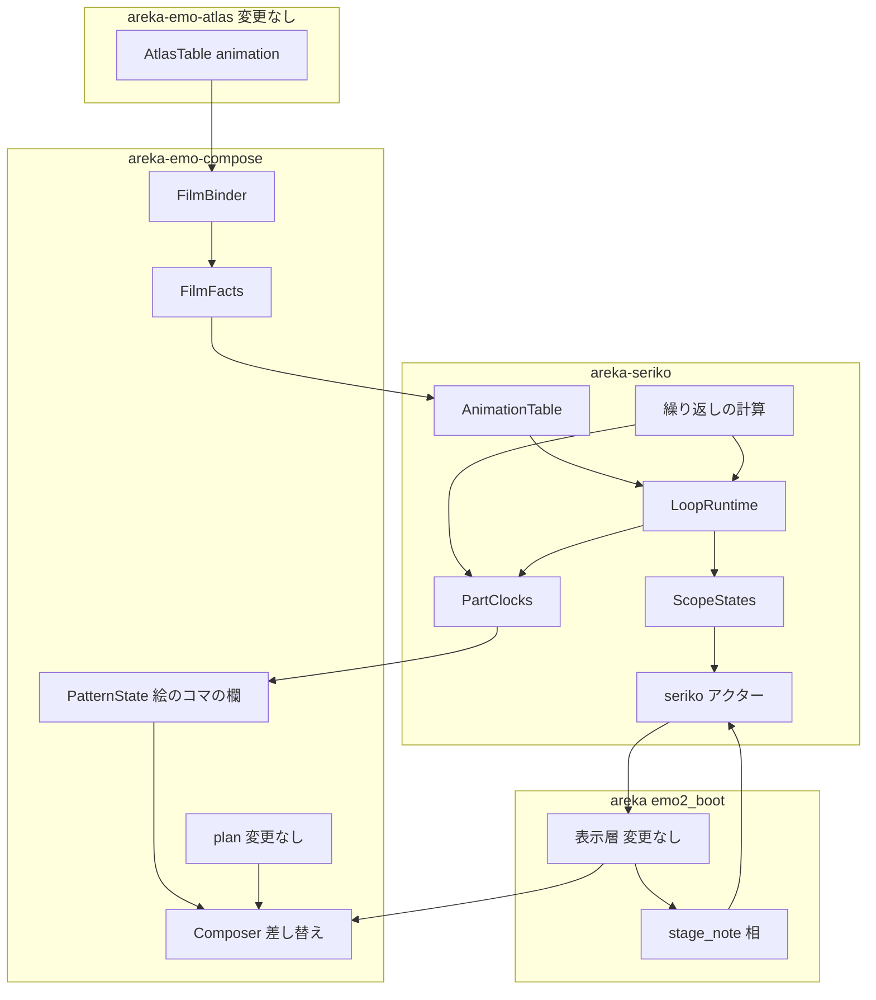
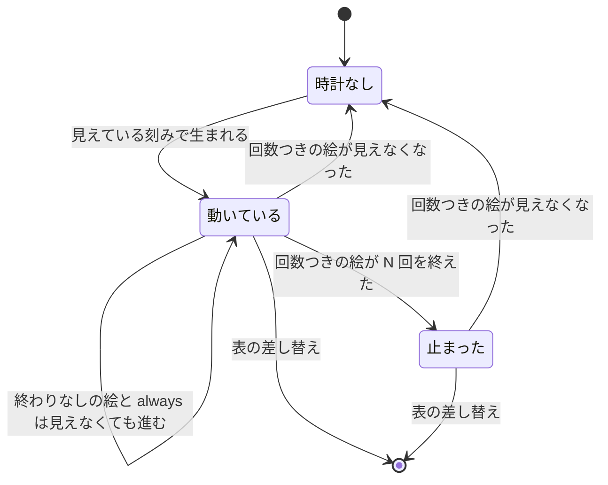

# Design Document: areka-P0-animated-image-playback

> コードは「何の定義か＋ファイル」で指す。現状の記述は本ブランチ（main `82607b5f` を取り込んだ後）のコードを 2026-10-05 に読んで確かめたもの。実装の着手時に引き直すこと。
> 調べた経過と捨てた案は `research.md` の「設計の段の調査」に在る。本文書だけで判断できるよう、結論はここに書く。

## Overview

**Purpose**: 動く APNG・動く WebP をシェルの element定義・`surface*.png`・バルーンの面に置くだけで動かし、interval `always` のアニメーションを繰り返す。
**Users**: シェルとバルーンの作者（絵を置くだけ・`always` と書くだけ）と、そのゴーストを使う利用者。
**Impact**: 合成の入力（`PatternState`）に「動く絵 → 今のコマの番号」の欄を 1 つ足し、seriko の部品の時計がその欄を進める。seriko の表は `always` を採る。動く絵も `always` も無いシェルでは、足した経路を 1 行も通らない。

### Goals

- 動く絵は、何も指示が無ければ 1 枚目のコマが出る（静止画と同じ絵・同じ外形）。コマの番号が届いたときだけ別のコマに替わる。絵が欠ける瞬間は 0 回。
- 繰り返しは「開始の時刻からの経過を周期で割る」1 つの計算で決める。待ち時間は丸めない。
- シェルとバルーンは同じ時計・同じ欄・同じ合成を通る。バルーンだけの再生の仕組みは 0 個。
- 同じウェーブの約束を守る: `areka-parsers` の `shell/`・`areka-emo-atlas` の `manifest.rs`・`areka-emo-compose` の `plan.rs`・`fold.rs`・`method.rs`・`areka-emo-present`・`crates/areka/src/emo2_boot/assets.rs` の変更は **0 行**。

### Non-Goals

- pattern定義の描画メソッド `import`（後続 `areka-P0-animated-image-import`）。本 spec の変更は 0。
- `always` を含む組み合わせ（`bind+always` ほか）と、`always` 以外の interval の語（後続 `areka-P0-seriko-trigger-intervals`）。
- 動く GIF・読み込みの上限・element定義のオプション（`--clipping` ほか）・合成の結果を覚える席の数（変更 0）。
- サーフェスの番号やアニメーションの番号を新しく作ること（**0 個**。下の「brief の案から離れた点」）。

### brief の案から離れた点（設計討議の議題 1）

brief の Approach 1 は「動く絵を、コマ 1 枚ずつのサーフェスと、それを `always` で順に指す子サーフェスへ分解する」だった。コードを読んだ結果、この形は同じウェーブの約束（`plan.rs` に触らない）の下では要件を満たせない。

| つまずく所 | 何の定義で決まっているか | 起きること |
| --- | --- | --- |
| コマが届くまで絵が無い | 合成の `flatten_surface`（`crates/areka-emo-compose/src/plan.rs`）は、コマ（`PatternState`）が空のとき、着せ替えでない animation の絵を 1 枚も描かない | バルーンの面は装着のとき空のコマで確立される（`crates/areka/src/emo2_boot/frame/attach.rs` の装着の手順）。シェルの差し替えの最初の表示（`RebasedShow`・`crates/areka-seriko/src/output.rs`）もコマを運ばない。どちらも seriko の次の刻みまで動く絵が丸ごと消える |
| 1 枚目を element として残すと透ける | `push_static_element_ops`（同上）は element を必ず描き、コマはその上に重なるだけ | コマは重ね済みの全体の絵なので、透明な所から 1 枚目が見える |
| 外形から消える | `flatten_extent`（同上）は着せ替えでない animation のコマを数えない | 動く絵だけのサーフェスは 0×0 で非表示へ落ちる |
| 番号の空間 | サーフェスの番号は `u32` の全域を作者が使える | 上限いっぱいの絵 1 つで 1,025 個の番号が要り、`\s[番号]` で呼べてしまう |

そこで分解の形だけを変える: **動く絵 1 つを「`always` のアニメーション 1 本を持つ部品 1 つ」と同じ決まりで動かすが、サーフェスの番号は作らず、コマは「絵のコマの番号」で指す**。時計は seriko の部品の時計と同じ型・同じ持ち主で、アニメーションの仕組みは台本の再生とサーフェスのアニメーションの 2 つのままである。この判断は開発者の確認が要る（`research.md` のギャップ分析は、これに近い案を「採るなら開発者の裁定が要る」と書いている）。

## Boundary Commitments

### This Spec Owns

- 合成の入力の「絵のコマの欄」（`PatternState` の 3 つ目の欄）と、合成の命令の絵をコマへ差し替える 1 か所（`Composer::compose_into` の中）。
- 面の表に載せる動く絵の事実（`FilmFacts`）と、それを作る手順（`EmoWorld::bind_atlas` の直後）。
- seriko の繰り返しの計算（`lap_of`・`always_at`・`film_frame_at`）、引き金 `LoopTrigger::Always`、動く絵の時計、バルーンの面で部品と動く絵を回す経路。
- バルーンの窓が見えているかを seriko へ知らせる 1 本の線（`SerikoMsg::Stage`）。
- 試験用のシェルとバルーン（検体）、決定論テスト、実機の確かめの記録。
- 網羅台帳の `element*`・`always` の項、対応表（`doc/COMPAT_ARCHITECTURE.md` の §8）の本 spec の節、後続 2 本の brief の申し送りの節。

### Out of Boundary

- 読み込みとアトラス（`areka-emo-atlas` の全ファイル・変更 0）。使うのは `AtlasTable::animation`・`AtlasTable::entry` の 2 つの読み口だけ。
- 合成の命令の組み立てと外形（`plan.rs`）・畳み込み（`fold.rs`）・描画メソッドの名前（`method.rs`）。変更 0。
- 表示と合成の結果を覚える席（`areka-emo-present` の全ファイル）。変更 0。席の数 `CAPACITY` も変更 0。
- 読み手（`areka-parsers`）。変更 0。
- 起動の資産の組み立て（`crates/areka/src/emo2_boot/assets.rs`）。変更 0。`AnimationTable::from_world` の署名は変えない。
- 一番上のサーフェス自身の `random`・`bind+random`・`sometimes`・`rarely` の抽選と進み方、部品の時計の今の決まり。変更 0。
- バルーンをいつ出しいつ隠すかの判断（`crates/areka/src/emo2_boot/balloon_visibility.rs`）。読むだけ。

### Allowed Dependencies

- 依存の向きは今のまま: `areka-parsers` → `areka-emo-atlas` → `areka-emo-compose` → `areka-seriko` → `areka`。逆向きの依存は足さない。
- `areka-seriko` は `areka-emo-atlas` に依存しない（今も依存していない）。動く絵の事実は `areka-emo-compose` の公開型 `FilmFacts`（数と文字列だけ）で受け取る。`Cargo.toml`・`Cargo.lock` の変更は **0**。
- 新しい外部クレートは 0 個。

### Revalidation Triggers

- `PatternState` の欄・`FilmFacts` の欄・`LoopTrigger` の腕・`SerikoMsg::Stage` の形が変わるとき → `areka-P0-animated-image-import`・`areka-P0-seriko-trigger-intervals` の brief の申し送りを書き直す（要件 5.2・10.5）。
- `plan.rs` の「画像の element を描く条件」（束縛が在る・位置が在る）が変わるとき（`areka-P0-element-base-method`・`areka-P0-extent-element-offset`・`areka-P0-element-clipping-option`）→ 本 spec の「束縛の付け替え」（下の FilmBinder）が今も「どれかのコマが描けるなら命令が出る」を満たすかを見直す。
- 読み込みの側が「各コマは絵の全体の寸法で揃う」「`frames[0]` は親」を変えるとき → FilmBinder の検査を見直す。

## Architecture

### Existing Architecture Analysis

読んで確かめた、設計を決める事実だけを挙げる。

- **コマの欄**: `PatternState`（`crates/areka-emo-compose/src/pattern.rs`）は一番上の欄と部品の欄を持ち、欄は非公開。合成の結果を覚える鍵 `ComposeKey`（`crates/areka-emo-present/src/cache.rs`）は `PatternState` を丸ごと持ち、等しさで比べる。欄を足しても鍵の側の変更は要らない。
- **合成の入口**: `Composer::compose_into`（`crates/areka-emo-compose/src/lib.rs`）が `build_plan` → `blit::execute` の順に呼ぶ。`build_plan` を呼ぶのはここ 1 か所。命令 `BlitOp` は絵の番号（`ElementId`）と位置だけを持ち、切り詰めのずれは転写のときに絵の番号から引く（`crates/areka-emo-compose/src/blit.rs` の `execute`）。命令の絵の番号を別のコマへ替えれば、位置と重ね順は変わらずコマだけが替わる。
- **命令が出る条件**: `push_static_element_ops`（`plan.rs`）は、束縛が在り、束縛した絵に位置が在る（全透明でない）画像の element だけを命令にする。外形 `flatten_extent` は束縛した絵の原寸を数える（位置が無くても数える）。
- **同じコマなら出さない**: `ScopeStates::commit_pattern`（`crates/areka-seriko/src/state.rs`）は前と同じ `PatternState` なら指令を出さない。
- **シェルの表示は必ず seriko から出る**: 装着はシェルの最初の表示を出さない（`attach.rs` の装着の手順の注記「シェルは初回 ShowSurface を attach で発行しない」）。最初の表示は最初の `\s` が seriko を通って出す。
- **バルーンは違う**: 装着が面 0 を空のコマで確立し、見える・見えないは可視性の相（`crates/areka/src/emo2_boot/balloon_visibility_phase.rs`）だけが決める。seriko は `\b[番号]` が来るまでバルーンの面を知らず、窓が見えているかは一度も知らされない。
- **バルーンの表は今は必ず空**: バルーンの面は `element0,overlay,<実ファイル名>` だけのサーフェスへ書き直される（`crates/areka-emo-present/src/balloon.rs` の `synthetic_surfaces_txt`）ので、animation を持てない。バルーンの面の抽選の経路は今は実質使われていない。
- **フレームの終わりの届けの先例**: `run_status_report_phase`（`crates/areka/src/emo2_boot/frame/status_report.rs`）が、表示層の照会 2 本（`target_visible`・`current_surface_id`）から見えているバルーンの組を作り、前と違うときだけ運行の側へ送る。同じ形で seriko へも知らせられる。
- **表の材料**: `AnimationTable::from_world`（`crates/areka-seriko/src/table.rs`）は `EmoWorld` だけを受け取る。呼び手は `assets.rs`（触らない）。動く絵の事実は `EmoWorld` に先に載せておく。

### Architecture Pattern & Boundary Map



**Architecture Integration**:

- 選んだ形: 今ある一方向の流れ（面の表 → seriko の表 → 時計 → `PatternState` → 指令 → 合成）に、欄 1 つ・表の行 1 種・時計の鍵 1 種を足す。新しい層は 0。
- 境界: 「どのコマを出すか」は seriko が決める。「コマの絵をどう描くか」は合成が決める。両者をつなぐのは `PatternState` の絵のコマの欄（番号だけ）。
- 保つ決まり: 一番上の再生は切り替えで捨てる／部品の時計は巻き戻さない／同じ `PatternState` は出さない／合成は結果を覚えない。
- 足す部品の理由: FilmBinder（表を作る場所からアトラスが見えないので、事実を面の表へ写す）・stage_note 相（seriko はバルーンの窓の見える・見えないを知らない）。
- steering との整合: 時刻は外から与える（決定論テスト）・記録の無い失敗の経路 0・1 ファイル 1,000 行以下・テストは兄弟ファイル。

### Technology Stack

| Layer | Choice / Version | Role in Feature | Notes |
| --- | --- | --- | --- |
| 合成 | `areka-emo-compose`（既存）・`bevy_ecs` の Resource | 動く絵の事実の置き場・命令の差し替え | 新しい依存 0 |
| アニメーション | `areka-seriko`（既存） | 繰り返し・時計・バルーンの面の経路 | `areka-emo-atlas` への依存は足さない |
| 結線 | `crates/areka/src/emo2_boot/frame/` | バルーンの窓の知らせ | `GhostSession::seriko_sink`（既存の持ち主）を借りる |

## File Structure Plan

### Directory Structure

```
crates/areka-emo-compose/
├── src/
│   ├── film.rs                    # 新規: FilmFacts・FilmTable・bind_films・substitute
│   ├── film_tests.rs              # 新規: 束縛の付け替え・検査・事実の表
│   ├── pattern.rs                 # 変更: 絵のコマの欄
│   ├── pattern_film_tests.rs      # 新規
│   ├── world.rs                   # 変更: bind_atlas の直後に bind_films・film_facts の読み口
│   ├── lib.rs                     # 変更: Composer の差し替え・公開の接続
│   └── composer_film_tests.rs     # 新規: コマごとの画素・外形・全透明の 1 枚目
└── tests/fixtures/animated-playback/   # 新規: 試験用のシェルとバルーン（要件 9.4）
    ├── shell/                     # surfaces.txt・element定義の絵・surface*.png
    └── balloon/                   # バルーンの面の絵
crates/areka-seriko/src/
├── timeline.rs                    # 変更: lap_of・always_at・film_frame_at
├── timeline_repeat_tests.rs       # 新規
├── table.rs                       # 変更: LoopTrigger::Always・合計 0 の検査・動く絵の行
├── table_always_tests.rs          # 新規
├── table_film_tests.rs            # 新規
├── looper.rs                      # 変更: 一番上の always・バルーンの面の経路・refresh
├── looper_always_tests.rs         # 新規
├── looper_balloon_tests.rs        # 新規
├── parts.rs                       # 変更: 鍵に面の種類・always の腕
├── parts_always_tests.rs          # 新規
├── film.rs                        # 新規: 動く絵の時計の進め方（PartClocks の impl）
├── film_tests.rs                  # 新規
├── state.rs                       # 変更: バルーンの窓の覚え・stage_slots
├── state_stage_tests.rs           # 新規
├── actor.rs                       # 変更: SerikoMsg::Stage・send_stage
├── actor_stage_tests.rs           # 新規
└── lib.rs                         # 変更: 公開の接続
crates/areka/src/emo2_boot/
├── frame/stage_note.rs            # 新規: バルーンの窓の知らせの相
├── frame/stage_note_tests.rs      # 新規
├── frame/wiring.rs                # 変更: 知らせの台帳の欄 1 つ
├── frame.rs                       # 変更: 相の呼び出し 1 行
├── film_playback_e2e_tests.rs     # 新規: 検体 → 焼く → 表 → 刻み → 合成の画素
└── mod.rs                         # 変更: 上のテストの接続宣言だけ
doc/
├── ukadoc-coverage/ledger/assets.toml   # 変更: element*・always の項
└── COMPAT_ARCHITECTURE.md               # 変更: §8 に本 spec の節
.kiro/specs/
├── areka-P0-seriko-trigger-intervals/brief.md   # 変更: 申し送りの節
└── areka-P0-animated-image-import/brief.md      # 変更: 申し送りの節
```

### Modified Files

- 行数の見通し（今 → 見込み）: `pattern.rs` 203 → 約 250／`world.rs` 371 → 約 395／`lib.rs`（compose）208 → 約 235／`timeline.rs` 506 → 約 580／`table.rs` 616 → 約 720／`looper.rs` 528 → 約 680／`parts.rs` 339 → 約 420／`state.rs` 632 → 約 700／`actor.rs` 660 → 約 700／`frame.rs` 550 → 約 553／`frame/wiring.rs` 368 → 約 375／`mod.rs` 883 → 約 887。どれも 1,000 行以下。
- `crates/areka/src/emo2_boot/spine.rs` は 1,000 行ちょうどなので **触らない（変更 0）**。テストの接続宣言は `mod.rs` に置く。
- `atlas_bind.rs` は触らない（変更 0）。束縛の付け替えは `film.rs` が `bind_atlas` の後に行う。
- 既存のテストで書き換えが要るもの: `table.rs` の中のテスト `only_random_and_bindrandom_are_recorded_others_debug_logged` は「採らない語」の例に `always` を使っている。`always` を採るので、例の語を `runonce` へ替える（振る舞いを変えたことによる更新）。`LoopTrigger` の腕を 2 つと決め打つ箇所（`table.rs` の `k == 0` の検査とテスト `recorded_anims_satisfy_postconditions`）はコンパイルで止まるので直す。`emo2` の照合（要件 7.7）の書き換えは 0。
- 約束の 7 か所（`areka-parsers/src/shell/`・`areka-emo-atlas/src/manifest.rs`・`areka-emo-compose/src/{plan,fold,method}.rs`・`areka-emo-present/`・`emo2_boot/assets.rs`）は変更 0。

## System Flows

### 読み込みから 1 コマが画面に出るまで

```mermaid
sequenceDiagram
    participant Load as シェルの読み込み
    participant World as EmoWorld
    participant Table as AnimationTable
    participant Tick as 刻み 16ms
    participant Loop as LoopRuntime
    participant State as ScopeStates
    participant Show as 表示層
    participant Comp as Composer
    Load->>World: bind_atlas
    World->>World: bind_films 動く絵の事実を載せる
    Load->>Table: from_world
    Table->>Table: always と動く絵の行を採る
    Tick->>Loop: on_tick now
    Loop->>Loop: 見えている動く絵の時計を進める
    Loop->>State: commit_pattern
    State-->>Show: コマが替わったときだけ Show
    Show->>Comp: compose_into
    Comp->>Comp: build_plan の後に絵をコマへ差し替える
```

- 刻みが来てもコマが替わらなければ `commit_pattern` が指令を出さない（要件 7.4）。
- 表が動く絵も `always` も動く部品も持たなければ、`on_tick` は今と同じ行だけを通る（要件 7.2）。

### 時計の一生



- **時計なしの間は経過 0 として見る**。動く絵なら 1 枚目のコマ（＝欄に何も載せない）、`always` なら最初の待ち時間が 0 のコマ。時計は「見えている」と分かった最初の刻みに、その刻みの時刻を開始として生まれる。面の切り替えの指令には経過 0 の絵がそのまま載るので、切り替えから最初の刻みまでに絵が欠けたり 1 フレーム遅れたりすることは無い。
- 「止まった」は別の状態を持たない。開始の時刻が残っていれば、経過が「周期 × N」以上かどうかで求まる。
- 一番上のサーフェス自身の `always` は、今の決まりどおり面の切り替えで再生を捨てる（要件 4.3）。上の図は部品の `always` と動く絵のもの。

### バルーンの窓の知らせ

```mermaid
sequenceDiagram
    participant Vis as 可視性の相
    participant Pres as 表示層
    participant Note as stage_note 相
    participant Ser as seriko
    Vis->>Pres: 窓を出す または 隠す
    Note->>Pres: target_visible と current_surface_id を読む
    Note->>Ser: 前と違うスコープだけ Stage を送る
    Ser->>Ser: 窓の覚えを更新 回数つきの時計を整理
    Ser-->>Pres: コマが替わるなら ShowBalloon
```

- 知らせはフレームの終わり（届けの相の直後）に、前に知らせた値と違うスコープについてだけ送る。動く絵の無いバルーンでも送るが、seriko は覚えを更新するだけで指令を出さない（要件 6.5）。
- 窓が隠れたら、seriko は回数つきの絵の時計を捨て、その絵のコマを欄から外した指令を 1 回だけ出す。隠れている間の絵が 1 枚目へ戻るので、次に窓が出た瞬間から 1 枚目が見える（要件 2.3）。これはコマが進んだことによる描き直しではない（要件 6.4）。隠れている間、刻みはバルーンの面の動く絵を評価しない。

## Requirements Traceability

| Requirement | Summary | Components | Interfaces | Flows |
| --- | --- | --- | --- | --- |
| 1.1 | element定義の動く絵が動く | FilmBinder・FilmClocks・Composer | `bind_films`・`advance_films`・`substitute` | 読み込みから 1 コマ |
| 1.2 | `surface*.png` の動く絵が動く | FilmBinder | 土台の画像は `apply_base_images` が普通の画像の element として足すので、同じ `bind_films` に載る | 同上 |
| 1.3 | `element0` が在れば描かない | （既存） | `apply_base_images` が element を足さない → 束縛されない → 動く絵の行も 0 | — |
| 1.4 | 位置と重ね順は静止画と同じ | Composer | 命令の絵の番号だけを替える（位置と順は `plan.rs` が出したまま） | — |
| 1.5, 1.6 | 待ち時間どおり・累積で決める | Repeat | `film_frame_at`（開始からの経過だけで決める） | 時計の一生 |
| 1.7 | 外形と窓の位置を変えない | FilmBinder | 束縛の付け替え先は同じ原寸のコマ。`plan.rs` の外形の計算は変更 0 | — |
| 1.8 | 作者の当たり判定は同じ | （既存） | 矩形は面の表の静的な値。本 spec は触らない | — |
| 1.13 | 透ける形は表示中のコマに従う | Composer | 透ける形は合成の結果から作られる（既存）。差し替えた後の絵がそのまま入る | — |
| 1.9 | 子・pattern の先でも同じ | FilmClocks・Composer | 見える部品に置かれた動く絵も数える。差し替えは命令の場所を問わない | — |
| 1.10 | 作者のアニメーションと並ぶ | PatternFilms | 欄が別（一番上・部品・絵のコマ） | — |
| 1.11 | GIF・縮んだ絵は 1 枚 | FilmBinder | `AtlasTable::animation` が `None` → 行を作らない | — |
| 1.12 | 作者の番号を変えない | 全体 | 作るサーフェスの番号 0 個・アニメーションの番号 0 個 | — |
| 2.1 | 終わりなしは繰り返す | Repeat | `film_frame_at`（`laps = None`） | 時計の一生 |
| 2.2 | N 回で最後のコマに止まる | Repeat | `film_frame_at`（経過 ≥ 周期 × N なら最後のコマ） | 同上 |
| 2.3, 2.7, 2.8 | 回数つきは表示のたびに始め直す・続けて見えていれば続き | FilmClocks | 回数つきの時計は「見えなくなった評価」で捨てる。終わりなしの時計は捨てない | 同上 |
| 2.4 | 待ち時間 0 は丸めず飛ばす | Repeat | 同じ時刻のコマは後ろが勝つ | — |
| 2.9 | 遅れたら過ぎた時間の分だけ進む | Repeat・LoopRuntime | 今のコマは「刻みの時刻 − 開始の時刻」だけで決まる。持ち越す状態が無い | — |
| 2.5 | 合計 0 の絵は動かさず記録 | FilmBinder・Table | `FilmSkipReason::ZeroTotalDelay` → 表が `warn!` 1 回 | — |
| 2.6 | 同じ入力から同じコマ | Repeat | 純粋な関数・乱数なし | — |
| 3.1 | 初めての表示で 1 枚目から | FilmClocks | 時計なし＝経過 0 | 時計の一生 |
| 3.2, 3.3 | 終わりなしは切り替えても戻っても続き | FilmClocks | 時計の鍵は（スコープ・面の種類・絵）。面の番号を含まない | 同上 |
| 3.4 | 複数の位置で揃う | PatternFilms | 欄は絵 1 つにつき 1 つ | — |
| 3.5 | スコープごとに別 | FilmClocks | 鍵にスコープ | — |
| 3.6 | シェルの切り替え・降りるときに捨てる | LoopRuntime | 表の差し替えで、その面の種類の時計を捨てる。ゴーストが降りれば seriko ごと消える | — |
| 3.7 | 見えない絵で描き直さない | FilmClocks | 見えない絵は欄に載せない | — |
| 4.1 | `always` は抽選を待たず始まる | Table・LoopRuntime・PartClocks | `LoopTrigger::Always`・時計なし＝経過 0 | 時計の一生 |
| 4.2 | 最後のコマの後に頭へ戻る | Repeat | `always_at` | — |
| 4.3 | 一番上は切り替えで頭から | LoopRuntime | `on_surface_changed`（既存）が再生を捨てる | — |
| 4.4 | 子では巻き戻らない | PartClocks | 部品の時計の決まり（既存）に `always` の腕を足す | — |
| 4.5 | 途中の `-1` は消してから続ける | Repeat | `always_at` が「何も出さない」を返し、時計は残る | — |
| 4.6 | 合計 0 は 1 周だけ・記録 | Table・Repeat | `period_ms == 0` → `warn!` 1 回・`always_at` は 1 周の結果を返し続ける | — |
| 4.7 | ほかの語の抽選を変えない | LoopRuntime・PartClocks | `Always` は乱数を引かない。抽選の対象の並びは今のまま | — |
| 4.8, 4.9 | ほかの語・組み合わせは変更 0 | Table | `always` は完全一致だけ採る。他は今の `debug!` の腕のまま | — |
| 5.1 | `import` は変更 0 | — | `method.rs`・`plan.rs`・読み手に触らない | — |
| 5.2 | 仕組みの形を申し送る | 文書 | 下の「申し送りの文面」 | — |
| 6.1 | バルーンの面の動く絵が動く | StageNote・ScopeStates・LoopRuntime | `SerikoMsg::Stage`・`stage_slots` | バルーンの窓の知らせ |
| 6.2 | 大きさ・位置・文字を変えない | FilmBinder | 外形は同じ。面の番号も同じ | — |
| 6.3 | コマで出したり隠したりしない | （既存） | バルーンの見える・見えないは外が持ち主。`ShowBalloon` は見えるようにしない | — |
| 6.4 | 隠れている間は描き直さない | LoopRuntime | 窓が閉じているバルーンの面は刻みで評価しない | 同上 |
| 6.6 | シェルと混ぜない | FilmClocks | 鍵に面の種類 | — |
| 6.7 | 同じ仕組み・バルーン専用 0 個 | 全体 | 欄・時計・計算・差し替えは面の種類を見ない。違いは「見えているか」の知り方だけ | — |
| 6.5 | 静止画のバルーンは変わらない | Table・LoopRuntime | 表に動く絵の行が無ければ評価しない・指令 0 | — |
| 7.1 | 動かないシェルは同じ絵 | FilmBinder・Composer | 動く絵が 0 なら `FilmTable` を面の表に載せない。差し替えは呼ばれない | — |
| 7.2 | 合成し直す回数を増やさない | LoopRuntime | 表の門（`is_continuous`）が偽なら足した行を通らない | — |
| 7.3 | `emo2` の 1 コマの時間 | 測定 | 「Performance & Scalability」 | — |
| 7.4 | コマが替わったときだけ合成 | ScopeStates | `commit_pattern`（既存） | — |
| 7.5, 7.6 | 動く絵 1 つの回数と時間・席の数 | 測定 | 席の数は変更 0。数字は記録する | — |
| 7.7 | `emo2` の照合を書き換えない | 全体 | 既存の照合の書き換え 0 | — |
| 8.1 | 記録の無い失敗の経路 0 本 | FilmBinder・Table・Composer | 「Error Handling」 | — |
| 8.2 | 準備の失敗は 1 枚目の静止画 | FilmBinder | 行を作らない＝束縛は親のまま | — |
| 8.3 | 異常終了させない | 全体 | 失敗は値と記録で返す | — |
| 8.4 | 同じ原因は読み込み 1 回に 1 回 | Table | 記録は表を作るときだけ出す | — |
| 9.1〜9.3 | 決定論テスト | Testing Strategy | 時刻は刻みで与える・乱数は注入 | — |
| 9.4 | 検体 | 検体 | `tests/fixtures/animated-playback/` | — |
| 9.5 | 実機 | Testing Strategy | 「実機の確かめ」 | — |
| 10.1, 10.4 | 網羅台帳 | 文書 | `assets.toml` の `element*`・`always` | — |
| 10.2, 10.3 | 対応表 | 文書 | `COMPAT_ARCHITECTURE.md` §8 | — |
| 10.5, 10.7 | 申し送りと roadmap の行 | 文書 | 下の「申し送りの文面」 | — |
| 10.6 | 範囲外の問題は起票 | 手順 | `/kiro-discovery`（「Open Questions / Risks」に挙げた 2 件を含む） | — |

## Components and Interfaces

| Component | Domain/Layer | Intent | Req Coverage | Key Dependencies | Contracts |
| --- | --- | --- | --- | --- | --- |
| FilmBinder | 合成 | 動く絵の事実を面の表へ載せ、束縛を付け替える | 1.1, 1.2, 1.7, 1.11, 2.5, 8.2 | AtlasTable (P0) | Service |
| PatternFilms | 合成 | 動く絵 → 今のコマの番号の欄 | 1.10, 3.4, 3.7 | — | State |
| Composer の差し替え | 合成 | 命令の絵をコマへ替える | 1.4, 1.9, 1.13 | FilmTable (P0)・PatternFilms (P0) | Service |
| Repeat | seriko | 経過 → コマの純粋な計算 | 1.5, 1.6, 2.1, 2.2, 2.4, 2.6, 2.9, 4.2, 4.5, 4.6 | — | Service |
| Table | seriko | `always` と動く絵の行を採る・記録を出す | 2.5, 4.1, 4.6, 4.8, 4.9, 8.4 | FilmFacts (P0) | Service |
| PartClocks（`always` と動く絵） | seriko | 時計を持ち、欄を作り直す | 2.3, 2.7, 2.8, 3.1〜3.7, 4.4, 6.6 | Repeat (P0)・Table (P0) | State |
| LoopRuntime | seriko | 刻みと切り替えの統括 | 4.1, 4.3, 4.7, 6.4, 7.2 | PartClocks (P0)・ScopeStates (P0) | Service |
| ScopeStates（窓の覚え） | seriko | バルーンの窓が見えているかを覚える | 6.1, 6.4 | — | State |
| StageNote | areka | 窓の見える・見えないを seriko へ知らせる | 6.1, 6.3, 6.5 | 表示層の照会 (P0)・`GhostSession::seriko_sink` (P0) | Event |

### 合成（`areka-emo-compose`）

#### FilmBinder（`film.rs`）

| Field | Detail |
| --- | --- |
| Intent | `bind_atlas` の直後に、動く絵に束縛された element を見つけて事実の表を作る |
| Requirements | 1.1, 1.2, 1.7, 1.11, 2.5, 8.1, 8.2 |

**Responsibilities & Constraints**

- 面の表の全サーフェスの束縛（`AtlasBinding`）をなめ、束縛先が動く絵の親（`AtlasTable::animation` が `Some`）の element を集める。
- 動く絵 1 つにつき 1 度だけ検査する: ①コマの並びの 0 番が親自身 ②コマと待ち時間の数が同じ ③全部のコマの原寸が親と同じ ④待ち時間の合計が 1 以上。①〜③に反すれば `BrokenFrames`、④に反すれば `ZeroTotalDelay` として `skipped` に載せ、その絵には何もしない（束縛は親のまま＝ 1 枚目の静止画）。
- 検査を通った絵は行（`Film`）を作り、その element の束縛を**「位置を持つ最初のコマ」**へ付け替える（全部のコマが全透明なら親のまま）。理由: `plan.rs` は束縛した絵が全透明だと命令を出さない。1 枚目だけが全透明の絵でも命令が出るようにしておき、どのコマを描くかは Composer の差し替えが決める。原寸は全コマで同じなので、外形は付け替えの前と同じ値になる。
- 動く絵の番号（`Film::id`）は親の `ElementId` の値。同じ画像ファイルは同じ親に解決されるので、同じファイルを何か所に置いても行は 1 つ。
- 行が 1 つも無く `skipped` も空なら、面の表に何も載せない（動かないシェルは面の表も合成も今と同じ）。
- 記録は出さない（面の表はスコープの数だけ組まれるので、ここで出すとスコープの数だけ重なる）。事実を値で返し、記録は seriko の表が出す。

**Dependencies**

- Inbound: `EmoWorld::bind_atlas` — 束縛の直後に呼ぶ (P0)
- External: `AtlasTable::animation`・`AtlasTable::entry` — 読むだけ (P0)

**Contracts**: Service [x]

##### Service Interface

```rust
/// 動く絵 1 つ（seriko が読む事実。数と文字列だけ）。
pub struct Film {
    /// 動く絵の番号（親の ElementId の値）。
    pub id: u32,
    /// 記録に出す相対パス。
    pub path: String,
    /// コマごとの待ち時間（ミリ秒・0 は 0 のまま）。2 枚以上・合計は 1 以上。
    pub delays_ms: Vec<u32>,
    /// 合計の回数。None は終わりなし。
    pub laps: Option<std::num::NonZeroU32>,
}

/// 動かさなかった絵と理由。
pub struct FilmSkip { pub path: String, pub reason: FilmSkipReason }
pub enum FilmSkipReason { ZeroTotalDelay, BrokenFrames }

/// 面の表 1 つぶんの動く絵の事実（公開の欄だけ・テストは値で組める）。
#[derive(Default)]
pub struct FilmFacts {
    /// 動く絵（番号の昇順）。
    pub films: Vec<Film>,
    /// サーフェスの番号 → そのサーフェスに画像の element として置かれた動く絵（昇順・重複なし）。
    pub placed: std::collections::BTreeMap<u32, Vec<u32>>,
    /// 動かさなかった絵（相対パスの昇順）。
    pub skipped: Vec<FilmSkip>,
}

impl EmoWorld {
    /// 動く絵の事実。動く絵が無い面の表では空。
    pub fn film_facts(&self) -> &FilmFacts;
}
```

- Preconditions: `bind_atlas` が済んでいる。
- Postconditions: `placed` に載る番号は必ず `films` に在る。`skipped` の絵は `films` に無い。同じ入力から同じ表（番号の昇順で決定的）。
- Invariants: 面の表に画素を持ち込まない（番号と数だけ）。

**Implementation Notes**

- Integration: `EmoWorld::bind_atlas` の中で `atlas_bind::bind_atlas` の次の行に `film::bind_films` を呼ぶ。シェル（`ShellTarget::build_world`）とバルーン（`build_balloon_target_from_faces`）はどちらも `bind_atlas` を通るので、呼び手の変更は 0。
- Validation: `film_tests.rs`（`MemoryDecoder::insert_animated` で焼いた表を使う）。
- Risks: `plan.rs` の「命令が出る条件」が変わると付け替えの前提が動く（Revalidation Triggers）。

#### PatternFilms（`pattern.rs`）

| Field | Detail |
| --- | --- |
| Intent | 動く絵ごとの今のコマの番号を、合成の入力として運ぶ |
| Requirements | 1.10, 3.4, 3.7, 7.4 |

**Contracts**: State [x]

```rust
impl PatternState {
    /// 動く絵 `film` の今のコマの番号を置く。0 を置くと消える。
    pub fn set_film(&mut self, film: u32, index: u32);
    /// 動く絵 `film` の今のコマの番号（載っていなければ 0）。
    pub fn film(&self, film: u32) -> u32;
    /// 絵のコマの欄を空にする（一番上の欄と部品の欄は残す）。
    pub fn clear_films(&mut self);
}
```

- State model: `BTreeMap<u32, u32>`（動く絵の番号 → コマの番号）。**0 番は載せない**。空の `PatternState` は「全部の動く絵が 1 枚目」と同じ意味になり、装着・差し替え・採寸が空のコマで合成した絵と、seriko が 1 枚目を指した絵が同じ鍵になる（合成のし直し 0）。
- `is_empty` はこの欄も数える。等しさ（`Eq`）はこの欄も比べる（`ComposeKey` に入る）。

#### Composer の差し替え（`lib.rs`）

| Field | Detail |
| --- | --- |
| Intent | `build_plan` が出した命令の絵の番号を、今のコマへ替える |
| Requirements | 1.4, 1.9, 1.13, 7.1 |

**Responsibilities & Constraints**

- `compose_into` は `build_plan` の後、面の表に `FilmTable` が在るときだけ `film::substitute` を呼ぶ。`FilmTable` は「束縛した絵の番号 → 動く絵の番号とコマの並び」を持つ（`film.rs` の中だけで使う）。
- 命令 1 つごと: 絵の番号が表に在れば、`pattern.film(番号)` のコマへ替える。替えた先のコマが全透明（位置が無い）なら、その命令を取り除く。表に無い命令には触らない。
- コマの番号が並びの外のとき（差し替えの継ぎ目で古い指令が届いたとき）は 1 枚目として描き、`debug!` を出す。
- 命令の並び・位置・描画メソッドは変えない。確保はしない（その場で詰める）。

**Contracts**: Service [x]

```rust
// film.rs（クレートの中だけ）
pub(crate) fn bind_films(world: &mut bevy_ecs::world::World, atlas: &AtlasTable);
pub(crate) fn substitute(ops: &mut Vec<BlitOp>, table: &FilmTable, atlas: &AtlasTable, pattern: &PatternState);
```

- Postconditions: `pattern` の絵のコマの欄が空なら、結果は「全部の動く絵が 1 枚目」の命令列になる。動く絵の無い面の表では `substitute` は呼ばれない。

### アニメーション（`areka-seriko`）

#### Repeat（`timeline.rs`）

| Field | Detail |
| --- | --- |
| Intent | 開始からの経過だけで今のコマを決める純粋な計算 |
| Requirements | 1.5, 1.6, 2.1, 2.2, 2.4, 2.6, 2.9, 4.2, 4.5, 4.6 |

**Contracts**: Service [x]

```rust
/// 経過を周期で割った「何周目か（0 始まり）」と「その周の頭からの経過」。
pub fn lap_of(elapsed_ms: u64, period_ms: std::num::NonZeroU64) -> (u64, u64);

/// `always` のアニメーションを経過で見た答え。
pub enum AlwaysView {
    /// 何も出さない（1 周目の最初の待ちの前・終わりのコマの後）。
    Nothing,
    /// このコマを出す。
    Frame(usize),
}

/// `always` の今のコマ。`period_ms` はコマの待ち時間の合計（0 なら 1 周だけ評価した結果を返し続ける）。
pub fn always_at(frames: &[LoopFrame], period_ms: u64, elapsed_ms: u64) -> AlwaysView;

/// 動く絵の今のコマの番号。`delays_ms[i]` は i 番のコマを出しておく時間。
pub fn film_frame_at(
    delays_ms: &[u32],
    period_ms: std::num::NonZeroU64,
    laps: Option<std::num::NonZeroU32>,
    elapsed_ms: u64,
) -> usize;
```

- `always_at`: 周の頭からの経過で今ある `frame_at` を引く。答えが「最初の待ちの前」のとき、1 周目なら `Nothing`、2 周目以降なら前の周の最後のコマ（負の番号なら `Nothing`）。負の番号のコマに居る間は `Nothing`。`period_ms == 0` のときは `frame_at(frames, 0)` の答えを返す（割り算をしない）。
- `film_frame_at`: `laps` が N で経過が「周期 × N」以上なら最後のコマ。そうでなければ、周の頭からの経過を超えない最後のコマ（待ち時間 0 のコマは同じ時刻を共有するので、後ろのコマが勝つ＝飛ばされる）。
- 待ち時間の数え方の違い: pattern定義の待ち時間は「そのコマを出す前の待ち」、画像のコマの待ち時間は「そのコマを出しておく時間」。この違いは 2 つの関数の中に閉じ、周の計算（`lap_of`）は共有する。
- Invariants: 状態を持たない・乱数を使わない・丸めない。

#### Table（`table.rs`）

| Field | Detail |
| --- | --- |
| Intent | `always` と動く絵を表に採り、読み込み 1 回につき 1 回だけ記録を出す |
| Requirements | 2.5, 4.1, 4.6, 4.8, 4.9, 8.2, 8.4 |

**Responsibilities & Constraints**

- interval が `Other("always")`（小文字の完全一致）の animation を `LoopTrigger::Always { period_ms }` として採る。`period_ms` はコマの待ち時間の合計。0 のときも採り、サーフェスの番号・animation の番号・理由を `warn!` で 1 回出す（要件 4.6）。
- `bind+always` などは `Other` の今の腕（元の綴りつきの `debug!`）へ落ちる（変更 0・要件 4.9）。
- `world.film_facts()` から動く絵の行を写す。`skipped` の 1 件ごとに、相対パスと理由を `warn!` で 1 回出す（要件 2.5・8.2）。
- 門: `is_continuous()` ＝「動く部品が在る」または「`always` が 1 本以上在る」または「動く絵が 1 つ以上在る」。偽の表では、刻みも切り替えも足した経路を通らない。

**Contracts**: Service [x]

```rust
pub enum LoopTrigger {
    Random { k: u32 },
    BindRandom { k: u32 },
    /// そのサーフェスである間ずっと繰り返す。period_ms はコマの待ち時間の合計（0 は動かさない）。
    Always { period_ms: u64 },
}

/// 動く絵 1 つの行。
pub struct FilmRow {
    pub id: u32,
    pub delays_ms: Vec<u32>,
    pub period_ms: std::num::NonZeroU64,
    pub laps: Option<std::num::NonZeroU32>,
}

impl AnimationTable {
    /// 今までどおり面の表だけから作る（中で film_facts を読む）。
    pub fn from_world(world: &EmoWorld) -> AnimationTable;
    /// 動く絵の行（無ければ None）。
    pub fn film(&self, id: u32) -> Option<&FilmRow>;
    /// `surface_id` に置かれた動く絵の番号（昇順・無ければ空）。
    pub fn films_on(&self, surface_id: u32) -> &[u32];
    /// 動く絵が 1 つでも在るか。
    pub fn has_films(&self) -> bool;
    /// `surface_id` が `always` のアニメーションを持つか。
    pub fn has_always(&self, surface_id: u32) -> bool;
    /// 繰り返しの経路を通す表か。
    pub fn is_continuous(&self) -> bool;
}
```

- `LoopTrigger` は今と同じく `Copy` のまま。
- シェルの表は読み込み 1 回につき 1 回、バルーンの表はスコープごとに 1 回作られる（`assets.rs` の今の呼び方）。バルーンはスコープごとに別のアトラス・別の面の表なので、記録は「読み込み 1 回・原因 1 つにつき 1 回」になる。

#### PartClocks（`parts.rs`・`film.rs`）

| Field | Detail |
| --- | --- |
| Intent | 部品の `always` と動く絵の時計を持ち、`PatternState` の部品の欄と絵のコマの欄を作り直す |
| Requirements | 2.3, 2.7, 2.8, 3.1〜3.7, 4.4, 4.5, 6.6 |

**Responsibilities & Constraints**

- 時計の入れ物の鍵を（スコープ, 面の種類）にする。中の鍵は 2 種: 部品の animation（部品の番号, animation の番号）と、動く絵（動く絵の番号）。値は今と同じ `PartAnim`（動く絵は `Playing` だけを使う）。同じスコープのシェルとバルーンは別の入れ物なので混ざらない。
- 部品の `always`: 着せ替えの番人 `gate` は 3 通りの答え（抽選する K・`always`・対象外）を返す。`always` は乱数を引かず、時計が無ければその刻みの時刻で生まれ、`always_at` で今のコマを書く。`peek`（切り替えの直後）は時計を作らず、時計が無い `always` を経過 0 で見る。負の番号のコマでは何も書かず、時計は残す。時計を捨てるのは表の差し替えだけ（部品の時計の今の決まり）。
- 動く絵（`film.rs` の `advance_films`・`peek_films`）:
  1. 見えている動く絵 ＝ 一番上のサーフェスに置かれたもの ∪ 見える部品（`NestTable::visible_parts`）に置かれたもの。
  2. 回数つきの絵の時計のうち、見えていないものを捨てる（刻みでも切り替えの直後でも行う）。
  3. 刻みでは、見えていて時計の無い絵の時計を、その刻みの時刻で作る。切り替えの直後は作らない。
  4. 絵のコマの欄を空にしてから、見えている絵ごとに `film_frame_at`（時計が無ければ 0 番）を置く。
- 面が隠れたとき（`\s[-1]`・`\b[-1]`・バルーンの窓が閉じた）は、その入れ物の回数つきの時計を全部捨てる（`drop_finite`）。
- 記録: 時計が生まれた・捨てられたときに `debug!`（刻みごとには出さない）。

**Contracts**: State [x]

- State model: `HashMap<(ActorKey, Slot), BTreeMap<ClockKey, PartAnim>>`。`ClockKey` は `Anim { part, id }`・`Film(u32)`。
- Consistency: 絵のコマの欄に載る番号は、その評価で見えている絵だけ。0 番は載せない。
- Concurrency: seriko のスレッドだけが触る（今と同じ）。

#### LoopRuntime（`looper.rs`）

| Field | Detail |
| --- | --- |
| Intent | 刻み・面の切り替え・窓の知らせで、時計と欄を更新して指令を返す |
| Requirements | 4.1, 4.3, 4.7, 6.1, 6.4, 7.2, 7.4 |

**Responsibilities & Constraints**

- **抽選（今の手順 2）は変えない**。対象は `shown_slots`（今のまま）で、`Always` の animation は乱数を引く前に飛ばす。乱数の消費の順は今と同じ。
- **進行（今の手順 3）の対象**を `stage_slots` にする（下の ScopeStates）。面ごとに次を順に行い、最後に `commit_pattern` を 1 回呼ぶ:
  1. 一番上の再生（今のまま）。加えて、見えている面の一番上の `always` に再生が無ければ、その刻みの時刻で再生を作り（乱数なし）、`always_at` でコマを置く・外す。`always` の再生は末尾でも負の番号でも捨てない。
  2. 表に動く部品が在れば部品の欄を作り直す（今はシェルの面だけ → 見えている面なら面の種類を問わない）。バルーンの面の着せ替えの集合は空として渡す。
  3. 表に動く絵が在れば絵のコマの欄を作り直す。
- 見えていない面（窓が閉じているバルーン）では 1〜3 の足した部分を行わない。
- 飛ばす条件: 今の「一番上の再生が無く、動く部品も見えていない面は飛ばす」に、「一番上に `always` が無い」「表に動く絵が無い」を足す。3 つとも偽の表（`emo2` を含む）では今と同じ行だけを通る。
- `refresh(scope, slot)`: 今の `refresh_parts` を広げる。面の切り替え・着せ替えの変化・窓の知らせの直後に呼び、時計を作らずに、直前の刻みの時刻で欄を作り直して `commit_pattern` する。面が隠れていれば回数つきの時計を捨てる。表が `is_continuous()` で偽なら何もしない。
- 表の差し替え: シェルの表ならシェルの面の時計、バルーンの表ならバルーンの面の時計を捨てる（今は部品の時計を全部捨てている）。

**Contracts**: Service [x]

```rust
impl LoopRuntime {
    pub(crate) fn on_tick(&mut self, now_ms: u64, states: &mut ScopeStates) -> Vec<DisplayCommand>;
    /// 面の切り替え・着せ替えの変化・窓の知らせの直後。替わるなら指令を 1 件返す。
    pub(crate) fn refresh(&mut self, scope: &ActorKey, slot: Slot, states: &mut ScopeStates) -> Option<DisplayCommand>;
}
```

- Postconditions: 同じ `PatternState` なら指令は 0 件。1 回の `on_tick` で 1 つの面から出る指令は多くて 1 件（今と同じ）。

#### ScopeStates（`state.rs`）

| Field | Detail |
| --- | --- |
| Intent | バルーンの窓が見えているかと、そのときの面の番号を覚える |
| Requirements | 6.1, 6.4 |

**Contracts**: State [x]

```rust
/// 画面の側から届く知らせ。
pub enum StageNote {
    /// `scope` のバルーンの窓の見える・見えないと、表示層が今出している面の番号。
    Balloon { scope: ActorKey, open: bool, face: u32 },
}

impl ScopeStates {
    /// 知らせを覚える。指令は出さない。
    pub fn note_stage(&mut self, note: &StageNote);
    /// 進行の対象の面。4 つ目は「画面に見えているか」。
    pub fn stage_slots(&self) -> Vec<(ActorKey, Slot, u32, bool)>;
}
```

- バルーンの面の番号: seriko が `\b[番号]` を受けていればその番号（`\b[-1]` なら面なし）。受けていなければ、知らせが運んだ `face`。seriko 自身の状態が在るときは知らせの `face` を使わない（古い知らせが届いても、seriko が出した番号を上書きしない）。
- `stage_slots`: シェルは `shown_slots` と同じ（見えている＝真）。バルーンは「`\b` で表示中の面（見えている＝窓が開いているか）」と「`\b` を受けていないが窓が開いているスコープ（面は `face`・見えている＝真）」。
- `commit_pattern` のバルーンの腕は、`\b` を受けていないスコープで知らせの `face` を使う（知らせも無ければ今までどおり出さない）。`shown_slots`・`apply`・`apply_balloon`・着せ替えの決まりは変更 0。

#### seriko アクター（`actor.rs`）

- `SerikoMsg::Stage(StageNote)` と `SerikoSink::send_stage` を足す。受け取ったら `note_stage` → `refresh(scope, Slot::Balloon)` → 返った指令を今の単一の発行点から出す。
- 面の切り替え（`\s`・`\b`）と着せ替えの変化の後に呼んでいる `refresh_parts` を `refresh` に替える。バルーンの面の切り替えも、シェルと同じく「替えた指令 1 件だけを出す」形にする。
- 受け手が消えた後の `send_stage` は `debug!`（終了の途中の期待どおりの事象。`send_tick` と同じ扱い）。

### 結線（`areka`）

#### StageNote 相（`frame/stage_note.rs`）

| Field | Detail |
| --- | --- |
| Intent | フレームの終わりに、バルーンの窓の見える・見えないを seriko へ知らせる |
| Requirements | 6.1, 6.3, 6.5 |

**Contracts**: Event [x]

- Published: `SerikoMsg::Stage(StageNote::Balloon { scope, open, face })`。
- Trigger: `emo2_frame_system` の届けの相（`run_status_report_phase`）の直後。装着済みのバルーンのスコープ（昇順）ごとに、`EmoPresenter::target_visible` と `current_surface_id` を読み、前に知らせた（`open`, `face`）と違うときだけ送る。
- 台帳: `Emo2Wiring` に「スコープ → 前に知らせた値」を 1 欄持つ（ゴーストごとに新しく作られるので、前のゴーストの値を持ち越さない）。
- 送り先: 置き場のゴーストの `GhostSession::seriko_sink`（今の持ち主のまま借りる。`Emo2Wiring` に送り手を持たせない）。ゴーストが居ないフレームは台帳を変えずに見送り、据わった最初のフレームで送る。
- Ordering: 1 本の線なので、開いた・閉じたの順は保たれる。
- 表示の真実は表示層のまま。台帳が覚えるのは「前に何を知らせたか」だけ。

**Implementation Notes**

- Integration: 相の関数と台帳の型は `stage_note.rs` に置き、`frame.rs` には呼び出し 1 行、`frame/wiring.rs` には欄 1 つだけを足す。
- Validation: `stage_note_tests.rs`（観測の列 → 送る知らせの列の純粋な関数を檻に入れる）。
- Risks: 知らせが seriko に届くのは窓が出た次のフレーム以降になる。終わりなしの絵は、窓が出てから知らせが届くまで、隠れる直前のコマのまま見える（絵は欠けない）。届いた後は経過どおりのコマへ進む。

## Data Models

### Domain Model

- **動く絵**（`Film`）: 画像ファイル 1 つ。番号は親の `ElementId`。面の表（スコープ × 面の種類）ごとに閉じる。
- **時計**: （スコープ, 面の種類, 動く絵）ごとに開始の時刻 1 つ。`always` は（スコープ, 面の種類, 部品の番号, animation の番号）ごと、一番上は（スコープ, 面の種類, animation の番号）ごと（今の再生の表）。
- **今のコマ**: `PatternState`。一番上の欄・部品の欄・絵のコマの欄の 3 つ。

**不変条件**

- 絵のコマの欄に 0 番は載らない。載る番号はその絵のコマの数より小さい。
- 回数つきの絵の時計が在る ⇔ その絵は、直前の評価から途切れずに見えている。
- 時計の開始の時刻は、その時計を作った刻みの時刻（直前の刻みの時刻以下にはならないので、経過は負にならない）。

## Error Handling

### Error Strategy

失敗は「その絵・そのアニメーションだけを今までどおりの静止の絵に戻し、記録して続ける」。異常終了・読み込みの失敗にはしない（要件 8.3）。記録の無い失敗の経路は **0 本**（要件 8.1）。

### Error Categories and Responses

| 起きること | どこで分かるか | 振る舞い | 記録 |
| --- | --- | --- | --- |
| 動く絵の待ち時間の合計が 0 | FilmBinder の検査 | 行を作らない＝ 1 枚目の静止画 | 表を作るとき `warn!` 1 回（相対パス・理由） |
| コマの並びが約束と違う（0 番が親でない・数が合わない・原寸が違う） | FilmBinder の検査 | 同上 | 同上 |
| `always` の待ち時間の合計が 0 | 表を作るとき | 1 周だけ評価した絵を出し続ける | `warn!` 1 回（サーフェスの番号・animation の番号・理由） |
| `always` のコマが空 | 表を作るとき（今の検査） | 採らない | 今の `warn!` |
| `always` を含む組み合わせ・ほかの語 | 表を作るとき（今の腕） | 採らない（変更 0） | 今の `debug!`（元の綴りつき） |
| コマの番号が並びの外（差し替えの継ぎ目の古い指令） | Composer の差し替え | 1 枚目を描く | `debug!` |
| `-1` 以外の負の番号のコマ（`always`） | 進行 | 何も出さず続ける | 今の決まりどおり初回だけ `warn!` |
| 知らせを送れない（seriko が止まっている） | `send_stage` | 捨てる | `debug!` |

同じ原因の記録は、表を作るとき（読み込み 1 回につき 1 回）にだけ出す。刻みごとに出る記録は 0 本（要件 8.4）。

### Monitoring

- 時計が生まれた・捨てられたとき `debug!`（スコープ・面の種類・絵の番号または animation の番号）。
- 実機の確かめは、表の `warn!`・時計の `debug!`・表示層の今ある perf の記録（合成の命中・外れ）で読む。判定の分かれ目が `debug!` に在るので、確かめるときは `RUST_LOG` をその段まで開ける。

## Testing Strategy

時刻は刻み（`SerikoMsg::Tick`・`on_tick` の引数）で与え、乱数は注入する。実際の時計・Windows の拡張機能・ネットワークは使わない（要件 9.3）。テストは兄弟ファイルに置く。

### Unit Tests

1. `timeline_repeat_tests.rs` — `film_frame_at`: 待ち時間どおりの境目（要件 1.5・1.6）／終わりなしの 2 周目（2.1）／合計 N 回で最後のコマに止まる（2.2）／待ち時間 0 のコマを飛ばす（2.4・検体 `alpha.webp` の 100・0・70）／経過が 1 秒飛んだときに 1 秒ぶん進む（2.9）／同じ入力で同じ答え（2.6）。
2. 同 — `always_at`: 1 周目の最初の待ちの前は何も出さない／2 周目以降の最初の待ちの間は前の周の最後のコマ（4.2）／途中の `-1` で消えて次のコマで戻る（4.5）／合計 0 で割り算をせず 1 周の結果を返す（4.6）。
3. `table_always_tests.rs` — `always` の完全一致だけ採る・`bind+always`・`always+bind`・`Always` は今の `debug!` の腕（4.8・4.9）／合計 0 の `warn!` が 1 回（4.6）。
4. `table_film_tests.rs` — `FilmFacts` を値で組んで表の行と `skipped` の `warn!`（相対パス・理由）を確かめる（2.5・8.2・8.4）。
5. `film_tests.rs`（合成） — 束縛の付け替え（1 枚目が全透明の絵でも命令が出る）／検査で落ちる 4 通り／`element0` が在るサーフェスの `surface*.png` は行にならない（1.3）／GIF と縮んだ絵は行にならない（1.11）／動く絵が 0 の面の表に何も載らない（7.1）。
6. `pattern_film_tests.rs` — 0 番は載らない・空と等しい／入れた順に依らない等しさ。

### Integration Tests

1. `composer_film_tests.rs` — コマの番号ごとに合成の画素が検体のコマと一致する（1.1・1.4）／外形が静止画のときと同じ（1.7）／同じ絵を 2 か所に置くと同じコマ（3.4）／子のサーフェス・pattern の先に置いても替わる（1.9）／全透明のコマでは命令が消える／欄が空なら 1 枚目。
2. `film_tests.rs`（seriko） — 見えた刻みで時計が生まれる（3.1）／同じ絵を置く別のサーフェスへ切り替えても続き（3.2）／置いていないサーフェスへ行って戻っても進んでいる（3.3）／回数つきは見えなくなると捨てられ、戻ると 1 枚目から（2.3）／続けて見えていれば始め直さない・止まっていれば止まったまま（2.7・2.8）／スコープごと・面の種類ごとに別（3.5・6.6）／表の差し替えで捨てる（3.6）／見えない絵は欄に載らない（3.7）。
3. `looper_always_tests.rs`・`parts_always_tests.rs` — 一番上の `always` が抽選を待たず始まり、切り替えで頭から（4.1・4.3）／子では巻き戻らない（4.4）／`always` を足しても、同じ乱数の列で `random` の発火の時刻が変わらない（4.7）。
4. `looper_balloon_tests.rs`・`actor_stage_tests.rs`・`state_stage_tests.rs` — 窓が開いた知らせでバルーンの面の動く絵が進む（6.1）／窓が閉じている間は刻みで指令 0 件（6.4）／閉じたとき回数つきの絵が 1 枚目へ戻る指令が 1 件／`\b` を受けていないスコープは知らせの面の番号を使い、受けた後は使わない／知らせだけでは `HideBalloon`・`Hide` を出さない（6.3）。
5. 回数を数えるテスト（要件 9.2） — ①動く絵も `always` も無い表（`emo2` の表を含む）で、同じ刻みと乱数の列に対して出る指令の列が、足す前の期待値のまま（既存の `spine_seriko_loop_tests.rs`・`looper_parts_emo2_tests.rs` を書き換えずに通すことで判定する）②動く絵 1 つの表で、待ち時間 100 ミリ秒のコマに 16 ミリ秒刻みを 7 回与えて指令が 1 件だけ（7.4）。

### E2E Tests

- `film_playback_e2e_tests.rs`（`areka`） — 検体のシェルを `load_shell_target` で読み（本物の読み手）、`build_world` → `AnimationTable::from_world` → `spawn_seriko`（出力は捕まえるだけ）→ `\s[0]` → 刻みを与え、出た指令の `PatternState` を `Composer` で合成して、決め手の画素が検体のコマと一致することを APNG と動く WebP の両方で確かめる。バルーンは `resolve_balloon_faces` → `build_balloon_target_from_faces` で同じことをする（6.1・6.7）。検体は単色の 8×8 なので、画素の一致で判定できる。

### 検体（要件 9.4）

- `crates/areka-emo-compose/tests/fixtures/animated-playback/shell/`: `surfaces.txt` と絵。絵は読み込みの側の検体（`crates/areka-emo-atlas/src/testdata/animated/`）から `rgb.apng`（終わりなし）・`basic.apng`（合計 2 回・全透明のコマと待ち時間 0 を含む）・`rgb.webp`（終わりなし）・`alpha.webp`（合計 3 回・待ち時間 0 を含む）を写す。element定義に置いたもの・`surface<数字>.png` として置いたもの（APNG のバイト列を `.png` の名前で置く）・`element0` が在るサーフェスの `surface<数字>.png`・同じ絵を置く 2 つのサーフェス・`always` のアニメーション・`bind+always` を 1 つずつ持つ。
- 同 `balloon/`: 面の絵に動く絵を置いたバルーン。
- 第三者の著作物は 0 件（全部、読み込みの側の作り手が書いた単色の矩形）。

### 実機の確かめ（要件 9.5）

- 検体のシェルとバルーンを `emo2` の写しに足したゴーストを、ワークツリーの `target\` の下に作って起こす。APNG と動く WebP のそれぞれで、自動アニメーション・`always`・サーフェスを切り替えても途切れないこと・バルーンの面が動くこと・隠れている間に合成が走らないことを、記録と `mcp-dump-images` の読み戻しで確かめる。`emo2` そのままの見た目が変わらないことも確かめる。結果は本 spec の `research.md` に残す。

## Performance & Scalability

- **動かないシェル（要件 7.1〜7.3）**: 足した行のうち `emo2` で通るのは、①刻みごとの門の判定（表の真偽 2 つ）②合成のときの `FilmTable` の有無の判定 1 回 ③フレームの終わりの知らせの相（スコープごとに表示層の照会 2 本と比べ 1 回）。前後の 1 コマの時間を同じ機械・同じ測り方（`areka-P0-recompose-budget` の測り方）で採り、`research.md` に残す。
- **動く絵 1 つ（要件 7.5）**: 合成のし直しはコマが替わったときだけ。合成の結果を覚える席は 3 つなので、コマが 3 枚以下の絵は 1 周の後は命中し続け、4 枚以上の絵はコマが替わるたびに CPU で合成し直す。合成の回数と 1 コマの時間を測って残し、16 ミリ秒に収まらなければ数字と対処（直す・後続へ起票する）を開発者へ報告する。
- **席の数（要件 7.6）**: 変えない（変更 0）。`cache.rs` は約束で触れない。足りないと分かったら、数字を添えて開発者へ報告する。
- **読み込み**: `bind_films` は面の表を 1 回なめるだけ（動く絵が無ければ表を作らない）。
- 測定の注意: 表示層の perf の記録の `key_hash`（`crates/areka-emo-present/src/presenter/timing.rs` の `compose_key_hash`）は、`PatternState` の一番上の欄しか混ぜていない（部品の欄も今は混ぜていない）。絵のコマの欄も混ざらないので、鍵の種類の数はこの値では数えられない。測定には命中・外れの数を使う。

## 文書の更新（要件 10）

- **網羅台帳**（`doc/ukadoc-coverage/ledger/assets.toml`）: `always` の項を「単独の `always` は駆動する。組み合わせは駆動しない」へ。`element*` の項に、自動アニメーションが動くこと・動く GIF は非対応のまま・`--clipping` を付けても動く絵として読むこと（`areka-P0-element-clipping-option` が着地するまで）を書く。`import` の項は触らない（変更 0）。
- **対応表**（`doc/COMPAT_ARCHITECTURE.md` の §8）: 節を 1 つ足し、次を並べる: 繰り返し回数を守る・回数つきは表示のたびに始め直す／待ち時間は丸めない・合計 0 は動かさない／終わりなしの絵はサーフェスを切り替えても巻き戻さない（SSP と見え方が違いうる）／`always` の途中の終わりのコマと合計 0／バルーンの面も動く（完了 `areka-P0-animated-image-decode` の「後続でも作らない」を上書きした）／時計は見えた最初の刻みに始まる。
- **roadmap**（`.kiro/steering/roadmap.md`）: 本 spec の行の「動く絵を子サーフェスへ分解して」を、確定した形の言い方へ直す。`seriko-trigger-intervals` の行が「優先（高）」で、引き受ける範囲に `always` を含む組み合わせが載っていることを完了のときに確かめる（要件 10.7）。

### 申し送りの文面（要件 5.2・10.5）

設計が承認されたら、下の文面を 2 本の brief の申し送りの節の「未記入」の項へ書き込む。実装で形が変わったとき・完了のときに実物と照らして書き直す。

**両方に書くこと（繰り返しの仕組みの形）**

- 引き金: `LoopTrigger::Always { period_ms }`（`crates/areka-seriko/src/table.rs`）。`period_ms` はコマの待ち時間の合計。0 は「動かさない」。
- 計算: `lap_of`・`always_at`・`film_frame_at`（`crates/areka-seriko/src/timeline.rs`）。開始の時刻からの経過だけで今のコマを決める。状態も乱数も持たない。
- 時計: 一番上は `LoopRuntime` の再生の表、部品は `PartClocks`。どちらも「見えている刻みで、乱数を引かずに生まれる」。時計が無い間は経過 0 として見る。
- 抽選の対象から外す場所は 2 つ: `LoopRuntime::on_tick` の抽選の輪と、`parts.rs` の `gate`。

**`areka-P0-seriko-trigger-intervals` に足すこと**

- `bind+always` を入れるときは、表の採り方（`AnimationTable::from_world` の `Other` の腕）・`gate`・合成の「着せ替えの種類か」の 2 か所（`plan.rs` の `is_bind_interval`・`nesting.rs` の `bind_ids`）を揃える。
- バルーンの面でも部品の経路が回るようになった（面の種類で仕切らない）。

**`areka-P0-animated-image-import` に足すこと（分解の仕組みの形）**

- 動く絵はサーフェスへ分解していない。面の表に事実 `FilmFacts`（`EmoWorld::film_facts`・`crates/areka-emo-compose/src/film.rs`）を載せ、今のコマは `PatternState` の絵のコマの欄（`set_film`・`film`）で運び、`Composer::compose_into` が命令の絵の番号をコマへ替える。
- `import` の絵は element定義ではないので、`FilmFacts::placed` には載らない。`import` の側で、pattern定義の絵を命令にする所（`plan.rs`）と、絵を事実の表に載せる所を足す必要がある。コマの番号の欄・差し替え・`film_frame_at` はそのまま使える。
- `import` は繰り返し回数を使わない（正典）。`FilmRow::laps` を使わない経路が要る。

## Open Questions / Risks

設計討議で確かめること（答えで作業が変わるもの）:

1. **分解の形**（上の「brief の案から離れた点」）。子サーフェスへ分解する形は、`plan.rs` に触らない約束の下では要件を満たせなかった。本設計は「部品と同じ決まり・コマは絵の番号」で作る。別の道は「約束を解いて `plan.rs` を直す（同じウェーブの `areka-P0-element-base-method` と場所が重なる）」である。
2. **時計の始まり**。seriko は刻みでしか時刻を知らないので、時計は「見えた最初の刻み」に始まる。表示の指令から最初の刻みまで（多くて 1 刻み）は 1 枚目が出ていて、その分だけ 1 枚目が長く見える。遅れは 1 度きりで積み上がらない。刻みが 1 秒空く機械では、始まりも最大 1 秒遅れる。

リスク:

- バルーンの面のコマが替わるたびに、表示層へ同じ面の番号の表示の指令が届く。外形が同じなので文字の配置は動かないはずだが、文字の層の作り直しが起きないことを E2E と実機で確かめる（要件 6.2）。起きるなら `areka-emo-present` の側の直しになるので、止めて報告する。
- 起票の候補（要件 10.6）: ①表示層の perf の記録の `key_hash` が部品の欄・絵のコマの欄を混ぜていない ②コマが 4 枚以上の絵で 16 ミリ秒に収まらなかった場合の席の数の見直し（測ってから）。
