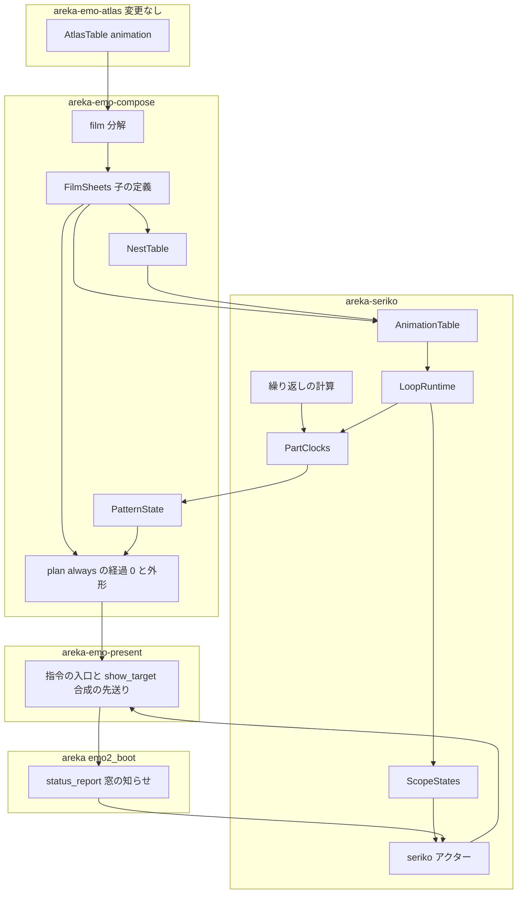
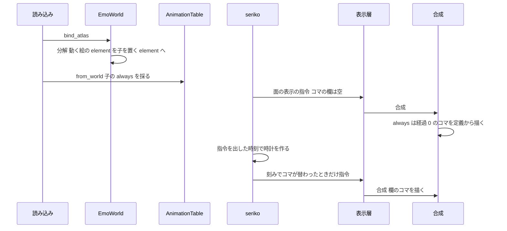
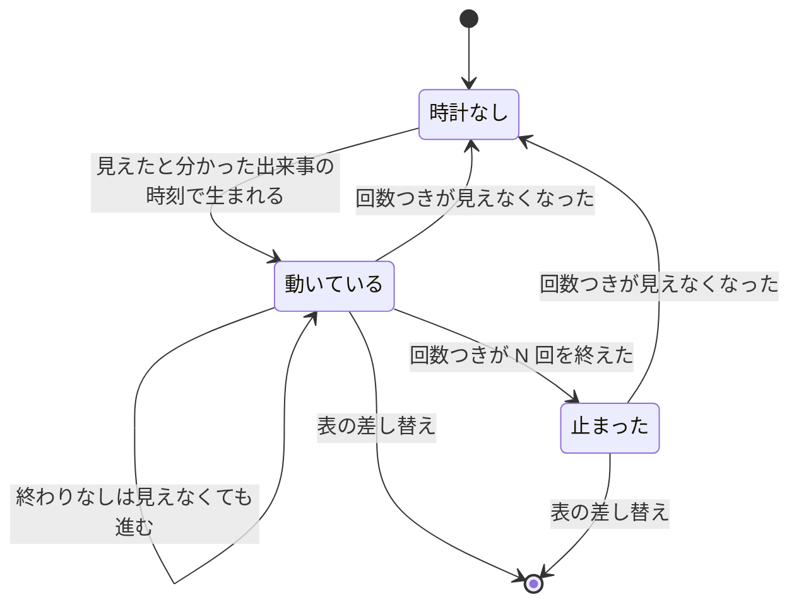
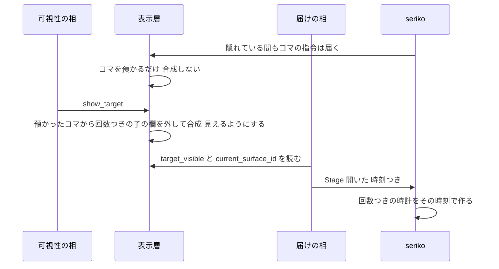
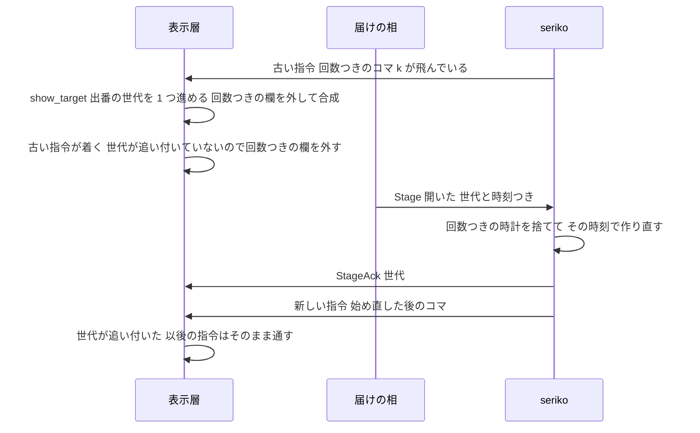

# Design Document: areka-P0-animated-image-playback

> コードは「何の定義か＋ファイル」で指す。現状の記述は本ブランチ（main `82607b5f` を取り込んだ後）のコードを 2026-10-05 に読んで確かめたもの。実装の着手時に引き直すこと。
> **2026-10-05 設計討議の裁定で作り直した版**。開発者「本質的な案で設計せよ。スコープが膨らむなら関係しそうな他セッションと調整」。前の版（合成の後で絵の番号を差し替える形）は捨てた。同じウェーブの約束（`plan.rs`・`areka-emo-present` ほかに触らない）は設計の縛りから外し、触るファイルを全部挙げて調整に回す（「触るファイルと並走の重なり」）。
> 調べた経過と捨てた案は `research.md` の「設計の段の調査（作り直し）」に在る。

## Overview

**Purpose**: 動く APNG・動く WebP をシェルの element定義・`surface*.png`・バルーンの面に置くだけで動かし、interval `always` のアニメーションを繰り返す。
**Users**: シェルとバルーンの作者（絵を置くだけ・`always` と書くだけ）と、そのゴーストを使う利用者。
**Impact**: 読み込みのとき、動く絵 1 つを「`always` のアニメーション 1 本を持つ子」へ自動で分解し、その絵を置いていた element定義を子を置く element に替える。子は、作者が element定義でサーフェスを部品として置いたときと同じ入口・同じ部品の時計で動く。あわせて `always` そのものを、合成・外形・seriko の 3 か所で根から扱えるようにする。

### Goals

- 動く絵は「自動で書かれた定義」として動く。作者が手で書いた `always` の部品と、同じ経路・同じ時計・同じ決まりを通る。
- `always` のアニメーション（手書きも自動も）は、**経過 0 の絵を定義だけから描ける**。コマが 1 つも届いていなくても絵は欠けず、外形も正しい。
- 繰り返しは「開始の時刻からの経過を周期で割る」1 つの純粋な計算で決める。待ち時間は丸めない。時計の開始は出来事の時刻で決める（台本の合図は seriko がそれを処理した時刻・バルーンの窓の知らせは送り手が送った時刻）。
- シェルとバルーンは同じ仕組みを通る。バルーンだけの再生の仕組みは 0 個。
- 動く絵も `always` も無いシェル（`emo2` を含む）は、足した経路を 1 行も通らない。

### Non-Goals

- pattern定義の描画メソッド `import`（後続 `areka-P0-animated-image-import`）。本 spec の変更は 0。
- `always` を含む組み合わせ（`bind+always` ほか）と、`always` 以外の interval の語（後続 `areka-P0-seriko-trigger-intervals`）。
- 動く GIF・読み込みの上限・element定義のオプション・`overlay` 以外の描画メソッド・合成の結果を覚える席の数（どれも変更 0）。
- 外形が画像の element定義の X,Y を数えないバグの直し（後続 `areka-P0-extent-element-offset`）。本 spec は「静止画のときと同じ外形」を守るだけで、そのバグは直さない。

## Boundary Commitments

### This Spec Owns

- 動く絵を子へ分解する手順と、子の定義の置き場（`areka-emo-compose` の新しい `film.rs`）。
- 部品を指す鍵の 2 つ目の種類「動く絵の子」（`PartKey::Film`・`ElementKind::Film`）。
- `always` の経過 0 の絵を定義から描く決まり（合成 `plan.rs`）と、`always` を外形に数える決まり（`flatten_extent`）、見える部品に数える決まり（`NestTable`）。
- seriko の引き金 `LoopTrigger::Always`、繰り返しの計算（`lap_of`・`always_at`）、時計の開始の時刻の渡し方（`SerikoClock`）、バルーンの面で部品を回す経路。
- バルーンの窓の見える・見えないを seriko へ知らせる線（`SerikoMsg::Stage`）と、隠れている外から所有される対象の合成を先送りする決まり（表示層の指令の入口と `show_target`）、出し直しの前に出た指令を見分ける出番の世代（`StageAck`）。
- 試験用のシェルとバルーン（検体）、決定論テスト、実機の確かめの記録。
- 網羅台帳の `element*`・`always` の項、対応表（`doc/COMPAT_ARCHITECTURE.md` §8）の本 spec の節、後続 2 本の brief の申し送りの節。

### Out of Boundary

- 読み込みとアトラス（`areka-emo-atlas` の全ファイル・変更 0）。使うのは `AtlasTable::animation`・`AtlasTable::entry` の読み口だけ。
- 読み手（`areka-parsers`）・畳み込み（`fold.rs`）・描画メソッドの名前（`method.rs`）・起動の資産の組み立て（`emo2_boot/assets.rs`）。変更 0。
- 一番上のサーフェス自身の `random`・`bind+random`・`sometimes`・`rarely` の抽選と進み方。変更 0（乱数の消費の順も同じ）。
- バルーンをいつ出しいつ隠すかの判断（`balloon_visibility.rs` ほか）。読むだけ。
- 合成の結果を覚える席の数（`CAPACITY`）。変更 0。

### Allowed Dependencies

- 依存の向きは今のまま: `areka-parsers` → `areka-emo-atlas` → `areka-emo-compose` → `areka-seriko` → `areka`。`areka-emo-present` は `areka-emo-compose` の下流。逆向きの依存は足さない。
- `areka-seriko` は `areka-emo-atlas` に依存しない（今も依存していない）。絵の番号は `u32` の値として受け取る。`Cargo.toml`・`Cargo.lock` の変更は **0**。新しい外部クレートは 0 個。

### Revalidation Triggers

- `PartKey`・`PatternState` の欄・`LoopTrigger` の腕・`SerikoMsg::Stage` の形・`always` の経過 0 の決まりが変わるとき → 後続 2 本の brief の申し送りを書き直す（要件 5.2・10.5）。
- `plan.rs` の画像の element の描き方・外形の数え方が変わるとき（`areka-P0-element-base-method`・`areka-P0-extent-element-offset`・`areka-P0-element-clipping-option`）→ 「画像と動く絵の子は同じ 1 行で外形に数える」が保たれているかを見直す。
- 読み込みの側が「各コマは絵の全体の寸法で揃う」「`frames[0]` は親」を変えるとき → 分解の検査を見直す。
- seriko から表示層までの指令の道が 1 本の FIFO でなくなるとき（出口が増える・橋渡しが並びを変える）→ 出番の世代（合図の後の指令は合図の後に着く、に立っている）を見直す。

## Architecture

### Existing Architecture Analysis

読んで確かめた、設計を決める事実。

- **コマが無いと `always` の絵は出ない**: 合成の `flatten_surface`（`crates/areka-emo-compose/src/plan.rs`）が重ねるのは「有効な着せ替えの pattern0」と「この段にコマを持つ animation」だけ。コマ（`PatternState`）が空のまま合成される場面が実在する: バルーンの装着（`crates/areka/src/emo2_boot/frame/attach.rs` が面 0 を空のコマで確立する）・差し替えの最初の表示（`RebasedShow`・`crates/areka-seriko/src/output.rs` はコマを運ばない）・起動の採寸。
- **外形に `always` は入らない**: `flatten_extent`（同上）が数えるのは、束縛の在る画像の element の原寸・element定義の子・着せ替えの種類の animation の pattern0 だけ。
- **element は必ず描かれ、コマはその上に重なる**: `push_static_element_ops`（同上）。コマは重ね済みの全体の絵なので、1 枚目を element に残すと透明な所から透ける。
- **サーフェスの番号は `u32` の全域が作者のもの**: `SurfaceIndex`（`world.rs`）・`ElementKind::Surface`（`nesting.rs`）・`PatternFrame.surface_id`（`pattern.rs`）。`\s[番号]` は `SurfaceResolver::resolve`（`crates/areka-seriko/src/resolve.rs`）が `u32` へ写すだけで、在るかどうかは見ない。
- **部品の入口と時計は在る**: 数字だけの element定義は `ElementKind::Surface` として子へ再帰し（`push_static_element_ops`）、見える部品は `NestTable::visible_parts`（`nesting.rs`）が求め、時計は `PartClocks`（`crates/areka-seriko/src/parts.rs`）が（スコープ, 部品の番号, animation の番号）ごとに持つ。時計は親の切り替えで巻き戻らず、シェルの表の差し替えでだけ捨てる。今はシェルの面だけで回る。
- **seriko は時刻を刻みでしか知らない**: 時計の開始は「抽選が当たった刻みの時刻」。台本の合図（`\s`・`\b`）には同じ時計の時刻が付いていない。
- **シェルの表示は必ず seriko から出る**（装着は出さない・`attach.rs` の注記）。**バルーンは違う**: 装着が面 0 を確立し、見える・見えないは可視性の相だけが決める。seriko は `\b[番号]` が来るまでバルーンの面を知らず、窓が見えているかは一度も知らされない。
- **バルーンを出すときは最後の入力で合成し直す**: `EmoPresenter::show_target`（`crates/areka-emo-present/src/presenter/visibility.rs`）は、最後に確立した入力（`last_show`）で `apply_show` を通し直してから見えるようにする。隠れている間に届いた表示の指令も、今は毎回合成まで走る（`apply_show`・`presenter/show.rs`）。
- **seriko の指令の出口は 1 つの FIFO**: 表示の指令 `DisplayCommand`（`crates/areka-seriko/src/output.rs`）は 5 種で、出すのは `emit_display`（`actor.rs`）の 1 か所。定義の差し替えは、合図 `Rebased` を FIFO の 1 点に並べて前後を分けている（世代 `epoch` は UI の依頼の番号を返すもの）。橋渡し `map_display_command`（`crates/areka/src/emo2_boot/adapter.rs`）は 5 種を網羅して `PresentCommand` へ写す。
- **フレームの終わりの届けの先例**: `report_balloons`（`crates/areka/src/emo2_boot/frame/status_report.rs`）が、表示層の照会 2 本から見えているバルーンの組を作り、前と違うときだけ運行の側へ送る。
- **合成の鍵**: `ComposeKey`（`crates/areka-emo-present/src/cache.rs`）は `PatternState` を丸ごと等しさで比べる。perf の記録の `compose_key_hash`（`presenter/timing.rs`）は一番上の欄しか混ぜていない（部品の欄を今も混ぜていない）。

### 分解の形（どちらの子サーフェスを選んだか）

子サーフェスの形には 2 つある。

| 形 | 中身 | 判断 |
| --- | --- | --- |
| コマ 1 枚ごとにサーフェスを作る | コマの数だけ「`element0` ＝そのコマ」のサーフェス＋それらを `always` で順に指す子 | 不採用 |
| **絵 1 つにつき子を 1 つ・コマは絵を直接指す** | 子は element を持たず、`always` のアニメーション 1 本だけを持つ。その pattern はコマの絵を直接指す | **採用** |

採用の理由:

- コマは「絵」であって「定義」ではない。コマごとのサーフェスの中身は「この絵を 1 枚置く」だけで、定義として何も足さない。上限いっぱい（1,024 コマ）の絵 1 つで 1,025 個の定義が増え、面の表はスコープの数だけ組まれ、面の一覧をなめる処理の全部に現れる。
- 作者が手で書くときも、要るのは「子サーフェス 1 つと `always` 1 本」である。pattern が絵のファイルを直接指す書き方は、正典の `import`（`animation*.pattern*,import,ファイル名,…`）が既に持つ考え方で、後続 `areka-P0-animated-image-import` が同じ口に載れる。
- 番号の問題が形から消える（下）。

### 番号の空間（要件 1.12）

**動く絵の子は、サーフェスの番号を持たない**。部品を指す鍵に 2 つ目の種類を足す。

```rust
/// 部品を指す鍵。作者のサーフェスと動く絵の子は種類が違うので、番号が当たることが無い。
pub enum PartKey {
    /// 作者が書いたサーフェス（番号）。
    Surface(u32),
    /// 動く絵から作った子（親の絵の番号）。
    Film(FilmId),
}
pub struct FilmId(pub u32);
```

- 子は面の表の番号の索引（`SurfaceIndex`）に載らない。`EmoWorld::surface_ids`・`EmoWorld::surface` は作者のサーフェスだけを返す（変更 0）。
- `\s[番号]`・別名・作者の element定義・作者の pattern定義は `u32` の番号しか作れないので、子に届く道が無い。遮る検査は要らない（0 個）。
- 面の一覧をなめる処理の扱い:

| 処理 | 定義 | 動く絵の子の扱い |
| --- | --- | --- |
| 相手の無いコマの検出 | `EmoWorld::dangling_pattern_targets`（`world.rs`） | 現れない（変更 0） |
| 入れ子の報告 | `NestReport::from_world`（`nesting.rs`） | `ElementKind::Film` は「無い番号」にも「循環」にも数えない（子は先を持たない） |
| 箱の表の畳み込み | `fold_boxes`（`boxes.rs`） | 現れない（変更 0） |
| 当たり判定の持ち込み | `attach_hit_regions`（`hit_import.rs`） | 分解の前に済んでいる。子は領域を持たない（変更 0） |
| 箱の束の番号の一覧 | `assets.rs` が `surface_ids` を写す | 現れない（変更 0） |
| 見える部品 | `NestTable`（`nesting.rs`） | 行に「置かれた動く絵の子」の欄を足す（下） |
| seriko の表 | `AnimationTable::from_world`（`table.rs`） | 作者のサーフェスの輪の後に、子の定義から `always` を 1 本ずつ採る |

### Architecture Pattern & Boundary Map



**Architecture Integration**:

- 選んだ形: 今ある「element定義で部品を置く入口 → 見える部品 → 部品の時計 → 部品の欄 → 合成」の流れに、鍵の種類 1 つ（`PartKey::Film`）と引き金 1 つ（`Always`）を足す。動く絵のための別の経路は作らない。
- 境界: 「どのコマを出すか」は seriko、「経過 0 の絵は何か・どう描くか・外形は何か」は合成、「隠れている間は合成しない」は表示層。
- 保つ決まり: 一番上の再生は切り替えで捨てる／部品の時計は巻き戻さない／同じ `PatternState` は出さない／合成は結果を覚えない／アニメーションの仕組みは台本の再生とサーフェスのアニメーションの 2 つ。
- steering との整合: 時刻は外から与える（決定論テスト）・記録の無い失敗の経路 0・1 ファイル 1,000 行以下・テストは兄弟ファイル。

### Technology Stack

| Layer | Choice / Version | Role in Feature | Notes |
| --- | --- | --- | --- |
| 合成 | `areka-emo-compose`（既存）・`bevy_ecs` の Resource | 分解・子の定義・`always` の経過 0 と外形 | 新しい依存 0 |
| アニメーション | `areka-seriko`（既存） | `always`・時計・バルーンの面 | `areka-emo-atlas` への依存は足さない |
| 表示 | `areka-emo-present`（既存） | 隠れている対象の合成の先送り | `CAPACITY` は変更 0 |
| 結線 | `crates/areka/src/emo2_boot/` | 時計の受け渡し・窓の知らせ | `GhostSession::seriko_sink` を借りる |

## 4 つのつまずきを根で直す

### a. コマが届くまで絵が無い → `always` は定義から経過 0 の絵が決まる

- 決まり: **`always` のアニメーションは、コマの欄に何も載っていなければ、経過 0 のコマを描く**。経過 0 のコマは「待ち時間の累積が 0 の pattern のうち最後のもの」（1 つも無ければ何も描かない。負の番号なら何も描かない）。定義だけから決まり、時計も seriko も要らない。
- 置く場所: `flatten_surface`（`plan.rs`）の「この段の animation を重ねる」所。重ねる対象の番号に、そのサーフェスの `always` を足し、コマが無ければ経過 0 の pattern を使う。手書きの `always`（一番上でも部品でも）と、動く絵の子の両方に同じ決まりが効く。
- 欄の意味を 3 つに分ける（`PatternState`）: **載っていない＝経過 0**／**コマ**／**消えている**（`always` の途中の終わりのコマ `-1` の後）。seriko は、今のコマが経過 0 のコマと同じなら欄に載せない。こうすると、空の `PatternState` は「全部の `always` が経過 0」と同じ意味になり、装着・差し替え・採寸が空のコマで合成した絵と、seriko が始めた直後の絵が同じ鍵になる（余分な合成 0 回）。
- 効き目: シェルの面の切り替え・差し替えの最初の表示・バルーンの装着のどれでも、最初の指令から絵が出る（0 フレーム）。
- 待ち時間の合計が 0 の `always`（要件 4.6）は、経過 0 のコマ＝ 1 周だけ評価した絵になる。seriko は時計を作らず、合成が定義から描き続ける。

### b. 外形 → `always` と動く絵の子を外形に数える

- `flatten_extent`（今は `plan.rs`。本 spec で `plan_extent.rs` へ移す）に 2 つ足す。
  1. element の輪: `ElementKind::Film` の element は、子の定義の原寸を、**画像の element と同じ 1 行**で数える（「束縛した絵の原寸」か「子の原寸」かを先に決め、数える式は 1 つ）。全部のコマは原寸が同じなので、静止画だったときと同じ値になる（要件 1.7）。
  2. animation の輪: `always` の animation は、**全部の pattern** の先（番号が 0 以上で、欄 2 が animation の番号になる 7 語でも、サーフェスの番号を無視する `move`（ukadoc）でもないもの。`move` は 2026-10-06 の実装のレビューで足した）を、着せ替えの pattern0 と同じやり方で数える。`always` は表示されている間ずっと全部のコマを通るので、和集合が正しい外形である。外形はコマに依らない静的な量のまま。
- 後続 `areka-P0-extent-element-offset`（未着手・同じ関数を直す）との関係: 同 spec が直すのは「画像の element の X,Y を外形に数えていない」1 点。本 spec は画像と動く絵の子を同じ 1 行で数えるので、その 1 行を直せば両方が直る。**順は本 spec が先**（同 spec は本 spec の後に置かれている）。roadmap の「`flatten_extent` は `extent-element-offset` の持ち物」の約束は、本 spec が 2 つを足すことを書き足して直す。関数を `plan_extent.rs` へ移すことも申し送る。

### c. 透ける → 子は element を持たない

- 動く絵の子は element を 0 個持ち、`always` のアニメーション 1 本だけを持つ。描かれるのは今のコマ 1 枚だけで、下に何も敷かれない。元の element定義は、同じ番号（重ね順）・同じ X,Y のまま、子を置く element（`ElementKind::Film`）に替わる（要件 1.4）。

### d. 番号 → 鍵の種類を分ける

- 上の「番号の空間」のとおり。作るサーフェスの番号は 0 個、作者の番号と当たる・隠す場面は 0 件。

## File Structure Plan

### Directory Structure

```
crates/areka-emo-compose/
├── src/
│   ├── film.rs                    # 新規: FilmSheet・FilmSheets・FilmSkip・decompose（分解）・検査（FilmId は nesting.rs）
│   ├── film_tests.rs              # 新規
│   ├── nesting.rs                 # 変更: FilmId・PartKey・ElementKind::Film・rest_index・rest_pattern（経過 0 の pattern の求め方）・NestTable の films と always の欄
│   ├── nesting_film_tests.rs      # 新規
│   ├── pattern.rs                 # 変更: 欄の 3 つの意味（載っていない・コマ・消えている）・動く絵の子の欄
│   ├── pattern_cell_tests.rs      # 新規
│   ├── plan.rs                    # 変更: Film の element・always の経過 0・絵を指すコマ
│   ├── plan_always.rs             # 新規: push_film_op（動く絵の子の平坦化）・always_rest_target（always の経過 0 の先。求め方は nesting.rs の rest_pattern を呼ぶ）
│   ├── plan_always_tests.rs       # 新規
│   ├── plan_extent.rs             # 新規: plan の子のモジュール（plan.rs の #[path] mod extent）。compute_extent・flatten_extent を plan.rs から移す＋ b の 2 つ
│   ├── plan_extent_film_tests.rs  # 新規（既存の plan_extent_tests.rs・plan_nesting_extent_tests.rs は接続先だけ替える）
│   ├── world.rs                   # 変更: bind_atlas の直後に分解・film_sheets の読み口
│   └── lib.rs                     # 変更: 公開の接続
└── tests/fixtures/animated-playback/   # 新規: 試験用のシェルとバルーン（要件 9.4）
crates/areka-seriko/src/
├── timeline.rs                    # 変更: lap_of・always_at
├── timeline_repeat_tests.rs       # 新規
├── table.rs                       # 変更: LoopTrigger::Always・コマの指す先・動く絵の子の行・合計 0 の記録
├── table_always_tests.rs          # 新規
├── table_film_tests.rs            # 新規
├── looper.rs                      # 変更: 一番上の always・バルーンの面の部品・時計の受け渡し・refresh
├── looper_always_tests.rs         # 新規
├── looper_balloon_tests.rs        # 新規
├── parts.rs                       # 変更: 鍵に面の種類と PartKey・always の腕・回数つきの時計の整理
├── parts_always_tests.rs          # 新規
├── parts_film_tests.rs            # 新規
├── state.rs                       # 変更: バルーンの窓と面の覚え・stage_slots
├── state_stage_tests.rs           # 新規
├── output.rs                      # 変更: DisplayCommand に StageAck を 1 種
├── actor.rs                       # 変更: SerikoMsg::Stage・send_stage・時計つきの起動・世代が進んだら StageAck を先に出す
├── actor_stage_tests.rs           # 新規
└── lib.rs                         # 変更: 公開の接続
crates/areka-emo-present/src/presenter/
├── （../command.rs）               # 変更: PresentCommand に StageAck を 1 種
├── read.rs                        # 変更: 読み口 stage_generation
├── （兄弟）presenter_stage_tests.rs # 新規: 閉じる → 出すの競り合い（着く順の全部の並び）
├── hub.rs                         # 変更: 指令の入口（ShowSurface の腕）で、隠れている対象のコマを預かる・世代が追い付くまで回数つきの欄を外す・StageAck の腕
├── target.rs                      # 変更: 預かったコマの欄 1 つ
├── visibility.rs                  # 変更: show_target が預かったコマで通し直す・回数つきの子の欄を外す
├── replace.rs                     # 変更: 対象の差し替えで DetachedState が出番の世代・追い付いた世代を引き継ぐ
├── timing.rs                      # 変更: compose_key_hash が部品の欄も混ぜる
├── （show.rs の apply_show は変更 0）
├── （兄弟）presenter_film_tests.rs  # 新規（接続宣言は presenter.rs）
└── （../shell_target.rs）          # 変更: テストの接続宣言 1 つ（shell_target_animated_fixture_tests.rs）
crates/areka/src/emo2_boot/
├── adapter.rs                     # 変更: map_display_command に StageAck の腕 1 つ
├── frame/status_report.rs         # 変更: 窓の知らせ（新しい関数 report_stages・seriko へ・出番の世代つき）
├── frame/status_report_stage_tests.rs  # 新規
├── mod.rs                         # 変更: 時計を 1 つ作って刻みと seriko へ渡す・E2E の接続宣言
└── film_playback_e2e_tests.rs     # 新規
doc/・.kiro/                        # 台帳・対応表・後続 2 本の brief・roadmap の行
```

- 置き場は実装に合わせて直した（2026-10-06）: `FilmId`・`PartKey`・経過 0 の pattern の求め方 `rest_pattern`（`pub(crate)`）は `nesting.rs`。`plan_always.rs` はそれを呼ぶ側。`plan_extent.rs` は `plan` の子のモジュール。`replace.rs`・`shell_target.rs` を足した。

### Modified Files

- 行数の見通し（今 → 見込み）: `plan.rs` 821 → 約 780（外形の約 130 行を出し、約 90 行を足す）／`plan_extent.rs` 新規 約 190／`plan_always.rs` 新規 約 150／`nesting.rs` 329 → 約 420／`pattern.rs` 203 → 約 290／`world.rs` 371 → 約 400／`timeline.rs` 506 → 約 570／`table.rs` 616 → 約 760／`looper.rs` 528 → 約 700／`parts.rs` 339 → 約 480／`state.rs` 632 → 約 710／`actor.rs` 660 → 約 720／`output.rs` 292 → 約 305／`hub.rs` 184 → 約 240／`target.rs` 164 → 約 180／`visibility.rs` 144 → 約 195／`command.rs` 253 → 約 265／`read.rs` 255 → 約 268／`adapter.rs` 583 → 約 595／`timing.rs` 304 → 約 320／`status_report.rs` 191 → 約 260／`mod.rs` 883 → 約 892。どれも 1,000 行以下。`looper.rs` が 800 を超えそうなら、バルーンの面と `refresh` を `looper_stage.rs` へ出す。
- `crates/areka/src/emo2_boot/spine.rs`（1,000 行ちょうど）は **触らない**。時計を渡さない起動（今の `spawn_seriko`）は署名を変えずに残し、時計つきの起動を別の関数として足す。
- `PatternFrame`・`LoopAnimation` の今の欄と、`PatternState` の今の関数（`set`・`get`・`iter`・`set_part`・`part_get`・`part`・`clear_parts`）、`NestTable::visible_parts` の署名は変えない（表示層と `areka` のテストの書き換え 0）。`LoopFrame` には「指す先が絵のときの絵の番号」の欄を 1 つ足す（seriko の中のテストの書き下しを直す）。
- 既存のテストで書き換えが要るもの: `table.rs` の中のテスト `only_random_and_bindrandom_are_recorded_others_debug_logged`（「採らない語」の例の `always` を `runonce` へ）・`LoopTrigger` の腕を 2 つと決め打つ 3 か所（`table.rs` の `from_world` の `k == 0` の検査・`parts.rs` の `gate`・`looper.rs` の `on_tick` の抽選の振り分け）と `table.rs` のテスト `recorded_anims_satisfy_postconditions`・`LoopFrame` の書き下し・`timing_tests.rs` の鍵の檻（部品の欄の弁別を足す）。`emo2` の照合（要件 7.7）の書き換えは 0。

### 触るファイルと並走の重なり（調整用）

印: **約** ＝ 棚卸の「同じウェーブの約束」で本 spec が触らないとされていた所／**他** ＝ steering `roadmap.md` の同じウェーブの行で、ほかの spec の触るファイルに挙がっている所。

| ファイル | 触る所 | 印 |
| --- | --- | --- |
| `crates/areka-emo-compose/src/plan.rs` | `push_static_element_ops`（`ElementKind` の振り分けに `Film` の腕）・`flatten_surface`（重ねる番号に `always` を足す・コマが無ければ経過 0・コマが絵を指す腕・「消えている」の腕）・`compute_extent`／`flatten_extent` を `plan_extent.rs` へ移す | **約**。同じウェーブでの重なりは **0**（`areka-P0-element-base-method` は `plan.rs` に触らないと確かめた・下の「調整で確かめた事実」）。`flatten_extent` は未着手の `areka-P0-extent-element-offset` の持ち物とされているので、移したことを申し送る |
| `crates/areka-emo-compose/src/plan_extent.rs`・`plan_always.rs` | 新規（`plan_extent.rs` は `plan` の子のモジュール・`plan_always.rs` は `push_film_op`・`always_rest_target`） | — |
| `crates/areka-emo-compose/src/nesting.rs` | `ElementKind` に `Film`・`FilmId`・`PartKey`・`rest_index`・`rest_pattern`・`SurfaceParts` に 2 欄・`NestTable::walk`・`NestReport::from_world` の `ElementKind` の振り分け | — |
| `crates/areka-emo-compose/src/pattern.rs`・`world.rs`・`lib.rs`・`film.rs` | 欄・`bind_atlas` の直後の 1 行と読み口・公開の接続・新規 | — |
| `crates/areka-emo-compose/src/{fold,method,atlas_bind,boxes,hit_import,base_image}.rs` | 変更 0 | — |
| `crates/areka-seriko/src/{table,looper,parts,timeline}.rs` | 上の File Structure のとおり | 棚卸の一覧どおり。後続 `areka-P0-seriko-trigger-intervals` と分け合う（同じウェーブではない） |
| `crates/areka-seriko/src/{state,actor,lib}.rs` | `ScopeStates` に窓と面の覚え・`commit_pattern` のバルーンの腕・`SerikoMsg` に 1 種・`SerikoSink` に 2 関数・時計つきの起動 | 棚卸の一覧に無い（ほかの spec の一覧にも無い） |
| `crates/areka-emo-present/src/presenter/hub.rs`・`target.rs`・`visibility.rs` | 指令の入口の `ShowSurface` の腕（預かる）・`PresentTarget` に欄 1 つ・`show_target`（預かったコマで通し直す・回数つきの子の欄を外す）。`show.rs` の `apply_show` は変更 0 | **約**。`areka-P0-self-alpha-declaration` は `shell_target.rs`・`balloon.rs`、`areka-P0-element-base-method` は `shell_target.rs` の `load_shell_target` だけなので、この 3 つでは重ならない（`shell_target.rs` は下の行） |
| `crates/areka-emo-present/src/presenter/replace.rs` | 対象の差し替えで `DetachedState` に出番の世代・追い付いた世代の 2 欄を足して引き継ぐ（実装に合わせて足した・2026-10-06） | **約** |
| `crates/areka-emo-present/src/shell_target.rs` | テストの接続宣言 1 つ（`#[cfg(test)] #[path = "shell_target_animated_fixture_tests.rs"] mod animated_fixture_tests;` の 4 行）。本体は変更 0（実装に合わせて足した・2026-10-06） | **他**: `areka-P0-element-base-method`（先に main へ入った・接続宣言が隣り合うだけ）・`areka-P0-self-alpha-declaration`（`build_balloon_target_from_faces` の署名を変える）。後から main に入る側が、この検体のテストと E2E（`film_playback_e2e_tests.rs` の `load_balloon()`）の呼び出しを合わせる |
| `crates/areka-emo-present/src/presenter/timing.rs`・`presenter.rs` | `compose_key_hash`・テストの接続宣言 1 つ | **約** |
| `crates/areka/src/emo2_boot/frame/status_report.rs` | 新しい関数 `report_stages`（`run_status_report_phase` が文字の層を借りる手前で呼ぶ）・`BalloonStatusLedger` に欄 `last_stage`（出番の世代を含む）。`report_balloons` は変更 0（実装に合わせて直した・2026-10-06） | ほかの spec の一覧に無い |
| `crates/areka-seriko/src/output.rs` | `DisplayCommand` に `StageAck` を 1 種（今ある 5 種の欄は変えない） | ほかの spec の一覧に無い |
| `crates/areka-emo-present/src/command.rs`・`presenter/read.rs` | `PresentCommand` に `StageAck` を 1 種・読み口 `stage_generation` | **約**。ほかの spec の一覧に無い |
| `crates/areka/src/emo2_boot/adapter.rs` | `map_display_command` に腕 1 つ（`DisplayCommand` を網羅して突き合わせる所。足さないとコンパイルで止まる） | ほかの spec の一覧に無い |
| `crates/areka/src/emo2_boot/mod.rs` | seriko の起動の所（`spawn_seriko(` の呼び出し）と刻みの起動の所（`LoopTickerConfig`）に、新しい時計 `seriko_clock` を 1 つ作って渡す数行・テストの接続宣言 | **他**: `areka-P0-balloon-lifecycle-events` は同じファイルの別の所の 1〜3 行だけ（下の「調整で確かめた事実」） |
| `crates/areka/src/emo2_boot/{spine,assets,frame,frame/wiring}.rs` | 変更 0 | — |
| `doc/ukadoc-coverage/ledger/assets.toml`・`doc/COMPAT_ARCHITECTURE.md` | `element*`・`always` の項／§8 に 1 節 | **他**（別の行・別の節）: `element-base-method`・`ghost-standard-balloon`・`self-alpha-declaration` |
| `.kiro/steering/roadmap.md` | 同じウェーブの行の本 spec の一覧と約束・本 spec の行の言い方 | 棚卸の持ち物 |

#### 調整で確かめた事実（2026-10-05・ほかのセッションから）

- **`areka-P0-element-base-method`**: `crates/areka-emo-compose/src/plan.rs` には**触らない**（同 spec の tasks.md が `plan.rs`・`blit.rs`・`base_image.rs`・`method.rs` の `is_implemented`／`known_method` を「触らない」に挙げている）。触るのは、読み手の `shell/`（`decode.rs` の `is_image_element_method`・新しい `undrawn.rs`）・合成の `fold.rs` の `normalize_element` と `method.rs` の `ComposeMethod::Base` の注記だけ・表示層の `shell_target.rs` の `load_shell_target`（`warn!` 1 つとテストの接続）・対応表 §8 の 1 行・台帳 `assets.toml` の 2 行。**同 spec が先に main へ入り、本 spec は後**。このウェーブで `plan.rs` の重なりは 0。
- **`areka-P0-balloon-lifecycle-events`**: `crates/areka/src/emo2_boot/mod.rs` の 1〜3 行だけ（今ある `let clock = TalkClock::new(clock_fn);` の写しを `BalloonLifecycleSink::new(lifecycle_tx)` へ渡す）。`spawn_seriko(` の所・刻みの起動・テストの接続宣言・`frame/status_report.rs` には触らない。**本 spec への縛り: その `clock: TalkClock` の名前・型・持ち主を変えない**。seriko の時計は別の名前（`seriko_clock`）の別の値として足す。**順は入れ替えた（2026-10-05 実装の頭の開発者裁定）: 同 spec はまだ要件の段なので待たず、本 spec が先に main へ入る**。後から入る同 spec が `mod.rs` の小さな競合を解く。同 spec のセッションへ知らせ済み。
- **`areka-P0-extent-element-offset`**: 未着手（セッションなし）。本 spec が先。同 spec の brief へ「`compute_extent`・`flatten_extent` は `plan_extent.rs` へ移した」「足したのは `always` の全部の pattern と動く絵の子の 2 か所」「画像の element と動く絵の子は同じ 1 行で数えているので、X,Y の直しはその 1 行に入れる」を申し送る（文面は「申し送りの文面」）。

残る調整は文書だけ: roadmap の同じウェーブの行（本 spec の触るファイル・約束・規模）と `flatten_extent` の持ち主の書き直し。タスクの頭に「main を取り込んで、先に入った `areka-P0-element-base-method` の後の形を引き直す」を置く（`areka-P0-balloon-lifecycle-events` は上のとおり本 spec の後）。

## System Flows

### 読み込みから 1 コマが画面に出るまで



### 時計の一生（`always` の部品と動く絵の子）



- **時計なし＝経過 0**（合成が定義から描く）。時計は「見えた」と分かった出来事（面の表示の指令を出すとき・着せ替えの変化・窓が開いた知らせ・刻み）の時刻で生まれる。乱数は引かない。
- 「止まった」は別の状態を持たない。経過が「周期 × N」以上かどうかで求まる。
- 一番上のサーフェス自身の `always` は、今の決まりどおり面の切り替えで再生を捨てる（要件 4.3）。

### バルーンの窓が出る・隠れる



- 隠れている間、seriko は生まれている時計（終わりなしの絵）を進め続け、コマが替われば指令を出す。表示層は、**隠れている・外から所有される対象への、面の番号と着せ替えが最後に成立した入力（`last_show`）と同じでコマだけが違う指令**を、**預かるだけ**にする（`Hide` で今の面の番号が消えた直後も同じ）（対象ごとの「出すときに使うコマ」の欄に置く。合成・転送・描画は 0 回・要件 6.4・3.7）。最後に表示が成立した入力（`last_show`）には触らないので、隠れているバルーンの読み戻し（`last_shown`・`read_back`・MCP の `dump_balloon`）は今までどおり成立した絵を返す。
- 窓を出すとき、`show_target` は「預かったコマが在ればそれ、無ければ最後に成立した入力のコマ」で通し直す。預かったコマは最新なので、終わりなしの絵は出た瞬間から正しいコマが見える（古いコマが 1〜2 フレーム見えることは無い）。
- **回数つきの絵は、隠れていた対象を出すとき必ず経過 0 から**: `show_target` は通し直すコマから、回数つきの子（その対象の面の表の `FilmSheet.laps` が在る子）の欄を外す。見えている対象への `show_target` では外さない（続けて見えていれば続き・要件 2.8）。欄が無い＝経過 0 なので、閉じた知らせの往復が間に合っていなくても、出た最初のフレームから 1 枚目が見える（要件 2.3・0 フレーム）。表示層は時刻も seriko も要らない。
- seriko の側は、窓が閉じた知らせで回数つきの時計を捨て、開いた知らせが運ぶ時刻で作り直す。知らせが seriko に着くのが遅れても、開始の時刻は窓が出たフレームの時刻である。
- バルーンの表を差し替えた後、窓が開いたままのスコープは知らせが出ない（変化が無い）。時計は次の刻みの時刻で生まれる。その間は経過 0 の絵が出るので絵は欠けない。

### 出し直しの前に出た指令を見分ける（出番の世代）

窓を出す・隠すのは UI スレッド、コマを決めるのは seriko（別スレッド）なので、「窓が出たことを seriko がまだ知らないうちに出した指令」が、窓が出た後に着く。回数つきの絵では、その指令は始め直す前のコマを運んでいる。これを**並びで**見分ける。



- **出番の世代**: 表示層が、外から所有される対象ごとに持つ番号。隠れていた対象を出す（`show_target` が成立する）たびに 1 つ進める。持ち主は、出す・隠すを実際に行う表示層だけ。
- **知らせが世代を運ぶ**: 届けの相は（開いているか・面の番号・出番の世代）の組が前と違うときに知らせる。同じフレームの中で隠して出し直した場合も、世代が違うので知らせが出る。
- **seriko は世代を受けたら、まず合図 `StageAck` を 1 件出す**。その後で時計を作り直し、指令を出す。seriko の出口は 1 つの FIFO なので、合図より前の指令は「その出番を知る前に決めたコマ」、後の指令は「知った後に決めたコマ」である（定義の差し替えの合図 `Rebased` と同じ並びの使い方）。
- **表示層は、合図が今の世代に追い付くまで、その対象へ着く指令から回数つきの子の欄を外す**（`show_target` が外すのと同じ 1 つの関数）。指令そのものは捨てない（面の番号の切り替え `\b[番号]` や、終わりなしの絵のコマは今までどおり効く）。追い付いた後の指令はそのまま通す。
- これで「閉じる → 出す」がどんなに速くても、どの順で指令が着いても、回数つきの絵は出た最初のフレームから経過 0 で、seriko が始め直した後のコマが着くまで経過 0 のままである（古いコマが見えるフレームは 0）。
- **効くのはバルーン（外から所有される対象）だけ**。シェルの面・まばたきなど今ある指令は、世代を持たず、欄を外されることも無い（外す欄は回数つきの動く絵の子だけなので、動く絵の無い面の表では何も起きない）。`emo2` の指令の列と絵は今と同じ。
- **シェルの側に同じ窓は無い**（確かめた）: シェルの面の切り替え・非表示・着せ替え・定義の差し替え（`Rebased`）は、どれも seriko 自身が合図を受けて決め、同じ出口から順に出す。コマを決める者と、時計を捨てるきっかけを知る者が同じスレッドなので、「きっかけを知る前に決めた指令が後から着く」ことが起きない。定義の差し替えも、合図 `Rebased` が FIFO の中の 1 点に並び、前の指令は前の面の表に、後の指令は後の面の表に当たる。出番の世代はシェルには足さない（足す必要が無い）。
- 知らせは、今ある届けの相の中で、文字の層を借りる手前に置く。観測は表示層の照会（真実は表示層のまま）なので、可視性の相・`\b[-1]`・時間切れのどの道で変わっても同じ 1 か所で拾える。

## Requirements Traceability

| Requirement | Summary | Components | Interfaces | Flows |
| --- | --- | --- | --- | --- |
| 1.1 | element定義の動く絵が動く | 分解・PartClocks・合成 | `film::decompose`・`ElementKind::Film`・`always` の腕 | 読み込みから 1 コマ |
| 1.2 | `surface*.png` の動く絵が動く | 分解 | 土台の画像は `apply_base_images` が画像の element として足すので、同じ分解に載る | 同上 |
| 1.3 | `element0` が在れば描かない | （既存） | element が足されない → 束縛されない → 分解の対象 0 | — |
| 1.4 | 位置と重ね順は静止画と同じ | 分解 | element の番号と X,Y はそのまま・種類だけ替える | — |
| 1.5, 1.6 | 待ち時間どおり・累積で決める | Repeat | `always_at`（開始からの経過だけで決める） | 時計の一生 |
| 1.7 | 外形と窓の位置を変えない | 外形 | `flatten_extent` が子の原寸を画像と同じ 1 行で数える | — |
| 1.8 | 作者の当たり判定は同じ | （既存） | 矩形は面の表の静的な値。子は領域を持たない | — |
| 1.13 | 透ける形は表示中のコマに従う | （既存） | 透ける形は合成の結果から作られる（`apply_show`）。合成がコマを描くのでそのまま従う | — |
| 1.9 | 子・pattern の先でも同じ | NestTable・PartClocks | 見える部品に置かれた動く絵の子も見える部品に数える | — |
| 1.10 | 作者のアニメーションと並ぶ | PatternState | 一番上の欄・部品の欄は別。子は自分の欄を持つ | — |
| 1.11 | GIF・縮んだ絵は 1 枚 | 分解 | `AtlasTable::animation` が `None` → 分解しない | — |
| 1.12 | 作者の番号を変えない | PartKey | 作るサーフェスの番号 0 個・届く道 0 本 | — |
| 2.1 | 終わりなしは繰り返す | Repeat | `always_at`（`laps = None`） | 時計の一生 |
| 2.2 | N 回で最後のコマに止まる | Repeat | `always_at`（経過 ≥ 周期 × N なら最後のコマ） | 同上 |
| 2.3, 2.7, 2.8 | 回数つきは表示のたびに始め直す・続けて見えていれば続き | PartClocks・表示層 | 回数つき（`laps` が在る）の時計は「見えなくなった評価」で捨てる。終わりなしは捨てない。バルーンは出番の世代（`StageNote` の `generation`・`StageAck`）で、出し直しの前に決めたコマを見分ける | 同上・出番の世代 |
| 2.4 | 待ち時間 0 は丸めず飛ばす | Repeat・合成 | 同じ時刻のコマは後ろが勝つ（経過 0 のコマの決まりも同じ） | — |
| 2.9 | 遅れたら過ぎた時間の分だけ進む | Repeat | 今のコマは「今の時刻 − 開始の時刻」だけで決まる | — |
| 2.5 | 合計 0 の絵は動かさず記録 | 分解・Table | 分解しない（静止画のまま）・`FilmSkip` → 表が `warn!` 1 回 | — |
| 2.6 | 同じ入力から同じコマ | Repeat | 純粋な関数・乱数なし | — |
| 3.1 | 初めての表示で 1 枚目から | 合成・PartClocks | 時計なし＝経過 0 | 時計の一生 |
| 3.2, 3.3 | 終わりなしは切り替えても戻っても続き | PartClocks | 時計の鍵は（スコープ, 面の種類, `PartKey::Film`, 0）。面の番号を含まない | 同上 |
| 3.4 | 複数の位置で揃う | PartKey | 同じ画像は同じ子（鍵が同じ）＝時計も欄も 1 つ | — |
| 3.5 | スコープごとに別 | PartClocks | 鍵にスコープ | — |
| 3.6 | シェルの切り替え・降りるときに捨てる | LoopRuntime | 表の差し替えで、その面の種類の時計を捨てる | — |
| 3.7 | 見えない絵で描き直さない | PartClocks・表示層 | シェルの見えない部品には触らない（既存）。隠れたバルーンは合成を先送り | 窓が出る・隠れる |
| 4.1 | `always` は抽選を待たず始まる | Table・合成・LoopRuntime | `LoopTrigger::Always`・経過 0 は定義から | 読み込みから 1 コマ |
| 4.2 | 最後のコマの後に頭へ戻る | Repeat | `always_at` | — |
| 4.3 | 一番上は切り替えで頭から | LoopRuntime | `on_surface_changed`（既存）が再生を捨てる | — |
| 4.4 | 子では巻き戻らない | PartClocks | 部品の時計の決まり（既存）に `always` の腕 | — |
| 4.5 | 途中の `-1` は消してから続ける | Repeat・PatternState | `always_at` が「何も出さない」→ 欄に「消えている」 | — |
| 4.6 | 合計 0 は 1 周だけ・記録 | Table・合成 | 表は採らずに `warn!` 1 回。絵は合成が経過 0 として描く | — |
| 4.7 | ほかの語の抽選を変えない | LoopRuntime・PartClocks | `Always` は乱数を引かない・抽選の対象の並びは今のまま | — |
| 4.8, 4.9 | ほかの語・組み合わせは変更 0 | Table・合成 | `always` の見分けは完全一致の 1 関数（`is_always_interval`） | — |
| 5.1 | `import` は変更 0 | — | 読み手・`method.rs` に触らない | — |
| 5.2 | 仕組みの形を申し送る | 文書 | 「申し送りの文面」 | — |
| 6.1 | バルーンの面の動く絵が動く | 分解・LoopRuntime・届けの相 | バルーンの面でも部品を回す・`SerikoMsg::Stage` | 窓が出る・隠れる |
| 6.2 | 大きさ・位置・文字を変えない | 外形 | 外形は同じ・面の番号も同じ | — |
| 6.3 | コマで出したり隠したりしない | （既存） | 外から所有される対象への表示の指令は見えるようにしない | — |
| 6.4 | 隠れている間は描き直さない | 表示層 | 指令の入口で預かる（合成の先送り） | 同上 |
| 6.6 | シェルと混ぜない | PartClocks | 鍵に面の種類 | — |
| 6.7 | 同じ仕組み・バルーン専用 0 個 | 全体 | 分解・鍵・時計・計算・合成は面の種類を見ない | — |
| 6.5 | 静止画のバルーンは変わらない | Table・表示層 | 表が空なら評価しない。先送りは絵を変えない | — |
| 7.1 | 動かないシェルは同じ絵 | 分解・合成 | 動く絵が 0 なら子の定義を載せない。`always` が 0 なら足した腕を通らない | — |
| 7.2 | 合成し直す回数を増やさない | LoopRuntime | 表の門（`is_continuous`）が偽なら足した行を通らない | — |
| 7.3 | `emo2` の 1 コマの時間 | 測定 | 「Performance & Scalability」 | — |
| 7.4 | コマが替わったときだけ合成 | ScopeStates | `commit_pattern`（既存）＋「経過 0 と同じコマは載せない」 | — |
| 7.5, 7.6 | 動く絵 1 つの回数と時間・席の数 | 測定 | 席の数は変更 0・数字を記録 | — |
| 7.7 | `emo2` の照合を書き換えない | 全体 | 書き換え 0 | — |
| 8.1 | 記録の無い失敗の経路 0 本 | 全体 | 「Error Handling」 | — |
| 8.2 | 準備の失敗は 1 枚目の静止画 | 分解 | 分解しない＝画像の element のまま | — |
| 8.3 | 異常終了させない | 全体 | 失敗は値と記録で返す | — |
| 8.4 | 同じ原因は読み込み 1 回に 1 回 | Table | 記録は表を作るときだけ出す | — |
| 9.1〜9.3 | 決定論テスト | Testing Strategy | 時刻は刻みと注入した時計・乱数は注入 | — |
| 9.4 | 検体 | 検体 | `tests/fixtures/animated-playback/` | — |
| 9.5 | 実機 | Testing Strategy | 「実機の確かめ」 | — |
| 10.1, 10.4 | 網羅台帳 | 文書 | `assets.toml` の `element*`・`always` | — |
| 10.2, 10.3 | 対応表 | 文書 | `COMPAT_ARCHITECTURE.md` §8 | — |
| 10.5, 10.7 | 申し送りと roadmap の行 | 文書 | 「申し送りの文面」 | — |
| 10.6 | 範囲外の問題は起票 | 手順 | `/kiro-discovery` | — |

## Components and Interfaces

| Component | Domain/Layer | Intent | Req Coverage | Key Dependencies | Contracts |
| --- | --- | --- | --- | --- | --- |
| 分解（`film.rs`） | 合成 | 動く絵を子へ分解し、子の定義を面の表に載せる | 1.1〜1.4, 1.11, 2.5, 8.2 | AtlasTable (P0) | Service |
| NestTable の拡張 | 合成 | 動く絵の子と `always` の経過 0 の先を見える部品に数える | 1.9, 3.7 | FilmSheets (P0) | Service |
| PatternState の欄 | 合成 | 載っていない・コマ・消えている／動く絵の子の欄 | 1.10, 4.5, 7.4 | — | State |
| 合成（`plan.rs`・`plan_always.rs`・`plan_extent.rs`） | 合成 | `always` の経過 0・絵を指すコマ・外形 | 1.7, 3.1, 4.1, 4.6 | FilmSheets (P0) | Service |
| Repeat（`timeline.rs`） | seriko | 経過 → コマの純粋な計算 | 1.5, 1.6, 2.1, 2.2, 2.4, 2.6, 2.9, 4.2, 4.5 | — | Service |
| Table（`table.rs`） | seriko | `always` と子の行を採る・記録を出す | 2.5, 4.1, 4.6, 4.8, 4.9, 8.4 | FilmSheets (P0) | Service |
| PartClocks（`parts.rs`） | seriko | `always` の時計・回数つきの整理 | 2.3, 2.7, 2.8, 3.1〜3.6, 4.4, 6.6 | Repeat (P0) | State |
| LoopRuntime（`looper.rs`） | seriko | 刻みと出来事の統括・バルーンの面 | 4.1, 4.3, 4.7, 6.1, 7.2 | PartClocks (P0) | Service |
| ScopeStates・アクター | seriko | 窓と面の覚え・`Stage`・時計 | 6.1 | — | State, Event |
| 表示層の先送り（`hub.rs`・`target.rs`・`visibility.rs`） | 表示 | 隠れている対象はコマを預かるだけ・出すとき回数つきは経過 0 | 2.3, 3.7, 6.4 | FilmSheets (P0) | Service, State |
| 窓の知らせ（`status_report.rs`） | areka | 窓の見える・見えないを seriko へ | 6.1, 2.3 | 表示層の照会 (P0)・`GhostSession::seriko_sink` (P0) | Event |

### 合成（`areka-emo-compose`）

#### 分解（`film.rs`）

| Field | Detail |
| --- | --- |
| Intent | `bind_atlas` の直後に、動く絵に束縛された画像の element を、子を置く element へ替える |
| Requirements | 1.1, 1.2, 1.3, 1.4, 1.11, 2.5, 8.1, 8.2 |

**Responsibilities & Constraints**

- 面の表の全サーフェスの束縛（`AtlasBinding`）をなめ、束縛先が動く絵の親（`AtlasTable::animation` が `Some`）の画像の element を見つける。
- 動く絵 1 つにつき 1 度だけ検査する: ①コマの並びの 0 番が親自身 ②コマと待ち時間の数が同じ ③全部のコマの原寸が親と同じ ④待ち時間の合計が 1 以上。①〜③に反すれば `BrokenFrames`、④に反すれば `ZeroTotalDelay` として `skipped` に載せ、その絵は分解しない（画像の element のまま＝ 1 枚目の静止画）。
- 検査を通った絵は子の定義（`FilmSheet`）を 1 つ作り、その絵を置いていた element の種類を `ElementKind::Film(FilmId)` に替える（番号・X,Y・描画メソッドはそのまま。束縛の欄は空にする）。`FilmId` は親の `ElementId` の値なので、同じ画像ファイルは同じ子になる。
- 子の定義が持つ「`always` のアニメーション 1 本」の形: pattern i はコマ i の絵を指し、待ち時間（出す前の待ち）は pattern 0 が 0、pattern i（i ≥ 1）がコマ i−1 の待ち時間。周期は全部のコマの待ち時間の合計（最後のコマを出しておく時間を含む）。経過 0 のコマは、この待ち時間に上の a の決まりを当てて分解のときに決めておく（1 枚目の待ち時間が 0 なら、次のコマになる）。
- 動く絵が 0 で `skipped` も空なら、面の表に何も載せない。
- 記録は出さない（面の表はスコープの数だけ組まれる）。事実を値で返し、記録は seriko の表が出す。

**Contracts**: Service [x]

```rust
/// 動く絵から作った子の定義（element 0 個・always のアニメーション 1 本）。
pub struct FilmSheet {
    pub id: FilmId,
    /// 記録に出す相対パス。
    pub path: String,
    /// コマの絵の番号（ElementId の値）。2 枚以上。
    pub frames: Vec<u32>,
    /// コマごとの「出しておく時間」（ミリ秒・0 は 0 のまま）。合計は 1 以上。
    pub delays_ms: Vec<u32>,
    /// 合計の回数。None は終わりなし。
    pub laps: Option<std::num::NonZeroU32>,
    /// 全部のコマに共通の原寸。
    pub original: (u32, u32),
    /// 経過 0 のコマの番号。
    pub rest: usize,
}
pub struct FilmSkip { pub path: String, pub reason: FilmSkipReason }
pub enum FilmSkipReason { ZeroTotalDelay, BrokenFrames }

/// 面の表 1 つぶんの子の定義（Resource。動く絵が無ければ載らない）。
pub struct FilmSheets { /* id → FilmSheet（昇順）・skipped（相対パスの昇順） */ }

impl EmoWorld {
    /// 子の定義（無ければ None）。
    pub fn film_sheet(&self, id: FilmId) -> Option<&FilmSheet>;
    /// 子の定義を番号の昇順に。
    pub fn film_sheets(&self) -> impl Iterator<Item = &FilmSheet>;
    /// 分解しなかった絵と理由。
    pub fn film_skips(&self) -> &[FilmSkip];
}
```

- Preconditions: `bind_atlas` が済んでいる。**同じ面の表に `bind_atlas` を呼ぶのは 1 度だけ**（今の本番の呼び手 2 か所はどちらも 1 度。2 度呼ぶと、束縛の手順は画像でない element を束縛しないので、子の定義が古いアトラスのまま残る。`debug_assert!` で見張る）。Postconditions: `ElementKind::Film(id)` の element が在れば、`film_sheet(id)` は必ず `Some`。同じ入力から同じ結果。
- Integration: `EmoWorld::bind_atlas` の中で `atlas_bind::bind_atlas` の次の行に呼ぶ。シェル（`ShellTarget::build_world`）とバルーン（`build_balloon_target_from_faces`）はどちらも `bind_atlas` を通るので、呼び手の変更は 0。

#### NestTable の拡張（`nesting.rs`）

- `ElementKind` に `Film(FilmId)` を足す。`element_kind`（欄の読み分け）は `Film` を返さない（作者は書けない）。
- `SurfaceParts`（1 行）に 2 欄を足す: `films`（そのサーフェスに置かれた動く絵の子・昇順・重複なし）／`always_rest`（`always` の animation の番号, 経過 0 の pattern が指すサーフェス）。**行を載せる条件**（`NestTable::from_world` の今の「`children`・`bind_targets`・`bind_ids` のどれかが空でない」）に、この 2 欄も足す（足さないと、動く絵だけを置いたサーフェスの行が載らない）。
- 見える部品の求め方（`walk`）に辺を 1 つ足す: `always` の animation にコマが載っていなければ、経過 0 の先へ進む（合成と同じ辺）。「消えている」なら進まない。
- 見えている動く絵の子を求める読み口を足す。`visible_parts` の署名は変えない。

```rust
impl NestTable {
    /// 一番上と、求め済みの見える部品 `parts` に置かれた動く絵の子（昇順・重複なし）を `out` へ。
    pub fn visible_films(&self, top: u32, parts: &[u32], out: &mut Vec<FilmId>);
}
/// interval が `always` の単独（小文字の完全一致）か。合成・NestTable・seriko の表がこの 1 関数を使う。
pub fn is_always_interval(interval: &Interval) -> bool;
/// 経過 0 のコマ＝待ち時間の累積が 0 の最後の番号（無ければ None）。合成と seriko が同じ関数を使う。
pub fn rest_index(waits_ms: impl Iterator<Item = u32>) -> Option<usize>;
```

- `NestReport::from_world` は `ElementKind::Film` を読み飛ばす（無い番号でも循環でもない）。
- `FilmId`・`PartKey` と、経過 0 の pattern の求め方 `rest_pattern`（`pub(crate)`・index の昇順に並べて `rest_index`）もこのファイルに置く。分解（`film.rs`）は `rest_index` を、合成（`plan_always.rs`）は `rest_pattern` を呼び、2 つ目を作らない（実装に合わせて直した・2026-10-06）。

#### PatternState の欄（`pattern.rs`）

**Contracts**: State [x]

```rust
/// 欄 1 つの読み。
pub enum Cell<'a> {
    /// 載っていない（always なら経過 0 のコマを定義から描く）。
    Rest,
    /// サーフェスを指すコマ（今までのコマ）。
    Frame(&'a PatternFrame),
    /// 絵を直接指すコマ（動く絵の子）。絵の番号。
    Picture(u32),
    /// 消えている（always の途中の終わりのコマの後）。
    Blank,
}
impl PatternState {
    /// 一番上の animation を「消えている」にする。
    pub fn set_blank(&mut self, animation_id: u32);
    /// 部品 `part` の animation を「消えている」にする。
    pub fn set_part_blank(&mut self, part: u32, animation_id: u32);
    /// 動く絵の子 `film` の今のコマ（絵の番号）を置く。
    pub fn set_film(&mut self, film: FilmId, picture: u32);
    /// 読み。`part` が None なら一番上。
    pub fn cell(&self, part: Option<PartKey>, animation_id: u32) -> Cell<'_>;
}
```

- 今の関数（`set`・`remove`・`get`・`iter`・`set_part`・`part_get`・`part`・`clear_parts`・`is_empty`）の署名と、`PatternFrame` の欄は変えない。`clear_parts` は動く絵の子の欄と部品の「消えている」も消す。
- 動く絵の子は animation を 1 本しか持たない（番号 0）ので、欄は子 1 つにつき 1 つ。
- 等しさ（`Eq`）は足した欄も比べる（`ComposeKey` に入る）。**seriko は経過 0 と同じコマを載せない**ので、空の `PatternState` は「全部が経過 0」と等しい。

#### 合成（`plan.rs`・`plan_always.rs`・`plan_extent.rs`）

| Field | Detail |
| --- | --- |
| Intent | `always` を定義から描き、外形に数える |
| Requirements | 1.4, 1.7, 3.1, 4.1, 4.5, 4.6, 7.1 |

**Responsibilities & Constraints**

- `push_static_element_ops`: `ElementKind::Film(id)` の element は、今の `ElementKind::Surface` と同じ場所（element の番号の順・親の位置＋ X,Y）で子を平坦化する。子の平坦化は「欄を読む（`Cell`）→ `Picture` ならその絵・`Rest` なら経過 0 のコマの絵・`Blank` なら何も」を 1 枚の命令にする（位置を持たない全透明のコマは命令にしない）。命令の描画メソッドは、**置いた element の描画メソッドをそのまま運ぶ**（位置・順と同じく、静止画のときと同じにする）。
- `flatten_surface`: 重ねる対象の番号に、そのサーフェスの `always` の animation（`is_always_interval`）を足す。番号ごとに `Cell` を読み、`Frame` なら今までどおり・`Rest` で `always` なら経過 0 の pattern（番号が 0 以上・描画メソッドが動くものだけ）を今のコマと同じやり方で描く・`Blank` なら描かない。`always` でない animation の `Rest` は今までどおり（着せ替えなら pattern0、そうでなければ何も）。重ねる順（animation-sort）は変えない。
- 外形: 上の b のとおり。`compute_extent`・`flatten_extent` は中身を変えずに `plan_extent.rs` へ移し、足すのは b の 2 か所だけ。今の `flatten_extent` は着せ替えの pattern0 を「index が最小の pattern」で取り、命令の経路は「index が 0 の pattern」で取る（既存の食い違い）。**これは移すだけで直さない**（本 spec の範囲外）。
- 動く絵も `always` も無い面の表では、足した腕は 1 つも通らない（`ElementKind::Film` が無い・`always` の animation が無い）。`emo2` の命令列と外形は今と同じバイトになる。

**Contracts**: Service [x] — 公開の署名（`Composer::compose_into`・`build_plan`）は変えない。

### アニメーション（`areka-seriko`）

#### Repeat（`timeline.rs`）

**Contracts**: Service [x]

```rust
/// 経過を周期で割った「何周目か（0 始まり）」と「その周の頭からの経過」。
pub fn lap_of(elapsed_ms: u64, period_ms: std::num::NonZeroU64) -> (u64, u64);

pub enum AlwaysView {
    /// 何も出さない（1 周目の最初の待ちの前・終わりのコマの後）。
    Nothing,
    /// このコマを出す。
    Frame(usize),
}

/// `always` の今のコマ。`period_ms` は 1 周の長さ、`laps` は合計の回数（None は終わりなし）。
pub fn always_at(
    frames: &[LoopFrame],
    period_ms: std::num::NonZeroU64,
    laps: Option<std::num::NonZeroU32>,
    elapsed_ms: u64,
) -> AlwaysView;
```

- `laps` が N で経過が「周期 × N」以上なら、最後のコマ（要件 2.2）。そうでなければ、周の頭からの経過で今ある `frame_at` を引く。答えが「最初の待ちの前」のとき、1 周目なら `Nothing`、2 周目以降なら前の周の最後のコマ（負の番号なら `Nothing`）。負の番号のコマに居る間は `Nothing`（要件 4.5）。
- 手書きの `always` と動く絵の子は**同じこの 1 関数**を通る。違いは表が渡す値だけ（手書き: 周期＝待ち時間の合計・回数なし／子: 周期＝コマの待ち時間の合計・回数はファイルの値）。
- 待ち時間 0 のコマは同じ時刻を共有し、後ろのコマが勝つ（今の `frame_at` の性質・要件 2.4）。状態を持たない・乱数を使わない・丸めない。

#### Table（`table.rs`）

**Responsibilities & Constraints**

- `is_always_interval` が真の animation を `LoopTrigger::Always { period, laps: None }` として採る。待ち時間の合計が 0 のものは**採らず**、サーフェスの番号・animation の番号・理由を `warn!` で 1 回出す（絵は合成が経過 0 として描く・要件 4.6）。
- `bind+always` などは今の `Other` の腕（元の綴りつきの `debug!`）のまま（変更 0）。
- 作者のサーフェスの輪の後に、`world.film_sheets()` から子 1 つにつき `always` を 1 本採る（鍵は `PartKey::Film`・animation の番号 0・コマは絵を指す）。`world.film_skips()` の 1 件ごとに相対パスと理由を `warn!` で 1 回出す（要件 2.5・8.2）。
- 門 `is_continuous()` ＝「動く部品が在る」または「`always` を 1 本以上採った」。偽の表では、足した経路を通らない。今の `has_animated_parts` は、動く絵の子を置いたサーフェスが在れば真になる。

```rust
pub enum LoopTrigger {
    Random { k: u32 },
    BindRandom { k: u32 },
    /// そのサーフェスである間ずっと繰り返す。
    Always { period_ms: std::num::NonZeroU64, laps: Option<std::num::NonZeroU32> },
}
pub struct LoopFrame {
    pub surface_id: i64,
    /// 絵を直接指すコマなら絵の番号（動く絵の子だけ）。
    pub picture: Option<u32>,
    pub method: ComposeMethod,
    pub wait_ms: u32,
    pub x: i64,
    pub y: i64,
}
impl AnimationTable {
    pub fn from_world(world: &EmoWorld) -> AnimationTable;   // 署名は今のまま
    /// 部品の animation の列（作者のサーフェスでも動く絵の子でも）。
    pub fn part_animations(&self, part: PartKey) -> &[LoopAnimation];
    pub fn is_continuous(&self) -> bool;
}
```

- `LoopTrigger` は `Copy` のまま。記録は表を作るときだけ出る（シェルは読み込み 1 回につき 1 回、バルーンはスコープごと＝別のアトラスなので原因ごとに 1 回）。

#### PartClocks（`parts.rs`）

**Responsibilities & Constraints**

- 時計の入れ物の鍵を（スコープ, 面の種類）にし、中の鍵を（`PartKey`, animation の番号）にする。値は今の `PartAnim` のまま。
- 評価する部品 ＝ 今の見える部品（`visible_parts`）＋ 見えている動く絵の子（`visible_films`）。部品 1 つの評価は今の 1 本の経路（`part_animations` を番号の昇順に）で、動く絵の子もそこを通る。
- 着せ替えの番人 `gate` は 3 通り（抽選する K・`always`・対象外）を返す。`always` は乱数を引かない。時計が無ければ、渡された時刻で作る。`always_at` の答えを欄へ書く: 経過 0 のコマと同じなら載せない／別のコマならコマ（絵を指すなら `set_film`）／何も出さないなら、経過 0 のコマが在るときだけ「消えている」。
- 回数つき（`laps` が在る）の時計は、評価のとき見えていなければ捨てる。**評価は刻みだけでなく、面の切り替え・着せ替えの変化・窓の知らせの直後の `refresh` でも行う**（`\s[A]` → `\s[B]` → `\s[A]` が刻みの間に続いても、B で見えなくなった時計は捨てられ、A に戻ると頭から始まる）。面が隠れた（`\s[-1]`・`\b[-1]`・窓が閉じた知らせ）ときは、その入れ物の回数つきの時計を全部捨てる。
- 抽選の animation の決まり（境界の抽選・刻みの外の作り直しは抽選の時計を作らない・末尾の保持）は変更 0。
- 刻みの外の作り直しは `PartClocks::refresh`（今の `peek` を置き換えた 1 本）。見える部品の求め方は刻みの評価と同じで、見えている `always` の時計が無ければ出来事の時刻で作り、回数つきの見えなくなった時計を捨てる。抽選の animation の時計と乱数には触らない。時刻が無い（刻みが 1 度も来ていない）ときは時計を作らず経過 0 で読む。窓が閉じていれば時計を作らず、回数つきの時計を全部捨てる（実装に合わせて直した・2026-10-06）。
- 記録: `always` の時計が生まれた・捨てられたとき `debug!`。

**Contracts**: State [x] — seriko のスレッドだけが触る。

#### LoopRuntime（`looper.rs`）

**Responsibilities & Constraints**

- 抽選の輪は変えない（対象は `shown_slots`・`Always` は乱数を引く前に飛ばす）。
- 進行の対象は `stage_slots`（下）。面ごとに: 一番上の再生（今のまま。加えて、一番上の `always` に再生が無ければ作り、`always_at` で欄を置く。末尾でも負の番号でも再生は捨てない）→ 表に動く部品が在れば部品の欄を作り直す（今はシェルの面だけ → 面の種類を問わない。バルーンの面の着せ替えの集合は空）→ `commit_pattern` を 1 回。
- バルーンの面は、窓が閉じていても評価する。ただし閉じている間は時計を作らず、回数つきの時計は無い（捨ててある）。動くのは、窓が開いていたときに生まれた終わりなしの時計だけ。
- 飛ばす条件: 今の条件に「一番上に `always` が無い」を足す。`is_continuous()` が偽の表では今と同じ行だけを通る。
- `refresh(scope, slot, at_ms: Option<u64>, states)`: 今の `refresh_parts` を置き換える（実装に合わせて直した・2026-10-06）。面の切り替え・着せ替えの変化・窓の知らせの直後に呼び、一番上の `always` に再生が無ければ `at_ms`（`None` なら直前の刻みの時刻）で作り、部品の欄は `PartClocks::refresh` で作り直して `commit_pattern` する。抽選の animation の時計と乱数には触らない。面が無い（`\s[-1]`・`\b[-1]` の後）なら、その面の回数つきの時計を捨てて何も返さない。
- 表の差し替え: シェルの表ならシェルの面の時計、バルーンの表ならバルーンの面の時計を捨てる。差し替えの後、見えている面の時計は次の出来事（シェルは差し替えの合図の後の最初の刻み・窓が開いたままのバルーンも次の刻み）の時刻で生まれる。
- **出来事の時刻は、刻みの単調性の番人（`last_seen`）に入れない**。`last_seen` は刻みの時刻だけで進める。入れると、別スレッドが僅かに前に読んだ刻みが「非単調」として捨てられる。

#### 時計の開始の時刻（`SerikoClock`）

```rust
/// 刻みと同じ時計（単調・ミリ秒）。
pub type SerikoClock = std::sync::Arc<dyn Fn() -> u64 + Send + Sync>;

/// 時計つきの起動。今の spawn_seriko（署名は変えない）は clock = None でここへ委ねる。
pub fn spawn_seriko_clocked<O>(/* 今の引数 */, clock: Option<SerikoClock>) -> (SerikoSink, ActorHandle);
```

- 出来事の時刻の決め方: 台本の合図（`\s`・`\b`・着せ替え）は、seriko がそれを処理するときに時計を読む。窓の知らせは、送り手（UI スレッド）が送るときに時計を読んで知らせに載せる。時計が渡されていなければ（今のテストと `spine.rs` の檻）、直前の刻みの時刻を使う。
- 本番は `mod.rs` が新しい時計 `seriko_clock` を 1 つ作り、刻みの起動（`LoopTickerConfig::clock`）と seriko の起動の両方へ同じものを渡す。同じ関数に今ある台本の時計（`let clock = TalkClock::new(clock_fn);`）とは別の値で、そちらの名前・型・持ち主は変えない（`areka-P0-balloon-lifecycle-events` が使う）。経過は「今の時刻 − 開始の時刻」を 0 で止めて求める（別スレッドが読んだ刻みの時刻が開始より僅かに前でも負にならない）。

#### ScopeStates・アクター（`state.rs`・`actor.rs`）

**Contracts**: State [x] / Event [x]

```rust
pub enum StageNote {
    /// `scope` のバルーンの窓の見える・見えないと、表示層が今確立している面の番号。
    /// `generation` は表示層の出番の世代（隠れていた窓を出すたびに 1 つ進む）。
    Balloon { scope: ActorKey, open: bool, face: u32, generation: u64 },
}
pub enum SerikoMsg { /* 今の腕 */ Stage { note: StageNote, at_ms: Option<u64> } }
impl SerikoSink {
    /// 知らせを送る。時計が在れば、送るときの時刻を載せる。
    pub fn send_stage(&self, note: StageNote);
}
impl ScopeStates {
    pub fn note_stage(&mut self, note: &StageNote);
    /// 進行の対象の面。4 つ目は「画面に見えているか」。
    pub fn stage_slots(&self) -> Vec<(ActorKey, Slot, u32, bool)>;
}
```

- バルーンの面の番号: seriko が `\b[番号]` を受けていればその番号（`\b[-1]` なら面なし）。受けていなければ知らせの `face`（seriko 自身の状態が在るときは使わない＝古い知らせで上書きしない）。
- `stage_slots`: シェルは `shown_slots` と同じ（見えている＝真）。バルーンは面の番号が分かるスコープの全部（見えている＝窓が開いている）。`commit_pattern` のバルーンの腕は同じ面の番号を使う。`shown_slots`・`apply`・`apply_balloon`・着せ替えの決まりは変更 0。
- 知らせが 1 度も来ていないスコープでは、`\b` で表示中の面を開いた窓とみなす（5.3 の結線より前と emo2 の振る舞いを保つ）。
- `Stage` を受けたら、順に: ①知らせの世代が、そのスコープで覚えている世代より新しければ、**合図 `DisplayCommand::StageAck { scope, generation }` を先に 1 件出し**、そのスコープのバルーンの面の回数つきの時計を全部捨てる（閉じた知らせを見ていなくても、新しい出番は必ず始め直し）②`note_stage` ③`refresh(scope, Slot::Balloon, at_ms)` ④返った指令を出す。どれも今の単一の発行点から出す（出口は 1 つのまま）。世代が同じか古い知らせでは合図を出さない。
- `DisplayCommand`（`output.rs`）に足すのは `StageAck` の 1 種だけ。`Show`・`Hide`・`ShowBalloon`・`HideBalloon`・`Rebased` の欄は変えない（今ある書き下しとテストの書き換え 0）。受け手が消えた後の `send_stage` は `debug!`（`send_tick` と同じ扱い）。

### 表示（`areka-emo-present`）

#### 合成の先送り（`presenter/hub.rs`・`target.rs`・`visibility.rs`）

読んで確かめた今の作り: 合成の漏斗 `apply_show`（`presenter/show.rs`）を呼ぶのは 4 か所——外からの指令の入口（`hub.rs` の `ShowSurface` の腕）・`show_target`（`visibility.rs`）・`refresh_scale`（`refresh.rs`）・対象の差し替え（`replace.rs`）。`last_show` は「最後に表示が成立した入力」で、`last_shown`（`snapshot.rs`）と `read_back`（`read.rs`）がこの 3 つ組で合成の覚えを引き、MCP の `dump_balloon`（`crates/areka/src/mcp/dump_balloon.rs`）は隠れているバルーンでも `last_shown` が絵を返す前提で動く。

**決まり**

1. **`last_show` の意味は変えない**（最後に表示が成立した入力）。合成していないコマで上書きすることは 0 回。
2. **預かる欄**: `PresentTarget`（`target.rs`）に「出すときに使うコマ」（`PatternState` 1 つ・無ければ空の印）を足す。
3. **預かるのは指令の入口だけ**: `hub.rs` の `ShowSurface` の腕で、次の 5 つが全部真なら、コマを預かる欄に置き、**成功の応答を必ず 1 回返して**戻る（`apply_show` は呼ばない）。
   - 対象が外から所有されている（`VisibilityOwnership::External`）
   - 対象が今見えていない
   - 表示が一度成立していて（`last_show` が在る）、指令の面の番号が、最後に成立した入力（`last_show`）の面の番号と同じ
   - 指令の着せ替えが、最後に成立した入力（`last_show`）の着せ替えと同じ
   - 指令のコマが、最後に成立した入力（`last_show`）のコマと違う

   面の番号と着せ替えは、今の面の番号（`current_surface_id`）ではなく `last_show` と比べる。本番はバルーンを `Hide` で隠し、`Hide` は今の面の番号を消すので、今の面の番号と比べると、隠した直後の最初のコマだけの指令が隠れたまま合成されてしまう。`last_show` と比べるので、`Hide` の直後も預かる。`current_surface_id` と `Hide` の振る舞いは変えない（届けの相が今の面の番号を読む）。

   1 つでも偽なら今までどおり `apply_show` を通す。コマまで同じ指令は今までどおり `apply_show` へ通す（引き当てが当たるので合成しない。隠れている間の DPI の変化で k を導き直す今の振る舞いと、静止画だけのバルーンの合成の回数＝要件 6.5 を変えない）。通して成立したら預かる欄を空にする（最後の指令が勝つ。面の番号が替わる `\b[番号]`・見えている対象・シェル・成立済みのコマへ戻った指令はここに入る）。失敗したら残す。
4. **`apply_show` は変更 0**。`show_target`・`refresh_scale`・対象の差し替えは今までどおり `apply_show` を直接呼ぶので、先送りの条件に掛からない（通し直しが自分で預かってしまうことが無い）。
5. **`show_target`**: 通し直すコマを「預かったコマが在ればそれ、無ければ `last_show` のコマ」とし、対象が見えていなかったとき（`visible == false`）だけ、そこから**回数つきの子の欄を外す**。見えている対象への重ねがけでは外さない（要件 2.8・出番の世代を進める条件と同じ）。外し方は（対象の面の表を `film_sheets` でなめ、`laps` が在る子の欄を消す。動く絵の無い面の表では何もしない）。面の番号と着せ替えは `last_show` のもの。通し直しが成立したら預かる欄を空にする。失敗したら預かる欄は残す（今の「失敗したら前の状態を保つ」と同じ側）。
6. `refresh_scale`（隠れている間の DPI の変化）と読み戻しは `last_show` を使う（今のまま）。対象の差し替えでは預かる欄を空にする（作り直すので空から始まる）。別の面の確立も、決まり 3 の「通して成立したら空にする」で空になる。

- 外形はコマに依らないので、預かっている間も窓の寸法・文字のスロットは変わらない。
- 終わりなしの子の欄は外さない（見えなかった間も進んでいたものとして続きから・要件 3.3）。

**出番の世代（`target.rs`・`visibility.rs`・`hub.rs`・`command.rs`・`read.rs`）**

7. `PresentTarget` に 2 つの番号を足す: **出番の世代**（`show_target` が、見えていなかった外から所有される対象を見えるようにしたとき 1 つ進める）と、**追い付いた世代**（合図で受けた番号）。どちらも 0 から始まり、対象の差し替えでも引き継ぐ（窓が同じなので）。
8. `PresentCommand`（`command.rs`）に `StageAck { target, generation }` を 1 種足す。`hub.rs` の腕は、追い付いた世代を「今の値と受けた番号の大きい方」にするだけ（合成・可視性には触らない・応答なし）。出番の世代より大きい番号・未装着の対象は `debug!` を出して捨てる。`ShowSurface` ほか今ある命令の欄は変えない。
9. `hub.rs` の `ShowSurface` の腕は、上の 3（預かるかの判定）の**前**に、対象が外から所有され・追い付いた世代が出番の世代より小さいなら、指令のコマから回数つきの子の欄を外す。外す関数は 5 と同じ 1 つ（`visibility.rs` に置き、両方から呼ぶ）。
10. 読み口 `EmoPresenter::stage_generation(target) -> Option<u64>`（`read.rs`）を足す（届けの相が読む）。
11. `apply_show` は、ここでも変更 0。

`areka` の橋渡し（`crates/areka/src/emo2_boot/adapter.rs` の `map_display_command`）は、`DisplayCommand::StageAck` を `PresentCommand::StageAck`（バルーンの対象）へ写す腕を 1 つ足す。
- `compose_key_hash`（`timing.rs`）は、部品の欄・動く絵の子の欄・「消えている」も混ぜる（perf の記録の鍵の種類の数が、動く部品と動く絵で過少にならないようにする）。

### 結線（`areka`）

#### 窓の知らせ（`frame/status_report.rs`）

**Contracts**: Event [x]

- 置き場: 新しい関数 `report_stages`。`run_status_report_phase` が文字の層を借りる手前で呼ぶ。今ある `report_balloons` は変えない（実装に合わせて直した・2026-10-06）。
- Trigger: 届けの相（`run_status_report_phase`）の中で、文字の層を借りる**手前**。装着済みのバルーンのスコープ（昇順）ごとに `target_visible`・`current_surface_id`・`stage_generation` を読み、前に知らせた（開いているか, 面の番号, 出番の世代）と違うときだけ `SerikoSink::send_stage` を呼ぶ。
- 台帳: `BalloonStatusLedger` に「スコープ → 前に知らせた値」を 1 欄（`last_stage`）足す（ゴーストごとに新しく作られる）。置き場のゴーストが居ないフレームは台帳を変えずに見送る（運行の側への届けと同じ扱い）。
- 置き場所の理由: 見える・見えないの真実は表示層の照会で、変える道は複数ある（可視性の相・`\b[-1]`・時間切れ・利用者の中断）。照会の差で拾えば 1 か所で全部を拾える。照会と台帳とゴーストごとの作り直しは、この相が既に持っている。届けは窓が変わったフレームの終わりに出る（同じフレーム）。

## Data Models

- **動く絵の子**: 定義 `FilmSheet`（面の表ごと）。鍵 `PartKey::Film(FilmId)`。
- **時計**: （スコープ, 面の種類, `PartKey`, animation の番号）ごとに開始の時刻 1 つ。一番上は（スコープ, 面の種類, animation の番号）（今の再生の表）。
- **今のコマ**: `PatternState`。欄の読みは `Cell`（載っていない・コマ・絵・消えている）。
- **出番の世代**: 表示層が外から所有される対象ごとに持つ 2 つの番号（出番の世代・追い付いた世代）。seriko はスコープごとに「覚えている世代」を 1 つ持つ。

**不変条件**

- seriko は、経過 0 と同じコマを欄に載せない。空の `PatternState` ＝全部が経過 0。
- 回数つきの時計が在る ⇔ その子は、直前の評価から途切れずに見えている。
- `last_show` ＝最後に表示が成立した入力。合成していないコマが入ることは無い。
- 追い付いた世代 ≤ 出番の世代。両方が等しいときだけ、表示層は指令のコマに手を入れない。
- seriko が世代 g の合図を出した後に出す指令は、全部、世代 g の出番を知った後に決めたコマである（出口が 1 つの FIFO であることから）。

## Error Handling

失敗は「その絵・そのアニメーションだけを静止の絵に戻し、記録して続ける」。異常終了・読み込みの失敗にはしない（要件 8.3）。記録の無い失敗の経路は **0 本**。

| 起きること | どこで分かるか | 振る舞い | 記録 |
| --- | --- | --- | --- |
| 動く絵の待ち時間の合計が 0 | 分解の検査 | 分解しない＝ 1 枚目の静止画 | 表を作るとき `warn!` 1 回（相対パス・理由） |
| コマの並びが約束と違う | 分解の検査 | 同上 | 同上 |
| `always` の待ち時間の合計が 0 | 表を作るとき | 表は採らない。合成が経過 0 の絵を描く | `warn!` 1 回（サーフェスの番号・animation の番号・理由） |
| `always` のコマが空 | 表を作るとき（今の検査） | 採らない | 今の `warn!` |
| `always` を含む組み合わせ・ほかの語 | 表を作るとき（今の腕） | 採らない（変更 0） | 今の `debug!` |
| 欄の絵の番号が子のコマに無い（差し替えの継ぎ目の古い指令） | 子の平坦化 | 経過 0 のコマを描く | `debug!` |
| `ElementKind::Film` なのに子の定義が無い（起きないはず） | 子の平坦化・外形 | その element を描かない・数えない | `error!`（合成 1 回につき 1 行） |
| `-1` 以外の負の番号のコマ（`always`） | 進行 | 何も出さず続ける | 今の決まりどおり初回だけ `warn!` |
| 知らせを送れない（seriko が止まっている） | `send_stage` | 捨てる | `debug!` |
| 合図の世代が出番の世代より大きい・対象が未装着（ゴーストの入れ替えの継ぎ目） | `hub.rs` の `StageAck` の腕 | 捨てる（追い付いた世代は変えない） | `debug!` |
| 合図が届かない（seriko が止まった） | — | 追い付かないまま＝回数つきの絵は経過 0 の静止の絵のまま（欠けない） | seriko の停止の記録（既存） |

同じ原因の記録は、表を作るとき（読み込み 1 回につき 1 回）にだけ出す。刻みごとに出る記録は 0 本（要件 8.4）。実機の確かめは、判定の分かれ目が `debug!` に在るので、`RUST_LOG` をその段まで開ける。

## Testing Strategy

時刻は刻みと注入した時計で与え、乱数は注入する。実際の時計・Windows の拡張機能・ネットワークは使わない（要件 9.3）。テストは兄弟ファイルに置く。

### Unit Tests

1. `timeline_repeat_tests.rs` — `always_at`: 待ち時間どおりの境目（1.5・1.6）／終わりなしの 2 周目と、最初の待ちの間は前の周の最後のコマ（2.1・4.2）／合計 N 回で最後のコマに止まる（2.2）／待ち時間 0 のコマを飛ばす（2.4・検体 `alpha.webp` の 100・0・70）／**経過が 1 秒飛んだときに 1 秒ぶん進む——手書きの `always` の形と動く絵の形の両方で**（2.9）／途中の `-1` で消えて次のコマで戻る（4.5）／同じ入力で同じ答え（2.6）／**pattern0 の待ちが 0 の手書きの `always` の周の境目**（待ち 0・100 の 2 コマは、周の境目で最後のコマと次の周の pattern0 が同じ時刻になり後ろが勝つ＝最後のコマは 0 ミリ秒しか出ない。この帰結を固定する）。
2. `film_tests.rs` — 分解: element の番号・X,Y が保たれる（1.4）／検査で落ちる 4 通り（2.5・8.2）／`element0` が在るサーフェスの `surface*.png` は分解されない（1.3）／GIF と縮んだ絵は分解されない（1.11）／同じファイルは同じ子（3.4）／動く絵が 0 の面の表に何も載らない（7.1）／経過 0 のコマ（1 枚目の待ち時間が 0 の絵では次のコマ）。
3. `plan_always_tests.rs` — コマの欄が空のとき `always` の経過 0 の絵が出る（手書きの一番上・手書きの部品・動く絵の子の 3 通り・3.1・4.1）／「消えている」では出ない（4.5）／合計 0 の `always` は最後のコマ（4.6）／透明な所から 1 枚目が透けない（コマの絵 1 枚だけが命令になる）／全透明のコマは命令にならない／`always` の無いサーフェスの命令列は今と同じ。
4. `plan_extent_film_tests.rs` — 動く絵を置いたサーフェスの外形が、同じ寸法の静止画を置いたときと同じ（1.7）／動く `surface0.png` だけのサーフェスが 0×0 にならない（1.2）／手書きの `always` は全部の pattern の和集合／コマを替えても外形は同じ。
5. `nesting_film_tests.rs`・`pattern_cell_tests.rs` — 見える動く絵の子（一番上・子・pattern の先・1.9）／`always` の経過 0 の先が見える部品に入る／欄の 3 つの意味と等しさ（入れた順に依らない・空と「全部が経過 0」が等しい）／動く絵だけを置いたサーフェスの行が `NestTable` に載る／**`NestReport` が `ElementKind::Film` を「無い番号」にも「循環」にも数えない**（振り分けが `_` の腕なので、コンパイラは漏れを教えない）／**「合成が描いた先」と「見える部品」の突き合わせ**: 同じ検体・同じコマの欄で、合成が平坦化でたどったサーフェスと動く絵の子の集合が、`visible_parts`＋`visible_films` の答えと一致する（`always` の経過 0・「消えている」・動く絵の子を含む。今ある `nesting_fixture_tests.rs` の型）。
6. `table_always_tests.rs`・`table_film_tests.rs` — `always` の完全一致だけ採る・`bind+always`・`always+bind`・`Always` は今の `debug!` の腕（4.8・4.9）／合計 0 の `warn!` が 1 回／子の行（周期・回数・絵を指すコマ）と `film_skips` の `warn!`（8.4）。

### Integration Tests

1. `parts_film_tests.rs`・`parts_always_tests.rs` — 見えた出来事の時刻で時計が生まれる（3.1）／同じ絵を置く別のサーフェスへ切り替えても続き（3.2）／置いていないサーフェスへ行って戻っても進んでいる（3.3）／回数つきは見えなくなると捨てられ、戻ると頭から（2.3）／続けて見えていれば始め直さない・止まっていれば止まったまま（2.7・2.8）／スコープごと・面の種類ごとに別（3.5・6.6）／表の差し替えで捨てる（3.6）／子では巻き戻らない（4.4）／経過 0 と同じコマは欄に載らない（7.4）。
2. `looper_always_tests.rs` — 一番上の `always` が抽選を待たず始まり、切り替えで頭から（4.1・4.3）／`always` を足しても、同じ乱数の列で `random` の発火の時刻が変わらない（4.7）／時計を注入したとき、時計の開始が合図を処理した時刻になる（刻みの時刻ではない）。
3. `looper_balloon_tests.rs`・`actor_stage_tests.rs`・`state_stage_tests.rs` — 窓が開いた知らせでバルーンの面の動く絵の時計が、知らせの時刻で生まれる（6.1）／閉じた知らせで回数つきの時計が捨てられ、欄が経過 0 に戻る／`\b` を受けていないスコープは知らせの面の番号を使い、受けた後は使わない／知らせだけでは `HideBalloon`・`Hide` を出さない（6.3）。
4. `presenter_film_tests.rs`（表示層） — 隠れている外から所有される対象へコマだけが違う指令を 3 回送ると、合成の回数が 0 回で、`show_target` の後の絵が最後の指令のコマになる（6.4・3.3）／**隠れている間にコマだけが違う指令を送った後も、`last_shown` が成立済みの絵を返し、`read_back` が失敗しない**（完了 `areka-P0-mcp-dump-images` の非退行。`areka` の側にも、隠れているバルーンで `dump_balloon` が失敗しないテストを 1 本置く）／**閉じてすぐ出す**: 回数つきの絵が最後のコマで止まった状態で隠し、seriko からの戻しの指令を送らないまま `show_target` を呼ぶと、最初の絵が経過 0 のコマである（2.3・0 フレーム）。同じ場面で終わりなしの絵の欄は外れない（3.3）／**本番の隠し方（`Hide`）の直後でも**、コマだけが違う指令は合成 0 回で預かり、出すと最後に預かったコマ（6.4・3.7）／`show_target` が成立したら預かったコマを使い切り、失敗したら残す／先送りの条件の縁: 面の番号が違う・着せ替えが違う・見えている・命令で見える対象（シェル）は、どれも今までどおり合成される。コマまで同じ指令も今までどおり通る（引き当てが当たる）／預かった後の応答が必ず 1 回返る／見えているバルーンでコマを替えても、文字のスロット（`text_slot_view`）と対象の寸法（`target_physical_size`）が同じ（6.2）／**コマごとに透ける形が替わる: あるコマで不透明・別のコマで透明な画素の当たり判定が、表示中のコマに従う**（1.13）／作者の当たり判定の矩形は同じ（1.8）。
5. 回数を数えるテスト（9.2） — ①動く絵も `always` も無い表（`emo2` の表を含む）で、同じ刻みと乱数の列に対して出る指令の列が今の期待値のまま（既存の `spine_seriko_loop_tests.rs`・`looper_parts_emo2_tests.rs` を書き換えずに通す）②動く絵 1 つの表で、待ち時間 100 ミリ秒のコマに 16 ミリ秒刻みを 7 回与えて指令が 1 件だけ（7.4）③面の表示の指令の直後の最初の刻みで指令が 0 件（経過 0 の絵は最初の指令で出ている）。
6. `status_report_stage_tests.rs` — 観測の列 → 送る知らせの列（前と同じなら送らない・文字の層を借りられないフレームでも送る・**開いたままでも世代が進んでいれば送る**＝同じフレームの中の隠して出し直し）。
7. **閉じる → 出すの競り合い（決定論・着く順の全部の並び）**
   - `presenter_stage_tests.rs`（表示層）: 回数つきの絵がコマ k に居る状態から「隠す → `show_target`」を行い、その後に着く命令を、①古い指令（コマ k）②seriko が閉じた知らせで出した戻しの指令（経過 0）③合図 `StageAck` ④新しい指令（コマ 1）について、**① が ③ より前・③ が ④ より前**という seriko が保証する制約の下で取りうる全部の並び（② は ③ の前後どこでも・①② は 0〜2 件。① は世代を知る前に決めたコマなので、出口が 1 つの FIFO の下では ③ より後に着かない＝決まり 8・9 では ③ の後の指令はそのまま通す。2026-10-06 の 4.3 のレビューで直した）で流し、どの並びでも「④ が着くまでの全部の合成が経過 0 の絵」「④ の後はコマ 1」になることを確かめる。同じ並びで、終わりなしの絵のコマは 1 度も外されない。古い世代の合図・出番より大きい合図は無視される。面の番号を替える古い指令（`\b[番号]`）は捨てられずに効く。
   - `actor_stage_tests.rs`（seriko）: 世代が進んだ知らせを受けると、出力の列が「`StageAck` → （在れば）`ShowBalloon`」の順になる／閉じた知らせを受けずに世代だけ進んだ知らせでも、回数つきの時計が捨てられ知らせの時刻で作り直される／同じ世代の知らせでは合図が出ない／知らせの無い流れ（`emo2`・シェルだけ）では `StageAck` が 1 件も出ない。
   - `film_playback_e2e_tests.rs`: seriko と表示層の橋渡し（`map_display_command`）を通して、上の競り合いを 1 本踏む。

### E2E Tests

- `film_playback_e2e_tests.rs`（`areka`） — 検体のシェルを `load_shell_target` で読み（本物の読み手）、`build_world` → `AnimationTable::from_world` → 時計つきの seriko（出力は捕まえるだけ）→ `\s[0]` → 刻み、と進め、出た指令の `PatternState` を `Composer` で合成して、決め手の画素が検体のコマと一致することを APNG と動く WebP の両方で確かめる。最初の指令（コマの欄が空）の絵が経過 0 のコマであることも確かめる。バルーンは `resolve_balloon_faces` → `build_balloon_target_from_faces` で同じことをする（6.1・6.7）。

### 検体（要件 9.4）

- `crates/areka-emo-compose/tests/fixtures/animated-playback/`: シェル（`surfaces.txt` と絵）とバルーン（面の絵）。絵は読み込みの側の検体（`crates/areka-emo-atlas/src/testdata/animated/`）から `rgb.apng`（終わりなし）・`basic.apng`（合計 2 回・全透明のコマと待ち時間 0 を含む）・`rgb.webp`（終わりなし）・`alpha.webp`（合計 3 回・待ち時間 0 を含む）を写す。element定義に置いたもの・`surface<数字>.png` として置いたもの・`element0` が在るサーフェスの `surface<数字>.png`・同じ絵を置く 2 つのサーフェス・手書きの `always`（一番上と部品）・`bind+always` を 1 つずつ持つ。第三者の著作物は 0 件。

### 実機の確かめ（要件 9.5）

- 検体のシェルとバルーンを `emo2` の写しに足したゴーストを、ワークツリーの `target\` の下に作って起こす。APNG と動く WebP のそれぞれで、自動アニメーション・`always`・サーフェスを切り替えても途切れないこと・バルーンの面が動くこと・隠れている間に合成が走らないこと・バルーンが出た瞬間のコマを、記録と `mcp-dump-images` の読み戻しで確かめる。`emo2` そのままの見た目が変わらないことも確かめる。結果は `research.md` に残す。

## Performance & Scalability

- **動かないシェル（要件 7.1〜7.3）**: `emo2` で通る足した行は、①刻みごとの表の門の判定 ②合成のとき「`always` の animation が在るか」の走査（`emo2` は 0 本）③フレームの終わりの知らせの比べ（スコープごとに 1 回。照会は今の届けの相が既に読んでいる）。前後の 1 コマの時間を同じ機械・同じ測り方（`areka-P0-recompose-budget` の測り方）で採り、`research.md` に残す。
- **動く絵 1 つ（要件 7.5）**: 合成のし直しはコマが替わったときだけ。席は 3 つなので、コマが 3 枚以下の絵は 1 周の後は命中し続け、4 枚以上の絵はコマが替わるたびに合成し直す。合成の回数と 1 コマの時間を測って残し、16 ミリ秒に収まらなければ数字と対処を開発者へ報告する。
- **席の数（要件 7.6）**: 変えない（変更 0）。
- **大きさ**: 上限いっぱい（1,024 コマ）の絵でも、増えるのは子の定義 1 つ（番号と待ち時間の列）と表の `always` 1 本。面の表の entity は増えない。

## 文書の更新（要件 10）

- **網羅台帳**（`doc/ukadoc-coverage/ledger/assets.toml`）: `always` の項を「単独の `always` は駆動する。組み合わせは駆動しない」へ。`element*` の項に、自動アニメーションが動くこと・動く GIF は非対応のまま・`--clipping` を付けても動く絵として読むこと（`areka-P0-element-clipping-option` が着地するまで）を書く。`import` の項は触らない。
- **対応表**（`doc/COMPAT_ARCHITECTURE.md` §8）に 1 節: 繰り返し回数を守る・回数つきは表示のたびに始め直す／待ち時間は丸めない・合計 0 は動かさない／終わりなしの絵はサーフェスを切り替えても巻き戻さない（SSP と見え方が違いうる）／`always` の途中の終わりのコマと合計 0／`always` はコマが無くても経過 0 の絵が出て、外形に全部の pattern が入る／バルーンの面も動く（完了 `areka-P0-animated-image-decode` の「後続でも作らない」を上書きした）／コマの切り替えは 16 ミリ秒の刻みで見つける／**手書きの `always` で pattern0 の待ちが 0 のとき、最後のコマは 0 ミリ秒しか出ない**（待ちは「出す前の待ち」なので、周の境目で次の周の pattern0 が同じ時刻に勝つ）／**バルーンの動く絵の記録はスコープごとに 1 回出る**（バルーンの表はスコープごとに作る。要件 8.4 の「読み込み 1 回につき 1 回」は、スコープごとの読み込みを 1 回と数える）／隠れていたバルーンを出すとき、回数つきの絵は必ず 1 枚目から。
- **roadmap**: 同じウェーブの行の本 spec の触るファイルと約束を、上の「触るファイルと並走の重なり」に合わせて直す。`seriko-trigger-intervals` の行が「優先（高）」で、`always` を含む組み合わせが載っていることを完了のときに確かめる（要件 10.7）。

### 申し送りの文面（要件 5.2・10.5）

設計が承認されたら、下を 2 本の brief の申し送りの節の「未記入」の項へ書き込む。実装で形が変わったとき・完了のときに実物と照らして書き直す。

**両方に書くこと（繰り返しの仕組みの形）**

- 引き金: `LoopTrigger::Always { period_ms, laps }`（`crates/areka-seriko/src/table.rs`）。見分けは `is_always_interval`（`crates/areka-emo-compose/src/nesting.rs`）の 1 関数。
- 計算: `lap_of`・`always_at`（`crates/areka-seriko/src/timeline.rs`）。開始の時刻からの経過だけで今のコマを決める。
- 時計: 一番上は `LoopRuntime` の再生の表、部品は `PartClocks`。「見えたと分かった出来事の時刻で、乱数を引かずに生まれる」。時刻は `SerikoClock`（刻みと同じ時計）。
- 経過 0 の絵は合成が定義から描く（`rest_index`・`plan.rs` の `flatten_surface`）。seriko は経過 0 と同じコマを欄に載せない。欄の意味は 3 つ（`Cell`: 載っていない・コマ・消えている）。
- `always` は外形に全部の pattern が入る（`plan_extent.rs` の `flatten_extent`）。見える部品にも経過 0 の先が入る（`NestTable`）。
- 抽選の対象から外す場所は 2 つ: `LoopRuntime::on_tick` の抽選の輪と、`parts.rs` の `gate`。

**`areka-P0-seriko-trigger-intervals` に足すこと**

- `bind+always` を入れるときは、`is_always_interval`（経過 0 を描くか・外形に数えるか）と「着せ替えの種類か」（`plan.rs` の `is_bind_interval`・`nesting.rs` の `bind_ids`・`parts.rs` の `gate`）の両方に載せ、着せ替えが無効の間は経過 0 の絵も描かない形にする。
- バルーンの面でも部品の経路が回る。時計の鍵に面の種類が入った。

**`areka-P0-extent-element-offset` に足すこと（要件 10.6 の範囲・同 spec は未着手で、本 spec の後）**

- `compute_extent`・`flatten_extent` は `crates/areka-emo-compose/src/plan.rs` から `plan_extent.rs` へ移した（中身は変えていない）。roadmap の「`plan.rs` の `flatten_extent`」は `plan_extent.rs` と読み替える。
- 本 spec が足したのは 2 か所: `always` の animation の全部の pattern を数える輪と、動く絵の子（`ElementKind::Film`）の原寸。
- 画像の element と動く絵の子は**同じ 1 行**で数えている。画像の element の X,Y を外形に足す直しは、その 1 行に入れれば子にも効く。
- 着せ替えの pattern0 を「index が最小」で取る既存の食い違いは、直していない。

**`areka-P0-animated-image-import` に足すこと（分解の仕組みの形）**

- 動く絵は「子」になる: 子の定義 `FilmSheet`（`EmoWorld::film_sheet`・`crates/areka-emo-compose/src/film.rs`）、鍵 `PartKey::Film(FilmId)`、子を置く element `ElementKind::Film`。子は `always` を 1 本持ち、部品の時計で回る。
- `import` は「**pattern定義が動く絵の子を指す**」形に載れる。今、pattern定義が指せるのは作者のサーフェスの番号だけなので、足すのは ①読み手が `import` のファイル名を落とさずに運ぶこと ②そのファイルを焼く一覧に載せること ③コマの指す先に「動く絵の子」を足すこと（`PatternFrame`・`LoopFrame`・`flatten_surface` のコマの腕・`NestTable` のコマの辺）。子が見える部品になれば、時計・欄・経過 0・外形は本 spec のものがそのまま効く。
- そのままでは合わない所が 3 つ:
  - **冒頭の待ち**: `import` の pattern のウエイトは、子の時計とは別に pattern の側で持つ。
  - **繰り返し回数を使わない**（正典）: 子の定義は回数を持つ。`import` が指す子は回数なしで回す必要がある。
  - **同じ画像を element定義と `import` の両方で使うとき**: 子の鍵は画像 1 つにつき 1 つ（要件 3.4 のため）なので、時計も欄も 1 つになり、2 つは同じコマで揃ってしまう。`import` は始まりも回数も違うので、`import` の子は別の鍵（例: `PartKey::Film` に「どの pattern が取り込んだか」を足す）にする。鍵を広げるのは `import` の側の仕事である。

## Open Questions / Risks

### 開発者に確かめたいこと

未決は **0 件**。

### 決めたこと（2026-10-05）

1. **手書きの `always` の外形は、全部の pattern の和集合にする**（開発者に示して異議なし・2026-10-05）。理由: 自動で作った子と手書きの `always` は同じに振る舞う／表示されている間ずっと見える絵が、外形で切れてはいけない。今 `always` を書いているシェルは、これまで動かなかった絵のぶん外形が広がりうる（対応表に書く）。画像の element の X,Y を外形に数える直しは、後続 `areka-P0-extent-element-offset` へ申し送る（「申し送りの文面」）。
2. **コマの切り替えは 16 ミリ秒の刻みで見つける（今の刻みのまま）**。開発者の決まり「時刻は正確に扱う・更新が遅れたら過ぎた時間の分だけ進める」に基づく。時計の開始は出来事の時刻で、今のコマは「今の時刻 − 開始の時刻」から正確に決まる。刻みが遅れても過ぎた時間の分だけ進み（要件 2.9）、待ち時間は丸めず、刻みより短いコマは飛ぶ（要件 2.4）。遅れは積み上がらない。まばたきなど今のアニメーションも同じ刻みで動いている。
3. **隠れているバルーンへもコマの指令は流れ続ける（合成・転送・描画は 0 回）**。同じ決まりに基づく。見えなかった間も進んでいたものとして、出た瞬間に正しいコマを見せるための形である（要件 3.3）。要件 6.4・3.7 の「描き直さない」は、合成・描画が 0 回であることと読む。
4. **出し直しの前に出た指令は、出番の世代で見分けて本 spec の中で解く**（開発者裁定 2026-10-05「何でもかんでも先送りはよくない」）。前の版が「残る遅れ」に挙げていた「飛んでいる途中の古い指令で古いコマが 1〜2 フレーム見える」は、これで 0 フレームになった。

### 残る遅れ（避けられないものだけ）

- **スレッドの境**: seriko（別スレッド）が決めたコマを UI スレッドが当てるまで（多くて UI の 1 フレーム）。全部の指令に同じだけ掛かるので、コマを出しておく時間は変わらない。`\s`・`\b`・まばたきも同じ道を通る。バルーンを出し直した直後は、seriko が始め直した後の最初のコマが着くまで、回数つきの絵は経過 0 の絵のままである（古い絵は出ない。経過 0 のコマを出しておく時間が、この境のぶんだけ延びうる）。コマを決める者（seriko）と窓を出す者（UI）が別のスレッドである限り消せない。消すには表示層が自分で経過からコマを決めることになり、それは 3 つ目の時計である。
- **刻み**: 上の 2（多くて 16 ミリ秒・積み上がらない）。

### リスク

- 合成の先送りは「外から所有される・見えていない・面の番号が `last_show` と同じ・着せ替えが `last_show` と同じ・コマが `last_show` と違う」の 5 つが揃ったときだけ効く。条件を広げすぎると、隠れている間に変わった面が確立されない。表示層のテストで条件の縁を固定する。
- 出番の世代は「seriko の出口が 1 つの FIFO で、合図の後の指令は合図の後に着く」ことに立つ。seriko から表示層までの道（単一の発行点 → 橋渡し → 1 本の受け口 → フレームの取り出し）が順を保つことを E2E で 1 本固定する。道が 2 本になる変更をするときは見直す（Revalidation Triggers に当たる）。
- 本 spec は `areka-P0-element-base-method` の後に main へ入る。タスクの頭で main を取り込み、先に入った形を引き直す（`plan.rs` の重なりは 0）。`areka-P0-balloon-lifecycle-events` は本 spec の後（2026-10-05 実装の頭の開発者裁定で順を入れ替えた）。
- 欄の読みの種類が増え、合成と見える部品の求め方がずれる。突き合わせのテスト（Unit Tests 5）で固定する。
- コマが 4 枚以上の絵で合成が 16 ミリ秒に収まらない場合は、数字を添えて報告する（席の数は変えない）。

### 規模

タスクは **24〜28** の見込み（出番の世代で +2: seriko の合図と表示層の世代、競り合いのテスト）。
