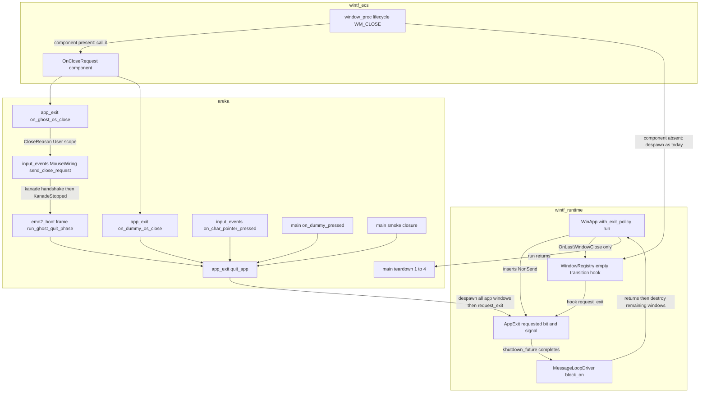
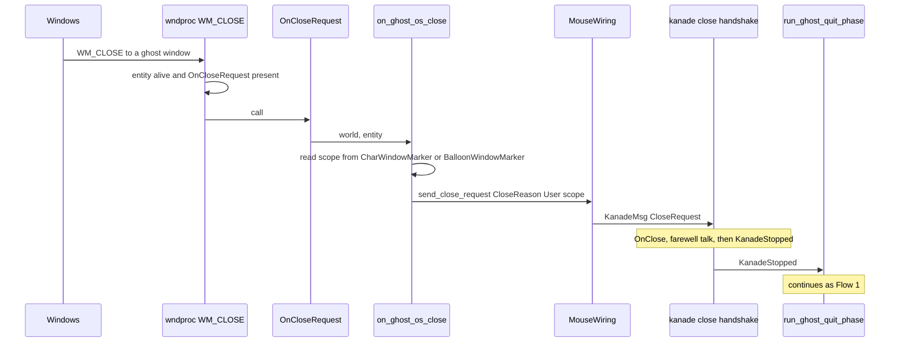

# Design Document: areka-P0-app-lifetime-separation

> 本文のコードの事実は **2026-09-23・本ブランチ**（`claude/areka-p0-app-lifetime-c96473`・main `637799d7` 相当）で実ファイルを読んで確かめたもの。コードは「何の定義か」（関数名・型名＋ファイルパス）で指し、行番号では指さない。
> 要件 6 の裁定 1・2（2026-09-23 開発者確定）と、要件ディスカッションで縛った要件 1.3 は確定事項として扱い、ここでは開き直さない。`research.md` §6 の設計判断項目 1・2・3・5・6・7・8・10・11 は本文書で決めた（§8 に一覧）。

## Overview

**Purpose**: areka のプロセスの寿命を「窓の数」から「明示の終了の指示」へ切り離す。窓が 0 枚の瞬間があってもプロセスは生き続け、終了の指示 1 本で今日と同じ後始末を経て終了コード 0 で終わる。これは後続のゴースト切替（古い窓を全部閉じてから新しい窓を開く）が乗る土台である。

**Users**: 切替を実装する開発者（後続 spec `areka-P0-ghost-shell-balloon-switch`）。areka の利用者から見える終わり方は今までと区別が付かない。

**Impact**: 変わるのは 3 点。
1. **wintf**: アプリの構築時に「窓 0 で終了する／しない」を選べる口（`ExitPolicy`）と、明示の終了を指示する口（`AppExit::request_exit`）が増える。既定は従来どおり「窓 0 で終了」で、`WinApp::new()` の意味は変わらない（example 15 本は 1 文字も触らない）。
2. **areka**: 終了操作 6 種の合流点 4 か所が、それぞれ「全窓を閉じて終了を指示する」1 つの操作 `quit_app` を 1 行で呼ぶ形になる。全窓を閉じるだけの操作は外から呼べなくなる。
3. **`run()` の戻り方**: 明示の終了の指示を受けたとき、まだ画面に残っている窓を `run()` が戻る前に壊す。後始末①〜④の間に利用者の画面へ窓が残らない（要件 1.3）。
4. **OS からの閉鎖要求が 7 種目の終了操作になる**（裁定 3）: wintf に「`WM_CLOSE` が来たら窓を消す代わりに呼ぶ関数」を窓へ差す部品 `OnCloseRequest` が増える。areka はゴースト窓にメニューの「終了」と同じ終了要求を送る関数を、ダミー窓に `quit_app` を呼ぶ関数を差す。Alt＋F4・`taskkill`（`/F` なし）・「タスクの終了」で areka は別れの台詞を言って終わる。部品を付けない example の窓は今までどおり消える。

### Goals
- 終了の指示が無ければ、窓が 0 枚でもメッセージループから戻らない（1.1）。
- 終了の指示で必ずメッセージループから戻り、今日と同じ順序の後始末と終了コード 0 で終わる（1.2・3.8）。
- 「終了のための全窓破棄」と「終了の指示」を片方だけ呼べない形にする（3.6・裁定 2）。
- 「窓 0 でも生きている」「終了の指示で終わる」をそれぞれ決定論テストで固定する（5.1・5.2）。
- wintf の既定を変えず、example と既存の決定論テストを 1 本も落とさない（2.2・4.1・4.4）。

### Non-Goals
- 切替そのもの・「窓を全部閉じるが終了しない」操作（後続 spec の仕事。本仕様はその操作を**作らない**）。
- `KanadeStopCause` への値の追加、ダミー窓の経路の撤去、トレイアイコン等の「窓が無いときの入口」、複数ゴースト。
- 時間で自動終了する安全網（切替中の「窓 0 で生きている」を壊すため持たない・裁定 2）。
- `ecs/app.rs` の `"[App] Last window closed."` の文言（§8 判断 8）。
- Alt＋F4 のキー入力を SHIORI へ `OnKeyPress` として渡すか（キーボード入力を持つ spec の判断）。Windows のログオフ／シャットダウン（`WM_QUERYENDSESSION`／`WM_ENDSESSION`）への応答。

## Boundary Commitments

### This Spec Owns
- wintf の終了規律の**入口**: `ExitPolicy`（構築時の選択・実行中に変えられない）、`AppExit`（World に据える NonSend の受け口・「指示済み」の記憶・終了シグナル）、`WinApp::with_exit_policy`、`WinApp::run` が戻る直前の残存窓の破棄。
- areka の**終了の統合操作**: `crates/areka/src/app_exit.rs` の `quit_app(world, origin)` と出所の語彙 `ExitOrigin`。4 か所の呼び手をこの 1 行に書き換えること。
- 全窓を閉じるだけの既存 2 関数（`crates/areka/src/placement/spawn.rs` の `despawn_ghost_windows`・`crates/areka/src/main.rs` の `despawn_smoke_targets`）を削除し、`quit_app` の私有部品へ吸収すること（片方だけ呼べない形＝裁定 2）。
- OS の閉鎖要求の受け方: wintf の部品 `OnCloseRequest`（`crates/wintf/src/ecs/window/components.rs`）と `fn WM_CLOSE`（`crates/wintf/src/ecs/window_proc/lifecycle.rs`）の 1 分岐、areka の受け手 2 つ（`app_exit.rs` の `on_ghost_os_close`＝終了要求を kanade へ・`on_dummy_os_close`＝`quit_app`）とその差し込み。
- 決定論テスト 6 本（wintf 5・areka 1）と、既存テストの追随（受け口の挿入・置き場の移動）。
- 常設 smoke テストが緑のまま「窓が無いのにプロセスが残る」を赤にする役を保つこと（5.4）。
- 実機確認の手順（5.5・5.6）。

### Out of Boundary
- 登録表の空遷移の検知（`crates/wintf/src/runtime/window_registry.rs` の `reconcile_window_registry`・`WindowRegistry`）。**変更 0 行**——「空遷移でフックを鳴らす」仕掛けはそのまま、フックを仕込むか否かだけを構築時に選ぶ。
- 窓が消える経路（`world.despawn` → `on_window_handle_remove` の `WM_CLOSE` 投函 → `reconcile_window_registry` の drop → `DestroyWindow`）。変更 0 行。
- kanade の終了の握手（`crates/areka-kanade/src/schedule/close.rs`・`user_break.rs`）とその決定論テスト。変更 0 行（4.2）。
- `crates/areka-ghost/src/runtime.rs` の `fn shutdown`。変更 0 行（4.3）。
- `fn main` の後始末①〜④（`crates/areka/src/main.rs`）。順序・終了コードは不変（1.2・3.8）。
- `crates/wintf/src/ecs/app.rs` の `App::on_window_destroyed`（旧経路の窓数カウンタ・終了を駆動しない）。変更 0 行。
- example 15 本（wintf 8＝research.md の 7 本＋`multi_window_test`・areka 5・areka-emo-text 2。実装時に数え直して訂正）。変更 0 行（4.1）。

### Allowed Dependencies
- wintf 内: `runtime/message_loop.rs`（`AppExit`・`ShutdownPolicy`）← `runtime/mod.rs`（`WinApp`・`ExitPolicy`）。`ecs/` から `runtime/` への上向き依存は作らない（既存の方針）。
- areka: `app_exit.rs` → `wintf::AppExit`・`wintf::ecs::window::OnCloseRequest`・`areka_kanade::KanadeStopCause`・`areka_kanade::CloseReason`・`crate::input_events::MouseWiring`・`crate::placement::spawn::{GhostWindowMarker, CharWindowMarker, BalloonWindowMarker}`・`crate::placement::diag::DESPAWNED_SKIP_TAG`・`crate::DummyWindowMarker`。呼び手（`emo2_boot/frame.rs`・`input_events/mod.rs`・`main.rs`）→ `app_exit.rs`。**`placement` は `app_exit` に依存しない**（`placement` は `crate::` パスを持てない・example の `#[path]` include のため）。ゆえにゴースト窓への `OnCloseRequest` の差し込みは `placement` の外（`app_exit.rs` の system・`Added<WindowHandle>`×`With<GhostWindowMarker>`＝`register_ghost_windows_click_through` と同じ捉え方）で行う。
- wintf 内: `ecs/window_proc/lifecycle.rs` → `ecs/window/components.rs`（`OnCloseRequest` を読む）。既存の `ecs/window_proc` → `ecs/window` の向きのまま。
- 新しい crate: 0。新しい外部依存: 0。`Cargo.toml` の変更: 0（`event-listener` 5.4.2・`wintf-winmsg-executor` =0.0.5・`bevy_ecs` 0.19 はいずれも既存）。

### Revalidation Triggers
- `AppExit`／`ExitPolicy` の形の変更（後続のゴースト切替は `ExitPolicy::Explicit` の上に「窓を全部閉じて開き直す」を組む）。
- `quit_app` の署名や `ExitOrigin` の値の増減（`origin` の語は実機ログの検索語）。
- `WinApp::run` が戻る直前の残存窓の扱いの変更（後始末①〜④の間に窓が残るかどうか）。
- `crates/areka/src/main.rs` の共有（並走 spec `areka-P0-baseware-root-layout`）: 本仕様が `main.rs` から終了関連を出すので、相手の作業面積と行数の圧力は下がる。相手は本仕様の着地後に settled main へ再突合する。

## Architecture

### Existing Architecture Analysis

- **終了の決め手は wintf に 1 か所**。`crates/wintf/src/runtime/mod.rs` の `WinApp::new` が `fn wire_shutdown_hook` で `WindowRegistry` の空遷移フックに `Event::notify` を仕込み、`fn run` は `MessageLoopDriver::block_on(ShutdownPolicy::shutdown_future(...))` の完了を待つだけである。`WinApp` は `world` と `shutdown: Rc<event_listener::Event>` の 2 欄で、構築時の設定値の器は無い。
- **`shutdown_future` は通知を記憶しない**。`crates/wintf/src/runtime/message_loop.rs` の `ShutdownPolicy::shutdown_future` は `listen()` を立ててから `await` する。`event-listener` 5.4.2 はリスナ不在の通知を失う（同ファイル `notify_shutdown` の doc が明記）。ゆえに「指示済み」を覚える 1 ビットが要る（1.4・1.5）。
- **`block_on` は完了済みの future でも正常に戻る**（同ファイルの `block_on_ready_future_returns_value` が実証）。投入済みの `spawn_local` タスクも `block_on` の中で駆動される（`MessageLoopDriver::block_on` の doc）。
- **`WinApp` を持つのは `fn main` と `wire_emo2_boot` だけ**。areka の終了 4 か所はどれも `&mut World` しか持たない。wintf には `fn wire_click_through` が World へ挿す NonSend `ClickThroughRegistryHandle`（`crates/wintf/src/ecs/clickthrough/controller.rs`）という「World 経由で利用側へ渡す」先例がある。
- **ウィンドウ手続きは World を `try_borrow` で借り、借用中なら読み飛ばす**（`crates/wintf/src/runtime/wndproc_bridge.rs` の `make_wndproc` 手順 3）。`reconcile_window_registry` は tick の中（World 借用中）で `Window<WndState>` を drop して `DestroyWindow` しているので、**World を借りたまま窓を壊しても再入で壊れない**ことは今日の経路が既に踏んでいる。
- **全窓破棄は 2 関数に分かれている**: `crates/areka/src/placement/spawn.rs` の `despawn_ghost_windows`（`GhostWindowMarker` のみ・呼び手は `run_ghost_quit_phase` と強制退避）と `crates/areka/src/main.rs` の `despawn_smoke_targets`（`DummyWindowMarker`＋`GhostWindowMarker`・呼び手は smoke クロージャ）。`on_dummy_pressed` は `DummyWindowMarker` を自前で despawn する。

### Architecture Pattern & Boundary Map



**Architecture Integration**:
- Selected pattern: **既存ファイルの中で拡張（wintf）＋統合操作の新モジュール 1 本（areka）**（`research.md` §4 案 C）。wintf は 3 つの定義（`ExitPolicy`・`AppExit`・`with_exit_policy`）を既存テストの隣に足す。areka は「終了とは何か」を 1 か所へ集める。
- Domain boundaries: wintf は「いつメッセージループを終えるか」だけを決め、areka の語彙（`ExitOrigin`）を知らない。areka は「どの窓を閉じ、どこから終了が来たか」だけを知り、ループの終え方を知らない。
- Existing patterns preserved: NonSend の受け口を `WinApp` が World へ据える（`ClickThroughRegistryHandle` と同型）。`listen → await` の通知取りこぼし防止規律（`AsyncTickTask` と同形）に「arm → 指示済みの確認 → await」を足す。**窓に関数を差す部品**は `OnDragEnd(EventHandler<DragEndEvent>)`（`crates/wintf/src/ecs/drag/dispatch.rs`）と同型の `OnCloseRequest(fn(&mut World, Entity))`。areka の OS 閉鎖要求の受け手は、メニューの「終了」（`crates/areka/src/menu/mod.rs` の `fn request_close`）と同じ `MouseWiring::send_close_request(CloseReason::User { scope })` を呼ぶだけ＝**終了系列は増やさない**（kanade 未結線の起動だけは `quit_app(OsClose)` で直ちに閉じる・3.10）。
- New components rationale: `AppExit` は「指示済み」の記憶と終了シグナルを 1 つにまとめ、既定ポリシーのフックも同じ `request_exit` を通す＝**終了の完了機構が 1 本**になる。`quit_app` は裁定 2（片方だけ呼べない形）を構造で守る唯一の置き場。
- Steering compliance: ライフサイクル事象は `info!`、2 回目以降の指示や正常系の打ち切りは `debug!`、配線の誤りは `error!`＋記録（`logging.md`・記録無しの失敗経路を作らない）。1 ファイル 1,000 行の目安（`main.rs` は減る）。

### Technology Stack

| Layer | Choice / Version | Role in Feature | Notes |
|-------|------------------|-----------------|-------|
| Runtime（wintf） | `event-listener` 5.4.2（既存）＋ `std::cell::Cell<bool>` | 終了シグナルと「指示済み」の記憶 | 新規依存 0 |
| Runtime（wintf） | `wintf-winmsg-executor` =0.0.5（既存） | `block_on`／`spawn_local` | 完了済み future で正常に戻る（既存テストが実証） |
| ECS | `bevy_ecs` 0.19（既存） | `AppExit` を NonSend リソースとして World へ据える | `Rc` を含むので自動的に `!Send` |

## File Structure Plan

### Directory Structure
```
crates/wintf/src/runtime/
├── message_loop.rs        # 変更: AppExit（新）・ShutdownPolicy::shutdown_future の引数と判断・テスト 3 本（新）
└── mod.rs                 # 変更: ExitPolicy（新）・WinApp::with_exit_policy（新）・new() の委譲・wire_shutdown_hook の分岐・run() の残存窓破棄・テスト 1 本（新）＋既存 3 行の追随

crates/wintf/src/ecs/
├── window/components.rs   # 変更: OnCloseRequest（新・窓に差す関数の部品）
├── window_proc/lifecycle.rs        # 変更: fn WM_CLOSE に「OnCloseRequest があれば呼ぶ／無ければ従来どおり despawn」の 1 分岐
└── window_proc/lifecycle_tests.rs  # 新規: WM_CLOSE の分岐のテスト 1 本（兄弟ファイル）

crates/areka/src/
├── app_exit.rs            # 新規: ExitOrigin・quit_app・私有 despawn_app_windows・on_ghost_os_close・on_dummy_os_close・attach_os_close_request（system）
├── app_exit_tests.rs      # 新規: main_seam_tests.rs から移す 3 本（判断は不変・関数名と打ち切り行の相名 [quit_app] だけ追随）＋ on_ghost_os_close のテスト 1 本（新）
├── main.rs                # 変更: mod app_exit・with_exit_policy(Explicit)・on_dummy_pressed と smoke クロージャの 1 行化・despawn_smoke_targets の削除・spawn_dummy_window に OnCloseRequest(on_dummy_os_close) を 1 行・open_startup_window で attach_os_close_request を register_ghost_windows_click_through の隣（FrameFinalize）へ登録・doc の追随
├── main_seam_tests.rs     # 変更: despawn_smoke_targets_* 3 本を app_exit_tests.rs へ移す
├── main_startup_window_tests.rs  # 変更: ダミー窓ダブルクリックの検査へ受け口を挿す
├── emo2_boot/frame.rs     # 変更: run_ghost_quit_phase が quit_app を呼ぶ・import と doc の追随
├── emo2_boot/frame_ghost_quit_tests.rs  # 変更: World 構築ヘルパへ受け口を挿す・終了の指示の確認 2 行
├── input_events/mod.rs    # 変更: 強制退避の腕が quit_app を呼ぶ・import の追随・on_char_pointer_pressed の doc と腕のコメント（「window-close funnel → run() 復帰」）の追随
├── input_events/input_events_tests.rs   # 変更: World 構築ヘルパと素の World の 2 本へ受け口を挿す
└── placement/spawn.rs     # 変更: despawn_ghost_windows の削除（呼び手 0）・モジュール doc の追随

crates/areka/tests/
└── smoke_boot_loop_exit.rs  # 変更なし（doc コメント 1 行の追随のみ・判定と目印は不変）
```

### Modified Files
- `crates/wintf/src/runtime/message_loop.rs` — `AppExit` を `ShutdownPolicy` の隣に置く（終了規律の状態そのもの）。`shutdown_future(exit: AppExit)` は「arm → 指示済みなら即完了 → await」。
- `crates/wintf/src/runtime/mod.rs` — `pub enum ExitPolicy`、`pub use message_loop::AppExit`、`WinApp { world, exit: AppExit }`（`shutdown: Rc<Event>` を置き換え）、`with_exit_policy`、`new()` の委譲、`wire_shutdown_hook` の分岐、`run()` の残存窓破棄。既存テストの `app.shutdown.listen()` 3 か所を `app.exit.signal().listen()` へ（意味は不変）。
- `crates/wintf/src/ecs/window/components.rs` — `pub struct OnCloseRequest(pub fn(&mut World, Entity))`（`Component`・`Clone, Copy`・SparseSet）。`ecs/window/mod.rs` の `pub use components::*` で `wintf::ecs::window::OnCloseRequest` になる（`lib.rs` は `ecs` を再公開しないので、areka は `wintf::ecs::drag::OnDragEnd` と同じく `ecs::` 経由で引く。`lib.rs` は触らない）。
- `crates/wintf/src/ecs/window_proc/lifecycle.rs` — `fn WM_CLOSE` の生存 entity の腕を「`OnCloseRequest` があれば `(cb.0)(world, entity)` を呼ぶ／無ければ従来どおり `despawn`」に。破棄済み entity の打ち切り（`DESPAWNED_SKIP_TAG`）と戻り値 `Some(LRESULT(0))` は不変。呼ぶ側で `info!(event = "os_close_request", entity, "[WM_CLOSE] 閉鎖要求を利用側の関数へ渡す")` を 1 行。
- `crates/areka/src/app_exit.rs`（新規） — 統合操作と、OS の閉鎖要求の受け手 2 つ・差し込み system。
- `crates/areka/src/main.rs` — `WinApp::with_exit_policy(ExitPolicy::Explicit)?`（**段取りの最後に入れる 1 行**）。`on_dummy_pressed`・smoke クロージャは `quit_app` を 1 行で呼ぶ。`despawn_smoke_targets` は削除。`spawn_dummy_window` の bundle に `OnCloseRequest(app_exit::on_dummy_os_close)` を 1 行。行数は 958 から減る（4.5）。
- `crates/areka/src/main.rs` の `fn open_startup_window`（準備成功の腕） — `app_exit::attach_os_close_request` を `register_ghost_windows_click_through` と同じ `FrameFinalize` 段へ登録（`add_systems` 1 呼び）。※設計初版は登録先を `emo2_boot/mod.rs` と書いたが、クリック透過の登録は実物では `open_startup_window` に在る（タスク生成時の独立レビューで判明・2026-09-23 訂正）。
- `crates/areka/src/emo2_boot/frame.rs` — `run_ghost_quit_phase` の `despawn_ghost_windows(world)` を `quit_app(world, ExitOrigin::KanadeStopped(stopped.cause))` へ。`ghost_quit`／`ghost_quit_no_windows` の記録は据え置き。
- `crates/areka/src/input_events/mod.rs` — 強制退避の腕の `despawn_ghost_windows(world)` を `quit_app(world, ExitOrigin::Escape)` へ。`on_char_pointer_pressed` の doc と腕のコメントにある「window-close funnel（`run()` 復帰→main shutdown→`ForceQuit` 系列）」を「`quit_app`（全窓破棄＋終了の指示）→ `run()` 復帰」へ。
- **doc 追随の全数**（タスク生成で取りこぼさないための一覧）: `emo2_boot/frame.rs`（`run_ghost_quit_phase` の doc）、`input_events/mod.rs`（上記）、`main.rs`（`on_dummy_pressed` の doc・`app.run()` 直前のコメント）、`placement/spawn.rs`（モジュール doc の「全 `GhostWindowMarker` despawn→window-close funnel→`run()` 正常復帰」の行）、`placement/spawn_cleanup_tests.rs`（doc 1 行）、`tests/smoke_boot_loop_exit.rs`（モジュール doc「自動 despawn → `WindowRegistry` 空遷移 → `run()` 復帰」の行）。いずれも本文の判断は変えない。
- `crates/areka/src/placement/spawn.rs` — `despawn_ghost_windows` を削除（`app_exit` の私有部品へ吸収・外から呼べる全窓破棄を残さない）。モジュール doc の該当行を「全窓を閉じて終了を指示する操作は `app_exit::quit_app` が持つ」へ。干渉台帳（A1）の登記外だが他 spec との重なりは 0（完了時に台帳へ追記）。
- `crates/areka/src/placement/spawn_cleanup_tests.rs` — doc コメント 1 行（`despawn_smoke_targets` の名を `app_exit::quit_app` へ）。テスト本文は不変。
- 変更しないと明記するもの: `crates/wintf/src/runtime/window_registry.rs`・`crates/wintf/src/ecs/app.rs`・`crates/wintf/src/lib.rs`（`pub use runtime::*` で `ExitPolicy`／`AppExit` は自動で公開される）・kanade の `schedule/*`・`crates/areka-ghost/src/runtime.rs`・example 15 本。

## System Flows

### Flow 1: 終了系列の完了通知からの終了（tick の中で指示が出る）

```mermaid
sequenceDiagram
    participant Tick as AsyncTickTask Update
    participant Phase as run_ghost_quit_phase
    participant Quit as quit_app
    participant Exit as AppExit
    participant Fin as FrameFinalize reconcile
    participant Loop as block_on
    participant Run as WinApp run
    participant Main as main teardown
    Tick->>Phase: KanadeStopped
    Phase->>Quit: quit_app KanadeStopped cause
    Quit->>Quit: despawn all app windows
    Quit->>Exit: request_exit
    Exit->>Exit: requested = true, notify
    Tick->>Fin: same tick
    Fin->>Fin: drop Window handles, DestroyWindow
    Note over Fin: registry empty, Explicit means no hook
    Loop->>Loop: poll shutdown_future, complete
    Loop->>Run: return
    Run->>Run: destroy remaining windows, none left
    Run->>Main: Ok
    Main->>Main: steps 1 to 4, exit 0
```

### Flow 2: smoke の自動終了（tick の外で指示が出る・要件 1.3 の効く経路）

```mermaid
sequenceDiagram
    participant Task as smoke spawn_local task
    participant Quit as quit_app
    participant Exit as AppExit
    participant Loop as block_on
    participant Run as WinApp run
    participant Reg as WindowRegistry
    participant Main as main teardown
    Task->>Quit: quit_app Smoke
    Quit->>Quit: despawn all app windows, WM_CLOSE posted
    Quit->>Exit: request_exit
    Loop->>Loop: poll shutdown_future, complete
    Note over Loop,Reg: reconcile may not have run yet
    Loop->>Run: return
    Run->>Reg: remove_non_send and drop
    Reg->>Reg: DestroyWindow for each remaining window
    Run->>Main: Ok
    Main->>Main: steps 1 to 4, exit 0
```

### Flow 3: OS からの閉鎖要求（Alt＋F4・taskkill・「タスクの終了」）



ダミー窓は `OnCloseRequest(on_dummy_os_close)` を持ち、受け手は `quit_app(world, ExitOrigin::OsClose)` を 1 行呼ぶだけ（Flow 2 の smoke と同じ経路）。部品を持たない窓（example）は `WM_CLOSE` で従来どおり despawn される。

**Flow-level decisions**:
- OS の閉鎖要求は **窓を消さない**（例外: `MouseWiring` が無い kanade 未結線の起動では別れの台詞を流す相手がいないので、`quit_app(OsClose)` で直ちに閉じる・3.10）。ゴースト窓では終了要求を kanade へ送るだけで、窓を閉じるのは従来どおり終了の握手が終わったことを受けた側（`run_ghost_quit_phase` → `quit_app`）。メニューの「終了」と同じ 1 本の終了系列に乗る（終了経路は正規実装のまま・新しい終わり方を増やさない）。
- `taskkill /IM areka.exe`（`/F` なし）や「タスクの終了」は各トップレベル窓へ `WM_CLOSE` を投げるので、ゴースト窓 4 枚へ終了要求が 4 件届く。2 件目以降の扱いはメニューの「終了」を連打したときと同じで、kanade の握手（`schedule/close.rs`）に委ねる（変更 0 行・4.2）。
- 指示が tick の中で出ても外で出ても、`run()` が戻る時点で画面に窓は無い。tick の中なら同じ tick の `FrameFinalize` が壊し、外なら `run()` の残存窓破棄が壊す。どちらの経路も「1 フレーム待つ」解を使わない。
- `run()` の残存窓破棄は World を借りたまま行う（`reconcile_window_registry` と同じ条件）。ウィンドウ手続きは `try_borrow` の失敗で読み飛ばすので再入で壊れない。`DestroyWindow` はその窓宛ての未処理メッセージ（投函済み `WM_CLOSE`）を捨てるので、後から届く経路も無い。
- 既定ポリシー（example）の経路: 空遷移フック → `request_exit` → `shutdown_future` 完了。今日と同じ順序で、記録が `info` 1 行増えるだけ。

## Requirements Traceability

| Requirement | Summary | Components | Interfaces | Flows |
|-------------|---------|------------|------------|-------|
| 1.1 | 指示なしの窓 0 で終わらない | ExitPolicy::Explicit・wire_shutdown_hook | `WinApp::with_exit_policy` | — |
| 1.2 | 指示で戻り後始末は同順・exit 0 | AppExit・WinApp::run・main（不変） | `AppExit::request_exit` | Flow 1・2 |
| 1.3 | 残った窓を閉じてから戻る | WinApp::run の残存窓破棄 | `run()` | Flow 2 |
| 1.4 | 二重の指示で失敗しない | AppExit（指示済みビット） | `request_exit` 2 回目は `debug!` | — |
| 1.5 | ループ開始前の指示を取りこぼさない | ShutdownPolicy::shutdown_future | arm → 指示済み確認 → await | — |
| 2.1 | 構築時の選択口 1 つ | ExitPolicy・with_exit_policy | `WinApp::with_exit_policy(policy)` | — |
| 2.2 | 既定は従来どおり | `WinApp::new()` の委譲 | `new() = with_exit_policy(OnLastWindowClose)` | — |
| 2.3 | 既定で空遷移→終了（example 不変） | wire_shutdown_hook（フックあり） | 既存の `close_to_reconcile_to_shutdown_chain_wakes_listener` | — |
| 2.4 | 選べば空遷移でも続き、後で窓を開ける | wire_shutdown_hook（フックなし） | 新テスト（5.1） | — |
| 2.5 | 明示の指示の口 1 本 | AppExit | `request_exit(&self)` | — |
| 2.6 | 選択にかかわらず終わる | AppExit は両ポリシーで World に在る | `shutdown_future` | Flow 1・2 |
| 2.7 | 受けたことを info で記録 | AppExit | `info!("[AppExit] exit requested")` | — |
| 2.8 | 実行中の切替口を持たない | ExitPolicy は構築時に消費・setter 無し | — | — |
| 2.9 | 閉鎖要求の関数を窓に差す部品 | OnCloseRequest | `OnCloseRequest(fn(&mut World, Entity))` | Flow 3 |
| 2.10 | 部品があれば窓を消さず呼ぶ | fn WM_CLOSE の分岐 | 新テスト（5） | Flow 3 |
| 2.11 | 部品が無ければ従来どおり消す | fn WM_CLOSE（既存の腕） | example の振る舞い不変 | — |
| 3.1 | 終了系列の完了で全窓＋指示 | run_ghost_quit_phase → quit_app | `ExitOrigin::KanadeStopped(cause)` | Flow 1 |
| 3.2 | 窓 0 でも指示 | quit_app（閉じた数に依らず指示） | 既存テストへの確認 1 行 | — |
| 3.3 | 強制退避で全窓＋指示 | on_char_pointer_pressed → quit_app | `ExitOrigin::Escape` | — |
| 3.4 | ダミー窓で閉じて指示 | on_dummy_pressed → quit_app | `ExitOrigin::DummyWindow` | — |
| 3.5 | smoke で閉じて指示 | smoke クロージャ → quit_app | `ExitOrigin::Smoke` | Flow 2 |
| 3.6 | 全窓破棄と指示を 1 操作に | quit_app（`despawn_app_windows` は私有） | `quit_app(world, origin) -> usize` | — |
| 3.7 | 出所を info で記録 | quit_app | `info!(event="app_exit", origin, closed)` | — |
| 3.8 | 後始末の順序と exit 0 は不変 | main（不変） | — | Flow 1・2・3 |
| 3.9 | ゴースト窓の閉鎖要求 → 終了要求を kanade へ | on_ghost_os_close・attach_os_close_request | `MouseWiring::send_close_request(CloseReason::User { scope })` | Flow 3 |
| 3.10 | MouseWiring 不在なら記録して全窓を閉じ終了を指示 | on_ghost_os_close | `warn!(event = "os_close_no_mouse_wiring")` → `quit_app(ExitOrigin::OsClose)` | — |
| 3.11 | ダミー窓の閉鎖要求 → 閉じて指示 | on_dummy_os_close → quit_app | `ExitOrigin::OsClose` | Flow 3 |
| 3.12 | 閉鎖要求を受けたことを記録 | fn WM_CLOSE（wintf）・受け手（areka） | `info!(event = "os_close_request")` | Flow 3 |
| 4.1 | example を触らない | `new()` の意味不変 | — | — |
| 4.2 | kanade の握手を触らない | 変更対象外（Out of Boundary） | — | — |
| 4.3 | `fn shutdown` を触らない | 変更対象外（Out of Boundary） | — | — |
| 4.4 | 既存テストを落とさない | 既存テストの追随（§Testing Strategy） | 受け口の挿入・置き場の移動 | — |
| 4.5 | `main.rs` 1,000 行以内 | `despawn_smoke_targets` の削除・1 行化 | — | — |
| 5.1 | 窓 0 で終わらない決定論テスト | 新テスト（`runtime/mod.rs`） | 実 HWND＋実 reconcile・`wait_timeout` | — |
| 5.2 | 指示で終わる決定論テスト | 新テスト（`message_loop.rs`） | `spawn_local` から指示 → `block_on` が戻る | — |
| 5.3 | 判断分岐だけを足す | §Testing Strategy の 6 本に限る | — | — |
| 5.4 | smoke テスト緑・見張りの役を保つ | `smoke_boot_loop_exit.rs`（判定不変） | — | Flow 2 |
| 5.5 | 実機確認の手順 | §Testing Strategy「実機確認」 | `AREKA_APP_SMOKE_EXIT_MS`・`RUST_LOG` | — |
| 5.6 | 自分のプロセスだけ止める | 同上（`Start-Process -PassThru` の PID） | — | — |
| 6.1 | 裁定 1（構築時の設定値＋指示 1 本） | ExitPolicy・AppExit | — | — |
| 6.2 | 裁定 2（1 操作・安全網なし） | quit_app・タイマー無し | — | — |
| 6.3 | 裁定 3（OS の閉鎖要求＝7 種目の終了操作） | OnCloseRequest・on_ghost_os_close・on_dummy_os_close | — | Flow 3 |
| 6.4 | 覆す必要が出たら議題へ | 本設計は覆さない（§8） | — | — |

## Components and Interfaces

| Component | Domain/Layer | Intent | Req Coverage | Key Dependencies (P0/P1) | Contracts |
|-----------|--------------|--------|--------------|--------------------------|-----------|
| AppExit | wintf runtime | 終了の指示の受け口・指示済みの記憶・終了シグナル | 1.4, 1.5, 2.5, 2.6, 2.7 | event-listener (P0) | Service, State |
| ExitPolicy / WinApp::with_exit_policy | wintf runtime | 構築時に「窓 0 で終了するか」を選ぶ | 1.1, 2.1, 2.2, 2.3, 2.4, 2.8, 6.1 | WindowRegistry hook (P0) | Service |
| WinApp::run 残存窓破棄 | wintf runtime | 指示で戻る前に残った窓を壊す | 1.2, 1.3 | WindowRegistry (P0), wndproc try_borrow (P1) | Service |
| ShutdownPolicy::shutdown_future | wintf runtime | 指示済みなら即完了・そうでなければ通知を待つ | 1.5, 5.2 | AppExit (P0) | Service |
| quit_app / ExitOrigin | areka | 全窓破棄と終了の指示を 1 操作に | 3.1–3.7, 3.10, 3.11, 6.2 | AppExit (P0), markers (P0) | Service |
| 呼び手 4 か所 | areka | 各終了操作を `quit_app` 1 行へ | 3.1, 3.3, 3.4, 3.5 | quit_app (P0) | — |
| OnCloseRequest / fn WM_CLOSE の分岐 | wintf ecs | OS の閉鎖要求を窓ごとの関数へ渡す（無ければ従来どおり消す） | 2.9, 2.10, 2.11, 3.12 | window_proc dispatch (P0) | Service |
| on_ghost_os_close / on_dummy_os_close / attach_os_close_request | areka | OS の閉鎖要求を終了系列へ乗せる | 3.9, 3.10, 3.11, 3.12, 6.3 | MouseWiring (P0), quit_app (P0), OnCloseRequest (P0) | Service |

### wintf runtime

#### AppExit

| Field | Detail |
|-------|--------|
| Intent | 明示の終了の指示を受け、指示済みを覚え、終了シグナルを鳴らす |
| Requirements | 1.4, 1.5, 2.5, 2.6, 2.7 |

**Responsibilities & Constraints**
- `crates/wintf/src/runtime/message_loop.rs` に置く（`ShutdownPolicy` の状態そのもの）。`runtime/mod.rs` が `pub use message_loop::AppExit` で公開し、`lib.rs` の `pub use runtime::*` で `wintf::AppExit` になる。
- `Clone` 可（中身は `Rc` の共有）。`Rc` を含むので `!Send`＝bevy が NonSend として扱う。`WinApp` が 1 つ持ち、その clone を World へ挿す（`ClickThroughRegistryHandle` と同型）。
- **指示は 1 度だけ効く**。2 回目以降は `debug!` で流し、通知も撃たない（撃っても冪等だが、記録で 1 回目と区別する）。
- `pub fn new()` は `WinApp` と、素の `World` で走る areka の既存テストが受け口を据えるために使う（本番の意味論を曲げない headless の器）。

**Dependencies**
- Outbound: `event_listener::Event` — 終了シグナル (P0)
- Inbound: `WinApp`（構築・World 挿入・`run()` の待ち）、`WindowRegistry` の空遷移フック（既定ポリシー）、areka `quit_app` (P0)

**Contracts**: Service [x] / API [ ] / Event [ ] / Batch [ ] / State [x]

##### Service Interface
```rust
/// 明示の終了の指示の受け口（NonSend リソース・Clone は共有）。
#[derive(Clone)]
pub struct AppExit { requested: Rc<Cell<bool>>, signal: Rc<event_listener::Event> }

impl AppExit {
    pub fn new() -> Self;
    /// 終了を指示する。1 回目: 指示済みを立て info! の上で notify(usize::MAX)。2 回目以降: debug! のみ。
    pub fn request_exit(&self);
    /// 指示済みか。
    pub fn is_requested(&self) -> bool;
    /// 終了シグナル（`run()` の防御的 notify と wintf 内テストが使う）。
    pub(crate) fn signal(&self) -> &event_listener::Event;
}
```
- Preconditions: `new()` は無し（どのスレッドでも作れるが、World へ挿すのは UI スレッド）。`request_exit` は**窓を閉じてから呼ぶ**（残った窓は `run()` が壊すが、entity の資源は `WinApp` の drop まで残る——doc に明記）。
- Postconditions: `request_exit` 後は `is_requested() == true` が恒久に成り立つ。戻す口は無い。
- Invariants: 記録は 1 回目が `info!("[AppExit] exit requested")`、2 回目以降が `debug!("[AppExit] exit already requested — ignored")`。

##### State Management
- State model: `requested: bool`（false → true の一方向）。`Event` は通知の運び手で状態を持たない。
- Persistence & consistency: プロセス内のみ。`Rc` 共有なので `WinApp`・World・呼び手のどこから見ても同じ 1 ビット。
- Concurrency strategy: UI スレッド単独（`!Send`）。

#### ExitPolicy と WinApp::with_exit_policy

| Field | Detail |
|-------|--------|
| Intent | 構築時に「窓の数が 0 になったら終了するか」を選び、実行中は変えられない |
| Requirements | 1.1, 2.1, 2.2, 2.3, 2.4, 2.8, 6.1 |

**Responsibilities & Constraints**
- `crates/wintf/src/runtime/mod.rs`。`ExitPolicy` は `OnLastWindowClose`（既定）と `Explicit` の 2 値。**フィールドに保持しない**——`wire_shutdown_hook` がフックを仕込むか否かを決めるだけで、以後は参照されない（2.8 を「読める場所が無い」形で守る）。
- `WinApp::new()` は `Self::with_exit_policy(ExitPolicy::OnLastWindowClose)` へ委譲する。署名は不変（example 15 本は触らない）。
- `wire_shutdown_hook(world, exit, policy)`: ⑴ `ProdWindowRegistry` が無ければ挿す（従来どおり）、⑵ `exit.clone()` を World の NonSend として挿す（**両ポリシーで**・2.6）、⑶ `OnLastWindowClose` のときだけ `set_shutdown_hook(move || exit.request_exit())` を仕込む。`Explicit` のとき `reconcile_window_registry` は空遷移でフック `None` を見て何もしない（既存の分岐・変更 0 行）。登録表は空でも `insert` を受けるので「後で窓を開ける」は自然に成り立つ（2.4）。
- 既定ポリシーのフックが `Event::notify` を直接撃つ今の形は捨て、`request_exit` を通す＝終了の完了機構が 1 本になる。副作用は「最後の窓が閉じたとき `info` が 1 行増える」だけ。

**Contracts**: Service [x]

##### Service Interface
```rust
#[derive(Debug, Clone, Copy, PartialEq, Eq)]
pub enum ExitPolicy { OnLastWindowClose, Explicit }

pub struct WinApp { world: Rc<RefCell<EcsWorld>>, exit: AppExit }

impl WinApp {
    pub fn new() -> Result<Self>;                              // = with_exit_policy(OnLastWindowClose)
    pub fn with_exit_policy(policy: ExitPolicy) -> Result<Self>;
    fn wire_shutdown_hook(world: &Rc<RefCell<EcsWorld>>, exit: &AppExit, policy: ExitPolicy);
}
```
- Preconditions: `with_exit_policy` は `new()` と同じ（COM/DPI 初期化・UI スレッドの登録）。
- Postconditions: World に `ProdWindowRegistry` と `AppExit` が在る。`OnLastWindowClose` なら登録表にフックが在り、`Explicit` なら無い。
- Invariants: ポリシーを後から変える口は無い。

#### WinApp::run の残存窓破棄

| Field | Detail |
|-------|--------|
| Intent | 明示の指示で戻るとき、まだ登録表に残っている窓を戻る前に壊す |
| Requirements | 1.2, 1.3 |

**Responsibilities & Constraints**
- `run()` の手順 4（`block_on(ShutdownPolicy::shutdown_future(self.exit.clone()))`）の直後に置く。World を `borrow_mut` し、`remove_non_send::<ProdWindowRegistry>()` で登録表ごと取り出して drop する。`Window<WndState>` の drop が `DestroyWindow` を呼ぶ。空でなければ `info!("[WinApp::run] exit requested while windows remained open — destroying them before returning")` を 1 行残す。
- 新しい API は足さない（`WindowRegistry` は変更 0 行）。`run()` を 2 度呼ぶ運用は今も想定外（`wire_new_path` の doc）なので、登録表を取り去って戻って差し支えない。`WinApp` の drop は今までどおり World を drop するだけになる。
- **公開面の契約を doc に書く（テストは足さない・5.3）**: `WinApp::run` の doc に「明示の指示で戻るとき、登録表に残った窓を壊してから戻る。戻った後の `run()` は再入できない（登録表が World に無い）」。`AppExit::request_exit` の doc に「窓は閉じて（despawn して）から呼ぶこと。残った窓は `run()` が壊すが、その entity の資源（`WindowHandle`・WUC）は `WinApp` の drop まで World に残る」。areka では `quit_app` が構造でこの前提を守るので起きないが、wintf 単体の利用者と後続（ゴースト切替）が `request_exit` を「閉じる前に呼んでよい口」と読まないための明文化。
- World を借りたまま壊すのは `reconcile_window_registry` と同じ条件。ウィンドウ手続きは `try_borrow` の失敗で読み飛ばす（`wndproc_bridge.rs`）。
- 手順 5 の防御的 notify は `ShutdownPolicy::notify_shutdown(self.exit.signal())` として据え置く（意味は変えない）。

**Contracts**: Service [x]（`run()` の署名は不変 `pub fn run(&self) -> Result<()>`）

#### ShutdownPolicy::shutdown_future

| Field | Detail |
|-------|--------|
| Intent | 指示済みなら即完了、そうでなければ通知を待つ future を返す |
| Requirements | 1.5, 5.2 |

##### Service Interface
```rust
impl ShutdownPolicy {
    /// arm → 指示済みの確認 → await。arm と確認の順で、確認とほぼ同時に届く指示も取りこぼさない。
    pub(crate) fn shutdown_future(exit: AppExit) -> impl Future<Output = ()>;
    pub(crate) fn notify_shutdown(event: &Event);   // 不変
}
```
- Preconditions: なし。
- Postconditions: `exit.is_requested()` が真になった後は必ず完了する（先に真でも、後で真でも）。
- Invariants: `MessageLoopDriver::block_on` は完了済みの future で正常に戻る（既存テスト）ので、ループ開始前の指示は「ループ開始後ただちに終わる」になる。

### wintf ecs

#### OnCloseRequest と fn WM_CLOSE の分岐

| Field | Detail |
|-------|--------|
| Intent | OS の閉鎖要求（`WM_CLOSE`）が来たとき、窓を消す代わりに利用側の関数を呼ぶ口を窓ごとに与える |
| Requirements | 2.9, 2.10, 2.11, 3.12 |

**Responsibilities & Constraints**
- `crates/wintf/src/ecs/window/components.rs` に `pub struct OnCloseRequest(pub fn(&mut World, Entity))`（`Component`・SparseSet・`Clone, Copy`）。`OnDragEnd(EventHandler<DragEndEvent>)` と同型だが、閉鎖要求はバブリングしないので `Phase` も `sender` も持たない最小の署名。
- `crates/wintf/src/ecs/window_proc/lifecycle.rs` の `fn WM_CLOSE`: 生存 entity の腕を「`w.world().get::<OnCloseRequest>(entity).copied()` が `Some(cb)` なら `info!(event = "os_close_request", entity = ?entity, "[WM_CLOSE] 閉鎖要求を利用側の関数へ渡す")` の上で `(cb.0)(w.world_mut(), entity)`、`None` なら従来どおり `despawn`」に分ける。破棄済み entity の打ち切りと戻り値 `Some(LRESULT(0))`（既定手続きの `DestroyWindow` 抑止）は不変。
- 関数は World を `try_borrow_mut` で借りた中で呼ばれる（今日の `despawn` と同じ条件）。関数の中で窓を despawn してもよい（`on_dummy_os_close` がそうする）し、しなくてもよい（`on_ghost_os_close`）。
- 部品を付けない窓（example 15 本・wintf 内のテスト窓）の振る舞いは 1 文字も変わらない（2.11）。

**Contracts**: Service [x]

##### Service Interface
```rust
/// OS の閉鎖要求（WM_CLOSE）が来たとき、窓を消す代わりに呼ぶ関数。付けなければ従来どおり窓が消える。
#[derive(Component, Clone, Copy)]
#[component(storage = "SparseSet")]
pub struct OnCloseRequest(pub fn(world: &mut World, entity: Entity));
```
- Preconditions: 窓 entity に付ける。関数は UI スレッドで、World 借用中に呼ばれる。
- Postconditions: 関数が呼ばれたとき wintf は窓を消さない。窓を消すかどうかは関数の責務。
- Invariants: `WM_CLOSE` の戻り値は常に `Some(LRESULT(0))`。

### areka

#### OS の閉鎖要求の受け手（on_ghost_os_close・on_dummy_os_close・attach_os_close_request）

| Field | Detail |
|-------|--------|
| Intent | OS の閉鎖要求を areka の終了系列へ乗せる（ゴースト窓＝メニューの「終了」と同じ終了要求・ダミー窓＝`quit_app`） |
| Requirements | 3.9, 3.10, 3.11, 3.12, 6.3 |

**Responsibilities & Constraints**
- `crates/areka/src/app_exit.rs` に置く（終了の入口は 1 モジュールに集める）。
- `on_ghost_os_close(world, entity)`: entity の `CharWindowMarker { scope }` か `BalloonWindowMarker { scope }` からスコープを読み（どちらも無ければ `warn!(event = "os_close_unknown_window")` で戻る）、`world.get_non_send_mut::<MouseWiring>()` が在れば `info!(event = "os_close_request", scope, kind = "ghost")` の上で `send_close_request(CloseReason::User { scope })`。無ければ `warn!(event = "os_close_no_mouse_wiring", scope)` を残して `quit_app(world, ExitOrigin::OsClose)` で直ちに閉じる（別れの台詞を流す相手がいない・3.10）。`MouseWiring` が在るときは**窓は消さない**——閉じるのは終了の握手が終わったことを受けた `run_ghost_quit_phase` → `quit_app`。
- `on_dummy_os_close(world, _entity)`: `info!(event = "os_close_request", kind = "dummy")` の上で `quit_app(world, ExitOrigin::OsClose)`。
- `attach_os_close_request`: `Query<Entity, (With<GhostWindowMarker>, Added<WindowHandle>)>` で HWND が付いた瞬間のゴースト窓へ `OnCloseRequest(on_ghost_os_close)` を挿す system。`register_ghost_windows_click_through`（`placement/spawn.rs`）と同じ捉え方で、同じ段（`main.rs` の `open_startup_window` が結線する `FrameFinalize`）に登録する。`placement` が `crate::` パスを持てないため差し込みは `placement` の外で行う。
- ダミー窓は `main.rs` の `spawn_dummy_window` が bundle に `OnCloseRequest(app_exit::on_dummy_os_close)` を直接足す（`main.rs` は `crate::` パスを持てる）。

**Contracts**: Service [x]

##### Service Interface
```rust
pub(crate) fn on_ghost_os_close(world: &mut World, entity: Entity);   // 終了要求を kanade へ。窓は消さない（MouseWiring 不在なら quit_app）
pub(crate) fn on_dummy_os_close(world: &mut World, entity: Entity);   // quit_app(world, ExitOrigin::OsClose)
pub(crate) fn attach_os_close_request(
    mut commands: Commands,
    new_windows: Query<Entity, (With<GhostWindowMarker>, Added<WindowHandle>)>,
);
```
- Preconditions: `on_ghost_os_close` は `OnCloseRequest` 経由で wintf から呼ばれる（World 借用中）。
- Postconditions: ゴースト窓: `KanadeMsg::CloseRequest { reason: User { scope } }` が 1 件送られる（`MouseWiring` が在るとき）。`MouseWiring` が無いとき: ダミー窓と同じく全窓が閉じ `AppExit::is_requested()` は真。ダミー窓: `DummyWindowMarker` を持つ entity は 0・`AppExit::is_requested()` は真。
- Invariants: OS の閉鎖要求で新しい終了系列は生まれない（ゴースト窓はメニューの「終了」と同じ経路、ダミー窓はダブルクリックと同じ経路）。

#### quit_app と ExitOrigin

| Field | Detail |
|-------|--------|
| Intent | 「終了のために全窓を閉じる」と「終了を指示する」を 1 つの操作にし、片方だけ呼べない形にする |
| Requirements | 3.1, 3.2, 3.3, 3.4, 3.5, 3.6, 3.7, 6.2 |

**Responsibilities & Constraints**
- `crates/areka/src/app_exit.rs`（新規・`main.rs` から `mod app_exit;`）。`quit_app` は ⑴ 私有の `despawn_app_windows`（`Or<(With<DummyWindowMarker>, With<GhostWindowMarker>)>`・今日の `despawn_smoke_targets` の判断そのまま＝連鎖破棄済みの標的を `DESPAWNED_SKIP_TAG` の `debug!` で打ち切り残りを処理し切る。記録の相名は「smoke 自動 close」から `[quit_app]` へ改める——4 出所共通の部品が smoke と名乗らないため）を呼び、⑵ World から `AppExit` を取り、`info!(event = "app_exit", origin = ?origin, closed, "[quit_app] 全窓を閉じ、終了を指示した")` の上で `request_exit()` を呼ぶ。閉じた数が 0 でも指示する（3.2・分岐を置かない）。
- 受け口が World に無いとき（本番では `WinApp` が必ず挿すので配線の誤り）: `error!(event = "app_exit_unwired", origin = ?origin, closed, "[quit_app] 終了の受け口が World に無い——窓は閉じたが終了を指示できない")` を残して戻る。記録無しの失敗経路を作らない。素の `World` で走る既存テストはこの経路を踏まないよう受け口を挿す（§Testing Strategy）。
- `despawn_ghost_windows`（`placement/spawn.rs`）と `despawn_smoke_targets`（`main.rs`）は削除し、この私有部品へ吸収する。**全窓を閉じるだけの操作はクレート内のどこからも呼べない**（3.6 を構造で守る）。後続のゴースト切替が要る「閉じるが終了しない」操作は本仕様で作らない（Out of scope）。後続は `ExitPolicy::Explicit` の上に自分の操作を足す。
- `ExitOrigin::KanadeStopped(cause)` は既存の `KanadeStopCause` をそのまま包む。`Debug` 出力は `KanadeStopped(Quit)` のように `ghost_quit` の `cause` と同じ語になる（記録の語彙を揃える・3.7）。

**Dependencies**
- Outbound: `wintf::AppExit` (P0)、`crate::placement::spawn::GhostWindowMarker`・`crate::DummyWindowMarker`・`crate::placement::diag::DESPAWNED_SKIP_TAG` (P0)、`areka_kanade::KanadeStopCause` (P0)
- Inbound: `emo2_boot::frame::run_ghost_quit_phase`・`input_events::on_char_pointer_pressed`・`main::on_dummy_pressed`・`main::open_startup_window` の smoke クロージャ (P0)

**Contracts**: Service [x]

##### Service Interface
```rust
/// どの終了操作から来たか（記録の語彙・受け手は分岐しない）。
#[derive(Debug, Clone, Copy, PartialEq, Eq)]
pub(crate) enum ExitOrigin {
    KanadeStopped(areka_kanade::KanadeStopCause),  // メニューの終了・別れの台詞のあと・中断のあと
    Escape,                                        // Ctrl+Shift+左ダブルクリック
    DummyWindow,                                   // ダミー窓の左ダブルクリック
    Smoke,                                         // AREKA_APP_SMOKE_EXIT_MS
    OsClose,                                       // ダミー窓への OS の閉鎖要求・kanade 未結線の起動でのゴースト窓への OS の閉鎖要求（結線済みなら KanadeStopped 経由で来る）
}

/// 全窓（ダミー窓＋ゴースト窓）を閉じ、終了を指示する。戻り値は標的として拾った窓の数。
pub(crate) fn quit_app(world: &mut World, origin: ExitOrigin) -> usize;

fn despawn_app_windows(world: &mut World) -> usize;   // 私有
```
- Preconditions: `&mut World`。受け口の有無は問わない（無ければ `error!`）。
- Postconditions: `DummyWindowMarker`／`GhostWindowMarker` を持つ entity は 0。受け口が在れば `is_requested() == true`。
- Invariants: 記録は areka が `app_exit` 1 行、wintf が `[AppExit]` 1 行（層ごとに 1 行・wintf は areka の語彙を知らない）。

#### 呼び手 4 か所（summary-only）

| 場所 | 変更 |
|---|---|
| `crates/areka/src/emo2_boot/frame.rs` の `run_ghost_quit_phase` | `let closed = quit_app(world, ExitOrigin::KanadeStopped(stopped.cause));`。`ghost_quit`（info）と `ghost_quit_no_windows`（debug）は据え置き。doc の「窓が 0 になると wintf の `run()` が戻り」を「終了の指示で `run()` が戻り」へ |
| `crates/areka/src/input_events/mod.rs` の `on_char_pointer_pressed` 強制退避の腕 | `quit_app(world, ExitOrigin::Escape);`。`mouse_escape_close`（info）は据え置き |
| `crates/areka/src/main.rs` の `on_dummy_pressed` | 自前の query＋despawn ループを `app_exit::quit_app(world, ExitOrigin::DummyWindow);` へ。ダミー窓検出の info は据え置き |
| `crates/areka/src/main.rs` の `open_startup_window` 内 smoke クロージャ | `let count = app_exit::quit_app(w, ExitOrigin::Smoke);`。`smoke 自動 close` の info は据え置き（smoke テストの目印ではない） |
| `crates/areka/src/main.rs` の `fn main` | `let app = WinApp::with_exit_policy(ExitPolicy::Explicit)?;`。`app.run()?` の注記を「終了の指示で戻る」へ。後始末①〜④は変更 0 行 |

**Implementation Notes**
- Integration: 段取りは ⑴ wintf（`AppExit`・`ExitPolicy`・`with_exit_policy`・`run()` の残存窓破棄・`OnCloseRequest`＋`WM_CLOSE` の分岐・決定論テスト 5 本）→ ⑵ areka `app_exit.rs`（`quit_app`＋OS 閉鎖要求の受け手 2 つ＋差し込み）＋4 か所の書き換え＋ダミー窓と `emo2_boot` の 1 行ずつ＋既存テストの追随＋テスト 1 本 → ⑶ **`main` の `with_exit_policy(Explicit)` の 1 行を最後に入れる**（それまでは既定ポリシーのまま。`quit_app` の指示が先に立ち、空遷移フックの `request_exit` は 2 回目として `debug!` で流れる＝各段で smoke テストが従来どおり緑であることを確かめられる）→ ⑷ smoke テスト緑の確認と実機確認。
- Validation: 各段で `cargo test -p wintf` と `cargo test -p areka`（`tests/smoke_boot_loop_exit.rs` を含む）。
- Risks: `run()` の残存窓破棄は `DestroyWindow` を World 借用中に呼ぶ。今日の `reconcile_window_registry` と同じ条件なので新しい再入は無い。実機確認の smoke 経路（Flow 2）で「windows remained open」の行が出ることを見る（出なければ reconcile が先に走っただけで、どちらも正常）。

## Data Models

### Domain Model
- **終了の指示（`AppExit`）**: 一方向の 1 ビット `requested` と終了シグナル。集約の根は `WinApp`。World の NonSend は同じ実体の別名（`Rc` 共有）。
- **終了の出所（`ExitOrigin`）**: 記録のための値。受け手は分岐しない。
- 不変条件: `requested` は false → true のみ。`ExitPolicy` は構築時に消費され、状態として残らない。

## Error Handling

### Error Strategy
- **配線の誤り（受け口不在）**: `quit_app` は `error!(event = "app_exit_unwired")` を残し、窓は閉じたまま戻る。プロセスは残る（既定ポリシーなら空遷移フックで終わる）。本番では `WinApp::with_exit_policy` が必ず挿すので起き得ず、起きたら配線の欠陥として赤くする。
- **二重の指示**: `AppExit::request_exit` の 2 回目は `debug!` で流す（1.4）。失敗にしない。
- **閉じる窓が無い**: 正常系。`quit_app` は指示を出し、`run_ghost_quit_phase` は従来どおり `ghost_quit_no_windows` を `debug!` で残す（3.2）。
- **連鎖破棄済みの標的**: 従来どおり `DESPAWNED_SKIP_TAG` の `debug!` で打ち切り、残りを処理し切る。
- **`run()` が戻る時点で窓が残っている**: 失敗ではなく想定内（Flow 2）。`info` 1 行の上で壊す。
- **OS の閉鎖要求でゴースト窓の `MouseWiring` が無い**: `warn!(event = "os_close_no_mouse_wiring")` を残し、`quit_app(world, ExitOrigin::OsClose)` で全窓を閉じて終了を指示する。この状態は「ゴースト窓の準備は成功したが `wire_emo2_boot` が失敗した（`wired=false`）」起動で実際に起きる（`wire_mouse_input` は `main.rs` の `outcome.wired` の腕でだけ走る）。旧設計の「未結線の起動はダミー窓の経路なのでここへは来ない」は誤りで、送らず戻るだけではこの起動が Alt＋F4／`taskkill` で閉じられなかった（裁定 3 に反する）。09-23 開発者承認で改訂。
- **OS の閉鎖要求が握手の途中に重ねて届く**（`taskkill` が 4 枚へ同時に投げる・Alt＋F4 の連打）: メニューの「終了」の連打と同じで、kanade の握手（`schedule/close.rs`）の既存の扱いに委ねる。本仕様は変えない（4.2）。

### Monitoring
- 実機ログの検索語: `event="app_exit"`（areka・`origin`・`closed` 付き）、`[quit_app]`（areka・全窓破棄の相名。連鎖破棄済み標的の打ち切りも同じ相名で `debug`）、`[AppExit] exit requested`（wintf）、`windows remained open`（wintf・残存窓破棄）、`event="os_close_request"`（wintf の `WM_CLOSE` と areka の受け手・`kind` 付き）、`event="os_close_no_mouse_wiring"`（kanade 未結線の起動でだけ出て、直後に `origin=OsClose` の `app_exit` が続く）、`event="app_exit_unwired"`（出てはならない）。

## Testing Strategy

足すのは判断分岐 2 つ（5.1・5.2）と縁の条件 2 つ（1.4・1.5）、OS の閉鎖要求の判断分岐 2 つ（2.10・3.9）の計 6 本に限る（5.3）。既に確かめられている配線（閉じる → 登録表から外れる → 合図が鳴る・終了要求 → kanade の握手）は再テストしない。

### 新設の決定論テスト（6 本）

| # | 置き場 | 名前（案） | 何を固定するか | 壊れると赤になる判断 |
|---|---|---|---|---|
| 1 | `crates/wintf/src/runtime/mod.rs` `tests` | `explicit_policy_keeps_the_loop_alive_when_the_last_window_closes` | `with_exit_policy(Explicit)` で実 HWND を 1 枚作り（既存 `close_to_reconcile_to_shutdown_chain_wakes_listener` と同じ構築）、`Window` を外して実 `reconcile_window_registry` を回す → 登録表は空・`exit.signal().listen().wait_timeout(20ms)` は `None`・`is_requested()` は偽。続けてもう 1 枚を factory で作り `WindowHandle` が付くこと（2.4「後で窓を開ける」） | `wire_shutdown_hook` が `Explicit` でもフックを仕込む（5.1・1.1・2.4） |
| 2 | `crates/wintf/src/runtime/message_loop.rs` `tests` | `exit_requested_from_a_ui_task_ends_the_loop` | `AppExit::new()` の clone を `spawn_local(async move { exit.request_exit() })` で投入し、`MessageLoopDriver::block_on(ShutdownPolicy::shutdown_future(exit))` が戻る | 指示が future を完了させない（5.2・2.6） |
| 3 | 同上 | `exit_requested_before_the_loop_starts_completes_immediately` | `request_exit()` を先に呼んでから `block_on(shutdown_future(exit))` が戻る | arm → 確認の順が無く、リスナ不在の通知を失う（1.5） |
| 4 | 同上 | `second_request_is_ignored_and_the_future_still_completes` | `request_exit()` を 2 回呼んでも panic せず `is_requested()` は真のまま・`block_on(shutdown_future(exit))` が戻る | 2 回目で失敗や二重処理を起こす（1.4） |
| 5 | `crates/wintf/src/ecs/window_proc/lifecycle_tests.rs`（新規・兄弟ファイル） | `wm_close_calls_on_close_request_instead_of_despawning` | `OnCloseRequest(記録する関数)` を付けた entity と付けない entity の 2 つを World に置き、両方へ `fn WM_CLOSE` を呼ぶ → 付けた方は生存したまま関数が 1 回呼ばれ、付けない方は despawn される。戻り値は両方 `Some(LRESULT(0))`。World の器は `window_pos_tests.rs` と同じ | 分岐が無く両方 despawn する／両方呼ぶ（2.10・2.11） |
| 6 | `crates/areka/src/app_exit_tests.rs` | `ghost_os_close_sends_close_request_with_the_window_scope` | `MouseWiring::new(tx, RegionSource::Mock(..))`（`pub(crate)`・`input_events_tests.rs` の `world_with_wiring` は私有なので流用せず `app_exit_tests.rs` で直接組む）を挿した World に `CharWindowMarker { scope: 1 }` の窓を置き `on_ghost_os_close` → 受信側に `KanadeMsg::CloseRequest { reason: User { scope: 1 } }` が 1 件・窓 entity は生存。`AppExit` は未指示。対照アーム: `MouseWiring` 無し・`AppExit` 付きの World では窓が消え `is_requested()` が真（3.10） | スコープを落とす／窓を消してしまう／未結線で閉じられない（3.9・3.10） |

- 1 の対照は既存の `close_to_reconcile_to_shutdown_chain_wakes_listener`（既定ポリシーで同じ構築のまま listener が起きる）。同じ構造で結論だけが逆なので、両方が緑なら分岐が効いている。
- 2・3 は `block_on` を使うが実窓は作らない。既存の `block_on_ready_future_returns_value` が同じ道具で通っている。
- `run()` そのものを headless で回すテストは**作らない**（VSync スレッドとクリック透過ワーカを起こす `run()` の実績が無く、判断分岐は 1〜4 で固定できる。`run()` の貫通は smoke テストが実プロセスで踏む）。実装中に `run()` の headless 実行が容易だと分かっても、5.3 に従い足さない。

### 既存テストの追随（本文の判断は変えない）

| 置き場 | 追随 |
|---|---|
| `crates/wintf/src/runtime/mod.rs` `tests`（`new_wires_registry_shutdown_hook_to_notify_event`・`close_to_reconcile_to_shutdown_chain_wakes_listener`・`new_owns_unfired_shutdown_signal`） | `app.shutdown.listen()` → `app.exit.signal().listen()`（欄の置き換えのみ）。`new_owns_unfired_shutdown_signal` には `assert!(!app.exit.is_requested())` を 1 行並べ、「構築直後は指示されていない」を待ち時間でなく状態で固定する |
| `crates/areka/src/emo2_boot/frame_ghost_quit_tests.rs`（4 本） | `world_with_ghost_windows` が `wintf::AppExit::new()` を `insert_non_send` する。テスト 1（通知 1 件）とテスト 4（窓 0）に「受け口が `is_requested()` になっている」の確認を 1 行ずつ足す（3.1・3.2 の契約の追随。テスト 4 の「`ERROR` 0 行」はそのまま） |
| `crates/areka/src/input_events/input_events_tests.rs`（強制退避 3 本） | `world_with_wiring` と素の `World` を組む 2 本（`escape_works_without_mouse_wiring`・`handler_ctrl_shift_left_double_click_despawns_all_ghost_windows_without_sending`）へ受け口を挿す。後者に `is_requested()` の確認を 1 行（3.3） |
| `crates/areka/src/main_startup_window_tests.rs`（`double_click_left_despawns_all_dummy_windows`） | 受け口を挿し、`is_requested()` の確認を 1 行（3.4）。無関係 entity が残る確認はそのまま |
| `crates/areka/src/main_seam_tests.rs` の `despawn_smoke_targets_*` 3 本 | `crates/areka/src/app_exit_tests.rs` へ移し、対象を私有の `despawn_app_windows` にする。判断（標的の種類・空 World の no-op・連鎖破棄済み標的の打ち切りと対照アーム）は不変。**打ち切り行の相名だけ追随**: 今日の `despawn_smoke_targets` は「smoke 自動 close: 標的 entity は既に破棄済み…」と名乗るが、私有部品は 4 出所共通なので相名を `[quit_app]` へ改め、`contains("smoke 自動 close")` の主張も `contains("[quit_app]")` へ変える（smoke 以外の終了で記録が「smoke」と名乗らないため） |
| `crates/wintf/src/runtime/window_registry.rs`（3 本）・`message_loop.rs`（4 本）・`crates/wintf/tests/win_app.rs`（2 本） | 変更なし |
| `crates/areka/tests/smoke_boot_loop_exit.rs`（2 本） | 変更なし（doc コメント 1 行の追随のみ）。`AREKA_APP_SMOKE_EXIT_MS=500`・60 秒の見張り・終了コード 0・経路の目印はそのまま。**「窓が無いのにプロセスが残る」壊れ方（受け口不在・指示の送り忘れ・`shutdown_future` の取りこぼし）はこの見張りが赤にする**（5.4） |

### 実機確認（5.5・5.6）

前提: `cargo build -p areka` 済み。検体は emo2（`sample-ghost-kit` の登記）。**引数は絶対パス・短いパス**で渡す（相対だと `pasta.dll` の読み込みが `0x8007007E` で失敗する既知の罠）。ログは `RUST_LOG=info,wintf::runtime=debug`——判定の分岐（2 回目の指示の `debug!`・`WinApp initialized`）まで開けておく。

走行 1（smoke の自動終了・Flow 2・`ExitOrigin::Smoke`）:
```powershell
$env:RUST_LOG = "info,wintf::runtime=debug"
$env:AREKA_APP_SMOKE_EXIT_MS = "3000"
$p = Start-Process -FilePath .\target\debug\areka.exe -ArgumentList "<絶対 ghost root>","<絶対 balloon root>" -PassThru -NoNewWindow -RedirectStandardError .\areka-smoke.log
$p.WaitForExit(60000)
$p.HasExited          # true が期待値。false なら Stop-Process -Id $p.Id（この PID 以外は止めない）
$p.ExitCode           # 0
Select-String -Path .\areka-smoke.log -Pattern 'event="app_exit"|\[AppExit\] exit requested|windows remained open|app_exit_unwired'
```
期待: `event="app_exit" origin=Smoke closed=4`（2 スコープ×キャラ窓＋バルーン窓）→ `[AppExit] exit requested` → （reconcile より先にループが戻れば）`windows remained open` → 終了順序①〜④の既存の info 行 → `HasExited` 真・終了コード 0。`app_exit_unwired` は 0 行。

走行 2（メニューの「終了」・Flow 1・`ExitOrigin::KanadeStopped(Quit)`）: smoke の環境変数を外して同じく `Start-Process -PassThru` で起動し、キャラ窓を右クリック → 「終了」。別れの台詞が流れ終わったあとに `event="ghost_quit" cause=Quit` → `event="app_exit" origin=KanadeStopped(Quit)` → `[AppExit] exit requested` の順で出て、窓が消え、`HasExited` が真になる。`windows remained open` は出ない（同じ tick の reconcile が壊す）。

走行 3（OS の閉鎖要求・Flow 3・裁定 3）: 走行 2 と同じ起動でキャラ窓をクリックしてから **Alt＋F4**。`event="os_close_request"`（wintf・`[WM_CLOSE]`）→ `event="os_close_request" kind="ghost" scope=0`（areka）→ 別れの台詞 → `event="ghost_quit" cause=Quit` → `event="app_exit" origin=KanadeStopped(Quit)` → `[AppExit] exit requested` → `HasExited` 真・終了コード 0。**Alt＋F4 の直後に窓が消えないこと**（別れの台詞の間は 4 枚とも残る）を目で見る。可能なら別の起動で `taskkill /IM areka.exe`（`/F` なし・**`$p.Id` と同じ PID であることを `Get-Process -Id $p.Id` で確かめてから**）も同じ流れで終わることを見る。

走行 4（任意・強制退避・`ExitOrigin::Escape`）: 走行 2 と同じ起動で Ctrl＋Shift＋左ダブルクリック。`event="mouse_escape_close"` → `event="app_exit" origin=Escape` → `[AppExit] exit requested`。

ダミー窓の経路（`ExitOrigin::DummyWindow`）は引数なし smoke テスト（フォールバック方向）が実プロセスで踏むので、実機の手動走行は要らない。ダミー窓への Alt＋F4（`ExitOrigin::OsClose`）は決定論テスト 5 と `quit_app` の既存の追随テストで足りる。
止めてよいのは `$p.Id` の 1 つだけ。`Get-Process areka` で見つけた他のプロセスは止めない（5.6）。

## 並走 spec への申し送り

- `areka-P0-baseware-root-layout`: 本仕様が `main.rs` から `despawn_smoke_targets` と `on_dummy_pressed` の本体を出すので、相手が触る `main()` の根の解決との距離が広がる。`tests/smoke_boot_loop_exit.rs` の目印（マーカー）は変えてよいが、**60 秒の見張りと終了コード 0 の判定は残す**（要件の Adjacent expectations に転記済み）。相手の brief への追記は本仕様の完了時（roadmap の干渉台帳の更新と同時）。
- `areka-P0-ghost-shell-balloon-switch`: 本仕様は「窓を全部閉じるが終了しない」操作を作らない。後続は `ExitPolicy::Explicit` の上に自分の操作（例: ゴースト窓だけを閉じて開き直す）を足し、その操作は `quit_app` を通らない。
- キーボード入力を持つ spec（A1 ② `wintf-drag-state-rest-contract` が `ecs/window_proc/keyboard.rs` に触る）: 本仕様は Alt＋F4 を **`WM_CLOSE` として受けた後**だけを定める。Alt＋F4 のキー入力そのものを `OnKeyPress` として SHIORI へ渡すかは相手の判断。`DefWindowProc` が `WM_SYSKEYDOWN`（F4）を `WM_SYSCOMMAND SC_CLOSE` → `WM_CLOSE` に変えるので、キー処理で既定手続きを止めると本仕様の経路には来ない——相手がそうするなら申し送りが要る。
- 干渉台帳（A1）への追記（完了時）: 本仕様は登記済みの 5 ファイルに加え `crates/wintf/src/runtime/message_loop.rs`・`crates/wintf/src/ecs/window/components.rs`・`crates/wintf/src/ecs/window_proc/lifecycle.rs`（＋新規 `lifecycle_tests.rs`）・`crates/areka/src/placement/spawn.rs`・新規 `crates/areka/src/app_exit{,_tests}.rs` に触る。A1 ①〜④⑥⑦の登記ファイルとの重なりは 0 のまま（② は `ecs/window_proc/{mouse_click,keyboard}.rs`・本仕様は `lifecycle.rs`）。

## §8 設計判断の一覧（`research.md` §6 の項目番号）

| 項目 | 選んだ案 | 一言 |
|---|---|---|
| 1 口の形 | ⑴ `pub enum ExitPolicy { OnLastWindowClose, Explicit }`＋`WinApp::with_exit_policy(policy)`・`new()` は既定で委譲 | 選択肢が 2 つしか無い。設定値の構造体・ビルダーは要らない |
| 2 指示の届け方 | ⑴ wintf が構築時に World へ挿す NonSend `AppExit` | `ClickThroughRegistryHandle` と同型・配線 0 |
| 3 指示済みビット | `AppExit { requested: Rc<Cell<bool>>, signal: Rc<Event> }`（`message_loop.rs`）。`shutdown_future` は arm → 確認 → await。既定ポリシーのフックも `request_exit` を通す（完了機構 1 本）。2 回目は `debug!` | `WinApp` の `shutdown: Rc<Event>` を `exit: AppExit` へ置き換え |
| 5 統合操作の置き場 | 新モジュール `crates/areka/src/app_exit.rs` の `quit_app(world, origin) -> usize`。`despawn_ghost_windows`・`despawn_smoke_targets` は削除して私有部品へ吸収 | 全窓破棄だけの操作を外から呼べなくする |
| 6 受け口不在 | ⑴ テスト側が headless の `AppExit::new()` を挿す。本番の不在は `error!`＋指示なし | 本番の意味論を曲げない |
| 7 出所の記録 | ⑴ 層ごとに 1 行（areka `event="app_exit"`・wintf `[AppExit] exit requested`） | wintf は areka の語彙を知らない |
| 8 `[App] Last window closed.` | ⑴ 触らない | 文は事実のまま（最後の窓は閉じた）。終了を含意していない |
| 10 要件 1.5 のテストの単位 | ⑵ `shutdown_future`＋ビットの単位（`block_on` で駆動）。`run()` 直接のテストは作らない | 判断分岐はこの単位で固定でき、`run()` の貫通は smoke テストが踏む |
| 11 実機確認の手順 | smoke の自動終了＋メニューの「終了」＋Alt＋F4 の 3 走行（強制退避は任意）。`RUST_LOG=info,wintf::runtime=debug`・`Start-Process -PassThru` の PID だけを見る | ダミー窓は引数なし smoke テストが踏む |
| 12 OS の閉鎖要求（設計ディスカッション 2026-09-23・裁定 3） | ⑵ 正規の終了操作にする: wintf `OnCloseRequest`（`OnDragEnd` と同型の部品）＋`fn WM_CLOSE` の 1 分岐、areka はゴースト窓でメニューの「終了」と同じ `send_close_request`、ダミー窓で `quit_app`。⑴「受け入れて文書に残す」と ⑶「無視する（SSP と同じ）」は採らない | ukadoc に禁じる定めは無い。無視すると `taskkill`／「タスクの終了」で閉じられないアプリになる。終了系列は増えない |

裁定 1・2 を覆す必要は設計の途中で見つからなかった。裁定 3 は設計ディスカッションで開発者が確定した（6.3・6.4）。
