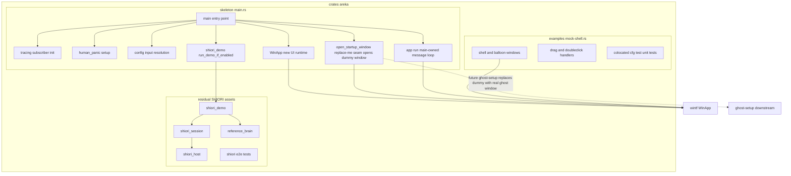
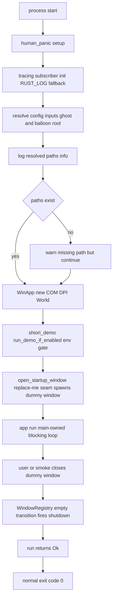

# Technical Design Document

## Overview

本仕様は areka バイナリクレート（`crates/areka`）の `main.rs` を、モック UI と本物の資産が混在した現状から、**本番アプリの骨格**へ作り替える。骨格の責務は「アプリ起動の器」に限定される――構造化ロギング初期化・パニックハンドラ設定・UI ランタイム起動・**構成入力（ゴースト／バルーンのルートパス）の解決とログ出力**・SHIORI 実走デモの env-gate 呼び口・後段（ghost-setup）が本物のゴースト窓生成へ置き換える replace-me シーム（本仕様ではそこが**検証用ダミー窓**を開く）・`main` 自身が所有するメッセージループの駆動（`app.run()`）・ダミー窓 close での正常終了である。骨格自身は**本物のゴースト窓は生成しない**（座標・配置ロジックを持たない）が、起動→loop→終了の経路を実際に踏破し検証可能にするため、ゴースト内容も配置主張も持たない最小の**検証用ダミー窓**を開く。

同時に、現 `main.rs` を占有するモック UI（シェル＋バルーン 2 窓・ドラッグ追従・ダブルクリック終了・縦書きテキスト）を、**挙動不変のまま別名 example `examples/mock-shell.rs` へ機械的に退避**し、動く資産として保全する。既存の SHIORI 契約チェーン（`shiori_host`/`shiori_session`/`reference_brain`/`shiori_demo`＋ e2e テスト群）は本番コード側に残置する。

**Impact**: 現状 `crates/areka/src/main.rs`（500 行・混成）を、骨格 `main.rs`＋退避先 `examples/mock-shell.rs` の 2 ファイルへ分割する。これにより emo-present と window-placement が同じ `main.rs` を取り合う構造的衝突が解消され、後続のアプリ組み上げ二段（ghost-setup／window-placement）が安全に積み上がる。

### Goals

- モック UI を `examples/mock-shell.rs` へ挙動不変で退避し、`cargo run --example mock-shell` で従来デモと同一挙動を保つ。
- `main.rs` を本番アプリ骨格（ロギング・panic・UI ランタイム起動・構成入力解決・`main` 所有の `run()` ループ・正常終了）へ純化する。
- `main` が所有するメッセージループで、replace-me シーム（`open_startup_window`）が開く検証用ダミー窓の起動→loop→ダミー窓 close→正常終了を実際に踏破し、boot→loop→exit 経路を証明可能にする。
- SHIORI 契約チェーンを残置し、e2e テスト群を緑のまま維持する。
- ghost-setup／window-placement が本物のゴースト窓生成へ置き換える replace-me シーム（本仕様ではダミー検証窓を開く差し込み点）を提供する。

### Non-Goals

- エンジンの起動・結線・ライフサイクル統括（**ghost-setup**）。
- boot／close イベントの発火順序・運行（**kanade**）。
- 本物のゴースト窓生成・配置・DPI 対応（**window-placement**）／サーフェス表示・描画（**emo チェーン**）。検証用ダミー窓は配置・座標・DPI を一切主張しない liveness プローブに限る（既定位置・座標ロジックなし）。
- ゴースト位置・vanish count 等の状態永続化（**position-persist（M-life）**）。
- SSTP・FMO・DirectSSTP・Plugin／HEADLINE／SAORI ホスティング・ネットワーク更新・ゴースト／バルーン選択 UI（**M2**）。
- 構成入力の**マウント**（descript.txt 読取・エンコーディング解決）――骨格はパスの**決定とログ出力**のみを担い、マウントは ghost-setup／areka-parsers の領分。

## Boundary Commitments

### This Spec Owns

- **モックデモの example 退避**: `examples/mock-shell.rs`（＋その `#[cfg(test)]` テスト）。挙動不変が受け入れ基準。モック固有アセット・座標定数・表示テキストは example 側の私物として保持する。
- **骨格 `main`**: ロギング初期化・パニックハンドラ・UI ランタイム起動・構成入力（ghost/balloon root path）解決とログ出力・replace-me シーム呼び出し・**`main` 所有のメッセージループ駆動（`app.run()`）**・ダミー窓 close での正常終了。
- **検証用ダミー窓**: replace-me シーム `open_startup_window` が本仕様で開く、ゴースト内容も配置主張も持たない最小の閉じられる窓。`main` 所有の `run()` ループに heartbeat を与え、boot→loop→exit を実証する liveness／検証プローブ。
- **`main` 所有の `run()` ループ**: `main` が `app.run()` を自ら呼ぶ（下流シームに隠さない）。ダミー窓 close の空遷移で `run()` が返り、正常終了する。
- **構成入力の解決規約**: 起動時位置引数（`argv[1]`=ghost root, `argv[2]`=balloon root）と既定パスのフォールバック規約。パスの**決定**まで（存在検証は warn どまり・強制しない）。
- **SHIORI 実走デモの呼び口**: `shiori_demo::run_demo_if_enabled()` の env-gate 呼び出しを骨格 main に据える（挙動不変）。
- **replace-me シーム**: ghost-setup／window-placement が本物のゴースト窓生成へ置き換える差し込み点（`open_startup_window(app: &WinApp)`）。本仕様ではその本体が検証用ダミー窓を開く。
- **Cargo example の実行可能化**: `examples/mock-shell.rs` の配置（Cargo 自動認識で `--example mock-shell` 実行可）。

### Out of Boundary

- エンジン起動・結線・lifecycle 統括（ghost-setup）／boot・close 発火順序（kanade）／**本物のゴースト窓生成・配置・描画**（window-placement／emo）／状態永続化（position-persist）。検証用ダミー窓は開くが、それは配置・座標・DPI を一切主張せず（既定位置・座標ロジックなし）、本物のゴースト窓と placement は window-placement の領分に留まる。
- 構成入力のマウント処理（descript.txt 読取・`areka-parsers::package::resolve` 呼出）。骨格はパス**決定**のみ。
- SHIORI 契約チェーン（`shiori_host`/`shiori_session`/`reference_brain`/`shiori_demo`）の**内部実装**。骨格はモジュール宣言と demo 呼び口を維持するのみで、中身は completed shiori 系 spec の資産として不触。

### Allowed Dependencies

- 既存 deps のみ（`wintf` / `shiori-abi` / `windows-core` / `human-panic` / `thiserror` / `tracing` / `tracing-subscriber` / `async-io` / `bevy_ecs` / `windows`）。**新規外部依存の追加は禁止**（R6.1）。
- 構成入力の解決は `std`（`std::env::args`・`std::path`・`env!("CARGO_MANIFEST_DIR")`）で自己完結する。`areka-parsers` に依存してはならない。
- 骨格の UI ランタイム起動は `wintf::WinApp::new()` を用いる。
- example の UI 構築は `wintf` の既存 ECS API（現 `main.rs` が使う API 群）をそのまま用いる。

### Revalidation Triggers

以下の変更は下流仕様（ghost-setup／window-placement／emo-present）に再点検を要求する:

- replace-me シーム（`open_startup_window(app: &WinApp)`）のシグネチャ・呼び出し位置の変更。下流はこのシーム本体（ダミー窓）を削除し、本物のエンジン結線＋ゴースト窓生成へ置き換える。`main` の構造（シーム呼び出し→`app.run()`）は不変で、変わるのはシーム本体だけである。
- 構成入力の解決契約（引数フォーマット・既定パス・ログ出力フィールド）の変更。
- 骨格の起動→終了の制御フロー（UI ランタイム起動の形・`main` 所有の `run()` ループ・正常終了経路）の変更。
- `examples/mock-shell.rs` の観測挙動（窓 2 枚・ドラッグ追従・ダブルクリック終了・縦書き）の変更（emo-present が観測土台の donor に使う）。
- SHIORI モジュール帰属（残置 5 モジュール＋3 e2e テスト）の変更。

## Architecture

### Existing Architecture Analysis

現 `crates/areka/src/main.rs`（500 行）は 3 つの塊が混在する:

1. **モック UI**（example へ退避）: 定数（`BALLOON_OFFSET_X/Y`・`SHELL_INITIAL_X/Y`・`SHELL_IMAGE_PATH`・`BALLOON_TEXT`）、マーカー（`ShellWindowMarker`/`BalloonWindowMarker`）、生成関数（`create_shell_window`/`create_balloon_window`/`build_typewriter_tokens`/`run_setup`）、クリック透過登録システム（`register_click_through_windows`）、イベントハンドラ（`on_shell_drag`/`on_shell_pressed`）、`main()` 内の窓生成結線と操作ガイド `println!`。
2. **骨格に残す塊**: `human_panic::setup_panic!()`、tracing subscriber 初期化（RUST_LOG フォールバック）、`WinApp::new()`、`shiori_demo::run_demo_if_enabled()` 呼び口、SHIORI モジュール宣言 5 本＋e2e テスト宣言 3 本。
3. **`#![cfg_attr(not(debug_assertions), windows_subsystem = "windows")]`** クレート属性（リリース時コンソール窓抑止）。

**分離のクリーンさ（実測確認）**: SHIORI 契約チェーン（`shiori_*_e2e_tests.rs` 等）は `shiori_abi` と `crate::shiori_host`/`crate::shiori_session` のみを参照し、モック UI シンボルへの依存はゼロ。よって退避はモック UI 側だけで完結し、相互汚染は起きない。`src/tests.rs`（モック UI ユニットテスト・約 25 ケース）は `use super::*` でモック UI 関数を検証するため、モック UI と一緒に example 側へ移設する。

**保持すべき既存パターン**: subscriber 初期化パターン（`EnvFilter::try_from_default_env().unwrap_or_else(|_| EnvFilter::new("info"))`）は logging.md の正典と同一。example 側も独自に subscriber を初期化する（`clickthrough_two_rects` 前例と同じ・logging.md「アプリ／example が初期化」）。

**回避する技術的負債**: 骨格が本物のゴースト窓を作らず、検証用ダミー窓が配置・座標・DPI を一切主張しない（既定位置・座標ロジックなし）ことで、window-placement リジェクト（2026-07-05）の原因となった DPI 座標系の落とし穴（Monitor.work_area 物理座標と BoxStyle 論理座標の混在）に骨格は一切触れない。ダミー窓は liveness／検証プローブに徹し、本物の placement は window-placement の領分に留めることで、placement リジェクトの再発を構造的に防ぐ。

### UI ランタイムの終了規律（設計上の要）

`wintf::WinApp::run()`（`crates/wintf/src/runtime/mod.rs`・`block_on(shutdown_future)` 相当は line 317/272 付近）は `MessageLoopDriver::block_on(ShutdownPolicy::shutdown_future(...))` で**最後のウィンドウ破棄まで**ブロッキングメッセージループを駆動する。この shutdown シグナルは `WindowRegistry` の**空への遷移ちょうど**（`reconcile_window_registry`: `removed_any && registry.is_empty()`・`window_registry.rs:135` 付近）でのみ発火する。**元から空（窓ゼロ）のリコンサイルでは発火しない**（実測: `window_registry.rs` の `reconcile_removes_entries_and_fires_hook_only_on_empty_transition` テストが「既に空での空振りでは再発火しない」を固定）。

**帰結（本設計の中核判断・DD7 改定）**: `run()` が正常に返る（＝ハングしない）ためには**窓が少なくとも 1 枚必要**である。窓が「持たれてから最後の 1 枚が消える」空遷移ちょうどでのみ shutdown シグナルが撃たれるため、窓ゼロで `run()` を呼ぶと空遷移が永遠に起きずハングする。この規律は、`run()` を避ける理由ではなく、**検証用ダミー窓を必ず 1 枚開く理由**である。したがって骨格は replace-me シーム（`open_startup_window`）で検証用ダミー窓を 1 枚開き、その窓が `run()` ループに heartbeat（空遷移の発火源）を与える。骨格にとっての「UI ランタイム起動」（R2.4）は `WinApp::new()`（COM/DPI 初期化・World 生成・shutdown hook 結線）の成功と、それに続く `main` 所有の `app.run()` 駆動で達成される。ダミー窓が（利用者操作または smoke テストで）閉じられると、`WindowRegistry` が空へ遷移し、`run()` が `Ok` を返して正常終了する（R4.1）。`app.run()` は下流に隠さず `main` が自ら所有・呼び出しする。下流（ghost-setup／window-placement）はシーム本体のダミー窓生成を削除し、本物のエンジン結線＋ゴースト窓生成へ置き換えるが、`main` の構造（シーム呼び出し→`app.run()`）は不変である。この設計により、骨格単体で「起動→初期化→構成解決ログ→ダミー窓→loop→close→正常終了」を実際に踏破して検証でき、旧 DD7 の窓ゼロ・ハング問題は「窓（ダミー）が存在する」ことで消滅する（旧 DD7 の windowless-return より強い検証）。

### Architecture Pattern & Boundary Map



**Architecture Integration**:
- **選択パターン**: レイヤ分離した最小骨格（Entry → 初期化群 → UI ランタイム → replace-me シーム（ダミー窓）→ `main` 所有の `run()` ループ → 正常終了）。骨格は器に徹し、本物の振る舞い（ゴースト窓・エンジン）は下流がシーム本体を置き換えて差し込む。`main` は `run()` を自ら所有する（下流に隠さない）。
- **ドメイン境界**: 骨格（起動・構成・ダミー窓・`run()` ループ・終了）／残置 SHIORI 資産（不触）／退避 example（モック UI 私物）の三片。相互参照は「骨格→demo 呼び口→SHIORI 資産」の一方向のみ。
- **保持パターン**: subscriber 初期化（logging.md 正典）・`WinApp` facade・`shiori_demo` env-gate。
- **新規要素の根拠**: 構成入力解決（R3・新規責務・std 自己完結）／replace-me シーム＋検証用ダミー窓（R4.2・下流置換点・boot→loop→exit の実証）。いずれも小粒。
- **Steering 準拠**: 新規依存なし（tech.md）・subscriber はアプリ層初期化（logging.md）・骨格は本物のゴースト窓を作らずダミー窓は配置を主張しない（`areka-placement-real-ghost-first`・placement リジェクト再発防止）・RUST_LOG は log レベル用（AREKA_ 名前空間は domain runtime var 用）。

### Technology Stack

| Layer | Choice / Version | Role in Feature | Notes |
|-------|------------------|-----------------|-------|
| CLI / Entry | Rust 2024 `fn main` + `std::env::args` | 骨格エントリ・構成入力（位置引数）解決 | 新規依存なし・std 自己完結 |
| Logging | `tracing` + `tracing-subscriber`（env-filter） | 構造化ログ・RUST_LOG フォールバック | logging.md 正典パターン流用 |
| Panic | `human-panic` 2.0.6 | パニックハンドラ | 現 main.rs から据え置き |
| UI Runtime | `wintf::WinApp`（path 依存 0.0.1） | COM/DPI 初期化・World 生成（`new()`）／ブロッキングループ（`run()`・**`main` が所有・呼び出す**） | ダミー窓が空遷移の heartbeat を与え `run()` が close で返る。終了規律は上記「UI ランタイムの終了規律」参照 |
| SHIORI（残置） | `shiori-abi` + 残置モジュール群 | demo 呼び口のみ骨格が保持 | 内部実装は不触 |

## File Structure Plan

### Directory Structure

```
crates/areka/
├── src/
│   ├── main.rs              # 骨格へ純化（モック UI 除去・構成解決/replace-me シーム（ダミー窓）/main 所有の run() 追加）
│   ├── shiori_host.rs       # 残置（不触）
│   ├── shiori_session.rs    # 残置（不触）
│   ├── reference_brain.rs   # 残置（不触）
│   ├── shiori_demo.rs       # 残置（不触・呼び口は main に維持）
│   ├── shiori_e2e_tests.rs           # 残置（不触）
│   ├── shiori_lifecycle_e2e_tests.rs # 残置（不触）
│   └── shiori_reference_e2e_tests.rs # 残置（不触）
│   # src/tests.rs は削除（モック UI と一緒に example へ移設）
├── examples/
│   ├── clickthrough_two_rects.rs  # 既存（不触・退避先パターンの前例）
│   └── mock-shell.rs              # 新規（現 main.rs のモック UI 全体 + tests.rs を機械移設）
└── shell/                   # 既存アセット（不触・example から CARGO_MANIFEST_DIR 相対参照）
```

### Modified Files

- `crates/areka/src/main.rs` — モック UI 塊（定数・マーカー・生成関数・登録システム・ハンドラ・窓生成結線・操作ガイド）を除去。骨格要素（`windows_subsystem` 属性・subscriber 初期化・panic・SHIORI モジュール宣言・demo 呼び口）を維持。**新規追加**: 構成入力解決（`resolve_config_inputs`）とその呼び出し＋ログ、replace-me シーム（`open_startup_window(app: &WinApp)`・本仕様では検証用ダミー窓を開く）、その後の `main` 所有の `app.run()?` 呼び出し（ダミー窓 close で空遷移→正常復帰・DD7 改定）。`#[cfg(test)] mod tests;` 宣言を除去。
- `crates/areka/src/tests.rs` — **削除**（内容は `examples/mock-shell.rs` の `#[cfg(test)] mod tests` へ移設）。

### Created Files

- `crates/areka/examples/mock-shell.rs` — 現 `main.rs` のモック UI 全体を機械移設した退避 example。`main()`＝subscriber 初期化＋`WinApp::new()`＋`run_setup` spawn＋`register_click_through_windows` 結線＋操作ガイド＋`mgr.run()`（窓を生成するので `run()` は正常に空遷移で復帰する）。末尾に `#[cfg(test)] mod tests`（現 `src/tests.rs` の内容）を同居させる。`windows_subsystem` 属性は付与しない（DD3・`clickthrough_two_rects` 前例と同じ）。

> 骨格の依存方向: `main`（Entry）→ `resolve_config_inputs`（std のみ）／`open_startup_window(&WinApp)`（本仕様ではダミー窓を開く）／`shiori_demo`（残置）／`wintf::WinApp`（`new()` と `main` 所有の `run()`）。上向き依存なし。example は骨格 `src/` の一切に依存しない（モック私物を持ち込まない・R1.5）。

## System Flows

### 骨格の起動→ダミー窓→loop→正常終了フロー（DD7 改定）



**フロー上の設計判断**:
- **構成解決の失敗許容**: root path が存在しなくても `warn!` を出して継続し正常終了する（R4.1／R3 は「パスの決定とログ」であってマウントや存在保証ではない）。異常終了経路を作らない。
- **demo 呼び口**: env-gate（`AREKA_SHIORI_DEMO`）無効時は no-op、有効時は駆動し、成否にかかわらず通常起動を中断しない（現挙動不変・R5.3/5.4）。現 main の配置（`WinApp::new()` の後・シーム／`run()` の前）を踏襲する。
- **replace-me シーム＋ダミー窓（DD7 改定）**: `open_startup_window(&app)` が検証用ダミー窓を 1 枚開く。これが `run()` ループに空遷移の heartbeat を与える。下流はこのシーム本体を削除し本物のゴースト窓生成へ置き換えるが、`main` の構造（シーム→`app.run()`）は不変。
- **`main` 所有の `run()`（DD7 改定）**: `main` が `app.run()?` を自ら呼ぶ（下流に隠さない）。ダミー窓が閉じられると `WindowRegistry` が空へ遷移し `run()` が `Ok` を返し、正常終了（exit 0）する。窓が 1 枚存在するため旧 DD7 のハング問題は消滅する。

## Requirements Traceability

| Requirement | Summary | Components | Interfaces / Flows |
|-------------|---------|------------|--------------------|
| 1.1 | example がシェル＋バルーン 2 窓表示 | mock-shell example | `create_shell_window`/`create_balloon_window`（移設） |
| 1.2 | ドラッグでシェル移動・バルーン追従 | mock-shell example | `on_shell_drag`（移設） |
| 1.3 | ダブルクリックで全窓終了 | mock-shell example | `on_shell_pressed`（移設） |
| 1.4 | 移行前と同一観測挙動 | mock-shell example | 機械移設・挙動不変が受入基準 |
| 1.5 | モック私物を骨格へ持ち込まない | mock-shell example / 骨格 main | File Structure Plan（アセット・定数は example 側） |
| 1.6 | 名前指定でビルド・実行可 | mock-shell example | Cargo 自動認識（`--example mock-shell`・DD4） |
| 2.1 | 構造化ログ初期化＋env ログレベル | 骨格 main | subscriber init（RUST_LOG） |
| 2.2 | ログレベル env 未設定/不正/非UTF-8 で既定へフォールバック・異常終了しない | 骨格 main | `try_from_default_env().unwrap_or_else(...)` |
| 2.3 | パニックハンドラ設定 | 骨格 main | `human_panic::setup_panic!()` |
| 2.4 | UI ランタイム起動＋main がメッセージループを駆動 | 骨格 main | `WinApp::new()` ＋ `main` 所有の `app.run()`（終了規律参照・DD7 改定） |
| 2.5 | 本物のゴースト窓の配置/座標/DPI を持たない（最小の検証用ダミー窓は許容・下流が本物へ置換） | 骨格 main / `open_startup_window` | モック UI 除去＋ダミー窓は既定位置・座標ロジックなし（placement リジェクト再発防止） |
| 3.1 | ghost/balloon root path 解決 | `resolve_config_inputs` | 起動フロー Resolve |
| 3.2 | 解決結果をログ出力 | 骨格 main | 起動フロー LogCfg（`info!`） |
| 3.3 | 引数で与えられたら採用 | `resolve_config_inputs` | 位置引数（argv[1]/argv[2]） |
| 3.4 | 引数なしなら既定を採用 | `resolve_config_inputs` | 既定パス（CARGO_MANIFEST_DIR 相対・DD1） |
| 3.5 | 実行時選択 UI を提供しない | 骨格 main | 何も作らない（非機能） |
| 4.1 | 未結線でダミー窓→main 所有 loop→ダミー窓 close で正常終了 | 骨格 main / `open_startup_window` | 起動フロー Seam→RunLoop→Close→NormalExit（DD7 改定） |
| 4.2 | replace-me シーム提供（本仕様ではダミー検証窓を開く） | `open_startup_window` | ダミー窓を開くシーム（DD5 改定・下流が本物ゴースト窓へ置換） |
| 4.3 | エンジン/イベント/窓/永続化を実装しない | 骨格 main | 境界宣言（Out of Boundary） |
| 5.1 | SHIORI チェーン残置 | 残置 SHIORI 群 | モジュール宣言維持 |
| 5.2 | SHIORI e2e テスト緑維持 | 残置 e2e | 宣言維持・相互参照ゼロ（実測） |
| 5.3 | demo gate 無効時は駆動しない | 骨格 main / shiori_demo | `run_demo_if_enabled`（現挙動） |
| 5.4 | demo gate 有効時は駆動し通常起動を中断しない | 骨格 main / shiori_demo | demo 呼び口（現配置踏襲） |
| 6.1 | 新規外部依存を追加しない | 骨格 main / Cargo.toml | std 自己完結・deps 不変 |
| 6.2 | 既存の緑テスト（SHIORI e2e 含む）を緑維持 | 残置 e2e | 退避はモック側のみ・非汚染 |
| 6.3 | モック UI ユニットテストはコード資産として保全すれば足る | mock-shell example | 例内 `#[cfg(test)]`（DD6・解釈①） |
| 6.4 | example は観測上等価な挙動 | mock-shell example | 機械移設 |

## Components and Interfaces

| Component | Domain/Layer | Intent | Req Coverage | Key Dependencies | Contracts |
|-----------|--------------|--------|--------------|------------------|-----------|
| 骨格 `main` | Entry | アプリ起動の器（初期化・構成・シーム呼び出し・`run()` 所有・終了） | 2.1–2.5, 3.2, 3.5, 4.1, 4.3, 5.3, 5.4, 6.1 | `wintf::WinApp` (P0), `shiori_demo` (P1) | Service |
| `resolve_config_inputs` | Config | ghost/balloon root path の決定 | 3.1, 3.3, 3.4 | std（args/path） (P0) | Service |
| `open_startup_window` | Seam | replace-me シーム：本仕様はダミー検証窓を開く（下流が本物ゴースト窓へ置換） | 4.2（＋2.4/4.1 に寄与） | `wintf::WinApp` (P0) | Service |
| 残置 SHIORI 群 | Assets | 契約チェーン残置（不触） | 5.1, 5.2 | shiori-abi (P0) | State（不触） |
| mock-shell example | Example | モック UI 退避・挙動保全 | 1.1–1.6, 6.3, 6.4 | `wintf` ECS API (P0) | Service |

### Entry / Config Layer

#### 骨格 `main`

| Field | Detail |
|-------|--------|
| Intent | アプリ起動の器: ロギング・panic・構成解決・UI ランタイム起動・demo 呼び口・replace-me シーム・`main` 所有の `run()` ループ・ダミー窓 close での正常終了 |
| Requirements | 2.1, 2.2, 2.3, 2.4, 2.5, 3.2, 3.5, 4.1, 4.3, 5.3, 5.4, 6.1 |

**Responsibilities & Constraints**
- 起動シーケンス（panic → subscriber → 構成解決＋ログ → `WinApp::new()` → demo 呼び口 → `open_startup_window`（ダミー窓）→ `app.run()`（`main` 所有ループ）→ ダミー窓 close で正常終了）を順に実行する。
- **本物のゴースト窓を生成せず、座標・配置ロジックを保持しない**（R2.5）。モック UI シンボルを一切参照しない。検証用ダミー窓は既定位置で開き、配置・座標・DPI を一切主張しない（placement リジェクト再発防止）。
- `app.run()` を**自ら所有・呼び出す**（下流シームに隠さない）。ダミー窓が閉じられると `WindowRegistry` の空遷移で `run()` が `Ok` を返し正常終了する（R2.4/R4.1・DD7 改定）。窓が 1 枚存在するためハングしない。
- ログ失敗経路を作らない: subscriber の env フィルタ解釈失敗は既定 `"info"` へフォールバックし panic しない（R2.2・現パターン）。
- 失敗経路のログ規律（`areka-log-first-no-silent-failure`）: 構成 root path 不在などの回復可能事象は `warn!` で記録して継続する。

**Dependencies**
- Outbound: `resolve_config_inputs` — 構成入力の決定（P0）。
- Outbound: `open_startup_window(&WinApp)` — replace-me シーム呼び出し（本仕様ではダミー窓を開く・P0）。
- Outbound: `shiori_demo::run_demo_if_enabled` — env-gate デモ呼び口（P1）。
- External: `wintf::WinApp::new` — COM/DPI 初期化・World 生成（P0）／`wintf::WinApp::run` — `main` 所有のブロッキングループ（P0）。
- External: `human_panic::setup_panic!` — パニックハンドラ（P1）。

**Contracts**: Service [x]

##### Service Interface
```rust
// 骨格エントリ。windows::core::Result を返す（現行踏襲）。
// main が run() ループを所有する。open_startup_window は本仕様ではダミー検証窓を開く
// replace-me シーム（下流が本物ゴースト窓生成へ置換）。main の構造は下流で不変。
fn main() -> windows::core::Result<()> {
    // human_panic::setup_panic!()
    // tracing subscriber init（RUST_LOG フォールバック）
    let cfg = resolve_config_inputs(&args); info!(...cfg...);   // R3
    let app = WinApp::new()?;                                    // R2.4 起動
    shiori_demo::run_demo_if_enabled();                          // R5
    open_startup_window(&app);   // ★replace-me シーム：本仕様はダミー検証窓を開く
    app.run()?;                       // ★main が loop 所有・ダミー窓 close で空遷移→正常復帰
    Ok(())
}
```
- Preconditions: なし（プロセス起動時に呼ばれる）。
- Postconditions: subscriber 初期化済み・panic ハンドラ設定済み・構成入力がログ出力済み・`WinApp::new()` 成功後にダミー窓を開き `app.run()` を駆動、ダミー窓 close で `run()` が `Ok` を返し正常終了（exit 0）。
- Invariants: 骨格は本物のゴースト窓・座標・配置・エンジン結線・状態永続化を実装しない。ダミー窓は配置を主張しない liveness プローブに限る。

**Implementation Notes**
- Integration: SHIORI モジュール宣言（`mod shiori_host;` 等 5 本）と e2e テスト宣言（`#[cfg(test)] mod shiori_*_e2e_tests;` 3 本）を骨格 main に維持する（R5.1）。`#![cfg_attr(not(debug_assertions), windows_subsystem = "windows")]` クレート属性を維持する（DD3）。
- Validation: 骨格単体で `cargo run -p areka` がダミー窓を表示し、close で exit 0 になることを手動確認する。smoke テストがダミー窓をプログラム的に閉じ clean exit（exit 0）を境界内で assert する（boot→loop→exit の証明）。`cargo test -p areka` で SHIORI e2e が緑であることを確認する（R6.2）。
- Risks: ダミー窓が閉じられないと `run()` が返らない → 検証窓は必ず閉じ可能（利用者 close＋smoke のプログラム close 経路）にする。ダミー窓は配置を主張しない（window-placement リジェクト再発防止）。demo 呼び口を `WinApp::new()` の後・シーム／`run()` の前に置く現配置を踏襲し、demo 失敗が通常起動を止めないよう `Err` はログのみ（R5.4）。

#### `resolve_config_inputs`

| Field | Detail |
|-------|--------|
| Intent | ghost/balloon root path を起動引数または既定から決定する（std 自己完結） |
| Requirements | 3.1, 3.3, 3.4 |

**Responsibilities & Constraints**
- 位置引数 `argv[1]`（ghost root）・`argv[2]`（balloon root）を採用する。欠落時は既定パスへフォールバックする（R3.3/3.4）。
- 既定パスは `CARGO_MANIFEST_DIR` 相対の fixture パス（DD1・現 `SHELL_IMAGE_PATH` と同じ `env!` 手法で決定的）。ハードコードを避けるが実在検証は行わず、決定した `PathBuf` を返す。
- **マウントしない**（descript.txt を読まない・`areka-parsers` を呼ばない）。パスの**決定**のみ。std（`std::env::args`・`std::path::PathBuf`）で完結し新規依存を引かない（R6.1）。

**Dependencies**
- External: `std::env::args` / `std::path::PathBuf` — 引数取得・パス表現（P0）。

**Contracts**: Service [x]

##### Service Interface
```rust
/// 構成入力（解決済みルートパス）。
struct ConfigInputs {
    ghost_root: std::path::PathBuf,
    balloon_root: std::path::PathBuf,
}

/// 起動引数（位置引数）と既定パスから構成入力を決定する。純粋・副作用なし
/// （引数列を入力に取れば env アクセスなしで単体テスト可能な形にする）。
fn resolve_config_inputs(args: &[String]) -> ConfigInputs;
```
- Preconditions: `args` はプロセス引数列（`args[0]` は実行ファイル名）。
- Postconditions: `ghost_root`/`balloon_root` は常に有効な `PathBuf`（引数優先・欠落時は既定）。存在は保証しない。
- Invariants: マウント・エンコーディング解決・descript 読取を一切行わない。

**Implementation Notes**
- Integration: 骨格 `main` が `std::env::args().collect()` を渡し、戻り値を `info!(ghost_root = %..., balloon_root = %..., "...")` でログ出力する（R3.2）。実在しないパスは呼び出し側 `main` が `warn!` する（存在検証は決定と分離）。
- Validation: 引数あり／なしの両分岐を純粋関数として単体テストできる（既定採用・引数採用）。
- Risks: 既定 fixture パスの実体は本仕様のスコープ外（ghost-setup が実マウント対象を確定する）。骨格は決定とログに徹し、実在は warn どまりで正常終了を壊さない。

#### `open_startup_window`（replace-me シーム・本仕様ではダミー検証窓を開く）

| Field | Detail |
|-------|--------|
| Intent | replace-me シーム：本仕様はダミー検証窓を開く／後続（ghost-setup／window-placement）が本物ゴースト窓生成へ置換 |
| Requirements | 4.2（＋2.4/4.1 に寄与） |

**Responsibilities & Constraints**
- 本仕様ではその本体が**最小の検証用ダミー窓**（ゴースト内容なし・配置／座標／DPI 主張なし・既定位置の閉じられる窓）を 1 枚開く。これが `main` 所有の `run()` ループに空遷移の heartbeat を与え、boot→loop→exit を実証する。
- ダミー窓の lifecycle: 閉じられるまで生存し、close で `WindowRegistry` を空へ遷移させる。手動検証では利用者が close、自動検証では smoke テストがプログラム的に close する。
- **配置・座標・DPI を一切主張しない**（既定位置・座標ロジックなし）。placement は window-placement の領分であり、ダミー窓はそこへ踏み込まない（2026-07-05 placement リジェクト再発防止）。
- 後続（ghost-setup／window-placement）はこのシーム**本体を削除**し、本物のエンジン結線＋ゴースト窓生成へ置き換える。`main` の構造（シーム呼び出し→`app.run()`）は不変で、変わるのはシーム本体だけ。

**Contracts**: Service [x]

##### Service Interface
```rust
/// replace-me シーム：後続仕様がここを本物のゴースト窓生成へ置き換える差し込み点。
/// 本仕様ではその本体が最小の検証用ダミー窓（配置主張なし・閉じられる窓）を開く。
/// app ハンドルを取るのはダミー窓を spawn するため。
fn open_startup_window(app: &WinApp);
```
- Preconditions: `WinApp::new()` 成功済みの `app` を受け取る。
- Postconditions: 検証用ダミー窓が 1 枚開かれ、`WindowRegistry` に登録される（`main` 後続の `app.run()` に heartbeat を与える）。
- Invariants: 配置・座標・DPI・ゴースト内容を持たない。ダミー窓は必ず閉じ可能（利用者 close＋smoke のプログラム close）。

**Implementation Notes**
- Integration: 骨格 `main` が構成解決・demo 呼び口の後、`app.run()` の前にこの関数を `&app` で呼ぶ。本体はダミー窓を spawn する。署名が `&WinApp`（`&mut` でない）で足りる根拠: 窓生成は `WinApp::world()`（`&self`）→ `EcsWorld::spawn`（`&self`）経由＝現 `main.rs` の窓生成と同型で ECS 内部可変性を用いるため。下流が本物窓生成＋エンジン結線でより強い借用を要すれば、それは Revalidation Trigger（シーム署名変更）として扱う（投機的に `&mut` を先取りしない）。
- Validation: `cargo run -p areka` でダミー窓が表示され、close で `run()` が返り exit 0 になることを確認する。smoke テストがダミー窓をプログラム的に閉じ clean exit を assert する。
- Risks: ダミー窓が閉じられないと `run()` が返らない → 必ず閉じ可能にする。過度な抽象（trait・plugin レジストリ）は speculative ゆえ導入しない。DD5 改定でシームは「ダミー検証窓を開く関数 1 個（`open_startup_window(&WinApp)`）」に決定（旧「no-op 関数 `wire_engines`」を改定）。

### Residual Assets Layer

#### 残置 SHIORI 群（不触）

| Field | Detail |
|-------|--------|
| Intent | SHIORI 契約チェーンの帰属維持（completed shiori 系 spec の資産） |
| Requirements | 5.1, 5.2 |

**Responsibilities & Constraints**
- `shiori_host`/`shiori_session`/`reference_brain`/`shiori_demo` の 4 モジュールと 3 e2e テストモジュールを本番コード側に残置する。内部実装は本仕様で変更しない。
- e2e テスト群は `crate::shiori_host`/`shiori_session` と `shiori_abi` のみ参照し、モック UI 非依存（実測）。よって退避で壊れない。

**Contracts**: State [x]（不触・既存契約を維持）

**Implementation Notes**
- Integration: 骨格 main のモジュール宣言（`mod shiori_host;` 等）と demo 呼び口を維持するだけで帰属が満たされる。
- Validation: `cargo test -p areka` の SHIORI e2e が緑（R5.2/R6.2）。これが本仕様の緑判定対象（DD6・解釈①）。
- Risks: なし（分離クリーンが実測済み）。

### Example Layer

#### mock-shell example（退避）

| Field | Detail |
|-------|--------|
| Intent | 現 main.rs のモック UI を挙動不変で退避保全（手動検証・下流観測土台） |
| Requirements | 1.1, 1.2, 1.3, 1.4, 1.5, 1.6, 6.3, 6.4 |

**Responsibilities & Constraints**
- 現 `main.rs` のモック UI 全体（定数・マーカー・生成関数・登録システム・ハンドラ・`main()` 内の窓生成結線・操作ガイド）を機械移設する。**挙動不変が受入基準**（R1.4/R6.4）。
- モック固有アセット参照（`shell/base.png`）・座標定数・表示テキストを example 側の私物として保持する（R1.5）。骨格 `src/` へ持ち込まない。
- `src/tests.rs` の内容を末尾 `#[cfg(test)] mod tests` として同居させ、コード資産として保全する（R6.3・DD6）。
- 独自に subscriber を初期化する（logging.md「アプリ／example が初期化」・`clickthrough_two_rects` 前例）。窓を生成するので `mgr.run()` は空遷移で正常復帰する。

**Contracts**: Service [x]

**Implementation Notes**
- Integration: Cargo が `examples/mock-shell.rs` を自動認識し `cargo run -p areka --example mock-shell` で実行可能（DD4・`[[example]]` 明示登録は不要）。ファイル名の `-` は example 名 `mock-shell` に一致する。
- Validation: `cargo run --example mock-shell` で窓 2 枚・ドラッグ追従・ダブルクリック終了・縦書きテキストが従来と同一挙動であることを手動確認する（R1.1–1.4）。移設した `#[cfg(test)]` テストはコードとして残るが、`cargo test` の標準ハーネスでは実行されない（example 内 `#[test]` は `cargo test`／`cargo test --examples` の通常テストとして走らない）。これは R6.3 の許容範囲（テストコード資産の保全で足りる）。
- Risks: `windows_subsystem` 属性は example に付与しない（DD3）。リリースビルド時にコンソール窓が出るが、これは `clickthrough_two_rects` と同じ手動検証補助の扱いであり「挙動不変」の対象は窓・操作の観測挙動に限る。

## Testing Strategy

### Unit Tests
- `resolve_config_inputs`（純粋関数）: 引数 2 個ありで両ルートを採用する／引数なしで両既定へフォールバックする／ghost のみ引数ありで balloon が既定になる（R3.3/3.4）。
- `resolve_config_inputs` の既定パス: 既定が `CARGO_MANIFEST_DIR` 相対で決定的に生成される（R3.4・DD1）。
- （退避・非緑ゲート）mock-shell example 同居テスト: `build_typewriter_tokens` のトークン化・Entity 構築・ハンドラ分岐（現 `tests.rs` 相当）をコード資産として保全（R6.3・実行は標準ハーネス対象外）。

### Integration Tests
- SHIORI 契約チェーン e2e（`shiori_e2e_tests`/`shiori_lifecycle_e2e_tests`/`shiori_reference_e2e_tests`）が退避後も緑を維持する（R5.2/R6.2）。これが本仕様の緑判定対象。
- `shiori_demo` の env-gate 単体テスト（`gate_disabled_does_not_drive`/`gate_enabled_drives` 等）が緑を維持する（R5.3/5.4・残置により不変）。
- **骨格 smoke（boot→loop→exit の証明）**: `cargo run -p areka` がダミー検証窓を開き、smoke テストがその窓をプログラム的に close（または境界付きで）して、プロセスが境界時間内に **exit 0** で終了することを assert する（起動→`main` 所有 loop→ダミー窓 close→正常終了の踏破を証明・R2.4/R4.1）。これは以前の Issue 2 回帰（windowless-return／ハング懸念）に対するガードでもある。ダミー窓は配置を assert しない（liveness プローブに限る）。

### E2E / Manual Verification
- 骨格起動: `cargo run -p areka`（引数なし・`AREKA_SHIORI_DEMO` 未設定）が起動→構成入力ログ（ghost/balloon root）→検証用ダミー窓表示→`main` 所有 loop 駆動→利用者がダミー窓を閉じると exit 0 で正常終了する（R2.1–2.4・R3.2・R4.1）。ダミー窓は配置・座標・DPI を主張しない。
- 骨格＋引数: `cargo run -p areka -- <ghost> <balloon>` が引数値をログに反映し、ダミー窓 close で正常終了する（R3.3）。
- モック退避: `cargo run -p areka --example mock-shell` が窓 2 枚表示・ドラッグでバルーン追従・ダブルクリックで全窓終了・縦書きテキスト表示を従来同一で行う（R1.1–1.4・R6.4）。
- demo gate: `AREKA_SHIORI_DEMO=1 cargo run -p areka` が demo を駆動しつつ通常起動を中断しない（R5.4）。

## Optional Sections

### Security Considerations
本仕様は認証・機微データ・外部連携を扱わない。構成入力は起動引数（ローカル）と既定パスのみで、外部入力の解釈は subscriber の env フィルタ（失敗時フォールバックで異常終了しない・R2.2）に限られる。追加のセキュリティ決定は不要。

### Open Questions / Risks
- なし（DD1–DD7 は本設計内で決着。DD6 は要件ディスカッション #1 で解釈①採用済み）。
- **DD5／DD7 は設計ディスカッションで改定（開発者の絶対決定）**: 旧 DD5「no-op 単一関数 `wire_engines`」と旧 DD7「窓ゼロで `run()` に入らず windowless-return」を破棄し、**replace-me シーム `open_startup_window(&WinApp)` が検証用ダミー窓を開き、`main` が `app.run()` を所有・ダミー窓 close で正常終了**するモデルへ改定した。ダミー窓が `run()` ループに heartbeat を与えるためハングは消滅し、boot→loop→exit を実際に踏破して証明できる（旧 windowless-return より強い検証）。ダミー窓は配置・座標・DPI を一切主張しない（2026-07-05 window-placement リジェクト再発防止）。下流はシーム本体を本物ゴースト窓生成へ置換するが `main` 構造は不変。
- 既定 fixture パスの実体（どのゴースト／バルーンを指すか）は ghost-setup が実マウント対象を確定する際に定まる。骨格はパス決定とログに徹し、実在は warn どまりで正常終了を壊さない（本仕様スコープ内で自己完結）。
