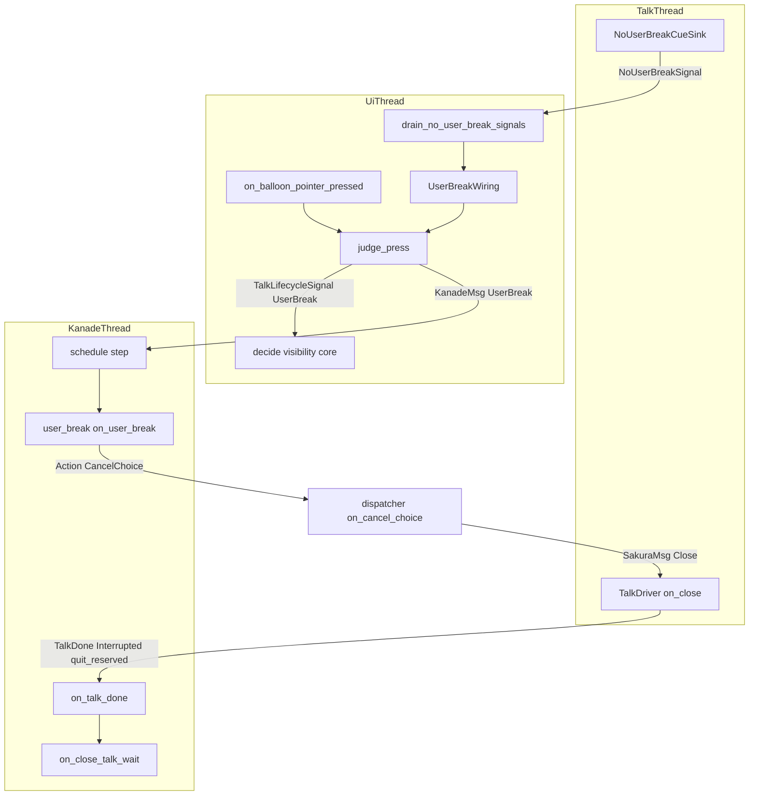
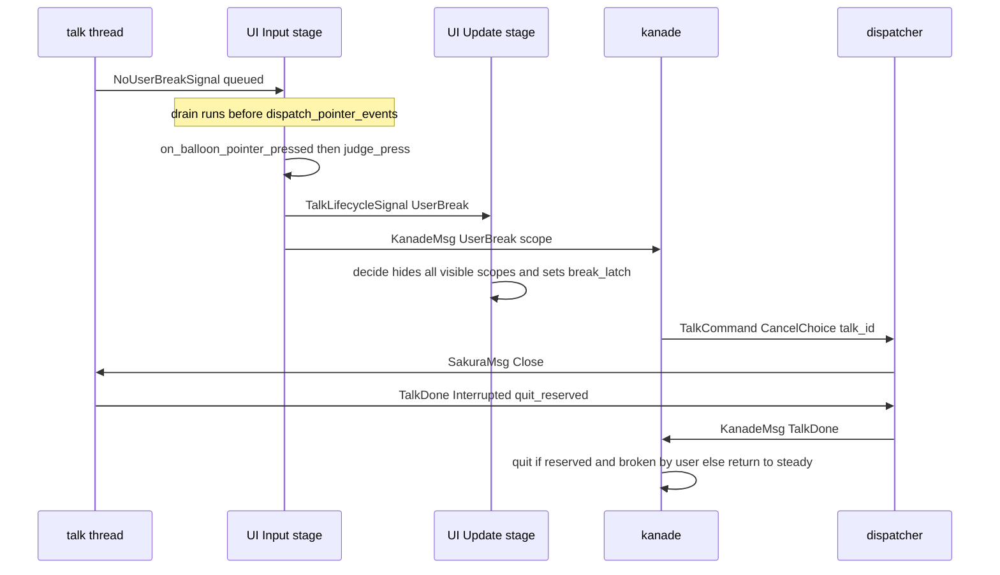

# Design Document: areka-P0-balloon-break

> 本文のコードの事実は **2026-09-20・本ブランチ**（`claude/kiro-balloon-double-click-stop-454210`）で実ファイルを読んで確かめたもの。コードは「何の定義か」（関数名・型名＋ファイルパス）で指し、行番号では指さない。
> 要件 9 の裁定 1〜8 と `research.md` §11（開発者裁定 2 件）は確定事項として扱い、ここでは開き直さない。

## Overview

**Purpose**: 喋っている途中のゴーストを、バルーンの左ダブルクリックで黙らせられるようにする。再生中の台本はその場で止まり、画面に出ているバルーンは押下と同じ描画のうちに全部消える。

**Users**: areka の利用者（長い台詞を止めたい）と、ゴースト作者（`\![enter,nouserbreakmode]`〜`\![leave,nouserbreakmode]` で「ここは止めさせない」を守りたい）。

**Impact**: 次の 4 点が変わる。
1. バルーン窓の押下ハンドラが、ダブルクリックを示す欄を初めて読む。
2. 表示の側に「中断を禁じる旗」と「中断で隠した後は次のトークまで出し直さない」という記憶が 1 つずつ増える。
3. 会話の運行の側（kanade）に入力が 1 種増え、再生中なら場面を問わず既存の停止経路へ流す。
4. **終了の規則が変わる**: 終了イベント（`OnClose`）の別れの台詞は `\-` の有無にかかわらず必ず終了で終わる。`\-` を含む台本を利用者が中断したら、ただちに終了する（完了 spec `areka-P0-kanade` の要件 4.5 を上書き）。

### Goals
- バルーンの左ダブルクリック 1 回で「再生停止」と「全バルーンの即時非表示」が対で起きる（要件 1〜4）。
- `nouserbreakmode` の区間では止まらず隠れない（要件 5）。
- 隠す判断は 0 フレームの遅れで下す（1 フレーム遅らせる形の解を採らない・要件 4.5）。
- 既存の停止経路（単一の閉じ口）をそのまま使い、第 2 の停止経路を作らない（要件 3.2）。
- 要件 7.1 の 8 つの判断分岐を決定論テストで固定する。

### Non-Goals
- `OnBalloonBreak`／`OnBalloonClose`／`OnBalloonTimeout` の SHIORI 発火（担当は `areka-P0-balloon-lifecycle-events`）。本仕様が SHIORI へ送る中断起因のイベントは **0 件**。
- 中断位置（`OnBalloonBreak` の Reference2）の源を作ること。
- `status` の `nouserbreak`／`timecritical` トークン、`\t` の実装（担当は `areka-P0-status-execution-states`）。
- 中断操作の割り当て変更、SSTP 経由の中断禁止の判定（置く判定は **0 個**）。
- キャラクター窓のダブルクリック、バルーン窓の右ボタン（変更 **0**）。

## Boundary Commitments

### This Spec Owns
- バルーン窓の左ダブルクリックを「利用者が中断を求めた」に変換する判定（`fn judge_press`）と、その結果の 2 つの送出（表示の側へ「隠せ」・運行の側へ「止めろ」）。
- 中断を禁じる旗（表示の側に 1 本）と、それを運ぶ 7 本目の受け口（`NoUserBreakCueSink`）。
- バルーンを隠す理由の語彙への 1 値追加（`VisibilityTrigger::UserBreak`）と、「次のトークが始まるまで内容では出し直さない」記憶（`break_latch`）。
- 運行の側の入力 `UserBreak` の受理規則（再生中なら場面を問わず止める／再生中でなければ何もしない／二重に止めない）。
- 終了の予約の運び方（`TalkDone.quit_reserved`）と、それを利用者の中断のときだけ終了へ結び付ける規則。
- `CloseTalkWait` の規則の改訂（別れの台詞はどの終わり方でも終了へ進む）。
- 網羅台帳の 2 項目（`\![enter,nouserbreakmode]`・`\![leave,nouserbreakmode]`）の担当。

### Out of Boundary
- 再生を止める意味論（`crates/areka-sakura/src/drive.rs` の `fn on_close` が `player.stop()` で未発火の指示を捨てること）。本仕様は「止めた時点で台本が終了を予約していたか」を報告に 1 欄足すだけで、何を捨てるかは変えない。
- dispatcher（`crates/areka-ghost/src/dispatcher.rs`）の製品コード。変更 **0 行**（`fn on_cancel_choice` をそのまま使う）。
- バルーンの可視性の既存 4 理由（`content`／`clear`／`timeout`／`explicit`）の意味、タイムアウト計測、抑止の規則。
- 文字層（`areka-emo-text`）と表示層（`areka-emo-present`）。変更 **0 行**。
- 旗が変わったことを運行の側へ伝える通知（読む者がまだ居ないので作らない・要件 5.7）。

### Allowed Dependencies
- `areka` → `areka-kanade`（`KanadeMsg`）・`dola::cue`（`CueSink`・`TalkCue`）・`wintf::ecs`（`Input` スケジュール・`dispatch_pointer_events`・`DoubleClick`）・`areka-emo-present`（`EmoPresenter::target_visible` の読みだけ）。いずれも既存の依存。
- `areka-kanade` → `areka-talk`。既存の依存のまま。`areka-kanade` は `areka-sakura`・`areka-parsers` へ依存しない（台本の文字列を自分で解釈して `\-` を探すことはしない）。
- 新しい crate: **0**。新しい外部依存: **0**。`Cargo.toml` の変更: **0**。
- 新しく敷く向きの線: **0**（talk → UI と UI → kanade はどちらも既に在る向き。kanade → UI の「隠せ」と talk → kanade の旗は敷かない）。

### Revalidation Triggers
- `areka_talk::TalkDone` の欄の増減（全構築点が追随する）。
- `enum TalkLifecycleSignal`／`enum VisibilityTrigger` の値の増減（`trigger` の語は実機ログの検索語）。
- `KanadeMsg`／`schedule::Input` の値の増減。
- `CloseTalkWait` の終わり方の規則の変更（完了 spec `areka-P0-kanade` 要件 4.5 を上書きした箇所）。
- `wire_emo2_boot` の受け口の登録順の変更（旗の順序保証が依存する・後述「旗の順序」）。
- `crates/areka-sakura/src/compile.rs` が「内容を持つ台本の先頭に `ClearAll` を 1 件前置する」規則の変更（掛け金を解く順序が依存する）。

## Architecture

### Existing Architecture Analysis

設計が依存する既存の事実（いずれも実ファイルで確認）。

| 事実 | 定義箇所 |
|---|---|
| ダブルクリックの 2 打目は `left_down` と `double_click = Left` の両方を載せて届く | `fn handle_double_click_message`（`crates/wintf/src/ecs/window_proc/mouse_dblclick_wheel.rs`）が `double_click` を載せ、`record_button_down` で押下も記録する |
| 1 回の更新は `Input → Update → …` の順に同じ巡で回る。ポインタ押下は起床の旗 `POINTER` を立てるので、押下のあった巡は必ず `Update` まで回る | `wire_emo2_boot` の相順コメント（`crates/areka/src/emo2_boot/mod.rs`）・`crates/wintf/src/ecs/world/tick_wake.rs` のモジュール doc |
| バルーン可視性の相は `Update` で走り、表示指令の適用の直後に表示の合図を全件取り出す | `fn run_balloon_visibility_phase`／`fn drain_lifecycle`（`crates/areka/src/emo2_boot/balloon_visibility_phase.rs`） |
| kanade の 1 メッセージの処理は SHIORI の往復を含めて同期で完結する（応答を受けて次の遷移まで回してから次のメッセージを読む） | `fn drive`（`crates/areka-kanade/src/actor.rs`） |
| 新しいトークの起動は「古いトークへ閉じ指示 → スレッドの合流 → 新しいトークの起動」の順。古い側の完了通知は枠を先に空けるので dispatcher が捨てる | `fn on_start`／`fn close_active_if_any`／`fn on_done`（`crates/areka-ghost/src/dispatcher.rs`） |
| 選択肢の時間切れの解除は枠を保ったまま閉じ指示を転送し、「中断で終わった」が kanade へ届く | `fn on_cancel_choice`（同上） |
| 内容を持つ台本は必ず先頭に `ClearAll` を 1 件持つ | `fn compile` の末尾（`crates/areka-sakura/src/compile.rs`） |
| `\-` の有無は再生前に `TalkEndReason::Quit` として確定し、再生中の状態が持ち回るが、`fn on_close` はそれを見ずに常に `Interrupted` を返す | `enum TalkPhase` の `end` 欄・`fn on_close`（`crates/areka-sakura/src/drive.rs`） |
| 受け口は台本ごとに複製され、複製後の最初の指示で「トークが始まった」を自分で検出できる | `impl Clone for BalloonLifecycleSink`（`crates/areka/src/emo2_boot/talk_lifecycle.rs`） |
| バルーンを隠すと当たり判定も同時に切られる | `fn set_visible`（`crates/areka-emo-present/src/mount.rs`） |

### Architecture Pattern & Boundary Map



**Architecture Integration**:
- 採用パターン: 既存のアクター＋単一の閉じ口。判断は 2 か所に分かれ、材料の持ち主と一致する——**隠す判断**は押下を検出した UI が旗だけを見て下し、**止める判断**は kanade が「再生中か」だけを見て下す。
- 「隠れたのに再生が続く」を作らない仕組み（要件 2.8）: UI は旗が立っていなければ**必ず**両方へ送る。kanade は再生中なら**場面で断らない**。破れるのは送出の失敗だけで、そこは `error!` で記録する。
- 保つ既存パターン: 運搬 cue の受け口の自己選別（`ReadmeCueSink` 同型）／NonSend 資源＋`Input` の段の取り出し（`wire_readme` 同型）／純関数の判断中核＋配線層（`fn decide`）／純粋な状態機械＋シェル（`schedule::step`）。
- 新設する部品とその理由: 受け口 1（旗の源が台本の中にしか無い）／UI 資源 1（旗・送出端 2 本・直前の押下の記憶をまとめる）／kanade の兄弟モジュール 1（`steady.rs` が 935 行で足せない）。それ以外の新しい型・トレイト・抽象は **0**。

### Technology Stack

| Layer | Choice / Version | Role in Feature | Notes |
|-------|------------------|-----------------|-------|
| UI / 入力 | `wintf::ecs`（既存）・`bevy_ecs`（既存） | 押下ハンドラ・`Input` の段の取り出し | 新しい依存 0 |
| 表示の判断 | `crates/areka/src/emo2_boot/balloon_visibility.rs`（既存の純関数） | 隠す理由 1 値・掛け金 1 本 | 配線層は無改変 |
| 運行 | `areka-kanade` の `schedule`（既存の純粋状態機械） | 入力 1 種・帳簿 1 欄 | |
| 再生 | `areka-sakura` の `drive.rs`・`areka-talk` | 完了通知に 1 欄 | 停止の意味論は不変 |
| スレッド間 | `std::sync::mpsc`（既存） | 旗の線 1 本を新設・表示の合図の線は送出端の複製で共用 | |

## File Structure Plan

### Directory Structure
```
crates/areka/src/
├── input_events/
│   ├── user_break.rs              # 新規: UserBreakWiring・judge_press・fold_no_user_break・
│   │                              #       drain_no_user_break_signals・on_left_press・wire_user_break
│   ├── user_break_tests.rs        # 新規: 判断分岐 ⑷⑸・要件 1.9・旗の出入り・送出 1 件ずつ・登録順
│   ├── balloon.rs                 # 改変: 押下ハンドラの末尾から on_left_press を呼ぶ（+10 行以内）
│   └── mod.rs                     # 改変: `pub(crate) mod user_break;` の 1 行
└── emo2_boot/
    ├── user_break_cue.rs          # 新規: NoUserBreakSignal・NoUserBreakCueSink（7 本目の受け口）
    ├── user_break_cue_tests.rs    # 新規: 自己選別・トーク境界の自己検出
    ├── balloon_visibility.rs      # 改変: VisibilityTrigger::UserBreak・break_latch・decide の 1 段
    ├── balloon_visibility_user_break_tests.rs  # 新規: 判断分岐 ⑵（隠す側）⑹・要件 4.1／4.6
    ├── talk_lifecycle.rs          # 改変: TalkLifecycleSignal::UserBreak と doc
    ├── consumer_ledger.rs         # 改変: CommandConsumer::UserBreakSink・2 行登記・件数 6 → 8
    └── mod.rs                     # 改変: 線 1 本・受け口 7 本目・wire_user_break の呼び出し
crates/areka-kanade/src/
├── msg.rs                         # 改変: KanadeMsg::UserBreak { scope }
├── actor.rs                       # 改変: KanadeMsg → Input の写しに 1 腕
└── schedule/
    ├── user_break.rs              # 新規: on_user_break・take_user_break_quit
    ├── user_break_tests.rs        # 新規: 判断分岐 ⑴⑵⑶⑺・要件 2.4／3.9／7.2
    ├── mod.rs                     # 改変: Input::UserBreak・State.user_break_talk・横断の 1 腕・
    │                              #       on_talk_done の Interrupted の腕
    └── close.rs                   # 改変: CloseTalkWait の規則・テスト 2 本の書き換え（判断分岐 ⑻）
crates/areka-talk/src/lib.rs       # 改変: TalkDone.quit_reserved
crates/areka-sakura/src/
├── drive.rs                       # 改変: on_close が end を読む・send_interrupted に引数 1
└── drive_lifecycle_tests.rs       # 改変: 「予約あり／なしの中断」の 1 本
```

### Modified Files（上に載らないもの）
- `TalkDone { … }` を組み立てている全箇所 — 欄 `quit_reserved: false` を足す機械的な追随。2026-09-20 時点で `TalkDone {` の出現は **45 行・17 ファイル**（型定義の 1 行を含む）。製品コードの構築点は `crates/areka-sakura/src/drive.rs` の `fn send_done`・`fn send_interrupted` の **2 つ**で、残りはテストと模擬（`crates/areka-kanade/tests/kanade/common/common_mock_sakura.rs` ほか）。コンパイラが漏れを止める。
- `crates/areka-kanade/tests/kanade/close_test_handshake_tests.rs` の `close_refused_resumes_pump_then_terminates_via_resumed_talk` と `crates/areka-kanade/tests/kanade/close_test.rs` のモジュール doc — 旧規則（別れの台詞が `\-` 無しで終わったら定常へ戻る）を固定している統合テスト。新規則（終了へ進む）を固定する形へ書き換える。**要件 7.7 が挙げる 2 本に加えて 1 本**ある（後述「要件本文との差」）。
- 旧規則を説明しているコメント 3 か所（テストは `\-` で終わる台本を使っており、緑のまま）— `crates/areka/src/emo2_boot/spine_close_wiring_tests.rs`・`spine_conformance_script.rs`・`spine_conformance_support_tests.rs`。「`\e` で終わると終了しない」という説明を新規則に合わせる。
- `crates/areka-kanade/src/schedule/mod.rs` の `enum Action` の `CancelChoice` の doc — 発行点が 2 つ（選択肢の時間切れの解除・利用者の中断）になったことを書く。
- `doc/COMPAT_ARCHITECTURE.md` — 3 行を足し 1 行を直す（後述「互換対応表」）。
- `doc/ukadoc-coverage/ledger/sakura-script.toml`・`doc/ukadoc-coverage/roadmap-draft.md`・`doc/ukadoc-coverage/report/` — 要件 8。
- 触らないことを明示するもの（**変更 0 行**）: `crates/areka-kanade/src/schedule/steady.rs`（935 行）・`crates/areka-kanade/src/status.rs`・`crates/areka-ghost/src/dispatcher.rs` の製品コード・`crates/areka/src/emo2_boot/balloon_visibility_phase.rs`・`crates/areka/src/main.rs`・`crates/areka/src/placement/spawn.rs`。

### 行数の見立て（要件 7.8）
| ファイル | 現在 | 増分の見立て | 判定 |
|---|---:|---:|---|
| `input_events/balloon.rs` | 917 | +10 以内（呼び出し 1 つと doc の直し） | 収まる。判定と送出は `user_break.rs` へ出す |
| `schedule/steady.rs` | 935 | 0 | 触らない |
| `emo2_boot/balloon_visibility.rs` | 770 | +70 前後 | 収まる。テストは兄弟ファイル |
| `schedule/mod.rs` | 713 | +50 前後 | 収まる |
| `schedule/close.rs` | 609 | ±0 前後 | 収まる |

## System Flows

### 中断が受け入れられる流れ（同じ巡のうちに隠れる）



- 隠すのは押下と同じ巡の `Update`。kanade への往復を待たない（要件 4.5）。
- 起床の旗は足さない。押下そのものが `POINTER` を立てて巡を回しているためである（足す旗: **0**）。

### 旗の順序（なぜ「トークが始まった」を旗の線にも流すのか）

正典の記述例は `\![enter,nouserbreakmode]` を台本の**先頭**に置いている。先頭のタグは、台本の最初の指示（`ClearAll`）と同じ時刻に配られる。旗を「表示の合図の線で届く `TalkStarted` で解く」形にすると、旗の線は `Input` の段、表示の合図の線は `Update` の段で取り出すので、同じ巡に届いた 2 つが **`Enter` → `TalkStarted` の逆順**で処理され、入ったばかりの区間が解かれてしまう。

そこで 7 本目の受け口が**自分でトークの境界を検出**し（`BalloonLifecycleSink` と同じ手口＝複製で状態を初期化し、複製後の最初の指示で 1 回だけ送る）、`TalkStarted`・`Enter`・`Leave` の 3 値を**同じ 1 本の線**に流す。1 つのトークの指示は 1 本のスレッドから順に出るので線の上の順序は台本の順序と一致し、トークをまたぐ順序は dispatcher が「古いトークのスレッドの合流 → 新しいトークの起動」の順を守ることで保たれる。

これは要件 5.4（遅くとも次のトークが始まる時点までに解く・「トークが終わった」という合図は足さない）をそのまま満たす。`research.md` §11 の「`fn apply_lifecycle_signals` に 1 行足すだけ」という実現方法の覚え書きは、上の逆順の問題があるため採らない（裁定の中身＝旗は UI だけが持ち、次のトークの始まりで解く、は変えていない）。

### 掛け金を解く順序（研究項目 R-2）

掛け金（`break_latch`）は表示の合図の線の `TalkStarted` で解く。新しいトークの文字が「掛け金が掛かったまま」観測されることは無い。理由: ⑴ 内容を持つ台本の最初の指示は必ず `ClearAll` で、文字を運ぶ指示は必ずそれより後の指示である ⑵ `BalloonLifecycleSink` は最初の指示の配信の中で `TalkStarted` を送るので、同じスレッドが後で送る文字の指示より必ず先に線へ入る ⑶ UI の 1 巡は表示指令の適用 → 表示の合図の取り出しの順なので、文字の指令が適用済みなら `TalkStarted` も取り出せる状態にある。

## Requirements Traceability

| Requirement | Summary | Components | Interfaces | Flows |
|---|---|---|---|---|
| 1.1 | スコープ付きで運行側へ 1 件 | UserBreakWiring | `fn on_left_press`・`KanadeMsg::UserBreak` | 中断の流れ |
| 1.2 | 左ダブルクリックだけ | judge_press | `DoubleClick::Left` の 1 値だけを拾う | — |
| 1.3 | キャラ窓は不変 | —（変更 0） | `fn on_char_pointer_pressed` に触れない | — |
| 1.4 | 右ボタンは不変 | 押下ハンドラ | `left_down` でない押下は従来どおり素通し | — |
| 1.5 | 選択を確定した続きの 2 打目は合図にしない | judge_press・UserBreakWiring | `prev_press_selected` | — |
| 1.6 | 選択待ち中の余白は合図にする | judge_press | 選択が成立しなければ判定を続ける | — |
| 1.7 | 渡せなければ `error!`・再生は続く | UserBreakWiring | `balloon_break_send_failed` | — |
| 1.8 | 結線前は `trace!` | on_left_press | `UserBreakWiring` 不在の自己抑止 | — |
| 1.9 | 出ていないバルーンでは作らない | judge_press | `EmoPresenter::target_visible` の照会 | — |
| 2.1 | 再生中なら止める | kanade user_break | `fn on_user_break` | 中断の流れ |
| 2.2 | 再生中でなければ隠すだけ | kanade user_break・判断中核 | `balloon_break_no_talk`・`HideScopes` | — |
| 2.3 | 無効化の区間は止めず隠さず `debug!` | judge_press | `PressVerdict::Disabled` | — |
| 2.4 | 二重に止めない | kanade user_break | `State.user_break_talk` | — |
| 2.5 | 場面・スコープで変えない | kanade user_break | `fn current_talk_id` の 3 場面を一律に扱う | — |
| 2.6 | 選択待ちの破棄・`OnChoiceTimeout` を送らない | 既存の掃除 | `clear_choice_ledger(state, "steady_talk_done")` | — |
| 2.7 | 出してある要求の応答は捨てない | —（足す仕組み 0） | `fn drive` の同期往復 | — |
| 2.8 | 隠れたのに再生が続く状態を作らない | judge_press・kanade user_break | 分担の不変条件 | 中断の流れ |
| 3.1 | 後ろを 1 つも実行しない | 既存 | `fn on_close`（不変） | — |
| 3.2 | 既存の単一の閉じ口を使う | kanade user_break | `Action::CancelChoice` の再利用 | — |
| 3.3 | 終わり方の種類を増やさない | TalkDone | `TalkEndReason` は 3 値のまま・欄を 1 つ足す | — |
| 3.4 | 定常へ戻る | 既存 | `steady::on_talk_done`（不変） | — |
| 3.5 | 面を戻さない | —（何もしない） | — | — |
| 3.6 | 別れの台詞は必ず終了 | close | `fn on_close_talk_wait` | — |
| 3.7 | 別れの台詞の中断はただちに終了 | kanade user_break・close | 上 2 つの合成 | — |
| 3.8 | `\-` 入りの台本の利用者の中断は終了 | TalkDriver・kanade user_break | `quit_reserved`・`fn take_user_break_quit` | 中断の流れ |
| 3.9 | 中断起因のイベントを SHIORI へ送らない | kanade user_break | 返す `Action` は `CancelChoice` だけ | — |
| 4.1 | 出ている全バルーンを隠す | 判断中核 | `VisibilityAction::HideScopes` | — |
| 4.2 | 止める再生が無くても隠す | judge_press | 再生中かを UI は見ない | — |
| 4.3 | 30 秒を待たない | 判断中核 | 合図を受けた巡で発行 | — |
| 4.4 | 隠す理由に 1 つ足す・既存の意味は不変 | 判断中核 | `VisibilityTrigger::UserBreak` | — |
| 4.5 | 同じ描画のうちに隠す | on_left_press・判断中核 | `Input` で投函・同じ巡の `Update` で消化 | 中断の流れ |
| 4.6 | 隠した後のタイムアウトで新しい記録 0 | 判断中核 | `fn decide_timeout` は無改変の経路 | — |
| 4.7 | 次のトークは普通に出る | 判断中核 | `TalkStarted` で掛け金を解く | 掛け金の順序 |
| 4.8 | 独りでに出し直さない | 判断中核 | `break_latch` | — |
| 5.1 | `enter` で区間に入る | NoUserBreakCueSink・fold | `NoUserBreakSignal::Enter` | 旗の順序 |
| 5.2 | `leave` で出る | 同上 | `NoUserBreakSignal::Leave` | — |
| 5.3 | 区間では止めず隠さない | judge_press | 2.3 と同じ | — |
| 5.4 | 次のトークの始まりまでに解く | NoUserBreakCueSink・fold | `NoUserBreakSignal::TalkStarted` | 旗の順序 |
| 5.5 | 入れ子を数えない | fold | 真偽 1 本 | — |
| 5.6 | 区間外の `leave` は `debug!` | fold | `no_user_break_leave_outside` | — |
| 5.7 | `status` へ見せない・読み口を塞がない | UserBreakWiring | `fn no_user_break`（読み口）・通知は作らない | — |
| 5.8 | SSTP の判定 0 | — | — | — |
| 6.1 | 受理を `info!` で 1 行 | kanade user_break | `balloon_break_accepted` | — |
| 6.2 | 止める再生が無いを `debug!` | kanade user_break | `balloon_break_no_talk` | — |
| 6.3 | 無効化で退けたを `debug!` | on_left_press | `balloon_break_rejected` | — |
| 6.4 | 失敗はすべて `error!` | on_left_press・`fn send_talk_command`（既存） | `balloon_break_send_failed`・`balloon_break_hide_send_failed`・`talk_command_send_failed` | — |
| 6.5 | 書式は steering `logging.md` | 全部品 | 「ログの語彙」の表（構造化フィールド） | — |
| 6.6 | 検出そのものは `trace!` 以下 | on_left_press | `balloon_break_detected` | — |
| 7.1 | 8 つの判断分岐 | — | 「要件 7.1 の 8 分岐の置き場」 | — |
| 7.2 | 中断の後に次のトークが始まる | kanade user_break | `user_break_tests.rs` | — |
| 7.3 | 区間の出入り | fold・受け口 | `user_break_tests.rs`（UI）・`user_break_cue_tests.rs` | — |
| 7.4 | 全スコープが隠れることを指示の観測で | 判断中核 | `balloon_visibility_user_break_tests.rs` | — |
| 7.5 | 1 つの分岐を摂動して赤を示す | kanade user_break | 分岐 ⑺ の条件の置き換え | — |
| 7.6 | テストは兄弟ファイル | — | File Structure Plan の `*_tests.rs` 5 本 | — |
| 7.7 | 再テストしない 1 経路・書き換える既存テスト | close | 「要件本文との差」1（2 本ではなく 3 本） | — |
| 7.8 | 1 ファイル 1,000 行 | — | 「行数の見立て」 | — |
| 7.9 | 実機サインオフ 1 件・4 点 | — | Testing Strategy の末尾 | — |
| 8.1 | 台帳 2 項目の担当を登記し、着地後に実装済みへ | `doc/ukadoc-coverage/ledger/sakura-script.toml` | `owner = "areka-P0-balloon-break"`・`status` の更新 | — |
| 8.2 | 担当にしないもの 4 種 | NoUserBreakCueSink | 第 1 引数が `nouserbreakmode` の 2 組だけを拾う。`OnBalloonBreak`・`\t`・`onlinemode`・操作そのものは登記 0 | — |
| 8.3 | 同じコミットで `roadmap-draft.md` の `[[spec]]` の行・`[briefs].count`・本文の数を数え直し、報告を作り直す | `doc/ukadoc-coverage/` | `cargo run -p ukadoc-survey -- report`／`report-summary`・`cargo test -p ukadoc-survey` が緑 | — |
| 8.4 | 正典 URL のコメントを 1 行ずつ | consumer_ledger | `CommandConsumer::UserBreakSink` の doc に 2 行 | — |
| 9.1 | 裁定 1: `OnBalloonBreak` は入れない | kanade user_break | 返す `Action` に `ShioriRequest` が 0 件 | — |
| 9.2 | 裁定 2: `nouserbreakmode` を入れる | NoUserBreakCueSink・UserBreakWiring | 旗 1 本 | 旗の順序 |
| 9.3 | 裁定 3: 選択肢の行の上では中断しない | judge_press | `ConsumedBySelection` | — |
| 9.4 | 裁定 4: 選択待ち中の余白は中断・`OnChoiceTimeout` は送らない | judge_press・既存の掃除 | 1.6・2.6 と同じ | — |
| 9.5 | 裁定 5: 居残りのバルーンは隠すだけ | judge_press・kanade user_break | 2.2・4.2 と同じ | — |
| 9.6 | 裁定 6: 別れの台詞の中断はただちに終了 | close・TalkDone | 3.6〜3.8 と同じ | — |
| 9.7 | 裁定 7: 閉じ忘れは次のトークの始まりまでに解く | NoUserBreakCueSink・fold | `NoUserBreakSignal::TalkStarted` | 旗の順序 |
| 9.8 | 裁定 8: 隠す判断は UI・止める判断は kanade | 全体 | Architecture の分担 | 中断の流れ |
| 9.9 | 覆されたら要件と設計を同時に直す | — | 本書の該当節（Boundary・Components・互換対応表）を同じ変更で直す | — |

## Components and Interfaces

| Component | Domain/Layer | Intent | Req Coverage | Key Dependencies | Contracts |
|---|---|---|---|---|---|
| NoUserBreakCueSink | areka / talk → UI | `enter`／`leave`,`nouserbreakmode` とトークの境界を 1 本の線へ流す | 5.1, 5.2, 5.4 | `dola::cue::CueSink`（P0） | Event |
| UserBreakWiring | areka / UI 入力 | 旗・送出端 2 本・直前の押下の記憶を持ち、判定を適用する | 1.1, 1.5, 1.7〜1.9, 2.3, 4.2, 4.5, 5.3〜5.7 | `Emo2Wiring`（P0）・`KanadeMsg`（P0） | State, Event |
| judge_press | areka / UI 入力（純関数） | 押下 1 回を 5 つの結論のどれかへ写す | 1.2, 1.5, 1.6, 1.9, 2.3 | なし | Service |
| 判断中核の拡張 | areka / 表示 | 「中断された」で全部隠し、次のトークまで出し直さない | 4.1〜4.8 | `fn decide`（P0） | State |
| kanade user_break | areka-kanade / 運行 | 再生中なら止める・二重に止めない・終了の予約を利用者の中断にだけ効かせる | 2.1, 2.2, 2.4〜2.8, 3.2, 3.8, 3.9 | `schedule::step`（P0） | Service, State |
| close の規則改訂 | areka-kanade / 運行 | 別れの台詞はどの終わり方でも終了へ | 3.6, 3.7 | — | State |
| TalkDone.quit_reserved | areka-talk・areka-sakura | 止めた時点で台本が終了を予約していたかを報告する | 3.3, 3.8 | `enum TalkPhase` の `end`（P0） | Event |

### areka / talk → UI

#### NoUserBreakCueSink（`crates/areka/src/emo2_boot/user_break_cue.rs`）

| Field | Detail |
|---|---|
| Intent | 運搬 cue から `("enter","nouserbreakmode")`／`("leave","nouserbreakmode")` の 2 組だけを拾い、トークの境界とあわせて UI へ送る |
| Requirements | 5.1, 5.2, 5.4, 8.1 |

**Responsibilities & Constraints**
- 骨格は `ReadmeCueSink`（`crates/areka/src/emo2_boot/readme_cue.rs`）と同じ: 「名前＋第 1 引数」で自己選別し、担当外は `debug!` で読み飛ばす。cue の占有時間に触れない。
- `Clone` は手書きにし、複製で `started` を `false` へ戻す（`BalloonLifecycleSink` と同じ）。複製後の最初の `emit`（どの cue でもよい）で `TalkStarted` を 1 回だけ送る。
- 旗の状態は持たない（入れ子・区間外の判定は UI の `fold_no_user_break` が下す）。受け口は運ぶだけ。
- `enter`／`leave` の第 1 引数が `nouserbreakmode` 以外（`onlinemode` など）は担当外（要件 8.2）。
- 内容を 1 つも持たない台本（裸の `\e` など）は指示を 1 件も配らないので `TalkStarted` も出ない。こういう台本は画面に何も出さず、旗を立てることもできないので、要件 5.4 の「次のトーク」は「内容を持つ次のトーク」と読む（閉じ忘れが無ければ差は 0）。

**Contracts**: Event [x]

```rust
/// talk スレッドから UI スレッドへ流れる、中断の無効化の合図。
#[derive(Debug, Clone, Copy, PartialEq, Eq)]
pub(crate) enum NoUserBreakSignal {
    /// このトークの最初の指示が配られた（複製後の最初の emit で 1 回だけ）。
    TalkStarted,
    /// `\![enter,nouserbreakmode]`
    Enter,
    /// `\![leave,nouserbreakmode]`
    Leave,
}

pub(crate) struct NoUserBreakCueSink { /* tx: Sender<NoUserBreakSignal>, started: bool */ }
impl NoUserBreakCueSink { pub(crate) fn new(tx: Sender<NoUserBreakSignal>) -> Self; }
impl Clone for NoUserBreakCueSink { /* started を false へ戻す */ }
impl dola::cue::CueSink for NoUserBreakCueSink { fn emit(&mut self, cue: TalkCue); }
```
- Ordering: 1 つのトークの中では台本の順。トークをまたぐ順序は dispatcher の「合流 → 起動」が保つ。
- Delivery: 非ブロックの `mpsc`。UI の資源が据わる前に届いた分は線が溜めておく（起動の挨拶の `enter` を取りこぼさない）。送出の失敗（受信端が閉じている）は `warn!` で記録して台本は続ける（既存の受け口 6 本と同じ規律）。
- 登録位置: `wire_emo2_boot` の `sinks` の 7 番目（末尾）。文字の cue に依存しないので末尾でよい。

**Implementation Notes**
- `ConsumerLedger::canonical` に 2 行（`("enter", Some("nouserbreakmode"))`・`("leave", Some("nouserbreakmode"))` → `CommandConsumer::UserBreakSink`）を足し、件数を固定しているテスト `canonical_builds_without_duplicate` の 6 を 8 へ直す。正典 URL のコメント 2 行は `CommandConsumer::UserBreakSink` の doc に置く（要件 8.4）。

### areka / UI 入力

#### UserBreakWiring と judge_press（`crates/areka/src/input_events/user_break.rs`）

| Field | Detail |
|---|---|
| Intent | 押下を判定し、受け入れたら「隠せ」と「止めろ」を 1 件ずつ送る |
| Requirements | 1.1, 1.2, 1.5〜1.9, 2.3, 4.2, 4.5, 5.3〜5.7, 6.3, 6.4, 6.6 |

**Contracts**: Service [x] / State [x] / Event [x]

```rust
/// 中断の配線の持ち物（NonSend・UI スレッド所有）。
pub(crate) struct UserBreakWiring {
    flag_rx: Receiver<NoUserBreakSignal>,        // 7 本目の受け口と対
    no_user_break: bool,                         // 中断を禁じる旗（要件 5）
    lifecycle_tx: Sender<TalkLifecycleSignal>,   // 表示の合図の線の送出端の複製
    kanade: Sender<KanadeMsg>,                   // GhostRuntime::kanade() の複製
    prev_press_selected: bool,                   // 直前の左押下が選択の確定だったか（要件 1.5）
}
impl UserBreakWiring {
    /// 旗の読み口（要件 5.7）。
    pub(crate) fn no_user_break(&self) -> bool;
}

/// 押下 1 回の結論。
#[derive(Debug, Clone, Copy, PartialEq, Eq)]
pub(crate) enum PressVerdict {
    NotDoubleClick,        // 左ダブルクリックではない → 何もしない
    ConsumedBySelection,   // この押下か直前の押下が選択の確定 → 合図を作らない（要件 1.5）
    BalloonHidden,         // バルーンが出ていない・観測できない → 作らない（要件 1.9）
    Disabled,              // 無効化の区間 → 止めず隠さず debug!（要件 2.3）
    Break,                 // 受け入れ → 隠して、止める要求を送る
}

/// 純関数。上から順に最初に当たった結論を返す。
pub(crate) fn judge_press(
    double_click: DoubleClick,
    selected_now: bool,
    prev_press_selected: bool,
    balloon_visible: Option<bool>,
    no_user_break: bool,
) -> PressVerdict;

/// 旗の畳み込み（純関数）。返り値は（次の旗, 区間外の leave だったか）。
pub(crate) fn fold_no_user_break(flag: bool, signal: NoUserBreakSignal) -> (bool, bool);

/// `Input` の段・`dispatch_pointer_events` の**前**で走る取り出し。
pub(crate) fn drain_no_user_break_signals(world: &mut World);

/// 押下ハンドラから呼ばれる入口。中断を受け入れたら true。
pub(crate) fn on_left_press(
    world: &mut World, scope: usize, double_click: DoubleClick, selected_now: bool,
) -> bool;

/// 資源を World へ入れ、取り出しを登録する（`wire_readme` と同型・呼び手は `wire_emo2_boot`）。
pub(crate) fn wire_user_break(
    world: &mut World,
    flag_rx: Receiver<NoUserBreakSignal>,
    lifecycle_tx: Sender<TalkLifecycleSignal>,
    kanade: Sender<KanadeMsg>,
);
```

**判定の順（`judge_press`）**: ⑴ `double_click != Left` → `NotDoubleClick` ⑵ `selected_now || prev_press_selected` → `ConsumedBySelection` ⑶ `balloon_visible != Some(true)` → `BalloonHidden` ⑷ `no_user_break` → `Disabled` ⑸ それ以外 → `Break`。

- **要件 1.5 を「直前の押下の記憶」で満たす理由**: 1 打目で選択が確定すると、2 打目が届くまでの間に応答のトークが始まって選択肢の行が消えていることがある。そのとき 2 打目は「余白の押下」に見えるので、`fn click_selection` が `Some` を返すかどうかだけでは弾けない。`on_left_press` は左押下のたびに `prev_press_selected` を読んでから `selected_now` で上書きする。OS のダブルクリックは同じ窓への連続 2 打でしか成立しないので、記憶は 1 本で足りる（スコープ別にしない）。
- **要件 1.2 の「3 打目以降」**: OS は 3 打目を単押しとして届ける（`double_click` は `None`）。4 打目が新しいダブルクリックとして届いた場合は別の操作で、そのときバルーンは既に隠れているので ⑶ で落ちる。
- **要件 1.9 を自衛で満たす理由（研究項目 R-1・判断項目 6）**: バルーンを隠すと当たり判定も切られる（`fn set_visible`・`crates/areka-emo-present/src/mount.rs`）ので、隠れたバルーンに押下が届く見込みは低い。ただしそれは別 crate の内部のふるまいで、クリック透過の切り替えも巡の後で非同期に評価される。照会の口（`Emo2Wiring::presenter` → `EmoPresenter::target_visible`）は既に在り、増える依存は 0 なので、判定の入力に取り込む。`None`（表示層に相手が居ない）も作らない側へ倒す。
- **要件 1.7 が隣の既存ログより重い水準（`error!`）である理由（判断項目 9）**: 隣の `fn send_selection` は同じ「受け手が消えている」を `warn!` で記録する。選択の取りこぼしは会話が止まるだけだが、中断の取りこぼしは「バルーンは消えたのに再生が続く」（要件 2.8 の唯一の破れ）になるので、要件どおり `error!` にする。隣の水準は変えない。

**`on_left_press` の手順**
1. `UserBreakWiring` が無い → `trace!(event = "balloon_break_no_wiring")` で戻る（要件 1.8）。
2. `prev_press_selected` を読み、`selected_now` で上書きする。
3. `double_click != Left` ならここで戻る（単押しは記録しない）。左ダブルクリックなら `trace!(event = "balloon_break_detected", scope)`（要件 6.6）。
4. `Emo2Wiring::presenter().target_visible(balloon_target(scope))` を照会し、`judge_press` を呼ぶ。
5. 結論を適用する: `ConsumedBySelection` → `debug!`／`BalloonHidden` → `trace!`／`Disabled` → `debug!(event = "balloon_break_rejected", scope, reason = "no_user_break")`／`Break` → `lifecycle_tx` へ `TalkLifecycleSignal::UserBreak`、`kanade` へ `KanadeMsg::UserBreak { scope }` を**この順に 1 件ずつ**送る。どちらの失敗も `error!` で記録し、もう一方の送出はやめない。

**押下ハンドラ側の変更（`fn on_balloon_pointer_pressed`・`crates/areka/src/input_events/balloon.rs`）**: 末尾の `match selection { … }` の結果を `selected_now` に受け、`super::user_break::on_left_press(world, scope, state.double_click, selected_now)` を呼ぶ。返り値は `selected_now || 中断を受け入れた`。途中の早期復帰（`Emo2Wiring` 不在など）は従来どおりで、そこでは中断も作らない。doc の「`double_click` フィールドは一切参照しない」を直す。

**取り出しの登録（研究項目 R-7）**: `add_systems(Input, drain_no_user_break_signals.before(dispatch_pointer_events))`。`dispatch_pointer_events` 自身は `drain_task_pool_commands` の後に登録されているだけで（`crates/wintf/src/ecs/world/mod.rs`）、前に 1 本置いても循環しない。既存の取り出し 2 本は「後」で、「前」は本仕様が初めての例になる。

### areka / 表示

#### 判断中核の拡張（`crates/areka/src/emo2_boot/balloon_visibility.rs`）

| Field | Detail |
|---|---|
| Intent | 「中断された」を 5 つ目の隠す理由として判断中核に通す |
| Requirements | 4.1〜4.8, 7.4 |

**Contracts**: State [x]

- `enum TalkLifecycleSignal` に `UserBreak` を足す（`crates/areka/src/emo2_boot/talk_lifecycle.rs`）。doc の「talk スレッドから UI スレッドへ流れる」を「送り手は talk スレッドの受け口と、UI スレッドの押下ハンドラの 2 つ」へ直す。
- `enum VisibilityTrigger` に `UserBreak`（ログの語は `"user_break"`）を足す。
- `struct BalloonVisibilityState` に `break_latch: bool` を足す。
- `fn decide` の段は 4 段になる: ⑴ 合図の畳み込み → **⑵ 中断の非表示** → ⑶ 内容による表示・非表示 → ⑷ タイムアウト。

**規則**
- ⑴ `UserBreak` を畳み込むと `break_latch = true`、「この巡に中断があった」を立てる。`TalkStarted` を畳み込むと `break_latch = false`（既存の処理に 1 行）。線の上の到着順どおりに畳む。
- ⑵ この巡に中断があったなら、観測で `visible == true` の scope を昇順で全部 `HideScopes { trigger: UserBreak }` に載せる（**現に出ているものだけ**・判断項目 8）。各 scope の `prev_visible` を `false` にし、既存の `VisibilityLogEvent::Transition` を 1 件ずつ積む。抑止（ドラッグ・滞在・選択肢の表示中）は**見ない**——抑止はタイムアウトだけの規則であり、ダブルクリックした利用者は必ずバルーンの上に居る。
- ⑶ 以降は「⑵ で隠した scope は不可視」として扱う（観測値に本巡の発行を重ねる既存の流儀と同じ）。表示の条件は `増えた && 不可視 && !break_latch` になる。掛け金で見送った表示は**記録を 1 件も作らない**（要件 4.6・毎巡の判定は無音という既存規律）。`last_glyphs` は従来どおり更新する。
- ⑷ `fn decide_timeout` の可視 scope の集合からも ⑵ の scope を除く。結果として可視が 0 になり、計測が立っていれば既存の `MeasurementDiscarded { NoVisibleScope }` が 1 行出る——これは既存の記録で、本仕様は足しも消しもしない（要件 4.6・研究項目 R-5）。
- 行動の並びは「**中断の非表示** → 全消去の非表示 → 表示 → 満了の非表示」。同じ巡に `[UserBreak, TalkStarted]` と新しいトークの文字が揃った場合は、隠してから出す順になり、古い表示が消えて新しいトークが出る。
- 配線層（`balloon_visibility_phase.rs`）は `HideScopes` と `Transition` を理由に依らず処理するので**変更 0 行**。隠した scope のポインタ滞在の掃除も既存の経路で走る。

**選ばなかった形（判断項目 3）**: 文字層の内容を消す／文字の出る予定表を止める——どちらも `areka-emo-text` の改造になり、境界（文字層の変更 0 行）を越える。配線層から `PresentCommand::Hide` を直接出す——判断中核の記憶と食い違い、次の巡に偽の `trigger=explicit` が出る（要件 4.4 に反する）。

### areka-kanade / 運行

#### kanade user_break（`crates/areka-kanade/src/schedule/user_break.rs`）

| Field | Detail |
|---|---|
| Intent | 中断の要求を受け、再生中なら既存の停止経路へ流す |
| Requirements | 2.1, 2.2, 2.4〜2.8, 3.2, 3.8, 3.9, 6.1, 6.2 |

**Contracts**: Service [x] / State [x]

```rust
// msg.rs
KanadeMsg::UserBreak { scope: u32 }
// schedule/mod.rs
Input::UserBreak { scope: u32 }
State { /* … */ user_break_talk: Option<TalkId> }   // 利用者の中断を出した相手（応答待ち）

// schedule/user_break.rs
/// 横断の腕から呼ばれる。再生中なら CancelChoice を 1 件返す。
pub(super) fn on_user_break(state: State, scope: u32) -> (State, Vec<Action>);
/// 現行トークの完了を受けた時点で帳簿を必ず空にし、
/// 「利用者の中断で終わり、かつ終了の予約があった」なら true を返す。
pub(super) fn take_user_break_quit(state: &mut State, done: &TalkDone) -> bool;
```

**`on_user_break` の規則**（`schedule::step` の横断の腕 `Input::UserBreak` から、場面を問わず呼ぶ）

| 状態 | 結果 | 記録 |
|---|---|---|
| `fn current_talk_id` が `Some(id)`（`Steady{Some}`・`BootVersion{Some}`・`CloseTalkWait`）かつ `user_break_talk != Some(id)` | `user_break_talk = Some(id)`・`[Action::CancelChoice { talk_id: id }]` | `info!(event = "balloon_break_accepted", scope, talk_id, phase)`（要件 6.1） |
| 同上だが `user_break_talk == Some(id)`（同じ操作の 2 件目） | 状態不変・`Action` なし（要件 2.4） | `debug!(event = "balloon_break_no_talk", scope, reason = "already_breaking")` |
| `current_talk_id` が `None`（それ以外の全場面） | 状態不変・`Action` なし（要件 2.2） | `debug!(event = "balloon_break_no_talk", scope, reason = "not_playing", phase)`（要件 6.2） |

- 返す `Action` は `CancelChoice` だけ。`Action::ShioriRequest` は積まない（要件 3.9）。
- `pending_close` の有無では断らない（マウス入力の既存の「close 保留中は出さない」は SHIORI への GET を出さないための規則で、中断は SHIORI へ何も出さない）。
- `ClosePending`（`OnClose` の応答待ち）は再生中のトークが無いので 3 行目に落ちる。
- 停止の指示を送れなかったとき（要件 6.4）は、既存の `fn send_talk_command`（`crates/areka-kanade/src/actor.rs`）が `error!(event = "talk_command_send_failed", kind = "cancel_choice")` を出す。足す記録は **0**。

**停止指示の運び方（判断項目 7 → S1）**: `Action::CancelChoice` をそのまま使う。dispatcher の `fn on_cancel_choice` は選択の状態を見ず、現行の枠と `talk_id` が一致すれば閉じ指示を転送するだけなので、選択待ちでないトークに使っても副作用が無い。名前と実体のずれは、受理の 1 行（`balloon_break_accepted`）と `Action::CancelChoice` の doc の改訂で補う。`Action`／`TalkCommand`／`DispatcherMsg` に足す値は **0**。

**`BootVersion{Some}` について（研究項目 R-6）**: `fn drive` が同期で回るため、起動の挨拶の `StartTalk` と `basewareversion` の往復は 1 メッセージの処理の中で完結し、メッセージの切れ目では挨拶の場面は既に `Steady{Some}` になっている。`BootVersion{Some}` のまま中断の要求を受けるのは `basewareversion` に想定外の応答が返ったときだけだが、`on_user_break` は `fn current_talk_id` を見るので同じ規則で止まる。止めた後の `TalkDone{Interrupted}` は `boot::step` の既存の腕（終わり方で選別していない）が `BootVersion{None}` へ進める。場面別の分岐は **0**。

**選択待ちの最中（要件 2.6・2.7・研究項目 R-4）**: `fn drive` の同期往復により、メッセージの切れ目で選択の帳簿が `Cascading`／`TimeoutInFlight` であることは無い（`Waiting` か無しのどちらか）。したがって「中断の後に、出してあった要求の応答が遅れて届く」ことは構造上起きない。止めた後の `TalkDone{Interrupted}` で既存の `clear_choice_ledger(state, "steady_talk_done")` が帳簿を消し、`fn fire_choice_timeout_if_due` は二度と発火しない。足す仕組みは **0**。なお UI から「選択の確定」→「中断」の順に 2 件届いた場合は、先の確定が応答のトークを起こし、後の中断がそれを止めうる——これを防ぐのが UI 側の `prev_press_selected` である。

#### 終了の予約（研究項目 R-8）

```rust
// crates/areka-talk/src/lib.rs
pub struct TalkDone {
    pub talk_id: TalkId,
    pub reason: TalkEndReason,
    /// 閉じ指示で止まった時点で、台本が終了（`\-`）を予約していたか。
    /// `reason == Interrupted` のときだけ意味を持つ。自然に終わったときは false。
    pub quit_reserved: bool,
}
```

- `fn on_close`（`crates/areka-sakura/src/drive.rs`）は `Driving`／`Armed` の `end` を読み、`end == TalkEndReason::Quit` を `quit_reserved` に載せて `Interrupted` を返す。`player.stop()` の位置も、捨てるものも変えない。`fn send_done` は常に `false`。
- `fn on_close` は 3 つの場面で共用されるが、終了が効くのは利用者の中断だけである:

| 場面 | 完了通知の行き先 | 終了するか |
|---|---|---|
| 新しいトークによる差し替え | `fn close_active_if_any` が枠を先に空けるので、`fn on_done` が捨てる。kanade へ届かない | しない（変更 0） |
| 選択肢の時間切れの解除 | kanade へ届く。`user_break_talk` は `None` | しない（変更 0） |
| 利用者の中断 | kanade へ届く。`user_break_talk == Some(talk_id)` | `quit_reserved` なら終了 |

- `schedule::mod.rs` の `fn on_talk_done` の `Interrupted` の腕: 最初に `take_user_break_quit` を呼ぶ。`true` なら `info!(event = "talk_done_break_quit", talk_id)` のうえ、`Quit` の腕と同じ遷移（`Unloading { cause: TermCause::Quit }`・`clear_choice_ledger`・`[Action::ShioriUnload]`）。`false` なら既存どおり。`Ended`／`Quit` の腕でも帳簿は空にする（現行トークの完了で必ず空にする）。`TermCause`／`KanadeStopCause` に足す値は **0**。
- `TalkEndReason` を 4 値にする形は採らない（要件 3.3 が終わり方の種類を増やさないと定めている）。kanade が台本の文字列から `\-` を探す形も採らない（`\e` の後ろ・エスケープ・引数の中の `\-` を見分けるには解析器が要り、`areka-kanade` は解析器へ依存しない）。

#### close の規則改訂（`crates/areka-kanade/src/schedule/close.rs`）

- `fn on_close_talk_wait` の `Input::TalkDone` の腕を「終了を拒んで `Steady{None}` へ戻る」から「**終了へ進む**」（`Unloading { cause: TermCause::Quit }`・`[Action::ShioriUnload]`）へ改める。`Ended` も `Interrupted` も同じ腕。`Quit` は従来どおり横断の腕が先に拾う。結果として別れの台詞は 3 通りの終わり方のすべてで終了する（要件 3.6）。台本の文字列には触れない。
- ログは `close_refused` を廃し、`info!(event = "close_talk_done_quit", talk_id, reason)` に置き換える（**既存ログ行の変更はこの 1 行**）。
- モジュール doc の状態遷移の説明と、`schedule/mod.rs` の `fn on_talk_done` の doc（「close 終了拒否」）を新規則へ直す。
- 期限超過（`close_deadline_exceeded`）は無改変。
- **別れの台詞が選択肢を含むとき（研究項目 R-9）**: `CloseTalkWait` では選択待ちの通知も選択の確定も既存の横断の腕が `warn!` で棄却する（`choice_waiting_stale`／`choice_rejected_no_wait`・いずれも理由は `non_steady_phase`）。帳簿が立たないので時間切れも発火しない。台本は選択肢の待ちで止まったままになり、30 秒の上限（`KanadeConfig::close_talk_deadline_ms`）で終了へ進むか、利用者が余白をダブルクリックしてただちに終了する。どちらの道でも終了する——「選んだ応答で引き止める」演出は areka では効かない。ここは**変更 0** で、要件 3.6 の帰結として互換対応表に記す。

## Data Models

### 増える状態（すべてメモリ上・永続化 0）
| 持ち主 | 欄 | 意味 | 生まれる時 | 消える時 |
|---|---|---|---|---|
| UI `UserBreakWiring` | `no_user_break: bool` | 中断の無効化の区間に居る | `Enter` | `Leave`・次のトークの `TalkStarted` |
| UI `UserBreakWiring` | `prev_press_selected: bool` | 直前の左押下が選択の確定だった | 左押下のたびに上書き | 同左 |
| UI `BalloonVisibilityState` | `break_latch: bool` | 中断で隠したので内容では出さない | `UserBreak` | 次のトークの `TalkStarted` |
| kanade `State` | `user_break_talk: Option<TalkId>` | 利用者の中断を出した相手 | 受理時 | 現行トークの完了通知（終わり方を問わず） |

**不変条件**
- 旗は UI に 1 本だけ。kanade も再生の側も旗の写しを持たない。
- `user_break_talk` は現行トークの完了で必ず空になる。`TalkId` は使い回されないので、差し替えで完了通知が来なかった古い値が後のトークに一致することは無い。

## Error Handling

### Error Strategy
失敗は記録して運転を続ける。中断の失敗でゴーストを終了させない。記録の無い失敗経路は **0**。

### ログの語彙（要件 6）
| 出来事 | 水準 | event | フィールド | 出す場所 |
|---|---|---|---|---|
| 左ダブルクリックの検出 | trace | `balloon_break_detected` | scope | `on_left_press` |
| 結線前 | trace | `balloon_break_no_wiring` | — | 同上 |
| バルーンが出ていない | trace | `balloon_break_ignored` | scope, reason=`balloon_hidden` | 同上 |
| 選択の確定の続き | debug | `balloon_break_ignored` | scope, reason=`selection` | 同上 |
| 無効化の区間で退けた | debug | `balloon_break_rejected` | scope, reason=`no_user_break` | 同上 |
| 運行側へ渡せない | **error** | `balloon_break_send_failed` | scope | 同上 |
| 表示側へ隠す指示を渡せない | **error** | `balloon_break_hide_send_failed` | scope | 同上 |
| 受理して止めた | info | `balloon_break_accepted` | scope, talk_id, phase | kanade `on_user_break` |
| 止める再生が無い | debug | `balloon_break_no_talk` | scope, reason, phase | 同上 |
| 停止の指示を送れない | **error** | `talk_command_send_failed`（既存） | kind, talk_id | kanade `send_talk_command` |
| 予約どおり終了へ | info | `talk_done_break_quit` | talk_id | kanade `on_talk_done` |
| 別れの台詞が終わり終了へ | info | `close_talk_done_quit` | talk_id, reason | kanade `on_close_talk_wait` |
| 旗が変わった | debug | `no_user_break_changed` | value | `drain_no_user_break_signals` |
| 区間外の `leave` | debug | `no_user_break_leave_outside` | — | 同上 |
| 旗の合図を送れない | warn | （受け口の既存の流儀） | — | `NoUserBreakCueSink` |
| バルーンを隠した | info | 既存の「可視状態が遷移した」 | scope, trigger=`user_break`, visible=false | 配線層（無改変） |

書式は steering `logging.md` に従う（構造化フィールド優先。UI 側は既存の `event = "…"` の流儀、kanade 側は `target: "kanade"`）。

## Testing Strategy

判断分岐だけを固定する。閉じ指示 → 再生停止 →「中断で終わった」の経路は再テストしない（要件 7.7）。テストは実装と同じディレクトリの兄弟ファイルに置く。

### 要件 7.1 の 8 分岐の置き場
| 分岐 | 置き場 | 確かめること |
|---|---|---|
| ⑴ 再生中 → 止まる | `schedule/user_break_tests.rs` | `Steady{Some}`・`BootVersion{Some}`・`CloseTalkWait` のそれぞれで `[CancelChoice{現行}]` だけが返る（`ShioriRequest` が 0 件＝要件 3.9） |
| ⑵ 再生中でない → 隠すだけ | 同上＋`balloon_visibility_user_break_tests.rs` | kanade は `Action` 0 件・状態不変。判断中核は再生の有無を入力に持たず、合図だけで隠す |
| ⑶ 選択待ちの余白 | `schedule/user_break_tests.rs` | 帳簿 `Waiting` のまま受理 → `TalkDone{Interrupted}` で帳簿が消える → 期限を過ぎた `Tick` で `OnChoiceTimeout` が出ない |
| ⑷ 無効化の区間 | `input_events/user_break_tests.rs` | `judge_press(.., no_user_break = true)` が `Disabled`。`on_left_press` がどちらの線へも 0 件 |
| ⑸ 選択肢の行の上の 2 打目 | 同上 | `prev_press_selected = true` で `ConsumedBySelection`。`selected_now = true` でも同じ |
| ⑹ 隠した後の出し直し | `balloon_visibility_user_break_tests.rs` | 中断の後に可視グリフ数が増えても `Show` が出ない／`TalkStarted` の後に増えたら出る |
| ⑺ 終了の予約 | `schedule/user_break_tests.rs`＋`drive_lifecycle_tests.rs` | 中断を出した相手の `Interrupted`＋予約あり → `Unloading{Quit}`／予約なし → `Steady{None}`／予約ありでも中断を出していない → `Steady{None}`。再生の側は「`\-` 入りの台本を閉じると `quit_reserved = true`・無い台本は `false`」の 1 本 |
| ⑻ 別れの台詞 | `schedule/close.rs` の 2 本を書き換え | `Ended` → `Unloading{Quit}`＋`[ShioriUnload]`／`Interrupted` → 同じ |

### そのほか
- 要件 7.2: 中断 → `TalkDone{Interrupted}` → `Steady{None}` → 次の `Tick` で `OnSecondChange` の GET が出る（`user_break_tests.rs`）。
- 要件 7.3: `fold_no_user_break` の 4 通り（入る・出る・閉じ忘れて `TalkStarted`・区間外の `leave`）＋入れ子（`Enter` 2 回 → `Leave` 1 回で出る）。`user_break_cue_tests.rs` は自己選別（`onlinemode` を拾わない）と、複製ごとに `TalkStarted` が 1 回だけ先頭に出ることを確かめる。
- 要件 7.4: 2 つの scope が可視の観測に `UserBreak` を与え、`HideScopes { scopes: [0, 1], trigger: UserBreak }` が 1 件返る。不可視の scope は載らない。続く巡で期限が来ても行動 0 件（要件 4.6）。
- 要件 1.1・1.7: `on_left_press` が `Break` のとき、表示の合図の線と kanade の線にちょうど 1 件ずつ届く。受信端を落とした線では `error!` が出て、もう一方は届く。
- 要件 1.9: `judge_press(.., balloon_visible = Some(false) / None)` が `BalloonHidden`。
- 要件 2.4: 同じトークへの 2 件目の `UserBreak` で `Action` が 0 件。
- 取り出しの登録順: `drain_no_user_break_signals` が `dispatch_pointer_events` より前に走ること（同じ巡に届いた `Enter` が押下の判定に効く）を 1 本で確かめる。これは順序そのものが 0 フレームの根拠なので判断として固定する。
- 要件 7.5（摂動）: 分岐 ⑺ の「中断を出した相手か」の条件を常に真へ置き換える（経路から外す形）と、「予約ありでも中断を出していない → 定常へ戻る」のテストが赤になることを示し、結果を tasks の完了記録に残す。
- 件数の固定: `canonical_builds_without_duplicate` の 6 → 8。
- 書き換える既存テスト: **3 本**（`close.rs` の 2 本＋`close_test_handshake_tests.rs` の 1 本）。機械的な追随（`quit_reserved: false`）はこれと別。
- 実機サインオフ（要件 7.9）: 1 件・4 点。emo2 を絶対パスで起動し、⑴ 文字送りがその場で止まる ⑵ バルーンが即座に消える ⑶ 次のランダムトークが普通に出る ⑷ 別れの台詞の途中のダブルクリックでただちに終了する。ログの検索語は `balloon_break_accepted`・`trigger="user_break"`・`close_talk_done_quit`（または `talk_done_break_quit`）。

## 互換対応表（`doc/COMPAT_ARCHITECTURE.md`）

| 行 | 内容 |
|---|---|
| 追加 | バルーンの中断の操作。ukadoc に操作そのものの項は無い。areka は左ダブルクリック固定・受理の規則は要件 2。areka 裁量 |
| 追加 | `nouserbreakmode` の閉じ忘れ。正典は沈黙。areka は次のトークの始まりで解く。その間の居残りバルーンは消せず、30 秒のタイムアウトで消える。areka 裁量 |
| 追加 | 終了イベントの別れの台詞は `\-` の有無にかかわらず必ず終了で終わる。選択肢で引き止める演出は効かない。`\-` を含む台本の利用者による中断は終了する。SSP の観察（終了イベントでも `\-` が無ければ終了しない）には合わせない。開発者裁定 2026-09-20 |
| 修正 | 「会話が中断で終わったときのタイムアウト起点」の行の「中断のみを理由とする即時非表示の経路は実装に存在せず」を、利用者の中断だけは即時に隠す、へ直す（選択肢の時間切れの解除など残りの中断は従来どおり） |

同じ趣旨で、`fn decide_timeout` の中のコメント「中断のみを理由とする即時非表示の経路はここに存在しない」に、利用者の中断は `fn decide` の別の段が扱う旨を足す。

## 要件本文との差（設計ディスカッションで要件側へ反映を求める点）

設計を止める矛盾ではないが、要件の本文が実測と合わない箇所が 2 つある。`requirements.md` は本フェーズでは書き換えていない。

1. **要件 7.7「書き換える既存テストは 2 本」**: 旧規則を固定しているテストは `close.rs` の 2 本のほかに、統合テスト `close_refused_resumes_pump_then_terminates_via_resumed_talk`（`crates/areka-kanade/tests/kanade/close_test_handshake_tests.rs`）が 1 本ある。要件 3.6 を満たすと必ず赤になるので、本設計は **3 本**を書き換える。
2. **要件 3.6 の注記（研究項目 R-9）**: 別れの台詞が選択肢を含むときの帰結（上の「close の規則改訂」の最後の項）を要件 3.6 へ足すことが `research.md` §11 で予告されている。

## Risks

| リスク | 見立て | 手当て |
|---|---|---|
| 中断と同時に kanade が別のトークへ差し替えていた（マウスの応答など）。UI は古いバルーンを隠し、kanade は新しいトークを止める。新しいトークの `TalkStarted` が掛け金を解いているので、止まった新しいトークのバルーンが途中の文のまま残りうる | まれ。「隠れたのに再生が続く」ではなく「止まったが残っている」側で、30 秒のタイムアウトか再度のダブルクリック（裁定 5）で消える | 互いの `talk_id` を UI へ写す二重帳簿は作らない。実機で目立つようなら別 spec |
| 押下から閉じ指示が再生スレッドへ届くまでの数ミリ秒〜数十ミリ秒に指示が進む | 別スレッドへの伝達の下限。要件 3.1 の「中断した位置」は再生の側が止めた位置 | バルーンは先に隠れ、掛け金が文字の出し直しを塞ぐので利用者には見えない |
| `TalkDone` の欄の追加が 17 ファイルに波及する | 機械的でコンパイラが漏れを止める | 1 タスクにまとめ、他の変更と混ぜない |
| `schedule/` を触る並走 spec（`areka-P0-balloon-lifecycle-events` ほか 2 本）との衝突 | `steady.rs` を触らないことで面を小さくしてある | 要件どおり並走させない |
