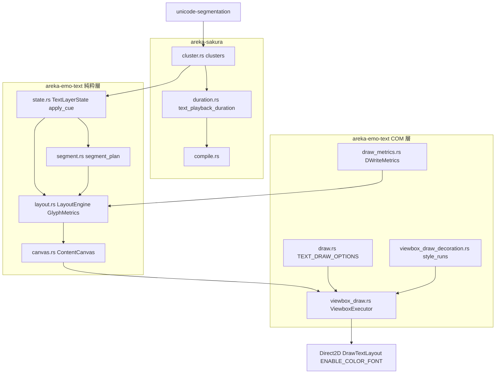
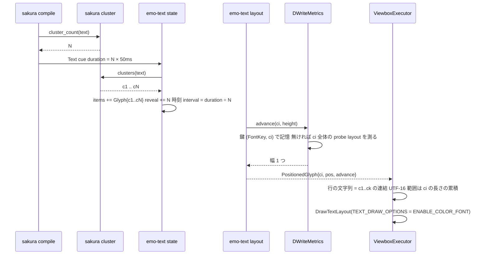

# Design Document: areka-P0-balloon-color-emoji

> 実測: 2026-09-29・本ブランチ `claude/areka-p0-balloon-color-emoji-a984b3`（ソースは main `65e28545` と同一）。コードは「何の定義か」（関数名・型名・定数名＋ファイルパス）で指し、行番号では指さない。
> 「設計の調査で確かめた事実」の節は、同日に一時的な検証プログラム（Direct2D と DirectWrite を直接呼び、6 形の絵文字 × 3 方式 × 2 書体を描いて読み戻す）で測った値である。手順と生の数値は `research.md`「設計フェーズの調査記録」に残す。検証プログラム自体はリポジトリに残さない。

## Overview

**Purpose**: ゴーストの台詞に書かれた絵文字を、areka のバルーンで**色つき**かつ**1 文字として**出す。指定フォントに無い絵文字は OS の代替フォント（Segoe UI Emoji）の色つきの字形で描き、文字の単位を Rust の `char` から Unicode の拡張書記素クラスタ（UAX #29・以下「クラスタ」）へ替える。

**Users**: ゴーストの作者（辞書に絵文字を書く）と利用者（台詞を読む）。開発者にとっては、完了 `areka-P0-emo-text-layer` の設計が「書記素クラスタ結合は M2 検討事項として記録」と先送りした宿題を本仕様が引き受ける（要件 9.2）。

**Impact**: 変更は 2 crate に閉じる。`areka-sakura` にクラスタの切り方の定義点を 1 つ置き（新モジュール `cluster.rs`・依存 `unicode-segmentation` を 1 行）、再生時間（`duration.rs`）がそれを使う。`areka-emo-text` は `TextItem::Glyph`／`PositionedGlyph` の中身と `GlyphMetrics` の署名を `char` から文字列へ替え、演出・計測・分かち書き・折り返し・範囲がすべてクラスタで数えるようにする。描画は本番（`viewbox_draw.rs`）と照合用（`draw.rs`）の 2 か所で `D2D1_DRAW_TEXT_OPTIONS_ENABLE_COLOR_FONT` を渡す。日本語・英字・指定フォントが持つ記号は 1 スカラー値＝1 クラスタなので、アイテム列も画素も変わらない（調査 R-4 でバイト等価を実測済み）。

### Goals

- 指定フォントに無い絵文字が色つきで描かれる（要件 1）。ただし色つきの字形を OS の代替が持たない形（Windows の国旗など）は今日どおり単色で、失敗にしない（1.5）。
- 6 形（ZWJ 列・国旗・肌色・異体字セレクタ・キーキャップ・結合文字）が、演出・計測・分かち書き・折り返し・選択肢の範囲・装飾の範囲・再生時間のすべてで 1 クラスタとして扱われる（要件 2〜4）。
- 絵文字を含まない台詞の画素・段数・間隔・折り返し・範囲が本仕様の前後で変わらない（要件 5）。
- 上記を GPU 無しの純粋層テストと、読み戻しを使う COM 層テストで判定する（要件 6）。代替フォントが無い機械では理由を出して**失敗**にする（6.7）。

### Non-Goals

- 国旗を色つきで出すこと。Windows 10/11 の Segoe UI Emoji は国旗の字形を持たず、DirectWrite は地域表示記号 2 つを単色の文字 2 つとして描く（調査 R-1／R-3）。areka は国旗を**数える単位としては 1 クラスタ**に扱い（2.2）、色は 1.5 の縮退（単色）に落ちる。
- COLR v1（グラデーション）の字形を自前で描くこと・字形の版を選ぶこと（裁定 3・OS の標準の描画に任せる）。
- 色つきの字形を `\f[color]`・ホバー色で染めること、そのスイッチ（裁定 2・要件 1.3）。
- タグでクラスタを割った台本（`👨\w1‍👩` のように ZWJ 列の途中に `\w`・`\f` を挟む）を 1 クラスタに繋ぐこと。クラスタは Text cue の文字列ごとに切るので、タグで割れば別々のアイテムになる（今日の 1 文字 1 アイテムと同じ扱い・SSP も同じ）。
- `\_u[0x…]`（裁定 7）・文字の影（裁定 8・`text-align-shadow-canon` 所有）・縦書きでの絵文字の向き（裁定 6）・`\_b[…,inline]`・wintf のウィジェット・Win32 メニューと `MessageBoxW` の文字。

## Boundary Commitments

### This Spec Owns

- **クラスタの切り方の定義点**: `crates/areka-sakura/src/cluster.rs`（新規）の `clusters(text) -> impl Iterator<Item = &str>` と `cluster_count(text)`。areka で「文字の単位」を数える場所はすべてここを通る（要件 2.1 の「同じ 1 つの切り方」の構造的な根拠）。
- **`areka-sakura` の再生時間の単位**: `duration.rs` の `text_playback_duration` を「クラスタ数 × `CHAR_NOMINAL_MS`」へ（値 50 ms は不変・裁定 5）。
- **`areka-emo-text` の文字の単位**: `TextItem::Glyph { text }`（`state.rs`）・`PositionedGlyph { text }`／`GlyphMetrics::advance(text: &str, …)`／`FixedMetrics`（`layout.rs`）・`glyph_style_advance`（`layout_styled.rs`）・`segment_advance_sum`（`layout_line_ops.rs`）・`segment_plan` の写像規則（`segment.rs`）・`DWriteMetrics` の計測とキャッシュの鍵（`draw_metrics.rs`）・`style_runs`（`viewbox_draw_decoration.rs`）・`segment_text_range`（`viewbox_draw.rs`）の UTF-16 長の数え方。
- **描画オプション**: `draw.rs` の定数 `TEXT_DRAW_OPTIONS`（＝`ENABLE_COLOR_FONT`・唯一の定義点）と、本番 `ViewboxExecutor::render_styled`・照合用 `DrawExecutor::render` がそれを渡すこと。テスト専用の差し替えの口 1 つ。
- **判定**: 純粋層の新テスト 2 ファイル・COM 層の新テスト 1 ファイル・既存テストの追随（`char` 前提の 3 件の改名を含む）・テスト支援の述語 2 つ（色つきの画素・代替フォントの実在）。
- **記録**: `doc/COMPAT_ARCHITECTURE.md` §8 の 1 行（要件 9.1）と、本仕様の文書における先送りの引き受けの記述（要件 9.2・本書がその記述）。

### Out of Boundary

- `crates/areka-emo-text/src/sink.rs`・`crates/areka/`・`crates/wintf/`（要件 7.1・変更 0 ファイル）。`actor.rs` は読むだけ（7.2）。
- 上流の字句解析（`areka-parsers` の `lex`）は台詞の本文をスカラー値で切らない（`Token::Text` に溜めてから flush）ことを実測で確認済み（`research.md` §2）。変更しない。
- 影・`\_u`・COLR の版・縦書きの向き・国旗の色（上の Non-Goals）。
- 完了 spec（`emo-text-layer`・`emo-text-viewbox`・`budoux-newline`・`text-decoration-canon`）の文書の書き換え。
- 選択肢の当たり判定（`choice.rs` の `annotate_lines`／`derive_hit_rows`）の式。序数と送り幅だけを見ているので、単位がクラスタになれば追随する（変更 0）。

### Allowed Dependencies

- `unicode-segmentation` 1.13.3（`Cargo.lock` に既在・`convert_case` ← `derive_more` ← `bevy_ecs` の推移依存と同じ版）。直接依存に足すのは **`crates/areka-sakura/Cargo.toml` の 1 行だけ**。`crates/areka-emo-text/Cargo.toml` は触らない（`areka-sakura` へ既に依存している）。`Cargo.lock` の差分は `areka-sakura` パッケージの依存の並びに 1 行増えるだけ。ライセンスは MIT/Apache-2.0 で、`cargo about` の告知には推移依存として既に載っている。
- `windows` 0.62.2 の `D2D1_DRAW_TEXT_OPTIONS_ENABLE_COLOR_FONT`（`Win32_Graphics_Direct2D`・ワークスペース既定の機能に含まれる）。wintf の `D2D1DeviceContextExt::draw_text_layout` は `options` をそのまま渡すので wintf は変えない。
- 既存の足場: `TextSurface::read_back`・`viewbox_draw_test_support.rs`（`Rig`・`opaque_count`）・`LiveDiffRig`・`DrawRig`・`FontCatalog::family_for`。
- 依存の向き（`lib.rs` の「依存方向（強制）」）: `areka-sakura → areka-emo-text`。切り方の定義点を `areka-sakura` に置くのはこの向きに沿う。純粋層（`state.rs`・`segment.rs`・`layout.rs` とその子）は `windows` を import しない（`lib.rs` の `pure_layer_modules_have_no_windows_imports`）。`areka_sakura::cluster` は `std` と `unicode-segmentation` しか使わない。

### Revalidation Triggers

- `TextItem::Glyph`／`PositionedGlyph` の中身の型（`Arc<str>`）を変える・`Copy` を戻す。
- `GlyphMetrics` の署名（`&str`）を変える。実装 3 つ（`FixedMetrics`・`DWriteMetrics`・テストの `LegacyPitchMetrics`）が同時に動く。
- `clusters()` の規則を UAX #29 以外へ変える（`areka-sakura` と `areka-emo-text` の数が食い違う）。
- `TEXT_DRAW_OPTIONS` を変える（`text-align-shadow-canon` の影の描き方の前提が変わる）。
- `segment.rs` の写像規則（クラスタは先頭バイトが属する塊へ）を変える（既存の分かち書きの結果が動く）。
- `unicode-segmentation` の版を上げる（Unicode の版が変わるとクラスタの切り方が変わりうる。既存の 1 スカラー値の文字は影響を受けない）。

## Architecture

### Existing Architecture Analysis

- **層規律**（`lib.rs`）: 純粋層（`state`・`layout`・`segment`・`canvas`・`viewbox`・`look`…）→ COM 層（`draw`・`surface`・`viewbox_draw`）→ 結線層（`sink`・`actor`）。純粋層は `windows` 非依存。本仕様は純粋層と COM 層だけを触り、結線層は読むだけ。
- **文字の単位の流れ**: `TextLayerState::apply_cue`（`state.rs`）が Text cue の文字列を `TextItem::Glyph` の列へ追記し、`RevealSchedule` に 1 アイテム 1 時刻を積む → `actor.rs` の `present_actor` が毎フレーム `segment_plan`（分かち書き時）と `LayoutEngine::layout_styled` を呼び、`PositionedGlyph` の列（`PositionedLine`）を作る → `ContentCanvas::from_layout`（`canvas.rs`）が行ローカルへ写す → `ViewboxExecutor::render_styled`（`viewbox_draw.rs`）が行ごとに `PositionedGlyph.text` を連結した文字列で `IDWriteTextLayout` を作り、`style_runs`／`segment_text_range` の UTF-16 範囲で装飾とホバーを付け、`draw_text_layout` で描く。
- **計測**: `DWriteMetrics::probe_advance`（`draw_metrics.rs`）は「1 文字の文字列」の未折返しレイアウトを作り、`get_cluster_metrics()` の `width` を合計する。引数が文字列になれば**そのままクラスタ全体を 1 度で測れる**。キャッシュの鍵は `(char, FontKey)`。
- **数える側は個数しか見ない**: `RevealSchedule::extend_chunk(glyph_count, …)`・`interval = duration / glyph_count`・`ChoiceSpan::glyph_range`・`push_current_style(actor, glyph_count)`・`annotate_lines`・`VisibleWindow` はすべてアイテムの個数と序数で動く。単位の変更は「アイテムを作る所」と「文字列へ戻す所」だけに現れる。
- **`Copy` の除去の波及**（実測）: 本番で `TextItem`／`PositionedGlyph` を値でコピーしているのは `layout.rs` の `layout_inner` の `match *item`・`layout_line_ops.rs` の `segment_advance_sum` の `if let … = *item`・`canvas.rs` の `from_layout` の `ch: g.ch` の 3 か所。`.copied()` は `Segment` にしか使われていない。
- **1,000 行の見張り**（`crates/log-capture-kit/tests/file_length_guard_test.rs`）: `layout.rs` 973・`actor.rs` 975・`viewbox_draw.rs` 882・`viewbox.rs` 866。新しい関数は兄弟ファイルへ置く（下の File Structure Plan）。

### Architecture Pattern & Boundary Map



**Architecture Integration**:

- **Selected pattern**: 既存の型と関数の**単位の型だけ**を替え、関数の並びと層の分担は変えない（`research.md` §3.1 の方針 C）。新しいコード（切り方の定義点・写像規則の純粋関数・テスト）は新しいファイルへ置き、1,000 行の見張りに近いファイルには関数を足さない。
- **Domain boundaries**: 「文字の単位を決める」のは `areka-sakura`（`cluster.rs`）だけ。`areka-emo-text` は決められた単位を運ぶ（`TextItem`）・測る（`GlyphMetrics`）・並べる（`LayoutEngine`）・描く（`ViewboxExecutor`）。DirectWrite のクラスタ計測は**幅を測るためだけ**に使い、単位の出どころにはしない。
- **Existing patterns preserved**: `RevealSchedule`・`SegmentPlan`・`WrapPlan`・`LineLayoutStore`（行の文字列で引く）・live-diff（本番と照合用の描画のバイト等価）・`fail_next_render`（`ViewboxExecutor` のテスト専用の口）と同型の差し替えの口。
- **New components rationale**: `cluster.rs` は「同じ 1 つの切り方」（2.1）を構造で保証するために要る。`segment.rs` の写像の純粋関数は、budouy の塊の境界がクラスタの途中に落ちる（調査 R-2 で実例あり）ときの規則を、budouy 無しで全分岐テストするために要る。
- **Steering compliance**: 層規律（純粋層は `windows` 非依存）・log-first（新しい失敗経路 0・`error!` の追加 0・記録の量は今日のまま）・1 フレーム遅らせない（状態の持ち方を変えて 0 フレームで解く）・メッセージボックスを出さない・1 ファイル 1,000 行以下。

### 設計の調査で確かめた事実（2026-09-29・Windows 11 Pro 26200・Segoe UI Emoji 同梱）

| 調査 | 事実 | 設計への反映 |
|---|---|---|
| R-7 代替フォント | `FontCatalog::family_for(&["Segoe UI Emoji"])` は `Some`（綴りはこのまま）。`Yu Gothic UI`・`游ゴシック` も引ける | 6.7 の実在判定はこの綴りで `family_for` を引く |
| R-1 クラスタ数 | UAX #29 と DirectWrite の `GetClusterMetrics` の数は、ZWJ 列・肌色・異体字セレクタ・キーキャップ・結合文字（か゚）・😀 で一致（各 1）。**国旗だけ DirectWrite は 2 クラスタ**（地域表示記号を 1 文字ずつ・単色）。3 方式・2 書体とも同じ | 単位は UAX #29（国旗も 1）。幅は `probe_advance` の合計式で国旗も正しく 1 つの値になる。照合用テストは DirectWrite のクラスタを UTF-16 長でクラスタごとに束ねて合計を比べる（§7 項目 5） |
| R-4 非絵文字の画素 | 「a あ 漢字 Hello ♥ 。 i W」を `NONE` と `ENABLE_COLOR_FONT` で描いた読み戻しは **バイト等価**（ＭＳ ゴシック・Yu Gothic UI × 3 方式 × 黒／赤の塗り） | 5.1・6.4 の証拠の取り方＝同じテストの中で描き比べる（golden の PNG は作らない） |
| R-3 前景色の層 | 😀・👨‍👩‍👧・👍🏻（両書体）と ❤️・☺️（Yu Gothic UI 基字）は、黒の塗りと赤の塗りで **読み戻しがバイト等価**＝塗りの色に従う層が無い | 1.3／4.5 の判定には 😀 と 👨‍👩‍👧 を使う。国旗・キーキャップは単色なので使わない |
| R-5 字形の版 | `ID2D1DeviceContext` は `ID2D1DeviceContext4`／`5` へ QI できる。😀 を 48px で描くと不透明画素の色が 1,000 通りを超える＝グラデーション（COLR v1）の字形が出ている | 裁定 3 のとおり受け入れる。Windows 10 では平面（COLR v0）になる見込みで、どちらでも 1.1／6.1 の判定（色つきの画素が出る）は同じ |
| R-6 縦書き | 縦書き 2 方式でも 😀・👨‍👩‍👧・👍🏻 に色つきの画素が出る（横書きと同じ形の数値） | 6.8 は 3 方式で回す。向きは判定しない（裁定 6） |
| R-8 異体字セレクタ | ❤️（U+2764 U+FE0F）・☺️（U+263A U+FE0F）は、基字を持つ **ＭＳ ゴシック（既定）では単色**、持たない **Yu Gothic UI では色つき**（Segoe UI Emoji へ回る）。どちらも 1 クラスタ・幅は 1 つ | 1.7 のとおり OS の判断に任せ、独自の規則を持たない。既定フォントの台詞では ❤️ は文字色に従うことを記録する |
| キーキャップ | 1️⃣ は両書体とも **単色**（`1` は基字体が持ち、U+20E3 は代替の単色の囲み）。1 クラスタ・幅 1 つ | 6.1 の色の判定には使わない。6.2 の単位・幅・折り返しの判定には使う |
| R-2 分かち書き | budouy は「か゚き゚く゚の話」を `か` `゚き゚く` `゚の` `話` に切る＝**結合文字の手前で塊の境界が落ちる**。絵文字 5 形を含む例文では境界はクラスタの外に落ちた | 写像規則「クラスタは先頭バイトが属する塊へ」を採り、純粋関数として切り出す。この例文は回帰の判定に使う（塊のクラスタ数は `[1, 2, 1, 1]`） |

### Technology Stack

| Layer | Choice / Version | Role in Feature | Notes |
|-------|------------------|-----------------|-------|
| 文字の単位 | `unicode-segmentation` 1.13.3（Unicode 17.0・UAX #29 拡張書記素クラスタ） | `clusters()` の実体（`graphemes(true)`） | `std` のみ・決定論・純粋層で使える。依存の追加は `areka-sakura/Cargo.toml` の 1 行 |
| 描画 | Direct2D `ID2D1DeviceContext::DrawTextLayout` ＋ `D2D1_DRAW_TEXT_OPTIONS_ENABLE_COLOR_FONT`（`windows` 0.62.2） | 色つきの字形 | Windows 8.1 以上で有効。COLR の版は OS 任せ |
| 計測 | DirectWrite `IDWriteTextLayout::GetClusterMetrics`（既存） | クラスタ全体の幅 | 単位の出どころにはしない |
| 分かち書き | budouy 0.2.2（既存） | 塊の境界（バイト位置） | 境界がクラスタの途中に落ちる場合の写像規則を本仕様が持つ |

## File Structure Plan

### 新規ファイル

```
crates/areka-sakura/src/
└── cluster.rs                         # クラスタの切り方の唯一の定義点（clusters / cluster_count）＋同ファイル内テスト（6 形・1 スカラー値・空）

crates/areka-emo-text/src/
├── state_cluster_tests.rs             # 純粋層テスト: Text/Choice cue が 6 形を 1 アイテムに追記・段・間隔・glyph_range（要件 2.2〜2.5・2.7・6.2 の「1 段」）
├── layout_cluster_tests.rs            # 純粋層テスト: FixedMetrics で 6 形が 1 幅・CharByChar と Segmented で割れない・幅超え・選択肢の当たり範囲・3 方式（要件 3.5・4.1〜4.4・4.7・6.2・6.8）
└── viewbox_draw_color_emoji_tests.rs  # COM 層テスト: 色つきの画素・NONE との描き比べ・ホバー中の絵文字・縦書き（要件 1.1〜1.6・4.5・5.1・6.1・6.3・6.4・6.7・6.8）
```

- `state_cluster_tests.rs`・`layout_cluster_tests.rs` は `state.rs`・`layout.rs` から `#[cfg(test)] #[path = …] mod …;` で繋ぎ、`lib.rs` の `PURE_SOURCES` に載せる（母数 56 → 58）。
- `viewbox_draw_color_emoji_tests.rs` は `viewbox_draw.rs` から同じ形で繋ぎ、`lib.rs` の `SOURCES_OUTSIDE_THE_PURE_SCAN` に載せる。
- `cluster.rs` は `crates/areka-sakura/src/lib.rs` に `pub mod cluster;` を 1 行足す。

### Modified Files

| ファイル | 今 | 変更 | 行数の見込み |
|---|---|---|---|
| `crates/areka-sakura/Cargo.toml` | — | `unicode-segmentation = "1.13.3"` を 1 行（理由の注釈つき） | — |
| `crates/areka-sakura/src/lib.rs` | — | `pub mod cluster;` | — |
| `crates/areka-sakura/src/duration.rs` | `text.chars().count()` | `cluster_count(text)`。説明文の「グリフ単位は Rust `char`」をクラスタへ。テスト `counts_chars_not_bytes_or_utf16_units` を改名（数値据え置き）＋ZWJ 列 1 つ＝50 ms の判定を 1 つ | 91 → 約 105 |
| `crates/areka-emo-text/src/state.rs` | `TextItem::Glyph { ch: char }`・`derive(Copy)`・`text.chars()` ×2 組 | `Glyph { text: Arc<str> }`・`Copy` を外す・`TextItem::glyph(&str)` 構築関数・`Text`／`Choice` の腕を `clusters(text)` に | 569 → 約 585 |
| `crates/areka-emo-text/src/layout.rs` | `GlyphMetrics::advance(ch: char, …)`・`advance_styled(ch: char, …)`・`FixedMetrics::advance` の `ch.is_ascii()`・`PositionedGlyph { ch: char }`＋`derive(Copy)`・`layout_inner` の `match *item` | 署名を `text: &str` へ・`text.is_ascii()`・`PositionedGlyph { text: Arc<str> }`＋`Copy` を外す・`match item`＋`text: text.clone()`。**関数を足さない**（行数は ±2 以内） | 973 → 973 前後 |
| `crates/areka-emo-text/src/layout_styled.rs` | `glyph_style_advance(ch: char, …)` | `text: &str` | 145 → 145 |
| `crates/areka-emo-text/src/layout_line_ops.rs` | `if let TextItem::Glyph { ch } = *item` | `= item` | 94 → 94 |
| `crates/areka-emo-text/src/segment.rs` | `run_text.push(*ch)`・`chunk.chars().count()` | `run_text.push_str(text)`＋アイテムのバイト長の列・新しい純粋関数 `assign_items_to_chunks`（写像規則）・説明文の「写像は無損失（`char` 前提）」を改める・テスト 3 つ（規則の全分岐＋か゚の回帰） | 371 → 約 430 |
| `crates/areka-emo-text/src/draw_metrics.rs` | `measure(ch: char, …)`・`probe_advance(ch: char, …)`・`cache: HashMap<(char, FontKey), f32>`・`degraded_advance(ch: char, …)` | `&str`・鍵を 2 段 `HashMap<FontKey, HashMap<Arc<str>, f32>>`（引くときに割り当てない）・`cached_probe_count` は内側の合計 | 392 → 約 405 |
| `crates/areka-emo-text/src/draw.rs` | `DrawExecutor::render` の `D2D1_DRAW_TEXT_OPTIONS_NONE`・`map(\|g\| g.ch)` | `pub(crate) const TEXT_DRAW_OPTIONS`（唯一の定義点）を新設し、照合用もそれを渡す・`map(\|g\| &*g.text)` | 750 → 約 758 |
| `crates/areka-emo-text/src/viewbox_draw.rs` | `render_styled` の `D2D1_DRAW_TEXT_OPTIONS_NONE`・`map(\|g\| g.ch)` ×3・`segment_text_range` の `g.ch.len_utf16()` | `self.text_draw_options()` を渡す（本番は `TEXT_DRAW_OPTIONS`・テストは `#[cfg(test)]` の欄）・`&*g.text`・`g.text.encode_utf16().count()`・テスト専用 `set_text_draw_options_for_test` | 882 → 約 900 |
| `crates/areka-emo-text/src/viewbox_draw_decoration.rs` | `style_runs` の `g.ch.len_utf16()` | `g.text.encode_utf16().count()` | 314 → 314 |
| `crates/areka-emo-text/src/canvas.rs` | `from_layout` の `ch: g.ch` | `text: g.text.clone()` | 758 → 758 |
| `crates/areka-emo-text/src/viewbox.rs` | `line_fingerprint` の `map(\|g\| g.ch)` ×2 | `&*g.text` | 866 → 866 |
| `crates/areka-emo-text/src/lib.rs` | `PURE_SOURCES` 56・`SOURCES_OUTSIDE_THE_PURE_SCAN` | 新設 3 ファイルを登記（母数 58）。層規律の説明文に「文字の単位は `areka_sakura::cluster`」を 1 行 | — |
| `crates/areka-emo-text/src/viewbox_draw_test_support.rs` | `glyph_items(s)`・`opaque_count` | `glyph_items` を `clusters(s).map(TextItem::glyph)` に・`colored_count(bytes)`（α≠0 かつ B/G/R のいずれか＞0）・`require_segoe_ui_emoji(&FontCatalog)`（無ければ理由つきで失敗） | 194 → 約 225 |
| `crates/areka-emo-text/src/draw_oracle_tests.rs` | `probe_advances_match_drawn_line_cluster_advances`（`widths.len() == text.chars().count()`） | クラスタ前提へ改名し、DirectWrite のクラスタを UTF-16 長でクラスタごとに束ねて合計を比べる形に。6 形の組を足す | 787 → 約 850 |
| `crates/areka-emo-text/src/viewbox_draw_live_diff_tests.rs` | 3 方式のシナリオ | 絵文字を含む台詞の組を 1 つ（3 方式） | 687 → 約 720 |
| `crates/areka-emo-text/src/viewbox_draw_scroll_retain_tests.rs` | `boot_items` | 絵文字を含む行を 1 つ足す（数える単位はクラスタ） | 330 → 約 340 |
| `crates/areka-emo-text/src/state_cue_apply_tests.rs` | `glyph_unit_is_rust_char` | `glyph_unit_is_grapheme_cluster` へ改名（「aあ🦆」＝3 は据え置き） | 669 → 669 |
| `crates/areka-emo-text/src/viewbox_draw_decoration_tests.rs` | `style_runs_group_consecutive_ids_and_count_utf16_units` | ZWJ 列（UTF-16 で 8 単位）の組を 1 つ足す | 544 → 約 555 |
| `crates/areka-emo-text/tests/kero_menu_capacity_test.rs` | `LegacyPitchMetrics::advance(ch: char, …)` | `text: &str` | 836 → 836 |
| `TextItem::Glyph { ch: '…' }`／`PositionedGlyph { ch: '…', … }` の直書き（テスト 24 ファイル＋`tests/` 2 ファイル・約 180 か所） | `char` | `TextItem::glyph("…")`／`text: "….into()`（機械的な 1:1 の置換・行数不変）。テストの局所の支援 `glyph_items`／`glyphs`（`draw_oracle_tests.rs`・`layout_styled_tests.rs`・`segment.rs` のテスト・`layout_test_support.rs`・`viewbox_draw_decoration_tests.rs` の `glyph(c, style)`）も `clusters(s).map(TextItem::glyph)`／`TextItem::glyph` 経由へ | — |
| `doc/COMPAT_ARCHITECTURE.md` | §8 沈黙ルール対応表 | 1 行（要件 9.1） | — |

- **1,000 行の見張り**: 上の見込みで 1,000 行を超えるファイルは無い。`layout.rs`（973）と `actor.rs`（975・非接触）には関数を足さない。実装で `layout.rs` に行を足す必要が出たら、新しい関数は `layout_styled.rs`（145）か `layout_line_ops.rs`（94）へ置く。
- `draw_format_metrics_tests.rs` の `DRAW_FACADE_SOURCES`（`draw*.rs` の本番ファイルの一覧）は変わらない（`draw_*.rs` を新設しない）。

## System Flows



- **単位は 1 度だけ決まる**: `clusters(text)` を呼ぶのは `state.rs` の `apply_cue`（Text／Choice）と `duration.rs` の 2 か所で、下流（分かち書き・配置・描画）はアイテム列を数えるだけ。同じ台詞に対して再生時間（cue の `duration`）と段数（アイテム数）が同じ N から出るので、出す間隔は `duration ÷ N`＝クラスタ 1 つ 50 ms になる（2.5・2.6）。
- **分かち書きの写像**（`segment_plan`）: run の文字列＝アイテムの文字列の連結。budouy の塊の境界（バイト位置）に対し、各アイテムは**先頭バイトが属する塊**に入る。塊の末尾がアイテムの途中に落ちたら、そのアイテムは前の塊に入り、次の塊は 1 つ短くなる。空になった塊は生まない。塊の長さの合計＝run のアイテム数（被覆・無損失）。budouy が切った位置より前で切ることは無いので、クラスタの途中に境界が無い台詞（今日の日本語）の結果は 1 ビットも変わらない。
- **幅超え**（4.3）: `layout_inner` の「行頭の 1 アイテムはどちらの上限を超えても置く」の規則はアイテム単位なので、アイテム＝クラスタになれば何もしなくてよい。

## Requirements Traceability

| Requirement | Summary | Components | Interfaces | Flows |
|---|---|---|---|---|
| 1.1 | 指定フォントに無い絵文字は色つき | `TEXT_DRAW_OPTIONS`・`ViewboxExecutor::render_styled` | `draw_text_layout(…, TEXT_DRAW_OPTIONS)` | 描画 |
| 1.2 | 指定フォントが持つ字形は文字色 | 既存の書式生成（`create_text_format`・`SetFontFallback` 0 件） | — | 調査 R-3（♥ U+2665 は単色のまま） |
| 1.3 | `\f[color]`・ホバー色・無効表示の混色を重ねない | Direct2D の色つきの字形は塗りに従わない（調査 R-3） | `apply_color_ranges`・ホバーの `SetDrawingEffect` は変更なし | `viewbox_draw_color_emoji_tests.rs` |
| 1.4 | 自前の描き手を持たない | 標準の `DrawTextLayout` のみ | — | — |
| 1.5 | 色つきが無ければ単色・失敗にしない | Direct2D の既定（国旗・キーキャップは単色で出る・調査 R-1／R-3） | 新しい失敗経路 0 | — |
| 1.6 | 3 方式で色つき | `DirectionRecipe` は変更なし・描画の呼出は方向に依らず 1 か所 | — | 調査 R-6・6.8 |
| 1.7 | 異体字セレクタは OS の判断・実測を記録 | 独自の代替の規則 0 | — | 調査 R-8（本書に記録） |
| 2.1 | すべてで同じ 1 つの切り方 | `areka_sakura::cluster::clusters`（唯一の定義点） | `clusters(&str)` | 単位は 1 度だけ決まる |
| 2.2 | 6 形を 1 クラスタ | UAX #29（`graphemes(true)`） | — | `cluster.rs` テスト・`state_cluster_tests.rs` |
| 2.3 | 1 スカラー値は今日どおり | UAX #29 で 1 スカラー値＝1 クラスタ | — | `cluster.rs` テスト（「aあ🦆」＝3） |
| 2.4 | 部品を途中の段で見せない | `TextItem::Glyph { text }`＝1 アイテム 1 クラスタ・`RevealSchedule` は 1 アイテム 1 時刻 | — | `state_cluster_tests.rs` |
| 2.5 | 間隔＝時間 ÷ クラスタ数 | `apply_cue` の `interval = duration / glyph_count`（`glyph_count` はクラスタ数） | — | 同上 |
| 2.6 | 再生時間はクラスタ 1 つ 50 ms | `text_playback_duration`＝`cluster_count × CHAR_NOMINAL_MS` | — | `duration.rs` テスト |
| 2.7 | 選択肢もクラスタで数える | `apply_cue` の `Choice` の腕・`ChoiceSpan::glyph_range` | — | `state_cluster_tests.rs` |
| 3.1 | 幅＝クラスタ全体を描いた幅 | `DWriteMetrics::probe_advance(text: &str)`（クラスタ全体の未折返しレイアウトの `width` の合計） | `GlyphMetrics::advance(text, height)` | 計測 |
| 3.2 | 計測と描いた行の一致（3 方式） | `draw_oracle_tests.rs` の改めた判定（DirectWrite のクラスタを束ねて比較） | — | 調査 R-1 |
| 3.3 | 2 度目は同じ値（鍵はクラスタ全体） | `DWriteMetrics` の 2 段のキャッシュ `HashMap<FontKey, HashMap<Arc<str>, f32>>` | `measure(text, key, format)` | `draw_format_metrics_tests.rs` の既存の計測回数の判定に 1 組 |
| 3.4 | `\_l` の基準は絵文字 1 つ分 | `TextItem::CursorMove` は序数を消費しない・基点は送り幅の合計（変更 0） | — | `layout_cluster_tests.rs` |
| 3.5 | 縮退でもクラスタ 1 つの幅 | `FixedMetrics::advance(text.is_ascii())`・`degraded_advance(text: &str)` | — | `layout_cluster_tests.rs` |
| 4.1 | `CharByChar` はクラスタの境界でだけ切る | `layout_inner` はアイテム単位（変更 0） | — | `layout_cluster_tests.rs` |
| 4.2 | 分かち書きでも途中で切らない | `segment_plan` の写像規則（`assign_items_to_chunks`） | `SegmentPlan` は序数（変更 0） | `segment.rs` テスト・`layout_cluster_tests.rs` |
| 4.3 | 幅超えのクラスタは割らずに 1 行へ | `layout_inner` の行頭配置の規則（変更 0） | — | `layout_cluster_tests.rs` |
| 4.4 | 当たり範囲は先頭の位置〜末尾の右端 | `annotate_lines`（先頭の `inline_pos`〜末尾の `inline_pos + advance`・変更 0） | — | `layout_cluster_tests.rs` |
| 4.5 | ホバー中も色つきの字形は自分の色 | `segment_text_range` の UTF-16 長をクラスタから取る・色つきの字形は塗りに従わない（R-3） | — | `viewbox_draw_color_emoji_tests.rs` |
| 4.6 | 装飾の範囲はクラスタの境界 | `style_runs` の UTF-16 長をクラスタから取る | `DWRITE_TEXT_RANGE` | `viewbox_draw_decoration_tests.rs` |
| 4.7 | 縦書き 2 方式でも同じ | 純粋層の配置は方式ごとに同じアイテム単位 | — | `layout_cluster_tests.rs`（3 方式） |
| 5.1 | 非絵文字の画素は不変 | 調査 R-4（`NONE`＝`ENABLE_COLOR_FONT` のバイト等価）・1 スカラー値＝1 アイテム | `set_text_draw_options_for_test` | `viewbox_draw_color_emoji_tests.rs`（6.4） |
| 5.2 | 段数・間隔・再生時間・折り返し・範囲・`\_l` が不変 | `clusters()` は 1 スカラー値の文字を今日の `chars()` と同じ列に切る | — | 既存の純粋層テスト全部が据え置きで通る |
| 5.3 | 既存のバイト等価の判定は不変 | 本番と照合用に同じ `TEXT_DRAW_OPTIONS` | — | live-diff・blit・PNG の既存テスト（期待値を書き換えない） |
| 5.4 | 失敗の記録と戻り値は今日のまま | `clusters()` は失敗しない・`probe_advance` の `error!`＋縮退値は変更 0 | — | — |
| 6.1 | 色つきの画素が出る | `colored_count`（`viewbox_draw_test_support.rs`） | — | `viewbox_draw_color_emoji_tests.rs` |
| 6.2 | 6 形が 1 段・1 幅・割れない | `state_cluster_tests.rs`・`layout_cluster_tests.rs`・`draw_oracle_tests.rs` | — | — |
| 6.3 | 選択肢の絵文字の当たり範囲とホバー色 | `layout_cluster_tests.rs`（当たり範囲）・`viewbox_draw_color_emoji_tests.rs`（ホバー） | — | — |
| 6.4 | 非絵文字の画素の対照 | 同じテストの中で `NONE`／`ENABLE_COLOR_FONT` を描き比べる | `set_text_draw_options_for_test` | `viewbox_draw_color_emoji_tests.rs` |
| 6.5 | blit と live-diff に絵文字の組 | `viewbox_draw_live_diff_tests.rs`・`viewbox_draw_scroll_retain_tests.rs` | — | — |
| 6.6 | 既存 3 件の改名 | `glyph_unit_is_grapheme_cluster`・`counts_clusters_not_bytes_or_utf16_units`・`probe_advances_match_drawn_line_advances_per_cluster` | — | 判定の数値は据え置き |
| 6.7 | 代替フォントの実在を先に判定・無ければ失敗 | `require_segoe_ui_emoji` | `FontCatalog::family_for` | 色を判定する全テストの先頭で呼ぶ |
| 6.8 | 3 方式で 6.2 | 純粋層テストと照合用テストの方式の並び | — | — |
| 7.1 | `sink.rs`・`crates/areka`・`crates/wintf` に触れない | File Structure Plan | — | — |
| 7.2 | `actor.rs` は読むだけ | 同上（非接触） | — | — |
| 7.3 | `Cargo.toml` は依存 1 行まで | `crates/areka-sakura/Cargo.toml` の 1 行 | — | — |
| 7.4 | 1 フレーム遅らせない | 状態の持ち方（アイテム＝クラスタ）で 0 フレーム | — | — |
| 8.1 | 毎フレーム・毎文字の記録を増やさない | `clusters()`・`assign_items_to_chunks` は記録を出さない | — | — |
| 8.2 | 縮退は今日どおり `warn!` | `DWriteMetrics::advance` の `warn!`・`probe_advance` の `error!` は変更 0 | — | — |
| 9.1 | 沈黙ルール対応表へ 1 項目 | `doc/COMPAT_ARCHITECTURE.md` §8 | — | — |
| 9.2 | 先送りの引き受けを本仕様の文書に | 本書 Overview・要件 Introduction | — | 完了 spec は書き換えない |
| 10.1 | 1 本のまま進める（規模 M） | 本書全体 | — | — |
| 10.2 | 色に従わない・スイッチ無し | 1.3 と同じ | — | — |
| 10.3 | 字形の版は OS 任せ | 調査 R-5 を記録 | — | — |
| 10.4 | UAX #29・出どころは設計で決める | `unicode-segmentation`（下の「裁定と設計判断」1〜3） | — | — |
| 10.5 | 1 クラスタ 50 ms | 2.6 と同じ | — | — |
| 10.6 | 縦書きの向きは判定しない | 6.8 は色・段・割れないの 3 点だけ | — | — |
| 10.7 | `\_u` を扱わない | 経路を足さない | — | — |
| 10.8 | 影の申し送りが在ることを保つ | `text-align-shadow-canon/brief.md` 末尾「`balloon-color-emoji` からの申し送り（2026-09-29）」（3 行・実在を確認済み） | — | 本仕様の作業 0 |
| 10.9 | 既存テストは改名して残す | 6.6 と同じ | — | — |

## Components and Interfaces

| Component | Domain/Layer | Intent | Req Coverage | Key Dependencies (P0/P1) | Contracts |
|---|---|---|---|---|---|
| `cluster`（`areka-sakura/src/cluster.rs`・新規） | sakura・純粋 | クラスタの切り方の唯一の定義点 | 2.1〜2.3, 10.4 | `unicode-segmentation`（P0） | Service |
| `duration::text_playback_duration` | sakura・純粋 | クラスタ 1 つ 50 ms | 2.6, 10.5 | `cluster`（P0） | Service |
| `TextItem`／`TextLayerState::apply_cue`（`state.rs`） | emo-text 純粋 | 1 アイテム 1 クラスタの追記正本 | 2.1, 2.4, 2.5, 2.7, 7.4 | `cluster`（P0） | State |
| `GlyphMetrics`／`FixedMetrics`／`PositionedGlyph`／`LayoutEngine`（`layout.rs`＋子） | emo-text 純粋 | クラスタ単位の計測の口と配置 | 3.4, 3.5, 4.1, 4.3, 4.4, 4.7 | `TextItem`（P0） | Service |
| `segment_plan`／`assign_items_to_chunks`（`segment.rs`） | emo-text 純粋 | budouy の塊をクラスタの序数へ写す規則 | 4.2 | budouy（P0） | Service |
| `DWriteMetrics`（`draw_metrics.rs`） | emo-text COM | クラスタ全体の幅の計測と記憶 | 3.1, 3.2, 3.3, 5.4, 8.2 | `GlyphMetrics`（P0）・DirectWrite（P0） | Service |
| `TEXT_DRAW_OPTIONS`／`DrawExecutor`（`draw.rs`） | emo-text COM | 描画オプションの唯一の定義点・照合用の描画 | 1.1, 5.3 | Direct2D（P0） | State |
| `ViewboxExecutor`／`segment_text_range`（`viewbox_draw.rs`） | emo-text COM | 本番の描画・ホバーの範囲 | 1.1, 1.6, 4.5, 5.1, 6.4 | `TEXT_DRAW_OPTIONS`（P0） | Service |
| `style_runs`（`viewbox_draw_decoration.rs`） | emo-text COM | 装飾の UTF-16 範囲 | 4.6 | `PositionedGlyph`（P0） | Service |
| テスト支援（`viewbox_draw_test_support.rs`） | テスト | 色つきの画素・代替フォントの実在 | 6.1, 6.7 | `FontCatalog`（P1） | — |
| 記録（`doc/COMPAT_ARCHITECTURE.md` §8） | 文書 | 裁量の登記 | 9.1 | — | — |

### areka-sakura

#### `cluster`（`crates/areka-sakura/src/cluster.rs`・新規）

| Field | Detail |
|---|---|
| Intent | 台詞の文字列を拡張書記素クラスタの列へ切る、areka で唯一の定義点 |
| Requirements | 2.1, 2.2, 2.3, 10.4 |

**Responsibilities & Constraints**
- `unicode-segmentation` の `UnicodeSegmentation::graphemes(text, true)` を包むだけ。絵文字の形（ZWJ・国旗・肌色・異体字セレクタ・キーキャップ）を個別に扱う分岐を持たない（裁定 4）。
- 失敗しない・記録を出さない・`std` と `unicode-segmentation` 以外に依存しない（純粋）。
- クラスタは Text cue の文字列ごとに切る。cue をまたいで繋がない（Non-Goals）。

**Dependencies**
- Outbound: `unicode-segmentation` 1.13.3 — `graphemes(true)`（P0）
- Inbound: `duration.rs`（再生時間）・`areka-emo-text/src/state.rs`（アイテムの追記）・テスト支援 `glyph_items`（P0）

**Contracts**: Service [x]

##### Service Interface
```rust
/// 拡張書記素クラスタ（UAX #29）の列。空文字列は空の列。
pub fn clusters(text: &str) -> impl Iterator<Item = &str>;
/// `clusters(text).count()`。
pub fn cluster_count(text: &str) -> usize;
```
- Preconditions: なし（任意の `&str`）。
- Postconditions: 各要素は非空・連結は入力と一致（無損失）・1 スカラー値の文字は 1 要素（`chars()` と同じ列）・同じ入力に同じ列（決定論・OS の版に依らない）。
- Invariants: 要素の境界はスカラー値の境界に一致する。

**Implementation Notes**
- Validation: 同ファイル内テストで 6 形（要件 2.2）がそれぞれ 1 要素・「aあ🦆」が 3 要素・「か゚」が 1 要素・空文字列が 0 要素・連結が入力と一致することを判定する。
- Risks: `unicode-segmentation` の版を上げると Unicode の版が変わる。既存の 1 スカラー値の文字は影響を受けない（Revalidation Triggers）。

#### `duration::text_playback_duration`（`crates/areka-sakura/src/duration.rs`）

- 変更は `text.chars().count()` → `cluster_count(text)` の 1 か所と説明文。`CHAR_NOMINAL_MS` の名前・値（50）・定義点は据え置く（裁定 5・「1 文字」の名目時間の単位がクラスタになるだけ）。
- テスト: `counts_chars_not_bytes_or_utf16_units` → `counts_clusters_not_bytes_or_utf16_units`（「aあ🦆」＝3 は据え置き・6.6）。ZWJ 列 1 つ＝`Duration::from_millis(1 * CHAR_NOMINAL_MS)` の判定を 1 つ足す（2.6）。

### areka-emo-text 純粋層

#### `TextItem`／`TextLayerState::apply_cue`（`crates/areka-emo-text/src/state.rs`）

| Field | Detail |
|---|---|
| Intent | 追記正本のアイテムを 1 クラスタ 1 つにする |
| Requirements | 2.1, 2.4, 2.5, 2.7, 7.4 |

**Contracts**: State [x]

##### State Management
```rust
#[derive(Clone, Debug, PartialEq)]          // Copy を外す
pub enum TextItem {
    /// 1 クラスタ（非空・UAX #29 拡張書記素クラスタ）。
    Glyph { text: std::sync::Arc<str> },
    LineBreak { ratio: f32 },
    CursorMove { /* 既存のまま */ },
}
impl TextItem {
    /// 1 クラスタからアイテムを作る（テストの直書きもこれを使う）。
    /// 前提「非空・ちょうど 1 クラスタ」は `debug_assert!(cluster_count(text) == 1)` で検査する
    /// （テストの直書きの誤り＝2 クラスタを 1 アイテムに詰める等をデバッグビルドで捕まえる。本番は失敗しない）。
    pub fn glyph(text: &str) -> TextItem;
}
```
- `apply_cue` の `Text`／`Choice` の腕: `let clusters: Vec<&str> = clusters(text).collect(); let glyph_count = clusters.len();` として、`items.extend(clusters.iter().map(|c| TextItem::glyph(c)))`。`interval`・`extend_chunk`・`push_current_style`・`glyph_range` は `glyph_count` を使う既存の式のまま。
- 中身を `Arc<str>` にする理由（`research.md` 決定 D1）: (a) `PositionedGlyph` は毎フレーム `TextItem` から作り直される（`actor.rs` の `present_actor` → `LayoutEngine::layout_styled`）ので、写しが割り当てを起こさない型にする（`Box<str>` は毎フレーム割り当てる）。(b) `TextLayerState` はテスト `tests/pipeline_test.rs` の `run_channel_pipeline` がスレッドの `join` 越しに値で返すので `Send` でなければならない（`Rc<str>` では通らない）。`Arc<str>` は `From<&str>`・`Deref<Target = str>`・`Borrow<str>`・`Hash`・`Eq` を持ち、比較は中身で行われる。
- 上限つきの内蔵文字列（`Copy` を保つ案）は採らない: UAX #29 は結合文字の連なりに上限を置かず、RGI の最長の絵文字列（10 スカラー値≒35 バイト）は 32 バイトを超える。上限超えの縮退と記録が増えるだけで益が無い。
- Persistence & consistency: `RevealSchedule` は 1 アイテム 1 時刻のまま。クラスタの部品が途中の段で見えることは構造的に起きない（2.4）。
- Concurrency strategy: UI スレッド専有（既存）。`Arc` は共有のためではなく `Send` と無割り当ての写しのため。

#### `GlyphMetrics`／`FixedMetrics`／`PositionedGlyph`／`LayoutEngine`（`crates/areka-emo-text/src/layout.rs`・`layout_styled.rs`・`layout_line_ops.rs`）

| Field | Detail |
|---|---|
| Intent | 計測の口と配置をクラスタ単位に |
| Requirements | 3.4, 3.5, 4.1, 4.3, 4.4, 4.7 |

**Contracts**: Service [x]

##### Service Interface
```rust
pub trait GlyphMetrics {
    /// クラスタ 1 つの行内送り幅（image px）。
    fn advance(&self, text: &str, font_height: f32) -> f32;
    fn line_pitch(&self, font_height: f32) -> f32;
    fn line_box_height(&self, font_height: f32) -> f32;
    fn advance_styled(&self, text: &str, look: &TextLook) -> f32 { self.advance(text, look.height) }
}
impl GlyphMetrics for FixedMetrics {
    /// 縮退の見積もり: ASCII だけのクラスタ＝半角・それ以外＝全角 1 つ分（部品の数で増やさない・3.5）。
    fn advance(&self, text: &str, font_height: f32) -> f32 { if text.is_ascii() { font_height / 2.0 } else { font_height } }
}
#[derive(Clone, Debug, PartialEq)]          // Copy を外す
pub struct PositionedGlyph { pub text: std::sync::Arc<str>, pub inline_pos: f32, pub advance: f32, pub style: StyleId }
```
- `layout_inner`: `match *item` → `match item`、`TextItem::Glyph { text } =>` の腕で `glyph_style_advance(text, …)` を呼び、`PositionedGlyph { text: text.clone(), … }` を積む。折り返し（`WrapPlan::CharByChar`／`Segmented`）・幅超え・可視 prefix・保留フラッシュの規則は**変えない**（アイテム単位の規則がそのままクラスタ単位になる・4.1／4.3）。
- `layout_styled.rs` の `glyph_style_advance(text: &str, …)`・`layout_line_ops.rs` の `segment_advance_sum` の `if let TextItem::Glyph { text } = item`。
- 実装 3 つ（`FixedMetrics`・`DWriteMetrics`・`tests/kero_menu_capacity_test.rs` の `LegacyPitchMetrics`）が同時に追随する。
- `layout.rs` には関数を足さない（1,000 行の見張り）。

**Implementation Notes**
- Validation（`layout_cluster_tests.rs`・純粋）: `FixedMetrics` で 6 形の `advance` が `font_height`（1 つ分）・`CharByChar` の狭い行で 6 形が行の途中で割れない（各行の先頭が必ずクラスタの先頭）・手組みの `SegmentPlan` で塊が長すぎて文字の規則へ戻っても割れない・行幅より広いクラスタが 1 行に置かれる・選択肢 `glyph_range` が絵文字 1 つを覆うとき `annotate_lines` の `inline_range` の幅が `advance` と一致・絵文字の後ろの `CursorMove` の基点が `advance` 1 つ分だけ進む・以上を 3 方式で回す。
- Risks: `PositionedGlyph` の `Copy` を外すと、テストの直書き（6 ファイル）が `text: "…".into()` になる。機械的。

#### `segment_plan`／`assign_items_to_chunks`（`crates/areka-emo-text/src/segment.rs`）

| Field | Detail |
|---|---|
| Intent | budouy の塊の境界（バイト位置）をアイテム（クラスタ）の序数へ写す規則 |
| Requirements | 4.2 |

**Contracts**: Service [x]

##### Service Interface
```rust
/// run の各アイテムを「先頭バイトが属する塊」へ割り当て、空でない塊を序数の列にする（純粋・budouy 非依存）。
/// `chunk_byte_lens`: budouy の各塊のバイト長（連結が run の文字列と一致する前提）。
/// `item_byte_lens`: run の各アイテムの文字列のバイト長（序数順）。
fn assign_items_to_chunks(chunk_byte_lens: &[usize], item_byte_lens: &[usize], run_start: usize) -> Vec<Segment>;
```
- 規則: アイテムの先頭バイト位置 `s` に対し、`s < 塊の累積末尾` を満たす最初の塊へ入れる。塊の末尾がアイテムの途中に落ちればそのアイテムは前の塊に入る（境界を後ろへ寄せる）。数が 0 の塊は `Segment` を生まない。塊の累積末尾を超える位置のアイテム（前提が崩れたときだけ）は最後の塊へ入れる（記録は出さない・空振りしない）。
- Postconditions: 生成した `Segment` は昇順・互いに素・run の全アイテムを 1 度ずつ被覆・各 `len ≥ 1`。
- `segment_plan` は `run_text.push_str(text)` と `run_item_lens.push(text.len())` を積み、`flush_run` で `parser.parse(run_text)` の各塊の `len()` を `chunk_byte_lens` にして本関数を呼ぶ。`Segment`・`SegmentPlan`・`segment_starting_at` は変えない。
- 説明文の「グリフ単位は Rust `char`（M1 は書記素クラスタ結合なし）ゆえ写像は無損失」を、上の規則で無損失になる旨へ改める。

**Implementation Notes**
- Validation（同ファイル内テスト）: `assign_items_to_chunks` の分岐を手組みの数で全網羅（境界が一致・境界がアイテムの途中・塊が丸ごとアイテムの中に入って空になる・末尾のはみ出し）。budouy の実物では「か゚き゚く゚の話」（クラスタ 5・塊 4）で `len` の列が `[1, 2, 1, 1]` になることを固定（調査 R-2 の再現）。既存の `representative_japanese_boundaries_match_budouy_chunks` は据え置きで通る（塊の境界がクラスタの途中に無い日本語は不変）。
- Risks: budouy の版を上げると塊が変わりうる（既存と同じ性質）。

#### `ContentCanvas::from_layout`（`canvas.rs`）・`line_fingerprint`（`viewbox.rs`）

- `from_layout` は `text: g.text.clone()`。`line_fingerprint` は `map(|g| &*g.text).collect::<String>()`。行の指紋（文字列）とキャッシュの鍵（`LineLayoutStore` の `text`）は連結した文字列なので、値は今日と同じ。

### areka-emo-text COM 層

#### `DWriteMetrics`（`crates/areka-emo-text/src/draw_metrics.rs`）

| Field | Detail |
|---|---|
| Intent | クラスタ全体の幅を 1 度で測り、クラスタ全体を鍵に記憶する |
| Requirements | 3.1, 3.2, 3.3, 5.4, 8.2 |

**Contracts**: Service [x]

##### Service Interface
```rust
/// 「クラスタと計測鍵」の組で記憶しながら測る（引くときに割り当てない・成功値だけを記憶）。
fn measure(&self, text: &str, key: &FontKey, format: &IDWriteTextFormat) -> Option<f32>;
/// クラスタ全体の未折返し probe layout の cluster metrics の width 合計。
fn probe_advance(&self, text: &str, format: &IDWriteTextFormat) -> Result<f32, TextLayerError>;
fn degraded_advance(text: &str, height: f32) -> f32;   // FixedMetrics と同式（text.is_ascii()）
cache: RefCell<HashMap<FontKey, HashMap<Arc<str>, f32>>>
```
- `probe_advance` の本文は `HSTRING::from(text)` 以外変えない。DirectWrite が 1 クラスタに整形する形はそのまま 1 つの `width`、国旗のように 2 クラスタに整形する形は合計＝行の中で占める幅になる（調査 R-1・行の中でも同じ 2 つの幅）。
- キャッシュ: 外側の鍵 `FontKey`・内側の鍵 `Arc<str>`。引くときは `cache.get(key)?.get(text)`（`Arc<str>: Borrow<str>` で割り当て無し）。入れるときだけ `Arc::from(text)` を 1 回作る。`cached_probe_count` は内側の `len` の合計。
- 失敗経路: 今日のまま（`probe_advance` の `error!`＋縮退値・縮退値は記憶しない・`advance` の `font_height` 不一致は `warn!`）。新しい記録の種類は作らない（8.2）。

**Implementation Notes**
- Validation: `draw_format_metrics_tests.rs` の「同じ組の再計測が probe を増やさない」判定に、クラスタの組（👨‍👩‍👧 を 2 度）を 1 つ足す（3.3）。`draw_oracle_tests.rs` の改めた判定で 6 形 × 3 方式の幅の一致を見る（3.2）。
- Risks: 色つきの字形の送り幅は単色と同じ（COLR の層は基の字形の送り幅を共有）——調査 R-1 の幅は `ENABLE_COLOR_FONT` に依らず同じ値で、描画のオプションは計測に影響しない。

#### `TEXT_DRAW_OPTIONS`／`DrawExecutor`（`crates/areka-emo-text/src/draw.rs`）

- `pub(crate) const TEXT_DRAW_OPTIONS: D2D1_DRAW_TEXT_OPTIONS = D2D1_DRAW_TEXT_OPTIONS_ENABLE_COLOR_FONT;` を `draw.rs` に置く（COM 層のファサード・`viewbox_draw.rs` はここから import する向き）。説明文に「影の複製はこの定数を使わず単色の塗りで描く（`text-align-shadow-canon`）」を書く。
- `DrawExecutor::render`（`#[cfg(test)]`・照合用）は `draw_text_layout(…, TEXT_DRAW_OPTIONS)`。本番と同じ定数を渡すことで live-diff のバイト等価（5.3・6.5）が成り立つ。

#### `ViewboxExecutor`／`segment_text_range`（`crates/areka-emo-text/src/viewbox_draw.rs`）

| Field | Detail |
|---|---|
| Intent | 本番の描画に色つきフォントの設定を入れ、ホバーの範囲をクラスタで数える |
| Requirements | 1.1, 1.6, 4.5, 5.1, 6.4 |

**Contracts**: Service [x]

##### Service Interface
```rust
impl ViewboxExecutor {
    /// 本番は TEXT_DRAW_OPTIONS。テストビルドだけ欄の値（既定は同じ定数）。
    fn text_draw_options(&self) -> D2D1_DRAW_TEXT_OPTIONS;
    /// テスト専用: 6.4 の描き比べのために NONE へ差し替える（fail_next_render と同型の口）。
    #[cfg(test)] pub(crate) fn set_text_draw_options_for_test(&mut self, options: D2D1_DRAW_TEXT_OPTIONS);
}
#[cfg(test)] text_draw_options: D2D1_DRAW_TEXT_OPTIONS,   // ViewboxExecutor の欄（new / new_shared で TEXT_DRAW_OPTIONS）
```
- `render_styled` の `draw_text_layout(d.origin, &d.layout, &brush, self.text_draw_options())`。行の文字列は `run.glyphs.iter().map(|g| &*g.text).collect::<String>()`（3 か所）。
- `segment_text_range`: `let units = g.text.encode_utf16().count() as u32;`。中心判定（`inline_pos + advance / 2`）は変えない。範囲の境界がクラスタの境界に揃うので、ホバーの `SetDrawingEffect` はクラスタの途中で切り替わらない（4.5）。色つきの字形は塗りに従わないので、ホバー中も自分の色で出る（調査 R-3）。
- 差し替えの口は描画オプションだけを変え、行のキャッシュ（`LineLayoutStore`）・planner・面の役割交換には触れない。**最初の描画の前に 1 度だけ呼ぶ**。同じ executor で描き直しても対照にはならない: `ScrollPlanner::plan_with_overhangs` は前回の確定行（`prev_lines`）との指紋（`line_fingerprint`＝文字列・装飾・ホバーの序数）の差分から描き直す行を決め、描画オプションは指紋に無いので、同じ canvas の 2 度目は何も描かれず前の面が残る。対照は **executor と面を別々に作って**取る（`viewbox_draw_choice_hover_tests.rs` の `exec_glyph`／`exec_choice` の 2 台と同じ形）。

**Implementation Notes**
- Validation（`viewbox_draw_color_emoji_tests.rs`）は下の Testing Strategy。
- Risks: `#[cfg(test)]` の欄は非テストビルドに存在しない（`fail_next_render` と同じ）。`text_draw_options()` が `cfg` で 2 通りの本文を持つ点は、定数へ戻る側が本番であることを説明文に書く。

#### `style_runs`（`crates/areka-emo-text/src/viewbox_draw_decoration.rs`）

- `let units = g.text.encode_utf16().count() as u32;`。`apply_font_ranges`・`apply_color_ranges` は範囲を受け取るだけで変えない（4.6）。
- Validation: `style_runs_group_consecutive_ids_and_count_utf16_units` に ZWJ 列（8 単位）を 1 つ足す。

### テスト支援（`crates/areka-emo-text/src/viewbox_draw_test_support.rs`）

```rust
/// 「文字色（黒）でも背景（透明）でもない色」の画素数: α≠0 かつ B/G/R のいずれか＞0（premultiplied の黒は 0,0,0）。
pub(super) fn colored_count(bytes: &[u8]) -> usize;
/// Segoe UI Emoji が引けなければ理由を添えて失敗にする（飛ばして緑にしない・6.7）。
pub(super) fn require_segoe_ui_emoji(fonts: &FontCatalog);
/// 文字列→アイテム列（クラスタ単位）。
pub(super) fn glyph_items(s: &str) -> Vec<TextItem>;   // clusters(s).map(TextItem::glyph)
```
- `require_segoe_ui_emoji` は `fonts.family_for(&["Segoe UI Emoji".to_string()])` が `None` なら `panic!("Segoe UI Emoji が見つからない——Windows 10/11 の同梱フォントなので、無いのは環境の異常か家族名の綴りの誤り（調査 2026-09-29 では `Some(\"Segoe UI Emoji\")`）")`。テストの中の失敗なので log-first の対象外（本番コードに `panic!` を置かない）。
- 文字色を黒に固定する（`FontColor::new(None, None, None)`＝既定の黒）ことで、6.1 の「文字色でも背景色でもない色」が `colored_count > 0` に還元される。

### 記録（`doc/COMPAT_ARCHITECTURE.md` §8）

| 項目 | 裁量 | 根拠 | 出典 spec |
|---|---|---|---|
| **バルーンの絵文字の色**（正典は絵文字の色に触れず、SSP は文字色の単色で描く。里々 Wiki「絵文字の扱いは文字と等価」） | 指定フォントに無い絵文字は OS の代替フォントの**色つきの字形**で描き、`\f[color]`・ホバー色・無効表示の混色に従わない。指定フォントが持つ記号（游ゴシックの ♥ など）は今日どおり文字色に従う。退けた案＝⒜ 絵文字も単色（SSP と同じ・色つきの字形を捨てる）⒝ 切り替えのスイッチ（設定の口が増える） | ブラウザと同じ振る舞い・よく使われる赤い ♥ は変わらない（指定フォントが持つ字形は代替へ回らない）・色つきの字形は Direct2D が塗りを無視する（実測） | areka-P0-balloon-color-emoji（裁定 2・2026-09-29） |

## Data Models

### Domain Model

- **クラスタ**（値オブジェクト）: 非空の `&str`／`Arc<str>`。UAX #29 の拡張書記素クラスタ。`clusters()` だけが作る。
- **アイテム**（`TextItem`）: 追記正本の要素。`Glyph { text }` は 1 クラスタ。序数（`Glyph` だけを 0 起点で数える）は `RevealSchedule`・`ChoiceSpan::glyph_range`・`SegmentPlan`・`GlyphStyles` が共有する（既存の不変条件・変更なし）。
- **配置済みグリフ**（`PositionedGlyph`）: `text`（アイテムの写し）・`inline_pos`・`advance`（1 クラスタの幅）・`style`。行の文字列＝`text` の連結。UTF-16 位置＝`text.encode_utf16().count()` の累積。
- **計測の記憶**: `FontKey` → `Arc<str>` → 幅。成功値だけ。
- **塊**（`Segment { start, len }`）: 序数の範囲。写像規則は `assign_items_to_chunks`。

### 不変条件

1. 同じ台詞に対し、`text_playback_duration` の N と `apply_cue` のアイテム数 N は同じ（両方が `cluster.rs` を通る）。
2. `PositionedGlyph.text` の連結＝行 TextLayout の文字列＝`LineLayoutStore` の鍵。`style_runs`／`segment_text_range` の UTF-16 累積はこの文字列の位置に一致する。
3. 1 スカラー値の文字だけの台詞では、アイテム列・幅・行の文字列・画素が本仕様の前後で同じ（`clusters()` が `chars()` と同じ列を返し、`ENABLE_COLOR_FONT` が単色の字形の画素を変えない・調査 R-4）。
4. `Segment` は昇順・互いに素・run の全アイテムを 1 度ずつ被覆（既存）。

## Error Handling

- **新しい失敗経路 0**（5.4）: `clusters()`・`assign_items_to_chunks`・`TextItem::glyph` は失敗しない（`TextItem::glyph` の `debug_assert!` はデバッグビルドの前提検査で、本番の経路ではない）。`probe_advance` の失敗は今日どおり `error!`＋縮退値（`degraded_advance`・記憶しない・次回再試行）。`FontCatalog::family_for` が代替フォントを引けない場合も今日どおり（本番は OS の既定の代替に任せ、判定するのはテストだけ）。
- **色つきの字形が無い**（1.5）: Direct2D の既定で単色の字形（国旗・キーキャップ・ＭＳ ゴシックの ❤️）が出る。記録を出さない。
- **記録**（8.1・8.2）: 毎フレーム・毎文字の記録を増やさない。`apply_cue` の `debug!` は cue 単位のまま（`len` の値がクラスタ数になる）。
- **テストの失敗**: 代替フォント不在は `require_segoe_ui_emoji` の `panic!`（理由つき）。飛ばして緑にしない（6.7）。

## Testing Strategy

### Unit Tests（純粋層・GPU 無し）

1. `cluster.rs`: 6 形（👨‍👩‍👧・🇯🇵・👍🏻・❤️・1️⃣・か゚）が各 1 要素、「aあ🦆」が 3、空が 0、連結が入力と一致（2.2・2.3）。
2. `duration.rs`: ZWJ 列 1 つ＝`1 × CHAR_NOMINAL_MS`、「aあ🦆」＝3 × 50 ms（改名して据え置き・2.6・6.6）。
3. `state_cluster_tests.rs`: Text cue「👨‍👩‍👧🇯🇵」（duration 1.0）→ アイテム 2・各アイテムの `text` が形の全体・`RevealSchedule` の出す時刻が `[0.0, 0.5]`・可視数が時刻 0.5 未満で 1（部品ではなく 1 つ）・0.5 で 2・間隔 0.5（2.4・2.5）。Choice cue「A👍🏻B」→ `glyph_range` の長さ 3（2.7）。「aあ🦆」→ 3 アイテム（`glyph_unit_is_grapheme_cluster`・6.6）。
4. `segment.rs`: `assign_items_to_chunks` の 4 分岐（境界一致・途中・空塊・はみ出し）＋「か゚き゚く゚の話」の `[1, 2, 1, 1]`（4.2）。
5. `layout_cluster_tests.rs`: `FixedMetrics` で 6 形が `font_height` 1 つ分（3.5）・`CharByChar` の狭い行で行の先頭が必ずアイテムの先頭（4.1）・手組み `SegmentPlan` の長すぎる塊でも同じ（4.2）・行幅より広いクラスタが 1 行に置かれる（4.3）・選択肢の `inline_range` の幅＝`advance`（4.4・6.3 の当たり範囲）・`CursorMove` の基点が絵文字 1 つ分（3.4）・3 方式（4.7・6.8）。

### Integration Tests（COM 層・読み戻し）

1. `viewbox_draw_color_emoji_tests.rs`（各テストの先頭で `require_segoe_ui_emoji`・6.7）:
   - **色つきの画素**（1.1・6.1）: 「あ😀い」を既定の黒で描き `colored_count > 0`。同じ canvas を、**別の executor と別の面**で、最初の描画の前に `set_text_draw_options_for_test(NONE)` を呼んでから描くと `colored_count == 0`（オプションが効いている証拠）。両方の面で `opaque_count > 0`（空の面同士の一致を排する）。3 方式（1.6・6.8）。
   - **非絵文字の画素の対照**（5.1・6.4）: 「あiWa。漢！x」を `ENABLE_COLOR_FONT` の executor と `NONE` の executor（面も別）で描いた読み戻しがバイト等価・`opaque_count > 0`。3 方式。同じ executor で描き直す形は取らない（上の `ViewboxExecutor` の節）。
   - **ホバー中の絵文字**（1.3・4.5・6.3）: 選択肢「あ😀い」を、`HighlightPaint { fill, text: 白 }` つきの hover=Some と、hover=None の 2 フレームで描く（既存のホバーのテストと同じく同じ executor でよい。ホバーの序数は指紋に入るので描き直される）。判定は帯ごとの**厳密な色の一致数**（既存の `count_bgra_in_x_band` と同じ数え方）で行う。😀 は字形そのものに白（歯・目の光）を持つので「白が 0」は要求しない。
     - 絵文字の帯（`inline_pos`〜`+advance`）: 白の画素数が hover=Some と hover=None で**同数**（切替文字色で描き直されていない。不透明な白は下地に依らず同じ値で、半透明の縁は塗りと混ざって厳密な白にならない）。hover=Some で「α≠0・塗り色でも白でも無い」画素が 1 以上（字形の自分の色が出ている）・塗り色の画素が 1 以上（ハイライトの矩形が絵文字の帯まで及ぶ）。
     - 「あ」「い」の帯: 白の画素が hover=Some で 1 以上・hover=None で 0（ホバーの範囲が選択肢全体を覆い、絵文字の前後で途切れない）。
   - **指定フォントが持つ字形は文字色**（1.2）: 「♥」（U+2665）を赤（`FontColor` で R=255）で描くと、α≠0 かつ（G>0 または B>0）の画素が 0・`opaque_count > 0`（premultiplied の赤は B＝G＝0 なので、この述語で「赤以外の色」を数えられる。述語はテスト局所でよい）。
2. `draw_oracle_tests.rs`: `probe_advances_match_drawn_line_advances_per_cluster`——6 形を含む台詞を 3 方式で描き、行の `GetClusterMetrics` を UTF-16 長でクラスタごとに束ねた合計が `metrics.advance(cluster)` と一致・束ねた数がクラスタ数と一致（国旗は 2 クラスタが 1 つに束なる・3.2・6.2）。既存の 2 組は据え置き。
3. `viewbox_draw_live_diff_tests.rs`: 「今日は家族👨‍👩‍👧と😀」を含むシナリオで本番と照合用の読み戻しがバイト等価（3 方式・6.5）。
4. `viewbox_draw_scroll_retain_tests.rs`: `boot_items` に絵文字を含む行を足し、スクロールの blit と全域再描画の等価が保たれる（6.5）。
5. `draw_format_metrics_tests.rs`: 同じクラスタの再計測が probe を増やさない（3.3）。
6. `viewbox_draw_decoration_tests.rs`: `style_runs` が ZWJ 列を 8 単位で累積（4.6）。

### 不変の証拠（5.2・5.3）

- 既存の純粋層テスト・live-diff・blit・PNG のテストは期待値を書き換えない。直書きの `TextItem::Glyph { ch }` を `TextItem::glyph("…")` に置き換えるだけで、判定の数値は据え置く。

## 裁定と設計判断（`research.md` §7 の 10 項目の答え）

| # | 項目 | 答え |
|---|---|---|
| 1 | クラスタの表現と `Copy` | `TextItem::Glyph { text: Arc<str> }`・`PositionedGlyph { text: Arc<str> }`。`Copy` を外す。`Arc` を選ぶ理由は「毎フレームの写しが割り当てない」＋「`TextLayerState` は `Send` のまま」（上の State Management）。上限つきの内蔵文字列は採らない |
| 2 | 切り方の出どころ | `unicode-segmentation` の `graphemes(true)`（UAX #29・純粋層で使える・決定論）。DirectWrite のクラスタは幅を測るだけ |
| 3 | 定義点と依存の置き場 | `areka-sakura/src/cluster.rs` に 1 つ。依存の追加は `areka-sakura/Cargo.toml` の 1 行だけ。`areka-emo-text` は `areka_sakura::cluster` を呼ぶ |
| 4 | 分かち書きの境界がクラスタの途中 | クラスタは先頭バイトが属する塊へ（境界を後ろへ寄せる）。純粋関数 `assign_items_to_chunks` に切り出す。調査 R-2 で「か゚」に実例あり |
| 5 | `probe_advances_match_…` の前提 | DirectWrite のクラスタを UTF-16 長でクラスタごとに束ねて合計を比べる（国旗は 2 → 1）。数の一致は「束ねた数＝クラスタ数」で判定し続ける。組から外す形は無い |
| 6 | 非絵文字の画素の対照 | 同じテストの中で `NONE`／`ENABLE_COLOR_FONT` を描き比べる（`set_text_draw_options_for_test`・最初の描画の前に 1 度）。executor と面は**別々に作る**（描画オプションは行の指紋に入らないので、同じ executor の描き直しは何も描かず空振りする）。golden の PNG は作らない。調査 R-4 で等価を実測済み |
| 7 | 代替フォントの実在 | `require_segoe_ui_emoji`（`viewbox_draw_test_support.rs`）。無ければ理由つきの `panic!` |
| 8 | 1.3／4.5 の判定に使う絵文字 | 😀・👨‍👩‍👧（塗りの色に従う層が無いことを黒／赤の描き比べで実測）。国旗・キーキャップ・ＭＳ ゴシックの ❤️ は単色なので使わない。ホバーの判定は「絵文字の帯の白の画素数が hover の有無で同数・字形の自分の色（塗り色でも白でも無い画素）が 1 以上・塗り色の画素が 1 以上」。😀 は字形に白を含むので「白が 0」は要求しない（Testing Strategy） |
| 9 | COLR の版の記録 | この機械（Windows 11・`ID2D1DeviceContext5` まで QI 可）ではグラデーション（COLR v1）の字形が出る。Windows 10 では平面（v0）。どちらでも 1.1／6.1 は同じ判定。自前の描き手は持たない（裁定 3） |
| 10 | 異体字セレクタの実測 | ❤️・☺️ は、基字を持つＭＳ ゴシック（既定）では単色・持たない Yu Gothic UI では色つき。1 クラスタ・幅 1 つ。独自の規則は足さない（1.7） |

## Performance & Scalability

- 毎フレームの処理に割り当てを足さない: `PositionedGlyph` の写しは `Arc` の参照数の増減だけ。計測の記憶を引くときは `&str` で引く。`segment_plan` の run ごとの `Vec<usize>`（アイテムのバイト長）は既存の `run_text` と同じ寿命。
- `clusters()` は cue の適用時（台詞 1 つに 1 度）だけ走る。`unicode-segmentation` の表引きは線形。
- 描画のオプションの変更は Direct2D の内部で色つきの字形の層を描くだけで、単色の字形の経路は変わらない（調査 R-4 でバイト等価）。

## 申し送り・既知の限界

- **国旗は Windows では色が出ない**（Segoe UI Emoji に字形が無い）。単位としては 1 クラスタ、幅は 2 つの単色の字形の合計。将来 OS が字形を持てば自動で色がつく。
- **タグで割ったクラスタは繋がない**（Non-Goals）。ZWJ 列の途中に `\w` や `\f` を挟んだ台本は、部品ごとのアイテムになり、DirectWrite は行の中で 1 つに整形するので幅の見積もりと描画がずれうる。SSP も同じ制約を持つ。要望が出たら別件。
- **`text-align-shadow-canon` へ**: 影の複製は `TEXT_DRAW_OPTIONS` を使わず単色の塗りで描く（同 spec の brief に 2026-09-29 に書き込み済み・裁定 8）。影の位置と幅はクラスタ単位の計測に従う。
- **`choice-marker-styling`・`anchor-tag-canon`・`emo-text-canon-residue` へ**: 範囲はクラスタ単位（`glyph_range`・`style_runs`・`segment_text_range`）。`TextItem::Glyph` の中身は `Arc<str>`・構築は `TextItem::glyph(&str)`。
- 完了 `areka-P0-emo-text-layer` の設計「グリフ単位は Rust の `char`（M1 正準。書記素クラスタ結合は M2 検討事項として記録）」の先送りは本仕様が引き受けた（9.2）。完了 spec の文書は書き換えない。
