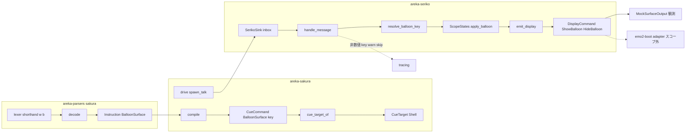
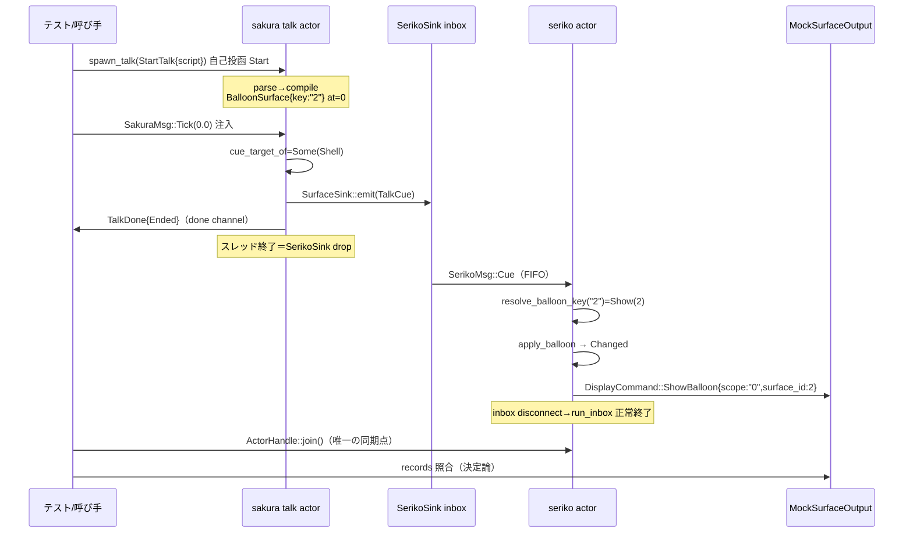

# Technical Design: areka-P0-balloon-face-cue

## Overview

**Purpose**: 本機能は、さくらスクリプトのバルーン面切替 `\b`（ブラケット形 `\b[ID]`・レガシー裸形 `\bN`・非表示 `\b[-1]`）を、シェルの `\s` と完全対称の**第一級 cue 語彙**としてパース → コンパイル → cue 配送 → seriko 消費 → 表示指令発行まで決定論的に貫通させる。現状の三重無音破棄（parser タグ表不在／compile catch-all 破棄／`CueCommand` variant 不在）と、裸形 `\bN` の本文数字漏れ（可視破損）を根絶する。

**Users**: ゴースト作者は記述した `\b` がバルーン面切替・非表示として動作する土台を得る。下流仕様 `areka-P0-emo2-boot` は「実 cue が届く」前提で R5 を再構築できる（本 spec が同仕様のブロッカーゲート）。

**Impact**: 完成済み上流 5 エンジン（areka-parsers／dola cue／areka-sakura／areka-seriko／areka-emo-present）への **additive 増分のみ**。既存の cue 種別・配送対象・挙動は一切変更しない。新規外部依存なし・Rust 2024・tokio 不使用。

### Goals

- `\b[ID]`／`\bN`／`\b[-1]` の両形パースと不透明転写（本文数字漏れの根絶を含む）
- バルーン面切替を運ぶ cue 語彙 `CueCommand::BalloonSurface { key }` の追加（`Emote{key}` 完全対称）
- コンパイル写像と表示系（サーフェス消費＝seriko）への分類確立（文字状態機械への誤配線の構造的排除）
- seriko の per-scope バルーン面状態・冪等ガード・`ShowBalloon`/`HideBalloon` 表示指令発行（数値解決のみ・`-1`→非表示）
- fixture script 直入力 → mock 表示 sink 観測の決定論 E2E（注入 Tick のみ・sleep 不使用）と全増分点のテスト檻
- emo-present バルーン target「同寸・異 id 再 Show」の回帰檻（`TextSlotView` 安定性込み・本体無改変）

### Non-Goals

- presenter への実配送結線（scope → `TargetId` 写像・UI 配送）＝ emo2-boot の adapter 責務
- バルーン面の名前／alias 解決（`\b[バルーン１]` 等）＝将来の下流仕様（本 spec は不透明 key で語彙の余地のみ確保）
- ukadoc fallback 形 `\b[ID1,--fallback=ID2]` の fallback 意味論（第 1 引数 `ID1` として graceful 動作・将来 additive）
- 異寸バルーン面切替時の文字層再装着ライフサイクル（B5 増分申し送り）・SERIKO バルーンアニメ・`\_b`・communicate 枠／入力枠・二人立ち複数バルーン target（M-dual）
- `CueTarget` の意味論リネーム（`Shell`/`Balloon` → `Surface`/`Text`）＝将来の cue-routing 再編 spec へ申し送り（後述）

## Boundary Commitments

### This Spec Owns

- `\b` 両形の構文・意味デコード（`areka-parsers::sakura` の lexer shorthand 一般化＋decode arm＋`Instruction::BalloonSurface`）
- cue 語彙 `CueCommand::BalloonSurface { key: String }`（dola）とその強制コンパイル点 3 箇所の同時更新
- コンパイル写像（`Instruction::BalloonSurface` → `CueCommand::BalloonSurface`）と分類（`cue_target_of` → `CueTarget::Shell`＝SurfaceSink/seriko 行き）
- seriko のバルーン面契約一式: `resolve_balloon_key`（数値のみ）・`ScopeStates` のバルーン map＋`apply_balloon`・`DisplayCommand::ShowBalloon/HideBalloon`（emo2-boot adapter の入力契約）
- 決定論テスト資産: seriko E2E（`tests/balloon_face_e2e.rs`）・各増分点の単体檻・emo-present 同寸異 id 再 Show 回帰（test-only）・test-local 多面バルーン fixture

### Out of Boundary

- `DisplayCommand` → `PresentCommand` の写像・scope→`TargetId` 採番・UI スレッド配送（emo2-boot）
- 既定面 `balloon.defaultsurface` の起動時初期表示（emo2-boot adapter。seriko 状態は未設定から始まる）
- 奇数 id の拒否（ukadoc の奇数予約は作法であり engine gate ではない。実在しない面は emo-present の EmptyComposition→Hide 縮退＋warn の既存挙動が受ける）
- emo-text の描画資源再構築（異寸対応・B5）／emo-present・emo-text・wintf の本体改変（wintf は完全不関与を実測確認済み）
- `CueTarget::Shell` の名前負債解消（doc 更新のみ本 spec。リネームは serde ワイヤ・wintf tuple キーへの横断破壊ゆえ将来 spec）

### Allowed Dependencies

- 既存 workspace 依存のみ（新規外部依存なし・R7.2）。依存方向は既存どおり:
  `areka-parsers` ← `areka-sakura` ← `areka-seriko`／`dola`（基底）／`areka-ghost`・`areka-emo-text`（機械的追随 arm のみ）／`areka-emo-present`（test-only）
- テストは既存 dev-deps（`tracing-subscriber` 等）と std のみ。areka-seriko の E2E は既存 regular 依存（areka-sakura・areka-parsers）内で閉じる

### Revalidation Triggers

- `DisplayCommand` の variant 形状変更（emo2-boot adapter の入力契約・M-dual／choice-render が消費）
- `CueCommand::BalloonSurface` のフィールド変更（強制 3 箇所＋seriko テスト檻の再検証）
- バルーン着せ替え bind の導入（`ShowBalloon` に binds が必要になる＝SERIKO バルーンアニメ系 spec）
- `TextSlotView` の供給値変更（DPI スケール導入時）・emo-present の chain リサイズ挙動変更（異寸 B5 着手時）
- `CueTarget` リネーム spec 着手時（`cue_target_of` 写像と本 spec の分類テストが追随対象）

## Architecture

### Existing Architecture Analysis

- **cue パイプライン**: script → `areka_parsers::sakura::parse`（転記層）→ `areka_sakura::compile`（純関数）→ `spawn_talk`（per-talk actor・Tick 駆動）→ `cue_target_of` で 2 sink 分類（Shell→`SurfaceSink`＝seriko／Balloon→`TextSink`＝emo-text）→ seriko が解決→状態→単一発行点 `emit_display` で `DisplayCommand` 発行。
- **分類の実態**: `CueTarget::Shell`＝サーフェス消費系（seriko）・`CueTarget::Balloon`＝文字状態機械（emo-text）。バルーン**面切替**はサーフェス消費系であり、`Balloon` 分類（＝TextSink）へ流すのは誤配線になる——これが本 spec の中心制約。
- **保存すべき既存パターン**: catch-all 禁止の強制コンパイル点（`cue_target_of`／`command_kind`／`apply_cue`）・`ScopeStates` の冪等ガード・単一発行点・log-first（silent failure 禁止）・mock/join 同期による決定論テスト。

### Architecture Pattern & Boundary Map

採用パターン: **brief A1「統一 display 経路（`\s` と完全対称）」× 分類 Option A（`CueTarget::Shell` 再利用）**。



**Key Decisions**（research.md §6.2 が根拠・ここに結論を再掲）:

1. **分類先＝`CueTarget::Shell`（Option A・D3 確定）**: dola `CueTarget`・`drive.rs`・wintf を**完全無改変**に保つ。理想形（`CueTarget` の `Surface`/`Text` リネーム）は serde ワイヤ互換・wintf tuple キー・既存テスト群への横断破壊＝ R2.3 違反ゆえ今採らず、`CueTarget::Shell` の doc comment を「表示系（サーフェス消費・seriko: シェル面＋バルーン面）」へ更新して名前負債を明示・将来 spec へ申し送る。第 3 variant 追加案は同一 sink への擬似スロット化ゆえ棄却。
2. **語彙＝`CueCommand::BalloonSurface { key: String }`（D4 確定）**: `Emote{key}` と完全対称の不透明 key 転写。dola は stateless 転送語彙・面の現在状態は seriko 所有。
3. **裸形＝lexer shorthand 一般化（D2 確定）**: `SHORTHAND_WORDS = &['w','b']`・内部トークンを `Token::Shorthand{word,n}` へ一般化（`pub(crate)`＝公開 API 不変）。本文数字漏れは lexer 層で構造的に根絶。
4. **seriko 契約＝別 map 同居＋新 variant（D5 確定）**: `ScopeStates` にバルーン専用 map を同居させ `apply_balloon` を鏡映実装（シェル経路無改変）。`DisplayCommand` は `ShowBalloon{scope,surface_id}`／`HideBalloon{scope}` の新 variant（binds なし・`#[non_exhaustive]` なし＝コンパイラ強制文化を維持）。
5. **数値解決のみ（D1/R4.4-4.5 確定）**: `resolve_balloon_key` は alias 表を引かない純関数。非数値 key（名前形）は **warn!**＋skip（`EntityRef` の「M-boot 未対応」warn! 先例に整合）。
6. **文字層＝同寸保持（D7 確定）**: seriko はバルーン面切替で `Clear` を発行しない＝層分離により文字層は構造的に無傷。異寸は B5 申し送り。

**Steering compliance**: シェル/バルーン統一エンジン（seriko＝表示状態の唯一の所有者）・catch-all 禁止・log-first・決定論テスト必達・additive 原則・ukadoc 正典主義——すべて既存 steering / MEMORY 方針に整合。

### Technology Stack

| Layer | Choice / Version | Role in Feature | Notes |
|-------|------------------|-----------------|-------|
| パーサ | areka-parsers（既存） | `\b` 両形 decode | 新規依存なし |
| cue 語彙 | dola cue（既存・serde） | `BalloonSurface` variant | serde additive（externally tagged） |
| エンジン | areka-sakura／areka-seriko（既存・std mpsc） | 写像・分類・状態・発行 | tokio 不使用（R7.3） |
| テスト | tracing-subscriber（dev・既出）＋ std | ログ檻・TempDir | 新規 dev-dep なし |

## File Structure Plan

### Modified Files

```
crates/
├── areka-parsers/src/sakura/
│   ├── model.rs          # Instruction::BalloonSurface(SurfaceArg) variant 追加（#[non_exhaustive] ゆえ後方互換）
│   ├── lexer.rs          # SHORTHAND_WORDS=&['w','b']・Token::WaitShorthand(u8)→Token::Shorthand{word,n} 一般化
│   ├── lexer_tests.rs    # 裸形 \bN の構文檻（\b1/\b12/\b2[x]/\b 単独/\b1[ 未閉じ）＋既存 \w 非退行
│   └── decode.rs         # "b" tag arm（第1引数→SurfaceArg）＋ Shorthand 分岐（'w'→Wait/'b'→BalloonSurface）
│       └── decode_tests.rs  # 両形・-1・名前形の不透明転写檻＋既存タグ非退行（R1.6）
├── dola/src/cue/
│   └── command.rs        # CueCommand::BalloonSurface{key:String} 追加・CueTarget::Shell doc 更新（doc-only）
│                         # ＋ tests: 8 variant 数え上げ・serde roundtrip 更新
├── areka-sakura/src/
│   ├── compile.rs        # Instruction::BalloonSurface arm → CueCommand::BalloonSurface（不透明写像・catch-all 前に配置）
│   └── contract.rs       # cue_target_of: BalloonSurface → Some(CueTarget::Shell)（強制点1）＋分類テスト拡張
├── areka-seriko/src/
│   ├── resolve.rs        # pub fn resolve_balloon_key(&str) -> SurfaceTarget（数値のみ・alias 非適用・純関数）
│   ├── state.rs          # ScopeStates: balloon map 同居＋ apply_balloon()（冪等ガード鏡映・シェル map 無改変）
│   ├── output.rs         # DisplayCommand::ShowBalloon{scope,surface_id} / HideBalloon{scope} 追加
│   └── actor.rs          # handle_message: BalloonSurface 明示 arm（解決→状態→emit_display 一本経路・非数値 warn+skip）
├── areka-ghost/src/
│   └── sink.rs           # command_kind: "BalloonSurface" ラベル 1 行（強制点2・挙動不変）＋テスト 1 行
├── areka-emo-text/src/
│   └── state.rs          # apply_cue: 非消費 arm へ BalloonSurface 追加（強制点3・文字状態不変）＋非消費テスト
└── areka-emo-present/src/
    ├── presenter.rs      # #[cfg(test)] のみ: 2面同寸 assets ヘルパ＋異 id 再 Show 回帰＋TextSlotView 安定性檻
    └── balloon.rs        # #[cfg(test)] のみ: balloons0+balloons2（偶数 id）多面列挙テスト（test-local fixture）
```

### New Files

```
crates/areka-seriko/tests/
└── balloon_face_e2e.rs   # R5 決定論 E2E: fixture script 直入力→spawn_talk→SerikoSink→seriko→MockSurfaceOutput 照合
                          # （NullTextSink・注入 Tick・done.recv→disconnect→join 同期・新規依存ゼロ）
```

> 依存方向（Types→Engine→Test の左→右のみ import 可）: `areka-parsers` → `dola` は無関係（並列基底）、`areka-sakura` は両者に依存、`areka-seriko` は `areka-sakura` に依存。`areka-ghost`／`areka-emo-text` は機械的 arm のみ。`areka-emo-present` は本 spec から**テストコード以外触らない**。

## System Flows

`\0\b[2]…\b[-1]\e` の貫通シーケンス（正常系）:



- **ゲート条件**: seriko 到着後の分岐は「非数値 key → warn!＋skip（発行なし・R4.5）」「同一面再指定 → Unchanged（再発行なし・R4.3）」「`-1` → `HideBalloon`（R4.2）」。
- **配送不能経路**: `cue_target_of` は `BalloonSurface` に対し常に `Some(Shell)` を返す（全域写像）。`None` 経路（`Custom` のみ）は既存の `drive.rs` error!＋skip がそのまま檻として残る（R3.3）。

## Requirements Traceability

| Requirement | Summary | Components | Interfaces | Flows |
|-------------|---------|------------|------------|-------|
| 1.1 | `\b[ARG]` 第一級パース・不透明転写 | decode | `Instruction::BalloonSurface(SurfaceArg)` | parse |
| 1.2 | 裸形 `\bN`（1 桁）パース | lexer/decode | `Token::Shorthand{word:'b',n}` | parse |
| 1.3 | 本文数字漏れ根絶（`\b12`→面1＋本文2） | lexer | shorthand 消費規則 | parse |
| 1.4 | `\b[-1]` 非表示センチネル不透明保持 | decode | `SurfaceArg("-1")` | parse |
| 1.5 | 範囲展開・数値化をしない忠実転写 | decode | `SurfaceArg`（無加工） | parse |
| 1.6 | 既存タグのパース結果不変 | lexer/decode | 既存 arm 無改変 | 回帰テスト |
| 2.1 | 専用 cue 種別＋不透明 key | dola command | `CueCommand::BalloonSurface{key}` | — |
| 2.2 | cue 配送層が破棄せず届ける | contract/drive | `cue_target_of`→`Some(Shell)`→SurfaceSink | E2E |
| 2.3 | 既存種別・配送対象・挙動不変（additive） | dola/contract | 既存 variant 写像不変 | 既存テスト全緑 |
| 2.4 | 強制分岐点の明示網羅（catch-all 導入禁止） | contract/ghost sink/emo-text state | 3 箇所の明示 arm | — |
| 3.1 | compile が破棄せず cue 生成（不透明写像） | compile | `BalloonSurface` arm | compile |
| 3.2 | 表示系へ分類・文字状態機械へ配送しない | contract/emo-text | `Some(Shell)`＋emo-text 非消費 arm | 分類テスト |
| 3.3 | 配送不能はログ・握りつぶさない | drive（既存） | `None`→error!＋skip | 既存檻 |
| 4.1 | 非負数値 id → 表示指令 | resolve/state/actor | `ShowBalloon{scope,surface_id}` | seriko |
| 4.2 | `-1` → 非表示指令 | resolve/state/actor | `HideBalloon{scope}` | seriko |
| 4.3 | 同一面は再発行しない（冪等） | state | `apply_balloon`→`Unchanged` | seriko |
| 4.4 | 素直な数値解決（alias 非適用） | resolve | `resolve_balloon_key`（表を引かない） | seriko |
| 4.5 | 数値解決不能はログ＋発行なし | actor | warn!＋skip | seriko |
| 4.6 | シェル面状態・配送の無改変 | state/actor | 別 map 同居・既存経路無改変 | 既存テスト全緑 |
| 5.1 | fixture script→面切替指令の観測 | E2E | `MockSurfaceOutput` records | E2E |
| 5.2 | `\b[-1]`→非表示指令の観測 | E2E | 同上 | E2E |
| 5.3 | sleep 不使用・注入 Tick のみ | E2E | `SakuraMsg::Tick`＋done/join 同期 | E2E |
| 5.4 | 全増分点＋ログ/エラー写像の実行テスト網羅 | 各層 tests | capture_logs／mock 照合 | Testing Strategy |
| 5.5 | 多面バルーン test-local fixture 自前用意 | balloon.rs/presenter.rs tests | TempDir＋MemoryDecoder（balloons0/2） | R6 テスト |
| 6.1 | 同寸異 id 再 Show＝新面提示＋TextSlotView 安定 | presenter.rs test | `text_slot_view()` 前後一致 | R6 テスト |
| 6.2 | Hide→再表示のキャッシュ復帰（既存維持） | presenter.rs（既存檻） | `hide_then_reshow_recovers_display_from_cache` | 既存 |
| 6.3 | emo-present 本体無改変（test-only） | presenter.rs/balloon.rs | `#[cfg(test)]` 限定 | — |
| 7.1 | `cargo test --workspace` exit 0 | 全体 | — | DoD |
| 7.2 | 新規外部依存なし | 全体 | Cargo.toml 無追加 | — |
| 7.3 | Rust 2024・tokio 不使用 | 全体 | std mpsc／既存 actor 基盤 | — |

## Components and Interfaces

| Component | Domain/Layer | Intent | Req Coverage | Key Dependencies | Contracts |
|-----------|--------------|--------|--------------|------------------|-----------|
| sakura lexer/decode 増分 | parsers（②） | `\b` 両形の構文・意味デコード | 1.1–1.6 | なし（自己完結） | State |
| `CueCommand::BalloonSurface` | dola cue | 面 key の不透明転送語彙 | 2.1–2.4 | serde（既存） | Event |
| compile/classification 増分 | sakura（④） | 写像＋表示系分類 | 3.1–3.3 | parsers, dola | Service |
| seriko バルーン面契約 | seriko（⑤） | 数値解決・per-scope 状態・指令発行 | 4.1–4.6 | sakura | Service/State/Event |
| 機械的追随 arm | ghost（⓪）/emo-text（⑥） | 強制点 2/3 の明示網羅（挙動不変） | 2.4, 3.2 | dola | — |
| E2E＋回帰テスト資産 | test | 決定論観測・回帰檻・fixture | 5.1–5.5, 6.1–6.3, 7.1 | 各層（dev） | — |

### parsers（②）

#### sakura lexer/decode 増分

| Field | Detail |
|-------|--------|
| Intent | `\b[ARG]`／裸形 `\bN` を `Instruction::BalloonSurface(SurfaceArg)` へ decode し、本文数字漏れを構造的に根絶する |
| Requirements | 1.1, 1.2, 1.3, 1.4, 1.5, 1.6 |

**Responsibilities & Constraints**
- lexer: `SHORTHAND_WORDS = &['w', 'b']`。内部トークンを `Token::Shorthand { word: char, n: u8 }` へ一般化（`WaitShorthand(u8)` を置換・`pub(crate)` 内部型ゆえ公開 API 不変）。既存の shorthand 判定規則（1 桁数字・直後 `[` なら正準タグ優先）を語に依らず共通適用する。
- decode: 正準タグ arm `"b"` → `Instruction::BalloonSurface(SurfaceArg::new(args.into_iter().next().unwrap_or_default()))`（**第 1 引数のみ**＝`\s` arm と完全対称。fallback 形 `\b[2,--fallback=4]` は `"2"` に落ちる＝graceful・Non-Goals 登記）。`Token::Shorthand` は `word` で分岐: `'w'`→`Wait(n×50ms)`（既存等価）・`'b'`→`BalloonSurface(SurfaceArg::new(n.to_string()))`・その他→防御 `Raw`（到達不能・非 panic）。
- 数値化・範囲展開・alias 解決を一切行わない（転記層の正本規律）。

**Contracts**: State [x]

##### State Management（構文・意味の不変条件）

| 入力 | 出力（Instruction 列） | 根拠 |
|------|------------------------|------|
| `\b[10]` | `[BalloonSurface("10")]` | 1.1 |
| `\b[バルーン１]` | `[BalloonSurface("バルーン１")]`（無加工） | 1.1/1.5 |
| `\b[-1]` | `[BalloonSurface("-1")]`（数値化しない） | 1.4 |
| `\b1` | `[BalloonSurface("1")]`（`Text("1")` を出さない） | 1.2/1.3 |
| `\b12` | `[BalloonSurface("1"), Text("2")]`（`2` は正当本文） | 1.3 |
| `\b2[x]` | `[Raw("\b2[x]")]`（既存 `\w2[x]` と同型＝非 shorthand） | 1.2 整合 |
| `\b`（数字なし） | `[Raw("\b")]`（既存 passthrough 維持） | 1.6 |
| `\w9`・`\s[0]` 等既存タグ | 既存出力と完全一致 | 1.6 |

**Implementation Notes**
- Integration: `decode_passthrough_tag` の既存 `\b` 経路（Raw 落ち）は `"b"` arm 新設により自然消滅する。他タグの経路は不変。
- Validation: lexer_tests（構文分割）と decode_tests（意味写像）の二層で檻を張る。未閉じ `\b1[`〜末尾は既存規則どおり `Raw` 吸収。
- Risks: 1 パススキャナへの介入 → 既存 `\w` 系全テスト緑＋境界ケース檻で回帰を封じる。

### dola cue

#### `CueCommand::BalloonSurface`

| Field | Detail |
|-------|--------|
| Intent | バルーン面 key の不透明・stateless 転送語彙（8 番目の variant） |
| Requirements | 2.1, 2.2, 2.3, 2.4 |

##### Event Contract

```rust
/// バルーン面切替。key は不透明文字列（数値形・名前形・"-1" 非表示センチネル）。
/// 解釈（数値化・alias）は消費者（seriko）の責務。dola は状態を持たない。
BalloonSurface { key: String },
```

- serde: externally tagged で additive（`{"BalloonSurface":{"key":"2"}}`）。既存 variant のワイヤ形不変（2.3）。
- `CueTarget` は**無改変**。`CueTarget::Shell` の doc comment のみ「表示系（サーフェス消費・seriko が消費: シェル面＋バルーン面）」へ更新（doc-only・名前負債の明示）。
- 強制コンパイル点（catch-all 禁止規律の維持・2.4）: ① `areka-sakura/contract.rs cue_target_of` ② `areka-ghost/sink.rs command_kind` ③ `areka-emo-text/state.rs apply_cue`。variant 追加によりこの 3 箇所がコンパイルエラーで追随を強制される（本設計はその 3 arm を同時定義済み）。
- dola 内テスト更新: `cue_command_seven_variants`（7→8 個数え上げ・名称も 8 へ）・serde roundtrip へ `BalloonSurface` 追加。

### sakura（④）

#### compile/classification 増分

| Field | Detail |
|-------|--------|
| Intent | `Instruction::BalloonSurface` の不透明写像と表示系分類 |
| Requirements | 3.1, 3.2, 3.3 |

##### Service Interface

```rust
// compile.rs（catch-all `other` arm より前に明示 arm を追加）
Instruction::BalloonSurface(arg) => {
    cues.push(emit(scope, offset, CueCommand::BalloonSurface {
        key: arg.as_str().to_string(),   // 不透明写像（Emote と同型・3.1）
    }));
}

// contract.rs cue_target_of（強制点1）
CueCommand::BalloonSurface { .. } => Some(CueTarget::Shell),  // 表示系＝SurfaceSink/seriko（3.2）
```

- Preconditions: 入力は `areka_parsers::sakura::parse` の出力（再パースしない）。
- Postconditions: `BalloonSurface` に対し `cue_target_of` は**全域**で `Some(Shell)`（配送不能 `None` に落ちない）。`None` 経路（`Custom`）の error!＋skip は `drive.rs` の既存実装・既存檻がそのまま R3.3 を満たす。
- Invariants: `drive.rs` は**無改変**（Shell→`surface_sink` の既存振分に乗る）。文字状態機械（TextSink）へは分類上到達しない（3.2）。

### seriko（⑤）

#### バルーン面契約（resolve / state / output / actor）

| Field | Detail |
|-------|--------|
| Intent | バルーン面 cue の数値解決・per-scope 状態管理・表示指令発行（シェル経路と完全分離） |
| Requirements | 4.1, 4.2, 4.3, 4.4, 4.5, 4.6 |

**Responsibilities & Constraints**
- バルーン面状態はシェル面状態と**別 map**（同一 `ScopeStates` 所有者に同居）。シェル用 `apply()`・`SurfaceResolver`・既存 `Show`/`Hide` variant には一切触れない（4.6 の構造的担保）。
- 解決は数値のみ（alias 表を引かない・4.4）。既定面・パリティ検査は非責務（Out of Boundary）。
- 発行は既存の単一発行点 `emit_display` を共用する（発行点を増やさない）。

**Dependencies**
- Inbound: sakura drive — `SurfaceSink::emit` 経由の `TalkCue`（P0）
- Outbound: `SurfaceOutput`（mock／将来 emo2-boot adapter）— `DisplayCommand`（P0）

**Contracts**: Service [x] / Event [x] / State [x]

##### Service Interface

```rust
// resolve.rs — 純関数（表を持たない・所有 self 不要・決定論）
/// バルーン面 key の数値解決（M-boot: alias／名前解決なし・R4.4）。
/// "-1"→Hide／0..=u32::MAX→Show(id)／それ以外（非数値・負の非-1・範囲外）→Unresolved。
pub fn resolve_balloon_key(key: &str) -> SurfaceTarget;

// state.rs — ScopeStates 増分
pub struct ScopeStates {
    scopes: HashMap<ActorKey, ScopeState>,        // 既存（シェル面・無改変）
    balloon: HashMap<ActorKey, ScopeState>,       // 新設（バルーン面・別 map 同居）
    static_binds: BindSet,                        // 既存（バルーンは使わない）
}
/// バルーン面への適用（apply() と同一規律の鏡映・1 cue = 1 scope）。
/// Show(id): 同一 id 表示中→Unchanged／それ以外→Shown(id) 更新＋Changed(ShowBalloon)。
/// Hide: 既に Hidden→Unchanged／それ以外（未知 scope 含む）→Hidden 更新＋Changed(HideBalloon)。
/// Unresolved: 防御的 no-op（呼び手が先に skip する）。
pub fn apply_balloon(&mut self, scope: &ActorKey, target: SurfaceTarget) -> ApplyOutcome;
```

- Preconditions: `apply_balloon` へ `Unresolved` を渡さない（actor が先に warn!＋skip）。
- Postconditions: シェル map（`scopes`）はバルーン適用で不変・その逆も不変（4.6）。冪等ガードは同一 variant 同一 id 限定（4.3）。
- Invariants: 発行すべき指令は `ApplyOutcome::Changed` 同梱でのみ生まれ、`emit_display` 単一点から出る。

##### Event Contract（emo2-boot adapter の入力契約＝下流正本）

```rust
// output.rs — DisplayCommand 増分（既存 Show/Hide は無改変）
pub enum DisplayCommand {
    Show { scope: ActorKey, surface_id: u32, binds: BindSet },  // 既存（シェル）
    Hide { scope: ActorKey },                                   // 既存（シェル）
    /// バルーン面表示（binds なし＝M-boot にバルーン着せ替えは存在しない。
    /// adapter は PresentCommand::ShowSurface{binds: BindSet::default()} を組む）。
    ShowBalloon { scope: ActorKey, surface_id: u32 },           // 新設（4.1）
    /// バルーン非表示（\b[-1] 相当）。
    HideBalloon { scope: ActorKey },                            // 新設（4.2）
}
```

- 順序保証: 既存どおり FIFO（seriko 単一スレッド・`SurfaceOutput::send` 到着順）。
- `#[non_exhaustive]` は付けない（workspace 内部契約・variant 追加時はコンパイラが下流 match の追随を強制する＝本 spec の文化）。
- scope→表示 target（`TargetId`）の写像・UI 配送は emo2-boot adapter 責務（Out of Boundary・D6）。

##### actor 消費経路（handle_message 増分）

```rust
// actor.rs — 内側 command match へ明示 arm を追加（catch-all を新設しない）
CueCommand::BalloonSurface { key } => {
    match resolve_balloon_key(key) {
        SurfaceTarget::Unresolved => {
            // 名前形（\b[バルーン１]）等: M-boot 未対応＝warn!＋skip・発行しない（4.5・
            // EntityRef の「M-boot 未対応」warn! 先例に整合。将来の名前解決 additive 余地）。
            tracing::warn!(key = %key, scope = %cue.actor,
                "seriko: バルーン面 key を数値解決できず読み飛ばす（M-boot は数値のみ・R4.5）");
        }
        target => {
            if let ApplyOutcome::Changed(command) = states.apply_balloon(&cue.actor, target) {
                emit_display(out, command);   // 単一発行点共用（4.1/4.2/4.3）
            }
        }
    }
}
```

**Implementation Notes**
- Integration: 外側分類は `Some(CueTarget::Shell)` の既存 arm で通過する（無改変）。既存 `Emote` 経路（resolver→apply）とは分岐後に完全分離。
- **arm 挿入位置（validation Issue 1 の裁定）**: 既存の内側 match は「key 抽出 match」（`let key = match &cue.command {...}`）であり値を返す形。`BalloonSurface` arm は解決→適用→発行を arm 内で完結し値を返さないため、**key 抽出 match の前段分岐**（`if let CueCommand::BalloonSurface{key} = &cue.command { ...; return ControlFlow::Continue(()); }` 等の早期 return 形）として挿入し、**既存 Emote 経路のコード形状には触れない**（R4.6）。catch-all は新設しない。
- Validation: seriko の外側/内側 catch-all はコンパイル強制が働かないため、消費経路は E2E＋`handle_message` 同期単体（capture_logs）で檻を張る（Testing Strategy）。
- Risks: シェル経路への意図せぬ干渉 → 別 map・別 arm・既存テスト全緑＋「シェル/バルーン独立性」専用テストで封じる。

### 機械的追随 arm（ghost ⓪／emo-text ⑥）

| Field | Detail |
|-------|--------|
| Intent | 強制コンパイル点 2/3 の明示網羅（挙動不変・catch-all 導入禁止の維持） |
| Requirements | 2.4, 3.2 |

- `areka-ghost/src/sink.rs command_kind`: `CueCommand::BalloonSurface { .. } => "BalloonSurface"`（ログラベルのみ・テストの variant 網羅表へ 1 行追加）。
- `areka-emo-text/src/state.rs apply_cue`: 非消費 arm を `Emote{..} | EntityRef(..) | Custom{..} | BalloonSurface{..}` へ拡張（debug ログ・文字状態を汚さない＝3.2 の「文字状態機械へ配送しない」の防御面）。非消費テスト（適用前後で `TextLayerState` 不変）を追加。

### test 資産（E2E／回帰／fixture）

| Field | Detail |
|-------|--------|
| Intent | 決定論観測・回帰檻・test-local fixture（本番コード無改変） |
| Requirements | 5.1, 5.2, 5.3, 5.4, 5.5, 6.1, 6.2, 6.3, 7.1 |

**E2E（新規 `crates/areka-seriko/tests/balloon_face_e2e.rs`）**
- 構成: test-local `NullTextSink`（`TextSink` 実装・破棄のみ）＋ `spawn_seriko(SurfaceResolver::new(BTreeMap::new()), BindSet::from_ids([]), MockSurfaceOutput)` ＋ `spawn_talk(StartTalk{talk_id, script}, done_tx, seriko_sink, NullTextSink)`。
- 同期チェーン（sleep/polling ゼロ・5.3）: `TalkHandle.inbox` へ `Tick` 注入 → `done_rx.recv()` で `TalkDone` 受領 → talk スレッド終了で move 済み `SerikoSink`（唯一の Sender）drop → seriko inbox **disconnect** → `run_inbox` 正常終了 → `ActorHandle::join()` → `records` 照合。
- シナリオ:
  1. `\b[2]…\e` → `[ShowBalloon{scope:"0", surface_id:2}]`（5.1）
  2. `\b[2]\w1\b[-1]\e` ＋ Tick(0.0)/Tick(0.05) → `[ShowBalloon{2}, HideBalloon]`（5.2・時刻駆動）
  3. 裸形 `\b2` → ブラケット形と同一観測（1.2 の E2E 面）
  4. 冪等 `\b[2]\b[2]` → `ShowBalloon` 1 件のみ（4.3）
  5. シェル混在 `\s[0]\b[2]` → `Show{0,binds}` と `ShowBalloon{2}` が独立に記録（4.6）
- fixture script は正典に倣い**偶数 id**を使用する。

**emo-present 回帰（6.1–6.3・presenter.rs `#[cfg(test)]` 限定）**
- 新ヘルパ: 2 面同寸 assets（例 surface 1000/3000・同 w×h・別バイト・golden 2 本）——既存 `build_target_assets` の複面版。
- 新テスト（既存 `hide_then_reshow_recovers_display_from_cache` の流儀）: Show(1000) → `text_slot_view()` スナップショット取得 → Show(3000)（**異 id・同寸**）→ reply Ok・可視維持・`HitTest::AlphaMask` 維持・`read_back` が 3000 の golden と一致・**`text_slot_view()` が前後で完全一致**（slot/window/surface_size/scale＝`TextSlotView: PartialEq` で直接比較・6.1）。
- 6.2（Hide→再 Show キャッシュ復帰）は既存檻の維持で満たす（変更しない）。
- balloon.rs `#[cfg(test)]`: TempDir に `balloons0.png`＋`balloons2.png`（偶数 id・MemoryDecoder 供給）→ `build_balloon_target` が surface 0/2 の両面を持つ world を返す（5.5 の fixture 実演・多面列挙）。

## Data Models

### Domain Model（増分のみ）

- **バルーン面 key（値・不透明文字列）**: parser `SurfaceArg` → dola `BalloonSurface{key}` まで無加工転写。集約境界は cue 1 件（`TalkCue`）。
- **バルーン面状態（seriko 所有・唯一の正本）**: `ActorKey`（scope）→ `ScopeState{Shown(u32), Hidden}`。シェル面状態と同型・別 map。トランザクション境界は `apply_balloon` 1 呼び出し（1 cue = 1 scope）。
- **不変条件**: (a) バルーン面状態の変更は `apply_balloon` のみが行う (b) `DisplayCommand::{ShowBalloon,HideBalloon}` は状態変化時のみ生まれる (c) シェル map とバルーン map は互いの適用で不変。

### Data Contracts & Integration

- serde 互換: `CueCommand` へ variant 追加は前方互換（旧データに `BalloonSurface` は現れない・新データの既存 variant 形不変）。`DisplayCommand` は serde 非対象（プロセス内契約）。

## Error Handling

### Error Strategy

新しいエラー型は導入しない。全失敗経路は**log-first＋skip（ループ継続）**の既存規律に従い、panic を追加しない。

### Error Categories and Responses

| 経路 | 分類 | 応答 | ログ | 檻 |
|------|------|------|------|-----|
| `\b1[`（未閉じ）等の不正構文 | 作者入力 | `Raw` 吸収・解析継続（既存規則） | なし（転記層は無音） | lexer_tests |
| 非数値 key（`\b[バルーン１]`） | M-boot 未対応入力 | 発行なし・skip・状態不変 | **warn!**（key・scope 付き） | actor 同期単体＋capture_logs |
| 数値だが不正（`-2`・u32 超過） | 破損入力 | 発行なし・skip・状態不変 | warn!（同上・Unresolved 一括） | resolve 単体＋actor 単体 |
| 分類不能 cue（`Custom`） | 防御（M-boot 非生成） | skip | error!（drive.rs 既存） | 既存檻（R3.3） |
| seriko inbox 消失後の emit | 運用終端 | 破棄・非 panic | error!（既存） | 既存檻 |
| 実在しない面 id の表示 | 下流縮退 | emo-present EmptyComposition→Hide 縮退（既存） | warn!（既存） | 既存檻（スコープ外） |

### Monitoring

`tracing` 構造化ログ（既存規約）。ghost `LogSink` の `command_kind="BalloonSurface"` により本番既定でも発火が観測可能。

## Testing Strategy

> 決定論必達（sleep 不使用・注入 Tick・mock/join 同期）。ログ発火・エラー写像・配送不能経路も檻に入れる（5.4）。既存テストは全緑維持（7.1）。i686 成果物前提（workspace テストの既知制約）は DoD 手順に従う。

### Unit Tests

1. **parsers/lexer**: `\b1`→`Shorthand{b,1}`（Text なし）／`\b12`→`Shorthand{b,1}`＋`Text("2")`／`\b2[x]`→`Tag{b2}`（非 shorthand）／`\b` 単独→`Bare('b')`／`\w` 系既存全緑（1.2/1.3/1.6）。
2. **parsers/decode**: 上記 State Management 表の全行（両形・`-1`・名前形・fallback 形第 1 引数・既存タグ非退行）（1.1/1.4/1.5/1.6）。
3. **dola**: 8 variant 数え上げ・`BalloonSurface` serde roundtrip（2.1/2.3）。
4. **sakura/compile**: `BalloonSurface("バルーン１")` の不透明写像（バイト完全一致）・既存 variant 写像不変（3.1）。
5. **sakura/contract**: `cue_target_of` 全 variant 分類テストへ `BalloonSurface→Some(Shell)` を追加（2.2/2.4/3.2）。
6. **seriko/resolve**: `resolve_balloon_key` — `"2"`→Show(2)／`"0"`→Show(0)／`"-1"`→Hide／`"バルーン１"`・`"-2"`・`"4294967296"`→Unresolved（4.1/4.2/4.4）。
7. **seriko/state**: `apply_balloon` 遷移全分岐（新規 Show／冪等 Show／Hide／冪等 Hide／Hidden→Show 復帰／未知 scope Hide 一度発行）＋**シェル map 不変の相互独立テスト**（4.1–4.3/4.6）。
8. **seriko/actor**: `handle_message` 同期呼び出し＋capture_logs — 非数値 key の warn! 発火・発行なし・Continue（4.5/5.4）。
9. **ghost/sink**: `command_kind` 網羅テストへ `"BalloonSurface"` 追加（2.4）。
10. **emo-text/state**: `BalloonSurface` cue 適用で `TextLayerState` 完全不変（visible_glyphs/items 不変）（3.2）。

### Integration Tests

1. **seriko E2E（`tests/balloon_face_e2e.rs`）**: 上記 5 シナリオ（script 直入力→mock 表示 sink 照合・注入 Tick・disconnect/join 同期）（5.1/5.2/5.3・1.2/4.3/4.6 の E2E 面）。
2. **emo-present 回帰**: 同寸異 id 再 Show（read_back=新 golden・可視/HitTest 維持・`TextSlotView` 前後一致）（6.1）。既存 Hide→再 Show 檻の維持（6.2）。
3. **emo-present balloon**: `balloons0.png`＋`balloons2.png` の多面 build（test-local fixture・5.5）。

### Regression / DoD

- `cargo test --workspace` exit 0（7.1・PowerShell・i686 成果物先行ビルドの既知手順）。emo-present／emo-text／ghost／wintf の既存テストが全緑＝additive 担保（2.3/4.6/6.3）。
