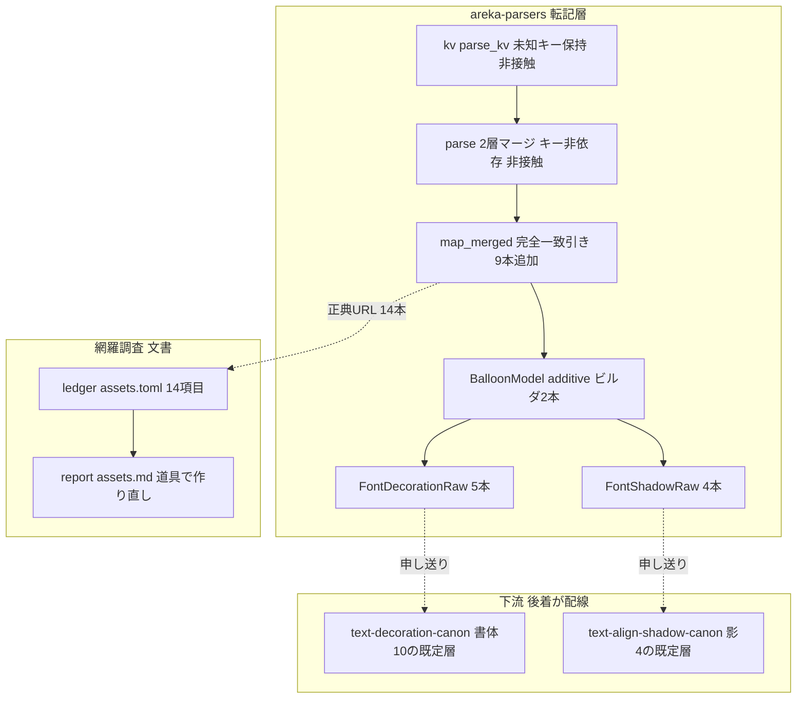

# 技術設計書: areka-P0-balloon-font-descript-keys

> 生成 2026-09-13。対象ブランチ `claude/areka-p0-balloon-font-keys-b2e272`。本文の file:line と行数はすべてこのブランチでの実測であり、着手時に再検証すること（行番号は動く。引用は「何の定義行か」で指す）。

## Overview

**Purpose**: バルーン定義（`descript.txt`）の接頭辞なし `font.*` 基底 14 キーのうち、転記層が読み落としている 9 キー（`font.bold`・`font.italic`・`font.outline`・`font.strike`・`font.underline`・`font.shadowcolor.r`／`.g`／`.b`・`font.shadowstyle`）を解析結果から取り出せるようにする。値の意味づけ（既定値・語彙判定・縮退・描画）は一切行わず、宣言された文字列をそのまま下流へ渡す。あわせて 14 キーの定義箇所に正典 URL を揃え、網羅台帳・ドメイン別報告・生きた 4 文書・調査ブリーフィングを実測に合わせる。

**Users**: バルーン作者（書いた宣言が少なくとも読み取られる状態になる）、下流の実装者（`areka-P0-text-decoration-canon`＝書体 10 キー・`areka-P0-text-align-shadow-canon`＝影 4 キーが「バルーン既定の装い」を取り出す口を得る）、網羅状況を読む人（台帳が今の実態を映す）。

**Impact**: 転記層 `crates/areka-parsers/src/balloon/` に 2 つの生文字列転記型（`FontDecorationRaw`・`FontShadowRaw`）と 9 本の完全一致引きが増える。**描画される文字の見た目は変わらない**（読み取る値が増えるだけで、使う側がまだ無い）。既存 5 キーの写像と `Font` 型には触れない。

### Goals

- 9 キーを転記層の写像対象へ加え、「未指定」「宣言された値」（語彙外・`none` を含む）を潰さずに保つ（2.1〜2.7・3.1）。
- 2 層マージの優先順位と接頭辞付きキーの不漏れを、新しい 9 キーについて決定論テストで固定する（4.1〜4.5・9.1〜9.7）。
- 14 キーの定義箇所に正典 URL のコメントを揃える（既設 4＋新設 10・6.1〜6.5）。
- 網羅台帳 14 項目・ドメイン別報告・生きた 4 文書・調査ブリーフィングを実測へ是正する（1.1〜1.5・7.1〜7.9）。
- 14 キーの正典既定値と担当下流を表で申し送り、着地順を実測で判定する（3.2〜3.4・8.1〜8.4）。
- 成功基準: `cargo test -p areka-parsers`・`cargo test -p ukadoc-survey`・`cargo run -p ukadoc-survey -- check` がいずれも緑で、既存テストの期待値を 1 つも緩めていない（5.3・7.9・9.9）。

### Non-Goals

- 接頭辞付き `font` 族 9 系統（`anchor.`／`anchor.notselect.`／`anchor.visited.`／`cursor.`／`cursor.notselect.`／`communicatebox.`／`number.`／`sstpmessage.`／`disable.`）の写像。基底キーへ漏れないことだけを守る（4.4）。
- `\f[...]` タグ側の意味論・リセット規則・描画（下流 2 spec）。`disable.font.*` の実体化。
- `font.name` の既知の食い違い 2 点（フォントファイル指定・カンマ区切り優先列）の是正。状態語の是正（`absent`→`degraded`）だけを行う（7.7）。
- 正典（ukadoc）の項目増減に自動で気付く仕組み（9.8・2026-09-11 開発者裁定）。
- バルーン名 `name,` の写像（`areka-P0-emo-text-canon-residue` 項目 14・同じ写像関数ゆえ同居させない）。
- 全体報告 `doc/ukadoc-coverage/report/summary.md` の作り直し（統合担当 `areka-P0-ukadoc-coverage-roadmap`）。

---

## Boundary Commitments

### This Spec Owns

- **転記層の 9 キー写像**——`crates/areka-parsers/src/balloon/parse.rs` の写像関数 `map_merged` に `font.bold`・`font.italic`・`font.outline`・`font.strike`・`font.underline`・`font.shadowcolor.r`／`.g`／`.b`・`font.shadowstyle` の完全一致引きを加えること。
- **2 つの生文字列転記型**——`crates/areka-parsers/src/balloon/model.rs` の `FontDecorationRaw`（0/1 系 5 本）と `FontShadowRaw`（影色 3 成分＋形態）、および `BalloonModel` の additive ビルダ 2 本とアクセサ 2 本。`crates/areka-parsers/src/balloon/mod.rs` の再輸出 2 型。
- **14 キーの正典 URL コメント**——`parse.rs` のキーを引く行に置く 10 本の新設（既設 4 本は無改変）。
- **決定論テスト**——`parse_tests.rs`（値の形・2 層・不漏れ・14 の判定）と `model_tests.rs`（型のアクセサ・`Default`・ビルダ）への追加。
- **網羅台帳 `doc/ukadoc-coverage/ledger/assets.toml` の当該 14 項目**——状態・担当・束名・備考。`doc/ukadoc-coverage/report/assets.md` の道具による作り直し。
- **生きた 4 文書の「13 キー／残り 8 キー」是正**と、`doc/ukadoc-coverage/briefing-assets.md` の是正候補の段 ⑵ の書き換え。
- **下流への申し送り**（14 キー一覧・値の形・未指定の表し方・正典既定値・担当下流）と、着地順の実測判定手順。

### Out of Boundary

- `crates/areka-parsers/src/kv/`（KV 化層）——未知キーを保持する現状で足りる。**変更 0 行**。
- `parse.rs` の 2 層マージ（`parse` 関数の `descript.clone()`＋後勝ち `insert`）——キー非依存であり、9 キーの優先順位は追加コード 0 で成立する。**変更 0 行**。
- `Font`／`FontColor` 型と `Font::new`（ワークスペース 50 呼出）・`BalloonModel::new` の署名——非接触。
- `crates/areka-emo-text/**`・`crates/areka/**`・`crates/areka-emo-present/**`——非接触（消費側は後着の下流が配線する。8.1）。
- `crates/ukadoc-survey/**`——道具は無改変。検査を足さない（9.8）。
- `doc/ukadoc-coverage/catalog.toml`（機械生成・非改変）、`report/summary.md`（統合担当）、`briefing-assets.md` の段 ⑵ 以外、`.kiro/steering/roadmap-history.md`、`.kiro/specs/completed/**`（非改変の方針）。
- `.kiro/specs/areka-P0-ukadoc-coverage-roadmap/brief.md`——同じ W13 で並走中の spec の文書であり、触ると共有ファイルになる。申し送りは本書の「下流への引き渡し」節と完了時の PR 本文で行う（7.8・研究 §8 の置き場の決着）。

### Allowed Dependencies

- `crate::kv::parse_kv`（既存・foundation）——KV 化の唯一の入口。
- `std::collections::BTreeMap`・`std::str::FromStr`（既存）。**新規の外部依存 0**（`Cargo.toml` 非接触）。
- `cargo run -p ukadoc-survey -- report`／`-- check`（既存の道具）——台帳とドメイン別報告の整合に使う。道具そのものには依存を足さない。
- 依存方向は従来どおり `model ← parse`、`areka-parsers ← areka-emo-text`（片方向・逆流禁止）。

### Revalidation Triggers

| 変化 | 再確認が要る先 |
|---|---|
| `FontDecorationRaw`／`FontShadowRaw` の公開面（アクセサ名・戻り型 `Option<&str>`）の変更 | `areka-P0-text-decoration-canon`（書体 10 の既定層）・`areka-P0-text-align-shadow-canon`（影 4 の既定層） |
| 値の形を生文字列から数値型へ変える判断 | 同上（`font.bold,yes` のような宣言が消える帰結を受け入れるかの再裁定・DD3） |
| `BalloonModel::new` の署名を伸ばす形へ回帰 | ワークスペース `BalloonModel::new` 43 呼出（本設計は additive ビルダで 0 波及） |
| 台帳 14 項目の状態・担当の再変更 | `report/assets.md` の作り直し（`DomainReportStale`）・統合担当の `summary.md` |
| `map_merged` へ別 spec がキーを足す（`emo-text-canon-residue` 項目 14・`anchor-tag-canon`） | 後着側が本仕様の 9 本の直後へ足し、`FONT_BASE_KEYS` の 14 の判定（9.7）を壊さないこと |

---

## Architecture

### Existing Architecture Analysis

| 層 | 実形（定義行で指す） | 本仕様への含意 |
|---|---|---|
| 転記層 `parse.rs`（186 行） | `pub fn parse(descript, image)` が `descript.clone()` へ画像別層を後勝ち `insert` してから `map_merged` を 1 回呼ぶ。マージはキー非依存 | 4.1〜4.3 は**追加コード 0** で成立。仕事はテストで固定すること |
| 同 | `fn map_merged(merged)` が `merged.get("font.name")`・`get_scalar::<u32>(merged, "font.height")`・`get_scalar::<u8>(merged, "font.color.{r,g,b}")` の 5 本を引く | 9 本を同じ形（完全一致 `get`）で足す。既存 5 本の行は無改変（5.1） |
| 同 | `fn get_scalar<T: FromStr>` は非数値・範囲外を `None` へ降格する | 9 キーには**使わない**（2.5・2.6 に反する）。`merged.get(key).map(\|v\| v.to_owned())` の生文字列転記（`vertical`・`writing_mode`・`windowposition_raw` と同型）を使う |
| 同 | 正典 URL コメントは `map_merged` の**キーを引く行の直前**に `// ukadoc: <URL>` で置かれている（`origin`・`wordwrappoint`・`validrect`・`font.color.*`・`font.height`・`cursor.*` すべて） | 14 本をここへ揃える（DD1）。`font.name` は説明コメントだけあり URL 行が無い＝新設 10 本のうちの 1 本 |
| モデル層 `model.rs`（529 行） | `BalloonModel::new` は 7 位置引数。additive ビルダ `with_cursor`／`with_windowposition_raw`／`with_vertical_raw` が「既存呼び出し側は無改変」を doc で宣言 | 第 4・第 5 のビルダを同じ流儀で足す（DD2） |
| 同 | `WindowPositionRaw`（`Option<String>`×2・`#[non_exhaustive]`・`Default`・`Eq`）が生文字列転記型の先例 | `FontDecorationRaw`／`FontShadowRaw` はこの先例の写し |
| 同 | `Font` は `#[non_exhaustive]`・非公開 3 フィールド・`Default` 無し。`Font::new` はワークスペース 50 呼出（`areka-emo-text/src`・同 `tests`・`areka/src/input_events`・`areka-parsers/src/balloon`） | `Font` には触れない。5.1 の証明が「型が無改変」で済む |
| 消費側 `areka-emo-text/src/draw.rs` | `ResolvedFont::resolve(model: &BalloonModel)` は `model.font()` の `name()`／`height()`／`color()` だけを読む | 新しい 2 型を読む本番コードは **0 か所**（実測）＝5.4 の根拠。9 項目について warn!／debug! が 1 行も出ない根拠でもある（7.2 の備考に書く） |
| フィクスチャ | リポジトリ内のバルーン定義（`crates/areka-emo-text/examples/fixtures/emo2-vertical*/descript.txt`・`crates/pilot/examples/shiori-host-32/fixtures/emo2*/descript.txt`）に 9 キーの宣言は **0 件**（実測） | 既存のフィクスチャ適合テストは新フィールドが `None` のまま＝赤にならない（5.3） |
| 網羅調査の道具 `crates/ukadoc-survey` | 証拠の行の形（`evidence/extract.rs`）は「字下げを除いた行頭がコメント記号・`ukadoc:` の後に空白＋1 語」。証拠の要否を見るのは `Status::Implemented` の行だけ（`check/content.rs` の早期 return）。判定 15 種のうち効くのは `SourceUrlNotInCatalog`・`DomainReportStale`。担当 spec の実在は見ない | URL はカタログから写す（6.2）。台帳の書き換え後は `report` の作り直しが必須（7.8）。束名・備考・優先度は機械が見ない＝最終検証で全数を数え直す |

### Architecture Pattern & Boundary Map

**選定パターン**: 既存の additive 転記面の延長。新設は生文字列転記型 2 つ・ビルダ 2 本・アクセサ 2 本・完全一致引き 9 本だけで、判断分岐は 0（転記層は判断しない）。



**Architecture Integration**:

- **責務の分離**: 転記層は読んで持つだけ（解釈・警告・既定値・描画のいずれも行わない）。下流が既定値の適用と語彙判定を持つ。型の境界（書体 5／影 4）を下流 2 spec の分担に一致させ、申し送りが型の形で表現される。
- **保たれる既存パターン**: 2 層マージのキー非依存性／完全一致引き／生文字列転記（`vertical`・`windowposition_raw`）／additive ビルダ／`#[non_exhaustive]`＋非公開フィールド＋read-only アクセサ／未指定は `None`。
- **Steering 準拠**: 「parser は転記層・ツリー構築は下流」／「1 ファイル 1,000 行」／「新規テストは兄弟ファイル」（既存の兄弟ファイルへ追加）／「零は明示的に書く」／「正典の増減に自動で気付く仕組みは買わない」。

### 設計判断（DD1〜DD8）

| # | 判断 | 採った形 | 根拠・却下した案 |
|---|---|---|---|
| DD1 | 正典 URL の置き場（研究 §7 ③） | **`parse.rs` のキーを引く行の直前に 14 本を揃える**。`model.rs` には置かない | 既設 4 本と、同ファイルの他の全 URL（幾何・cursor）がこの位置にある。本仕様の「定義箇所」（6.4）は「そのキーを引く行」であり、`model.rs` のフィールドはキー名を持たない。両方に置く案（⒞）は 6.4 の趣旨に反する。`model.rs` に置く案（⒝）は既設 4 本と場所が割れ、後から読む人が 2 か所を追う |
| DD2 | 取り出し口の見え方（研究 §7 ⑥） | **`FontDecorationRaw`／`FontShadowRaw` の 2 型を `BalloonModel` に additive で載せる**（研究の案 C）。`Font` は非接触 | `Font` に載せる案 B は `Font::new` の本体を触り、50 呼出の等価性を別途示す必要が出る。案 C は `with_cursor` と同じ形で 5.1 が構造で成立し、型の境界が下流 2 spec の分担（書体 10／影 4）と一致する（3.4・8.4）。呼び出しは `model.font_decoration_raw().bold()` と `model.cursor().style()` と同じ深さ |
| DD3 | 値の型（研究 §7 ⑦） | **9 本すべて `Option<String>` の生文字列転記**（研究の B-1） | `get_scalar` は `font.bold,2`・`font.shadowcolor.r,300`・`font.bold,yes` を `None` へ落とし、宣言の事実が消える（2.5 違反）。`none`／数値／未指定の 3 値（2.6）は `None`／`Some("none")`／`Some("64")` でそのまま表せ、転記層が語彙 `none` を知らずに済む。3 値 enum（B-3）は転記層に語彙を持ち込む |
| DD4 | 着地順の判定時点（研究 §7 ⑧） | **最終タスクで再測定する手順を固定**（下記「着地順の実測判定」）。今の実測は下流 2 spec とも `brief.md` のみ＝先着の見込み | 8.3 が「着地時点の実測」と定める。判定表を先に固定しておけば、実装者が思い込みで決めない |
| DD5 | 「14 である」の判定（9.7・裁定済み） | `parse_tests.rs` に `FONT_BASE_KEYS: [&str; 14]` を持ち、**全 14 キーへ固有の値を入れて `parse()` を通し、各キーの値がアクセサから読み戻せることを判定**する。カタログとは突き合わせない | 要素数だけの判定は配列の型で恒真になる。「読み戻せる」を判定にすれば、写像を 1 本消すと赤・表に無いキーを足しても赤。正典側が増えても緑のまま（9.8） |
| DD6 | テストの置き場 | **既存の `parse_tests.rs`・`model_tests.rs` へ追加**（新ファイル 0） | 着地後見込み ~640／~670 行で 1,000 行番人に ≥300 行の余裕。分割の閾値（900 行）に達したときだけ `<stem>_<テーマ>.rs` へ分割する |
| DD7 | 台帳の束名（7.5・裁定済み） | A11 の 10 項目を **「台詞の書体・読めるが正典どおりに描かれない」** で揃える。優先度 A11 据え置き。`implemented` 4 項目の束「台詞の書体・正典どおりに動く」（E66）は無改変 | 9 項目は「読めるが使う側が無い」、`font.name` は「読めて使うが正典どおりでない」。両方を包む名前でなければ 1 件に嘘が残る |
| DD8 | 統合担当への申し送りの置き場（研究 §8） | 本書「下流への引き渡し」節＋完了時の PR 本文。`ukadoc-coverage-roadmap` の brief は触らない | 同ウェーブ並走の spec の文書へ書くと共有ファイルが生まれる（roadmap「W13 は共有ファイル 0」） |

### Technology Stack

| Layer | Choice / Version | Role in Feature | Notes |
|-------|------------------|-----------------|-------|
| 転記層 | Rust 2024（既存 `areka-parsers`・依存 `encoding_rs`／`tracing` のみ） | KV→型写像 | 新規依存 0。`tracing` は本仕様で使わない（転記層はログを出さない） |
| 網羅調査の道具 | `ukadoc-survey`（既存・`cargo run -p ukadoc-survey -- report`／`-- check`） | 台帳と報告の整合 | 無改変 |

---

## File Structure Plan

### Modified Files（コード）

| ファイル | 現在行数 | 変更 | 着地後見込み／余裕（上限 1,000） |
|---|---:|---|---|
| `crates/areka-parsers/src/balloon/parse.rs` | 186 | `map_merged` に `FontDecorationRaw::new(...)`（5 本）・`FontShadowRaw::new(...)`（4 本）の生文字列転記を追加し、ビルダ 2 本で相乗り。正典 URL コメント 10 本を新設。`use super::model::{...}` に 2 型を追加。モジュール doc に 1 段追記 | ~220／~780 |
| `crates/areka-parsers/src/balloon/model.rs` | 529 | `FontDecorationRaw`・`FontShadowRaw` の定義（各 `new`＋アクセサ）、`BalloonModel` のフィールド 2・ビルダ 2・アクセサ 2、`new` の初期化 2 行、モジュール doc に 1 段追記 | ~650／~350 |
| `crates/areka-parsers/src/balloon/mod.rs` | 26 | `pub use model::{...}` に 2 型を追加 | ~27 |
| `crates/areka-parsers/src/balloon/parse_tests.rs` | 409 | 9 キーの決定論テスト 12 本前後＋`FONT_BASE_KEYS` の 14 判定（下記 Testing Strategy） | ~640／~360 |
| `crates/areka-parsers/src/balloon/model_tests.rs` | 596 | 2 型のアクセサ・`Default`・ビルダのテスト 3 本前後 | ~670／~330 |

### Modified Files（文書・台帳）

| ファイル | 変更 |
|---|---|
| `doc/ukadoc-coverage/ledger/assets.toml` | 14 項目（`descript_balloon:font.*`）の `status`／`owner`／`note`。`priority`・`values`・`links`・`introduced` は無改変。並び順は変えない |
| `doc/ukadoc-coverage/report/assets.md` | `cargo run -p ukadoc-survey -- report` で作り直す（手で書かない） |
| `doc/ukadoc-coverage/briefing-assets.md` | 是正候補の段 ⑵（`areka-P0-text-decoration-canon`——書体の欄の数が 1 つ足りない）を是正済みの記録へ書き換え |
| `.kiro/specs/areka-P0-balloon-font-descript-keys/brief.md` | 「基底 13 キー」4 か所（起票行・Problem・Desired Outcome・Scope の In）→ 14。数え落としが `font.outline` である旨を 1 か所に添える |
| `.kiro/specs/areka-P0-text-decoration-canon/brief.md` | 「13 キー」7 か所→ 14、「残り 8 キー」1 か所→ 9。`font.outline` の注記を 1 か所に添える |
| `.kiro/specs/areka-P0-text-align-shadow-canon/brief.md` | Scope の Out の行（「基底 13 キー」）→ 14 |
| `.kiro/steering/roadmap.md` | W13 干渉台帳の行（「既定層の残り 8 キーは後着が配線」）→ 9 |

### Untouched（零の明示）

- `crates/areka-parsers/src/kv/**`: 0 行（未知キーを保持する現状で足りる）。
- `parse.rs` の 2 層マージ本体（`parse` 関数）: 0 行（キー非依存）。
- `Font`／`FontColor`／`BalloonModel::new` の署名: 0 行。
- `crates/areka-emo-text/**`・`crates/areka/**`・`crates/areka-emo-present/**`: 0 行（消費側は後着の下流。DD4 の判定で 8.2 になった場合のみ最終タスクで配線する）。
- `crates/ukadoc-survey/**`: 0 行（9.8）。
- `Cargo.toml`（全 crate）: 0 行。
- `doc/ukadoc-coverage/catalog.toml`・`report/summary.md`・`report/{property,sakura-script,shiori}.md`: 0 行（`report` の作り直し後に `git status` で assets.md 以外に差分が出ないことを確かめる）。
- `.kiro/steering/roadmap-history.md`・`.kiro/specs/completed/**`: 0 行。

---

## Requirements Traceability

| Requirement | Summary | Components | Interfaces | Flows |
|---|---|---|---|---|
| 1.1 | 対象キー集合 14 を本文に列挙 | 本書「下流への引き渡し」表・`FONT_BASE_KEYS` | — | — |
| 1.2 | 写像済み 5／未写像 9／対象外 0 を明示 | 同上（対象外 0 本と明記） | — | — |
| 1.3 | 生きた 4 文書の「13」「残り 8」を是正 | C6 文書是正 | — | — |
| 1.4 | 食い違いはカタログを照合元に | C6（`catalog.toml` の 14 行が照合元） | — | — |
| 1.5 | ブリーフィング段 ⑵ を同じコミットで書き換え | C6 | — | — |
| 2.1 | 0/1 系 5 本の保持 | C1 転記・C2 `FontDecorationRaw` | `bold()`…`underline()` | — |
| 2.2 | 影色 3 成分を個別に保持 | C1・C2 `FontShadowRaw` | `color_r()`／`color_g()`／`color_b()` | — |
| 2.3 | `font.shadowstyle` の保持 | C1・C2 | `style()` | — |
| 2.4 | 未指定と宣言値の区別 | C2（`Option<String>`） | `None`／`Some(_)` | — |
| 2.5 | 語彙外の値を素通し | C1（`get_scalar` 不使用・DD3） | — | — |
| 2.6 | `none`／数値／未指定の 3 値区別 | C2（DD3） | `None`／`Some("none")`／`Some("64")` | — |
| 2.7 | 解釈・描画・エラー通知を行わない | C1（`Result` 無し・ログ 0 行） | — | — |
| 3.1 | 既定値を代入しない | C1（未指定は `None`） | — | — |
| 3.2 | 14 キーの正典既定値を表に登記 | C7 引き渡し表 | — | — |
| 3.3 | `shadowstyle` の語彙 2 語と 2.5.27 | C7 | — | — |
| 3.4 | 既定値の適用先を下流別に書き分け | C7・DD2 | — | — |
| 4.1 | 同一キーは画像別層が勝つ | 既存マージ（0 行）・T7 | — | — |
| 4.2 | 画像別に無ければ既定層を継承 | 既存マージ・T8 | — | — |
| 4.3 | 画像別層そのものが無い | 既存マージ・T9 | — | — |
| 4.4 | 接頭辞付きキーを基底へ反映しない | 完全一致引き・T10 | — | — |
| 4.5 | 非写像キーを従来どおり無視 | 完全一致引き・既存 distractor テスト | — | — |
| 5.1 | 既存 5 キーの解析結果を変えない | `Font` 非接触（DD2）・T12 | — | — |
| 5.2 | `font.*` 以外の解析結果を変えない | 既存写像行の無改変・既存テスト全緑 | — | — |
| 5.3 | 既存テストの期待値を緩めない | Testing Strategy（既存テストは無改変） | — | — |
| 5.4 | 見た目を変えない | 消費側 0 か所（Existing Architecture Analysis） | — | — |
| 6.1 | 14 本の URL（既設 4・新設 10） | C4 | — | — |
| 6.2 | URL はカタログから写す | C4（表の URL はカタログの `url` 欄の写し） | — | — |
| 6.3 | 行の形（コメント記号・`ukadoc:`・URL 1 語） | C4 | — | — |
| 6.4 | 定義箇所だけに置く | DD1 | — | — |
| 6.5 | `SourceUrlNotInCatalog` 0 件 | C5 検査コマンド | — | — |
| 7.1 | 9 項目を `vocabulary-only` へ | C5 | — | — |
| 7.2 | 備考から古い記述を除き実態と根拠を書く | C5 備考テンプレート | — | — |
| 7.3 | 14 項目から「13 キー」の一文を除く | C5 | — | — |
| 7.4 | 影 4 項目の担当を align-shadow へ | C5 | — | — |
| 7.5 | A11 据え置き・束名を 10 項目で揃える | C5・DD7 | — | — |
| 7.6 | `implemented` 4 項目を据え置き | C5 | — | — |
| 7.7 | `font.name` を `degraded` へ | C5 | — | — |
| 7.8 | `report/assets.md` 作り直し・`summary.md` 不触・申し送り | C5・DD8 | — | — |
| 7.9 | 検査とテストで食い違い 0 件 | C5 検査コマンド | — | — |
| 8.1 | 先着なら配線せず申し送りまで | C7・DD4 | — | 着地順の実測判定 |
| 8.2 | 後着なら最後に配線 | C7・DD4 | — | 同上 |
| 8.3 | 着地順は着地時点の実測で判定 | DD4 | — | 同上 |
| 8.4 | 引き渡す内容を文書に残す | C7 引き渡し表 | — | — |
| 9.1 | 9 キーの宣言値が取り出せる | T1・T2 | — | — |
| 9.2 | 未指定を宣言 `0` と取り違えない | T3 | — | — |
| 9.3 | 語彙外の値の素通し | T4 | — | — |
| 9.4 | 影色 3 値区別と部分欠落 | T5・T6 | — | — |
| 9.5 | 2 層の優先順位 3 形 | T7・T8・T9 | — | — |
| 9.6 | 接頭辞付きキーの不漏れ（影を含む）・既存行を壊さない | T10（新規テスト・既存 distractor テストは無改変） | — | — |
| 9.7 | 14 の判定（実装側だけを見る） | T11・DD5 | — | — |
| 9.8 | 正典追随の仕組みを設けない | DD5（カタログ非参照）・`ukadoc-survey` 非接触 | — | — |
| 9.9 | 出力を切り詰めずに緑を確かめる | Testing Strategy の検査コマンド | — | — |

---

## Components and Interfaces

| Component | Domain/Layer | Intent | Req Coverage | Key Dependencies | Contracts |
|---|---|---|---|---|---|
| C1 転記層の 9 キー写像 | `areka-parsers::balloon::parse` | マージ済み 1 マップから 9 キーを生文字列で引き 2 型へ束ねる | 2.1〜2.7, 3.1, 4.1〜4.5, 5.1, 5.2 | C2（P0） | Service |
| C2 生文字列転記型 2 つ | `areka-parsers::balloon::model` | `FontDecorationRaw`／`FontShadowRaw`・`BalloonModel` のビルダとアクセサ | 2.1〜2.4, 2.6, 5.1 | — | State |
| C3 決定論テスト | `parse_tests.rs`／`model_tests.rs` | 値の形・2 層・不漏れ・14 の判定・型の公開面 | 9.1〜9.7, 5.3 | C1, C2 | — |
| C4 正典 URL コメント | `parse.rs` | 14 本の証拠 | 6.1〜6.5 | `catalog.toml`（読むだけ） | — |
| C5 網羅台帳の是正 | `doc/ukadoc-coverage/` | 14 項目の状態・担当・束名・備考と報告の作り直し | 7.1〜7.9 | `ukadoc-survey`（道具・P0） | Batch |
| C6 文書是正 | `.kiro/specs/*/brief.md`・`roadmap.md`・`briefing-assets.md` | 「13」「残り 8」の是正・段 ⑵ の書き換え | 1.3〜1.5 | — | — |
| C7 下流への引き渡し | 本書 | 14 キー表・既定値・担当・着地順判定 | 1.1, 1.2, 3.2〜3.4, 8.1〜8.4 | — | — |

### 転記層

#### C1 転記層の 9 キー写像（`parse.rs`）

| Field | Detail |
|---|---|
| Intent | `map_merged` が 9 キーを完全一致で引き、生文字列のまま `FontDecorationRaw`／`FontShadowRaw` へ束ね、`BalloonModel` へ additive に相乗りさせる |
| Requirements | 2.1, 2.2, 2.3, 2.4, 2.5, 2.6, 2.7, 3.1, 4.1, 4.2, 4.3, 4.4, 4.5, 5.1, 5.2 |

**Responsibilities & Constraints**
- 引く行は `merged.get("font.bold").map(|v| v.to_owned())` の形（`vertical`・`writing_mode` と同型）。**`get_scalar` を使わない**（DD3）。
- 既存 5 本の写像行（`font.name`・`font.height`・`font.color.{r,g,b}`）と `Font::new(...)` の呼び出しは**無改変**。
- 相乗りは既存のビルダ連鎖の末尾に `.with_font_decoration_raw(font_decoration_raw).with_font_shadow_raw(font_shadow_raw)` を継ぐ。
- 2 層マージ・KV 化は非接触。
- ログを 1 行も出さない（`tracing` 不使用）。`Result` を返さず panic しない。

**Dependencies**
- Outbound: C2 `FontDecorationRaw::new`／`FontShadowRaw::new`／`BalloonModel::with_font_decoration_raw`／`with_font_shadow_raw`（P0）。
- Inbound: `parse`／`parse_str`（既存）。

**Contracts**: Service [x]

##### Service Interface（既存署名・無改変）

```rust
pub fn parse(descript: &BTreeMap<String, String>, image: Option<&BTreeMap<String, String>>) -> BalloonModel;
pub fn parse_str(descript: &str, image: Option<&str>) -> BalloonModel;
```

- Preconditions: 入力はデコード済み（charset は上流責務）。
- Postconditions: 9 キーそれぞれについて、マージ済みマップにキーが在れば `Some(値をそのまま)`、無ければ `None`。値の内容は一切見ない（空文字列も `Some("")` で保つ）。既存の全アクセサの戻り値は本仕様の前後で同一。
- Invariants: 接頭辞付きキー（`anchor.font.shadowcolor.r` 等）は別のキーであり、完全一致引きゆえ基底キーへ届かない。

**Implementation Notes**
- Integration: `use super::model::{...}` に 2 型を追加。モジュール doc の契約の箇条書きに「`font.*` 基底 9 キーの生文字列転記（本仕様）」を 1 段足す。
- Validation: T1〜T12（Testing Strategy）。
- Risks: 後着の `emo-text-canon-residue` 項目 14（`name,`）と `anchor-tag-canon` が同じ関数を触る＝後着が rebase。本仕様の 9 本は `cursor` の束の直後に**まとまった 1 塊**として置き、差分の局所性を保つ。

### モデル層

#### C2 生文字列転記型 2 つ（`model.rs`）

| Field | Detail |
|---|---|
| Intent | 書体 5 本と影 4 本を、未指定＝`None` で個別に保つ不変値オブジェクト。`BalloonModel` から参照で読める |
| Requirements | 2.1, 2.2, 2.3, 2.4, 2.6, 5.1 |

**Contracts**: State [x]

##### State Management（公開面）

```rust
/// `font.bold`／`font.italic`／`font.outline`／`font.strike`／`font.underline` の生文字列。
#[non_exhaustive]
#[derive(Clone, Debug, Default, PartialEq, Eq)]
pub struct FontDecorationRaw { bold: Option<String>, italic: Option<String>, outline: Option<String>, strike: Option<String>, underline: Option<String> }
impl FontDecorationRaw {
    pub fn new(bold: Option<String>, italic: Option<String>, outline: Option<String>, strike: Option<String>, underline: Option<String>) -> Self;
    pub fn bold(&self) -> Option<&str>;
    pub fn italic(&self) -> Option<&str>;
    pub fn outline(&self) -> Option<&str>;
    pub fn strike(&self) -> Option<&str>;
    pub fn underline(&self) -> Option<&str>;
}

/// `font.shadowcolor.r`／`.g`／`.b`／`font.shadowstyle` の生文字列。
#[non_exhaustive]
#[derive(Clone, Debug, Default, PartialEq, Eq)]
pub struct FontShadowRaw { color_r: Option<String>, color_g: Option<String>, color_b: Option<String>, style: Option<String> }
impl FontShadowRaw {
    pub fn new(color_r: Option<String>, color_g: Option<String>, color_b: Option<String>, style: Option<String>) -> Self;
    pub fn color_r(&self) -> Option<&str>;
    pub fn color_g(&self) -> Option<&str>;
    pub fn color_b(&self) -> Option<&str>;
    pub fn style(&self) -> Option<&str>;
}

impl BalloonModel {
    // `new` は無改変（7 位置引数）。新フィールド 2 つは `Default`（全キー未指定）で初期化する。
    pub fn with_font_decoration_raw(self, font_decoration_raw: FontDecorationRaw) -> Self;
    pub fn with_font_shadow_raw(self, font_shadow_raw: FontShadowRaw) -> Self;
    pub fn font_decoration_raw(&self) -> &FontDecorationRaw;
    pub fn font_shadow_raw(&self) -> &FontShadowRaw;
}
```

- State model: 全フィールド非公開・`Option<String>`・`#[non_exhaustive]`。`Default` は「全キー未指定」の素直な表現で、`BalloonModel::new` が用いる（`BalloonCursor`／`WindowPositionRaw` 流儀）。`Eq` は `BalloonModel` の `Eq` 派生を満たすため。
- 命名: 生文字列転記型は既存の `WindowPositionRaw`／`vertical_raw` に倣い `Raw` を付ける。`color_r` 等は正典キー `font.shadowcolor.r` に対応（数値化しないため `CursorColor`／`FontColor` は使えない）。
- `crates/areka-parsers/src/balloon/mod.rs` の `pub use model::{...}` に 2 型を加え、下流が `areka_parsers::balloon::{FontDecorationRaw, FontShadowRaw}` で引けるようにする。
- doc コメントには「値の解釈（0/1 の判定・`none` の判定・語彙外の縮退・警告）は下流の責務」と、担当下流（書体＝`areka-P0-text-decoration-canon`・影＝`areka-P0-text-align-shadow-canon`）を書く。

**Implementation Notes**
- Integration: `BalloonModel` の構造体にフィールド 2 つを足し、`new` の本体で `FontDecorationRaw::default()`／`FontShadowRaw::default()` を代入（署名は不変）。モジュール doc の設計規律の箇条書きに 1 段追記。
- Validation: `model_tests.rs` の M1〜M3。
- Risks: `model.rs` は 529 → ~650 行。1,000 行番人に対する余裕 ~350 行。

### 証拠

#### C4 正典 URL コメント（`parse.rs`）

14 本の URL。**既設 4 本（`font.color.r`／`.g`／`.b`・`font.height`）は無改変**、**新設 10 本**を各キーを引く行の直前に `// ukadoc: <URL>` の 1 行で置く（説明文を続けない）。URL は `doc/ukadoc-coverage/catalog.toml` の当該行の `url` 欄からの写しである（下表はその写し。実装時もカタログから写し、打ち直さない）。基底 `https://ssp.shillest.net/ukadoc/manual/descript_balloon.html`。

| キー | アンカー（`#` 以降） | 既設／新設 |
|---|---|---|
| `font.name` | `font.name_2c_30d5_30a9_30f3_30c8_540d:1` | **新設**（説明コメント `// font.name は文字列値…` は残し、その直後に URL 行を足す） |
| `font.height` | `font.height_2c_6570_5024:1` | 既設 |
| `font.color.r` | `font.color.r_2c_6570_5024:1` | 既設 |
| `font.color.g` | `font.color.g_2c_6570_5024:1` | 既設 |
| `font.color.b` | `font.color.b_2c_6570_5024:1` | 既設 |
| `font.bold` | `font.bold_2c0_2f1:1` | 新設 |
| `font.italic` | `font.italic_2c0_2f1:1` | 新設 |
| `font.outline` | `font.outline_2c0_2f1:1` | 新設 |
| `font.strike` | `font.strike_2c0_2f1:1` | 新設 |
| `font.underline` | `font.underline_2c0_2f1:1` | 新設 |
| `font.shadowcolor.r` | `font.shadowcolor.r_2c_6570_5024:1` | 新設 |
| `font.shadowcolor.g` | `font.shadowcolor.g_2c_6570_5024:1` | 新設 |
| `font.shadowcolor.b` | `font.shadowcolor.b_2c_6570_5024:1` | 新設 |
| `font.shadowstyle` | `font.shadowstyle_2c_5f62_614b_6307_5b9a:1` | 新設 |

- 行の形（6.3）: 字下げを除いた行頭が `//`、`ukadoc:` の後に空白 1 つ以上と URL 1 語。`evidence/extract.rs` の規則そのまま。
- 置き場は `parse.rs` だけ（6.4・DD1）。`model.rs`・テストには置かない。
- 検査（6.5）: `cargo run -p ukadoc-survey -- check` で `SourceUrlNotInCatalog` 0 件。`cargo run -p ukadoc-survey -- evidence` で 14 項目に `parse.rs` が並ぶことを目で確かめる。

### 網羅調査の文書

#### C5 網羅台帳の是正（`ledger/assets.toml`・`report/assets.md`）

| Field | Detail |
|---|---|
| Intent | 14 項目の状態・担当・束名・備考を実測へ合わせ、ドメイン別報告を道具で作り直す |
| Requirements | 7.1, 7.2, 7.3, 7.4, 7.5, 7.6, 7.7, 7.8, 7.9 |

**Contracts**: Batch [x]

##### 項目別の変更表

| 項目 | `status` | `owner` | `priority` | 束名 | 備考の扱い |
|---|---|---|---|---|---|
| `font.color.r`／`.g`／`.b`・`font.height`（4） | `implemented`（据え置き） | `areka-P0-text-decoration-canon`（据え置き） | E66（据え置き） | 「台詞の書体・正典どおりに動く」（据え置き） | 「担当 spec の brief は…13 キー…」の一文だけを除く（7.3）。他は無改変 |
| `font.name`（1） | `absent` → **`degraded`** | 据え置き | A11（据え置き） | **「台詞の書体・読めるが正典どおりに描かれない」** | 13 キーの一文を除く。⒜⒝ の 2 点と vertical への転記の記述は残す。冒頭に「転記層が読み、描画側が先頭の書体名を使う。効かないのは次の 2 点」の形で縮退であることを書く（7.7） |
| `font.bold`・`italic`・`outline`・`strike`・`underline`（5） | `absent` → **`vocabulary-only`** | 据え置き（`text-decoration-canon`） | A11 | 同上 | 下の備考テンプレート（7.2） |
| `font.shadowcolor.r`／`.g`／`.b`・`font.shadowstyle`（4） | `absent` → **`vocabulary-only`** | **`areka-P0-text-align-shadow-canon`**（7.4） | A11 | 同上 | 同上 |

- `values`・`links`・`introduced`・項目の並び順は無改変（`LedgerOutOfOrder` を起こさない）。
- 状態語は道具の語彙（`implemented`／`vocabulary-only`／`degraded`／`absent`／`alias`／対象外）の中から使う。語彙外は台帳の読み込み自体が止まる。

##### 備考テンプレート（`vocabulary-only` の 9 項目）

```
壊れ方: 黙って壊れる。記録: なし。
areka-parsers の balloon::map_merged が完全一致で引いて文字列のまま持ち上げる（BalloonModel::font_decoration_raw または font_shadow_raw）が、使う側がまだ無い。
areka-emo-text の draw::ResolvedFont::resolve は font.name・font.height・font.color.* しか読まないので、この項目を宣言しても文字の見た目は変わらず、warn! も debug! も 1 行も出ない（転記層は警告しない契約・描画側に受け口が無い）。
担当 spec は <担当>（既定層として読む配線）。
束: 台詞の書体・読めるが正典どおりに描かれない（先に要る仕組み: バルーンの文字描画）。束の順位: 11——壊れ方の段 → テーマの数 → 影響する既存資産の広さ → 依存する基盤の共有度 の順で決めた。同じ束の項目には同じ優先度を付ける。
```

- 「読むキーを並べた表を完全一致で引く形で、この項目はその表に無い」の文は 9 項目から除く（着地後は偽になる・7.2）。
- 項目固有の 1 行（「太字を宣言しても…」「文字の影の形を宣言しても…」）は各項目の語で書き分ける。

##### 報告の作り直しと検査（Batch 契約）

- Trigger: 台帳の編集後、同じコミットで。
- 手順: `cargo run -p ukadoc-survey -- report` → `git status --porcelain doc/ukadoc-coverage/report/` に **`assets.md` 以外の差分が無い**ことを確かめる（他ドメインの台帳は触っていないので、他の報告に差分が出たら前提が崩れている＝止めて原因を調べる）。`summary.md` は作り直さない（7.8・統合担当）。
- 検査: `cargo run -p ukadoc-survey -- check`（所見 0 件）・`cargo test -p ukadoc-survey`（`real_repo_data_produces_no_findings`・`a_stale_domain_report_turns_red_and_names_its_domain` を含む全緑）。
- 作り直し後の分布は道具の出力を正とし、本書には見込みを書かない（研究 §2.4 の手計算は根拠にしない）。
- Idempotency: `report` は台帳から決定的に作るので、再実行しても差分 0。

#### C6 文書是正

| ファイル | 箇所（何の行か） | 変更 |
|---|---|---|
| `.kiro/specs/areka-P0-balloon-font-descript-keys/brief.md` | 起票行・Problem の 1 文目・Desired Outcome の 1 文目・Scope の In | 「基底 13 キー」→「基底 14 キー」。Problem の 1 文目に「（従来の 13 は `font.outline` の数え落とし）」を添える |
| `.kiro/specs/areka-P0-text-decoration-canon/brief.md` | Current State の descript 行・Desired Outcome・Approach の ⑷・Scope の In・Out of Boundary・分割の継ぎ目の裁定・棚卸⑬追記（計 7 か所の「13 キー」と、棚卸⑬追記の「残り 8 キー」） | 「13 キー」→「14 キー」、「残り 8 キー」→「残り 9 キー」。Current State の行に `font.outline` の注記を添える。`parse.rs:98-105` 等の行番号引用は触らない |
| `.kiro/specs/areka-P0-text-align-shadow-canon/brief.md` | Scope の Out の行 | 「基底 13 キー」→「基底 14 キー」 |
| `.kiro/steering/roadmap.md` | W13 干渉台帳の 1 行目（`text-decoration-canon` は分割後 `balloon/parse.rs` に触れない…） | 「残り 8 キー」→「残り 9 キー」 |
| `doc/ukadoc-coverage/briefing-assets.md` | 是正候補の段 ⑵ | 見出しを「`areka-P0-balloon-font-descript-keys`——書体の欄の数（是正済み）」に改め、「何が合っていないか」を「説明書 4 本が 13 と書いていたが、正典の見出しは 14 種（`font.outline` の数え落とし）。是正後に数え直した結果、生きた説明書で 13 と書く箇所は **0**」、「誰が引き取るか」を「`areka-P0-balloon-font-descript-keys` が引き取り済み。台帳 14 項目の備考からも当該の一文を除いた」に書き換える。件数は是正後に `grep` で数え直した実測を書く（1.5） |

- 照合元はカタログの 14 行（1.4）。是正の途中で数が合わなくなったら見た目で数え直さず、カタログの行を数え、食い違いを研究記録に書く。
- 履歴（`roadmap-history.md`）と完了済み（`completed/**`）は非改変。

### 下流への引き渡し

#### C7 引き渡し表（1.1・1.2・3.2〜3.4・8.4）

対象キー集合は正典 `descript_balloon` の接頭辞なし `font.*` 見出し **14**（カタログ 14 行が照合元）。内訳は **写像済み 5**（`font.name`・`font.height`・`font.color.r`／`.g`／`.b`）・**未写像 9**（本仕様が足す）・**対象外 0**。

| # | キー | 取り出し口（本仕様後） | 値の形（転記層） | 未指定 | 正典既定値（下流が適用） | 担当下流 |
|---|---|---|---|---|---|---|
| 1 | `font.name` | `model.font().name()` | `Option<&str>`（既存） | `None` | `ＭＳ ゴシック` | `areka-P0-text-decoration-canon` |
| 2 | `font.height` | `model.font().height()` | `Option<u32>`（既存） | `None` | `12`（ピクセル） | 同上 |
| 3 | `font.color.r` | `model.font().color().r()` | `Option<u8>`（既存） | `None` | `0` | 同上 |
| 4 | `font.color.g` | `model.font().color().g()` | `Option<u8>`（既存） | `None` | `0` | 同上 |
| 5 | `font.color.b` | `model.font().color().b()` | `Option<u8>`（既存） | `None` | `0` | 同上 |
| 6 | `font.bold` | `model.font_decoration_raw().bold()` | `Option<&str>`（生文字列・`0`/`1` の判定は下流） | `None` | `0` | 同上 |
| 7 | `font.italic` | `model.font_decoration_raw().italic()` | 同上 | `None` | `0` | 同上 |
| 8 | `font.outline` | `model.font_decoration_raw().outline()` | 同上 | `None` | `0` | 同上 |
| 9 | `font.strike` | `model.font_decoration_raw().strike()` | 同上 | `None` | `0` | 同上 |
| 10 | `font.underline` | `model.font_decoration_raw().underline()` | 同上 | `None` | `0` | 同上 |
| 11 | `font.shadowcolor.r` | `model.font_shadow_raw().color_r()` | `Option<&str>`（`none`／数値／語彙外をそのまま） | `None` | `none`（影を無効化） | `areka-P0-text-align-shadow-canon` |
| 12 | `font.shadowcolor.g` | `model.font_shadow_raw().color_g()` | 同上 | `None` | `none` | 同上 |
| 13 | `font.shadowcolor.b` | `model.font_shadow_raw().color_b()` | 同上 | `None` | `none` | 同上 |
| 14 | `font.shadowstyle` | `model.font_shadow_raw().style()` | `Option<&str>`（語彙は `offset`＝右下にずれた表示・`outline`＝縁取り。SSP 2.5.27 で登場） | `None` | `offset` | 同上 |

- 既定値は正典 `descript_balloon` の各見出しの本文で 2026-09-13 に照合済み（`font.name`＝ＭＳ ゴシック・`font.height`＝12・`font.color.*`＝0・0/1 系＝0・`font.shadowcolor.*`＝none・`font.shadowstyle`＝offset）。転記層は代入しない（3.1）。
- 3 値の区別（2.6）: `font.shadowcolor.r` は `None`（未指定）／`Some("none")`（無効化の語）／`Some("64")`（数値）。語彙外（`Some("300")`・`Some("blur")`）もそのまま届く。
- 影色の部分欠落: 3 成分は個別に `Option` なので、1 つだけ宣言された場合に他の 2 つは `None` のまま届く。
- 統合担当（`areka-P0-ukadoc-coverage-roadmap`）への申し送り（7.8）: 「assets 台帳の状態分布が変わった（`descript_balloon` の `font.*` 14 項目＝`absent` 10 → `vocabulary-only` 9＋`degraded` 1）。`summary.md` の作り直しが要る」。本書と完了時の PR 本文に書く（DD8）。

#### 着地順の実測判定（8.1〜8.3・DD4）

最終タスクとして次の手順で判定し、結果を `research.md` に記録する。

1. `main` の最新を取り込んだ状態で、`.kiro/specs/completed/areka-P0-text-decoration-canon/` と `.kiro/specs/completed/areka-P0-text-align-shadow-canon/` の有無を見る。
2. `crates/areka-emo-text/src/` を `font_decoration_raw(`／`font_shadow_raw(` で全文検索し、既定層として読む本番コードの有無を見る。
3. 判定表:

| 実測 | 判定 | 本仕様の作業 |
|---|---|---|
| 両 spec とも `completed/` に無く、読む本番コードも 0 か所 | 先着（8.1） | 配線しない。本書の引き渡し表までが範囲 |
| いずれかが `completed/` に在る、または読む本番コードが在る | 後着（8.2） | その spec の design.md が定める既定層の読み口へ、本仕様の 2 型を繋ぐ。配線の形は下流の設計に従い、本書では定めない |

- 2026-09-13 の実測: 両 spec とも `brief.md` のみ（`requirements.md` 不在）・読む本番コードは 0 か所 ＝ **先着の見込み**。ただし判定は最終タスクの再測定で行う（思い込みで決めない・8.3）。

---

## Data Models

### Domain Model

- 集約ルート `BalloonModel`（既存）に値オブジェクト 2 つが additive に加わる。
  - `FontDecorationRaw`——書体の飾り 5 本（`bold`／`italic`／`outline`／`strike`／`underline`）。
  - `FontShadowRaw`——影の色 3 成分と形態（`color_r`／`color_g`／`color_b`／`style`）。
- 不変条件: すべて `Option<String>`。`None` は「キーが書かれていない」、`Some(s)` は「書かれた値 `s` そのもの（trim は KV 層で済み・空文字列を含む）」。転記層はこの 2 状態しか作らない。
- 既存の `Font`（`name`／`height`／`color`）は無改変。「バルーンの書体設定」は `font()`・`font_decoration_raw()`・`font_shadow_raw()` の 3 口で読む。

### 値の表現（2.4〜2.6）

| 宣言 | `FontShadowRaw::color_r()` | 意味づけ |
|---|---|---|
| （無し） | `None` | 未指定。既定値の適用は下流 |
| `font.shadowcolor.r,none` | `Some("none")` | 無効化の語。判定は下流 |
| `font.shadowcolor.r,64` | `Some("64")` | 数値。範囲判定は下流 |
| `font.shadowcolor.r,300` | `Some("300")` | 語彙外。落とさない・警告しない |
| `font.bold,0` | `Some("0")`（`FontDecorationRaw::bold()`） | 宣言された `0`。`None` と区別される |
| `font.bold,yes` | `Some("yes")` | 語彙外。落とさない |

---

## Error Handling

- 転記層に失敗経路は無い。`parse`／`parse_str` は `Result` を返さず panic せず、ログを出さない（2.7・既存契約）。**新設のログ行 0**——警告付き縮退は下流の責務であり、転記層で出すと二重になる。
- 台帳・報告の食い違いは道具が `SourceUrlNotInCatalog`／`DomainReportStale` で赤にする。束名・備考・優先度は機械が見ないので、最終検証で 14 項目を全数読み直す（steering「全項目に○○型の要件はタスク別レビューに映らない」）。

---

## Testing Strategy

既存テストは**無改変**（5.3）。以下はすべて実機にもネットワークにも触れない決定論テストで、公開入口 `parse()`／`parse_str()` を通す（到達する経路を踏む）。

### Unit Tests（`parse_tests.rs`・T1〜T12）

| # | テスト（名前の案） | 固定する内容 | 要件 |
|---|---|---|---|
| T1 | `font_decoration_raw_five_keys_transcribed_verbatim` | 5 本を宣言し、それぞれの値がそのまま読める | 2.1, 9.1 |
| T2 | `font_shadow_raw_four_keys_transcribed_verbatim` | 影色 3 成分＋形態を宣言し、それぞれの値がそのまま読める | 2.2, 2.3, 9.1 |
| T3 | `font_base_keys_unspecified_are_none_and_distinct_from_declared_zero` | 未指定は 9 本すべて `None`。`font.bold,0`・`font.shadowcolor.r,0` は `Some("0")` で `None` と区別される | 2.4, 3.1, 9.2 |
| T4 | `font_base_keys_out_of_vocabulary_values_pass_through` | `font.bold,2`・`font.bold,yes`・`font.shadowstyle,blur`・`font.shadowcolor.r,300` がそのまま届く | 2.5, 9.3 |
| T5 | `font_shadowcolor_none_numeric_unspecified_are_three_distinct_states` | 同一テスト内で `none`／`64`／未指定を並べ、`Some("none")`／`Some("64")`／`None` の 3 つが互いに異なる | 2.6, 9.4 |
| T6 | `font_shadowcolor_partial_absence_is_independently_none` | `font.shadowcolor.g` だけ宣言 → g は `Some`、r/b は `None` | 2.2, 9.4 |
| T7 | `font_base_keys_image_layer_overrides_descript` | 9 本を両層に別の値で書き、画像別層の値が勝つ | 4.1, 9.5 |
| T8 | `font_base_keys_image_missing_key_inherits_descript` | 画像別層が 9 本を持たないとき既定層の値を継ぐ | 4.2, 9.5 |
| T9 | `font_base_keys_descript_only_when_image_layer_absent` | 画像別層 `None` で既定層だけが写る | 4.3, 9.5 |
| T10 | `prefixed_font_keys_do_not_leak_into_base_font_keys` | `anchor.font.shadowcolor.r`・`anchor.font.shadowstyle`・`anchor.notselect.font.shadowcolor.r`・`anchor.visited.font.shadowstyle`・`cursor.font.shadowcolor.g`・`cursor.font.shadowstyle`・`cursor.notselect.font.shadowcolor.b`・`number.font.height`・`sstpmessage.font.name`・`communicatebox.font.color.r`・`disable.font`・`anchor.font.bold`・`cursor.font.underline` を書いても、基底 14 本すべてが `None`。**既存の `distractor_keys_do_not_leak_into_modeled_scalars` は無改変** | 4.4, 4.5, 9.6 |
| T11 | `font_base_key_table_has_fourteen_entries_and_each_is_read_back_by_the_mapping` | `const FONT_BASE_KEYS: [&str; 14]` を持つ。14 本すべてに互いに異なる値（数値キーには数値）を入れて `parse()` し、キー→アクセサの小さな対応関数で 14 本すべてが入れた値で読み戻せることを判定する。`assert_eq!(FONT_BASE_KEYS.len(), 14)` も書く。写像を 1 本消せば読み戻しが `None` になって赤。カタログは読まない | 9.7, 9.8 |
| T12 | `existing_five_font_keys_unchanged_when_new_keys_are_present` | 14 本すべてを宣言しても `font().name()`／`height()`／`color()` は従来どおりの値（`Some`）。既存の非数値降格（`font.color.r,300` → `None`）も従来どおり | 5.1 |

### Unit Tests（`model_tests.rs`・M1〜M3）

| # | テスト | 固定する内容 | 要件 |
|---|---|---|---|
| M1 | `font_decoration_raw_accessors_read_components_and_default_is_all_none` | `new` で組んだ 5 成分がアクセサから読め、`Default` は全 `None` | 2.1, 2.4 |
| M2 | `font_shadow_raw_accessors_read_components_and_default_is_all_none` | 同上（4 成分） | 2.2, 2.3, 2.4 |
| M3 | `balloon_model_new_keeps_font_raw_extras_default_until_builders_replace_them` | `BalloonModel::new(...)` 直後は両型が `Default`。`with_font_decoration_raw`／`with_font_shadow_raw` で差し替わり、他のフィールド（`font()` 等）は不変 | 5.1 |

### 道具のテスト・検査（C4〜C6）

- `cargo test -p areka-parsers`——全緑。`Running`／`test result:` の行を全部読む（`| tail`・`Select-Object -First` で切り詰めない・9.9）。
- `cargo test -p ukadoc-survey`——全緑。
- `cargo run -p ukadoc-survey -- check`——所見 0 件（6.5・7.9）。
- `cargo run -p ukadoc-survey -- evidence`——`descript_balloon:font.*` 14 項目の証拠に `crates/areka-parsers/src/balloon/parse.rs` が並ぶ（目視）。
- `cargo test -p log-capture-kit --test file_length_guard_test`——1,000 行番人が緑（本仕様で最も伸びる `model.rs`・`parse_tests.rs` とも余裕 ≥300 行の見込み）。
- 文書是正の全数確認: `grep -rn -E "13 キー|残り 8 キー" .kiro/specs/*/brief.md .kiro/steering/roadmap.md doc/ukadoc-coverage/briefing-assets.md` が **0 件**（`grep` の 0 件は exit 1 になるので、件数を数える形で書く）。台帳: `grep -c "13 キーと書く" doc/ukadoc-coverage/ledger/assets.toml` が 0。
- 台帳の全数確認: 14 項目の `status`／`owner`／`priority`／束名を表にして本書 C5 の変更表と突き合わせる（機械が見ない項目・最終検証）。

### 較正（見張りが本当に赤になるか）

- T11 の較正: `parse.rs` の 1 本（例: `font.strike`）の引きを一時的に外して `cargo test -p areka-parsers` を走らせ、T11 と T1 が赤になることを確かめてから元に戻す（steering「報告を読むだけでは実在が判断できないなら赤を立てる」）。実装タスクの検証手順に含める。

---

## Open Questions / Risks

- **後着 spec との隣接**: `emo-text-canon-residue` 項目 14（`name,`）と `anchor-tag-canon`（`anchor.font.*`）は同じ `map_merged` を触る。本仕様の 9 本は 1 塊で `cursor` 束の直後に置き、後着が rebase する（roadmap の裁定どおり）。
- **`text-decoration-canon` の brief の 7 か所**: 同 spec は W13 で並走中。brief への是正は要件 1.3 の明示的な指示であり、同 spec が brief を編集していれば後着が rebase する（文書の隣接行マージ・意味的衝突なし）。
- **束名・備考は機械が見ない**: 14 項目の人手編集は取り落としやすい。最終検証で全数を読み直す手順を Testing Strategy に置いた。
- **統合担当への申し送りの到達性**: 統合担当の brief に書かないため、`summary.md` の作り直しは統合担当が自分の手順で行う前提に依る（`doc/ukadoc-coverage/README.md` が「`report/summary.md` は統合担当が入る」と定めている）。PR 本文にも書いて到達性を上げる。
- 未解決の要件の食い違いは **0 件**（研究 §6 ⒜⒝⒞ は要件ディスカッションで要件本文に反映済み）。
