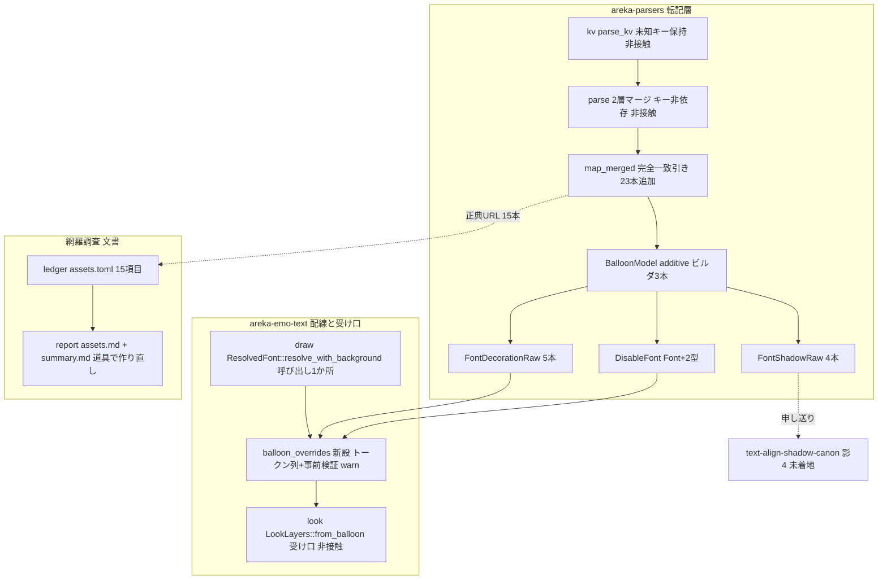

# 技術設計書: areka-P0-balloon-font-descript-keys

> 生成 2026-09-13・**改訂 2026-09-17**（`main` 取り込み後）。対象ブランチ `claude/areka-p0-balloon-font-keys-b2e272`。本文の file:line と行数はすべてこのブランチでの実測であり、着手時に再検証すること（行番号は動く。引用は「何の定義行か」で指す）。改訂前の設計（先着前提・配線なし）は git 履歴 `a6804540` 以前にある。

## Overview

**Purpose**: バルーン定義（`descript.txt`）の接頭辞なし `font.*` 基底 14 キーのうち、転記層が読み落としている 9 キー（`font.bold`・`font.italic`・`font.outline`・`font.strike`・`font.underline`・`font.shadowcolor.r`／`.g`／`.b`・`font.shadowstyle`）と、無効表示の書体設定 `disable.font.*` 14 キーを解析結果から取り出せるようにする。転記層は値の意味づけ（既定値・語彙判定・縮退・描画）を一切行わず、宣言された文字列をそのまま保つ。**書体まわりの下流（`areka-P0-text-decoration-canon`）は着地済み**なので、本仕様が最後に配線する——読んだ値を `\f` と同じ形のトークン列にして `look.rs` の受け口へ渡し、受け口が飛ばした綴り誤りは配線側で記録する。影の 4 キーは受け口が無いので配線せず取り出し口を申し送る。あわせて 14＋1 の定義箇所に正典 URL を揃え、網羅台帳・ドメイン別報告・全体報告・生きた 3 文書・調査ブリーフィングを実測に合わせる。

**Users**: バルーン作者（`font.bold,1` と書けば既定の見た目が太字になる。`disable.font.color.r/g/b` を書けば無効表示の色が指定どおりになる。綴りを誤れば警告で理由が分かる）、影まわりの実装者（`areka-P0-text-align-shadow-canon` が影 4 キーを取り出す口を得る）、網羅状況を読む人（台帳が今の実態を映す）。

**Impact**: 転記層 `crates/areka-parsers/src/balloon/` に生文字列転記型 2 つ・無効表示層の束 1 つ・完全一致引き 23 本（基底 9＋無効表示 14）が増える。配線層 `crates/areka-emo-text/` に純粋モジュール 1 つ（トークン列の組み立てと事前検証）が増え、`draw.rs` の受け口呼び出し 1 か所が空の列から組み立てた列へ変わる。**9 キーと `disable.font.*` を書いていないバルーンの見た目は変わらない**（宣言が無ければ渡す列は空＝従来と同じ呼び出し）。既存 5 キーの写像と `Font` 型・`look.rs` には触れない。

### Goals

- 9 キーと `disable.font.*` 14 キーを転記層の写像対象へ加え、「未指定」「宣言された値」（語彙外・`none` を含む）を潰さずに保つ（2.1〜2.9・3.1）。
- 2 層マージの優先順位と接頭辞付きキーの不漏れ（基底⇄無効表示の相互不漏れを含む）を決定論テストで固定する（4.1〜4.6・9.1〜9.7）。
- 基底の飾り 5 本と `disable.font.*`（飾り 5・書体名・大きさ・色）を `LookLayers::from_balloon` の受け口へ配線し、受け口が飛ばした値を `warn!` で記録する（8.1・8.2・8.5・8.6・9.10・9.11）。
- 14＋1 本の定義箇所に正典 URL のコメントを揃える（既設 4＋新設 11・6.1〜6.5）。
- 網羅台帳 15 項目・ドメイン別報告・全体報告・生きた 3 文書・調査ブリーフィングを実測へ是正する（1.1〜1.5・7.1〜7.10）。
- 影 4 キーの取り出し口と正典既定値を `areka-P0-text-align-shadow-canon` へ申し送る（3.2〜3.4・8.3・8.4）。
- 成功基準: `cargo test -p areka-parsers`・`cargo test -p areka-emo-text`・`cargo test -p ukadoc-survey`・`cargo run -p ukadoc-survey -- check` がいずれも緑で、既存テストの期待値を 1 つも緩めておらず、較正 3 通りで赤を実測している（5.3・7.9・9.9・9.12）。

### Non-Goals

- 接頭辞付き `font` 族のうち `disable.` 以外の 8 系統（`anchor.`／`anchor.notselect.`／`anchor.visited.`／`cursor.`／`cursor.notselect.`／`communicatebox.`／`number.`／`sstpmessage.`）の写像。基底キーへ漏れないことだけを守る（4.4）。
- `\f[...]` タグ側の意味論・リセット規則・描画（`text-decoration-canon` 着地済み／`text-align-shadow-canon`）。`look.rs`・`apply_font_tag` の改変。`font.outline` の描画（受け口が語彙のみと定める）。
- 影 4 キー（基底・無効表示とも）の配線——受け口が `shadowcolor`／`shadowstyle` を所有外として見た目を変えないため、`text-align-shadow-canon` が受け口を開けるときに配線する（8.3）。
- `font.name` の残る 1 点（バルーンのフォルダのフォントファイル）の是正。引受先を起票しない（開発者方針：正典追従は要望が出た時点で）。
- 正典（ukadoc）の項目増減に自動で気付く仕組み（9.8・2026-09-11 開発者裁定）。
- バルーン名 `name,` の写像（`areka-P0-emo-text-canon-residue` 項目 14・同じ写像関数ゆえ同居させない）。

---

## Boundary Commitments

### This Spec Owns

- **転記層の 23 本の写像**——`crates/areka-parsers/src/balloon/parse.rs` の写像関数 `map_merged` に、基底 9 本（`font.bold`・`font.italic`・`font.outline`・`font.strike`・`font.underline`・`font.shadowcolor.r`／`.g`／`.b`・`font.shadowstyle`）と無効表示 14 本（`disable.font.<基底 14 キー>`）の完全一致引きを加えること。
- **生文字列転記型 2 つと無効表示層の束 1 つ**——`crates/areka-parsers/src/balloon/model.rs` の `FontDecorationRaw`（0/1 系 5 本）・`FontShadowRaw`（影色 3 成分＋形態）・`DisableFont`（既存 `Font`＋上の 2 型の束）、および `BalloonModel` の additive ビルダ 3 本とアクセサ 3 本。`crates/areka-parsers/src/balloon/mod.rs` の再輸出 3 型（`pub use model::{...}` の 1 行。brief の編集集合 `balloon/{parse,model}.rs` の字面には無いが、同じ `balloon` モジュール内で `WindowPositionRaw` の先例と同じ流儀の 1 行であり、要件 9.8 の編集集合の記述もこれに合わせてある）。
- **15 本の正典 URL コメント**——`parse.rs` のキーを引く行に置く 11 本の新設（基底 10＋`disable.font.*` 1。既設 4 本は無改変）。
- **配線**——`crates/areka-emo-text/src/balloon_overrides.rs`（新設・純粋層）でトークン列を組み立てて事前検証し、`draw.rs` の `ResolvedFont::resolve_with_background` が `LookLayers::from_balloon` へ渡す 2 引数を空の列から組み立てた列へ変えること。`lib.rs` の走査一覧 `PURE_SOURCES` への新モジュールと兄弟テストの登録（母数 54→56）。
- **決定論テスト**——`parse_tests.rs`（値の形・2 層・不漏れ・14 の判定・無効表示層）・`model_tests.rs`（型のアクセサ・`Default`・ビルダ）・`balloon_overrides_tests.rs`（トークン列の形・事前検証の警告・端から端まで）への追加。
- **網羅台帳 `doc/ukadoc-coverage/ledger/assets.toml` の当該 15 項目**——状態・担当・束名・備考。`doc/ukadoc-coverage/report/assets.md`（`report`）と `report/summary.md`（`report-summary`）の道具による作り直し。
- **生きた 3 文書の「13 キー／残り 8 キー」是正**（7 か所）と、`doc/ukadoc-coverage/briefing-assets.md` の是正候補の段 ⑵ の書き換え。
- **下流への申し送り**（14 キー一覧・値の形・未指定の表し方・正典既定値・担当下流・配線済みか否か）。

### Out of Boundary

- `crates/areka-parsers/src/kv/`（KV 化層）——未知キーを保持する現状で足りる。**変更 0 行**。
- `parse.rs` の 2 層マージ（`parse` 関数の `descript.clone()`＋後勝ち `insert`）——キー非依存であり、23 本の優先順位は追加コード 0 で成立する。**変更 0 行**。
- `Font`／`FontColor` 型と `Font::new`（ワークスペース 50 呼出）・`BalloonModel::new` の署名——非接触。`DisableFont` は `Font` を**値として持つ**だけで `Font` 自体は変えない。
- `crates/areka-emo-text/src/look.rs`（`LookLayers::from_balloon`・`apply_font_tag`・`apply_overrides`）——完了済み spec が定めた受け口。呼び手として使うだけ。**変更 0 行**。
- `crates/areka-emo-text/src/draw.rs` の `resolve_with_background` のうち書体名・大きさ・色・選択肢文字色の解決——無改変。変わるのは `from_balloon` へ渡す 2 引数だけ。
- `crates/areka/**`・`crates/areka-emo-present/**`——非接触。
- `crates/ukadoc-survey/**`——道具は無改変。検査を足さない（9.8）。
- `doc/ukadoc-coverage/catalog.toml`（機械生成・非改変）、`briefing-assets.md` の段 ⑵ 以外、`.kiro/steering/roadmap-history.md`、`.kiro/specs/completed/**`（`areka-P0-text-decoration-canon` の brief を含む・非改変の方針）。

### Allowed Dependencies

- `crate::kv::parse_kv`（既存・foundation）——KV 化の唯一の入口。
- `std::collections::BTreeMap`・`std::str::FromStr`（既存）。**新規の外部依存 0**（`Cargo.toml` 非接触。`areka-emo-text` は `areka-parsers`・`tracing` に既に依存し、`log-capture-kit` は dev-deps に既にある）。
- `areka_emo_text::look::{LookLayers, TextLook, apply_font_tag, FontTagIssue}`（既存・公開）——配線の事前検証に使う。
- `cargo run -p ukadoc-survey -- report`／`-- report-summary`／`-- check`／`-- evidence`（既存の道具）。
- 依存方向は従来どおり `model ← parse`、`areka-parsers ← areka-emo-text`（片方向・逆流禁止）。配線モジュールは `areka-emo-text` 内の純粋層（`windows` 参照 0）に置く。

### Revalidation Triggers

| 変化 | 再確認が要る先 |
|---|---|
| `FontDecorationRaw`／`FontShadowRaw`／`DisableFont` の公開面（アクセサ名・戻り型）の変更 | `balloon_overrides.rs`（配線）・`areka-P0-text-align-shadow-canon`（影 4 の取り出し口） |
| `LookLayers::from_balloon` の引数の形・`apply_font_tag` の受ける語彙の変更 | `balloon_overrides.rs` のトークン列の形と事前検証（DD10） |
| `BalloonModel::new` の署名を伸ばす形へ回帰 | ワークスペース `BalloonModel::new` 43 呼出（本設計は additive ビルダで 0 波及） |
| 台帳 15 項目の状態・担当の再変更 | `report/assets.md`・`report/summary.md` の作り直し（`DomainReportStale`） |
| `map_merged` へ別 spec がキーを足す（`emo-text-canon-residue` 項目 14・`anchor-tag-canon`） | 後着側が本仕様の塊の直後へ足し、`FONT_BASE_KEYS` の 14 の判定（9.7）を壊さないこと |
| `text-align-shadow-canon` が影の受け口を開ける | 同仕様が `balloon_overrides.rs` に影のトークンを足す（本仕様は口を用意するだけ・8.3） |

---

## Architecture

### Existing Architecture Analysis

| 層 | 実形（定義行で指す） | 本仕様への含意 |
|---|---|---|
| 転記層 `parse.rs`（186 行） | `pub fn parse(descript, image)` が `descript.clone()` へ画像別層を後勝ち `insert` してから `map_merged` を 1 回呼ぶ。マージはキー非依存 | 4.1〜4.3・4.6 は**追加コード 0** で成立。仕事はテストで固定すること |
| 同 | `fn map_merged(merged)` が `merged.get("font.name")`・`get_scalar::<u32>(merged, "font.height")`・`get_scalar::<u8>(merged, "font.color.{r,g,b}")` の 5 本を引く | 基底 9 本を生文字列で、無効表示 14 本を「書体名・大きさ・色は基底と同じ形（`Font::new`）・残り 9 本は生文字列」で足す。既存 5 本の行は無改変（5.1） |
| 同 | `fn get_scalar<T: FromStr>` は非数値・範囲外を `None` へ降格する | 飾り 5・影 4 には**使わない**（2.5・2.6 に反する）。`merged.get(key).map(\|v\| v.to_owned())` の生文字列転記（`vertical`・`windowposition_raw` と同型）。無効表示層の大きさ・色は基底と同じく `get_scalar`（既存の縮退規則をそのまま継ぐ・DD9） |
| 同 | 正典 URL コメントは `map_merged` の**キーを引く行の直前**に `// ukadoc: <URL>` で置かれている（既設 18 本＝`origin` 2・`wordwrappoint` 2・`validrect` 4・`font.color.*` 3・`font.height` 1・`cursor.brush.color.*` 3・`cursor.font.color.*` 3。`cursor.pen.color.*` には無い） | 15 本をここへ揃える（DD1）。`font.name` は説明コメントだけあり URL 行が無い＝新設 11 本のうちの 1 本。`disable.font.*` はカタログの見出しが 1 つなので URL も 1 本 |
| モデル層 `model.rs`（529 行） | `BalloonModel::new` は 7 位置引数。additive ビルダ `with_cursor`／`with_windowposition_raw`／`with_vertical_raw` が「既存呼び出し側は無改変」を doc で宣言 | 第 4〜第 6 のビルダを同じ流儀で足す（DD2） |
| 同 | `WindowPositionRaw`（`Option<String>`×2・`#[non_exhaustive]`・`Default`・`Eq`）が生文字列転記型の先例。`Font` は `#[non_exhaustive]`・非公開 3 フィールド・`Default` 無し・`Eq` 派生 | `FontDecorationRaw`／`FontShadowRaw` はこの先例の写し。`DisableFont` は `Font`＋2 型を値で束ね、`Default` は手書き（`Font::new(None, None, FontColor::new(None, None, None))`） |
| 受け口 `areka-emo-text/src/look.rs`（769 行・**着地済み**） | `LookLayers::from_balloon(name_candidates, height, color, background, cursor_text, font_overrides: &[Vec<String>], disable_overrides: &[Vec<String>])`。`apply_overrides` が各トークン列を `apply_font_tag` に通し、`Err` は**黙って飛ばす**（doc が「記録はバルーン定義を読む側が出す」と本仕様へ申し送り）。受ける語彙: `bold`／`italic`／`underline`／`strike`／`outline`（`true`/`1`/`false`/`0`/`default`/`disable`）・`name`（候補列）・`height`・`color`（3 成分または 1 語）。`outline` は `Note::VocabularyOnly`（表示に効かない）。`shadowcolor`／`shadowstyle` は `UNOWNED_KEYS`＝`Note::Unowned`（見た目を変えない）。`TextLook::ukadoc_default()`・`apply_font_tag`・`FontTagIssue`・`LookLayers` の 3 フィールドはすべて `pub` | 配線はこの形へ合わせるだけ（DD10）。影は渡さない（DD11）。事前検証は公開 API だけで書ける |
| 消費側 `areka-emo-text/src/draw.rs`（737 行） | `ResolvedFont::resolve_with_background(model, background)` が `model.font()` から書体名（カンマ分割・記述順の候補列）・大きさ・色を解き、`from_balloon(..., &[], &[])` を呼ぶ。doc に「読めるようになったときはここで `model.font()` から読んで渡すだけで効く（読み取りの所有は `areka-P0-balloon-font-descript-keys`）」 | 空の列で土台の 2 層を先に組み、`balloon_overrides::overrides(model, &base)` の結果を最終の `from_balloon` へ渡す 1 か所（C8）。他は無改変（8.6） |
| 走査の番人 `areka-emo-text/src/lib.rs` | `PURE_SOURCES`（54 本・`include_str!` で `windows` 参照 0 を判定）と `SOURCES_OUTSIDE_THE_PURE_SCAN` の 2 一覧。`every_source_file_is_either_scanned_or_explicitly_excluded` が `src/*.rs` の実ファイル集合と突き合わせ、`assert_eq!(PURE_SOURCES.len(), 54)` で母数を固定 | 新モジュールと兄弟テストを `PURE_SOURCES` へ登録し母数を 56 へ（**登録しないと番人が赤**＝隠れた前提） |
| フィクスチャ | リポジトリ内のバルーン定義（`crates/areka-emo-text/examples/fixtures/emo2-vertical*/descript.txt`・`crates/pilot/examples/shiori-host-32/fixtures/emo2*/descript.txt`）に 9 キー・`disable.font.*` の宣言は **0 件**（09-17 実測） | 既存のフィクスチャ適合・描画比較テストは新フィールドが `None`・渡す列が空のまま＝赤にならない（5.3・5.4） |
| 網羅調査の道具 `crates/ukadoc-survey` | 証拠の行の形（`evidence/extract.rs`）は「字下げを除いた行頭がコメント記号・`ukadoc:` の後に空白＋1 語」。証拠の要否を見るのは `Status::Implemented` の行だけ。判定で効くのは `SourceUrlNotInCatalog`・`DomainReportStale`・`ImplementedWithoutEvidence`。担当 spec の実在・備考・束名は見ない。`report-summary` が `summary.md` を作り直す（README「台帳を触った人が走らせる」） | URL はカタログから写す（6.2）。`implemented` へ上げる 4 項目は `parse.rs` の URL が証拠になる。台帳の書き換え後は `report` と `report-summary` の両方が必須（7.8）。束名・備考は最終検証で全数を数え直す |
| 台帳 `ledger/assets.toml`（09-17 実測） | 15 項目とも `A5`。`absent` 10 の担当は本仕様（完了済み spec が移送）、`implemented` 4 の担当は `text-decoration-canon`、`disable.font.*` は `vocabulary-only`・担当 `text-decoration-canon`。`implemented` 28 項目が完了済み spec を担当に持つ＝「担当＝その状態を着地させた spec」が慣行 | 7.4・7.10 の担当の決め方はこの慣行に従う |

### Architecture Pattern & Boundary Map

**選定パターン**: 既存の additive 転記面の延長＋受け口への薄い配線。転記層の新設は生文字列転記型 2 つ・束 1 つ・ビルダ 3 本・アクセサ 3 本・完全一致引き 23 本で判断分岐 0。配線層の新設は純粋モジュール 1 つ（トークン列の組み立て＋事前検証＋警告）で、受け口の語彙の解釈は受け口に委ねる（配線は語彙を知らない——知るのは「どのキーがどのトークン名になるか」だけ）。



**Architecture Integration**:

- **責務の分離**: 転記層は読んで持つだけ。配線はトークン列に写して渡し、受け口が飛ばした事実だけを記録する。受け口が既定値の適用と語彙判定を持つ（着地済み）。型の境界（書体 5／影 4／無効表示の束）を「配線済み／申し送り」の分担に一致させる。
- **保たれる既存パターン**: 2 層マージのキー非依存性／完全一致引き／生文字列転記／additive ビルダ／`#[non_exhaustive]`＋非公開フィールド＋read-only アクセサ／未指定は `None`／受け口の「項目を列挙しないトークン列」／純粋層と `windows` 層の分離（走査一覧）。
- **Steering 準拠**: 「parser は転記層・ツリー構築は下流」／「ログ無し失敗経路の禁止」（配線が `warn!`）／「1 ファイル 1,000 行」／「新規テストは兄弟ファイル」／「零は明示的に書く」／「正典の増減に自動で気付く仕組みは買わない」／「檻は到達する経路を踏ませよ」（端から端までは `ResolvedFont::resolve` を通す）。

### 設計判断（DD1〜DD11）

| # | 判断 | 採った形 | 根拠・却下した案 |
|---|---|---|---|
| DD1 | 正典 URL の置き場 | **`parse.rs` のキーを引く行の直前に 15 本を揃える**。`model.rs`・配線には置かない | 既設 4 本と同ファイルの他の全 URL がこの位置。6.4 の「定義箇所」は「そのキーを引く行」。`disable.font.*` はカタログの見出しが 1 つなので、無効表示の塊の先頭に 1 本 |
| DD2 | 取り出し口の見え方 | **`FontDecorationRaw`／`FontShadowRaw` の 2 型を `BalloonModel` に additive で載せる**。`Font` は非接触 | `Font` に載せる案は `Font::new` 50 呼出の等価性を別途示す必要が出る。呼び出しは `model.font_decoration_raw().bold()` と `model.cursor().style()` と同じ深さ |
| DD3 | 値の型 | **飾り 5・影 4 は `Option<String>` の生文字列転記** | `get_scalar` は `font.bold,2`・`font.bold,yes` を `None` へ落とし宣言の事実が消える（2.5 違反）。`none`／数値／未指定は `None`／`Some("none")`／`Some("64")` でそのまま表せる |
| DD4 | 着地順（**09-17 改訂**） | **書体まわりは後着＝本仕様が配線する**（`text-decoration-canon` は `completed/` に在り PR#148 で `main` に入っている）。**影まわりは先着＝申し送り**（`text-align-shadow-canon` は brief のみ・受け口も無い） | 旧設計の「最終タスクで再測定」は不要になった（実測で確定）。最終検証で `text-align-shadow-canon` の状態を 1 度だけ再確認し、着地していれば影の配線を同仕様の設計に従って足すか判断する（本文の判定表） |
| DD5 | 「14 である」の判定（9.7） | `parse_tests.rs` に `FONT_BASE_KEYS: [&str; 14]` を持ち、**全 14 キーへ固有の値を入れて `parse()` を通し、各キーの値がアクセサから読み戻せることを判定**。同じ表に `disable.` を前置して無効表示層も読み戻す。カタログとは突き合わせない | 要素数だけの判定は配列の型で恒真になる。「読み戻せる」を判定にすれば、写像を 1 本消す・別のキー名に取り違える・別の口へ繋ぎ間違えると赤。**捕まえないもの**: 表に無い 15 本目の写像を実装側へ足すこと（9.7 の範囲外）と、正典側の増加（9.8・意図して緑のまま） |
| DD6 | テストの置き場 | **既存の `parse_tests.rs`・`model_tests.rs` へ追加**。配線は新設の兄弟 `balloon_overrides_tests.rs` | 着地後見込み ~760／~680／~260 行で 1,000 行番人に余裕。steering の目安は 1,000 行の 1 つだけ。着地時の実測が 1,000 行に迫るときだけ `<stem>_<テーマ>.rs` へ分割する |
| DD7 | 台帳の束名（7.5・**09-17 改訂**） | **状態ごとに束名を揃える**——`implemented`＝「台詞の書体・正典どおりに動く」（既設・4 項目が使用中）、`vocabulary-only`＝「台詞の書体・名前だけ受けて使わない」（既設・`disable.font.*` が使用中）、`degraded`＝「台詞の書体・読めるが正典どおりに描かれない」（**新設**——台帳 4 本に 0 件。`font.name`・`disable.font.*` の 2 項目のために作る）。優先度 `A5` は据え置き | 09-17 の台帳は優先度が 15 項目とも `A5` に揃い、束名が優先度の鍵ではなくなった。状態と束名を一致させれば 1 件も嘘が残らない。新設の束名は最終検証で「台帳 4 本を通して同じ綴りが本仕様の 2 項目にだけ在る」ことを数えて固定する。備考の「束の順位: N」は触らない（優先度欄が正本・7.5） |
| DD8 | 全体報告（**09-17 改訂**） | **本仕様が `report-summary` で `summary.md` を作り直し、台帳と同じコミットに入れる** | 統合担当が完了し、README が「台帳を触った人が走らせる」と定めた。申し送りの相手はもう居ない |
| DD9 | 無効表示層の型（**09-17 新設**） | **`DisableFont { font: Font, decoration: FontDecorationRaw, shadow: FontShadowRaw }` の束 1 つ**を `BalloonModel` に additive で載せる。書体名・大きさ・色は既存 `Font` を値で再利用（`get_scalar` の縮退規則を継ぐ）、残り 9 本は基底と同じ 2 型 | 新しい値の型を増やさず、基底と無効表示で「同じキーは同じ形」が保たれる。基底の `font()` を別扱いにしないため `BalloonModel` の既存の面は変わらない。14 個のフィールドを 1 つの平らな型に並べる案は `Font` と重複する形になる |
| DD10 | 配線の形と綴り誤りの記録（**09-17 新設・検証で是正**） | **純粋モジュール `balloon_overrides.rs`** に `overrides(model, base: &LookLayers) -> BalloonOverrides { font, disable }` を置く。宣言されたキーだけをトークン列へ写す（飾り: `[key, 値]`／`name`: `["name"]`＋カンマ分割・trim（基底の `resolve` と同じ切り方）／`height`: `["height", 値]`／`color`: 3 成分が揃ったときだけ `["color", r, g, b]`）。**受け口と同じ順序・同じ土台で事前検証**する——`base`（`from_balloon` を空の列で呼んだ結果）の `default` を写した探り用の `TextLook` に基底の列を順に `apply_font_tag` し、次にその複製へ無効表示の列を順に適用する。`Err` なら `warn!(key, value, reason, …)` で記録し、列からは外さない（受け口も同じ判定で飛ばす）。色の成分不足は配線が自分で `warn!` する | 受け口の `apply_overrides` は `Err` を黙って飛ばす設計で、記録を本仕様へ申し送っている。受け口の改変は完了済み spec の面を触るので採らない。**`Err` の条件は綴りだけでは決まらない**——相対・百分率の `height`（`+4`・`-10`・`150%`）は「今効いている大きさ」に足して `0` 以下なら `Err`（`look.rs` の `apply_height`）。だから探り用の土台は既定の層ではなく、バルーン定義から組んだ実際の層でなければ受け口と判定が一致しない（設計検証の指摘で是正）。判定の実体は受け口 1 か所に留まる（配線が語彙表を複製しない）。記録は 1 回の解決で同じ（キー, 値）が 1 度ずつ（各キーは列に 1 度しか現れない）。`draw.rs` に直書きせず純粋モジュールにするのは、COM 無しでテストするためと `draw.rs`（737 行）を伸ばさないため |
| DD11 | 影 4 キーは渡さない（**09-17 新設**） | 基底・無効表示とも `FontShadowRaw` を配線に**渡さない**。取り出し口を申し送る | 受け口は `shadowcolor`／`shadowstyle` を `Note::Unowned` として見た目を変えない。渡しても無害だが、3 成分を 1 トークンへ束ねる形（`\f[shadowcolor,r,g,b]`）と `none` の扱いは影まわりの仕様が決めるべき語彙判断で、本仕様が先に固定すると後で覆される。「渡さない」を W6 で明示的に固定する |

### Technology Stack

| Layer | Choice / Version | Role in Feature | Notes |
|-------|------------------|-----------------|-------|
| 転記層 | Rust 2024（既存 `areka-parsers`・依存 `encoding_rs`／`tracing` のみ） | KV→型写像 | 新規依存 0。`tracing` は転記層で使わない |
| 配線層 | Rust 2024（既存 `areka-emo-text`・`tracing` 既出・`log-capture-kit` は dev-deps 既出） | トークン列の組み立て・事前検証・`warn!` | 新規依存 0。純粋層（`windows` 参照 0） |
| 網羅調査の道具 | `ukadoc-survey`（既存・`report`／`report-summary`／`check`／`evidence`） | 台帳と報告の整合 | 無改変 |

---

## File Structure Plan

### Modified Files（コード）

| ファイル | 現在行数 | 変更 | 着地後見込み／余裕（上限 1,000） |
|---|---:|---|---|
| `crates/areka-parsers/src/balloon/parse.rs` | 186 | `map_merged` に基底 9 本の生文字列転記（`FontDecorationRaw::new`・`FontShadowRaw::new`）と無効表示 14 本（`DisableFont::new(Font::new(...), FontDecorationRaw::new(...), FontShadowRaw::new(...))`）を追加し、ビルダ 3 本で相乗り。生文字列引きの小さな私的ヘルパ 1 つ。正典 URL コメント 11 本を新設。`use super::model::{...}` に 3 型を追加。モジュール doc に 1 段追記 | ~260／~740 |
| `crates/areka-parsers/src/balloon/model.rs` | 529 | `FontDecorationRaw`・`FontShadowRaw`・`DisableFont` の定義（各 `new`＋アクセサ・`DisableFont` は手書き `Default`）、`BalloonModel` のフィールド 3・ビルダ 3・アクセサ 3、`new` の初期化 3 行、モジュール doc に 1 段追記 | ~700／~300 |
| `crates/areka-parsers/src/balloon/mod.rs` | 26 | `pub use model::{...}` に 3 型を追加 | ~27 |
| `crates/areka-parsers/src/balloon/parse_tests.rs` | 409 | T1〜T16（下記 Testing Strategy）＋`FONT_BASE_KEYS` | ~760／~240 |
| `crates/areka-parsers/src/balloon/model_tests.rs` | 596 | M1〜M4 | ~690／~310 |
| `crates/areka-emo-text/src/balloon_overrides.rs` | **新設** | `BalloonOverrides`・`overrides(model, base)`・トークン列の組み立て・受け口と同じ順序の事前検証・`warn!`。末尾に `#[cfg(test)] #[path = …] mod balloon_overrides_tests;` | ~150 |
| `crates/areka-emo-text/src/balloon_overrides_tests.rs` | **新設** | W1〜W9・E1〜E4 | ~280 |
| `crates/areka-emo-text/src/draw.rs` | 737 | `resolve_with_background` で土台の 2 層を空の列で組み、`balloon_overrides::overrides` の結果を最終の `from_balloon` へ渡す（呼び出し 1 か所・`let` 2 行）。doc の「読めるようになったときは…」の段を現状へ | ~745 |
| `crates/areka-emo-text/src/lib.rs` | 469 | `pub mod balloon_overrides;`（テストモジュールの宣言は置かない）。`PURE_SOURCES` に 2 本登録・母数 54→56 | ~474 |

### Modified Files（文書・台帳）

| ファイル | 変更 |
|---|---|
| `doc/ukadoc-coverage/ledger/assets.toml` | 15 項目（`descript_balloon:font.*` 14＋`disable.font.*` 1）の `status`／`owner`／`note`。`priority`・`values`・`links`・`introduced` は無改変。並び順は変えない |
| `doc/ukadoc-coverage/report/assets.md` | `cargo run -p ukadoc-survey -- report` で作り直す（手で書かない） |
| `doc/ukadoc-coverage/report/summary.md` | `cargo run -p ukadoc-survey -- report-summary` で作り直す（手で書かない） |
| `doc/ukadoc-coverage/briefing-assets.md` | 是正候補の段 ⑵ を是正済みの記録へ書き換え |
| `.kiro/specs/areka-P0-balloon-font-descript-keys/brief.md` | 「基底 13 キー」4 か所（起票行・Problem・Desired Outcome・Scope の In）→ 14、09-13 相互登記の「残り 8 キー」1 か所 → 9。数え落としが `font.outline` である旨を 1 か所に添える |
| `.kiro/specs/areka-P0-text-align-shadow-canon/brief.md` | Scope の Out の行（「基底 13 キー」）→ 14 |
| `.kiro/steering/roadmap.md` | W13 干渉台帳の行（「既定層の残り 8 キーは後着が配線」）→ 9 |

### Untouched（零の明示）

- `crates/areka-parsers/src/kv/**`: 0 行。
- `parse.rs` の 2 層マージ本体（`parse` 関数）: 0 行（キー非依存）。
- `Font`／`FontColor`／`BalloonModel::new` の署名: 0 行。
- `crates/areka-emo-text/src/look.rs`・`color.rs`・`state_decoration.rs`・`actor*.rs`: 0 行。
- `crates/areka/**`・`crates/areka-emo-present/**`・`crates/ukadoc-survey/**`: 0 行。
- `Cargo.toml`（全 crate）: 0 行。
- `doc/ukadoc-coverage/catalog.toml`・`report/{property,sakura-script,shiori}.md`: 0 行（`report` の作り直し後に `git status` で `assets.md`・`summary.md` 以外に差分が出ないことを確かめる）。
- `.kiro/steering/roadmap-history.md`・`.kiro/specs/completed/**`（`text-decoration-canon` の brief の「13 キー」7 か所と「残り 8 キー」1 か所を含む）: 0 行。

---

## Requirements Traceability

| Requirement | Summary | Components | Interfaces | Flows |
|---|---|---|---|---|
| 1.1 | 対象キー集合 14 を本文に列挙 | C7 引き渡し表・`FONT_BASE_KEYS` | — | — |
| 1.2 | 写像済み 5／未写像 9／対象外 0 を明示 | C7（対象外 0 本と明記） | — | — |
| 1.3 | 生きた 3 文書 7 か所の「13」「残り 8」を是正 | C6 文書是正 | — | — |
| 1.4 | 食い違いはカタログを照合元に | C6（`catalog.toml` の 14 行が照合元） | — | — |
| 1.5 | ブリーフィング段 ⑵ を同じコミットで書き換え | C6 | — | — |
| 2.1 | 0/1 系 5 本の保持 | C1 転記・C2 `FontDecorationRaw` | `bold()`…`underline()` | — |
| 2.2 | 影色 3 成分を個別に保持 | C1・C2 `FontShadowRaw` | `color_r()`／`color_g()`／`color_b()` | — |
| 2.3 | `font.shadowstyle` の保持 | C1・C2 | `style()` | — |
| 2.4 | 未指定と宣言値の区別 | C2（`Option<String>`） | `None`／`Some(_)` | — |
| 2.5 | 語彙外の値を素通し | C1（`get_scalar` 不使用・DD3） | — | — |
| 2.6 | `none`／数値／未指定の 3 値区別 | C2（DD3） | — | — |
| 2.7 | 解釈・描画・エラー通知を行わない | C1（`Result` 無し・ログ 0 行） | — | — |
| 2.8 | `disable.font.*` 14 本を別の層で保持 | C1・C2 `DisableFont`（DD9） | `disable_font().font()`／`.decoration_raw()`／`.shadow_raw()` | — |
| 2.9 | 無効表示層は未指定のまま・基底を複製しない | C1（`Default` は全 `None`） | — | — |
| 3.1 | 既定値を代入しない | C1（未指定は `None`） | — | — |
| 3.2 | 14 キーの正典既定値を表に登記 | C7 引き渡し表 | — | — |
| 3.3 | `shadowstyle` の語彙 2 語と 2.5.27 | C7 | — | — |
| 3.4 | 既定値の適用先（書体 10 は受け口・影 4 は下流） | C7・C8（宣言されたキーだけを渡す） | — | — |
| 4.1 | 同一キーは画像別層が勝つ | 既存マージ（0 行）・T7 | — | — |
| 4.2 | 画像別に無ければ既定層を継承 | 既存マージ・T8 | — | — |
| 4.3 | 画像別層そのものが無い | 既存マージ・T9 | — | — |
| 4.4 | 接頭辞付きキーを基底へ反映しない・基底⇄無効表示の相互不漏れ | 完全一致引き・T10・T14 | — | — |
| 4.5 | 非写像キーを従来どおり無視 | 完全一致引き・既存 distractor テスト | — | — |
| 4.6 | 無効表示層も 2 層の優先順位に従う | 既存マージ・T15 | — | — |
| 5.1 | 既存 5 キーの解析結果を変えない | `Font` 非接触（DD2）・T12 | — | — |
| 5.2 | `font.*` 以外の解析結果を変えない | 既存写像行の無改変・既存テスト全緑 | — | — |
| 5.3 | 既存テストの期待値を緩めない | Testing Strategy（既存テストは無改変） | — | — |
| 5.4 | 宣言の無いバルーンの見た目を変えない | C8（宣言が無ければ列は空）・W7・フィクスチャ 0 件 | — | — |
| 5.5 | `font.bold,1` が既定の見た目になる | C8・E1 | — | 配線フロー |
| 6.1 | 15 本の URL（既設 4・新設 11） | C4 | — | — |
| 6.2 | URL はカタログから写す | C4 | — | — |
| 6.3 | 行の形 | C4 | — | — |
| 6.4 | 定義箇所だけに置く（配線には置かない） | DD1 | — | — |
| 6.5 | `SourceUrlNotInCatalog` 0 件 | C5 検査コマンド | — | — |
| 7.1 | 4 項目を `implemented`・`outline` と影 4 を `vocabulary-only` へ | C5 | — | — |
| 7.2 | 備考を実態と記録の有無へ | C5 備考テンプレート | — | — |
| 7.3 | 「13 キー」の一文を除く（`implemented` 4 項目） | C5 | — | — |
| 7.4 | 影 4 の担当は align-shadow・他は本仕様 | C5 | — | — |
| 7.5 | `A5` 据え置き・束名を状態で揃える | C5・DD7 | — | — |
| 7.6 | `implemented` 4 項目を据え置き | C5 | — | — |
| 7.7 | `font.name` を `degraded`（残る食い違いは 1 点） | C5 | — | — |
| 7.8 | `report`＋`report-summary`・保存形の確認 | C5・DD8 | — | — |
| 7.9 | 検査とテストで食い違い 0 件 | C5 検査コマンド | — | — |
| 7.10 | `disable.font.*` を `degraded`・担当を本仕様へ | C5 | — | — |
| 8.1 | 基底の飾り 5 本を `font_overrides` へ | C8（DD10）・W1・E1 | `overrides(&BalloonModel, &LookLayers).font` | 配線フロー |
| 8.2 | `disable.font.*` を `disable_overrides` へ | C8・W2・E2・E3 | `overrides(&BalloonModel, &LookLayers).disable` | 配線フロー |
| 8.3 | 影 4 は渡さず申し送り | DD11・W6・C7 | — | — |
| 8.4 | 引き渡す内容を文書に残す | C7 引き渡し表 | — | — |
| 8.5 | 受け口が飛ばした値を `warn!` | C8（事前検証）・W3・W4・W5・W9 | — | 配線フロー |
| 8.6 | `resolve_with_background` の他の結果を変えない | C8（`let` 2 行の差し替えだけ）・既存 draw テスト | — | — |
| 9.1 | 9 キーの宣言値が取り出せる | T1・T2 | — | — |
| 9.2 | 未指定を宣言 `0` と取り違えない | T3 | — | — |
| 9.3 | 語彙外の値の素通し | T4 | — | — |
| 9.4 | 影色 3 値区別と部分欠落 | T5・T6 | — | — |
| 9.5 | 2 層の優先順位 3 形（無効表示層を含む） | T7・T8・T9・T15 | — | — |
| 9.6 | 接頭辞付きキーの不漏れ（影・`disable.` を含む）・既存行を壊さない | T10・T14 | — | — |
| 9.7 | 14 の判定（実装側だけ・無効表示層も同じ表） | T11・DD5 | — | — |
| 9.8 | 正典追随の仕組みを設けない・編集集合 | DD5・`ukadoc-survey` 非接触・File Structure Plan | — | — |
| 9.9 | 出力を切り詰めずに緑を確かめる | Testing Strategy の検査コマンド | — | — |
| 9.10 | 端から端まで（既定層・無効表示層・色・`outline`） | E1〜E4 | — | 配線フロー |
| 9.11 | 警告 1 度ずつ・正典どおりは 0 行 | W3・W4・W5 | — | — |
| 9.12 | 較正 3 通り | Testing Strategy「較正」 | — | — |

---

## Components and Interfaces

| Component | Domain/Layer | Intent | Req Coverage | Key Dependencies | Contracts |
|---|---|---|---|---|---|
| C1 転記層の 23 本の写像 | `areka-parsers::balloon::parse` | マージ済み 1 マップから基底 9 本を生文字列で、無効表示 14 本を基底と同じ形で引き、3 つの値へ束ねる | 2.1〜2.9, 3.1, 4.1〜4.6, 5.1, 5.2 | C2（P0） | Service |
| C2 転記型 3 つ | `areka-parsers::balloon::model` | `FontDecorationRaw`／`FontShadowRaw`／`DisableFont`・`BalloonModel` のビルダとアクセサ | 2.1〜2.4, 2.6, 2.8, 2.9, 5.1 | — | State |
| C3 決定論テスト | `parse_tests.rs`／`model_tests.rs`／`balloon_overrides_tests.rs` | 値の形・2 層・不漏れ・14 の判定・型の公開面・トークン列・警告・端から端まで | 9.1〜9.7, 9.10〜9.12, 5.3 | C1, C2, C8 | — |
| C4 正典 URL コメント | `parse.rs` | 15 本の証拠 | 6.1〜6.5 | `catalog.toml`（読むだけ） | — |
| C5 網羅台帳の是正 | `doc/ukadoc-coverage/` | 15 項目の状態・担当・束名・備考と報告 2 本の作り直し | 7.1〜7.10 | `ukadoc-survey`（道具・P0） | Batch |
| C6 文書是正 | `.kiro/specs/*/brief.md`・`roadmap.md`・`briefing-assets.md` | 「13」「残り 8」の是正・段 ⑵ の書き換え | 1.3〜1.5 | — | — |
| C7 下流への引き渡し | 本書 | 14 キー表・既定値・担当・配線済みか否か | 1.1, 1.2, 3.2〜3.4, 8.3, 8.4 | — | — |
| C8 配線 | `areka-emo-text::balloon_overrides`・`draw` | トークン列の組み立て・事前検証・`warn!`・受け口への受け渡し | 3.4, 5.4, 5.5, 8.1, 8.2, 8.5, 8.6 | C2（P0）・`look`（既存・P0） | Service |

### 転記層

#### C1 転記層の 23 本の写像（`parse.rs`）

| Field | Detail |
|---|---|
| Intent | `map_merged` が基底 9 本を完全一致で引いて生文字列のまま `FontDecorationRaw`／`FontShadowRaw` へ束ね、`disable.font.*` 14 本を `DisableFont`（`Font`＋2 型）へ束ね、`BalloonModel` へ additive に相乗りさせる |
| Requirements | 2.1〜2.9, 3.1, 4.1〜4.6, 5.1, 5.2 |

**Responsibilities & Constraints**
- 生文字列の引きは `merged.get(key).map(|v| v.to_owned())`（`vertical`・`writing_mode` と同型）。18 回繰り返すので私的ヘルパ `fn get_raw(merged, key) -> Option<String>` を 1 つ置く（3 行）。**飾り 5・影 4 に `get_scalar` を使わない**（DD3）。
- 無効表示層の書体名・大きさ・色は基底の 5 本と**同じ式**で引く（`get_raw`／`get_scalar::<u32>`／`get_scalar::<u8>`×3）。既存の縮退規則（非数値→`None`）をそのまま継ぐ（DD9）。
- 既存 5 本の写像行（`font.name`・`font.height`・`font.color.{r,g,b}`）と `Font::new(...)` の呼び出しは**無改変**。
- 相乗りは既存のビルダ連鎖の末尾に `.with_font_decoration_raw(...).with_font_shadow_raw(...).with_disable_font(...)` を継ぐ。
- 2 層マージ・KV 化は非接触。
- ログを 1 行も出さない（`tracing` 不使用）。`Result` を返さず panic しない。
- 23 本は `cursor` の束の直後に**基底 9→無効表示 14 の順で 1 塊**として置き、後着 spec が rebase しやすい差分にする。

**Dependencies**
- Outbound: C2 `FontDecorationRaw::new`／`FontShadowRaw::new`／`DisableFont::new`／`BalloonModel::with_*`（P0）。
- Inbound: `parse`／`parse_str`（既存）。

**Contracts**: Service [x]

##### Service Interface（既存署名・無改変）

```rust
pub fn parse(descript: &BTreeMap<String, String>, image: Option<&BTreeMap<String, String>>) -> BalloonModel;
pub fn parse_str(descript: &str, image: Option<&str>) -> BalloonModel;
```

- Preconditions: 入力はデコード済み（charset は上流責務）。
- Postconditions: 基底 9 本それぞれについて、マージ済みマップにキーが在れば `Some(値をそのまま)`、無ければ `None`。無効表示 14 本は `disable.font.<キー>` について同じ（大きさ・色は基底と同じ縮退規則）。既存の全アクセサの戻り値は本仕様の前後で同一。`disable.font.*` が 1 本も無ければ `disable_font()` は `DisableFont::default()`（全 `None`）。
- Invariants: 接頭辞付きキーは別のキーであり、完全一致引きゆえ基底キーへ届かない。`font.bold` は無効表示層へ、`disable.font.bold` は基底層へ届かない。

### モデル層

#### C2 転記型 3 つ（`model.rs`）

| Field | Detail |
|---|---|
| Intent | 書体 5 本と影 4 本を未指定＝`None` で個別に保つ不変値オブジェクト 2 つと、無効表示層 14 本の束 1 つ。`BalloonModel` から参照で読める |
| Requirements | 2.1〜2.4, 2.6, 2.8, 2.9, 5.1 |

**Contracts**: State [x]

##### State Management（公開面）

```rust
/// `font.bold`／`font.italic`／`font.outline`／`font.strike`／`font.underline` の生文字列。
#[non_exhaustive]
#[derive(Clone, Debug, Default, PartialEq, Eq)]
pub struct FontDecorationRaw { bold: Option<String>, italic: Option<String>, outline: Option<String>, strike: Option<String>, underline: Option<String> }
impl FontDecorationRaw {
    pub fn new(bold: Option<String>, italic: Option<String>, outline: Option<String>, strike: Option<String>, underline: Option<String>) -> Self;
    pub fn bold(&self) -> Option<&str>;  pub fn italic(&self) -> Option<&str>;  pub fn outline(&self) -> Option<&str>;
    pub fn strike(&self) -> Option<&str>;  pub fn underline(&self) -> Option<&str>;
}

/// `font.shadowcolor.r`／`.g`／`.b`／`font.shadowstyle` の生文字列。
#[non_exhaustive]
#[derive(Clone, Debug, Default, PartialEq, Eq)]
pub struct FontShadowRaw { color_r: Option<String>, color_g: Option<String>, color_b: Option<String>, style: Option<String> }
impl FontShadowRaw {
    pub fn new(color_r: Option<String>, color_g: Option<String>, color_b: Option<String>, style: Option<String>) -> Self;
    pub fn color_r(&self) -> Option<&str>;  pub fn color_g(&self) -> Option<&str>;  pub fn color_b(&self) -> Option<&str>;  pub fn style(&self) -> Option<&str>;
}

/// `disable.font.*`——無効表示の書体設定 14 本。基底の `font.*` とは別の層。
#[non_exhaustive]
#[derive(Clone, Debug, PartialEq, Eq)]
pub struct DisableFont { font: Font, decoration: FontDecorationRaw, shadow: FontShadowRaw }
impl DisableFont {
    pub fn new(font: Font, decoration: FontDecorationRaw, shadow: FontShadowRaw) -> Self;
    pub fn font(&self) -> &Font;
    pub fn decoration_raw(&self) -> &FontDecorationRaw;
    pub fn shadow_raw(&self) -> &FontShadowRaw;
}
impl Default for DisableFont {  // 全キー未指定
    fn default() -> Self { Self::new(Font::new(None, None, FontColor::new(None, None, None)), FontDecorationRaw::default(), FontShadowRaw::default()) }
}

impl BalloonModel {
    // `new` は無改変（7 位置引数）。新フィールド 3 つは `Default`（全キー未指定）で初期化する。
    pub fn with_font_decoration_raw(self, v: FontDecorationRaw) -> Self;
    pub fn with_font_shadow_raw(self, v: FontShadowRaw) -> Self;
    pub fn with_disable_font(self, v: DisableFont) -> Self;
    pub fn font_decoration_raw(&self) -> &FontDecorationRaw;
    pub fn font_shadow_raw(&self) -> &FontShadowRaw;
    pub fn disable_font(&self) -> &DisableFont;
}
```

- State model: 全フィールド非公開・`#[non_exhaustive]`。`Default` は「全キー未指定」の素直な表現で `BalloonModel::new` が用いる。`Eq` は `BalloonModel` の `Eq` 派生を満たすため（`Font` は `Eq` 派生済み）。
- 命名: 生文字列転記型は `WindowPositionRaw`／`vertical_raw` に倣い `Raw` を付ける。`DisableFont` は正典の見出し `disable.font.*` の写しで、束であって生文字列ではないため `Raw` を付けない。
- `mod.rs` の `pub use model::{...}` に 3 型を加え、下流が `areka_parsers::balloon::{DisableFont, FontDecorationRaw, FontShadowRaw}` で引けるようにする。
- doc コメントには「値の解釈（0/1 の判定・`none` の判定・語彙外の縮退・警告）は下流の責務」と、担当下流（書体＝`look.rs` の受け口へ本仕様が配線済み・影＝`areka-P0-text-align-shadow-canon`）を書く。

**Implementation Notes**
- Integration: `BalloonModel` の構造体にフィールド 3 つを足し、`new` の本体で `Default` を代入（署名は不変）。モジュール doc の設計規律の箇条書きに 1 段追記。
- Validation: `model_tests.rs` の M1〜M4。
- Risks: `model.rs` は 529 → ~700 行。1,000 行番人に対する余裕 ~300 行。

### 配線

#### C8 配線（`balloon_overrides.rs`・`draw.rs`）

| Field | Detail |
|---|---|
| Intent | `BalloonModel` から宣言されたキーだけを `\f` と同じ形のトークン列へ写し、受け口と同じ判定で事前検証して飛ばされる値を `warn!` で記録し、`LookLayers::from_balloon` の 2 引数へ渡す |
| Requirements | 3.4, 5.4, 5.5, 8.1, 8.2, 8.5, 8.6 |

**Contracts**: Service [x]

##### Service Interface

```rust
// crates/areka-emo-text/src/balloon_overrides.rs（純粋層・windows 参照 0）
/// `LookLayers::from_balloon` の 2 引数に渡す列。
#[non_exhaustive]
#[derive(Clone, Debug, Default, PartialEq, Eq)]
pub struct BalloonOverrides { pub font: Vec<Vec<String>>, pub disable: Vec<Vec<String>> }
/// 基底の飾り 5 本 → `font`、`disable.font.*`（飾り 5・`name`・`height`・`color`）→ `disable`。
/// 宣言されたキーだけ。影は渡さない（DD11）。`base` はバルーン定義から空の列で組んだ 2 層で、
/// 受け口と同じ順序で事前検証するための土台（DD10）。
pub fn overrides(model: &BalloonModel, base: &LookLayers) -> BalloonOverrides;

// 末尾に兄弟テストを結ぶ（クレートの慣行・structure.md）
#[cfg(test)]
#[path = "balloon_overrides_tests.rs"]
mod balloon_overrides_tests;
```

- トークン列の形（受け口 `apply_font_tag` の `args[0]`＝キー、`args[1..]`＝値の列）:

| 転記層の口 | 条件 | トークン列 |
|---|---|---|
| `font_decoration_raw().bold()` ほか 4 本 | `Some(v)` | `["bold", v]`（`italic`／`underline`／`strike`／`outline` も同形。値は**そのまま**渡す——`1`／`0`／`true`／`false` の判定は受け口） |
| `disable_font().decoration_raw()` の 5 本 | 同上 | 同上 |
| `disable_font().font().name()` | `Some(raw)` | `["name"]`＋`raw.split(',').map(str::trim)` を記述順のまま（基底の `resolve` の切り方と同じ。空トークンを潰さないのは受け口の doc「解読層が空を潰さずに渡してくる」に合わせる） |
| `disable_font().font().height()` | `Some(h)` | `["height", h.to_string()]` |
| `disable_font().font().color()` | `r`・`g`・`b` が**すべて** `Some` | `["color", r.to_string(), g.to_string(), b.to_string()]` |
| 同 | 1〜2 成分だけ `Some` | 列に入れず `warn!(key = "disable.font.color", value = <揃った成分>, reason = "3 成分が揃っていない", …)` |
| `font_shadow_raw()`／`disable_font().shadow_raw()` | — | **渡さない**（DD11） |

- 事前検証（8.5）——受け口の `apply_overrides` と**同じ順序・同じ土台**で写す:
  1. `probe = base.default.clone()`。基底の列を組みながら、各列について `apply_font_tag(&mut probe, base, &args)` を呼ぶ。
  2. `probe_disable = probe.clone()`（受け口は色だけ混色して複製するが、`Err` の判定に色は関わらない）。無効表示の列を組みながら、各列について `apply_font_tag(&mut probe_disable, base, &args)` を呼ぶ。
  3. `Err(FontTagIssue { key, value, reason })` なら `warn!(key, value, reason, "バルーン定義の書体設定を適用できない——当該項目は既定のまま")` を出す。列からは外さない（受け口が同じ判定で飛ばすので結果は同じ。外すと「受け口が判定の唯一の実体」が崩れる）。`Ok(Some(Note::VocabularyOnly))`（`outline`）・`Ok(None)` は記録しない。
  - `apply_font_tag` の第 2 引数（`default`／`disable` の語の解決先）は受け口では「差し込み前の層の複製」だが、`Err` の判定はそこを読まない（`height,default` の解決先は常に正値）。`base` を渡せば十分。
  - 相対・百分率の `height` は探り用の `probe` の大きさに足して判定されるので、`font.height,8`＋`disable.font.height,-10` は `Err`（受け口も飛ばす）、`font.height,20`＋`disable.font.height,-15` は `Ok`（受け口も適用）——W9 で固定する。
- 記録の回数: 各キーは列に 1 度しか現れないので、1 回の解決で同じ（キー, 値）は 1 度まで（8.5）。解決のたびに出るのは既存の `font.name`／`font.height` の `warn!` と同じ周期。
- `draw.rs` の変更は `resolve_with_background` 内の 1 か所: `let base = LookLayers::from_balloon(candidates.clone(), height, color, background, cursor_text, &[], &[]); let o = balloon_overrides::overrides(model, &base);` を置き、最終の `from_balloon(candidates, …, &o.font, &o.disable)` へ渡す（`from_balloon` は純関数で 2 度呼んでも副作用が無い）。他の解決（書体名・大きさ・色・選択肢文字色）は無改変（8.6）。doc の「読めるようになったときはここで…」の段は現状（配線済み）へ書き換える。
- `lib.rs`: `pub mod balloon_overrides;` を足し、`PURE_SOURCES` に `("balloon_overrides.rs", include_str!(...))` と `("balloon_overrides_tests.rs", include_str!(...))` を追加して `assert_eq!(PURE_SOURCES.len(), 56, …)` へ。**テストモジュールの宣言は `lib.rs` に置かない**——クレートの慣行（`look.rs`・`draw.rs` の末尾）と `structure.md` のとおり、本番ファイル `balloon_overrides.rs` の末尾に `#[cfg(test)] #[path = "balloon_overrides_tests.rs"] mod balloon_overrides_tests;` で結ぶ。

**Implementation Notes**
- Validation: W1〜W8・E1〜E4（Testing Strategy）。
- Risks: `apply_font_tag` の語彙が変われば事前検証の結果も自動で追随する（配線は語彙表を持たない）。**探り用の土台を既定の層で代用してはならない**——`switch`・`color`・`name` の `Err` は綴りだけで決まるが、`height` の相対・百分率は「今効いている大きさ」に依存する（`look.rs` の `apply_height`：`current.height + delta` が `0` 以下なら `Err`）。土台と順序を受け口に揃えることで判定が一致する（設計検証の指摘 1・W9 で固定）。

### 証拠

#### C4 正典 URL コメント（`parse.rs`）

15 本の URL。**既設 4 本（`font.color.r`／`.g`／`.b`・`font.height`）は無改変**、**新設 11 本**を各キーを引く行の直前に `// ukadoc: <URL>` の 1 行で置く（説明文を続けない）。URL は `doc/ukadoc-coverage/catalog.toml` の当該行の `url` 欄からの写しである（下表はその写し。実装時もカタログから写し、打ち直さない）。基底 `https://ssp.shillest.net/ukadoc/manual/descript_balloon.html`。

| キー | アンカー（`#` 以降） | 既設／新設 |
|---|---|---|
| `font.name` | `font.name_2c_30d5_30a9_30f3_30c8_540d:1` | **新設**（説明コメント `// font.name は文字列値…` は残し、その直後に URL 行を足す） |
| `font.height` | `font.height_2c_6570_5024:1` | 既設 |
| `font.color.r` | `font.color.r_2c_6570_5024:1` | 既設 |
| `font.color.g` | `font.color.g_2c_6570_5024:1` | 既設 |
| `font.color.b` | `font.color.b_2c_6570_5024:1` | 既設 |
| `font.bold` | `font.bold_2c0_2f1:1` | 新設 |
| `font.italic` | `font.italic_2c0_2f1:1` | 新設 |
| `font.outline` | `font.outline_2c0_2f1:1` | 新設 |
| `font.strike` | `font.strike_2c0_2f1:1` | 新設 |
| `font.underline` | `font.underline_2c0_2f1:1` | 新設 |
| `font.shadowcolor.r` | `font.shadowcolor.r_2c_6570_5024:1` | 新設 |
| `font.shadowcolor.g` | `font.shadowcolor.g_2c_6570_5024:1` | 新設 |
| `font.shadowcolor.b` | `font.shadowcolor.b_2c_6570_5024:1` | 新設 |
| `font.shadowstyle` | `font.shadowstyle_2c_5f62_614b_6307_5b9a:1` | 新設 |
| `disable.font.*`（塊の先頭に 1 本） | `disable.font._28_30d5_30a9_30f3_30c8_5b9a_7fa9_29_2c_28_6307_5b9a_29:1` | 新設 |

- 行の形（6.3）: 字下げを除いた行頭が `//`、`ukadoc:` の後に空白 1 つ以上と URL 1 語。`evidence/extract.rs` の規則そのまま。
- 置き場は `parse.rs` だけ（6.4・DD1）。`model.rs`・配線・テストには置かない。
- 検査（6.5）: `cargo run -p ukadoc-survey -- check` で `SourceUrlNotInCatalog` 0 件・`ImplementedWithoutEvidence` 0 件。`cargo run -p ukadoc-survey -- evidence` で 15 項目に `parse.rs` が並ぶことを目で確かめる。

### 網羅調査の文書

#### C5 網羅台帳の是正（`ledger/assets.toml`・`report/assets.md`・`report/summary.md`）

| Field | Detail |
|---|---|
| Intent | 15 項目の状態・担当・束名・備考を実測へ合わせ、報告 2 本を道具で作り直す |
| Requirements | 7.1〜7.10 |

**Contracts**: Batch [x]

##### 項目別の変更表（09-17 の台帳を起点）

| 項目 | `status` | `owner` | `priority` | 束名 | 備考の扱い |
|---|---|---|---|---|---|
| `font.color.r`／`.g`／`.b`・`font.height`（4） | `implemented`（据え置き） | `areka-P0-text-decoration-canon`（据え置き） | `A5`（据え置き） | 「台詞の書体・正典どおりに動く」（据え置き） | 「担当 spec の brief は…13 キー…」の一文だけを除く（7.3）。他は無改変 |
| `font.bold`・`font.italic`・`font.strike`・`font.underline`（4） | `absent` → **`implemented`** | 本仕様（据え置き） | `A5` | **「台詞の書体・正典どおりに動く」** | 備考テンプレート ⓐ（7.2） |
| `font.outline`（1） | `absent` → **`vocabulary-only`** | 本仕様（据え置き） | `A5` | **「台詞の書体・名前だけ受けて使わない」** | 備考テンプレート ⓑ |
| `font.shadowcolor.r`／`.g`／`.b`・`font.shadowstyle`（4） | `absent` → **`vocabulary-only`** | **`areka-P0-text-align-shadow-canon`**（7.4） | `A5` | 「台詞の書体・名前だけ受けて使わない」 | 備考テンプレート ⓒ |
| `font.name`（1） | `absent` → **`degraded`** | 本仕様（据え置き） | `A5` | **「台詞の書体・読めるが正典どおりに描かれない」** | ⒜（フォントファイル）は残し「引受先なし・要望が出た時点で起票」を添える。⒝（カンマ区切り）は**解消済み**として書き換える。vertical への転記の記述は残す（7.7） |
| `disable.font.*`（1） | `vocabulary-only` → **`degraded`** | `areka-P0-text-decoration-canon` → **本仕様**（7.10） | `A5` | 「台詞の書体・読めるが正典どおりに描かれない」 | 備考テンプレート ⓓ |

- `values`・`links`・`introduced`・`priority`・項目の並び順は無改変（`LedgerOutOfOrder` を起こさない）。
- 状態語は道具の語彙の中から使う。語彙外は台帳の読み込み自体が止まる。
- 備考の「束の順位: N」の文は触らない（DD7）。

##### 備考テンプレート

ⓐ `implemented`（飾り 4 本）:
```
壊れ方: 見た目の差。記録: なし。areka はこの項目を正典どおりに読んで使うので、正典どおりに書かれた宣言については崩れる先が無く、記録も出ない。語彙外の値（`font.bold,yes` など）は記録が出る——areka-emo-text の balloon_overrides が受け口と同じ判定で事前に検証し、warn! でキー・値・理由を 1 度残す。
areka-parsers の balloon::map_merged が完全一致で引いて文字列のまま持ち上げ（BalloonModel::font_decoration_raw）、areka-emo-text の balloon_overrides が \f と同じ形のトークン列にして look::LookLayers::from_balloon の font_overrides へ渡し、既定の見た目に載る。担当 spec は areka-P0-balloon-font-descript-keys。
束: 台詞の書体・正典どおりに動く（先に要る仕組み: バルーンの文字描画）。<束の順位の文は元のまま>
```
ⓑ `vocabulary-only`（`font.outline`）: ⓐ の 1 段目を「壊れ方: 黙って壊れる。記録: なし。」とし、2 段目末尾を「…へ渡すが、受け口は白抜きを状態だけ更新して表示は変えない（areka-P0-text-decoration-canon 要件 5.9・語彙のみ）。白抜きの描画の引受先は未起票。」とする。束は「台詞の書体・名前だけ受けて使わない」。
ⓒ `vocabulary-only`（影 4 本）: 「壊れ方: 黙って壊れる。記録: なし。areka-parsers の balloon::map_merged が完全一致で引いて文字列のまま持ち上げる（BalloonModel::font_shadow_raw）が、areka-emo-text の look は shadowcolor／shadowstyle を所有外として見た目を変えず、配線も渡さない。影そのものの意味と描画・受け口への配線は areka-P0-text-align-shadow-canon。さくらスクリプト台帳の影 3 項目の owner と一致。」束は「台詞の書体・名前だけ受けて使わない」。
ⓓ `degraded`（`disable.font.*`）: 「壊れ方: 見た目の差。記録: なし（語彙外の値と 3 成分が揃わない色は warn! が 1 度出る）。areka-parsers の balloon::map_merged が disable.font.<基底 14 キー> を完全一致で引き（BalloonModel::disable_font）、areka-emo-text の balloon_overrides が disable_overrides へ渡して無効表示の層に載る。効くのは name・height・color（3 成分が揃ったとき。画像色との混色は指定が無いときだけ——正典の「disable.font.color のみバルーンの画像色とミックスした色」を本仕様は「指定が無いときの既定」と解釈した。要件 9.10）・bold・italic・strike・underline。outline は語彙のみ、shadowcolor／shadowstyle は受け口が無く未対応（areka-P0-text-align-shadow-canon）。担当 spec は areka-P0-balloon-font-descript-keys。」束は「台詞の書体・読めるが正典どおりに描かれない」。

- 「読むキーを並べた表を完全一致で引く形で、この項目はその表に無い」「描画側にも受け口が無い」「両方の表のすべての行を当たったが、この食い違いを引き受ける行は無い」の文は 10 項目から除く（着地後は偽になる・7.2）。

##### 報告の作り直しと検査（Batch 契約）

- Trigger: 台帳の編集後、同じコミットで。
- 手順: `cargo run -p ukadoc-survey -- report` → `cargo run -p ukadoc-survey -- report-summary` → `git status --porcelain doc/ukadoc-coverage/report/` に **`assets.md`・`summary.md` 以外の差分が無い**ことを確かめる → `git ls-files --eol` で保存形（`i/lf`）と一致していることを確かめる（作り直しは改行だけを書く。`core.autocrlf` の作業ツリー側は `w/crlf` で正常）。
- 検査: `cargo run -p ukadoc-survey -- check`（所見 0 件）・`cargo test -p ukadoc-survey`（全緑）。
- 作り直し後の分布は道具の出力を正とし、本書には見込みを書かない。
- Idempotency: `report`／`report-summary` は台帳から決定的に作るので、再実行しても差分 0。

#### C6 文書是正

| ファイル | 箇所（何の行か） | 変更 |
|---|---|---|
| `.kiro/specs/areka-P0-balloon-font-descript-keys/brief.md` | 起票行・Problem の 1 文目・Desired Outcome の 1 文目・Scope の In（「基底 13 キー」4 か所）・09-13 相互登記の段（「残り 8 キー」1 か所） | 「基底 13 キー」→「基底 14 キー」、「残り 8 キー」→「残り 9 キー」。Problem の 1 文目に「（従来の 13 は `font.outline` の数え落とし）」を添える |
| `.kiro/specs/areka-P0-text-align-shadow-canon/brief.md` | Scope の Out の行 | 「基底 13 キー」→「基底 14 キー」 |
| `.kiro/steering/roadmap.md` | W13 干渉台帳の 1 行目（`text-decoration-canon` は分割後 `balloon/parse.rs` に触れない…） | 「残り 8 キー」→「残り 9 キー」 |
| `doc/ukadoc-coverage/briefing-assets.md` | 是正候補の段 ⑵ | 見出しを「`areka-P0-balloon-font-descript-keys`——書体の欄の数（是正済み）」に改め、「何が合っていないか」を「生きた説明書 3 本が 7 か所で「13 キー」「残り 8 キー」と書いていた（本仕様の brief 5・`text-align-shadow-canon` の brief 1・roadmap 1）が、正典の見出しは 14 種（`font.outline` の数え落とし）。是正後に数え直した結果、生きた説明書で 13 と書く箇所は **0**。完了済み `areka-P0-text-decoration-canon` の brief に残る 8 か所は着地時点の記録として残す」、「誰が引き取るか」を「`areka-P0-balloon-font-descript-keys` が引き取り済み。台帳の備考からも当該の一文を除いた」に書き換える。件数は是正の前後とも `grep -c` で数え直した実測を書き、引き算で導かない（1.5） |

- 照合元はカタログの 14 行（1.4）。是正の途中で数が合わなくなったら見た目で数え直さず、カタログの行を数え、食い違いを研究記録に書く。
- 履歴（`roadmap-history.md`）と完了済み（`completed/**`）は非改変。

### 下流への引き渡し

#### C7 引き渡し表（1.1・1.2・3.2〜3.4・8.3・8.4）

対象キー集合は正典 `descript_balloon` の接頭辞なし `font.*` 見出し **14**（カタログ 14 行が照合元）。内訳は **写像済み 5**（`font.name`・`font.height`・`font.color.r`／`.g`／`.b`）・**未写像 9**（本仕様が足す）・**対象外 0**。無効表示層は同じ 14 見出しに `disable.` を前置したもの（カタログの見出しは 1 つ）。

| # | キー | 取り出し口（本仕様後） | 値の形（転記層） | 未指定 | 正典既定値 | 配線 |
|---|---|---|---|---|---|---|
| 1 | `font.name` | `model.font().name()` | `Option<&str>`（既存） | `None` | `ＭＳ ゴシック` | 済（既存・`resolve` が候補列へ） |
| 2 | `font.height` | `model.font().height()` | `Option<u32>`（既存） | `None` | `12`（ピクセル） | 済（既存） |
| 3〜5 | `font.color.r`／`.g`／`.b` | `model.font().color().r()` 等 | `Option<u8>`（既存） | `None` | `0` | 済（既存） |
| 6 | `font.bold` | `model.font_decoration_raw().bold()` | `Option<&str>`（生文字列・`0`/`1` の判定は受け口） | `None` | `0` | **本仕様が配線**（`font_overrides`） |
| 7 | `font.italic` | `…italic()` | 同上 | `None` | `0` | 同上 |
| 8 | `font.outline` | `…outline()` | 同上 | `None` | `0` | 同上（受け口は語彙のみ・表示に効かない） |
| 9 | `font.strike` | `…strike()` | 同上 | `None` | `0` | 同上 |
| 10 | `font.underline` | `…underline()` | 同上 | `None` | `0` | 同上 |
| 11〜13 | `font.shadowcolor.r`／`.g`／`.b` | `model.font_shadow_raw().color_r()` 等 | `Option<&str>`（`none`／数値／語彙外をそのまま） | `None` | `none`（影を無効化） | **未配線**——`areka-P0-text-align-shadow-canon` が受け口を開けて配線 |
| 14 | `font.shadowstyle` | `model.font_shadow_raw().style()` | `Option<&str>`（語彙は `offset`＝右下にずれた表示・`outline`＝縁取り。SSP 2.5.27 で登場） | `None` | `offset` | 同上 |
| — | `disable.font.<1〜14>` | `model.disable_font().font()`／`.decoration_raw()`／`.shadow_raw()` | 上と同じ形 | `None` | 正典: `color` は画像色との混色・他は `font.` 定義群と同じ（SSP 2.5.51） | 1〜10 は**本仕様が配線**（`disable_overrides`）。11〜14 は未配線（同上） |

- 既定値は正典 `descript_balloon` の各見出しの本文で 2026-09-13 に照合済み。転記層は代入しない（3.1）。書体 10 の既定は受け口の `TextLook::ukadoc_default()` が適用しており、配線は宣言されたキーだけを上書きとして渡すので二重に入らない（3.4）。影 4 の既定は `text-align-shadow-canon` が適用する。
- 3 値の区別（2.6）: `font.shadowcolor.r` は `None`（未指定）／`Some("none")`（無効化の語）／`Some("64")`（数値）。語彙外（`Some("300")`・`Some("blur")`）もそのまま届く。
- 影まわりへの申し送り（8.3）: 「基底の影 4 本は `model.font_shadow_raw()`、無効表示の影 4 本は `model.disable_font().shadow_raw()` から `Option<&str>` で読める。配線は `crates/areka-emo-text/src/balloon_overrides.rs` に影のトークンを足す形（3 成分を 1 トークンへ束ねる形と `none` の扱いは同仕様が決める）。受け口 `look.rs` が `shadowcolor`／`shadowstyle` を所有外にしている点も同仕様が開ける」。本書と完了時の PR 本文に書く。

#### 着地順の判定（DD4・09-17 実測）

| 下流 | 実測（2026-09-17・`main` 取り込み後） | 判定 | 本仕様の作業 |
|---|---|---|---|
| `areka-P0-text-decoration-canon`（書体 10） | `.kiro/specs/completed/` に在る・PR#148 で `main` に入っている・受け口 `from_balloon` の 2 引数が本番で空の列 | **後着** | C8 の配線 |
| `areka-P0-text-align-shadow-canon`（影 4） | `brief.md` のみ・受け口なし（`look.rs` は `shadowcolor`／`shadowstyle` を所有外） | **先着** | 取り出し口の申し送り（8.3） |

- 最終検証で `text-align-shadow-canon` の状態を 1 度だけ再確認する（`completed/` の有無と `look.rs` の `UNOWNED_KEYS`）。着地していれば、同仕様の設計が定める形で影のトークンを `balloon_overrides.rs` に足す。着地していなければ本表のまま。

---

## Data Models

### Domain Model

- 集約ルート `BalloonModel`（既存）に値オブジェクト 3 つが additive に加わる。
  - `FontDecorationRaw`——書体の飾り 5 本（`bold`／`italic`／`outline`／`strike`／`underline`）。
  - `FontShadowRaw`——影の色 3 成分と形態（`color_r`／`color_g`／`color_b`／`style`）。
  - `DisableFont`——無効表示層。`Font`（書体名・大きさ・色）＋`FontDecorationRaw`＋`FontShadowRaw`。
- 不変条件: 生文字列は `Option<String>`。`None` は「キーが書かれていない」、`Some(s)` は「書かれた値 `s` そのもの（trim は KV 層で済み・空文字列を含む）」。転記層はこの 2 状態しか作らない。無効表示層の `Font` は基底と同じ縮退規則（非数値は `None`）。
- 「バルーンの書体設定」は `font()`・`font_decoration_raw()`・`font_shadow_raw()`・`disable_font()` の 4 口で読む。

### 値の表現（2.4〜2.6・8.5）

| 宣言 | 転記層 | 配線 | 受け口での帰結 |
|---|---|---|---|
| （無し） | `None` | 列に入れない | 既定（`TextLook::ukadoc_default`） |
| `font.bold,1` | `Some("1")` | `["bold","1"]` | 既定層の太字が立つ |
| `font.bold,0` | `Some("0")`（`None` と区別） | `["bold","0"]` | 既定層の太字は寝たまま（明示） |
| `font.bold,yes` | `Some("yes")` | `["bold","yes"]`＋`warn!` | 飛ばされる（既定のまま） |
| `font.outline,1` | `Some("1")` | `["outline","1"]` | 状態だけ立つ・表示は変わらない |
| `font.shadowcolor.r,none`／`64`／`300` | `Some("none")`／`Some("64")`／`Some("300")` | 渡さない | — |
| `disable.font.color.r,64`（`g`・`b` も） | `Font::color()` の 3 成分 `Some` | `["color","64","…","…"]` | 無効表示層の色が宣言値（混色ではない） |
| `disable.font.color.r,64` だけ | `r` だけ `Some` | 列に入れず `warn!` | 無効表示層の色は混色（既定） |
| `disable.font.name,A,B` | `Some("A,B")` | `["name","A","B"]` | 無効表示層の書体候補列 |

---

## Error Handling

- 転記層に失敗経路は無い。`parse`／`parse_str` は `Result` を返さず panic せず、ログを出さない（2.7・既存契約）。
- 配線は失敗経路を持たない（全入力で列を返す）が、受け口が飛ばす値を `warn!` で記録する（8.5）。これが本仕様のログの唯一の新設点で、「書いたのに理由が分からない」を塞ぐ。正典どおりの宣言では 1 行も出ない（9.11）。
- 台帳・報告の食い違いは道具が `SourceUrlNotInCatalog`／`ImplementedWithoutEvidence`／`DomainReportStale` で赤にする。束名・備考・担当は機械が見ないので、最終検証で 15 項目を全数読み直す。

---

## Testing Strategy

既存テストは**無改変**（5.3）。以下はすべて実機にもネットワークにも触れない決定論テストで、転記層は公開入口 `parse()`／`parse_str()` を、配線は `balloon_overrides::*` と `ResolvedFont::resolve` を通す（到達する経路を踏む）。

### Unit Tests（`parse_tests.rs`・T1〜T16）

| # | テスト（名前の案） | 固定する内容 | 要件 |
|---|---|---|---|
| T1 | `font_decoration_raw_five_keys_transcribed_verbatim` | 5 本を宣言し、それぞれの値がそのまま読める | 2.1, 9.1 |
| T2 | `font_shadow_raw_four_keys_transcribed_verbatim` | 影色 3 成分＋形態を宣言し、それぞれの値がそのまま読める | 2.2, 2.3, 9.1 |
| T3 | `font_base_keys_unspecified_are_none_and_distinct_from_declared_zero` | 未指定は 9 本すべて `None`。`font.bold,0`・`font.shadowcolor.r,0` は `Some("0")` | 2.4, 3.1, 9.2 |
| T4 | `font_base_keys_out_of_vocabulary_values_pass_through` | `font.bold,2`・`font.bold,yes`・`font.shadowstyle,blur`・`font.shadowcolor.r,300` がそのまま届く | 2.5, 9.3 |
| T5 | `font_shadowcolor_none_numeric_unspecified_are_three_distinct_states` | `none`／`64`／未指定が `Some("none")`／`Some("64")`／`None` で互いに異なる | 2.6, 9.4 |
| T6 | `font_shadowcolor_partial_absence_is_independently_none` | `font.shadowcolor.g` だけ宣言 → g は `Some`、r/b は `None` | 2.2, 9.4 |
| T7 | `font_base_keys_image_layer_overrides_descript` | 9 本を両層に別の値で書き、画像別層の値が勝つ | 4.1, 9.5 |
| T8 | `font_base_keys_image_missing_key_inherits_descript` | 画像別層が 9 本を持たないとき既定層の値を継ぐ | 4.2, 9.5 |
| T9 | `font_base_keys_descript_only_when_image_layer_absent` | 画像別層 `None` で既定層だけが写る | 4.3, 9.5 |
| T10 | `prefixed_font_keys_do_not_leak_into_base_font_keys` | `anchor.font.shadowcolor.r`・`anchor.font.shadowstyle`・`anchor.notselect.font.shadowcolor.r`・`anchor.visited.font.shadowstyle`・`cursor.font.shadowcolor.g`・`cursor.font.shadowstyle`・`cursor.notselect.font.shadowcolor.b`・`number.font.height`・`sstpmessage.font.name`・`communicatebox.font.color.r`・`disable.font.bold`・`anchor.font.bold`・`cursor.font.underline` を書いても基底 14 本すべて `None`。**既存の `distractor_keys_do_not_leak_into_modeled_scalars` は無改変** | 4.4, 4.5, 9.6 |
| T11 | `font_base_key_table_has_fourteen_entries_and_each_is_read_back_by_the_mapping` | `const FONT_BASE_KEYS: [&str; 14]`。14 本すべてに互いに異なる値（数値キーには数値）を入れて `parse()` し、キー→アクセサの小さな対応関数で 14 本すべてが読み戻せることを判定。**同じ表に `disable.` を前置した 14 本も `disable_font()` から読み戻す**。`assert_eq!(FONT_BASE_KEYS.len(), 14)` も書く。写像を 1 本消せば赤。カタログは読まない | 9.7, 9.8 |
| T12 | `existing_five_font_keys_unchanged_when_new_keys_are_present` | 14 本すべてを宣言しても `font().name()`／`height()`／`color()` は従来どおり。既存の非数値降格（`font.color.r,300` → `None`）も従来どおり | 5.1 |
| T13 | `disable_font_keys_are_transcribed_in_the_same_shape_as_base` | `disable.font.name,A,B`・`disable.font.height,20`・`disable.font.color.r/g/b`・飾り 5・影 4 を宣言し、`disable_font()` の各口から基底と同じ形で読める。`disable.font.height,abc` は基底と同じく `None` | 2.8 |
| T14 | `base_and_disable_font_layers_do_not_leak_into_each_other` | `font.bold,1` だけ → `disable_font().decoration_raw().bold()` は `None`。`disable.font.bold,1` だけ → `font_decoration_raw().bold()` は `None`。`disable.font.*` が 0 本なら `disable_font()` は `DisableFont::default()` | 2.9, 4.4, 9.6 |
| T15 | `disable_font_keys_follow_the_two_layer_precedence` | `disable.font.bold` を両層に別の値・画像別層のみ欠落・画像別層 `None` の 3 形 | 4.6, 9.5 |
| T16 | `disable_font_prefixed_variants_do_not_leak` | `anchor.disable.font.bold`・`disabled.font.bold`（綴り違い）を書いても `disable_font()` は全 `None` | 4.4, 9.6 |

### Unit Tests（`model_tests.rs`・M1〜M4）

| # | テスト | 固定する内容 | 要件 |
|---|---|---|---|
| M1 | `font_decoration_raw_accessors_read_components_and_default_is_all_none` | `new` で組んだ 5 成分がアクセサから読め、`Default` は全 `None` | 2.1, 2.4 |
| M2 | `font_shadow_raw_accessors_read_components_and_default_is_all_none` | 同上（4 成分） | 2.2, 2.3, 2.4 |
| M3 | `balloon_model_new_keeps_font_raw_extras_default_until_builders_replace_them` | `BalloonModel::new(...)` 直後は 3 型とも `Default`。ビルダ 3 本で差し替わり、他のフィールド（`font()` 等）は不変 | 5.1 |
| M4 | `disable_font_bundles_font_and_raw_parts_and_default_is_all_none` | `DisableFont::new` の 3 部品がアクセサから読め、`Default` は `Font` の 3 口・飾り 5・影 4 とも `None` | 2.8, 2.9 |

### Unit Tests（`balloon_overrides_tests.rs`・W1〜W8・E1〜E4）

| # | テスト | 固定する内容 | 要件 |
|---|---|---|---|
| W1 | `font_overrides_emit_one_token_list_per_declared_decoration_key` | `font.bold,1`・`font.strike,0` → `[["bold","1"],["strike","0"]]`（宣言の無い 3 本は列に無い） | 8.1 |
| W2 | `disable_overrides_emit_name_height_color_and_decorations` | `disable.font.name,A, B`・`disable.font.height,20`・`disable.font.color.r/g/b,1/2/3`・`disable.font.italic,1` → `["name","A","B"]`・`["height","20"]`・`["color","1","2","3"]`・`["italic","1"]` | 8.2 |
| W3 | `disable_color_with_missing_components_is_dropped_and_warned_once` | `disable.font.color.r,64` だけ → `color` の列は無く、`warn!` が 1 件（`key="disable.font.color"`）。ログ捕捉は `log-capture-kit`。W1〜W9 の `base` は `LookLayers::from_balloon` をそのバルーン定義から空の列で組んだもの（本番の `resolve_with_background` と同じ組み方） | 8.2, 8.5, 9.11 |
| W4 | `out_of_vocabulary_values_are_passed_through_and_warned_once` | `font.bold,yes` → 列には `["bold","yes"]` が在り、`warn!` が 1 件（`key="bold"`, `value="yes"`, `reason` は受け口の語） | 8.5, 9.11 |
| W5 | `canonical_declarations_produce_no_warnings` | `font.bold,1`・`disable.font.color` 3 成分・`disable.font.name,A` → `warn!` 0 件 | 8.5, 9.11 |
| W6 | `shadow_keys_are_never_forwarded` | `font.shadowcolor.r,64`・`font.shadowstyle,offset`・`disable.font.shadowstyle,outline` を書いても両列に `shadow*` の列は無い（**零を判定**） | 8.3 |
| W7 | `no_declarations_yield_two_empty_lists` | 9 キー・`disable.font.*` 無し → 両列とも空（＝従来と同じ呼び出し） | 5.4 |
| W8 | `outline_is_forwarded_without_warning` | `font.outline,1` → `["outline","1"]`・`warn!` 0 件（`Note::VocabularyOnly` は記録しない） | 8.5 |
| W9 | `relative_disable_height_is_judged_against_the_actual_base_layer` | `font.height,8`＋`disable.font.height,-10` → `warn!` 1 件（受け口も飛ばす）。`font.height,20`＋`disable.font.height,-15` → `warn!` 0 件（受け口は 5 を適用）。土台を `LookLayers::default()` で代用すると前者が 0 件・後者が 1 件になって赤（DD10 の較正） | 8.5, 9.11 |
| E1 | `resolve_lifts_declared_bold_into_the_default_look` | `parse_str("font.bold,1", None)` → `ResolvedFont::resolve(&model).looks.default.bold == true`、`disable.bold` も `true`（複製）。旧実装（空の列）では `false` | 5.5, 8.1, 9.10 |
| E2 | `resolve_lifts_disable_bold_into_the_disable_look_only` | `disable.font.bold,1` → `looks.disable.bold == true`・`looks.default.bold == false` | 8.2, 9.10 |
| E3 | `resolve_uses_declared_disable_color_instead_of_the_mix` | `disable.font.color.r/g/b,10/20/30` → `looks.disable.color == (10,20,30)`（`mix_disabled` の値ではない）。3 成分が揃わなければ混色のまま | 8.2, 9.10 |
| E4 | `resolve_keeps_outline_vocabulary_only` | `font.outline,1` → `looks.default.outline == true` だが描画の効果集合は不変（`TextLook` の他の項目が既定のまま） | 9.10 |

### 着手前の前提（このワークツリーの実測）

- `vendors/pasta` submodule が未取得なら `cargo` がワークスペース解決に失敗する（09-13 実測）。実装の最初のタスクで `git submodule update --init vendors/pasta` を行い、`cargo run -p ukadoc-survey -- check` の着手前ベースライン（所見 0 件）と `cargo test -p areka-parsers`・`cargo test -p areka-emo-text` の着手前の緑を確かめてから始める。ベースラインが赤なら本仕様の責任範囲外の赤を切り分けてから着手する。
- `areka-emo-text` の新規 `.rs` は `lib.rs` の走査一覧へ登録しないと `every_source_file_is_either_scanned_or_explicitly_excluded` が赤になる（隠れた前提）。

### 道具のテスト・検査

- `cargo test -p areka-parsers`・`cargo test -p areka-emo-text`・`cargo test -p ukadoc-survey`——全緑。`Running`／`test result:` の行を全部読む（`| tail`・`Select-Object -First` で切り詰めない・9.9）。
- `cargo run -p ukadoc-survey -- check`——所見 0 件（6.5・7.9）。
- `cargo run -p ukadoc-survey -- evidence`——`descript_balloon:font.*` 14 項目＋`disable.font.*` に `crates/areka-parsers/src/balloon/parse.rs` が並ぶ（目視）。
- `cargo test -p log-capture-kit --test file_length_guard_test`——1,000 行番人が緑。
- 文書是正の全数確認: `grep -c` で「13 キー」「残り 8 キー」を本仕様 brief・`text-align-shadow-canon` brief・`roadmap.md`・`briefing-assets.md`・`ledger/assets.toml` について数え、いずれも **0**（`grep` の 0 件は exit 1 になるので、件数を数える形で書く）。
- 台帳の全数確認: 15 項目の `status`／`owner`／`priority`／束名を表にして本書 C5 の変更表と突き合わせる（機械が見ない項目・最終検証）。

### 較正（見張りが本当に赤になるか・9.12）

1. 転記層: `parse.rs` の 1 本（例: `font.strike`）の引きを一時的に外して `cargo test -p areka-parsers` を走らせ、T11 と T1 が赤になることを確かめてから元に戻す。
2. 配線: `draw.rs` の `from_balloon(...)` を旧実装（`&[], &[]`）へ一時的に戻して `cargo test -p areka-emo-text` を走らせ、E1〜E3 が赤になることを確かめてから元に戻す。
3. 記録: `balloon_overrides.rs` の事前検証を一時的に外し、W3・W4 が赤になることを確かめてから元に戻す。あわせて土台を `LookLayers::default()` へ一時的に差し替え、W9 だけが赤になることを確かめてから元に戻す。

いずれも `git diff -- <当該ファイル>` に痕跡が残らないことを確かめる。

---

## Open Questions / Risks

- **後着 spec との隣接**: `emo-text-canon-residue` 項目 14（`name,`）と `anchor-tag-canon`（`anchor.font.*`）は同じ `map_merged` を触る。本仕様の 23 本は 1 塊で `cursor` 束の直後に置き、後着が rebase する。
- **影まわりの着地**: `text-align-shadow-canon` が本仕様より先に着地した場合は最終検証で判定表に従う（DD4）。
- **束名・備考は機械が見ない**: 15 項目の人手編集は取り落としやすい。最終検証で全数を読み直す手順を Testing Strategy に置いた。
- **事前検証の二重適用**: 配線が `apply_font_tag` を 1 度、受け口がもう 1 度呼ぶ。判定は純関数で副作用が無く、コストは 1 バルーン定義の解決 1 回につきトークン数回。受け口が将来「飛ばした理由を返す」形になれば事前検証は撤去できる（Revalidation Triggers）。
- 未解決の要件の食い違いは **0 件**。
