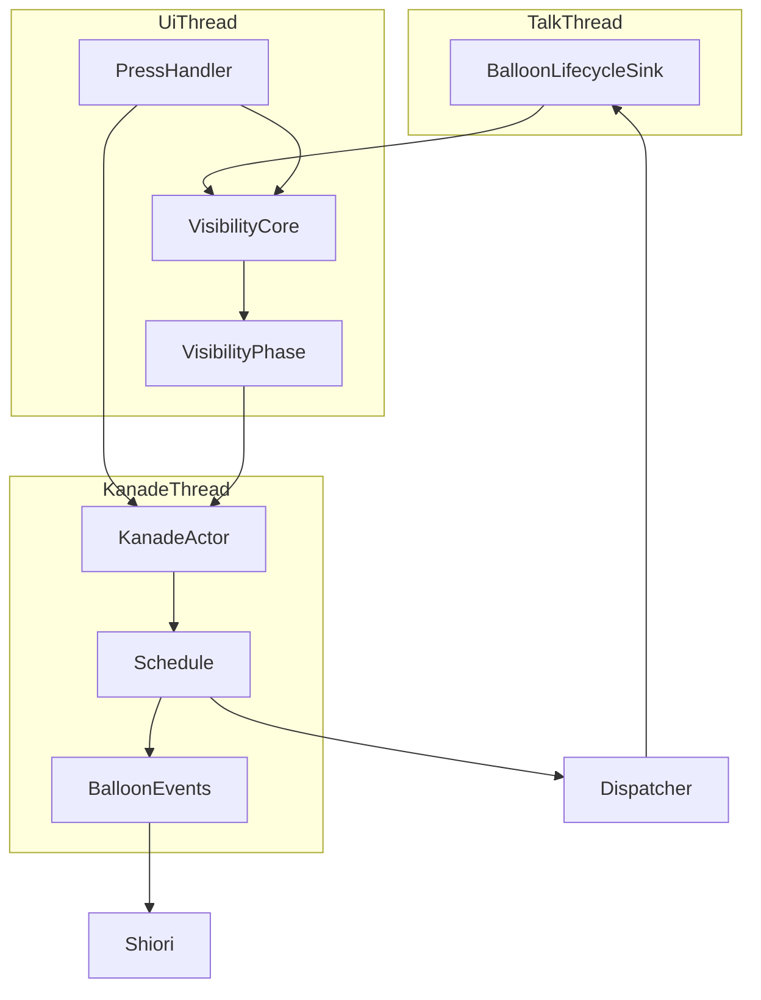
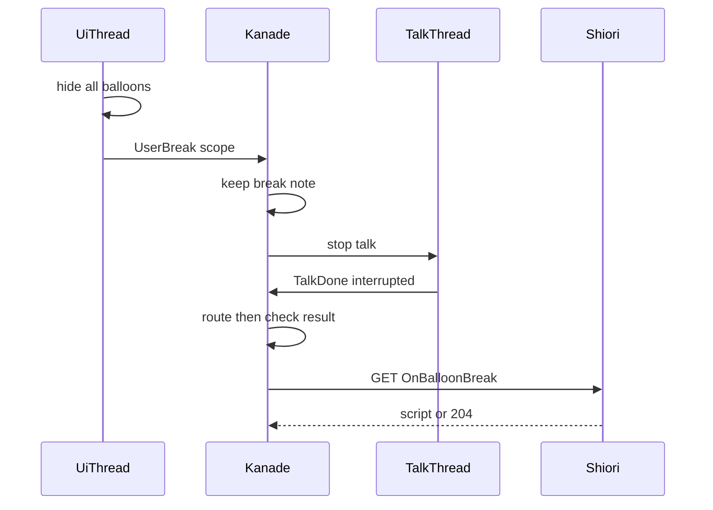
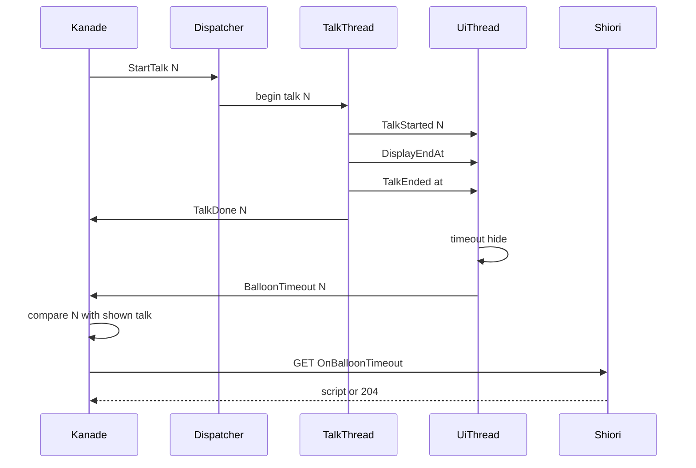

# Design Document

## Overview

**Purpose**: バルーンが「中断された」「閉じられた」「時間切れで消えた」ことを、正典（ukadoc）の SHIORI イベント `OnBalloonBreak`・`OnBalloonClose`・`OnBalloonTimeout` でゴーストへ知らせる。あわせて、台本の `\![set,balloontimeout,時間]` でトークごとに時間切れまでの待ち時間を差し替えられるようにし、中断で終わったトークの時間切れの計測を「止まった時刻」から始める。

**Users**: 既存のゴーストを areka で動かす利用者と、そのゴーストの作者。作者は 3 つのイベントに応じて喋る辞書と、待ち時間の指定がそのまま動くことを期待する。

**Impact**: 会話の進行の側（kanade）に「3 つのイベントを送るかどうか」の判断を 1 か所足し、表示の側（UI スレッド）から kanade へ「時間切れで隠した」を伝える口を 1 本足す。トークの番号を再生の側（talk スレッド）の受け口まで届け、表示の側が「いま出ているのはどのトークのバルーンか」を番号で言えるようにする。時間切れの計測は「トークが終わったことが表示の側に届いてから」始める形に改める。

### Goals
- 3 つのイベントを正典の Reference で、定常の間だけ、1 つの出来事につき 1 回だけ送る（要件 1〜4）。
- スレッドをまたぐ行き違い（時間切れと次のトーク・ダブルクリックと完了の知らせ）を、トークの番号の照合で決定的に裁く。二重に送らず、取りこぼさない。
- 時刻を丸めない。1 フレーム遅らせる解を取らない（要件 5・9）。
- 送った・送らなかった・起点を決めた、のすべてが記録に残る（要件 7）。

### Non-Goals
- `OnBalloonBreak` の Reference2（中断位置）の源を作ること（空で送る。`areka-P0-balloon-break-position` が持つ）。
- `\x`／`\x[noclear]`（`areka-P0-talk-fast-forward`）。
- 利用者の中断の規則そのもの・抑止の条件・既定の待ち時間・バルーンが現れる契機を変えること。
- 台本のコンパイルの側の先読み（`crates/areka-sakura/src/compile.rs` には触らない）。
- 選択肢の時間切れ（`OnChoiceTimeout`）と `\![set,choicetimeout]`。

## Boundary Commitments

### This Spec Owns
- 3 つのイベントの組み立て（`schedule/events.rs` の 3 関数）と、送ってよいイベントの表の 3 行。
- 「送るかどうか」の判断の全部（新しいファイル `schedule/balloon_events.rs`）。トークの完了の後・再生中のトークが無いときのダブルクリック・時間切れの知らせ、の 3 つの入口を持つ。
- 再生を始めたトークの番号と台本の控え（`State.shown`）。3 つのイベントの Reference0 の源はここだけ。
- 表示の側から kanade への「時間切れで隠した」の知らせ（`KanadeMsg::BalloonTimeout`）。
- 表示の合図の線（`TalkLifecycleSignal`）に足す 3 つの知らせ——トークの番号・トークの終わりの時刻・待ち時間の指定。
- 時間切れの計測の成立条件と起点（「トークの終わりが届いてから」「占有区間の終端と止まった時刻の早い方」）。
- `\![set,balloontimeout,時間]` の読み方と、受け取り手の宣言表の 1 行。
- 予約の型 `BalloonLifecycleNotice` の削除、互換対応表と網羅の台帳の更新。

### Out of Boundary
- 中断位置（Reference2）を字句から完了の知らせまで通す工事。
- 利用者の中断の受理の規則（`schedule/user_break.rs` の「再生中なら止める／二重に止めない」）と、押下の判定（`input_events/user_break.rs`・`input_events/shell_box.rs`）。本 spec は受理の結果を読むだけで、規則を変えない。
- 抑止（ドラッグ・ポインタの滞在・選択肢の表示）の判定、既定の待ち時間の決め方、バルーンが現れる契機。
- 選択肢を含む台詞のバルーンが、選んだ後も時間切れにならないこと（選択肢の行は内容の消去でしか消えず、選択肢の表示中の抑止が次のトークまで効き続ける）。今の作りの性質で、本 spec では直さない（`areka-P0-choice-balloon-timeout-stuck` が持つ。Error Handling の末尾）。
- 汎用の通知の入口（`change::on_raise_event`）の振る舞い。外から頼まれた `OnBalloonTimeout` などは、今の決まりどおり渡された Reference のまま送る（kanade は補わない）。

### Allowed Dependencies
- kanade の運行表（`schedule/`）の既存の部品——現行トークの番号の照会、定常の応答の腕（台本なら新しいトークを始める）、翻訳の出口（`translate::after`）、切れ目の見張り（`talk_gap`）。
- 配送（`areka-ghost` の dispatcher）がトークの起動ごとに受け口を 1 回複製すること、talk スレッドが受け口を落としてから完了を知らせること（`areka-sakura` の `drive.rs` の `on_close` と自然な終わり）。
- 表示の側の時刻源 `TalkClock`（talk 相対秒）と、可視性の判断中核（`balloon_visibility_decision.rs`・`balloon_visibility_wait.rs`）。
- 依存の向き: `areka-talk`（番号の型）→ `areka-kanade`（運行）→ `areka-ghost`（配送）→ `areka`（結線と表示）。逆向きの参照は作らない。dola にはトークの番号を持ち込まない。

### Revalidation Triggers
- `TalkLifecycleSignal` の形が変わる（`TalkStarted` が番号を運ぶ・`TalkEnded`・`BalloonTimeout` が増える）——この型を読む側（可視性の相・箱の「話しているか」とは別の線）は確認し直す。
- `BalloonLifecycleSink::new` の引数が増える（時刻源を取る）。
- `BootCueSink` に `begin_talk` が増える（既定は何もしない）。
- `KanadeMsg` に `BalloonTimeout` が増える。`KanadeMsg` を全部並べている所（`msg.rs` の変種の網羅のテスト・`actor.rs` の振り分け）は 1 行ずつ要る。
- 時間切れの計測の成立条件が変わる（トークの終わりが届くまで計測しない）。完了 spec `areka-P0-balloon-visibility` の檻のうち「占有終端だけで計測が始まる」と書いたものは、終わりの合図を足す形に直す。
- 完了 spec `areka-P0-balloon-break` の約束「中断を理由とするイベントを SHIORI へ 1 件も送らない」は `OnBalloonBreak`・`OnBalloonClose` について改まる。

## Architecture

### Existing Architecture Analysis

main を取り込んだ後（HEAD `dc45d5f3`）に測り直した事実。

- **トークの完了は 1 か所で受ける**: `schedule/mod.rs` の `on_talk_done` が、現行トークと番号を突き合わせた後、終わり方と状態で 5 つの腕に振り分ける（下の「規則の優先順位」表 A）。定常へ戻すのは `steady.rs` の `on_talk_done`（保留の終了が無ければ `Steady{talk: None}`）と `change.rs` の `cancel_by_user_break`（切替の送り出しの台詞の中断）。どちらも**振り分けの後の相**を見れば外から分かる。
- **中断の合図は再生中でなくても kanade まで届く**: バルーンの窓の押下の判定 `judge_press`（`input_events/user_break.rs`）は再生中かどうかを見ない。kanade の `user_break::on_user_break` の「再生中のトークが無い」腕が受けて、記録だけして終わっている。
- **台本の控えは再生中しか無い**: `ActiveTalk.script` は完了で捨てられる。切替の `OnClose` の別れの台詞（`ChangeCloseTalkWait`）は控えが無い。一方、再生の開始 `Action::StartTalk` は必ず `step` の出口を通る（翻訳にかけた台本は、翻訳の結果の入力 `TranslateDone` の `step` で最終の台本になって出る）。
- **表示の側はトークの番号を知らない**: 受け口 `BalloonLifecycleSink` は cue しか受け取らず、複製を会話の境界として使っている。配送の `on_start` は番号を持っているが、受け口へ渡す口が無い。
- **talk スレッドは受け口を落としてから完了を知らせる**（`drive.rs` の `on_close` のコメント「受け口は中断の知らせの前に落とす」）。落ちるときに合図を送る前例は `NoUserBreakCueSink` の `Drop`（`TalkEnded`）。
- **今の計測は「配られた cue の終わりの最大値に現在時刻が達したら」始まる**（`balloon_visibility_wait.rs` の `decide_timeout`）。cue は talk スレッドが配るので、表示の側の時刻が cue の境目を過ぎてから次の cue が届くまでに隙間がある（talk スレッドを進める刻みは既定で 50 ミリ秒＝`areka-ghost` の `ticker.rs` の `base_interval`。台本の途中の待ちの間も cue は来ない）。既定の 30 秒では害が無いが、`\![set,balloontimeout,10]` のような小さな値では、話の途中の隙間で時間切れが成立してしまう。
- **`KanadeMsg` から運行表の入力への振り分けは `actor.rs` の 1 か所**。応答の往復も翻訳の往復も 1 つのメッセージの処理の中で同期に済むので、メッセージとメッセージの間に SHIORI の往復が残ることは無い。
- 行数（取り込みの後）: `schedule/mod.rs` 938・`schedule/steady.rs` 947・`schedule/events.rs` 733・`schedule/user_break.rs` 75・`schedule/change.rs` 425・`msg.rs` 909・`actor.rs` 876・`emo2_boot/talk_lifecycle.rs` 212・`balloon_visibility.rs` 472・`balloon_visibility_decision.rs` 281・`balloon_visibility_wait.rs` 242・`balloon_visibility_phase.rs` 751・`emo2_boot/mod.rs` 883・`consumer_ledger.rs` 859・`emo2_boot/spine.rs` 1,000・`areka-ghost/src/dispatcher.rs` 432・`areka-ghost/src/sink.rs` 405。送ってよいイベントの表は 48 行、受け取り手の宣言表は 15 行、`State` を省略なしで組む所は既定の 1 か所とテストの 14 か所。

### Architecture Pattern & Boundary Map



**Architecture Integration**:
- 採る形: 「送るかどうか」は kanade が決める（台本・状態・SHIORI への口を持つのは kanade だけ）。表示の側は「時間切れで隠した」という事実と、そのバルーンのトークの番号だけを送る。
- 分け方: 判断は新しい 1 ファイル（`schedule/balloon_events.rs`）に集め、`schedule/mod.rs` は呼ぶだけにする。`steady.rs`・`change.rs` には触らない。
- 残す型: 利用者の中断の受理（止める口は 1 つ）、定常の応答の腕、翻訳の出口、汎用の入口。
- 足す部品の理由: ⑴ 番号と台本の控え——Reference0 の源と、古い知らせを退ける照合の相手。⑵ トークの番号を受け口へ届ける口——表示の側が照合の印を持つため。⑶ トークの終わりの合図——起点（要件 5）と、小さな待ち時間でも話の途中で消えないため（要件 9.1）。
- steering との整合: 純粋な状態機械（`step`）に判断を置く・ログ無しの失敗経路を作らない・1 ファイル 1,000 行未満・1 フレーム遅らせない・時刻は注入して駆動する。

### 設計で決めたこと

| # | 決めたこと | 理由 |
|---|---|---|
| D1 | 3 つのイベントの判断を `schedule/balloon_events.rs` に集める（research の案 B） | `schedule/mod.rs` の足し分を 20 行未満に抑え、`steady.rs`・`change.rs` に触らずに済む |
| D2 | 台本の控えは「`step` の出口を通った再生の開始」から 1 か所で取る（`State.shown`） | 再生を始める腕は 8 か所あるが出口は 1 つ。翻訳の後の最終の台本が取れ、切替の `OnClose` の別れの台詞も同じ仕組みで取れる |
| D3 | `OnBalloonBreak` は、トークの完了の振り分けが済んだ**後**の状態を見て送る | 「定常へ戻ったら送る」を 1 つの条件で言える。終了・保留の終了・保留の切替へ進む場合は相が定常にならないので自然に外れる |
| D4 | 時間切れの知らせは専用のメッセージ `KanadeMsg::BalloonTimeout { talk_id }` で運ぶ | 汎用の入口は「渡された Reference のまま送る」決まりで、kanade が中身を補う特別扱いを混ぜると決まりが 2 つになる。番号を Reference に紛れ込ませる形も取らない |
| D5 | トークの番号は配送から受け口へ `BootCueSink::begin_talk` で渡す | 表示の側と kanade が同じ番号で話せる。数を別々に数えて突き合わせる形は、cue を 1 つも出さずに終わるトークで食い違う |
| D6 | 時間切れの計測は、トークの終わりの合図が届いてから始める | 起点（終端と止まった時刻の早い方）が終わりの時点で確定する。話の途中の隙間で時間切れが成立しなくなり、表示の側が「終わったトークのバルーンが時間切れで消えた」と言い切れる |
| D7 | 利用者の中断を出したのにトークが自分で最後まで流れて終わった場合は、`OnBalloonClose` を送る | 利用者のダブルクリックでバルーンは隠れている。トークは止められたのではなく終わっていたので、「読み終えたバルーンを閉じた」に当たる。何も送らないと出来事が消える。`OnBalloonBreak` にすると Reference0 が実際には中断されていない台本になる。箱（シェルの中のバルーン）で起きた場合も同じ扱い（2026-10-05 設計の討議 議題 1・開発者裁定「案 1」） |
| D8 | 終了の要求を保留している間は、3 つとも送らない | マウスのイベントの決まり（`steady::on_mouse` の先頭）と揃える（要件 3.4 の読み）。次の刻みで終了の握手へ進むので、応答のトークを始めても意味が無い |
| D9 | Reference0 の控えが無い（構造上は起きない）ときは、空で送って警告を残す | 出来事そのものは起きている。送らない分岐を増やさない |
| D10 | `OnBalloonTimeout` と `OnBalloonClose` は、1 つのトークにつきそれぞれ高々 1 回（控えに印を持つ） | 時間切れで隠す発行が 2 フレームに分かれる縮退や、同じフレームに 2 回届いたダブルクリックで二重に送らない |

### Technology Stack

| Layer | Choice / Version | Role in Feature | Notes |
|-------|------------------|-----------------|-------|
| 運行 | `areka-kanade`（既存） | 判断・組み立て・送出 | 新しい依存なし |
| 配送 | `areka-ghost`（既存） | トークの番号を受け口へ渡す | `BootCueSink` に既定つきの関数を 1 つ足す |
| 表示 | `areka`（既存） | 合図の受け渡し・計測・知らせの送出 | `std::sync::mpsc`（既存の線） |
| 記録 | `tracing`（既存） | 送った・送らなかった・起点 | kanade は `target: "kanade"` と `event = ...` の流儀 |

## File Structure Plan

### Directory Structure
```
crates/areka-kanade/src/
├── msg.rs                           # KanadeMsg::BalloonTimeout を足す（★約束の外）
├── actor.rs                         # 振り分けの腕 1 本（★約束の外）
├── lib.rs                           # events の公開に 3 関数
└── schedule/
    ├── mod.rs                       # Input::BalloonTimeout・State.shown・呼び出し 3 か所
    ├── balloon_events.rs            # 新規: 3 つのイベントを送るかどうかの判断と記録
    ├── balloon_events_tests.rs      # 新規: 判断の分かれ目の檻
    ├── user_break.rs                # 中断の控えに scope・再生中でない腕を balloon_events へ
    ├── events.rs                    # 表に 3 行・組み立て 3 関数
    └── talk_gap.rs                  # 中断の控えの比べ方 1 か所
crates/areka-ghost/src/
├── sink.rs                          # BootCueSink::begin_talk（既定は何もしない）
└── dispatcher.rs                    # on_start で複製の直後に begin_talk を呼ぶ
crates/areka/src/emo2_boot/
├── talk_lifecycle.rs                # 合図 3 つ・受け口が番号と時刻源を持つ・予約の型を消す
├── talk_clock.rs                    # 今の talk 相対秒を読む口
├── balloon_visibility.rs            # 状態の欄 3 つ・記録の事象・判断の返り値に知らせ
├── balloon_visibility_decision.rs   # 合図の畳み込み（番号・終わり・待ち時間）
├── balloon_visibility_wait.rs       # 成立条件・起点・トークごとの待ち時間
├── balloon_visibility_phase.rs      # 知らせを kanade へ送る
├── balloon_visibility_talk_end_tests.rs  # 新規: 起点・待ち時間・知らせの檻
├── consumer_ledger.rs               # 受け取り手 1 種・登録 1 行
├── mod.rs                           # 受け口に時刻源を渡す（1 行）
└── spine.rs                         # 受け口に時刻源を渡す（1 行・★約束の外）
doc/
├── COMPAT_ARCHITECTURE.md           # 沈黙ルール対応表の 5 行
└── ukadoc-coverage/ledger/{shiori,sakura-script}.toml ＋ report/（道具で作り直す）
```

### Modified Files
- `crates/areka-kanade/src/schedule/mod.rs`（938 → 約 955）— `Input::BalloonTimeout { talk_id }`、`State.shown: Option<balloon_events::ShownTalk>`、`State.user_break_talk` の型を `Option<balloon_events::BreakNote>` へ。`step` の出口で `balloon_events::settle`（控えの掃除と再生の開始の控え）、`on_talk_done` の現行トークの腕の末尾で `balloon_events::after_talk_done`、`route` に `BalloonTimeout` の腕。足し分は 20 行未満（60 行の閾値の内）で、分割は要らない。
- `crates/areka-kanade/src/schedule/user_break.rs`（75 → 約 100）— 受理で `BreakNote { talk_id, scope }`（型は `balloon_events.rs`）を立てる。`take_user_break_quit` を「このトークの中断の控えを取り出して返す」`take_break` に替える。「再生中のトークが無い」腕は記録の後 `balloon_events::on_idle_double_click` へ渡す。受理の規則（止める・二重に止めない）は変えない。
- `crates/areka-kanade/src/schedule/events.rs`（733 → 約 780）— 表に 3 行（ukadoc の URL の注記つき＝台帳の「実装済み」の証拠）、`on_balloon_break`・`on_balloon_close`・`on_balloon_timeout`。
- `crates/areka-kanade/src/schedule/talk_gap.rs` — `is_marked_break` の中断の控えの比べ方を新しい型に合わせる（判断は変えない）。
- `crates/areka-kanade/src/lib.rs` — `pub mod events` の `pub use` に 3 関数。
- テスト: `State` を省略なしで組む 14 か所（`boot_reply_branch_tests.rs` 4・`boot_sequence_tests.rs` 6・`close.rs` の中 2・`schedule_log_firing_tests.rs` 2）に `shown: None`。`user_break_tests.rs` の補助「SHIORI への要求が 1 件も無い」は、約束の改めに合わせて場面ごとの期待へ書き直す。`events_change_tests.rs` の表の数は 48 → 51（取り込みの後に数え直す）。運行表の入力の変種を全部並べている `schedule_variant_tests.rs` に `Input::BalloonTimeout` の 1 行。
- `crates/areka-ghost/src/sink.rs`・`dispatcher.rs` — 下の「BootCueSink::begin_talk」。
- `crates/areka/src/emo2_boot/talk_lifecycle.rs`（212 → 約 330）・`talk_clock.rs`・`balloon_visibility*.rs`・`consumer_ledger.rs`（859 → 約 875。15 行 → 16 行）・`mod.rs`（883・行数は変わらない）。
- 既存のテストの機械的な直し: `TalkLifecycleSignal::TalkStarted` を書いている所（定義のファイルのほかに、テストと注記あわせて 10 ファイル。spine の檻 `spine_conformance_lap_tests.rs` の照合 2 か所を含む——このファイルは約束の対象ではないが、`areka-P0-ghost-session-test-load-flake` が触っていれば後からマージする側が合わせる）、`BalloonLifecycleSink::new` を呼んでいる所（`talk_lifecycle_tests.rs` 12・`frame_attach_tests.rs` 1・`balloon_visibility_lifecycle_e2e_tests.rs` 1）、時間切れを期待する可視性の檻（占有終端の後にトークの終わりを届ける。補助 `display_end` を使う所は 15）。**行数の決まりはテストのファイルにも掛かる**: `balloon_visibility_tests.rs` は 982 行（余裕 18 行・直す所 7）なので、テストの補助のファイルへ「占有終端とトークの終わりを一緒に積む」関数を 1 つ足し、既存の呼び出しの行数を増やさない。直しの後の `balloon_visibility_tests.rs`・`balloon_visibility_phase_tests.rs`（864）・`talk_lifecycle_tests.rs`（621）の行数が 1,000 未満であることを、この直しのタスクの受け入れの条件にする。`frame/wiring.rs` の文書の注記にある `TalkStarted` へのリンクは形が変わるので文言だけ合わせる（コードは変えない）。
- 文書: `doc/COMPAT_ARCHITECTURE.md` の沈黙ルール対応表のうち「会話終了後にバルーンを消すまでの既定の待ち時間」（計測の成立条件の一文）・「会話が中断で終わったときのタイムアウト起点」・「バルーンの中断の操作」・「`\![set,balloontimeout,時間]` のバルーン寿命側の実導出」・「`OnBalloonClose` ／ `OnBalloonTimeout` ／ `OnBalloonBreak` の SHIORI 発火」と、「compile 側時間指令 allowlist」の行の `set,balloontimeout` の追跡先。台帳は `shiori.toml` の 3 行と冒頭の群の説明、`sakura-script.toml` の `balloontimeout` の行。生成物は `cargo run -p ukadoc-survey -- report` と `report-summary` で作り直し、`cargo test -p ukadoc-survey` で確かめる（手で直さない）。`areka-P0-sakura-time-directives` の brief の相互登記は要件の討議で済んでいる（残っていることを確かめるだけ）。

### 同じウェーブの約束の外に出るファイル

本質の形で設計した結果、約束の外に出るのは次の 3 つ。どれも足すだけで、既存の行の意味は変えない。

| ファイル | 持ち主 | 変更 | 理由 |
|---|---|---|---|
| `crates/areka-kanade/src/msg.rs` | `areka-P0-mcp-get-status` | `KanadeMsg::BalloonTimeout { talk_id: TalkId }` の変種 1 つと、変種の網羅のテストの 1 行（約 +10 行・909 → 約 919） | 時間切れの知らせはトークの番号を運ぶ専用の入力で、汎用の入口に載せると「渡された Reference のまま送る」決まりを崩す（D4） |
| `crates/areka-kanade/src/actor.rs` | `areka-P0-mcp-get-status` | `KanadeMsg` から `Input` への振り分けの腕 1 本（+1 行） | 上の変種を運行表へ渡す |
| `crates/areka/src/emo2_boot/spine.rs` | `areka-P0-ghost-session-test-load-flake` | 受け口を組む 1 行を `BalloonLifecycleSink::new(lifecycle_tx, clock.clone())` に替える（行数は 1,000 のまま増えない） | 受け口が止まった時刻を talk 相対秒で送るには時刻源が要る。時刻源を省ける形にすると、決定論のテストだけが「時刻が届かない」縮退の道を通ることになる |

調整の結果（2026-10-05）: `emo2_boot/mod.rs` は `areka-P0-animated-image-playback` が先に main へ入る（開発者の裁定）。向こうは時計 `seriko_clock` を足すだけで `clock` の名前・型・持ち主を変えないので、本 spec は取り込んだ後に受け口を組む 1 行を替える。`msg.rs`・`actor.rs`・`spine.rs` は後からマージする側が足し直す（足すだけなので機械的に解ける。数を手で書いている所は取り込んだ後に数え直す）。持ち主の返事: `areka-P0-mcp-get-status` は `KanadeMsg` の末尾に `StatusQuery` を足し `actor.rs` に腕を 1 本足すだけで、並びは移さない。`areka-P0-ghost-session-test-load-flake` は `spine.rs` から待ちの部品を子のファイルへ出して 920 行前後へ減らすが、受け口を組む行と `spine_conformance_lap_tests.rs` には触らない。

約束には無いが、別のクレートに及ぶ変更: `crates/areka-ghost/src/sink.rs`・`dispatcher.rs`（計 約 +12 行）。触らないもの: `schedule/steady.rs`・`schedule/change.rs`・`crates/areka-sakura/src/compile.rs`・`input_events/`・`frame/wiring.rs`・dola。

## System Flows

### Flow 1: 利用者の中断から `OnBalloonBreak` まで



知らせ（切替の中止など）と GET は同じ一括に入り、知らせが先に流れる。応答が台本なら、定常の応答の腕が今の決まりどおり `OnTranslate` を通して新しいトークを始める。

### Flow 2: 時間切れから `OnBalloonTimeout` まで



### 規則の優先順位

どの表も、上から順に最初に当たった行だけを採る。

**表 A — 現行トークの完了を受けたときの振り分け**（`schedule/mod.rs` の `on_talk_done`・今のまま変えない）

| # | 条件 | 行き先 | 完了の後の相 |
|---|---|---|---|
| A0 | 番号が現行トークと合わない（置き換えで流れた古い完了・未知の番号） | 捨てる（今の記録のまま） | 変わらない。表 B へは進まない |
| A1 | 終わり方が `Quit`（台本が `\-` に辿り着いた） | 終了（`quit_dropping_pending`） | `Unloading` |
| A2 | `Interrupted`、かつ中断の控えがこのトーク、かつ台本が終了を予約、かつ切替の相でない、かつ印の台詞（`OnShellChanging`）の中断でない | 終了（同上） | `Unloading` |
| A3 | `Interrupted` か `Ended`、かつ定常の再生中のトークに保留の切替がある | `consume_pending`: 保留の終了もあれば終了の握手、無ければ切替を始める | `ClosePending`／`ChangePending`／`Unloading` |
| A4 | `Interrupted`（残り） | 相ごとの腕: 定常→保留の終了があれば握手、無ければ定常へ戻る／終了の握手の別れの台詞→終了／切替の送り出しの台詞（2 段とも）→切替を中止して定常へ戻る／起動の途中の挨拶→起動の途中のまま | `ClosePending`／`Steady{talk: None}`／`Unloading`／`BootVersion{talk: None}` |
| A5 | `Ended`（残り） | 相ごとの腕: 定常→握手か定常へ戻る／別れの台詞→終了／切替の送り出し→降ろす／挨拶→起動の途中のまま | 同上 |

**`OnBalloonBreak` を送る場所は、表 A のどの腕の中でもなく、A1〜A5 が返った直後の 1 か所**（表 B）である。腕の中に置くと、定常へ戻る 3 つの経路（定常の完了・切替の中止・印の台詞の中断）それぞれに同じ判断を書くことになり、`steady.rs`・`change.rs` に触る。後ろに置けば「完了の後の相が、再生中のトークの無い定常か」の 1 つの条件で全部を言える。

**表 B — 完了の後の判断**（`balloon_events::after_talk_done`。入力は ⑴ このトークの中断の控え ⑵ 終わり方 ⑶ このトークに預かった時間切れの知らせ ⑷ 完了の後の状態）

| # | 条件 | 結果 |
|---|---|---|
| B1 | 中断の控えも、預かった時間切れの知らせも無い | 何もしない（普通の完了。記録しない） |
| B2 | 完了の後が「再生中のトークの無い定常」でない、または終了の要求を保留している | 送らない。きっかけごとに理由（完了の後の相）を記録する |
| B3 | 中断の控えがあり、終わり方が `Interrupted` | `OnBalloonBreak` を送る（Reference0＝控えの台本・Reference1＝控えの scope・Reference2＝空） |
| B4 | 中断の控えがあり、終わり方が `Ended` | `OnBalloonClose` を送る（D7。このトークで送っていなければ） |
| B5 | 預かった時間切れの知らせがある | `OnBalloonTimeout` を送る（このトークで送っていなければ） |

中断の控えは、現行トークの完了のたびに `take_break` が 1 回だけ取り出す。中断を出した後、止まり終える前に別の応答がトークを置き換えたときは、置き換えの `step` の出口の掃除が控えを捨てて理由を記録している——止めたトークは置き換えで流れ、定常へは戻っていない（要件 1.5）。次のトークの完了では控えが無く、B1 に落ちる。B3 と B5 が同時に成り立つことは表示の側の作りから起きない（中断で隠したバルーンは時間切れの対象にならない）が、起きたら B3 を採り、預かりを捨てたことを記録する。

要件 1 の各項と表の対応:

| 場面 | 表 A | 表 B | 結果 |
|---|---|---|---|
| 定常のトークを中断（起動の挨拶を含む——本番では挨拶は定常のトークとして再生中） | A4 定常へ戻る | B3 | 送る（1.1） |
| ゴーストの切替の送り出しの台詞（`OnGhostChanging`・切替の `OnClose` の別れ）を中断 | A4 切替を中止 | B3 | 送る（1.1・1.6 の後段） |
| シェルの切替の台詞（`OnShellChanging`）を中断 | A4 定常へ戻る（A2 は印の中断で外れる） | B3 | 送る（1.1） |
| 止めた台本が終了を予約 | A2 | B2 | 送らない（1.6） |
| 終了の握手の別れの台詞を中断 | A4 終了 | B2 | 送らない（1.6） |
| 保留の終了がある | A4 握手 | B2 | 送らない（1.6） |
| 保留の切替がある | A3 | B2 | 送らない（1.6） |
| 起動の途中の相のまま挨拶の完了が届く（守りの腕） | A4 | B2 | 送らない（4.4） |
| 再生中のトークが無い・2 回目の合図・禁じた区間 | 控えが立たない | B1 または表 C | `OnBalloonBreak` は送らない（1.7） |

**表 C — 再生中のトークが無いときのダブルクリック**（`user_break::on_user_break` の「再生中のトークが無い」腕 → `balloon_events::on_idle_double_click`）

| # | 条件 | 結果 |
|---|---|---|
| C1 | 相が定常でない（起動の途中・終了の握手の待ち・切替の途中・降ろす途中） | 送らない・理由を記録（3.4） |
| C2 | 終了の要求を保留している | 送らない・理由を記録（3.4） |
| C3 | 控えのトークで `OnBalloonClose` を送り済み | 送らない・理由を記録（4.5） |
| C4 | それ以外 | `OnBalloonClose` を送る（Reference0＝控えの台本。控えが無ければ空で送って警告） |

**表 D — 時間切れの知らせを受けたとき**（`Input::BalloonTimeout { talk_id }` → `balloon_events::on_timeout_notice`）

| # | 条件 | 結果 |
|---|---|---|
| D1 | 相が定常でない | 送らない・理由を記録（2.6・4.4） |
| D2 | 知らせの番号が控えのトークの番号と違う（控えが無い場合を含む） | 送らない・「次のトークが既に始まっていた」と記録（2.6） |
| D3 | 終了の要求を保留している | 送らない・理由を記録 |
| D4 | 控えのトークで `OnBalloonTimeout` を送り済み、または預かり済み | 送らない・理由を記録（4.5） |
| D5 | そのトークがまだ再生中（完了の知らせが kanade に届いていない） | 預かる（控えに印）。そのトークの完了で表 B の B5 が裁く |
| D6 | 再生中のトークの無い定常 | `OnBalloonTimeout` を送る（Reference0＝控えの台本・Reference1＝`0`） |

### スレッドをまたぐ行き違い

| 対 | 決める側 | 照合の印 | 二重に送らない理由 | 取りこぼさない理由 |
|---|---|---|---|---|
| 時間切れ ⇔ 次のトーク | kanade（表 D） | トークの番号。表示の側は `TalkStarted` で受けた番号を知らせに載せ、kanade は最後に再生を始めたトークの番号と比べる | 送ったら控えに印（D4）。表示の側が同じトークで 2 回隠しても 2 通目は D4 で止まる | 番号が合い定常なら必ず送る。完了の知らせより先に届いた知らせは預かり（D5）、完了で送る。番号が違う・定常でない場合は要件 2.6 が「送らない」と定めた場面で、理由が残る |
| ダブルクリック ⇔ 完了の知らせ | kanade（受けた時点に現行トークがあるかで分ける） | 中断の控えのトークの番号 | 控えは 1 トークに 1 つ（2 通目は今の決まりで断る）で、取り出しは完了の 1 回だけ。再生中でないときは控えの印（C3） | 受け入れたダブルクリックは、①止めて完了（B3）②止める前に自分で終わった（B4）③トークが無かった（C4）のどれかに必ず落ち、送らない場合（B2・C1〜C3・置き換えで流れた）は理由が残る |
| 選択肢の時間切れの見張り ⇔ 応答のトーク | kanade（今のまま） | 選択の帳簿のトークの番号 | 中断の受理で帳簿を消す（今の決まり）ので、中断の後に `OnChoiceTimeout` は出ない。時間切れの解除で終わったトークは中断の控えが無く、B1 に落ちる（`OnBalloonBreak` は出ない・2.7） | 3 つのイベントの応答で始まったトークは新しい番号の普通のトークで、選択肢があれば今の仕組みがそのまま働く |
| `balloontimeout` の指定 ⇔ 中断 | talk スレッド（台本の順に配る） | 無し（同じ線の上の到着順） | 指定は cue として配られたときだけ線に載る | 中断の前に配られた指定は、トークの終わりの合図より前に並ぶ。配られる前に止まった指定は届かない（9.8） |

補足:
- **番号はどこで一致するか**: kanade は `Action::StartTalk` に番号を載せ、配送の `on_start` が受け口の複製に同じ番号を渡し、受け口は最初の cue で `TalkStarted { talk_id }` を送る。表示の側が持つ番号は「いまバルーンに出ている台詞のトーク」、kanade の控えは「最後に再生を始めたトーク」。次のトークが始まっていれば kanade の控えの番号は必ず進んでいる（控えは再生の開始が `step` を出るときに書く）。
- **預かり（D5）が要る理由**: 小さな待ち時間では、表示の側が時間切れを決めた時点で、同じトークの完了の知らせがまだ kanade に届いていないことがある。表示の側はトークの終わりの合図を受けてからしか計測しない（D6）ので、番号が合う知らせは「終わったトークのバルーンが消えた」ことを意味し、完了の知らせは必ず続いて届く。要件 4.4 の「積んでおかない」は定常でない間の話で、ここは定常の中で同じトークの完了を待つだけ。完了の後に定常でなければ B2 で捨てる。
- **箱（シェルの中のバルーン）**: 箱の「話しているか」は表示の側が決める（完了 spec `areka-P0-shell-balloon` の決まり）。表示の側が「話している」と判定して箱を隠し、kanade ではトークが終わっていた、という 1 フレーム以内の行き違いでは、表 C か B4 により `OnBalloonClose` を送る。隠れたのは読み終えた箱で、シェルへの `OnMouseDoubleClick` も出ていないため、何も送らないと出来事が消える。話していないと判定された箱のダブルクリックは今までどおり中断の合図を出さないので、`OnBalloonClose` は出ない（3.1 の補足）。
- **完了を通らずに相が変わる経路**: 中断を受け入れた後・時間切れの知らせを預かった後に、完了の知らせより先に強制の終了（`ForceQuit`）・SHIORI の故障（`ShioriDown`）・切替の送り出しの台詞の期限切れ・翻訳の輸送路の失敗・別の応答による置き換えが来ると、相は `on_talk_done` を通らずに進む。このとき控えと預かりは `step` の出口の掃除（`settle` の ⑴）が捨て、「送る場面に当たったが送らなかった」を理由つきで 1 行記録する（7.2）。掃除は「控えの相手が現行トークでない」の 1 つの条件で、どの経路から来ても同じ 1 か所で効く。中断の控えは今も「現行トークの完了で取り出すと相手が違うので何も起きない」だけなので、早く捨てても中断の振る舞いは変わらない（1.9）。
- **残る行き違い（記録して許す）その 1——cue を 1 つも出さないトーク**: 台本が空・`\e` だけ・無視されるタグだけのトークは、受け口が 1 度も呼ばれず、表示の側の番号と画面の文字は前のトークのまま残る。一方 kanade の控えはそのトークへ進む。その後に前のトークのバルーンが時間切れになると、知らせは表 D の D2 で捨てられ（`OnBalloonTimeout` は出ない）、読み終えたバルーンのダブルクリックでは Reference0 が中身の無い側の台本になる。直すには「楽譜が空だった」を kanade へ戻す口が要り、釣り合わない。互換対応表に書き、D2 の檻で振る舞いを固定する。
- **残る行き違い（記録して許す）その 2**: 読み終えたバルーンのダブルクリックが kanade に届くまでの間に、別のトークが始まって終わっていた場合、`OnBalloonClose` の Reference0 は新しい方のトークの台本になる。始まっただけなら、今の決まりどおりそのトークが止まり `OnBalloonBreak` になる。どちらも、ダブルクリックの合図がトークの番号を運ばない（完了 spec `areka-P0-balloon-break` のメッセージの形）ことによる。本 spec では形を変えない。

### 時刻の扱い

- **起点**: トークの終わりの合図が運ぶ「止まった時刻」は、talk スレッドが受け口を落とした瞬間に時刻源を読んだ値（talk 相対秒）で、フレームの時刻に丸めない（5.2）。実効の表示終了は `min(占有区間の終端, 止まった時刻)`。満了予定は `実効の表示終了 + 待ち時間`。
- **最後まで流れたトーク**: 式は中断のときと同じ `min` で、終わり方では分けない（受け口は「止められた」のか「流れ終えた」のかを知らない）。止まった時刻は本当の終端より前にはならない。ただし表示の側の時刻の物差し（talk 相対秒の起点は cue の到着から推定し、遅い側へ寄る）では、止まった時刻が占有区間の終端より最大で刻み 1 つ分（既定 50 ミリ秒）ほど早く読まれることがある。そのときは止まった時刻を採る——実時間では本当の終端に近い側である。止まった時刻が終端以後なら終端を採る（5.3）。この読みは互換対応表の起点の行に areka 裁量として書く。
- **待ち時間**: `\![set,balloontimeout,時間]` の整数ミリ秒を、既定の待ち時間の環境変数と同じ式（ミリ秒を 1,000 で 1 回割って秒の浮動小数へ）で写す。切り捨て・切り上げ・フレームの間隔への丸めはしない。
- **遅らせない**: `OnBalloonBreak` と完了の後の `OnBalloonClose`・`OnBalloonTimeout` は完了の知らせを処理する同じ `step` で、再生中でないときの `OnBalloonClose` はダブルクリックの合図と同じ `step` で、時間切れの知らせは隠す発行と同じフレームで送る。
- **抑止の後の計り直し**は今の決まりのまま（解けた時刻 + そのトークの待ち時間。5.5・9.7）。

## Requirements Traceability

| Requirement | Summary | Components | Interfaces | Flows |
|-------------|---------|------------|------------|-------|
| 1.1 | 中断の後に定常へ戻ったら送る | BalloonEvents | `after_talk_done` | Flow 1・表 A・B |
| 1.2 | Reference0＝止めたトークの台本 | BalloonEvents・ShownTalk | `settle`・`on_balloon_break` | 表 B |
| 1.3 | Reference1＝scope | BreakNote | `on_user_break`・`take_break` | 表 B |
| 1.4 | Reference2 は空 | EventBuilders | `on_balloon_break` | — |
| 1.5 | 止まり終えてから送る | BalloonEvents | `after_talk_done`（完了の `step`） | Flow 1 |
| 1.6 | 定常へ戻らないとき送らない | BalloonEvents | 表 B の B2 | 表 A・B |
| 1.7 | 受け入れられない合図では送らない | UserBreak（既存） | 控えが立たない | 表 B の B1 |
| 1.8 | 1 回だけ | BreakNote | `take_break`（1 回だけ取り出す） | 行き違いの表 |
| 1.9 | 中断の振る舞いを変えない | UserBreak（既存） | 受理の規則に触らない | — |
| 2.1 | 時間切れで 1 回送る | VisibilityCore・BalloonEvents | `VisibilityDecision.timeout_notice`・`on_timeout_notice` | Flow 2・表 D |
| 2.2 | Reference0＝直前に終えたトークの台本 | ShownTalk | `on_balloon_timeout` | 表 D |
| 2.3 | Reference1＝`0` | EventBuilders | `on_balloon_timeout` | — |
| 2.4 | 抑止の間は送らない | VisibilityCore（既存の抑止） | 知らせは隠す発行にだけ付く | — |
| 2.5 | 他の理由で隠れたら送らない | VisibilityCore | 知らせは契機 `Timeout` にだけ付く | — |
| 2.6 | 次のトークが始まっていた・定常でない | BalloonEvents | 表 D の D1〜D3 | 行き違いの表 |
| 2.7 | 選択肢の時間切れでは送らない | （既存の `OnChoiceTimeout` の道） | 表 B の B1 | 行き違いの表 |
| 3.1 | 再生中でない定常のダブルクリックで送る | BalloonEvents | `on_idle_double_click`・表 B の B4 | 表 C |
| 3.2 | Reference0＝直前に終えたトークの台本 | ShownTalk | `on_balloon_close` | 表 C |
| 3.3 | 他の理由で隠れたら送らない | BalloonEvents | 入口はダブルクリックの合図だけ | 表 C |
| 3.4 | 定常でない・終了の保留中は送らない | BalloonEvents | 表 C の C1・C2 | 表 C |
| 3.5 | 独自のイベントを作らない | EventBuilders | 表に足すのは正典の 3 語だけ | — |
| 4.1 | GET で送る | EventBuilders | `ShioriCall::Get` | — |
| 4.2 | 台本は `OnTranslate` を通して再生 | 既存（定常の応答の腕・翻訳の出口） | `Action::ShioriRequest` を積むだけ | Flow 1・2 |
| 4.3 | 204 は何も再生しない | 既存（定常の応答の腕） | 同上 | — |
| 4.4 | 定常の間だけ・積まない | BalloonEvents | 共通の門 `steady_idle` | 表 B〜D |
| 4.5 | 同じ出来事で 2 回送らない | BalloonEvents・ShownTalk | 控えの印・`take_break` | 行き違いの表 |
| 4.6 | 失敗の扱いは他と同じ | 既存（殻の往復・横断の失敗の腕） | 例外を足さない | — |
| 5.1 | 起点＝終端と止まった時刻の早い方 | BalloonLifecycleSink・VisibilityCore | `TalkEnded { at }`・`decide_timeout` | 時刻の扱い |
| 5.2 | 止まった時刻を丸めない | BalloonLifecycleSink・TalkClock | `Drop`・`now_talk_time` | 時刻の扱い |
| 5.3 | 最後まで流れたら終端が起点 | VisibilityCore | 同じ式 | 時刻の扱い |
| 5.4 | 利用者の中断は即座に隠す | 既存（中断の非表示） | 変えない | — |
| 5.5 | 抑止・次のトークでの破棄は変えない | VisibilityCore | 変えない | — |
| 5.6 | 止まった時刻が届かないとき | BalloonLifecycleSink・VisibilityCore | `TalkEnded { at: None }` → 終端を起点・記録 | — |
| 6.1 | 互換対応表の 3 イベントの行 | 文書 | — | — |
| 6.2 | Reference2 の縮退と追跡先 | 文書・台帳 | — | — |
| 6.3 | 互換対応表の中断の起点の行 | 文書 | — | — |
| 6.4 | 台帳の 3 行と生成物・URL の証拠 | 台帳・EventBuilders | 表の 3 行の注記 | — |
| 6.5 | `balloontimeout` の持ち主と相互登記 | 台帳・文書 | — | — |
| 6.6 | 予約の型を消す | BalloonLifecycleSink のファイル | `BalloonLifecycleNotice` を削除 | — |
| 6.7 | 完了 spec の約束の改めの追記 | 文書 | — | — |
| 7.1 | 送った記録 | BalloonEvents | `balloon_event_sent` | — |
| 7.2 | 送らなかった理由の記録 | BalloonEvents・VisibilityPhase | `balloon_event_not_sent` ほか | — |
| 7.3 | 中断で終わったトークの起点の記録 | VisibilityCore | `MeasurementOrigin` の事象 | — |
| 7.4 | 毎フレームは記録しない | VisibilityCore | 出来事のときだけ事象を積む | — |
| 7.5 | 待ち時間の指定の記録 | BalloonLifecycleSink | `balloon_timeout_set` | — |
| 8.1 | 分かれ目の決定論のテスト | 各テスト | Testing Strategy | — |
| 8.2 | 時刻を注入する | 各テスト | Testing Strategy | — |
| 8.3 | 実機での確認 | 実機 | Testing Strategy | — |
| 9.1 | 正の値＝そのミリ秒 | BalloonLifecycleSink・VisibilityCore | `parse_balloon_timeout`・`TalkTimeout::Millis` | 時刻の扱い |
| 9.2 | 0・負＝時間切れなし | 同上 | `TalkTimeout::Never` | — |
| 9.3 | 省略・空＝既定 | 同上 | `TalkTimeout::Default` | — |
| 9.4 | 読めない値＝既定・記録 | BalloonLifecycleSink | `parse_balloon_timeout` | — |
| 9.5 | 複数回は最後の値 | VisibilityCore | 畳み込みは到着順に上書き | — |
| 9.6 | 次のトークで既定へ | VisibilityCore | `TalkStarted` で戻す | — |
| 9.7 | 抑止の後もそのトークの値 | VisibilityCore | 計り直しが同じ値を読む | — |
| 9.8 | 届く前に止まったら効かない | 既存（残りの cue は捨てられる） | — | 行き違いの表 |
| 9.9 | 既定の決め方は変えない | VisibilityCore | `configured_timeout_secs` は今のまま | — |
| 9.10 | 宣言表に 1 行・先読みなし | ConsumerLedger | `("set", "balloontimeout")` | — |

## Components and Interfaces

| Component | Domain/Layer | Intent | Req Coverage | Key Dependencies | Contracts |
|-----------|--------------|--------|--------------|------------------|-----------|
| BalloonEvents | kanade 運行表 | 3 つのイベントを送るかどうかを決め、記録する | 1.1, 1.5, 1.6, 1.8, 2.1, 2.6, 3.1, 3.3, 3.4, 4.4, 4.5, 7.1, 7.2 | `State`・EventBuilders（P0） | Service・State |
| ShownTalk・BreakNote | kanade 運行表 | Reference の源と照合の相手 | 1.2, 1.3, 2.2, 3.2, 4.5 | `Action::StartTalk`（P0） | State |
| EventBuilders | kanade 運行表 | 3 語の組み立てと表の 3 行 | 1.4, 2.3, 3.5, 4.1, 6.4 | `ExecutionStatus`（P1） | Service |
| KanadeMsg::BalloonTimeout | kanade 境界 | 時間切れの知らせを運ぶ | 2.1, 2.6 | `actor.rs`（P0） | Event |
| BootCueSink::begin_talk | 配送 | トークの番号を受け口へ渡す | 2.6 | dispatcher（P0） | Service |
| BalloonLifecycleSink | talk スレッドの受け口 | 番号・終わりの時刻・待ち時間の指定を表示の側へ送る | 5.1, 5.2, 5.6, 7.5, 9.1〜9.4, 9.8 | `TalkClock`（P0） | Event |
| VisibilityCore | 表示の判断中核 | 計測の成立・起点・トークごとの待ち時間・知らせ | 2.1, 2.4, 2.5, 5.1, 5.3, 5.5, 5.6, 7.3, 7.4, 9.1〜9.3, 9.5〜9.7, 9.9 | 合図の線（P0） | State |
| VisibilityPhase（送出） | 表示の配線 | 知らせを kanade へ送る | 2.1, 7.2 | `GhostSlot`（P0） | Event |
| ConsumerLedger | 結線の宣言表 | `(set, balloontimeout)` の受け取り手 | 9.10 | — | State |
| 文書・台帳 | doc | 記録の更新 | 6.1〜6.7 | `ukadoc-survey`（P1） | — |

### kanade 運行表

#### BalloonEvents（`schedule/balloon_events.rs`）

| Field | Detail |
|-------|--------|
| Intent | 3 つのイベントを送るかどうかの判断を 1 か所に置く |
| Requirements | 1.1, 1.2, 1.5, 1.6, 1.8, 2.1, 2.2, 2.6, 3.1〜3.4, 4.4, 4.5, 7.1, 7.2 |

**Responsibilities & Constraints**
- 表 B・C・D の判断と、控え `State.shown` の読み書き。純粋（`tracing` の記録だけが副作用）。
- SHIORI への要求は 1 つの入力につき高々 1 本（GET）。応答の扱いは定常の応答の腕に任せ、ここでは触らない。
- 3 つの入口は同じ門 `steady_idle` を通る——相が `Steady{talk: None}` で、終了の要求を保留していないこと。

**Dependencies**
- Inbound: `schedule/mod.rs` の `step`・`on_talk_done`・`route`、`user_break::on_user_break`（P0）
- Outbound: `events::on_balloon_break`・`on_balloon_close`・`on_balloon_timeout`（P0）

**Contracts**: Service [x] / State [x]

##### Service Interface
```rust
/// 再生を始めたトークの控え。3 つのイベントの Reference0 の源で、古い知らせを退ける照合の相手。
pub(crate) struct ShownTalk {
    pub talk_id: TalkId,
    /// 再生を始めた最終の台本（`OnTranslate` で書き換えた後）。
    pub script: String,
    /// このトークで `OnBalloonClose` を送ったか。
    pub close_sent: bool,
    /// このトークで `OnBalloonTimeout` を送ったか。
    pub timeout_sent: bool,
    /// 完了の知らせより先に届いた時間切れの知らせを預かっているか。
    pub timeout_pending: bool,
}

/// `step` の出口で 1 回呼ぶ。順に ⑴ 掃除: 中断の控え・預かった時間切れの知らせの相手が、
/// もう現行トークでなければ捨てて理由を記録する（完了を通らずに相が変わった・置き換えられた）。
/// ⑵ 返す指示の列に再生の開始があれば、控えをそのトークで置き換える。
pub(super) fn settle(state: &mut State, actions: &[Action]);

/// 現行トークの完了の振り分けが返った直後に呼ぶ（表 B）。
pub(super) fn after_talk_done(
    state: State,
    actions: Vec<Action>,
    done: &TalkDone,
    broke: Option<BreakNote>,
) -> (State, Vec<Action>);

/// 再生中のトークが無いときに届いた中断の合図（表 C）。
pub(super) fn on_idle_double_click(state: State) -> (State, Vec<Action>);

/// 時間切れの知らせ（表 D）。
pub(super) fn on_timeout_notice(state: State, talk_id: TalkId) -> (State, Vec<Action>);
```
- Preconditions: `after_talk_done` は、現行トークと番号が合った完了についてだけ呼ぶ。`broke` は `user_break::take_break` がその完了で取り出した控え（相手がこのトークのときだけ `Some`）。
- Postconditions: 返す指示の列は、渡された列の末尾に GET を高々 1 本足したもの（知らせが先に流れる順を保つ）。送ったら控えの印を立てる。
- Invariants: 再生中のトークがある間、控えの番号は現行トークの番号と同じ（再生の開始は必ず `step` を出る）。食い違い（構造上は起きない）を見つけたら誤りの水準で記録し、Reference0 を空にして送る。

##### State Management
- `State.shown: Option<ShownTalk>`——再生の開始が `step` を出るたびに丸ごと置き換える（印は新しいトークで下りる）。ゴーストごとに新しい `State` なので、ゴーストをまたがない。
- `State.user_break_talk: Option<BreakNote>`——`BreakNote { talk_id, scope }`。立てるのは中断の受理、取り出すのは現行トークの完了の 1 回だけ（今の不変条件のまま）。

**Implementation Notes**
- Integration: `mod.rs` の `on_talk_done` は、`take_break` の結果から今の `break_quit`（控えがこのトーク・`Interrupted`・終了の予約あり・切替の相でない・印の中断でない）を作り、振り分けは今のまま行い、最後に `after_talk_done` へ渡す。
- Validation: 表 B・C・D の全行と、表 A の各腕からの到達を `step` を直接駆動する檻で固定する。
- Risks: 切れ目の見張り（`talk_gap`）は、中断で定常へ戻った同じ `step` で「切れ目に達した」と決める。その後に `OnBalloonBreak` の応答でトークが始まると、切れ目を待っていた側の依頼の応答がそのトークを置き換える。毎秒の `OnSecondChange` の応答で始まるトークと同じ性質で、今の決まりの内。

#### EventBuilders（`schedule/events.rs`）

```rust
/// ukadoc: https://ssp.shillest.net/ukadoc/manual/list_shiori_event.html#OnBalloonBreak:1
pub fn on_balloon_break(script: &str, scope: u32, snapshot: &ExecutionSnapshot) -> ShioriCall;
/// ukadoc: https://ssp.shillest.net/ukadoc/manual/list_shiori_event.html#OnBalloonClose:1
pub fn on_balloon_close(script: &str, snapshot: &ExecutionSnapshot) -> ShioriCall;
/// ukadoc: https://ssp.shillest.net/ukadoc/manual/list_shiori_event.html#OnBalloonTimeout:1
pub fn on_balloon_timeout(script: &str, snapshot: &ExecutionSnapshot) -> ShioriCall;
```
- どれも `ShioriCall::Get`（4.1）。Reference は `OnBalloonBreak`＝`[台本, scope の十進, ""]`（3 個・Reference2 は空）、`OnBalloonClose`＝`[台本]`、`OnBalloonTimeout`＝`[台本, "0"]`。Status は送る時点の状態から導く（`on_choice_timeout` と同じ）。
- 送ってよいイベントの表に 3 行を足す（48 → 51）。表に載るので、汎用の入口からも頼める——その場合は渡された Reference のまま送る（今の決まり）。

#### KanadeMsg::BalloonTimeout（`msg.rs`・`actor.rs`）

##### Event Contract
- 送り手: 表示の側の可視性の相。受け手: kanade の殻が `Input::BalloonTimeout { talk_id }` へそのまま写す。
- 中身: `talk_id: TalkId`——時間切れで隠れたバルーンに出ていたトークの番号。
- 順序: 表示の側から kanade への線は UI スレッドの 1 本の送り手の順のまま届く。
- 冪等: 同じ番号の 2 通目は表 D の D4 で止まる。

### 配送と talk スレッドの受け口

#### BootCueSink::begin_talk（`areka-ghost/src/sink.rs`・`dispatcher.rs`）

```rust
pub trait BootCueSink: CueSink + Send {
    fn clone_box(&self) -> Box<dyn BootCueSink>;
    /// この複製が受け持つトークの番号。配送がトークの起動ごとに、複製の直後に 1 回だけ呼ぶ。
    fn begin_talk(&mut self, _talk_id: TalkId) {}
}
```
- 配送の `on_start` は、受け口を 1 つ複製するたびに `begin_talk(start.talk_id)` を呼んでから talk スレッドへ渡す。既存の受け口は一括の実装（`Clone` を持つ型すべて）の既定のままで、何も変わらない。
- `BalloonLifecycleSink` は `Clone` を外して `BootCueSink` を自分で実装し、番号を受け取る（`Clone` を持たない自分の型なら、一括の実装と並べて書ける。小さな 2 クレートの試しで通ることを確かめた）。複製は今と同じく状態を引き継がない。

#### BalloonLifecycleSink（`emo2_boot/talk_lifecycle.rs`）

| Field | Detail |
|-------|--------|
| Intent | トークの番号・占有終端・待ち時間の指定・終わりの時刻を、1 本の線で表示の側へ送る |
| Requirements | 5.1, 5.2, 5.6, 7.5, 9.1, 9.2, 9.3, 9.4, 9.8, 9.10 |

##### Event Contract
```rust
pub(crate) enum TalkLifecycleSignal {
    /// このトークの最初の cue が配られた。番号は配送から受け取ったもの（受け取っていなければ None）。
    TalkStarted { talk_id: Option<TalkId> },
    /// 占有区間の終端（今のまま）。
    DisplayEndAt(f64),
    /// `\![set,balloontimeout,時間]` が配られた。
    BalloonTimeout(TalkTimeout),
    /// このトークの受け口が落ちた（最後まで・中断・置き換えのどれでも）。`at` は落ちた瞬間の
    /// talk 相対秒。時刻源が起点を持たないときは None。
    TalkEnded { at: Option<f64> },
    /// 利用者の中断（今のまま・送り手は UI の押下の処理）。
    UserBreak,
}

/// そのトークの時間切れまでの待ち時間。
pub(crate) enum TalkTimeout { Default, Millis(u64), Never }

/// 時間の欄を読む。省略・空は既定、正の整数はそのミリ秒、0 と負の整数は時間切れなし、
/// 整数として読めない値は既定（`unreadable` が真）。前後の空白は落として読む。
pub(crate) fn parse_balloon_timeout(value: Option<&str>) -> ParsedTimeout;
pub(crate) struct ParsedTimeout { pub timeout: TalkTimeout, pub unreadable: bool }

impl BalloonLifecycleSink {
    pub(crate) fn new(tx: Sender<TalkLifecycleSignal>, clock: TalkClock) -> Self;
}
```
- 線の上の順（1 つのトークの中）: `TalkStarted` → （`DisplayEndAt`・`BalloonTimeout` が台本の順）→ `TalkEnded`。次のトークの `TalkStarted` は必ず前のトークの `TalkEnded` の後（talk スレッドは受け口を落としてから完了を知らせ、置き換えでは配送が古いスレッドの合流を待ってから新しいトークを起こす）。
- `TalkEnded` を送るのは、合図を 1 つでも送った複製だけ（登録の原本は何も送らない）。`NoUserBreakCueSink` の `Drop` と同じ型。
- 待ち時間の指定は、運び手の cue の名前と第 1 引数が `("set", "balloontimeout")` のものだけを拾う（他の `\![set,…]` は読み飛ばす）。拾うたびに 1 行記録する（`balloon_timeout_set`・採った値。読めなかった値はそのまま載せる・7.5）。占有終端の集約は今のまま全 cue が対象。
- `TalkClock` に「今の talk 相対秒」を読む口を足す（`now_talk_time(&self) -> Option<f64>`＝注入された時計を読んで `talk_time` に渡す）。
- 予約の型 `BalloonLifecycleNotice` と `#[allow(dead_code)]` と注記を消す（6.6）。台本と scope を持つのは kanade で、語彙と Reference の割り当ては `events.rs` の 3 関数と互換対応表が持つ。

### 表示の判断中核

#### VisibilityCore（`balloon_visibility.rs`・`balloon_visibility_decision.rs`・`balloon_visibility_wait.rs`）

| Field | Detail |
|-------|--------|
| Intent | トークの終わりが届いてから計測し、時間切れで隠したら知らせを返す |
| Requirements | 2.1, 2.4, 2.5, 5.1, 5.3, 5.5, 5.6, 7.3, 7.4, 9.1, 9.2, 9.3, 9.5, 9.6, 9.7, 9.9 |

##### State Management
`BalloonVisibilityState` に 3 つの欄を足す（どれも `TalkStarted` で初めの値へ戻る）。

```rust
/// いまバルーンに出ている台詞のトークの番号。
talk_id: Option<TalkId>,
/// トークの終わり。
talk_end: TalkEnd,          // NotYet | At(f64) | TimeUnknown
/// このトークの待ち時間。
talk_timeout: TalkTimeout,  // Default | Millis(u64) | Never
```

合図の畳み込み（到着順）:
- `TalkStarted { talk_id }`: 今の作用（計測を捨てる・占有終端を消す・中断の掛け金を解く）に加えて、番号を置き換え、`talk_end = NotYet`、`talk_timeout = Default`（9.6）。
- `BalloonTimeout(t)`: `talk_timeout = t`（最後に届いた値が残る・9.5）。立っている計測があれば捨てて立て直させる（トークの終わりの前には計測が立たないので、構造上は捨てるものが無い）。
- `TalkEnded { at }`: `talk_end = At(at)`、`at` が無ければ `TimeUnknown`。

計測（`decide_timeout`）の変更点:
- **成立条件**に「`talk_end` が `NotYet` でない」と「`talk_timeout` が `Never` でない」を足す。今の条件（占有終端がある・現在時刻が実効の表示終了に達した・見えているバルーンがある）はそのまま。
- **実効の表示終了**: `At(a)` なら `min(占有区間の終端, a)`、`TimeUnknown` なら占有区間の終端（5.6）。
- **待ち時間**: `Default` は引数で渡される既定（30 秒か環境変数。決め方は変えない・9.9）、`Millis(ms)` は `ms as f64 / 1000.0`。初めの成立も、抑止が解けた後の計り直しも同じ値を使う（9.7）。
- **記録**: 計測を始めたとき、起点の採り方を 3 つの値のどれかで 1 件積む（7.3・5.6）——「止まった時刻」（終端より早かった。起点の時刻も載せる）／「占有区間の終端」（今の「計測を始めた」の記録のまま）／「止まった時刻なし」（`TimeUnknown`。終端を採った）。記録の語に「中断」は使わない（最後まで流れたトークでも「止まった時刻」になりうるため）。
- **知らせ**: 時間切れで隠す対象が 1 つ以上あったフレームに、`VisibilityDecision.timeout_notice` へ番号を入れる。番号が無い（配送を通らない再生。本番では起きない）ときは入れず、警告の事象を積む。

```rust
pub(crate) struct VisibilityDecision {
    pub(crate) actions: Vec<VisibilityAction>,
    pub(crate) logs: Vec<VisibilityLogEvent>,
    /// 時間切れで隠したフレームにだけ Some。
    pub(crate) timeout_notice: Option<TalkId>,
}
```
- Invariants: 知らせは契機 `Timeout` の隠す行動と同じフレームにだけ立つ（2.4・2.5）。利用者の中断・内容の消去・外からの非表示では立たない。毎フレームの判定は事象を積まない（7.4）。

**Implementation Notes**
- Integration: 完了 spec `areka-P0-balloon-visibility` の檻のうち時間切れの成立を期待するものは、占有終端の後に `TalkEnded` を届ける形へ直す（期待する満了の時刻は変わらない）。「占有終端が現在時刻より先へ動いたら計測を捨てる」腕は、トークの終わりの後には cue が来ないので本番では通らなくなるが、守りとして残す。
- Risks: 止まった時刻が届かないまま占有終端だけが届く場面（`TalkEnded` が線から失われる）では計測が始まらず、バルーンは次のトークまで残る（表示を保持する側）。今の「信号が届かなければ表示を保持する」と同じ向き。

#### VisibilityPhase の送出（`balloon_visibility_phase.rs`）
- `decide` の後、隠す発行を済ませてから、`timeout_notice` があれば `KanadeMsg::BalloonTimeout { talk_id }` を送る。kanade への送出端は `frame/status_report.rs` と同じく `GhostSlot` から取り出す（結線の束は変えない）。
- 記録: 送ったら 1 行（`balloon_timeout_notified`・番号）。ゴーストが置き場に無い（切替の最中）・受け手が消えている場合は送れなかった理由を 1 行（7.2）。配線の層に判断の分岐は足さない（送出端の有無と送出の成否だけ）。

### 結線の宣言表

#### ConsumerLedger（`emo2_boot/consumer_ledger.rs`）
- 受け取り手の種類 `LifecycleSink`（ukadoc の URL の注記つき）と、登録 `("set", Some("balloontimeout"))` の 1 行（15 → 16）。`("set", Some("zorder"))` と同じ「名前＋第 1 引数」の形なので、同じ名前の他の行と衝突しない。
- `areka-P0-open-external-tags` も行を足す。後からマージする側が、種類・登録・行数のテストを足し直し、数は取り込んだ後に数え直す。

### 文書・台帳

#### 互換対応表と網羅の台帳（`doc/`）
- **3 つのイベントの行**（6.1）: 送る場面（表 B・C・D）と Reference の入れ方に書き直す。areka の決定として次を根拠の区分つきで書く——`OnBalloonClose` は「再生中のトークが無い定常で、普通のバルーンを左ダブルクリックして隠したとき」と「中断を出したがトークが自分で最後まで流れて終わったとき」に送る（areka 裁量）／`OnBalloonTimeout` の Reference1 は `0`（areka 裁量）／`OnBalloonBreak` は中断の後に定常へ戻ったときだけ（areka 裁量）／3 つとも GET（正典整合）／終了の要求を保留している間は送らない（areka 裁量）／台本の控えが無いときは Reference0 を空で送る（areka 裁量）／1 つのトークにつき `OnBalloonTimeout`・`OnBalloonClose` はそれぞれ高々 1 回（areka 裁量）／残る行き違いの 2 つ（cue を 1 つも出さないトークを挟んだとき・読み終えたバルーンのダブルクリックと次のトークの開始が重なったとき）とその結果（縮退の記録）。
- **Reference2 の縮退**（6.2）: 空で送ることと、追跡先 `areka-P0-balloon-break-position` を、互換対応表と台帳の `OnBalloonBreak` の行（状態は `degraded`）に書く。
- **中断の起点の行**（6.3）: 「トークの終わりが表示の側に届いてから計測する。起点は占有区間の終端と止まった時刻の早い方。止まった時刻が届かなければ終端」に書き直す。既定の待ち時間の行の「計測が成り立つ」の説明も同じ成立条件に合わせる。
- **台帳の 3 行**（6.4）: `OnBalloonClose`・`OnBalloonTimeout` は `implemented`、`OnBalloonBreak` は `degraded`。持ち主を本 spec の名前へ直し、`note` と冒頭の群の説明を書き直す。証拠の URL は `events.rs` の表の 3 行の注記。
- **`balloontimeout`**（6.5）: 台帳の行を `implemented`・持ち主を本 spec へ（証拠の URL は宣言表の `LifecycleSink` の注記）。互換対応表の寿命の側の行を実際の読み方（正＝ミリ秒・0 と負＝時間切れなし・省略＝既定・読めない＝既定・そのトークの中だけ）に、コンパイルの側の行の追跡先を「本 spec が丸ごと持つ・先読みは足さない」に書き直す。
- **中断の操作の行**（6.7）: 完了 spec `areka-P0-balloon-break` の約束「中断を理由とするイベントを SHIORI へ 1 件も送らない」が、本 spec で `OnBalloonBreak`（と行き違いのときの `OnBalloonClose`）について改まったことを追記する。

## Data Models

### Domain Model
- **トークの控え**（kanade）: 「最後に再生を始めたトーク」の番号・最終の台本・送り済みの印 2 つ・預かりの印。再生の開始が `step` を出るたびに丸ごと置き換わる。
- **中断の控え**（kanade）: 止めた相手のトークの番号とダブルクリックされたバルーンの scope。立つのは受理、消えるのは現行トークの完了。
- **表示の側のトークの状態**: 番号・終わり（まだ／時刻／時刻なし）・待ち時間（既定／ミリ秒／なし）。`TalkStarted` で初めの値へ戻る。
- 不変条件: ⑴ 1 つのトークにつき `OnBalloonBreak` は高々 1 回（控えの取り出しが 1 回）、`OnBalloonClose`・`OnBalloonTimeout` はそれぞれ高々 1 回（印）。⑵ 3 つのイベントは `Steady{talk: None}` かつ終了の保留なしのときにしか組み立てない。⑶ 表示の側は `talk_end` が `NotYet` の間、時間切れで隠さない。

## Error Handling

### Error Strategy
送らない分岐・捨てる分岐はすべて記録を残す。メッセージボックスは出さない。新しい panic は足さない。

| 場面 | 水準 | 記録（`event`） | 続き |
|---|---|---|---|
| 3 つのイベントのどれかを送った | info | `balloon_event_sent`（`id`・`cause`＝`break`／`close`／`timeout`・`scope`（中断のとき）・`talk_id`） | 応答は定常の応答の腕へ |
| 送る場面に当たったが送らなかった（定常でない・終了の保留・番号が違う・送り済み） | info | `balloon_event_not_sent`（`id`・`reason`・`phase`） | 状態は変えない |
| 時間切れの知らせを預かった | info | `balloon_timeout_deferred`（`talk_id`） | そのトークの完了で裁く |
| 中断の控え・預かった時間切れの知らせの相手が、現行トークでなくなった（置き換え・強制の終了・故障・期限切れ） | info | `balloon_event_not_sent`（`id`・`reason`＝`talk_gone`・控えの番号・`phase`） | `step` の出口の掃除が捨てる |
| 控えが無い・番号が食い違う（構造上は起きない） | warn／error | `balloon_event_script_missing` | Reference0 を空にして送る |
| 表示の側が知らせを送った | info | `balloon_timeout_notified`（`talk_id`） | — |
| 知らせを送れない（ゴーストが居ない・受け手が消えた・番号が無い） | warn／error | `balloon_timeout_notice_failed`（`reason`） | そのフレームの隠す発行はそのまま |
| 待ち時間の指定を読んだ | info（読めない値は warn） | `balloon_timeout_set`（採った値・読めなかった値） | 読めなければ既定 |
| 止まった時刻が取れない | warn | 受け口の記録＋計測の開始時の事象 | 占有区間の終端を起点にする |

- SHIORI の失敗は他のイベントと同じ道を通る（4.6）: エラー応答は殻の往復が 204 と同じに読み、輸送路の失敗は横断の失敗の腕がそのゴーストの SHIORI の故障として終了系列へ送る。3 つのイベントのための腕は足さない。
- 実機で確かめるときは、`kanade` の info と、可視性の相の info が出る詳しさまで `RUST_LOG` を開ける。

### 範囲の外で見つけた問題（起票の対象）
- **選択肢を含む台詞のバルーンが、選んだ後も時間切れにならない**。表示の側の「選択肢が表示中か」（`TextLayerRuntime::choice_active`）は文字の層の選択肢の行が残っている限り真で、行は内容の消去でしか消えない。選択が済んだ後・選択肢の時間切れで解除した後も抑止が効き続け、次のトークまでバルーンは消えず、`OnBalloonTimeout` も送られない。本 spec の変更の前からの性質で、抑止の条件は範囲の外。`areka-P0-choice-balloon-timeout-stuck`（バグ・2026-10-05 起票）が持つ。

## Testing Strategy

時刻はすべて注入する。kanade は `step` に入力を順に与えて駆動し、表示の判断中核は現在時刻を引数で渡す。受け口は注入できる時計の `TalkClock` で駆動する。実時間の待機は使わない。注入する時刻は、観測すべき時点（満了予定の直前・ちょうど・直後）を追い越さない刻みで進める（8.2）。

### Unit Tests（kanade・`balloon_events_tests.rs` ほか）
1. **表 B の全行**: 定常のトークを中断して完了 → `OnBalloonBreak` が Reference0＝最終の台本（`OnTranslate` で書き換えた後）・Reference1＝scope・Reference2＝空で 1 本（1.1〜1.4・1.8）。中断を出した後に `Ended` で完了 → `OnBalloonClose`（D7）。預かった時間切れの知らせ → 完了で `OnBalloonTimeout`。
2. **表 A の各腕からの到達**: 終了の予約（A2）・終了の握手の別れの台詞・保留の終了・保留の切替・起動の途中の挨拶のどれも送らず、理由が記録される（1.6）。ゴーストの切替の送り出しの台詞 2 段（`OnGhostChanging`・切替の `OnClose`）とシェルの切替の台詞の中断は送り、切替の中止の知らせが GET より先に並ぶ（1.1）。切替の `OnClose` の別れの台詞の Reference0 がその台本であること（D2）。
3. **表 C の全行**: 再生中のトークが無い定常のダブルクリックで `OnBalloonClose`（Reference0＝直前に終えたトークの台本）。定常でない各相・終了の保留中・送り済みでは送らない（3.1〜3.4）。
4. **表 D の全行**: 番号が合い定常なら `OnBalloonTimeout`（Reference1＝`0`）。次のトークが再生中・次のトークが始まって終わっていた（番号が違う）・定常でない・終了の保留中・2 通目は送らない（2.1〜2.3・2.6・4.5）。
5. **受け入れられない合図**: 2 回目の合図では控えが増えず、完了で 1 本だけ（1.7・1.8）。中断を出した後に別の応答がトークを置き換えた場合は送らず、控えを捨てた記録が残る。中断の控え・預かりを持ったまま `ForceQuit`・`ShioriDown`・切替の期限切れへ進んだ場合も、送らず、捨てた記録が 1 行ずつ残る（7.2）。間に cue の無いトークが挟まった後の時間切れの知らせ（番号が 1 つ古い）は D2 で捨てる（残る行き違いその 1 の固定）。
6. **応答の扱い**: 3 語の応答が台本なら翻訳を通って新しいトークが始まり、204 なら定常のまま（4.2・4.3）。組み立ては GET（4.1）。
7. **表の数**: 送ってよいイベントの表が 51（取り込みの後に数え直す）。3 語が表にあること。
8. **既存の檻の書き直し**: `user_break_tests.rs` の「SHIORI への要求が 1 件も無い」を、場面ごとの期待（送る／送らない）に直す。中断の振る舞い（止める指示・二重に止めない・終了の予約）の檻は変えずに通す（1.9）。

### Unit Tests（表示・`talk_lifecycle_tests.rs`・`balloon_visibility_talk_end_tests.rs`）
1. **受け口**: `begin_talk` の番号が `TalkStarted` に載る。落ちるときに `TalkEnded` が注入した時計の talk 相対秒で 1 回だけ出る（合図を送っていない複製は出さない）。時計に起点が無ければ `at` は無し（5.2・5.6）。
2. **待ち時間の読み**: 正の値・`0`・負の値・省略・空・読めない値（文字・小数・桁あふれ）の 6 通り（9.1〜9.4）。`(set, zorder)` など他の `\![set,…]` は拾わない。
3. **計測の成立**: 占有終端に達してもトークの終わりが届くまでは計測が立たず、届いたフレームに立つ。満了予定は `min(終端, 止まった時刻) + 待ち時間`。檻は名前で分ける——「止まった時刻が終端より前なら止まった時刻」（5.1）と「止まった時刻が終端以後なら終端」（5.3）。境目はちょうどの 1 点も見る。起点の記録が 3 つの値のどれかで出る（7.3）。止まった時刻が無いと終端が起点で、記録が出る（5.6・7.3）。
4. **トークごとの待ち時間**: 正の値で満了予定が変わる（直前で隠れず、ちょうどで隠れる）。`Never` では隠れず知らせも立たない。同じトークで 2 回届けば後の値。次の `TalkStarted` で既定へ戻る。抑止が解けた後の計り直しがそのトークの値を使う（9.1・9.2・9.5〜9.7・9.9）。
5. **知らせ**: 時間切れで隠したフレームにだけ番号つきで立つ。抑止の間は立たず、解けて隠れたフレームに立つ。利用者の中断・内容の消去・次のトークの開始では立たない（2.1・2.4・2.5）。番号が無いと立たず警告の事象が出る。
6. **宣言表**: 行数が 16（取り込みの後に数え直す）、`("set", "balloontimeout")` が `LifecycleSink`（9.10）。

### Integration Tests
1. **配送から受け口へ**（`areka-ghost`）: `StartTalk` ごとに、複製された受け口が `begin_talk` でその番号を受け取る。置き換えでは古いトークの受け口が落ちてから新しい番号が渡る。
2. **受け口から可視性の相へ**（実 GPU の檻 `frame_visibility_integration_tests.rs` の子 `frame_balloon_timeout_notice_e2e_tests.rs`。headless の `balloon_visibility_lifecycle_e2e_tests.rs` は表示層がバルーンを可視にできず時間切れまで届かないので、続きはこちらに置いた）: 本物の受け口と本物の判断で、台詞→トークの終わり→時刻の注入→隠す発行→知らせ、まで通す。
3. **送出**: 可視性の相が知らせを `KanadeMsg::BalloonTimeout` として送る。ゴーストが置き場に無いときは送らず記録する。ゴーストの切替の直後のフレームに、前のゴーストのトークの番号の知らせが新しいゴーストの kanade へ届かないこと（トークの番号はゴーストごとに 1 から数え直すので、届くと偶然に合いうる）を 1 本見る。
4. **殻**: `KanadeMsg::BalloonTimeout` が `Input::BalloonTimeout` として運行表に届き、GET が 1 本出る。
5. **台帳**: `cargo test -p ukadoc-survey`（状態・持ち主・証拠の URL の検査）。

### 実機での確認（8.3）
適合ゴースト emo2 をワークツリーの `target\` の下へ写し、辞書に 3 つのイベントの応答（`OnBalloonClose` の応答に `\![set,balloontimeout,3000]` を含む台本）を足した検体を、絶対パスで起動する。有界の自動終了のもとで、記録の照合で次を確かめる。待ち時間は `AREKA_BALLOON_TIMEOUT_MS` で短くしてよい。
1. 長い台詞の途中でバルーンを左ダブルクリック → `balloon_event_sent`（`OnBalloonBreak`・正しい scope）。
2. 会話の後に放っておく → バルーンが消えて `balloon_timeout_notified` と `balloon_event_sent`（`OnBalloonTimeout`）。
3. 台詞が終わって出ているバルーンを左ダブルクリック → `balloon_event_sent`（`OnBalloonClose`）。
4. `\![set,balloontimeout,3000]` を含む台本 → `balloon_timeout_set`、表示が終わってから約 3 秒で消えて `OnBalloonTimeout`、次のトークでは既定の待ち時間へ戻る。計測の開始の記録が、トークの終わりから大きく遅れて出ていないことも見る（トークの終わりの合図を取り出したフレームの時刻が止まった時刻よりわずかに前だと、そのフレームでは計測が立たず次のフレームになる）。

検体の台詞は選択肢を含まないもので組む（選択肢を含む台詞は、範囲の外の問題で時間切れにならない）。

## Supporting References
- 調べたことと退けた案の詳細は `research.md` の「設計フェーズ」の節。
- 正典: [OnBalloonBreak](https://ssp.shillest.net/ukadoc/manual/list_shiori_event.html#OnBalloonBreak)・[OnBalloonClose](https://ssp.shillest.net/ukadoc/manual/list_shiori_event.html#OnBalloonClose)・[OnBalloonTimeout](https://ssp.shillest.net/ukadoc/manual/list_shiori_event.html#OnBalloonTimeout)・[`\![set,balloontimeout,時間]`](https://ssp.shillest.net/ukadoc/manual/list_sakura_script.html#_!_set%2Cballoontimeout%2C%E6%99%82%E9%96%93_)
