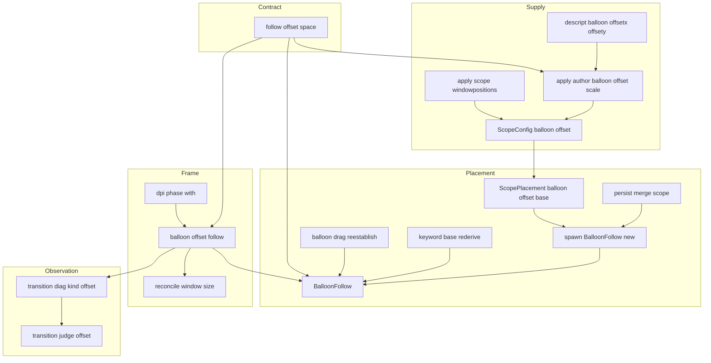
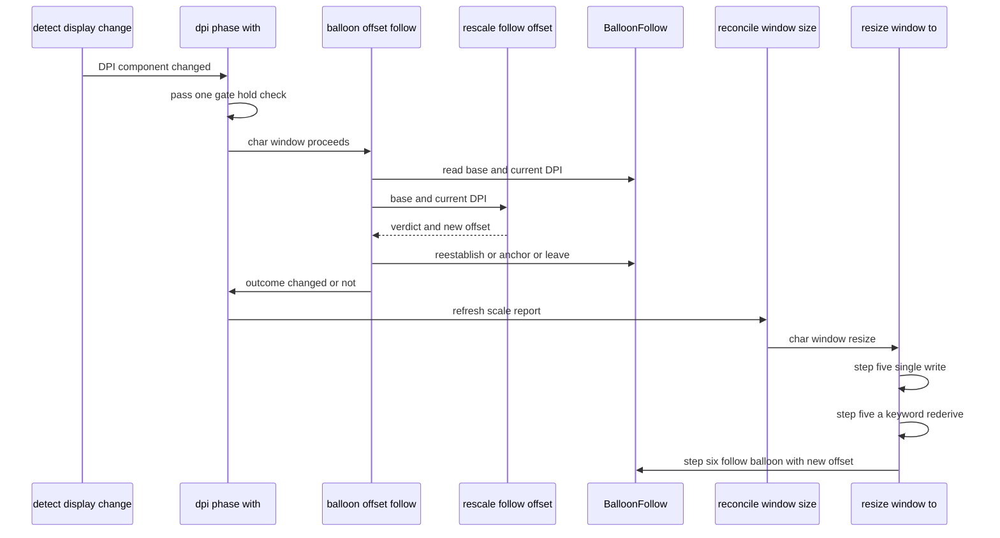
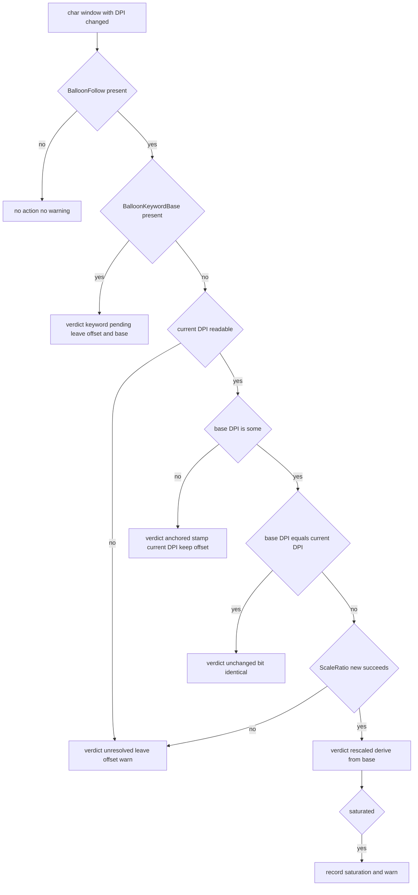

# 技術設計書: areka-P0-balloon-offset-dpi

## Overview

**Purpose**: バルーン位置オフセットが属する座標空間を 1 つに定め、拡大率が変わったときの変換規則と保存・復元の意味論を確定・実装する。これにより、拡大率の異なるモニタが混在する環境でバルーンとキャラの見た目の位置関係が保たれ、`descript.txt` に `balloon.offsetx`／`offsety` を宣言したゴーストが拡大率 1 以外の画面でも作者の意図どおりに表示される。

**Users**: 拡大率混在環境（125%／200% など）の利用者と、96dpi 前提でゴーストを描く作者。

**Impact**: 実行時のオフセット合流欄を「現在の表示 DPI における物理 px」の**単一空間**へ確定させ（従来は作者空間の生値と拡大率適用済みの量が同じ欄で混ざっていた）、拡大率遷移時にオフセットが取り残される欠陥を解消する。永続値は本仕様が明示の例外として据え置く。

本設計の中心は**基準対（オフセットの基準値と、その値が属する表示 DPI）を追従 Component へ持たせ、遷移のたびに前回の結果ではなく基準から引き直す**ことである。これにより往復の無誤差が構造的に成立し、`ScaleRatio` へ逆数・比の公開面を新設せずに済む（先行仕様 `scale-exact-rational` の裁定領域に触れない）。

### Goals

- 実行時のオフセット供給元 4 つ（`descript` の `balloon.offsetx`／`offsety`・`windowposition` 由来の調整量・キーワード由来の基本位置・利用者のドラッグ結果）を**同一の単位空間**へ揃えて合流させる。
- 拡大率遷移でキャラ窓の拡大率が変わったとき、追従オフセットを**基準から引き直して**追随させ、往復で誤差を累積させない。
- キーワード由来の基本位置の再導出と拡大率追随を**構造的に排他**にする（宣言ではなく実装上の保証）。
- 永続値が実行時契約の**明示の例外**であることを記録し、拡大率をまたぐ保存位置の追従を行わない（既存の開発者裁定の踏襲）。
- 参照実装 SSP の拡大率跨ぎ挙動を観測し、判断を互換記録の裁量表へ登記する。

### Non-Goals

- 既存供給元の換算軸の変更（`windowposition` 由来＝バルーン軸・`\![move]`＝シェル軸は温存）。
- 保存形式へのキー・値ごとの版の導入。
- `ScaleRatio` への逆数・比・`num`／`den` アクセサの新設。
- 拡大率をまたぐ保存位置の追従（＝復元直後に残る見た目の食い違いの解消）。
- バルーン追従の基準（キャラ窓左上相対）・キャラ窓自身の遷移・初期配置式・遷移中の時間差の是正。

---

## Boundary Commitments

### This Spec Owns

- **オフセットの単位空間契約そのもの**——実行時の合流欄 `ScopeConfig.balloon_offset`／`ScopePlacement.balloon_offset`／`BalloonFollow` が保持する値の意味の唯一の権威。新設モジュール `placement/follow/offset_space.rs` がこの契約の定義元になる。
- **`BalloonFollow` Component の定義と、その書込経路**。オフセットの基準対（基準値＋基準 DPI）を持たせ、書込を構築子と再確立子の 2 本に閉じる。
- **拡大率遷移時のオフセット変換規則**（純関数 `rescale_follow_offset`）と、その適用相（frame 層の新規ステップ）。
- **`descript` の `balloon.offsetx`／`offsety` への拡大率適用**（供給層の新規変換ステップ）と、掛ける拡大率の軸の決定。
- **キーワード再導出との排他の判断**（素材の有無で分岐する側＝本仕様の新規コード）。
- **追随の観測記録**（`transition_diag` への種別 1 つの追加）と、その機械判定（新規判定モジュール）。
- **互換記録 `doc/COMPAT_ARCHITECTURE.md` §8 への自らの 3 行の追記**。

### Out of Boundary

- `rederive_keyword_balloon_offset` の**発火条件と「経路で絞らない」設計判断**（`follow/keyword_base.rs:71-81`）——本仕様は反転させない。同関数への変更は基準対の再確立（1 行の呼び替え）に限る。
- `enqueue_window_set_pos` の**署名**（同居 spec `scope-zorder-pinning` が design の不変条件として「触らない」と宣言している funnel）。本仕様も触らない。
- `resize_window_to`／`move_window_with_route`／`resize_window_keep_position` の**署名と手順の順序**。本仕様は引数を増やさない。
- `resolver.rs` の**配置式 P1〜P5**（`scope-chain-gap` の領分）。本仕様が触るのは `ScopePlacement` への基準対欄の追加と、その 1 行の代入のみ。
- `scale_signed`（`windowposition.rs:133`）の**署名と挙動**。`\![move]` と共用の部品ゆえ変えない（飽和の記録は呼び手側で行う）。
- `ScaleRatio` の**公開面**（`scale.rs:256-260` の明文の拒否を覆さない）。
- 永続化の**表現・優先順位・「焼き付けない」規約**（`persist.rs`）。本仕様は復元時に基準対を確立するだけで、保存表現も採否順位も変えない。
- `windowposition` の**語彙と符号規約**・キャラ窓自身の拡大率遷移・画面内維持の関門・遷移中の可視化と窓書込の時間差。
- SSP の**実機観測そのもの**は本設計が手順を定めるが、観測の実施と結果の登記は実装フェーズの実機セッションの仕事である。

### Allowed Dependencies

- `areka_emo_compose::ScaleRatio` の**既存公開面のみ**——`ONE`／`new(num, den) -> Option<ScaleRatio>`／`is_identity`／`scale_len`。`ScaleRatio::new` は gcd 約分済みの正準形を返すため `new(192, 96) == new(2, 1)` が成立し、遷移比を**表示 DPI の整数 2 つから**組める（先例＝`emo2_boot/frame_dpi_reproject_tests.rs:443` が既に同じ形で比を組んでいる）。
- `placement::windowposition::scale_signed`（`pub(crate)`・大きさは `ScaleRatio::scale_len` へ委譲・符号保存・`±i32::MAX` 飽和）。
- `wintf::ecs::DPI`（`dpi_x`／`dpi_y: u16`・`Copy`＋`PartialEq`）——遷移の真実源。
- `placement::transition_diag`（既定 OFF・語彙表が全数を保証・実機判定ランナーと接続済み）。
- `emo2_boot::frame::dpi::dpi_phase_with` の**内側**（相の順序と待ち札の関門に相乗りする）。
- 共有テストハーネス `log-capture-kit`／`temp-path-kit`、`emo2_boot::frame_test_support::FrameHarness`。

**依存の向き**:

`ScaleRatio` → `follow/offset_space.rs`（純関数・契約の定義元） → `placement` の消費者（persist／spawn／follow） → `emo2_boot::frame`（適用相） → `transition_judge_offset`（判定・`#[cfg(test)]`）

ただし `offset_space` は型の再利用として `resolver::PointPx` と `windowposition::scale_signed` に依存し、`resolver` は `offset_space::OffsetBase` に依存する——**同一 crate 内の相互参照であり、一方向の層ではない**。「契約の定義元は `offset_space`・座標型の定義元は `resolver`・換算部品の定義元は `windowposition`」という役割分担として読む。`follow/offset_space.rs` は `World` を持たない純粋モジュールであり、ECS への到達は frame 層と `follow` の消費者側に限る。

### Revalidation Triggers

以下のいずれかが起きたら、下流（`emo2-conformance-e2e`）と同居仕様（`scope-zorder-pinning`・`present-write-coherence`）は結合を再確認すること。

- `BalloonFollow` の欄構成・アクセサ署名の変更（基準対の追加そのものが 1 回目のトリガである）。
- `ScopePlacement` の欄構成の変更。
- オフセットの単位空間契約の変更（物理 px 以外への移行）。
- 拡大率遷移時の変換規則の変更（基準から引き直す方式からの離脱）。
- `dpi_phase_with` の相順の変更、または追随ステップの挿入位置の変更。
- 遷移中の窓書込の回数の予算（キャラ ≤1・バルーン ≤1・別経路 0）の変更。
- `transition_diag` の種別語彙の追加——**発行側の語彙を増やしたら、共有パーサ `transition_judge.rs` の語彙表も同時に増やすこと**（片方だけ増やすと既存判定が `UnknownKind` で赤になる）。

---

## Architecture

### Existing Architecture Analysis

- **オフセットの実体は 1 つ・供給元は 4 つ**。合流欄は `ScopeConfig.balloon_offset` → `ScopePlacement.balloon_offset` → `spawn.rs:484` で `BalloonFollow` へ転写される 1 本道であり、供給元ごとの換算を差し込むのに新しい配管は要らない。配置式 P1〜P5 は `balloon_offset.unwrap_or((0, 0))` を既に加算しているため無改変で済む。
- **単位空間の混在は「意図的な暫定」と明記されている**（`windowposition.rs:191-197`・実装コメント `:214-215`）。本仕様はこの記述を確定契約の記述へ置き換える。
- **拡大率は 2 本ある**（`AuthorDpi { shell, balloon }`・`mod.rs:207-213`）。ただし後述 D5 のとおり、**遷移比では作者基準 DPI が約分で消える**ため、遷移の追随に軸の選択は生じない。軸の選択が残るのは供給時の換算だけである。
- **旧拡大率を覚えている場所がどこにも無い**。`DPI` component は現在値のみで、`monitor_systems.rs:534-536` が `*dpi = new_dpi` と上書きして旧値を捨てる。`refresh_scale_report` の戻り値 `None` は拡大率不変を意味しない（`frame/dpi.rs:329-332`）ため、**寸の変化を追随の発火条件にはできない**。
- **`BalloonFollow.offset` への非テスト書込は 3 か所しかない**（`spawn.rs:482-485` の構築・`drag_follow.rs:534-537`・`keyword_base.rs:142-145`）。保存値の復元は `persist::merge_scope` が `ScopePlacement.balloon_offset` を差し替えたうえで `spawn.rs` の構築を通るため、4 番目の書込口ではなく**構築口の入力違い**である。
- **`resize_window_to` の手順は確定している**——手順 5（位置＋寸を一度書き）／5b（接地点観測）／5a（キーワード再導出）／6（随伴バルーン追従）。追従オフセットの書換えは手順 6 より前でなければならない。
- **1 ファイル 1,000 行の番人が例外表と完全一致を要求する**（`crates/log-capture-kit/tests/file_length_guard_test.rs`）。`follow/window_move.rs`（1,227 行）は既に例外表にあるが、**新たに 1,000 行を超えるファイルを作ると番人が赤になり、例外表の編集が必要になる**——要件 9.6 がそれを禁じている。本設計はこれを構造制約として扱う（D17）。

### Architecture Pattern & Boundary Map

**採用パターン**: 基準対（Anchored Base Pair）＋純関数の変換権威。表に出る値は従来どおり物理 px の導出量とし、遷移では**前回の結果からではなく基準から**引き直す。



**Architecture Integration**:

- **責務の分離**: 契約と変換規則は `World` を持たない純関数モジュールが単独で所有し、ECS への書込・観測・収束の保証は frame 層のステップが所有する。判断の分岐はすべて純関数側にあるため、決定論テストは ECS を組まずに全網羅できる（要件 7.9）。
- **既存パターンの保存**: 供給元を増やすだけの層（`apply_scope_windowpositions` と同じ流儀）／単一の丸め権威への委譲／既定 OFF の構造化観測チャネル／`#[cfg(test)]` の判定器——いずれも既存の形をそのまま踏襲する。
- **新規要素の根拠**: 基準対は要件 3.3／7.8（往復で誤差が累積しない）を**構造的に**成立させるために要る。前回の結果へ比を掛ける方式では、`ScaleRatio` に逆数が無いため `unscale_coord`＋`scale_len` の 2 段丸め（床方向 対 round half away from zero＝丸め方向が非対称）に頼るほかなく、しかも `unscale_coord` の doc（`scale.rs:223-226`）が「寸法・長さを渡してはならない」と明記しているためオフセットへ使うこと自体が契約違反にあたる。
- **Steering 遵守**: 画素演算に f32 を持ち込まない（`ScaleRatio::as_f32` は使わない）／ログ無しの失敗経路を作らない／檻に入れるのは判断分岐のみ／符牒を持ち込まない。

### Key Decisions

| # | 判断 | 決定 | 根拠 |
|---|---|---|---|
| **D1** | 単位空間（1.1） | 実行時の合流欄と `BalloonFollow` の表に出る値は「**現在の表示 DPI における物理 px**」。作者空間の生値は供給時に換算して合流させる | 下流の確定済み契約（`persist`・`balloon_limit`・`resolver`・`keyword_base` の doc がすべて「offset は物理 px」を前提）への波及が最小。作者空間で持つ案は `windowposition` の実機実測写像を通る道を作り直すことになり、保存値との単位食い違いも生む |
| **D2** | `balloon.offsetx`／`offsety` の換算軸（1.4・2.1） | **シェル軸**（`MeasureScaling::shell`） | 語彙の出所がゴースト／シェルの `descript.txt`（`config.rs:264-274` の `cascade2(ghost_kv, shell_kv, ...)`）＝シェル作者の空間で書かれた値だから。既存裁定 `mod.rs:395-397`（「`windowposition` はバルーン作者の空間ゆえバルーン軸」）と**同じ論法**を延ばした結果であり、既存の割り当てとは矛盾しない。合流欄は物理 px で homogeneous ゆえ、供給元ごとに軸が違っても加算は成立する |
| **D3** | 換算の適用点（2.1） | **供給層**——`prepare_stages` が `apply_scope_windowpositions` を呼ぶ**直前**に新ステップ `apply_author_balloon_offset_scale(&mut cfg, &scope_ids, scaling.shell)` を挟む | `config.rs` は「KV の純粋転記に徹し」と明記された層で拡大率を持たない（`config.rs:276-278`）。供給層なら `windowposition` と同じ位置・同じ流儀で入り、配置式 P1〜P5 も加算の合流点（`windowposition.rs:216-219`）も無改変で済む。順序を windowposition の前に置くのは、加算の時点で両者が既に物理 px であることを保証するため（要件 2.3・1.2） |
| **D4** | 遷移の変換規則（3.1・3.3） | **基準対から毎回引き直す**。`offset ← scale_signed(base.offset, ScaleRatio::new(now_dpi, base.dpi))`。前回の結果を入力にしない | 出力を入力へ戻さないため誤差が連鎖しない。`f(b, d, d)` が恒等（`ScaleRatio::new(d, d)` は正準形で 1/1＝`is_identity`・`scale_len` が恒等 k を素通し）ゆえ、往復は **bit 同一**で戻る。一度でも訪れた DPI へ戻れば常に同じ値になる（要件 3.3・7.8 が実測ではなく構造で成立する） |
| **D5** | 旧拡大率の入手（3.1） | **入手しない**。基準対が持つ**基準 DPI** と、遷移の真実源である `DPI` component の現在値だけで比を組む。`applied_ratio` は使わない | 遷移比では作者基準 DPI が約分で消える: `k_axis(d) = app_scale × (d ÷ author_dpi_axis)` ゆえ `k_axis(d₁) ÷ k_axis(d₀) = d₁ ÷ d₀`（軸に依らず同一）。よって**遷移の追随に軸の選択は生じない**（要件 4.4 の「どちらを用いるか」への答え＝どちらでもなく表示 DPI 比）。`ScaleRatio::new(u32, u32)` は既存公開面ゆえ新 API も不要 |
| **D6** | 追随の挿入位置（3.4・9.5） | **frame 層**——`dpi_phase_with` の第 2 巡、`refresh_scale_report`（`frame/dpi.rs:335`）を呼ぶ**前**に、キャラ窓に対して実行する | 手順 6（`follow_balloon`）より前という制約を満たしつつ、`resize_window_to`／`enqueue_window_set_pos` の**署名を 1 つも変えない**（zsp の design 不変条件を守る）。第 1 巡の待ち札の関門（`apply_dpi_phase_gate`）を通過した窓だけが第 2 巡へ来るため、追随も自動的に同じ関門に従う（見送り中の窓を追い越さない）。発火条件が `Changed<DPI>` なので、`refresh_scale_report` の `None` が拡大率不変を意味しない罠を構造的に回避する |
| **D7** | キーワード再導出との排他（4.3） | **素材の有無で分岐する**。追随ステップはキャラ窓が `BalloonKeywordBase` を持つ間、オフセットも基準対も 1 bit も触らず `verdict=keyword-pending` を記録して抜ける | `keyword_base.rs:71-78` の「経路で絞らない」明文の設計判断を**反転させずに**排他が成立する（分岐は本仕様の新規コード側に置く）。正しさの検証: 素材があって再導出が発火する場合＝再導出は新しい実表示寸から**絶対値として**導出するので新 DPI で正しい。素材があって再導出が発火しない場合＝**キャラ寸とバルーン寸の両方**が不変なら中央揃えの幾何も不変で、既存 offset がそのまま正しい。ただし「k は変わったが丸め後のキャラ寸は同じ・バルーン寸だけ動く」稀な腕（`frame/dpi.rs:329-332` が実在を裏づける）では再導出も追随も走らず、揃えの取り残しが次の寸法変化まで残る——**2026-08-27 の開発者裁定により受容する残余として登記**（条件が二重に稀・`verdict=keyword-pending` が記録に残り沈黙しない・次の寸法変化で自己回復する・塞ぐには追随の判定を新寸確定後へ回す二段構えが要り挿入位置の単純さを失う）。残余の登記は要件 4.4 の記録に含める（D8） |
| **D8** | 揃えの残差の許容量（4.4） | **軸不一致による残差は生じない**（D5）。残るのは丸め残差のみで、**表示 DPI 比が 1/2〜2 の範囲で 1 軸あたり ≤ 3px** を許容量とする。決定論テストは DPI 行列を全数列挙して**実値も逐語で固定**する | 中央揃え式 `char_x + (char_w − balloon_w) ÷ 2` の両寸は同じ表示 DPI 比で伸びる。残差の出所は⑴ `char_w`・`balloon_w` が作者寸から `scale_len` で個別に丸められること（各 ≤0.5px）⑵ 中点の整数除算（<1px）⑶ 追随の `scale_signed` の丸め（≤0.5px）の 3 つだけ。比 2 倍で合計 3px を超えない。上限を置いたうえで実値も固定するのは、上限内での悪化を見逃さないため。**要件 4.4 の記録には D7 の受容残余も含める**——素材未消費×寸据え置き遷移の腕では揃えの更新が次の寸法変化まで見送られる（開発者裁定 2026-08-27・受容） |
| **D9** | 縮退時の警告水準（1.5・3.6・9.4） | **本仕様の経路だけが警告する**。`applied_ratio` を使わないため既存 donor（`drain_resnap.rs:95-98` の無警告縮退）とは**そもそも接点が無く、非対称は生じない**。供給時の縮退は既存の単一縮退点（`build_measure_scaling` の `error!`）に相乗りし、重複した警告を新設しない | 他仕様の記述に触れずに要件 9.4（記録の無い縮退経路を作らない）を満たす。遷移は毎フレーム起きないので `warn!` の spam 危険は無い |
| **D10** | 追随の記録の出し方（3.7・8.3） | `placement/transition_diag.rs` へ**種別 `offset` を 1 つ足す**（既定 OFF・語彙表 `PLACEMENT_KIND_ALL` へ追加）。常時の `info!` は足さない | 既存の語彙表が全数を保証し、実機ログの機械判定ランナーと既に接続済み。既定 OFF ゆえ定常 CPU 目標へ影響しない |
| **D11** | 互換記録の行数（6.5・6.6） | **3 行**（単位空間契約／遷移時の変換規則／保存往復の意味論）。他仕様の行は 1 文字も書き換えない | 4 欄形式は項目ごとの表であり、根拠と出典が項目ごとに違う 3 点を 1 行へ畳むと出典が読めなくなる。なお `COMPAT:172`（`windowposition-limit` 所有）の主張「`balloon.offsetx`／`offsety` を基本位置へ加算する・数値指定時とまったく同じ扱い」は**本仕様の後もそのまま真である**——本仕様は加算をやめず、`windowposition` 数値と同じく拡大率を掛けてから加算するので「まったく同じ扱い」はむしろ強まる。同行の書換えも所有者への相互確認も要らない（本仕様の単位空間行が軸の割り当てを明示的に補う） |
| **D12** | `\![move]` 経路の扱い（9） | **変更なし**。`BalloonFollow` の表に出る値の意味が変わらないため `move_window_with_route`（`window_move.rs:76-92`）は読み手として無改変。アクセサ化（D14）に伴う `.offset` → `.offset()` の呼び替えのみ | 表現据置きの利得。`follow_drag_tests.rs:48`／`follow_window_move_tests.rs:55` が固定する「再スケールなし」もそのまま生き残る |
| **D13** | 既存の遷移テストの扱い（7.4） | **書き換えは 2 本**（2026-08-28 実装時訂正・下記の注記を参照）。**`frame_dpi_reproject_tests.rs:382` は主張を書き換える**（除外・新設ではない）——「拡大率遷移では表示 DPI 比で追随する」へ改め、**書込前に読んだ値と突合する構造と空振り防止の証人 3 つは必ず保つ**。**`follow_visibility_balloon_wiring_tests.rs:850` は書き換えない**——同テストは DPI 遷移（`Changed<DPI>`）を一度も起こさない（`DPI::` の書き換えが無く、`for dpi in DPIS` で世界を組み直して `resize_window_to` を直接呼ぶだけ）ため、本設計の発火条件では是正後も緑のまま＝追随の証拠にならない。「寸法変化に対する不変」群へ区分を移し、テスト doc に「本テストは遷移を起こさない」旨を明記する。是正⑵の対のもう 1 本は新規（`frame_balloon_offset_follow_tests.rs` の行列）で組む。**⚠ 実装時訂正（2026-08-28・task 6.1）**: 本欄はもともと書き換えを 1 本と見込んでいたが、`frame_transition_atomicity_tests.rs` の 4.3 ブロックも**書込前にオフセットを読み、拡大率遷移で再スケールされないことを非空虚に主張していた**（前読みは `:300-310`・主張は `:415-434`。Testing Strategy が引いていた `:285` は関数頭であって主張の位置ではない）。ゆえに同ブロックも**書き換え対象**であり、実測でも是正前は赤になる。当該不変を上書きする権威は要件 3.1（拡大率遷移では追従オフセットを更新する）であり、要件 9.7 が「atom 時点の契約の写し」として上書きされる側を名指ししている。**不変が残るのは作業領域の再スナップ（9.7）と面の切替（9.8）だけで、拡大率遷移を守る条項は要件のどこにも無い。**書き換えは 4.3 ブロックに閉じ、原子性・窓ごとの書込数・経路 A 0 件・接地点 diff・非空虚性の証人はいずれも無傷とする | 本プロジェクトの流儀（陳腐化テストは除外・壊れたら更新）。前者は取りこぼしではなく現行契約の正確な写しであり、赤になるのが正しい＝要件 7.4 の「是正前は失敗する側」。後者を書き換えると「遷移を起こさないテストが遷移を主張する」空振り——同テストが `:330-358` で自ら戒める罠の別種——になる |
| **D14** | 基準対の取りこぼし防止 | `BalloonFollow` を新モジュールへ移し、**`offset` を私有欄にして読取は `offset()` アクセサに閉じる。書込は確立が `new()`／`reestablish()` の 2 本・追随相専用が `anchor_base_dpi()`／`apply_rescaled()` の 2 本**（後者 2 本は基準を変えない） | 基準対の最大の危険は「書き手を 1 つでも取りこぼすと基準が古いまま残り、次の遷移で静かにずれる」こと。欄を私有にすると、定義モジュールの外にある既存の書込 2 か所（`drag_follow.rs:534`・`keyword_base.rs:144`）は**コンパイルエラーになる**——危険を型で潰す。構築側は欄が増えるだけで既に構造体リテラルがコンパイルエラーになる（`config.rs:276-278` と同じ防御） |
| **D15** | 永続値の基準 DPI（5.2・5.4・1.1 の例外） | 基準 DPI を `Option<DPI>` とし、**`None`＝未係留**（「最初に観測した表示 DPI の空間に属する」と読む）を導入する。永続値を採用した腕だけが `None` を持ち、最初の観測で**値を変えずに**その時の DPI を係留する。配置式が出した既定は `Some(採寸 DPI)` を持つ | 要件 5.2（保存値を換算せずそのまま採用）と要件 3.1（遷移では追随する）は、この 1 ビットが無いと両立しない。保存値は**どの拡大率で書かれたかを記録していない**（要件 5.1）ため、基準 DPI を発明して係留すると、主モニタと違う DPI のモニタへ復元されたときに保存値を二重に拡大してしまう。未係留は「情報が無い」ことの正直な表現であり、要件 5.3 が求める「永続値は実行時契約に対する明示の例外である」の実装上の姿でもある。係留後は要件 5.4 のとおり通常の追随規則が効く |
| **D16** | 収束の保証（3.1・3.4） | 追随でオフセットが実際に変わったのに、続く `reconcile_window_size`／`reproject_char_window_at_current_size` が **`false`（べき等 skip・寸不正・窓未生成・破棄済み）を返した**場合に限り、追随ステップが `follow_balloon` を 1 度だけ呼んでバルーンを収束させる | `resize_window_to` は位置と寸がともに同一なら手順 4 で早期 skip し（`window_move.rs:337-345`・**`return false`** を実測確認済み）、手順 6 の追従に到達しない。この腕を放置すると「オフセットは直ったのにバルーンは次に何かが動くまで古い位置に居る」という、本仕様が消しに来た欠陥そのものが残る。書込回数の予算は守られる——通常時はキャラ 1・バルーン 1（従来と同数）、skip 時はキャラ 0・バルーン 1 で**合計は増えない**。要件 3.4 の「回数を増やさない」は、要件の Adjacent expectations が定める**予算形（キャラ ≤1・バルーン ≤1・別経路 0）**で読む——skip 腕のバルーン書込 0→1 は予算内であり、放置すればオフセットだけ直って窓が旧位置に残る（本仕様が消しに来た欠陥そのもの）。中間位置は提示されない（バルーンは 1 度で最終位置へ行く） |
| **D17** | 分量規律（9.6） | **新規コードは新規ファイルへ置き、既存ファイルを 1,000 行超へ押し上げない**。追記の見込み: `transition_diag.rs` 617→約 680・`frame/dpi.rs` 482→約 495・`drag_follow.rs` 912→**減る**（`BalloonFollow` の移設ぶん）・`windowposition.rs` 435→約 460・`mod.rs` 694→約 715・`transition_judge.rs` 929→約 940 | 行数の番人は「実測した超過ファイルの集合が例外表と**完全に一致**する」ことを要求する。1 ファイルでも新たに超えると番人が赤になり、例外表の編集が要る——要件 9.6 がそれを禁じている。判定モジュールを既存の `transition_judge.rs`（929 行）／`transition_judge_verdict.rs`（863 行）へ足さず新設するのも同じ理由。ただし**共有パーサの語彙表への match アーム 1 本は例外**——語彙を教えないと既存判定が `UnknownKind` で赤になるため `transition_judge.rs` へ足す（929→約 940 行・上限に触れない） |

### Technology Stack

| Layer | Choice / Version | Role in Feature | Notes |
|-------|------------------|-----------------|-------|
| 有理数演算 | `areka-emo-compose::ScaleRatio` | 遷移比の構築と丸め | 既存公開面のみ。`new`／`is_identity`／`scale_len` |
| 符号付き換算 | `placement::windowposition::scale_signed` | 供給時換算・遷移追随の共通部品 | 署名も挙動も変えない。`\![move]` と共用 |
| ECS | `bevy_ecs` 0.19 | `BalloonFollow`・`DPI`・`BalloonKeywordBase` | 新規 Component は追加しない（既存 Component に欄を足す） |
| 観測 | `tracing` ＋ `transition_diag` | 既定 OFF の構造化観測 | 種別 1 つの追加。target は `wintf::transition` |
| テスト | `log-capture-kit`／`temp-path-kit`／`FrameHarness` | 決定論テスト | 共有ハーネスで最初から書く（新設しない） |

新規の外部依存は無い。

---

## File Structure Plan

### Directory Structure

```
crates/areka/src/
├── placement/
│   ├── follow/
│   │   └── offset_space.rs            # 新規: 単位空間契約の定義元・BalloonFollow・OffsetBase・
│   │                                  #       純関数 rescale_follow_offset / scale_author_offset
│   ├── follow.rs                      # 変更: mod 宣言・再輸出先の差替え・新テスト宣言
│   ├── follow/drag_follow.rs          # 変更: BalloonFollow 定義の移出／書込を reestablish へ
│   ├── follow/keyword_base.rs         # 変更: 書込を reestablish へ（発火条件は不変）
│   ├── follow/window_move.rs          # 変更: .offset → .offset() の呼び替えのみ（行数を増やさない）
│   ├── windowposition.rs              # 変更: 混在 doc を確定契約の記述へ置換（1.3）
│   ├── mod.rs                         # 変更: 供給ステップの呼出追加・採寸 DPI の受渡し
│   ├── resolver.rs                    # 変更: ScopePlacement へ基準対欄を追加＋1 行の代入のみ
│   ├── persist.rs                     # 変更: merge_scope の保存値採用腕で基準を未係留にする
│   ├── spawn.rs                       # 変更: BalloonFollow::new へ基準対を渡す
│   ├── transition_diag.rs             # 変更: 種別 offset の語彙・レコード・発行口を追加
│   └── transition_judge_offset.rs     # 新規: 追随レコードの機械判定（#[cfg(test)]）
└── emo2_boot/frame/
    ├── balloon_offset_follow.rs       # 新規: 追随の適用相（ECS 側・観測・収束の保証）
    └── dpi.rs                         # 変更: 第 2 巡へ追随ステップの呼出を 1 か所挿入
```

### Modified Files

- `crates/areka/src/placement/follow/offset_space.rs`（新規・見込み 300〜380 行）— **本仕様の契約の定義元**。モジュール doc が単位空間契約の唯一の権威。`BalloonFollow`（`offset` 私有）・`OffsetBase`・`OffsetRescale`・`UnresolvedScale`・`rescale_follow_offset`・`scale_author_offset` を持つ。`World` に触れない。
- `crates/areka/src/placement/follow.rs` — `mod offset_space;` の追加、`pub use self::offset_space::BalloonFollow;`（従来は `drag_follow` から）、私有再束縛の追加、新テストモジュールの宣言。**外部からの参照はすべてこのファサードを経由するため、移設の波及はここで吸収される。** あわせて、現在は私有再束縛にとどまる `follow_balloon`／`BalloonFollowTrigger`（`use self::drag_follow::{BalloonFollowTrigger, follow_balloon};`）を **`pub(crate) use` へ格上げ**する——frame 層の追随ステップが収束の保証（D16）で `follow_balloon` を呼ぶため。公開面は crate 内に留め、外部 API は増やさない。
- `crates/areka/src/placement/follow/drag_follow.rs` — `BalloonFollow` の定義を移出（行数は減る）。`on_balloon_drag` の書込（`:534-537`）を `reestablish(new_offset, current_dpi)` へ。現在 DPI はキャラ窓の `DPI` component から読む——`on_balloon_drag` は `BalloonFollow` を `get_mut` で借りるため、**DPI を先に読んでから借りる**順序にする（同時借用を避ける）。
- `crates/areka/src/placement/follow/keyword_base.rs` — `:143-145` の書込を `reestablish` へ。**発火条件（`old_size != new_size`）と「経路で絞らない」doc は 1 文字も変えない。**
- `crates/areka/src/placement/follow/window_move.rs` — `:87-88`・`:372-373` ほかの `.offset` を `.offset()` へ呼び替え。**新しい行を足さない**（既に例外表の対象ファイルのため）。
- `crates/areka/src/placement/windowposition.rs` — `:191-197` の「注意（単位空間の混在・意図的）」と `:214-215` の実装コメントを、確定契約（合流欄は物理 px・供給元ごとの換算軸の割り当て）の記述へ置換し、定義元 `follow/offset_space.rs` を指す。`scale_signed`・`to_screen_adjust`・`apply_windowposition` の署名と挙動は不変。
- `crates/areka/src/placement/mod.rs` — `prepare_stages` に⑴ `apply_author_balloon_offset_scale(&mut cfg, &scope_ids, scaling.shell)` の呼出を `apply_scope_windowpositions` の直前へ追加、⑵ **採寸 DPI** を `resolve_placement` へ渡す配線を追加。採寸 DPI の定義は `build_measure_scaling` が拡大率の**分子**へ取った値（`ScaleRatio::new(dpi, author)`＝主モニタ DPI ÷ 作者基準 DPI・`mod.rs:302`）——`primary_dpi` が `Some(d)` かつ `d > 0` なら `d`、それ以外は縮退値 `FALLBACK_PRIMARY_DPI`——であり、`DPI::from_dpi(d as u16, d as u16)` として運ぶ。**採寸 DPI は起動時の主モニタ DPI であって、窓がいま載っているモニタの DPI ではない**——非主モニタで生まれた窓は最初の `Changed<DPI>` で主モニタ空間から実モニタ空間へ引き直される（それが望ましい挙動である）。**この値と `MeasureScaling` の分母が食い違ってはならない**ので、`build_measure_scaling` が採用した値をそのまま返す形（現在は内部で決めて捨てている）にして単一の決定点を保つ。
- `crates/areka/src/placement/resolver.rs` — `ScopePlacement` へ `balloon_offset_base: OffsetBase` を追加し、`resolve_placement` の出力で `OffsetBase { offset: balloon_offset, dpi: Some(採寸 DPI) }` を代入する（採寸 DPI は新規引数として受ける）。**配置式 P1〜P5 は無改変。**
- `crates/areka/src/placement/persist.rs` — `merge_scope` の保存値採用腕（`:396` の `(Some(x), Some(y))`）で `balloon_offset_base = OffsetBase { offset: 保存値, dpi: None }`（未係留）を置く。欠損腕は `placement.balloon_offset_base` をそのまま運ぶ。**保存 entries の構築・採否順位・「焼き付けない」規約は不変。**
- `crates/areka/src/placement/spawn.rs` — `:482-485` を `BalloonFollow::new(balloon_window, p.balloon_offset_base)` へ。欄が増えるため既存のリテラル構築は必ずコンパイルエラーになり、追随漏れが構造的に起きない。
- `crates/areka/src/placement/transition_diag.rs` — `KIND_OFFSET`・判定語 6 つ・`OFFSET_FIELDS`・`OffsetRecord`・`offset_line`・`log_offset_rescale` を追加し、`PLACEMENT_KIND_ALL` へ `KIND_OFFSET` を足す。
- `crates/areka/src/placement/transition_judge.rs` — **共有パーサの語彙表へ `KIND_OFFSET` を教える**: `required_fields` へ `KIND_OFFSET => Some(OFFSET_FIELDS)` の match アーム 1 本と定数参照を足す（929→約 940 行・上限 1,000 に触れない）。これを怠ると `kind=offset` 行が `RecordDefect::UnknownKind` になり、既存の機械判定（atom／pwc の資産）と `transition_judge_reobservation_tests.rs` の全行整形性検査が赤になる。**判定ロジックは足さない**（新設の `transition_judge_offset.rs` が持つ——語彙を教えることと判定を置くことは別問題）。埋め込み再観測ログは本仕様では再採取しないため更新不要（`kind=offset` は新規採取のログにのみ現れる）。
- `crates/areka/src/placement/transition_judge_offset.rs`（新規・`#[cfg(test)]`・見込み 200〜260 行）— 追随レコードの切り出しと判定量の集計。**判定語は発行側の `pub const` を参照するだけでリテラルを書かない**（既存 `transition_judge.rs` の規律を踏襲）。
- `crates/areka/src/emo2_boot/frame/balloon_offset_follow.rs`（新規・見込み 150〜200 行）— `rescale_balloon_follow_offset(world, char_window) -> OffsetFollowOutcome`。`BalloonFollow`・`DPI`・`BalloonKeywordBase` を読み、純関数へ委ね、結果を `reestablish`／基準の係留として書き、観測を出す。`follow_balloon` による収束（D16）もここが呼ぶ。
- `crates/areka/src/emo2_boot/frame/dpi.rs` — `dpi_phase_with` 第 2 巡の `refresh_scale_report`（`:335`）の**直前**へ、`GhostWindowKind::Char` のときだけ追随ステップを呼ぶ 1 ブロックを挿入し、その戻り値を `Some`／`None` 両腕の `wrote` と突き合わせて D16 の収束を決める。**相順・待ち札の関門・`reconcile_window_size` の署名は不変。**

### 新規テストファイル

- `crates/areka/src/placement/follow_offset_space_tests.rs` — 純関数の全網羅。
- `crates/areka/src/placement/balloon_offset_supply_tests.rs` — 供給層の結線（換算ステップと `apply_scope_windowpositions` の呼出順・合流値・飽和の記録）。
- `crates/areka/src/emo2_boot/frame_balloon_offset_follow_tests.rs` — `FrameHarness` による相の結合。
- `crates/areka/src/placement/balloon_offset_persist_roundtrip_tests.rs` — 保存／復元の行列。
- `crates/areka/src/placement/transition_judge_offset_tests.rs` — 判定器と実機サインオフ手順（`#[ignore]` ランナーを含む）。

いずれも 1,000 行を超えないこと（D17）。

---

## System Flows

### 拡大率遷移での追随（要件 3・4）



- 追随は `refresh_scale_report` の**前**に終わるため、手順 6 の追従は必ず新しいオフセットで書かれる。
- 第 1 巡の待ち札の関門を通過した窓だけが追随の対象になる（見送り中の窓を追い越さない）。
- `reconcile_window_size` が `false` を返した腕でのみ、追随ステップが `follow_balloon` を 1 度だけ呼ぶ（D16）。

### 追随の判断（要件 3.6・4.3・5.2）



---

## Requirements Traceability

| Requirement | Summary | Components | Interfaces | Flows |
|-------------|---------|------------|------------|-------|
| 1.1 | 実行時供給元が同一空間へ合流 | offset_space（契約 doc） | 契約定義（物理 px） | 供給フロー |
| 1.2 | 換算後のみ合流・混在させない | offset_space・placement/mod | `scale_author_offset` | 供給フロー |
| 1.3 | 暫定記述を確定契約へ置換 | windowposition.rs doc | doc（`:191-197`／`:214-215`） | — |
| 1.4 | 供給元→軸の割り当てを記録 | offset_space（契約 doc）・COMPAT §8 | 契約定義（D2） | — |
| 1.5 | 解決不能なら恒等＋警告 | placement/mod（既存縮退点） | `build_measure_scaling` の `error!` | 供給フロー |
| 2.1 | descript オフセットへ拡大率適用 | offset_space・placement/mod | `scale_author_offset` | 供給フロー |
| 2.2 | 拡大率 1 で同一出力 | offset_space | `scale_len` の恒等素通し | — |
| 2.3 | 両者を同一空間で加算 | placement/mod（呼出順） | `apply_windowposition` は無改変 | 供給フロー |
| 2.4 | 新しい丸めを導入しない | offset_space | `scale_signed` へ委譲 | — |
| 2.5 | 飽和させ記録する | offset_space | `ScaledAxis { value, saturated }` | 供給フロー |
| 2.6 | 片軸／未宣言の受理規約は不変 | config.rs（無改変） | `offset_x.zip(offset_y)` | — |
| 3.1 | 遷移でオフセットを更新 | balloon_offset_follow・offset_space | `rescale_follow_offset` | 追随シーケンス |
| 3.2 | 拡大率不変の寸法変化では触らない | balloon_offset_follow（発火条件） | `Changed<DPI>` のみが発火 | 追随判断 |
| 3.3 | 往復で誤差が累積しない | offset_space（基準対） | 基準から引き直す（D4） | 追随判断 |
| 3.4 | 窓書込を増やさず中間位置を出さない | balloon_offset_follow・dpi.rs | Component 書込＋D16 の会計 | 追随シーケンス |
| 3.5 | ドラッグ由来にも同一規則 | drag_follow（reestablish） | `BalloonFollow::reestablish` | 追随判断 |
| 3.6 | 解決不能なら変更せず警告 | balloon_offset_follow | `OffsetRescale::Unresolved` | 追随判断 |
| 3.7 | 前後の値を記録 | transition_diag（種別 offset） | `log_offset_rescale` | 追随シーケンス |
| 4.1 | 遷移で基本位置を再導出しない | keyword_base（無改変）・balloon_offset_follow | 追随のみで揃えを保つ | 追随判断 |
| 4.2 | 中央揃えを遷移後も保つ | offset_space | 表示 DPI 比の追随 | 追随判断 |
| 4.3 | 再導出と追随の排他 | balloon_offset_follow（D7） | `BalloonKeywordBase` の有無で分岐 | 追随判断 |
| 4.4 | 単一拡大率と残差の許容量 | offset_space（D5・D8） | 表示 DPI 比・≤3px/軸 | — |
| 4.5 | 一度きり再導出を廃止しない | keyword_base（発火条件は不変） | `rederive_keyword_balloon_offset` | — |
| 5.1 | 永続値は物理 px・値ごとの版なし | persist.rs（無改変） | `balloon_offset_entries` | — |
| 5.2 | 保存値を換算せずそのまま採用 | persist.rs・offset_space（D15） | `OffsetBase.dpi = None` | 追随判断 |
| 5.3 | 永続値は明示の例外であると記録 | offset_space（契約 doc）・COMPAT §8 | 契約定義 | — |
| 5.4 | 採用後の遷移には Req3 が効く | balloon_offset_follow | 係留後は通常の追随 | 追随判断 |
| 5.5 | 採否の優先順位は不変 | persist.rs（無改変） | `merge_scope` | — |
| 5.6 | 保存は生値（焼き付けない） | persist.rs・balloon_limit（無改変） | — | — |
| 5.7 | 保存値の意味が変わるなら記録 | COMPAT §8（保存往復の行） | 4 欄登記 | — |
| 6.1 | SSP の跨ぎ挙動を観測し記録 | 実機観測手順（実装フェーズ） | 観測手順書 | — |
| 6.2 | 参照挙動があれば実測を正とする | 実機観測手順 | 判断分岐（腕 A） | — |
| 6.3 | 無ければ areka 裁量として登記 | COMPAT §8 | 4 欄登記（腕 B） | — |
| 6.4 | 同種前例と矛盾しない | COMPAT §8（`:146`／`:154` と整合） | 3 例目としての位置づけ | — |
| 6.5 | 登記は 3 点を含む | COMPAT §8（3 行） | 4 欄登記 | — |
| 6.6 | 追記は自らの行に限る | COMPAT §8 | 他行を書き換えない（D11） | — |
| 7.1 | 遷移×アンカー×保存/復元の網羅 | 3 つの新規テスト群 | 行列テスト | — |
| 7.2 | 保存値が換算されないことを固定 | balloon_offset_persist_roundtrip_tests | 非回帰テスト | — |
| 7.3 | キーワード由来のケースを含む | frame_balloon_offset_follow_tests | 結合テスト | — |
| 7.4 | 是正前失敗／是正後通過の対 | D13 の書き換え 2 本＋新規 | 既存主張の反転 | — |
| 7.5 | 拡大率 1 の経路は同一出力 | follow_offset_space_tests | 恒等の固定 | — |
| 7.6 | 96 の倍数でない DPI を含む | follow_offset_space_tests | DPI 120／144 を含む行列 | — |
| 7.7 | シェルとバルーンの作者 DPI が異なる場合 | follow_offset_space_tests | 供給軸の分離を固定 | — |
| 7.8 | 往復で誤差が累積しない | follow_offset_space_tests | 基準対の bit 同一 | — |
| 7.9 | 判断分岐を対象・実機は最小限 | 純関数への分岐集約 | `OffsetRescale` の全腕 | — |
| 8.1 | 125%／200% の 2 台以上で実施 | 実機サインオフ手順 | 手順書 | — |
| 8.2 | 往復前後で位置関係が変わらない | transition_judge_offset | 判定項目 | — |
| 8.3 | 合否を記録の機械判定で決める | transition_judge_offset | 判定語と手順 | — |
| 8.4 | 先行仕様の残所見の解消を判定 | transition_judge_offset | 判定項目 | — |
| 8.5 | キーワード指定の揃えを判定 | transition_judge_offset | 判定項目 | — |
| 9.1 | 追従の基準は不変 | 全体（窓相対を変えない） | `offset()` の意味不変 | — |
| 9.2 | 関門と焼き付けない規約は不変 | balloon_limit・persist（無改変） | — | — |
| 9.3 | 新しい丸め規約を持ち込まない | offset_space | `ScaleRatio` 権威へ委譲 | — |
| 9.4 | 記録の無い縮退経路を作らない | balloon_offset_follow（D9） | 全縮退腕に `warn!` | 追随判断 |
| 9.5 | 共通経路の署名は相互確認を経る | D6（署名を変えない） | `enqueue_window_set_pos` 不変 | — |
| 9.6 | 分量規律と例外表を守る | D17 | 新規ファイルへ分離 | — |
| 9.7 | 下流の期待を 2 つに区別して記録 | COMPAT §8・設計 doc | 再スナップは不変／遷移は上書き | — |
| 9.8 | 面の切替では offset を維持 | balloon_offset_follow（発火条件） | `Changed<DPI>` のみが発火 | 追随判断 |

---

## Components and Interfaces

| Component | Domain/Layer | Intent | Req Coverage | Key Dependencies (P0/P1) | Contracts |
|-----------|--------------|--------|--------------|--------------------------|-----------|
| `follow::offset_space` | placement（純関数） | 単位空間契約の定義元と全変換規則 | 1.1–1.5, 2.1–2.5, 3.1, 3.3, 4.2, 4.4, 5.3, 9.3 | `ScaleRatio` (P0), `scale_signed` (P0) | Service, State |
| `BalloonFollow` | placement（Component） | 追従先と、オフセットの基準対 | 1.1, 3.3, 3.5, 5.2, 9.1 | `wintf::ecs::DPI` (P0) | State |
| `frame::balloon_offset_follow` | emo2_boot（適用相） | 遷移での追随の適用・観測・収束 | 3.1, 3.2, 3.4, 3.6, 3.7, 4.1, 4.3, 5.4, 9.4, 9.8 | `offset_space` (P0), `transition_diag` (P1), `follow_balloon` (P1) | Service, Event |
| 供給ステップ | placement（供給層） | descript オフセットの換算合流 | 1.2, 2.1, 2.3, 2.5 | `MeasureScaling::shell` (P0) | Service |
| `transition_diag` 種別 `offset` | placement（観測） | 追随の前後を追跡可能な記録に残す | 3.7, 8.3 | `wintf::transition` (P1) | Event |
| `transition_judge_offset` | placement（判定・test） | 実機ログの機械判定 | 8.2–8.5 | 発行側の `pub const` (P0) | Service |

### placement（純関数層）

#### `follow::offset_space`

| Field | Detail |
|-------|--------|
| Intent | バルーン位置オフセットの単位空間契約の定義元であり、すべての変換規則の単一の実装 |
| Requirements | 1.1, 1.2, 1.3, 1.4, 1.5, 2.1, 2.2, 2.3, 2.4, 2.5, 3.1, 3.3, 4.2, 4.4, 5.3, 9.3 |

**Responsibilities & Constraints**

- **契約の定義**: 実行時の合流欄と `BalloonFollow` の表に出る値は「現在の表示 DPI における物理 px」である。作者空間の生値を持つ供給元は、合流の前に本モジュールの換算を通る。**永続値はこの一本化の明示の例外**であり、基準 DPI の未係留（`None`）として表現される。
- **軸の割り当ての記録**: `descript` の `balloon.offsetx`／`offsety`＝シェル軸／`windowposition` 由来＝バルーン軸／`\![move]`＝シェル軸（後 2 者は既存確定・本仕様は温存して記録するだけ）。
- **丸めの権威を持たない**——大きさの丸めはすべて `ScaleRatio::scale_len` へ委譲し、符号は `scale_signed` が保存する。本モジュールは新しい丸め規約を 1 つも導入しない。
- `World`・`Entity`・`tracing` に触れない。警告の発行は呼び手の責務であり、本モジュールは判定結果を値として返す。

**Dependencies**

- Outbound: `areka_emo_compose::ScaleRatio` — 比の構築と丸め（P0）
- Outbound: `placement::windowposition::scale_signed` — 符号付き換算（P0）
- Outbound: `wintf::ecs::DPI` — 基準 DPI と現在 DPI の型（P0）

**Contracts**: Service [x] / API [ ] / Event [ ] / Batch [ ] / State [x]

##### Service Interface

```rust
/// 追従オフセットの基準対——値と、その値が属する表示 DPI。
#[derive(Debug, Clone, Copy, PartialEq, Eq)]
pub struct OffsetBase {
    /// 基準値（キャラ窓左上相対・物理 px）。
    pub offset: PointPx,
    /// 基準値が属する表示 DPI。`None` は**未係留**＝
    /// 「最初に観測した表示 DPI の空間に属する」と読む（永続値の腕・5.2）。
    pub dpi: Option<DPI>,
}

/// 換算の 1 軸ぶんの結果（飽和したかを呼び手へ伝える・2.5）。
#[derive(Debug, Clone, Copy, PartialEq, Eq)]
pub struct ScaledAxis {
    pub value: i32,
    pub saturated: bool,
}

/// 拡大率を解決できなかった理由（9.4：縮退は必ず語を持つ）。
#[derive(Debug, Clone, Copy, PartialEq, Eq)]
pub enum UnresolvedScale {
    /// 基準 DPI が 0（構築子を通れば起きないが、発明せず縮退する）。
    ZeroBaseDpi,
    /// 現在 DPI が 0。
    ZeroCurrentDpi,
}

/// 追随の判定結果。呼び手はこの 4 腕を網羅して書込と記録を決める。
#[derive(Debug, Clone, Copy, PartialEq, Eq)]
pub enum OffsetRescale {
    /// 未係留の基準を現在の DPI へ係留した——**値は変えない**（5.2）。
    Anchored { base_dpi: DPI },
    /// 基準 DPI と現在 DPI が同一——値も基準も変えない（3.3 の bit 同一）。
    Unchanged,
    /// 追随した。
    Rescaled { offset: PointPx, saturated: bool },
    /// 拡大率を解決できない——値も基準も変えない（3.6）。
    Unresolved { reason: UnresolvedScale },
}

/// 遷移時の唯一の変換規則（純関数・3.1／3.3／4.2／4.4）。
///
/// 前回の結果ではなく**基準から**引き直すため、出力が入力へ戻らず誤差が連鎖しない。
/// 比は表示 DPI から直接組む——`k(d) = app_scale × (d ÷ author_dpi)` ゆえ
/// `k(d₁) ÷ k(d₀) = d₁ ÷ d₀` で作者基準 DPI が約分で消え、シェル軸／バルーン軸の
/// 選択が生じない（4.4 の「どちらを用いるか」への答え）。
pub fn rescale_follow_offset(base: OffsetBase, current: DPI) -> OffsetRescale;

/// 作者空間のオフセットを合流欄の空間（物理 px）へ換算する（2.1／2.4／2.5）。
///
/// `k` は供給元の作者空間に対応する軸の表示スケール。`balloon.offsetx`／`offsety`
/// はシェル作者の空間ゆえ [`MeasureScaling::shell`] を渡す（D2）。
pub fn scale_author_offset(raw: (i32, i32), k: ScaleRatio) -> (ScaledAxis, ScaledAxis);
```

- **Preconditions**: `base.offset` はキャラ窓左上相対の物理 px。`current` は当該キャラ窓の `DPI` component の現在値。
- **Postconditions**:
  - `rescale_follow_offset(base, d)` は `base` を変更しない（純関数）。
  - `base.dpi == Some(d)` のとき必ず `Unchanged`（値を 1 bit も動かさない）。
  - `base.dpi == None` のとき必ず `Anchored { base_dpi: d }`（値を 1 bit も動かさない）。
  - `Rescaled` の値は軸ごとに `scale_signed(base.offset.axis, ScaleRatio::new(current.axis, base.dpi.axis))`。
  - `scale_author_offset(raw, ScaleRatio::ONE) == raw`（恒等は素通し・2.2）。
- **Invariants**:
  - **往復無誤差（3.3／7.8）**: 任意の DPI 列 `d₀ → d₁ → … → d₀` に対し、最後の結果は `d₀` で得た結果と bit 同一。基準が不変で、変換が `(base, base_dpi, target_dpi)` のみの関数だから。
  - **恒等（2.2／7.5）**: `base.dpi == Some(d)` かつ `current == d` の経路は、本仕様の適用前と同一の出力を返す。
  - 新しい丸め規約を 1 つも導入しない（9.3）。

**Implementation Notes**

- Integration: `ScaleRatio::new` は正準形へ約分するため `new(192, 96)` と `new(2, 1)` は同一値になり、DPI の絶対値に依らず比だけが効く。`None`（`num == 0` または `den == 0`）は `Unresolved` へ写す。
- Validation: 飽和の検出は呼び手側で行い、`scale_signed` の署名・挙動は変えない（`\![move]` と共用の部品ゆえ）。
- Risks: 基準 DPI の軸を単一スカラーにすると `DPI` の 2 軸表現との間に暗黙の仮定が入るため、`DPI` をそのまま持つ。

#### `BalloonFollow`（Component）

| Field | Detail |
|-------|--------|
| Intent | 追従先バルーン窓と、オフセットの現在値＋基準対を 1 つの Component に持つ |
| Requirements | 1.1, 3.3, 3.5, 5.2, 9.1 |

**Contracts**: Service [ ] / API [ ] / Event [ ] / Batch [ ] / State [x]

##### State Management

```rust
#[derive(Component, Debug, Clone, Copy, PartialEq, Eq)]
pub struct BalloonFollow {
    /// 追従して動かすバルーン窓 entity。
    pub balloon: Entity,
    /// キャラ窓左上からバルーン窓左上への相対 offset（現在の表示 DPI における物理 px）。
    /// **私有**——書込は [`BalloonFollow::new`] と [`BalloonFollow::reestablish`] の 2 本に閉じる。
    offset: PointPx,
    /// 基準対（この offset が導かれた元の値と、そのときの表示 DPI）。**私有**。
    base: OffsetBase,
}

impl BalloonFollow {
    /// 確立点で組む（配置解決の既定／保存値の復元）。`offset` は基準値そのもの。
    pub fn new(balloon: Entity, base: OffsetBase) -> Self;
    /// 現在の相対位置（読取専用）。
    pub fn offset(&self) -> PointPx;
    /// 基準対（読取専用・追随ステップと決定論テストが使う）。
    pub fn base(&self) -> OffsetBase;
    /// **確立点**——新しい相対位置を基準として焼き直す（ドラッグ結果・キーワード再導出）。
    pub fn reestablish(&mut self, offset: PointPx, dpi: DPI);
    /// **係留**——未係留の基準へ現在の表示 DPI を刻む（値は変えない・5.2）。
    pub fn anchor_base_dpi(&mut self, dpi: DPI);
    /// **追随**——基準から引き直した値を反映する（基準は変えない・3.1）。
    pub fn apply_rescaled(&mut self, offset: PointPx);
}
```

- **State model**: 確立点は 3 つ——配置解決の既定と保存値の復元（どちらも `new`）／バルーン単独ドラッグ中の記憶更新（`reestablish`）／キーワード由来の一度きり再導出（`reestablish`）。
- **Persistence & consistency**: 永続化されるのは `offset()` の値のみ（基準 DPI は保存しない・5.1）。復元時は `OffsetBase { offset: 保存値, dpi: None }` で構築する。
- **Invariant**: `base.dpi == Some(d)` である限り `offset() == rescale_follow_offset(base, d) の値`。画面内維持の補正はこの値へ焼き付かない（`COMPAT:169` の既存規約・9.2）ため、この不変量は関門通過後も破れない。

**Implementation Notes**

- Integration: 定義を `follow/offset_space.rs` へ置くことで、`drag_follow.rs`／`keyword_base.rs` は**別モジュール**になり、私有欄への直接代入がコンパイルエラーになる（D14）。外部からの参照は `placement::follow` ファサードの `pub use` を経由するため、移設の波及はファサード 1 行に閉じる。
- Validation: 3 つの確立点それぞれで基準が更新されることを決定論テストが逐語で固定する。
- Risks: 読取側の呼び替え（`.offset` → `.offset()`）が広範。ただし機械的で、漏れはコンパイルエラーになる。

### emo2_boot（適用相）

#### `frame::balloon_offset_follow`

| Field | Detail |
|-------|--------|
| Intent | 拡大率遷移で追随を適用し、観測を残し、バルーンの収束を保証する |
| Requirements | 3.1, 3.2, 3.4, 3.6, 3.7, 4.1, 4.3, 5.4, 9.4, 9.8 |

**Responsibilities & Constraints**

- 発火条件は `Changed<DPI>`（`dpi_phase_with` の対象集合）**だけ**である。面の切替・作業領域の再スナップ・`\![move]` は本ステップを通らないため、それらでオフセットが動かないことが構造的に保たれる（3.2・9.8）。
- キャラ窓に `BalloonKeywordBase` があるあいだは 1 bit も触らない（4.3・D7）。
- `refresh_scale_report` より前に完了する（手順 6 の追従が新しいオフセットで書かれるため・3.4）。
- 縮退腕はすべて `warn!` を伴う（9.4）。素材があって見送る腕は縮退ではないので警告を出さない（`rederive_keyword_balloon_offset` の同型の流儀に揃える）。

**Dependencies**

- Inbound: `frame::dpi::dpi_phase_with` — 相の呼出元（P0）
- Outbound: `follow::offset_space::rescale_follow_offset` — 変換規則（P0）
- Outbound: `placement::transition_diag::log_offset_rescale` — 観測（P1）
- Outbound: `follow::follow_balloon` — 収束の保証（P1・D16）

**Contracts**: Service [x] / API [ ] / Event [x] / Batch [ ] / State [ ]

##### Service Interface

```rust
/// 追随の適用結果（呼び手＝`dpi_phase_with` が収束の要否を決めるために読む）。
#[derive(Debug, Clone, Copy, PartialEq, Eq)]
pub(super) enum OffsetFollowOutcome {
    /// offset が実際に変わった——窓書込が起きなければ収束が要る（D16）。
    Changed,
    /// 値は変わっていない（同一 DPI・係留・素材待ち・縮退・追従先なし）。
    Unchanged,
}

/// 1 つのキャラ窓について追随を適用する（`refresh_scale_report` より前に呼ぶ）。
pub(super) fn rescale_balloon_follow_offset(
    world: &mut World,
    char_window: Entity,
    scope: u32,
) -> OffsetFollowOutcome;

/// 窓書込が起きなかったときのバルーン収束（D16・呼び手が `wrote == false` のときだけ呼ぶ）。
pub(super) fn converge_balloon_after_skipped_write(world: &mut World, char_window: Entity);
```

- **Preconditions**: 第 1 巡の待ち札の関門を通過した窓であること。`char_window` はキャラ窓（`GhostWindowKind::Char`）。
- **Postconditions**: `BalloonFollow` の `offset` と `base` は `OffsetRescale` の腕どおりにのみ変わる。窓（`SetWindowPosCommand`）は本関数からは 1 度も発行されない（`converge_balloon_after_skipped_write` を除く）。
- **Invariants**: 遷移 1 回あたりの窓書込は キャラ ≤1・バルーン ≤1・別経路 0（先行仕様から引き継いだ予算・3.4）。

##### Event Contract

- Published: `transition_diag` の `kind=offset` 行（既定 OFF）。欄＝`scope`／`base_dpi`／`new_dpi`／`base_offset`／`old_offset`／`new_offset`／`verdict`。
- 判定語（6 値・全数を `OFFSET_VERDICT_ALL` が保証）: `rescaled`／`anchored`／`unchanged`／`keyword-pending`／`unresolved`／`saturated`。
- Ordering: 1 遷移・1 スコープにつき高々 1 行。`kind=monitor`（`old_dpi`／`new_dpi` を持つ）と同一時系列に並ぶため、判定器は遷移の切り出しに既存の起点をそのまま使える。

**Implementation Notes**

- Integration: `dpi.rs` への挿入は第 2 巡の `match source.refresh_scale_report(...)` の直前 1 ブロックのみ。`Some` 腕の `wrote`／`None` 腕の戻り値が `false` かつ `Changed` のときだけ収束を呼ぶ。
- Validation: `FrameHarness` で `refresh_scale_report` を差し替え、`Some`／`None`／`false` の 3 腕すべてを決定論で通す。
- Risks: 待ち札で見送られた窓は次の機会に再度対象へ入る（`dpi_phase_with` が `With<DpiSyncHold>` を毎回合流させる）ため、追随が失われないことをテストで固定する。

### 供給層・観測・判定（要約）

- **供給ステップ**（`placement/mod.rs` の 1 行 ＋ `offset_space::scale_author_offset`）: `apply_scope_windowpositions` の直前に走り、`cfg.scopes[*].balloon_offset` を作者空間からシェル軸の物理 px へ**その場で**置き換える。既存の加算合流（`windowposition.rs:216-219`）は無改変のまま、両辺が物理 px であることが保証される（2.3）。飽和は `warn!` で記録する（2.5）。拡大率が解決できない場合は既存の単一縮退点が `error!` を出して 96 相当へ落とすので、重複した警告を新設しない（1.5・D9）。
- **`transition_diag` 種別 `offset`**: 既存の 4 種別と同じ形（`pub const` の語彙＋欄名定数＋全数配列＋`*_line` 純関数＋前置ガード付き `log_*`）で 1 種別を足す。`PLACEMENT_KIND_ALL` へ追加する（3.7）。
- **`transition_judge_offset`**（`#[cfg(test)]`）: `kind=monitor` を起点に切り出した遷移ごとに `kind=offset` 行を集計し、⑴ 往復の前後で `new_offset` が bit 同一に戻ること（8.2）⑵ 遷移ごとに判定語が期待の腕であること（8.3）⑶ 低い拡大率側で `verdict=rescaled` が出ていること（8.4）⑷ キーワード指定スコープで揃えの残差が D8 の許容量以内であること（8.5）を判定する。判定語は発行側の `pub const` を参照するだけで、リテラルを書かない。

---

## Data Models

### Domain Model

- **オフセット（Offset）**: キャラ窓左上からバルーン窓左上への相対位置。値オブジェクト。単位は**現在の表示 DPI における物理 px**。
- **基準対（OffsetBase）**: オフセットが確立された時点の値と、その時点の表示 DPI。値オブジェクト。基準 DPI が未係留（`None`）であり得るのは、永続値がどの拡大率で書かれたかを記録していないためであり、これが**実行時契約の唯一の例外**である（5.1／5.3）。
- **不変条件**:
  - 基準は追随では変わらない。変わるのは確立点（3 つ）と係留（1 回きり）だけ。
  - `offset()` は常に「基準を現在の表示 DPI へ引き直した値」である（係留前は基準値そのもの）。
  - 画面内維持の補正は `offset()` にも `base` にも焼き付かない（既存規約・9.2）。

### Logical Data Model

| 保持先 | 欄 | 型 | 意味 | 変更 |
|---|---|---|---|---|
| `ScopeConfig` | `balloon_offset` | `Option<(i32, i32)>` | 供給の合流欄（両軸が揃ったときのみ `Some`） | 型は不変。**中身の空間が作者空間→物理 px へ確定**（2.6 の受理規約は不変） |
| `ScopePlacement` | `balloon_offset` | `PointPx` | 配置解決の出力（従来どおり） | 不変 |
| `ScopePlacement` | `balloon_offset_base` | `OffsetBase` | 基準対（配置式は `Some(採寸 DPI)`・保存値採用は `None`） | **新設** |
| `BalloonFollow` | `offset` | `PointPx`（私有） | 現在の相対位置 | **私有化** |
| `BalloonFollow` | `base` | `OffsetBase`（私有） | 基準対 | **新設** |
| `PersistKey::BalloonOffset` | X／Y | `String`（`i32` の `Display`） | 永続値 | **不変**（値ごとの版を作らない・5.1） |

### Data Contracts & Integration

- **永続形式は変わらない**。正準ドットキー `areka.balloon.offset.scope(ID).x|y`・TOML 表名 `"balloon-offset"`・`AxisPair` の両軸 `Option<String>` はいずれも無改変。ファイル全体の既存 `format-version` にも触れない（要件 5.1 が言う「版」はキー・値ごとの版であり、ファイル版は対象外）。
- **既存の保存値の意味は変わらない**——保存時と同じ物理 px の相対位置へ復元される点は本仕様の前後で同一である。変わるのは「復元後に拡大率遷移が起きたときに追随するようになる」ことだけであり、これを互換記録の保存往復の行へ記す（5.7）。移行処理・変換・版上げは要らない。

---

## Error Handling

### Error Strategy

本仕様に**回復不能な失敗は無い**。すべての異常は「値を変えずに続行し、必ず記録を残す」縮退へ落とす（9.4・log-first）。

### Error Categories and Responses

| 事象 | 検出点 | 応答 | 記録 |
|---|---|---|---|
| 採寸に使う主モニタ DPI が取れない | `build_measure_scaling`（既存） | 96 相当で続行（拡大率は恒等へ寄る） | 既存の `error!`（重複を新設しない・1.5） |
| 供給時の換算が `i32` 域を超える | 供給ステップ | `±i32::MAX` へ飽和（回り込ませない） | `warn!`（scope・軸・生値・飽和後の値）（2.5） |
| 基準 DPI または現在 DPI が**片側だけ** 0 | `rescale_follow_offset` | `Unresolved`——offset も基準も変えない | `warn!` ＋ `verdict=unresolved`（3.6・9.4） |
| 基準 DPI と現在 DPI が**両側とも同値の** 0 | `rescale_follow_offset` | `Unchanged`——同値判定が 0 検査より先に立つ | 警告なし・`verdict=unchanged`。**縮退ではなく無遷移として記録する**（値はどちらの腕でも動かないので 3.6 の規範側は成立。片側 0 の真に危険な腕を雑音で埋めないための裁定・檻 `zero_on_both_sides_is_unchanged_not_unresolved`） |
| キャラ窓に `DPI` component が無い | 適用相 | 追随を見送る | `warn!`（9.4） |
| キャラ窓に `BalloonFollow` が無い | 適用相 | 何もしない | **記録しない**（縮退ではなくデータ駆動の非該当。`rederive_keyword_balloon_offset` の同型の腕と同じ扱い） |
| `BalloonKeywordBase` が未消費 | 適用相 | 追随を見送る（4.3・D7） | `verdict=keyword-pending`（警告ではない） |
| 遷移で追随したが窓書込が起きなかった | 適用相（D16） | `follow_balloon` を 1 度だけ呼んで収束 | `verdict=rescaled` ＋ 既存の窓移動ログ |
| 遷移時の追随が飽和した | 適用相 | 飽和値を採用 | `warn!` ＋ `verdict=saturated`（2.5 と同型） |

### Monitoring

- 既定 OFF の構造化観測チャネル（`wintf::transition=debug` で点灯）へ `kind=offset` を 1 行出す。既定運転では文字列の確保も行わない（前置ガード）。
- 常時の `info!` は足さない——性能目標（アイドル CPU）への影響を作らないため。

---

## Testing Strategy

### 是正ごとの「是正前は失敗／是正後は通過」の対（7.4）

本仕様の是正は 4 つある。要件 7.4 は**是正ごとに**対を要求するため、どの是正がどのテストで落ちるかを先に確定させる。

| # | 是正 | 是正前に**失敗する**主張 | 置き場所 |
|---|---|---|---|
| ⑴ | `descript` オフセットへの拡大率適用（要件 2） | 拡大率 ≠ 1 で `balloon.offsetx` 宣言ありのとき、合流値が生値ではなくシェル軸で換算された値であること | `follow_offset_space_tests.rs`（純関数）＋ `balloon_offset_supply_tests.rs`（供給結線・`prepare_stages` の呼出順と合流値） |
| ⑵ | 拡大率遷移での追随（要件 3） | 遷移の前後で `BalloonFollow` の offset が**表示 DPI 比で変わる**こと | **既存 2 本の書き換え**（2026-08-28 実装時訂正・D13 参照）——`frame_dpi_reproject_tests.rs:382`（現行はまさに逆（bit 同一）を主張しており、是正前は必ず落ちる）と、`frame_transition_atomicity_tests.rs` の 4.3 ブロック（**書込前に読んだ値と突合して同じ逆の主張をしており、実測でも是正前に落ちる**。本書は当初これを下の「恒等式のみを主張する」群へ数えていたが誤りだった）——＋**新規 1 本**（`frame_balloon_offset_follow_tests.rs` の遷移×アンカー行列＝追随の実装が無ければ旧値のままで落ちるため、新規でも「是正前は失敗する側」が成立する） |
| ⑶ | キーワード再導出との排他（要件 4.3） | 素材未消費のまま遷移を迎えたとき、揃えが二重に動かない（＝再導出のみが offset を書く）こと | `frame_balloon_offset_follow_tests.rs`（新規・現行は追随の実装が無いので「二重に動く」状態を作れない＝新規テストが是正前は組めない側なので、**先に⑵の追随を入れてから⑶の門を入れる**順序で対を成立させる） |
| ⑷ | 復元値の未係留（要件 5.2／5.4） | 復元直後の offset が保存値と bit 同一であり、**かつ**その後の遷移では追随すること | `balloon_offset_persist_roundtrip_tests.rs`（新規・是正前は後半が落ちる） |

> ⑶ は「是正前に失敗する主張」が⑵の着地に依存する唯一の項目である。タスク生成では⑵→⑶の順序を守ること（⑶を先に書くと、追随が無いために門の効果が観測できず空振りする）。

### Unit Tests（`follow_offset_space_tests.rs`・判断分岐の全網羅）

1. **往復の bit 同一**（3.3／7.8）: `96 → 120 → 192 → 120 → 96` と `96 → 192 → 96` の DPI 列で、同じ DPI へ戻るたびに offset が初回と bit 同一であることを固定する。基準が不変であることも同時に主張する。
2. **恒等の素通し**（2.2／7.5）: 基準 DPI と現在 DPI が同一のとき `Unchanged` を返し、offset が 1 bit も動かないこと。供給側は `ScaleRatio::ONE` で生値が素通しになること。
3. **96 の倍数でない DPI**（7.6）: 120（5/4）・144（3/2）を分子・分母の両側に置いた行列で、`scale_len` の丸め（round half away from zero・非ゼロは最小 1px）どおりの値を逐語で固定する。負値・`i32::MIN` 近傍・飽和の各腕を含む。
4. **供給軸の分離**（7.7）: `seriko.dpi` と balloon `dpi` が異なる値のとき、`balloon.offsetx` はシェル軸で・`windowposition` 由来はバルーン軸で換算され、加算後の合流値が期待どおりになること。**同じ入力で遷移の追随は軸に依らず同一結果になること**（D5 の約分）も同じテストで固定する。
5. **縮退腕の全数**（3.6／9.4）: `ZeroBaseDpi`／`ZeroCurrentDpi`／未係留の 3 腕が、それぞれ offset を変えないこと。`OffsetRescale` の 4 腕すべてに到達する。

> 現行フィクスチャはいずれも `seriko.dpi`／balloon `dpi` を宣言していない（実測）ため 2 軸は今日つねに一致する。項目 4 は**フィクスチャでは踏めない分岐**を純関数で踏むためのものであり、実機任せにしない（7.9）。

### Integration Tests（`frame_balloon_offset_follow_tests.rs`・`FrameHarness`）

1. **遷移 × アンカーの行列**（7.1）: `(96→120)`／`(96→192)`／`(120→192)` × 全アンカー × 全 scope で、書込**前**に読んだ offset と書込後を突合し、表示 DPI 比で追随していることを主張する。**空振り防止の証人**（比が 1 でないこと・offset が非ゼロであること・バルーン窓が実際に動いたこと）を必ず持つ。
2. **キーワードとの排他**（4.3／7.3）: 素材未消費のまま遷移を迎えたとき、追随が `keyword-pending` で見送り、再導出だけが offset を書くこと。素材消費後の遷移では追随だけが効き、中央揃えの残差が D8 の許容量以内であること。**素材未消費×寸据え置き遷移の腕（D7 の受容残余）**では追随・再導出とも走らず `verdict=keyword-pending` が記録されること（自己解消しない経路の挙動と記録を固定する）。 **⚠ 置き場所（2026-08-28 実装時訂正）**: 本項目のうち**素材が残る腕・受容残余の腕・自己回復**は task 6.3 が先着で `frame_balloon_offset_keyword_gate_tests.rs` へ置いた。本ファイルが持つのは**素材消費後の腕と揃えの残差**だけである。記述と実装の分割にすぎずカバレッジの欠落は無い（両ファイルのモジュール doc に分担表がある）。
3. **べき等 skip の収束**（3.1／D16）: 位置と寸が同一で `resize_window_to` が早期 skip する状況を作り、バルーンが同一フレームで新しい offset の位置へ 1 度だけ書かれること。書込回数がキャラ 0・バルーン 1 であることも数える。
4. **待ち札との共存**: `DpiSyncHold` で見送られた窓が、札の解除後に追随を取り戻すこと（追随が失われない）。
5. **拡大率が変わらない寸法変化では触らない**（3.2／9.8）: 面の切替と作業領域の再スナップで offset が 1 bit も動かないこと。
6. **ドラッグ由来にも同一規則**（3.5）: バルーンを単独ドラッグして相対位置を決めた後の遷移で、作者指定由来の場合と**同一の追随規則**（同じ表示 DPI 比・同じ丸め）が適用されること。ドラッグ確立後の基準 DPI がその時点の表示 DPI になっていること（`reestablish` の事後条件）も同じテストで固定する。

### 保存・復元テスト（`balloon_offset_persist_roundtrip_tests.rs`）

1. **保存値は換算されない**（5.2／7.2）: 保存時と復元時で拡大率が異なる行列で、復元直後の offset が保存値と bit 同一であること。**この裁定が黙って反転しないための非回帰テストである**ことをテスト doc に明記する。
2. **復元後の遷移には追随が効く**（5.4）: 復元（未係留）→ 最初の観測で係留（値は不変）→ 次の遷移で追随、の 3 段が順に成立すること。
3. **採否順位と生値保存は不変**（5.5／5.6）: 保存値ありは保存値・無ければ配置式の既定。書き込まれる値が補正後ではなく生値であること。

### 既存テストの書き換え（7.4・D13）

- `emo2_boot/frame_dpi_reproject_tests.rs:382` — 主張を「拡大率遷移では表示 DPI 比で追随する」へ改める。書込前読みの構造と 3 つの証人は保つ。
- `placement/follow_visibility_balloon_wiring_tests.rs:850` — **書き換えない（D13）**。同テストは DPI 遷移を起こさないため恒等式は是正後も真のまま。「寸法変化に対する不変」群へ区分を移し、テスト doc へ「本テストは遷移を起こさない＝追随の証拠にならない」を明記する。
- `emo2_boot/frame_transition_atomicity_tests.rs` の 4.3 ブロック（前読み `:300-310`・主張 `:415-434`）— **主張を書き換える**（2026-08-28 実装時訂正）。本書は当初これを下の「恒等式のみを主張する」群へ数えていたが、**誤り**であった——同ブロックは書込前に読んだ値と突合して「拡大率遷移で追従オフセットは変わらない」を非空虚に主張しており、是正前は赤になる。権威は要件 3.1、上書きの範囲は要件 9.7（拡大率遷移の側のみ・作業領域の再スナップは不変のまま）。**区分を誤った原因**＝`research.md` の既存檻の棚卸しが前読み構造を持つ本ファイルを取りこぼし、かつ引いた `:285` が関数頭であって主張の位置ではなかったこと。同型の取りこぼしを避けるには、「書込後に読んで恒等式を主張する」と「書込前に読んだ値と突合する」を**行番号ではなく構造で**見分けること。
- **恒等式のみを主張する 3 本**（`frame_dpi_reproject_tests.rs:273`／`frame_dpi_reproject_none_tests.rs:33`／`frame_transition_branch_tests.rs:557`）は、追随が入っても緑のまま通る＝**追随の証拠にならない**。テスト doc にその旨を明記し、「全部緑だから壊していない」の根拠に使わせない。
- **寸法変化に対する不変を主張する群**（`follow_resize_tests.rs:176/:261/:476`・`frame_work_area_resnap_tests.rs:156`）と**「再スケールなし」を固定する群**（`follow_drag_tests.rs:48`・`follow_window_move_tests.rs:55`）は**変更しない**——本仕様の発火条件が `Changed<DPI>` に限られるため両立する（7.6）。

### 実機サインオフ（要件 8・`transition_judge_offset_tests.rs` の `#[ignore]` ランナー）

1. 125% 相当と 200% 相当の 2 台以上を備えた環境で、`wintf::transition=debug` を点灯して実行する（8.1）。
2. ゴーストをモニタ間で往復させ、`kind=offset` の `new_offset` が往復の前後で bit 同一に戻ること（8.2）。
3. 低い拡大率の側で `verdict=rescaled` が出ており、先行仕様の残所見「低い拡大率の側で定常的にバルーンがずれる」が解消していること（8.4）。
4. キーワード指定スコープで、遷移後の揃えの残差が D8 の許容量以内であること（8.5）。
5. 合否は判定器の機械判定で決め、判定語と手順を文書として残す（8.3）。**手順書の置き場所は `transition_judge_offset_tests.rs` のモジュール doc** とし、先行仕様の donor（`transition_signoff_procedure_tests.rs`）と同じ形——手順・点灯方法・判定語・合否条件を逐語で持ち、`#[ignore]` のランナーが同じ判定器を回す——にする。先行仕様の手順書ファイルは書き換えない（自らの行に限る規律を検証側にも適用する）。

> `hello-pasta`（`vendors/pasta/.../shell/master/descript.txt:7-10`）は `sakura.balloon.offsetx,64`／`kero.balloon.offsetx,64` を**実際に宣言している**（実測）。要件 2 の検証には emo2 ではなくこの資産を使う——emo2 は当該オフセットが未宣言のため、拡大率適用の是正が走る経路を持たない。

### SSP 観測（要件 6.1〜6.3・実装フェーズの実機セッション）

- 拡大率の異なるモニタ間で SSP のバルーン相対位置を DPI aware に実測する。**「何もしない」という結果も観測結果として記録する**（6.1 が明示）。
- **腕 A**（参照挙動が存在する）: 実測を正として採り、必要なら本仕様の変換規則を実測へ合わせる（6.2）。
- **腕 B**（存在しない、または採ると areka の設計原則と両立しない）: 本設計の判断を採り、互換記録の裁量表へ 4 欄で登記する（6.3）。
- **腕 B が濃厚である根拠**（予断ではなく既存の観測）: `COMPAT:154` が既に「SSP は `\![move]` のオフセットを**物理 px 無スケールのまま**適用する（DPI 192 で 313px の重なり）」を SSP 自己不整合として記録している。同種の作者空間オフセットで SSP がスケールしないことは実測済みであり、本仕様の判断は `windowposition.x`（`COMPAT:146`）・`\![move]`（`COMPAT:154`）に続く**3 例目**として内部整合する（6.4）。

---

## Migration Strategy

データ移行は無い（永続形式・値の意味とも不変）。着地時に行うのは互換記録への登記だけである。

`doc/COMPAT_ARCHITECTURE.md` §8 へ **3 行**を追記する（6.5・自らの行に限る・6.6）。

1. **バルーン位置オフセットの単位空間契約** — 実行時の合流欄は「現在の表示 DPI における物理 px」の単一空間。供給元ごとの換算軸＝`descript` の `balloon.offsetx`／`offsety` はシェル軸（語彙の出所がシェル `descript.txt`）・`windowposition` 由来はバルーン軸（既存確定・温存）・`\![move]` はシェル軸（既存確定・温存）。**永続値だけが明示の例外**である（5.3）。
2. **拡大率遷移時の変換規則** — 追従オフセットは**基準対から表示 DPI 比で引き直す**。比では作者基準 DPI が約分で消えるため軸の選択は生じず、揃えに残るのは丸め残差のみ（1 軸 ≤3px・比 1/2〜2）。キーワード由来の基本位置は遷移で再導出しない（先行仕様の裁定に従属）。
3. **保存往復の意味論** — 永続値は物理 px でキー・値ごとの版を持たず、保存時と復元時で拡大率が異なっても**換算しない**。復元で採用した値は未係留の基準となり、最初の観測で係留され、以後の遷移では追随する。**拡大率をまたぐ保存位置の追従は行わない**（2026-08-14 の開発者裁定を 2026-08-27 に再確認して踏襲）。

あわせて、下流の適合検証が持つ「随伴バルーンの追従オフセットは変わらない」という期待を **2 つに区別して記録する**（9.7）——**作業領域の再スナップ**についての期待は不変のまま残り、**拡大率遷移**についての期待は本仕様の要件 3 が上書きする。下流 brief への申し送りは 2026-08-27 に実施済みである。

---

## Performance & Scalability

- 追随は `Changed<DPI>` の窓についてのみ、遷移 1 回あたり 1 スコープ 1 回走る。定常フレームでは 1 度も走らない。
- 遷移中の窓書込の回数は増えない（キャラ ≤1・バルーン ≤1・別経路 0）。`follow_balloon` による収束は、通常なら起きるはずの書込が起きなかった腕でのみ 1 度だけ発行する（D16）。
- 観測は既定 OFF で、前置ガードにより既定運転では文字列の確保も行わない。常時ログを 1 行も足さない。
- 演算は `u128` 中間の整数のみ（`ScaleRatio::scale_len`）。画素演算に f32 を持ち込まない。

## Security Considerations

該当なし（外部入力の受理面・認証・機密データのいずれにも触れない）。`descript.txt` の数値は既存の寛容パーサを通り、本仕様は換算と飽和を足すだけである。

---

## Open Questions / Risks

| 危険 | 影響 | 緩和 |
|---|---|---|
| 基準対の書き手を取りこぼす | 基準が古いまま残り、次の遷移で静かにずれる | 欄を私有化して書込を 2 本に閉じる（D14）——外部モジュールからの直接代入はコンパイルエラーになる。確立点 3 つを決定論テストが逐語で固定する |
| `.offset` → `.offset()` の呼び替えが広範 | 機械的だが差分が大きい | 漏れはコンパイルエラー。`window_move.rs` は既に例外表の対象ゆえ**行数を増やさない**呼び替えに留める（D17） |
| 既存の「不変」テスト群への巻き添え | 寸法変化のテストが赤になる | 発火条件を `Changed<DPI>` に限ることで構造的に両立。§Testing の全数区分で突合する |
| SSP 観測が腕 A（参照挙動あり）になる | 変換規則の見直しが要る | 変換規則は純関数 1 本に閉じているため、差し替え面は `rescale_follow_offset` の中身だけ。行列テストの期待値の更新で吸収できる |
| 同居仕様との衝突 | マージ時の手戻り | `enqueue_window_set_pos`・`resize_window_to` の署名を 1 つも変えない（zsp の不変条件を守る）。`follow/window_move.rs` への変更を呼び替えのみに留め、pwc が触る書込の時間差には接しない |
| 素材未消費×寸据え置き遷移で揃えが取り残される（D7 の受容残余） | 次の寸法変化まで中央揃えが古いまま残る（条件は二重に稀） | **開発者裁定（2026-08-27）で受容として登記**。`verdict=keyword-pending` が記録に残り沈黙しない。決定論テストが腕の挙動を固定する（Testing 結合 2） |
