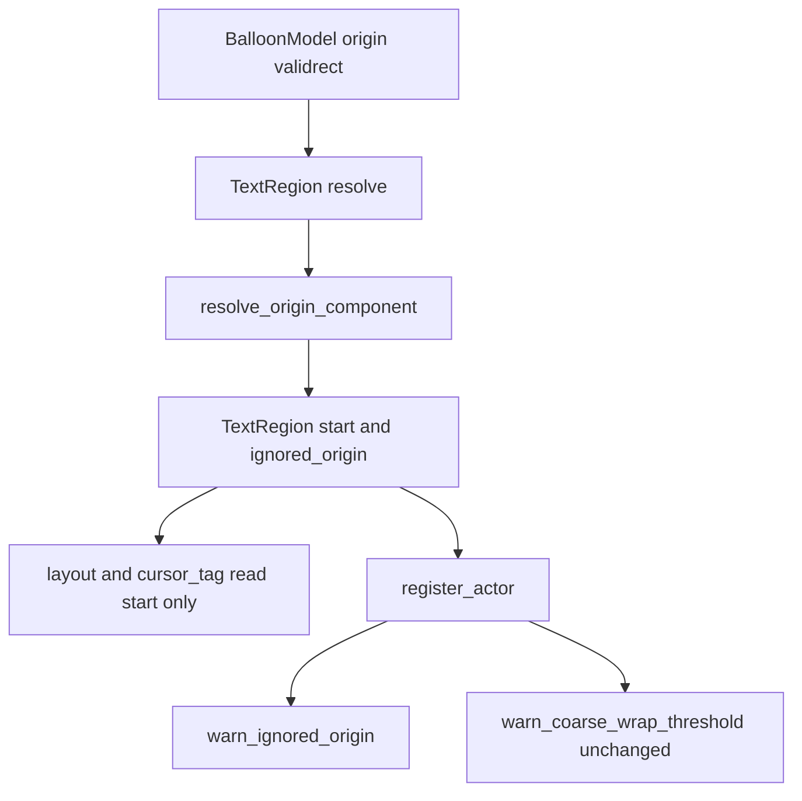

# Design Document: areka-P0-balloon-origin-outside-validrect

> 本文の file:line・関数名・テスト名は 2026-09-18 の実測値（ブランチ `claude/areka-sender-header-4b5900`）。実装着手時に引き直す（要件 6.6）。行番号は目安であり、正は「何の定義行か」の記述である。

## Overview

**Purpose**: `origin` を `validrect` の外に宣言した第三者のバルーンで、各行の行頭が 1 文字ぶん欠ける欠陥を直す。範囲外に宣言された `origin` 成分を「宣言が無いもの」として扱い、書字開始角へ落とす（2026-08-27 に撤去した規則の復元）。

**Users**: バルーンの作者（SSP で読めているバルーンを areka へそのまま持ち込める）と、areka の利用者（行頭が欠けずに読める）。作者は自分の宣言が無視されたことを WARN の記録 1 件で知る。

**Impact**: 変わるのは `crates/areka-emo-text/src/region.rs` の開始点解決 1 関数の「範囲外の腕」が返す値と、その事実を登録口へ運ぶ欄 1 つ、登録口の警告 1 種類だけである。範囲内の宣言・未宣言のバルーン（areka 同梱の検体を含む）の表示は 1 ピクセルも動かない。

### Goals

- 範囲外に宣言された `origin` 成分を、成分ごとに独立に書字開始角へ落とす（3 書字方向・両端は範囲内・負値は絶対値化してから判定）。
- 範囲外の宣言を無視したことを、装着 1 回につき成分 1 つ 1 件の WARN で記録する（毎フレームの解決では繰り返さない）。
- 規則を決定論テストで固定する（全数の表・実物の検体 1 本・WARN の件数）。
- 撤去を正典として語っている文書（`region.rs` の doc・`doc/COMPAT_ARCHITECTURE.md` §8 の 3 行）を取り下げの事実へ追随させる。

### Non-Goals

- 範囲内の宣言・未宣言の縮退・折返し基準・`validrect` の解決・バルーン定義の解析層の変更。
- 退化した `validrect`（幅／高さ ≤ 0）に対する特別扱い（現行の警告のまま据え置き。表にも足さない）。
- 「文字が置けるだけの余白があるか」による判定（遠い側の辺ちょうどは範囲内のまま）。
- SSP の内部処理の実測、プロパティ `currentghost.balloon.scope(ID).basepos.*` の実装、`BALLOON_NAME_PLACEHOLDER` の実名への差し替え。
- 新しいモジュール・トレイト・設定項目・依存 crate の追加（いずれも 0）。

## Boundary Commitments

### This Spec Owns

- `region.rs` の `resolve_origin_component` の判断分岐（範囲内＝宣言値／範囲外＝書字開始角／未宣言＝書字開始角）と、その返値の形。
- `TextRegion` に足す欄 `ignored_origin`（範囲外ゆえ無視した宣言の解決値・成分ごと）と、その crate 内の読み口。
- 登録口 `TextLayerRuntime::register_actor` から呼ぶ警告 `warn_ignored_origin`（水準・件数・欄・文言）。
- 上の規則を固定するテスト（既存 4 本の期待値の更新・全数の表・検体 `emo2-kakukaku-offsetdpi` の 1 本・WARN 件数）。
- `region.rs` の doc、`doc/COMPAT_ARCHITECTURE.md` §8 の 3 行、隣接 spec の brief 2 本への 1 行ずつの申し送り。

### Out of Boundary

- `areka-parsers` の `balloon` 解析（`Origin` は今までどおり `Option<i32>` で宣言の有無を運ぶ。無改変）。
- `TextRegion::start()` の消費側（配置層・`cursor_tag.rs` の `\_l` 解決・描画・viewbox）。解決後の開始点を受け取るだけで、無改変のまま追随する。
- 折返し基準が描画範囲の外に解決される件と、その警告 `warn_coarse_wrap_threshold`（`areka-P0-balloon-canon-residue` 項目 14 の所有。文言・欄・件数とも無改変）。
- 完了 spec `areka-P0-balloon-vertical-canon`・`areka-P0-emo-text-layer` のアーカイブ本体（無改変。上書きの事実は COMPAT §8 と本仕様に記録する）。
- 検体 `emo2-kakukaku-offsetdpi` と areka 同梱の全検体のファイル（書き換えない）。
- ukadoc 網羅台帳（`doc/ukadoc-coverage/ledger/assets.toml` の `origin.x`／`origin.y`）。ukadoc は範囲外の宣言について沈黙しており、台帳の判定（実装済み・正典どおりに読む）は変わらない。台帳を触ると briefing と roadmap-draft の数の検査が連動して赤くなるため、本仕様では触らない。
- `.kiro/steering/roadmap.md` の台帳行 #46 の完了更新（要件 7.1）は完了手続き（`/kiro-complete`）の作業であり、実装タスクには含めない。

### Allowed Dependencies

- `areka-emo-text` crate 内のみ。`region.rs`（純粋層）は `areka_parsers::balloon::BalloonModel` と `crate::writing::WritingMode` と `tracing` だけに依存し、`windows` 系 crate へ依存しない（`lib.rs` の `pure_layer_modules_have_no_windows_imports` が見張る）。
- 依存方向は現行どおり `region`（純粋層）→ `actor`／`actor_decoration`（結線層）の一方向。`region.rs` から `actor*.rs` を参照しない。
- 警告のバルーン名の欄は既存の `region.rs::BALLOON_NAME_PLACEHOLDER` を共有する（新しい定数を作らない）。
- テストは `log-capture-kit`（`count_levels`／`capture`）と既存の補助関数を使う。新しい dev-dependency は足さない。

### Revalidation Triggers

- `TextRegion` の `PartialEq` の意味が変わる変更（欄の増減）——再追従の判定キーと警告の件数規律（`previous == Some(region)`）が同じ比較に乗っているため、両方の件数テストを見直す。
- `TextRegion::resolve` が毎フレーム呼ばれなくなる、または登録口を通らない本番の解決経路が増える変更——警告の置き場所の前提が変わる。
- 書字開始角の選択（`start_corner`）や `validrect` の解決規則の変更——本仕様の表の期待値（36／46／356）が動く。
- `BALLOON_NAME_PLACEHOLDER` の差し替え（`areka-P0-emo-text-canon-residue` 項目 14）——参照が 3 ファイル・警告 2 種類になっている点を引き継ぐ。
- 検体の登記表（`sample-ghost-kit` の `SAMPLES`）の変更——`emo2-kakukaku-offsetdpi` の登記が消えるか種別が変わると、T-検体の根の引き方（`SampleRoot::acquire` → `folder()`）が変わる。`areka-P0-nar-install` 自体は 2026-09-19 に着地済み。

## Architecture

### Existing Architecture Analysis

- **解決は 1 関数・成分ごとに独立**: `TextRegion::resolve` が `start_corner`（横書き・縦書き左送り＝`(left, top)`／縦書き右送り＝`(right, top)`）を選び、`resolve_origin_component(v, extent, range, corner, key)` を x と y で別々に呼ぶ。負値は `resolve_coord` で先に絶対値化される。範囲判定の式 `resolved < range.0 || range.1 < resolved` は両端を含む。——要件 1.2／1.3／1.4／1.5／1.7 の構造は既に在り、足りないのは「範囲外の腕が `corner` を返す」ことだけである。
- **解決は毎フレーム走る**: 再追従（`TextLayerRuntime::refresh_actor_binding`）が判定キーを得るために毎フレーム解き直す。ゆえに「装着 1 回につき 1 件」の意味を持つ記録は解決側に置けない。先例 `warn_coarse_wrap_threshold` は登録口 `register_actor` で「前回の解決済み領域と同値なら書かない」比較により 1 件へ絞っている。
- **登録口はモデルを持たない**: `register_actor` の入力は `ResolvedBalloonText`（`mode`／`region`／`font`／`wrap`／`choice_style`）だけで、`BalloonModel` は渡らない。現行の `TextRegion` は開始点しか持たず、「未宣言」と「範囲外ゆえ無視」を区別できない。
- **`TextRegion` の構築点は 1 か所**: 構造体リテラルで組んでいるのは `resolve` の末尾だけ（ワークスペース全域の検索で確認）。欄は全て非公開なので、欄を足しても波及は 0 である。
- **行数の余白**: `region.rs` 951 行（余白 49）・`actor.rs` 970 行（余白 30）。`actor.rs` の子 `actor_decoration.rs`（141 行）は、既に「`actor.rs` が 1,000 行の見張りの間近にあるため」という理由で `build_actor_render`／`glyph_styles_of` を `pub(super)` で引き受けている。

### Architecture Pattern & Boundary Map



**Architecture Integration**:

- 採用パターン: 既存の「純粋層が値を解決し、結線層の登録口が装着単位の記録を書く」形の踏襲。新しい層・型・トレイトは作らない。
- 責務の切れ目: 「どこから書くか」と「何を無視したか」の事実は `region.rs` が 1 か所で決める。結線層は判定を引き直さず、`TextRegion` が運ぶ値を読んで書くだけである（範囲判定を 2 か所に増やさない）。
- 保たれる既存の形: 解決側の `debug!`（文言だけ改める）・登録口の `previous == Some(region)` の比較・`BALLOON_NAME_PLACEHOLDER` の共有・兄弟テストファイルの配置規則。
- 新規部品の理由: 欄 `ignored_origin` は、登録口が「宣言があって範囲外ゆえ無視した」ことと宣言の解決値（要件 3.3）を知る唯一の手段である。関数 `warn_ignored_origin` は要件 3 の記録そのものである。
- steering 適合: `logging.md`（`warn!`＝フォールバック発生）・`structure.md`（1 ファイル 1,000 行・テストは兄弟ファイル）・純粋層の `windows` 非依存。

### Technology Stack

| Layer | Choice / Version | Role in Feature | Notes |
|-------|------------------|-----------------|-------|
| 純粋層 | Rust・`areka-emo-text` の `region.rs` | 開始点の解決と無視した宣言値の保持 | 依存の追加 0 |
| 結線層 | `actor.rs`／`actor_decoration.rs` | 装着単位の WARN | 依存の追加 0 |
| 記録 | `tracing`（workspace 版） | `debug!`（解決側）・`warn!`（登録口） | 既存 |
| テスト | `log-capture-kit`（`count_levels`／`capture`） | 件数と欄の検査 | 既存 |

## File Structure Plan

新規ファイルは 0。すべて既存ファイルの改変である。

### Modified Files

| ファイル | 変更 | 現在 → 変更後の見込み（行） |
|---|---|---|
| `crates/areka-emo-text/src/region.rs` | `resolve_origin_component` の返値と範囲外の腕・`TextRegion` の欄 1 つと読み口 1 つ・`resolve` の受け取り・doc 6 か所・テスト 1 本の期待値と名前 | 951 → **965〜975**（上限 1,000。985 を超える見込みになったら止めて報告する） |
| `crates/areka-emo-text/src/actor.rs` | `register_actor` で前回領域を 1 度取り出し、既存の警告に続けて `decoration::warn_ignored_origin` を呼ぶ。doc に 2〜3 行 | 970 → **973〜977**（上限 1,000。**警告の関数本体はここに置かない**） |
| `crates/areka-emo-text/src/actor_decoration.rs` | `pub(super) fn warn_ignored_origin` の新設（本体＋doc）。`use` は既存の 2 行を広げるだけ（`tracing::warn`・`crate::region::BALLOON_NAME_PLACEHOLDER`）。冒頭 doc に 1〜2 行 | 141 → **175〜190** |
| `crates/areka-emo-text/src/region_vertical_canon_tests.rs` | 冒頭 doc の分岐 6・8・9 の説明・既存 3 本の期待値と名前・全数の表 1 本の追加 | 677 → **790〜840** |
| `crates/areka-emo-text/src/actor_region_warn_tests.rs` | WARN 件数のテスト群の追加・冒頭 doc に節を 1 つ | 380 → **500〜540** |
| `crates/areka-emo-text/tests/shipped_fixture_region_test.rs` | 検体 `emo2-kakukaku-offsetdpi` のテストを**ファイル末尾**へ追加（既存の関数は 1 つも書き換えない）・冗頭 doc に節を 1 つ | 409 → **460〜480**（2026-09-19 に main（PR #158）を取り込んで 397 → 409 へ増えた） |
| `crates/areka-emo-text/src/layout.rs` | 旧規則を現在形で語るコメント 2 か所（冒頭 doc の「行内開始位置の規則」の括弧書き・カーソル基点束のコメント）の「宣言 origin は字義」を「範囲内の宣言は宣言どおり・範囲外と未宣言は書字開始角」へ。**行を増やさない**（語の置き換えだけ） | 973 → **973**（上限 1,000・余白 27） |
| `crates/areka-emo-text/src/cursor_tag.rs` | `CursorBasis::origin` の doc 1 か所を同じ言い回しへ。同ファイルのほかの `origin` への言及（原点の意味・軸の向き）は別の規則なので触らない | 274 → 274 |
| `crates/areka-emo-text/tests/choice_fixture_test.rs` | 検体から `origin` を消した是正の doc にある 1 文「宣言が復活すれば……字義どおり `(0,0)` へ落ちて赤くなる」は修正後に偽になる（範囲外の宣言は書字開始角へ落ちるので緑のまま）。事実に合わせて言い直す。テスト本体は無改変 | 行数不変 |
| `doc/COMPAT_ARCHITECTURE.md` | §8 の 3 行（撤去の行・`\_l` の縦書き座標系の行・`\_l[x,y]` の上書き行） | 行数不変（3 行の書き換え） |
| `.kiro/specs/areka-P0-balloon-origin-outside-validrect/research.md` | §3.4 の全数確認の引き直し（要件 4.2／4.3 の記録の正本） | — |
| `.kiro/specs/areka-P0-currentghost-property-tree/brief.md` | 申し送り 1 行（要件 7.2） | +1 |
| `.kiro/specs/areka-P0-emo-text-canon-residue/brief.md` | 項目 14 への申し送り 1 行（プレースホルダの参照が 3 ファイル・警告 2 種類になった） | +1 |

**`actor.rs` の余白 30 行の扱い（明示）**: 警告の関数は本体 20 行前後＋doc 10 行前後になり、`actor.rs` へ置くと 1,000 行ちょうど付近に達する。ゆえに本体は子モジュール `actor_decoration.rs` に `pub(super)` で置き、`actor.rs` の増分は呼出しと doc の 3〜7 行に抑える。これは同ファイルが `build_actor_render` を引き受けたのと同じ理由・同じ形であり、「警告は登録口 `register_actor` が書く」という決着（research.md §5.1 項目 1）は変わらない——書く**時点**は登録口のまま、関数の**置き場所**だけが子モジュールである。

**走査対象の登録**: 新設ファイルが無いので `lib.rs` の `PURE_SOURCES`／`SOURCES_OUTSIDE_THE_PURE_SCAN` は無改変（`region_vertical_canon_tests.rs` は前者に、`actor_decoration.rs`／`actor_region_warn_tests.rs` は後者に登録済み）。

**`shipped_fixture_region_test.rs` の追加位置と検体の引き方**: 検体の保管形は 2026-09-19 に配布形 `.nar` へ切り替わり（`areka-P0-nar-install`・PR #158）、パスは共有の窓口 `sample_ghost_kit::SampleRoot` から引く形になった。追加するものは、既存の複製検体（`emo2-kakukaku-wplimit`）と**同形**の 2 つ――プロセス寿命で保つ `LazyLock<SampleRoot>`（`SampleRoot::acquire("emo2-kakukaku-offsetdpi")`。検体は登記表 `SAMPLES` に**バルーン種別で登記済み**）と、`folder()` を返す根パス関数 1 つである。`env!("CARGO_MANIFEST_DIR")` や `../pilot/examples/...` のようなパスの継ぎ足しは**書かない**（窓口は呼ぶたびに使い捨ての根を作り直すので、前の走行の永続化ファイルで結果が変わらない）。追加は**ファイル末尾にまとめて**置き、既存の `EMO2`・`WPLIMIT`・`shipped_root()`・`wplimit_root()` の近傍には手を入れない。

## System Flows

分岐は 1 つだけなので表で示す（図は省く）。

| `origin` 成分 | 解決後の値 | 返す開始点の成分 | `ignored_origin` の成分 | 解決側 `debug!` | 登録口 WARN |
|---|---|---|---|---|---|
| 未宣言 | — | 書字開始角 | `None` | 1 件（現行どおり） | 0 |
| 宣言・範囲内（両端を含む） | `resolve_coord(v, extent)` | 解決後の値 | `None` | 0 | 0 |
| 宣言・範囲外 | 同上 | **書字開始角** | `Some(解決後の値)` | 1 件（文言を改める） | 装着 1 回につき 1 件 |

WARN の件数は先例と同じ比較で決まる——登録口に達し、かつ解決済み領域が前回と異なるとき（装着＝前回なし、または値の変わる再追従）だけ書く。値の同じ再追従は churn ガードで登録口に達せず 0 件、binding だけが変わって領域が同値の再追従は登録口に達しても 0 件である。

## Requirements Traceability

| Requirement | Summary | Components | Interfaces | 検査 |
|---|---|---|---|---|
| 1.1 | 範囲外の成分は書字開始角へ | OriginResolution | `resolve_origin_component` の範囲外の腕 | T-表・T-書直し①② |
| 1.2 | 成分ごとに独立 | OriginResolution | x／y の別々の呼出し（現行の構造） | T-表（他方の成分は宣言値のまま）・T-書直し① |
| 1.3 | 両端は範囲内（遠い側の辺も） | OriginResolution | 範囲判定の式（現行と同一） | T-表の「端ちょうど」4 行／軸 |
| 1.4 | 負値は絶対値化してから判定 | OriginResolution | `resolve_coord` → 範囲判定の順（現行） | T-表の負値 5 行／軸・T-書直し③ |
| 1.5 | 3 書字方向で同じ規則 | OriginResolution | `start_corner`（無改変） | T-表は 3 方向を回す |
| 1.6 | 検体の開始点 sakura (36,46)／kero (24,40) | OriginResolution | 2 層マージ → `TextRegion::resolve` | T-検体 |
| 1.7 | 最寄りの辺ではなく書字開始角 | OriginResolution | `corner` 引数の意味（現行） | T-表の「右辺の 1 つ外」「下辺の 1 つ外」 |
| 2.1 | 範囲内は宣言どおり | OriginResolution | 範囲内の腕（無改変） | 既存 `in_range_origin_is_kept_as_start_point` ほか・T-表 |
| 2.2 | 未宣言は書字開始角 | OriginResolution | `None` の腕（無改変） | 既存 `undeclared_origin_falls_back_…`（無改変） |
| 2.3 | 既存の検体テストを書き換えずに緑 | — | `shipped_fixture_region_test.rs` の既存 6 関数は無改変 | 既存 6 本が緑のまま |
| 2.4 | 解析層を変えない | — | `areka-parsers` に差分なし | 差分の確認（実在するパスで） |
| 3.1 | WARN 水準 | IgnoredOriginWarning | `warn_ignored_origin` | T-警告 a |
| 3.2 | 装着 1 回・成分 1 つにつき 1 件・同値の再追従で 0 | IgnoredOriginWarning | `previous == Some(region)` の比較 | T-警告 a・b・c |
| 3.3 | 欄と平易な文言 | IgnoredOriginWarning | 欄 `balloon`／`key`／`resolved`／`range_min`／`range_max`／`corner` | T-警告 a |
| 3.4 | 範囲内・未宣言では出さない | IgnoredOriginWarning | `ignored_origin` が `None` なら書かない | T-警告 d（対照つき）・既存の 0 件テスト |
| 3.5 | 無記録の経路を持たない | OriginResolution／IgnoredOriginWarning | 解決側 `debug!` は必ず 1 件・本番の解決は必ず登録口を通る | T-表（debug 件数）・T-警告 a |
| 4.1 | `\_l` の原点は解決後の開始点 | —（無改変） | `cursor_tag.rs` は `TextRegion::start()` 由来の値を読むだけ | 既存の `\_l` テスト群が無改変で緑 |
| 4.2 | 既存テストの全数確認 | OriginRangeSurvey | research.md §3.4 の 3 手法を引き直す | 記録の更新 |
| 4.3 | 0 本であることの明示 | OriginRangeSurvey | 同上（対象ファイル・方法・日付つきで 0 を書く） | 記録の更新 |
| 5.1 | 3 方向×2 成分の表 | OriginRangeTests | T-表 | — |
| 5.2 | 兄弟ファイルへ（既存へ足す） | OriginRangeTests | `region_vertical_canon_tests.rs` | 行数の見込み 790〜840 |
| 5.3 | 範囲外の腕を潰して赤を確かめる | OriginRangeTests | 実装手順（下の Testing Strategy） | 手順の記録 |
| 5.4 | 既存 4 本の書き直し | OriginRangeTests | T-書直し①〜④ | — |
| 5.5 | 検体の決定論テスト | FixtureTest | T-検体 | 修正前に赤・修正後に緑 |
| 5.6 | WARN の件数テスト | WarnCountTests | T-警告 a〜d | 対照の `error!` 1 件を同じ捕捉窓で数える |
| 5.7 | 見張りを赤くしない | 全体 | 行数の見込み・新設ファイル 0・`region.rs` は `windows` 非依存のまま | `file_length_guard_test`・`lib.rs` の 2 本 |
| 6.1 | §8 の撤去の行を取り下げの行へ | CompatDoc | 下の「文書」節 | — |
| 6.2 | `\_l` の縦書き座標系の行の理由の言い直し | CompatDoc | 同上 | — |
| 6.3 | `\_l[x,y]` の上書き行の 1 句 | CompatDoc | 同上 | — |
| 6.4 | `region.rs` 冒頭 doc と、旧規則を現在形で語るほかのコメント 4 か所 | OriginResolution／CompatDoc | 同上（「ソース内のコメント」の段落） | 「字義」の全文検索で漏れ 0 |
| 6.5 | アーカイブ本体は無改変 | — | `.kiro/specs/completed/` に差分なし | 差分の確認 |
| 6.6 | file:line の裏取り・行番号引用の指し直し | CompatDoc | 触る行の `region.rs:292-294`／`:231-234` を「何の定義行か」へ | — |
| 7.1 | roadmap #46 の完了更新 | —（完了手続き） | `/kiro-complete` で実施。上書きした要件（`areka-P0-balloon-vertical-canon` 3.10）を明記 | — |
| 7.2 | `basepos` の申し送り | Handoffs | `areka-P0-currentghost-property-tree/brief.md` へ 1 行 | — |
| 7.3 | 検体は共有の窓口から引く（申し送りは不要） | FixtureTest | `SampleRoot::acquire("emo2-kakukaku-offsetdpi")` → `folder()` | T-検体（パスを綾る行が 0 であること） |

## Components and Interfaces

| Component | Layer | Intent | Req Coverage | Key Dependencies | Contracts |
|---|---|---|---|---|---|
| OriginResolution | 純粋層 `region.rs` | 開始点の解決と無視した宣言値の保持 | 1.1〜1.7, 2.1, 2.2, 3.5, 6.4 | `BalloonModel`・`WritingMode`（P0） | Service |
| IgnoredOriginWarning | 結線層 `actor_decoration.rs`（呼出しは `actor.rs`） | 装着単位の WARN | 3.1〜3.5 | `TextRegion::ignored_origin`（P0）・`BALLOON_NAME_PLACEHOLDER`（P1） | Service |
| OriginRangeTests／FixtureTest／WarnCountTests | テスト | 規則の固定 | 5.1〜5.7, 1.6, 2.3 | `log-capture-kit`（P0） | — |
| CompatDoc／Handoffs／OriginRangeSurvey | 文書 | 取り下げの記録と申し送り | 4.2, 4.3, 6.1〜6.6, 7.2, 7.3 | — | — |

### 純粋層

#### OriginResolution（`crates/areka-emo-text/src/region.rs`）

| Field | Detail |
|-------|--------|
| Intent | `origin` 成分を解決し、範囲外の宣言は書字開始角へ落として、無視した宣言の解決値を運ぶ |
| Requirements | 1.1, 1.2, 1.3, 1.4, 1.5, 1.7, 2.1, 2.2, 3.5, 6.4 |

**Responsibilities & Constraints**

- 範囲判定は現行の式をそのまま使う（両端を含む）。式を 2 か所に増やさない。
- `range` は今後**返す値に影響する**。現行 doc の不変条件「`range` は返す値に影響しない」は削除する。
- 純粋関数のまま（状態を持たない・同一入力に同一出力）。`warn!` は書かない——`region_vertical_canon_tests.rs` の `counts.warn == 0` と `region_inline_limit_tests.rs` の「解決は警告を書かない」規律を保つ。
- 退化した `validrect` に対する分岐は足さない。

**Contracts**: Service [x]

##### Service Interface

```rust
/// 返値 = (開始点の成分, 範囲外ゆえ無視した宣言の解決値)。
/// 第 2 要素は「宣言があり、かつ範囲外」のときだけ Some。
fn resolve_origin_component(
    v: Option<i32>,
    extent: f32,
    range: (f32, f32),
    corner: f32,
    key: &'static str,
) -> (f32, Option<f32>);

pub struct TextRegion {
    // 既存の欄は無改変
    /// 範囲外ゆえ無視した origin 宣言の解決値（x, y）。範囲内・未宣言は None。
    ignored_origin: (Option<f32>, Option<f32>),
}

impl TextRegion {
    /// 登録口の警告専用の読み口（crate 内）。
    pub(crate) fn ignored_origin(&self) -> (Option<f32>, Option<f32>);
}
```

- Preconditions: `range` は解決後の `validrect` の当該軸 `(min, max)`、`corner` は書字開始角の当該成分（どちらも現行の呼出しのまま）。
- Postconditions:
  - `v == None` → `(corner, None)`、`debug!`（現行の文言・欄のまま）1 件。
  - `v == Some` かつ `range.0 <= resolved && resolved <= range.1` → `(resolved, None)`、記録 0 件。
  - `v == Some` かつ範囲外 → `(corner, Some(resolved))`、`debug!` 1 件（欄 `key`・`resolved`・`range_min`・`range_max`・`corner`。文言は平易な語で「範囲の外にあるので宣言を使わず書字開始角を用いる」旨。「クランプ正準」の語は戻さない）。
- Invariants: `ignored_origin` の成分が `Some` ⇔ その成分の `start` が書字開始角であり、かつ宣言が在った。`TextRegion` は `Clone + Copy + Debug + PartialEq` のまま（`Option<f32>` は `Copy`）。

**Implementation Notes**

- Integration: `TextRegion::resolve` は 2 つの呼出しを `let (start_x, ignored_x) = …` の形で受け、構造体リテラルに `ignored_origin: (ignored_x, ignored_y)` を 1 行足す。ほかの消費側は `start()` しか読まないので無改変。
- Validation: `ignored_origin` は `PartialEq` に入る。値はモデルと原寸から決定的に導かれるので、再追従の同値判定（churn ガード）の結果は変わらない。宣言値だけが変わった（開始点は同じ書字開始角のまま）ときは領域が「異なる」と判定され、新しい値で WARN が 1 件出る——要件 3.2 に対して正しい向きである。
- Risks: `TextRegion` 全体を `==` で比べるテストは、範囲外の宣言を持つ領域と未宣言の領域を**同値とみなさなくなる**（開始点は同じでも `ignored_origin` が違う）。該当する既存テストは 0 本である——範囲外の値を使う既存テストは書き直す 4 本だけで、そのうち全体比較をするのは負値のテストの対照（負値の宣言と同じ位置の非負の宣言を `assert_eq!` で比べる）1 か所だが、両辺とも範囲内なので `ignored_origin` は両辺 `(None, None)` で一致する。検体テスト `shipped_fixture_region_test.rs` の全体比較 2 か所も、両辺が未宣言の検体どうしである。新設の検体テストは成分ごとの比較（`assert_region`）を使い、原本との `==` 比較をしない。
- doc の更新 6 か所（何の定義行かで指す）: ⑴ 冒頭の 1 段落目の「宣言 origin の字義解決」の句 ⑵ 冒頭の節「描画開始点は宣言どおり」「撤去された規約」→ 本仕様の規則＋経緯（2026-08-27 撤去・2026-09-18 取り下げ・理由＝撤去の前提が実機目視で反証・参照先＝本仕様） ⑶ `TextRegion` の欄 `start` の doc ⑷ `TextRegion::resolve` の doc の「描画開始点」の項と本体の区切りコメント ⑸ `start()` の doc ⑹ `resolve_origin_component` の doc（不変条件の段落を削除し、3 分岐の表へ）。撤去の経緯を語る段落が縮むので、doc 全体の行数はほぼ増えない。

### 結線層

#### IgnoredOriginWarning（本体 `actor_decoration.rs`・呼出し `actor.rs::register_actor`）

| Field | Detail |
|-------|--------|
| Intent | 範囲外ゆえ無視した `origin` 宣言を、装着 1 回につき成分 1 つ 1 件の WARN で知らせる |
| Requirements | 3.1, 3.2, 3.3, 3.4, 3.5 |

**Contracts**: Service [x]

##### Service Interface

```rust
// actor_decoration.rs
pub(super) fn warn_ignored_origin(resolved: &ResolvedBalloonText, previous: Option<TextRegion>);

// actor.rs の register_actor（既存の 1 行を 3 行へ）
let previous = self.layout_input.get(&actor).map(|it| it.region);
warn_coarse_wrap_threshold(&resolved, previous);
decoration::warn_ignored_origin(&resolved, previous);
```

- Preconditions: `previous` は `layout_input` を上書きする**前**に取り出した、当該 actor の前回の解決済み領域（装着なら `None`）。
- Postconditions: `previous == Some(resolved.region)` なら何も書かない。それ以外は、`ignored_origin()` の `Some` の成分 1 つにつき `warn!` を 1 件書く。
- WARN の欄（research.md §5.1 項目 3 の決着どおり）:

| 欄 | 値 | x 成分 | y 成分 |
|---|---|---|---|
| `balloon` | `BALLOON_NAME_PLACEHOLDER` | 同左 | 同左 |
| `key` | 成分の名前 | `"origin.x"` | `"origin.y"` |
| `resolved` | 宣言どおりに解決した値 | `ignored_origin().0` | `ignored_origin().1` |
| `range_min`／`range_max` | `validrect` の当該軸の両端 | `left()`／`right()` | `top()`／`bottom()` |
| `corner` | 実際に用いた書字開始角の値 | `start().0` | `start().1` |

- 文言: バルーンの作者が読んで意味の取れる平易な語で 1 文。内容は「`origin` の宣言が文字を描いてよい範囲（`validrect`）の外にあるため、宣言を使わず書き始めの角から書いた」こと。プロジェクト内部の言い回しを持ち込まない。文言はテスト側の定数と 1 文字単位で一致させる（既存の折返しの警告と混在する捕捉窓から本警告だけを選り分ける鍵になる）。
- Invariants: 既存の `warn_coarse_wrap_threshold` の文言・4 欄・件数は 1 文字も変えない（実機走行の手順書がこの語を検索している）。

**Implementation Notes**

- Integration: `actor.rs` の増分は `previous` の取り出し 1 行・呼出し 1 行・`register_actor` の doc 2〜3 行。`use` の追加は不要（`decoration::` は既に経路修飾で呼ばれている）。`actor_decoration.rs` は `use tracing::{debug, error, warn};` と `use crate::region::{BALLOON_NAME_PLACEHOLDER, TextRegion};` へ広げる。
- Validation: 面の区別は `range_min` で付く（検体では sakura 36／kero 24）。実機での補助確認は、検体を装着して WARN が 2 面×2 成分＝4 件であることの目視（任意。主は決定論テスト）。面の切り替えを挟むと領域の値が変わって新しい値で再び出る（先例の警告と同じ件数規律）ので、数えるのは起動直後の装着ぶんだけにする。
- Risks: 同じ定義のバルーンへ付け替えて領域が完全に同値のままなら 2 件目は出ない。これは先例の警告と同じ件数規律であり、本仕様では変えない。

## Data Models

`TextRegion` に欄 `ignored_origin: (Option<f32>, Option<f32>)` を 1 つ足すだけである（上の Service Interface）。永続化・直列化される型ではなく、crate の外へは読み口を公開しない。

## Error Handling

- 範囲外の宣言は失敗ではなく回復可能な縮退である。`panic` も `Err` も使わず、書字開始角で描画を続ける（`logging.md` の `warn!`＝フォールバック発生）。
- 記録は二段: 解決のたびの `debug!`（開発者向け・現行と同じ頻度）と、装着単位の `warn!`（作者向け）。どちらかが必ず書かれるので、無記録で宣言を落とす経路は無い（要件 3.5）。本番で `TextRegion::resolve` を呼ぶのは `ResolvedBalloonText::resolve_with_background` の 1 か所で、その結果は必ず `register_actor` を通る。
- 退化した `validrect` の `warn!` は別の症状の記録であり、無改変のまま残す。

## Testing Strategy

検査は実 DPI・実 GPU・実窓を要さない。0 件を主張するテストは、同じ捕捉窓の内側で対照の `error!` を 1 件発行し、その 1 件が数えられていることを併せて確かめる（既存の流儀）。

### T-表: 全数の表（新設・`region_vertical_canon_tests.rs`）

名前 `origin_range_table_holds_for_every_mode_and_component`。3 書字方向 × 2 成分 × 下の 11 場合＝66 行を**繰り返しで生成**する（手で代表を選ばない）。検査しない側の成分は範囲内の固定値（x＝200／y＝60）で宣言し、既存の `resolve_counting`（`wordwrappoint` と `validrect` を全成分宣言して他所の `debug!` を封じる補助）と `assert_capture_alive` を使う。基準の `validrect` は既存の定数 `RECT`（解決後 `[36, 356] × [46, 168]`・画像 400×224）。

| 場合 | x の宣言 → 解決後 | y の宣言 → 解決後 | 範囲 |
|---|---|---|---|
| 近い辺の 1 つ外 | 35 → 35 | 45 → 45 | 外 |
| 近い辺ちょうど | 36 → 36 | 46 → 46 | 内 |
| 内 | 200 → 200 | 60 → 60 | 内 |
| 遠い辺ちょうど | 356 → 356 | 168 → 168 | 内 |
| 遠い辺の 1 つ外 | 357 → 357 | 169 → 169 | 外 |
| 検体の形 | 0 → 0 | 0 → 0 | 外 |
| 負値 → 内 | −100 → 300 | −100 → 124 | 内 |
| 負値 → 遠い辺ちょうど | −44 → 356 | −56 → 168 | 内 |
| 負値 → 遠い辺の 1 つ外 | −43 → 357 | −55 → 169 | 外 |
| 負値 → 近い辺の外 | −380 → 20 | −200 → 24 | 外 |
| 負値 → 反対端ちょうど | −400 → 0 | −224 → 0 | 外 |

各行の主張は 5 つ: ⑴ 検査する成分の `start` ＝ 内なら解決後の値・外なら書字開始角 ⑵ 他方の成分の `start` は宣言値のまま（成分の独立） ⑶ `ignored_origin()` ＝ 外なら当該成分だけ `Some(解決後の値)`・内なら両成分 `None` ⑷ `debug` の件数＝外 1・内 0 ⑸ `warn` 0 件。

- 「解決後の値」と「内／外」は表に**数値で直書き**する（実装と同じ式で計算し直さない）。書字開始角は方向ごとの直書き——横書き・縦書き左送り＝(36, 46)／縦書き右送り＝(356, 46)。
- 「近い辺ちょうど」のように宣言値と書字開始角が一致する行は、`start` だけでは内と外を見分けられない。⑶ と ⑷ がその区別を担う。
- 要件 1.7 は「遠い辺の 1 つ外」の行が担う——横書きの x＝357 は 36（左辺）へ落ち、356（最寄りの右辺）にはならない。縦書きの y＝169 は 46（上辺）へ落ちる。

### T-書直し: 既存 4 本の期待値の更新（要件 5.4）

| # | 現在の名前 → 新しい名前 | 期待値の更新 |
|---|---|---|
| ① `region.rs` | `origin_components_resolve_literally_and_independently` → `out_of_range_origin_component_falls_back_to_start_corner_independently` | その場で書き直す。`(100.0, 0.0)` → `(100.0, 46.0)`。撤去の経緯を語る doc を縮める |
| ② | `declared_origin_outside_validrect_is_literal_with_one_debug_per_component` → `declared_origin_outside_validrect_falls_back_to_start_corner_with_one_debug_per_component` | 5 場合の `start` を `(200, 46)`／`(36, 60)`／`(36, 46)`／`(356, 46)`／`(36, 46)` へ。`debug` の件数と `warn == 0` は据え置き |
| ③ | `negative_origin_resolves_from_opposite_edge_then_is_used_literally` → `negative_origin_resolves_from_opposite_edge_then_is_range_checked` | 範囲外の 2 場合の `start` を方向ごとの書字開始角へ。範囲内の場合と、非負の宣言との同値の対照は据え置き |
| ④ | `declared_origin_resolution_is_independent_of_validrect` → `declared_origin_follows_validrect_only_when_it_leaves_the_range` | 主張を反転する。宣言 (200, 60) は「基準」「全未宣言」では (200, 60) のまま、「origin が外側になる矩形」（解決後 `[210, 390] × [100, 214]`）では書字開始角（(210, 100)／右送りは (390, 100)）へ動く。「全 0 の退化矩形」は規則の自然な帰結（(0, 0)）として期待値だけ更新し、保証としては語らない。`validrect` が実際に変わっていることの前提確認は据え置き |

名前を参照しているのは `region.rs` の `resolve_origin_component` の doc 1 か所だけである（全文検索で確認）。doc の書き直しと同時に消える。未宣言の対照 `undeclared_origin_does_move_when_validrect_changes` と分岐 5・7 の 2 本は無改変。

### T-検体: `emo2-kakukaku-offsetdpi`（新設・`tests/shipped_fixture_region_test.rs` の末尾）

- 名前 `offsetdpi_fixture_with_out_of_range_origin_starts_at_writing_corner`。根は `SampleRoot::acquire("emo2-kakukaku-offsetdpi")` → `folder()`（バルーン種別なので `balloon()` でなく `folder()`。既存の `wplimit_root()` と同形）。既存の `merged_model`（本番と同じ `decode(Ansi 既定)` → `parse_str(基層, Some(面別上書き層)`）と `assert_region` を使い、sakura は `SAKURA_EDGES`／`SAKURA_START`／`SAKURA_WRAP`、kero は `KERO_EDGES`／`KERO_START`／`KERO_WRAP` を期待する（原本と同じ定数。検体の 2 枚の PNG は IHDR 実測で 400×224／288×203＝原本と同寸）。
- 前提の確認を同じテストの中に置く: ⑴ マージ後のモデルが `origin` を**宣言している**こと（`model.origin().x() == Some(0)`・同 y）——検体から宣言が消えたら、このテストは未宣言の縮退を測るだけになり規則を固定しなくなる。既存の冒頭 doc の禁則（宣言された生値を assert しない）は原本 `emo2-kakukaku` のテストに対するものなので、対象を明記して両立させる ⑵ 2 枚の PNG の IHDR が定数と一致すること ⑶ 横書きへ解決されること。
- 修正前は開始点が `(0, 0)` に解決されて赤、修正後に緑になる（要件 5.5）。

### T-警告: WARN の件数（新設・`actor_region_warn_tests.rs`）

入力は既存の `DESCRIPT` に `origin.x,0`／`origin.y,0` を足した基層の定数と、既存の `SAKURA_OVERLAY`（折返しの警告が出ない側）。捕捉した WARN のうち**本警告の文言と一致するものだけ**を数える。

- a. 両成分が範囲外のバルーンの装着（`register_actor_binding`）→ ちょうど 2 件。`key` が `origin.x` と `origin.y` の 1 件ずつで、欄は x＝`resolved 0／range 36..356／corner 36`、y＝`resolved 0／range 46..168／corner 46`、`balloon` は空でない。片方の成分だけが範囲外の定義では 1 件。
- b. 値の変わらない再追従を 3 回 → 追加 0 件（戻り値は 3 回とも `false`）。
- c. binding だけが変わって領域が同値の再追従 → 再構築は起きる（`true`）が 0 件。原寸が変わって領域の値が変わる再追従 → 新しい値で成分 1 つにつき 1 件。
- d. 範囲内に宣言したバルーンの装着 → WARN の**総数**が 0 件（文言で絞らない——絞った 0 件より強い主張になる。対照の `error!` 1 件が数えられていること）。未宣言の 0 件は既存の `attaching_a_balloon_with_wrap_threshold_inside_the_range_does_not_warn`（WARN 総数 0）が既に固定している。
- 既存 6 本は `origin` を宣言しない入力なので、WARN の総数の主張は無改変のまま成り立つ。

### 規則を固定していることの確認（要件 5.3）と見張り（要件 5.7）

1. T-検体は `ignored_origin()` を使わないので最初に書き、**現行の実装で赤**（開始点 `(0, 0)`）になることを確かめる（要件 5.5）。
2. 欄・返値の形・範囲外の腕・警告を実装し、T-表・T-書直し①〜④・T-警告を書いて緑にする。
3. 範囲外の腕だけを「開始点に解決後の値を返す」形（`(resolved, Some(resolved))`）へ一時的に戻し、T-表の「外」の行・T-書直し①〜④・T-検体が**赤になる**ことを確かめてから元へ戻す。続けて `warn_ignored_origin` を何もしない形にして T-警告 a が赤になることを確かめ、元へ戻す。走らせた差し替えは残さない。
4. `cargo test -p areka-emo-text`（`--lib` と統合テストの両方が走ること）→ ワークスペース全体。`file_length_guard_test`・`lib.rs` の `pure_layer_modules_have_no_windows_imports`／`every_source_file_is_either_scanned_or_explicitly_excluded` が緑であること。完走は出力を途中で切らずに確かめる。

### `\_l` の追随（要件 4.1〜4.3）

実装の変更は無い。research.md §3.4 の全数確認（3 手法・対象 `crates/areka-emo-text/{src,tests}` と `crates/areka/src`）を実装時に引き直し、「`\_l` の原点に宣言された `origin` を使う既存テストで範囲外の値を使うものは 0 本」を、対象・方法・日付とともに同じ場所へ明示して更新する。範囲外の値が見つかったときは期待値を本仕様の規則へ見直す。

引き直しでは手法を 1 つ足す——**`Origin::new(` の構築点を全数**（2026-09-18 実測で `crates/areka-emo-text/{src,tests}` と `crates/areka/src` の 29 ファイル）ファイルごとの件数つきで列挙し、値を素通しする補助関数はその呼び手まで辿る。設計検証が、元の 3 手法では §3.4 から漏れることを実測で示した。**（2026-09-19 訂正——本段落が当初挙げていた 6 ファイルの内訳は、タスク 6.3 の引き直しで事実と食い違うことが判明した。実際に §3.4 に名前が無かったのは `layout_cursor_order_tests.rs`・`layout_cursor_overflow_tests.rs`・`layout_segmented_tests.rs`・`layout_styled_tests.rs`・`layout_wrap_tests.rs`・`tests/pipeline_test.rs` であり、`draw_oracle_tests.rs` と `canvas.rs` は名前が出ていて漏れではなく、素通し補助関数の呼び手（9 件・7 件）が未計上だったという別種の欠けである。加えて viewbox 系の「11 か所」は実数 46 だった。正本は research.md §3.4。）** いずれも範囲内の値で結論（0 本）は変わらないが、同じ手法で引き直すと同じ漏れを再現するためである。

## 文書の追随（要件 6）

`doc/COMPAT_ARCHITECTURE.md` §8 の 3 行を次のとおり改める。行番号の引用を含む行は「何の定義行か」で指し直す（要件 6.6）。

| 行（題で指す） | 改め方 |
|---|---|
| 「宣言された `origin` の validrect 外クランプ……の撤去」 | 題を「……の撤去の**取り下げ**」へ。判断欄＝範囲外の成分は宣言なしとして書字開始角へ・両端は範囲内・成分ごとに独立・負値は絶対値化してから判定・解決側 DEBUG＋装着 1 回につき成分 1 つ WARN 1 件。根拠欄＝取り下げの理由（撤去の前提「SSP でも壊れた定義」が 2026-09-18 の実機目視〔`emo2-kakukaku` で行頭 1 文字欠け・SSP では欠けない〕で反証された／ukadoc の「テキストを描画してよい範囲。」と「通常は指定せず validrect の定義に任せる」の 2 文／正典は範囲外の扱いに沈黙）と日付。2026-08-27 の撤去の経緯と、アーカイブ 2 件の上書きの記述は履歴として残す。出典欄＝本仕様＋「完了 spec `areka-P0-balloon-vertical-canon` 要件 3.10 を上書き（3.11・3.7 は不変）」 |
| 「`\_l` の縦書き座標系の正典写像」 | SC15 の理由の文「origin クランプ撤去……により……常に一致し」を、撤去を前提にしない形へ言い直す——「解決後の文字描画開始点は常に 1 つであり（範囲外の宣言は書字開始角へ落ちる）、`\_l[0,0]` はそれを指す」。結論（二択は areka 内では発生しない）は不変。題と判断欄にある「クランプ撤去の行」への言及は新しい題に合わせる。引用 `region.rs:292-294`／`:231-234` は「`TextRegion::resolve` の開始点の解決」「同関数の書字開始角 `start_corner` の選択」へ指し直す |
| 「【上書き】`\_l[x,y]` の座標解決の正典所有……」 | 「未宣言成分だけが書字開始角へ落ちる」→「未宣言または範囲外の成分が書字開始角へ落ちる」。同じ括弧内の行番号引用を上と同じ形へ指し直す |

**ソース内のコメント**（要件 6.4）: `region.rs` の doc 6 か所（上の OriginResolution の節）に加え、旧規則「宣言された `origin` は字義どおり」を現在形で語るコメントが 4 か所ある——`layout.rs` の 2 か所・`cursor_tag.rs` の `CursorBasis::origin` の doc・`tests/choice_fixture_test.rs` の是正の doc の 1 文。前の 3 つは言い回しを「範囲内の宣言は宣言どおり・範囲外と未宣言は書字開始角」へ揃え、最後の 1 つは修正後に偽になる予言（「宣言が復活すれば赤くなる」）を事実へ言い直す。`layout.rs` は 973 行なので行を増やさない。着手時に「字義」で全文検索して漏れが無いことを確かめる。

`doc/ukadoc-coverage/briefing-*.md` は §8 の行の題を引用しているが、既に旧題のまま食い違っている行があり（`\_l` の行）、題の一致を見張る検査は無い。本仕様では触らない。

## Supporting References

- 設計判断の決着 12 項目と `\_l` の全数確認の正本: `research.md` §5.1・§3.4。
- 撤去前の形: `git show b9ede5ad^:crates/areka-emo-text/src/region.rs` の `clamp_origin_component`（範囲外の腕が `corner` を返す。本設計の腕と同型）。
