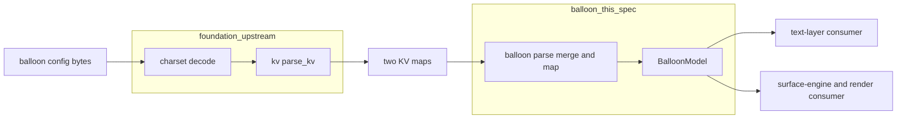
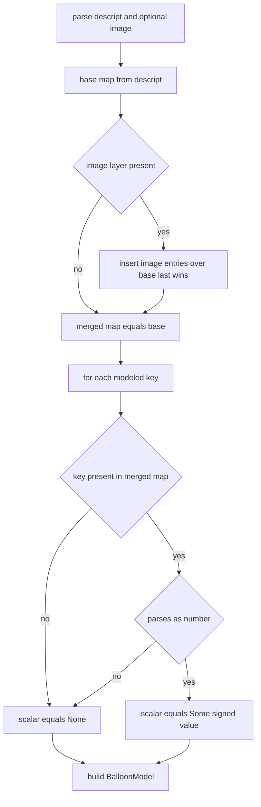

# Technical Design Document — areka-P0-balloon-parse

## Overview

**Purpose:** 本 spec は、emo2 のバルーン設定（バルーン `descript.txt` ＝既定層、画像別 `balloonsXXs.txt`/`balloonkXXs.txt` ＝上書き層）を、下流の text-layer・surface-engine/render が「キー文字列を再解釈せず」に消費できる、幾何＋フォント subset の型付きバルーンモデルへ写像する parser を確立する。既存 `areka-parsers` クレートへ `balloon` モジュールを追加し、上流 `areka-P0-parser-foundation`（charset デコード＋素朴 KV マップ化・完了済）の出力を消費して、3段参照優先度解決（画像別 ＞ descript ＞ 未指定）と 2 層ファイル間マージを担う。

**Users:** 下流エンジン実装者が本モデルを消費する。text-layer は `origin`/`wordwrappoint`/`validrect`/`font` を、surface-engine/render は `windowposition` を参照する。parser 利用者（呼び出し側）はデコード済みソースを渡すだけで優先度解決済みの単一モデルを得る。

**Impact:** `areka-parsers` の `lib.rs` に `pub mod balloon;` を 1 行追加し `balloon/` サブツリーを新設する非侵襲な接ぎ木である（既存 `charset`/`kv`/`sakura` 各モジュールへの変更なし）。新規外部依存は導入しない（std のみのマップ→型写像＋整数パースで足りる）。

### Goals
- emo2-kakukaku fixture で pass する幾何＋フォント subset のバルーンモデル生成源を、確立済みパーサー規律（`sakura`/foundation）に沿って提供する。
- 未指定値を「0 と区別可能な `None`」として欠落なく下流へ伝え、parser が権威なき既定値・ゼロ値で代替しないことを型で保証する。
- 負値座標を「反対辺からのオフセット」を表す符号付き値として保持し、ピクセル解決を画像サイズ依存の消費側へ委ねる。

### Non-Goals
- charset デコード・KV マップ化（`areka-P0-parser-foundation` 領分）。
- バルーンフォルダの所在解決・使用バルーンの選択（ghost/package 領分・baseware 共有）。
- 文字描画・バルーン枠 surface 合成・文字レイアウト・負値の最終ピクセル解決（text-layer/surface-engine/render 領分）。
- choice/link/scroll 系キー（cursor・anchor・number・arrow・sstpmarker・sstpmessage・onlinemarker・communicatebox・marker）のモデル化（M1 未実装・2 例目の実物まで抽象を足さない）。
- さくらスクリプトのバルーン操作タグ（`\b`/`\_b`/`\q` 等）の解析（`areka-P0-sakura-parse` 領分）。
- shell descript の `*.balloon.alignment`（shell parse／消費側の領分）。

## Boundary Commitments

### This Spec Owns
- `areka_parsers::balloon` モジュールと、その公開バルーンモデル型（クロスエンジン I/O 契約の生成者側・本クレートが正本所有）。
- バルーン固有のキー写像: フラット KV マップの `windowposition.{x,y}`・`origin.{x,y}`・`wordwrappoint.{x,y}`・`validrect.{top,bottom,left,right}`・`font.name`・`font.height`・`font.color.{r,g,b}` を型付き幾何＋フォント値へ束ねる（R2）。
- 2 層ファイル間マージと 3 段参照優先度解決（画像別層 ＞ descript 層 ＞ 未指定＝`None`）（R3）。
- バルーン座標の符号解釈の保持（負値＝反対辺オフセット、`windowposition.y` 下方向＝正）。ピクセル解決は行わない（R4）。
- 数値として解釈できない値・未知キーの寛容無視と「未指定（`None`）」への降格（R1.3/R1.4）。

### Out of Boundary
- charset デコード・KV マップ化（上流 foundation）。ファイルのバイト列やパスからの前処理は行わない。
- バルーン所在解決・使用バルーン選択（ghost/package）。
- 描画・surface 合成・文字レイアウト・負値の実ピクセル加算（下流 render/text-layer/surface-engine）。
- choice/link/scroll 系キーの一切のモデル化（M1 未実装）。
- さくらスクリプトのバルーン操作タグ（sakura-parse）。

### Allowed Dependencies
- 上流 `areka-P0-parser-foundation`: `areka_parsers::kv::parse_kv`（デコード済み文字列 → `BTreeMap<String,String>`）と `areka_parsers::charset`。本モジュールは KV マップまたはデコード済み文字列を入力として受け取る。
- Rust std のみ（`std::collections::BTreeMap`、整数の `str::parse`）。**新規外部依存の追加は禁止**。
- `tracing`（クレートに既存・任意）: 寛容無視トークンの観測ログにのみ使用可。純粋関数性を損なわない範囲に限る（M1 では未使用でも可）。

### Revalidation Triggers
- バルーンモデル型の形状変更（フィールド追加・`Option` 表現の変更・アクセサ signature 変更）→ 下流 text-layer/surface-engine/render の再確認が必要。
- 「未指定＝`None`（0 と区別）」契約の変更 → 下流のピクセル解決ロジックの前提が崩れるため必須再検証。
- 符号意味の変更（負値解釈・`windowposition.y` 方向）→ 消費側のピクセル解決に影響。
- モデル化キー subset の拡張（choice/link/scroll 系の追加）→ スコープ拡大につき roadmap・下流双方の再確認。
- `lib.rs`（`pub mod balloon;` 行）は `shell-parse`/`package-mount` と共有するシームであり、追加位置のマージ順に留意する。

## Architecture

### Existing Architecture Analysis

`areka-parsers`（`crates/areka-parsers/`）は「純粋・std 中心・host 非依存」なパーサーファミリ。`lib.rs` は兄弟モジュールを列挙するだけの薄い集約層で、doc コメントに「兄弟モジュール（shell / balloon / package 等）は各 spec が追加する」と明記された予定済み拡張点である。本 spec は `pub mod balloon;` を追加する。

確立済みパーサー規律（`sakura`/foundation から抽出・本 spec が全面踏襲する）:

| 規律 | 既存の実例 | 本 spec での適用 |
|---|---|---|
| 公開 facade は `parse(...) -> Model`（`Result` 無し・寛容） | `sakura::parse(&str) -> Vec<Instruction>`／`kv::parse_kv(&str) -> BTreeMap` | `balloon::parse(...) -> BalloonModel`（R1.1/R1.2） |
| モデル型は別モジュール `model.rs`（I/O 契約の片側・本クレート正本所有） | `sakura/model.rs`／`charset/model.rs` | `balloon/model.rs` |
| `#[non_exhaustive]` で後方互換に開く | `Instruction`・`DefaultEncoding` | `BalloonModel` および各 sub-struct（R2.8） |
| NewType/opaque + read-only accessor | `SurfaceArg`→`as_str`／`NewLineRatio`→`ratio` | 各幾何・フォント値へ read-only アクセサ（R2.8） |
| 最小派生のみ | `DefaultEncoding` は `Copy,Eq`／`Instruction` は `f32` 含み `Eq` 無し | 座標・色は整数のみゆえ全型 `Clone,Copy,Debug,PartialEq,Eq` 可 |
| in-source `#[cfg(test)]` テスト（公開パス経由で I/O 契約固定） | `sakura/model_tests.rs`・`parse_tests.rs`・`validation_tests.rs` | 同構成を `balloon/` に同居（R5.4） |
| `mod.rs` は `mod` 宣言＋`pub use` 集約のみ | `sakura/mod.rs`・`kv/mod.rs` | `balloon/mod.rs` |

**上流 foundation の消費仕様（既存 `kv::parse_kv` の観測済み挙動）:**
- 値は必ず文字列（`origin.x,0` → `"0"`、`wordwrappoint.x,-34` → `"-34"`）。整数パース・符号解釈は本 spec が担う。
- 後勝ちマージは 1 ファイル内のみ。ファイル間（画像別 ＞ descript）の 2 層マージは foundation 非所有 → 本 spec 所有。
- `BTreeMap` はフラット（キー階層なし）。`font.color.r`/`.g`/`.b` は 3 個の独立キーであり、本 spec が RGB へ束ねる。

### Architecture Pattern & Boundary Map

選択パターン: **単一クレート内モジュール追加（gap-analysis Option A）＋内部軽量 2 段パイプライン（Option C 軽量版）**。バルーンモデル型（`model.rs`）と、写像＋マージを内包する公開 facade（`parse.rs`）の 2 実装ファイル。`kv`（単一責務→1 本）と `sakura`（多層→分割）の中間規模ゆえ、写像とマージを独立ファイルに割らず `parse.rs` に集約する（YAGNI・過剰分割回避）。



**依存方向（左から右へのみ import 可・上位が下位へ依存）:** `model ← parse`。`parse` は `model` と上流 `kv` に依存し、`model` は std のみに依存する。逆方向依存・循環は禁止。

**Architecture Integration:**
- Selected pattern: 単一クレート内モジュール追加＋軽量 2 段パイプライン。理由: `sakura`/foundation の確立済み規律と一貫し、新規ファイル最小・並走安全・新規依存ゼロ。
- Domain/feature boundaries: 上流 foundation（デコード＋KV）と本 spec（写像＋マージ＋符号保持）と下流消費側（ピクセル解決＋描画）の 3 層が非重複。
- Existing patterns preserved: `Result` 無し寛容 facade・NewType/opaque・`#[non_exhaustive]`・in-source テスト・過剰実装禁止。
- New components rationale: バルーンモデル型は既存に不在ゆえ新規定義（gap-analysis: Missing）。マージ・符号解釈は foundation 非所有ゆえ本 spec 所有。
- Steering compliance: 純粋・std 中心・host 非依存（`structure.md`/`tech.md`）。正典 ukadoc の符号意味に整合（保持のみ・再定義なし）。

### Technology Stack

| Layer | Choice / Version | Role in Feature | Notes |
|-------|------------------|-----------------|-------|
| ライブラリ / パーサ | Rust std（`BTreeMap`、`str::parse`） | KV マップ→型写像・2 層マージ・整数パース | 新規外部依存なし |
| 上流依存 | `areka_parsers::kv` / `::charset`（同クレート・完了済） | デコード済み文字列 → フラット KV マップの供給 | foundation 出力を消費 |
| 観測（任意） | `tracing`（クレートに既存） | 寛容無視トークンのログ | M1 では未使用可・純粋性維持 |
| Runtime | Rust edition 2024（`edition.workspace = true` → workspace `edition = "2024"`） | ビルド前提 | 実体は 2024 で確定・edition 記述の齟齬なし（D1） |

## File Structure Plan

### Directory Structure
```
crates/areka-parsers/src/
├── lib.rs                      # (modified) `pub mod balloon;` を 1 行追加
└── balloon/
    ├── mod.rs                  # mod 宣言＋公開面 pub use 集約のみ
    ├── model.rs                # バルーンモデル型（BalloonModel＋sub-struct・I/O 契約の正本）
    ├── parse.rs                # 公開 facade（2 層マージ＋KV→型写像＋符号保持＋整数パース）
    ├── model_tests.rs          # #[cfg(test)] 型の構築・アクセサ・None 区別を公開パスで固定
    ├── parse_tests.rs          # #[cfg(test)] 写像・マージ・寛容・符号保持の単体テスト
    └── validation_tests.rs     # #[cfg(test)] emo2-kakukaku fixture 適合（R5）
```

> 内部分割は `sakura`（多層）と `kv`（単一）の中間規模ゆえ、写像とマージを別ファイルに割らず `parse.rs` に集約する（D8）。2 例目の実物が分割を要求するまで追加しない。

### Modified Files
- `crates/areka-parsers/src/lib.rs` — `pub mod balloon;` を 1 行追加（既存モジュールへの侵襲なし）。`shell-parse`/`package-mount` と共有するシームゆえ追加位置のマージ順に留意（Revalidation Triggers 参照）。

## Data Models

### Domain Model

バルーンモデルは「1 バルーンの幾何＋フォント設定」を表す単一の値オブジェクトである（集約ルート `BalloonModel`）。各モデル化キーは独立に「未指定（`None`）」を取り得る値オブジェクトであり、`None` は 0 やその他の固定値と区別可能でなければならない（R2.6/R3.4・要件ディスカッション #1 で確定した要件側制約）。parser は「ファイルに無い」という事実を欠落なく `None` で伝えることのみを担い、権威なき既定値・ゼロ値で代替しない。

**型形状の設計判断（gap-analysis §6 D2/D3/D6/D7 の確定）:**
- **D2 モデル形状:** 単一 struct `BalloonModel` に幾何・フォントの sub-struct を集約する（enum ではなく「1 モデル値」ゆえ struct 集約が自然）。`#[non_exhaustive]`（R2.8）を全公開 struct に付す。同クレートのテストは公開パスで構築でき、下流消費は accessor のみゆえ非破壊。
- **D3 未指定表現:** 各モデル化スカラを `Option<T>` 直持ちとする（NewType の不透明化は座標に読み替え意味が無く、`Option` 自体が「未指定」を型で表すため）。座標成分（x/y、t/b/l/r）と色成分（r/g/b）は**個別に** `Option` とし、部分欠落を欠落なく表現する（R2.6/R3.4）。read-only accessor は `Option<T>` を返し、下流に「未指定」を明示的に渡す。
- **D6 内部数値型:** 座標＝`i32`（符号付き・emo2 は数百 px 範囲）、`font.height`＝`u32`（非負）、色成分＝`u8`（0–255）。パース失敗・範囲外（emo2 では出ない）は R1.4 に従い当該スカラを `None` へ降格する（`Result` を漏らさない）。
- **D7 wordwrappoint.y:** `WordWrapPoint { x: Option<i32>, y: Option<i32> }`。emo2 では画像別層に y が無く descript の `Some(0)` を継承する形になる（R2.3「存在すれば y」）。

**符号解釈（R4・保持のみ・ピクセル解決なし）:** ukadoc・`emo2-conformance-scope.md` §4・fixture の三者と整合。負値＝反対辺からのオフセット（`validrect.bottom,-56` ＝下端から内側 56、`wordwrappoint.x,-34` ＝右端から内側 34）、`windowposition.x` ＝シェル側が正・離れる側が負、`windowposition.y` ＝下方向が正・上方向が負。本モジュールは符号付き整数として保持するのみで、反対辺実寸への加算は消費側へ委ねる。

### 公開型定義（I/O 契約）

> 派生は全型で `Clone, Copy, Debug, PartialEq, Eq`（座標・色は整数のみゆえ `Copy,Eq` 可能・`sakura` の f32 事情と異なる）。ただし `Font` は `name: Option<String>` を含むため `Copy` 不可・`Clone, Debug, PartialEq, Eq` のみ。全公開 struct に `#[non_exhaustive]`。フィールドは非公開とし read-only accessor で公開する（NewType/opaque 流儀・D3）。

```rust
/// バルーンの幾何＋フォント subset モデル（クロスエンジン I/O 契約の正本）。
#[non_exhaustive]
#[derive(Clone, Debug, PartialEq, Eq)]
pub struct BalloonModel { /* 非公開フィールド */ }

impl BalloonModel {
    pub fn windowposition(&self) -> WindowPosition;   // Copy
    pub fn origin(&self) -> Origin;                    // Copy
    pub fn wordwrappoint(&self) -> WordWrapPoint;      // Copy
    pub fn validrect(&self) -> ValidRect;              // Copy
    pub fn font(&self) -> &Font;                        // 参照（String 含むため）
}

/// windowposition（x: シェル側+/離+-、y: 下+/上-）。未指定は None（R2.6/R4.2/R4.3）。
#[non_exhaustive]
#[derive(Clone, Copy, Debug, PartialEq, Eq)]
pub struct WindowPosition { /* x: Option<i32>, y: Option<i32> */ }
impl WindowPosition { pub fn x(&self) -> Option<i32>; pub fn y(&self) -> Option<i32>; }

/// origin（文字描画原点）。未指定は None（R2.2/R2.6）。
#[non_exhaustive]
#[derive(Clone, Copy, Debug, PartialEq, Eq)]
pub struct Origin { /* x: Option<i32>, y: Option<i32> */ }
impl Origin { pub fn x(&self) -> Option<i32>; pub fn y(&self) -> Option<i32>; }

/// wordwrappoint（x 必須相当、y は存在すれば・D7）。負値＝反対辺基準（R4.1）。
#[non_exhaustive]
#[derive(Clone, Copy, Debug, PartialEq, Eq)]
pub struct WordWrapPoint { /* x: Option<i32>, y: Option<i32> */ }
impl WordWrapPoint { pub fn x(&self) -> Option<i32>; pub fn y(&self) -> Option<i32>; }

/// validrect（top/bottom/left/right）。負値＝反対辺基準（R4.1）。各成分独立 None（R2.4）。
#[non_exhaustive]
#[derive(Clone, Copy, Debug, PartialEq, Eq)]
pub struct ValidRect { /* top/bottom/left/right: Option<i32> */ }
impl ValidRect {
    pub fn top(&self) -> Option<i32>; pub fn bottom(&self) -> Option<i32>;
    pub fn left(&self) -> Option<i32>; pub fn right(&self) -> Option<i32>;
}

/// font（name/height/color）。各成分独立 None（R2.5/R2.6）。
#[non_exhaustive]
#[derive(Clone, Debug, PartialEq, Eq)]
pub struct Font { /* name: Option<String>, height: Option<u32>, color: FontColor */ }
impl Font {
    pub fn name(&self) -> Option<&str>;
    pub fn height(&self) -> Option<u32>;
    pub fn color(&self) -> FontColor;   // Copy
}

/// font.color（r/g/b それぞれ 0–255）。各成分独立 None（R2.5/R2.6・部分欠落を欠落なく表現）。
#[non_exhaustive]
#[derive(Clone, Copy, Debug, PartialEq, Eq)]
pub struct FontColor { /* r/g/b: Option<u8> */ }
impl FontColor { pub fn r(&self) -> Option<u8>; pub fn g(&self) -> Option<u8>; pub fn b(&self) -> Option<u8>; }
```

## Components and Interfaces

| Component | Domain/Layer | Intent | Req Coverage | Key Dependencies (P0/P1) | Contracts |
|-----------|--------------|--------|--------------|--------------------------|-----------|
| `balloon::model`（型群） | Data Model | 幾何＋フォント subset の型付き I/O 契約（None 区別・accessor・非網羅） | 2.1–2.8, 3.4, 4.1–4.5 | std (P0) | State |
| `balloon::parse`（facade） | Parser | 2 層マージ＋KV→型写像＋整数パース＋符号保持・寛容 | 1.1–1.5, 3.1–3.5, 4.1–4.5, 5.1–5.5 | `kv::parse_kv` (P0), `balloon::model` (P0) | Service |
| `balloon::mod` | Aggregation | 公開面集約（`mod` 宣言＋`pub use`） | — | model/parse (P0) | — |

### Parser Layer

#### balloon::parse — 公開 facade

| Field | Detail |
|-------|--------|
| Intent | デコード済み 2 層ソースを優先度解決済み単一 `BalloonModel` へ写像する純粋関数 |
| Requirements | 1.1, 1.2, 1.3, 1.4, 1.5, 3.1, 3.2, 3.3, 3.4, 3.5, 4.1, 4.2, 4.3, 4.4, 4.5, 5.1, 5.2, 5.3 |

**Responsibilities & Constraints**
- 2 層マージ（D4）: descript 層マップに画像別層マップを後勝ち `insert` で重ね合わせた「マージ済み 1 マップ」を作り、その 1 マップから 1 回写像する（foundation の後勝ちマップ流儀と一貫・実装最小）。R3.2（同一キーは画像別優先）・R3.3（画像別に無ければ descript 採用）・R3.5（descript のみ）を単一機構で満たす。
- 写像: マージ済みマップから `windowposition.x/y` 等の各キーを引き、`i32`/`u32`/`u8` へ整数パースして対応スカラに束ねる。キー不在 → `None`（R2.6/R3.4）。パース不能 → `None`（R1.4）。RGB は `font.color.{r,g,b}` の 3 キーを個別に引き `FontColor` へ束ねる（部分欠落は個別 `None`）。
- 寛容: 未知キー・モデル化しないキー（arrow/number/onlinemarker/sstpmarker/sstpmessage 等）は無視して継続（R1.3・R2.7）。`Result` を返さず panic しない（R1.2）。
- 責務外: 所在解決・選択・charset デコード・KV 化・ピクセル解決を行わない（R1.5/R4.4）。

**Dependencies**
- Inbound: 下流エンジン呼び出し側 — バルーンモデル取得（P0）
- Outbound: `balloon::model` — 型構築（P0）／`areka_parsers::kv::parse_kv` — 文字列入口の内部委譲（P0）
- External: なし（std のみ）

**Contracts**: Service [x]

##### Service Interface
```rust
/// 主入口: 既に KV マップ化済みの 2 層（descript 既定層＋画像別上書き層・任意）を写像する。
/// 画像別層 None で descript のみからモデルを構築する（R3.5）。
pub fn parse(descript: &BTreeMap<String, String>, image: Option<&BTreeMap<String, String>>) -> BalloonModel;

/// 便宜入口: デコード済み文字列 2 層を内部で kv::parse_kv して parse へ委譲する（R1.1「文字列 または KV マップ」）。
pub fn parse_str(descript: &str, image: Option<&str>) -> BalloonModel;
```
- Preconditions: 入力はデコード済み（charset は上流責務）。文字列入口は UTF-8/デコード済み。
- Postconditions: 常に `BalloonModel` を返す（`Result` 無し・R1.2）。存在キーは型付き・符号保持で反映、不在/非数値キーは `None`（R2.6/R3.4/R1.4）。descript のみ入力で画像別層由来値は全て `None` になり得るが descript 値は反映（R3.5）。
- Invariants: 純粋・決定的・host 非依存・panic しない（R5.4）。

**Implementation Notes**
- Integration: 呼び出し側は所在解決済みのファイル内容（またはその KV マップ）を 2 層として渡す。マージ順は descript を基層、画像別を上書き層として固定。
- Validation: emo2-kakukaku fixture で写像・マージ・符号保持・None 区別を in-source テストで観測（R5）。
- Risks: `lib.rs` 共有行のマージ競合（軽微・順序留意）。範囲外 `u8`/`u32` 値到来時は `None` 降格で吸収（emo2 では未到達）。

### Data Model Layer

#### balloon::model — 型群

| Field | Detail |
|-------|--------|
| Intent | 幾何＋フォント subset の型付き I/O 契約（`None` を 0 と区別・read-only accessor・`#[non_exhaustive]`） |
| Requirements | 2.1, 2.2, 2.3, 2.4, 2.5, 2.6, 2.7, 2.8, 3.4, 4.1, 4.2, 4.3, 4.5 |

**Responsibilities & Constraints**
- `BalloonModel`＋sub-struct（`WindowPosition`/`Origin`/`WordWrapPoint`/`ValidRect`/`Font`/`FontColor`）を定義。各スカラは `Option<T>` 直持ちで「未指定」を 0 と区別可能に表現（R2.6/R3.4）。
- read-only accessor のみを公開しフィールドは非公開（NewType/opaque 流儀・R2.8）。全公開 struct に `#[non_exhaustive]`（将来キー追加を後方互換に・R2.8）。
- モデル化 subset は emo2 使用の幾何＋フォントに限定。choice/link/scroll 系キーはモデル化しない（R2.7・R5.5）。

**Contracts**: State [x]

##### State Management
- State model: 不変値オブジェクト（構築後は読み取りのみ）。
- Persistence & consistency: 永続化なし（純粋関数の戻り値）。`None` は「ファイルに無い」事実であり consumer 側で画像サイズ依存の計算に解決される。
- Concurrency strategy: 不変・`Copy`（`Font` 除く）ゆえスレッド安全。

## Requirements Traceability

| Requirement | Summary | Components | Interfaces | Flows |
|-------------|---------|------------|------------|-------|
| 1.1 | 単一ソース（文字列/KVマップ）→ 1 モデル | balloon::parse | parse / parse_str | merge→map |
| 1.2 | `Result` 無し・エラー非伝播（寛容） | balloon::parse | parse | — |
| 1.3 | 未知キー/不能トークン無視・継続 | balloon::parse | parse | — |
| 1.4 | 非数値値 → 未指定扱い・継続 | balloon::parse | parse | — |
| 1.5 | 所在解決/選択/charset/KV は非所有 | balloon::parse (境界) | — | — |
| 2.1 | windowposition(x,y) をモデル化 | balloon::model | WindowPosition | — |
| 2.2 | origin(x,y) をモデル化 | balloon::model | Origin | — |
| 2.3 | wordwrappoint(x, 存在すれば y) | balloon::model | WordWrapPoint | — |
| 2.4 | validrect(t/b/l/r) をモデル化 | balloon::model | ValidRect | — |
| 2.5 | font.name/height/color(r,g,b) | balloon::model | Font / FontColor | — |
| 2.6 | 未指定＝None（0 と区別・既定で埋めない） | balloon::model | Option 各成分 | — |
| 2.7 | choice/link/scroll 系を非モデル化 | balloon::model (subset), balloon::parse (無視) | — | — |
| 2.8 | read-only accessor＋拡張余地(`#[non_exhaustive]`) | balloon::model | 各 accessor | — |
| 3.1 | descript＋画像別を 1 モデルへマージ | balloon::parse | parse | merge |
| 3.2 | 同一キーは画像別層優先 | balloon::parse | parse | merge |
| 3.3 | 画像別に無ければ descript 採用 | balloon::parse | parse | merge |
| 3.4 | どちらにも無ければ None（0 と区別） | balloon::parse, balloon::model | parse / Option | merge |
| 3.5 | descript のみ入力を許容 | balloon::parse | parse(image=None) | merge |
| 4.1 | validrect/wordwrappoint 負値＝反対辺オフセット保持 | balloon::model, balloon::parse | i32 保持 | map |
| 4.2 | windowposition.x 符号（シェル側+/離-） | balloon::model, balloon::parse | i32 保持 | map |
| 4.3 | windowposition.y 符号（下+/上-） | balloon::model, balloon::parse | i32 保持 | map |
| 4.4 | ピクセル解決せず符号付き値を委譲 | balloon::parse (境界) | — | — |
| 4.5 | 非負値はそのまま保持 | balloon::model, balloon::parse | i32 保持 | map |
| 5.1 | descript 単体の期待モデル | validation_tests | parse_str | — |
| 5.2 | descript＋balloons0s マージ期待 | validation_tests | parse_str | merge |
| 5.3 | descript＋balloonk0s マージ期待 | validation_tests | parse_str | merge |
| 5.4 | 単体テスト（host 不要・純粋）で観測 | model_tests, parse_tests, validation_tests | — | — |
| 5.5 | 2 例目まで subset 外の抽象を足さない | balloon::model (subset) | — | — |

## System Flows

2 層マージ＋写像の分岐ロジック（R3 の優先度解決を単一機構で満たす経路）:



キー: マージは「後勝ち `insert`」1 回で R3.2/R3.3/R3.5 を包含する。写像は「不在 or 非数値 → `None`」で R1.4/R2.6/R3.4 を包含する。

## Error Handling

### Error Strategy
本モジュールは寛容パーサであり、エラーを型として公開しない（`Result` 無し）。すべての異常は「該当スカラを `None` へ降格して継続」で吸収する（`sakura`/`kv` の寛容 facade 規律と一貫）。

### Error Categories and Responses
- **入力欠落**（キー不在）: 当該スカラ `None`（正常系・R2.6/R3.4）。
- **非数値/範囲外**（`str::parse` 失敗、`u8`/`u32` 範囲外）: 当該スカラ `None`・他キー継続（R1.4）。emo2 では未到達。
- **未知キー/非モデル化キー**（arrow/number/onlinemarker/sstpmarker/sstpmessage/cursor/anchor/communicatebox 等）: 無視（R1.3/R2.7）。
- **空入力**: 全スカラ `None` の `BalloonModel`（panic せず）。

### Monitoring
`tracing`（既存依存・任意）で寛容無視トークン・パース失敗を debug ログ可。M1 では未使用でも可（純粋関数性を優先）。

## Testing Strategy

すべて in-source `#[cfg(test)]`・host 不要・純粋関数（R5.4）。`sakura` の `model_tests`/`parse_tests`/`validation_tests` 3 分割を踏襲。

### Unit Tests（`model_tests.rs`・`parse_tests.rs`）
- `model`: 各型を公開パス `crate::balloon::{...}` で構築し、accessor が `Some(v)`/`None` を返すことを固定（別クレート視点で I/O 契約を固定）。特に「未指定 accessor が `None` を返し `Some(0)` と区別される」ことを明示検証（R2.6/R3.4）。
- `parse`: 2 層マージの優先度（画像別優先・R3.2、画像別欠落時 descript 継承・R3.3、descript のみ・R3.5）。
- `parse`: 負値保持（`validrect.bottom,-56` → `Some(-56)`、`wordwrappoint.x,-34` → `Some(-34)`）・非負保持（R4.1/R4.5）。
- `parse`: 寛容（未知キー無視・非数値 → `None`・空入力 → 全 `None`・R1.3/R1.4）。
- `parse`: RGB 部分欠落が個別 `None` になること（`font.color.r` のみ欠落など・R2.6）。

### Integration / Fixture Tests（`validation_tests.rs`・emo2-kakukaku 実物）
- R5.1: `descript.txt` 単体 → `origin`(0,0)・`wordwrappoint.x`(-34)・`validrect`(0,0,0,0)・`font.name`(Yu Gothic UI)・`font.height`(28)・`font.color`(0,0,0)。加えて `wordwrappoint.y`=`Some(0)`・`windowposition`=全 `None`（descript に無いため・R3.4/R5.1）。
- R5.2: `descript.txt`＋`balloons0s.txt` → `windowposition`(266,-129)・`wordwrappoint.x`(-49)（画像別優先・R3.2）・`validrect`(46,-56,36,-44)。`origin`/`font` は descript 継承（R3.3）。
- R5.3: `descript.txt`＋`balloonk0s.txt` → `windowposition`(-190,-75)・`validrect`(40,-70,24,-48)。`wordwrappoint.x` は画像別に無く descript の `Some(-34)` 継承（R3.3・R5.3）。`origin`/`font` は descript 継承。
- 非モデル化キー（arrow/number/onlinemarker/sstpmarker/sstpmessage）が結果へ漏れないこと（R2.7）。

### 過剰実装ガード
- モデル化 subset は emo2 使用キーに限定。2 例目の実物が要求するまで幾何・フォント以外の抽象・キーを追加しない（R5.5）。テストは subset のみを観測する。

## Supporting References
- 正典: ukadoc `descript_balloon`（符号意味・省略時「不明」の権威）／`doc/emo2-conformance-scope.md` §4（落とし穴）／emo2-kakukaku fixture（最小適合サンプル）。
- 詳細な gap-analysis・設計判断ログ・fixture 実測表は `research.md`（§1.4 実測表・§6 D1–D9）を参照。本設計はその結論を本文へ内包しており単独で読める。
