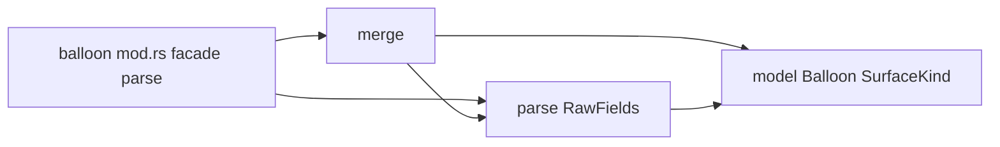
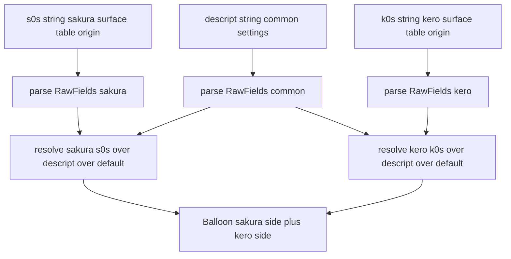

# 技術設計書 — areka-P0-balloon-parse

## Overview

**Purpose**: 本機能は、emo2 のバルーン定義ファイル群（`descript.txt` ＋ サーフェス別上書き `balloons0s.txt`／`balloonk0s.txt`）を型付き**バルーンモデル**へ寛容に解析する parser を、既存 `areka-parsers` クレートの `balloon` モジュールとして提供する。統一グラフィック方針（バルーン＝シェル surface 上の文字層）に基づき、下流 `areka-P0-text-layer`／`areka-P0-surface-engine` が消費するバルーン枠・文字領域・座標のモデル生成源を確立する。

**Users**: 下流エンジン開発者が、host 環境やファイル I/O に依存せず `areka_parsers::balloon` の公開純粋関数から解決済みバルーンモデルを取得し、バルーン描画・文字レイアウト・surface 合成の入力として消費する。

**Impact**: 既存 `areka-parsers` クレートは現在 `sakura` モジュールのみを公開する。本 spec は兄弟モジュール `balloon` を追加する（`lib.rs` の `pub mod balloon;` 1 行＋新規ディレクトリ）。追加依存はゼロ（`tracing` のみ・sakura と同一）。sakura モジュールおよび他コードには変更を加えない。

### Goals

- `areka_parsers::balloon` として、descript 共通設定 ＋ サーフェス別テーブル（s0s／k0s）を入力に、3段参照優先度で解決した単一のバルーンモデルを返す純粋・寛容パースを提供する。
- 座標フィールドの**符号意味をフィールド種別ごとに正しく保持**する（validrect／wordwrappoint は反対端基準、windowposition は方向調整）。
- サーフェス別テーブル（起点）→ descript 共通設定 → 内部既定値 の3段参照優先度による値解決を、sakura／kero を取り違えず適用する。
- emo2 実物 fixture（`emo2-kakukaku`）の s0s・k0s 両サーフェスの確定値を単体テストで固定し、純粋関数のみで検証可能にする。

### Non-Goals

- バルーン描画・文字レイアウト・折返し**実行**（`areka-P0-text-layer` の領分）。
- surface 合成（`areka-P0-surface-engine` の領分）。
- sakura／kero の左右配置決定（shell descript の `*.balloon.alignment` が決める cross-cutting seam。下流エンジンが shell 側と突き合わせる）。
- emo2-kakukaku 未使用フィールド（`communicatebox`／`onlinemarker`／`sstpmarker`／`sstpmessage`／`marker`／`number.*`／cursor スタイル）の意味解釈。
- バルーン本体画像ファイルの実在チェック・ファイル I/O（本 spec は host/I/O 非依存）。

## Boundary Commitments

### This Spec Owns

- `areka_parsers::balloon` モジュールと、その公開面（解決済みバルーンモデル型 `Balloon`／サーフェス種別 `SurfaceKind`／値型群と read-only アクセサ、公開関数 `parse`）。
- `descript.txt`（base 共通既定）の kv 行解析と、emo2 使用フィールドのモデルへの意味割当。
- `balloons0s.txt`（sakura 側）／`balloonk0s.txt`（kero 側）のサーフェス別テーブル解析と、これを起点に descript 共通・内部既定へフォールバックする3段参照優先度解決。
- 座標フィールドの**符号保持**（validrect／wordwrappoint／windowposition それぞれの符号意味を失わずモデルへ保持）。
- バルーン本体画像参照のサーフェス別解決に必要な情報の保持（サーフェス種別＋サーフェス ID）。命名規約 `balloon{s|k}{ID}.png` を下流が I/O 無しに導出できる形。
- 上記に対する emo2 fixture 単体テスト（I/O 契約の固定）。

### Out of Boundary

- バルーン描画・文字折返し・レイアウト実行（`areka-P0-text-layer`）。
- surface 合成・画像ロード（`areka-P0-surface-engine`）。
- 座標の**基準端の実座標変換**（負値をベース画像サイズと突き合わせて絶対座標へ解決すること）。本 spec は符号付き値と符号意味の分類までを提供し、実座標解決は下流が行う。
- sakura／kero の左右配置決定（shell 側 `*.balloon.alignment`）。
- 他 parser（`areka-P0-shell-parse`／`areka-P0-package-mount`）の領分。
- 未使用フィールドの意味解釈（寛容に扱うが解釈しない）。

### Allowed Dependencies

- `areka-parsers` クレート内部（`sakura` の確立パターンを規律として踏襲。ただしコード共有・相互 import は行わない＝独立モジュール）。
- workspace 依存 `tracing`（診断ログのみ・エラー型なし）。
- Rust std のみ（`std::collections` 等）。追加のクレート依存は導入しない。
- emo2 fixture（テスト時のみ・後述の取り込み方式に従う）。

**依存制約**: `balloon` は `sakura` の型・関数を import しない（構文が根本的に異なるため共有不可・研究 §1.1／§3）。`Result` を返さない・panic しない・ファイル I/O をしない・非同期を持たない。

### Revalidation Triggers

下流 spec／消費者が統合を再確認すべき変更:

- `Balloon` 型の公開面（フィールド／アクセサ／`SurfaceKind`／画像参照の表現）の変更。
- 座標の符号意味の分類方法（どのアクセサがどの符号意味を返すか）の変更。
- 参照優先度規則（起点 surface ＞ descript 共通 ＞ 内部既定・サーフェス区別）の変更。
- 公開関数 `parse` のシグネチャ（入力の数・順序・戻り値の形）の変更。
- 画像参照解決に必要な保持情報（サーフェス種別／ID）の増減。

## Architecture

### Existing Architecture Analysis

既存 `sakura` モジュール（研究 §1.1 で正本として調査済み）が確立した規律を、`balloon` は**思想として踏襲し、構文実装は新規**とする。

- **多層ファイル分割・依存方向**: sakura は `model ← lexer ← decode ← parse`。`mod.rs` が private に各層を宣言し、`pub use` で最小公開面のみを外部へ出す。テストは `#[cfg(test)] mod xxx_tests;` を同 `mod.rs` に並べ、公開パス経由でモデルを構築・比較して I/O 契約を固定する。
- **モデル規律**: `#[non_exhaustive]`・最小派生（`Clone, Debug, PartialEq` のみ。`f32` を含むため `Eq`/`Hash`/`serde` を付さない）・不透明 NewType ＋ read-only アクセサ（`SurfaceArg`／`NewLineRatio`）・コメントに要件番号を紐づける文化。
- **寛容パース規律**: 公開 facade は `Result` を返さず、空入力→既定値、失敗しない・panic しない。未対応／不正トークンは情報を失わず生保持し後続解析を継続（局所吸収・全域継続）。`tracing` のみ・純粋・決定的・host 非依存・I/O なし。

**sakura との差分**: balloon の構文は `key,value` の 1 行 1 フィールドであり、sakura のさくらスクリプト（`\tag[args]` のタグ列）とは根本的に異なる（研究 §3）。したがって sakura の lexer／decode をそのまま流用できず、独立 lexer は不要。また sakura は `&str → Vec<Instruction>`（単一入力→列）だが、balloon は「サーフェス別テーブル（起点）＋ descript 共通設定 ＋ 内部既定 → 単一モデル」であり、**3段参照優先度による値解決**という sakura に前例のない新概念が入る。

### Architecture Pattern & Boundary Map

**採用パターン**: 研究 §4／§7 推奨の **Option B（model / parse / merge / facade ＋ in-source テスト）**。sakura の分割思想（依存方向・公開面集約・寛容規律・不透明 NewType・in-source テスト）を必須踏襲しつつ、単純な kv 構文に見合った粒度とし、balloon 固有の「マージ」を独立ファイルで明示する。

- **選定理由**: kv 行は `split_once(',')` レベルで足り、sakura のような独立 lexer 層は trivial になるため過剰分割（Option A の 5 ファイル）は避ける。段階分割（Option C）は「構造は最初から」を良しとする sakura 文化と逆行し、design で分割方針を先に確定する方が一貫する。
- **依存方向**: `model ← parse ← merge ← facade(mod.rs)`。各層は左のみを import し上方向へは依存しない。
  - `model` — 型定義（他層に依存しない）。
  - `parse` — descript／s0s／k0s の 1 ファイル文字列を中間フィールド集合（`RawFields`）へ寛容解析（model に依存）。
  - `merge` — サーフェス別テーブル（起点）→ descript 共通設定 → 内部既定値 の参照優先度で各フィールドを解決し、確定した `Balloon` モデルへ変換（model／parse に依存）。
  - `mod.rs` — 公開 facade `pub fn parse(descript, s0s, k0s) -> Balloon` を結線し、最小公開面のみ `pub use`（全層に依存）。



**Architecture Integration**:
- Selected pattern: レイヤ分割パーサ（model/parse/merge/facade）。sakura と対称ではないが分割思想は一致。
- Domain boundaries: parse=構文＋フィールド収集、merge=3段参照優先度による値解決＋モデル確定、model=型。参照優先度解決の関心を独立ファイルで明示。
- Existing patterns preserved: 公開面集約・寛容パース・不透明 NewType・in-source テスト・要件番号コメント。
- New components rationale: `merge` は sakura に前例のない balloon 固有関心（サーフェス別テーブル起点の3段参照優先度解決・研究 §3）ゆえ独立させる。
- Steering compliance: Rust 2024・`tracing` のみ・`Result` 無し寛容パース（steering `tech.md` の `thiserror` 一般規約からの逸脱は sakura が既に確立済み・研究 §1.3）・過剰実装禁止（emo2 使用フィールドのみ）。

### Technology Stack

| Layer | Choice / Version | Role in Feature | Notes |
|-------|------------------|-----------------|-------|
| ライブラリ実装 | Rust 2024（edition.workspace） | balloon モジュール（純粋関数・型） | 追加依存ゼロ・sakura と同一雛形 |
| 診断 | `tracing`（workspace） | 未知行・異常値の診断ログ | エラー型なし（`thiserror` 不使用） |
| 標準ライブラリ | Rust std | kv 分割・フィールド収集（`str::split_once` 等） | 外部クレート導入せず |
| テスト | Rust 組込みテスト（in-source `*_tests.rs`） | emo2 fixture 単体テスト | 公開パス経由で契約固定 |

## File Structure Plan

### Directory Structure

```
crates/areka-parsers/src/
└── balloon/                    # 新規モジュール（sakura と兄弟・独立）
    ├── mod.rs                  # 公開面集約 + facade parse(descript,s0s,k0s)->Balloon + テスト宣言
    ├── model.rs                # 型: Balloon / SurfaceKind / 座標・色・font 値型 + アクセサ
    ├── model_tests.rs          # model 単体テスト（NewType アクセサ・符号保持・既定値）
    ├── parse.rs                # descript/s0s/k0s 文字列 -> RawFields（kv 寛容収集）
    ├── parse_tests.rs          # parse 単体テスト（空/未知行/CRLF/BOM/重複キー後勝ち）
    ├── merge.rs                # surface(起点) + descript(共通) -> Balloon（3段参照優先度解決 + サーフェス確定）
    ├── merge_tests.rs          # merge 単体テスト（起点採用/descript フォールバック/内部既定フォールバック）
    └── validation_tests.rs     # emo2 fixture 横断テスト（s0s/k0s 確定値の固定）
```

> 分割思想は sakura と同一（`mod.rs` が private 宣言＋最小 `pub use`、各層に `*_tests.rs`、横断 `validation_tests.rs`）。sakura と 1:1 のファイル対応にはしない（lexer/decode を統合し merge を追加）。`mod.rs` の doc コメントに「kv 構文が単純ゆえ独立 lexer を持たず、balloon 固有の merge を独立させた」旨を記す（研究 §4 の説明責任を吸収）。

### Modified Files

- `crates/areka-parsers/src/lib.rs` — `pub mod balloon;` を 1 行追加（既存 doc コメントは「兄弟モジュールは各 spec が追加する」と明記済み・研究 §1.1）。sakura 行・その他は変更しない。

## System Flows

kv 行 → フィールド収集 → 3段参照優先度解決（起点→descript→内部既定）→ 確定モデルの直線パイプラインであり分岐は寛容吸収のみ。facade の結線を 1 図で示す。



- **参照優先度**: 各フィールドを サーフェス別テーブル（第1参照・起点）→ `descript` 共通設定（第2参照）→ 内部既定値（第3参照）の順で解決（要件 4.1）。サーフェス別テーブルと `descript` の双方にあれば起点優先（4.2）、サーフェス別テーブルに無ければ `descript`（4.3）、双方に無ければ内部既定（4.4）。起点にのみあるフィールド（例: `windowposition`）は第1参照でそのまま採用。
- **サーフェス区別**: sakura 側は s0s 起点、kero 側は k0s 起点で（いずれも `descript`・内部既定へフォールバックして）別々に全フィールドを解決し、単一 `Balloon` へ両サーフェス確定値を取り違えず内包（4.5）。
- **寛容分岐**: 未知 kv 行・不正値は生保持等で吸収し後続を継続（要件 5）。空入力→内部既定のみのモデル（要件 1.4）。

## Requirements Traceability

| Requirement | Summary | Components | Interfaces | Flows |
|-------------|---------|------------|------------|-------|
| 1.1 | `balloon` 公開面（モデル型＋解析関数） | mod.rs, model | `pub use` / `parse` | facade |
| 1.2 | descript＋s0s/k0s → 単一解決済みモデル・I/O 非依存 | mod.rs, merge | `parse(descript,s0s,k0s)->Balloon` | 全体 |
| 1.3 | `Result` 無し寛容パース・失敗/panic せず | parse, merge | `parse` 戻り値 `Balloon` | 寛容分岐 |
| 1.4 | 空/全未知 → 既定値のみの有効モデル | model, parse | `Balloon::default` 相当 | 寛容分岐 |
| 1.5 | 不透明 NewType＋non_exhaustive＋最小派生 | model | 値型＋アクセサ | — |
| 2.1 | `type,balloon` の種別解析 | parse, merge, model | RawFields→Balloon | parse |
| 2.2 | `use_self_alpha,1` の反映 | parse, merge, model | `use_self_alpha()` | parse |
| 2.3 | `origin.x/y` の反映 | parse, merge, model | `origin()` | parse |
| 2.4 | `font.name` の反映 | parse, merge, model | `font_name()` | parse |
| 2.5 | `font.height` の反映 | parse, merge, model | `font_height()` | parse |
| 2.6 | 本文文字色（RGB）の反映 | parse, merge, model | `font_color()` | parse |
| 2.7 | アンカー文字色（RGB）の反映 | parse, merge, model | `anchor_font_color()` | parse |
| 2.8 | 画像参照をサーフェス種別＋ID で保持（命名規約導出） | model, merge | `SurfaceKind` / `surface_id()` | facade |
| 2.9 | `arrow0/arrow1.x/y` の反映 | parse, merge, model | `arrow0()` / `arrow1()` | parse |
| 3.1 | `windowposition.x/y` の符号（方向調整）保持 | model, merge | `window_position()` | merge |
| 3.2 | `wordwrappoint.x/y` の符号（反対端基準）保持 | model, merge | `wordwrap_point()` | merge |
| 3.3 | `validrect.*` の符号（反対端基準）保持 | model, merge | `valid_rect()` | merge |
| 3.4 | 正/負値を失わず保持・基準端解釈は下流 | model | 符号付き `i32` アクセサ | — |
| 4.1 | 3段参照優先度（起点→descript→内部既定） | merge | `resolve_side` | merge |
| 4.2 | 起点とdescript双方にあり → 起点優先 | merge | `resolve_side` | merge |
| 4.3 | 起点に無 → descript 共通採用 | merge | `resolve_side` | merge |
| 4.4 | 起点にもdescriptにも無 → 内部既定採用 | merge, model | `resolve_side` | merge |
| 4.5 | sakura/kero を区別・取り違えない | model, merge | `sakura()` / `kero()` | facade |
| 5.1 | 未使用フィールドを解釈せず寛容に扱う | parse | RawFields（意味割当せず） | 寛容分岐 |
| 5.2 | 未知行を寛容に取り込み後続継続 | parse | RawFields.unknown 等 | 寛容分岐 |
| 5.3 | 対象外を理由に panic/エラー/中断しない | parse, merge | 戻り値 `Balloon` | 寛容分岐 |
| 6.1 | emo2 fixture を入力に単体テストで観測 | validation_tests | fixture 取り込み | — |
| 6.2 | s0s 確定値（符号保持）をマージ生成 | validation_tests, merge | `sakura()` アクセサ | merge |
| 6.3 | k0s 確定値（符号保持）をマージ生成 | validation_tests, merge | `kero()` アクセサ | merge |
| 6.4 | 純粋関数・単体テストのみで観測可能 | mod.rs, validation_tests | `parse` | — |

## Components and Interfaces

| Component | Layer | Intent | Req Coverage | Key Dependencies | Contracts |
|-----------|-------|--------|--------------|------------------|-----------|
| `model` | 型 | `Balloon`／`SurfaceKind`／値型と read-only アクセサ | 1.4, 1.5, 2.*, 3.*, 4.5 | なし | State |
| `parse` | 構文 | 1 ファイル文字列→`RawFields`（kv 寛容収集） | 1.3, 2.*, 5.* | model (P0) | Service |
| `merge` | 意味/統合 | surface 起点＋descript 共通＋内部既定の3段参照優先度で確定 `Balloon` を解決（サーフェス区別・符号保持） | 3.*, 4.* | model (P0), parse (P0) | Service |
| `mod.rs` facade | 公開 | `parse(descript,s0s,k0s)->Balloon` 結線＋最小公開面 | 1.1, 1.2, 6.4 | 全層 (P0) | Service |

### 型層

#### model

| Field | Detail |
|-------|--------|
| Intent | 解決済みバルーンモデルと値型・サーフェス種別を定義し、read-only アクセサで公開する |
| Requirements | 1.4, 1.5, 2.1〜2.9, 3.1〜3.4, 4.5 |

**Responsibilities & Constraints**
- `Balloon` は sakura 側・kero 側の確定値を両方内包する集約ルート（要件 4.5「取り違えない」を型で表現）。両サーフェスは同一 `BalloonSide` 型で保持する。**共通/サーフェス別を型で区別しない**（研究 §5-1 の候補 (b)・設計ディスカッション #1 で確定）: サーフェス別テーブルが起点でどのフィールドも上書きされうるため、各 `BalloonSide` は全フィールドを「起点→ descript 共通 → 内部既定」の3段参照優先度で解決した確定値として保持する。`descript` 由来の共通値は両サーフェスに同値で複製されうる（コストはバルーン1定義ぶんで無視可能）。下流は常に `sakura()`／`kero()` から全フィールドの確定値を取得でき、共通/別で取得口が分かれない。
- 座標は符号付き `i32` を保持（要件 3.4）。**符号意味はフィールド種別で固定**され値では区別しない: `windowposition` は方向調整（y は下が＋・上が－）、`wordwrappoint`／`validrect` は反対端基準（負値＝右/下端からの相対）。この分類はアクセサの doc コメントと型名（`WindowPosition`／`WordWrapPoint`／`ValidRect`）で表現し、実座標解決は下流に委ねる（過剰実装禁止・研究 §5-2 の「符号保持で足りる」を採用）。
- `#[non_exhaustive]`（`SurfaceKind` 等の enum）・派生は `Clone, Debug, PartialEq` のみ（sakura に整合。`serde`/`Eq`/`Hash` を付さない）。
- 不透明 NewType ＋ read-only アクセサ。フィールドは非公開、下流は公開アクセサ経由でのみ読む。
- 既定値（3段参照優先度の第3参照＝内部既定値）: 起点テーブルにも `descript` にも無いフィールドに適用する。空/未知入力でも有効なモデルを構成できるよう `Default` 相当を提供（要件 1.4/4.4）。既定は中立値（座標 0・色 0・フォント空等）とし、下流が「未設定」を判別できる形。

**Contracts**: State [x]

##### State Management（型定義スケッチ）

```rust
/// サーフェス種別（画像命名規約 balloon{s|k}{ID}.png の {s|k} を担う）。要件 2.8/4.5。
#[non_exhaustive]
#[derive(Clone, Debug, PartialEq)]
pub enum SurfaceKind { Sakura, Kero }

/// 符号付き 2D 座標（基準端の意味は保持先フィールド種別が固定する）。要件 3.4。
#[derive(Clone, Debug, PartialEq)]
pub struct Point { x: i32, y: i32 }
// アクセサ: x() -> i32, y() -> i32

/// ウィンドウ位置（符号は基本位置からの方向調整・y 下が＋/上が－）。要件 3.1。
pub struct WindowPosition(Point);       // position() -> &Point
/// 折返し点（負値＝右端基準）。要件 3.2。
pub struct WordWrapPoint(Point);        // point() -> &Point
/// 有効矩形（各辺・負値＝反対端基準）。要件 3.3。
#[derive(Clone, Debug, PartialEq)]
pub struct ValidRect { top: i32, bottom: i32, left: i32, right: i32 }
// アクセサ: top()/bottom()/left()/right() -> i32

/// RGB 色（0..=255・寛容ゆえ範囲外もそのまま保持）。要件 2.6/2.7。
#[derive(Clone, Debug, PartialEq)]
pub struct Color { r: u8, g: u8, b: u8 }

/// 片サーフェスの確定値。**全フィールドを3段参照優先度で解決した結果を保持する**
/// （共通/別を型で区別せず、`descript` 由来の共通値も各サーフェスに解決済みで内包）。要件 4.5。
#[derive(Clone, Debug, PartialEq)]
pub struct BalloonSide {
    // kind: SurfaceKind, surface_id: u32,
    // is_balloon(2.1), use_self_alpha(2.2), origin(2.3),
    // font_name(2.4), font_height(2.5), font_color(2.6), anchor_font_color(2.7),
    // window_position(3.1), wordwrap_point(3.2), valid_rect(3.3), arrow0(2.9), arrow1(2.9)
}
// アクセサ: kind()/surface_id()/is_balloon()/use_self_alpha()/origin()/font_name()/
//          font_height()/font_color()/anchor_font_color()/
//          window_position()/wordwrap_point()/valid_rect()/arrow0()/arrow1()

/// 解決済みバルーンモデル（sakura/kero 両側の器）。要件 1.4/1.5/4.5。
/// 共通/サーフェス別の区別は持たず、両サーフェスとも全フィールド確定値を `BalloonSide` に持つ。
#[non_exhaustive]
#[derive(Clone, Debug, PartialEq)]
pub struct Balloon {
    // サーフェス別: sakura() -> &BalloonSide, kero() -> &BalloonSide (4.5)
}
```

> `Balloon` はサーフェス別の器に徹し、フィールドは全て `BalloonSide` が全サーフェス分保持する（設計ディスカッション #1）。これにより「どのフィールドが共通でどれがサーフェス別か」という配置判断そのものが不要になり、検証レポート明確化1が指摘した配置ぶれのリスク（要件 4.3/4.5）が構造的に消える。emo2 実データでは `descript` 由来（font/color/origin/type/use_self_alpha）が両側同値に、起点テーブル由来（windowposition/validrect/wordwrappoint/arrow）が各サーフェスで異なる値に解決される。

**Implementation Notes**
- Integration: 下流 `text-layer`（wordwrap_point/font/valid_rect 消費）・`surface-engine`（画像参照＝kind＋surface_id 消費）。
- Validation: 符号保持は model_tests で負値アクセサ往復を固定。
- Risks: 符号意味の**分類取り違え**（windowposition を反対端基準と誤分類）が最大の落とし穴（研究 §6）。型名・doc・テストで三重に固定する。

### 構文層

#### parse

| Field | Detail |
|-------|--------|
| Intent | 1 ファイル分の文字列を kv 行として寛容に走査し、認識フィールドと未知行を `RawFields` へ収集する |
| Requirements | 1.3, 2.1〜2.9, 5.1, 5.2, 5.3 |

**Responsibilities & Constraints**
- 1 行を `split_once(',')` で key/value に分割し、対象フィールドは `RawFields` の該当スロットへ、非対象・未知・分割不能行は未知行として吸収（要件 5.2）。空行はスキップ。
- CRLF/LF・BOM・前後空白・空値を寛容化（研究 §5-7）。同一キーが同一ファイル内で複数出た場合は後勝ち（局所吸収・全域継続）。
- 値解釈は最小限（このレイヤは「収集」＝文字列スロット化まで。数値化・符号解釈は merge/model 変換時に行う）。数値変換失敗は既定値へフォールバックし `tracing` で記録・破綻させない（要件 5.3）。
- 未使用フィールド（`communicatebox`/`onlinemarker`/`sstpmarker`/`sstpmessage`/`marker`/`number.*`/cursor）は意味割当せず未知行扱い（保持義務は緩い＝研究 §5-6。診断のため生保持を可とする）。

**Contracts**: Service [x]

##### Service Interface

```rust
// 内部（非公開）: 1 ファイル文字列 → 収集済みフィールド集合。失敗しない。
fn parse_fields(input: &str) -> RawFields;
```
- Preconditions: `input` は UTF-8（BOM 許容）。
- Postconditions: 常に `RawFields` を返す（空入力→空収集＝既定へ寄与）。認識キーを収集、未知行は吸収。
- Invariants: 純粋・決定的・I/O なし・panic せず・`Result` でない（要件 1.3）。

**Implementation Notes**
- Integration: `merge` が surface（起点）/descript（共通）の `RawFields` を消費。
- Validation: parse_tests で空/未知/CRLF/BOM/重複キー後勝ち/分割不能行を固定。
- Risks: `RawFields` の粒度は emo2 使用フィールドに限定（過剰実装禁止）。未知行保持は診断用途に留め、モデル公開面へは出さない。

### 意味・統合層

#### merge

| Field | Detail |
|-------|--------|
| Intent | サーフェス別テーブル（起点）の `RawFields` を第1参照に、descript 共通・内部既定へフォールバックして各フィールドを解決し、符号保持しつつ確定 `Balloon` を構築する |
| Requirements | 3.1〜3.4, 4.1〜4.5 |

**Responsibilities & Constraints**
- フィールド単位の3段参照優先度解決: 起点テーブル（surface）に値があれば採用、無ければ `descript`、それも無ければ内部既定を採用（要件 4.1/4.2/4.3/4.4）。起点にのみあるフィールド（`windowposition`）は第1参照でそのまま採用（4.4）。
- サーフェス別に 2 回解決（s0s 起点→sakura 側、k0s 起点→kero 側。いずれも `descript`・内部既定へフォールバック）し、`SurfaceKind` と surface ID（emo2 は 0）を各 `BalloonSide` に固定（4.5・要件 2.8）。両側を単一 `Balloon` に格納し取り違えない。
- 収集済み文字列を model 値型へ変換する際、**符号をそのまま `i32` へ**保持（要件 3.4）。符号意味の分類は変換先の型（`WindowPosition`/`WordWrapPoint`/`ValidRect`）で表現し、この層は値を解釈・変換しない。
- 変換不能・欠落は内部既定でフォールバック（要件 1.4/4.4）・panic せず（5.3）。

**Contracts**: Service [x]

##### Service Interface

```rust
// 内部（非公開）: サーフェス別テーブル(起点) + descript(共通) → 片サーフェスの全フィールド確定値。
// 各フィールドを surface → descript → 内部既定 の順で解決する。
fn resolve_side(surface: &RawFields, descript: &RawFields, kind: SurfaceKind) -> BalloonSide;
```
- Preconditions: surface/descript は `parse_fields` の出力。
- Postconditions: surface（起点）優先・descript 共通フォールバック・内部既定を最終フォールバックとする確定 `BalloonSide`。符号保持。
- Invariants: 純粋・決定的・panic せず。

**Implementation Notes**
- Integration: facade が `resolve_side` を sakura（s0s 起点）/kero（k0s 起点）で 2 回呼び `Balloon` を組む。
- Validation: merge_tests で「起点採用（s0s に windowposition あり）／descript フォールバック（k0s に wordwrappoint 無 → descript -34）／内部既定フォールバック（両方に無し）／起点による descript 上書き（wordwrappoint.x descript -34 → s0s -49）」を固定。
- Risks: **参照優先度（surface 起点＞descript 共通＞既定）とサーフェス（s0s/k0s）の取り違え**（研究 §6）。テストで各優先度段・両サーフェスを分離固定。

### 公開層

#### mod.rs facade

| Field | Detail |
|-------|--------|
| Intent | parse→merge を結線する単一公開純粋関数と、最小公開面（型・アクセサ）の集約 |
| Requirements | 1.1, 1.2, 6.4 |

**Responsibilities & Constraints**
- 公開関数 `parse(descript, s0s, k0s) -> Balloon`（研究 §5-1 候補 (a) を採用: 両サーフェスを 1 モデルに内包・下流が再解決不要＝要件 1.2/4.5 を最小 API で満たす）。3 入力すべて `&str`（`descript` は共通設定、`s0s`/`k0s` は各サーフェスの起点テーブル）。
- `mod model; mod parse; mod merge;` を private 宣言し、`pub use model::{Balloon, SurfaceKind, ...値型}; pub use self::parse::parse;` で最小公開面のみ外部へ。
- `lib.rs` に `pub mod balloon;` を追加（唯一の crate 変更）。

**Contracts**: Service [x]

##### Service Interface

```rust
/// emo2 バルーン定義（descript 共通設定 ＋ サーフェス別テーブル s0s/k0s）を
/// 3段参照優先度で解決した単一のバルーンモデルへ変換する純粋・寛容関数。要件 1.1/1.2。
pub fn parse(descript: &str, s0s: &str, k0s: &str) -> Balloon;
```
- Preconditions: 3 入力は UTF-8。空文字列可（要件 1.4）。
- Postconditions: sakura/kero 両側を内包する `Balloon`（要件 4.5）。空/全未知→既定モデル（1.4）。
- Invariants: 純粋・決定的・host 非依存・I/O なし・`Result` でない・panic せず（要件 1.3/6.4）。

**Implementation Notes**
- Integration: sakura と兄弟の独立モジュール（sakura を import しない）。
- Validation: validation_tests が公開 `parse` 経由で fixture の確定値を固定（別クレート下流視点の契約固定）。
- Risks: API 形状の後方互換（`#[non_exhaustive]` と NewType で吸収）。

## Data Models

### Domain Model

- **集約ルート** `Balloon`: sakura/kero 各 `BalloonSide` を内包する器。共通/サーフェス別の区別は型に持たせず、各 `BalloonSide` が全フィールド（type/use_self_alpha/origin/font/色/windowposition/validrect/wordwrappoint/arrow）を3段参照優先度で解決した確定値として保持する（設計ディスカッション #1）。
- **値オブジェクト** `WindowPosition`/`WordWrapPoint`/`ValidRect`/`Point`/`Color`/`SurfaceKind`: 不透明 NewType または最小構造＋read-only アクセサ。
- **不変条件**: 座標は符号を失わない（要件 3.4）。sakura/kero は別 `BalloonSide` で分離（4.5）。すべて `Default` 相当で有効モデルを構成可能（1.4）。
- **画像参照**: ファイル名文字列は保持せず、`SurfaceKind` ＋ surface ID を保持する（研究 §5-5 の how 判断で (b) を採用: 構造のみ保持し導出は下流）。命名規約 `balloon{s|k}{ID}.png`（偶数=左向き/奇数=右向き）は下流が I/O 無しに導出（要件 2.8・過剰実装禁止に整合）。

### 中間モデル `RawFields`（非公開）

- parse 層の出力。認識キーごとの `Option<String>` スロット＋未知行の生保持コレクション。merge が消費し公開型へ変換後は外部へ出さない。

## Error Handling

### Error Strategy

本モジュールは**エラー型を持たない寛容パース**（sakura 規律・研究 §1.3）。あらゆる異常入力を値の欠落・生保持へ縮退し、`Result`/panic/例外を用いない（要件 1.3/5.3）。

### Error Categories and Responses

- **未知/対象外フィールド**（要件 5.1/5.2）: 意味割当せず未知行として吸収し後続継続。`tracing::debug` で記録可。
- **分割不能行・空値・不正数値**（要件 5.3）: 該当フィールドは既定値へフォールバックし破綻させない。`tracing::warn` で異常値を記録可。
- **空入力/全未知入力**（要件 1.4）: 既定値のみの有効 `Balloon` を返す。

### Monitoring

`tracing` のみ（sakura と同一・エラー型なし）。ログ有無はテスト結果に影響しない（純粋性維持）。

## Testing Strategy

acceptance criteria から導出。全テストは in-source（`*_tests.rs`）・公開パス経由（`use crate::balloon::{...}`）で別クレート下流視点の I/O 契約を固定する。

### Unit Tests（model / parse / merge）

- **model — 符号保持アクセサ往復**（3.1/3.2/3.4）: `WindowPosition(y=-129)`・`WordWrapPoint(x=-49)`・`ValidRect(bottom=-56)` を構築しアクセサが負値を欠落なく返すことを固定。
- **model — 既定モデルの有効性**（1.4/1.5）: `Default` 相当が全アクセサで中立値を返し、`#[non_exhaustive]`・最小派生（`Clone/Debug/PartialEq`）でコンパイルされることを固定。
- **parse — 寛容収集**（1.3/5.1/5.2/5.3）: 空文字列→空収集、未知行（`cursor.style,square`・`number.xr,-170`）を吸収し後続の認識キーが欠落しないこと、CRLF/BOM/前後空白/空値/重複キー後勝ちを固定。
- **merge — 3段参照優先度**（4.1〜4.4）: (a) 起点による上書き（`wordwrappoint.x` descript -34 → s0s 起点 -49）、(b) descript フォールバック（k0s に `wordwrappoint` 無 → descript -34 維持）、(c) 起点のみ（descript に無い `windowposition` を s0s/k0s 起点から採用）、(d) 内部既定フォールバック（起点・descript 双方に無いフィールド）を分離固定。

### Integration Tests（emo2 fixture 横断・validation_tests）

- **sakura 側確定値**（6.1/6.2）: s0s 起点で（descript・内部既定へフォールバックして）解決し、`sakura()` が `windowposition (266,-129)`・`wordwrap_point.x=-49`・`validrect (top=46,bottom=-56,left=36,right=-44)`・`arrow0 (15,90)`・`arrow1 (15,-110)`・`font_name="Yu Gothic UI"`・`font_height=28`・`font_color=(0,0,0)`・`anchor_font_color=(180,40,40)`・`kind=Sakura`・`surface_id=0` を符号保持で返すことを固定（font/color は descript 共通フォールバック由来）。
- **kero 側確定値**（6.1/6.3）: k0s 起点で（descript・内部既定へフォールバックして）解決し、`kero()` が `windowposition (-190,-75)`・`validrect (top=40,bottom=-70,left=24,right=-48)`・`arrow0 (9,54)`・`arrow1 (9,-125)`・descript 由来の `wordwrap_point.x=-34`（k0s に無し＝descript フォールバック）・`kind=Kero`・`surface_id=0` を返すことを固定。
- **サーフェス取り違え防止**（4.5）: 単一 `parse` 呼び出しの戻り `Balloon` で `sakura()` と `kero()` の `windowposition` が入れ替わっていない（266/-129 vs -190/-75）ことを固定。
- **純粋性/host 非依存**（6.4）: 同一入力の 2 回 `parse` が `PartialEq` で等しいこと、ファイル I/O・host 実行なしで完結することを固定。

### Fixture 取り込み方式（研究 §5-8 の how 判断）

- 採用: 検証に必要な最小の fixture 抜粋を**テスト内リテラル**として持つ（研究 §5-8 候補 (b)）。クレート境界を跨ぐ相対 `include_str!`（候補 a）の脆さを避け、`emo2-kakukaku` の確定値（base の該当行＋s0s/k0s 全差分行）を各テストに直書きする。これにより areka-parsers クレート単体で純粋・自己完結にテスト可能（要件 6.4）。fixture 実ファイルは正本・回帰時の照合元として `crates/pilot/.../emo2-kakukaku/` に残る。
- **出所明示（乖離リスク対策）**: 直書きするテスト内リテラルには、採取元の正本ファイル名と行（例: `// 正本: crates/pilot/examples/shiori-host-32/fixtures/emo2/emo2-kakukaku/balloons0s.txt`）をテストコメントで明示し、`validation_tests` にも「正本 fixture の該当行から採取」と記す。これにより将来 fixture が改訂された際の照合起点を残す。正本 fixture とテストリテラルの**自動照合**（doc-test／helper による正本参照）は本 spec のスコープ外とし、将来拡張の余地として残す。

## Open Questions / Risks

- **符号意味の分類が最大リスク**（研究 §6・brief Constraints）: `windowposition`（方向調整）を `wordwrappoint`/`validrect`（反対端基準）と混同しないこと。型名・doc・テストで三重固定（本設計で対処済み）。
- **k0s の検証深度**（研究 §5-4 の食い違い）: brief/requirements 旧文言は「k0s 未 vendored・構造対応のみ」を前提としたが、実 fixture には `balloonk0s.txt`（実データ）＋`balloonk0.png` が存在する。requirements（確定版）の Boundary Context は「k0s も実データ vendored 済み・s0s・k0s 両側の確定値を単体テストで固定」へ更新済み（要件 6.3・Adjacent expectations）。本設計は**両サーフェス実データ検証**を採用し食い違いを解消（矛盾なし）。
