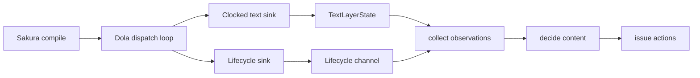
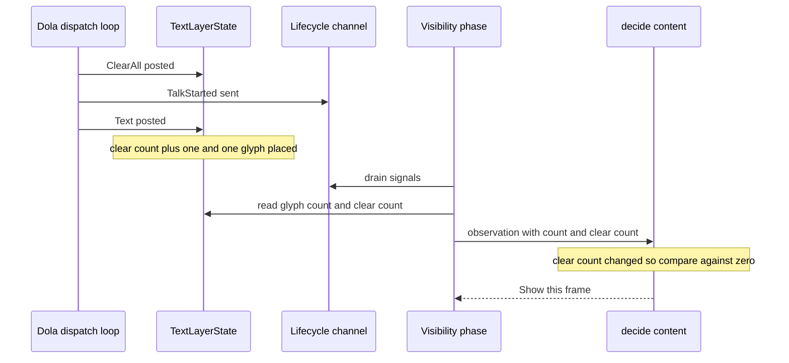

# 設計書: areka-P0-balloon-reappear-short-talk

## Overview

**Purpose**: 隠れたバルーン（会話終了後の時間切れ・利用者の中断・バルーンの切替の後）が、次の台詞の最初の文字とともに必ず現れるようにする。今は、台詞の始まりの全消去と最初の文字が同じフレームに届くと、そのフレームの見える文字の数が前の台詞の残りの数と比べられ、「増えていない」と読まれて吹き出しが出ない（1 文字の台詞・最初のフレームで全文が見える短い台詞で起きる）。

**Users**: areka の利用者は、ゴーストが「ん。」のような短い台詞を話したときにも吹き出しを見られる。開発チームは、同じ取りこぼしが再び入れば決定論のテストの赤で気付ける。

**Impact**: 文字の層（`areka-emo-text` の `TextLayerState`）が scope ごとの「消去の回数」を数えて読む口を出し、可視性の観測（`ScopeObservation`）がその回数を可視の文字の数と同じ借用・同じフレームで運び、表示の判定（`decide_content`）が「回数が前に見た値から変わったときは、比べる相手を 0（空の状態）にする」。表示の時期は動かさず（0 フレーム）、隠す側の規則は変えない。

### Goals

- 隠れたスコープのバルーンを、新しい台詞の最初の文字が見えるようになったフレームで表示する（台詞の長さ・出方・隠れた理由・消去の種類に関わらず）。
- 台詞の外では現れない・見えているバルーンを明滅させない・隠す側の規則を変えない、という今の振る舞いを保つ。
- 修正の前に赤になる決定論のテストを、本番の文字の層と本番の観測の収集を通して立てる。

### Non-Goals

- 時間切れの長さ・`\![set,balloontimeout,時間]` の解釈・隠す側の規則（時間切れ・会話開始時の全非表示・利用者の中断・`\b[-1]`）の変更。
- バルーンの見た目、シェル・バルーンの切替と装着の置き換えの振る舞い、台本の文字が見えるようになる時刻と順序の変更。
- 完了 spec（`areka-P0-balloon-visibility`・`areka-P0-shell-balloon-switch`・`areka-P0-balloon-break`）のアーカイブ本体の書き換え。
- 実 GPU の統合テスト（`shell_balloon_switch_session_balloon_tests.rs`）の台詞の変更（注記の是正だけを行う）。

## Boundary Commitments

### This Spec Owns

- 表示の判定の「比べる相手」の規則: 消去の回数が前に観測した値から変わった scope では、見える文字の数を 0 と比べる（`decide_content` の表示の分岐だけ）。
- 文字の層の scope ごとの消去の回数（`TextLayerState` の中の別の表）と、その読み口 `TextLayerState::clear_count`。
- 観測の形の変更: `ScopeObservation::visible_glyphs` を「見える文字の数と消去の回数の組」（`GlyphObservation`）にする。判定の記憶 `ScopeVisibility` に「前に見た消去の回数」（`last_clear_count`）を足す。
- 配線の段の観測の収集（`collect_observations`）で、上の組を同じ借用・同じ注入時刻から作ること。
- 新しい決定論のテスト 2 本（配線の段の再表示のテスト・文字の層の消去の回数のテスト）と、配線の段のテストの道具の共有ファイル。
- 記述の追随: `doc/COMPAT_ARCHITECTURE.md` §8 の「バルーンが現れる契機」の行、`balloon_visibility.rs` のモジュール doc の単一規則の節、`shell_balloon_switch_session_balloon_tests.rs` の `CHANGE_1` の注記。

### Out of Boundary

- 隠す側の規則（`decide_content` の非表示の分岐＝ゼロへの下降・`decide_user_break`・`decide_timeout`）と、表示ライフサイクル信号の畳み込み（`apply_lifecycle_signals`）の中身。
- `BalloonVisibilityState::forget_scope` の振る舞い（`last_glyphs` を残す。本 spec で足す `last_clear_count` も同じく残すだけで、口の中身は変えない）。
- 文字の層の文字の積み方・見える時刻（`RevealSchedule`）・内容の消し方（`clear_content`・`reset_for_new_talk`）・`ActorTextState` の形と等しさ。
- 台本の組み立て（`areka-sakura` の `compile.rs` が先頭へ `ClearAll` を 1 件置く流れ）・cue の配り（`dola` の配りの輪・受け口の並び）・`TextLayerRuntime`（`actor.rs`）。
- 表示層（`EmoPresenter`）・切替（`frame/switch.rs` の `finish_balloon`）・時間切れの既定値。

### Allowed Dependencies

- `areka`（`emo2_boot/balloon_visibility*.rs`）→ `areka-emo-text`（`TextLayerState` の読むだけの口: `visible_glyphs`・新設の `clear_count`）。向きは今と同じで、逆向きの依存は作らない。
- 可視性の段は文字の層を**読むだけ**で借りる（`try_borrow`）。書き換えの借用・取り出しの副作用を持つ口は作らない。
- 判断中核 `decide` は今どおり純関数で、`World`・GPU・時計・文字の層に触らない（観測の値だけを受け取る）。
- 新しい外部 crate は足さない。

### Revalidation Triggers

- `TextLayerState` の消去の規則（`Clear` の対象・`ClearAll` が空にする scope の範囲）が変わったとき: 消去の回数の数え方が同じ範囲に揃っているかを確かめ直す。
- 台本の先頭の全消去の置き方（`compile.rs`）や、cue の配りの輪の順・受け口の並び（文字の受け口が表示の合図の受け口より前）が変わったとき: 利用者の中断の後の掛け金の解ける順（下記「Architecture」）を確かめ直す。
- `ScopeObservation`・`ScopeVisibility` の欄が増減したとき: 構造体の字面で組んでいる道具とテスト（`balloon_visibility_test_support.rs`・`balloon_visibility_forget_tests.rs`・`balloon_visibility_phase_tests.rs`）。
- `forget_scope` が文字の層の状態に触るよう変わったとき: 切替の後に台詞の外で現れないこと（要件 2.1）を確かめ直す。

## Architecture

### Existing Architecture Analysis

- 表示の判定は `crates/areka/src/emo2_boot/balloon_visibility.rs` の純関数 `decide` に集約され、4 段（合図の畳み込み `apply_lifecycle_signals` → 利用者の中断 `decide_user_break` → 内容の増減 `decide_content` → 時間切れ `decide_timeout`）で決まる。表示の条件は `decide_content` の 1 か所だけで、「今の数が `last_glyphs` より大きい・現に不可視・中断の掛け金が無い」。
- 観測は配線の段 `balloon_visibility_phase.rs` の `collect_observations` が、文字の層を読むだけで借りて `TextLayerState::visible_glyphs(actor, 会話の時刻)` を数え、`ScopeObservation::visible_glyphs: Option<usize>` に載せる（借りられない・時刻が無いフレームは `None`）。
- 穴の根: 判定へ届くのは数だけで、その数が「消去の前の文字」か「消去の後に置かれた文字」かが区別されない。前の台詞の残り 5 文字と新しい台詞の 1 文字は、1 > 5 が偽で増加にならず、次のフレームも 1 > 1 が偽で、台詞が終わるまで出ない。時間切れ（`prev_visible` だけを倒す）・中断（掛け金は次の会話開始で解ける）・切替（`forget_scope` がわざと `last_glyphs` を残す）の 3 つの場面とも `last_glyphs` は前の台詞の数のまま残るので、同じ形で取りこぼす。
- 守る既存の約束: `TalkStarted` の畳み込みは `last_glyphs` を残す（冒頭の全消去をゼロへの下降と読んで見えているバルーンを隠すため）。`forget_scope` は `last_glyphs` を残す（切替の後に表示の済んだ文字を増加と取り違えないため＝`shell-balloon-switch` 要件 3.3）。中断の掛け金は会話開始の合図でだけ解ける（`balloon-break` 要件 4.8）。
- 合図と文字の届く順（静的に確かめた）: `dola` の配りの輪（`crates/dola/src/cue/runtime.rs` の、cue 1 件ごとに全部の受け口へ順に `emit` する輪）と、`crates/areka/src/emo2_boot/mod.rs` の受け口の並び（2 番目が文字の受け口 `clocked_text_sink`、4 番目が表示の合図の受け口 `lifecycle_sink`）により、先頭の `ClearAll` について「文字の層への投函 → `TalkStarted` の送出」の順になり、その後で最初の `Text` が文字の層へ投函される。可視性の段は合図を全件取り出してから文字を数える。したがって最初の文字が数えられるフレームで、掛け金は必ず解けている。逆に `ClearAll` だけが先に文字の層へ入り `TalkStarted` が次のフレームになる場合は、そのフレームの数は 0 で表示の対象にならず、次のフレームで 0 からの増加として出る（下の流れ図の分岐 b）。

### Architecture Pattern & Boundary Map



**Architecture Integration**:
- Selected pattern: 状態の持ち方を変えて同じフレームで解く（案 A）。文字の層が scope ごとの消去の回数を持ち、観測がそれを運び、判定が「前に見た回数」を覚える。表示の時期は動かさない。
- Domain/feature boundaries: 文字の層は「何回消したか」という事実だけを数えて出す（表示の判断を知らない）。判断中核は回数の意味（変わったら比べる相手を 0 にする）だけを持つ。配線の段は運ぶだけで分岐を持たない。
- Existing patterns preserved: 判断中核は純関数・観測できないフレームはエッジなし（`None`）・可視の真実源は表示層の照会・毎フレームの判定は無音・遷移 1 回につき記録 1 件。
- New components rationale: 消去の回数の表（文字の層に「消去が起きた」ことを表す値が今は無く、数・文字の総数・最初の文字の時刻では 1 文字の台詞どうしを区別できない）。`GlyphObservation`（数と回数を同じ借用・同じフレームで読んだ組として型で縛り、片方だけが更新される状態を作れなくする）。
- Steering compliance: 状態の持ち方を変えて 0 フレームで解く（1 フレーム遅らせる解を取らない）・ログ無しの失敗経路を作らない・本番とテストのどのファイルも 1,000 行以下・新しいテストは兄弟ファイル・共有の道具は `<stem>_test_support.rs`。

### Technology Stack

| Layer | Choice / Version | Role in Feature | Notes |
|-------|------------------|-----------------|-------|
| 文字の層 | `areka-emo-text`（ワークスペース内 crate） | scope ごとの消去の回数を数え、読むだけの口 `clear_count` で出す | 標準の `BTreeMap` を使う。新しい依存なし |
| 可視性の判断と配線 | `areka`（`emo2_boot/balloon_visibility*.rs`） | 観測に回数を載せ、判定の比べる相手を決める | 判断中核は純関数のまま |
| テスト | `cargo test`（`tools/test-all.ps1`） | 注入した時刻とフレームの並びで駆動する決定論のテスト | GPU・実時間の待機を使わない |

## File Structure Plan

### Directory Structure

```
crates/
├── areka-emo-text/src/
│   ├── state.rs                         # 変更: 消去の回数の表・Clear/ClearAll で進める・読み口 clear_count・新テストの接続宣言
│   └── state_clear_count_tests.rs       # 新規: 消去の回数の数え方の単体テスト（Clear は名指しの scope だけ・ClearAll は既にある全 scope・他の cue では動かない）
├── areka/src/emo2_boot/
│   ├── balloon_visibility.rs            # 変更: GlyphObservation・ScopeVisibility.last_clear_count・decide_content の比べる相手・モジュール doc の単一規則
│   ├── balloon_visibility_phase.rs      # 変更: collect_observations が組を作る・新しいテストと道具の接続宣言
│   ├── balloon_visibility_phase_test_support.rs  # 新規: 配線の段のテストで共有する道具（headless の表示層へ balloon target を装着する attach_headless）
│   ├── balloon_visibility_phase_reappear_tests.rs # 新規: 本物の文字の層と本物の観測の収集を通す再表示のテスト（修正の前に赤）
│   ├── balloon_visibility_phase_tests.rs # 変更: 装着の本文を道具の呼び出しへ置き換え・ScopeVisibility の字面 2 か所・観測の数の比べ方 1 か所
│   ├── balloon_visibility_test_support.rs # 変更: seen() が GlyphObservation を組む
│   └── balloon_visibility_forget_tests.rs # 変更: ScopeVisibility の字面（kept）に last_clear_count
└── areka/src/
    └── shell_balloon_switch_session_balloon_tests.rs # 変更: CHANGE_1 の注記を事実に合わせる（台詞は変えない）
doc/
└── COMPAT_ARCHITECTURE.md               # 変更: §8「バルーンが現れる契機」の行の判定の文と参照
```

### Modified Files

- `crates/areka-emo-text/src/state.rs` — `TextLayerState` に scope ごとの消去の回数の表を足す。`Clear` の腕で名指しの scope を 1 進め、`ClearAll` の腕で内容を空にする scope（既にある全 scope）を 1 ずつ進める。読み口 `clear_count` を足す。`ActorTextState` には触らない。見込み 599 行 → 約 625 行。
- `crates/areka/src/emo2_boot/balloon_visibility.rs` — `GlyphObservation` を足し、`ScopeObservation::visible_glyphs` の型をそれへ替える。`ScopeVisibility` に `last_clear_count` を足し、作る 2 か所（`decide_user_break`・`decide_content` の初見）で 0 を入れる。`decide_content` の表示の分岐の比べる相手を決める。モジュール doc の「表示・非表示の単一規則」の節と古い行番号の参照（`state.rs:440`）を、定義の名前で指す形に改める。見込み 895 行 → 約 930 行。
- `crates/areka/src/emo2_boot/balloon_visibility_phase.rs` — `collect_observations` で、借用と注入時刻が揃ったときだけ `GlyphObservation { count, clear_count }` を作る。新しいテストと道具の接続宣言（`#[cfg(test)]` の `mod test_support;`・`mod reappear_tests;`）。見込み 588 行 → 約 600 行。
- `crates/areka/src/emo2_boot/balloon_visibility_phase_tests.rs` — `attach_balloon` の本文と、同じ装着を書いた箇所を `test_support::attach_headless` の呼び出しへ置き換える（写しを残さない）。`ScopeVisibility` の字面 2 か所に `last_clear_count: 0`。観測の数を `Some(2)` と比べる 1 か所を `GlyphObservation` の数を取り出して比べる形にする。見込み 919 行 → 900 行以下。
- `crates/areka/src/emo2_boot/balloon_visibility_test_support.rs` — `seen()` が `Some(GlyphObservation { count, clear_count: 0 })` を組む（既存の判定のテストは消去の回数が一定の観測として今と同じ答えを返す）。
- `crates/areka/src/emo2_boot/balloon_visibility_forget_tests.rs` — `kept` の字面に `last_clear_count: 0`。
- `crates/areka/src/shell_balloon_switch_session_balloon_tests.rs` — `CHANGE_1` の doc の「全消去と最初の文字が同じフレームに届くと最初の文字は縁にならない。台詞は 2 文字以上にして」の記述を削り、1 文字の台詞の再表示は `balloon_visibility_phase_reappear_tests.rs` が決定論で確かめることを書く。台詞の文字列は変えない（下記の判断）。
- `doc/COMPAT_ARCHITECTURE.md` — §8「バルーンが現れる契機」の行を改める（下記「Components and Interfaces」の記述の追随）。

## System Flows

### 新しい台詞の最初のフレーム（隠れたバルーン）



- 分岐 a（同じフレーム）: 全消去と最初の文字が同じフレームに文字の層へ入る。回数が変わっているので 1 を 0 と比べ、そのフレームで表示する。今日の取りこぼしの形。
- 分岐 b（全消去が先のフレーム）: 全消去だけが入ったフレームは数が 0 なので表示の対象にならず、回数と `last_glyphs=0` を覚える。次のフレームで最初の文字が入り、1 を 0 と比べて表示する（最初の文字が見えるようになったフレーム）。利用者の中断の後でこの分岐を通る場合、掛け金は最初の文字のフレームまでに解けている（Architecture の届く順）。
- 分岐 c（観測できないフレームを挟む）: 文字の層を借りられない・時刻が無いフレームでは数も回数も読まず、記憶をどちらも据え置く。次に観測できたフレームで回数の変化に気付き、0 と比べて表示する（要件 1.4 のただし書き）。

## Requirements Traceability

| Requirement | Summary | Components | Interfaces | Flows |
|-------------|---------|------------|------------|-------|
| 1.1 | 最初の文字が見えたフレームで表示（全消去と同じフレームでも） | DecideContentRule・ClearCountLedger・ObservationCollector | `decide_content`・`TextLayerState::clear_count`・`GlyphObservation` | 分岐 a・b |
| 1.2 | 文字の数と出方に関わらない | DecideContentRule | 回数が変わったら比べる相手は 0 | 分岐 a |
| 1.3 | 隠れた理由に関わらず同じ規則 | DecideContentRule | 既存の 3 つの隠れ方はどれも `last_glyphs` を残す・規則は理由を見ない | 分岐 a・b |
| 1.4 | 後のフレームへ遅らせない（観測できないフレームは次に観測できたフレーム） | ObservationCollector・DecideContentRule | 数と回数を同じ借用・同じフレームで読む・記憶はどちらも観測できたフレームでだけ更新 | 分岐 c |
| 1.5 | 台詞の途中の `\c` も同じ規則 | ClearCountLedger | `Clear` の腕で名指しの scope の回数を進める | 分岐 a |
| 1.6 | 表示 1 回につき記録 1 件 | DecideContentRule | 表示の分岐が積む `Transition { trigger: Content, visible: true }` は今のまま | — |
| 2.1 | 切替の後は次の台詞まで隠れたまま | DecideContentRule | `forget_scope` は文字の層に触らず回数も記憶も残す | — |
| 2.2 | 中断の後は次の台詞まで出さない | DecideContentRule | 掛け金の条件を表示の分岐に残す | 分岐 b |
| 2.3 | 時間切れの後は次の台詞まで隠れたまま | DecideContentRule | 回数が変わらない限り比べる相手は今のまま | — |
| 2.4 | 見えているバルーンを明滅させない | DecideContentRule | 表示の分岐は現に不可視のときだけ・非表示の分岐は変えない | — |
| 2.5 | 消去の後に文字が無ければ隠す | DecideContentRule | 非表示の分岐（ゼロへの下降・前の数は素の `last_glyphs`）を変えない | — |
| 2.6 | 他の振る舞いを変えない | 全体の境界 | 変更は表示の分岐の比べる相手と観測の 1 項目に閉じる | — |
| 3.1 | 3 つの場面の 1 文字の台詞のテスト（修正の前に赤） | ReappearPhaseTests | `collect_observations` → `decide` | 分岐 a |
| 3.2 | 全文が一度に見える短い台詞・台詞の途中の `\c` のテスト（修正の前に赤） | ReappearPhaseTests | 同上 | 分岐 a |
| 3.3 | 1.4・1.6・2.1〜2.5 のテスト | ReappearPhaseTests | 同上 | 分岐 b・c |
| 3.4 | 注入した時刻とフレームで駆動 | ReappearPhaseTests・ClearCountTests | `now_talk_time` を引数で渡す・実時間の待機なし | — |
| 3.5 | 兄弟ファイル・1,000 行以下 | File Structure Plan | 新しいテストは 2 本とも兄弟ファイル・道具は `balloon_visibility_phase_test_support.rs` | — |
| 3.6 | 回避の注記の追随 | DocFollowUp | `CHANGE_1` の doc | — |
| 3.7 | COMPAT §8 の追随（アーカイブは書き換えない） | DocFollowUp | §8 の行 | — |
| 3.8 | ワークスペース全体の緑 | 検証 | `tools/test-all.ps1` | — |

## Components and Interfaces

| Component | Domain/Layer | Intent | Req Coverage | Key Dependencies (P0/P1) | Contracts |
|-----------|--------------|--------|--------------|--------------------------|-----------|
| ClearCountLedger | 文字の層（`state.rs`） | scope ごとの消去の回数を数えて読ませる | 1.1, 1.5, 2.1 | `TextLayerState::apply_cue`（P0） | Service, State |
| ObservationCollector | 可視性の配線（`balloon_visibility_phase.rs`） | 見える文字の数と消去の回数を同じ借用・同じフレームで観測に載せる | 1.1, 1.4 | ClearCountLedger（P0）・`TextLayerState::visible_glyphs`（P0） | State |
| DecideContentRule | 可視性の判断中核（`balloon_visibility.rs`） | 回数の変化で比べる相手を決め、表示の分岐を判定する | 1.1〜1.6, 2.1〜2.6 | ObservationCollector（P0） | Service, State |
| ReappearPhaseTests | テスト（`balloon_visibility_phase_reappear_tests.rs`） | 本物の文字の層と観測の収集を通し、場面ごとの表示のフレームを確かめる | 3.1〜3.4 | PhaseTestSupport（P1） | — |
| ClearCountTests | テスト（`state_clear_count_tests.rs`） | 消去の回数の数え方を確かめる | 1.5, 3.4 | `state_test_support.rs`（P1） | — |
| PhaseTestSupport | テスト（`balloon_visibility_phase_test_support.rs`） | 配線の段のテストで共有する headless の装着 | 3.5 | `EmoPresenter::attach_target`（P1） | — |
| DocFollowUp | 記述 | 規則の文と回避の注記を事実へ追随させる | 3.6, 3.7 | — | — |

### 文字の層

#### ClearCountLedger

| Field | Detail |
|-------|--------|
| Intent | scope ごとに「内容が消された回数」を数え、読むだけの口で出す |
| Requirements | 1.1, 1.5, 2.1 |

**Responsibilities & Constraints**
- `TextLayerState` の中に、`ActorTextState` とは別の表（`ActorKey` → 回数）として持つ。`ActorTextState` の欄にしない理由は下の「判断」を参照。
- `Clear`（`\c`）の腕: 名指しの scope の回数を 1 進める（その scope の状態が無ければ内容の状態と同じく作られ、回数は 1 になる）。
- `ClearAll` の腕: 内容を空にする scope（既にある全 scope＝`actors` のキー）の回数をそれぞれ 1 進める。まだ一度も文字の状態を持たない scope の回数は進めない（その scope の数は 0 のままなので比べる相手にも影響しない）。
- 他の cue（`Text`・`NewLine`・`Choice`・`Cursor`・`Custom`・表示系の cue）では回数を動かさない。
- 表示の判断を知らない（何回消したかという事実だけを持つ）。

**Contracts**: Service [x] / State [x]

##### Service Interface

```rust
impl TextLayerState {
    /// scope の内容が消された回数（`Clear` と `ClearAll` の累計）。
    /// 一度も消されていない・状態の無い scope は 0。読むだけで状態を変えない。
    pub fn clear_count(&self, actor: &ActorKey) -> u64;
}
```
- Preconditions: なし。
- Postconditions: 同じ cue の列からは同じ回数（決定論）。回数は減らない。
- Invariants: ある scope の回数が前に読んだ値から変わっていれば、その scope に今ある文字はすべて、その間の最後の消去の後に積まれたものである（消去は内容をすべて空にし、cue は届いた順に適用されるため）。判定はこの不変条件に依って比べる相手を 0 にする。

##### State Management
- State model: `clears: BTreeMap<ActorKey, u64>`（決定論の順序のため `actors` と同じ写像の型）。
- Persistence & consistency: 文字の層の状態と同じ寿命（`TextLayerRuntime` が持つ `TextLayerState` の一部・作り直しは無い）。
- Concurrency strategy: 今と同じく UI スレッドだけが書き、可視性の段は読むだけで借りる。

**Implementation Notes**
- Integration: `TextLayerRuntime::apply_cue`（`actor.rs`）は最後に `self.state.apply_cue(cue)` を呼ぶので、`actor.rs` は変えない。
- Validation: `state_clear_count_tests.rs` で、`Clear` は名指しの scope だけを進めること・`ClearAll` は既にある全 scope を進め状態の無い scope は 0 のままなこと・他の cue では動かないことを確かめる。`clear_resets_actor_state_to_initial` など「`Clear` の後の scope の状態は初期状態と等しい」の既存の比較は、回数を別の表に置くので変えずに通る。
- Risks: `u64` の回数が尽きることは現実に無い（比較は「等しいか」だけなので、仮に巡っても判定は崩れない）。

### 可視性の配線

#### ObservationCollector（`collect_observations` の変更）

| Field | Detail |
|-------|--------|
| Intent | 見える文字の数と消去の回数を、1 つの組として同じ借用・同じ注入時刻から作る |
| Requirements | 1.1, 1.4 |

**Responsibilities & Constraints**
- 文字の層を借りられ、注入時刻が定まるフレームだけ `Some(GlyphObservation { count: visible_glyphs(actor, t), clear_count: clear_count(actor) })` を作る。どちらかが欠けるフレームは今と同じく `None`（観測なし＝エッジなし）。回数そのものは時刻に依らないが、数と別々に運ぶと「回数の記憶だけが進み、数の記憶が古いまま」の組み合わせが生まれるので、数と同じ条件でだけ運ぶ。
- 分岐を持たない（運ぶだけ）。観測の失敗の記録（借用の失敗の `error!` 1 回）は今のまま。

**Contracts**: State [x]

**Implementation Notes**
- Integration: 変更は `ScopeObservation` を組む 1 か所。
- Validation: 再表示のテストが本物の `collect_observations` を通すので、回数を運ばない・0 で運ぶ誤りはそこで赤になる。
- Risks: なし（読むだけの借用は今と同じ）。

### 可視性の判断中核

#### DecideContentRule（`decide_content` の表示の分岐）

| Field | Detail |
|-------|--------|
| Intent | 消去の回数の変化で比べる相手を決め、「可視の文字が置かれた」縁を同じフレームで判定する |
| Requirements | 1.1, 1.2, 1.3, 1.4, 1.5, 1.6, 2.1, 2.2, 2.3, 2.4, 2.5, 2.6 |

**Responsibilities & Constraints**
- 観測が `Some(g)` のとき、比べる相手を次で決める。
  - `g.clear_count == previous.last_clear_count` なら `previous.last_glyphs`（今と同じ）。
  - 変わっていれば 0（消去の後に置かれた文字は空の状態からの増加として数える）。
- 表示の条件: `g.count > 比べる相手 && !visible && !state.break_latch`。記録は今と同じ `Transition { trigger: Content, visible: true }` を 1 件（要件 1.6）。
- 非表示の条件は変えない: `g.count == 0 && previous.last_glyphs（素の前の数）> 0 && visible`（要件 2.5・2.6）。比べる相手の 0 はここには使わない——使うと全消去で見えているバルーンを隠す今の振る舞いが消える。
- 記憶の更新: 観測できたフレームでだけ `last_glyphs = g.count` と `last_clear_count = g.clear_count` を**一緒に**更新する。`None` のフレームはどちらも据え置く（分岐 c）。
- 初見の scope の記憶は `last_glyphs: 0, last_clear_count: 0` で作る（`decide_user_break` が作る場合も同じ）。`last_glyphs` が 0 の間は回数が変わっても変わらなくても比べる相手は 0 なので、回数の初期値は結論に効かない。
- 隠れた理由（時間切れ・中断・切替・`\b[-1]`）を見ない。理由ごとの条件を足さない（完了 `balloon-visibility` の単一規則を保つ）。

**Contracts**: Service [x] / State [x]

##### Service Interface

```rust
/// 1 scope・1 フレームの「可視の文字」の観測（同じ借用・同じ注入時刻で読んだ組）。
#[derive(Debug, Clone, Copy, PartialEq, Eq)]
pub(crate) struct GlyphObservation {
    /// リビール済みの可視グリフ数（`TextLayerState::visible_glyphs`）。
    pub(crate) count: usize,
    /// その scope の内容が消された回数（`TextLayerState::clear_count`）。
    pub(crate) clear_count: u64,
}

pub(crate) struct ScopeObservation {
    /// `None` は観測が取れなかった（借用の失敗・注入時刻なし）。
    pub(crate) visible_glyphs: Option<GlyphObservation>,
    pub(crate) visible: bool,
    pub(crate) hover: Option<bool>,
    pub(crate) choice_active: Option<bool>,
}

pub(crate) struct ScopeVisibility {
    pub(crate) last_glyphs: usize,
    /// 直近に観測できた消去の回数（`last_glyphs` と同じフレームでだけ更新する）。
    pub(crate) last_clear_count: u64,
    pub(crate) prev_visible: bool,
}
```
- Preconditions: `decide` の入力は今と同じ（観測・状態・時刻・待ち時間）。
- Postconditions: 回数が変わらない観測の列に対しては、今と同じ行動と記録を返す（既存の判定のテストがそのまま守りになる）。
- Invariants: 判断中核は純関数のまま。行動とログの並びは今と同じ規則（scope 昇順・「中断の非表示 → 全消去の非表示 → 表示 → 満了の非表示」）。

##### State Management
- `forget_scope` は `prev_visible` を倒し計測を止めるだけで、`last_glyphs`・`last_clear_count` を残す（口の中身は変えない）。切替は文字の層に触らないので回数は変わらず、表示の済んだ文字を 0 と比べることは起きない（要件 2.1）。
- `TalkStarted` の畳み込みは今どおり `last_glyphs` を残す。回数の記憶にも触らない。

**Implementation Notes**
- Integration: 変更は `decide_content` の表示の分岐の比べる相手と、2 か所の記憶の作成、観測の読み方。モジュール doc の「表示・非表示の単一規則」の節を「その scope の内容が消去された後は、空の状態（0）から増えたかで判定する」に改め、参照は `TextLayerState::visible_glyphs`・`TextLayerState::clear_count` の定義の名前で指す（`state.rs:440` の行番号は外す）。
- Validation: 再表示のテスト（下記）が、場面ごとに「どのフレームで何が出たか」を一括で比べる。
- Risks: 見えているバルーンで全消去と文字が同じフレームに来ても、表示の分岐は現に不可視のときだけ・非表示の分岐は数が 0 のときだけなので、隠して出し直す行動は作られない（要件 2.4）。

### テスト

#### ReappearPhaseTests（`balloon_visibility_phase_reappear_tests.rs`・配線の段の子）

| Field | Detail |
|-------|--------|
| Intent | 本物の `TextLayerRuntime` へ本物の cue（`ClearAll`・`Clear`・`Text`）を流し、本物の `collect_observations` で観測を作り、本物の `decide` へ渡して、場面ごとの各フレームの行動と記録を確かめる |
| Requirements | 3.1, 3.2, 3.3, 3.4 |

**Responsibilities & Constraints**
- 赤の段の選び方: 判定の段だけのテストは観測の新しい形を使うので、修正の前にはコンパイルが通らず赤にならない。このファイルは修正の前から在る口（`collect_observations`・`decide`・`forget_scope`・`TextLayerRuntime::apply_cue`・`TalkLifecycleSignal`）だけを使い、`GlyphObservation`・`clear_count` を名指ししない。したがって修正の前の HEAD でコンパイルが通り、再表示のテストは期待した表示が無くて失敗する。
- 可視の扱い: headless の表示層は表示が一度も確立していないので `show_target` が必ず失敗し可視にできない。そこで観測の `visible` は、テストが前のフレームの行動（`Show` で真・`HideScopes` で偽・`\b[-1]` にあたる外からの非表示はテストが偽にする）から決めて、`collect_observations` が返した観測へ書き込む。文字の側（数と回数）は本番の経路のまま。
- 駆動: 注入時刻は `collect_observations` と `decide` の引数で渡す（`Some(t)`・時刻の無いフレームは `None`）。待ち時間は短い固定値を引数で渡す。実時間の待機は使わない。
- 合図の添え方: 新しい台詞のフレームには、本番の表示の合図の受け口と同じく `TalkStarted` の後に占有終端（`DisplayEndAt`）を添える（添えないと、表示と同じフレームに「表示終了の信号が届いていない」の記録が混ざり、本番に無い形を見ることになる）。
- 判定の形: 各テストは「フレームごとの行動の列」と「遷移の記録（`Transition`）の列」を集めて、1 回の比較で判定する。表示の記録の件数は `Show` の件数と等しいこと（要件 1.6）もこの比較に含める。
- テストのファイルの中だけで使う小さな組（表示層・文字の層・world・判定の状態をまとめて 1 フレーム進める）は、このファイルに置く（他のテーマと共有しないので support へは出さない）。装着だけは既存のテストと共有するので `PhaseTestSupport` を使う。

**テストの一覧**（前の台詞は scope 0 に 5 文字を残す。「赤」は修正の前に失敗するもの）

| テスト | 筋書き | 確かめること | 要件 | 修正の前 |
|---|---|---|---|---|
| 時間切れの後の 1 文字 | 前の台詞を表示 → 占有終端の後に満了して隠れる → 何も来ないフレームを重ねる → `TalkStarted`・`ClearAll`・`Text("ん")` を同じフレームに | 隠れた後は表示 0 件（2.3）・新しい台詞の最初のフレームで `Show{0}` が 1 件・その後のフレームは何も出ない・表示の記録は 1 件 | 1.1, 1.3, 1.4, 1.6, 2.3, 3.1 | 赤 |
| 中断の後の 1 文字 | 長い前の台詞の途中で `UserBreak` → 止めた台詞の残りが時刻の進行で見えるようになるフレームを重ねる → `TalkStarted`・`ClearAll`・`Text("ん")` を同じフレームに | 中断で隠した後は表示 0 件（2.2）・新しい台詞の最初のフレームで表示 | 1.3, 2.2, 3.1 | 赤 |
| 切替の後の 1 文字 | 前の台詞を表示 → `forget_scope(0)` と新しいバルーンの不可視 → 前の文字が見えたままのフレームを重ねる → `TalkStarted`・`ClearAll`・`Text("ん")` を同じフレームに | 切替の後は表示 0 件（2.1）・新しい台詞の最初のフレームで表示 | 1.3, 2.1, 3.1 | 赤 |
| 全文が一度に見える短い台詞 | 時間切れで隠れた後、`ClearAll` と再生時間 0 の `Text("はい")` を同じフレームに（2 文字 ≤ 前の残り 5 文字） | 最初のフレームで表示 | 1.2, 3.2 | 赤 |
| 台詞の途中の `\c` | scope 0・1 に文字 → scope 0 だけ外から隠れる（`\b[-1]` にあたる） → `Clear`（scope 0）と `Text("ん")`（scope 0）を同じフレームに | scope 0 だけそのフレームで表示・scope 1 は見えたまま何も出ない | 1.5, 3.2 | 赤 |
| 観測できないフレームを挟む | 時間切れで隠れた後、`ClearAll`・`Text("ん")` を入れたフレームを文字の層の借用を保持したまま回す（観測なし）→ 次のフレームは借りられる。時刻の無いフレームを挟む形も同じ表で | 観測なしのフレームは何も出ない・次に観測できたフレームで表示 | 1.4, 3.3 | 赤 |
| 合図が先のフレーム | 時間切れで隠れた後、`TalkStarted` だけを取り出したフレーム（会話の時刻は 0 付近へ戻り、前の台詞の文字は最初の 1 文字だけが見える数へ減る）→ 次のフレームに `ClearAll`・`Text("ん")` | 合図のフレームでは出ない・最初の文字が見えたフレームで表示 | 1.3, 1.4, 3.3 | 赤（前の数 1 と今の数 1 で増加にならない） |
| 全消去が先のフレーム（中断の後） | 中断で隠れた後、`ClearAll` だけが先に文字の層へ入る（`TalkStarted` はまだ・掛け金は掛かったまま）→ 次のフレームに `TalkStarted` と `Text("ん")` | 全消去のフレームでは出ない・最初の文字が見えたフレームで表示 | 1.3, 1.4, 2.2, 3.3 | 緑（守り） |
| 見えているバルーンの全消去と文字 | 見えている scope 0 へ `ClearAll`・`Text("ん")` を同じフレームに | 表示・非表示の行動 0 件・遷移の記録 0 件（隠して出し直さない） | 2.4, 3.3 | 緑（守り） |
| 消去の後に文字が無い | 見えている scope 0・1 → `ClearAll` と scope 1 だけの `Text` → scope 0 に文字が来ないまま時刻を進める | scope 0 は全消去の非表示を 1 回・台詞の間ずっと表示 0 件・scope 1 は見えたまま | 2.5, 3.3 | 緑（守り） |

#### ClearCountTests（`state_clear_count_tests.rs`・`state.rs` の子）

- `Clear` は名指しの scope の回数だけを 1 進める（状態の無い scope への `Clear` は 1）。
- `ClearAll` は既にある全 scope の回数を 1 ずつ進め、状態の無い scope は 0 のまま。
- `Text`・`NewLine`・`Choice`・`Cursor`・`Custom` では動かない。同じ cue の列から同じ回数（決定論）。
- 既存の `state_test_support.rs` の `cue` を使う。

#### PhaseTestSupport（`balloon_visibility_phase_test_support.rs`）

```rust
/// 表示層へ scope の balloon target を headless 装着し、窓の entity を返す
/// （可視は Some(false) から始まる・GPU 資源を要さない）。
pub(super) fn attach_headless(presenter: &mut EmoPresenter, world: &mut World, scope: u32) -> Entity;
```
- `balloon_visibility_phase_tests.rs` の `attach_balloon` と、同じ装着を本文に書いている箇所はこの呼び出しへ置き換える（写しを残さない・steering `structure.md` の Unit Tests）。モジュール名は配線の段（`phase`）の子の `test_support`。親（`balloon_visibility`）の `test_support` とは別のモジュールの中なので名前は衝突しない。

### 記述の追随（DocFollowUp）

- `doc/COMPAT_ARCHITECTURE.md` §8「バルーンが現れる契機」の行: 判定の文を「リビール済みグリフ数が前のフレームより増えた（その scope の内容が消去された後は、空の状態＝0 から増えたかで数える）、かつその scope が現に不可視」のときだけ表示、に改める。参照の `crates/areka-emo-text/src/state.rs:440` と `crates/areka/src/emo2_boot/balloon_visibility.rs:519` は、`TextLayerState::visible_glyphs`・`TextLayerState::clear_count`・`decide_content` の定義の名前で指し直す。出典の列に `areka-P0-balloon-reappear-short-talk` を足す。既存の行を改める（別の行は足さない＝生きた文書の 1 規則 1 行を保つ）。すぐ下の「喋っていない scope のバルーンを表示しないこと」の行は「上行の単一規則の帰結」のままで正しい（喋っていない scope には文字が置かれない）ので変えない。
- `shell_balloon_switch_session_balloon_tests.rs` の `CHANGE_1`: 回避の理由の文を削り、「1 文字の台詞が切替の後の最初のフレームで現れることは `emo2_boot/balloon_visibility_phase_reappear_tests.rs` が決定論で確かめる」に改める。台詞（`新しい`）は変えない。理由: このテストは実 GPU と実時間の時計で往復と結び直しを見るもので、台詞を 1 文字に縮めると、新しい装着が見えて文字の層が結ばれたフレームを捕まえる前に次の切替が来る、という本 spec と関係の無い揺れの余地を足す。1 文字の台詞の確かめは決定論のテストに任せる（要件 3.6 は注記の是正で満たす）。
- 完了 spec のアーカイブ本体（`.kiro/specs/completed/areka-P0-balloon-visibility/` ほか）は書き換えない。

## Data Models

### Domain Model

- 消去の回数（文字の層の事実）: scope ごとに単調に増える整数。「この scope の内容は前に読んだときから消されたか」を、等しいかどうかだけで答える。
- 観測の組 `GlyphObservation`: 1 フレーム・1 scope について同じ借用で読んだ「見える文字の数」と「消去の回数」。片方だけの観測は作らない。
- 判定の記憶 `ScopeVisibility`: `last_glyphs` と `last_clear_count` は観測できたフレームでだけ一緒に更新する。`prev_visible` の扱いは変えない。

### 規則の表（表示の分岐・現に不可視・掛け金なしの scope）

| 回数 | 前の数 | 今の数 | 比べる相手 | 結果 |
|---|---|---|---|---|
| 変わらない | 5 | 1 | 5 | 出さない（今と同じ。前の文字が減っただけ） |
| 変わらない | 1 | 2 | 1 | 出す（今と同じ） |
| 変わった | 5 | 1 | 0 | **出す**（今日の取りこぼしを塞ぐ） |
| 変わった | 5 | 0 | 0 | 出さない（文字がまだ無い・回数と 0 を覚える） |
| 観測なし | 5 | — | — | 何もしない・記憶は据え置き |

## Error Handling

### Error Strategy

- 新しい失敗の経路は作らない。文字の層の借用の失敗・注入時刻なしは今の縮退（観測なし＝エッジなし・借用の失敗は `error!` を縮退の続く間 1 回）のままで、回数も同じ縮退に乗る。
- 回数の読み口は全域関数（状態の無い scope は 0）で、失敗しない。

### Monitoring

- 表示の記録は今と同じ `[balloon-visibility] バルーンの可視状態が遷移した`（`trigger=content`・`scope`・`visible=true`）を 1 件。新しいログの種類は足さない。
- 実機の記録で確かめる場合は、判定の分岐の水準まで `RUST_LOG` を開ける（steering の実機サインオフの規律）。本 spec では専用の実機サインオフを設けない（下記 Testing Strategy）。

## Testing Strategy

- 単体（文字の層）: `state_clear_count_tests.rs` — `Clear` は名指しの scope だけ・`ClearAll` は既にある全 scope だけ・他の cue で動かない・決定論。
- 配線の段から判断中核まで（決定論・GPU なし）: `balloon_visibility_phase_reappear_tests.rs` の 10 本（上の一覧）。うち 7 本は修正の前に赤（要件 3.1・3.2 と、1.4 のただし書き・合図が先のフレームの形）。残り 3 本と、各場面のテストの「隠れた後は出さない」の前半は守り（要件 2.1〜2.5）。
- 既存の判定の網羅表（`balloon_visibility_tests.rs`・`_content_tests.rs`・`_user_break_tests.rs`・`_timeout_suppression_tests.rs`・`_forget_tests.rs`・`_lifecycle_e2e_tests.rs`）: `seen()` が回数一定の観測を組むので答えは変わらない。全部が緑のままであることが要件 2.6（他の振る舞いを変えない）の守りになる。
- 赤の確かめ方: 道具の共有ファイルへの移し替え（テストだけの整理）→ 再表示のテストを足して HEAD のままで走らせ、上の「赤」の 7 本が期待した表示が無くて失敗し、守りの 3 本が通ることを記録する → 修正を入れて全部が緑になることを確かめる。
- 外せば赤になることの確かめ（修正の後に一時的に戻して確かめ、戻す）: ⑴ 判定で回数を見ない → 赤の 7 本が赤 ⑵ `ClearAll` で回数を進めない → 3 つの場面・短い台詞・観測できないフレーム・合図が先のフレームが赤 ⑶ `Clear` で回数を進めない → 台詞の途中の `\c` が赤 ⑷ 観測の収集で回数を 0 で運ぶ → 赤の 7 本が赤 ⑸ 非表示の分岐の前の数を比べる相手の 0 に替える → 消去の後に文字が無いテストが赤。戻した後はファイルの更新時刻を触ってから再ビルドする（古い成果物で偽の緑・赤を読まない）。
- 実機: 専用の実機サインオフは設けない。届く順の前提（Architecture）は静的な構造で確かめてあり、分岐 a・b のどちらでも表示が最初の文字のフレームになることを決定論のテストが示す。実機の目視は B9 `alpha-release-signoff` の一周に含まれる。
- 完了の判定: `tools/test-all.ps1` でワークスペース全体が緑（要件 3.8）。

## 実装の順序

1. 配線の段のテストの道具を `balloon_visibility_phase_test_support.rs` へ出す（振る舞いは変えない・既存のテストは緑のまま）。
2. `balloon_visibility_phase_reappear_tests.rs` を足し、修正の前の HEAD で赤の 7 本が失敗・守りの 3 本が通ることを確かめる。
3. 文字の層の消去の回数と読み口、`state_clear_count_tests.rs`。
4. 観測の組・判定の比べる相手・記憶の欄と、それに伴う既存の道具とテストの字面の追随。ここで全部が緑。
5. 記述の追随（モジュール doc・COMPAT §8・`CHANGE_1` の注記）。
6. ワークスペース全体のテスト。
