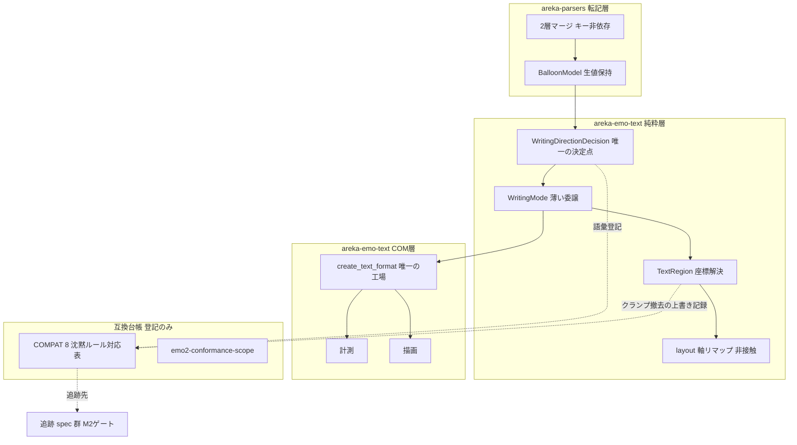
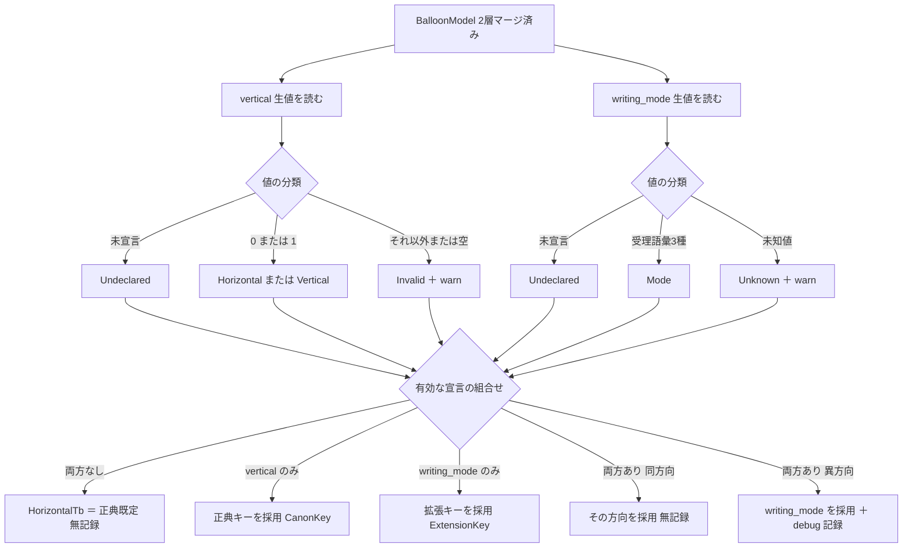
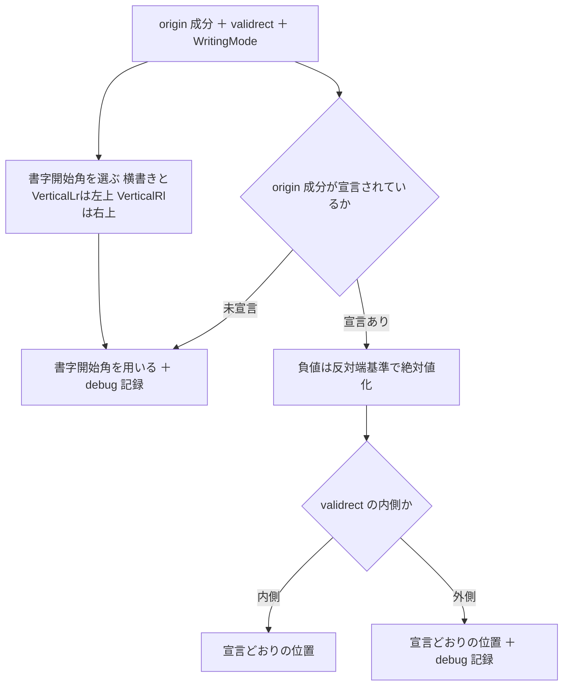
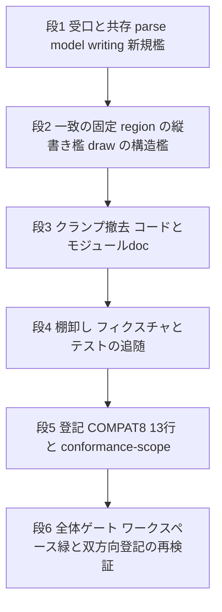

# 技術設計書: areka-P0-balloon-vertical-canon

## Overview

**Purpose**: 本仕様は、SSP 2.8.80／2.8.83 が確立したバルーン縦書きの正典を areka が第一級で受けられるようにする。SSP 向けに `vertical,1` を書いたバルーンが areka でも縦書きで表示され、areka の自前拡張キー `writing_mode` と共存し、既に正典と一致している座標意味論が黙って壊れない状態になる。

**Users**: バルーン作者（既存の伺かエコシステム資産を areka へ持ち込む側／移行期に両方で動く書き方を求める側）と、areka の保守者（「どれが SSP でどれが areka の判断か」を 1 箇所で引きたい側）。

**Impact**: 現在 `vertical` キーは解析されず黙って無視される。本仕様の着地後、`vertical` は生値として転記され、`writing_mode` と併せて **書字方向の解決という 1 つの決定点** で裁定される。同時に、正典に存在しない areka 独自の「origin クランプ正準」が撤去され、宣言された `origin` は validrect の内外を問わず宣言どおりの位置として用いられる。それ以外のレイアウト機構（軸リマップ・折返し軸選択・列送り・DirectWrite の方向設定）は 1 ビットも変えない。

### Goals

- SSP 正典キー `vertical,0/1` を転記層で受け、書字方向の解決へ統合する（1.1〜1.8）。
- `vertical` と `writing_mode` の共存規則を **単一の決定点** に集約し、正典の再改訂（SC14）に対する追随点を 1 箇所へ保つ（2.1〜2.8）。
- 正典と既に一致している縦書き座標意味論を決定論テストで固定し、一致していない 1 点（origin クランプ正準）を正典側へ是正する（3.1〜3.11）。
- 実装しない正典語彙（`\_l`／`\f` 系／下線／矢印／プロパティ族）を、完全な語彙・採った前提・追跡先とともに `doc/COMPAT_ARCHITECTURE.md` §8 へ登記する（4／5／7／8／9.3／9.4／11／12）。
- 成功基準: ワークスペース全体のテストが緑（10.8）・追跡先 spec への双方向登記が実在確認済み（4.5／7.5／8.4）・実行時の挙動変化は「`vertical` の受理」と「宣言 origin の字義解決」の 2 点だけに限局する（**この限局は、validrect 外 origin を宣言する既存資産——実ゴースト定義 `emo2-kakukaku` を含む——を正典推奨形〔宣言削除・表示不変〕へ是正して初めて成立する**——2026-08-28 討議 #1）。

### Non-Goals

- **`\_l[x,y]` の実装全般**（負値解禁・`%`・`@` 相対・縦書き座標系の是正）。`layout.rs` のカーソル経路には一切触れない（4.4）。
- **プロパティの実装全般**。sylphya へ 1 行も足さず、`currentghost.*` の照会挙動も変えない（7.4）。語彙表（`GENERIC_PROP_NAMES` ほか件数錠）は非接触＝`scope-zorder-pinning` との行隣接は発生しない。
- **`\f` 系文字装飾・下線・矢印画像の実装**。縦書き写像の語彙登記のみを行う（5.6）。
- **会話中の書字方向切替**（9.4）・`vertical_lr` の正典化（SSP に対応物なし）・budoux との相互作用の拡張。
- 縦書きの品質向上（縦中横・ルビ等）。

---

## Boundary Commitments

### This Spec Owns

- **バルーン定義における `vertical` キーの転記**（`areka-parsers::balloon`）——生値の保持と、未宣言／宣言の区別。
- **書字方向の解決という決定そのもの**（`areka-emo-text::writing`）——2 キーの共存規則・優先順位・警告水準・`.vertical` の導出規則（語彙）。本仕様の着地後、「このスコープはどちら向きに書くのか」を答える権威はこの 1 点だけである。
- **`TextRegion` の描画開始点の解決規約**（`areka-emo-text::region`）——宣言された `origin` を字義どおり用いること、未宣言時の書字開始角への縮退、validrect 外宣言の DEBUG 記録。
- **縦書き座標意味論の正典適合の証跡**——`origin.x`＝1 列目右端／`origin.y`＝字送り開始／`wordwrappoint.y` 折返し／`wordwrappoint.x` 不参照／`validrect` 不変／負値＝反対端基準を固定する決定論テスト。
- **縦書きフィクスチャ 2 種**（正典キー版・拡張キー版）とその同値性。
- **repo 全域のバルーン定義ファイルにおける validrect 外 `origin` 宣言の正典適合**（2026-08-28 設計討議 #1 で裁定＝境界拡張）——`crates/pilot/**` の実ゴースト定義**データファイル**を含む。コード（`emo2_boot` 等）には触れない。
- **バルーン縦書きに関する互換台帳の登記**（`doc/COMPAT_ARCHITECTURE.md` §8）と、`doc/emo2-conformance-scope.md` の陳腐化是正。
- **SSP 仕様への疑義 SC1〜SC15 の保持**と、areka が採った前提の明示。

### Out of Boundary

- `crates/areka-emo-text/src/layout.rs` の **カーソル経路**（`\_l` の座標解決・単位・縮退表）——`areka-P0-cursor-tag-canon` が全語彙を一括所有する。本仕様は同ファイルの**モジュール doc の 1 行**（クランプ正準への言及）以外を触らない。
- `crates/areka-sylphya/**` の**全域**——プロパティの実導出・語彙表・件数錠。`areka-P0-currentghost-property-tree`／`areka-P0-property-query-channels`／`areka-P0-property-catalog-lists` が所有する。
- `\f[align]`／`\f[valign]`／下線の**実装**——`areka-P0-text-decoration-canon` が所有する（SC1 の採択は本仕様が確定させ、同 spec は再審議せず継承する）。
- `arrow0`／`arrow1` の**画像と座標の実導出**——`areka-P0-balloon-canon-residue` 項目 1 の第 3 軸が所有する。
- `crates/areka/src/emo2_boot/**`・`placement/**`・`presenter/**`——本仕様は非接触（W6.95 同居 3 本とのファイル素を保つ）。**`crates/pilot/**` のコードも非接触**（触るのは上記境界拡張のとおり実ゴースト定義**データファイル 2 件**＝`emo2-kakukaku/descript.txt` と `emo2-kakukaku-wplimit/descript.txt` の origin 宣言 各 2 行のみ。**2 件目は 2026-08-28 のタスク 4.1 棚卸しで判明**——下記 C9 の訂正を参照）。
- **完了 spec のアーカイブ本体**（`.kiro/specs/completed/areka-P0-emo-text-layer/**`）——非改変。上書きの事実は COMPAT §8 と本書に記録する（後述 DD4）。

### Allowed Dependencies

- `areka-parsers::balloon`（`BalloonModel`・`parse`／`parse_str`）——`areka-emo-text` からの**片方向**依存。逆流禁止。
- `areka-emo-text` 内の層規律（純粋層 → COM 層 → 結線層）を維持する。`writing.rs`／`region.rs` は純粋層＝`windows` 系 crate への依存を持たない（`lib.rs` の構造檻が強制）。
- `log-capture-kit`（`areka-emo-text` の dev-dependency として既在）——ログ水準の観測に用いる。**`areka-parsers` へは追加しない**（DD2）。
- `tracing`（既存）。新規の外部依存は 0。

### Revalidation Triggers

以下が起きたとき、下流・並走 spec は統合を再確認すること。

| 変化 | 再確認が要る先 |
|---|---|
| `WritingDirectionDecision` の公開面（採用キー・`vertical` 相当値の導出規則）の変更 | `areka-P0-currentghost-property-tree`（`.vertical` の導出規則を本仕様参照で収載済み） |
| `TextRegion::start` の解決規約の再変更 | `areka-P0-cursor-tag-canon`（`\_l[0,0]` と `origin.x` の一致は本仕様のクランプ撤去に従属する・SC15） |
| SSP が縦書きの座標意味論を再改訂（SC14） | 追随点は `WritingDirectionDecision::resolve` と `TextRegion::resolve` の 2 関数のみ。COMPAT §8 の該当行も同時に改訂する |
| `doc/COMPAT_ARCHITECTURE.md` §8 への行追加 | `areka-P0-scope-zorder-pinning`（同ウェーブで §8 末尾へ追記予定＝隣接行マージ） |
| `BalloonModel` の追加フィールド方針の変更（`new()` 署名を伸ばす形へ回帰） | ワークスペース全 30 呼出箇所（本設計は additive ビルダーで 0 波及に保つ） |

---

## Architecture

### Existing Architecture Analysis

2026-08-27 の実測で確定した既存構造（file:line は着手時に再検証すること）。

| 層 | 実形 | 本仕様への含意 |
|---|---|---|
| 転記層 `areka-parsers/src/balloon/parse.rs`（161 行） | 2 層マージは `descript.clone()` へ image 側を `insert` するだけの**キー非依存**実装（:40-57）。網羅 match も件数定数も無い | `vertical` の 2 層マージ後勝ち（1.5）は**追加コード 0** で成立する |
| 同 `model.rs`（496 行） | `BalloonModel::new` は 7 位置引数・**ワークスペース 30 呼出箇所**（本番は `parse.rs:142` の 1 箇所のみ・残 29 はテスト/テスト支援）。additive ビルダー `with_cursor`／`with_windowposition_raw` が「既存呼出側は `new` のまま不変」と doc で宣言 | 第 3 のビルダー `with_vertical_raw` を足せば呼出箇所の変更は 0（1.8） |
| 同 | `WindowPositionRaw::limit_raw` が「0/1 の生値を解釈せず・警告せず保持し、検証は下流」の先例 | `vertical,0/1` の「未宣言と宣言の区別」（1.4）はこの先例と同型 |
| 解決層 `areka-emo-text/src/writing.rs`（224 行） | `WritingMode::resolve(&BalloonModel) -> WritingMode` は 1 入力の全域 match（:63-77）。未知値は `warn!` ＋横書き縮退。**本番呼出は `actor.rs:153` の 1 箇所のみ**（他 13 はテスト） | 2 入力化の波及は本番 1 箇所。既存 13 呼出箇所は戻り値型を保てば無改変 |
| 同 | 同ファイル内テストが `log-capture-kit::count_levels` で warn 件数を逐語固定（`resolve_counting_warns`） | 新しい警告・DEBUG の観測資産がそのまま使える（DD2） |
| 領域層 `region.rs`（721 行・テストはインライン） | 書字開始角は `HorizontalTb`／`VerticalLr`＝`(left, top)`・`VerticalRl`＝`(right, top)`（:212-215）。折返し軸は縦書きが `wordwrappoint.y` のみの網羅 match（:232-239）＝`wordwrappoint.x` は**型で不参照が保証**される。負値＝反対端は `resolve_coord`（:284-286） | 3.1〜3.7 は既に正典と一致。仕事は**固定**であって実装ではない |
| 同 | `clamp_origin_component`（:302-331）が宣言済みでも validrect 外の origin 成分を書字開始角へ寄せる。**正典に存在しない areka 独自規約** | 3.10 の撤去対象。呼出は :216／:223 の 2 箇所のみ・private・crate 外露出なし |
| 描画層 `draw.rs`（974 行） | `DirectionRecipe::for_mode`（:253-274）は**本番で唯一 `create_text_format`（:302-331）からのみ呼ばれる**。計測（`DWriteMetrics::new` :393）も描画（`viewbox_draw.rs:522/:527`）も同じ format 工場を通り、キャッシュ鍵に `WritingMode` を含む | 6.4（計測と描画で方向が食い違わない）は**構造的に成立済み**。仕事は構造檻で固定すること |
| 起動結線 `areka/src/emo2_boot/assets.rs` | スコープごとの `BalloonModel` は起動時に一度解決して `BalloonScopeAssets.model` へ記憶する | 9.2（会話中に書字方向が変わらない）は既存構造の帰結＝コード変更 0 |

**技術的負債の扱い**: origin クランプ正準は完了 spec `areka-P0-emo-text-layer` の design.md（:464 と :716 の 2 箇所）が正典と称しており、`region.rs:24-27` のモジュール doc がそこを指している。要件段階の裁定（3.10）でこの規約は撤去される。アーカイブは非改変とし、上書きの事実を COMPAT §8 と本書へ記録する（DD4）。

### Architecture Pattern & Boundary Map

**選定パターン**: **単一決定点への集約**（Option B・research.md §4 の推奨形を設計フェーズで採択）。書字方向に関する 4 つの要件群（正典キーの受理・拡張キーとの共存・プロパティ導出規則・正典再改訂への追随）を、`WritingDirectionDecision` という 1 つの純粋関数の戻り値へ畳む。



**Architecture Integration**:

- **選定パターン**: 単一決定点への集約。理由は 3 つ——⑴ 2.5／2.6 の優先順位と層マージの分離が**型で保証**される（規約に頼らない）、⑵ 7.1 の「実際に適用されている書字方向から導く」が同じ戻り値から引けるため二重定義が生まれない、⑶ SC14（正典の再改訂）に対する追随点が 1 関数に留まる——これは要件の Adjacent expectations が明示的に期待した性質である。
- **責務の分離**: 転記層は**解釈も警告もしない**（既存の無警告契約を維持）。解決層が語彙判定・警告・優先順位のすべてを持つ。領域層は書字方向を**受け取るだけ**で、キーの存在を知らない。
- **保たれる既存パターン**: 2 層マージのキー非依存性／additive ビルダー／生値転記（`limit_raw` 先例）／`count_levels` によるログ件数の逐語固定／単一 format 工場／純粋層の `windows` 非依存。
- **新規コンポーネントの根拠**: 新設は `WritingDirectionDecision` とその補助 enum 2 つ、および `with_vertical_raw` の 1 メソッドのみ。それ以外はすべて既存資産の再利用である。
- **Steering 準拠**: `parser は転記層・解釈は下流`（`structure.md`）／`log-first・無言の失敗経路を作らない`（`logging.md`）／`檻に入れるのは判断分岐のみ`／`1 ファイル 1,000 行`／`新規テストモジュールは兄弟ファイルへ`。

### 設計判断（DD1〜DD9）

| # | 判断 | 採った形 | 根拠・却下した案 |
|---|---|---|---|
| **DD1** | 書字方向の解決の形 | **決定記録型 `WritingDirectionDecision` を新設**し、`WritingMode::resolve` はその `.mode()` を返す薄い委譲へ縮小する | Option A（`resolve` に 2 キー分岐を直接足す）は 2.6 の「層とキーの優劣を混ぜない」が規約でしか担保されず、7.1 の導出点が離れる。Option B を採ると既存 13 呼出箇所は**戻り値型が変わらないため無改変**で済む（本番 1・テスト 13 の波及がゼロになる） |
| **DD2** | 警告の主体 | **解決層（`writing.rs`）に置く**。転記層は無警告のまま | `areka-parsers` は無警告契約を明文で持ち（`parse.rs:75-78`・`parse_tests.rs:284-301` が固定）、`log-capture-kit` を dev-dependency に持たない＝**そこへ警告を置くと 10.6 の決定論テストで観測できない**。解決層には既存の警告と `count_levels` 観測資産が揃っている。要件の層の注記（requirements.md :75）と一致 |
| **DD3** | `BalloonModel` への追加方法 | **additive ビルダー `with_vertical_raw`**（`new()` の署名は 7 引数のまま） | 署名を伸ばす案（`budoux_newline` の先例）は 30 呼出箇所へ `None` 追記が波及する。ビルダー案は `with_cursor`／`with_windowposition_raw` の 2 先例があり、model.rs の doc が「互換な経路」と明記している。1.8（既存解析結果を 1 つも変えない）にも直結する |
| **DD4** | クランプ撤去の追随先 | **アーカイブ済み `emo-text-layer` の design.md は非改変**とし、⑴ 生きているモジュール doc（`region.rs:3/:24-27/:177/:189/:211/:271`）を本仕様へ指し直す ⑵ COMPAT §8 へ上書き行を追加し、上書きした出所（`completed/areka-P0-emo-text-layer/design.md:464` と `:716`）を名指しする | repo に**同型の先例が 2 件**ある（§8 :147 が `position-persist` R2.2／R8.5 を、:153 が `window-placement` R2.9 を上書き）。いずれも「アーカイブ済み spec は非改変とし、上書きの事実を本表と現行 spec に記録する」と明記しており、:153 が行の雛形になる。なお **`emo-text-layer` の requirements.md にはクランプを定める受入基準が 1 つも無い**（2026-08-27 実測・grep 0 件）——撤去はどの承認済み AC とも矛盾しない |
| **DD5** | 既存の validrect 外 `origin` 宣言の扱い | **正典推奨形（宣言削除）へ揃えるのを既定とする**。テストの意図が「宣言された origin」そのものである場合に限り、宣言を残して期待値を字義位置へ更新する | クランプが効いていた箇所は、いずれも「未指定に任せれば同じ位置になる」形である（`emo2-vertical` は origin 削除で開始点 (356,46) 不変・`emo2-choice/descript-cursor.txt` は削除で (5,5) 不変）。正典は「通常は指定せず validrect の定義に任せる」と述べており、フィクスチャを正典推奨形へ直すのは要件 10.9 が既に命じた形の一般化である |
| **DD6** | 不正な `vertical` 値と共存規則の関係 | 不正値・空値の `vertical` は **警告のうえ「指定なし」として共存規則へ渡す**（2.7 の `writing_mode` 未知値と対称） | 1.6 を字義どおり「横書きの宣言へ縮退」と読むと、`vertical,2` ＋ `writing_mode,vertical_rl` の組で「不一致の併記」となり 2.5 の DEBUG 記録が出る。両読みとも**最終的な `WritingMode` は同一**（`writing_mode` が勝つ）であり、差は記録の有無だけである。対称形を採ると規則が 1 本になり、値が壊れている側について「両者の値」を DEBUG に残す意味も無くなる。1.6 が要求する警告と横書き縮退（他方が無い場合）は満たされる |
| **DD7** | `.vertical` の導出規則の表し方 | **決定記録の純関数メソッド `vertical_property_value()` として確定**する。publish も語彙表登録も照会経路も作らない | 7.1 は「当該スコープに実際に適用されている書字方向から導く」と定める。散文だけで残すと後続が規則を読み直すことになり、`vertical_lr` も 1（正典語彙は縦横 2 値）という非自明な点が落ちる。純関数なら決定論テストで固定でき、sylphya には 1 行も触れない＝7.4（プロパティ解決の挙動不変）を破らない |
| **DD8** | 追跡先の双方向登記の検証方法 | **着手時と完了時の 2 回、実在確認＋項目列挙の突合を行う**（tasks の検査項目として持つ）。spec 文書を `include_str!` で読む檻は**作らない** | 檻を作らない理由は 2 つ——⑴ 追跡先 4 本はいずれも M2 ゲートで brief が requirements へ置き換わるため、行の逐語固定は偽の赤を生む ⑵ 文書間の登記は文書で検査するのが正しい。**（是正 2026-08-27・バリデーション重大 3）** 当初根拠に引いた「`/kiro-complete` のアーカイブ移動が spec 文書読みを壊す穴」は 2026-08-22 に skill 側で是正済み（ステップ 5-2 ソース全域 grep・5-3 仕分け・7-2 移動後テストゲート・DoD 登載）のため根拠から外した。代償として ⑴ §8 追記 13 行の**項目名一覧を tasks.md の完了条件へ逐語で持たせる** ⑵ 双方向登記表は**着手時に加えて完了時にも**引き直す（追跡先 brief は同ウェーブ中に動きうる） |
| **DD9** | フィクスチャの構成 | **`emo2-vertical-canon/` を新設**し、既存 `emo2-vertical/` との差分を `writing_mode,vertical_rl` → `vertical,1` の 1 行だけに保つ。両者が**同一の `WritingMode` と同一の `TextRegion`** を与えることを檻にする | 10.2（正典キー版と拡張キー版が同一の表示結果）を最も直接に観測できる形。既存フィクスチャは画像を共有フィクスチャから借りる 2 ファイル構成なので複製費用が小さい。両キー併記・不一致・未知値（10.3）は in-code モデルの方が網羅しやすいためフィクスチャ化しない |

### Technology Stack

| Layer | Choice / Version | Role in Feature | Notes |
|-------|------------------|-----------------|-------|
| 転記層 | `areka-parsers`（workspace 内・Rust 2024） | `vertical` の生値転記と 2 層マージ | 新規依存 0。`log-capture-kit` は**追加しない**（DD2） |
| 純粋層 | `areka-emo-text::writing` / `::region` | 書字方向の決定・座標解決 | `windows` 系非依存を `lib.rs` の構造檻が強制 |
| COM 層 | DirectWrite（`windows` 0.62.2 経由） | 縦組みのネイティブ実現（`DWRITE_READING_DIRECTION_TOP_TO_BOTTOM` ＋ `DWRITE_FLOW_DIRECTION_RIGHT_TO_LEFT`） | 6.2 のとおり `@` フォント機構は用いない。既存 `DirectionRecipe` を再利用し改変しない |
| ログ | `tracing`（workspace） | `warn!`／`debug!` の 2 水準 | 水準の割当は Error Handling 節の表が正本 |
| テスト | 素の `#[test]` ＋ `log-capture-kit::count_levels` | 決定論檻・ログ件数の逐語固定 | 実 DPI・実 GPU・実窓を要さない（10.6） |
| 台帳 | `doc/COMPAT_ARCHITECTURE.md` §8（Markdown 表・テスト保護なし） | 裁量と語彙の登記 | 48 データ行（:128-175）の**末尾へ追記**。`scope-zorder-pinning` と隣接行マージが起きうる |

---

## File Structure Plan

### Directory Structure（新規ファイル）

```
crates/areka-emo-text/
├── src/
│   ├── writing_decision_tests.rs         # 新規: 共存規則・警告水準・.vertical 導出規則の檻
│   └── region_vertical_canon_tests.rs    # 新規: 縦書き座標意味論と origin 正典化の檻
├── tests/
│   └── shipped_fixture_region_test.rs    # 新規: 実ゴースト定義（emo2-kakukaku）の開始点 (36,46)/(24,40) を逐語固定（2026-08-28 討議 #1）
└── examples/fixtures/
    └── emo2-vertical-canon/              # 新規: 正典キー版フィクスチャ
        ├── descript.txt                  # emo2-vertical との差分は vertical,1 の 1 行のみ
        └── balloons0s.txt                # 面別上書き層（既存版と同内容）
```

> 新規テストモジュールは兄弟ファイルへ置き、本番ファイル側にはパス属性つきの接続宣言だけを残す（`structure.md` Unit Tests 規約）。命名は `<stem>_<モジュール名>.rs`＝`writing` + `decision_tests`／`region` + `vertical_canon_tests`。同一ディレクトリに `writing_*.rs`／`region_*.rs` の本番ファイルは存在しないため、逆向き導出も一意である。

### Modified Files

| ファイル | 変更内容 | 要件 |
|---|---|---|
| `crates/areka-parsers/src/balloon/parse.rs` | `merged.get("vertical")` の生値転記を `writing_mode`（:110）の隣へ 1 行追加し、末尾のビルダー鎖へ `.with_vertical_raw(...)` を足す。**マージ関数は非改変** | 1.4, 1.5, 1.8, 2.6 |
| `crates/areka-parsers/src/balloon/model.rs` | 追加フィールド `vertical_raw: Option<String>`・ビルダー `with_vertical_raw`・アクセサ `vertical_raw()`。`new()` の署名は非改変 | 1.4, 1.8 |
| `crates/areka-parsers/src/balloon/parse_tests.rs` | `vertical` の 4 形（単層／後勝ち／未指定 `None`／語彙外素通し）を既存 `writing_mode` テスト（:315-356）と同型で追加 | 1.4, 1.5, 10.4 |
| `crates/areka-parsers/src/balloon/model_tests.rs` | `with_vertical_raw` の additive 性（既定は未宣言）と、未宣言／`"0"` 宣言の区別 | 1.4, 1.8 |
| `crates/areka-emo-text/src/writing.rs` | `WritingDirectionDecision`＋補助 enum を新設。`WritingMode::resolve` は `.mode()` を返す委譲へ。既存インライン `mod tests` は非改変。末尾へ新規兄弟テストの接続宣言 `#[cfg(test)] #[path = "writing_decision_tests.rs"] mod decision_tests;` を追加 | 1.1〜1.3, 1.6, 1.7, 2.1〜2.7, 7.1 |
| `crates/areka-emo-text/src/region.rs` | `clamp_origin_component` を `resolve_origin_component` へ改称し、`Some` 腕の「書字開始角へ寄せる」分岐を**記録のみ**へ置換。`None` 腕と `start_corner` の match は非改変。モジュール doc（:3・:24-27）と派生 doc（:177・:189・:211・:271）を本仕様の規約へ書き換え。インラインテストのうち期待値が反転する 5 件を DD5 に従い是正。末尾へ新規兄弟テストの接続宣言 `#[cfg(test)] #[path = "region_vertical_canon_tests.rs"] mod vertical_canon_tests;` を追加（既存インライン `mod tests` は名前が異なるため併存する） | 3.1〜3.3, 3.7, 3.10, 3.11, 10.7 |
| `crates/areka-emo-text/src/layout.rs` | **モジュール doc :29 の 1 行のみ**（「描画開始点（origin クランプ正準）」→ 宣言どおり解決された開始点）。コードは非接触 | 3.10, 4.4 |
| `crates/areka-emo-text/src/lib.rs` | 構造檻 `pure_layer_modules_have_no_windows_imports` の `PURE_SOURCES` へ新規兄弟テスト 2 本を追加（`structure.md`「include_str! で本文を読む構造テストは兄弟テストファイルも走査対象に列挙する」） | 10.7 |
| `crates/areka-emo-text/src/draw_format_metrics_tests.rs`（469 行） | 6.1〜6.4／6.6 の檻を追加。**`draw.rs`（974 行・上限まで 26 行）へは 1 行も足さない** | 6.1〜6.4, 6.6 |
| `crates/areka-emo-text/tests/vertical_fixture_test.rs`（151 行） | 正典キー版フィクスチャの読み込みと、拡張キー版との `WritingMode`／`TextRegion` 同値の檻を追加。:117 の `assert_eq!(region.start(), (356.0, 46.0))` は**フィクスチャ側の origin 宣言削除により不変** | 10.1, 10.2, 10.9 |
| `crates/areka-emo-text/examples/fixtures/emo2-vertical/descript.txt` | :15-16 の `origin.x,0`／`origin.y,0` を削除（正典推奨形） | 10.9 |
| `crates/areka-emo-text/tests/fixtures/emo2-choice/descript-cursor.txt` | :18-19 の origin 宣言を削除し、:17 のコメントからクランプ正準の記述を除去（開始点 (5,5) は不変） | 3.10, 10.7 |
| `crates/areka-emo-text/tests/fixtures/emo2-choice/descript-plain.txt` | :17-18 の origin 宣言を削除（開始点 (5,5) は不変・2026-08-28 討議 #1 追加） | 3.10, 10.7 |
| `crates/pilot/examples/shiori-host-32/fixtures/emo2/emo2-kakukaku/descript.txt` | :13-14 の `origin.x,0`／`origin.y,0` を削除（既定縮退が同じ開始点を与えるため表示不変・**データファイルのみ・pilot のコードは非接触**・2026-08-28 討議 #1 の境界拡張） | 3.10, 10.7, 10.9 |
| `crates/areka-emo-text/tests/shipped_fixture_region_test.rs`（新規） | 実ゴースト定義（emo2-kakukaku）の 2 層マージ→`TextRegion` 解決で開始点 sakura (36,46)／kero (24,40) を逐語固定（現在この観測点は 0 本＝全緑のまま壊れる唯一の穴を塞ぐ） | 3.10, 10.7 |
| `crates/areka-emo-text/src/viewbox_draw_test_support.rs`（:93-96） | 「クランプ正準」の語を「未指定時の縮退」へ改める（挙動は `None` 経路で不変） | 3.11, 10.7 |
| `crates/areka-emo-text/tests/draw_readback_test.rs`／`tests/scale_invariance_test.rs`／`tests/pipeline_test.rs`／`src/layout_wrap_tests.rs`／`src/draw_oracle_tests.rs`／`src/canvas.rs` の該当行 | クランプ正準に言及する doc／assert メッセージの是正と、DD5 に従う origin 宣言の棚卸し。**validrect が画像端に一致する檻はクランプが無操作のため文言のみ** | 3.10, 10.7 |
| `doc/COMPAT_ARCHITECTURE.md` | §8 の 48 データ行（:128-175）の**末尾へ 13 行を追記**（Data Models 節の登記台帳が正本） | 4, 5, 6.5, 7, 8, 9.3, 9.4, 11, 12 |
| `doc/emo2-conformance-scope.md` | :85 の「縦書きを M2 へ後ろ倒し」を本仕様（M1・W6.95）へ追随。:61 の適合スコープ判断（痕跡なし・適合 14 項目に不要）は**変更しない**。:60 の `\f[]` に文字装飾系 3 spec の所有確定への参照を添える | 11.9 |
| `.kiro/steering/roadmap.md` | ウェーブ表の bvc 行と追記の更新（`/kiro-complete` 手順の範囲）。**クランプ正準を主張する steering は 1 件も無い**（2026-08-27 実測）ため正典改訂の追随は不要 | 3.10 |

**触らないファイル（境界の裏面）**: `crates/areka-emo-text/src/layout_cursor_tests.rs`（670 行・`\_l` の檻・無改変で緑であることが 4.4 の証跡）／`crates/areka-sylphya/**`／`crates/areka/src/emo2_boot/**`／`.kiro/specs/completed/**`／`.kiro/steering/roadmap-history.md`。

---

## System Flows

### Flow 1: 書字方向の解決（2 キーの共存規則）



**流れ上の判断**:

- **層のマージはこの図に現れない**。`BalloonModel` に届いた時点で各キーは既に後勝ちで確定しているため、2.6（層の優劣とキーの優劣を混ぜない）は分岐ではなく**構造**で満たされる。
- **不正値の合流点**（DD6）: `Invalid`／`Unknown` はいずれも「有効な宣言なし」として `Judge` へ入る。したがって `vertical,2` 単独は `DefH` へ落ち（1.6 の横書き縮退）、`vertical,2` ＋ `writing_mode,vertical_rl` は `UseW` へ落ちる（2.7 と対称）。
- **記録水準の非対称**は意図的である。値が壊れているのは作者の誤りだから `warn!`、矛盾併記は areka を知る作者の意図的な状態だから `debug!`（要件の裁定 1）。

### Flow 2: 描画開始点の解決（origin 正典化）



**流れ上の判断**: 変わるのは `Range` の外側の腕だけである（従来は書字開始角へ寄せていた）。`Corner` の選択と `UseCorner` の縮退は 3.11 が明示的に保存を命じており、`Neg` の反対端基準は 3.7 が横書きと同一の適用を命じている。成分は x・y が独立に判定される（既存の成分独立性を維持）。

---

## Requirements Traceability

| Requirement | Summary | Components | Interfaces | Flows |
|---|---|---|---|---|
| 1.1, 1.2, 1.3 | `vertical,1`／`0`／未宣言の表示結果 | C2 | `WritingDirectionDecision::resolve` | Flow 1 |
| 1.4 | 未宣言と宣言値の区別を保つ | C1 | `BalloonModel::vertical_raw` | — |
| 1.5 | 2 層マージ後勝ちを `vertical` にも同一適用 | C1 | `balloon::parse`（非改変） | — |
| 1.6, 1.7 | 不正値・空値は警告＋横書き縮退 | C2 | `resolve` 内 `warn!` | Flow 1 |
| 1.8 | 既存解析キーの結果を 1 つも変えない | C1 | `with_vertical_raw`（additive） | — |
| 2.1 | `writing_mode` を受理し続ける | C1, C2 | `BalloonModel::writing_mode` | Flow 1 |
| 2.2, 2.3 | 単独宣言時の写像（現行不変を含む） | C2 | `WritingModeDecl` / `VerticalDecl` | Flow 1 |
| 2.4, 2.5 | 併記の一致は無記録・不一致は拡張キー採用＋DEBUG | C2 | `WritingDirectionDecision::conflicting` | Flow 1 |
| 2.6 | 層マージを先に確定させてからキー間で裁定 | C1 | `parse` のキー非依存マージ（構造保証） | Flow 1 注記 |
| 2.7 | `writing_mode` 未知値は指定なし扱い | C2 | `WritingModeDecl::Unknown` | Flow 1 |
| 2.8 | 移行推奨形の文書化 | C7 | COMPAT §8 行 1 | — |
| 3.1, 3.2 | `origin.x`＝1 列目右端・既定 `validrect.right` | C3 | `TextRegion::resolve` | Flow 2 |
| 3.3 | `origin.y`＝字送り開始・既定 `validrect.top` | C3 | 同上 | Flow 2 |
| 3.4 | 折返しは `wordwrappoint.y`・既定 `validrect.bottom` | C4 | `TextRegion::wrap_threshold` | — |
| 3.5 | `wordwrappoint.x` を参照しない | C4 | 網羅 match（型で保証）＋差分不変の檻 | — |
| 3.6 | `validrect` の意味は横書きと同一 | C4 | `TextRegion` の 4 辺 | — |
| 3.7 | 負値＝反対端基準を縦書きでも同一適用 | C3 | `resolve_coord` | Flow 2 |
| 3.8 | 3.1〜3.7 を決定論テストで固定 | C8 | `region_vertical_canon_tests` | — |
| 3.9 | 食い違いは正典側へ是正 | C3 | 唯一の食い違い＝クランプ正準（3.10 で撤去） | Flow 2 |
| 3.10 | 宣言 origin を字義どおり用いる・範囲外は DEBUG | C3, C9 | `resolve_origin_component` | Flow 2 |
| 3.11 | 未宣言時の縮退を変えない | C3 | `start_corner` match（非改変） | Flow 2 |
| 4.1, 4.2, 4.3, 4.5, 4.6 | `\_l` 縦書き正典の語彙登記・既知非互換・追跡先の双方向登記 | C7 | COMPAT §8 行 8 ＋ 双方向登記表 | — |
| 4.4 | `\_l` の挙動を 1 ビットも変えない | C7, C8 | `layout_cursor_tests.rs` 無改変で緑 | — |
| 5.1, 5.2, 5.3, 5.4, 5.5, 5.7 | `\f[align]`／`\f[valign]`（SC1 採択）／下線／矢印の縦書き写像と追跡先 | C7 | COMPAT §8 行 6・行 7 | — |
| 5.6 | 記録によって表示結果を変えない | C7 | 文書のみ・コード非接触 | — |
| 6.1, 6.2, 6.3 | 直立グリフ・縦書き字形・`@` 非使用・フォント名非差替 | C5 | `DirectionRecipe::for_mode`（非改変） | — |
| 6.4 | 計測と描画で方向が食い違わない | C5 | `create_text_format` 単一工場＋構造檻 | — |
| 6.5 | フォント等価を areka 裁量として登記 | C7 | COMPAT §8 行 3 | — |
| 6.6 | 書字方向設定を決定論テストで固定 | C5, C8 | `draw_format_metrics_tests` | — |
| 7.1 | `.vertical` の導出規則の確定 | C2, C7 | `vertical_property_value` ＋ COMPAT §8 行 9 | Flow 1 |
| 7.2, 7.3, 7.5 | 既知の穴（枝の不在・照会経路の不在）と追跡先の双方向登記 | C7 | COMPAT §8 行 9 ＋ 双方向登記表 | — |
| 7.4 | プロパティ解決の挙動を変えない | C7 | sylphya 非接触（境界） | — |
| 8.1, 8.2, 8.3, 8.4 | 同族の 2.8.83 意味論・2.8.80 での逆転・族ごと不在・追跡先 | C7 | COMPAT §8 行 10 | — |
| 8.5, 8.6 | 値を捏造せず現行どおりの縮退 | C7 | sylphya 既定 `NotFound`（非接触） | — |
| 9.1 | 面別上書き層の `vertical` を当該スコープへ適用 | C1, C2 | 2 層マージ（キー非依存） | Flow 1 |
| 9.2 | 起動時に一度確定し会話中に変えない | C2, C7 | `BalloonScopeAssets.model`（非改変・構造帰結） | — |
| 9.3, 9.4 | SSP との差異の登記と、切替を実装しない登記 | C7 | COMPAT §8 行 4 | — |
| 9.5 | 面別上書き層の解決規則を変えない | C7 | `emo2_boot/assets.rs` 非接触（境界） | — |
| 10.1, 10.2 | 正典キー版フィクスチャと拡張キー版の同値 | C6 | `emo2-vertical-canon` ＋ `vertical_fixture_test` | — |
| 10.3 | 併記の 3 形（一致／不一致／未知値） | C8 | `writing_decision_tests` | Flow 1 |
| 10.4 | 2 層マージにおける `vertical` の後勝ち | C8 | `parse_tests` | — |
| 10.5 | 3 の座標意味論の確認（`\_l` は範囲外） | C8 | `region_vertical_canon_tests` | Flow 2 |
| 10.6 | 実 DPI・実 GPU・実窓を要さない決定論 | C8 | 純粋層檻＋DWrite 純関数 | — |
| 10.7 | 既存の縦書きテスト資産を退行させない | C9 | origin 宣言の棚卸し＋`PURE_SOURCES` 追加 | — |
| 10.8 | ワークスペース全体のテストが緑 | C9 | 完了ゲート | — |
| 10.9 | `emo2-vertical` の validrect 外 origin 宣言を是正 | C6 | フィクスチャ 2 行削除 | — |
| 11.1, 11.2, 11.3, 11.4 | `writing_mode` の登記・優先順位と理由・`vertical_lr`・移行推奨形 | C7 | COMPAT §8 行 1 | — |
| 11.5, 11.6 | フォント等価・切替非実装の登記 | C7 | COMPAT §8 行 3・行 4 | — |
| 11.7 | 正典参照の出所とスナップショット陳腐化の限局 | C7 | COMPAT §8 行 12・行 13 | — |
| 11.8 | 本仕様を出典として参照できる形 | C7 | §8 の「出典 spec」列 | — |
| 11.9 | `emo2-conformance-scope.md` の陳腐化是正 | C7 | 同 doc :85／:60 | — |
| 12.1, 12.2 | SC1〜SC15 の保持と依存する疑義番号の明示 | C7 | requirements.md 末尾（保持）＋各行の SC 参照 | — |
| 12.3, 12.4 | SC1・SC5・SC9・SC10・SC11 の COMPAT 登記 | C7 | §8 行 4〜8 | — |
| 12.5, 12.6 | 未解決と偽らない・疑義↔要件の対応を保つ | C7 | §8 の根拠列に「未解決」を明記 | — |

---

## Components and Interfaces

| Component | Domain/Layer | Intent | Req Coverage | Key Dependencies | Contracts |
|---|---|---|---|---|---|
| C1 `BalloonModel` の `vertical` 生値 | parsers 転記層 | `vertical` を解釈せず保持する | 1.4, 1.5, 1.8, 2.1, 2.6, 9.1 | なし | Service, State |
| C2 `WritingDirectionDecision` | emo-text 純粋層 | 書字方向の唯一の決定点 | 1.1〜1.3, 1.6, 1.7, 2.2〜2.7, 7.1, 9.1, 9.2 | C1 (P0) | Service |
| C3 `TextRegion` origin 正典化 | emo-text 純粋層 | 宣言 origin の字義解決 | 3.1〜3.3, 3.7, 3.9〜3.11 | C1 (P0), C2 (P0) | Service |
| C4 縦書き座標意味論の固定 | emo-text 純粋層 | 一致の証跡化 | 3.4, 3.5, 3.6, 3.8 | C3 (P0) | Service |
| C5 フォント縦書き等価の固定 | emo-text COM 層 | 計測と描画の方向一致 | 6.1〜6.4, 6.6 | C2 (P0), DirectWrite (External P0) | Service |
| C6 縦書きフィクスチャ 2 種 | テスト資産 | 正典キー版と拡張キー版の同値 | 10.1, 10.2, 10.9 | C1 (P0) | Batch |
| C7 互換台帳の登記 | 文書 | 裁量・語彙・追跡先の唯一の引き口 | 4, 5, 6.5, 7.2〜7.5, 8, 9.3〜9.5, 11, 12 | 追跡 spec 4 本 (P1) | — |
| C8 決定論テスト網 | テスト | 判断分岐の網羅 | 3.8, 4.4, 6.6, 10.3〜10.6 | C2, C3, C5 (P0) | — |
| C9 クランプ撤去の追随 | 移行 | 既存資産の非退行 | 3.10, 10.7, 10.8 | C3 (P0) | — |

### parsers 転記層

#### C1 `BalloonModel` の `vertical` 生値

| Field | Detail |
|---|---|
| Intent | SSP 正典キー `vertical` を解釈も警告もせず生値のまま保持する |
| Requirements | 1.4, 1.5, 1.8, 2.1, 2.6, 9.1 |

**Responsibilities & Constraints**

- `merged.get("vertical")` の結果を `Option<String>` としてそのまま保持する。`0`／`1` の検証・語彙判定・縮退は**行わない**（既存の転記層契約・`WindowPositionRaw::limit_raw` と同型）。
- 未宣言（`None`）と宣言（`Some(_)`・`Some("")` を含む）を潰さない。前後空白は kv 層で除去済みであり、転記層は追加の整形をしない。
- 2 層マージは**キー非依存**の既存実装をそのまま用いる。`vertical` のためのマージ改変は 0 行である。
- `BalloonModel::new` の署名は非改変。追加は additive ビルダー経由に限る（既存 30 呼出箇所へ波及させない）。

**Dependencies**: Inbound: `balloon::parse`（P0）。Outbound: なし。External: なし。

**Contracts**: Service [x] / State [x]

##### Service Interface

```rust
impl BalloonModel {
    /// SSP 正典キー `vertical` の生文字列（未指定は `None`）。
    /// `0`/`1` の検証と語彙外値の縮退は下流（書字方向の解決）の責務であり、ここでは判定しない。
    pub fn vertical_raw(&self) -> Option<&str>;

    /// additive 追加（`with_cursor` / `with_windowposition_raw` 流儀・既存呼び出し側は `new` のまま不変）。
    pub fn with_vertical_raw(self, vertical_raw: Option<String>) -> Self;
}
```

- Preconditions: 入力は 2 層マージ済みの KV から取得した値であること。
- Postconditions: `vertical_raw()` は転記元の文字列と逐語一致する。他の全アクセサの戻り値は本変更の前後で同一。
- Invariants: 転記層はログを 1 件も発行しない。

**Implementation Notes**
- Integration: `parse.rs` の `writing_mode`／`budoux_newline` と同じ生値転記クラスタ（現 :108-113）へ 1 行、末尾のビルダー鎖（現 :151-152）へ 1 行。
- Validation: `parse_tests.rs` の `writing_mode` 4 形（:315-356）を `vertical` へ複写した 4 テスト。`model_tests.rs` に additive 既定値のテスト。
- Risks: なし（追加のみ・既存経路は不変）。

### emo-text 純粋層

#### C2 `WritingDirectionDecision`

| Field | Detail |
|---|---|
| Intent | 「このスコープはどちら向きに書くのか」を答える唯一の決定点であり、その決定の根拠も同時に持つ |
| Requirements | 1.1, 1.2, 1.3, 1.6, 1.7, 2.2, 2.3, 2.4, 2.5, 2.6, 2.7, 7.1, 9.1, 9.2 |

**Responsibilities & Constraints**

- 2 キーそれぞれを**独立に分類**したうえで、確定した 2 つの分類の間で優先順位を裁定する。層マージには一切関与しない（既に確定済みのため）。
- 優先順位は **`writing_mode`（areka 拡張キー）が `vertical`（正典キー）に勝つ**（要件の裁定 1）。両者が同じ方向を意味するときは記録しない。
- 記録水準は Error Handling 節の表が正本。値の破損は `warn!`、意図的な矛盾併記は `debug!`。
- `.vertical` の導出規則（7.1）を**純関数として保持する**。値の publish・語彙表登録・照会経路の新設は行わない（sylphya 非接触）。
- 本型は `ResolvedBalloonText` へ**配線しない**。現時点で消費者が居ないため、投機的な抽象を作らない（消費者が現れたときに additive で足せる）。

**Dependencies**: Inbound: `WritingMode::resolve`（P0）／将来の `currentghost-property-tree`（P2・語彙参照のみ）。Outbound: `BalloonModel`（P0）。External: `tracing`（P1）。

**Contracts**: Service [x]

##### Service Interface

```rust
/// 正典キー `vertical` の宣言の分類（未宣言・不正値を潰さない）。
#[derive(Clone, Copy, PartialEq, Eq, Debug)]
pub enum VerticalDecl {
    /// キーが無い。
    Undeclared,
    /// `0`＝横書きの宣言。
    Horizontal,
    /// `1`＝縦書きの宣言。
    Vertical,
    /// `0`/`1` 以外または空文字列（警告済み・共存規則では「指定なし」として扱う）。
    Invalid,
}

/// areka 拡張キー `writing_mode` の宣言の分類。
#[derive(Clone, Copy, PartialEq, Eq, Debug)]
pub enum WritingModeDecl {
    Undeclared,
    Declared(WritingMode),
    /// 受理語彙外（警告済み・「指定なし」として扱う・要件 2.7）。
    Unknown,
}

/// どちらの宣言を採ったか。
#[derive(Clone, Copy, PartialEq, Eq, Debug)]
pub enum DirectionSource {
    /// 有効な宣言が無く正典既定（横書き）を用いた。
    CanonDefault,
    /// 正典キー `vertical` を採った。
    CanonKey,
    /// areka 拡張キー `writing_mode` を採った（矛盾併記の解決を含む）。
    ExtensionKey,
}

/// 書字方向の決定と、その決定の記録（正典再改訂に対する唯一の追随点）。
#[derive(Clone, Copy, PartialEq, Eq, Debug)]
pub struct WritingDirectionDecision { /* 非公開フィールド */ }

impl WritingDirectionDecision {
    /// 2 層マージ済み `BalloonModel` から解決する（副作用はログのみ）。
    pub fn resolve(model: &BalloonModel) -> WritingDirectionDecision;

    /// 実際に適用される書字方向。
    pub fn mode(&self) -> WritingMode;
    /// 採用した宣言の出所。
    pub fn source(&self) -> DirectionSource;
    /// 正典キーの宣言の分類。
    pub fn vertical_declaration(&self) -> VerticalDecl;
    /// 拡張キーの宣言の分類。
    pub fn writing_mode_declaration(&self) -> WritingModeDecl;
    /// 双方が有効に宣言され、かつ異なる方向を意味していたか。
    pub fn conflicting(&self) -> bool;

    /// 正典プロパティ `currentghost.balloon.scope(ID).vertical` の導出規則（要件 7.1・**語彙**）。
    /// 縦書き（`vertical_rl` / `vertical_lr` の双方）で `1`、横書きで `0`。
    /// 本仕様はこの値を publish しない（プロパティの実導出は追跡 spec が所有する）。
    pub fn vertical_property_value(&self) -> u8;
}

impl WritingMode {
    /// 既存 API（戻り値型不変）。`WritingDirectionDecision::resolve(model).mode()` へ委譲する。
    pub fn resolve(model: &BalloonModel) -> WritingMode;
}
```

- Preconditions: `model` は 2 層マージ済みであること（`parse` の戻り値）。
- Postconditions: `mode()` は Flow 1 の決定木と一致する。`vertical_property_value()` は `mode()` から一意に定まる（`HorizontalTb` → 0、それ以外 → 1）。
- Invariants: ⑴ 同一入力に対し戻り値もログ件数も同一（決定論）。⑵ 有効な宣言が 1 つも無い経路ではログを 1 件も発行しない（既存 `missing_marker_defaults_to_horizontal_tb` が warn 0 を固定している）。⑶ `writing_mode` 単独指定時の結果は現行と 1 ビットも変わらない（2.3）。

**Implementation Notes**
- Integration: 本番の唯一の呼出は `actor.rs:153`（`WritingMode::resolve`）。戻り値型を保つため**同ファイルは非改変**。
- Validation: 新規兄弟テスト `writing_decision_tests.rs`。既存インライン `mod tests`（warn 件数の逐語固定を含む）は非改変で緑であること＝2.3 の証跡。
- Risks: 既存テストが `warn` 件数を厳密一致で見ているため、`vertical` 未宣言経路が余計なログを出すと赤になる。これは望ましい早期検出であり、緩めない。

#### C3 `TextRegion` origin 正典化

| Field | Detail |
|---|---|
| Intent | 宣言された `origin` を validrect の内外を問わず字義どおり用い、areka 独自のクランプ正準を撤去する |
| Requirements | 3.1, 3.2, 3.3, 3.7, 3.9, 3.10, 3.11 |

**Responsibilities & Constraints**

- `Some(v)`: 負値＝反対端基準で絶対値化したうえで**そのまま返す**。validrect の外なら `debug!` を 1 件記録する（無言の逸脱を作らない）。
- `None`: 書字開始角へ縮退し `debug!` を記録する（**現行と完全に同一**・3.11）。
- 書字開始角の選択（`HorizontalTb`／`VerticalLr`＝`(left, top)`・`VerticalRl`＝`(right, top)`）は非改変。
- x・y は独立に判定する（成分独立性の維持）。
- 関数名から `clamp` を外す（名前が撤去済みの規約を主張し続けないため）。

**Dependencies**: Inbound: `TextRegion::resolve`（P0）。Outbound: `BalloonModel::origin`（P0）。

**Contracts**: Service [x]

##### Service Interface

```rust
/// origin 成分の解決（正典どおり）:
/// - `Some`: 負値=反対端基準で絶対値化し、**宣言どおりの位置**を返す。
///   validrect の外にあるときは `debug!` で記録する（要件 3.10）。
/// - `None`: 書字開始角へ縮退する（`debug!` 記録・要件 3.11・現行と同一）。
fn resolve_origin_component(
    v: Option<i32>,
    extent: f32,
    range: (f32, f32),   // validrect の当該軸（記録の判定にのみ用いる）
    corner: f32,
    key: &'static str,
) -> f32;
```

- Preconditions: `extent` はバルーン画像原寸（image px）の当該軸。
- Postconditions: `TextRegion::start()` は「宣言があれば宣言値、無ければ書字開始角」に一致する。
- Invariants: `range` は**返す値に影響しない**（記録の判定にのみ使う）——この不変条件が「クランプが残っていない」ことの読み手向けの証拠になる。

**Implementation Notes**
- Integration: 呼出は `region.rs` 内の 2 箇所のみ・private・crate 外露出なし。
- Validation: `region_vertical_canon_tests.rs` に「validrect 内の宣言」「validrect 外の宣言（字義位置＋DEBUG 1 件）」「未宣言（開始角＋DEBUG 1 件）」「負値宣言」の 4 判断分岐。
- Risks: 既存インラインテスト 5 件の期待値が反転する（DD5 に従い是正）。**「全緑」は十分性の証拠にならない**ため、是正はテストの意図（開始角を見たいのか、宣言値を見たいのか）ごとに個別判断すること。

#### C4 縦書き座標意味論の固定

| Field | Detail |
|---|---|
| Intent | 既に正典と一致している 3.4〜3.6 を「たまたま合っている」から「検証された一致」へ変える |
| Requirements | 3.4, 3.5, 3.6, 3.8 |

**Responsibilities & Constraints**

- **コード変更は 0**。仕事は檻の追加のみ。
- 3.5（`wordwrappoint.x` 不参照）は網羅 match で型により保証されているが、**同じバルーン定義で `wordwrappoint.x` だけを変えた 2 モデルが同一の `TextRegion` を与える**ことを差分不変の檻で固定する（型の保証を人間が読める形にする）。
- 3.6 に付随して、SC5（列が並ぶ範囲の上限＝`validrect.left`）が**既存実装であり既に決定論テストで固定されている**事実を確認する（`layout_visible_window_tests.rs:60-79`）。新規の檻は作らず、COMPAT §8 で「既に実装され固定されている挙動」として登記する。

**Dependencies**: Inbound: C8（P0）。Outbound: C3（P0）。

**Contracts**: Service [x]

**Implementation Notes**
- Integration: `region_vertical_canon_tests.rs` へ集約。
- Validation: `wordwrappoint.y` の既定（`validrect.bottom`）・負値（下辺基準）・`wordwrappoint.x` 差分不変・`validrect` の 4 辺が横書きと同一に解決されること。
- Risks: なし。

### emo-text COM 層

#### C5 フォント縦書き等価の固定

| Field | Detail |
|---|---|
| Intent | DirectWrite ネイティブの縦組みで SSP の `@` フォント機構と観測される挙動が等価であることを、構造で固定する |
| Requirements | 6.1, 6.2, 6.3, 6.4, 6.6 |

**Responsibilities & Constraints**

- **コード変更は 0**。`DirectionRecipe::for_mode` も `create_text_format` も改変しない。
- 6.2／6.3 は「やらないこと」の要件である——フォント名へ `@` を付ける経路も、標準ゴシックへ差し替える経路も**存在しない**。これを構造檻（本番ソースの字面検査）で固定する。
- 6.4 は `DirectionRecipe::for_mode` の呼出が `create_text_format` の内側にしか無いことで成立している。**この単一性そのもの**を構造檻で固定する（呼び手が増えたら赤になる）。
- **`draw.rs` へは 1 行も足さない**（974 行・上限まで 26 行）。檻は兄弟テストファイル `draw_format_metrics_tests.rs`（469 行）へ置く。

**Dependencies**: Inbound: C2（P0・`WritingMode`）。Outbound: DirectWrite（External P0）。

**Contracts**: Service [x]

**Implementation Notes**
- Integration: 既存の `DirectionRecipe` テスト群（`draw_format_metrics_tests.rs:120/124/128/146/193`）の隣へ追加する。
- Validation: ⑴ 3 モードの `reading`／`flow` 写像（純関数・GPU 不要）⑵ 本番ソースに `@` 前置のフォント名生成が現れないこと ⑶ 本番ソースで `DirectionRecipe::for_mode` の呼出が `create_text_format` の 1 箇所だけであること（計測と描画が同じ工場を通る証跡）。
- Risks: 構造檻は字面検査なので、リファクタで関数名が変わると空振りする。檻の側に「何を守っているか」を書き、名前変更時に更新することを doc に明記する。

### テスト・フィクスチャ・移行

#### C6 縦書きフィクスチャ 2 種

| Field | Detail |
|---|---|
| Intent | 正典キー版と拡張キー版が同一の表示結果を与えることを、実ファイルの parse 経路で観測する |
| Requirements | 10.1, 10.2, 10.9 |

**Responsibilities & Constraints**

- `emo2-vertical-canon/descript.txt` は `emo2-vertical/descript.txt` との差分を **`writing_mode,vertical_rl` → `vertical,1` の 1 行だけ**に保つ。`balloons0s.txt` は同内容。
- 両フィクスチャとも `origin.x,0`／`origin.y,0` を**持たない**（正典推奨形＝「通常は指定せず validrect の定義に任せる」）。既定縮退が同じ開始点 (356,46) を与えるため、既存 `vertical_fixture_test.rs:117` の期待値は不変である。
- バルーン枠画像は共有フィクスチャ（`crates/pilot/examples/shiori-host-32/fixtures/emo2/emo2-kakukaku/balloons0.png`・400×224）を引き続き借りる（画像は複製しない）。

**Contracts**: Batch [x]

- Trigger: `cargo test -p areka-emo-text`（統合テスト `vertical_fixture_test`）。
- Input / validation: `descript.txt` ＋ `balloons0s.txt` を charset 宣言に従いデコードして `parse_str`。
- Output: 両フィクスチャの `WritingMode` と `TextRegion` の全成分が一致すること。
- Idempotency: 実ファイル読みのみ・副作用なし。

#### C7 互換台帳の登記

| Field | Detail |
|---|---|
| Intent | 縦書きに関する正典・拡張・裁量・未実装語彙・疑義を 1 箇所で引けるようにする |
| Requirements | 4.1〜4.6, 5.1〜5.7, 6.5, 7.2〜7.5, 8.1〜8.6, 9.3〜9.5, 11.1〜11.9, 12.1〜12.6 |

**Responsibilities & Constraints**

- 追記先は `doc/COMPAT_ARCHITECTURE.md` §8 の表（列＝`| 項目 | 裁量 | 根拠 | 出典 spec |`）の**末尾**（現 :175 の直後）。行の内容は Data Models 節の登記台帳が正本。
- **クランプ撤去の行は §8 :153（`scope-chain-gap` が `window-placement` R2.9 を上書きした行）を雛形**とし、上書きした出所を `completed/areka-P0-emo-text-layer/design.md:464` と `:716` として名指しする。§8 :170 に**別種のクランプ**（`balloon_limit.rs::clamp_axis`＝バルーン窓の画面内維持）の行が既にあるため、項目名で明確に区別する。
- 疑義は「解決済み」と偽らない（12.5）——各行の根拠列に「正典側は未規定のまま」と明記する。
- 追跡先を名指しする行は、**その spec の brief が当該項目を列挙していることを確認したうえで**書く（下の双方向登記表）。

**Dependencies**: Inbound: なし。Outbound: 追跡 spec 4 本（P1）。

**Contracts**: —（文書）

##### 追跡先の双方向登記（2026-08-27 実測／2026-08-28〜29 着手時に再検証済み・完了時にもう一度引き直す）

| 本仕様の要求 | 追跡先 | 実在 | 項目列挙の確認結果 |
|---|---|---|---|
| 4.5（非負ゲートの所在・`vertical_rl` の原点符号不一致・`vertical_lr` は既に一致・縦書きテスト被覆 0・完了 spec `emo-text-layer` の縮退表改訂義務） | `.kiro/specs/areka-P0-cursor-tag-canon/brief.md`（91 行） | ✅ | ✅ 5 項目すべて——:18（非負ゲート `layout.rs:656-670`）・:29-32（原点符号不一致）・:33（`vertical_lr` 一致）・:35（被覆 0）・:27／:44／:54（縮退表改訂義務） |
| 5.5（`\f[align]`／`\f[valign]`／下線の縦書き写像・SC1 の継承） | `.kiro/specs/areka-P0-text-decoration-canon/brief.md`（59 行） | ✅ | ✅ :20（align／valign／underline を核 17 項目として列挙）・:21／:33／:59（SC1 は bvc 裁定を継承し再審議しない） |
| 5.5（矢印の縦書き再解釈） | `.kiro/specs/areka-P0-balloon-canon-residue/brief.md`（75 行） | ✅ | ✅ :11 の項目 1 に「追加軸（2026-08-27・bvc 討議 5 から登記）」として `arrow0`／`arrow1` の右／左再解釈が第 3 軸で追記済み |
| 7.5（`.vertical` の導出規則を bvc 参照で収載・balloon.scope 族 19 項目の全列挙） | `.kiro/specs/areka-P0-currentghost-property-tree/brief.md`（59 行） | ✅ | ✅ :24（導出規則を bvc Requirement 2／7／9 参照で収載）・:23（17 リーフ＋`balloon.汎用`＋`balloon.count`＝19 項目を全列挙） |
| 7.3（照会経路） | `.kiro/specs/areka-P0-property-query-channels/brief.md`（76 行） | ✅ | ✅ :14-22 に正典 6 経路を表で列挙 |
| 8.4（同族の実導出の着地先） | `areka-P0-currentghost-property-tree`（同上） | ✅ | ✅ 上記 :23 の 19 項目に `validwidth`／`validheight`／`lines` および `.initial` 変種が含まれる |

**再検証の記録（2026-08-28〜29・タスク 6.1 ＝着手時／DD8 前半）**

上表 6 行の file:line を着手時に引き直した。**追随を要する変動は 1 件も無く、上表は実測どおりである**（追跡先 5 本はいずれも `brief.md` のままで、M2 ゲートの `requirements.md` 置き換えはまだ起きていない＝参照先の付け替えも不要）。実在は `git ls-files --error-unmatch` で pathspec を証明したうえで読み、総行数は実測している（実在しないパスへの grep は空出力＝「0 件」と区別できないため）。

| 本仕様の要求 | 追跡先 | 実在 | 総行数（表の記載 → 実測） | 引用 file:line の実測 |
|---|---|---|---|---|
| 4.5 | `areka-P0-cursor-tag-canon/brief.md` | ✅ git 追跡下に実在 | 91 → **91（一致）** | :18 ＝ 非負ゲート（`layout.rs:656-670` の `value >= 0.0`）／:29 が `vertical_rl` の原点・符号不一致の見出しで :30-32 がその内訳（`layout.rs:453-454`／`:305-311`／`:611-621`）／:33 ＝ `vertical_lr` は既に整合／:35 ＝ `layout_cursor_tests.rs` は `WritingMode::` 全 22 箇所が `HorizontalTb`＝縦書き被覆 0／:27・:44・:54 ＝ 完了 spec `emo-text-layer` の縮退表（R2.4／6.5・`CursorWarnGuard`）改訂義務。**5 項目すべて一致** |
| 5.5（装飾） | `areka-P0-text-decoration-canon/brief.md` | ✅ 同上 | 59 → **59（一致）** | :20 ＝ 核 17 項目の列挙に `underline`・`align`（行内・`\n`/`\_l` でリセット）・`valign`（行厚み方向・リセットされない）を含む／:21・:33・:59 ＝ SC1 は bvc 裁定を継承し再審議しない（:21 が縦書き写像を `align`=左上/右下・`valign`=**top 右/bottom 左**・下線=列の右側で明記）。**一致** |
| 5.5（矢印） | `areka-P0-balloon-canon-residue/brief.md` | ✅ 同上 | 75 → **75（一致）** | :11 の項目 1 に「**追加軸（2026-08-27・bvc 討議 5 から登記）**」として `arrow0`／`arrow1` の右／左再解釈が系列解決軸とは独立の**第 3 軸**として記載され、出典を bvc Requirement 5.4 と名指ししている。**一致** |
| 7.5 | `areka-P0-currentghost-property-tree/brief.md` | ✅ 同上 | 59 → **59（一致）** | :24 ＝ `.vertical` の導出規則を bvc Requirement 2／7／9 参照で収載／:23 ＝ `scope(ID).*` ×17 ＋ `balloon.汎用` ＋ `balloon.count` ＝ 19 項目を全列挙（17 リーフを実数え＝一致）。**一致** |
| 7.3 | `areka-P0-property-query-channels/brief.md` | ✅ 同上 | 76 → **76（一致）** | :14 が「正典の照会経路 6 本」の見出し、:15-16 が表頭、:17-22 が経路 1〜6（`\![get,property,…]`／`\![set,property,…]`／`%property[…]`／`\![embed,…]`／`.ext.*`／非スクリプト同期読み）。**一致** |
| 8.4 | `areka-P0-currentghost-property-tree`（同上 :23） | ✅ 同上 | 同上 | :23 の 19 項目に `validwidth`／`validwidth.initial`／`validheight`／`validheight.initial`／`lines`／`lines.initial` がすべて含まれる（2.8.83 改訂の適用注記つき）。**一致** |

規律の出典 `.kiro/specs/completed/areka-P0-balloon-visibility/tasks.md:196` も実在と内容を確認した——同行は「受け側が項目を列挙していない spec は所有者ではない、という規律による」と逐語で述べている。下の訂正注記が「residue brief にその文は無い」と述べる点も、陽性対照（同 brief の `arrow0` は 1 件ヒット）を添えた 0 件確認で再現した。

**完了時（タスク 7.1）に、この 6 行をもう一度同じ手順で引き直す義務がある**（DD8 後半）。追跡先 brief は同ウェーブ中に動きうるため、着手時の一致は完了時の一致を保証しない。

> **規律の出典の訂正**: 「受け側が項目を列挙していない spec は所有者ではない」という規律文は、research.md :167 が `balloon-canon-residue/brief.md:18` を出所として引いていたが、実測では同 brief にその文は無い（同 brief は規律を**適用**しているが**明文化**していない）。正しい出所は `.kiro/specs/completed/areka-P0-balloon-visibility/tasks.md:196`。本書はそちらを引く。

**Implementation Notes**
- Integration: §8 は `include_str!` による保護もテストも無い（2026-08-27 実測・0 件）。したがって檻は作らず、⑴ 13 行の項目名を tasks.md の完了条件へ逐語で持たせ ⑵ 上の双方向登記表を**着手時と完了時の 2 回**引き直すことで担保する（DD8・バリデーション重大 3 の是正）。
- Validation: 上表の再検証（file:line の陳腐化はこのリポジトリで通算 8 度踏まれている——**着手時と完了時に必ず引き直すこと**）。
- Risks: `scope-zorder-pinning` が同ウェーブで §8 末尾へ追記する。衝突は隣接行マージのみで意味的衝突ではないが、後着側が rebase を負う。

#### C8 決定論テスト網

| Field | Detail |
|---|---|
| Intent | 判断分岐だけを網羅し、証明済みの配線は再テストしない |
| Requirements | 3.8, 4.4, 6.6, 10.3, 10.4, 10.5, 10.6 |

**Responsibilities & Constraints**

- 実 DPI モニタ・実 GPU・実ゴースト・実窓を要さない（10.6）。純粋層の檻と、DirectWrite の純関数・format 生成のみを用いる。
- ログ件数は `log-capture-kit::count_levels` で**逐語固定**する（warn と debug を別々に数える）。
- 新規テストモジュールは兄弟ファイルへ置き、**`lib.rs` の `PURE_SOURCES` へ追加する**（`structure.md`「include_str! で本文を読む構造テストは兄弟テストファイルも走査対象に列挙する」——列挙しないと被覆が黙って縮む）。なお `PURE_SOURCES` は現在 9 本の本番ソースのみで、**既存の兄弟テスト（`layout_cursor_tests.rs` 等）が未列挙である穴は本仕様の責務外**とする（本仕様は自分が新設する 2 本のみを列挙する。既存分の是正は別途——バリデーション付録の指摘の登記）。
- 4.4 の証跡は「`layout_cursor_tests.rs`（670 行・13 本）を**無改変**で緑に保つこと」である。新しい檻は作らない。

**Contracts**: —

#### C9 クランプ撤去の追随

| Field | Detail |
|---|---|
| Intent | 撤去によって既存の縦書きテスト資産の被覆を 1 件も失わない |
| Requirements | 3.10, 10.7, 10.8 |

**Responsibilities & Constraints**

- **10.7 の読み（2026-08-28 設計討議 #1 で開発者裁定・確定）**: 「退行させない」とは**被覆を失わないこと**であって、期待値が 1 つも動かないことではない。3.10 は正典の改訂を命じており、改訂に伴う期待値の更新は退行ではない（`obsolete-vs-broken-test-policy` の「壊れたら更新」）。この読みを本書の正本とする。
- **棚卸しの規則（DD5・2026-08-28 設計討議 #1 で一般化を裁定）**: 各テスト・フィクスチャについて、意図が「書字開始角の縮退」なら**宣言を削除して未指定形へ**、意図が「宣言された origin」なら**宣言を残して期待値を字義位置へ**。適用範囲は **repo 全域の出荷／テスト資産**（`crates/**`・`examples/**`・`tests/fixtures/**`——`crates/pilot/**` の実ゴースト定義ファイルを含む）。
- **棚卸しの方法（2026-08-28 是正・バリデーション重大 1）**: 語の grep（「クランプ」等）では当該語を含まない定義ファイルを原理的に見つけられない。**意味論で棚卸しする**——repo 全域の `origin.x`／`origin.y` 宣言を列挙し、各々の 2 層マージ後の validrect と突合して内外を判定する。2026-08-27 のバリデーション実測では宣言は 5 ファイル・範囲外は 4 件と判定していたが、**2026-08-28 のタスク 4.1 棚卸し（着手時の再検証）でこの判定に誤りが 1 件見つかった**——`emo2-kakukaku-wplimit` を「validrect 全 0＝範囲 [0,0] 境界内で不変」としたのは**基層（`descript.txt` 単体）だけを見た判定**であり、同 fixture は面別上書き層 `balloons0s.txt`（top,46／bottom,-56／left,36／right,-44）と `balloonk0s.txt`（top,40／bottom,-70／left,24／right,-48）を持つ複製であるため、**2 層マージ後の実範囲は原本 `emo2-kakukaku` と同一**（sakura [36,356]×[46,168]／kero [24,240]×[40,133]）で origin(0,0) は**範囲外**である。よって**宣言 5 ファイルすべてが範囲外**であり、是正対象は 5 件。**基層だけを見て内外を判定してはならない**（本番の読み込み経路は必ず面別上書き層を重ねる）。
- 2026-08-27〜28 実測の候補地（着手時に意味論の棚卸しで再検証すること）:

| 場所 | 現況 | 想定される是正 |
|---|---|---|
| `examples/fixtures/emo2-vertical/descript.txt:15-16` | `origin.x,0`／`origin.y,0`・validrect 外 | 削除（開始点 (356,46) 不変・10.9） |
| `tests/fixtures/emo2-choice/descript-cursor.txt:17-19` | 同型＋クランプ正準を述べるコメント | 削除＋コメント是正（開始点 (5,5) 不変） |
| **`crates/pilot/examples/shiori-host-32/fixtures/emo2/emo2-kakukaku/descript.txt:13-14`**（2026-08-28 追加＝バリデーション重大 1） | `origin.x,0`／`origin.y,0`・面別上書き層 `balloons0s.txt:6-9`（sakura: top,46／left,36）・`balloonk0s.txt:4-7`（kero: top,40／left,24）で validrect 外。**実機サインオフと emo-present 実描画に効く実ゴースト定義**・開始点を固定するテストは現在 0 本 | 削除（既定縮退が同じ開始点 (36,46)／(24,40) を与えるため表示不変）＋**開始点を逐語固定する檻を新設**（`tests/shipped_fixture_region_test.rs`） |
| **`tests/fixtures/emo2-choice/descript-plain.txt:17-18`**（2026-08-28 追加＝同上） | `descript-cursor.txt` と同型（validrect.left,5／top,5・`choice_fixture_test.rs:67` が読む） | 削除（開始点 (5,5) 不変） |
| **`crates/pilot/examples/shiori-host-32/fixtures/emo2-kakukaku-wplimit/descript.txt:13-14`**（**2026-08-28 タスク 4.1 で追加＝5 件目**） | `origin.x,0`／`origin.y,0`。`readme.txt:4-14` が「`descript.txt` と全画像は原本と 1 バイトも違わない」複製であると明記しており、面別上書き層の validrect も原本と同一＝**2 層マージ後は範囲外**（原本を基層のみで判定した誤りの是正）。`windowposition-limit` の実機サインオフ用バルーン | 削除（開始点 sakura (36,46)／kero (24,40) が原本と同値で不変） |
| **`crates/areka-emo-text/src/actor_scale_refresh_tests.rs:116-124`**（**2026-08-28 タスク 4.1 で追加**） | in-code モデル `Origin::new(Some(0), Some(0))` ＋ `ValidRect::new(Some(16), Some(200), Some(24), Some(360))` → 範囲 [24,360]×[16,200] で origin(0,0) は範囲外。assert は `assert_ne!(region, region_before)` のみ＝**クランプ撤去後も緑のまま**（全緑では検出できない） | `Origin::new(None, None)` へ（意図は validrect 差替えの検出で origin は付随物） |
| **`crates/areka-parsers/src/balloon/validation_tests.rs:60-61／:116-117／:158-159`**（**2026-08-28 タスク 4.1 で追加＝第 3 類**） | `model.origin().x() == Some(0)` を「基層の値が面別上書き層に無くても継承される」ことの**証拠**として使う（解決後の start ではなく**宣言された生値**を見る）。`emo2-kakukaku` の実物を読むため fixture の宣言削除で**赤になる** | **継承の証拠を同条件で継承される別キーへ移す**（`wordwrappoint.y`／`font.height`／`font.color` 等）。期待値を `None` へ替えるだけでは継承の被覆が消える＝要件 10.7「被覆を失わない」に反する |
| **`crates/areka-emo-present/src/balloon_model_tests.rs:118-123`**（**2026-08-28 タスク 4.1 で追加＝第 3 類**） | 同上（2 scope のループ内で `origin().x() == Some(0)` を descript 継承の証拠に使う）。fixture は `balloon_test_support.rs` 経由で `emo2-kakukaku` の実物 | 同上（別キーへ移す） |
| `src/region.rs` インライン `mod tests` :493／:502／:537／:562／:573 | クランプ結果を逐語固定 | 縮退を見る 2 件は `origin=None` モデルへ・宣言値を見る 3 件は期待値を字義位置へ |
| `tests/vertical_fixture_test.rs:104/:116-117` | 「クランプ正準」の語＋`start()==(356,46)` | 文言のみ是正（フィクスチャ側の宣言削除により値は不変） |
| `tests/scale_invariance_test.rs:340/:385`・`tests/draw_readback_test.rs:15/:77/:385/:394/:545`・`tests/pipeline_test.rs:487` | doc／assert メッセージがクランプ正準に言及 | 文言是正＋モデルの origin 宣言の棚卸し |
| `src/layout_wrap_tests.rs:118/:162/:626`・`src/draw_oracle_tests.rs:717`・`src/canvas.rs:521`・`src/viewbox_draw_test_support.rs:93-96` | validrect が画像端に一致するためクランプは無操作／未指定経路 | 文言のみ是正（挙動不変） |
| `src/layout.rs:29` | 行内開始位置の規則をクランプ正準の語で述べる | 文言のみ是正（規則自体は不変——「開始点の行内軸成分へ戻る」は真のまま） |

**Contracts**: —

**Implementation Notes**
- Risks: **「全緑」は十分性の証拠にならない**（本リポジトリで 2 度踏み、本仕様のバリデーションで 3 度目を未然に検出した——語 grep の棚卸しが実ゴースト定義を取りこぼし、開始点を固定する檻が無いため全緑のまま壊れる構図）。棚卸しは**意味論**（origin 宣言の全列挙×マージ後 validrect 突合）で行い、緑になったことを完了条件にしない。語 grep（`クランプ`／`clamp_origin`／`書字開始角`）は**文言是正の網羅**にのみ用いる（用途を取り違えない）。

---

## Data Models

### 登記台帳: `doc/COMPAT_ARCHITECTURE.md` §8 へ追記する 13 行

列は既存どおり `| 項目 | 裁量 | 根拠 | 出典 spec |`。出典 spec 列にはいずれも `areka-P0-balloon-vertical-canon` と該当要件番号・該当 SC 番号を書く（11.8・12.6）。

| # | 項目（要旨） | 裁量の要旨 | 根拠に必ず含めるもの | 要件 |
|---|---|---|---|---|
| 1 | areka 拡張キー `writing_mode` の存在・語彙・正典 `vertical` との優先順位 | `writing_mode` が `vertical` に勝つ。語彙は `horizontal_tb`／`vertical_rl`／`vertical_lr`。矛盾併記は DEBUG 記録（警告にしない）。**移行推奨形**＝両キーを同方向で併記（SSP は未知キーを無視するため双方で成立） | 裁定理由 2 点（`vertical_lr` の表現力・併記は areka 語彙を意図する作者だけが行う）。`vertical_lr` に SSP の対応物が無いこと | 2.8, 11.1〜11.4 |
| 2 | 宣言された `origin` の validrect 外クランプ（areka 独自「origin クランプ正準」）の**撤去** | 宣言どおりの位置を用いる。範囲外は DEBUG 記録。未宣言時の書字開始角への縮退は不変 | 正典文（「通常は指定せず validrect の定義に任せる」）。**上書きした出所を名指し**＝`completed/areka-P0-emo-text-layer/design.md:464`（クランプ正準）と `:716`（軸読み替え正準表の描画開始点の行）。アーカイブは非改変とし上書きの事実をここに記録すること。§8 :170 の別種のクランプとの区別 | 3.10, 3.11 |
| 3 | フォント縦書き異体の挙動等価（SSP の `@` フォント機構に対する areka 裁量） | DirectWrite のネイティブ縦組みで達成する。`@` 前置は用いず、**標準ゴシックへの自動差し替えは模倣しない**（指定フォントのまま縦組み描画）。**グリフ単位の完全一致は保証しない** | 開発者裁定（2026-08-27・議題 6）。計測と描画が同一 format 工場を共有する構造 | 6.5, 11.5 |
| 4 | 会話中の書字方向切替（SC11） | **実装しない**。スコープの書字方向は起動時に一度確定し、会話中に変わらない。したがって SSP が明記する「切替時のレイアウト破綻」に areka は入らない | SSP は破綻の**内容**（組み直す／消す／放置する）を規定していない＝**未解決のまま**。仮に将来実装しても正典から挙動を導けないこと | 9.3, 9.4, 11.6, 12.3, 12.4 |
| 5 | 縦書きで列が並ぶ範囲の上限（SC5） | **`validrect.left`**（`vertical_lr` は鏡像で `validrect.right`）。これは新たに採る仮定ではなく**既に実装され決定論テストで固定されている挙動**である | 正典に該当キーも該当文も無い＝**未解決のまま**。既存の固定箇所（`layout_visible_window_tests.rs` の縦書きあふれ檻） | 3.6, 12.3, 12.4 |
| 6 | `\f[align]`／`\f[valign]`／下線の縦書き写像（SC1） | **未実装（語彙記録）**。`align`＝`left` は上寄せ／`right` は下寄せ／`center` は縦中央。`valign`＝**`top` は右寄せ／`bottom` は左寄せ**（バルーン定義ページ側を採る）。下線は**列の右側** | SC1＝正典 2 ページで写像が逆であること・areka が採る側と理由（`align` の回転と対称性）。`center` はさくらスクリプトページの記述を採ること（SC2）。**未解決のまま**。追跡先＝`areka-P0-text-decoration-canon`（同 spec は再審議せず継承する） | 5.1, 5.2, 5.3, 5.5, 5.7, 12.3, 12.4 |
| 7 | `arrow0`／`arrow1` の縦書き再解釈（SC10） | **未実装（語彙記録）**。縦書きでは `arrow0`＝右方向・`arrow1`＝左方向のスクロールを意味する | SC10＝クリア・改行・スクロールの縦書き挙動が全て未記述であり、スクロール方向は矢印の説明から間接推測するしかないこと＝**未解決のまま**。追跡先＝`areka-P0-balloon-canon-residue` 項目 1 第 3 軸 | 5.4, 5.5, 12.3, 12.4 |
| 8 | `\_l` の縦書き座標系正典と、areka の既知非互換（SC8／SC9／SC15） | **未実装（語彙記録＋既知非互換の登記）**。正典＝座標軸はバルーン画像と平行（X 正＝右／Y 正＝下）・数値座標の原点は文字描画範囲の右上・`\_l[0,0]`＝1 列目の先頭・負の X＝次の列・`em`＝字送り方向の文字高さ／`lh`＝列送り方向の列間隔・`@` 相対も同一軸。**areka の現行は `vertical_rl` で原点と符号が食い違い、`\_l[0,0]` が描画範囲の外側左方へ着地する** | 正典文の逐語引用（4.6）。`vertical_lr` は既に一致していること。SC8（副作用の文が横書き前提のまま）・SC9（`centerx`／`centery` が未規定）・SC15（原点の二重系。クランプ撤去により areka 内では二択が発生しないが正典側の未規定は残る）＝**いずれも未解決のまま**。追跡先＝`areka-P0-cursor-tag-canon`（全語彙を一括所有・つまみ食い禁止の裁定込み） | 4.1〜4.3, 4.5, 4.6, 12.3, 12.4 |
| 9 | `currentghost.balloon.scope(ID).vertical` の導出規則と 2 つの穴 | **未実装（語彙記録）**。導出規則＝当該スコープに**実際に適用されている書字方向**から導き、縦書きなら `1`・横書きなら `0`・`vertical_lr` も `1`・未解決スコープは値なし・起動時に一度確定するため会話中に変わらない。穴＝⑴ `currentghost.*` 枝は実導出 0 件（族ごと不在）⑵ 本番構成（32bit ヘルパ経由）にプロパティ照会を運ぶ経路が無い | 照会されたときの応答は現行どおり値なし（捏造しない）。追跡先＝値の導出は `areka-P0-currentghost-property-tree`・照会経路は `areka-P0-property-query-channels` | 7.1〜7.5 |
| 10 | 同族 `validwidth`／`validheight`／`lines`（＋各 `.initial`）の意味論 | **未実装（語彙記録）**。**2.8.83 現行**＝`validwidth` は列が並ぶ方向（右から左）に使える幅・`validheight` は 1 列の長さ（スクロールで不変）・`lines` は収まる列数。いずれも**画面上の向き**基準 | **2.8.80 では `validwidth` と `validheight` の役割が逆であった**こと（SC4・SC13）と、それが 2.8.83 の仕様変更＝2.8.80 に合わせたゴーストにとって破壊的変更であること。changelog は「座標指定の仕様変更」としか記さず範囲を過少に述べていること。追跡先＝`areka-P0-currentghost-property-tree` | 8.1〜8.6, 12.3 |
| 11 | `origin.y` の既定に縦書きの分岐が無いこと（SC6） | 分岐なしと仮定する（`validrect.top`）。`origin.x` だけが 2 分岐で書かれている非対称に追随しない | 正典が `origin.x` にのみ分岐を書き `origin.y` に書いていないこと＝**未解決のまま**。字送りが上から始まる以上これで整合すること | 3.3, 12.2 |
| 12 | 正典参照の出所 | **ライブ ukadoc（2.8.83 現行）＋ SSP changelog（2.8.80／2.8.83）**を正典とする | **ukadoc-mcp のスナップショットは 2.8.80 時点であり、陳腐化は「プロパティ節に限局」する**（`validwidth`／`validheight` の役割が現行と逆）。**座標節（`origin.x`／`wordwrappoint.x`／`.y`）はスナップショットでも現行と一致する**——後続が同じ罠を踏まず、かつ不要な全面不信にも陥らないため | 11.7 |
| 13 | 正典側の不安定さ（SC14） | SSP は縦書きを依然「試験実装」と称し、2.8.80→2.8.83 の 4 日間で 3 層のうち 2 層が変わった。**再改訂されうる前提**で扱い、正典依存箇所を単一の追随点に保つ | 追随点＝`WritingDirectionDecision::resolve`（書字方向）と `TextRegion::resolve`（座標）の 2 関数、および本表の該当行＝**未解決のまま** | 11.7, 12.5, 12.6 |

### `emo2-vertical-canon` フィクスチャのデータ形

| 項目 | 値 | 由来 |
|---|---|---|
| `vertical` | `1` | 正典キー（本仕様が受口を作る） |
| `wordwrappoint.y` | 基層 `150` → 面別上書き層 `-60` | 既存版と同一（2 層マージの実観測を保つ） |
| `validrect.*` | 基層すべて `0` → 面別上書き層 `top,46`／`bottom,-56`／`left,36`／`right,-44` | 既存版と同一 |
| `origin.*` | **宣言しない** | 正典推奨形（10.9・DD5） |
| 解決後 `TextRegion` | `left=36`／`top=46`／`right=356`／`bottom=168`／`start=(356,46)`／`wrap_threshold=164` | 画像原寸 400×224 から導出・既存版と**逐語一致すること**が 10.2 の檻 |

---

## Error Handling

### Error Strategy

本仕様に**失敗して停止する経路は存在しない**。すべての異常は語彙の逸脱であり、記録つきの縮退で扱う（`log-first`・無言の縮退経路を作らない）。転記層は異常を定義せず、すべての判定は解決層が行う（DD2）。

### 記録水準の割当（正本）

| 事象 | 水準 | 発行箇所 | 縮退 | 要件 |
|---|---|---|---|---|
| `vertical` が `0`／`1` 以外 | `warn!` | `writing.rs` | 「指定なし」として共存規則へ（他方が無ければ正典既定の横書き） | 1.6 |
| `vertical` が空文字列 | `warn!` | `writing.rs` | 同上 | 1.7 |
| `writing_mode` が受理語彙外 | `warn!`（**現行の文言・件数を維持**） | `writing.rs` | 「指定なし」として共存規則へ | 2.7 |
| 両キーが有効に宣言され、方向が異なる | `debug!`（採らなかった正典キーの生値と採った拡張キーの生値を構造化フィールドで記録する。**記録は `resolve` の内側で行う**——両キーの生値がその場で在り、決定記録型に文字列を持たせずに済むため） | `writing.rs` | `writing_mode` を採用 | 2.5 |
| 両キーが有効に宣言され、方向が同じ | **記録しない** | — | — | 2.4 |
| 両キーとも宣言が無い | **記録しない**（正常系） | — | 正典既定の横書き | 1.3 |
| 宣言された `origin` 成分が validrect の外 | `debug!` | `region.rs` | **縮退しない**（宣言どおり用いる） | 3.10 |
| `origin` 成分が未宣言 | `debug!`（**現行の文言を維持**） | `region.rs` | 書字開始角へ | 3.11 |
| 解決後の `validrect` が退化 | `warn!`（**現行のまま**） | `region.rs` | 空領域へ縮退 | — |
| `vertical` の転記 | **記録しない**（転記層の無警告契約） | `parse.rs` | — | 1.4 |

### Monitoring

観測は `log-capture-kit::count_levels` による**件数の逐語固定**で行う（`(結果, LevelCounts)` を返し、`warn` と `debug` を別々に数える）。既存の `resolve_counting_warns` と同じ流儀を用い、`0 件` の主張も必ず檻に入れる（不在主張が捕捉 0 件のまま静かに緑にならないよう、捕捉窓の内側で対照イベントを発行する既存機構に乗る）。

---

## Testing Strategy

### Unit Tests（純粋層・判断分岐のみ）

1. **`vertical` の分類 4 分岐**（`writing_decision_tests.rs`）——未宣言／`0`／`1`／不正値（`2`・`true`・空文字列・`" 1"` は kv 層 trim 済みのため正常）。不正値は warn ちょうど 1 件（1.6／1.7）。
2. **共存規則の 6 組合せ**（同上）——`vertical` 単独 2 形／`writing_mode` 単独 3 形／両キー一致（記録 0 件）／両キー不一致（`writing_mode` 採用＋debug ちょうど 1 件）／`writing_mode` 未知値＋`vertical` 宣言（`vertical` を採用）（2.2〜2.7・10.3）。
3. **`.vertical` の導出規則**（同上）——`HorizontalTb`→0、`VerticalRl`→1、**`VerticalLr`→1**（正典語彙は送り方向を区別しない・7.1）。
4. **origin 解決の 4 分岐**（`region_vertical_canon_tests.rs`）——validrect 内の宣言（字義・記録 0 件）／validrect 外の宣言（**字義**＋debug 1 件）／未宣言（書字開始角＋debug 1 件）／負値宣言（反対端基準で絶対値化してから字義）（3.1〜3.3・3.7・3.10・3.11）。
5. **縦書き軸の意味論**（同上）——`wordwrappoint.y` の既定＝`validrect.bottom`／負値＝下辺基準／**`wordwrappoint.x` だけを変えた 2 モデルが同一の `TextRegion` を与える**／`validrect` の 4 辺が横書きと同一に解決される（3.4〜3.6）。
6. **`vertical` の転記 4 形**（`parse_tests.rs`）——単層／面別上書き層の後勝ち／未指定は `None`／語彙外は素通し（1.4・1.5・10.4）。

### Integration Tests（実ファイル parse ＋ 領域解決）

1. **正典キー版フィクスチャが縦書きへ解決される**（`vertical_fixture_test.rs`・基層のみと 2 層マージ後の双方）（10.1）。
2. **正典キー版と拡張キー版が同一の `WritingMode` と同一の `TextRegion`（全成分）を与える**（10.2）——2 つのフィクスチャを別々に読み、逐語比較する。
3. **既存 4 テストが無改変で緑**——`writing_mode` の縦書き解決・折返し閾値の非退化・基層のみの非退化・面別上書き層の後勝ち。特に `assert_eq!(region.start(), (356.0, 46.0))` が**フィクスチャの origin 宣言削除後も不変**であること（10.9 の主張の実証）。

### 構造檻（COM 層・GPU 不要）

1. **3 モードの方向写像**（`draw_format_metrics_tests.rs`）——`DirectionRecipe::for_mode` の `reading`／`flow` が縦書き 2 モードで `TOP_TO_BOTTOM` ＋ `RIGHT_TO_LEFT`／`LEFT_TO_RIGHT` になる（6.1・6.6）。
2. **`@` 経路が存在しない**——本番ソースにフォント名へ `@` を前置する生成も、標準ゴシックへの差し替えも現れない（6.2・6.3）。
3. **format 工場の単一性**——本番ソースで `DirectionRecipe::for_mode` の呼出が `create_text_format` の内側 1 箇所だけである（＝計測と描画が同じ方向設定を通る・6.4）。

### 非退行ゲート

1. **`layout_cursor_tests.rs` が無改変で緑**（670 行・13 本）——`\_l` の挙動を 1 ビットも変えていないことの証跡（4.4）。
2. **`lib.rs` の純粋層構造檻**に新規兄弟テスト 2 本を列挙したうえで緑（被覆が黙って縮まないこと・10.7）。
3. **ワークスペース全体が緑**（10.8）。**ただし「全緑」を十分性の証拠にしない**——クランプ撤去の棚卸しは grep による網羅で確認し、緑を完了条件にしない（C9 の Risks）。
4. **1 ファイル 1,000 行の番人が緑**——`draw.rs` は 974 行のまま非接触。例外表（11 件・件数定数一致・縮小方向のみ許容）は非改変。

---

## Migration Strategy

クランプ撤去は「正典の改訂」であり、コード・テスト・文書・完了 spec の 4 面に追随が要る。順序を固定する。



- **段 1 と段 2 は段 3 に依存しない**（受口と一致の固定は既存挙動の上で完結する）。段 3 以降を差し戻しても段 1・2 は生き残る。
- **段 3 と段 4 は不可分**。撤去だけを入れると既存檻が赤になるため、同一の論理単位として扱う。
- **ロールバックの引き金**: 段 4 の棚卸しで「意図が判別できない檻」が出た場合。その檻が何を守っていたかを先に確定させてから進める（期待値だけを機械的に書き換えない）。
- **検証チェックポイント**: 段 2 完了時（既存全緑・新規檻緑）／段 4 完了時（ワークスペース全緑＋`クランプ` の grep が本仕様の意図した箇所以外に残っていないこと）／段 6（双方向登記表の file:line 再検証）。

---

## Supporting References

- 既存資産の実測（file:line・2026-08-27 採取）と、Option A／B／C の比較、および設計フェーズで確定した判断の詳細は `research.md` を参照。**本書の決定は本書内で完結しており、`research.md` は背景のみを供給する。**
- 正典の出所: ライブ ukadoc（2.8.83 現行）／SSP changelog 2.8.80・2.8.83。**ukadoc-mcp のスナップショットはプロパティ節のみ 2.8.80 時点で現行と逆**——座標節は一致する（COMPAT §8 行 12 が正本）。
- 上書き行の雛形: `doc/COMPAT_ARCHITECTURE.md` §8 の `scope-chain-gap` 行（`window-placement` R2.9 を上書きした行）。
- 双方向登記の規律の出典: `.kiro/specs/completed/areka-P0-balloon-visibility/tasks.md:196`。
