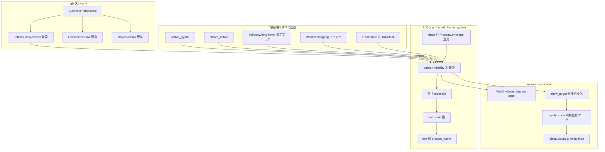
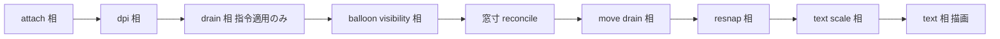
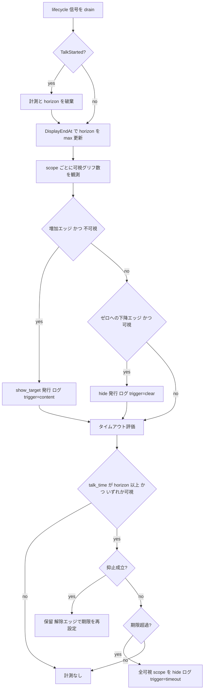

# Technical Design: areka-P0-balloon-visibility

## Overview

**Purpose**: 本機能は、バルーン（会話ウィンドウ）の可視性を「可視コンテンツの存在」に従属させる制御主体（コントローラ）を UI 層へ新設し、SSP 互換の自然なバルーン挙動——起動時は出ない・喋った scope だけ出る・会話終了から既定 30 秒＋無操作で消える・次の会話で出直す——をエンドユーザへ届ける。

**Users**: areka でゴースト（適合対象 emo2）を動かすエンドユーザが日常の起動・会話・放置の全場面でこの挙動を体験する。保守者・実機サインオフ担当は Requirement 8 の観測ログで出入りの契機を 1 行から確定できる。

**Impact**: 現状の「起動時にバルーンへ無条件の表示指令を発する」構造（`frame/attach.rs:327-336`）を「不可視のまま表示状態だけを確立する」形へ改め、emo-present に**可視性の所有権**という第一級概念を追加する（面 ID の所有＝面切替側、可視性の所有＝本コントローラ、という Requirement 6.8 の分離を型と状態で表現する）。既存の表示実行経路・scope 別資産・位置追従は消費するだけで変更しない。

### Goals

- バルーン可視性の唯一の所有者となるコントローラを `emo2_boot` のフレーム相として新設する（表示契機は「可視コンテンツの配置」の単一規則）。
- 表示状態の確立（合成・供給面・スロット・k）と可視化を分離する能力を emo-present へ追加し、Requirement 1.3／6.2／6.9 を同一機構で満たす。
- 「非表示」を枠の面と文字層の双方の不可視＋ポインタ透過として成立させる（Requirement 1.7／1.8・`\b[-1]` も同時是正）。
- 会話の表示終了（占有区間の終端）を UI へ届ける信号線を新設し、既定 30 秒のタイムアウト非表示と抑止（ドラッグ・ポインタ滞在・選択肢）を成立させる。
- 判定分岐の決定論的テスト網羅と、実機サインオフ 4 点の合否をログ grep で判定できる観測性。

### Non-Goals

- `OnBalloonClose`／`OnBalloonTimeout`／`OnBalloonBreak` の SHIORI 発火（型の口の予約と対応表記録まで。実発火は `areka-P0-balloon-canon-residue`）。
- `\![set,balloontimeout]` タグの受理、`\x`／`\x[noclear]`（クリック待ち）の実装（語彙・縮退理由の記録のみ）。
- 選択肢のタイムアウト規約（`areka-P0-choice-select-events` 所有。本仕様は既存照会 `choice_active` の消費のみ）。
- ukadoc `Status` の `balloon` 導出・報告（情報源となる事実の登記のみ）。
- バルーンの重なり順（`areka-P0-ghost-window-zorder` 所有）・窓位置・追従・クランプ・スケール追従の規約変更。
- `\b` 指令経路そのもの・scope 別バルーン資産解決・バルーン内テキストレイアウトの変更。
- 多面バルーン fixture を要する 2 件（`\b[N]`@scope≥1 の end-to-end 検証・バルーン側アニメーション定義表の scope 写像の実行時検証）は引き受けない（受け皿 `areka-P0-balloon-canon-residue`）。

## Boundary Commitments

### This Spec Owns

- **バルーン窓の可視性の判断と、その唯一の発行点**（コントローラ `run_balloon_visibility_phase`）。いつ出すか・いつ消すか・タイムアウト計測・抑止判定のすべて。
- **emo-present の「可視性の所有権」概念**: target ごとの `VisibilityOwnership`、外部所有 target の表示確立（可視化を伴わない `apply_show`）、直接可視化 API（`show_target`）、可視状態の照会（`target_visible`）。
- **`VisualMount::set_visible` の契約回復**: 枠の面と文字層スロットの双方を不可視・ポインタ透過にする（`\b[-1]` にも波及する是正）。
- **会話の表示終了信号の UI 配線**（`BalloonLifecycleSink`＝4 本目の broadcast sink とその UI 側 drain）。
- タイムアウト既定値（30 秒）の単一定義と実機サインオフ用の短縮手段（`AREKA_BALLOON_TIMEOUT_MS`）。
- 表示ライフサイクルの観測ログ（Requirement 8 の契約）。
- 正典語彙の縮退記録（互換対応表 §8 への追記）と SHIORI 発火用の型の口の予約。
- `input_events/balloon.rs` の陳腐化注記・`#[allow(dead_code)]` の是正（Requirement 9.7）と、バルーン hover 観測フラグの追加。

### Out of Boundary

- seriko `ScopeStates.balloon`（面 ID の帳簿）: 変更しない。実可視状態との乖離は常態として許容する（Requirement 6.8）。
- 表示の実行手段の判断化: presenter へ「いつ出すか」の判断を持ち込まない。追加するのは能力（所有権・分離された可視化）のみ。
- kanade／dispatcher／dola の責務・署名: 一切変更しない（信号は既存 broadcast の 4 本目 sink として観測する）。
- キャラクター窓（shell target）の可視性: `CommandDriven`（従来どおり）のまま触れない（Requirement 6.7）。
- バルーン窓の HWND レベル show/hide（placement 領分）: 使わない（研究 §4.1 案 D の棄却を維持）。

### Allowed Dependencies

- `crates/areka/src/emo2_boot/`（コントローラの住処）→ `areka-emo-present`（可視性 API）・`areka-emo-text`（`visible_glyphs`／`choice_active` 照会）・`wintf::ecs`（`FrameTime`・`WindowDragging`）・`crate::placement::spawn`（`BalloonWindowMarker`・`GhostWindows`）・`crate::input_events::balloon`（`BalloonWiring` hover 照会）・`dola::cue`（`CueSink` 実装）。
- `areka-emo-present` は従来どおり wintf 非依存の指令契約を保つ（`command.rs` は無変更）。
- 依存方向: `talk スレッド（sink）→ mpsc → UI 相（コントローラ）→ presenter/runtime`。逆流なし。

### Revalidation Triggers

- `PresentCommand` の variant 追加・`apply_show` の手順変更（後続 `recompose-budget`／`dpi-transition-atomicity`／`test-cage-determinism` が同ファイルを触る。本仕様が先着＝実形を確定し、後続が rebase する）。
- `emo2_frame_system` のフェーズ列変更（本仕様で 7→9 相へ。`dpi-transition-atomicity` は順序変更時のみ直列注意の登記済みペア）。
- `VisualMount::attach` の署名変更（初期可視性引数の追加）を emo-present 内の呼び手が増えた場合。
- `GhostBootOptions.sinks` の登録順（broadcast 順）に依存する消費者が現れた場合。
- バルーン側 SERIKO アニメーション表が空でなくなった場合（現 fixture では構造的に常に空。Requirement 6.9 の経路は型で塞ぐが、実データが生えたら決定論テストの入力を実データ形へ拡張する）。

## Architecture

### Existing Architecture Analysis

- 表示の実行手段は貫通済み: seriko → `DisplayCommand` → adapter → `PresentCommand`（mpsc）→ `run_drain_phase` → `EmoPresenter::apply`。冪等ガード・log-first 規律も既存（research §1.1）。
- `apply_show`（`presenter/show.rs:23-277`）は k 導出→合成→遅延生成→アップロード→**可視化**→状態確定を単一漏斗で行い、可視化だけを分離できない（research §3.2）。
- `VisualMount::set_visible`（`mount.rs:193-216`）は surface entity のみを対象とし文字層スロットを隠さない。さらに実測で、スロットは `HitTest` component を持たず既定 `Bounds` 扱い（`wintf/src/ecs/layout/hit_test/mod.rs:91`／`:367-371`）で、`Bounds` 判定の合成 α は `Visual::clamped_opacity()`（`visual.rs:140-142`）＝ **`is_visible` を見ない**ため、Visual を不可視にしただけではポインタ透過も成立しない（Requirement 1.8 の欠陥の正確な機序）。
- 会話終了信号は kanade で終端（`steady.rs:827`）。UI 側は `MoveCueSink`（`emo2_boot/move_cue.rs:447-528`）という「UI 向け mpsc を持つ sink」の完成した先例を持つ。sink は talk ごとに `clone_box` される（`dispatcher.rs:290-294`）ため、**talk 境界は per-talk clone の初回 emit で自己検出できる**。
- 抑止の観測源: ドラッグは `WindowDragging` マーカー（`wintf/src/ecs/drag/dispatch.rs:172`／`:268-270`。`DraggingState` は多窓時に DragEnd 前へ落ちる既知の穴があるため使わない）。選択肢は `TextLayerRuntime::choice_active`（`actor.rs:541`）。ポインタ滞在は配線（`on_balloon_pointer_moved`）は本番結線済みだが「バルーンの上に居る」を記録する状態が無い（`BalloonWiring.hover` は選択肢行の追跡であり別物）——本仕様が観測フラグを追加する。
- 時刻源は `FrameTime`（注入可）＋ `TalkClock::talk_time`（talk 相対秒）。sink が観測する `cue.at`／`duration` は talk 相対秒で **`talk_time` と同一の時間軸**（単位変換不要）。

### Architecture Pattern & Boundary Map



**Architecture Integration**:

- 選択パターン: **UI 層フレーム駆動コントローラ＋純関数の判断中核**（`resolve_talk_time`／`plan_attachments` と同じ「判断は純関数・配線は薄い」既存流儀）。
- 境界: 判断（本仕様の新設面）と実行（既存 presenter 経路）を分離。実行側へ追加するのは判断を含まない能力（所有権・分離可視化）のみ。
- 既存パターンの保存: broadcast sink（`MoveCueSink` 同型）、NonSend `Emo2Wiring`、`AREKA_` env の read-once 解析（`hover_inject` 同型）、log-first。
- 新規コンポーネントの根拠: コントローラ（頭脳が不在という gap の核）・lifecycle sink（会話終了信号が UI に無い）・可視性所有権（可視化と確立が不可分という欠落能力）。
- Steering 準拠: 「見える・触れるは emo（UI 層）の窓口」、テスト分離規約（兄弟ファイル）、1,000 行上限、`AREKA_` env 命名。

### 主要設計決定（要件ディスカッション持ち越し分の確定）

| 決定 | 内容 | 根拠（詳細は research.md §8） |
|---|---|---|
| **D2＝所有権方式** | `PresentTarget` に `VisibilityOwnership { CommandDriven, External }` を追加。バルーン target は attach 相で `External` へ設定。`apply_show` は `External` のとき可視化手順（`set_visible(true)`／`visible=true`）だけをスキップし、他の全手順（k 導出・合成・遅延生成・アップロード・マスク・`applied`／`native_size`／`last_show`／`pending_resize`）は従来どおり実行する。可視化は新 API `show_target` が同一漏斗を通した上で付与する。attach 相の初回 `ShowSurface`（面 0）は**撤去せず「不可視のままの確立」**として維持する | A-1（指令へ可視性フラグ）は送信側（adapter・talk スレッド）が可視性状態を知り得ず棄却。C（初回発話まで確立遅延）は 6.2／6.9 を解けず、`text_slot_view`／窓寸 k₀ 補正／既存テスト前提の広範な波及を生む。所有権方式は 1.3・6.2・6.9・1.2 を 1 機構で解き、既存テストの大半（readback・スロット成立・適用 k）が**前提変更なしで緑のまま**になる |
| **D4＝α（4 本目 sink）** | `BalloonLifecycleSink` を `GhostBootOptions.sinks` の 4 本目へ追加。per-talk clone の初回 emit で `TalkStarted`、以降 `max(cue.at + cue.duration)` の増加時に `DisplayEndAt(f64)` を mpsc で UI へ送る。上流（ghost/kanade/dola）の署名は一切変えない | β（`TalkDone` 配線）は `spawn_dispatcher` の 9 呼出箇所へ波及し「会話進行の管理層の既存の通知先は変えない」に反する。α の弱点 2 つは要件の別条項が吸収する——選択肢バリア中の horizon 過小は Requirement 5.4 の抑止が非表示を防ぎ、バリア解除後の cue が horizon を引き上げて計測が正しく再開する。中断（4.6）は下記の解釈で満たす |
| **D4 補・中断の起点** | 中断時も計測起点は台本の占有区間の終端（＝正常終了と同一の起点値）。中断を理由とする即時非表示は構造的に起こり得ない | Requirement 4.6 の規範は「即時非表示の禁止」と「正常終了と同一の起点」。α では中断を観測できないが、起点は正常終了時と同一値（占有 horizon）になり、誤差は**表示を保持する側**にのみ倒れる（4.8 と同じ側）。中断時刻を起点に採る精密化は `TalkDone.reason` の配線と一体で `balloon-canon-residue`（7.2 の口の実装時）へ登記 |
| **D5＝相の位置** | `run_drain_phase` から窓寸 reconcile（`reconcile_reported_sizes`）の呼び出しを `emo2_frame_system` 直下へ純移動し、フェーズ列を attach → dpi → drain（適用のみ）→ **balloon_visibility** → reconcile → move_drain → resnap → text_scale → text とする | コントローラは「当該フレームの全 `\b` 指令を見終えた後」（drain 後）かつ「show が積む窓寸要求を同一フレームで消化できる位置」（reconcile 前）かつ「binding 再構築と描画の上流」（text_scale／text 前）に置く必要がある（Requirement 3.5・6.6）。drain 相の内部へ挿す案は drain の責務を汚すため、呼び出し順の所有者である `emo2_frame_system` 側で並べ替える |
| **D6＝定数＋env** | `const DEFAULT_BALLOON_TIMEOUT_SECS: f64 = 30.0;` をコントローラモジュールの 1 箇所に置く。実機サインオフ用に `AREKA_BALLOON_TIMEOUT_MS`（正の整数 ms・read-once・不正値は warn＋既定）で上書き可。起動時に採用値と供給源（default／env）を info! で 1 行出す | sylphya 語彙化は消費者 1 つの M1 では過剰（将来「ベースウェア本体設定」を実装する仕様が語彙化する。対応表へ areka 裁量 30 秒として記録）。env は `hover_inject`／`smoke_exit_ms` の確立済みパターン |
| **D8＝ドラッグ観測** | `WindowDragging` マーカー（wintf・`dispatch.rs:172` 挿入／`:268-270` 除去）＋ `BalloonWindowMarker` の query で「いずれかのバルーン窓がドラッグ中」を毎フレーム判定する | `DraggingState` は多窓時に DragEnd 前へ落ちる既知の穴（`drag_follow.rs:159-174`）。`OnDrag`／`OnDragEnd` ハンドラへのフラグ追加は placement 側の編集と終端エッジ取りこぼしのリスクを持つ。`WindowDragging` はドラッグ全期間を覆い、балloon ではドラッグ対象＝窓 entity ゆえ同一 entity で観測できる |
| **D10＝ログ水準** | 表示・非表示の遷移（8.1）と計測の開始・破棄・やり直し（8.2）・抑止による見送り（8.3・エピソードごとに 1 回）は **info!**、失敗は **error!**（8.4）。構造化フィールドは `scope`・`trigger`（`content`／`clear`／`timeout`／`explicit`）・`visible`・`deadline`・`talk_time`。プレフィックス `[balloon-visibility]` | 実機サインオフは既定 `RUST_LOG=info` の grep が合否契約（`apply_show` の info! と同じ理由）。8.2／8.3 は talk あたり高々数回でスパムにならない。毎フレームの判定は無音（8.6） |

### Technology Stack

| Layer | Choice / Version | Role in Feature | Notes |
|-------|------------------|-----------------|-------|
| UI 統合層 | `crates/areka`（bin）＋ bevy_ecs | コントローラ相・観測・配線 | 新規依存なし |
| 表示実行層 | `areka-emo-present` | 可視性所有権・分離可視化・両 entity hide | 公開面は additive |
| 信号配線 | `std::sync::mpsc` ＋ `dola::cue::CueSink` | talk→UI の表示終了信号 | `MoveCueSink` と同型 |
| 時刻 | `wintf::ecs::FrameTime` ＋ `TalkClock` | 注入可能なフレーム時刻での判定 | 実時間待機なし |

## File Structure Plan

### モジュール接続の変更

- `crates/areka-emo-present/src/presenter.rs`（ファサード）— `mod visibility;` の接続と `VisibilityOwnership` の再輸出。

### New Files

```
crates/areka/src/emo2_boot/
├── balloon_visibility.rs            # コントローラ本体: 純関数の判断中核（決定）＋相関数（配線）＋既定値/env 解析
├── balloon_visibility_tests.rs      # 判断中核の決定論テスト（#[cfg(test)] #[path] 接続・テーマ超過時はさらに分割）
├── balloon_visibility_test_support.rs # テスト共有ヘルパ（観測スナップショット組立て）
├── talk_lifecycle.rs                # BalloonLifecycleSink（CueSink+Clone）・TalkLifecycleSignal・SHIORI 発火用の予約型
└── talk_lifecycle_tests.rs          # sink の horizon 集約・talk 境界検出の決定論テスト
crates/areka-emo-present/src/presenter/
└── visibility.rs                    # EmoPresenter の可視性 API impl ブロック（set_visibility_ownership / show_target）
```

### Modified Files

- `crates/areka-emo-present/src/presenter/target.rs` — `PresentTarget` へ `ownership: VisibilityOwnership` を追加（既定 `CommandDriven`）。`VisibilityOwnership` enum の定義。
- `crates/areka-emo-present/src/presenter/show.rs` — 可視化手順を所有権でゲートする（`External` は `set_visible(true)`／`visible=true` を行わない）。mount 遅延生成時の初期可視性を所有権から導出（`External` は不可視で構築）。
- `crates/areka-emo-present/src/presenter/hub.rs` — `presenter/visibility.rs` のモジュール接続（`apply_hide` は無変更＝`\b[-1]` 即時性の保存）。
- `crates/areka-emo-present/src/presenter/read.rs` — `target_visible(&self, TargetId) -> Option<bool>` を追加（読み取り専用照会）。
- `crates/areka-emo-present/src/mount.rs` — `VisualMount::attach` へ初期可視性引数を追加（不可視構築時は surface=`HitTest::none()`・slot=`HitTest::none()`・両 `Visual` 不可視で spawn）。`set_visible` を両 entity 対応へ（surface: Visual＋`alpha_mask`/`none`、slot: Visual＋`bounds`/`none`）。slot へ明示 `HitTest` を常時付与（可視時 `bounds()`＝既定挙動と同値）。テスト（同ファイル `tests`）へ両 entity の可視・HitTest を検証する項目を追加。
- `crates/areka/src/emo2_boot/frame.rs` — フェーズ列を 9 相へ（vis 相の挿入・reconcile 呼び出しの純移動）。モジュール doc の「バルーン初回 ShowSurface（面0）」記述を「不可視のままの確立」へ是正（Requirement 9.6）。
- `crates/areka/src/emo2_boot/frame/attach.rs` — balloon target 装着直後に `set_visibility_ownership(balloon_target, External)` を呼んでから初回 `ShowSurface`（面 0）を適用。コメント（`:139-154`／`:287-288`／`:325-338`）の「初回表示」表現を是正。
- `crates/areka/src/emo2_boot/frame/drain_resnap.rs` — `run_drain_phase` 末尾の `reconcile_reported_sizes` 呼び出しを削除（`frame.rs` へ移動）。doc 更新。
- `crates/areka/src/emo2_boot/frame/wiring.rs` — `Emo2Wiring` へ `lifecycle_rx: Receiver<TalkLifecycleSignal>`・`balloon_visibility: BalloonVisibilityState` を追加（`new` の引数拡張）。`runtime()` の陳腐化 doc（`:138-144`）を是正。
- `crates/areka/src/emo2_boot/mod.rs` — lifecycle チャネル生成・`BalloonLifecycleSink` を `sinks` の 4 本目へ登録・`Emo2Wiring::new` 呼び出しの拡張。
- `crates/areka/src/input_events/balloon.rs` — `BalloonWiring` へ `balloon_hover: HashSet<usize>`（＋`set`/`clear`/`is_balloon_hovered` accessor）を追加し、`on_balloon_pointer_moved` で挿入・`clear_balloon_hover_on_leave` で除去。陳腐化注記（`:315`/`:472`/`:780`/`:804`/`:821` ほか本番結線済みの全箇所）と対応する `#[allow(dead_code)]` を実態へ是正（Requirement 9.7。到達実態は各注記ごとに `main.rs:363`/`:731` 起点で個別確認して書き換える）。
- `crates/areka/src/emo2_boot/spine_display_tests.rs`・`frame_attach_tests.rs`・`spine_text_scale_tests.rs`・`spine_test_support.rs` — 「attach 初回表示済み」前提の文言・assert を「不可視のまま確立済み」へ更新し、起動時 `target_visible == Some(false)` の積極 assert を追加（Requirement 9.6。readback・スロット成立・適用 k の既存 assert は前提変更なしで維持）。
- `doc/COMPAT_ARCHITECTURE.md` — §8 沈黙ルール対応表へ本仕様の行を追記（詳細は Components「互換記録」）。
- `.kiro/specs/areka-P0-status-execution-states/brief.md` — `Status: balloon` の唯一の情報源が本仕様の表示状態（`EmoPresenter::target_visible`）である旨の登記 1 行（Requirement 7.5）。
- `.kiro/steering/roadmap.md` — 先送り 3 件（balloontimeout タグ・SHIORI 3 イベント・`\x`）の受け皿 spec と解禁条件の明記を確認し、欠けていれば追記（Requirement 7.7）。

## System Flows

### フレーム内の相順（変更後）



- D が C の後: 当該フレームの `\b` 由来指令をすべて見終えた実状態（`target_visible`）で判断する。
- D が E の前: コントローラの `show_target` が積む窓寸要求（k₀／DPI 変化分）を同一フレームで窓 client へ反映する（Requirement 6.6）。
- D が H・I の前: 可視化の直後に binding 再構築と描画が同一フレームで走り、旧内容・旧寸の 1 フレーム露出を作らない（Requirement 3.5）。

### 可視性の判断フロー（毎フレーム・balloon visibility 相）



**フロー上の決定**:

- show の契機は `visible_glyphs(actor, talk_time)` の**増加エッジ**（リビール済み数）。`present_frame` 自身がリビール時刻でゲートするため、バルーンと最初の文字が同一フレームで現れる（Requirement 9.4-⑵「内容と同時」）。改行・カーソル・待機・消去はこの数を増やさないため契機にならない（Requirement 2.3 と `visible_glyphs` の定義が厳密一致）。
- hide の契機（会話開始側）は可視グリフ数の**ゼロへの下降エッジ**。`ClearAll` は全 actor を同時に 0 にする（`state.rs:352-366`）ため、発話 scope の先読みなしに全非表示が導出される（Requirement 3.1／3.6）。per-scope `Clear` にも同一規則が自然適用される（統一原理「内容が全消去されれば消える」）。
- 抑止 = （いずれかの可視バルーンがドラッグ中）∨（いずれかの可視 scope で `balloon_hover`）∨（いずれかの装着 scope で `choice_active`）。**可視である scope に限って** hover を効かせ、非表示遷移時に当該 scope の hover フラグを掃除する（不可視中は PointerLeave が届かないため、放置すると恒久抑止に固着して Requirement 5.5 に反する）。
- 抑止の解除エッジで `deadline = now + timeout` に再設定（Requirement 5.3 の「計測やり直し」）。抑止中に期限を過ぎても保留し続ける（5.6）。
- 選択肢バリアで cue 配送が止まる間は horizon が過小のまま計測が始まり得るが、`choice_active` 抑止（5.4）が非表示を防ぎ、バリア解除後の cue が horizon を引き上げて `talk_time < horizon` へ戻る（計測は自動破棄）。
- タイムアウト hide 後は可視 scope が無くなるため計測は消える。内容・会話状態には触れない（hide は `apply_hide` 経路＝cache／chain／`applied`／`native_size` 保持・Requirement 4.4）。

## Requirements Traceability

| Requirement | Summary | Components | Interfaces / Flows |
|---|---|---|---|
| 1.1 | 起動時不可視 | attach 相＋所有権 | `set_visibility_ownership(External)` 後の初回 `ShowSurface`＝不可視確立 |
| 1.2 | 可視の瞬間ゼロ | VisualMount＋show.rs | 不可視での mount 構築（初期可視性引数）＋`External` は可視化手順を持たない＝可視状態を経由しない構造保証 |
| 1.3 | 配置先確保の分離 | 所有権方式 | 不可視確立でも `chain`/`mount`/`applied`/`native_size` が立ち `text_slot_view` は Some。cue は登録前も蓄積され欠落なし |
| 1.4 | 不可視時のポインタ透過（枠） | VisualMount | surface: `HitTest::none()`（既存挙動の維持） |
| 1.5 | 装着失敗の log-first | attach 相（既存） | 全分岐 error!/warn!＋継続（`attach.rs:246-322`） |
| 1.6 | 全 scope 適用 | attach 相 | `plan.items` ループ内で per-balloon target に所有権設定 |
| 1.7 | 枠＋文字層の双方不可視 | VisualMount | `set_visible` が surface と text_slot の両 `Visual` を切替（`\b[-1]` にも波及） |
| 1.8 | 文字層のポインタ透過 | VisualMount | slot へ明示 `HitTest` を付与し `none`/`bounds` を切替（既定 Bounds＋opacity 非連動の欠陥を封鎖） |
| 2.1 | 初回コンテンツで当該 scope のみ表示 | コントローラ | `visible_glyphs` 増加エッジ → `show_target(balloon_target(scope))` |
| 2.2 | コンテンツ無し scope は非表示 | コントローラ | エッジ駆動（エッジが無ければ指令ゼロ） |
| 2.3 | 可視コンテンツの定義 | コントローラ | `visible_glyphs`（グリフのみ計数・改行/カーソル/待機/消去は非計数）の消費 |
| 2.4 | scope 切替の追加表示 | コントローラ | per-scope 独立状態（他 scope の表示を変更しない） |
| 2.5 | 再発行しない | コントローラ | 増加エッジ∧現に不可視のときのみ発行（`target_visible` ガード） |
| 2.6 | 単一規則からの導出 | 判断中核 | show 契機は増加エッジの 1 規則のみ（起動時・会話開始時・切替時の個別条件なし） |
| 2.7 | 無発話 scope は最後まで非表示 | コントローラ | 同上（エッジ不発生） |
| 3.1 | 全消去で全非表示 | コントローラ | ゼロ下降エッジ（`ClearAll` は全 actor 同時） |
| 3.2 | 直後の再出現 | コントローラ | 2.1 と同一規則 |
| 3.3 | 会話中の無発話 scope | コントローラ | エッジ不発生 |
| 3.4 | 空バルーン可視の禁止 | 相順＋1.7 | 起動時不可視＋ゼロ下降エッジ hide＋両 entity hide |
| 3.5 | 旧内容の残存禁止 | 相順 | vis 相 → text_scale → text の同一フレーム順序＋`ClearAll` の描画実行部全消去（`actor.rs:440-449`） |
| 3.6 | 先読み不要 | 判断中核 | per-scope 観測のみで導出（会話の開始 scope を参照しない） |
| 4.1 | 表示終了起点（待機込み） | BalloonLifecycleSink | `max(cue.at + cue.duration)`（`Wait` cue も duration を運ぶ＝占有区間の終端と一致） |
| 4.2 | 既定 30 秒・単一定義 | コントローラ | `DEFAULT_BALLOON_TIMEOUT_SECS` 1 箇所＋起動時ログで採用値を明示 |
| 4.3 | 満了で全非表示 | コントローラ | `talk_time >= deadline ∧ 非抑止` → 全可視 scope hide |
| 4.4 | 可視状態のみ変更 | presenter | hide は `apply_hide` 経路（内容・状態・キャラ窓に非接触） |
| 4.5 | 次会話開始で計測破棄 | sink＋コントローラ | `TalkStarted`（per-talk clone の初回 emit）で破棄 |
| 4.6 | 中断も同一起点 | 判断中核 | 起点＝占有 horizon（正常終了と同一値）。即時非表示の経路が存在しない（D4 補・対応表へ記録） |
| 4.7 | タイムアウト後の再表示 | コントローラ | 2.1 と同一規則（増加エッジ） |
| 4.8 | 信号欠落時は保持＋記録 | コントローラ | horizon 未確立なら計測を開始しない（消さない側へ倒す）。チャネル切断は error! 1 回・コンテンツ出現時に信号未着なら warn! 1 回（エッジガード） |
| 4.9 | フレーム時刻のみで判定 | 判断中核 | `FrameTime`＋`TalkClock`（注入可）。実時間待機なし |
| 5.1 | ドラッグ中の抑止 | コントローラ | `WindowDragging`∧`BalloonWindowMarker` query |
| 5.2 | ポインタ滞在の抑止 | BalloonWiring 拡張 | `balloon_hover` フラグ（moved で set・leave で clear）∧当該 scope 可視 |
| 5.3 | 解除後の再計測 | 判断中核 | 抑止の解除エッジで `deadline = now + timeout` |
| 5.4 | 選択肢は既存照会の消費 | コントローラ | `TextLayerRuntime::choice_active(actor)`（新設の口なし） |
| 5.5 | 観測不能は非抑止側へ | コントローラ | resource 不在・`try_borrow` 失敗 → 抑止不成立扱い（error!）。hover は非表示遷移で掃除 |
| 5.6 | 抑止中の超過は保留 | 判断中核 | 期限超過でも抑止中は hide せず、解除エッジ待ち |
| 6.1 | `\b[-1]` は即時 | presenter | `apply_hide` 無変更（コントローラは介在しない） |
| 6.2 | 面切替は可視性を変えない | 所有権方式 | `External` の `apply_show` は可視性に触れず結果のみ保持（面 ID は `current_surface_id`/`last_show` へ） |
| 6.3 | `\b` 回帰テスト緑＋是正の証跡 | テスト戦略 | 既存 spine（発行順序・readback）は前提変更なしで緑。是正の証跡は mount 両 entity テストで新設 |
| 6.4 | scope 別資産の不変 | 境界 | 資産・モデル・解決規則に非接触（`balloon_models` は読むだけ） |
| 6.5 | 位置・追従・永続の不変 | 境界 | placement 非接触（hover フラグは input_events 層の additive） |
| 6.6 | 非表示期間中の変化の取りこぼし禁止 | show_target＋相順 | `show_target` が現 DPI から k を再導出（漏斗再通過）＋reconcile が同一フレームで窓寸を反映＋text_scale が binding 再構築 |
| 6.7 | キャラ窓へ非波及 | 所有権方式 | shell target は `CommandDriven` のまま（コントローラは balloon target のみ扱う） |
| 6.8 | 可視性の所有一元化 | 所有権方式 | `External`＝所有者はコントローラ。seriko の帳簿は面 ID の所有に限る（無変更・乖離は常態として doc 化） |
| 6.9 | ループ由来指令でも可視化しない | 所有権方式 | 6.2 と同一機構（`ShowSurface` は経路を問わず可視化しない） |
| 7.1 | balloontimeout の語彙記録 | 互換記録 | 対応表 §8 へ完全意味論＋縮退理由を追記（受理はしない＝現状維持） |
| 7.2 | SHIORI 3 イベントの型予約 | talk_lifecycle.rs | `BalloonLifecycleNotice` 型（Reference 割当を写した形）＋対応表記録 |
| 7.3 | OnBalloonClick 非存在の記録 | 互換記録 | 対応表 §8 へ記録（独自イベント新設なし） |
| 7.4 | `\x` の語彙記録 | 互換記録 | 対応表 §8 へ記録 |
| 7.5 | Status balloon の源の登記 | docs | `status-execution-states` brief へ登記 1 行 |
| 7.6 | areka 裁量の対応表記録 | 互換記録 | 出現契機・無発話非表示・延命と再計測・面切替非可視化・既定 30 秒・中断起点の 6 行 |
| 7.7 | 追跡 spec と解禁条件 | docs | 受け皿の実在確認済み（canon-residue／status-execution-states は specs 直下・choice-select-events は完了済み＝所有決着）＋roadmap 明記の確認 |
| 7.8 | 予約の口の消費者ゼロ注記 | talk_lifecycle.rs | `#[allow(dead_code)]`＋「消費者ゼロ・実在理由・追跡先」の doc 注記 |
| 8.1 | 遷移ログ | コントローラ | info!（`scope`・`trigger`・`visible`） |
| 8.2 | 計測ログ | コントローラ | info!（開始・破棄・やり直し・起点・満了予定） |
| 8.3 | 抑止ログ | コントローラ | info!（成立中の抑止種別・エピソード 1 回） |
| 8.4 | 失敗ログ | コントローラ＋presenter | error!（`show_target` 失敗・borrow 失敗・チャネル切断） |
| 8.5 | 1 行確定の粒度 | ログ契約 | 構造化フィールド＋固定プレフィックス |
| 8.6 | 遷移時のみ記録 | 判断中核 | エッジ検出の外では発話しない |
| 9.1 | 判定分岐の決定論網羅 | テスト戦略 | 下記 Unit/Integration 一覧（要件列挙の全系統を対応付け） |
| 9.2 | 注入時刻駆動 | 判断中核 | `decide(observations, now)` 純関数＋`FrameTime` 注入 |
| 9.3 | 注入時刻が観測を追い越さない | テスト戦略 | 観測点（境界時刻の直前・直後）で now を頭打ちにする表駆動 |
| 9.4 | 実機サインオフ 4 点 | テスト戦略 | 絶対パス起動＋実 DPI＋有界 auto-exit＋ログ grep |
| 9.5 | 短縮時も既定 30 秒を確認 | コントローラ | env 短縮＋起動ログの `timeout_secs=30.0 source="default"` 行（短縮なし実行で確認。`tracing` は f64 を Debug 形・文字列を引用符つきで出すため、この形でないと 0 件になる） |
| 9.6 | 既存テスト・注記の更新 | Modified Files | §File Structure Plan の 4 テスト＋frame.rs/attach.rs doc |
| 9.7 | ポインタ配線注記の是正 | input_events/balloon.rs | 陳腐化注記＋`#[allow(dead_code)]` の実態化（wiring.rs `runtime()` doc 含む） |
| 9.8 | ワークスペース全緑 | テスト戦略 | 完了判定ゲート（i686 host-32 成果物ビルド後） |

## Components and Interfaces

| Component | Domain/Layer | Intent | Req Coverage | Key Dependencies | Contracts |
|-----------|--------------|--------|--------------|------------------|-----------|
| BalloonVisibilityController | UI 統合層（emo2_boot） | 可視性の判断と発行の唯一の主体 | 2.x, 3.x, 4.x, 5.x, 8.x | EmoPresenter (P0), TextLayerRuntime (P0), BalloonWiring (P1), wintf drag/FrameTime (P1) | Service, State |
| BalloonLifecycleSink | talk スレッド（sink） | 表示終了信号の観測と UI 送出 | 4.1, 4.5, 4.8 | dola CueSink (P0), mpsc (P0) | Event |
| EmoPresenter 可視性能力 | 表示実行層（emo-present） | 所有権・分離可視化・照会 | 1.1-1.3, 6.1, 6.2, 6.8, 6.9 | VisualMount (P0) | Service, State |
| VisualMount 両 entity 化 | 表示実行層（emo-present） | 非表示契約の回復 | 1.2, 1.4, 1.7, 1.8 | wintf ecs (P0) | Service |
| attach／frame 相の再編 | UI 統合層 | 不可視確立と相順 | 1.1, 1.6, 3.5, 6.6, 9.6 | 上記全部 | — |
| hover 観測フラグ | 入力層（input_events） | バルーン滞在の記録 | 5.2, 5.5, 9.7 | wintf pointer (P0) | State |
| 互換記録・登記 | docs | 縮退 4 点セット | 7.x | — | — |

### UI 統合層

#### BalloonVisibilityController（`emo2_boot/balloon_visibility.rs`）

| Field | Detail |
|-------|--------|
| Intent | 観測スナップショットと注入時刻から可視性遷移とタイムアウトを決定し、presenter へ発行する |
| Requirements | 2.1-2.7, 3.1-3.6, 4.1-4.9, 5.1-5.6, 8.1-8.6 |

**Responsibilities & Constraints**

- 判断は純関数中核へ集約する（記憶「檻に入れるのは判断分岐のみ」）。配線（観測収集・発行・ログ）は薄く保つ。
- 対象 scope の列挙は `wiring.balloon_models` のキー（装着済み balloon scope）＝text_scale 相と同一の母集合。actor 写像は `ActorKey::from(scope.to_string())`（attach と同一式）。
- 現在可視かの読み値は `presenter.target_visible`（判断の真実源。第 2 の帳簿を作らない）。発行は遷移エッジのみ（毎フレーム再発行しない）。
- 発行の形: show は `presenter.show_target(world, target)`（新 API）、hide は `presenter.apply(world, PresentCommand::Hide { target, reply: None })`（既存漏斗・非表示側の新 API は作らない）。
- 自分が発行していない可視性遷移（`\b[-1]`／`\b[ID]`＝EmptyComposition 縮退等）は `prev_visible` との差分で検出し、`trigger=explicit` として 8.1 のログへ写す（明示指令のログも本コントローラが一元に出す——presenter のログ水準・書式に手を入れない）。

**Service Interface**（Rust）

```rust
/// 判断中核（純関数・World/GPU/時刻 I/O なし）
pub(crate) struct VisibilityDecision {
    pub actions: Vec<VisibilityAction>,       // Show{scope} / HideScopes{scopes, trigger}
    pub logs: Vec<VisibilityLogEvent>,        // 8.1-8.3 のエッジログ（配線層が info!/error! へ写す）
}
pub(crate) fn decide(
    state: &mut BalloonVisibilityState,       // 前フレームまでの状態（下記 Data Models）
    obs: &VisibilityObservations,             // 本フレームの観測スナップショット
    now_talk_time: Option<f64>,               // resolve_talk_time と同型（None＝epoch 未確立）
    timeout_secs: f64,
) -> VisibilityDecision;

/// 相関数（emo2_frame_system から呼ぶ配線）
pub fn run_balloon_visibility_phase(wiring: &mut Emo2Wiring, world: &mut World);

/// 既定値と env 上書き（read-once・不正値は warn!＋既定）
pub(crate) const DEFAULT_BALLOON_TIMEOUT_SECS: f64 = 30.0;
pub(crate) fn parse_timeout_ms(value: Option<&str>) -> Option<u64>;  // 純関数（テスト対象）
```

- Preconditions: `Emo2Wiring` 保持下（`emo2_frame_system` 内）で呼ぶ。attach 未完（`balloon_models` 空）は自然に no-op。
- Postconditions: 発行した遷移はすべて `VisibilityLogEvent` に対応するログを持つ（8.6: エッジ以外は無音）。
- Invariants: show は増加エッジ∧不可視のみ・hide はゼロ下降エッジ／タイムアウトのみ。`decide` は同一入力に対し決定論。

**観測の収集（配線層）**

- `visible_glyphs`／`choice_active`: `wiring.runtime()` の `Rc` clone → `try_borrow`（失敗は error!＋当該フレームの観測を「選択肢抑止なし・グリフ観測なし＝エッジなし」として扱う）。
- hover: `world.get_non_send_resource::<BalloonWiring>()`（不在＝抑止なし）。非表示へ遷移させた scope は `get_non_send_resource_mut` で hover を掃除する。
- ドラッグ: `world.query_filtered::<(), (With<BalloonWindowMarker>, With<WindowDragging>)>()` が 1 件でもあれば成立。
- 信号: `wiring.lifecycle_rx.try_iter()` を全件 drain（`TalkStarted`→リセット・`DisplayEndAt(h)`→max 更新）。切断検出（`try_recv` の `Disconnected`）は error! 1 回。

**Implementation Notes**

- Integration: `emo2_frame_system` の drain 直後・reconcile 直前に挿す（D5）。`show_target` の `Err` は error!＋継続（当該 scope のみ次エッジ待ち）。
- Validation: 決定論テストは `decide` を表駆動（Testing Strategy）。配線は fake presenter 相当の観測列で統合検証。
- Risks: `visible_glyphs` は UI ドレイン（`spawn_ui` の async task）による cue 適用タイミングに依存し、エッジ検出が最大 1 フレーム遅れる——枠と文字は双方不可視のまま同時に現れるため見た目の同時性（9.4-⑵）は保たれる（research §8 R4）。

#### BalloonLifecycleSink（`emo2_boot/talk_lifecycle.rs`）

| Field | Detail |
|-------|--------|
| Intent | talk の表示終了時刻（占有区間の終端）を UI へ届ける 4 本目の broadcast sink |
| Requirements | 4.1, 4.5, 4.8, 7.2, 7.8 |

**Event Contract**

- Published: `TalkLifecycleSignal::TalkStarted`（per-talk clone の初回 `emit` で 1 回）／`TalkLifecycleSignal::DisplayEndAt(f64)`（`cue.at + cue.duration` が既知最大を超えたとき。talk 相対秒＝`TalkClock::talk_time` と同一軸）。
- Delivery: `std::sync::mpsc`（非ブロック・送信失敗は warn!＋talk 非破壊＝`MoveCueSink` と同一規律）。attach 前・受信前はチャネルが保留バッファを兼ねる。
- Ordering: FIFO。`TalkStarted` は必ずその talk の `DisplayEndAt` 群に先行する（単一 `emit` 内で送出順を固定）。
- Idempotency: 受信側は `TalkStarted` でリセット後、`DisplayEndAt` を max 集約（重複・順不同の値に対して単調）。

```rust
#[derive(Clone)]
pub(crate) struct BalloonLifecycleSink {
    tx: std::sync::mpsc::Sender<TalkLifecycleSignal>,
    started: bool,   // per-talk clone ゆえ talk ごとに false から始まる（talk 境界の自己検出）
    horizon: f64,
}
impl dola::cue::CueSink for BalloonLifecycleSink { fn emit(&mut self, cue: TalkCue) { /* 上記契約 */ } }

/// Requirement 7.2 の予約型（消費者ゼロ・7.8 注記つき）。将来 `balloon-canon-residue` が
/// UI→kanade の口（MouseWiring/ChoiceForwarder 同型）で実発火する際の Reference 写像。
#[allow(dead_code)] // 消費者ゼロ（意図的予約）: 実発火は areka-P0-balloon-canon-residue が所有
pub(crate) enum BalloonLifecycleNotice {
    Closed   { script: String },                                  // OnBalloonClose  Ref0
    TimedOut { script: String, remaining_ms: u64 },               // OnBalloonTimeout Ref0/Ref1
    Broken   { script: String, scope: u32, break_position: usize } // OnBalloonBreak Ref0/Ref1/Ref2
}
```

- 制約: sink は `Barrier`／`Routing` エントリを受け取らない（cue のみ）ため、horizon はバリア解除まで過小になりうる——コントローラ側の 5.4 抑止と「horizon 更新で計測自動破棄」で吸収する（D4 の裁定・research §8）。

### 表示実行層（areka-emo-present）

#### EmoPresenter 可視性能力（`presenter/visibility.rs`・`target.rs`・`show.rs`・`read.rs`）

| Field | Detail |
|-------|--------|
| Intent | 可視性の所有権を target 単位で表現し、確立と可視化を分離する |
| Requirements | 1.1, 1.2, 1.3, 6.1, 6.2, 6.6, 6.8, 6.9 |

**Service Interface**

```rust
/// target の可視性を誰が確定するか（既定 CommandDriven＝従来挙動そのまま）。
#[derive(Debug, Clone, Copy, PartialEq, Eq, Default)]
pub enum VisibilityOwnership {
    #[default]
    CommandDriven, // ShowSurface 成功＝可視（shell・従来互換）
    External,      // 指令は表示状態の確立のみ。可視化は show_target／不可視化は Hide 系のみ
}

impl EmoPresenter {
    /// 所有権の設定（attach 後・初回指令前に呼ぶ。未装着 target は error!＋Err）。
    pub fn set_visibility_ownership(&mut self, target: TargetId, ownership: VisibilityOwnership)
        -> Result<(), PresentError>;

    /// External target の可視化。最後に確立した (surface_id, binds, pattern) で apply_show の
    /// 単一漏斗を再通過（現 DPI から k 再導出・キャッシュヒットなら再合成なし）した後、
    /// mount の可視化（両 entity）と visible=true を付与する。
    /// 未装着・一度も確立していない（last_show=None）は error!＋Err。
    pub fn show_target(&mut self, world: &mut World, target: TargetId) -> Result<(), PresentError>;

    /// 現在の可視状態の読み取り専用照会（未装着は None）。read.rs へ追加。
    pub fn target_visible(&self, target: TargetId) -> Option<bool>;
}
```

- `apply_show` の変更点は 2 つに限る: (a) mount 遅延生成時の初期可視性を所有権から導出（`External` は不可視で構築＝可視状態を component レベルでも経由しない・Requirement 1.2）、(b) 末尾の可視化手順（`mount.set_visible(true)`・`visible=true`）を `CommandDriven` のときだけ実行。**それ以外の全手順（k 導出・合成・キャッシュ・アップロード・マスク・`set_bounds`・`applied`/`native_size`/`last_show`/`pending_resize`・info! ログ）は所有権に依らず共通**（表示成立点の単一性を保つ）。
- `apply_hide`・`EmptyComposition` の Hide 縮退は所有権に依らず従来どおり不可視化する（非表示側の指令は常に即時＝Requirement 6.1。可視化側だけが所有権でゲートされる非対称が本設計の要）。
- `current_surface_id` の意味は「最後に**確立**した面 id」へ一般化される（可視性は `target_visible` が別軸で答える）。doc 更新で明示する。
- 不可視中の `set_bounds`／マスク更新／アップロードは安全: `Arrangement`・`SpriteVisual::SetSize`・`AlphaMaskResource` はいずれも合成コミットと独立で、`HitTest::none()` 中はマスクが判定に使われない（research §8 R2 の解決）。

**Implementation Notes**

- Integration: `presenter/show.rs` は後続 spec（budget/atom/cage）との共有ハンク——本仕様が先着として「可視化手順のゲート」を最小差分で確定する。
- Validation: 決定論テスト（GPU 実行系は既存 mount/chain テストの流儀）——`External`＋`apply_show` で `target_visible==Some(false)`・`text_slot_view` Some・`show_target` 後 `Some(true)`、`\b[ID]` 相当の再 `apply_show` で不可視のまま `current_surface_id` 更新。
- Risks: `show_target` の漏斗再通過は k 変化時に再合成コストを払う（表示エッジ時のみ・許容）。

#### VisualMount 両 entity 化（`mount.rs`）

| Field | Detail |
|-------|--------|
| Intent | 「非表示＝枠と文字層の双方が見えず・触れず」の契約回復 |
| Requirements | 1.2, 1.4, 1.7, 1.8, 6.3 |

- `attach(world, window, surface, compositor, size, initially_visible: bool)`: 不可視構築時は surface entity を `Visual{is_visible:false}`＋`HitTest::none()`、slot を `Visual{is_visible:false}`＋`HitTest::none()` で spawn。可視構築時（従来互換）は surface=`alpha_mask`・slot=`HitTest::bounds()`（明示付与——従来は component 不在＝既定 `Bounds` だったため挙動同値）。
- `set_visible(world, visible)`: surface＝`Visual`＋`alpha_mask()/none()`（従来どおり）に加え、slot＝`Visual`＋`bounds()/none()` を同時に切替。呼び手（`apply_hide`・EmptyComposition 縮退・`show_target`）は無変更でこの契約を得る＝`\b[-1]` の欠陥も同時是正（Requirement 1.7 後段）。
- 検証: 同ファイルのテストへ「hide 後: 両 entity の `Visual` 不可視∧surface `HitTest::None`∧slot `HitTest::None`」「再表示後: 両復帰」「不可視構築: 全フレームで可視 component が一度も true にならない」を追加（Requirement 9.1 の該当系統・6.3 の是正証跡）。

### 入力層

#### hover 観測フラグ（`input_events/balloon.rs`）

- `BalloonWiring` へ `balloon_hover: HashSet<usize>` を追加。`on_balloon_pointer_moved`（バルーン窓上の全ポインタ移動で着火・選択肢の有無に非依存）で `insert(scope)`、`clear_balloon_hover_on_leave`（`PointerLeave`）で `remove(scope)`。読み口 `is_balloon_hovered(scope) -> bool`・掃除口 `clear_balloon_hover(scope)`（コントローラの非表示遷移時）。
- 既存の選択肢 hover 機構（`hover: HashMap<usize, Option<usize>>`）とは独立の軸として持つ（選択肢行の追跡と「バルーンの上に居る」は別概念）。
- 併せて Requirement 9.7 の注記是正を行う（対象と現文言の一覧は research.md §8 に実測済み。各 `#[allow(dead_code)]` は本番到達を確認の上で除去し、真に未到達のものだけ実態に即した注記へ書き換える）。

### docs（互換記録・登記）

`doc/COMPAT_ARCHITECTURE.md` §8 へ追記する行（書式は `\![move]` 群の既存行に倣う）:

| 事項 | areka 裁量／記録内容 | 根拠区分 | 追跡先 |
|---|---|---|---|
| バルーン出現の契機 | 可視コンテンツ（グリフ）の配置。改行・カーソル・待機・消去は契機でない | areka 裁量（`\_s` の語法が傍証） | 本 spec |
| 無発話 scope の非表示 | 会話中・会話跨ぎとも表示しない | areka 裁量 | 本 spec |
| ポインタ滞在・ドラッグの延命と解除後の再計測 | 抑止＋解除エッジで既定時間を計り直す | areka 裁量 | 本 spec |
| 面切替（`\b[ID]`・ループ由来含む）は可視性を変えない | 面 ID と可視性の直交 | areka 裁量 | 本 spec |
| 既定タイムアウト 30 秒 | 「ベースウェア本体設定の喋りタイムアウト」相当の既定値 | 正典整合（存在）＋areka 裁量（値） | 本 spec |
| 中断時のタイムアウト起点 | 占有区間の終端（正常終了と同一値）。中断時刻起点への精密化は発火系と一体 | areka 裁量 | balloon-canon-residue |
| `\![set,balloontimeout,時間]` | M1 非受理。完全意味論（ms／起点＝スクリプト表示終了後／0・-1 でなし／省略で既定復帰／当該スクリプト中のみ）を記録 | 正典（縮退は emo2 実測根拠） | balloon-canon-residue |
| `OnBalloonClose`／`OnBalloonTimeout`／`OnBalloonBreak` | M1 非発火。Reference 割当を記録・型の口は `BalloonLifecycleNotice` | 正典（縮退は emo2 実測根拠） | balloon-canon-residue |
| `OnBalloonClick` 非存在 | クリック閉鎖は `OnBalloonClose` へ集約（独自イベントを新設しない） | 正典 | — |
| `\x`／`\x[noclear]` | M1 非実装（クリック待ち） | 正典（縮退は emo2 実測根拠） | balloon-canon-residue |
| `Status` の `balloon` | 表示中バルーン ID 群の唯一の情報源は本 spec の表示状態（`target_visible`） | 正典 | status-execution-states |

## Data Models

### BalloonVisibilityState（コントローラ所有・UI スレッド専有）

```rust
pub(crate) struct BalloonVisibilityState {
    per_scope: HashMap<u32, ScopeVisibility>, // 装着済み balloon scope のみ
    display_end: Option<f64>,   // 現 talk の占有終端（talk 相対秒・DisplayEndAt の max）
    deadline: Option<f64>,      // 非表示の満了予定（talk 相対秒）。None＝計測なし
    prev_suppressed: bool,      // 抑止の解除エッジ検出（5.3）
    suppress_logged: bool,      // 8.3 のエピソード 1 回ログ用
    signal_gap_warned: bool,    // 4.8 の warn 1 回用（TalkStarted で再武装）
}
pub(crate) struct ScopeVisibility {
    last_glyphs: usize,         // 前フレームに観測したリビール済みグリフ数（エッジ検出用）
    prev_visible: bool,         // 前フレームの実可視（外因遷移の trigger=explicit ログと hover 掃除のエッジ検出専用）
}
```

- 不変条件: `deadline` は `display_end` 確立後にのみ Some になりうる。**初期確立式は `deadline = display_end + timeout_secs`**（正典起点「スクリプトの表示が終わってから」＝Requirement 4.1。「計測 eligible になった最初のフレームの `now + timeout`」ではない——観測遅延分のずれを持ち込まない）。`now` 基準への再設定は Requirement 5.3 の抑止解除エッジのみ。`display_end` が現在時刻より未来へ更新されたら `deadline` は破棄（バリア解除後の cue 到着）。可視か否かの**判断**は `target_visible` を毎フレーム読む（真実源は presenter 1 箇所）——`prev_visible` は判断根拠ではなく、エッジ検出（ログ・掃除）にのみ使う。
- `TalkStarted` 受信時: `display_end=None`・`deadline=None`・`signal_gap_warned=false`（`per_scope.last_glyphs` は保持——直後の `ClearAll` 観測がゼロ下降エッジとして全非表示を導く）。

## Error Handling

### Error Strategy

log-first（記憶「ログ無し失敗経路の禁止」）を全経路で維持し、失敗は縮退方向を要件が定める側へ倒す。

- **表示指令の失敗**（`show_target` の Err・合成失敗）: error!＋当該 scope のみ見送り（次のエッジ／次フレームで再試行機会）。他 scope・talk を巻き込まない。
- **観測の失敗**: `try_borrow` 失敗・`BalloonWiring` 不在 → error!（初回）＋**抑止不成立**として扱う（Requirement 5.5: 消えない固着側へ倒さない）。グリフ観測が取れないフレームはエッジなし扱い（表示状態を変えない）。
- **信号の欠落**（Requirement 4.8）: `display_end` 未確立の間は計測を開始しない＝表示保持側へ倒す。チャネル切断は error! 1 回、コンテンツが現れたのに信号ゼロは warn! 1 回（talk ごとに再武装）。
- **設定の不正**（env）: warn!＋既定 30 秒へ縮退。
- presenter 内部の失敗経路は既存契約のまま（早期 return で前状態保持・Requirement 4.4）。

### Monitoring

Requirement 8 のログ契約（D10 の表）が実機サインオフの合否判定装置を兼ねる。`RUST_LOG=info` 既定で全遷移・全計測イベントが 1 行ずつ現れ、`[balloon-visibility]`＋`scope=`＋`trigger=` の grep で機械判定できる。

## Testing Strategy

### Unit Tests（決定論・GPU 不要）

1. **判断中核 `decide`**（`balloon_visibility_tests.rs`・表駆動）: 可視コンテンツ判定（グリフあり／改行・待機・消去のみ→エッジなし）／scope 別 show と無発話 scope 非表示（2.1-2.7, 3.3）／ゼロ下降エッジの全非表示と直後の再出現（3.1-3.2）／タイムアウト境界（満了直前 now＝deadline-ε で不成立・直後 +ε で成立。now は観測点で頭打ち＝9.3。**表駆動入力は `display_end` 相対で書く**——初期式 `deadline = display_end + timeout` の取り違えを檻が検出できる形にする）／抑止の成立・解除・解除後の再計測（5.1-5.3）・抑止中超過の保留（5.6）／観測不能→非抑止（5.5）／信号欠落→保持（4.8）／`TalkStarted` での計測破棄（4.5）／horizon 引き上げによる計測自動破棄（バリア解除後）／明示指令との相互作用（外因 hide の `trigger=explicit` 検出・`\b[-1]` 後の新規コンテンツで再表示）。
2. **`BalloonLifecycleSink`**（`talk_lifecycle_tests.rs`）: 初回 emit の `TalkStarted` 先行・`max(at+duration)` の単調送出・`Wait` cue の duration が horizon へ入ること（4.1）・clone 後のリセット（talk 境界）。
3. **`parse_timeout_ms`**: 未設定／正値／0・負・非数（warn＋既定）の縮退表。
4. **`VisualMount`**（mount.rs tests・実 GPU）: hide で両 entity 不可視＋両 `HitTest::None`、再表示で両復帰（1.7/1.8）、不可視構築で可視 component を一度も経由しない（1.2）。
5. **presenter 所有権**: `External`＋`apply_show`→`target_visible==Some(false)`∧`text_slot_view` Some（1.1/1.3）、不可視中の再 `apply_show`（面切替相当・ループ由来相当）で不可視のまま結果保持（6.2/6.9）、`show_target`→可視＋k 再導出（6.6）、`apply_hide` は所有権に依らず即時（6.1）。

### Integration Tests

1. **frame 相順**: drain で `\b[-1]`／`\b[0]` を適用後に vis 相が実状態で判断すること・vis 相の show が同一フレームの reconcile で窓寸へ届くこと（6.6）。
2. **起動シーケンス**（spine 更新分）: attach 完了フレームから最初のコンテンツ配置まで全フレーム `target_visible==Some(false)`（1.1/1.2 の系統・9.1）・**`connect_balloon_text` 完了後も slot entity の `Visual.is_visible == false`**（テキスト装着のフック経由で mount の不可視構築が可視既定へ上書きされないこと——presenter 状態でなく entity 実値を観測する。実装時に wintf `Visual` フックの意味論〔既存 `Visual` 存在時に上書きしない〕を file:line で確認する）・readback／スロット成立／適用 k の既存 assert は維持（6.3）。
3. **`\b` 回帰**: `spine_display_tests` の発行順序・readback 一致が前提変更なしで緑（6.3）。
4. **会話終了信号の端到端**: 実 cue 列（Wait 含む）→ sink → コントローラの `display_end` が `CueSheet` の占有終端と一致（4.1）。

### E2E（実機サインオフ・Requirement 9.4/9.5）

1. 実 emo2（絶対パス）・実 DPI（96 以外）・`AREKA_APP_SMOKE_EXIT_MS` 有界終了で起動し、⑴起動直後にバルーン表示ログ・可視遷移が 1 件も無い ⑵起動挨拶で発話 scope のみ `trigger="content"` の show が出る ⑶`AREKA_BALLOON_TIMEOUT_MS` 短縮下で `trigger="timeout"` の全 hide が出る ⑷次の会話で再 show——を目視＋ログ grep の双方で確認。
2. 短縮なしの別実行で起動ログ `timeout_secs=30.0 source="default"` を確認（9.5）。**検索文字列は引用符込みで**——`tracing` の出力形は f64 が Debug 形・文字列が引用符つきであり、引用符を落とすと一致 0 件になる（実機 2 回実行で実測）。
3. `\b[-1]` 実行後に文字が画面へ残らないことの目視確認（是正前は残る——R1 の実機証跡）。

### 完了ゲート

- `cargo test --workspace` 緑（i686 host-32 成果物ビルド後・Requirement 9.8）。
- 決定論テストに実時間 sleep・反復回数のみの有界化を持ち込まない（9.2/9.3・`test-cage-determinism` への非干渉義務）。
