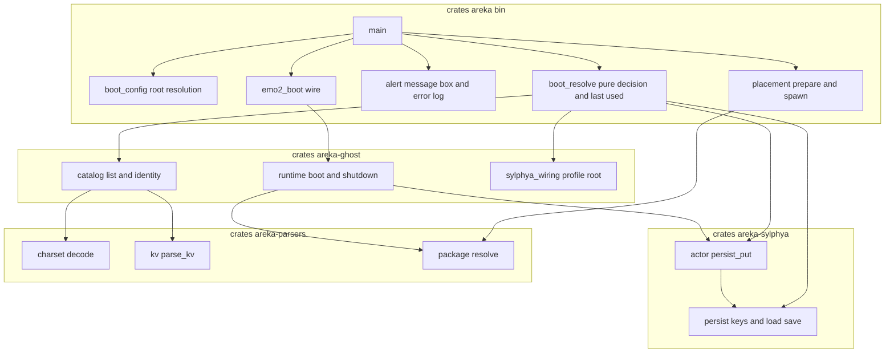
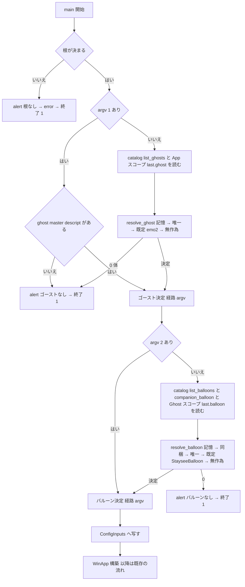
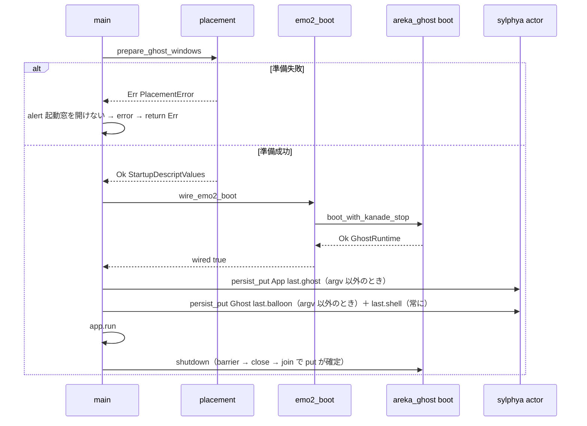

# Design Document: areka-P0-baseware-root-layout

> 設計日 2026-09-24・本ブランチ `claude/areka-p0-baseware-root-layout-6ae6de`（main `92f5f448` 着地後）。コードは「何の定義か」（関数名・型名＋ファイルパス）で指し、行番号では指さない。
> 要件 9 の裁定 1〜5 は確定済みであり本設計は覆さない。research.md §6.1 で設計へ送られた議題（#8・#10・#13・#14・R1・R3〜R8）はすべて本文の「設計判断（確定）」節で決める。

## Overview

**Purpose**: `areka.exe` を「ゴーストとバルーンを置く場所（根）を 1 つ持つアプリ」にする。根の直下の `ghost/`・`balloon/` を走査して素性付きで列挙し、最後に使ったゴースト（アプリの記憶）とゴーストごとの最後のバルーン・シェル（ゴーストの記憶）を覚え、起動時は argv → 記憶 → 唯一 → 既定 → 無作為の順で決める。何も無いときは利用者向けの告知（`MessageBoxW`）と `error!` を残して 0 以外の終了コードで終わる。

**Users**: areka を初めて手にする第三者（zip を展開して exe を起動するだけで、置いたゴーストが立つ）と、その人に配る開発者（argv の上書きと `AREKA_ROOT` で実機・テストを今までどおり回す）。

**Impact**: `crates/areka` の起動解決（`boot_config.rs`・`main.rs`）を根ベースへ置き換え、検証用ダミー窓と「無くても `warn!` で続ける」経路を退役させる。`crates/areka-ghost` に列挙（`catalog`）を、`crates/areka-sylphya` の永続に鍵の族 `[last]` を足す。`fn resolve` の 4 呼び手・`runtime.rs`・`menu/`・kanade の終了の握手は変えない。

### Goals
- 根の解決（既定＝exe の隣・`AREKA_ROOT` で差し替え）と、根が無いときの告知＋非 0 終了（要件 1）。
- ゴースト・シェル・バルーンの列挙と 7 項目の素性を、後続 spec（切替・メニュー・`property-catalog-lists`）が同じ 1 つの関数から引ける形で置く（要件 2）。
- 鍵 3 つ（`areka.last.ghost`／`areka.last.balloon`／`areka.last.shell`）の定義と起動成功時の書き込み（要件 3）。
- ゴースト 6 分岐・バルーン 7 分岐の起動解決を純粋な判断として持ち、決定論テストで全分岐を踏む（要件 4・5・8）。
- 4 場面の告知（根なし／ゴーストなし／バルーンなし／起動窓を開けない）と告知の抑止（要件 6）。
- ダミー窓の退役と常設 smoke テストの 3 方向への更新（要件 6.6・7.5）。

### Non-Goals
- `.nar` の展開・インストール・切替の実行・メニューへの登記・`recommended.*`・プロパティ `ghostlist`／`balloonlist`・複数の根・設定ファイル・配布 zip の形（要件 Out of scope のとおり）。
- `wired=false` の `LogSink` フォールバック boot の存廃（触らない。`is_benign_boot_error` の doc の根拠だけ書き換える）。
- 起動時にシェルの記憶を効かせること（`areka-P0-shell-balloon-switch`）。

## Boundary Commitments

### This Spec Owns
- **根の型と解決**: `areka_ghost::catalog::BasewareRoot`（値型）と、bin 側の読み口 `boot_config::resolve_root_from`（`AREKA_ROOT` → `current_exe()` の親・実在検査）。
- **列挙と素性**: `areka_ghost::catalog` の `list_ghosts`／`list_shells`／`list_balloons`／`companion_balloon` と素性の型 `Identity`・`GhostEntry`・`ShellEntry`・`BalloonEntry`。descript の読みは `charset::decode`＋`kv::parse_kv` の再利用（`fn resolve` は使わない・変えない）。
- **鍵の族 `[last]`**: `PersistKey::LastGhost`／`LastBalloon`／`LastShell`、TOML の表 `[last]`、`FormatDoc` の欄 3 つ。App スコープに載る初めての鍵（`LastGhost`）。
- **起動解決の判断**: `boot_resolve::resolve_ghost`／`resolve_balloon`（純粋）と経路の語彙 `GhostRoute`／`BalloonRoute`、既定の定数 `DEFAULT_GHOST_FOLDER = "emo2"`・`DEFAULT_BALLOON_FOLDER = "StayseeBalloon"`。
- **記憶の読み書きの配線**: 起動前の `load_scope` 直読み（App・Ghost の 2 スコープ）と、boot `Ok` 直後の `persist_put`（`boot_resolve::LastUsed`）。
- **告知**: `alert::AlertScene`（4 場面）・`alert::raise`・抑止の環境変数 `AREKA_NO_ALERT`。
- **退役**: ダミー窓一式・`warn!` 存在確認ループ・`is_benign_placement_error`・既定パス 2 関数と、それらに依存するテストの整理。
- **常設 smoke テストの 3 方向**と、`doc/ukadoc-coverage/ledger/assets.toml` の「配布物の素性」束のうち読むようになった欄の判定更新。

### Out of Boundary
- `crates/areka-ghost/src/runtime.rs`（`boot_with_kanade_stop`・`shutdown`）・`crates/areka/src/menu/`・`crates/areka/src/emo2_boot/mod.rs` の boot の流れ・`fn resolve` とその 4 呼び手・既存 4 族の永続の読み書き。
- `install.txt` の番号付きバルーン（`balloon0.directory` …）・`thumbnail.pnr`・`readme.md`・`sakura.name`／`kero.name`／`craftmanurl`／`homeurl`／`recommended.*`（列挙に含めない・台帳は「読まない」のまま）。
- `areka-nar` を本番依存へ昇格させること（R4 で不採用）。
- 検体の登記表 `SAMPLES`・`StayseeBalloon` の `.nar` 化（`areka-P0-default-balloon-nar-fold`）。
- アプリの記憶の保存先（`default_app_profile_dir`）の変更。

### Allowed Dependencies
- `areka`（bin） → `areka-ghost`（`catalog`・`sylphya_wiring::profile_areka_root`）・`areka-sylphya`（`load_scope`／`FsPersistIo`／`PersistKey`／`SylphyaPublisher::persist_put`）・`areka-parsers`（`package::MountError` の参照のみ）・`windows`（`MessageBoxW`＝既存 feature `Win32_UI_WindowsAndMessaging`）。すべて既存の path 依存。
- `areka-ghost::catalog` → `areka-parsers::{charset::decode, kv::parse_kv}`・`std::fs`。**`areka-nar`・`areka-sylphya` には依存しない**（列挙は記憶を知らない）。
- テスト → `temp-path-kit`・`sample-ghost-kit`・`log-capture-kit`（すべて `[dev-dependencies]` 登記済み）。
- 依存方向（左は右を import しない）: `areka-parsers` → `areka-sylphya` → `areka-ghost::catalog` → `areka::{boot_config, boot_resolve, alert}` → `areka::main`。`catalog` 自身が import するのは `areka-parsers` だけで、`areka-sylphya` を引くのは bin の `boot_resolve`。
- 新規の外部依存 0（要件 7.7）。乱数は `std::hash::RandomState` から取る。

### Revalidation Triggers
- `catalog` の公開型（`Identity` の 7 項目・`GhostEntry`／`ShellEntry`／`BalloonEntry`）や関数署名を変えたとき → `areka-P0-ghost-shell-balloon-switch`・`areka-P0-shell-balloon-switch`・`areka-P0-property-catalog-lists` を再確認。
- 鍵 3 つの正準名・スコープ（`LastBalloon` は Ghost スコープ）・TOML の表 `[last]` を変えたとき → 上記切替 2 spec と `areka-P0-alpha-release-signoff`（実機手順 ②）を再確認。
- 解決順（4.2〜4.5・5.2〜5.6）や既定の定数を変えたとき → `areka-P0-alpha-release-signoff`（配布物に `emo2`・`StayseeBalloon` を同梱する前提）を再確認。
- 告知の抑止の環境変数名 `AREKA_NO_ALERT` や smoke の目印（固定ログ文言）を変えたとき → `tests/smoke_boot_loop_exit.rs` と実機サインオフ手順を再確認。
- `ConfigInputs` の形（`ghost_root`／`balloon_root`）を変えたとき → `open_startup_window`・`wire_emo2_boot`・`ghost_boot_options` の 3 消費者。

## Architecture

### Existing Architecture Analysis
- 起動の構成入力は `boot_config::ConfigInputs { ghost_root, balloon_root }` で、消費者 3 か所（`open_startup_window`・`wire_emo2_boot`・`ghost_boot_options`）は型だけを見る。**型を残し、中身の決め方だけを根ベースへ替える**ので 3 消費者は無改変。
- `fn main` の順序（tracing → `thread_roles` → perf → 構成入力 → helper → `WinApp` → tick gate → SHIORI デモ → `open_startup_window` → `wire_emo2_boot` → boot 分岐 → `run()` → 終了①〜④）は保つ。根・ゴースト・バルーンの解決は今日の `resolve_config_inputs` と同じ位置（`WinApp` 構築の前）で完結する。
- 永続は `PersistKey` を網羅 `match` する関数が `persist/mod.rs` の 2 つ（`to_canonical_key`・`apply_entry`）＋`doc_to_entries` の push、TOML 写像は `format.rs` の `FormatDoc`。族の追加は既存の `[boot] count` と同型で、他 crate のコンパイルは壊れない。
- sylphya のアクターは FIFO で、`GhostRuntime::shutdown` の手順 10 が `barrier()` → `close()` → join を行う。boot 直後に投函した `PersistPut` は `Close` より前に処理される（R1 の根拠）。
- `WinApp` は `Drop` を実装せず、COM は `CoUninitialize` しない方針（wintf `runtime/mod.rs` の P30）。`WinApp` 構築後に `main` が `Err` を返す経路は今日も `app.run()?` と終了統括の失敗で存在する（R3 の根拠）。

### Architecture Pattern & Boundary Map



**Architecture Integration**:
- 選んだ形: research.md の **Option C**（列挙と鍵は下層 crate、判断と告知は bin の新ファイル、永続は既存拡張）。
- 責務の分け方: **列挙は記憶も解決順も知らない**（`catalog` は fs と descript だけ）。**判断は I/O を持たない**（`resolve_ghost`／`resolve_balloon` は argv・記憶の値・列挙の名前・乱数の添字だけから決まる）。**I/O の配線は `main`**（読む・告知する・終了コードを返す）。
- 保つ既存の型: `ConfigInputs`・`GhostBootOptions`・`PersistScope`／`ScopeRoots`・`FsPersistIo` のユニット構造体・`quit_app` と `ExitOrigin`（`DummyWindow` の 1 variant だけ消える）。
- 新しい部品の理由: `catalog`（後続 3 spec の供給源）・`boot_resolve`（分岐 13 本を 1 か所で決定論テストに掛ける）・`alert`（4 場面を 1 つの型で数え、`MessageBoxW` の `unsafe` を 1 関数に閉じる）。
- steering への適合: 失敗はログ＋`Err`（`areka-log-first-no-silent-failure`）・本番 env は `AREKA_` 名前空間・1 ファイル 1,000 行・テストは兄弟ファイル `<stem>_tests.rs`。

### Technology Stack

| Layer | Choice / Version | Role in Feature | Notes |
|-------|------------------|-----------------|-------|
| CLI / 起動 | Rust 2024・std（`env::var_os`・`current_exe`・`fs::read_dir`） | 根の解決・走査 | 新規依存 0 |
| 告知 | `windows` 0.62.2 `Win32_UI_WindowsAndMessaging::MessageBoxW` | 利用者向けメッセージボックス | 既存 feature・`main.rs` が既に `use` 済み |
| descript 読み | `areka-parsers` `charset::decode`／`kv::parse_kv` | 素性と `install.txt` の読み | `fn resolve` は使わない |
| 永続 | `areka-sylphya` `persist`（TOML・原子的確定） | 鍵 3 つの読み書き | 族の追加のみ |
| 乱数 | `std::hash::RandomState`（`BuildHasher::hash_one`） | 無作為の 1 体（4.5・5.6） | `rand` は入れない |
| テスト | `temp-path-kit`・`sample-ghost-kit`・`log-capture-kit` | 一時の根・検体の根・`error!` の捕捉 | すべて dev-dep 登記済み |

## File Structure Plan

### Directory Structure
```
crates/areka-ghost/src/
├── lib.rs                          # 変更: `pub mod catalog;` と re-export を足す
├── catalog.rs                      # 新規: BasewareRoot・Identity・list_ghosts/list_shells/list_balloons/companion_balloon/is_ghost_dir
├── catalog_tests.rs                # 新規: 列挙の採否と素性の決定論テスト（要件 2・8.1）
└── catalog_test_support.rs         # 新規: 一時フォルダに根を組むヘルパ（ゴースト 2・シェル 2・偽 StayseeBalloon 等）

crates/areka-sylphya/src/persist/
├── mod.rs                          # 変更: PersistKey に LastGhost/LastBalloon/LastShell・apply_entry/doc_to_entries の追随・テストの接続宣言
├── persist_tests.rs                # 新規（移設）: mod.rs 末尾の `mod tests` 本体をそのまま移す＋[last] の往復テストを足す
└── format.rs                       # 変更: FormatDoc に last_ghost/last_balloon/last_shell・表 [last] の直列化と読取

crates/areka/src/
├── main.rs                         # 変更: 根→ゴースト→バルーンの解決と告知の配線・ダミー窓の退役・open_startup_window の失敗＝終了・記憶の書き込み
├── boot_config.rs                  # 変更: default_ghost_root/default_balloon_root の撤去・resolve_config_inputs の撤去・resolve_root_from/resolve_root の追加・is_benign_boot_error の doc 書換
├── boot_resolve.rs                 # 新規: GhostRoute/BalloonRoute・resolve_ghost/resolve_balloon（純粋）・既定の定数・read_last_ghost/read_last_balloon・LastUsed::record
├── boot_resolve_tests.rs           # 新規: 13 分岐＋記憶・同梱の指す先が無い場合（要件 4.9・5.10）
├── alert.rs                        # 新規: AlertScene・alert_text・raise・AREKA_NO_ALERT の読み口
├── alert_tests.rs                  # 新規: 4 場面の error! と抑止の判定（要件 6.7）
├── app_exit.rs                     # 変更: ExitOrigin::DummyWindow・on_dummy_os_close の撤去・despawn_app_windows を GhostWindowMarker だけへ
├── app_exit_tests.rs               # 変更: ダミー窓の 2 か所をゴースト窓へ
├── main_config_input_tests.rs      # 変更: 既定パス 4 本を除き、resolve_root_from の決定論テスト（要件 8.2）へ置き換え
├── main_startup_window_tests.rs    # 変更: ダミー窓 5 本を除く（smoke_exit_ms の 6 本は残す・冒頭 doc の言い換え）
├── main_seam_tests.rs              # 削除: is_benign_placement_error の 2 本（分類関数ごと退役・#8）
└── placement/{mod,measure,spawn}.rs # 変更: doc コメントの「ダミー窓へフォールバック」の言及を消す（コードは触らない）

crates/areka/tests/
├── smoke_boot_loop_exit.rs         # 変更: run_smoke に env の口・3 方向（本物／根／0 体）
└── emo2_real_run.rs                # 変更: 子プロセスへ AREKA_NO_ALERT=1 を渡す（モーダルで見張りまで止まらない）

doc/ukadoc-coverage/ledger/assets.toml  # 変更: 読むようになった欄の status/owner/note
```

### Modified Files（要点）
- `main.rs`: 存在確認ループ・`spawn_dummy_window`・`on_dummy_pressed`・`DummyWindowMarker`・`is_benign_placement_error` と不要な `use`（`D2D1_COLOR_F`・`BoxSize`／`BoxStyle`／`Dimension`・`DoubleClick`／`OnPointerPressed`／`Phase`／`PointerState`・`Brushes`・`Rectangle`・`ChildOf`）を消す。`open_startup_window` は `Result<StartupDescriptValues, placement::PlacementError>` を返し、smoke の自動終了の投入は成功時だけ行う。`main` は失敗を `alert::raise` → `Err` へ写す。見積り約 830 行。
- `boot_config.rs`: 既定パス 2 関数と `resolve_config_inputs` を消し、`resolve_root_from(env: Option<PathBuf>, exe: Option<PathBuf>) -> Result<(PathBuf, RootSource), RootError>` と env を読む `resolve_root()` を足す。`ConfigInputs`・`default_helper_exe_path`・`default_app_profile_dir`・`ghost_boot_options`・`is_benign_boot_error` は残す。
- `app_exit.rs`: `use crate::DummyWindowMarker;` を消し、`despawn_app_windows` の query を `With<GhostWindowMarker>` へ。`quit_app` の形は不変（要件 7.2）。

## System Flows

### 起動解決（`WinApp` 構築の前）



流れの決め事:
- 告知の 3 場面（根・ゴースト・バルーン）は `WinApp` 構築の**前**で起きる。`MessageBoxW` は `hwnd: None` で COM／DPI 初期化の前でも出せる。
- **argv があれば、その側の列挙も記憶も読まない**（要件 4.1・5.1「記憶と列挙を見ない」）。argv のゴーストは `catalog::is_ghost_dir` の 1 検査だけ（要件 4.8）。列挙と記憶の読みは argv が無い側でだけ行う——開発者の実機起動（argv）の記録に、根の下の他のゴーストの `warn!` が混ざらない。
- 告知の文面に載せる「置くべき場所」は根から組む（`BasewareRoot::ghost_store()`／`balloon_store()`）ので列挙の結果に依らない。

### 起動窓の準備と記憶の書き込み（`WinApp` 構築の後）



- 記憶の書き込みは wired／fallback の両経路で「boot が `Ok` を返した直後＝`insert_persist_wiring` と同じ場所」の 1 か所（要件 3.1 の定義）。
- 反映の保証は `GhostRuntime::shutdown` の手順 10 に任せる（R1）。追加の `barrier()` は置かない。

## Requirements Traceability

| Requirement | Summary | Components | Interfaces | Flows |
|-------------|---------|------------|------------|-------|
| 1.1 | 根 1 つと `ghost/`・`balloon/` | `catalog::BasewareRoot` | `ghost_store()`／`balloon_store()` | 起動解決 |
| 1.2 | `AREKA_ROOT` 無し → exe の隣 | `boot_config::resolve_root_from` | `resolve_root_from(None, Some(exe))` | 起動解決 |
| 1.3 | `AREKA_ROOT` あり → その値 | 同上 | `resolve_root_from(Some(env), _)` | 起動解決 |
| 1.4 | 根が無い／`current_exe` 失敗 → 告知＋非 0 | `resolve_root_from`・`alert::raise` | `RootError`・`AlertScene::RootMissing` | 起動解決 |
| 1.5 | `CARGO_MANIFEST_DIR` 既定の撤去 | `boot_config` | 既定パス 2 関数の削除 | — |
| 1.6 | 検体の根をそのまま受ける | smoke ②・`BasewareRoot::new` | `AREKA_ROOT=SampleRoot::root()` | smoke |
| 1.7 | 記憶の保存先は不変 | `default_app_profile_dir`（不変） | — | — |
| 2.1 | ゴーストの列挙 | `catalog::list_ghosts` | `GhostEntry` | — |
| 2.2 | シェルの列挙と `menu,hidden` | `catalog::list_shells` | `ShellEntry` | — |
| 2.3 | バルーンの列挙と `type` | `catalog::list_balloons` | `BalloonEntry` | — |
| 2.4 | 素性 7 項目 | `catalog::Identity` | `read_identity` | — |
| 2.5 | フォルダ名のバイト順 | `catalog::list_*` | `String::cmp` | — |
| 2.6 | 格納フォルダ不在 → 0 件 | `catalog::list_*` | `read_dir` の `NotFound` | — |
| 2.7 | descript が読めない → `warn!`＋除外 | `catalog::read_descript` | 固定ログ `catalog_descript_unreadable` | — |
| 2.8 | charset の復号 | `catalog::read_descript` → `charset::decode` | `DefaultEncoding::Ansi` | — |
| 2.9 | 読まない素性 | `catalog::Identity`（7 項目だけ） | — | — |
| 2.10 | `fn resolve` の別の読み手 | `catalog`（`resolve` を呼ばない） | — | — |
| 3.1 | 鍵 3 つと表 `[last]` | `PersistKey::Last*`・`FormatDoc` | `to_canonical_key` | — |
| 3.2 | 成功時に `last.ghost` | `boot_resolve::LastUsed::record` | `persist_put(App, …)` | 記憶の書き込み |
| 3.3 | 成功時に `last.balloon` | 同上 | `persist_put(Ghost, …)` | 記憶の書き込み |
| 3.4 | 成功時に `last.shell` | 同上（`mount().shell.dir` の末尾） | `persist_put(Ghost, …)` | 記憶の書き込み |
| 3.5 | argv 経路は書かない＋info | `LastUsed::record` | 固定ログ `last_used_skipped_argv` | 記憶の書き込み |
| 3.6 | 既存と同じ経路 | `persist_put` → `save_scope` | — | — |
| 3.7 | 往復と「無い鍵は無し」 | `persist_tests.rs` | — | — |
| 3.8 | `last.shell` を起動で使わない | `boot_resolve`（読まない） | — | — |
| 4.1 | argv のゴースト | `resolve_ghost` | `GhostRoute::Argv` | 起動解決 |
| 4.2 | 記憶のゴースト | `resolve_ghost` | `GhostRoute::Memory` | 起動解決 |
| 4.3 | 唯一 | `resolve_ghost` | `GhostRoute::Only` | 起動解決 |
| 4.4 | 既定 `emo2` | `resolve_ghost`・`DEFAULT_GHOST_FOLDER` | `GhostRoute::Default` | 起動解決 |
| 4.5 | 無作為＋info | `resolve_ghost` | `GhostRoute::Random`・固定ログ | 起動解決 |
| 4.6 | 記憶の指す先が無い → `warn!` | `resolve_ghost` | 固定ログ `last_ghost_not_found` | 起動解決 |
| 4.7 | 0 体 → 告知＋非 0 | `resolve_ghost` → `alert` | `NoGhost`・`AlertScene::GhostMissing` | 起動解決 |
| 4.8 | argv がゴーストでない → 告知 | `catalog::is_ghost_dir` → `alert` | `AlertScene::GhostMissing { argv }` | 起動解決 |
| 4.9 | 純粋な判断と 6 分岐のテスト | `boot_resolve_tests.rs` | 添字の注入 | — |
| 4.10 | 経路と決まったフォルダの info | `main`（`ghost_resolved`） | 固定ログ | 起動解決 |
| 4.11 | 既定の定数 1 つ | `DEFAULT_GHOST_FOLDER` | 段 4 だけが参照 | — |
| 5.1 | argv のバルーン | `resolve_balloon` | `BalloonRoute::Argv` | 起動解決 |
| 5.2 | ゴーストの記憶（起動前に `load_scope`） | `read_last_balloon`・`resolve_balloon` | `BalloonRoute::Memory` | 起動解決 |
| 5.3 | 同梱（`install.txt`） | `catalog::companion_balloon`・`resolve_balloon` | `BalloonRoute::Companion` | 起動解決 |
| 5.4 | 唯一 | `resolve_balloon` | `BalloonRoute::Only` | 起動解決 |
| 5.5 | 既定 `StayseeBalloon` | `resolve_balloon`・`DEFAULT_BALLOON_FOLDER` | `BalloonRoute::Default` | 起動解決 |
| 5.6 | 無作為＋info | `resolve_balloon` | `BalloonRoute::Random` | 起動解決 |
| 5.7 | 記憶・同梱の指す先が無い → `warn!` | `resolve_balloon` | 固定ログ `last_balloon_not_found`／`companion_balloon_not_found` | 起動解決 |
| 5.8 | 0 → 告知＋非 0 | `resolve_balloon` → `alert` | `NoBalloon`・`AlertScene::BalloonMissing` | 起動解決 |
| 5.9 | 既定の定数 1 つ | `DEFAULT_BALLOON_FOLDER` | 段 5 だけが参照 | — |
| 5.10 | 純粋な判断と 7 分岐のテスト | `boot_resolve_tests.rs` | 添字の注入 | — |
| 5.11 | 経路と決まったフォルダの info | `main`（`balloon_resolved`） | 固定ログ | 起動解決 |
| 6.1 | メッセージボックスの文面 | `alert::alert_text` | `AlertScene` → (題・本文) | — |
| 6.2 | 同じ内容を `error!` | `alert::raise` | 固定ログ `alert` | — |
| 6.3 | 閉じたら非 0 で終了 | `main`（`return Err`） | `E_FAIL` → 終了コード 1 | — |
| 6.4 | 起動窓を開けない → 告知＋非 0 | `open_startup_window` → `alert` | `AlertScene::StartupWindow` | 起動窓 |
| 6.5 | 抑止の環境変数 | `alert::suppressed_from`・`AREKA_NO_ALERT` | `raise(scene, suppressed)` | — |
| 6.6 | 退役 | `main.rs`・`app_exit.rs`・placement doc | — | — |
| 6.7 | 4 場面の `error!` テスト | `alert_tests.rs` | `log_capture_kit` | — |
| 7.1 | argv 起動の見え方 | `resolve_*` の `Argv` 経路 | — | smoke ① |
| 7.2 | `menu/`・`runtime.rs`・握手・`quit_app` 不変 | — | `despawn_app_windows` の対象縮小のみ | — |
| 7.3 | `fn resolve` 4 呼び手・4 族のテスト不変 | `catalog`（別の読み手）・`persist_tests.rs`（移設のみ） | — | — |
| 7.4 | 退役するテストの整理 | `main_seam_tests.rs` 削除ほか | — | — |
| 7.5 | smoke 3 方向 | `smoke_boot_loop_exit.rs` | `run_smoke(args, envs)` | smoke |
| 7.6 | 1,000 行 | `persist_tests.rs` へ移設・新規ファイル分割 | — | — |
| 7.7 | 新規外部依存 0 | 技術スタック表 | — | — |
| 8.1 | 列挙の決定論テスト | `catalog_tests.rs`＋`catalog_test_support.rs` | 検体の根と一時の根 | — |
| 8.2 | 根の解決のテスト（env を書かない） | `main_config_input_tests.rs` | `resolve_root_from` | — |
| 8.3 | 解決の分岐（プロセスを起こさない） | `boot_resolve_tests.rs` | — | — |
| 8.4 | 判断分岐だけをテスト | Testing Strategy | — | — |
| 8.5 | 実機確認 4 点 | Testing Strategy「実機」 | — | — |
| 8.6 | 自分のプロセス以外を止めない | Testing Strategy「実機」 | — | — |
| 9.1 | 裁定 1（exe の隣） | `resolve_root_from` | — | — |
| 9.2 | 裁定 2（smoke 更新・ダミー窓退役・抑止 env） | smoke・`alert` | `AREKA_NO_ALERT` | — |
| 9.3 | 裁定 3（既定 → 無作為） | `resolve_ghost`／`resolve_balloon` | — | — |
| 9.4 | 裁定 4（Ghost スコープ・記憶 → 同梱） | `PersistKey::LastBalloon`・`resolve_balloon` | — | — |
| 9.5 | 裁定 5（argv は書かない） | `LastUsed::record` | — | — |
| 9.6 | 覆す必要が出たら議題へ | 本設計は覆していない | — | — |

## Components and Interfaces

| Component | Domain/Layer | Intent | Req Coverage | Key Dependencies (P0/P1) | Contracts |
|-----------|--------------|--------|--------------|--------------------------|-----------|
| `catalog`（`BasewareRoot`・列挙・素性・同梱） | areka-ghost | 根の下を走査して素性付きの目録を返す | 1.1, 2.1〜2.10, 5.3, 8.1 | `charset::decode`（P0）・`kv::parse_kv`（P0） | Service |
| `persist` の族 `[last]` | areka-sylphya | 鍵 3 つの正準名と TOML 写像 | 3.1, 3.6, 3.7, 7.6 | `FormatDoc`（P0） | State |
| `boot_config` の根の解決 | areka bin | `AREKA_ROOT`／exe の隣の決定と実在検査 | 1.2〜1.5, 8.2, 9.1 | std（P0） | Service |
| `boot_resolve`（判断＋記憶の読み書き） | areka bin | 13 分岐の純粋な判断と、記憶の直読み・書き込み | 3.2〜3.5, 3.8, 4.1〜4.11, 5.1〜5.11, 8.3, 9.3〜9.5 | `catalog`（P0）・`persist::load_scope`（P0）・`SylphyaPublisher::persist_put`（P0） | Service, State |
| `alert` | areka bin | 4 場面の告知と `error!`・抑止 | 6.1〜6.5, 6.7, 9.2 | `MessageBoxW`（P0） | Service |
| `main` の配線 | areka bin | 上の部品を順に呼び、失敗を終了コードへ写す | 1.4, 4.7, 4.8, 4.10, 5.8, 5.11, 6.3, 6.4, 6.6, 7.1, 7.2 | すべて（P0） | — |
| `app_exit` の縮小 | areka bin | ダミー窓の消去に伴う対象縮小 | 6.6, 7.2, 7.4 | `GhostWindowMarker`（P0） | — |
| smoke 3 方向 | areka tests | 実プロセスで 3 方向を張る | 1.6, 7.5 | `sample-ghost-kit`・`temp-path-kit`（P0） | — |

### areka-ghost: `catalog`

#### `catalog`（`crates/areka-ghost/src/catalog.rs`）

| Field | Detail |
|-------|--------|
| Intent | 根の直下を走査し、ゴースト・シェル・バルーンを素性付きで列挙する。同梱バルーン名（`install.txt`）と「そのフォルダはゴーストか」の判定も持つ |
| Requirements | 1.1, 2.1〜2.10, 5.3, 8.1 |

**Responsibilities & Constraints**
- 走査は `<根>/ghost/`・`<根>/balloon/`・`<ゴースト>/shell/` の**直下 1 段だけ**。フォルダ以外の項目は返さない。
- descript の読みは `std::fs::read` → `charset::decode(bytes, DefaultEncoding::Ansi)` → `kv::parse_kv`。鍵は **ASCII 小文字化して引く**（R5）。`fn resolve` は呼ばない（別の読み手）。
- 記憶・解決順・既定の定数を**知らない**。`areka-sylphya`・`areka-nar` に依存しない。
- 失敗は縮退（`warn!`＋除外）で、列挙は `Result` を返さない。格納フォルダ自体が無いのは 0 件。

**Dependencies**
- Inbound: `areka::boot_resolve`／`main` — 起動解決の候補と告知の場所（P0）。後続 spec（切替・メニュー・`property-catalog-lists`）— 目録の供給源（P1・本仕様では結線しない）。
- Outbound: `areka_parsers::charset::decode`・`kv::parse_kv`（P0）。
- External: std `fs`（P0）。

**Contracts**: Service [x] / API [ ] / Event [ ] / Batch [ ] / State [ ]

##### Service Interface
```rust
/// ベースウェアの根（直下に ghost/ と balloon/）。値型・パスの解釈だけを持つ。
#[derive(Clone, Debug, PartialEq, Eq)]
pub struct BasewareRoot { dir: PathBuf }
impl BasewareRoot {
    pub fn new(dir: PathBuf) -> Self;               // 実在検査はしない（検査は bin の resolve_root_from）
    pub fn dir(&self) -> &Path;
    pub fn ghost_store(&self) -> PathBuf;           // <根>/ghost
    pub fn balloon_store(&self) -> PathBuf;         // <根>/balloon
    pub fn ghost_dir(&self, folder: &str) -> PathBuf;   // <根>/ghost/<folder>
    pub fn balloon_dir(&self, folder: &str) -> PathBuf; // <根>/balloon/<folder>
}

/// 素性（要件 2.4 の 7 項目）。「無し」は None／false。
#[derive(Clone, Debug, PartialEq, Eq, Default)]
pub struct Identity {
    pub folder: String,            // フォルダ名（UTF-8。非 UTF-8 名は warn! で除外＝R6）
    pub name: Option<String>,
    pub craftman: Option<String>,
    pub craftmanw: Option<String>,
    pub id: Option<String>,
    pub readme: Option<PathBuf>,   // descript の readme（無ければ readme.txt）がフォルダ最上位に実在すればそのパス
    pub has_thumbnail: bool,       // <フォルダ>/thumbnail.png の有無
}

#[derive(Clone, Debug, PartialEq, Eq)]
pub struct GhostEntry   { pub dir: PathBuf, pub identity: Identity }
#[derive(Clone, Debug, PartialEq, Eq)]
pub struct ShellEntry   { pub dir: PathBuf, pub identity: Identity }
#[derive(Clone, Debug, PartialEq, Eq)]
pub struct BalloonEntry { pub dir: PathBuf, pub identity: Identity }

/// <根>/ghost/ の直下で ghost/master/descript.txt を持つフォルダ。素性は ghost/master/descript.txt から、
/// readme と thumbnail.png はゴーストのフォルダ最上位で見る。フォルダ名の昇順。
pub fn list_ghosts(root: &BasewareRoot) -> Vec<GhostEntry>;
/// <ゴースト>/shell/ の直下で descript.txt を持ち、menu が hidden でないフォルダ。
pub fn list_shells(ghost_dir: &Path) -> Vec<ShellEntry>;
/// <根>/balloon/ の直下で descript.txt を持ち、type が無いか balloon のフォルダ。type が他の値なら warn!＋除外。
pub fn list_balloons(root: &BasewareRoot) -> Vec<BalloonEntry>;
/// <ゴースト>/install.txt の balloon.directory（鍵は小文字化・値は trim）。無い／読めない → None（読めないときは warn!）。
pub fn companion_balloon(ghost_dir: &Path) -> Option<String>;
/// <dir>/ghost/master/descript.txt が実在するか（argv のゴーストの検査＝要件 4.8）。
pub fn is_ghost_dir(dir: &Path) -> bool;
```
- Preconditions: なし（どのパスを渡しても panic しない）。
- Postconditions: 返る `Vec` は `identity.folder` のバイト順（`String::cmp`）で昇順。同じ根からは同じ結果（決定論）。
- Invariants: `list_*` は fs を読むだけで書かない。`Identity` に 7 項目以外を足さない（要件 2.9 の縮退を型で固定）。

**Implementation Notes**
- Integration: `lib.rs` に `pub mod catalog;` と `pub use catalog::{BasewareRoot, Identity, GhostEntry, ShellEntry, BalloonEntry};` を足す。bin は `areka_ghost::catalog::…` で引く。
- Validation: 固定ログ（target `areka_ghost::catalog`）—`warn!(event = "catalog_descript_unreadable", path, error)`（2.7）・`warn!(event = "catalog_type_not_balloon", path, r#type)`（2.3）・`warn!(event = "catalog_non_utf8_name", path)`（R6）・`warn!(event = "catalog_install_unreadable", path, error)`（同梱）。`menu`／`type` の**値**は trim＋ASCII 小文字化して `hidden`／`balloon` と比べる（R5）。
- Risks: `install.txt` の `balloon.directory` を `areka-nar` の `parse_manifest` と別に読むため、番号付き（`balloon0.directory`）の解釈が将来 2 か所に分かれうる → 本仕様は 1 鍵だけを読み、Out of scope に明記済み。走査は 1 段のみなので大きな根でも O(項目数)。

### areka-sylphya: 族 `[last]`

#### `persist` の族追加（`crates/areka-sylphya/src/persist/{mod,format}.rs`）

| Field | Detail |
|-------|--------|
| Intent | 鍵 3 つ（`areka.last.ghost`／`areka.last.balloon`／`areka.last.shell`）を既存 4 族と同じ型・同じファイル・同じ原子的確定で読み書きする |
| Requirements | 3.1, 3.6, 3.7, 7.3, 7.6 |

**Responsibilities & Constraints**
- `PersistKey` に `LastGhost`／`LastBalloon`／`LastShell` を足す（`Copy`・引数なし＝`BootCount` と同型）。正準名は 3 段の点付き名なので `parse_dotted` との往復は既存の型で通る（`all_families()` に 3 variant を足す）。
- `FormatDoc` に `last_ghost`／`last_balloon`／`last_shell: Option<String>` を足し、`is_all_absent` に含める。TOML は表 `[last]` に `ghost`／`balloon`／`shell` の文字列（値が 1 つも無ければ表を書かない）。
- **どのスコープに載せるかは呼び手の契約**（sylphya はスコープと鍵の組を検査しない・既存どおり）。本仕様の契約: `LastGhost` は App、`LastBalloon`／`LastShell` は Ghost。
- テストは `persist/persist_tests.rs` へ**先に移設**（挙動 0 変更・`#[cfg(test)] #[path = "persist_tests.rs"] mod tests;`）してから族を足す（#14）。

**Contracts**: Service [ ] / API [ ] / Event [ ] / Batch [ ] / State [x]

##### State Management
- State model: `[last] ghost = "<フォルダ名>"`／`balloon = "<フォルダ名>"`／`shell = "<フォルダ名>"`。値は文字列（既存の「全値は文字列」の規則）。
- Persistence & consistency: `save_scope` の read-modify-write により既存の `[window]`／`[boot]` 等を温存する。`load_scope` の返り順は window → balloon-offset → boot → vanish → **last（ghost → balloon → shell）**。
- Concurrency strategy: 既存どおりアクター経由（FIFO）。

**Implementation Notes**
- Integration: 変更点は `to_canonical_key`・`apply_entry`・`doc_to_entries`（`mod.rs`）と `FormatDoc`・`to_toml_string`・`read_toml_str`（`format.rs`）の 6 か所。`actor.rs`・`prop_sink.rs`・`placement/persist.rs` は触らない。
- Validation: `persist_tests.rs` に「3 鍵を書いて読み戻す往復」「無い鍵は返らない」「`[last]` だけ保存しても `[window]` が消えない」「`parse_dotted` との往復」を足す。既存 4 族のテストは移設のみで本文を変えない（要件 7.3）。
- Risks: `format.rs` は 464 行で余裕がある。`mod.rs` は移設後に約 370 行。

### areka bin: 根・判断・告知・配線

#### `boot_config` の根の解決（`crates/areka/src/boot_config.rs`）

| Field | Detail |
|-------|--------|
| Intent | `AREKA_ROOT`（あれば）か実行ファイルの隣を根として決め、実在を検査する |
| Requirements | 1.2, 1.3, 1.4, 1.5, 8.2, 9.1 |

**Contracts**: Service [x]

##### Service Interface
```rust
/// 根が決まらない理由（利用者向けの告知と error! の両方に載せる）。
#[derive(Debug, Clone, PartialEq, Eq)]
pub(crate) enum RootError {
    /// AREKA_ROOT が無く、current_exe() の場所が取れない。
    ExeLocationUnavailable,
    /// 決まった根が実在しない（フォルダでない）。source は AREKA_ROOT か exe の隣か。
    NotADirectory { dir: PathBuf, source: RootSource },
}
#[derive(Debug, Clone, Copy, PartialEq, Eq)]
pub(crate) enum RootSource { EnvVar, ExeDir }

/// 純粋な判断＋実在検査（env もプロセス引数も読まない）。
/// env: AREKA_ROOT の値（None＝未設定）。exe: current_exe() の結果（None＝失敗）。
pub(crate) fn resolve_root_from(env: Option<PathBuf>, exe: Option<PathBuf>) -> Result<(PathBuf, RootSource), RootError>;
/// env と current_exe() を読んで resolve_root_from へ渡す薄い口。
pub(crate) fn resolve_root() -> Result<(PathBuf, RootSource), RootError>;
```
- Preconditions: なし。
- Postconditions: `Ok` のパスは `is_dir()` が真で、かつ**絶対パス**（`std::path::absolute` で組む。`canonicalize` は使わない＝長いパスの接頭辞と失敗の口を持ち込まない・`sample-ghost-kit` の `devroot` と同じ作法）。相対の `AREKA_ROOT` はカレントディレクトリ基準で絶対化してから実在を検査する（要件 6.1 の告知が絶対パスを載せるため。`RootError::NotADirectory` の `dir` も絶対）。`AREKA_ROOT` があるとき `exe` は見ない（要件 1.3）。`exe` が `None` で env も無ければ `ExeLocationUnavailable`（`"."` へ倒さない・要件 1.4）。
- Invariants: `default_app_profile_dir` の `"."` フォールバックは**変えない**（要件 1.7）。根だけが厳格になる。

**Implementation Notes**
- 実装 5.1 の追記: 根 → ゴースト → バルーン → `ConfigInputs` の解決は `main.rs` の 1,000 行を守るため `boot_config::resolve_boot`／`resolve_boot_from`（純粋な口に根・argv・App の記憶の場所・添字を注入）へ置いた。`main` は `Err(AlertScene)` を `alert::raise` → `Err(E_FAIL)` へ写すだけ。`root_resolved`／`ghost_resolved`／`balloon_resolved` の target は `areka::boot_config`（smoke と実機手順は文言と `route=` で見るので影響なし）。
- Integration: `main` は `resolve_root()` の `Err` を `AlertScene::RootMissing(err)` へ写す。`Ok((dir, source))` は `info!(event = "root_resolved", root, source)` を残し `BasewareRoot::new(dir)` にする。
- Validation: `main_config_input_tests.rs` を「`resolve_root_from` の 6 通り（env あり実在／env あり不在／env 無し exe あり実在／env 無し exe あり不在／env 無し exe 無し／相対の env が絶対で返る）」へ置き換える。一時フォルダは `temp-path-kit`。プロセスの env は書かない（要件 8.2）。
- Risks: `is_benign_boot_error` の doc（「`default_ghost_root()` はプレースホルダで不在が常態」）は根拠を失う → 「起動解決が `ghost/master/descript.txt` の実在を確かめてから boot するので、ここでの `StartPointMissing` は解決後の消失（起動中の削除等）に限られる。分類は `wire_emo2_boot` のフォールバック（本仕様の範囲外）が使い続けるため残す」へ書き換える（#8 と同じ扱い）。

#### `boot_resolve`（`crates/areka/src/boot_resolve.rs`）

| Field | Detail |
|-------|--------|
| Intent | ゴースト 6 分岐・バルーン 7 分岐の純粋な判断、既定の定数、起動前の記憶の直読み、起動成功時の記憶の書き込み |
| Requirements | 3.2〜3.5, 3.8, 4.1〜4.11, 5.1〜5.11, 8.3, 9.3〜9.5 |

**Responsibilities & Constraints**
- 判断関数は **I/O・時計・乱数源を持たない**。無作為は「候補数を受けて添字を返す関数」を注入する（本番は `std::hash::RandomState` から作る `pick_index`）。
- 既定の定数 2 つはこのファイルだけが持ち、段 4（ゴースト）・段 5（バルーン）だけが参照する（要件 4.11・5.9）。
- 記憶の直読みは `areka_sylphya::persist::load_scope` を `FsPersistIo` で直接呼ぶ（起動前で sylphya のアクターは居ない）。
- 書き込みは `SylphyaPublisher::persist_put` へ投函するだけ（反映の保証は `shutdown` の手順 10＝R1）。

**Dependencies**
- Inbound: `main`（P0）。
- Outbound: `areka_ghost::catalog`（列挙の名前・`is_ghost_dir`・`companion_balloon`）（P0）・`areka_ghost::sylphya_wiring::profile_areka_root`（Ghost スコープの根）（P0）・`areka_sylphya::{load_scope, ScopeRoots, PersistScope, PersistKey, FsPersistIo, SylphyaPublisher}`（P0）・`crate::default_app_profile_dir`（P0）。

**Contracts**: Service [x] / State [x]

##### Service Interface
```rust
/// 既定ゴースト（要件 4.4・4.11。配布物に必ず同梱＝裁定 3）。
pub(crate) const DEFAULT_GHOST_FOLDER: &str = "emo2";
/// 既定バルーン（要件 5.5・5.9。フォルダ名と id はバイト一致＝完了 spec で実測済み）。
pub(crate) const DEFAULT_BALLOON_FOLDER: &str = "StayseeBalloon";

#[derive(Debug, Clone, Copy, PartialEq, Eq)]
pub(crate) enum GhostRoute   { Argv, Memory, Only, Default, Random }
#[derive(Debug, Clone, Copy, PartialEq, Eq)]
pub(crate) enum BalloonRoute { Argv, Memory, Companion, Only, Default, Random }

/// 決まったゴースト（argv なら渡されたパスそのもの・それ以外は <根>/ghost/<folder>）。
#[derive(Debug, Clone, PartialEq, Eq)]
pub(crate) struct GhostDecision   { pub route: GhostRoute,   pub dir: PathBuf, pub folder: Option<String> }
#[derive(Debug, Clone, PartialEq, Eq)]
pub(crate) struct BalloonDecision { pub route: BalloonRoute, pub dir: PathBuf, pub folder: Option<String> }

/// 0 体（要件 4.7）／0（要件 5.8）。告知の文面に置くべき場所を載せるため格納フォルダを持つ。
#[derive(Debug, Clone, PartialEq, Eq)]
pub(crate) struct NoGhost   { pub ghost_store: PathBuf }
#[derive(Debug, Clone, PartialEq, Eq)]
pub(crate) struct NoBalloon { pub balloon_store: PathBuf }

/// 判断の入力（要件 4.9「argv・記憶の値・列挙の結果だけ」）。
pub(crate) struct GhostInputs<'a> {
    pub root: &'a BasewareRoot,
    pub argv: Option<&'a Path>,        // argv[1]
    pub memory: Option<&'a str>,       // App スコープ areka.last.ghost
    pub listed: &'a [String],          // list_ghosts の folder（昇順）
}
pub(crate) struct BalloonInputs<'a> {
    pub root: &'a BasewareRoot,
    pub argv: Option<&'a Path>,        // argv[2]
    pub memory: Option<&'a str>,       // 起動するゴーストの Ghost スコープ areka.last.balloon
    pub companion: Option<&'a str>,    // <ゴースト>/install.txt の balloon.directory
    pub listed: &'a [String],          // list_balloons の folder（昇順）
}

/// 段 1〜5＋0 体（要件 4.1〜4.7）。pick は「候補数 n → 0..n の添字」。純粋。
pub(crate) fn resolve_ghost(inputs: &GhostInputs<'_>, pick: impl FnOnce(usize) -> usize) -> Result<GhostDecision, NoGhost>;
/// 段 1〜6＋0（要件 5.1〜5.8）。純粋。
pub(crate) fn resolve_balloon(inputs: &BalloonInputs<'_>, pick: impl FnOnce(usize) -> usize) -> Result<BalloonDecision, NoBalloon>;
/// 本番の添字（std の RandomState から。新規依存 0）。
pub(crate) fn pick_index(n: usize) -> usize;

/// 起動前の記憶の直読み（App スコープ・要件 4.2）。無ければ None。
pub(crate) fn read_last_ghost(app_profile_dir: &Path) -> Option<String>;
/// 起動前の記憶の直読み（起動するゴーストの Ghost スコープ・要件 5.2・裁定 4）。
/// 根は sylphya_wiring::profile_areka_root(&ghost_dir.join("ghost").join("master"))＝boot が使う場所と同じ。
pub(crate) fn read_last_balloon(ghost_dir: &Path) -> Option<String>;

/// 起動成功時に書く内容（要件 3.2〜3.5・裁定 5）。
pub(crate) struct LastUsed<'a> {
    pub ghost: &'a GhostDecision,
    pub balloon: &'a BalloonDecision,
    pub shell_folder: &'a str,         // mount().shell.dir の末尾（seriko.defaultsurfacedirectoryname か master）
}
impl LastUsed<'_> {
    /// App へ LastGhost（route != Argv のとき）、Ghost へ LastBalloon（route != Argv のとき）＋LastShell（常に）。
    /// argv で決まった側は書かず info を残す。投函だけ（反映は shutdown の barrier）。
    pub(crate) fn record(&self, publisher: &SylphyaPublisher);
}
```
- Preconditions: `listed` は `catalog::list_*` の `folder` を昇順で写したもの。`argv` があるとき `memory`／`companion`／`listed` は空でよい（読まないので `main` は列挙も記憶の読みも行わない）。`pick(n)` は `n ≥ 2` のときだけ呼ばれ、`0..n` を返す。
- Postconditions（ゴースト）: `argv` があれば `Argv`（記憶・列挙を見ない）。無ければ `memory` が `listed` に在れば `Memory`；在らねば `warn!(event = "last_ghost_not_found")` して次へ；`listed.len() == 1` なら `Only`；`listed` に `DEFAULT_GHOST_FOLDER` が在れば `Default`；`len ≥ 2` なら `Random`（`info!(event = "ghost_picked_randomly")`）；`len == 0` なら `Err(NoGhost)`。
- Postconditions（バルーン）: `argv` があれば `Argv`。無ければ `memory` → `companion` → 唯一 → `DEFAULT_BALLOON_FOLDER` → 無作為 → `Err(NoBalloon)`。記憶・同梱の指す先が `listed` に無ければ `warn!(event = "last_balloon_not_found"／"companion_balloon_not_found")` して次へ。
- Invariants: 列挙の並びは判断に使わない（裁定 3）。`listed` の中身と `pick` の返りだけで結果が決まる。

##### State Management
- State model: `read_last_ghost` は `load_scope(PersistScope::App, &ScopeRoots { app: Some(dir), ..Default::default() }, &FsPersistIo)` の結果から `PersistKey::LastGhost` を拾う。`read_last_balloon` は `PersistScope::Ghost` で同型。
- Persistence & consistency: `record` は `persist_put(PersistScope::App, vec![(LastGhost, folder)])` と `persist_put(PersistScope::Ghost, vec![(LastBalloon, folder)?, (LastShell, shell)])` の最大 2 投函。`ScopeRoots.app`／`.ghost` は boot が `GhostBootOptions.app_profile_dir`／`profile_areka_root(&mount.shiori.dir)` で据えているので、読む場所と書く場所は同じファイル。
- Concurrency strategy: FIFO 投函。`shutdown` の手順 10 が `barrier()` → `close()` → join するので、smoke の 500 ms 自動終了でも確定してからプロセスが終わる（R1）。

**Implementation Notes**
- Integration: `main` は `wired` 分岐の `insert_persist_wiring` と同じ場所（wired／fallback の両アーム）で `LastUsed { … }.record(runtime.sylphya_publisher())` を呼ぶ。`shell_folder` は `runtime.mount().shell.dir.file_name()` を `to_string_lossy` で写す。
- Validation: `boot_resolve_tests.rs` で 13 分岐＋「記憶の指す先が無い」2 通り＋「同梱の指す先が無い」1 通りを踏む。無作為は `pick = |n| n - 1` 等の固定添字で「選ばれたものが `listed` に含まれる」と経路が `Random` であることを確かめる。既定の分岐は `listed` に `"emo2"`／`"StayseeBalloon"` を並べるだけ（検体の登記に依存しない）。`record` の argv 分岐は `spawn_sylphya`＋`FakePersistIo` で「App に書かれない／Ghost の shell だけ書かれる」を `barrier` 後の `load_scope` で読み戻す（`main_persist_wiring_seam_tests.rs` と同じ形）。
- Risks: `pick_index` の乱数の質は問わない（初回起動の 1 回だけ・その後は記憶で固定）。

#### `alert`（`crates/areka/src/alert.rs`）

| Field | Detail |
|-------|--------|
| Intent | 4 場面の日本語の告知（`MessageBoxW`）と同じ内容の `error!`・抑止の環境変数 |
| Requirements | 6.1〜6.5, 6.7, 9.2 |

**Contracts**: Service [x]

##### Service Interface
```rust
/// 告知を抑える環境変数（要件 6.5・裁定 2）。設定されていれば抑える。
/// ただし未設定・空・空白だけ・"0" は「設定されていない」と読む（`AREKA_TICK_GATE=0` と同じく 0 で切れる）。
pub(crate) const NO_ALERT_ENV: &str = "AREKA_NO_ALERT";

#[derive(Debug, Clone, PartialEq, Eq)]
pub(crate) enum AlertScene {
    /// 根が決まらない（要件 1.4）。
    RootMissing(RootError),
    /// ゴーストが無い（要件 4.7）／argv のフォルダがゴーストでない（要件 4.8・argv は Some）。
    GhostMissing { ghost_store: PathBuf, argv: Option<PathBuf> },
    /// バルーンが無い（要件 5.8）。
    BalloonMissing { balloon_store: PathBuf },
    /// 起動窓を開けない（要件 6.4）。
    StartupWindow { reason: String },
}

/// 題名と本文（純粋・テストで文面を固定する）。本文は「何が無いか」「置くべき場所の絶対パス」「置くものの形」の 3 行構成。
pub(crate) fn alert_text(scene: &AlertScene) -> (String, String);
/// 値から抑止を判断する純粋な口（None／""／空白のみ／"0"（trim 後）→ false・それ以外 → true）。
pub(crate) fn suppressed_from(value: Option<&str>) -> bool;
/// env AREKA_NO_ALERT を読んで suppressed_from へ渡す薄い口。
pub(crate) fn suppressed() -> bool;
/// error!(event = "alert", scene = ?, title, body) を必ず 1 件残し、suppressed が偽なら MessageBoxW(None, body, title, MB_OK | MB_ICONERROR) を出す。
/// 戻ったら呼び手が Err を返す（終了コードは呼び手の責務）。
pub(crate) fn raise(scene: &AlertScene, suppressed: bool);
```
- Preconditions: `WinApp` の有無を問わない（`hwnd: None`）。
- Postconditions: `raise` は場面ごとに `error!` を**ちょうど 1 件**残す。抑止時は OS の呼び出しを行わない。
- Invariants: `unsafe` はこの module の `MessageBoxW` 呼び出し 1 か所に閉じる（`readme.rs` の `ShellExecuteW` と同じ作法）。

**Implementation Notes**
- Integration: `main` の 4 か所（根・ゴースト・バルーン・起動窓）が `alert::raise(&scene, alert::suppressed())` のあと `return Err(windows::core::Error::from_hresult(E_FAIL))` する（終了コード 1＝要件 6.3・既存の終了統括失敗と同じ形）。
- Validation: `alert_tests.rs` で 4 場面を `suppressed = true` で呼び、`log_capture_kit` で `error!` が 1 件ずつ・本文に格納フォルダの絶対パスが含まれることを確かめる。`suppressed_from` は `None`／`""`／`"0"`／`"1"`／`" 1 "` の 5 通り。
- Risks: release ビルド（`windows_subsystem = "windows"`）ではコンソールが無いので、抑止したまま配布すると利用者に何も見えない。抑止は自動テストと実機 ③ の道具であり、配布物の起動には設定しない（実機手順に明記）。

#### `main` の配線（`crates/areka/src/main.rs`）

| Field | Detail |
|-------|--------|
| Intent | 根 → ゴースト → バルーン → `ConfigInputs` → 既存の流れ。失敗は告知と `Err`。boot `Ok` で記憶を書く。ダミー窓を退役 |
| Requirements | 1.4, 4.7, 4.8, 4.10, 5.8, 5.11, 6.3, 6.4, 6.6, 7.1, 7.2 |

**Responsibilities & Constraints**（summary-only）
- 順序: tracing → `thread_roles` → perf → **根の解決 → 列挙 → ゴースト解決 → バルーン解決 → `ConfigInputs`** → helper → `WinApp` → tick gate → SHIORI デモ → `open_startup_window`（失敗＝告知＋`Err`）→ `wire_emo2_boot` → boot 分岐（`Ok` で `insert_persist_wiring`＋`LastUsed::record`）→ `run()` → 終了①〜④。
- 固定ログ: `info!(event = "ghost_resolved", route = ?GhostRoute, dir)`「起動するゴーストを決めました」／`info!(event = "balloon_resolved", route = ?BalloonRoute, dir)`「バルーンを決めました」（要件 4.10・5.11。smoke ② は `route=Companion` を目印にする）。
- `open_startup_window` は `Err` をそのまま返し、ダミー窓を開かない。成功時だけ smoke の自動終了を投入する（今日の投入位置を成功アームの後ろへ移す）。`main` の「作者基準 DPI を既定へ縮退」の分岐は消える（準備が通らなければ起動しない）。
- 退役: 存在確認ループ・`spawn_dummy_window`・`on_dummy_pressed`・`DummyWindowMarker`・`is_benign_placement_error`・不要な `use`。`use windows::Win32::UI::WindowsAndMessaging::*;` は `alert.rs` へ移せるなら移す（`main.rs` に残る用途が無くなるため）。smoke の自動終了のログ文言（「起動窓（ダミー窓／ゴースト窓）」）と冒頭の module doc の「ダミー窓へフォールバック」も言い換える（要件 6.6「doc に残さない」）。

**Implementation Notes**
- Integration: `mod boot_resolve; mod alert;` を足し、`pub(crate) use boot_config::{ConfigInputs, default_app_profile_dir, default_helper_exe_path, ghost_boot_options, is_benign_boot_error, resolve_root};` へ改める。
- Validation: 配線そのものは smoke 3 方向が実プロセスで証明する（判断分岐は各部品のテスト）。
- Risks: `WinApp` 構築後の `return Err`（R3）— `WinApp` に `Drop` は無く COM は `CoUninitialize` しない方針なので後始末は不要。`perf_report` の最後の 1 枚は出ない（既存の早期 `Err` 経路と同じ・doc に既述）。

#### `app_exit` の縮小（`crates/areka/src/app_exit.rs`）— summary-only
- `ExitOrigin::DummyWindow`・`on_dummy_os_close`・`use crate::DummyWindowMarker;` を消し、`despawn_app_windows` の query を `With<GhostWindowMarker>` にする。`quit_app` の署名・ログ・`AppExit` の扱いは不変。`app_exit_tests.rs` の `despawn_app_windows_hits_dummy_and_ghost_only` は「ゴースト窓だけを閉じ、無印の窓は残す」へ、`probe()` の `world.spawn(DummyWindowMarker)` は `GhostWindowMarker` 系へ差し替える。

### テスト（areka tests）

#### smoke 3 方向（`crates/areka/tests/smoke_boot_loop_exit.rs`）— summary-only
- `run_smoke(args: &[&str], envs: &[(&str, &str)])` へ広げる。全方向で `AREKA_APP_SMOKE_EXIT_MS=500`・`AREKA_NO_ALERT=1`。60 秒の見張りと終了コードの判定は残す。
- ① 本物方向: argv＝`EMO2.folder()`・`EMO2.balloon("emo2-kakukaku")`。目印は今までどおり（「wire 成立」「本物のゴースト窓を開きました」）・終了コード 0。
- ② 根方向: argv なし・`AREKA_ROOT=EMO2.root()`・`AREKA_PROFILE_DIR=TempPath::new("smoke-root-profile")`。目印「起動するゴーストを決めました」＋`route=Only`、「バルーンを決めました」＋`route=Companion`（パスは綴らない＝走査語 ⑷ に当たらない）、「wire 成立」・終了コード 0。
- ③ 0 体方向: argv なし・`AREKA_ROOT=TempPath::new("smoke-empty-root")`（空のフォルダ）・`AREKA_PROFILE_DIR` も ② と同じく一時フォルダ（前回の実走の記憶を読まない）。目印「ゴーストが見つかりません」（`alert` の `error!` の本文の冒頭）・終了コード **非 0**・「本物のゴースト窓を開きました」を含まない。
- モニタ 0 台: ①② は「起動窓を開けない」の `error!`（本文に「モニタ」）と非 0 終了を受理する（今日の「ダミー窓で完走を受理」の置き換え）。
- `tests/emo2_real_run.rs`（`AREKA_EMO2_REAL_RUN` で点く開発者向けの実走）も子プロセスへ `AREKA_NO_ALERT=1` を渡す。argv 起動なので根・ゴースト・バルーンの告知は出ないが、モニタ 0 台では「起動窓を開けない」の告知が見張りの 60 秒までモーダルで止まるため。見え方（要件 7.1）は変わらず、env が 1 つ増えるだけ。

## Data Models

### Domain Model
- **根（`BasewareRoot`）**: 1 プロセスに 1 つ。直下の格納フォルダ 2 つを持つ。
- **目録の項目（`GhostEntry`／`ShellEntry`／`BalloonEntry`）**: フォルダ＋素性。ゴーストはシェルを 0 個以上持つ（列挙は要求されたときだけ）。
- **記憶**: アプリの記憶（App スコープ・`last.ghost`）とゴーストの記憶（Ghost スコープ・`last.balloon`／`last.shell`）。バルーンの記憶がゴーストごとなのは裁定 4。
- **決定（`GhostDecision`／`BalloonDecision`）**: 経路と決まった場所。argv の経路だけ `folder` が `None`（根の外かもしれないので名前を持たない）。
- 不変条件: 記憶に書くのは**フォルダ名**であり絶対パスではない（根を動かしても記憶が生きる）。

### Logical Data Model
- `sylphya.toml`（App: `<AREKA_PROFILE_DIR または <exe>/profile/areka>/sylphya.toml`・Ghost: `<ゴースト>/ghost/master/profile/areka/sylphya.toml`）:

```toml
format-version = 1

[last]              # 本仕様で追加（App スコープには ghost だけ・Ghost スコープには balloon と shell だけが載る）
ghost = "emo2"
balloon = "StayseeBalloon"
shell = "master"
```

- 正準名（鏡像 dotted 区画）: `areka.last.ghost`／`areka.last.balloon`／`areka.last.shell`。語彙台帳への登記は要らない（`areka.boot.count` の前例と同じく永続の投影は直接挿す）。

### Data Contracts & Integration
- `install.txt` からは `balloon.directory` の 1 鍵だけを読む（鍵は小文字化・値は trim）。`balloon0.directory` 以降は読まない（Out of scope）。
- descript からは `name`・`craftman`・`craftmanw`・`id`・`readme`（所在の解決に使う）・`menu`（シェル）・`type`（バルーン）だけを読む。

## Error Handling

### Error Strategy
- **起動を止める失敗**（根なし・ゴーストなし・バルーンなし・起動窓を開けない）: `alert::raise`（`error!` 1 件＋メッセージボックス）→ `main` が `Err(E_FAIL)` → 終了コード 1。窓 0 で居座らない。
- **縮退する失敗**（列挙中の descript 読めない・`type` が違う・非 UTF-8 名・`install.txt` 読めない・記憶の読取失敗・記憶や同梱の指す先が無い）: `warn!`＋次の段へ。判断は続く。
- **記憶の書き込み失敗**: 既存の `save_scope` の `error!`＋`Degraded`（無音ではない）。起動は続く。
- `warn!` で起動を続ける経路は、根・ゴースト・バルーンの「無い」については**作らない**（要件 6.6）。

### Error Categories and Responses
| 場面 | 分類 | 応答 |
|---|---|---|
| `AREKA_ROOT` が無く `current_exe()` 失敗 | 根なし | `RootError::ExeLocationUnavailable` → 告知「根が決まりません」 |
| 根が実在しない | 根なし | `RootError::NotADirectory` → 告知に絶対パスと出所（環境変数／exe の隣） |
| argv[1] に `ghost/master/descript.txt` が無い | ゴーストなし | 告知に argv のパスと、根の `ghost/` の絶対パス |
| 列挙 0 体 | ゴーストなし | 告知「`<根>/ghost/` に `ghost/master/descript.txt` を持つフォルダを置いてください」 |
| バルーン 0 | バルーンなし | 告知「`<根>/balloon/` に `descript.txt` を持つフォルダを置いてください」 |
| `prepare_ghost_windows` の `Err` | 起動窓 | 告知に `PlacementError` の `Display`（モニタ 0 台・読取不能・採寸失敗等） |

### Monitoring
固定ログ（テストと実機の目印。変えるときは Revalidation Trigger）:

| event | level | 場所 | 意味 |
|---|---|---|---|
| `root_resolved` | info | `main` | 根と出所 |
| `ghost_resolved` | info | `main` | 経路（`GhostRoute` の `Debug`）と場所（4.10） |
| `balloon_resolved` | info | `main` | 経路（`BalloonRoute` の `Debug`）と場所（5.11） |
| `ghost_picked_randomly`／`balloon_picked_randomly` | info | `boot_resolve` | 無作為に選んだ（4.5・5.6） |
| `last_ghost_not_found`／`last_balloon_not_found`／`companion_balloon_not_found` | warn | `boot_resolve` | 指す先が根に無い（4.6・5.7） |
| `last_used_recorded`／`last_used_skipped_argv` | info | `boot_resolve` | 記憶を書いた／argv なので書かない（3.5） |
| `catalog_descript_unreadable`／`catalog_type_not_balloon`／`catalog_non_utf8_name`／`catalog_install_unreadable` | warn | `catalog` | 列挙の縮退（2.3・2.7） |
| `alert` | error | `alert` | 4 場面の告知（6.2）。本文の冒頭は「根が決まりません」「ゴーストが見つかりません」「バルーンが見つかりません」「起動窓を開けません」 |

## Testing Strategy

### Unit Tests（判断分岐だけ・配線は再テストしない＝要件 8.4）
- `catalog_tests.rs`（要件 2・8.1）: 検体の根（`SampleRoot::acquire("emo2")`＝ゴースト 1・バルーン 1・`companion_balloon` が `emo2-kakukaku`）と、`catalog_test_support` が一時フォルダに組む根（ゴースト 2 体・`menu,hidden` を含むシェル 2 つ・`type,balloon` のバルーン・`type,plugin` のフォルダ・`descript.txt` の無いフォルダ・フォルダ名 `StayseeBalloon` の偽のバルーン・`Shift_JIS` 宣言の `name`／`craftmanw`）で件数と 7 項目を突き合わせる。格納フォルダ不在 → 0 件。読めない descript → `warn!`＋除外（`log_capture_kit`）。並びはバイト順。
- `boot_resolve_tests.rs`（要件 4.9・5.10・8.3）: ゴースト 6 分岐＋記憶の指す先が無い場合、バルーン 7 分岐＋記憶・同梱の指す先が無い場合。`pick` は固定添字。`LastUsed::record` は `spawn_sylphya`＋`FakePersistIo` で argv／非 argv の書き分けを読み戻す。
- `main_config_input_tests.rs`（要件 8.2）: `resolve_root_from` の 6 通り（env を書かない）。
- `alert_tests.rs`（要件 6.7）: 4 場面の `error!` 1 件ずつ・本文に絶対パス・`suppressed_from` の 5 通り。
- `persist_tests.rs`（要件 3.7）: 3 鍵の往復・無い鍵は返らない・`[last]` だけ保存しても他の表が残る・`parse_dotted` との往復。既存 4 族のテストは移設のみ。

### Integration Tests
- `smoke_boot_loop_exit.rs` の 3 方向（要件 7.5・1.6）: 実プロセス・60 秒の見張り・終了コード・固定ログの目印。
- `app_exit_tests.rs`: `quit_app` がゴースト窓を全て閉じて終了を指示する（更新して残す）。

### 実機（要件 8.5・8.6）
- ① `AREKA_ROOT=<検体の根>` で argv なし起動 → 同梱バルーンで会話が出る（`balloon_resolved route=Companion`）。
- ② 終了後にアプリの `profile/areka/sylphya.toml` の `[last] ghost` とゴーストの `ghost/master/profile/areka/sylphya.toml` の `[last] balloon`／`shell` を確認し、再起動で `ghost_resolved route=Memory`・`balloon_resolved route=Memory`。
- ③ 空の根で起動 → メッセージボックスが出て、閉じると終了コードが 0 以外（`$LASTEXITCODE`）。`AREKA_NO_ALERT` は**設定しない**。
- ④ `AREKA_APP_SMOKE_EXIT_MS` の有界終了後にプロセスが残っていない。止めてよいのは自分が起こしたと確認できたプロセスだけ。

### 退役するテスト（要件 7.4・記憶 obsolete-vs-broken-test-policy）
- `main_seam_tests.rs`（2 本・分類関数ごと退役）・`main_startup_window_tests.rs` のダミー窓 5 本・`main_config_input_tests.rs` の既定パス 4 本（`config_inputs_holds_resolved_roots` は残してよい）・smoke の旧「フォールバック方向」。

## 設計判断（確定）— research.md §6.1 の持ち越し

| 議題 | 決定 | 理由 |
|---|---|---|
| **#8** `is_benign_placement_error`／`main_seam_tests.rs` | **退役**（関数もテスト 2 本も消す）。`is_benign_boot_error` は残し、doc の根拠だけ書き換える | 要件 6.4 で準備失敗は全て `error!`＋告知＋終了になり「良性」の分岐に消費者が無い。`is_benign_boot_error` は `wire_emo2_boot` のフォールバック（範囲外）が使い続ける |
| **#10** 抑止の環境変数 | **`AREKA_NO_ALERT`**（設定されていれば抑える。未設定・空・`0` は出す。smoke と実機 ③ は `AREKA_NO_ALERT=1` で渡す） | 要件 6.5 の「設定されている」を有無で読む最も単純な形。`0` で切れるのは `AREKA_TICK_GATE` と同じ作法。`AREKA_APP_SMOKE_EXIT_MS` に相乗りしない（裁定 2） |
| **#13** 素性の型と供給形 | `areka_ghost::catalog` の公開型（`Identity`・3 つの `Entry`）。bin の判断関数は `&[String]`（フォルダ名）を受ける | 後続 3 spec が同じ型を引ける。判断は名前だけで決まるので供給源が変わっても変わらない |
| **#14** テスト移設の順序 | **先に移設だけ**（`persist/persist_tests.rs`・挙動 0 変更）→ 族の追加 | 934 行に族を足した瞬間に 1,000 行を超える。移設は機械的で独立にレビューできる |
| **R1** 書き込みの反映保証 | **追加の `barrier()` は置かない**。`GhostRuntime::shutdown` の手順 10（`barrier()` → `close()` → join）と FIFO に任せる | `persist_put` は boot 直後に投函され `Close` より前に処理される。`shutdown` は本仕様で変えない（要件 7.2） |
| **R3** `WinApp` 構築後の早期 `Err` | **安全**。`open_startup_window` の `Err` で `alert::raise` → `return Err(E_FAIL)` | `WinApp` に `Drop` は無く、COM は `CoUninitialize` しない方針（wintf P30）。今日も `app.run()?` と終了統括の失敗が同じ形で `Err` を返す |
| **R4** `install.txt` の読み手 | **(a) 自前**（`catalog::companion_balloon`＝`decode`＋`parse_kv`＋小文字化＋1 鍵） | `areka-nar` の `parse_manifest` は `name`／`directory` 必須で拒否し、壊れた `install.txt` で同梱が引けなくなる（要件 5.7 と合わない）。本番依存も増やさない |
| **R5** 鍵の大小 | **鍵は ASCII 小文字化して引く。`menu`／`type` の値は trim＋ASCII 小文字化で `hidden`／`balloon` と比べる。素性の値（`name` 等）は無加工。trim 後に空の値はどの鍵も「無し」（実装 2.2 で追加）** | `areka-nar` と同じ流儀。ukadoc の綴りは小文字 |
| **R6** 並びと非 UTF-8 名 | **`String` のバイト順（`Ord`）。非 UTF-8 のフォルダ名は `warn!` で列挙から除く**（argv なら起動できる） | 記憶の値が `String`。列挙に載せても記憶に書けない |
| **R7** 台帳の更新範囲 | 実装 PR で `doc/ukadoc-coverage/ledger/assets.toml` の次の欄を `status = "implemented"`・`owner = "areka-P0-baseware-root-layout"` へ: バルーン `name`／`craftman`／`craftmanw`／`id`／`type`／`readme`、シェル `craftman`／`craftmanw`／`id`／`readme`／`menu,hidden`、ゴースト `name`／`craftman`／`craftmanw`／`id`（ゴースト `name` は台帳では `vocabulary-only`・owner 無し＝`GhostNames::name` へ写すだけで読む本番の経路が無く、`catalog::list_ghosts` が最初の読み手になる）。既に実装済みの欄（ゴースト `readme`＝owner `areka-P0-popup-menu-minimal`、シェル `name`＝owner `areka-P0-ghost-setup`）は status と owner を動かさず note に列挙の読み手（`areka-ghost` の `catalog`）を追記するだけ。`readme` は「所在の解決のみ・開く経路はゴーストだけ」と note に書く。`craftmanurl`／`homeurl`／`recommended.*`／`thumbnail.pnr`／`readme.md`／`readme.charset` は触らない | `cargo test -p ukadoc-survey` が整合を見張る。実装した欄だけを動かす（記憶 no-auto-tracking） |
| **R8** `default-balloon-nar-fold` との順序 | **どちらが先でも赤にならない** | 走査語 ⑵ は `vendors/sample_ghost/<名>` の形（本番の `"StayseeBalloon"` は接頭辞を持たない）、⑷ はゴースト検体の `balloons` だけから組む（`StayseeBalloon` はバルーン種別で `balloons` を持たない）。テストの偽バルーンは `TempPath` の下に組む |

## 実装の段取り（タスク生成の指針）
1. `persist` テストの移設（機械的・挙動 0 変更）→ 2. 族 `[last]` の追加。
3. `catalog`（＋支援ヘルパ＋テスト）。4. `boot_resolve`（＋テスト）。5. `alert`（＋テスト）。6. `boot_config` の根の解決（＋既定パスの撤去・テストの置き換え）。
   — 2〜6 は触るファイルが重ならず並走できる。
7. `main` の配線・ダミー窓の退役・`app_exit` の縮小・依存テストの整理（6 までの合流点）。
8. smoke 3 方向。9. 台帳と doc（placement の doc コメント・`steering` に現在形の言及は無い）。10. 実機確認 4 点。
