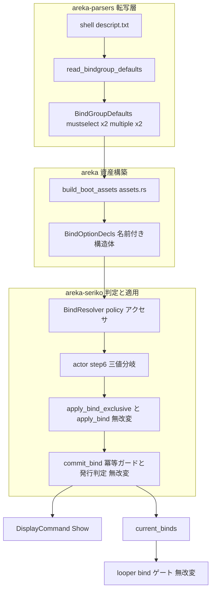
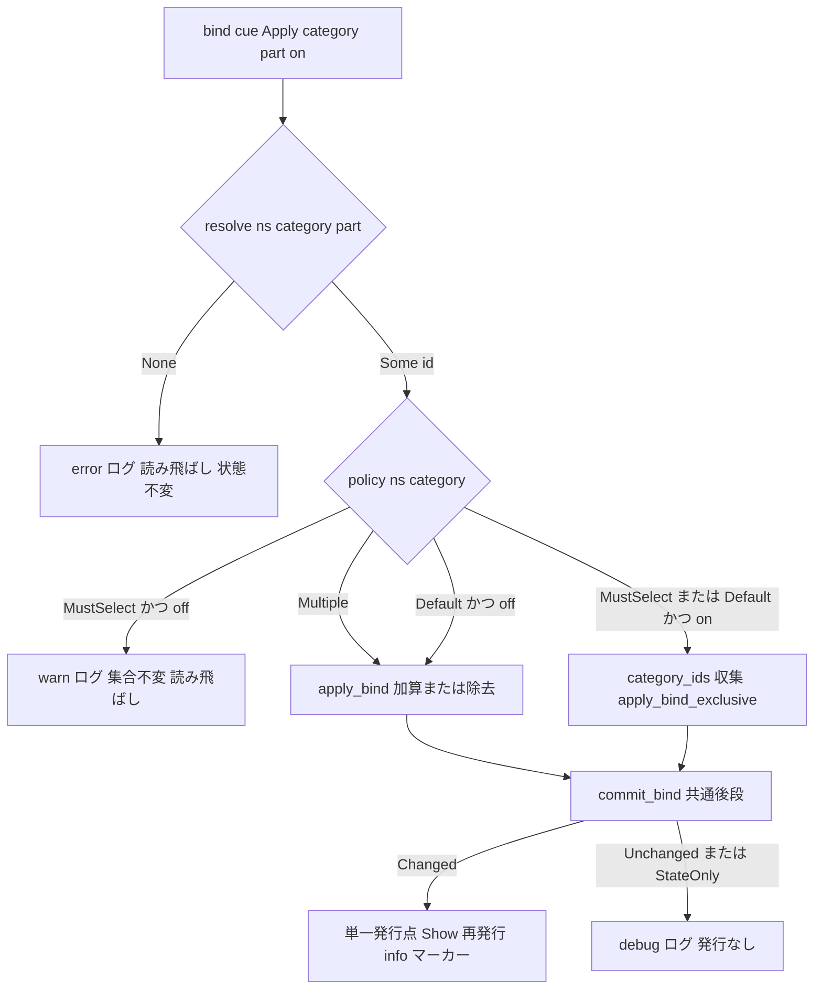

# Technical Design: areka-P0-bindoption-exclusivity

## Overview

**Purpose**: 本機能は、shell descript の `bindoption` 宣言を ukadoc 正典の 3 値意味論（`mustselect`＝ちょうど 1 個・解除不可／非宣言＝高々 1 個・解除可／`multiple`＝複数可）どおりに実装し、エンドユーザ（ゴースト利用者）の実機で起きている**表情の非可逆固着**を根治する。

**Users**: ゴースト利用者は表情・着せ替えが正典どおり排他置換されることで固着のない表示を得る。シェル/ゴースト作者は SSP と同じ既定挙動（on のみ送る正典作法）で動くベースウェア互換性を得る。保守者は 2 値前提の誤った doc/テスト文言が一掃されたコードベースを得る。

**Impact**: 現行の 2 値実装（「`mustselect` か、さもなくば加算」）を 3 値へ是正する。変更の核は (a) parsers が `multiple` 宣言を収録して非宣言と区別可能にする（`+` 区切り複数オプションの正典適合を含む）、(b) seriko の排他判定述語を「mustselect である」から「multiple と明示宣言されていない」へ反転、(c) mustselect カテゴリの脱衣（off）指示を正典「解除不可」どおり読み流す（2026-08-11 裁定）、の 3 点。既存の排他置換実体（`apply_bind_exclusive`）・共通後段（`commit_bind`）・ログ流儀は無改変で再利用する。

### Goals

- `bindoption` の 3 値（`mustselect`／非宣言／`multiple`）を descript 読み取りから bind 適用分岐まで貫通させる
- 非宣言カテゴリの着衣（on）を排他置換にし、bind 集合の単調肥大（飽和による是正指示の握り潰し）を構造的に不可能にする
- mustselect カテゴリの脱衣（off）を正典「解除不可」へ適合させる（bind 集合不変・ログ痕跡あり）
- 判断分岐の決定論テスト全網羅＋emo2 実機サインオフ（ログ判定＋目視）で「檻が緑のまま実機で壊れる」再発を防ぐ
- 旧 2 値前提の doc コメント・テスト文言を一掃し、mayuna-compose R4.5/D11 の覆しを追跡可能に登記する

### Non-Goals

- SERIKO アニメーションのループ/interval 意味論（`completed/areka-P0-seriko-loop` 領分）
- z-order／合成順の変更（animation ID 昇順＝作者意図どおり正常。変更は誤った治療）
- ゴースト fixture（emo2）の辞書修正（正典準拠下では一過性ズレに縮退し自己修復。fixture で症状を隠すのは禁じ手）
- `\![bind]` Toggle 形／CategoryWide 形の実導出（全実走ログで発火ゼロ＝無関係・既知の別件先送り）
- `char*.bindoption*.group`（char2+）の走査追加（既存縮退の維持・D7 参照）
- DPI／スケール関心事（別 spec 領分）

## Boundary Commitments

### This Spec Owns

- `bindoption*.group` の 3 値読み取り（`sakura.`/`kero.` 接頭辞・`+` 区切り複数オプション・未知語読み流し・寛容パース）: `crates/areka-parsers/src/package/{resolve.rs, model.rs}`
- 「排他か」「解除不可か」のポリシー判定語彙: `crates/areka-seriko/src/bind.rs` の `BindChoicePolicy`／`BindResolver::policy`（`is_mustselect` は退役）
- bind 適用分岐（actor.rs step 6）の 3 値化と mustselect 脱衣無視: `crates/areka-seriko/src/actor.rs`
- 起動時資産構築での multiple 集合の搬送: `crates/areka/src/emo2_boot/assets.rs`
- 上記の決定論テスト檻・emo2 実機サインオフ判定基準と受け入れ記録
- 旧 2 値前提の doc コメント／テスト文言の一掃と mayuna-compose R4.5/D11 覆しの登記

### Out of Boundary

- `apply_bind_exclusive`・`commit_bind`・`accumulate` の実装ロジック（`state.rs`/`bind.rs`）——**doc コメントの文言更新のみ**行い、コードは無改変
- `looper.rs:215` の bind ゲート——読み取りのみ・無改変（排他置換が集合を正せば発火は自然に正常化）
- `BindResolver::empty()` の**署名**——変更禁止（W6 並走無干渉の前提条件・下記 Revalidation Triggers）
- `areka-emo-compose`（BindSet・合成順）・emo-present・placement・DPI 系
- `completed/areka-P0-mayuna-compose` 文書そのもの（不改変・本 spec 文書と roadmap 追記で追跡）

### Allowed Dependencies

- areka → areka-parsers（`MountModel.bindgroups` 転記の消費・既存方向）
- areka → areka-seriko（`BindResolver` 構築・既存方向）
- seriko は parsers に依存**しない**（既存不変・素データは areka 資産構築層が写す）
- 新規 crates.io 依存の追加は**禁止**（プロジェクト規律）
- 依存方向: parsers（転写）→ areka 資産構築 → seriko（判定・適用）→ emo-compose（表示）。逆流禁止

### Revalidation Triggers

- `BindResolver::empty()` の署名を変えた場合 → W6 並走 3 本（vis/zorder/scg）の無干渉前提が崩れる。**本 spec では変更しない**（areka 側呼出 4 箇所: `input_events/balloon_test_support.rs:73`・`emo2_boot/frame_test_support.rs:71`・`emo2_boot/mod.rs:374`・`spine.rs:671` は無傷に保つ）
- `BindResolver::new` の署名変更 → 全 8 呼出元（§File Structure Plan）を**同一変更で atomic 追随**（中間 stand-in 禁止）
- `BindGroupDefaults` へのフィールド追加は `#[non_exhaustive]` ゆえ additive（下流破壊なし）だが、既存フィールドの意味変更をした場合は mayuna-compose 由来の全消費者を再検証
- 適用ログの grep マーカー文言（`seriko: bind 適用`）を変えた場合 → 実機サインオフ判定式（§実機サインオフ）と過去ログ比較が壊れる。**変更しない**

## Architecture

### Existing Architecture Analysis

現行の bind 経路（mayuna-compose 実装）は次の直列で、本 spec はこの形を保ったまま述語と搬送を 3 値化する:

- 採取: `read_bindgroup_defaults`（resolve.rs）が descript.txt を 1 走査で転記（`.default`／`.name`／`bindoption*.group`）。現状 `bindoption` は `mustselect` 完全一致のみ収録し `multiple` を破棄——**情報欠落の根**。
- 転記モデル: `BindGroupDefaults`（model.rs・`#[non_exhaustive]`）に mustselect カテゴリ名 Vec ×2（sakura/kero）。
- 構築: `build_boot_assets`（assets.rs:253-267）が名前表 BTreeMap ×2＋mustselect BTreeSet ×2 から `BindResolver::new`（現 4 引数・本番唯一の呼出）。
- 判定: `BindResolver::is_mustselect`（bind.rs:121-127）——2 値述語。`category_ids`（bind.rs:134-146）は `.name` 表由来でカテゴリ非依存＝**非宣言カテゴリでもそのまま使える**。
- 適用: actor.rs:367 `if on && is_mustselect { apply_bind_exclusive } else { apply_bind }`。共通後段 `commit_bind`（state.rs:374-402）が冪等ガード・状態更新・発行判定。
- ログ: Changed=info（grep マーカー `seriko: bind 適用`）／Unchanged・StateOnly=debug（actor.rs:374-396）。
- ルーパー: looper.rs:215 が `current_binds(scope).contains(anim.id)` で発火ゲート（読み取りのみ）。

### Architecture Pattern & Boundary Map



**Architecture Integration**:
- Selected pattern: 既存の「転写 → 構築 → 純関数判定 → 単一発行点」直列を維持。変更は述語の意味反転と搬送データの追加に局在。
- Domain boundaries: parsers は**解釈しない**（オプション語の所属集合をスコープ別に忠実転記）。3 値の**解釈**（policy 導出・優先則）は seriko の `BindResolver` に一元化。
- Existing patterns preserved: `apply_bind_exclusive`／`commit_bind`／`accumulate`・Changed=info/Unchanged=debug のログ流儀・寛容パース（捏造しない・読み流す）。
- New components rationale: `BindChoicePolicy`（3 値を型で明示・off 経路の mustselect 判別に必要）・`BindOptionDecls`（同型 4 引数の取り違え排除と署名 churn 打ち止め）。
- Steering compliance: ログ無し失敗経路の禁止・決定論テスト網羅必達・実機サインオフ有界 auto-exit＋ログ grep・新規依存なし。

### Key Design Decisions

research.md §6 の設計判断事項 #1〜#8 への裁定。以後本文書では D1〜D8 で引く。

**D1: mustselect「解除不可」を本 spec で実装する（2026-08-11 開発者裁定・GO）**
mustselect カテゴリへの off（脱衣）指示は bind 集合を**変更せず**読み流し、`warn!` でログ痕跡を残す（3.2）。レベル選定の根拠: steering logging 基準で warn は「無効なパラメーター・回復可能な警告」——ゴースト側の正典逸脱指示を正典どおり無視する事象に合致し、emo2 実測では発火ゼロ（休眠）ゆえ高頻度化の懸念もない。debug では実機サインオフの `RUST_LOG=info` 実走で不可視となり「無言の握り潰し」の再来になるため不採用。旧 R6.4 の先送り登記条項は本裁定で解消（6.4 の記録は本節が担う）。

**D2: 搬送形＝Option A の格納＋Option B の語彙（seriko 限定）＋Option C の構造体引数**
- 格納（A）: parsers は `BindGroupDefaults` へ `sakura_multiple`/`kero_multiple: Vec<String>` を追加するのみ（転写層原則維持——enum 解釈を parsers に持ち込む純 B 案は**棄却**。parsers はオプション語の所属を写すだけで意味を解釈しない）。
- 語彙（B）: seriko 側は typed enum `BindChoicePolicy { MustSelect, Default, Multiple }` と単一アクセサ `BindResolver::policy(ns, category)` に一本化。D1 裁定により off 経路で MustSelect と Default の判別が**必須**になり、bool 述語 2 本（is_exclusive＋is_mustselect）より 3 値 enum 1 本が分岐・doc・テスト語彙のすべてで一致する（6.1 の一掃語彙と実装語彙の一致）。
- 引数（C）: `BindResolver::new` は名前表 2 本＋名前付き構造体 `BindOptionDecls` の 3 引数へ。純 A の 6 引数直列は同型 `BTreeSet<String>` が 4 本並び取り違えをコンパイラが検出できない。本件は 2 度目の署名変更であり、名前付きフィールド＋`Default` 実装で churn を打ち止める。
- レビュー差分は A 比でわずかに増えるが、その増分はすべて D1 の必達要件（off 経路の 3 値判別）と取り違え排除に充当される。

**D3: `BindResolver::new(sakura, kero, options: BindOptionDecls)`・`empty()` 署名は不変**
`empty()` は現署名 `pub fn empty() -> Self` のまま内部フィールドのみ拡張（全集合空）。空 resolver では policy が全カテゴリ `Default`（排他既定）へ意味反転するが、`empty()` は名前表も空＝`resolve()` が常に `None` で適用に到達しないため**挙動への実害はない**（bind.rs:85-89 の旧文言「mustselect も空ゆえ排他判定は常に非排他」は 6.1 の一掃対象）。署名不変の保証は追加テスト不要——`empty()` の外部呼出 10 箇所超がコンパイル結合で検証する。W6 並走無干渉の前提条件として本節に固定する。

**D4: `mustselect+multiple` 併記は multiple 優先（複数可・非排他）**
正典文言「multipleで複数のパーツを選択可能」に整合する解釈で確定する。SSP 実機追験は行わない（追験環境の構築コストに対し、正典文言が一意に読め、かつ emo2 に併記宣言が存在せず実機観測の対象にならないため。根拠として正典逐語引用を research.md §1.5 に保全済み）。実装表現: `policy()` の導出順——`multiple` 集合所属を先に判定し、次に `mustselect` 集合、どちらでもなければ `Default`。parsers は両集合へ忠実に転記する（併記の情報を落とさない）ため、将来解釈を変える場合も parsers 無改変で済む。

**D5: `is_mustselect`（seriko）は退役・`policy()` へ一本化。parsers 側アクセサは転写所属照会として保持**
- seriko `BindResolver::is_mustselect` は削除し、全利用箇所（actor 分岐・in-crate テスト）を `policy()` へ置換（6.1 の一掃対象に含める）。旧述語を残すと「mustselect＝排他」の 2 値語彙が生き残り、次の読み手を誤らせる。
- parsers `BindGroupDefaults::is_mustselect`（本番消費者なし・テスト専用）は「mustselect と**宣言されているか**」の転写所属照会として意味が正典下でも正しいため保持し、対称の `is_multiple` を追加する（in-file テストの可読性維持・解釈は含まない）。

**D6: テスト改名・期待値反転の方針**
- `bind_non_mustselect_accumulates_via_actor`（actor_bind_loop_tests.rs:195・実体＝**異カテゴリ**加算）→ `bind_cross_category_accumulates_via_actor` へ改名し実体保持（4.5）。「非 mustselect カテゴリは従来どおり加算」の文言は「異なるカテゴリ間の bind は共存する（3.4）」へ更新。
- resolve.rs in-file テスト `multiple_option_not_ingested` → 期待値ごと反転（multiple **収録**を検証する名前・アサーションへ）。
- 新正典の語彙: 「排他置換（exclusive）」「既定（Default＝高々 1 個・解除可）」「複数可（Multiple）」。テスト名・アサーションメッセージはこの語彙で統一する。

**D7: char2+（`char*.bindoption*.group`）は既存縮退の維持**
正典に実在するが、現行 parsers は `sakura.`/`kero.` 接頭辞のみ走査し `scope_namespace` も "0"/"1" のみ写像（M1 未取込・M-dual シーム）。本 spec は bindoption の走査もこの既存縮退に揃える——**新規の乖離ではなく**、要件追加は不要。語彙としてここに登記し、M-dual が拡張時に本節を参照する。

**D8: mayuna-compose 引用の差し替え規約**
コード内 doc コメントの「D11」「R4.5」「Req 4.5」（mayuna-compose 参照）は、本 spec の設計判断 ID（`bindopt D1`〜`bindopt D8`）または要件 ID（`bindopt 2.1` 形式）へ置換する。裸の「D*/R*」を残さない（次の spec が同じ衝突を起こさないため spec 略号 `bindopt` を冠する）。`completed/areka-P0-mayuna-compose` の文書は不改変。覆しの登記は下記「mayuna-compose 覆しの記録」と、spec 完了時の roadmap 追記（6.3）で行う。

### mayuna-compose 覆しの記録（6.2）

本 spec は `completed/areka-P0-mayuna-compose` の **R4.5**（requirements.md:85）および **D11**（design.md:68 表・:142）——「`multiple`（紅等・非宣言＝既定）はスクリプト明示 on/off で従来どおり成立ゆえ語彙保持のまま」「非宣言は既定＝非排他で無視」——を**覆す**。根拠:

1. **正典**: ukadoc `descript_shell`（2026-08-11 MCP 逐語再確認）——既定値は「選択解除可能、**複数選択不可**」。非宣言＝非排他（加算）は正典に反する。
2. **実機証拠**: emo2 実走の直接観測（2026-08-11・`target/bindopt-debug-observation.log`）——非宣言のまばたきカテゴリで bind 集合が {1403}→{1403,1400}→{1403,1400,1402} と単調肥大・飽和後 28 件の是正指示が全て Unchanged に落ちて握り潰され、表情が非可逆固着した。ゴーストは正典作法（on のみ送る）で完全にシロ。
3. 同 spec は `mustselect` についても同型の誤仮定（「ゴーストが明示 off を送るはず」）を 2026-07-23 に実機反証された前例があり、本件は**同じ穴の 2 度目**。

completed 文書は不改変とし、本記録と roadmap 追記（spec 完了時・6.3）で追跡する。

### Technology Stack

| Layer | Choice / Version | Role in Feature | Notes |
|-------|------------------|-----------------|-------|
| 転写層 | areka-parsers（既存 crate） | bindoption 3 値の忠実転記 | 新規依存なし |
| エンジン | areka-seriko（既存 crate） | policy 判定・適用分岐・状態 | 新規依存なし |
| アプリ | areka（既存 crate） | 起動時資産構築・実機サインオフ | 新規依存なし |
| ログ | tracing（workspace 既存） | warn!/info!/debug! の既存流儀 | steering logging 準拠 |

## File Structure Plan

新規ソースファイルなし。既存ファイルの修正と、実機サインオフ受け入れ記録 1 本の新規作成。

### Modified Files

**コア変更（①採取 → ②判定 → ③結線の brief 境界どおり）**

- `crates/areka-parsers/src/package/model.rs` — `BindGroupDefaults` へ `sakura_multiple`/`kero_multiple: Vec<String>` を追加（`#[non_exhaustive]` ゆえ additive）。`is_multiple` アクセサ追加。`is_mustselect` doc・フィールド doc の 2 値前提文言を 3 値正典へ更新。in-file テスト（bindgroup_name_tests）の文言更新＋multiple フィールドのテスト追加。
- `crates/areka-parsers/src/package/resolve.rs` — `parse_bindoption_mustselect` を `parse_bindoption_options`（`+` 区切り分解・オプション語ごとの個別認識・未知語読み流し）へ置換。走査部（:172-188）で mustselect/multiple を各スコープ集合へ転記。定数 `MULTIPLE_OPTION` 追加。doc（:120-121・:172-176・:190-195）一掃。in-file テスト（bindoption_mustselect_tests）を 3 値・`+` 区切りマトリクスへ拡張・`multiple_option_not_ingested` は期待値反転。
- `crates/areka-seriko/src/bind.rs` — `BindChoicePolicy` enum・`BindOptionDecls` 構造体（`Default` 実装）を新設。`BindResolver` の内部集合を 4 本（mustselect×2・multiple×2）へ拡張。`new(sakura, kero, options: BindOptionDecls)` へ署名変更。`policy(ns, category)` アクセサ新設・`is_mustselect` 退役。doc（:53-60・:69-70・:85-89・:116-120）一掃。in-crate テストを policy マトリクスへ書き換え。
- `crates/areka-seriko/src/actor.rs` — step 6（:364-372）を 3 値分岐へ差し替え（mustselect×off の無視＋`warn!` を含む）。doc（:170・:364-366）一掃・引用差し替え（D8）。
- `crates/areka-seriko/src/state.rs` — **doc コメントのみ**（:329-339 の「mustselect（排他選択）カテゴリの」限定文言を「排他カテゴリ（mustselect／非宣言既定）の」汎用文言へ）。コード無改変。
- `crates/areka/src/emo2_boot/assets.rs` — multiple 集合の構築を追加し `BindOptionDecls` で `BindResolver::new` へ渡す（:253-267）。doc（:261-262 の「Req 4.5・D11」引用）差し替え（D8）。

**テスト追随（atomic・`BindResolver::new` 全 8 呼出元）**

`BindResolver::new` 呼出元台帳（署名変更と同一コミットで全数追随・中間 stand-in 禁止）:
1. `crates/areka/src/emo2_boot/assets.rs:267`（本番唯一）
2. `crates/areka-seriko/src/bind.rs:356`
3. `crates/areka-seriko/src/bind.rs:370`
4. `crates/areka-seriko/src/actor_bind_loop_tests.rs:64`
5. `crates/areka-seriko/src/actor_bind_loop_tests.rs:76`
6. `crates/areka-seriko/src/actor_bind_loop_tests.rs:202`
7. `crates/areka-seriko/tests/bind_e2e.rs:123`
8. `crates/areka-seriko/tests/bind_e2e.rs:244`

- `crates/areka-seriko/src/actor_bind_loop_tests.rs` — new() 追随（3 箇所）・檻改名（D6）・最小再現檻＋policy×on/off マトリクス檻＋multiple 明示加算檻の追加。
- `crates/areka-seriko/tests/bind_e2e.rs` — new() 追随（2 箇所）・「mustselect 空集合＝全カテゴリ非排他」等の旧前提コメント更新（非宣言 1 パーツ/カテゴリ構成ゆえ**期待値は集合同値で不変**・§テスト影響監査）。
- `crates/areka-seriko/src/actor_dispatch_tests.rs` — `empty()` のみ使用＝**無改変見込み**（監査で確認のみ）。

**変更しないファイル（明示・境界の錨）**

- `crates/areka-seriko/src/looper.rs`（:215 bind ゲート・読み取りのみ）
- `crates/areka/src/input_events/balloon_test_support.rs:73`・`crates/areka/src/emo2_boot/frame_test_support.rs:71`・`crates/areka/src/emo2_boot/mod.rs:374`・`crates/areka/src/emo2_boot/spine.rs:671`（`empty()` 呼出＝署名不変ゆえ無傷・W6 無干渉の監視対象）
- `crates/areka-emo-compose/`（z-order・BindSet）
- `doc/emo2-conformance-scope.md`（:43 の bindoption 言及は descript キーの列挙のみで旧前提の主張を含まない——2026-08-11 現物確認済み・追随不要）

### New Files

- `.kiro/specs/areka-P0-bindoption-exclusivity/real-machine-signoff.md` — 実機サインオフ受け入れ記録（5.5。判定・実測値・実施条件。実装フェーズで作成）

## System Flows

### bind 適用の 3 値分岐（actor step 6・是正後）



フロー上の決定:
- 分岐は `(on, policy)` の直積で尽きる（下表）。off 経路は MustSelect のみ特別（無視）、他は従来の `apply_bind`（除去）。
- `category_ids` は `.name` 宣言表由来（bind.rs:134-146・無改変）。resolve 成功済みならカテゴリは必ず表に在るため空にならず、排他置換は常に定義される。
- 冪等ガード・発行判定は `commit_bind` に集約済み（無改変）——同一パーツ再 on は Unchanged（2.5）、Hidden/未知 scope は StateOnly（2.6）が**全ポリシーで**同型に効く。

| on | policy | 動作 | 要件 |
|----|--------|------|------|
| true | MustSelect | 排他置換（従来どおり） | 3.1 |
| true | Default | **排他置換（本 spec の是正）** | 2.1 |
| true | Multiple | 加算（従来どおり） | 3.3 |
| false | MustSelect | **無視＋warn!（本 spec の是正・集合不変）** | 3.2 |
| false | Default | 除去（解除可＝正典既定） | 2.2 |
| false | Multiple | 除去（従来どおり） | 3.3 |

## Requirements Traceability

| Requirement | Summary | Components | Interfaces | Flows |
|-------------|---------|------------|------------|-------|
| 1.1 | multiple 宣言のスコープ別収録 | bindoption 採取 | `BindGroupDefaults.sakura_multiple/kero_multiple` | 採取走査 |
| 1.2 | mustselect 収録の既存挙動不変 | bindoption 採取 | `BindGroupDefaults.sakura_mustselect/kero_mustselect` | 採取走査 |
| 1.3 | `+` 区切り複数オプションの個別解釈 | bindoption 採取 | `parse_bindoption_options` | 採取走査 |
| 1.4 | 未知語の読み流し（寛容パース） | bindoption 採取 | `parse_bindoption_options` | 採取走査 |
| 1.5 | カテゴリ空/オプション欠落は収録対象外 | bindoption 採取 | `parse_bindoption_options` | 採取走査 |
| 1.6 | 宣言ゼロ shell の成立（全カテゴリ既定） | bindoption 採取 | `read_bindgroup_defaults` | 採取走査 |
| 1.7 | 収録の決定論（走査順維持） | bindoption 採取 | `parse_kv` BTreeMap 反復順（既存） | 採取走査 |
| 2.1 | 非宣言カテゴリ on の排他置換 | policy 判定・適用結線 | `policy()==Default`→`apply_bind_exclusive` | 3 値分岐 |
| 2.2 | 非宣言カテゴリ off の除去（解除可） | 適用結線 | `apply_bind(off)`（既存） | 3 値分岐 |
| 2.3 | 飽和（握り潰し）の構造的不成立 | 適用結線 | 2.1 の帰結（高々 1 個不変量） | 3 値分岐・実機観測 |
| 2.4 | Changed の単一発行点＋info ログ維持 | 適用結線 | `commit_bind`＋actor ログ（既存無改変） | 3 値分岐 |
| 2.5 | 冪等（変更時のみ発行）維持 | 適用結線 | `commit_bind` 冪等ガード（既存無改変） | 3 値分岐 |
| 2.6 | 非表示/未知 scope の縮退維持 | 適用結線 | `commit_bind` StateOnly（既存無改変） | 3 値分岐 |
| 2.7 | 名前解決不能の error+skip 維持 | 適用結線 | actor step 5（既存無改変） | 3 値分岐 |
| 3.1 | mustselect on の排他置換不変 | policy 判定・適用結線 | `policy()==MustSelect`→`apply_bind_exclusive` | 3 値分岐 |
| 3.2 | mustselect off の無視＋ログ（解除不可） | 適用結線 | actor step 6 前段ガード＋`warn!`（D1） | 3 値分岐 |
| 3.3 | multiple の加算/除去不変 | policy 判定・適用結線 | `policy()==Multiple`→`apply_bind` | 3 値分岐 |
| 3.4 | 異カテゴリ共存の不変 | 適用結線 | `apply_bind_exclusive` は同カテゴリ ID のみ除去（既存） | 3 値分岐 |
| 3.5 | workspace テスト決定論的緑 | 檻群・全呼出元 atomic 追随 | `cargo test --workspace` | — |
| 4.1 | 最小再現の反転檻 | 檻群 | actor 経路 in-crate テスト | 3 値分岐 |
| 4.2 | 読み取り 3 値分岐の網羅檻 | 檻群 | resolve.rs in-file テスト | 採取走査 |
| 4.3 | policy×着衣/脱衣マトリクス檻 | 檻群 | actor_bind_loop_tests＋bind.rs テスト | 3 値分岐 |
| 4.4 | GPU/実窓/実機/実時間 非依存 | 檻群 | 全檻は純関数＋mock 出力（既存流儀） | — |
| 4.5 | 旧語彙テストの改名・実体保持 | 文書整合 | D6 | — |
| 5.1 | 実機実走の決定論的判定形 | 実機サインオフ | 絶対パス＋`AREKA_APP_SMOKE_EXIT_MS`＋grep | 実機観測 |
| 5.2 | まばたき複数パーツ共存痕跡の不在 | 実機サインオフ | 判定式 J1 | 実機観測 |
| 5.3 | ジト目からの復帰目視 | 実機サインオフ | 判定 J3（目視） | 実機観測 |
| 5.4 | 飽和パターンの不在 | 実機サインオフ | 判定式 J2 | 実機観測 |
| 5.5 | 受け入れ記録の文書化 | 実機サインオフ | real-machine-signoff.md | — |
| 5.6 | 不一致時は是正まで未完了 | 実機サインオフ | 受け入れ記録＋spec 完了ゲート | — |
| 6.1 | 旧 2 値前提 doc/引用の一掃 | 文書整合 | D8 の差し替え規約・§1.4 棚卸り台帳 | — |
| 6.2 | mayuna-compose 覆しの明記 | 文書整合 | §mayuna-compose 覆しの記録 | — |
| 6.3 | roadmap 追記による追跡 | 文書整合 | spec 完了時（kiro-complete）に roadmap へ追記 | — |
| 6.4 | 2026-08-11 裁定の記録 | 文書整合 | D1（本設計書に記録済み） | — |

## Components and Interfaces

| Component | Domain/Layer | Intent | Req Coverage | Key Dependencies | Contracts |
|-----------|--------------|--------|--------------|------------------|-----------|
| bindoption 採取 | parsers 転写層 | 3 値宣言の忠実転記 | 1.1-1.7 | parse_kv（P0） | Service |
| policy 判定 | seriko 純関数層 | 3 値ポリシー導出 | 2.1, 3.1, 3.3 | BindOptionDecls（P0） | Service |
| 適用結線 | seriko actor | 分岐差し替え＋off 無視 | 2.1-2.7, 3.1-3.4 | policy 判定（P0）・state.rs（P0・無改変） | Service, Event |
| 資産構築 | areka boot | multiple 集合の搬送 | 1.1（下流成立）, 3.5 | parsers（P0）・seriko（P0） | Service |
| 決定論檻群 | テスト | 判断分岐の全網羅 | 4.1-4.5, 3.5 | 各コンポーネント | — |
| 実機サインオフ | 観測 | 固着解消の実機確認 | 5.1-5.6 | emo2 fixture・実 pasta.dll | — |
| 文書整合 | 横断 | 旧前提一掃・覆し登記 | 6.1-6.4, 4.5 | D6/D8 | — |

### parsers 転写層

#### bindoption 採取（read_bindgroup_defaults／parse_bindoption_options）

| Field | Detail |
|-------|--------|
| Intent | `bindoption*.group` の値をオプション語単位で分解し、認識できる語の所属をスコープ別に忠実転記する |
| Requirements | 1.1, 1.2, 1.3, 1.4, 1.5, 1.6, 1.7 |

**Responsibilities & Constraints**
- 転記のみ・解釈しない（parsers 転写層原則）。「排他か」の判定語彙は持たない。
- 寛容パース: 未知語は読み流す（1.4）。カテゴリ名空・オプション欄欠落は収録対象外（1.5）。宣言ゼロは空集合で成立（1.6）。
- 決定論: `parse_kv` の BTreeMap 反復順（キー昇順）——既存のまま（1.7）。
- 走査は既存の 1 パス（`.default`/`.name`/`bindoption*.group` 同居）を維持し、bindoption 経路のみ置換。

**Dependencies**
- Inbound: `resolve()`（MountModel 構築）— 既存呼出（P0）
- Outbound: `BindGroupDefaults` — 転記先（P0）

**Contracts**: Service [x]

##### Service Interface

```rust
/// `bindoption*.group` の値 `カテゴリ名,オプション[+オプション...]` を分解する。
/// 戻り値: カテゴリ名と、認識できたオプションの有無（mustselect / multiple）。
/// カテゴリ空・オプション欄欠落（','なし）・認識できる語ゼロは None（収録対象外・捏造しない）。
struct BindOptionDecl {
    category: String,
    mustselect: bool,
    multiple: bool,
}
fn parse_bindoption_options(value: &str) -> Option<BindOptionDecl>;
```

- Preconditions: `value` は `parse_kv` 済みの生の値文字列（trim は本関数が行う）。
- Postconditions: `splitn(2, ',')` でカテゴリとオプション欄を分け、オプション欄を `'+'` で split・各語 trim・完全一致（`mustselect`/`multiple`）で認識。認識語がどちらも偽なら `None`（未知語のみ＝収録なし・1.4/1.5）。オプション欄が空文字列（`カテゴリ,` 形）も認識語ゼロ＝`None`。
- Invariants: 副作用なし・同一入力同一出力。呼び手（走査部）が `mustselect==true` なら mustselect Vec へ、`multiple==true` なら multiple Vec へ、**両方真なら両方へ** push する（併記の情報を落とさない・D4 の優先則は seriko が担う）。

**Implementation Notes**
- Integration: 走査部の既存 `parse_bindgroup_id(key, ...BINDOPTION..., .group)` によるキー形検証は不変。
- Validation: in-file テストで 3 値・`+` 区切り・未知語・不完全値・宣言ゼロのマトリクスを固定（4.2）。
- Risks: なし（additive なフィールド追加＋局所関数置換）。

#### BindGroupDefaults 拡張（model.rs）

Summary-only: `sakura_multiple`/`kero_multiple: Vec<String>` を追加（`#[non_exhaustive]`＋`Default` ゆえ既存構築は無傷）。`is_multiple(scope, category) -> bool` を `is_mustselect` と対称に追加（転写所属照会・テスト向け・D5）。doc は 3 値正典の記述へ更新（6.1）。

### seriko 純関数層

#### BindChoicePolicy／BindOptionDecls／BindResolver::policy（bind.rs）

| Field | Detail |
|-------|--------|
| Intent | カテゴリの 3 値ポリシーを型で明示し、単一アクセサで導出する（判定の一元化） |
| Requirements | 2.1, 3.1, 3.3（判定根拠）, 1.1（下流での区別成立） |

**Responsibilities & Constraints**
- 3 値の**解釈**（併記優先則を含む）はここに一元化する。actor は policy を受け取るだけ。
- 純関数・副作用なし・`Send` 維持（`BTreeSet<String>` は `Send`）。
- `empty()` の署名不変（D3・W6 前提）。

**Dependencies**
- Inbound: actor step 6 — policy 照会（P0）／assets.rs — 構築（P0）
- Outbound: なし（自己完結の所有スナップショット）

**Contracts**: Service [x]

##### Service Interface

```rust
/// カテゴリの着せ替え選択ポリシー（ukadoc 正典の 3 値・bindopt 設計 D2）。
#[derive(Clone, Copy, Debug, PartialEq, Eq)]
pub enum BindChoicePolicy {
    /// mustselect 宣言: ちょうど 1 個（着衣=排他置換・脱衣=無視〔解除不可〕）。
    MustSelect,
    /// 非宣言（既定）: 高々 1 個（着衣=排他置換・脱衣=除去〔解除可〕）。
    Default,
    /// multiple 宣言: 複数可（着衣=加算・脱衣=除去）。
    Multiple,
}

/// bindoption 宣言のスコープ別集合（名前付き搬送・bindopt 設計 D2/D3）。
/// Default 実装＝全集合空（全カテゴリ Default ポリシー）。
#[derive(Clone, Debug, Default)]
pub struct BindOptionDecls {
    pub sakura_mustselect: BTreeSet<String>,
    pub kero_mustselect: BTreeSet<String>,
    pub sakura_multiple: BTreeSet<String>,
    pub kero_multiple: BTreeSet<String>,
}

impl BindResolver {
    /// 名前表 2 本と bindoption 宣言集合から構築する（全 8 呼出元 atomic 追随）。
    pub fn new(
        sakura: BTreeMap<(String, String), u32>,
        kero: BTreeMap<(String, String), u32>,
        options: BindOptionDecls,
    ) -> Self;

    /// 署名不変（W6 並走無干渉の前提・bindopt 設計 D3）。全集合空＝全カテゴリ Default。
    pub fn empty() -> Self;

    /// カテゴリの 3 値ポリシー導出（純粋）。導出順: multiple 所属 → Multiple、
    /// 次に mustselect 所属 → MustSelect、どちらでもなければ Default。
    /// 併記（mustselect+multiple）は multiple 優先（正典文言・bindopt 設計 D4）。
    /// 未知カテゴリ（名前表に無いカテゴリを含む）も Default（正典既定）。
    pub fn policy(&self, ns: BindNamespace, category: &str) -> BindChoicePolicy;

    // resolve / category_ids は既存のまま無改変。is_mustselect は退役（bindopt 設計 D5）。
}
```

- Preconditions: なし（任意のカテゴリ名で呼べる）。
- Postconditions: 同一入力同一出力。名前空間隔離（Sakura は sakura 集合のみ／Kero は kero 集合のみ）。
- Invariants: `empty().policy(_, _) == Default`（ただし `empty()` は resolve 常時 None ゆえ適用到達なし＝挙動実害なし・D3）。

**Implementation Notes**
- Integration: 内部格納は BTreeSet 4 本（Option A 同型）。`BindOptionDecls` をフィールドごと保持するか展開するかは実装自由（公開契約は policy() のみ）。
- Validation: policy 導出マトリクス（宣言 3 種×2 名前空間＋併記＋未知カテゴリ＋empty）を in-crate テストで固定（4.2/4.3）。
- Risks: 既定の意味反転が「multiple 集合が空の非空 resolver」を使う既存テストに波及——§テスト影響監査で全数確認済み（同一カテゴリ複数 on を前提とするテストは存在しない）。

### seriko actor（適用結線）

#### actor step 6 の 3 値分岐（actor.rs）

| Field | Detail |
|-------|--------|
| Intent | policy に基づく適用分岐と mustselect 脱衣無視（本 spec の是正の結線点） |
| Requirements | 2.1, 2.2, 2.3, 2.4, 2.5, 2.6, 2.7, 3.1, 3.2, 3.3, 3.4 |

**Responsibilities & Constraints**
- 分岐前段（step 1-5: キャリア開封・引数解釈・scope 写像・名前解決）は無改変（2.7 は step 5 既存）。
- 分岐後段（`commit_bind`・単一発行点・Changed=info/Unchanged=debug）は無改変（2.4/2.5/2.6）。
- 変更は step 6 のみ: `is_mustselect` 述語を `policy()` へ差し替え、mustselect×off の前段ガードを追加。

**Contracts**: Service [x] / Event [x]

##### Service Interface（分岐仕様）

```rust
// (step 6) 適用＋発行（bindopt 設計 D1/D2・要件 2.1/3.1/3.2/3.3）。
let policy = bind_resolver.policy(ns, &category);

// mustselect の脱衣は正典「解除不可」: 集合を変えず読み流し、痕跡を warn! で残す（3.2・D1）。
if !on && policy == BindChoicePolicy::MustSelect {
    tracing::warn!(
        scope = %cue.actor, category = %category, part = %part, id, on,
        "seriko: mustselect カテゴリの脱衣指示を無視（正典・解除不可・bindopt 3.2）"
    );
    return ControlFlow::Continue(());
}

let outcome = if on && policy != BindChoicePolicy::Multiple {
    // MustSelect（従来どおり・3.1）／Default（本 spec の是正・2.1）の着衣は排他置換。
    let cat_ids = bind_resolver.category_ids(ns, &category);
    states.apply_bind_exclusive(&cue.actor, &cat_ids, id)
} else {
    // Multiple の着衣＝加算（3.3）／MustSelect 以外の脱衣＝除去（2.2/3.3）。
    states.apply_bind(&cue.actor, id, on)
};
// 以降の outcome match（Changed=info 発行／StateOnly・Unchanged=debug）は無改変（2.4/2.5/2.6）。
```

- Preconditions: `id` は resolve 済み（step 5 通過）。
- Postconditions: 分岐は §System Flows の直積表と一致。mustselect×off は状態・発行とも不変。
- Invariants: 異カテゴリの bind 共存不変（`apply_bind_exclusive` は同カテゴリ `category_ids` のみ除去・3.4）。単一発行点（`emit_display`）以外から表示を発行しない。

##### Event Contract（ログ・観測面）

- Published: `info!("seriko: bind 適用")`（Changed 時のみ・grep マーカー**文言不変**）／`debug!`（Unchanged/StateOnly・文言既存）／`warn!`（mustselect 脱衣無視・**新設**・上記文言）／`error!`（解決不能・既存）。
- ログ無し失敗経路なし（steering logging 規律・全分岐にログ痕跡）。

**Implementation Notes**
- Integration: doc コメント（:170「empty() で従来と byte 同値」・:364-366）は 3 値語彙へ更新し引用を差し替える（D8）。「empty() ＝ byte 同値」の主張は 3 値化後も真（resolve 不能ゆえ適用到達なし）だが根拠の文言を D3 のとおり書き直す。
- Validation: policy×on/off の 6 セル全部を actor 経路の檻で固定（§Testing Strategy）。warn! はログ檻（`capture_logs_flow` 既存基盤）で文言・レベルを固定。
- Risks: なし（分岐は純関数値の照合のみ・状態操作は既存 API）。

### areka boot（資産構築）

#### build_boot_assets の搬送拡張（assets.rs）

Summary-only: `model.bindgroups.sakura_multiple/kero_multiple` から BTreeSet を構築し、既存 mustselect 2 集合とあわせ `BindOptionDecls` として `BindResolver::new` へ渡す（:253-267 の既存パターンの延長・数行）。doc の「Req 4.5・D11」引用を差し替え（D8）。既存 `default_bind_ids`/`static_binds` 経路は無改変。

**設計上の注記（既定集合との整合）**: `default,1` で同一非宣言カテゴリの複数パーツが起動時 on になっている shell では、静的既定集合はそのまま尊重され（無改変）、当該カテゴリへの最初の on 指示で高々 1 個へ収束する（排他置換の自然な帰結・正典適合）。emo2 の既定集合 `{1100,1207,1302,1500,1800}` はカテゴリ重複なしのため実機挙動に影響しない。

## Data Models

### Domain Model

- **BindChoicePolicy（値オブジェクト・seriko）**: カテゴリの選択ポリシー 3 値。導出規則（multiple 優先）は `BindResolver::policy` に一元化（D4）。
- **BindOptionDecls（値オブジェクト・seriko）**: bindoption 宣言のスコープ別カテゴリ名集合 4 本。名前付きフィールドで搬送し引数取り違えを排除（D2/D3）。
- **BindGroupDefaults（転記モデル・parsers）**: 既存 6 フィールド＋`sakura_multiple`/`kero_multiple: Vec<String>`。転記順保持・重複可（集合化は構築層の BTreeSet 変換が担う——既存 mustselect と同型）。
- **不変量（本 spec の核）**: 非宣言カテゴリの bind 集合は任意の適用列の後で高々 1 個（2.1/2.3）。mustselect カテゴリは off 指示で不変（3.2）。異カテゴリは互いに干渉しない（3.4）。

### Data Contracts & Integration

- parsers → areka: `BindGroupDefaults`（`#[non_exhaustive]`・additive 拡張ゆえ既存消費者無傷）。
- areka → seriko: `BindOptionDecls`（新設・`Default` で空＝全カテゴリ既定）。
- seriko 内: `BindChoicePolicy`（actor が消費する唯一の判定語彙）。

## Error Handling

### Error Strategy

既存の bind 経路のログ流儀を全分岐で維持・延長する（ログ無し失敗経路の禁止）。本 spec で**新設**されるのは mustselect 脱衣無視の `warn!` のみ。

### Error Categories and Responses

| 事象 | 分類 | 応答 | 状態 |
|------|------|------|------|
| (カテゴリ, パーツ) 解決不能 | 入力異常（既存） | `error!`＋読み飛ばし | 不変（2.7） |
| bind 破損入力（Malformed） | 入力異常（既存） | `error!`＋読み飛ばし | 不変 |
| Toggle/CategoryWide 形 | 未実導出の正当構文（既存） | `warn!`＋読み飛ばし | 不変 |
| scope 写像なし（char2+） | 縮退（既存・D7） | `warn!`＋読み飛ばし | 不変 |
| mustselect カテゴリへの off | 正典逸脱指示の正典的無視（**新設**） | `warn!`＋読み飛ばし | 不変（3.2・D1） |
| bindoption 未知オプション語 | 寛容パース（新設・parsers） | 認識語のみ収録・読み流し | —（1.4） |
| 非表示/未知 scope への適用 | 縮退（既存） | `debug!`・StateOnly | 集合のみ更新（2.6） |
| 同値適用（冪等） | 正常（既存） | `debug!`・Unchanged | 不変（2.5） |

### Monitoring

- 実機 grep マーカー: `seriko: bind 適用`（info・Changed のみ・文言不変）が引き続き実機サインオフの一次観測点。
- 新設 warn の文言 `seriko: mustselect カテゴリの脱衣指示を無視` は grep 可能な固定文言とし、檻でレベル・文言を固定する。

## Testing Strategy

前提: 全決定論テストは GPU 実描画・実窓・実 DPI・実 SHIORI・sleep・実時間待機に依存しない（4.4・既存流儀: 純関数＋`MockSurfaceOutput`＋`capture_logs_flow`）。`cargo test --workspace` は i686 host-32 成果物のビルド後に実行する（steering 既知の前提）。

### Unit Tests（parsers・resolve.rs / model.rs）— 4.2, 1.1-1.7

1. `multiple` 単独宣言の収録（スコープ別・kero 隔離）——`multiple_option_not_ingested` の期待値反転（D6）＋新規ケース（1.1）
2. `mustselect` 単独宣言の収録不変（既存テスト維持・1.2）
3. `+` 区切り: `mustselect+multiple`（両収録）・`multiple+mustselect`（順序不感）・`unknown+multiple`（multiple のみ収録）（1.3/1.4）
4. 未知語のみ・オプション欄空・カテゴリ空・`,` なし → 収録対象外（1.4/1.5・既存 `missing_or_empty_fields_not_ingested` 拡張）
5. bindoption 宣言ゼロの shell → 両スコープ全集合空で成立（1.6）。同一 descript の再読で同一結果（1.7）
6. model.rs: `is_multiple` 所属照会・`#[non_exhaustive]` 既存構築の無傷確認・doc 語彙更新に伴う文言整合

### Unit Tests（seriko・bind.rs）— 4.2/4.3 の判定側

1. `policy()` 導出マトリクス: mustselect 宣言→MustSelect／multiple 宣言→Multiple／非宣言→Default／**併記→Multiple（D4）**／未知カテゴリ→Default、×2 名前空間（隔離）
2. `empty()` → 全カテゴリ Default＋resolve 常時 None（D3 の実害なし根拠を檻に固定）
3. `category_ids`・`resolve`・`accumulate` の既存檻は無改変維持（回帰の錨）

### Integration Tests（seriko actor 経路・actor_bind_loop_tests.rs）— 4.1, 4.3, 2.x, 3.x

1. **最小再現の反転檻（4.1）**: 非宣言カテゴリ（まばたき: 通常→1400/ジトー→1402）へ on を 2 回 → `current_binds` が `{static ∪ 1402}`（後勝ち 1 個）。旧欠陥挙動 {1400,1402} が正典期待値へ反転したことの檻
2. **policy×on/off 全 6 セル（4.3）**: MustSelect×on（排他・既存檻維持・3.1）／MustSelect×off（**無視・集合不変・warn! 文言檻**・3.2）／Default×on（排他・2.1）／Default×off（除去・2.2）／Multiple×on（**加算・同一カテゴリ 2 パーツ共存**・3.3——multiple 宣言カテゴリの檻は本 spec 初出）／Multiple×off（除去・3.3）
3. 異カテゴリ共存: `bind_non_mustselect_accumulates_via_actor` → `bind_cross_category_accumulates_via_actor` へ改名・実体保持（3.4/4.5・D6）
4. 既存流儀の維持檻: Default×on 排他置換でも Changed=info 発行（2.4）・同一パーツ再 on の Unchanged 非発行（2.5）・Hidden scope の StateOnly（2.6）・解決不能 error+skip（2.7・既存檻）

### E2E Tests（tests/bind_e2e.rs）— 3.5

- 既存シナリオは `new()` 追随＋コメント語彙更新のみで**期待値不変**（§テスト影響監査: 非宣言カテゴリは全構成で 1 パーツ/カテゴリゆえ排他置換と加算が集合同値）
- 追加 1 本: multiple 宣言カテゴリの貫通加算（`\![bind]` 2 連で両パーツ共存・3.3 の e2e 錨）

### Real Machine Sign-off（emo2・R5）— 5.1-5.6

手順（steering 流儀・確立済み）: 実 pasta.dll・辞書込みフルゴーストを**絶対パス**で起動、`AREKA_APP_SMOKE_EXIT_MS=420000` 有界 auto-exit、`RUST_LOG=info` 実走（＋必要に応じ `areka_seriko=debug` の補助実走）。ログを保全し以下で判定:

- **J1（5.2・共存痕跡の不在）**: ルーパー発火ログの各まばたき発火 `animation_id=140x`（時刻 t）について、t 直前の最新のまばたきカテゴリ `seriko: bind 適用`（info）の id が x と一致すること（＝任意の時点で発火し得るまばたき id は高々 1 種）。判定は保全ログに対する走査スクリプト（時刻順 1 パス）で決定論的に行う。是正前ログ（1400×156・1402×182 並行発火）ではこの検査が必ず赤になることを既知ケース較正として確認する
- **J2（5.4・飽和パターンの不在）**: 実走全体で |Changed 回数(まばたき) − Changed 回数(目)| ≤ 2、かつ最後のまばたき Changed が最後の目 Changed の 120 秒以内にあること（是正前観測: まばたき 3 回で恒久沈黙 vs 目は末尾まで継続——この形の不在を直接判定）
- **J3（5.3・目視）**: ジト目（目=ジトー＋まばたき=ジトー）へ切り替え後、次の表情変更で表示が正しく切り替わる（再起動不要・開発者サインオフ）
- **記録（5.5/5.6）**: 判定・実測値（Changed 回数・J1 走査結果・実施条件・ログファイルパス）を `real-machine-signoff.md` に記す。不一致があれば記録し是正まで完了としない

### テスト影響監査（既定の意味反転・全数）

「multiple 集合が空の非空 resolver」を使う全既存テストを実測列挙し、同一カテゴリ複数 on を前提とするものが**存在しない**ことを確認済み（research.md §7 に台帳）。要旨: `tiny_resolver`/`arm_bind_resolver`（1 パーツ/カテゴリ）・`mustselect_resolver`/`eye_mustselect_resolver`（非宣言側は 1 パーツ）・actor_bind_loop_tests:202 の 2 カテゴリ表（各 1 パーツ）・bind_e2e の `test_bind_resolver`（腕/頬 各 1 パーツ）・`mustselect_bind_resolver`（紅 1 パーツ）——いずれも排他置換と加算が集合同値となり期待値不変。`empty()` 系（actor_dispatch_tests ほか）は resolve 不能で適用に到達しない。実装タスクでこの監査を再実行し緑を確認する（3.5）。
