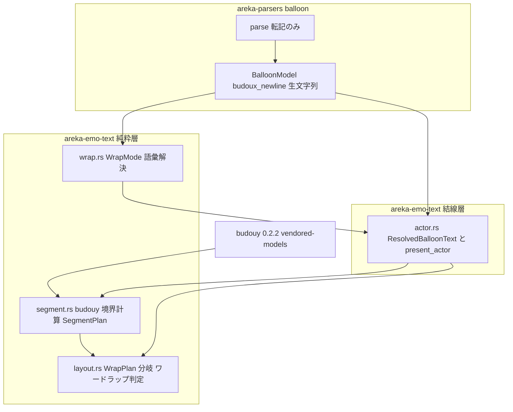
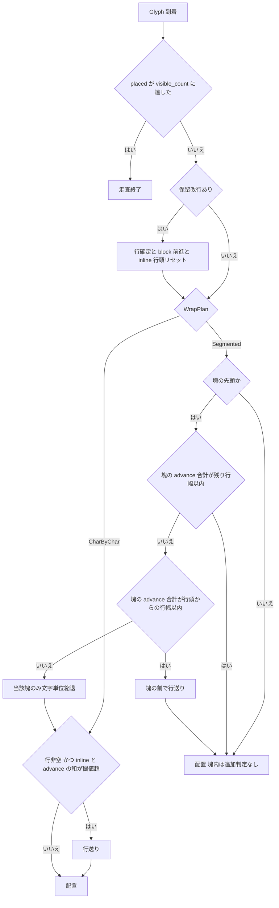

# Technical Design: areka-P0-budoux-newline

## Overview

**Purpose**: 本機能は、balloon descript の純 areka 拡張キー `budoux_newline` で opt-in したバルーンに限り、emo テキスト層（crate `areka-emo-text`）の自動折り返しの分割点を budoux 分かち書き境界（文節っぽい塊の境界）に揃えるワードラップモードを提供する。emo2 実機バルーンは 1 行が狭く（sakura 側 ≈ 全角 13 文字／kero 側 ≈ 全角 9 文字）、現行の文字単位折返しでは語・文節のぶつ切りが頻発する——本設計はその可読性問題を emo テキスト層内で完結して解消する。

**Users**: ゴースト作者は balloon descript へ `budoux_newline,1` を 1 行書くだけでワードラップを有効化でき、ユーザは狭いバルーンでも語が途中で途切れないテキストを読める。

**Impact**: 完了済み `areka-P0-emo-text-layer` の折返し判定（`layout.rs` の 4 段ゲート③）の**分割点選択だけ**を拡張する。閾値の源（`wordwrappoint`／`validrect`）・明示改行（`\n` 系 LineBreak）と保留改行（`areka-P0-newline-defer`）の意味論・あふれ→スクロール機構は一切変えない。既定は OFF（キー無し・`0`/`false`）で、OFF 時の既存コードパスは byte 等価に不変。

### Goals

- balloon descript `budoux_newline` の転記（parsers・生文字列）と emo テキスト層での語彙解決（`1`/`true`→ON・欠落/`0`/`false`→OFF・未知値→`warn!`+OFF）
- ON 時: 分かち書き境界で区切られた塊を行末で途中分割せず、残り行幅に収まらなければ塊まるごと次行へ送るワードラップ
- 行頭からでも 1 行に収まらない塊のみ、その塊に限って従来の文字単位折返しへ縮退（はみ出し・無限ループなし）
- 縦書き（`vertical_rl`/`vertical_lr`）でも軸読み替え正準表の上で同一規則
- typewriter（reveal）中のリフロー跳び不発生（塊先頭配置時の全文 lookahead 先決）
- 決定論・純関数・`FixedMetrics` 注入による判断分岐の全網羅檻＋実機確認（有界 auto-exit＋出力画像 AI vision）

### Non-Goals

- sakura compile／cue 語彙の改変（境界ヒント cue 案は層違反として棄却済み）
- 禁則処理（行頭句読点回避等）の独自実装（budoux 境界が実用上吸収する分のみ）
- `wordwrappoint`／`validrect` の解決規則・明示改行/スクロール機構の意味論変更
- budoux セグメンテーションのオンラインモデル取得（`vendored-models` 同梱形のみ）
- `WrapMode` の bool 2 値を超える戦略名語彙の実導出（enum シームの確保のみ・討議 #1 決定）
- pasta／サブモジュールの改変（fixture balloon descript への 1 行追記のみ実機確認用に許可）

## Boundary Commitments

### This Spec Owns

- `BalloonModel` への `budoux_newline: Option<String>` 転記フィールドの追加（parsers 層・`writing_mode` と同格の生文字列転記）
- emo テキスト層の折返しモード語彙解決シーム（新規 `wrap.rs`・`WrapMode` enum）
- 分かち書き境界の計算（新規 `segment.rs`・budouy 消費の唯一の場所・`SegmentPlan` 値型）
- `LayoutEngine::layout` の分割点選択の拡張（`WrapPlan` 入力・ON 経路のワードラップ判定＋長大セグメント縮退）
- `ResolvedBalloonText` への `wrap` 解決値の配線と `present_actor` での `SegmentPlan` 供給
- fixture balloon descript への `budoux_newline,1` 追記（実機確認用の最小編集）

### Out of Boundary

- `state.rs`（W3 `choice-render` の宛先——**非改変**。`TextItem` 列は読み取り消費のみ）
- `region.rs`（`wrap_threshold` の解決規則不変）・`writing.rs`（`WritingMode` 不変）
- 明示改行/保留改行（deferred newline）の意味論（`layout.rs` ゲート①②の挙動は非改変・③のみ拡張）
- あふれ→スクロール（`visible_window`）・viewbox 描画・emo-present／emo-compose
- sakura／kanade／cue 語彙・pasta サブモジュール本体

### Allowed Dependencies

- `budouy` 0.2.2（`features = ["vendored-models"]`・Apache-2.0）を **`areka-emo-text` にのみ**追加（開発者指名承認済み）。消費は `segment.rs` に閉じる（layout は `SegmentPlan` 値のみ消費し budouy 非依存）
- `areka-parsers`（`BalloonModel` 転記フィールド・既存依存方向 `areka-parsers → areka-emo-text` のまま）
- crate 内層規律: 純粋層（`segment.rs`/`wrap.rs` を追加）→ COM 層 → 結線層の一方向不変。純粋層の `windows` 系 import 禁止檻（`lib.rs`）へ両新規モジュールを追加登録する

### Revalidation Triggers

- `LayoutEngine::layout` の signature 変更（`WrapPlan` 引数追加）——crate 内の全呼出（テスト・example 含む約 53 箇所）と、layout を直接呼ぶ将来 spec（W3 choice-render のクリック可能範囲導出が `PositionedLine` を消費する場合は**出力形不変**のため非影響）
- `BalloonModel::new` の positional 引数追加——`new` を呼ぶ全テストヘルパ（16 ファイル・23 箇所・機械的更新）
- `WrapMode` enum への戦略 variant 追加（将来 spec）——`wrap.rs` の受理語彙と `layout.rs` の `WrapPlan` 写像の再検討を強制する
- fixture `descript.txt` の追記——`areka-P0-emo2-conformance-e2e`（W5）は budoux ON の表示を前提に適合判定することになる

## Architecture

### Existing Architecture Analysis

- 折返しの単一実点は `LayoutEngine::layout`（`crates/areka-emo-text/src/layout.rs`）。newline-defer マージ後の Glyph 処理は 4 段ゲート——**① 可視 prefix 打切り**（`placed == visible_count` で break）→ **② 保留改行フラッシュ**（`pending.take()`＝行確定＋`block_pos` 前進＋`inline_pos` 行頭リセット）→ **③ 折返し判定**（`!current.is_empty() && inline_pos + advance > threshold`）→ **④ 配置**。本設計は③だけを `WrapPlan` で分岐させる。
- `layout()` は全 `items`（追記正本）を受け取り可視は個数で切る＝**全文 lookahead が構造的に可能**（リフロー跳び不発生の土台）。
- 3 方向（横/縦 rl/lr）は軸読み替え正準表の単一式（`inline_start`/`block_start`/`block_dir`）で分岐なし——ワードラップ判定は行内軸の `inline_pos`/`advance` 演算のみゆえ自然に 3 方向共通に乗る（R6 は新規分岐ゼロで満たす）。
- 純 areka 拡張キーの完全前例は `writing_mode`: parsers 生文字列転記（`parse.rs` 1 行＋`model.rs` フィールド/accessor）→ emo-text 語彙解決（`writing.rs` の match＋未知値 `warn!`+フォールバック）。`budoux_newline` はこの型の写経。
- 本番の layout 呼出は `actor.rs::present_actor` の 1 箇所のみ。layout 入力は `ResolvedBalloonText`（mode/region/font）に集約済み——`wrap` を並べるだけで配線が閉じる。

### Architecture Pattern & Boundary Map



**Architecture Integration**:

- **選択パターン**: 研究フェーズ案 C（ハイブリッド）——`segment.rs` は境界計算の純関数（budouy 消費の唯一の場所）、`layout()` は `WrapPlan` enum（`CharByChar`／`Segmented(&SegmentPlan)`）で境界**値**だけを消費する。budouy Parser のキャッシュは `segment.rs` 内部（`OnceLock`）に局所化。
- **境界分離**: OFF は `WrapPlan::CharByChar` variant で構造分離——ON のコードは `Segmented` アームにのみ存在し、OFF 経路は既存コードそのまま（R4 の非回帰を enum で構造保証）。
- **既存パターン維持**: `writing_mode` の転記→語彙解決の 2 層規律・4 段ゲートの順序契約・軸読み替え正準表・log-first（未知値 `warn!`+縮退）。
- **新規コンポーネントの理由**: `wrap.rs`（語彙解決を `writing.rs` と同格の独立シームに——将来の戦略名第一級化の置き場）・`segment.rs`（budouy 依存を 1 モジュールに封じ、layout の budouy 非依存と単独全網羅檻を両立）。
- **Steering 準拠**: 決定論テスト網羅（判断分岐のみ檻・FixedMetrics 注入）・純粋層の `windows` 非依存・`state.rs` 非改変（W3 干渉回避）・ログ無し失敗経路の禁止。

### Technology Stack

| Layer | Choice / Version | Role in Feature | Notes |
|-------|------------------|-----------------|-------|
| セグメンテーション | budouy 0.2.2（`features=["vendored-models"]`・Apache-2.0） | 分かち書き境界の決定論計算（`Parser::parse(&str) -> Vec<&str>`・モデル同梱・ネットワーク不要） | **新規依存**・`areka-emo-text` のみ・開発者指名承認済み。旧 port `budoux` 0.1.1 とは別 crate（pasta 上流と同一の `budouy` を採用） |
| レイアウト | 既存 `LayoutEngine`（純粋層） | 分割点選択の拡張（`WrapPlan` 分岐） | 閾値源・軸読み替え・deferred newline は不変 |
| 転記 | 既存 `areka-parsers::balloon` | `budoux_newline` 生文字列転記（2 層後勝ちマージに乗る） | 検証なし・転記層の規律 |
| 実機確認 | areka バイナリ（emo2 fixture・pasta SHIORI） | `AREKA_APP_SMOKE_EXIT_MS` 有界 auto-exit＋ログ grep＋出力画像 AI vision | 既存定石の適用のみ |

## File Structure Plan

### New Files

```
crates/areka-emo-text/src/
├── wrap.rs      # WrapMode enum＋resolve（budoux_newline 語彙解決・writing.rs と同格の純粋層シーム）
└── segment.rs   # budouy 消費の唯一の場所: TextItem 列 → SegmentPlan（run 別分かち書き境界・純粋層）
```

### Modified Files

- `crates/areka-parsers/src/balloon/model.rs` — `BalloonModel` へ `budoux_newline: Option<String>` フィールド＋`new` 引数＋accessor 追加（`writing_mode` の写経・1.1）
- `crates/areka-parsers/src/balloon/parse.rs` — `map_merged` に転記 1 行追加（`merged.get("budoux_newline")`・1.1）
- `crates/areka-parsers/src/balloon/model_tests.rs` — `new` 呼出更新＋転記檻（基層/画像別後勝ち・未知キー自然無視）
- `crates/areka-emo-text/Cargo.toml` — `budouy = { version = "0.2.2", features = ["vendored-models"] }` 追加（8.1）
- `crates/areka-emo-text/src/lib.rs` — `pub mod wrap;`／`pub mod segment;` 追加＋純粋層構造檻 `PURE_SOURCES` へ `wrap.rs`/`segment.rs` を追加登録
- `crates/areka-emo-text/src/layout.rs` — `WrapPlan<'_>` 引数追加・ゲート③の `Segmented` アーム（塊先決＋縮退）・判断分岐の檻追加（2.1–2.4, 3.1–3.3, 4.1–4.3, 6.1–6.2, 7.1–7.3）
- `crates/areka-emo-text/src/actor.rs` — `ResolvedBalloonText` へ `wrap: WrapMode` 追加・`present_actor` で ON 時 `segment_plan` を計算し layout へ供給・装着 `info!` へ `wrap` フィールド追記（実機 grep 証跡）
- **layout 呼出の機械的更新**（`WrapPlan::CharByChar` 追加のみ・挙動不変）: `src/draw.rs`／`src/canvas.rs`／`src/viewbox.rs`／`src/viewbox_draw.rs` の各テスト・`tests/{pipeline_test,scale_invariance_test,attach_wiring_test,viewbox_scroll_test,viewbox_blit_spike,draw_readback_test}.rs`・`examples/emo-text-layer.rs`
- **`BalloonModel::new` 呼出の機械的更新**（`None` 追加のみ）: 上記 emo-text 内テストヘルパ＋`areka-parsers` テスト（計 16 ファイル・23 箇所）
- `crates/areka-emo-text/src/viewbox_draw.rs` — 既存 env ゲート diag dump（`AREKA_DIAG_OUT`）ファミリへ budoux ON・fixture 幾何・実フォントのダンプケースを 1 件追加（9.3 の AI vision 入力）
- `crates/pilot/examples/shiori-host-32/fixtures/emo2/emo2-kakukaku/descript.txt` — `budoux_newline,1` を 1 行追記（実機確認用の最小編集・9.1）

### Explicitly Unmodified

- `crates/areka-emo-text/src/state.rs`（W3 choice-render 宛先——分割点計算は `segment.rs` に置き非改変を確定）
- `crates/areka-emo-text/src/region.rs`（閾値源不変・2.4）／`src/writing.rs`（`WritingMode` 不変）
- `LayoutEngine::visible_window`・viewbox/スクロール系・emo-present/emo-compose・sakura/kanade（5.1/5.2）

## System Flows

ゲート③（折返し判定）の `WrapPlan` 分岐。ゲート①（可視打切り）・②（保留フラッシュ）・④（配置）は不変:



**フロー上の決定**:

- **塊先決の判定式**（3.1/2.2）: `cap_rem = threshold − inline_pos`（残り行幅）・`cap_full = threshold − inline_start`（行頭からの行幅）とし、`seg_sum ≤ cap_rem` → 現在行へ継続、`cap_rem < seg_sum ≤ cap_full` → 塊の前で行送り、`seg_sum > cap_full` → 当該塊のみ文字単位縮退。行頭（current 空）では `inline_pos == inline_start` ゆえ `cap_rem == cap_full` となり「塊前の行送り」分岐は構造的に発火しない——**ワードラップは空行を作らない**（保証がガード無しで成立する）。
- **塊内は追加判定なし**（2.1/2.3）: 塊先頭で先決した後、その塊の残りグリフは折返し判定を通さず配置する。浮動小数の丸め揺れで塊が途中分割される事故を構造的に排除する（「塊は途中分割されない」の型保証）。**「塊内」の判定は `segment_starting_at` の Some/None ではなく、先決済み塊の残グリフ数カウンタで追跡する**——カウンタ正＝塊内（判定なし配置）・カウンタ 0 かつ塊先頭でない＝plan 非被覆（下記 Error Handling の縮退契約に従い既存 CharByChar 式で判定）。この 2 状態の区別が validation Issue 2 の吸収点（素朴な Some/None 分岐だと非被覆グリフが折返し判定を通らず行内へ無限に積まれる実装が書けてしまう）。
- **縮退は塊に閉じる**（3.3）: 縮退フラグは当該塊のグリフ数ぶんだけ有効。縮退中は既存の文字単位規則（行頭 1 グリフは閾値超過でも配置＝無限折返し回避・3.2）へ完全委譲し、次の塊の先頭で通常のワードラップ判定を再開する。
- **保留フラッシュとの順序**（5.3）: 塊先決はゲート②のフラッシュ**後**に走る。フラッシュ直後は行頭（`inline_pos == inline_start`）ゆえ「塊先頭かつ残り行幅最大」の状態で先決される——deferred newline の意味論（保留・累算・実体化・蒸発）は一切変わらない。

## Requirements Traceability

| Requirement | Summary | Components | Interfaces | Flows |
|-------------|---------|------------|------------|-------|
| 1.1 | `budoux_newline` の生文字列転記（2 層後勝ちマージ） | balloon parse/model | `BalloonModel::budoux_newline()` | — |
| 1.2 | `1`/`true` → ON 解決 | wrap.rs | `WrapMode::resolve` | — |
| 1.3 | 欠落/`0`/`false` → OFF（ログなし） | wrap.rs | `WrapMode::resolve` | — |
| 1.4 | 未知値 → `warn!`＋OFF | wrap.rs | `WrapMode::resolve` | — |
| 1.5 | 純 areka 拡張キー（既存ゴースト無害） | balloon parse（完全一致引き） | — | — |
| 2.1 | 分割点は塊境界のみ | segment.rs＋layout.rs | `SegmentPlan`／`WrapPlan::Segmented` | ゲート③フロー |
| 2.2 | 残り行幅に収まらない塊は塊前で行送り | layout.rs | 塊先決の判定式 | ゲート③フロー |
| 2.3 | 収まる塊は途中分割せず継続配置 | layout.rs | 塊内追加判定なし | ゲート③フロー |
| 2.4 | 閾値源（`wrap_threshold`）不変 | region.rs（非改変） | `TextRegion::wrap_threshold` | — |
| 2.5 | run（LineBreak 区切り）単位の境界計算・run 跨ぎ結合なし | segment.rs | `segment_plan` の run 分割規則 | — |
| 3.1 | 行頭からでも収まらない塊のみ文字単位縮退 | layout.rs | `seg_sum > cap_full` 分岐 | ゲート③フロー |
| 3.2 | 縮退中も行頭 1 グリフ配置（はみ出し/無限ループなし） | layout.rs（既存 char 経路へ委譲） | 既存折返し規則 | ゲート③フロー |
| 3.3 | 縮退は当該塊に閉じ後続塊で再開 | layout.rs | 塊スコープの縮退フラグ | ゲート③フロー |
| 4.1 | OFF 時の挙動完全不変 | layout.rs | `WrapPlan::CharByChar` variant 分離 | — |
| 4.2 | OFF 時は境界計算を結果へ反映しない | actor.rs（ON 時のみ `segment_plan` 呼出） | `present_actor` 配線 | — |
| 4.3 | 既存折返し檻が OFF 非回帰檻を兼ねる | layout.rs 既存テスト（`CharByChar` 引数化） | — | — |
| 5.1 | 明示改行の意味論不変 | layout.rs ゲート②（非改変） | — | — |
| 5.2 | あふれ→スクロール不変 | `visible_window`（非改変） | — | — |
| 5.3 | 保留改行実体化点でワードラップ判定適用 | layout.rs | ②→③の順序契約 | ゲート③フロー |
| 6.1 | 縦書きでも同一のワードラップ/縮退規則 | layout.rs（行内軸演算・分岐なし） | 軸読み替え正準表 | — |
| 6.2 | 行送りは軸読み替え正準表に従う | layout.rs（既存 `block_dir × pitch`） | — | — |
| 7.1 | 塊先頭配置時の全文 lookahead 先決 | segment.rs（全 items から計算）＋layout.rs | 不変条件 INV-1 | — |
| 7.2 | 配置済みグリフの所属行が移動しない | layout.rs | 不変条件 INV-2（prefix 安定性） | — |
| 7.3 | 可視グリフの行位置＝最終レイアウトと一致 | layout.rs | 不変条件 INV-2 | — |
| 8.1 | 決定論・オフライン（vendored-models） | segment.rs | `OnceLock<Parser>` | — |
| 8.2 | FixedMetrics 注入で純検証可能 | segment.rs／layout.rs | `GlyphMetrics` 注入（既存） | — |
| 8.3 | 塊送り/縮退/OFF 不変の構造テスト | layout.rs＋segment.rs テスト | 手組み `SegmentPlan` 注入 | — |
| 9.1 | 実機で塊が途中分割されない表示 | fixture 追記＋areka 実機走行 | `emo2_real_run`＋装着 `info!` の wrap フィールド | — |
| 9.2 | 実機で長大塊がはみ出さず縮退表示 | 同上＋diag dump | — | — |
| 9.3 | 有界 auto-exit＋AI vision の確認手順 | `AREKA_APP_SMOKE_EXIT_MS`＋`AREKA_DIAG_OUT` dump | — | — |

## Components and Interfaces

| Component | Domain/Layer | Intent | Req Coverage | Key Dependencies | Contracts |
|-----------|--------------|--------|--------------|--------------------------|-----------|
| balloon 転記拡張 | parsers | `budoux_newline` 生文字列の転記 | 1.1, 1.5 | kv/parse（既存・P2） | State |
| WrapMode（wrap.rs） | emo-text 純粋層 | 折返しモード語彙解決（enum シーム） | 1.2, 1.3, 1.4 | BalloonModel（P0） | Service |
| SegmentPlan（segment.rs） | emo-text 純粋層 | TextItem 列→run 別分かち書き境界 | 2.1, 2.5, 7.1, 8.1 | budouy（P0・外部） | Service |
| layout ワードラップ拡張 | emo-text 純粋層 | ゲート③の塊先決＋縮退 | 2.1–2.4, 3.1–3.3, 4.1–4.3, 5.3, 6.1–6.2, 7.1–7.3, 8.2–8.3 | SegmentPlan（P0）・GlyphMetrics（既存） | Service |
| ResolvedBalloonText 配線 | emo-text 結線層 | wrap 解決＋plan 供給の唯一の本番配線 | 4.2, 9.1 | wrap/segment/layout（P0） | Service |
| 実機確認セット | fixture＋検証手順 | fixture 追記＋auto-exit＋AI vision | 9.1–9.3 | areka バイナリ（P1） | Batch |

### Parsers 層

#### balloon 転記拡張（model.rs / parse.rs）

| Field | Detail |
|-------|--------|
| Intent | `budoux_newline` を検証なしの生文字列として `BalloonModel` へ転記する |
| Requirements | 1.1, 1.5 |

**Responsibilities & Constraints**
- `writing_mode` と同一規律: 値の解釈・語彙判定・fallback は一切行わない（転記層・[areka-parser-transcribes-tree-downstream]）。
- 2 層後勝ちマージ（descript 基層＋画像別上書き層）は既存 `parse` の `merged` 機構にそのまま乗る（追加実装なし）。
- 完全一致引き（`merged.get("budoux_newline")`）ゆえ未知キーとしての自然無視・既存ゴースト無害（1.5）は構造的に成立。

##### Service Interface

```rust
// model.rs — 追加フィールド＋accessor（writing_mode の写経）
impl BalloonModel {
    pub fn new(
        windowposition: WindowPosition,
        origin: Origin,
        wordwrappoint: WordWrapPoint,
        validrect: ValidRect,
        font: Font,
        writing_mode: Option<String>,
        budoux_newline: Option<String>,   // ← 追加（末尾 positional）
    ) -> Self;

    /// areka 拡張キー `budoux_newline` の生文字列（2 層マージ後勝ち・未指定は None）。
    pub fn budoux_newline(&self) -> Option<&str>;
}
```

- Preconditions: 入力はデコード済み KV マップ（charset は上流責務）。
- Postconditions: 値は無検証で保持（`"1"`/`"abc"` いずれもそのまま）。`#[non_exhaustive]` は維持。
- 波及: `BalloonModel::new` は positional 引数のため全 23 呼出（16 ファイル・大半テストヘルパ）へ `None` を機械的に追加する。builder 化はスコープ外（`writing_mode` 追加時と同じ判断・研究 §5-3 の決着）。

### emo テキスト層（純粋層）

#### WrapMode（wrap.rs・新規）

| Field | Detail |
|-------|--------|
| Intent | `budoux_newline` 転記値の語彙解決——bool 2 値の受理を `WrapMode` enum シームに載せる |
| Requirements | 1.2, 1.3, 1.4 |

**Responsibilities & Constraints**
- 討議 #1 決定（2026-07-18）の実装: descript の受理値は bool（ON＝`1`/`true`・OFF＝`0`/`false`）に閉じるが、解決結果型は将来のワードラップ戦略名（例: 禁則強化・欧文ハイフネーション）を variant 追加で第一級化しうる enum とする。
- `writing.rs` の `WritingMode::resolve` と同一姿勢: 欠落/OFF は正常系（ログなし・1.3）、未知値は値を含む `warn!` ＋ OFF フォールバック（縮退継続・1.4・log-first）。
- 語彙は完全一致（trim は kv 層済み）。`TRUE`/`on` 等は未知値。

##### Service Interface

```rust
/// 折返しモード（budoux_newline の解決結果・将来の戦略名第一級化シーム）。
#[derive(Clone, Copy, PartialEq, Eq, Debug, Default)]
pub enum WrapMode {
    /// 従来の文字単位折返し（既定・キー無し/`0`/`false`/未知値フォールバック）。
    #[default]
    CharByChar,
    /// budoux 分かち書き境界ワードラップ（`1`/`true`）。
    BudouxWordWrap,
}

impl WrapMode {
    /// BalloonModel の転記値から有効値を解釈する（受理: 1/true/0/false・未知値 warn!+OFF）。
    pub fn resolve(model: &BalloonModel) -> WrapMode;
}
```

- Preconditions: なし（全入力で値を返す純関数）。
- Postconditions: `None`/`"0"`/`"false"` → `CharByChar`（ログなし）・`"1"`/`"true"` → `BudouxWordWrap`・その他 → `warn!` 1 回＋`CharByChar`。
- Invariants: 決定論（同一入力→同一出力）。

#### SegmentPlan（segment.rs・新規）

| Field | Detail |
|-------|--------|
| Intent | `TextItem` 列を run（LineBreak 区切りの極大グリフ列）単位で budouy セグメント化し、glyph 通し番号上の塊境界列へ写す——budouy 消費の唯一の場所 |
| Requirements | 2.1, 2.5, 7.1, 8.1 |

**Responsibilities & Constraints**
- **run 分割規則（2.5）**: `TextItem::LineBreak` で区切られた各極大 `Glyph` 列を独立に budouy へかけ、run をまたいで塊を結合しない。`Clear` は state 層で items 自体を消すため単一 items 列内の run 境界は LineBreak のみ（研究 §2-D3 で確認済み）。空 run（連続 LineBreak 間）は塊を生まない。
- **glyph index 写像**: budouy `parse(&str) -> Vec<&str>` の各チャンクを `chars().count()` で累積し、**全 items 中の Glyph のみを 0 起点で数えた通し番号**（visible gate と同じ数え方）上の `(start, len)` へ 1:1 に写す。グリフ単位は Rust `char`（state.rs 正準・M1 は書記素クラスタ結合なし）ゆえ写像は無損失。
- **全文 lookahead の源（7.1・INV-1）**: 入力は常に全 `items`（可視 prefix ではない）。可視で切った部分列からの計算はレビューエラー（リフロー跳びの構造原因）。
- **budouy Parser のライフサイクル（8.1）**: `static PARSER: OnceLock<budouy::Parser>` をモジュール内部に持ち、初回のみ `budouy::model::load_default_japanese_parser()` でロードする（present_frame 毎のモデルロード禁止）。vendored-models＝ネットワーク不要・同一入力→同一境界（決定論・オフライン CI 整合）。
- **実装順序の note（validation Issue 1 の吸収）**: budouy の実ビルド・API 実形（`vendored-models` での parse 1 回・`Parser: Sync` の成否・ロード API の Result 有無）は docs.rs 参照のみで未検証のため、**tasks の先頭タスクを「budouy 依存追加＋最小 spike」として独立に切り**、その結果で `OnceLock`／`thread_local!` を確定してから segment.rs 本実装へ進む（非 Sync なら `thread_local!` へ退避——layout は UI スレッド駆動のため機能等価）。
- 純粋層規律: `windows` 非依存（budouy は非 windows 依存ゆえ構造檻に抵触しない）。`lib.rs` の `PURE_SOURCES` へ登録。

##### Service Interface

```rust
/// 1 塊（分かち書きセグメント）。glyph は全 items 中の Glyph 通し番号（0 起点）。
#[derive(Clone, Copy, Debug, PartialEq, Eq)]
pub struct Segment {
    /// 塊先頭の glyph 通し番号。
    pub start: usize,
    /// 塊のグリフ数（≥ 1）。
    pub len: usize,
}

/// 全 items から計算した塊境界列（run 内で連続・run を跨がない・全グリフを被覆）。
#[derive(Clone, Debug, PartialEq, Eq, Default)]
pub struct SegmentPlan { /* segments: Vec<Segment>（昇順・非重複・被覆） */ }

impl SegmentPlan {
    /// glyph_index を先頭とする塊（存在すれば）。layout のゲート③が塊先頭検出に使う。
    pub fn segment_starting_at(&self, glyph_index: usize) -> Option<Segment>;
    /// 全塊の昇順列（テスト・診断用）。
    pub fn segments(&self) -> &[Segment];
}

/// 全 items（追記正本）から run 別に分かち書き境界を計算する（純関数・決定論）。
pub fn segment_plan(items: &[TextItem]) -> SegmentPlan;
```

- Preconditions: なし（空列・LineBreak のみ・ASCII 混在すべて受理）。
- Postconditions: segments は昇順・互いに素・全 Glyph を被覆・各塊は単一 run 内。budouy チャンクの連結は run の原文字列と一致（無損失）。
- Invariants: 同一 items → 同一 plan（決定論・8.1）。テスト形: layout 檻は**手組み SegmentPlan** を注入して budouy 非依存で判断分岐を全網羅し、budouy 依存の檻は segment.rs 内（写像・被覆・決定論の性質檻＋代表文の実境界ピン）に閉じる（[test-only-decision-branches] の適用）。

#### layout ワードラップ拡張（layout.rs）

| Field | Detail |
|-------|--------|
| Intent | ゲート③の分割点選択を `WrapPlan` で分岐——`Segmented` 時は塊先決＋長大塊縮退、`CharByChar` 時は既存コード不変 |
| Requirements | 2.1–2.4, 3.1–3.3, 4.1–4.3, 5.3, 6.1–6.2, 7.1–7.3, 8.2, 8.3 |

**Responsibilities & Constraints**
- ゲート①（可視打切り）・②（保留フラッシュ）・④（配置）・LineBreak 処理・`finish_line`・`visible_window` は**非改変**（5.1/5.2）。変わるのはゲート③のみ。
- OFF 不変（4.1）は enum variant で構造保証: `WrapPlan::CharByChar` アームは既存③の式そのまま。既存檻は引数追加（`CharByChar`）のみで OFF 非回帰檻を兼ねる（4.3）。
- 縦書き（6.1/6.2）: 塊先決は行内軸の `inline_pos`/`advance`/`threshold` 演算のみ＝軸読み替え正準表の単一式に乗り、新規 mode 分岐ゼロ。
- **不変条件**（設計正準・檻で固定）:
  - **INV-1（全文先決・7.1）**: 塊先決の入力は（全 items から計算した plan・region・metrics・font_height）のみで、`visible_count` に依存しない。
  - **INV-2（prefix 安定性・7.2/7.3）**: 同一 items に対し、`visible_count = v` の出力は `visible_count = 全量` の出力の先頭 v グリフ部分と（行所属・行内位置とも）一致する。ゲート①が④より先にあるため、塊途中で可視が切れても配置済み prefix の行は動かない。
  - **INV-3（空行不生成）**: ワードラップの塊前行送りは `cap_rem < seg_sum ≤ cap_full` のときのみ発火し、行頭では `cap_rem == cap_full` ゆえ構造的に不発火（System Flows 参照）。

##### Service Interface

```rust
/// layout への折返し計画の受け渡し（OFF は境界値を一切持たない——R4 の構造保証）。
#[derive(Clone, Copy, Debug)]
pub enum WrapPlan<'a> {
    /// 従来の文字単位折返し（既存コードパス・byte 等価）。
    CharByChar,
    /// 分かち書きワードラップ（塊境界は事前計算済みの SegmentPlan を参照）。
    Segmented(&'a SegmentPlan),
}

impl LayoutEngine {
    pub fn layout(
        items: &[TextItem],
        visible_count: usize,
        region: &TextRegion,
        mode: WritingMode,
        font_height: f32,
        metrics: &dyn GlyphMetrics,
        wrap: WrapPlan<'_>,          // ← 追加
    ) -> Vec<PositionedLine>;
}
```

- Preconditions: `Segmented` の plan は同一 `items` から `segment_plan` で計算されたもの（呼び手契約——本番配線は `present_actor` の 1 箇所に閉じる。不整合 plan は panic せず、塊先頭に該当しないグリフを文字単位規則で配置する縮退動作）。
- Postconditions: `CharByChar` 時は従来出力と完全一致（4.1）。`Segmented` 時は塊が行を跨がない（縮退塊を除く）・全グリフ無損失・空行なし。
- Invariants: INV-1/INV-2/INV-3・決定論（同一入力→同一出力・失敗経路なしの純関数）。
- 縮退塊内の advance 合計と配置は同一の左畳み込み順で計算する（浮動小数の順序依存を檻と実装で一致させる）。

### emo テキスト層（結線層）

#### ResolvedBalloonText 配線（actor.rs）

| Field | Detail |
|-------|--------|
| Intent | wrap 解決値の保持と、ON 時の SegmentPlan 計算→layout 供給（唯一の本番配線点） |
| Requirements | 4.2, 9.1 |

**Responsibilities & Constraints**
- `ResolvedBalloonText` へ `pub wrap: WrapMode` を追加し、`resolve(model, image_size)` 内で `WrapMode::resolve(model)` を並べる（mode/region/font と同格・独自解釈なし）。
- `present_actor` のレイアウト段で ON のときだけ `segment::segment_plan(actor_state.items())` を計算し `WrapPlan::Segmented(&plan)` を渡す。OFF は plan を**計算すらしない**（4.2 の構造保証）:

```rust
let plan;   // ON 時のみ束縛（layout 呼出まで生存）
let wrap = match resolved.wrap {
    WrapMode::CharByChar => WrapPlan::CharByChar,
    WrapMode::BudouxWordWrap => {
        plan = segment_plan(actor_state.items());
        WrapPlan::Segmented(&plan)
    }
};
let lines = LayoutEngine::layout(items, visible, &region, mode, font_h, &render.metrics, wrap);
```

- **plan はフレーム毎に再計算する**（受容決定・研究 §5-7 の決着）: budouy parse はトーク長 O(n)（高々数百 char）の純計算でフレーム予算に対し無視可能。Parser（モデルロード）だけが重く、それは `OnceLock` で 1 回に抑える。items 世代キー付きキャッシュは将来の最適化シームとして予約（state.rs 非改変を保つため導入しない）。
- 装着時の既存 `info!`（「テキスト供給面を予約スロットへ装着した」）へ `wrap = ?resolved.wrap` フィールドを追記——実機ログ grep（`wrap=BudouxWordWrap`）の決定論証跡（9.1）。

**Implementation Notes**
- Integration: 変更は `ResolvedBalloonText`（フィールド 1 個）と `present_actor`（レイアウト段の数行）に閉じる。`register_actor` 系・sink・COM 層は非改変。
- Validation: `ResolvedBalloonText::resolve` の wrap 反映は既存 runtime テストへ 1 ケース追加（ON model → `wrap == BudouxWordWrap`）——配線の存在チェック 1 本（証明済み内部への再テスト不要・[test-only-decision-branches]）。
- Risks: `budouy::Parser` が `Sync` でない場合 `OnceLock` static が組めない→ `thread_local!` へ退避（layout は UI スレッド駆動のため機能等価）。実装時に確認する。

### 実機確認セット（fixture＋検証手順）

| Field | Detail |
|-------|--------|
| Intent | 実機（emo2 fixture・pasta SHIORI）での可視確認を有界・無人・決定論の形で用意する |
| Requirements | 9.1, 9.2, 9.3 |

##### Batch / Job Contract

- **fixture 追記**: `emo2-kakukaku/descript.txt`（基層）へ `budoux_newline,1` を 1 行追記する。基層に置くことで sakura（balloons0）・kero（balloonk0）**両方**のバルーンが ON になり（後勝ちマージの基層継承経路も実機で通る）、1 行 ≈ 全角 9 文字の kero 側で効果が最も見える（研究 §5-8 の決着）。
- **Trigger / 手順**（既存定石 [areka-real-machine-signoff-bounded-auto-exit] の適用）:
  1. `AREKA_APP_SMOKE_EXIT_MS=180000`（3 分・有界 auto-exit）＋`RUST_LOG=info,kanade=trace` で areka 実機走行（`emo2_real_run` と同経路）。
  2. ログ grep: `wrap=BudouxWordWrap`（装着 info! の追記フィールド）＝語彙解決〜配線の実機到達証跡・exit 0。
  3. 出力画像: env ゲート diag dump（`AREKA_DIAG_OUT`・viewbox_draw.rs の既存 `#[ignore]` ファミリへ追加する budoux ON・fixture 幾何・実フォント Yu Gothic UI のケース）で PNG を出力し、**AI vision 目視**で「塊が行末で途中分割されていない」「長大塊がはみ出していない」を診断する（[emo-text-byte-equiv-default-font-blindspot]——byte 等価檻は実フォントの盲点を見逃すため画像目視が必達）。
- Idempotency & recovery: 全手順は再実行可能・fixture 編集は 1 行 append のみ（サブモジュール非改変）。

## Data Models

### Domain Model

- **`WrapMode`**（値オブジェクト・enum）: 折返し戦略の解決結果。本 spec の語彙は 2 値だが、型は戦略名の第一級化シーム（討議 #1）。`ResolvedBalloonText` 集約（actor 別 layout 入力）の一員。
- **`Segment` / `SegmentPlan`**（値オブジェクト）: 全 items のスナップショットに対する塊境界の純粋な導出値。所有者はいない（毎フレーム導出・保存しない——items の追記正本は state.rs が所有し続ける）。不変条件: 昇順・互いに素・全 Glyph 被覆・run 内包含。
- **`BalloonModel.budoux_newline`**（転記フィールド）: 生文字列。正本は balloon descript（2 層マージ済み）・解釈権は emo テキスト層のみ。

### Data Contracts & Integration

- クロス crate 契約の変化は `BalloonModel`（parsers → emo-text）の additive フィールド 1 個のみ。イベント/API スキーマの変更なし。cue 語彙（sakura → emo-text）は不変（Out of Boundary）。

## Error Handling

### Error Strategy

本機能の新規経路はすべて純関数（失敗経路なし・全入力で値を返す）で構成し、唯一の異常系である「未知の `budoux_newline` 値」は `warn!`＋OFF 縮退で継続する（log-first・ログ無し失敗経路の禁止）。

### Error Categories and Responses

- **未知語彙**（1.4）: `WrapMode::resolve` が値を含む `warn!` を 1 回出力し `CharByChar` へフォールバック（`writing_mode` と同文型・縮退継続）。
- **長大セグメント**（3.1/3.2）: エラーではなく設計された縮退——当該塊のみ文字単位折返し。行頭 1 グリフ配置の既存規則により、はみ出し・無限ループ・グリフ喪失は構造的に発生しない。
- **plan と items の不整合**（呼び手契約違反）: panic せず、**plan 非被覆のグリフ（塊内カウンタ 0 かつ塊先頭に該当しない）は既存の文字単位折返し式（CharByChar と同一判定）で配置される**（優しい縮退・System Flows の 2 状態区別を参照）。この縮退は檻 1 本で固定する（非被覆入力→文字単位配置のアサート）。本番配線は 1 箇所で同一 items から導出するため通常到達しない。
- **budouy モデルロード**: `vendored-models` は同梱データのロードのみ（I/O・ネットワークなし）。ロード API が Result を返す場合は初回に `error!`＋以降 OFF 縮退の写像とする（実装時に API 実形へ合わせる——失敗を握りつぶさない）。

### Monitoring

- ON 解決の実機証跡: 装着 `info!` の `wrap` フィールド（grep 可能・決定論）。
- OFF は正常系につきログなし（1.3）・未知値 warn は檻でちょうど 1 回であることを固定する。

## Testing Strategy

檻の対象は判断分岐のみ（[test-only-decision-branches]）: 境界計算・塊先決・縮退・OFF 不変が檻対象で、配線（resolve の合成・plan 受け渡し）は存在チェック各 1 本。

### Unit Tests（純粋層・FixedMetrics／手組み SegmentPlan・GPU 非依存）

1. **wrap.rs 語彙解決**（1.2/1.3/1.4）: `1`/`true`→ON・`0`/`false`/`None`→OFF（warn 0 件）・未知値（`on`/`TRUE`/空文字等）→OFF＋warn ちょうど 1 件（writing.rs の WarnCounter 檻パターン踏襲）・Default は `CharByChar`。
2. **segment.rs 境界計算**（2.5/7.1/8.1）: LineBreak での run 分割（run 跨ぎ塊なし）・空 run/LineBreak のみ/空入力→空 plan・chunk 連結＝原文（無損失被覆・昇順・互いに素）・ASCII/記号混在の受理・同一入力 2 回→同一 plan（決定論）・代表和文の実境界ピン（vendored モデルの回帰檻）。
3. **layout 塊先決**（2.1/2.2/2.3・手組み plan）: 塊が残り行幅に収まる→継続配置（途中分割なし）・収まらない→塊前で行送りし塊全体が次行へ・ちょうど閾値に収まる境界値（`>` 判定の檻）。
4. **layout 長大塊縮退**（3.1/3.2/3.3）: 行頭からでも収まらない塊のみ文字単位折返しへ縮退（行内の分割位置が OFF 時と一致）・縮退中の行頭 1 グリフ配置（極小閾値・無限ループなし）・縮退塊の直後の塊で通常判定が再開する。
5. **OFF 不変**（4.1/4.2/4.3）: 既存 layout 檻全件を `WrapPlan::CharByChar` で通す（出力アサート不変のまま緑＝byte 等価の非回帰檻）・同一 items で `CharByChar` と ON（plan 付き）の出力が「塊が行を跨ぐ入力」で異なることの対比檻（ON が効いている証明）。
6. **deferred newline との織り込み**（5.3）: `[塊, \n, 塊]` で保留フラッシュ直後の行頭にて塊先決が働く（実体化・累算・蒸発の既存挙動不変のまま 2 行目以降がワードラップされる）・trailing `\n` 蒸発と ON の共存。
7. **縦書き同一規則**（6.1/6.2）: 同一 items・同一 plan で 3 方向の行内位置列が一致し、行送りだけが正準表どおり（vertical_rl/lr の対比・既存檻と同型）。
8. **リフロー跳び不発生**（7.1/7.2/7.3・INV-2 檻）: 塊途中で可視が切れる `visible_count` を段階的に増やし、各段階の出力が全量出力の prefix（行所属・行内位置とも）に一致する（塊先決が visible に依存しない構造の固定）。

### Integration Tests（存在チェック）

1. `ResolvedBalloonText::resolve` が `budoux_newline,1` の model から `wrap == BudouxWordWrap` を束ねる（配線 1 本・actor.rs 既存テスト群へ追加）。
2. parsers 転記: descript 基層/画像別層の後勝ちマージで `budoux_newline` が転記される・未知キーとして他キーへ波及しない（model_tests.rs へ追加）。

### E2E / 実機（9.1/9.2/9.3）

1. areka 実機走行（emo2 fixture＋`budoux_newline,1` 追記済み・pasta SHIORI）: `AREKA_APP_SMOKE_EXIT_MS=180000`＋`RUST_LOG=info,kanade=trace` で有界 auto-exit・exit 0・grep `wrap=BudouxWordWrap`。
2. diag dump PNG（`AREKA_DIAG_OUT`・fixture 幾何・実フォント）を AI vision 目視: 分かち書き境界での折返し（塊の途中分割なし）・長大塊の縮退表示（はみ出しなし）を診断（byte 等価の盲点対策）。

## Performance & Scalability

- **モデルロード**: `load_default_japanese_parser()` は `OnceLock` で最初の ON レイアウトの 1 回のみ。vendored モデルは同梱バイト列のロード（ネットワーク・ファイル I/O なし）。
- **毎フレームコスト**: ON の actor につき `segment_plan`（budouy parse・O(トーク長)）＋塊先決（塊先頭でのみ len 個の advance 加算＝全体で O(グリフ数)）。トークは高々数百グリフでフレーム予算に対し無視可能——キャッシュは導入しない（simplification・将来シームのみ予約）。OFF の actor は追加コストゼロ（plan 不計算）。
- **バイナリサイズ**: vendored モデル同梱による増分は budouy 既定日本語モデルのみ（許容・オフライン CI 整合の対価）。

## Supporting References

- 研究ログ・案 A/B/C 比較・budouy API 実確認・数値実測は `.kiro/specs/areka-P0-budoux-newline/research.md` を参照（結論は本書へ再掲済み）。
