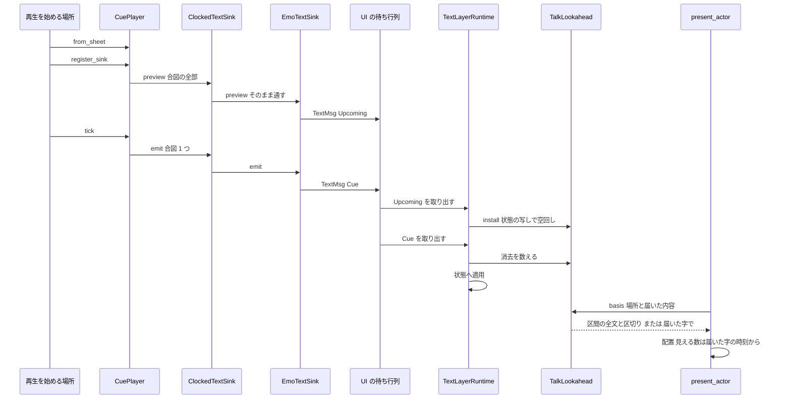
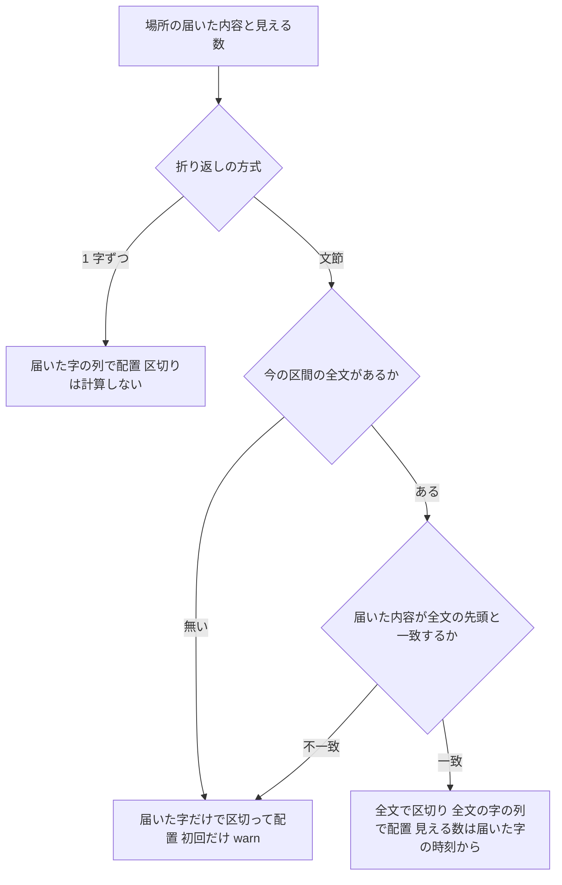
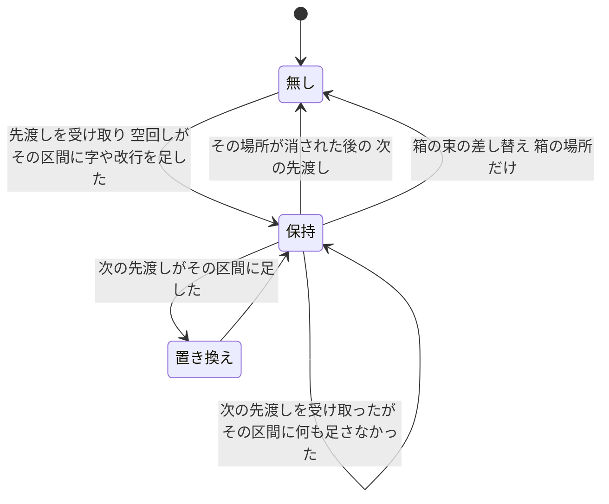

# Design Document: areka-P0-budoux-reveal-reflow

## Overview

**Purpose**: `budoux_newline,1` のバルーンで、1 字ずつ表示している途中に、もう出ていた字が次の行へ飛ぶ不具合を直す。各字は最初から、その区間の字を全部出し終えたときの行と位置に出るようにする。

**Users**: バルーンの台詞を読む人（字が飛ばない）、ゴーストの作者（最終形は今と同じ）、後続の spec（`text-typesetting`・`talk-fast-forward`・`text-reveal-fade`・`balloon-scroll-fade`）の開発者（「表示の途中で字の行が変わらない」を当てにできる）。

**Impact**: 今は文節の区切りを「その時点までに届いた字」だけで毎フレーム計算し直している。これを、**再生の前に台本の合図の全部を受け手へ渡し、文字の層がそれを写しの上で空回しして、場所ごと・区間ごとの全文を先に求め、その全文で区切って配置する**形へ改める。配置の関数（`layout*.rs`）は、もともと「同じ字の列なら、見える数を変えても前の字の行は動かない」作りなので触らない。変わるのは「配置へ渡す字の列」だけで、届いた字の列から、区間の全文へ替わる。

本書で使う言葉（requirements.md の用語に 3 つ足す）:

- **先渡し**: 再生を始める前に、これから届く合図の全部を受け手へ 1 度渡すこと。
- **空回し**: 文字の層の状態の写しの上で、先渡しされた合図を全部適用してみること。画面にも本物の状態にも触れない。
- **区間の全文**: 空回しで求めた、ある場所のある区間が終わる時点の内容（字・改行・カーソル移動・字ごとの装飾番号）。

### Goals

- 文節の折り返しが有効なとき、合図がいくつに分かれて届いても、表示済みの字の行の割り当てが変わらない（要件 1）。
- 区切りは区間の全文で最初から決まり、最終形は今と同じ（要件 2・3）。
- 先渡しが無い・食い違ったときは、字を 1 字も失わずに修正前の動き（届いた字だけで区切る）で続け、記録を残す（要件 2.7）。
- 「台本 → 合図の予定表 → 先渡し → 時刻を進めながら届く」経路を、決まった字幅で GPU なしに歩く決定論の検査を置く（要件 5）。

### Non-Goals

- 台本のコンパイル・合図の語彙・合図を配る時刻と順の変更。
- 禁則、1 字ずつの折り返しの規則、pasta の余分な空行、SSP との行数の差。
- 折り返しの幅が変わる出来事（バルーンの付け直し・拡大率の変化）で行が変わることの抑止。
- 早送りの機能そのもの。
- 食い違いを見つけるたびに空回しをやり直すこと。やり直すのは、空回しの出発点が変わると分かっている決まった 3 か所（バルーンの既定の見た目の差し込み・`\s` の解決の閉包の差し替え 2 か所）だけにする（「空回しのやり直し」の項）。それ以外の食い違いは修正前の動きへ落とす。

## Boundary Commitments

### This Spec Owns

- 合図の受け手の約束 `CueSink` に足す、先渡しの口（既定は何もしない）と、再生機 `CuePlayer` がそれを呼ぶ時点。
- 文字の層の受け手 `EmoTextSink` が先渡しを UI スレッドの待ち行列へ積む形（`TextMsg` の新しい種類）。
- 文字の層の、空回しと「区間の全文」の持ち主（新しい純粋な部品 `TalkLookahead`）と、その寿命。
- 提示の中の「区切り → 配置」の手順の切り出し（`arrange_lines`）と、そこでの全文／届いた字の選び分け。
- 食い違い・先渡し無しの見分けと記録。
- 空回しが記録（warn）を二重に出さないための、状態の層の「空回し」の印。
- 時刻の受け手の飾り `ClockedTextSink` が先渡しを内側へ通すこと。
- 分かれて届く経路の決定論の検査と、実機の確かめ。
- `segment.rs`・`layout.rs`・`layout_line_ops.rs`・`actor_present.rs` の「入力は常に全文」という説明の書き直し。

### Out of Boundary

- `crates/areka-sakura/src/compile.rs`（台本 → 合図）と `crates/areka-sakura/src/drive.rs`（再生を始める場所）。**どちらも 1 行も変えない**。先渡しは `CuePlayer::register_sink` の中で起きるので、`drive.rs` の `TalkPhase::Armed` の腕は今の形のまま先渡しをすることになる。
- 配置の関数（`layout.rs`・`layout_scan.rs`・`layout_scan_glyph.rs`・`layout_styled.rs`・`layout_line_ops.rs`）の判定。説明の文だけを直す。
- 区切りの計算 `segment_plan` の中身と呼び方。
- あふれのスクロール（`LayoutEngine::visible_window`）、選択肢の強調とクリックの範囲（`choice.rs`）、描画（`viewbox*.rs`・`draw*.rs`）。
- 文字の層のほかの受け手（表情・プロパティ・移動・切替など十数個）。先渡しの口の既定の実装（何もしない）のままにする。
- 完了済み `areka-P0-budoux-newline` の design.md（記録として残す。改めるのはコードの説明と本書）。

### Allowed Dependencies

- `areka-emo-text` → `dola::cue`（`CueSink`・`TalkCue`）・`areka-sakura`（`contract`・`cluster`）。今ある向きのまま。
- `areka`（`emo2_boot/talk_clock.rs`）→ `dola::cue::CueSink`。今ある向きのまま。
- 新しい外部クレートは足さない。`Cargo.toml` はどれも変えない。
- `dola` の中の説明に、バルーン・文節・BudouX など上の層の言葉を書かない（`dola` は合図の中身の語彙を持たない層）。
- 記録の捕捉先を差し替える呼び出し（`tracing` の `with_default` の類）を本番のコードに置かない（理由は research.md 12 章「空回しの記録」）。

### Revalidation Triggers

- `CueSink` の先渡しの口の形、または `CuePlayer` が呼ぶ時点を変えるとき → `areka-emo-text` の受け手と、受け手を包む飾り（`ClockedTextSink`）を見直す。
- `CueSink` を包んで内側へ転送する受け手を新しく作るとき → 先渡しも転送しているかを確かめる（転送しないと、文字の層は黙って修正前の動きになり、warn が出る）。
- `compile` が台詞の頭の全消去（`ClearAll`）を先頭に置かなくなる、または 1 本の台本に全消去を複数置くようになるとき → 「区間の番号」の数え方と要件 2.6 の持ち越しの規則を見直す。
- `TextLayerState::apply_cue` に、記録（warn）を出す箇所を足すとき → 「空回し」の印で止めているかを確かめる（止めないと同じ warn が 2 回出る）。
- 合図以外の出来事で文字の層の状態（行き先・箱の表・既定の見た目）を変える口を足すとき → 区間の全文と食い違いうるので、その口の直後で空回しをやり直す（`TextLayerRuntime::rehearse_again` を呼ぶ）か、少なくとも見分けの式で拾えるかを確かめる。
- 配置の関数が「見える数より後ろの字」を読む新しい判定を足すとき（禁則など）→ その判定が読む字も区間の全文から来ることを当てにしてよい。届いた字だけの落とし先（修正前の動き）での振る舞いは別に決める。

## Architecture

### Existing Architecture Analysis

読んで確かめた事実（コードを実行はしていない。定義の場所で指す）:

- **再生を始める場所は本番で 1 か所**。`TalkDriver::on_tick` の `TalkPhase::Armed` の腕（`crates/areka-sakura/src/drive.rs`）が、刻印済みの台本から `CuePlayer::from_sheet` で再生機を作り、受け手を `register_sink` で順に登録し、最初の `tick` を呼ぶ。検査とその支えの外で `CuePlayer::from_sheet` を呼ぶのはここだけ（全体を検索して確認）。
- **受け手へ合図を渡す本番の呼び出しも 1 か所**。`CuePlayer::tick`（`crates/dola/src/cue/runtime.rs`）の中の `sink.emit`。ほかに `emit` を直接呼ぶのは検査と、例 `crates/areka-emo-text/examples/emo-text-layer/drive.rs`（再生機を通さずに受け手へ直接流す）だけ。
- **受け手の約束 `CueSink`**（`crates/dola/src/cue/sink.rs`）は `emit` 1 本。実装は本番に十数個あり、うち **1 つは別の受け手を包む飾り**: `ClockedTextSink<T>`（`crates/areka/src/emo2_boot/talk_clock.rs`）。本番の文字の層の受け手 `EmoTextSink` は必ずこの飾りに包まれて登録される（`emo2_boot/mod.rs`・`emo2_boot/spine.rs`）。**飾りが先渡しを通さなければ、文字の層へは届かない**。
- **受け手はトークごとに写しが作られる**（`crates/areka-ghost/src/dispatcher.rs` の `on_start` が `clone_box`）。写しはどれも同じ待ち行列へ積む。
- **`EmoTextSink`**（`crates/areka-emo-text/src/sink.rs`）は、再生側のスレッドから `TextMsg` を UI スレッドの待ち行列へ積む。同じ送り手が積んだものは積んだ順に届く。UI スレッドの側は `spawn_emo_text`（`actor.rs`）の中の処理が 1 つずつ取り出して `TextLayerRuntime::apply_cue` を呼ぶ。
- **`TextLayerRuntime::apply_cue`**（`actor.rs`）は、`\s`（`Emote`）を解決の閉包で番号に解いて `TextLayerState::route_surface` を呼び、そのあと `TextLayerState::apply_cue` を呼ぶ。つまり**字の行き先を決める規則は、純粋な状態 `TextLayerState` と、実行時の側が持つ `\s` の解決の閉包の 2 つでできている**。
- **`TextLayerState`**（`state.rs`）は `Clone` で、窓も時計も見ない。場所の鍵（`PlaceKey`＝スコープ × 普通のバルーン／箱の名前）ごとに内容（`ActorTextState`）を持つ。
- **台詞の頭の全消去**: `compile`（`crates/areka-sakura/src/compile.rs`）は、内容のある台本の先頭（番号 0・時刻 0）へ `ClearAll` を 1 つだけ置く。
- **全消去が消去の回数を進めるのは、その時点で状態のある場所だけ**（`TextLayerState::apply_cue` の `ClearAll` の腕）。一方、バルーンの装着（`TextLayerState::set_look_layers`）は合図と無関係に場所を作る。だから「状態が数えている消去の回数」は、空回しと本番で 1 つずれうる（先渡しを受け取ってから頭の全消去が届くまでの間に装着が挟まった場合）。**区間の見分けにこの回数は使わない**（下の「区間の番号」）。
- **配置は「同じ字の列なら、見える数を変えても前の字の行は動かない」**。`Scan::glyph`（`layout_scan_glyph.rs`）は見える数に達した字の手前で走査を止め、文節のまとまりの幅 `segment_advance_sum`（`layout_line_ops.rs`）は渡された字の列の全部から足す。完了済み spec の検査（`layout_segmented_tests.rs` の `predecision_is_independent_of_visible_count` ほか）がこれを固定している。
- **欠陥の場所**は `present_actor`（`actor_present.rs`）。文節の折り返しのときだけ、毎フレーム `segment_plan(actor_state.items())` を呼び、`LayoutEngine::layout_styled` にも届いた字の列を渡している。届いた字が増えると「字の列」そのものが変わるので、上の性質の前提（同じ字の列）が崩れる。
- **状態の層が warn を出す箇所は、合図の適用から届く範囲で 4 つ**: 選択肢の字が空（`state.rs`）、`\b[名前]` の箱が無い（`state_route.rs` の `route_select`）、`\f` の指定を適用できない・上下付きのまま字を足した（`state_decoration.rs` の `warn_once`・`warn_script_once`）。空回しがこれらを踏むと、同じ warn が本番の適用と合わせて 2 回出る。

### Architecture Pattern & Boundary Map



**Architecture Integration**:

- **採った形**: 「先渡し → 空回し → 区間の全文で配置」。完了済み `areka-P0-budoux-newline` の前提「配置へ渡す字の列は台詞の全文」を、実際の届き方でも成り立つようにする。新しい判定を配置へ足すのではなく、配置の入力を元の前提へ戻す。
- **責任の分け方**:
  - `dola`: 受け手へ「これから届く合図の全部」を登録の時点で 1 度渡す。中身は見ない。
  - `EmoTextSink`・`ClockedTextSink`: 渡されたものを順を保って運ぶだけ。
  - `TalkLookahead`（純粋）: 空回し、区間の全文の保持、届いた内容との突き合わせ。
  - `arrange_lines`（純粋）: 折り返しの方式で分かれ、文節のときだけ `TalkLookahead` に聞いて、区切り → 配置を呼ぶ。
  - `TextLayerRuntime`: 上の 2 つを持ち、合図の適用と消去の数えを同じ場所で行う。
- **保つ形**: 区切りと折り返しは文字の層が決める。1 字ずつの折り返しは区切りを計算すらしない（`segment_plan` を呼ぶのは文節の腕だけ）。配置は走査ローカルの状態だけで、フレームをまたぐ状態を持たない。届いた字の正本は今までどおり `TextLayerState` で、区間の全文は「先を見るための写し」にすぎない（食い違えば捨てて正本だけで続けられる）。
- **新しい部品が要る理由**: 空回しの結果を覚える場所が今は無い。状態の層（`TextLayerState`）に入れると写しの中に写しが入れ子になり、内容の形と等しさ（既存の検査が比べている）も変わるので、実行時の側に純粋な部品として置く。
- **steering との整合**: 純粋な層に置き（`PURE_SOURCES`）、失敗は記録して続け、1 フレーム遅らせる直し方を取らない（表示の時刻は 1 つも変えない）。

### Technology Stack

| Layer | Choice / Version | Role in Feature | Notes |
|-------|------------------|-----------------|-------|
| 合図の配り | `dola`（ワークスペースの版） | `CueSink` に先渡しの口を足す | 既定の実装つきの追加＝今ある実装は無変更で通る。crates.io に公開しているクレートなので下の「公開 API への影響」を参照 |
| 文字の層 | `areka-emo-text` | 空回し・区間の全文・配置の入力の選び分け | 新しい依存なし |
| 区切り | `budouy`（今のまま） | 区間の全文を 1 度だけ区切る | 呼ぶ回数が「毎フレーム」から「区間ごとに 1 回」へ減る |
| 結線 | `areka`（`emo2_boot/talk_clock.rs`） | 飾りが先渡しを通す | 1 メソッドの追加 |

**公開 API への影響（`dola`）**: 公開の約束 `CueSink` に、既定の実装つきのメソッドを 1 つ足す。今ある実装（ワークスペースの中も外も）は書き換えなしでコンパイルでき、`emit` の意味も呼ばれ方も変わらない＝後方互換の追加。`CuePlayer::register_sink` の振る舞いに「登録の時点で先渡しの口を 1 度呼ぶ」が加わる（既定の実装は何もしないので、今ある受け手から見た動きは変わらない）。版はワークスペースの版に従い、次に出す版にそのまま含まれる。`TimedSchedule` に足す読み口はクレートの中だけに見せ、公開の面は増やさない。

## File Structure Plan

### Directory Structure

```
crates/dola/
├── src/cue/
│   ├── sink.rs                      # CueSink に先渡しの口 preview（既定は何もしない）
│   ├── schedule.rs                  # まだ配っていない中身を配る順に読む口（クレート内だけ）
│   └── runtime.rs                   # register_sink が登録の前に preview を 1 度呼ぶ
└── tests/cue/
    ├── runtime_test.rs              # 新しい検査ファイルの接続宣言を 1 つ足す
    └── runtime_test_preview_tests.rs  # 新規: 先渡しの中身・順・時点、emit が変わらないこと

crates/areka-emo-text/src/
├── lookahead.rs                     # 新規（純粋）: 状態を 1 歩進める共通の関数・TalkLookahead
├── lookahead_tests.rs               # 新規（純粋）: 空回し・区間・持ち越し・突き合わせ・無言
├── sink.rs                          # TextMsg::Upcoming・EmoTextSink の preview・取り出しの写像
├── state.rs                         # 「空回し」の印と写しを作る口・選択肢の字が空の warn を止める
├── state_route.rs                   # route_select の warn を空回しでは止める
├── state_decoration.rs              # warn_once・warn_script_once を空回しでは止める
├── look.rs                          # 装飾の表の「先頭が一致するか」の読み口を 1 つ
├── actor.rs                         # TextLayerRuntime に lookahead の欄・preview_talk・取り出しの処理
├── actor_box.rs                     # set_box_layout が箱の場所の区間の全文を捨て、空回しをやり直す
├── actor_attach.rs                  # register_actor が既定の見た目を差し込んだ後に空回しをやり直す
├── actor_present.rs                 # arrange_lines の切り出し・present_actor がそれを呼ぶ
├── actor_lookahead_tests.rs         # 新規: 本番と同じ経路を歩く検査（決まった字幅・GPU なし）
├── segment.rs                       # 冒頭の説明の書き直しだけ
├── layout.rs                        # 説明の書き直しだけ
├── layout_line_ops.rs               # segment_advance_sum の説明の書き直しだけ
└── lib.rs                           # mod 宣言・2 つの一覧への登録

crates/areka/src/emo2_boot/
└── talk_clock.rs                    # ClockedTextSink が preview を内側へ通す＋検査 1 本
```

### Modified Files

- `crates/dola/src/cue/sink.rs` — `CueSink::preview` を足す。説明は `dola` の言葉（合図・受け手）だけで書く。
- `crates/dola/src/cue/schedule.rs` — `TimedSchedule` に、まだ配っていない中身（`Entry::Payload`）を配る順に返す読み口を足す（`pub(crate)`）。区切り（`Barrier`）と配送の制御（`Routing`）は含めない。予定表の欄 `entries` は後ろから取り出す並び（同じ時刻は先に入れたものが先に出る）なので、後ろから読んで配る順にする。
- `crates/dola/src/cue/runtime.rs` — `register_sink` が、登録の前に上の読み口で合図の列を作り、`sink.preview` を 1 度呼ぶ。`tick` は変えない。
- `crates/areka-emo-text/src/sink.rs` — `TextMsg` に `Upcoming(Vec<TalkCue>)` を足す。`EmoTextSink` が `preview` を実装して待ち行列へ積む。取り出しの写像に、先渡しの受け取りを差し込める形を足す（今の `handle_text_msg` の呼び方は残す）。
- `crates/areka-emo-text/src/state.rs` — `TextLayerState` に「空回し」の印（私有の欄・既定は偽）と、印を立てた写しを返す口を足す。選択肢の字が空の warn を、印が立っていれば出さない。
- `crates/areka-emo-text/src/state_route.rs` — `route_select` の warn を、印が立っていれば出さない（公開の引数は変えない）。
- `crates/areka-emo-text/src/state_decoration.rs` — `push_current_style`・`apply_font_args`（どちらも `state.rs` からだけ呼ぶ `pub(super)`）へ「黙る」かどうかを渡し、`warn_once`・`warn_script_once` の warn を止める。`apply_font_args` の名前と `match` の形は変えない（字面を読む既存の検査がある）。
- `crates/areka-emo-text/src/look.rs` — `StyleTable` に「この表の先頭が、渡した表と一致するか」を返す読み口を足す。
- `crates/areka-emo-text/src/actor.rs` — `TextLayerRuntime` に `lookahead` の欄、`preview_talk`、合図の適用での消去の数え、`spawn_emo_text` の取り出しの処理（先渡しを `preview_talk` へ）。検査用の読み口 `arrange_for_test`（`#[cfg(test)]`）。
- `crates/areka-emo-text/src/actor_box.rs` — `set_box_layout` が `lookahead` の箱の場所を捨て、箱の表と解決の閉包を入れ替えた後に空回しをやり直す。
- `crates/areka-emo-text/src/actor_attach.rs` — `register_actor` が、既定の見た目を状態へ差し込んだ（`set_look_layers`）後に空回しをやり直す。
- `crates/areka-emo-text/src/actor_present.rs` — 「見える数 → 区切り → 配置」を `arrange_lines` へ切り出し、`present_actor` はそれを呼ぶ。
- `crates/areka-emo-text/src/segment.rs`・`layout.rs`・`layout_line_ops.rs` — 説明だけ（要件 5.7）。
- `crates/areka-emo-text/src/lib.rs` — `mod lookahead;`、`PURE_SOURCES` に `lookahead.rs`・`lookahead_tests.rs`、`SOURCES_OUTSIDE_THE_PURE_SCAN` に `actor_lookahead_tests.rs`。
- `crates/areka/src/emo2_boot/talk_clock.rs` — `ClockedTextSink` の `preview`（時刻の観測はせず、内側へそのまま通す）。

## System Flows

### 配置へ渡す字の列の選び分け



- 「一致」は 3 つを見る: 字の列（改行・カーソル移動を含む）、字ごとの装飾番号、装飾の表。どれも「届いたぶんが、全文の側の先頭と同じ」であること。
- 一致のとき配置へ渡すのは、全文の字の列・全文の装飾番号と表・全文の区切り。見える数だけは届いた内容の表示の時刻から出す。これで字の表示の時刻は変わらず（要件 2.4）、配置は「同じ字の列で見える数だけが増える」形になる。
- 一致しないとき・全文が無いときは、今のコードと同じ呼び方（届いた字で `segment_plan`、届いた字で配置）になる。届いた字の正本は別にあるので、字は 1 字も失われない。

### 区間の番号と、区間の全文の寿命



- **区間の番号**は「最後に先渡しを受け取ってから、その場所が消された回数」。`\c`（その時点の行き先の場所）と全消去（全部の場所）を数える。全消去は場所に状態があるかどうかに関わらず数える。空回しも本番も**同じ 1 つの数え方**を、同じ合図の列に対して使うので、番号は作りのうえで揃う。状態が持っている消去の回数（`clears`）は使わない。
- 空回しのやり直し（`reinstall`）は数えを 0 に戻さない。今の番号とそれより後の区間の全文だけを、今の状態から求め直したものへ入れ替える。
- トークが途中で止まっても（中断・選択待ち）、文字の層には何も届かないので、区間の全文はそのまま残る。表示済みの字は同じ全文で配置され続ける（要件 2.6 の前半）。
- 次のトークの先渡しを受け取ると、空回しは今の状態の写しから始まる。次のトークの頭は全消去なので、今出ている区間には何も足されない＝その区間の全文は**前のものを持ち越す**。全消去が届くまでの間にフレームが挟まっても、出ている字は動かない。全消去の後の字は、次のトークの台本だけから求めた全文で区切る（要件 2.6 の後半）。

## Requirements Traceability

| Requirement | Summary | Components | Interfaces | Flows |
|-------------|---------|------------|------------|-------|
| 1.1 | 各字を最初から最終の位置に | `TalkLookahead`・`arrange_lines` | `basis`・`arrange_lines` | 選び分け（一致の枝） |
| 1.2 | 新しい合図で表示済みの字を動かさない | `arrange_lines`（配置は無変更） | 同上 | 同上 |
| 1.3 | 分かれて届いても 1 つで届いても同じ | `TalkLookahead`（全文は合図の境目を持たない） | `install` | 同上 |
| 1.4 | いくつに分かれても | 同上 | 同上 | 同上 |
| 1.5 | 同じ描画の回にまとめて届いても同じ | `arrange_lines`（入力は全文と見える数だけ） | 同上 | 同上 |
| 1.6 | 縦書きでも同じ | 配置の軸の読み替え（無変更） | — | 同上 |
| 1.7 | 場所ごとに独立 | `TalkLookahead`（鍵は場所） | `basis` | — |
| 2.1 | 最初の字の前に全部を知っている | `CueSink::preview`・`CuePlayer::register_sink`・`EmoTextSink`・`ClockedTextSink` | `preview`・`TextMsg::Upcoming` | 図 1 |
| 2.2 | 行き先は本番と同じ規則 | `advance_state`（本番と空回しが同じ関数を呼ぶ） | `advance_state` | — |
| 2.3 | 改行・カーソル移動の範囲ごとに区切る | `segment_plan`（無変更・全文に対して呼ぶ） | — | — |
| 2.4 | 表示の時刻を変えない | `arrange_lines`（見える数は届いた字から） | — | 選び分け |
| 2.5 | 届き方によらず同じ結果 | `TalkLookahead`（結果は合図の列だけで決まる） | — | — |
| 2.6 | 中断しても動かさず、次は次の台本だけで | `TalkLookahead` の持ち越しの規則 | `install` | 寿命 |
| 2.7 | 食い違い・先渡し無しは修正前の動き＋記録 | `TalkLookahead::basis`・`arrange_lines` | `Basis::Arrived` | 選び分け（不一致・無いの枝） |
| 2.8 | ほかの受け手・語彙・時刻・順を変えない | `CueSink::preview` の既定の実装・`CuePlayer::tick` 無変更 | — | — |
| 3.1 | 1 つの合図で届くとき修正前と同じ | `arrange_lines`（全文＝届いた字） | — | — |
| 3.2 | 出終わった形は修正前と同じ | 同上（出終わると届いた字＝全文） | — | — |
| 3.3 | 1 字ずつの折り返しは一切変えない | `arrange_lines` の 1 字ずつの枝（今の呼び方のまま） | — | 選び分け |
| 3.4 | 1 字ずつは分かれて届いても動かない | 同上（配置の性質・検査で固定） | — | — |
| 3.5 | 既存の検査を書き換えない | 追加だけの口（`handle_text_msg`・`segment_plan`・`LayoutEngine` の呼び方を保つ） | — | — |
| 4.1 | 消去の後は消去の後の区間だけで | 区間の番号・`TalkLookahead` | `note_cue`・`install` | 寿命 |
| 4.2 | スクロールは行をまとめて送るだけ | `visible_window`（無変更・源の行が安定） | — | — |
| 4.3 | スクロールの仕組みを変えない | 同上 | — | — |
| 4.4 | 選択肢の字・強調・クリックの範囲 | 選択肢の字も全文に入る・使う側は同じ行の列から導く（無変更） | — | — |
| 4.5 | `\n`・`\_l` の意味を変えない | 配置（無変更） | — | — |
| 5.1 | 本番と同じ経路・同じ手順で行の割り当てを取る | `actor_lookahead_tests.rs`・`arrange_lines`・`arrange_for_test` | — | 図 1 |
| 5.2 | 各段階で判定する | 同上（判定の関数） | — | — |
| 5.3 | 修正前に赤・修正後に緑 | 同上（先渡しを落とした対照）・タスクの順 | — | — |
| 5.4 | 1.3・2.7・3.4・4.1 の判定 | 同上 | — | — |
| 5.5 | 決まった字幅 | `FixedMetrics` を `arrange_lines` へ渡す | — | — |
| 5.6 | 実機の確かめ | Testing Strategy「実機」 | — | — |
| 5.7 | 説明の書き直し | `segment.rs`・`layout.rs`・`layout_line_ops.rs`・`actor_present.rs` | — | — |

## Components and Interfaces

| Component | Domain/Layer | Intent | Req Coverage | Key Dependencies | Contracts |
|-----------|--------------|--------|--------------|------------------|-----------|
| `CueSink::preview` と `CuePlayer::register_sink` | dola／合図の配り | 登録の時点で、これから届く合図の全部を受け手へ 1 度渡す | 2.1, 2.8 | `TimedSchedule`（P0） | Service |
| `EmoTextSink`・`TextMsg::Upcoming` | emo-text／結線 | 先渡しを、合図と同じ待ち行列へ順を保って積む | 2.1 | `UiSender`（P0） | Event |
| `ClockedTextSink` | areka／結線 | 先渡しを内側へそのまま通す | 2.1 | `CueSink`（P0） | Service |
| `advance_state` | emo-text／純粋 | 合図 1 つで状態を進める唯一の規則（`\s` の解決を含む） | 2.2 | `TextLayerState`（P0） | Service |
| `TalkLookahead` | emo-text／純粋 | 空回し・区間の全文の保持・届いた内容との突き合わせ | 1.1〜1.7, 2.2, 2.5〜2.7, 4.1 | `advance_state`・`segment_plan`（P0） | Service, State |
| 状態の層の「空回し」の印 | emo-text／純粋 | 空回しが warn を出さない | 2.8（記録を変えない） | — | State |
| `arrange_lines` | emo-text／純粋 | 「見える数 → 区切り → 配置」の 1 つの手順 | 1.1〜1.6, 2.3, 2.4, 3.1〜3.4, 5.1, 5.5 | `TalkLookahead`・`LayoutEngine`（P0） | Service |
| `TextLayerRuntime` の結線 | emo-text／結線 | 先渡しの受け取り・消去の数え・箱の束の差し替えでの後始末 | 2.1, 2.6, 2.7, 4.1 | 上の全部（P0） | State |

### dola／合図の配り

#### `CueSink::preview` と `CuePlayer::register_sink`

| Field | Detail |
|-------|--------|
| Intent | 受け手が再生の前に全体を見て準備できるよう、登録の時点で合図の全部を 1 度渡す |
| Requirements | 2.1, 2.8 |

**Responsibilities & Constraints**

- `register_sink` は、受け手を登録の列へ足す**前**に、その時点でまだ配っていない合図（中身のあるものだけ・配る順）を列にして `preview` を 1 度呼ぶ。登録より後の `emit` は必ず `preview` より後になる（`emit` は登録済みの受け手にしか行かないため）。
- 最初の `tick` の前に登録した受け手には、台本の合図の全部が渡る（本番はこの形だけ）。途中で登録した受け手には、残りの合図が渡る＝「この受け手にこれから `emit` で届くもの」と常に一致する。
- 渡す合図は `emit` で届くものと同じ値（`at` は台本の頭からの秒、`duration` は丸め済み）。区切り（選択待ちなど）と配送の制御は含めない。選択待ちの後ろの合図も含む。
- `tick`・`ready`・区切りの解決・`stop` は変えない。配る合図・時刻・順は 1 つも変わらない。
- `dola` は渡すだけで、受け手が何に使うかを知らない。説明に上の層の言葉を書かない。

**Contracts**: Service [x]

##### Service Interface

```rust
pub trait CueSink {
    fn emit(&mut self, cue: TalkCue);

    /// 登録の時点で 1 度だけ呼ばれる。`upcoming` は、この受け手にこれから `emit` で届く
    /// 合図の全部（配る順）。既定は何もしない。
    fn preview(&mut self, upcoming: &[TalkCue]) {
        let _ = upcoming;
    }
}

impl CuePlayer {
    /// 受け手を登録する。登録の前に `sink.preview(まだ配っていない合図の列)` を 1 度呼ぶ。
    pub fn register_sink(&mut self, sink: Box<dyn CueSink>);
}

impl<T> TimedSchedule<T> {
    /// まだ配っていない中身を配る順に返す（クレートの中だけ）。
    pub(crate) fn pending_payloads(&self) -> impl Iterator<Item = &T>;
}
```

- Preconditions: なし（空の予定表なら空の列を渡す）。
- Postconditions: 登録した受け手は `preview` をちょうど 1 度受け取り、その後の `emit` の列は `upcoming` と同じ順・同じ値（途中で `stop` されれば途中まで）。
- Invariants: `preview` を上書きしない受け手の動きは、追加の前と同じ。

**Implementation Notes**

- 合図の列は登録のたびに作る（受け手 1 つにつき写し 1 回）。受け手は 1 トークに十数個・合図は多くて数百なので足りる。重くなったら再生機に 1 度だけ作って持たせる形へ替えられる（その旨を `ponytail:` の注記で残す）。
- 「最初の `tick` でまとめて渡す」形は採らない。後から登録した受け手が黙って先渡しを受け取れない穴ができ、再生機に「渡し済みか」の欄も増えるため。
- 検査（`runtime_test_preview_tests.rs`）: 先渡しの中身が配る順の合図の全部であること（選択待ちの後ろを含み、区切りを含まない）、`preview` が最初の `emit` より前であること、途中で登録した受け手には残りだけが渡ること、先渡しを上書きしない受け手に届く `emit` の列が変わらないこと（既存の検査がそのまま緑であることと合わせて要件 2.8 の根拠）。

### emo-text／結線

#### `EmoTextSink`・`TextMsg::Upcoming`・取り出しの写像

| Field | Detail |
|-------|--------|
| Intent | 先渡しを、合図と同じ待ち行列へ、合図より前に積む |
| Requirements | 2.1 |

**Responsibilities & Constraints**

- `EmoTextSink::preview` は、渡された列を写して `TextMsg::Upcoming` として積む。同じ送り手が続けて積む最初の合図より必ず前に届く。
- 積めなかったとき（UI の側が止まった後）は `error!` を 1 行残して続ける（`emit`・`close` と同じ規律）。
- 取り出しの写像は、先渡しを受け取る閉包を差し込める形（`handle_text_msg_with`）を足す。今の `handle_text_msg(msg, on_cue)` は「先渡しを使わない取り出し用」として残し、先渡しは読み飛ばす（字は `Cue` で届くので失われない）。本番の取り出し（`spawn_emo_text`）は新しい形を使う。

**Contracts**: Event [x]

##### Event Contract

```rust
pub enum TextMsg {
    Cue(TalkCue),
    /// 再生の前に渡された、これから届く合図の全部。
    Upcoming(Vec<TalkCue>),
    Close,
}

pub fn handle_text_msg_with<E>(
    msg: TextMsg,
    on_cue: impl FnOnce(TalkCue) -> Result<(), E>,
    on_upcoming: impl FnOnce(Vec<TalkCue>) -> Result<(), E>,
) -> Result<ControlFlow<()>, E>;

/// 今の形（残す）: `handle_text_msg_with(msg, on_cue, |_| Ok(()))` と同じ。
pub fn handle_text_msg<E>(
    msg: TextMsg,
    on_cue: impl FnOnce(TalkCue) -> Result<(), E>,
) -> Result<ControlFlow<()>, E>;
```

- Ordering / delivery guarantees: 同じ送り手が積んだ順に届く。トークごとの写しは別の送り手だが、前のトークは終わりを知らせる前に積み終えているので、ふつうは前のトークの合図が次のトークの先渡しより後に届くことは無い。割り込みの切り替えでごくまれに前後しても、突き合わせが拾って修正前の動きへ落ちる（字は失わない）。

#### `ClockedTextSink`（`crates/areka/src/emo2_boot/talk_clock.rs`）

| Field | Detail |
|-------|--------|
| Intent | 先渡しを内側の受け手へそのまま通す |
| Requirements | 2.1 |

- `preview` では時刻を観測しない（先渡しは「その時刻に届いた」出来事ではないので、トークの頭の時刻の見積もりに混ぜない）。内側の `preview` を呼ぶだけ。
- 検査 1 本: 内側が受け取る列が渡した列と同じで、時刻の見積もりが変わらないこと。これが無いと本番で文字の層へ先渡しが届かない（必ず通る 1 か所）。

#### `TextLayerRuntime` の結線（`actor.rs`・`actor_box.rs`）

| Field | Detail |
|-------|--------|
| Intent | 先渡しを `TalkLookahead` へ入れ、合図の適用で消去と届いた数を数え、箱の束の差し替えで箱の場所を捨て、空回しの出発点が変わる 3 か所でやり直す |
| Requirements | 2.1, 2.6, 2.7, 4.1 |

**Responsibilities & Constraints**

- `preview_talk(&mut self, upcoming: &[TalkCue])`: `self.lookahead.install(&self.state, 解決の閉包, upcoming)` を呼ぶ。受け取ったことを `debug!` で 1 行残す（合図の数・求めた区間の数。実機の確かめで「最初の字より前に受け取った」を読むため）。
- `apply_cue`: 状態を進める前に、その合図の行き先を求めて `self.lookahead.note_cue(cue, &行き先)` を呼ぶ（消去を数える）。状態を進めるところは `advance_state` を呼ぶ形に替える（今の「`Emote` なら解決して `route_surface`、そのあと `state.apply_cue`」と同じ中身）。描画の全消し要求・選択肢の写しの後始末など、ほかの腕は今のまま。
- `set_box_layout`: 箱の場所の実行時の表を捨てる今の並びに、`self.lookahead.forget_boxes()` を足す。箱の表（`set_box_index`）と解決の閉包を入れ替えた後に `self.rehearse_again()` を呼ぶ。
- `rehearse_again(&mut self)`: `self.lookahead.reinstall(&self.state, 解決の閉包)` を呼ぶだけの私有の口。呼ぶのは 3 か所で、どれも空回しの出発点（状態か、`\s` の解決の閉包）を合図と無関係に変える所: `register_actor` の中で既定の見た目を状態へ差し込んだ（`set_look_layers`）直後、`set_box_layout` の中で箱の表と解決の閉包を入れ替えた直後、解決の閉包だけを差し替える口（`actor.rs` の `surface_resolver` へ入れる所）の直後。先渡しを受け取っていなければ何も起きない。
- `spawn_emo_text` の取り出し: `handle_text_msg_with` で、合図は `apply_cue`、先渡しは `preview_talk` へ。借りられなかったとき（別の処理が実行時を借りている）は今と同じく `Err` を返す。先渡しを失った場合、そのトークは修正前の動きになり、warn が出る。
- `#[cfg(test)] arrange_for_test(&mut self, place, metrics, talk_time)`: その場所の配置の入力（`layout_input`）を引いて `arrange_lines` を呼ぶだけ。`present_actor` が冒頭でしている引き当てと同じ。

### emo-text／純粋

#### `advance_state`（`lookahead.rs`）

| Field | Detail |
|-------|--------|
| Intent | 合図 1 つで状態を進める唯一の規則。本番も空回しもこれを呼ぶ |
| Requirements | 2.2 |

```rust
/// 合図 1 つで状態を進める。`\s` は `resolve` で番号に解いて行き先へ渡し（閉包が無ければ読まない）、
/// そのあと `state.apply_cue(cue)` を呼ぶ。
pub(crate) fn advance_state(
    state: &mut TextLayerState,
    resolve: Option<&dyn Fn(&str) -> SurfaceKeyOutcome>,
    cue: &TalkCue,
);
```

- Postconditions: 同じ状態・同じ閉包・同じ合図なら同じ結果。本番（`TextLayerRuntime::apply_cue`）と空回し（`TalkLookahead::install`）で別々の写しを持たない。
- 閉包が無いときの `debug!`（`\s` を読まない）は今と同じ文面で残す。

#### `TalkLookahead`（`lookahead.rs`）

| Field | Detail |
|-------|--------|
| Intent | 空回しで区間の全文を求めて覚え、届いた内容と突き合わせて、配置に使う字の列を答える |
| Requirements | 1.1〜1.7, 2.2, 2.5, 2.6, 2.7, 4.1 |

**Responsibilities & Constraints**

- 覚えるもの: 場所 × 区間の番号 → 区間の全文（`ActorTextState` の写し）と、その区切り（最初に要ったときに 1 度だけ計算）。それと、先渡しを受け取ってからの消去の数え（全消去の回数・場所ごとの `\c` の回数）、warn を出し済みの（場所, 区間の番号）、やり直しのための先渡しの列の写しと「そのうち何個が本番で届いたか」。
- 折り返しの方式も幅もフォントも知らない。区切りを計算するのは `basis` が呼ばれたときだけで、`basis` を呼ぶのは文節の枝だけ＝1 字ずつの折り返しでは区切りを計算すらしない、を保つ。
- 状態の正本（`TextLayerState`）を書き換えない。空回しは写しの上だけで行う。

**Contracts**: Service [x] / State [x]

##### Service Interface

```rust
#[derive(Default)]
pub(crate) struct TalkLookahead { /* 私有 */ }

pub(crate) enum Basis<'a> {
    /// 区間の全文で配置する（届いた内容は全文の先頭と一致している）。
    Full { content: &'a ActorTextState, plan: &'a SegmentPlan },
    /// 届いた字だけで配置する（修正前の動き）。
    Arrived,
}

impl TalkLookahead {
    /// 先渡しを受け取る: 今の状態の写しで空回しし、区間の全文を入れ替える。
    pub(crate) fn install(
        &mut self,
        state: &TextLayerState,
        resolve: Option<&dyn Fn(&str) -> SurfaceKeyOutcome>,
        upcoming: &[TalkCue],
    );

    /// 本番の合図 1 つを見て、消去と届いた数を数える（状態を進める前に呼ぶ）。`dest` はその合図の行き先。
    /// 合図が先渡しの列の次の合図と同じでなければ、列を捨てる（以後やり直さない）。
    pub(crate) fn note_cue(&mut self, cue: &TalkCue, dest: &PlaceKey);

    /// 空回しをやり直す: 今の状態の写しから、先渡しの列のまだ届いていない残りを流し、
    /// 今の区間とそれより後の区間の全文を入れ替える。先渡しの列が無ければ何もしない。
    pub(crate) fn reinstall(
        &mut self,
        state: &TextLayerState,
        resolve: Option<&dyn Fn(&str) -> SurfaceKeyOutcome>,
    );

    /// 箱の場所の区間の全文と数えを捨てる（箱の束の差し替え）。
    pub(crate) fn forget_boxes(&mut self);

    /// 配置に使う字の列を答える。全文が無い・食い違うときは `Arrived` を返し、
    /// （場所, 区間）ごとに初回だけ warn を残す。届いた内容に字が 1 つも無ければ warn しない。
    pub(crate) fn basis(&mut self, place: &PlaceKey, arrived: &ActorTextState) -> Basis<'_>;
}
```

**`install` の手順**

1. 持ち越しを決める: 場所ごとに、今の区間（今の数えでの番号）の全文と warn 済みの印を取り置く。ほかの区間のものは捨てる。
2. 数えを 0 に戻す。
3. `state.rehearsal_copy()` で印つきの写しを作る。
4. `upcoming` の合図を順に: 行き先を写しから求める → 消去の合図なら、消される場所のうち「この区間に空回しが足した」場所の内容を、今の番号の全文として控える → 数えを進める（`note_cue` と同じ数え方）→ `advance_state` で写しを進める → 字・選択肢・改行・カーソル移動なら行き先に「足した」印を付ける。
5. 最後に、「足した」印のある場所の内容を今の番号の全文として控える。
6. 数えを 0 に戻す（本番の数えはここから）。
7. 取り置いた持ち越しを番号 0 へ入れる。ただし空回しが番号 0 に控えた場所は、空回しの側を採る。
8. `upcoming` の写しを覚え、届いた数を 0 にする（やり直しのため）。

**`reinstall` の手順（空回しのやり直し）**

1. 先渡しの列を覚えていなければ何もしない。
2. warn 済みの印を消す。区間の全文は、今の番号より前のものだけ残し、今の番号以降のものを捨てる（場所ごと）。
3. `state.rehearsal_copy()` で写しを作り、数えは**今の値の写し**から始める（0 に戻さない。本番の数えには触れない）。
4. 今、内容のある場所のすべてに「足した」印を付けて始める（残りの合図が何も足さない場所でも、今の内容そのものを今の区間の全文として控えるため。既定の見た目が載せ直された後の装飾の表と合わせる）。
5. 先渡しの列の「届いた数」より後ろを、`install` の 4〜5 と同じ手順で流して控える。

- 写しの出発点が今の状態なので、控える全文は「もう届いた字＋これから届く字」になり、届いた内容はその先頭と一致する。
- `note_cue` は、届いた合図が先渡しの列の「届いた数」番目と同じ値かを見る（`TalkCue` は等しさを比べられる）。同じなら届いた数を 1 進める。違えば（前のトークの合図が後から届いた・再生機を通さない合図が混ざった）列を捨て、以後 `reinstall` は何もしない＝今ある全文のまま、食い違いは `basis` の見分けが拾う。

- Postconditions:
  - 区間の全文は、その区間に届く字の全部を、届く順に、合図の境目なしで持つ（要件 1.3・2.5）。
  - 行き先は本番と同じ関数・同じ状態から求める（要件 2.2）。始まりは「今の状態の写し」なので、今のサーフェス番号・箱の表・前のトークの行き先・既定の見た目を引き継ぐ。「トークの頭で全部が消える」とは仮定しない（頭の全消去は合図として空回しされる）。
  - 消去の前の字は、消去の後の区間の全文に入らない（要件 4.1）。
  - 空回しが何も足さない区間の全文は作らない。前のトークの出ている区間は持ち越される（要件 2.6）。
- Invariants: 番号は「先渡しを受け取ってからの、全消去の回数＋その場所の `\c` の回数」。空回しと本番で同じ数え方。

**`basis` の見分け**

- 全文がある、かつ次の 3 つが成り立てば `Full`:
  - `全文.items()` の先頭が `arrived.items()` と一致する。
  - `全文.glyph_styles()` の先頭が `arrived.glyph_styles()` と一致する。
  - `全文.styles()` の先頭が `arrived.styles()` と一致する（`StyleTable` の新しい読み口）。
- それ以外は `Arrived`。字が 1 つ以上あるときだけ、（場所, 番号）ごとに初回 1 度 `warn!` を残す。欄: スコープ・場所・理由（`先渡しが無い`／`届いた字が先渡しと食い違う`）・届いた字の数・全文の字の数。
- 区切りは `Full` を返すときに、全文に対して `segment_plan` を 1 度だけ計算して覚える。

**食い違いが起きる場面（調べた全部）と結果**

| 場面 | 何が起きるか | 結果 |
|---|---|---|
| 再生機を通さずに受け手へ直接流す（例 `examples/emo-text-layer`・既存の検査の一部） | 先渡しが無い | 文節の折り返しなら修正前の動き＋warn 1 回。1 字ずつなら `basis` を呼ばないので何も起きない |
| 受け手を包む飾りが先渡しを通さない | 同上 | 同上（`ClockedTextSink` は検査で固定） |
| トークの途中でシェルが切り替わる（`set_box_layout`） | 箱の場所の内容が捨てられ、行き先が既定へ戻る | 新しい箱の表と解決の閉包で空回しをやり直すので、残りの字は新しい行き先の全文で配置される（一致）。先渡しの列を捨てた後なら、箱の字は「先渡しが無い」、普通のバルーンは行き先が変われば「食い違う」 |
| 先渡しがバルーンの装着より先に届く（起動直後の、そのスコープの最初のトーク。`set_look_layers` の説明にある窓）、またはトークの途中で装着し直される | 空回しは ukadoc の既定の見た目で走り、本番はバルーンの定義の見た目で進む | 装着のときに空回しをやり直すので一致する（`\f` を使う台本でも）。先渡しの列を捨てた後なら、装飾付きの字が届いた時点で「食い違う」 |
| 先渡しが箱の束の受け取り（`set_box_layout`）より先に届く（起動直後） | 空回しは `\s` を読めず、行き先がすべて普通のバルーンになる | 箱の束を受け取ったときに空回しをやり直すので一致する |
| 先渡しが借用の競合で失われた | 先渡しが無い | 修正前の動き＋warn（取り出しの側の `error!` も出る） |
| 前のトークの合図が、次のトークの先渡しより後に届いた（割り込みの切り替えでのスレッドの前後） | 空回しの始まりと本番がずれる | 「食い違う」 |

どの場面でも、届いた字の正本は `TextLayerState` にあるので字は失われない（要件 2.7）。

**空回しのやり直し（設計の討議 1・2026-10-05）**: 空回しの出発点を合図と無関係に変える出来事は、調べた限り 3 か所に決まっている（既定の見た目の差し込み・解決の閉包の差し替え 2 か所）。起動直後は、最初のトークの先渡しがこれらより先に届く窓があり、やり直さないと「起動トークで `\f` か箱を使うゴースト」だけ字の飛びが残る。そこで、この 3 か所の直後に、残りの合図で空回しをやり直す。足すのは先渡しの列の写しと届いた数の数えだけで、やり直す時点は呼び出しの場所で決まる。**食い違いを見つけてからやり直すことはしない**（見つけた時点では何がずれたか分からず、判定の分岐が増えるため。要件 2.7 のとおり修正前の動きへ落とす）。

#### 状態の層の「空回し」の印（`state.rs`・`state_route.rs`・`state_decoration.rs`）

| Field | Detail |
|-------|--------|
| Intent | 空回しの間、状態の層が warn を出さない |
| Requirements | 2.8（ほかの動き＝記録を変えない） |

```rust
impl TextLayerState {
    /// 印を立てた写しを返す（空回し専用）。印の立った状態は warn を出さない。
    pub(crate) fn rehearsal_copy(&self) -> TextLayerState;
}
```

- 印は `TextLayerState` の私有の欄（既定は偽）。本番の状態では決して立たない。`TextLayerState` は等しさを自動で導いているので、印の立った写しは中身が同じでも本番の状態と等しくならないが、検査が比べるのは場所ごとの内容（`ActorTextState`）で、印の立った写しそのものは比べない。既存の等しさの検査には影響しない。
- 止めるのは warn の 4 か所だけ（Existing Architecture Analysis の最後の項）。`TextLayerState` の側の 2 か所は欄を見る。`ActorTextState` の側の 2 か所は、`state.rs` から呼ぶ `push_current_style`・`apply_font_args` へ真偽を 1 つ渡す。warn 済みの記録（同じ指定を 1 台詞に 1 度だけ記録する集合）は今のまま更新する（写しの中だけの話で、本番の集合には触れない）。
- `debug!` は止めない。代わりに `install` の空回しを `debug_span!("rehearsal")` で囲み、記録を読む人が本番の適用と見分けられるようにする。
- 本番の記録は、件数も文面も変えない。

#### `arrange_lines`（`actor_present.rs`）

| Field | Detail |
|-------|--------|
| Intent | 「見える数 → 区切り → 配置」の 1 つの手順。本番の提示と検査が同じ関数を呼ぶ |
| Requirements | 1.1〜1.6, 2.3, 2.4, 3.1〜3.4, 5.1, 5.5 |

```rust
/// 場所 1 つの行の割り当てを作る。場所に状態が無ければ `None`。
pub(super) fn arrange_lines(
    state: &TextLayerState,
    lookahead: &mut TalkLookahead,
    cursor_warn: &mut CursorWarnGuard,
    place: &PlaceKey,
    resolved: &ResolvedBalloonText,
    metrics: &dyn GlyphMetrics,
    talk_time: f64,
) -> Option<Vec<PositionedLine>>;
```

- 見える数は、届いた内容の表示の時刻から（`reveal().visible(talk_time)`）。今と同じ。
- 1 字ずつ: 届いた字の列・`WrapPlan::CharByChar`・届いた内容の装飾。今の呼び方と 1 つも変えない。`lookahead` に触れない。
- 文節: `lookahead.basis(place, 届いた内容)` を聞く。
  - `Full`: `LayoutEngine::layout_styled(全文.items(), 見える数, …, WrapPlan::Segmented(全文の区切り), 装飾)`。装飾は、番号と表も「今の見た目」（字の無い行の丈にだけ使う・`GlyphStyles` の欄 `current`）も、すべて全文の側から取る。「今の見た目」を届いた内容から取ると、字の無い行を `\_l` や改行で閉じた後に出た字が、後から届いた `\f[height,…]` で上下に動く（`LineHeights::close`・`LineHeights::peek` がこの値を読む）ので、要件 1.1・1.2 に当たる。出終わったときは届いた内容と全文が同じなので、最終形は変わらない（要件 3.2）。
  - `Arrived`: 今の呼び方（届いた字で `segment_plan`、届いた字で配置）。
- `present_actor` は、今の「見える数 → 区切り → `layout_styled`」の並びを `arrange_lines(&runtime.state, &mut runtime.lookahead, &mut runtime.cursor_warn, place, &resolved, &render.metrics, talk_time)` の 1 回の呼び出しに替える。その後ろ（あふれの窓・選択肢・描画・クリックの範囲）は同じ行の列を今のまま使う。選択肢の範囲は届いた内容（`actor_state.choices()`）から取る。行の列には見えている字しか入らないので、番号はそのまま合う。
- Postconditions: 同じ（状態・区間の全文・配置の入力・字幅・時刻）なら同じ行の列。字幅は引数で、GPU の資源を要らない。

**全文の字の列を配置へ渡して変わること・変わらないこと**

- 変わらない: 見えている字の行と行内の位置（全文が同じなら、見える数だけの関数になる）。字の表示の時刻。
- 変わる: 配置の走査が、最後の見えている字の後ろ・次の字の手前にある「まだ届いていない改行・カーソル移動」を先に読む。改行とカーソル移動は次の字が置かれるまで保留されるだけなので、行の割り当てには出ない。`\_l` の解釈できない値の warn は、最大でその手前の待ち時間ぶん早く出る（1 台詞に 1 度の抑えは今のまま）。

## Data Models

### Domain Model

- **区間の全文**: 場所 × 区間の番号 → その区間が終わる時点の内容の写し（`ActorTextState`）＋区切り（遅延・1 度）。持ち主は `TalkLookahead`。正本ではない（食い違えば使わない）。
- **区間の番号**: 最後の先渡しからの、全消去の回数＋その場所の `\c` の回数。
- **不変条件**:
  1. 区間の全文は、空回しがその区間に 1 つ以上の項目を足した場合か、前から持ち越した場合にだけ在る。
  2. 配置へ `Full` で渡す字の列の先頭は、届いた字の列と一致する（`basis` が確かめた回だけ `Full`）。
  3. 本番の状態 `TextLayerState` は、空回しで書き換わらない。
- 永続化・外部へのデータの受け渡しは無い。

## Error Handling

### Error Strategy

失敗はどれも「記録して、修正前の動きで続ける」。止まらない・字を失わない・panic しない。

| 出来事 | 水準 | 続き方 |
|---|---|---|
| 先渡しを待ち行列へ積めない（UI の側が停止済み） | `error!`（1 回の呼び出しに 1 行） | 何も起きない（合図も届かない状況） |
| 先渡しの受け取りで実行時を借りられない | 取り出しの土台の `error!`（今ある経路） | そのトークは先渡し無し |
| 文節の折り返しで、区間の全文が無い | `warn!`（場所・区間ごとに初回 1 度） | 届いた字だけで区切る |
| 文節の折り返しで、届いた内容が全文と食い違う | `warn!`（同上） | 届いた字だけで区切る |
| 空回しの中の、状態の層の warn（箱が無い・`\f` を適用できない等） | 出さない（本番の適用が出す） | — |

### Monitoring

- 先渡しの受け取りは `debug!` 1 行（合図の数・区間の数）。実機の確かめは、最初の字の適用の記録より前にこの行があること、上の 2 つの warn が 0 件であることを読む。

## Testing Strategy

判定の分かれ目だけを固定する。配置の判定そのもの（完了済み spec の検査が固定済み）は足さない。検査は実装の兄弟ファイルへ置き、1 ファイル 1,000 行以下。

### 本番と同じ経路を歩く検査（`actor_lookahead_tests.rs`・決まった字幅・GPU なし）

歩く経路: 台本の文字列 → `areka_parsers::sakura::parse` → `areka_sakura::compile::compile` → 刻印（`with_absolute_start_time`）→ `CuePlayer::from_sheet` → `register_sink`（本物の `EmoTextSink`）→ `tick(時刻)` → UI の待ち行列 → `spawn_emo_text` の取り出し → `TextLayerRuntime` → `arrange_for_test`（＝`arrange_lines`）に `FixedMetrics` を渡して行の列を取る。再生機は検査のスレッドで回し、待ち行列は既存の検査と同じ「積まれたぶんを全部処理して戻る」汲み出し（`pump_until_idle`）で進める。`drive.rs` の `Armed` の腕と同じ 3 手（刻印 → `from_sheet` → `register_sink` → `tick`）を検査が踏む。

判定の関数: 各段階の行の列を「行ごとの字の並び」に直し、(a) 前の段階で見えていた字が同じ行の同じ番目にあること、(b) 出終わったときの行の列の、その字までの部分と同じであること、を判定する。違えば失敗する。

1. **emo2 の初回起動トークの写し**（要件 1.1・1.2・1.4・2.1・2.5・5.1・5.2）: 相方側に「イイジャン！」「‥」「‥」「ええと、」が待ちのタグで別々の合図になる台本（`\1イイジャン！\_w[450]‥\_w[150]‥\_w[150]ええと、`）。欄の幅は「全角 9 字が入り 10 字目が入らない」値（「イイジャン！‥‥」の 8 字は 1 行に入り、「‥‥ええと、」の 6 字は「イイジャン！」の後ろに入らない）。合図が届く時刻ごとに `tick` → 汲み出し → 行の列を取り、判定の関数にかける。「‥」が最初から 2 行目の頭に出ることも見る。
2. **対照: 先渡しを落とす**（要件 5.3 の赤の側・2.7・3.2）: 同じ台本を、`emit` だけを内側へ通す検査用の包み（`preview` を通さない）越しに流す。判定の関数が「表示済みの字が動いた」と答えること（＝修正前の動きを、この検査が赤と判定できること）、出終わった行の列が 1 と同じであること、字が 1 つも欠けていないこと、warn が場所・区間につき 1 件であることを見る。
3. **1 つの合図で届く形と同じ**（要件 1.3・3.1）: 同じ字を待ちのタグなしで書いた台本の出終わった行の列が 1 と同じで、修正前の呼び方（届いた字で `segment_plan` → `LayoutEngine::layout`）の結果とも同じ。
4. **同じ描画の回にまとめて届く**（要件 1.5）: 1 度の `tick` で全部を届けてから取った行の列が、同じ時刻の 1 の行の列と同じ。
5. **消去**（要件 4.1）: 途中に `\c` のある台本。消去の前は、消去の前の字だけの台本と同じ行の列で安定。消去の後は、消去の後の字だけの台本と同じ行の列。
6. **食い違い**（要件 2.7）: 先渡しの後、台本に無い字の合図を同じ場所へ直接 1 つ流す。行の列に届いた字が全部あり、修正前の呼び方の結果と同じで、warn が 1 件。
7. **1 字ずつの折り返し**（要件 3.3・3.4）: `budoux_newline` の無いバルーンで 1 の台本。各段階で安定し、修正前の呼び方（`WrapPlan::CharByChar`）と同じ。先渡しを落としても warn が 0 件（区間の全文に触れない）。
8. **縦書き・改行・選択肢・2 つの場所**（要件 1.6・1.7・4.4・4.5）: 1 の形を、縦書きのバルーン、`\n` を挟む台本、`\q` の選択肢を含む台本、本体側と相方側が交互に話す台本で回し、同じ判定の関数にかける。
9. **中断と次のトーク**（要件 2.6）: 1 の台本を途中まで届けて止める（以後 `tick` しない）。時刻だけ進めても行の列が変わらない。続けて 2 本目の台本の再生機を登録だけして（先渡しだけが届く）行の列が変わらないこと、`tick` の後は 2 本目の字だけの台本と同じ行の列になることを見る。
10. **字の無い行の後の字と、後から届く `\f[height,…]`**（要件 1.1・1.2）: 区間の頭が「改行 → 相対の `\_l` → 字 → 待ち → `\f[height,…]` → 字」の台本。最初の字の行内の位置と行の上下の位置が、`\f` の合図が届く前と後で同じで、出終わったときとも同じ。
11. **起動直後の順**（要件 1.1・2.2・設計の討議 1）: `register_sink`（先渡しが届く）→ 汲み出し → `register_actor`（バルーンの定義の見た目が入る）→ `tick` の順で、`\f` を含む 1 の形の台本を流す。各段階で判定の関数が通り、warn が 0 件。

### 純粋な部品の検査（`lookahead_tests.rs`）

1. **行き先が本番と同じ**（要件 2.2）: 箱の表と `\s` の解決の閉包を入れた状態で、`\s`・`\b[名前]` を含む合図の列を、空回しと本番（`advance_state` を順に）で流し、空回しの控えた全文の場所と内容が、本番の出終わった状態と同じ。
2. **区間の番号**（要件 4.1）: 頭の全消去・途中の `\c` で全文が分かれる。先渡しと頭の全消去の間に場所が作られても（`set_look_layers`）番号がずれない。
3. **持ち越し**（要件 2.6）: 何も足さない区間の全文は前のものが残り、足した区間は置き換わり、消された区間は次の `install` で消える。
4. **見分け**（要件 2.7）: 字の列・装飾番号・装飾の表のそれぞれが食い違う入力で `Arrived` になり、warn は（場所, 区間）につき 1 度。字の無い場所は warn しない。箱の束の差し替えの後、箱の場所は全文が無い。
5. **空回しは無言**: 選択肢の字が空・箱の無い `\b[名前]`・適用できない `\f`・上下付きのまま字を足す、の 4 つを含む合図の列で、`install` の間の warn が 0 件、続く本番の適用の warn の件数が先渡し無しのときと同じ。
6. **やり直し**（要件 2.2・2.7・設計の討議 1）: (a) 先渡し → `set_look_layers`（ukadoc の既定と違う見た目）→ `reinstall` → `\f` を含む合図を順に、で `basis` が最後まで `Full`・warn 0 件。`reinstall` を呼ばない対照は装飾付きの字で `Arrived`・warn 1 件。(b) 先渡し（解決の閉包なし）→ 箱の表と閉包を入れる → `reinstall` → `\s` で箱へ行く合図、で箱の場所の全文が在り `Full`。(c) 合図を途中まで届けてから `reinstall`: 控えた全文の先頭が届いた内容と一致し、数えが 0 に戻らない（途中の `\c` の後でも番号が合う）。(d) 残りが何も足さない場所でも、今の内容が今の区間の全文になる。(e) 先渡しの列に無い合図を `note_cue` へ渡すと列が捨てられ、以後の `reinstall` が何も変えない。

### 結線の検査

1. `crates/dola/tests/cue/runtime_test_preview_tests.rs`: 「`CueSink::preview` と `CuePlayer::register_sink`」の Implementation Notes に挙げた 4 点。
2. `crates/areka-emo-text/src/sink.rs` の検査: `preview` の後に `emit` した順で、`Upcoming` が `Cue` より前に取り出される。停止後の `preview` は `error!` 1 件で panic しない。
3. `crates/areka/src/emo2_boot/talk_clock.rs` の検査: `ClockedTextSink` が `preview` を内側へ通し、時刻の見積もりを変えない。

### 修正前に赤・修正後に緑の示し方（要件 5.3）

- **タスクの順で示す**: (1) 先渡しの口と運び（`dola`・`EmoTextSink`・`ClockedTextSink`・`TextMsg::Upcoming`）と `arrange_lines` の切り出しを先に入れる。この時点で `TextLayerRuntime` は先渡しを受け取っても使わず、`arrange_lines` は今と同じ結果を返す（既存の検査が緑のまま）。(2) 経路を歩く検査の 1 を書いて回し、**赤になること**（「‥」が 1 行目から 2 行目へ動く）を出力ごと記録する。(3) `TalkLookahead` を入れて緑にする。
- **仕上がった後も常に示す**: 検査の 2（先渡しを落とした対照）が、同じ判定の関数で修正前の動きを「動いた」と判定し続ける。判定の関数が壊れて何でも通すようになれば、2 が赤になる。
- 2 の「動いた」は、区切りが「イイジャン！」｜「‥‥ええと、」になること（実機の最終形と brief の調べ）と欄の幅の選び方に依る。(2) の段で赤にならなければ、幅の選び方を直す（対照が緑であることが、幅が意味のある値である証拠になる）。

### 実機（要件 5.6）

- デバッグ版の `areka` を建て（`cargo build -j 2 --bin areka`）、emo2 をワークツリーの `target\` の下の短いパスへ写し、profile を消して初回起動にし、絶対パスで起動する。記録は `areka_emo_text` を debug まで開ける。
- 見るもの: エモ側の「‥」が最初から「ええと、」と同じ行（2 行目の頭）に出て、「ええと、」が届いた後も同じ行にあること（「‥」が出た直後と「ええと、」が出た後の 2 枚を撮り、spec の `evidence/` へ置く）。記録に、最初の字の適用より前に先渡しの受け取りの行があること、食い違い・先渡し無しの warn が 0 件であること。空回しは状態の適用をそのまま呼ぶので、字の適用の debug 行が先渡しの時点でもう 1 組出る。空回しの行は区切りの印 `rehearsal` の中に出るので、それを除いて読む。
- 一時フォルダ・検体は `target\` の下だけに作り、終わったら消す。

### 既存の検査（要件 3.5）

- `segment_plan(&[TextItem])`・`WrapPlan`・`LayoutEngine::layout*`・`handle_text_msg(msg, on_cue)`・`TextLayerState::apply_cue`・`route_select` の呼び方と結果は変えないので、完了済み `areka-P0-budoux-newline` と文字の層の既存の検査は書き換えずに通る。
- 文節の折り返しのバルーンへ、先渡しなしで合図を直接流す既存の検査（`actor_scroll_retain_tests.rs` など）は、修正前の動きの枝を通る＝結果は今と同じ。warn が 1 件増えるが、これらの検査は warn の件数を見ていない（調べた範囲: warn の件数を見る既存の検査に、文節の折り返しで提示まで進むものは無い）。これは読んで調べただけなので、`TalkLookahead` を入れた直後に全体テストを 1 度回して確かめる。
- 起動の通しの検査（`crates/areka/src/emo2_boot/spine.rs` の土台）に、「先渡しが無い」の warn が 0 件であることの判定を 1 行足す。本番の鎖（トークごとの写し → `ClockedTextSink` → `EmoTextSink`）のどこかで先渡しの転送が漏れたときに、ここで拾える。

## Performance & Scalability

- 区切りの計算: 今は毎フレーム・届いた字の全部。変更後は区間ごとに 1 回（一致している間）。修正前の動きへ落ちた区間だけ今と同じ毎フレーム。
- 突き合わせ: 毎フレーム・場所ごとに、届いた字の数に比例する比べ。字は多くて数百。
- 空回し: トークの頭に 1 度、UI スレッドで、状態の写し 1 つ＋合図の数に比例する適用。
- 先渡しの列: 受け手の登録のたびに合図の列の写し 1 つ（`dola`）、`EmoTextSink` でもう 1 つ。
- 測って決める目標は置かない（どれも今の毎フレームの区切りの計算より軽い）。
