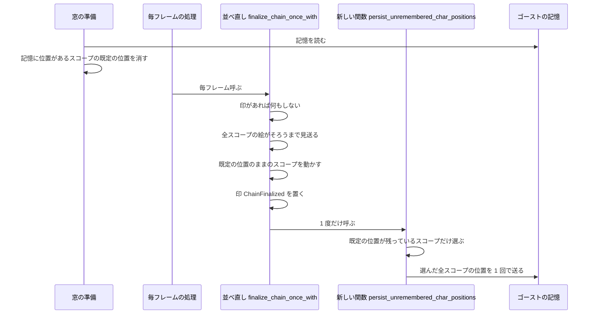
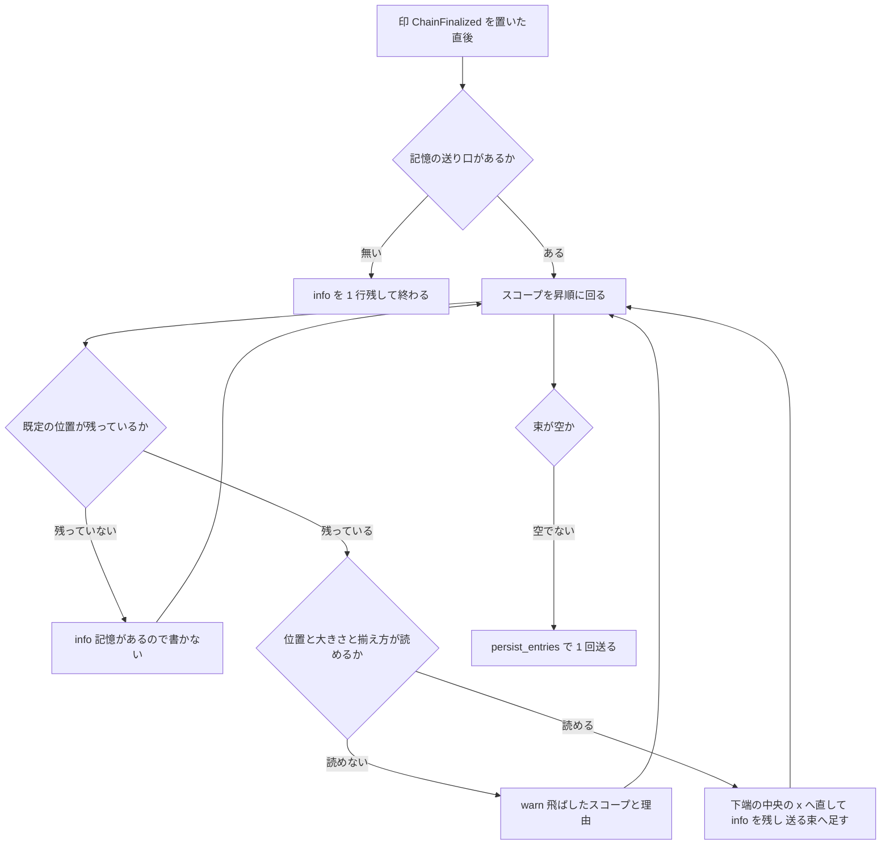

# Design Document: areka-P0-char-position-save-on-exit

> 引用は「ファイル:行（その行が何を定義しているか）」の形で書く。行番号は 2026-10-05 時点（ブランチ `claude/char-position-save-exit-07fc49`）の実物で確かめた。

## Overview

**Purpose**: 一度もドラッグしていないキャラクター窓の位置も記憶に残し、次の起動で前回と同じ並びに立たせる。

**Users**: areka の利用者。本体だけをドラッグして終了しても、次の起動で相方が勝手に本体の隣へ並べ直されなくなる。

**Impact**: キャラクター窓の位置を記憶に書く時機が 1 つ（ドラッグの確定）から 2 つ（ドラッグの確定・起動の最後に並べ終えた時点）になる。あわせて、起動のときの「記憶から戻した窓か」の見分けを、値の比較から「記憶に位置があるか」へ改める。終了の手順とゴースト切り替えの手順には触らない。

### Goals

- 起動の最後に全部のキャラクター窓を並べ終えたとき、記憶に位置が無いキャラクターの位置を 1 度だけ記憶に書く（要件 1）。
- 次の起動で、記憶に位置がある窓は並べ直されない。記憶の値が既定の位置と同じでも同じ扱いにする（要件 2）。
- 書く時機を 2 つに限り、改めたことを説明文と `doc/COMPAT_ARCHITECTURE.md` に残す（要件 3）。
- 書き込みの失敗・位置が取れない窓・書いた内容を記録（ログ）に残す（要件 4）。
- 決定論のテストで固定し、実機（emo2）で確かめる（要件 5）。

### Non-Goals

- 閉じるときに位置を書くこと。終了の手順（`quit_app`）・ゴースト切り替えの手順（`switch_to`・`take_down`）の変更。
- SHIORI の移動の指示（`\![move]` など）が実行された時点で位置を書くこと。
- 位置を戻すときの規則（`project_restore` の補正・吸着）の変更。
- バルーンの相対位置の保存の変更。
- 起動の最後の並べ方（`finalize_chain`）そのものの変更。
- 記憶の保存先・形式・書き込みの仕組み（`areka-sylphya`）の変更。

## Boundary Commitments

### This Spec Owns

- 「並べ終えた時点で、記憶に位置が無いキャラクター窓の位置を書く」関数 1 つと、その呼び出し 1 か所。
- 「記憶から戻したスコープ」の見分け（`restore_merged_placements` が返す集合の決め方）。
- 位置を書く時機の説明文（`drag_follow.rs`・`persist.rs`・`spawn.rs` の該当する説明）と、`doc/COMPAT_ARCHITECTURE.md` の記録 1 行。
- 上の 2 つを固定する決定論のテストと、実機の確認の手順書。

### Out of Boundary

- `crates/areka/src/app_exit.rs`・`session_end.rs`・`emo2_boot/ghost_switch.rs`・`ghost_session.rs`（本番コードは触らない）。
- `crates/areka-sylphya`・`crates/areka-ghost`・`crates/wintf`。
- `placement/chain_finalize.rs` の判定（`finalize_chain`）・`placement/reseed.rs`・`emo2_boot/switch_assets.rs`。
- `on_char_drag_end` の動き（説明文だけ直す。処理は 1 行も変えない）。
- `.kiro/steering/roadmap.md` の文言（「正常な終了で書く」のまま残っている。完了のとき `/kiro-complete` が直す）。

### Allowed Dependencies

- `placement::persist` は、同じ `placement` の中の `spawn::GhostWindows`・`follow::Anchored`・`resolver` の型と、`wintf::ecs::WindowPos`・`areka_sylphya` の公開の型だけを使う。`placement` から `crate::` のパスを引かない（今ある決まり）。
- `emo2_boot::frame::drain_resnap` は `placement::persist` の新しい関数を呼ぶ（`emo2_boot` → `placement` の向き。今ある向きと同じ）。
- `main.rs` は `placement::persist` の新しい判定関数を呼ぶ。
- 新しい crate・新しい外部の依存は足さない。

### Revalidation Triggers

- 起動の最後の並べ直しを 1 度きりにしている印 `ChainFinalized` の持ち方・外し方が変わるとき（書く回数がこの印に乗っている）。
- `GhostWindows` の「既定の位置」`default_char_pos` の意味（`None`＝記憶から戻した）が変わるとき（「記憶に位置が無い」の見分けに使っている）。
- 記憶の位置の形（`PersistKey::WindowPos`・下端の中央の x）が変わるとき。
- `extra-character-windows` が 3 体目以降の窓を別の台帳で持つようにするとき（今の設計は `GhostWindows` に居る全スコープを回る）。
- 終了や切り替えの経路に位置を書く口を足そうとするとき（要件 3.1 に反する。要件から見直す）。

## Architecture

### Existing Architecture Analysis

起動から位置の保存までの今の流れ（実物のコードを追った結果）:

1. **窓の準備**: `ghost_session.rs:232`（`restore_merged_placements` を呼ぶ行）が、記憶を読んで既定の配置に重ねる。`main.rs:708`（`restore_merged_placements` の定義）は「重ねた後の位置が既定と違うスコープ」を集合にして返す（`main.rs:734`〜`739`）。
2. **窓を作る**: `ghost_session.rs:268`〜`274`（窓を作る閉包の中で、返ってきた集合のスコープの既定の位置を消す所）。消されたスコープは `default_char_pos` が `None` になる（`spawn.rs:366` の `clear_default_char_pos` の定義）。
3. **起動の最後の並べ直し**: 毎フレームの処理 `frame.rs:374`（`finalize_chain_once` を呼ぶ行）→ `drain_resnap.rs:322`（`finalize_chain_once_with` の定義）。全スコープの絵が出そろい、窓の大きさが絵の大きさに追いついたフレームで 1 度だけ走る。`default_char_pos` が今の位置と同じスコープだけを前のスコープの左隣へ動かし（`chain_finalize.rs:121` の条件の行）、最後に印 `ChainFinalized` を置く（`drain_resnap.rs:388`）。
4. **位置を書く**: 今は `drag_follow.rs:135`（`on_char_drag_end` の定義）だけ。`char_pos_to_origin_x`（`persist.rs:53`）→ `char_pos_entries`（`persist.rs:74`）→ `persist_entries`（`persist.rs:480`）の順。

崩れの原因は 2 つ。

- 相方は一度もドラッグされないので記憶に位置が無く、起動のたびに 3 の並べ直しを受ける。
- 1 の見分けが値の比較なので、記憶の値が既定の位置と同じだと「記憶なし」と同じ扱いになる（`main.rs:730`〜`733` の説明は「差し支えない」としているが、全部の窓を記憶に書くようになると相方がこれに当たる）。

### Architecture Pattern & Boundary Map



**Architecture Integration**:

- **採った形**: 今ある並べ直しの関数の末尾に、書く関数の呼び出しを 1 行足す。新しい状態・新しい型・新しい印は足さない。
- **境界の分け方**: 「どのスコープを書くか」の判断と記録は `placement::persist`（位置の記憶の変換を持つ所）に置く。「いつ呼ぶか」は並べ直しの関数が持つ（印 `ChainFinalized` の内側）。
- **そのまま使う部品**: `char_pos_to_origin_x`・`char_pos_entries`・`persist_entries`・`GhostWindows::default_char_pos`・`ChainFinalized`。
- **新しく足すもの**: 関数 2 つ（書く関数・「記憶に位置があるか」の判定）。足す理由は Components の節。
- **1 フレーム遅らせない**: 並べ直しの移動は `move_window_to`（`window_move.rs:45`）→ `enqueue_window_set_pos`（`window_move.rs:633`）を通り、その中で窓の位置の写し `WindowPos.position` が同じ呼び出しのうちに書き換わる（`window_move.rs:731`〜`739`）。だから並べ直しの直後に同じ関数の中で読めば、動かした後の位置が読める。次のフレームを待たない。

### Technology Stack

| Layer | Choice / Version | Role in Feature | Notes |
|-------|------------------|-----------------|-------|
| 窓の配置 | `crates/areka` の `placement::persist`（今あるモジュール） | 書く関数と判定関数の置き場 | 新しい依存なし |
| 毎フレームの処理 | `emo2_boot::frame::drain_resnap`（今あるモジュール） | 書く関数を呼ぶ 1 か所 | 印 `ChainFinalized` の内側 |
| 記憶 | `areka-sylphya` の `SylphyaPublisher::persist_put`（今あるもの） | 位置を待たずに送る | 触らない |

## File Structure Plan

### Directory Structure

```
crates/areka/src/
├── placement/
│   ├── persist.rs                         # 変更: 書く関数・判定関数を足す。説明文を直す（507 行 → 600 行前後）
│   ├── persist_finalize_save_tests.rs     # 新規: 書く関数の分かれ道のテスト
│   ├── persist_restore_tests.rs           # 変更: 判定関数のテストを足す
│   ├── spawn.rs                           # 変更: default_char_pos の説明文だけ
│   └── follow/drag_follow.rs              # 変更: on_char_drag_end の説明文だけ（937 行・行数を増やさない）
├── emo2_boot/
│   ├── frame.rs                           # 変更: テストの接続宣言 1 つ
│   ├── frame/drain_resnap.rs              # 変更: 呼び出し 1 行と説明（516 行）
│   └── frame_chain_finalize_persist_tests.rs  # 新規: 並べ直しから記憶までを通すテスト
├── main.rs                                # 変更: 集合の決め方（953 行・行数は減る）
└── main_restore_seam_tests.rs             # 変更: 要件 2.6 のテストを足す
doc/COMPAT_ARCHITECTURE.md                 # 変更: 8 章の表に 1 行
.kiro/specs/areka-P0-char-position-save-on-exit/
└── verification/real-machine.md           # 新規: 実機の確認の手順と結果
```

### Modified Files

- `crates/areka/src/placement/persist.rs` — `persist_unremembered_char_positions` と `has_saved_char_pos` を足す。`merge_scope`（`persist.rs:330`）の「x・y の両方が記憶にあるか」の読み取りを小さな私有関数に出し、`has_saved_char_pos` と共有する（判定を 2 か所に書かない）。冒頭の説明（`persist.rs:9` の「書込 API を持たない」）と `persist.rs:451`〜`454` の節の説明を、時機が 2 つになったことに合わせて直す。
- `crates/areka/src/emo2_boot/frame/drain_resnap.rs` — `finalize_chain_once_with` の、印を置く行（`drain_resnap.rs:388`）の直後で `persist_unremembered_char_positions(world)` を呼ぶ。
- `crates/areka/src/main.rs` — `restore_merged_placements` の集合を `has_saved_char_pos` で作る。既定の位置を控える `defaults`（`main.rs:720`〜`721`）と値の比較（`main.rs:734`〜`739`）は要らなくなるので消す。`main.rs:730`〜`733` の説明を書き直す。
- `crates/areka/src/placement/follow/drag_follow.rs` — `drag_follow.rs:127`〜`134` の「永続の窓位置を書くのはこの DragEnd 観測点のみ」を「ドラッグの確定と、起動の最後に並べ終えた時点（`persist_unremembered_char_positions`）の 2 つ」に直す。処理は変えない。
- `crates/areka/src/placement/spawn.rs` — `default_char_pos`（`spawn.rs:287` の欄・`spawn.rs:331` の読み口）の説明に「`None` は記憶に位置があるスコープ。並べ終えた時点の保存はこの値が残っているスコープだけを書く」を足す。
- `crates/areka/src/placement/follow_drag_tests.rs` — `non_dragend_operations_leave_persist_store_byte_invariant`（`follow_drag_tests.rs:626`）の説明の「DragEnd の観測点のみ」を 2 つの時機に直す（892 行・処理は変えない）。
- `doc/COMPAT_ARCHITECTURE.md` — 8 章（`COMPAT_ARCHITECTURE.md:122`）の表に 1 行。形は `areka-P0-kero-balloon` が `position-persist` の要件を改めた行（`COMPAT_ARCHITECTURE.md:148`）にならう。

## System Flows

### 書く・書かないの分かれ道（並べ終えた時点）



- **1 度だけ**: 呼び出しは `finalize_chain_once_with` の、印の確認（`drain_resnap.rs:327`）を通った後にしか無い。同じ窓の一式で 2 度は通らない。
- **並べ終える前に終わった回（要件 1.6）**: 書く口がここにしか無いので、何も書かれない。
- **ゴーストの切り替え（要件 1.3）**: 切り替えは `switch_to`（`ghost_switch.rs:645`）が同じ呼び出しの中で、降ろす（`ghost_switch.rs:656`）→ 窓を閉じる（`ghost_switch.rs:671`）→ 窓の準備（`ghost_switch.rs:818` の `reopen_ghost_windows`）→ 起こす（`ghost_switch.rs:823` の `boot_ghost_strict`）→ 窓を投函する（`ghost_switch.rs:827`）、の順に同期で進める。窓を閉じるとき印は外れ（`app_exit.rs:172`）、起こすとき記憶の送り口は新しいゴーストのものに差し替わる（`ghost_session.rs:806` の `on_boot_ok` → `main.rs:770`）。この間に毎フレームの処理は挟まらない。だから切り替え後の並べ直しは、新しいゴーストの送り口で 1 度だけ書く。切り替えのコードは触らない。
- **シェルの切り替え**: 印を外すのは `close_windows_for_restart`（`app_exit.rs:169`）だけで、呼ぶのはゴーストの切り替えの 2 か所だけ（`ghost_switch.rs:671`・`725`）。シェルの切り替えは窓を閉じないので、書く口を二度通らない。置き直し（`reseed.rs:129`）は記憶を重ねた結果から揃え方とバルーンのずらしだけを取り、キャラクター窓の位置は捨てる（`reseed.rs:8`〜`10` の説明）。その 2 つはバルーンの記憶だけで決まる（`persist.rs:395`〜`409`）ので、位置の記憶が増えても結果は変わらない。

## Requirements Traceability

| Requirement | Summary | Components | Interfaces | Flows |
|-------------|---------|------------|------------|-------|
| 1.1 | 並べ終えた時点で記憶に無い窓の位置を書く | FinalizeSave・FinalizeHook | `persist_unremembered_char_positions` | 分かれ道の図 |
| 1.2 | 記憶がある窓は書き換えない（寄せ直しを含む） | FinalizeSave・RestoredScopes | `default_char_pos` が `None` のスコープを飛ばす | 分かれ道の図 |
| 1.3 | 切り替えで起こしたゴーストも同じ | FinalizeHook（切り替えは同じ並べ直しを通る） | 変更なし | System Flows の説明 |
| 1.4 | キャラクターの数を決め打ちしない | FinalizeSave | `GhostWindows::scopes` を全部回る | — |
| 1.5 | 位置のほかの記憶を変えない | FinalizeSave | 送る鍵は `PersistKey::WindowPos` の x・y だけ | — |
| 1.6 | 並べ終える前に終わったら書かない | FinalizeHook | 呼び出しは印の内側の 1 か所だけ | System Flows の説明 |
| 2.1 | 本体だけ動かして再起動しても相方が動かない | FinalizeSave・RestoredScopes | — | — |
| 2.2 | きれいに終わらなかった回も同じ | FinalizeSave（閉じるときに頼らない） | — | — |
| 2.3 | 一度もドラッグしなくても前回の位置 | FinalizeSave・RestoredScopes | — | — |
| 2.4 | 記憶が無ければ既定の並べ方 | 変更なし（`merge_scope` の今の腕） | — | — |
| 2.5 | 戻すときの規則を変えない | 変更なし（`project_restore` に触らない） | — | — |
| 2.6 | 記憶の値が既定と同じでも記憶として扱う | RestoredScopes | `has_saved_char_pos` | — |
| 3.1 | 書く時機は 2 つだけ | FinalizeHook・WritePointDocs | 本番の呼び手は 1 か所 | — |
| 3.2 | 閉じる・SHIORI の移動・画面の変化・絵の大きさの変化では書かない | FinalizeHook（ほかに呼び手を作らない） | — | — |
| 3.3 | バルーンは今のまま | 変更なし | — | — |
| 3.4 | 改めたことの記録 | WritePointDocs | 説明文・`COMPAT_ARCHITECTURE.md` | — |
| 4.1 | 書き込みの失敗は記録して起動を続ける | FinalizeSave（待たずに送る） | `persist_entries` | — |
| 4.2 | 位置が取れない窓は飛ばして残りを書く | FinalizeSave | `warn!` | 分かれ道の図 |
| 4.3 | 書いたこと・書かなかったことを記録で確かめられる | FinalizeSave | target `areka::persist::save` の `info!` | 分かれ道の図 |
| 5.1 | 本体だけ動かして再起動、を決定論のテストで | Testing Strategy の 13 | — | — |
| 5.2 | ドラッグなしの再起動と要件 2.6 を決定論のテストで | Testing Strategy の 7・14 | — | — |
| 5.3 | 記憶がある窓と、要件 3.2 の各時点で書き換わらないこと | Testing Strategy の 1・10・15 | — | — |
| 5.4 | 書き込みが失敗しても起動が続くこと | Testing Strategy の 4・16 | — | — |
| 5.5 | 実機の確認 | Testing Strategy の実機・`verification/real-machine.md` | — | — |

## Components and Interfaces

| Component | Domain/Layer | Intent | Req Coverage | Key Dependencies (P0/P1) | Contracts |
|-----------|--------------|--------|--------------|--------------------------|-----------|
| FinalizeSave | `placement::persist` | 並べ終えた時点で、記憶に位置が無い窓の位置を書く | 1.1, 1.2, 1.4, 1.5, 4.1, 4.2, 4.3 | `GhostWindows`（P0）・`persist_entries`（P0） | Service |
| FinalizeHook | `emo2_boot::frame::drain_resnap` | 並べ直しが済んだ所で FinalizeSave を 1 度だけ呼ぶ | 1.1, 1.3, 1.6, 3.1, 3.2 | `ChainFinalized`（P0） | Service |
| RestoredScopes | `placement::persist`・`main.rs` | 「記憶から戻したスコープ」を記憶に位置があるかで決める | 1.2, 2.1, 2.3, 2.6 | `merge_scope` と同じ読み取り（P0） | Service |
| WritePointDocs | 説明文・`doc/` | 書く時機を改めたことの記録 | 3.1, 3.4 | — | — |

### placement::persist

#### FinalizeSave

| Field | Detail |
|-------|--------|
| Intent | 並べ終えた時点の全スコープを見て、記憶に位置が無いキャラクター窓の位置を 1 回で送る |
| Requirements | 1.1, 1.2, 1.4, 1.5, 4.1, 4.2, 4.3 |

**Responsibilities & Constraints**

- `GhostWindows` に居る全スコープを昇順に回る（数を決め打ちしない）。
- **「記憶に位置が無い」＝ `default_char_pos(scope)` が `Some`**。`None` にするのは、記憶から戻したスコープに対する `clear_default_char_pos`（`ghost_session.rs:272`）だけで、ほかに `None` にする所は無い（`crates/areka/src` の本番コードを検索した結果）。RestoredScopes の直しの後は「記憶に x・y の両方がある」とちょうど同じになる。
- 位置は窓の写し `WindowPos` の位置と大きさから読み、ドラッグの確定と同じく `char_pos_to_origin_x` で下端の中央の x へ直す。並べ直しは「全スコープの窓の大きさが絵の大きさと同じ」ことを確かめてから走る（`drain_resnap.rs:464`〜`477`）ので、ここで読む大きさは実際に出ている絵の大きさである。
- 送るのは位置の x・y の鍵だけ（`char_pos_entries`）。全スコープの分を 1 つの束にして `persist_entries` を 1 回呼ぶ（保存は「読んで重ねて書く」ので、ほかの記憶は変わらない。束が 1 つなのでファイルの書き込みも 1 回で済む）。
- 書く口は持つが、戻す側の関数（`apply_restored_placements`）からは呼べない位置に置く（戻す関数は今までどおり書く口に届かない＝寄せ直した位置を書き戻さない構造を保つ）。

**Dependencies**

- Inbound: FinalizeHook — 並べ直しが済んだ時に 1 度だけ呼ぶ（P0）
- Outbound: `GhostWindows`・`WindowPos`・`Anchored` — 読むだけ（P0）／`persist_entries`（`persist.rs:480`）— 送る（P0）

**Contracts**: Service [x] / API [ ] / Event [ ] / Batch [ ] / State [ ]

##### Service Interface

```rust
/// 並べ終えた時点の保存（要件 1.1）。本番の呼び手は `finalize_chain_once_with` の 1 か所だけ。
pub fn persist_unremembered_char_positions(world: &World);
```

- Preconditions: 並べ直しが済み、印 `ChainFinalized` が置かれた直後であること。
- Postconditions:
  - 既定の位置が残っていて位置・大きさ・揃え方が読めたスコープの位置が、そのゴーストの記憶へ送られている（待たない）。
  - 既定の位置が `None` のスコープについては何も送っていない。
  - World は変えない（`&World` で足りる）。
- Invariants: 送る鍵は `PersistKey::WindowPos` だけ。panic しない。

**記録（ログ）**（target はドラッグの確定と同じ `areka::persist::save`）

| 場合 | 水準 | 載せるもの |
|---|---|---|
| 書いた | `info!` | スコープ・窓の左上・記憶に書く値・窓の幅・揃え方 |
| 記憶があるので書かない | `info!` | スコープ |
| 位置・大きさ・揃え方・窓が読めないので飛ばす | `warn!` | スコープ・読めなかったもの |
| 記憶の送り口 `PersistWiring` が無い | `info!` 1 行 | 書かなかったこと（スコープごとの行は出さない） |
| `GhostWindows` が無い | `debug!` | 並べ直しの直後には起きない（防御） |

**Implementation Notes**

- Integration: `persist.rs` に `super::spawn::GhostWindows`・`super::follow::Anchored`・`wintf::ecs::WindowPos` の `use` を足す。`placement` の中で閉じる。
- Validation: 書き込みの失敗は送った先で記録される——書き手が止まっていれば送る口が `warn!`（`areka-sylphya/src/actor.rs:526` の `send` の定義）、ファイルの確定に失敗すれば保存の関数が `error!` を出して前のファイルを壊さない（`areka-sylphya/src/persist/mod.rs:247` の `save_scope` の定義とその説明）。どちらも UI の側には戻らないので、起動はそのまま続く（要件 4.1）。失敗した回は記憶に位置が無いままなので、次の起動の並べ終えた時点でもう一度書かれる（やり直しの仕組みは足さない）。
- Risks: 並べ直しを通す今あるテストは記憶の送り口を置いていないので、新しく `info!` が 1 行出る。行数を数えているテストがあれば期待値を直す（待っている間の行数を数える `frame_chain_finalize_tests.rs:276` は、並べ直しの前なので当たらない）。

#### RestoredScopes

| Field | Detail |
|-------|--------|
| Intent | 「記憶から戻したスコープ」を、値の違いでなく記憶に位置があるかで決める |
| Requirements | 1.2, 2.1, 2.3, 2.6 |

**Responsibilities & Constraints**

- 判定は `merge_scope` が位置を差し替えるかどうかの分かれ道（`persist.rs:354` の、x・y の両方が読めたときだけ記憶の値を使う行）と**同じ読み取り**を使う。片方だけ・数字でない値は「記憶なし」（今の `merge_scope` と同じ）。
- `apply_restored_placements`（`persist.rs:318`）の形は変えない（`reseed.rs:129` と今あるテストがそのまま使える）。
- 位置を戻すときの規則（`project_restore`）には触らない（要件 2.5）。

##### Service Interface

```rust
/// スコープのキャラクター窓の位置（x・y の両方）が記憶にあるか。
pub fn has_saved_char_pos(entries: &[(PersistKey, String)], scope: usize) -> bool;
```

- Postconditions: `merge_scope` が記憶の値を採るスコープで、かつそのときだけ `true`。
- `main.rs` の `restore_merged_placements` は、返す集合を「`has_saved_char_pos` が真のスコープ」にする。戻り値の型は変えない（`ghost_session.rs:232`・`268`〜`274` はそのまま）。

**Implementation Notes**

- Integration: 今の記憶ファイルに既定と同じ値が入っている利用者は、次の起動からそのスコープが「記憶あり」になり、並べ直されなくなる。見えている位置は同じ値なので変わらない。
- Risks: 本体だけ記憶にある今の利用者（この spec の前にドラッグした人）は、次の起動で相方が今までどおり本体の隣へ並べ直され、その位置が書かれる。その次の起動からは動かない。

### emo2_boot::frame

#### FinalizeHook

| Field | Detail |
|-------|--------|
| Intent | 並べ直しが済んだ所で FinalizeSave を 1 度だけ呼ぶ |
| Requirements | 1.1, 1.3, 1.6, 3.1, 3.2 |

**Responsibilities & Constraints**

- 呼ぶ場所は `finalize_chain_once_with` の中、印を置く行（`drain_resnap.rs:388`）の直後。並べ直しの移動（`drain_resnap.rs:370`）と既定の位置の更新（`drain_resnap.rs:378`〜`386`）はその前に済んでいる。
- 動かすスコープが 0 件の回（最初から正しい位置に居た）でも呼ぶ。
- 本番でこの関数を呼ぶ所をほかに作らない（閉じる経路・`\![move]` の適用・置き直し・切り替えのどこからも呼ばない＝要件 3.1・3.2）。
- テストは `finalize_chain_once_with` を今の検査の口（`frame_test_support.rs:836` の `run_chain_finalize`）と同じく直接呼ぶ。本番と同じ関数なので、テストが通る道は本番の道と同じ。

**設計へ送られていた確認の答え**

| 確認 | 答え |
|---|---|
| 記憶の送り口が無い起動 | 起動の結線が成り立たなかった回は、毎フレームの処理そのものが最初で戻る（`frame.rs:298` の `Emo2Wiring` が無ければ戻る行）ので、並べ直しも書く口も走らない（今のまま）。結線は成り立ったが実行系が無い回だけ、FinalizeSave が `info!` を 1 行残して書かない。 |
| 並べ終える前にドラッグを確定した | ドラッグの確定がその位置を書く。そのスコープは既定の位置から外れるので並べ直しは動かさない。並べ終えた時点で FinalizeSave が今の位置（ドラッグで決めた位置）をもう一度送る。同じ UI スレッドで順に読んで送るので、古い値が新しい値を上書きすることは無い。 |
| 並べ終えた時点でドラッグの途中 | その時点の位置を書き、あとのドラッグの確定が書き直す（同じ送り口・送った順に処理される）。 |
| 並べ終える前に SHIORI の移動の指示で動いた窓 | 記憶に位置が無ければ、並べ終えた時点の位置（動いた後の位置）を書く。要件 1.1 の字面どおり。移動の指示そのものは書く口を呼ばない（要件 3.2）。 |
| シェルの切り替えの置き直し | 印を外さないので書く口を二度通らない（System Flows の説明）。 |
| ゴーストの切り替え | 同じ並べ直しを通り、新しいゴーストの送り口で 1 度書く（System Flows の説明）。 |
| 並べ直しの移動が窓へ届いた後の位置を読むこと | 移動は同じ呼び出しの中で `WindowPos.position` を書き換える（`window_move.rs:731`〜`739`）。直後に読む。 |

### 説明文と記録

#### WritePointDocs

- `drag_follow.rs:127`〜`134`・`persist.rs` の冒頭と `persist.rs:451`〜`454`・`spawn.rs` の `default_char_pos` の説明・`main.rs:730`〜`733` を、Modified Files に書いたとおりに直す。
- `doc/COMPAT_ARCHITECTURE.md` の 8 章の表に次の内容の 1 行を足す。
  - 事項: キャラクター窓の位置を記憶に書く時機（完了 spec `areka-P0-position-persist` の要件 1.9 の改訂）。
  - areka の扱い: ドラッグの確定と、起動の最後に並べ終えた時点（記憶に位置が無いキャラクターだけ）の 2 つ。閉じるとき・SHIORI の移動の指示・画面の変化・絵の大きさの変化では書かない。
  - 理由: 一度もドラッグしていないキャラクターが起動のたびに並べ直される崩れを直すため（開発者 2026-10-05）。記憶から戻した窓は書かないので、同 spec の要件 5.4（寄せ直した位置を書き戻さない）は保たれる。
  - 出どころ: この spec の要件 3.1・3.4。完了 spec の本文は書き換えない。

## Data Models

記憶の形は変えない。書くのは今ある鍵 `PersistKey::WindowPos { scope, axis }`（ゴーストの `profile\areka\sylphya.toml` の `[window.N]`）の x・y で、値の意味もドラッグの確定と同じ（下端に吸着する窓は x が下端の中央、y は左上）。新しい鍵・新しい資源・新しい部品は足さない。

## Error Handling

### Error Strategy

位置の保存は起動を止めない。失敗はその場で記録し、残りを続ける。

| 起きること | 扱い | 記録 |
|---|---|---|
| 記憶の送り口が無い | 書かずに戻る | `info!` 1 行 |
| 一部の窓の位置・大きさ・揃え方が読めない | そのスコープを飛ばし、残りを書く | `warn!`（スコープと理由） |
| 記憶の書き手が止まっている | 送ったものは捨てられる | `areka-sylphya` の `warn!`（今あるもの） |
| ファイルの確定に失敗 | 前のファイルは無傷。次の起動でもう一度書かれる | `areka-sylphya` の `error!`（今あるもの） |

### Monitoring

実機では `RUST_LOG` に `areka::persist::save=info`・`areka::persist::restore=info` を入れ、「並べ終えた時点で書いた行」「記憶があるので書かなかった行」「次の起動で `merge_scope restore` が記憶の値を読んだ行」「`chain_finalize` の並べ直しの行が出ないこと」を見る。

## Testing Strategy

テストは同じフォルダの別ファイルに置き、本番の関数をそのまま通す。記憶は偽の保存先 `FakePersistIo`（`areka-sylphya/src/persist/io.rs:124`）か、ワークツリーの `target\` の下の一時フォルダに置いた実物のファイルを使う。「書かない」を確かめるテストは、先に 1 回書いて中身を入れてから、前後のバイトを比べる（空どうしの比較にしない。`follow_drag_tests.rs:626` のテストと同じやり方）。

### 書く関数の分かれ道（`placement/persist_finalize_save_tests.rs`）

1. 3 スコープで、スコープ 0 だけ既定の位置を消しておく → スコープ 1・2 の位置だけが書かれ、スコープ 0 の記憶とバルーンの相対位置・ほかの鍵は前後で同じ（1.1・1.2・1.4・1.5）。書いた値は窓の左上から下端の中央の x へ直した値。
2. 1 つのスコープの窓の大きさを読めなくする → `warn!` が出て、残りのスコープは書かれる（4.2）。
3. 記憶の送り口を置かない → panic せず `info!` が 1 行出る。
4. 次の書き込みを失敗させる（`fail_next_commit`・`io.rs:148`）→ 関数は戻り、記憶は前のまま。そのあとのドラッグの確定の書き込みは成功する（4.1・5.4）。
5. 書いた行・書かなかった行が target `areka::persist::save` に出る（4.3）。

### 判定関数（`placement/persist_restore_tests.rs`）

6. `has_saved_char_pos` は x・y の両方が数字のときだけ真。片方だけ・数字でない値は偽。`merge_scope` が記憶の値を採るかどうかと一致する。

### 起動の見分け（`main_restore_seam_tests.rs`）

7. 記憶の位置が既定の位置と同じ値 → `restore_merged_placements` の返す集合にそのスコープが入る（2.6・5.2）。今の実装では空になるので、直す前は赤になる。
8. 記憶が無い → 集合は空（2.4。今あるテストがそのまま通る）。

### 並べ直しから記憶まで（`emo2_boot/frame_chain_finalize_persist_tests.rs`）

9. 2 スコープ・記憶なし・相方が動く大きさで `finalize_chain_once_with` を回す → 両方の位置が書かれ、相方の値は並べ直した後の位置（1.1）。
10. 同じ World でもう一度回す → 記憶は前後で同じ（1 度だけ）。
11. 相方の絵が出ていないまま何フレーム回しても、記憶は空のまま（1.6）。
12. `close_windows_for_restart` で閉じ、記憶の送り口を別の保存先へ差し替えて窓を作り直す → 並べ直しがもう 1 度書き、書かれるのは差し替えた後の保存先だけ（1.3）。
13. **再起動（5.1）**: 一時フォルダの最小のゴーストと実物のファイルで、1 回目の World を並べ終える → 本体だけ `on_char_drag_end` で動かす → 閉じる処理を何も呼ばずに World を捨てる → `restore_merged_placements` で読み直して 2 回目の World を作る（返ってきた集合のスコープの既定の位置を消す）→ 並べ直しを回す。本体は動かした位置、相方は 1 回目の位置に立ち、並べ直しの移動は 0 件、記憶は 2 回目の並べ直しの前後で同じ（2.1・2.2・1.2）。
14. **再起動（5.2）**: ドラッグせずに同じことをする → 両方が 1 回目の位置（2.3）。
15. **書かない時点（5.3）**: 並べ終えて記憶に中身がある状態から、絵の大きさを変えて置き直す・`move_window_to`・作業領域を変えて寄せ直す・`close_windows_for_restart`・`quit_app` を順に行う → 記憶は前後で同じ（3.2）。記憶の位置が画面の外にあって寄せ直して表示しているスコープは、並べ終えた時点でも書き換わらない（1.2）。
16. 書き込みを失敗させても印 `ChainFinalized` は置かれ、次のフレームの処理が続く（4.1・5.4）。

13 で「返ってきた集合のスコープの既定の位置を消す」所は、本番では窓を作る閉包の中（`ghost_session.rs:268`〜`274`）にあり、テストから閉包ごとは呼べない。テストは本番と同じ `clear_default_char_pos` を同じ集合に対して呼ぶ。集合を作る側（7）と消した後の並べ直し（13）はどちらも本番の関数を通す。

### 実機（5.5・必達）

適合ゴースト emo2 で、開発者が次を確かめる。根と記憶はワークツリーの `target\` の下に置く。

1. 記憶の位置を消して起動 → 並べ終えた時点で本体と相方の 2 行が書かれる。
2. 本体だけをドラッグ → 終了 → 起動し直す → 相方が前回の位置に立ち、`chain_finalize` の並べ直しの行が出ない。
3. 2 のあと、もう一度そのまま終了 → 起動 → 並びが変わらない。

手順と結果は `verification/real-machine.md` に残す。

## Supporting References

- 調べた事実と選ばなかった案は `research.md`（0 章の読み替えと、10 章の設計の記録）。
