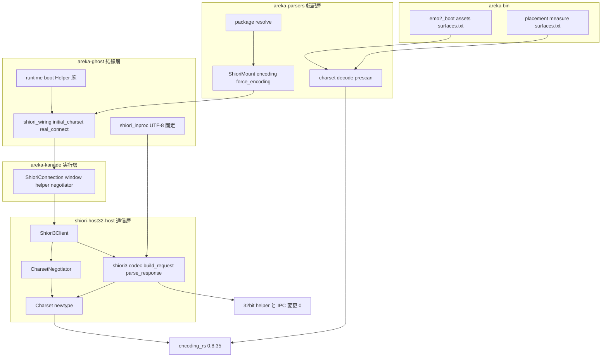
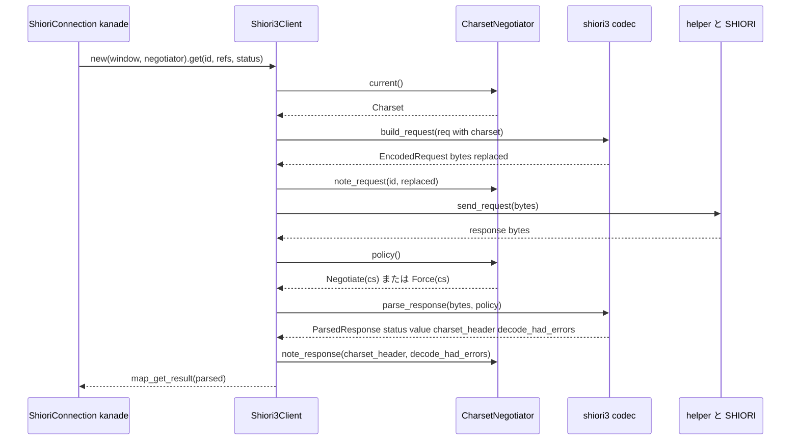
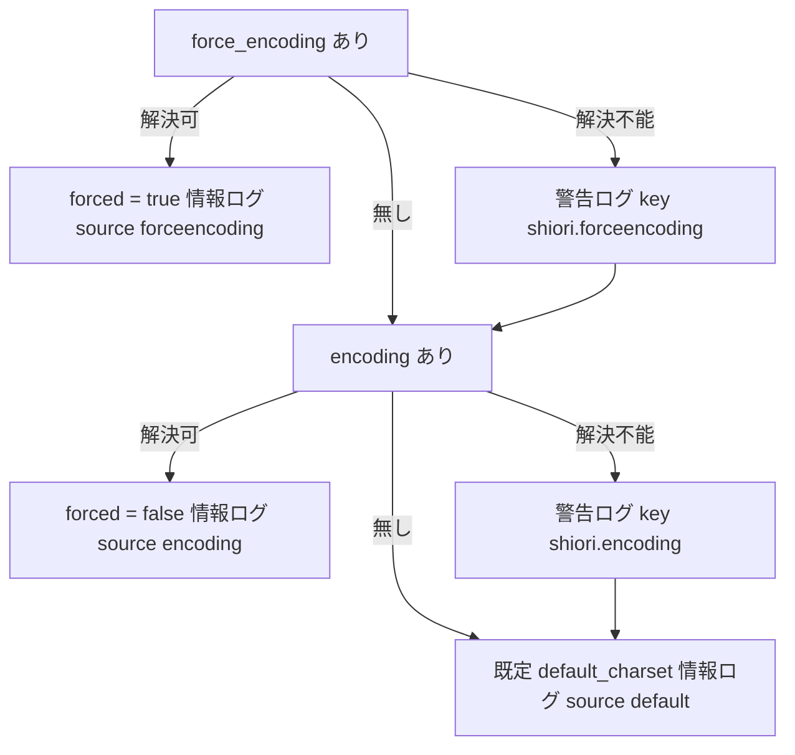

# 技術設計: areka-P0-charset-canon

> 2026-09-11 生成。入力: `requirements.md`（12 要件・裁定 ⑴〜⑶ 確定済み）・`research.md`（ギャップ分析 §1〜§8・設計判断項目 2〜8・11・12 は本書で決定）・steering（`tech.md`／`structure.md`／`logging.md`）。
> コードの引用は「何の定義行か」で示す（行番号は同じ日の別 spec の着地でずれる）。本書は単独で読めるように書き、`research.md` は経緯の参照先に留める。

## Overview

**Purpose**: UTF-8 以外の文字コードで書かれた既存ゴースト（里々の標準テンプレート・古い YAYA ゴーストの大半）を、areka が ukadoc の規則どおりに動かせるようにする。SHIORI との通信の文字コードを descript の宣言と SHIORI の応答ヘッダで決め、要求の符号化と応答の復号をその文字コードで行い、surfaces.txt をファイルごとの `charset` 宣言に従って読む。

**Users**: Shift_JIS・EUC-JP 等のゴーストを areka に入れる利用者と、SSP 向けに `shiori.encoding`／`shiori.forceencoding` を書いたゴースト作者。UTF-8 のゴースト（emo2）の利用者には挙動の差が見えない。

**Impact**: 現状「半分だけ対応」（ファイル層は任意の文字コード・通信層は UTF-8 固定・surfaces.txt は UTF-8 決め打ち）の残り半分を閉じる。通信層をファイル層と同じ基盤（`encoding_rs`・WHATWG Encoding Standard の全ラベル）に載せ、通信層だけの文字コード一覧を持たない。32bit helper と IPC・SHIORI/4 in-proc 経路・UTF-8 経路のバイト列は変えない。

### Goals
- 初期の文字コード＝`shiori.forceencoding` ＞ `shiori.encoding` ＞ 既定（ファイル層と同じ固定写像＝Shift_JIS）。応答の `Charset` ヘッダによる採用（強制時は無視）。採用結果はセッションを通じて保持。
- 要求は現在の文字コードで符号化し、`Charset` ヘッダの綴りを実際の符号化と常に一致させる。応答は宣言された文字コードで復号する。
- surfaces.txt の本番読取 2 経路をファイル層の `decode` に載せる。
- 文字コードの決定・切替・後退はすべてログに残す（記録なしの後退 0）。
- UTF-8・Shift_JIS・EUC-JP の 3 系統＋未知ラベル 1 を定数バイト列で固定する決定論テスト（Shift_JIS だけの分岐に退化したら赤）。
- 正典文書（`doc/COMPAT_ARCHITECTURE.md` §7／§8）と ukadoc 網羅台帳 5 行の追随。里々標準テンプレートでの実機確認。

### Non-Goals
- SHIORI/4 in-proc 経路の交渉（UTF-8 固定のまま・呼び出し形の機械的な追随のみ）。
- SSTP／FMO／`updates2.dau`／`install.txt`／`readme.charset`／`surfacetable.txt` の文字コード（各 M2 spec が同じ基盤を再利用）。
- `surfaces.txt` 以外の `surfaces***.txt` の読取経路の新設。
- OS ロケールを読んで既定を変えること。32bit helper・IPC の変更。文字の描画。

## Boundary Commitments

### This Spec Owns
- **通信層の文字コード型と交渉規則**: `shiori-host32-host` の `Charset`（newtype）・`CharsetNegotiator`（セッション状態＋ログ）・`CharsetPolicy`。
- **SHIORI/3.0 codec の符号化と復号**: `build_request` の符号化、`parse_response` の `Charset` ヘッダ読取と復号。
- **初期値の決定**: `areka-ghost` の `shiori_wiring` における descript 2 キーの解決・既定への後退・起動ログ。
- **descript 2 キーの転記**: `areka-parsers` の `ShioriMount` の 2 フィールド（生ラベル）。
- **surfaces.txt の本番読取 2 経路の復号**（`areka` の `emo2_boot/assets.rs`・`placement/measure.rs`）。
- **正典文書 §7／§8 の追随と台帳 5 行の更新**、実機確認の記録。

### Out of Boundary
- 32bit helper（`shiori-host32-helper`）と IPC（`shiori-host32-ipc`）: バイト列を運ぶだけ。**コード変更 0**（helper の古くなる説明コメント 1 行の文言追随のみ・12.2）。
- SHIORI/4 in-proc（`areka-ghost/src/shiori_inproc.rs`）: `Charset::UTF_8` 固定・`CharsetPolicy::Force(UTF_8)`・交渉状態を持たない。呼び出し形の追随のみ（5.4）。
- ファイル層の charset 解決（`areka-parsers/src/charset/`）: 正本として**消費のみ**（ラベル表を持たない・1.1）。`DefaultEncoding::to_encoding` の公開面は変えない。
- `GhostBootOptions`（27 構築点）・`resolve_kanade_config`・kanade の運行表・`ShioriBackend` trait・scripted fake: 触らない。
- テスト専用の surfaces.txt 読取（`areka-emo-compose/src/world.rs`・`areka-seriko/src/resolve.rs`）: 変更 0（6.6）。
- 完了仕様の文書（`host32-request`・`shiori-protocol`・`parser-foundation`・`ukadoc-survey-*`）: 改訂 0（12.3）。
- 1,000 行番人の例外表（`log-capture-kit/tests/file_length_guard_test.rs`）: 変更 0（12.4）。

### Allowed Dependencies
- `shiori-host32-host` → `encoding_rs`（workspace 既存・0.8.35・利用者が `areka-parsers` から 2 crate 目に増えるだけ）。**`shiori-host32-host` → `areka-parsers` の辺は張らない**（parsers は上位の純パーサ群）。
- `areka-kanade` → `shiori-host32-host`（既存・`shiori/real.rs` が唯一の import 点）。
- `areka-ghost` → `shiori-host32-host`・`areka-parsers`（既存）。既定写像の橋渡しはここで行う。
- `areka` → `areka-parsers::charset`（既存 import）。
- テスト: `shiori-host32-host` の `[dev-dependencies]` に `log-capture-kit`（11 crate と同形・`[dependencies]` には置かない）。

### Revalidation Triggers
- `Shiori3Client::new` の引数形（negotiator を取る）・`build_request` の戻り型（`EncodedRequest`）・`parse_response` の第 2 引数（`CharsetPolicy`）・`ParsedResponse` のフィールド追加 → in-proc と kanade の呼び出し点、host32 の E2E テスト 3 本。
- `ShioriMount` のフィールド追加（`#[non_exhaustive]`・crate 内 3 構築点）。
- `ShioriConnection` のフィールド追加 → 構築点 2 か所（`shiori_wiring.rs`・`real_helper_test.rs`）。
- `real_connect` の引数追加 → 呼び出し点 **4**: `runtime.rs` の `Helper` 腕（本番）・`shiori_wiring.rs` 内のテスト 2 か所・`areka-ghost/tests/ghost/snapshot_capture_test.rs`（実 backend へ Recorder を合成する Custom wiring・第 3 引数は本番の既定と同じ `DefaultEncoding::Ansi`）。統合テストは実行に i686 成果物を要するが**コンパイルは x64 で常に走る**ため、漏らすと `cargo test -p areka-ghost` が赤になる。
- ログ `event` 名（下記 §Monitoring の表）を実機確認と後続 spec が grep する。改名は両方の追随を要する。
- 台帳 5 行の `implemented` 化と URL コメント（`shiori3.rs` 2 行・`resolve.rs` 2 行・`prescan.rs` 1 行）: 削除・移動は `cargo test -p ukadoc-survey` を赤にする。

## Architecture

### Existing Architecture Analysis
実測（2026-09-11・`research.md` §2〜§5 と一致、下記は本書で再確認した点）:
- `shiori3.rs`: `enum Charset { Utf8 }`・`header_value()` 固定・`build_request` は `String::into_bytes`・`parse_response(bytes, request_charset)` は `std::str::from_utf8` で即時失敗し、ヘッダ走査は `Value`／`ErrorLevel`／`ErrorDescription` の 3 腕のみ（`Charset` は読み飛ばし）。ukadoc URL コメント 9 行（Method・Sender・Status・ID・Reference・ステータスコード・Value・ErrorLevel・ErrorDescription）。598 行・ファイル内 `mod tests`。
- `client.rs`: `Shiori3Client<'a> { window, sender }`・`new(window)`／`with_sender(window, sender)`・`get`／`notify` は `&self`・`Charset::Utf8` 固定。`notify` は応答バイト列を解析せず破棄する。呼び出し点: kanade `real.rs`（2）・host32 `tests/{lifecycle_cyclic_e2e, lifecycle_kill_e2e, shiori_request_e2e}.rs`（5）。
- `areka-kanade/src/shiori/real.rs`: `ShioriConnection { pub window, pub helper }` が接続ごとに 1 回作られ、`get`／`notify` のたびに `Shiori3Client::new(&self.window)` を作り捨てる。`ShioriBackend` の各メソッドは `&mut self`。
- `areka-ghost`: `runtime.rs` の `Helper` 腕が `real_connect(helper_exe, mount.shiori.clone())`。`shiori_wiring.rs`（178 行）は接続手続きのみで文字コードの語は無い。`shiori_inproc.rs` は `build_request(.. charset: Charset::Utf8)`・`parse_response(bytes, Charset::Utf8)` の 2 点で codec を再利用。
- `areka-parsers`: `ShioriMount { dir, file }`（`#[non_exhaustive]`）・`resolve.rs` は 959 行で `map.get("shiori")` の直下に 2 キーを足せる。`charset/prescan.rs` の `charset` キー一致の腕に balloon／ghost／shell の URL コメント 3 行が並ぶ。`DefaultEncoding::to_encoding` は `pub(crate)`。
- `areka`: `emo2_boot/assets.rs` は `charset::{DefaultEncoding, decode}` を import 済み・surfaces.txt は `read_to_string`。`placement/measure.rs` `build_shell_assets` も `read_to_string`（doc に「UTF-8 読み」の決め打ち理由）。`measure.rs` は `emo2_boot` を import しない（バルーン側の関数は `areka_emo_present::balloon` から取る）。
- emo2 固定物: `shell/master/surfaces.txt` は BOM 無しで `charset,UTF-8` 始まり（実測 `63 68 61 72 73 65 74 2c 55 54 46 2d 38`）。ghost descript は `charset,UTF-8` のみで `shiori.encoding` 無し。
- 台帳: `shiori.toml` の `spec_shiori3:Charset:1`＝`degraded`（owner 本 spec）・`Charset:2`＝`absent`（owner 空）。`assets.toml` の `shiori.encoding`／`shiori.forceencoding`／`descript_shell_surfaces:charset`＝`absent`（owner 本 spec）。常設検査には `DomainReportStale`（台帳から作り直した報告と一致しない）があり、台帳を触ったら `report`／`report-summary` の作り直しが要る。

### Architecture Pattern & Boundary Map



**Architecture Integration**:
- **選んだ形**: 型 ⒝（`&'static encoding_rs::Encoding` の newtype）＋案 C（交渉規則は host32 の純粋な `CharsetNegotiator`・初期値の決定は `areka-ghost`・parsers は生ラベルの転記のみ）。`research.md` §4 の推奨どおり。
- **依存方向**（左から右へのみ import 可）: `encoding_rs` → `shiori-host32-host`（`charset` → `shiori3` → `client`） → `areka-kanade` → `areka-ghost` → `areka`。`areka-parsers` は `areka-ghost`／`areka` から消費されるのみで、host32 とは辺を持たない。
- **責務の切れ目**: parsers＝転記（意味を持たない）／ghost＝結線と起動ログ／host32＝wire の規則と符号化／kanade＝状態の置き場（規則は持たない）。同じ挙動を 2 か所で持たない。
- **保つ既存の型**: `ShioriBackend` trait・`spawn_shiori_actor`・`GhostBootOptions`・`MountModel`・`shell::parse(&str)`。
- **新設の理由**: `Charset`＝「任意の文字コード」を列挙せず表す唯一の型（ラベル表を持たない・1.1）。`CharsetNegotiator`＝規則と重複抑止を窓無しでテストできる純粋な状態（9.3・7.4）。`CharsetPolicy`＝強制／交渉を codec に伝える 2 値（4.5・5.4）。
- **steering 適合**: `logging.md`（構造化フィールド・`warn!`＝後退・`info!`＝ライフサイクル・`debug!`＝開発者向け）、`structure.md`（新規テストは兄弟ファイル `<stem>_<module>.rs`）、`tech.md`（`encoding_rs` は承認済み依存）。

### Technology Stack

| Layer | Choice / Version | Role in Feature | Notes |
|---|---|---|---|
| 文字コード基盤 | `encoding_rs` 0.8.35（workspace 既存） | ラベル解決 `Encoding::for_label`・符号化 `encode`・復号 `decode_without_bom_handling`・`output_encoding` による通信可否判定 | `shiori-host32-host` の `[dependencies]` に `{ workspace = true }` を足す。純 Rust・`windows` 非依存で codec の方針と合う |
| 通信層 | `shiori-host32-host`（x64） | `Charset`／`CharsetNegotiator`／codec | i686 helper には依存を足さない |
| ログ | `tracing` | 決定・切替・後退の構造化ログ | `target: "shiori-charset"`（host32）／`"ghost-boot"`（既存） |
| テスト | `log-capture-kit`（dev-dep） | 警告・詳細ログの観測 | host32 に新規 dev-dep（11 crate と同形）。`areka-ghost` は既存の `test_log_capture::capture_events` |

## File Structure Plan

### 新規ファイル
```
crates/shiori-host32-host/src/
├── charset.rs                       # Charset newtype・LabelError・CharsetPolicy・CharsetNegotiator（ログ・重複抑止）
├── charset_tests.rs                 # ラベル解決（別名・UTF-16・未知）・交渉規則・ログ観測
└── shiori3_charset_tests.rs         # 3 系統の要求バイト列（定数）と応答復号・継承・次の要求への反映
crates/areka-ghost/src/
└── shiori_wiring_charset_tests.rs   # 2 キーの優先順・後退・起動ログの観測（capture_events）
crates/areka-parsers/src/shell/
└── decode_charset_tests.rs          # surfaces.txt 固定物 3 種（Shift_JIS 宣言／未宣言／EUC-JP 宣言）＝UTF-8 固定物と同一の解析結果
.kiro/specs/areka-P0-charset-canon/verification/
└── signoff-record.md                # 実機確認の記録（里々テンプレート＋emo2・11.1〜11.3）
```

### 変更ファイル
| ファイル | 変更 | 行数の見込み |
|---|---|---|
| `crates/shiori-host32-host/Cargo.toml` | `encoding_rs = { workspace = true }`・`[dev-dependencies] log-capture-kit` | — |
| `crates/shiori-host32-host/src/lib.rs` | `mod charset;` と `pub use charset::{Charset, CharsetNegotiator, CharsetPolicy, LabelError}`・`pub use shiori3::EncodedRequest`。`shiori3::Charset` の再公開を `charset::Charset` へ差し替え | — |
| `crates/shiori-host32-host/src/shiori3.rs` | `enum Charset` を撤去し `crate::charset::Charset` を使う。`build_request` を符号化付き（`EncodedRequest`）へ。`parse_response(bytes, CharsetPolicy)`＝復号前の `Charset` ヘッダ走査 → 復号 → 既存の行解析。`ParsedResponse` に 2 フィールド追加。ukadoc URL コメント 2 行追加（既存 9 行は不動）。ファイル内テストの機械的追随＋`parse_invalid_utf8_is_parse_error` の期待値更新（4.8 の例外） | 598 → 約 660 |
| `crates/shiori-host32-host/src/client.rs` | `Shiori3Client` に `negotiator: &'a mut CharsetNegotiator`。`new(window, negotiator)`／`with_sender(window, negotiator, sender)`。`get`／`notify` は `&mut self` で negotiator を使う | 約 +25 |
| `crates/shiori-host32-host/tests/{lifecycle_cyclic_e2e,lifecycle_kill_e2e,shiori_request_e2e}.rs` | `Shiori3Client::new(&parent, &mut negotiator)` へ機械的追随（`CharsetNegotiator::new(Charset::UTF_8, false)`） | 各 +2 |
| `crates/areka-kanade/src/shiori/real.rs` | `ShioriConnection` に `pub negotiator: CharsetNegotiator`。`get`／`notify` の 2 行 | +5 |
| `crates/areka-kanade/tests/kanade/real_helper_test.rs` | 構築点に `negotiator` を追加 | +1 |
| `crates/areka-ghost/src/shiori_wiring.rs` | `default_charset(DefaultEncoding)`・`initial_charset(&ShioriMount, DefaultEncoding) -> CharsetNegotiator`（ログ付き）・`real_connect` に第 3 引数 `default_encoding`・接続時に `negotiator` を `ShioriConnection` へ。テスト接続宣言 | 178 → 約 260 |
| `crates/areka-ghost/src/runtime.rs` | `Helper` 腕に `options.default_encoding` を渡す 1 行 | +1 |
| `crates/areka-ghost/tests/ghost/snapshot_capture_test.rs` | `real_connect(helper_exe, mount.shiori, DefaultEncoding::Ansi)` へ機械的追随（採取フィクスチャは本番の既定と同じ） | +1 |
| `crates/areka-ghost/src/shiori_inproc.rs` | `Charset::UTF_8`・`build_request(..).bytes`・`parse_response(bytes, CharsetPolicy::Force(Charset::UTF_8))` の機械的追随（挙動 0） | ±0 |
| `crates/areka-parsers/src/package/model.rs` | `ShioriMount` に `encoding: Option<String>`・`force_encoding: Option<String>` | +6 |
| `crates/areka-parsers/src/package/model_tests.rs` | 構築点 3 か所の追随 | +6 |
| `crates/areka-parsers/src/package/resolve.rs` | `map.get("shiori.encoding")`／`map.get("shiori.forceencoding")` の転記 2 行＋ukadoc URL コメント 2 行 | 959 → 963（1,000 未満・番人が守る） |
| `crates/areka-parsers/src/package/resolve_tests.rs` | 2 キーの転記（有／無・値は生のまま）のテスト | +30 |
| `crates/areka-parsers/src/charset/prescan.rs` | `charset` キー一致の腕に surfaces 用 URL コメント 1 行（既存 3 行の隣） | +1 |
| `crates/areka-parsers/src/shell/decode.rs` | 兄弟テスト `decode_charset_tests.rs` の接続宣言 1 行（`#[cfg(test)] #[path = "decode_charset_tests.rs"] mod charset_tests;`） | +2 |
| `crates/areka/src/emo2_boot/assets.rs` | surfaces.txt: `read_to_string` → `std::fs::read` ＋ `decode(&bytes, DefaultEncoding::Ansi)` | ±0 |
| `crates/areka/src/placement/measure.rs` | 同上＋`use areka_parsers::charset::{DefaultEncoding, decode}`・doc の「UTF-8 読み」を「宣言に従う」へ | +2 |
| `crates/shiori-host32-helper/src/shiori_proxy.rs` | doc 1 行「`request` は UTF-8」→「`request` は任意の文字コードのバイト列（意味は x64 側）」（12.2） | ±0 |
| `doc/COMPAT_ARCHITECTURE.md` | §7 の「Charset交渉の具体」を消し込み §8 へ導く。§8 に裁定行を追加 | +6 |
| `doc/ukadoc-coverage/ledger/shiori.toml`・`assets.toml` | 5 行を `implemented` へ・note を現状へ書き直し・`Charset:2` の owner を本 spec に | — |
| `doc/ukadoc-coverage/report/{shiori,assets,summary}.md` | `cargo run -p ukadoc-survey -- report` と `-- report-summary` で作り直す | — |

新規の兄弟テストファイル 4 本（`charset_tests.rs`・`shiori3_charset_tests.rs`・`shiori_wiring_charset_tests.rs`・`decode_charset_tests.rs`）はそれぞれの本番ファイル（`charset.rs`・`shiori3.rs`・`shiori_wiring.rs`・`shell/decode.rs`）に `#[cfg(test)] #[path = "…"] mod …;` の接続宣言 1 行を持つ（`structure.md` の規約・本体をテストファイルへ置き本番ファイルには宣言だけを残す）。

## System Flows

### 交渉の一周（GET）



流れの決め事:
- `note_response` は `map_get_result` より前。応答の status が 204・400・500 であっても `Charset` ヘッダは採用対象（4.2）。emo2 の最初の応答待ちイベント `username` 照会が 204 でも UTF-8 を採用する。
- NOTIFY は `current()` で符号化し `note_request` を呼ぶが、応答は従来どおり解析せず破棄する（`note_response` を呼ばない・5.3）。
- in-proc は `Shiori3Client` を通らず codec を直接呼ぶ（`Force(UTF_8)`・negotiator 無し・5.4）。

### 初期の文字コードの決定（起動時・`shiori_wiring::initial_charset`）



- `forceencoding` が解決できず後退したときは強制の効力も失われる（2.4）。
- `initial_charset` は `real_connect` が **closure を返す前に**（起動スレッド上で同期に）呼ぶ。理由: 起動ログを `test_log_capture::capture_events`（呼出スレッドの同期発火のみ捕捉）で観測できること、および接続の成否に依らず決定と根拠が記録に残ること（2.6）。

## Requirements Traceability

| Requirement | Summary | Components | Interfaces | Flows |
|---|---|---|---|---|
| 1.1 | 対応集合＝ファイル層と同一・独自一覧なし | Charset | `Charset::for_label` が `encoding_rs::Encoding::for_label` を呼ぶだけ | — |
| 1.2 | 別名・大小文字・空白の寛容 | Charset | 同上（`for_label` の寛容性） | — |
| 1.3 | 既定＝固定写像・OS ロケール不読 | shiori_wiring | `default_charset(DefaultEncoding)` の 2 腕 `match` | 初期決定 |
| 1.4 | 既定は対応範囲ではない | Charset・CharsetNegotiator | 型に Shift_JIS／UTF-8 の分岐が無い（定数 2 つのみ） | — |
| 1.5 | UTF-16／replacement の限界 | Charset | `LabelError::NotEncodable`（`output_encoding() != self`） | — |
| 2.1 | 優先順 force ＞ encoding ＞ 既定 | shiori_wiring | `initial_charset` | 初期決定 |
| 2.2 | 強制時は応答ヘッダに関係なく固定 | CharsetNegotiator・codec | `CharsetPolicy::Force`・`note_response` の Force 腕 | 交渉 |
| 2.3 | `encoding` は初期値・以後 SHIORI 優先 | CharsetNegotiator | `new(initial, forced=false)` | 交渉 |
| 2.4 | 解決不能な宣言→警告 1 行＋次へ後退・強制の効力喪失 | shiori_wiring | `charset_label_unresolved`（key／label／reason／fallback） | 初期決定 |
| 2.5 | descript `charset` を通信の初期値に使わない | ShioriMount・shiori_wiring | `initial_charset` の入力は 2 キーと `DefaultEncoding` のみ | — |
| 2.6 | 決定の情報ログ 1 行 | shiori_wiring | `charset_initial`（charset／source） | 初期決定 |
| 2.7 | emo2: 既定 Shift_JIS の要求が 2 本（1 本目 `OnInitialize` は片道ゆえ採用に使わない）・2 本目の応答で UTF-8 採用・3 本目から UTF-8 | CharsetNegotiator | `note_response` の Negotiate 腕；正典文書 §8 に登記 | 交渉 |
| 3.1 | 全ヘッダ行を現在の文字コードで符号化 | codec | `build_request`＝組立後の全文を `Charset::encode` | 交渉 |
| 3.2 | `Charset` 値＝正規名＝実際の符号化 | Charset・codec | `Charset::name()`（`Encoding::name`）・newtype の不変条件 | — |
| 3.3 | `Charset` は request line 直後の最初のヘッダ | codec | 組立順は現状維持（既に満たす） | — |
| 3.4 | UTF-8 では差分 0 バイト | Charset・codec | `encode` が UTF-8 で `Cow::Borrowed`（`into_bytes` と同一バイト） | — |
| 3.5 | 表せない文字→数値文字参照＋警告（イベント名・置換数） | Charset・codec・CharsetNegotiator | `encode -> (bytes, replaced)`・`EncodedRequest.replaced`・`note_request` | 交渉 |
| 3.6 | helper・IPC へそのまま渡す | Shiori3Client | `send_request(MsgTag::Request, &bytes, ..)` 不変 | — |
| 4.1 | 復号より先にヘッダ名で `Charset` を読む・位置不問 | codec | `scan_charset_header(bytes)`（ASCII 走査） | 交渉 |
| 4.2 | 解決可＋非強制→その文字コードで復号・以後採用 | codec・CharsetNegotiator | `parse_response` の Negotiate 腕・`note_response` | 交渉 |
| 4.3 | 省略時は要求の文字コードを継承 | codec | `CharsetPolicy` の中身で復号 | 交渉 |
| 4.4 | 解決不能→要求側で復号・採用せず・初回警告/以後詳細 | codec・CharsetNegotiator | `charset_label_unresolved`＋`warned` 集合 | 交渉 |
| 4.5 | 強制時はヘッダを復号にも採用にも使わず・初回のみ詳細ログ | codec・CharsetNegotiator | Force 腕・`charset_forced_ignores_header` | 交渉 |
| 4.6 | 切替ごとに詳細ログ 1 行・不変時は無し | CharsetNegotiator | `charset_switched`（from／to） | 交渉 |
| 4.7 | 不正並び→代替文字＋記録 | Charset・codec・CharsetNegotiator | `decode -> (text, had_errors)`・`decode_had_errors`・`charset_invalid_bytes_replaced` | 交渉 |
| 4.8 | 解析規則・status 扱い不変・例外 1 本 | codec | 復号後は既存コードそのまま；`parse_invalid_utf8_is_parse_error` のみ期待値更新 | — |
| 5.1 | セッションを通じて保持・GET/NOTIFY 共通 | ShioriConnection・CharsetNegotiator | `ShioriConnection.negotiator`（接続ごとに 1 つ） | — |
| 5.2 | load ごとに初期値へ | shiori_wiring | `real_connect` の closure が接続ごとに `initial_charset` の結果を move | — |
| 5.3 | NOTIFY 応答から採用しない | Shiori3Client | `notify` は `note_response` を呼ばない | 交渉 |
| 5.4 | in-proc は UTF-8 固定・挙動 0 | shiori_inproc | `Force(UTF_8)`・negotiator 無し | — |
| 6.1 | surfaces.txt をファイル層の規則で復号 | assets.rs・measure.rs | `std::fs::read` ＋ `charset::decode(&bytes, Ansi)` | — |
| 6.2 | 宣言はファイルごと | 同上 | `decode` はそのファイルの冒頭だけを見る | — |
| 6.3 | `charset,UTF-8` は同一の解析結果 | 同上 | emo2 は BOM 無し（実測）→ `decode` の結果は `read_to_string` と同一文字列 | — |
| 6.4 | 不在・読取不能は従来どおり明示エラー | 同上 | `fs::read` の `io::Error` を `ShellRead { source }`／`PlacementError::Measure` へ（型不変） | — |
| 6.5 | 不正並びは代替文字＋詳細ログ | `charset::decode` | 既存の `had_errors` → `debug!` | — |
| 6.6 | テスト専用読取は変更 0 | — | `areka-emo-compose/src/world.rs`・`areka-seriko/src/resolve.rs` 非接触 | — |
| 7.1 | 後退にはすべてログ・記録なし 0 | CharsetNegotiator・shiori_wiring | §Monitoring の表（6 event） | — |
| 7.2 | 正規名と根拠を構造化フィールドで | 同上 | 同表のフィールド | — |
| 7.3 | どんな入力でも panic しない | Charset・codec | `for_label` は `Result`・`decode` は `Result` を返さず・`unwrap`／`expect` 0 | — |
| 7.4 | 同じ内容の後退は警告 1 回・以後詳細 | CharsetNegotiator | `warned: BTreeSet<String>`（種別＋鍵） | — |
| 8.1 | §8 に裁定行 | 正典文書 | 4 行（既定固定写像／10.1／10.2／10.3＋NOTIFY 非採用） | — |
| 8.2 | §7 の消し込み | 正典文書 | SHIORI 行から「Charset交渉の具体」を外し §8 へ導く | — |
| 8.3 | 台帳 5 行を `implemented`・検査緑 | 台帳 | 5 行＋`report`／`report-summary` 作り直し | — |
| 8.4 | 既存 URL コメント 9 行を保つ | codec | 組立順・解析順を変えない | — |
| 8.5 | 新規読取箇所に URL コメント | resolve.rs・prescan.rs・shiori3.rs | 2＋1＋2 行 | — |
| 9.1 | 3 系統の要求バイト列を定数で固定 | shiori3_charset_tests | `あ`＝`E3 81 82`／`82 A0`／`A4 A2` | — |
| 9.2 | 3 系統の応答復号 | 同上 | `Charset:` 宣言つき応答の `Value` | — |
| 9.3 | 継承・後退（警告観測）・強制無視・次の要求への反映・別名 | charset_tests・shiori3_charset_tests | `CharsetNegotiator` の連続呼出＋`log_capture_kit::capture` | — |
| 9.4 | 2 キーの優先順と後退（警告観測） | shiori_wiring_charset_tests | `initial_charset`＋`capture_events` | — |
| 9.5 | surfaces.txt 固定物 3 種＝UTF-8 と同一の解析結果 | decode_charset_tests | `shell::parse(&decode(bytes, Ansi))` の等値 | — |
| 9.6 | UTF-8 要求バイト列＝適用前の定数・emo2 固定物無改変 | shiori3_charset_tests | 適用前の `build_request` 出力を定数で保持 | — |
| 9.7 | Shift_JIS だけの実装で通らない系統を含む | 同上 | EUC-JP の系統（`A4 A2`）＋ISO-2022-JP の別名解決 | — |
| 9.8 | 純関数・x64 のみ | 全テスト | `src/` の兄弟ファイル（`tests/*.rs` の i686 依存を避ける） | — |
| 10.1 | 表せない文字＝10 進数値文字参照 | Charset | `Encoding::encode` の既定動作 | — |
| 10.2 | 不正並び＝U+FFFD＋警告 | Charset・codec | `decode_without_bom_handling`（置換あり） | — |
| 10.3 | UTF-16／replacement＝解決不能と同じ経路・理由で区別 | Charset・CharsetNegotiator・shiori_wiring | `LabelError::NotEncodable` を `reason` フィールドへ | — |
| 11.1 | 里々テンプレートで文字コードの経路が最後まで働く（目視は求めない・2026-09-13 裁定） | 実機確認 | §Testing の実機手順 | 目視部分は `areka-P0-shell-implicit-surface` へ（暗黙の基準画像が無く窓が生えない） |
| 11.2 | 有界自動終了＋ログ検索 | 同上 | `AREKA_APP_SMOKE_EXIT_MS`・`RUST_LOG`・`charset_initial`／`charset_switched` の grep | — |
| 11.3 | emo2 でも同じ手順 | 同上 | 期待: 初期 Shift_JIS（default）→ 切替 1 回 UTF-8 | — |
| 12.1 | UTF-8 経路の差分 0・固定物無改変 | 全体 | 9.6 と `emo2-conformance-e2e` の決定論テスト群 | — |
| 12.2 | helper・IPC 変更 0（コメント 1 行のみ） | — | `shiori_proxy.rs` の doc 1 行 | — |
| 12.3 | 完了仕様の文書を改訂しない | — | 非接触 | — |
| 12.4 | 例外表不変・触るファイル 1,000 行未満 | File Structure Plan | 各ファイルの見込み行数（最大 `resolve.rs` 963） | — |
| 12.5 | 既存ログ語彙不変・追加のみ | — | 新規 event 名のみ追加 | — |

## Components and Interfaces

| Component | Domain/Layer | Intent | Req Coverage | Key Dependencies | Contracts |
|---|---|---|---|---|---|
| Charset | host32 通信層 | 任意の文字コードを列挙せず表す newtype・符号化／復号 | 1.1〜1.5, 3.2, 3.4, 3.5, 4.7, 7.3, 10.1〜10.3 | encoding_rs (P0) | Service |
| CharsetNegotiator | host32 通信層 | セッションの交渉状態・採用規則・ログと重複抑止 | 2.2, 2.3, 4.2, 4.4〜4.7, 5.1, 7.1, 7.2, 7.4 | Charset (P0), tracing (P1) | Service, State |
| shiori3 codec | host32 通信層 | 要求の符号化・応答のヘッダ走査と復号 | 3.1〜3.5, 4.1〜4.4, 4.7, 4.8, 8.4, 8.5 | Charset (P0), CharsetPolicy (P0) | Service |
| Shiori3Client | host32 通信層 | 1 往復の結線（negotiator を消費） | 3.6, 5.3 | codec (P0), CharsetNegotiator (P0), ParentMessageWindow (P0) | Service |
| ShioriConnection | kanade 実行層 | 状態の置き場（規則は持たない） | 5.1, 5.2 | Shiori3Client (P0) | State |
| shiori_wiring | ghost 結線層 | 初期値の決定・起動ログ・接続への受け渡し | 1.3, 2.1, 2.4〜2.6, 5.2, 10.3 | ShioriMount (P0), Charset (P0), DefaultEncoding (P0) | Service |
| ShioriMount / resolve | parsers 転記層 | 2 キーの生ラベル転記＋URL コメント | 2.5, 8.5 | parse_kv (P0) | State |
| surfaces 読取 2 経路 | areka bin | ファイル層の `decode` に載せる | 6.1〜6.5 | charset::decode (P0) | — |
| 正典文書・台帳 | doc | §7／§8・台帳 5 行・報告の作り直し | 8.1〜8.3 | ukadoc-survey CLI (P1) | — |

### host32 通信層

#### Charset

| Field | Detail |
|---|---|
| Intent | `&'static encoding_rs::Encoding` の newtype。不変条件＝「符号化の出力は自身と一致する」（`output_encoding() == self`）。 |
| Requirements | 1.1, 1.2, 1.4, 1.5, 3.2, 3.4, 3.5, 4.7, 7.3, 10.1, 10.2, 10.3 |

**Responsibilities & Constraints**
- ラベル表を持たない。解決は `encoding_rs::Encoding::for_label` に委ね、`output_encoding()` が自身と異なる（UTF-16LE／UTF-16BE／replacement）ものだけを `NotEncodable` として退ける。
- 構築経路は定数 `UTF_8`／`SHIFT_JIS` と `for_label` のみ（フィールド非公開）。不変条件が破れる値は作れない。定数は `encoding_rs` が公開する `static` の `Encoding` 値（`UTF_8_INIT`／`SHIFT_JIS_INIT`）への `&'static` 参照で作る（`Charset(&encoding_rs::UTF_8_INIT)`）。
- `Copy`／`Eq`／`Hash`／`Debug` を派生（`Encoding` が備える）。

**Dependencies**
- External: `encoding_rs` 0.8.35 — `for_label`／`name`／`encode`／`decode_without_bom_handling`／`output_encoding`（P0）。

**Contracts**: Service [x]

##### Service Interface
```rust
/// 通信に使う文字コード（不変条件: 符号化の出力が自身と一致する）。
#[derive(Clone, Copy, PartialEq, Eq, Hash, Debug)]
pub struct Charset(&'static encoding_rs::Encoding);

/// ラベルを採用できない理由（ログの `reason` フィールドに写す・10.3）。
#[derive(Clone, Copy, PartialEq, Eq, Debug)]
pub enum LabelError {
    /// Encoding Standard に無いラベル。
    Unknown,
    /// ラベルは既知だが符号化の出力が一致しない（UTF-16 系・replacement 系）＝通信では使えない既知の限界。
    NotEncodable,
}

impl Charset {
    pub const UTF_8: Charset;      // encoding_rs::UTF_8
    pub const SHIFT_JIS: Charset;  // encoding_rs::SHIFT_JIS
    /// 前後空白・大小文字・別名を寛容に解決する（`Encoding::for_label`）。
    pub fn for_label(label: &str) -> Result<Charset, LabelError>;
    /// `Charset` ヘッダに書く正規名（`Encoding::name`＝"UTF-8"／"Shift_JIS"／"EUC-JP"／"ISO-2022-JP"）。
    pub fn name(self) -> &'static str;
    /// 符号化。表せない文字は 10 進数値文字参照 `&#NNNN;` に置換し、置換した文字数を返す。
    pub fn encode(self, text: &str) -> (std::borrow::Cow<'_, [u8]>, usize);
    /// 復号（BOM 判定なし）。不正な並びは U+FFFD に置換し、置換があったかを返す。
    pub fn decode(self, bytes: &[u8]) -> (std::borrow::Cow<'_, str>, bool);
}
```
- Preconditions: なし（任意の文字列・任意のバイト列を受ける）。
- Postconditions: `encode` は UTF-8 のとき `Cow::Borrowed`（入力と同一バイト・3.4）。`decode` は宣言された文字コードだけで復号し、先頭 BOM で文字コードを切り替えない。`for_label` の `Ok` は必ず不変条件を満たす。
- Invariants: `name()` と実際の符号化は常に一致（3.2・10.3「綴りとバイト列が食い違う要求を送らない」）。
- 置換数の求め方: `Encoding::encode` は「置換の有無」しか返さないため、置換があったときだけ文字ごとに符号化して表せない文字を数える（通常経路の追加コスト 0・要件 3.5 の「置換した文字数」を保つ）。

#### CharsetNegotiator

| Field | Detail |
|---|---|
| Intent | 1 セッションの交渉状態（現在の文字コード・強制の有無・警告済みの鍵）と採用規則。窓・I/O を持たず、副作用は `tracing` のみ。 |
| Requirements | 2.2, 2.3, 2.7, 4.2, 4.4, 4.5, 4.6, 4.7, 5.1, 7.1, 7.2, 7.4 |

**Responsibilities & Constraints**
- 規則の唯一の置き場。kanade は状態を持つだけで規則を書かない。
- 重複抑止の単位＝「種別＋鍵」（未解決ラベルはラベルごと・表せない文字はイベント名ごと・不正並びは文字コード名ごと・強制時の食い違いは 1 回きり）。

**Dependencies**
- Inbound: `Shiori3Client`（`current`／`policy`／`note_request`／`note_response`）（P0）。`ShioriConnection` が所有（P0）。
- Outbound: `Charset::for_label`（P0）、`tracing`（P1）。

**Contracts**: Service [x] / State [x]

##### Service Interface
```rust
/// 応答の復号方針（codec へ渡す 2 値・4.5／5.4）。
#[derive(Clone, Copy, PartialEq, Eq, Debug)]
pub enum CharsetPolicy {
    /// 応答の `Charset` ヘッダが解決できればそれで復号し、できなければ中の文字コードで復号する。
    Negotiate(Charset),
    /// 応答の `Charset` ヘッダを見ずに中の文字コードで復号する（強制・in-proc）。
    Force(Charset),
}

pub struct CharsetNegotiator { /* current: Charset, forced: bool, warned: BTreeSet<String> */ }

impl CharsetNegotiator {
    pub fn new(initial: Charset, forced: bool) -> Self;
    /// 次の要求に使う文字コード。
    pub fn current(&self) -> Charset;
    /// 次の応答の復号方針（forced なら Force、それ以外は Negotiate）。
    pub fn policy(&self) -> CharsetPolicy;
    /// 要求の符号化結果を受け取り、置換があれば記録する（3.5・7.4）。
    pub fn note_request(&mut self, id: &str, replaced: usize);
    /// GET 応答の `Charset` ヘッダ（生ラベル・省略時 None）と復号エラー有無を受け取り、採用と記録を行う。
    pub fn note_response(&mut self, charset_header: Option<&str>, decode_had_errors: bool);
}
```

`note_response` の規則（表の各行が 1 テストに対応する・9.3）:

| 強制 | ヘッダ | 解決 | 状態の変化 | ログ |
|---|---|---|---|---|
| なし | 省略 | — | なし（継承・4.3） | なし |
| なし | あり | `Ok(c)`・`c == current` | なし | なし（4.6） |
| なし | あり | `Ok(c)`・`c != current` | `current = c`（4.2） | `debug` `charset_switched`（from・to） |
| なし | あり | `Err(reason)` | なし（4.4・10.3） | 同じラベルにつき初回 `warn`・以後 `debug` `charset_label_unresolved`（label・reason・kept） |
| あり | 省略 | — | なし | なし |
| あり | あり | `Ok(c)`・`c == current` | なし | なし |
| あり | あり | それ以外 | なし（4.5） | 初回のみ `debug` `charset_forced_ignores_header`（forced・header） |

`decode_had_errors == true` は上記と独立に、文字コード名につき初回 `warn`・以後 `debug` `charset_invalid_bytes_replaced`（charset）を出す（4.7・10.2・7.4）。`note_request(id, replaced > 0)` はイベント名につき初回 `warn`・以後 `debug` `charset_unmappable_replaced`（id・replaced）（3.5・7.4）。

##### State Management
- State model: `current: Charset`・`forced: bool`・`warned: BTreeSet<String>`（鍵は `"label:<x>"`／`"unmappable:<id>"`／`"invalid:<charset>"`／`"forced-mismatch"`）。ラベルの鍵は **trim＋ASCII 小文字化してから**入れる（`foo`／`FOO` で 2 回警告しない・応答ごとにラベルの綴りを変える壊れた SHIORI で集合が際限なく育たない）。
- Persistence: なし。接続（`ShioriConnection`）と同寿命＝SHIORI の load から unload まで（5.1）。次の load では `initial_charset` が新しい値を作る（5.2）。
- Concurrency: 窓所有スレッド（shiori アクター）上でのみ触る。ただし `real_connect` の closure（`Send + 'static`）へ move されるため **`Send` を満たさなければならない**（`&'static Encoding` は `Sync`・`BTreeSet<String>` は `Send`。`Rc` 等を入れない）。

**Implementation Notes**
- Integration: `Shiori3Client` が `&'a mut` で借用する。`ShioriConnection` のフィールド `negotiator` と `window` は別フィールドなので同時借用できる。
- Validation: `log_capture_kit::capture` で `warn`／`debug` の件数と `event` フィールドを固定する（呼出スレッドで同期発火するため捕捉できる）。
- Risks: 毎秒の `OnSecondChange` で同じ後退が続いても警告は 1 回（`warned`）。集合は鍵の種類が有限（ラベル・イベント名・文字コード名）なので無限に育たない。

#### shiori3 codec（`build_request`／`parse_response`）

| Field | Detail |
|---|---|
| Intent | 純粋な wire codec。`Charset` で符号化・復号する。状態もログも持たない（事実を戻り値で返す）。 |
| Requirements | 3.1, 3.2, 3.3, 3.4, 3.5, 4.1, 4.2, 4.3, 4.4, 4.7, 4.8, 8.4, 8.5 |

**Responsibilities & Constraints**
- `build_request`: 現状の `String` 組立（順序・9 行の URL コメント・`SecurityLevel: local`）をそのまま保ち、末尾で `req.charset.encode(&out)` に替える。`Charset:` の書き出し行の直上に `// ukadoc: https://ssp.shillest.net/ukadoc/manual/spec_shiori3.html#Charset:1` を置く。ISO-2022-JP も全文をまとめて符号化してよい（`Encoding::encode` は終端で ASCII 状態へ戻す）。
- `parse_response`: ⑴ 復号前に `scan_charset_header(bytes) -> Option<String>`（行を `\n` で切り `\r` を落とし、`:` の手前を ASCII 小文字化して `charset` に一致する最初の行の値を trim して返す）。この関数の一致の腕の直上に `// ukadoc: https://ssp.shillest.net/ukadoc/manual/spec_shiori3.html#Charset:2` を置く。⑵ `CharsetPolicy` に従って復号に使う `Charset` を決める（Negotiate: ヘッダが `for_label` で解決できればそれ・できなければ中の値／Force: 中の値）。⑶ `charset.decode(bytes)` で全体を復号。⑷ 以降は現状の行解析（status 行・3 腕）を無変更で通す。
- 復号は `decode_without_bom_handling` 相当（`Charset::decode`）。理由: 宣言と食い違う BOM で交渉結果を黙って覆さない。UTF-8 の有効な入力では `from_utf8` と同じ文字列（BOM も文字として残る）なので既存テストの期待値は変わらない（4.8）。
- 走査が ASCII で成り立つ根拠: 対応集合のうち UTF-16 系は `Charset` に入らないため、ヘッダ名の並ぶ領域は常に ASCII 互換（ISO-2022-JP も ASCII 状態から始まる）。非 ASCII を含む `Charset` 値は `from_utf8_lossy` で文字列化され `for_label` が `Unknown` にする。

**Contracts**: Service [x]

##### Service Interface
```rust
pub struct ShioriRequest<'a> { pub method: Method, pub id: &'a str, pub references: &'a [String],
    pub sender: &'a str, pub status: Option<&'a str>, pub charset: Charset }

/// 符号化済みの要求。
pub struct EncodedRequest {
    pub bytes: Vec<u8>,
    /// 表せない文字を数値文字参照へ置換した文字数（0 なら置換なし）。
    pub replaced: usize,
}
pub fn build_request(req: &ShioriRequest) -> EncodedRequest;

pub struct ParsedResponse {
    pub status: u16,
    pub value: Option<String>,
    pub error_level: Option<String>,
    pub error_description: Option<String>,
    /// 応答の `Charset` ヘッダの生の値（trim 済み・省略時 None）。採用の判断は negotiator が行う。
    pub charset_header: Option<String>,
    /// 復号で代替文字への置換があったか。
    pub decode_had_errors: bool,
}
pub fn parse_response(bytes: &[u8], policy: CharsetPolicy) -> Result<ParsedResponse, ShioriError>;
```
- Preconditions: なし。
- Postconditions: `Err(ShioriError::Parse)` は status 行の欠落・数値コードなしのみ（不正なバイト並びでは失敗しない・4.7）。UTF-8 かつ有効な入力では `value` 等が現状と同一。
- Invariants: `bytes` の `Charset:` 行の値は `req.charset.name()`、本文は同じ `req.charset` で符号化（3.2）。

**Implementation Notes**
- Integration: in-proc は `build_request(..).bytes`・`parse_response(.., CharsetPolicy::Force(Charset::UTF_8))` へ機械的に追随（挙動 0・5.4）。`ParsedResponse` の構造体リテラル（client.rs テスト 8 か所・shiori3.rs テスト 1 か所）に 2 フィールドを足す。`EncodedRequest.bytes: Vec<u8>` は UTF-8 のとき `Cow::Borrowed` を 1 回 `into_owned` する（複製 1 回・バイト列は同一で 3.4 は成立）。複製を避けるために「UTF-8 なら `String::into_bytes`」の近道を作ってはならない——それが 1.4 の禁じる文字コード分岐そのものになる。
- Validation: `shiori3_charset_tests.rs`（下記 Testing）。
- Risks: `Charset` 行より前に非 ASCII のヘッダを置き、しかも ASCII 状態へ戻さない SHIORI（ISO-2022-JP でのみ起こり得る）は走査で拾えない。ukadoc が「最初の行、または少なくとも非 ASCII 行の前が望ましい」と定める側なので、既知の限界として §8 の登記に含める。

#### Shiori3Client

| Field | Detail |
|---|---|
| Intent | 1 往復の結線。negotiator を借用して符号化と採用を繋ぐ。 |
| Requirements | 3.6, 5.3 |

##### Service Interface
```rust
pub struct Shiori3Client<'a> { window: &'a ParentMessageWindow, sender: &'a str, negotiator: &'a mut CharsetNegotiator }
impl<'a> Shiori3Client<'a> {
    pub fn new(window: &'a ParentMessageWindow, negotiator: &'a mut CharsetNegotiator) -> Self;
    pub fn with_sender(window: &'a ParentMessageWindow, negotiator: &'a mut CharsetNegotiator, sender: &'a str) -> Self;
    pub fn get(&mut self, id: &str, references: &[String], status: Option<&str>) -> Result<Option<String>, RequestError>;
    pub fn notify(&mut self, id: &str, references: &[String], status: Option<&str>) -> Result<(), RequestError>;
}
```
- `get`: `current()` → `build_request` → `note_request` → `send_request`（バイト列そのまま・3.6）→ `parse_response(&resp, policy())` → `note_response` → `map_get_result`。
- `notify`: `current()` → `build_request` → `note_request` → `send_request` → 応答破棄（解析も採用もしない・5.3）。
- 既存の呼び出し点（kanade 2・host32 E2E テスト 5）は `new(&window, &mut negotiator)` へ機械的に追随。E2E テストは `CharsetNegotiator::new(Charset::UTF_8, false)` をローカルに持つ（testdll は `Charset` 値を見ないため緑のまま）。

### kanade 実行層

#### ShioriConnection（変更）
- `pub struct ShioriConnection { pub window, pub helper, pub negotiator: CharsetNegotiator }`。
- `get`／`notify`: `Shiori3Client::new(&self.window, &mut self.negotiator).get(..)`（フィールド別借用）。規則は書かない。
- 構築点 2 か所（`shiori_wiring.rs`・`real_helper_test.rs`）に `negotiator` を足す。`FakeBackend`（`real_tests.rs`）は trait しか見ないので変更なし。

### ghost 結線層

#### shiori_wiring（`initial_charset`・`real_connect`）

| Field | Detail |
|---|---|
| Intent | descript 2 キーの解決と既定への後退、起動ログ、接続への受け渡し。 |
| Requirements | 1.3, 2.1, 2.4, 2.5, 2.6, 5.2, 10.3 |

##### Service Interface
```rust
/// ファイル層と同じ固定写像（`DefaultEncoding::to_encoding` と同じ 2 腕・OS ロケール不読・1.3）。
fn default_charset(default: DefaultEncoding) -> Charset;   // Ansi → SHIFT_JIS／Utf8 → UTF_8

/// 優先順 force > encoding > 既定で初期値を決め、決定と後退をログに残す（2.1／2.4／2.6）。
pub(crate) fn initial_charset(shiori: &ShioriMount, default: DefaultEncoding) -> CharsetNegotiator;

pub fn real_connect(helper_exe: PathBuf, shiori: ShioriMount, default_encoding: DefaultEncoding)
    -> impl FnOnce() -> Result<Box<dyn ShioriBackend>, String> + Send + 'static;
```
- `real_connect` は closure を返す前に `initial_charset` を呼ぶ（起動スレッドで同期・ログが捕捉できる・接続失敗でも決定は記録される）。closure は `ShioriConnection { window, helper, negotiator }` を返す。
- `default_charset` を ghost 側の 2 腕 `match` にする理由（研究 §8 項目 4 の裁定）: host32 は parsers に依存できず、`DefaultEncoding::to_encoding` を公開して `Charset` へ橋渡しすると「UTF-16 でない」ことを検査する失敗腕が要り、その腕は固定写像では到達不能＝記録のない死んだ失敗経路になる。2 腕の定数写像をテストで固定する方が小さく、失敗経路が無い。
- 警告ログの `fallback` フィールドには最終的に採用した文字コード名を書く（後退先を先に決めてから記録する）。
- `runtime.rs` の `Helper` 腕は `real_connect(helper_exe, mount.shiori.clone(), options.default_encoding)` の 1 行変更。`Custom`／`InProc` は非接触。

### parsers 転記層

#### ShioriMount／resolve（変更）
```rust
#[non_exhaustive]
pub struct ShioriMount {
    pub dir: PathBuf,
    pub file: Option<String>,
    /// descript `shiori.encoding,<ラベル>` の生の値（解釈しない・2.5／8.5）。
    pub encoding: Option<String>,
    /// descript `shiori.forceencoding,<ラベル>` の生の値（解釈しない）。
    pub force_encoding: Option<String>,
}
```
- `resolve.rs` の `file: map.get("shiori").cloned()` の直下に、各 1 行の URL コメントを伴って `encoding: map.get("shiori.encoding").cloned()`／`force_encoding: map.get("shiori.forceencoding").cloned()` を足す（URL は要件の正典引用のアンカーそのまま）。959 → 963 行。番人（`file_length_guard_test.rs`）が 1,000 行未満を守る。
- ラベルの解釈（空白・大小文字）は `Charset::for_label` が行うため、転記層では trim しない（`parse_kv` の値をそのまま）。

#### charset/prescan（変更 1 行）
- `charset` キー一致の腕に並ぶ balloon／ghost／shell の URL 3 行の隣に `// ukadoc: https://ssp.shillest.net/ukadoc/manual/descript_shell_surfaces.html#charset_2c_6587_5b57_30b3_30fc_30c9:1` を足す。ここが `charset,<名前>` 宣言を読む唯一の定義箇所であり、台帳の規約（定義箇所に置く・呼び出し側に書かない・1 項目 1 行）に合う。`shell/decode.rs` には `charset` 専用の腕が無い（未知行として素通し）ので、そこには置かない。

### areka bin

#### surfaces.txt 読取 2 経路（変更各 1 行）
- `emo2_boot/assets.rs`（起動）と `placement/measure.rs`（配置採寸）: `std::fs::read_to_string(&p)` → `std::fs::read(&p).map(|bytes| decode(&bytes, DefaultEncoding::Ansi))`。`areka-emo-present/src/balloon.rs` のバルーン読取と同じ形。エラー型は `io::Error` のまま（6.4）。
- 共通ヘルパは作らない: 2 経路は同一クレートだが別モジュールで、1 行の配線を関数に包んでもテストの対象は増えない（決定論テストは `decode`＋`shell::parse` の性質を固定する）。
- 既知の差（登記）: BOM 付き UTF-8 の surfaces.txt では従来 U+FEFF が 1 行目に残っていたが、`decode` は BOM を吸収する。emo2 の固定物は BOM 無し（実測）なので 6.3 の同一性は保たれる。

### 正典文書・台帳
- `doc/COMPAT_ARCHITECTURE.md` §7 の SHIORI 行から「Charset交渉の具体」を外し「→ §8（charset-canon）」を添える。§8 の表に行を足す: ⑴ 未宣言時の既定＝Shift_JIS 固定写像（OS ロケール不読）、⑵ 表せない文字＝10 進数値文字参照＋警告、⑶ 不正な並び＝U+FFFD＋警告（UTF-8 にも適用）、⑷ UTF-16／replacement＝解決不能と同じ経路（警告＋継続・理由で区別）、⑸ NOTIFY 応答から採用しない、⑹ emo2 のような UTF-8 の SHIORI は既定の Shift_JIS を名乗る要求が 2 本（採用は 2 本目の応答・3 本目から UTF-8）（本文 ASCII・`shiori.encoding,UTF-8` で回避可）、⑺ 非 ASCII ヘッダの後に置かれた `Charset` は拾えない（ISO-2022-JP のみ）、⑻ BOM 付き UTF-8 の surfaces.txt は従来 U+FEFF が 1 行目に残っていたが `decode` が BOM を吸収する（emo2 固定物は BOM 無しで差分 0）。出典 spec 列は本 spec。
- 台帳: `shiori.toml` `Charset:1`／`Charset:2`、`assets.toml` `shiori.encoding`／`shiori.forceencoding`／`descript_shell_surfaces:charset` を `status = "implemented"`・`owner = "areka-P0-charset-canon"`（`Charset:2` は空から本 spec へ）・`introduced = ""`（版番号不明はそのまま）・note を現状（根拠の場所＝定義箇所・ログの event 名）へ書き直す。`cargo run -p ukadoc-survey -- report` と `-- report-summary` で報告を作り直し、`cargo test -p ukadoc-survey` を緑にする（`DomainReportStale`／`ImplementedWithoutEvidence` の両方）。

## Data Models

### Domain Model
- **値オブジェクト** `Charset`（不変・`Copy`）。同値性は `Encoding` の同一性（別名は同じ値に解決）。
- **集約** `CharsetNegotiator`（接続 1 つにつき 1 つ・接続と同寿命）。不変条件: `forced == true` の間 `current` は変わらない。
- **転記** `ShioriMount.encoding`／`force_encoding`（意味を持たない生文字列）。
- **事実** `EncodedRequest.replaced`・`ParsedResponse.charset_header`／`decode_had_errors`（codec が返し negotiator が解釈する）。

### Data Contracts & Integration

**wire（SHIORI/3.0）**
- 要求: request line（ASCII）→ `Charset: <name()>`（最初のヘッダ・3.3）→ 以降は現状の順。全体を `Charset::encode` で符号化。
- 応答: `Charset` ヘッダをヘッダ名の ASCII 一致で任意の位置から読む。省略時は方針の中の文字コード。

**ログのスキーマ**（§Monitoring）

## Error Handling

### Error Strategy
- 文字コードに関する失敗は**エラーにしない**（後退＋記録）。`Result` を返すのは既存の `ShioriError::Parse`（status 行の欠落）と I/O（surfaces.txt の不在・読取不能）だけ。新しいエラー型は作らない。
- panic 0（7.3）: `for_label` は `Result`、`encode`／`decode` は失敗しない、`unwrap`／`expect` を置かない。

### Error Categories and Responses
| 事象 | 扱い | 記録 |
|---|---|---|
| descript の 2 キーが解決できない | 次の優先順へ後退（強制は効力喪失） | `warn` `charset_label_unresolved`（ghost-boot） |
| 応答 `Charset` が解決できない | 要求側で復号・採用しない | 同ラベル初回 `warn`・以後 `debug`（shiori-charset） |
| 表せない文字 | 数値文字参照へ置換して送る | 同イベント初回 `warn`・以後 `debug` |
| 応答の不正な並び | U+FFFD で吸収して解析続行 | 同文字コード初回 `warn`・以後 `debug` |
| 強制時に異なるヘッダ | 無視 | 初回のみ `debug` |
| surfaces.txt 不在・読取不能 | 従来どおり `ShellRead`／`PlacementError::Measure`（明示エラー） | 既存の `error!` |
| surfaces.txt の不正な並び・未知ラベル | ファイル層の寛容（代替文字・既定へ） | 既存の `debug!`（`charset::decode`） |

### Monitoring
| target | event | level | fields | 要件 |
|---|---|---|---|---|
| `ghost-boot` | `charset_initial` | info | `charset`（正規名）・`source`（`forceencoding`／`encoding`／`default`） | 2.6 |
| `ghost-boot` | `charset_label_unresolved` | warn | `key`（`shiori.forceencoding`／`shiori.encoding`）・`label`・`reason`（`unknown`／`not_encodable`）・`fallback`（採用した正規名） | 2.4, 10.3 |
| `shiori-charset` | `charset_switched` | debug | `from`・`to` | 4.6 |
| `shiori-charset` | `charset_label_unresolved` | warn → debug | `label`・`reason`・`kept` | 4.4, 7.4, 10.3 |
| `shiori-charset` | `charset_forced_ignores_header` | debug（初回のみ） | `forced`・`header` | 4.5 |
| `shiori-charset` | `charset_unmappable_replaced` | warn → debug | `id`・`replaced` | 3.5, 7.4 |
| `shiori-charset` | `charset_invalid_bytes_replaced` | warn → debug | `charset` | 4.7, 7.4, 10.2 |

既存のログ行（起動・終了・エラー）は変えない（12.5）。実機確認は `charset_initial` と `charset_switched` を grep する（11.2）。debug 水準の行を点けるときの `RUST_LOG` は **target 名**で指定する（`shiori-charset=debug,ghost-boot=debug`。モジュールパス名では点かない）。

## Testing Strategy

### Unit Tests（決定論・純関数・x64 のみ・`src/` の兄弟ファイル）
- `charset_tests.rs`: ⑴ 別名（`shift_jis`／`Shift-JIS`／`sjis`／`windows-31j`／` SHIFT_JIS `）が同じ `Charset` に解決し `name()` が `Shift_JIS`（1.2・9.3）。⑵ `UTF-16`／`UTF-16LE`／`replacement`／`hz-gb-2312` が `NotEncodable`、`x-nope` が `Unknown`（1.5・10.3）。⑶ `note_response` の表 7 行を各 1 テストで固定し、`warn`／`debug` の件数と `event` を `log_capture_kit::capture` で数える（4.2〜4.6・7.4）。⑷ 同じ未解決ラベルを 3 回受けて `warn` 1・`debug` 2（4.4・7.4）。同じラベルの大小文字違い（`foo`／`FOO`）も 1 回と数える（鍵の正規化）。⑸ 採用後の `current()` が変わること（9.3 の前半。「次の要求のバイト列に現れること」は `shiori3_charset_tests.rs` ⑽ が固定する——`current()` の変化と要求バイト列の変化は単位が違う主張なので、前者の緑で後者を証明しない）。
- `shiori3_charset_tests.rs`: ⑴ `あ` を Reference0 に持つ GET を UTF-8／Shift_JIS／EUC-JP で組み、`Charset:` 行の綴りと Reference0 のバイト列を定数（`E3 81 82`／`82 A0`／`A4 A2`）と比較（9.1・9.7）。ISO-2022-JP（`1B 24 42 24 22 1B 28 42`）を 4 系統目として足してよい。⑵ 同じ 3 系統の応答（`Charset: <name>` と各バイト列の `Value`）を `Negotiate(UTF_8)` で復号して `Value == "あ"`（9.2）。⑶ ヘッダ省略時の継承（`Negotiate(SHIFT_JIS)` で Shift_JIS バイト列）（4.3）。⑷ 解決不能ラベルは方針の中の文字コードで復号（4.4）。⑸ `Force(UTF_8)` で `Charset: Shift_JIS` のヘッダを無視（4.5）。⑹ 絵文字を Shift_JIS で符号化すると `&#128512;` になり `replaced == 1`（3.5・10.1）。⑺ 不正 Shift_JIS 並びが `Ok`＋U+FFFD＋`decode_had_errors`（4.7）。⑻ 適用前の `build_request` 出力（emo2 相当の GET）を逐語の定数として保持し、UTF-8 で組んだバイト列と等値（3.4・9.6・12.1）。⑼ `Charset` ヘッダが最初のヘッダ行であること（3.3）。⑽ **採用が次の要求に現れる連鎖**（9.3・9.7 の要）: `CharsetNegotiator::new(SHIFT_JIS, false)` → `note_response(Some("EUC-JP"), false)` → `build_request(.. charset: neg.current())` の出力に `Charset: EUC-JP` 行があり Reference0 の `あ` が `A4 A2` であることを定数と比較（窓不要・純関数の連続呼出）。
- `shiori3.rs` 既存テスト: `Charset::UTF_8`・`.bytes`・`Negotiate(UTF_8)`・2 フィールドの機械的追随。**4.8 の唯一の例外** `parse_invalid_utf8_is_parse_error`: 現在の入力 `[FF FE 00]` には status 行が無く、新 codec の事後条件（`Err(Parse)` は status 行の欠落のみ）に従えばこの入力は今後も `Err(Parse)` のままである。よって⑴ 旧入力はそのまま「status 行なし → `Err(Parse)`」を期待するテスト（`parse_without_status_line_is_parse_error` 等）として**期待値を変えずに残し**、⑵ 例外テストは入力を「status 行あり＋`Value` に不正バイト」（`SHIORI/3.0 200 OK\r\nValue: \xFF\r\n\r\n`）へ差し替えて `Ok`・`decode_had_errors == true`・`Value` に U+FFFD を期待する。期待値を更新するのは ⑵ の 1 本だけ（他の期待値変更 0）。
- `shiori_wiring_charset_tests.rs`: ⑴ `force_encoding=Some("EUC-JP")`・`encoding=Some("UTF-8")` → EUC-JP・forced（2.1・2.2）。⑵ `encoding` のみ → その値・非強制（2.3）。⑶ 両方無し → 既定（`Ansi`→`Shift_JIS`・`Utf8`→`UTF-8`）（1.3）。⑷ `force_encoding=Some("UTF-16")` → 警告 1（`reason=not_encodable`・`fallback`）→ `encoding` へ後退・非強制（2.4・10.3）。⑸ 両方とも未知 → 警告 2・既定（9.4）。⑹ `charset_initial` の `source` フィールド（2.6）。`capture_events` で観測。`ShioriMount` は `#[non_exhaustive]` なので既存テストと同じく `package::resolve` で固定物から作る。
- `resolve_tests.rs`: 2 キーの有無・値の転記（`shiori.forceencoding, Shift_JIS ` の空白を含む生の値）（2.5・8.5）。
- `decode_charset_tests.rs`（parsers/shell）: 同内容の surfaces.txt を ⒜ UTF-8（`charset,UTF-8`）⒝ Shift_JIS（`charset,Shift_JIS`）⒞ Shift_JIS（宣言なし）⒟ EUC-JP（`charset,EUC-JP`）の `&[u8]` 定数で持ち、`shell::parse(&decode(bytes, Ansi))` が 4 つとも等値（6.1・6.2・9.5）。要素名に日本語を含めて文字コードの違いが解析結果に現れる形にする。
- `model_tests.rs`／host32 E2E／kanade `real_helper_test.rs`: 構築点の機械的追随のみ。

### Integration Tests（既存・無改変で緑）
- `emo2-conformance-e2e` の決定論テスト群と spine e2e（`ShioriWiring::Custom` は codec を通らない）。
- `ukadoc-survey` の常設検査（`cargo test -p ukadoc-survey`）。
- `file_length_guard_test.rs`（触るファイルの行数）。
- **コンパイル確認（i686 成果物を要するテストの分）**: `cargo test -p shiori-host32-host --no-run` と `cargo test -p areka-ghost --no-run`。E2E（host32 `tests/*.rs` 3 本）と統合テスト（`snapshot_capture_test.rs`）は x64 の通常走行では実行されないが、`Shiori3Client::new`／`real_connect` の形の変更でコンパイルが壊れていないことはこの 2 本で常に見える。タスク生成で明記する。

### 変異での較正（9.7）
- `Charset::encode` を「Shift_JIS なら `SHIFT_JIS`・それ以外は UTF-8」に退化させると EUC-JP の系統が赤。
- `for_label` を UTF-8／Shift_JIS の 2 値表に退化させると EUC-JP・ISO-2022-JP・別名の系統が赤。

### 実機確認（11.1〜11.3）
- 手順（`emo2-conformance-e2e` の手順書と同型）: 実バイナリを**絶対パス**で起動（`areka.exe <ghost_root> <balloon_root>`・helper は実行ファイル隣接）。`AREKA_APP_SMOKE_EXIT_MS` で有界の自動終了、**`RUST_LOG=info,shiori-charset=debug,ghost-boot=debug`** で記録（env-filter の指令はイベントの **target 名**に掛かる。本設計のログは `target: "shiori-charset"`／`"ghost-boot"` を明示するため、モジュールパス `shiori_host32_host=debug` では `charset_switched`（debug）が点かず 0 行になる——完了仕様 emo2-conformance-e2e が `kanade=trace` と target 名で指定したのと同じ理由）。開発者が指定する里々標準テンプレートの絶対パスを `ghost_root` に、バルーンは emo2 のものを流用。
- 期待（里々）: `charset_initial charset=Shift_JIS source=default`（テンプレートが `shiori.encoding` を持たない場合）、`charset_switched` 0 行（里々は `Charset: Shift_JIS` を返す）、`charset_label_unresolved` 0 行。**目視は求めない**（2026-09-13 裁定）——この検体は暗黙の基準画像が未実装で立ち絵もバルーンも出ないため、見えるものが無い。引受先は `areka-P0-shell-implicit-surface`。
- 期待（emo2）: `charset_initial charset=Shift_JIS source=default` → `charset_switched from=Shift_JIS to=UTF-8` ちょうど 1 行、以後 0 行。挨拶の表示は適用前と同一。
- 記録先: `verification/signoff-record.md`（環境・コマンド逐語・grep 結果・目視所見・**点灯の裏づけ**＝同じ target の別イベント（emo2 なら `charset_initial`、里々なら `charset_initial` と `shiori-charset` target の任意の debug 行）が記録に出ていることを 1 欄で示し、「0 行」を沈黙と取り違えない）。

## Supporting References
- 定数バイト列（9.1）: `あ`＝UTF-8 `E3 81 82`／Shift_JIS `82 A0`／EUC-JP `A4 A2`／ISO-2022-JP `1B 24 42 24 22 1B 28 42`。絵文字 U+1F600 の Shift_JIS 符号化＝`&#128512;`。
- ukadoc アンカー: `spec_shiori3.html#Charset:1`（要求）・`#Charset:2`（応答）・`descript_ghost.html#shiori.encoding_2c_6587_5b57_30b3_30fc_30c9:1`・`#shiori.forceencoding_2c_6587_5b57_30b3_30fc_30c9:1`・`descript_shell_surfaces.html#charset_2c_6587_5b57_30b3_30fc_30c9:1`。
- `encoding_rs` 0.8.35 の該当 API: `Encoding::for_label(&[u8]) -> Option<&'static Encoding>`（前後 ASCII 空白と大小文字に寛容）・`Encoding::name()`（WHATWG 名）・`Encoding::encode(&str) -> (Cow<[u8]>, &'static Encoding, bool)`（表せない文字は 10 進数値文字参照）・`Encoding::decode_without_bom_handling(&[u8]) -> (Cow<str>, bool)`・`Encoding::output_encoding()`（UTF-16 系と replacement は UTF-8 へ写す）。
- 設計判断の経緯: `research.md` §4（型と配線の比較）・§5（個別論点）・§9（設計フェーズの記録）。
