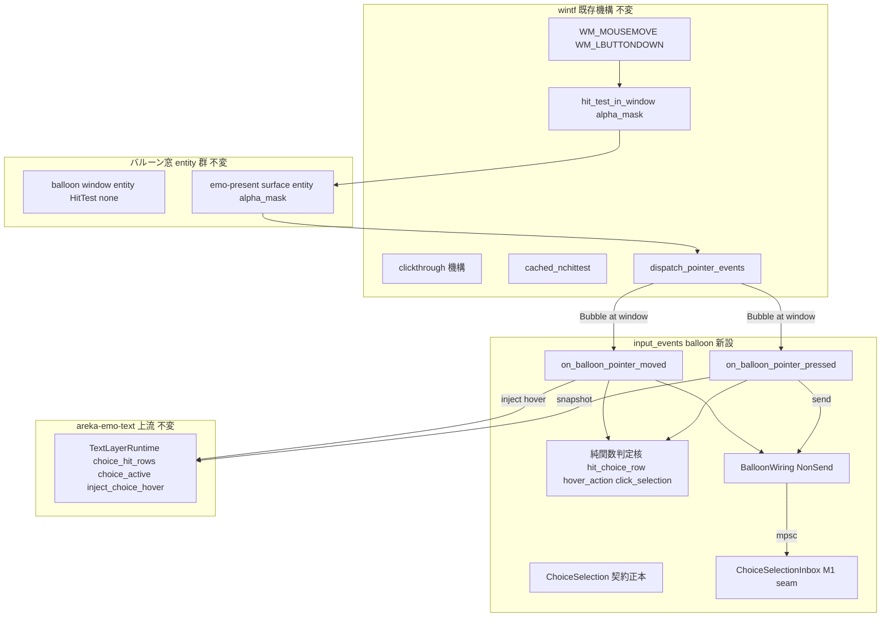
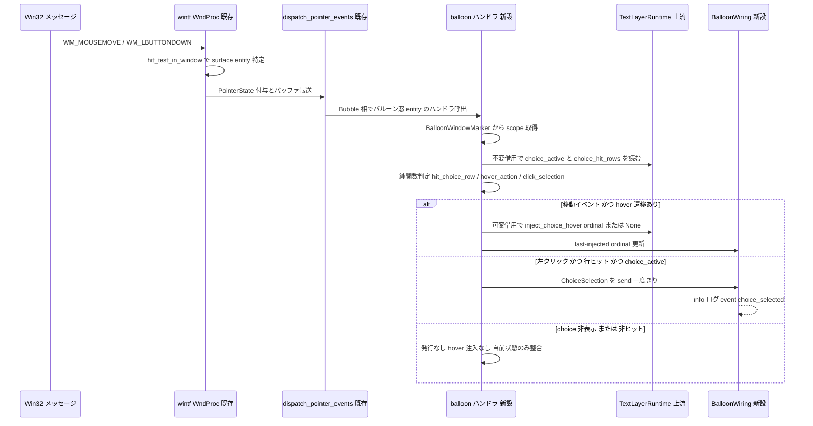

# Technical Design Document: areka-P0-choice-interact

## Overview

**Purpose**: 本機能は `\q` 選択肢の**対話面**をゴースト作者・エンドユーザーへ提供する。バルーン窓上の実ポインタ移動を上流 `areka-P0-choice-render`（W3 完了）が供給する選択肢行ヒットジオメトリへ写像して hover ハイライトを追従駆動し、選択肢行の確定クリックで `ChoiceSelection`（本仕様が契約正本）を一度だけ発行する。

**Users**: ゴースト作者・エンドユーザーはバルーン上のメニュー選択肢をポインタで選び（hover 追従）、クリックで確定する。下流 `areka-P0-choice-select-events`（W6）は `ChoiceSelection` を消費してカスケード発火を組み立てる。

**Impact**: 既存システムへの変更は additive 増分に徹する。バルーン窓は現在ポインタハンドラ非装着（DD-IE-12・意図的）だが、**設計調査（R-1）の結果、窓生成側（spawn.rs）・`HitTest`・クリックスルー機構への変更は一切不要**と確定した——バルーン窓は emo-present mount の surface entity（`HitTest::alpha_mask()`＋`AlphaMaskResource`）経由で既にポインタ到達性を持つ。本仕様は `input_events` サブモジュールにバルーン専用配線を増設し、post-spawn でハンドラを装着するのみである。

### Goals

- バルーン窓ポインタ移動 → 選択肢行 hit 判定 → 上流 `inject_choice_hover` 駆動による hover 追従（自前描画なし）。
- 確定クリック（左シングルクリック）→ `ChoiceSelection`（id／label／scope／references）の一度きり発行。
- talk 切替・choice 消滅後の stale クリック棄却（上流原子性への協調＋現行スナップショット参照）。
- 決定論檻（純関数 hit 判定全網羅＋配線存在チェックの二本立て・実窓/sleep 不要）＋実機サインオフ（実 emo2・実 DPI・絶対パス・有界 auto-exit＋ログ grep）。

### Non-Goals

- 選択肢の描画・レイアウト・ハイライト**描画**（`areka-P0-choice-render` 所有・完了済み）。
- SHIORI カスケード（`OnChoiceSelectEx`→`OnChoiceSelect`→任意名直接発火）・`Status: choosing`・timeout（`areka-P0-choice-select-events` W6）。
- `ChoiceSelection` の受信・配送処理、`CuePlayer::resolve_choice` の直接呼出（配送は kanade 経由の正規下流経路のみ）。
- キャラ窓側ポインタ配線の変更（`areka-P0-input-events` W2 の成果は消費のみ）。
- ホイール・キーボードによる選択肢操作（M2）、`\_a` アンカー等の選択肢以外のバルーン内リンク（emo2 未使用）。
- バルーン窓のライフサイクル・ドラッグ挙動の新設・改変（既存 `DragConfig`／`OnDrag` を消費のみ）。

## Boundary Commitments

### This Spec Owns

- **`ChoiceSelection` のワイヤ形（契約正本）**: 選択 id・表示ラベル・発生元 scope・references を保持する構造体定義と、その一度きり発行セマンティクス。
- **バルーンポインタ対話配線**: `crates/areka/src/input_events/balloon.rs`（新設サブモジュール）——`BalloonWiring`（NonSend）・純関数判定核・`on_balloon_pointer_moved`／`on_balloon_pointer_pressed` ハンドラ・`attach_balloon_pointer_handlers`。
- **点包含 hit 判定の決定規則**: 行矩形への半開区間包含＋重なり時の最終一致（画家のアルゴリズム整合）。
- **stale クリック棄却の判断分岐**: クリック時の現行ジオメトリ再読・choice 非表示時の非発行・自前 hover 状態の消滅追随。
- **M1 発行シーム**: `ChoiceSelectionInbox`（Receiver 保持の NonSend・W6 が受信処理へ置換する暫定受け口）。
- **実機サインオフ導線**: `event = "choice_selected"` info ログと有界 auto-exit＋grep 手順。

### Out of Boundary

- 行ヒットジオメトリ（`ChoiceHitRow`／`HitRectPx`）・hover 状態 API（`inject_choice_hover`）・選択肢表示中照会（`choice_active`）・ハイライト描画・選択肢消滅の原子的無効化——すべて上流 `areka-emo-text`（`areka-P0-choice-render` 正本）の所有。本仕様は**消費のみ**。
- `spawn.rs`（窓生成・`BalloonWindowMarker`・`DragConfig`・`HitTest::none()`）——**本設計は改変不要と確定**（R-1 解決）。同時進行の `areka-P0-position-persist` との衝突は発生しない。
- wintf のポインタ配信機構（`dispatch_pointer_events`・`OnPointerMoved`／`OnPointerPressed`・clickthrough 機構・αマスク hit test）——消費のみ。
- `SakuraMsg::ResolveChoice`・`CuePlayer::resolve_choice`・`KanadeMsg` への選択解決 variant 追加——下流 `choice-select-events` の契約辺。
- `ChoiceSelection` の最終配送先（受信アクター／inbox 型）と受信処理——下流の契約辺。本仕様は発行までを担い、M1 の `ChoiceSelectionInbox` は seam に過ぎない。
- 環境変数 hover 注入導線 `emo2_boot/hover_inject.rs`——不変のまま**共存**（デバッグ用・既定 no-op）。

### Allowed Dependencies

- `areka-emo-text`: `TextLayerRuntime`（`choice_hit_rows`／`inject_choice_hover`／`choice_active`）・`ChoiceHitRow`・`HitRectPx`・`ActorKey`——読み取り＋hover 注入のみ。
- `wintf`: `OnPointerMoved`／`OnPointerPressed`・`Phase<PointerState>`・`PointerState`・`PointerLeave`（マーカー読み取り）——ハンドラ装着と受信・マーカー消費のみ。
- `crate::placement::spawn`: `BalloonWindowMarker`（scope 読み取り）——読み取りのみ。
- `crate::emo2_boot::Emo2Wiring`: `runtime()` アクセサ（本仕様が additive 追加）経由の `Rc<RefCell<TextLayerRuntime>>` 取得のみ。
- `std::sync::mpsc`——新規外部依存なし（8.2）。tokio 不使用（8.3）。
- **依存方向**: `input_events::balloon` → { `wintf`, `areka-emo-text`, `placement`, `emo2_boot`(accessor) }。逆方向依存（上流が balloon.rs を知る）は禁止。

### Revalidation Triggers

- `ChoiceSelection` のワイヤ形（フィールド・型）変更——下流 `choice-select-events` の再検証必須。
- 上流契約変更: `ChoiceHitRow`／`HitRectPx` の座標系（バルーン窓 client 物理 px）・`choice_hit_rows` の出力順（ordinal 昇順×行昇順）・`inject_choice_hover` のセマンティクス変更。
- scope→`ActorKey` 写像（`ActorKey::from(scope.to_string())`）の変更。
- バルーン mount の窓内 offset が (0,0) でなくなる変更（emo-present `physical_arrangement`）——座標原点一致の前提が崩れる。
- バルーン窓のポインタ到達契約の変更: emo-present mount の `HitTest::alpha_mask()`／`AlphaMaskResource` 供給、clickthrough 機構の判定規則、バルーン面 0（枠ビットマップ）の不透明性。
- `Emo2Wiring::runtime()` アクセサの削除・シグネチャ変更。
- W6 による `ChoiceSelectionInbox` の置換（M1 seam の解消）。

## Architecture

### Existing Architecture Analysis

設計調査（research.md 設計フェーズ追記・R-1〜R-4）で確定した既存アーキテクチャの事実:

1. **バルーン窓は既にポインタ到達性を持つ（R-1 解決・本設計の要）**。`spawn.rs:174` の `HitTest::none()` は**窓 entity 自身**をヒット対象から外すだけであり、ポインタ配信は次の 4 段で成立している:
   - **OS 段（クリックスルー）**: 全 `GhostWindowMarker` 窓（バルーン含む）は `register_ghost_windows_click_through` で wintf clickthrough 機構へ登録済み。機構はカーソル移動ごとに `hit_test_in_window` を評価し、ヒットあり→`WS_EX_TRANSPARENT` OFF（自窓受領）、ヒットなし→ON（背面プロセスへ透過）。
   - **αマスクヒット**: バルーン窓には emo-present `attach_target`（`frame.rs:432`）で mount が生成され、その **surface entity**（窓の子・offset (0,0)・`mount.rs:144`）が `HitTest::alpha_mask()`＋`AlphaMaskResource`（presenter `apply` ごとに更新）を持つ。バルーン枠ビットマップ（面 0）は本体不透明ゆえ、選択肢行の位置でヒットが成立する。
   - **WM_NCHITTEST**: `cached_nchittest` が同じ `hit_test_in_window` で HTCLIENT／HTTRANSPARENT を返す。不透明位置は HTCLIENT → マウスメッセージが届く。
   - **WM_MOUSEMOVE／WM_LBUTTONDOWN**: ヒットした surface entity へ `PointerState` が付与され、`dispatch_pointer_events` が親チェーン（surface entity → バルーン窓 entity）を Tunnel→Bubble で巡回し、経路上の `OnPointerMoved`／`OnPointerPressed` を呼ぶ。**バルーン窓 entity にハンドラを装着すれば Bubble 相で受信できる**。
   - **WM_MOUSELEAVE**: `PointerState` は除去され `PointerLeave` マーカーが 1 フレーム付与される（FrameFinalize でクリア）。`dispatch_pointer_events` は `OnPointerExited`／`OnPointerEntered` を**配信しない**ため、窓外離脱の hover 解除はこのマーカーを読む薄いシステムで行う（後述 `clear_balloon_hover_on_leave`——高速離脱でエッジサンプルが飛んでも R1.3 の「行を包含しない位置」への追従を保証）。
   - 帰結: **`spawn.rs`・`HitTest`・クリックスルー機構・emo-text 描画面の改変はゼロ**。`areka-P0-position-persist` との衝突なし（rebase/merge 条項の発動不要）。
2. **座標原点は一致する（R-2 解決）**: `HitRectPx` はバルーン窓 client 物理 px（`choice.rs:260-289` `to_window_physical`・validrect 原点＝TextSurface 窓内装着 offset と同源）。mount の `Arrangement.offset = (0,0)` ゆえ、`PointerState.client_point`（窓 client 物理 px・`i32`）と同一原点。DPI 変換は挟まない（素通し k=1.0・DD-IE-10 整合）。
3. **クリックの表現（R-4 解決）**: 単一左クリックは `PointerState.left_down`（1 dispatch のみ有効・dispatch 後クリア＝エッジ検出）。`OnPointerPressed` は left/right/middle いずれかの down で発火するためハンドラ側で `left_down` を選別する。`double_click` フィールドは WM_LBUTTONDBLCLK 由来の別表現（ダブルクリック 2 打目も `left_down=true` を伴う）。
4. **donor パターン**: `input_events/mod.rs` の `MouseWiring`（NonSend）・`attach_char_pointer_handlers`（post-spawn 装着）・Bubble 相のみ処理・借用分割（共有借用で解決→owned 取出→後で `&mut`）・合成 `PointerState` によるハンドラ直接呼びテスト。`emo2_boot/hover_inject.rs` の借用規律（不変スナップショット→純関数→可変 `inject_choice_hover`）。
5. **上流原子性**: `apply_cue` の `Clear`/`ClearAll` は選択肢消去と同時に `choice_hover`／`choice_snapshot` を無効化。`choice_active` は即 false、`choice_hit_rows` は空へ。本仕様は毎イベントで現行値を再読すれば stale を作らない。

### Architecture Pattern & Boundary Map



**Architecture Integration**:
- **Selected pattern**: donor 鏡写し（`MouseWiring` 同型の NonSend 配線＋post-spawn ハンドラ装着）× 純関数中核（判断分岐を runtime 借用の外へ括り出し）。research.md §4 の裁定: **A-2（サブモジュール隔離）× B-2（NonSend `BalloonWiring`）× C-1（mpsc `Sender<ChoiceSelection>`）**。
- **Domain boundaries**: キャラ窓配線（kanade 送出・`MouseWiring`）とバルーン配線（runtime 直読・hover 駆動＋発行）は参照資源・下流が異なるため別サブモジュールに隔離。DD-IE-10（物理 px 素通し）は両者共通規約として遵守。
- **Existing patterns preserved**: Bubble 相のみ処理・Tunnel は false、post-spawn 装着（spawn.rs 不改変・依存方向 input_events→placement）、NonSend 資源、log-first。
- **New components rationale**: `BalloonWiring` は hover getter 不在の穴埋め（last-injected ordinal 自前追跡）と発行シンクの集約に必要。純関数核は R6.5（GPU 不要・全網羅）の必須構造。
- **Steering compliance**: Rust 2024・新規外部依存なし・tokio 不使用・UI スレッド親和（NonSend 資源はハンドラ＝Input スケジュールの排他システム内でのみ触る）・thiserror 構造化エラー不要（失敗経路は log-first 縮退のみ）。

### Technology Stack

| Layer | Choice / Version | Role in Feature | Notes |
|-------|------------------|-----------------|-------|
| 入力配信 | wintf `ecs/pointer`（既存） | `OnPointerMoved`／`OnPointerPressed`・`Phase<PointerState>` | 消費のみ・変更なし |
| 幾何契約 | `areka-emo-text`（既存） | `ChoiceHitRow`／`HitRectPx`／hover API | 消費のみ・変更なし |
| 発行チャネル | `std::sync::mpsc` | `Sender<ChoiceSelection>`（donor `Sender<KanadeMsg>` 同型） | 新規依存なし |
| ロギング | `tracing`（既存） | `event = "choice_selected"` 等の構造化ログ | 既存規約（`event` フィールド） |

## File Structure Plan

### Directory Structure

```
crates/areka/src/
├── input_events/
│   ├── mod.rs          # MOD: `mod balloon;` 宣言＋pub(crate) re-export のみ追加
│   │                   #      （DD-IE-10 規約本文・キャラ窓配線・既存テストは不変）
│   └── balloon.rs      # NEW: 本仕様の対話面一式（単一責務＝バルーン選択肢対話配線）
│                       #      - ChoiceSelection（契約正本）／ChoiceSelectionInbox（M1 seam）
│                       #      - BalloonWiring（NonSend）
│                       #      - 純関数判定核: hit_choice_row／hover_action（HoverAction）／click_selection
│                       #      - on_balloon_pointer_moved／on_balloon_pointer_pressed
│                       #      - clear_balloon_hover_on_leave（PointerLeave 追随の排他システム）
│                       #      - attach_balloon_pointer_handlers／wire_balloon_choice
│                       #      - in-source #[cfg(test)]（純関数全網羅＋配線存在檻＋mpsc 観測）
├── emo2_boot/
│   └── frame.rs        # MOD: `Emo2Wiring::runtime()` アクセサ 1 本を additive 追加
│                       #      （既存 `presenter()` アクセサと同型・挙動変更なし）
└── main.rs             # MOD: 結線 2 行——wire_balloon_choice(world)（チャネル生成＋NonSend 挿入）
                        #      ＋ attach_balloon_pointer_handlers(world)
                        #      （既存 :585 の attach_char_pointer_handlers 直後）
```

### Modified Files

- `crates/areka/src/input_events/mod.rs` — `mod balloon;` とシンボル re-export の追加のみ。既存 950 行の本文（`MouseWiring`・DD-IE-10・キャラ窓ハンドラ・テスト）には触れない。
- `crates/areka/src/emo2_boot/frame.rs` — `impl Emo2Wiring` に `pub(crate) fn runtime(&self) -> &Rc<RefCell<TextLayerRuntime>>` を追加（`resolve_region_owned` が使う既存 `presenter()` アクセサの鏡写し）。他は不変。
- `crates/areka/src/main.rs` — emo2 boot 結線部（`attach_char_pointer_handlers` 呼出の隣）へバルーン配線の wire＋attach を追加し、`clear_balloon_hover_on_leave` を Input スケジュール（`dispatch_pointer_events` の後）へ登録（clickthrough 登録 system を FrameFinalize へ結線した main.rs:562 の donor slot と同型）。
- **不改変を明記**: `crates/areka/src/placement/spawn.rs`（position-persist 単独所有・R-1 解決により改変不要）・`crates/areka/src/emo2_boot/hover_inject.rs`（共存・不変）・`crates/areka-emo-text/**`（上流・消費のみ）・`crates/wintf/**`（機構・消費のみ）。

## System Flows

### ポインタ移動 → hover 追従（R1）／クリック → 発行（R2/R3）



**フロー上の決定**:
- ゲーティング順序: (1) Bubble 相以外は即 `false`、(2) `Emo2Wiring`／`BalloonWiring` 不在は log 付き no-op 縮退、(3) `choice_active` 偽なら hit 判定・注入・発行を行わない（R1.4／R3.1）、(4) hit 判定は**毎イベント現行** `choice_hit_rows` に対して行う（R2.5／R3.2／R3.3）。
- 借用順序（固定）: `Emo2Wiring` 共有借用→ `Rc<RefCell<TextLayerRuntime>>` clone（owned）→ world 借用解放 → runtime 不変借用でスナップショット判定 → 借用解放 → runtime 可変借用で inject → `BalloonWiring` 可変借用で状態更新・send。`RefCell` は `try_borrow`／`try_borrow_mut` を用い、失敗時は `error!` ログ＋no-op（panic しない・log-first）。

## Requirements Traceability

| Requirement | Summary | Components | Interfaces | Flows |
|-------------|---------|------------|------------|-------|
| 1.1, 1.2, 1.3 | ポインタ→行 hit→hover 注入／None 注入 | 純関数判定核・on_balloon_pointer_moved | `hit_choice_row`・`hover_action`・`inject_choice_hover`(消費) | 移動フロー |
| 1.3 | 窓外離脱時の hover 解除（高速離脱含む） | clear_balloon_hover_on_leave | `PointerLeave` マーカー（消費）→ `inject_choice_hover(None)` | leave 追随 |
| 1.4 | choice 非表示中は hover 追従なし | on_balloon_pointer_moved | `choice_active`(消費)・`HoverAction::NoopInactive` | ゲーティング(3) |
| 1.5 | 重なり時も決定的に高々 1 行 | 純関数判定核 | `hit_choice_row`（逆順走査・最終一致） | — |
| 1.6 | 自前描画なし | on_balloon_pointer_moved | `inject_choice_hover` のみ（描画 API 不使用） | — |
| 2.1, 2.4 | 確定クリックで一度だけ発行 | on_balloon_pointer_pressed・BalloonWiring | `click_selection`・`Sender<ChoiceSelection>`・dispatch のエッジ検出 | クリックフロー |
| 2.2 | ワイヤ形（id/label/scope/references）正本 | ChoiceSelection | `ChoiceSelection` struct | — |
| 2.3 | 非ヒット位置クリックは非発行 | 純関数判定核 | `click_selection` → `None` | — |
| 2.5 | クリック時は現行ジオメトリ参照 | on_balloon_pointer_pressed | 毎イベント `choice_hit_rows` 再読 | ゲーティング(4) |
| 2.6 | 発行まで・resolve_choice 非呼出 | 全コンポーネント | 依存方向制約（dola/sakura へ辺なし） | — |
| 3.1 | 消滅後クリック非発行 | on_balloon_pointer_pressed | `choice_active` 偽 → `click_selection` 非実行 | ゲーティング(3) |
| 3.2 | 現行ジオメトリに無い行は stale 棄却 | 純関数判定核 | クリック時再 hit（キャッシュ非使用） | ゲーティング(4) |
| 3.3 | 新選択肢集合へ持ち越しなし | on_balloon_pointer_moved / pressed | 毎イベント現行 rows 再読 | ゲーティング(4) |
| 3.4 | 消滅時に自前 hover 状態を None 整合 | BalloonWiring・hover_action・clear_balloon_hover_on_leave | `HoverAction::ResetOwnState`（注入せず自前状態のみ）＋leave 追随 | 移動フロー |
| 4.1 | 上流契約の消費のみ・再定義なし | 全コンポーネント | Allowed Dependencies（読み＋注入のみ） | — |
| 4.2 | 物理 px 素通し（k=1.0） | 純関数判定核 | `client_point`(i32)→f32 直接比較・変換なし | — |
| 4.3 | キャラ窓配線の非退行 | attach_balloon_pointer_handlers | `BalloonWindowMarker` 窓のみ装着（檻で検証） | — |
| 4.4 | 窓マーカー・ドラッグ設定の消費のみ | 全コンポーネント | spawn.rs 不改変（R-1 解決・エスケープ条項不発動） | — |
| 5.1 | 左シングルクリック限定（M2 除外） | on_balloon_pointer_pressed | `left_down` 選別・wheel/keyboard 非実装 | — |
| 5.2 | `\_a` 等の非対話 | 全コンポーネント | choice 行のみ対象（`choice_hit_rows` 限定） | — |
| 5.3, 5.4 | カスケード等の下流委譲・resolve 非呼出 | ChoiceSelectionInbox（seam） | M1 は発行→Inbox 保持まで | — |
| 5.5 | input-events 成果の消費のみ | input_events/mod.rs | `mod balloon;` 追加のみ・本文不変 | — |
| 6.1, 6.2, 6.3 | 注入ポインタ列での観測 | 純関数判定核・テスト | 純関数戻り値＋mpsc `Receiver` 観測 | — |
| 6.4 | 実窓・sleep 不要の決定論 | テスト構造 | 合成 `ChoiceHitRow`／座標のみで成立 | — |
| 6.5 | 判断分岐の実行テスト全網羅 | 純関数判定核 | `hit_choice_row`／`hover_action`／`click_selection` 全分岐 | — |
| 6.6 | 配線存在チェック | attach_balloon_pointer_handlers テスト | bare World＋spawn＋attach→component assert | — |
| 7.1, 7.2 | 実機 hover 追従目視＋クリック到達ログ | 実機サインオフ導線 | 目視＋`event = "choice_selected"` grep | — |
| 7.3 | 本番ゴースト表示先行 | 実機サインオフ手順 | 実 emo2＋実 pasta.dll 起動 | — |
| 7.4 | 判定は発行到達まで | 実機サインオフ手順 | カスケード・遷移を判定に含めない | — |
| 7.5 | 絶対パス起動 | 実機サインオフ手順 | 既存定石（pasta.dll LoadLibrary） | — |
| 7.6 | 有界 auto-exit＋ログ grep | 実機サインオフ導線 | `AREKA_APP_SMOKE_EXIT_MS`＋`RUST_LOG` grep | — |
| 8.1 | workspace 全緑 | 全コンポーネント | additive 増分・既存テスト不変 | — |
| 8.2, 8.3 | 新規依存なし・Rust 2024・tokio なし | 技術スタック | std mpsc のみ | — |
| 8.4 | スレッド親和 | ハンドラ | Input スケジュール排他システム内で NonSend 借用 | — |
| 8.5 | 上流契約・cue ワイヤ形不変 | 全コンポーネント | 新 cue variant なし・emo-text 不改変 | — |
| 8.6 | DPI 素通し規約の非退行 | 純関数判定核・mod.rs | 座標変換ゼロ・DD-IE-10 本文不変 | — |

## Components and Interfaces

| Component | Domain/Layer | Intent | Req Coverage | Key Dependencies | Contracts |
|-----------|--------------|--------|--------------|------------------|-----------|
| ChoiceSelection | 契約型 | 選択確定のワイヤ形正本 | 2.2, 2.6 | なし（純データ） | Event |
| BalloonWiring / ChoiceSelectionInbox | NonSend 資源 | hover 自前追跡＋発行シンク／M1 受け口 seam | 2.1, 2.4, 3.4, 5.3 | mpsc (P0) | State |
| 純関数判定核 | 純粋層 | hit／hover 遷移／click 確定の判断分岐 | 1.1–1.5, 2.1, 2.3, 3.2, 6.1–6.5 | ChoiceHitRow (P0) | Service |
| balloon ハンドラ | 配線層 | Bubble 受信→snapshot→純関数→適用 | 1.1–1.6, 2.1, 2.5, 3.1–3.4, 4.2, 8.4 | Emo2Wiring (P0), BalloonWiring (P0) | Service |
| attach / wire | 結線層 | post-spawn ハンドラ装着＋資源挿入 | 4.3, 6.6 | placement (P0) | Service |
| Emo2Wiring::runtime() | アクセサ | runtime への読み口（additive） | 4.1 | frame.rs (P0) | Service |
| 実機サインオフ導線 | 運用 | ログ marker＋手順 | 7.1–7.6 | tracing (P1) | — |

### 契約型（input_events/balloon.rs）

#### ChoiceSelection

| Field | Detail |
|-------|--------|
| Intent | 選択確定 1 回分のワイヤ形（本仕様が契約正本・下流 W6 が消費） |
| Requirements | 2.2, 2.6 |

**Responsibilities & Constraints**
- 下流が表示層へ再照会せずに選択解決とカスケード発火を組み立てられる自己完結データ（構成材料は `ChoiceHitRow` に同梱済み）。
- `ordinal` はワイヤ形に**含めない**——解決キーは `id`（`SakuraMsg::ResolveChoice { id }` と整合）であり、ordinal は表示層内部の主キーに留める（漏洩防止）。

##### Service Interface

```rust
/// 選択確定のワイヤ形（本 spec 契約正本・2.2）。
#[derive(Clone, Debug, PartialEq, Eq)]
pub(crate) struct ChoiceSelection {
    /// `\q` ID（選択解決の主キー・不透明転写）。
    pub id: String,
    /// 表示ラベル（不透明転写）。
    pub label: String,
    /// 発生元 scope（`BalloonWindowMarker.scope` 由来）。
    pub scope: usize,
    /// `\q` 第 3 引数以降（参照列・不透明転写）。
    pub references: Vec<String>,
}
```

- Preconditions: クリック時点で `choice_active(actor) == true` かつ現行 `choice_hit_rows` にヒット行が存在。
- Postconditions: 同一クリックから高々 1 個生成（dispatch のエッジ検出＋単一 send）。
- Invariants: フィールドはヒット行からの clone 転写のみ（加工・解決をしない）。

### NonSend 資源（input_events/balloon.rs）

#### BalloonWiring / ChoiceSelectionInbox

| Field | Detail |
|-------|--------|
| Intent | hover getter 不在の穴埋め（last-injected ordinal 自前追跡）＋発行シンク集約／M1 の暫定受け口 |
| Requirements | 2.1, 2.4, 3.4, 5.3 |

**Responsibilities & Constraints**
- `MouseWiring` と同型の NonSend パターン（UI スレッド所有・Input スケジュール排他システム内でのみ借用）。
- `hover` は「本仕様が最後に注入した値」の記録であり、表示状態の正本ではない（正本は上流）。用途は (a) 遷移検出（同値再注入の抑制）、(b) 消滅時の自前状態整合（R3.4）のみ。

**Dependencies**
- Outbound: `std::sync::mpsc::Sender<ChoiceSelection>` — 発行シンク (P0)。
- Inbound: balloon ハンドラのみが借用 (P0)。

##### State Management

```rust
/// バルーン選択肢対話の配線資源（NonSend・donor `MouseWiring` 同型）。
pub(crate) struct BalloonWiring {
    /// `ChoiceSelection` 発行シンク（C-1・mpsc）。
    selection_tx: Sender<ChoiceSelection>,
    /// scope → 最後に注入した hover ordinal（getter 不在の自前追跡・B-2）。
    hover: HashMap<usize, Option<usize>>,
}

/// M1 の暫定受け口（W6 `choice-select-events` が受信処理へ置換する seam・5.3）。
/// Receiver 生存により send は Err にならず、発行の mpsc 観測と実機ログが成立する。
pub(crate) struct ChoiceSelectionInbox(pub(crate) Receiver<ChoiceSelection>);
```

- State model: `hover` は選択肢消滅（`choice_active` 偽観測）で `None` へ整合（注入はしない——上流原子性が正本・R3.4）。新 talk の選択肢へは持ち越さない（毎イベント現行 rows 再読・R3.3）。
- Concurrency: NonSend（`!Send` 資源と同居する UI スレッド固定）。チャネルは std mpsc（受信は M1 未消費・W6 の領分）。

### 純粋層（input_events/balloon.rs）

#### 純関数判定核（hit_choice_row / hover_action / click_selection）

| Field | Detail |
|-------|--------|
| Intent | 対話面の全判断分岐を runtime 借用・World 非依存の純関数へ集約（檻の対象） |
| Requirements | 1.1, 1.2, 1.3, 1.4, 1.5, 2.1, 2.3, 3.2, 6.1, 6.2, 6.3, 6.5 |

**Responsibilities & Constraints**
- GPU・実窓・sleep・World 一切不要。入力（座標・rows スナップショット・active・last）→出力（決定）のみの決定的関数（R6.4／R6.5）。
- 座標は物理 px 素通し: `client_point`（i32）を `as f32` して `HitRectPx`（f32）と直接比較。DPI 変換・スケール係数を一切挟まない（R4.2・DD-IE-10 整合）。

##### Service Interface

```rust
/// 点包含 hit 判定（純関数・R1.1/1.5/2.3）。
/// 包含は半開区間 `[left, right) × [top, bottom)`（whole-pixel 行矩形と整合）。
/// 重なり時は**逆順走査の最初の一致＝スライス最終一致**を返す（`choice_hit_rows` は
/// ordinal 昇順×行昇順ゆえ「後定義が手前」＝画家のアルゴリズムと整合・DD-CI-5）。
/// 戻り値はスライス index（呼び手が `rows[i].ordinal` 等へ展開する）。
pub(crate) fn hit_choice_row(rows: &[ChoiceHitRow], x: f32, y: f32) -> Option<usize>;

/// hover 遷移の決定（純関数・R1.2/1.3/1.4/3.4）。
#[derive(Clone, Copy, Debug, PartialEq, Eq)]
pub(crate) enum HoverAction {
    /// choice 非表示かつ自前状態も None——何もしない（R1.4）。
    NoopInactive,
    /// choice 非表示だが自前状態が残っている——自前状態のみ None へ整合
    /// （inject はしない・上流原子性が正本・R3.4）。
    ResetOwnState,
    /// 表示中・hover 対象が前回注入値と同一——再注入しない（遷移なし）。
    Keep,
    /// 表示中・hover 対象が変化——`inject_choice_hover(actor, value)` を行う
    /// （`Some(ordinal)`＝行ハイライト・`None`＝ハイライト無し・R1.2/1.3）。
    Inject(Option<usize>),
}

pub(crate) fn hover_action(
    active: bool,
    hit_ordinal: Option<usize>,   // hit_choice_row の結果を ordinal へ展開した値
    last_injected: Option<usize>, // BalloonWiring.hover[scope]
) -> HoverAction;

/// クリック確定の決定（純関数・R2.1/2.3/3.1/3.2）。
/// `active == false` または非ヒットなら `None`（stale／非 hit 棄却）。
/// ヒット時は**現行** rows のヒット行から `ChoiceSelection` を clone 構成する。
pub(crate) fn click_selection(
    active: bool,
    rows: &[ChoiceHitRow],
    x: f32,
    y: f32,
    scope: usize,
) -> Option<ChoiceSelection>;
```

- Invariants: `hit_choice_row` は同一入力に対し常に同一出力（決定性）。病的重なり入力でも高々 1 行（R1.5）。

### 配線層（input_events/balloon.rs）

#### balloon ハンドラ（on_balloon_pointer_moved / on_balloon_pointer_pressed）

| Field | Detail |
|-------|--------|
| Intent | wintf dispatch の Bubble 相で受信し、snapshot→純関数→適用の薄い結線を行う |
| Requirements | 1.1–1.6, 2.1, 2.4, 2.5, 3.1–3.4, 4.1, 4.2, 8.4 |

**Responsibilities & Constraints**
- ハンドラ署名は wintf `PointerEventHandler`: `fn(&mut World, sender: Entity, entity: Entity, &Phase<PointerState>) -> bool`。**Bubble 相のみ処理・Tunnel は `false`**（donor 同型）。
- scope は `world.get::<BalloonWindowMarker>(entity)` から読む（donor `char_scope` の鏡写し）。actor は `ActorKey::from(scope.to_string())`（既存写像の消費・R-3）。
- **借用規律（固定順序）**: ① `Emo2Wiring` 共有借用→`runtime()` アクセサで `Rc` clone→world 側借用解放、② `BalloonWiring` から `last_injected` を copy、③ runtime `try_borrow`（不変）でスナップショット（`choice_active`＋rows 参照のまま純関数評価・move はここで完結）、④ 借用解放後に runtime `try_borrow_mut` で `inject_choice_hover`、⑤ `BalloonWiring` 可変借用で `hover` 更新・`selection_tx.send`。`RefCell` 借用失敗は `error!` ログ＋no-op（panic しない）。
- **クリック確定＝Bubble 相かつ `state.left_down`**。`double_click` フィールドは不参照（DBLCLK 2 打目も独立 press として扱う・DD-CI-9）。右・中ボタン down は `false` で素通し。単一クリック二重発行は wintf dispatch のエッジ検出（dispatch 後 `left_down` クリア）が構造的に防止し、ハンドラは 1 dispatch＝高々 1 send を守る（R2.4）。
- 戻り値: moved は常に `false`（非侵襲・伝播継続）。pressed は `ChoiceSelection` を発行したときのみ `true`（棄却時は `false`）。
- スレッド親和: ハンドラは `dispatch_pointer_events`（Input スケジュール・排他システム・UI スレッド）内でのみ実行され、NonSend／`Rc<RefCell>` 借用は同スレッドで閉じる（R8.4）。

**Dependencies**
- Inbound: `dispatch_pointer_events`（wintf・P0）。
- Outbound: `Emo2Wiring::runtime()`（P0）・`BalloonWiring`（P0）・純関数判定核（P0）。

**Implementation Notes**
- Integration: `Emo2Wiring` 不在（emo2 boot 前／失敗）は `debug!` ログ＋no-op 縮退（donor の presenter=None 縮退と同型）。`BalloonWiring` 不在も同様（結線漏れは配線存在檻が検出）。
- Validation: ハンドラ自体は「薄い結線」であり、判断分岐は純関数核に集約済み（檻に入れるのは判断分岐のみ・配線は再テストしない）。Tunnel 素通し・資源不在縮退のみハンドラ直接呼びで檻に入れる。
- Risks: バルーン窓には `DragConfig` が既存で付くため、行クリック押下はドラッグ Preparing も開始する（押下→閾値超え移動でバルーンドラッグ）。確定は press 時点で発行済みのため対話面の正しさに影響しない（既存挙動の非改変・R4.4）。`AREKA_CHOICE_HOVER_INJECT` 有効時は env 巡回と実ポインタが hover を交互に書くが、デバッグ限定の共存として許容（DD-CI-7・本番既定 no-op）。

#### clear_balloon_hover_on_leave

| Field | Detail |
|-------|--------|
| Intent | 窓外離脱（WM_MOUSELEAVE）時の hover 解除——高速離脱でも「行を包含しない位置」への追従を保証 |
| Requirements | 1.3, 3.4 |

**Responsibilities & Constraints**
- 排他システム `fn clear_balloon_hover_on_leave(world: &mut World)`。Input スケジュールの `dispatch_pointer_events` 後・FrameFinalize（`PointerLeave` クリア）前に実行。
- `PointerLeave` マーカー保持 entity のうち、所有窓（wintf `find_owner_window` 相当の親チェーン）が `BalloonWindowMarker` を持つものだけを対象に scope を解決。
- 判断は既存純関数を再利用: `hover_action(active, None, last_injected)`——`Inject(None)` なら `inject_choice_hover(actor, None)`＋自前状態 None、`ResetOwnState` なら自前状態のみ None（借用規律・縮退はハンドラと同一）。
- `PointerLeave` の除去は行わない（除去は既存 FrameFinalize `clear_transient_pointer_state` の責務——機構不変）。

**Implementation Notes**
- Integration: main.rs で Input スケジュールへ登録（clickthrough 登録 system の donor slot と同型）。
- Validation: 判断分岐は `hover_action` の檻で網羅済み。leave 対象選別（balloon 所有チェック）は bare World テストで檻に入れる。
- Risks: なし（既存マーカー機構の消費のみ・マーカー不在フレームでは完全 no-op）。

#### attach_balloon_pointer_handlers / wire_balloon_choice

| Field | Detail |
|-------|--------|
| Intent | post-spawn でバルーン窓へハンドラ装着／NonSend 資源とチャネルの結線 |
| Requirements | 4.3, 4.4, 5.5, 6.6 |

##### Service Interface

```rust
/// `BalloonWindowMarker` 全窓へ `OnPointerMoved`＋`OnPointerPressed` を post-spawn 挿入
/// （donor `attach_char_pointer_handlers` :232 の鏡写し・spawn.rs 不改変・DD-IE-12 の解消）。
pub(crate) fn attach_balloon_pointer_handlers(world: &mut World);

/// mpsc チャネルを生成し `BalloonWiring`＋`ChoiceSelectionInbox` を NonSend 挿入する
/// （donor `wire_mouse_input` 同型・main.rs から 1 回呼ばれる）。
pub(crate) fn wire_balloon_choice(world: &mut World);
```

- Preconditions: `spawn_ghost_windows` 完了後（`BalloonWindowMarker` 窓が存在）。
- Postconditions: 全バルーン窓にハンドラ 2 種が存在。キャラ窓・その他 entity は不変（R4.3）。

**Implementation Notes**
- Integration: `main.rs` の emo2 boot 結線部（`attach_char_pointer_handlers` 呼出直後）に `wire_balloon_choice`＋`attach_balloon_pointer_handlers` を追加。
- Validation: 配線存在檻（R6.6）——bare `World`＋`spawn_ghost_windows`＋attach→バルーン窓に `OnPointerMoved`／`OnPointerPressed` が存在、キャラ窓のハンドラ集合が不変であることを assert（spawn.rs:554 の donor テストと同型）。

### アクセサ（emo2_boot/frame.rs）

#### Emo2Wiring::runtime()

| Field | Detail |
|-------|--------|
| Intent | balloon ハンドラへ `TextLayerRuntime` の読み口を提供（additive・挙動不変） |
| Requirements | 4.1 |

```rust
impl Emo2Wiring {
    /// 文字層 runtime への共有ハンドル（choice-interact のバルーン対話配線が消費・
    /// 既存 `presenter()` アクセサと同型の additive 読み口）。
    pub(crate) fn runtime(&self) -> &Rc<RefCell<TextLayerRuntime>> { &self.runtime }
}
```

- 上流クレート（`areka-emo-text`）には一切手を入れない（R8.5）。`Emo2Wiring` は areka 自身の結線構造体であり、アクセサ追加は挙動変更を伴わない。

### 運用（実機サインオフ導線）

| Field | Detail |
|-------|--------|
| Intent | R7 の無条件 DoD——実機でポインタ→ハイライト追従→クリック確定到達を決定論的に判定可能にする |
| Requirements | 7.1, 7.2, 7.3, 7.4, 7.5, 7.6 |

**決定事項（DD-CI-7）**:
- ログ marker（既存 `event = "..."` 規約）:
  - `info!(event = "choice_selected", scope, id = %.., label = %.., references_len, "選択確定: ChoiceSelection を発行")` — 発行 1 回につき 1 行（R7.2 の grep 対象）。
  - `debug!(event = "choice_hover_inject", scope, ordinal = ?..)` — hover 遷移注入時（トラブルシュート用・grep 必須対象ではない）。
  - 棄却系は `debug!`（`choice_click_rejected` 系・正常挙動であり失敗経路ではない）。
- 手順（既存定石の適用）: 実 emo2＋実 pasta.dll＋実 DPI（≠96）を**絶対パス**で起動（R7.5）→ 本番ゴースト表示先行（R7.3）→ ダブルクリック→メニュー表示 → (a) ポインタで行ハイライト追従を**目視**（R7.1）、(b) 行クリック → `AREKA_APP_SMOKE_EXIT_MS` 有界 auto-exit 後に `RUST_LOG=info` ログを `choice_selected` で grep（R7.2／R7.6）。カスケード・遷移は判定に含めない（R7.4）。
- env 巡回導線 `hover_inject.rs` は**共存**（不変・既定 no-op・デバッグ用）。実ポインタ経路が本番。

## Data Models

### Domain Model

- **集約**: `ChoiceSelection` は単一イベント値（集約なし・不変・発行後に変更されない）。
- **不変条件**: 発行時点の現行 `ChoiceHitRow` からの転写のみ（R2.5）。`scope` は発生源バルーン窓の `BalloonWindowMarker.scope`。
- **`BalloonWiring.hover`**: scope キーの last-injected 記録。表示正本ではない（上流 `choice_hover` が正本）。消滅時 None 整合・talk 跨ぎ持ち越しなし。

### Data Contracts & Integration

- **`ChoiceSelection` ワイヤ形（本仕様正本）**: 上記 struct 定義が唯一の契約。シリアライズ不要（プロセス内 mpsc）。下流 W6 は `ChoiceSelectionInbox` を受信処理へ置換する際、この型を import して消費する（型の再定義禁止）。
- **上流契約（消費のみ）**: `choice_hit_rows(&ActorKey) -> &[ChoiceHitRow]`（現行スナップショット）・`inject_choice_hover(&ActorKey, Option<usize>)`（書込専用・stale ordinal は上流が debug ログ縮退）・`choice_active(&ActorKey) -> bool`。
- **座標契約**: `HitRectPx`＝バルーン窓 client 物理 px、`PointerState.client_point`＝同窓 client 物理 px（i32）。原点一致（mount offset (0,0)・R-2 実測確認済み）。変換なし（k=1.0）。

## Error Handling

### Error Strategy

対話面の「失敗」は縮退（no-op）であって例外ではない。全縮退経路に log を置き（ログ無し失敗経路の禁止）、panic は用いない。正常棄却（非 hit・非表示中クリック）は失敗ではなく `debug!` に留める。

### Error Categories and Responses

| 事象 | 分類 | 応答 |
|------|------|------|
| `Emo2Wiring` 不在（boot 前／boot 失敗） | 正常縮退 | `debug!` ＋ no-op・`false` 返却（donor presenter=None 同型） |
| `BalloonWiring` 不在（結線漏れ） | 構成異常 | `error!(event = "balloon_wiring_missing")` ＋ no-op（配線存在檻が開発時に検出） |
| runtime `RefCell` 借用失敗 | 構成異常（理論上不到達） | `error!(event = "balloon_runtime_borrow_failed")` ＋ no-op（panic しない） |
| `selection_tx.send` 失敗（Receiver 消失） | 構成異常 | `error!(event = "choice_selection_send_failed", scope, id)`（donor `mouse_send_failed` 同型） |
| choice 非表示中のクリック／非 hit クリック | 正常棄却 | `debug!(event = "choice_click_rejected", reason)` ・非発行（R3.1／2.3） |
| `BalloonWindowMarker` 不在（想定外 entity へ装着） | 構成異常 | `error!` ＋ `false`（attach が marker 窓のみへ装着するため通常不到達） |

### Monitoring

`tracing` 構造化ログのみ（新規監視基盤なし）。実機サインオフの判定材料は `event = "choice_selected"` info 行（R7.2／R7.6）。

## Testing Strategy

方針: **檻に入れるのは判断分岐のみ・配線は再テストしない**。純関数核の全網羅＋配線存在チェックの二本立て（R6.5／R6.6）＋ハンドラ縮退経路のみ直接呼び。すべて実窓・GPU・sleep 不要（R6.4）。テストは `balloon.rs` in-source `#[cfg(test)]`。

### Unit Tests（純関数核・R6.1/6.2/6.3/6.5）

1. `hit_choice_row`: 包含／境界（half-open——right/bottom 辺は非包含・left/top 辺は包含）／行外／空 rows／複数行のうち正しい行／**病的重なりで最終一致（高々 1 行・決定性）**（1.1, 1.5, 2.3）。
2. `hover_action`: 全分岐——(active, hit, last) の組合せで `NoopInactive`／`ResetOwnState`／`Keep`／`Inject(Some)`／`Inject(None)`（1.2, 1.3, 1.4, 3.4）。
3. `click_selection`: 行 hit → `ChoiceSelection`（id/label/scope/references の転写一致）／非 hit → `None`／`active=false` → `None`（stale 棄却）／新 rows に旧行が無い座標 → `None`（2.1, 2.2, 2.3, 3.1, 3.2, 6.2, 6.3）。
4. 座標素通し: i32 client 座標→f32 比較が変換なしで `HitRectPx` と一致判定されること（DPI 係数を掛けると falsify される fixture・4.2, 8.6）。

### Integration Tests（配線・R6.6／R4.3／R2.4）

1. **配線存在檻**: bare `World`＋`spawn_ghost_windows`＋`attach_balloon_pointer_handlers` → 全バルーン窓に `OnPointerMoved`／`OnPointerPressed` が存在。キャラ窓・他 entity のハンドラ集合は不変（4.3, 6.6）。
2. **mpsc 観測**: `wire_balloon_choice` 後、発行適用ステップへ合成 `ChoiceSelection` を通し `ChoiceSelectionInbox.0.try_recv()` で一度きり観測（受信 2 回目は Empty）（2.4, 6.2）。
3. **ハンドラ縮退**: `Emo2Wiring` 不在 World で合成 `Phase<PointerState>` を直接呼び → `false`・panic なし・send なし（8.1 非退行の下支え）。
4. **Tunnel 素通し**: `Phase::Tunnel` 入力で両ハンドラが `false` を返し副作用ゼロ。
5. **leave 追随**: bare World＋`PointerLeave` 付き entity（バルーン窓の子）で `clear_balloon_hover_on_leave` → バルーン所有 entity のみ対象化・非バルーン窓の leave は無視（1.3, 3.4）。

### E2E／実機（R7・人間サインオフ）

1. 実 emo2・実 pasta.dll・実 DPI（≠96）・絶対パス起動 → メニュー表示 → ポインタで行ハイライト追従を目視（7.1, 7.3, 7.5）。
2. 行クリック → `AREKA_APP_SMOKE_EXIT_MS` 有界終了 → ログ grep `event="choice_selected"` で発行到達を確認（7.2, 7.4, 7.6）。
3. 回帰: `cargo test --workspace` exit 0（8.1・i686 host-32 成果物の事前ビルド前提）。

## Supporting References

- `research.md` §2（上流契約・donor・バルーン窓の実測）・§4（アプローチ比較 A/B/C）・設計フェーズ追記（R-1〜R-4 の解決証跡・DD-CI-1〜10 の裁定記録）。
- wintf ポインタ配信の一次証跡: `crates/wintf/src/ecs/pointer/dispatch/mod.rs`（Phase/dispatch）・`crates/wintf/src/ecs/window_proc/mouse_move.rs`（hit→PointerState 付与）・`crates/wintf/src/ecs/pointer/nchittest_cache.rs`（HTCLIENT/HTTRANSPARENT）・`crates/wintf/src/ecs/clickthrough/controller.rs`（WS_EX_TRANSPARENT トグル）・`crates/areka-emo-present/src/mount.rs`（surface entity＝alpha_mask＋offset(0,0)）。
