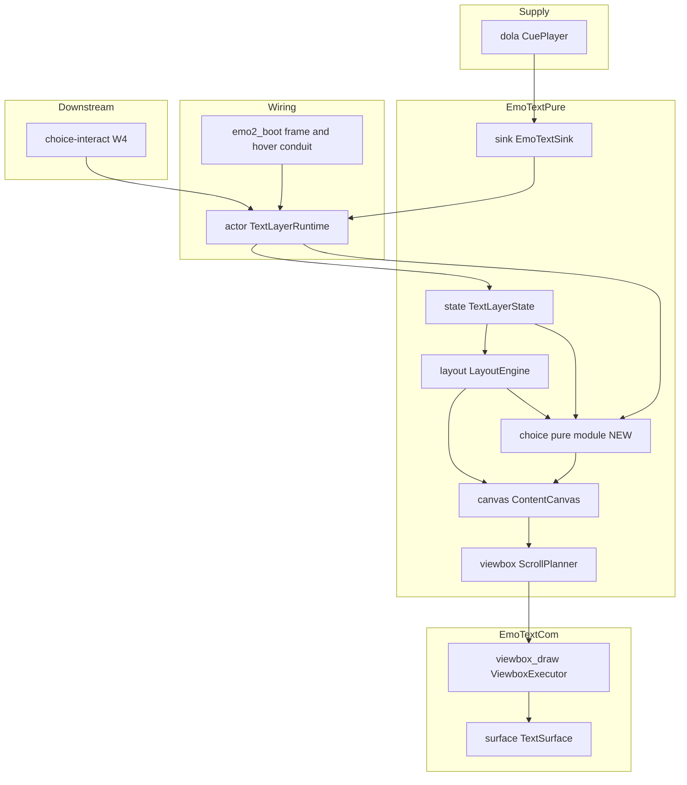
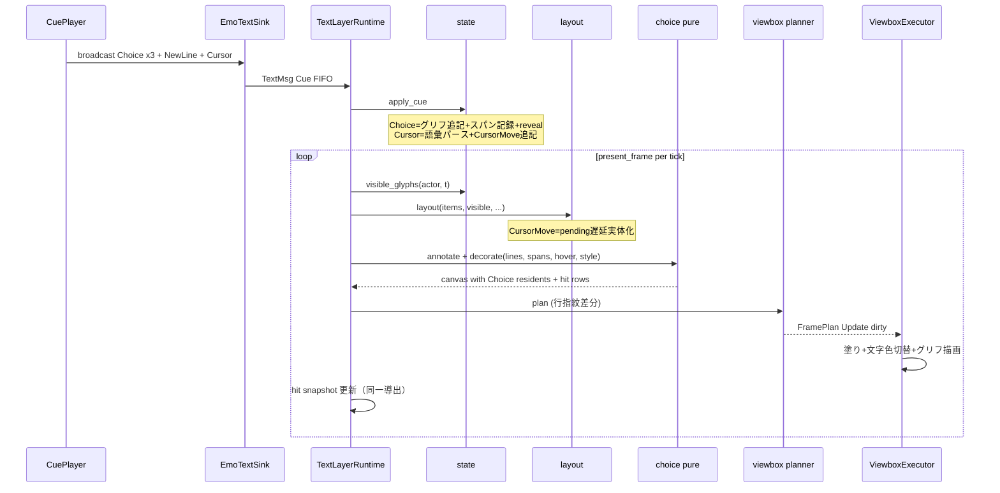

# Technical Design: areka-P0-choice-render

## Overview

**Purpose**: 本機能は、dola `CuePlayer` が第一級配送する `Choice` cue（＋`Cursor` cue＝`\_l` 不透明転写）を emo-text 表示層が実際に消費し、バルーン内容キャンバスへ選択肢行を描画する「M-dialogue の表示半分」を提供する。emo2 のメニュー（`menu.pasta`）が実機で**見える**ようになり、注入 hover で選択肢行が**光る**。

**Users**: ゴースト作者は `\q[タイトル,ID]`／`\_l[x,y]` の正典記述どおりのメニュー表示を得る。下流 spec `areka-P0-choice-interact` は本設計が正本として確立する**行ヒットジオメトリ照会契約**と **hover 状態注入 API** を消費して実ポインタ配線・クリック解決を組み立てる。

**Impact**: 既存の emo-text 縦経路（cue 受信→純粋状態機械→レイアウト→canvas→viewbox 差分描画→供給面提示）への additive 増分。`state.rs:234-251` の Choice/Cursor 良性スキップシームを実消費へ置換し、`ResidentContent`（`#[non_exhaustive]`）へ選択肢住人 variant を追加する。既存の typewriter/scroll/viewbox 決定論資産・既存住人種の解決/描画・cue ワイヤ形・emo-present crate 本体は変更しない。

### Goals

- 配送された `Choice` cue を選択肢行 resident として描画し、`\_l[x,y]`（px/em/lh）の字下げ配置を効かせる（1.1–1.4, 2.1–2.3）
- 行ヒットジオメトリ（選択肢グリフ範囲矩形 → ordinal/id 対応）契約と hover 状態注入 API の正本を確立する（3.1–3.4, 4.1）
- 注入 hover に応じたハイライト（cursor.\* スタイル＝矩形塗り＋文字色切替／未指定バルーン＝矩形反転縮退）を差分（ダーティ矩形）再描画で決定論的に描く（4.2–4.5）
- `Clear`/`ClearAll`/新 talk での選択肢・ヒット幾何・hover の原子的無効化（5.1–5.4）
- 決定論檻（注入 cue＋注入 hover＋readback pixel・synthetic pointer/sleep 不使用）と実機サインオフ（見える＋注入 hover で光る・有界デバッグ導線）（7.x, 8.x）

### Non-Goals

- 実ポインタ配線・pointer move による hover 追従・クリック解決・`ChoiceSelection` の定義と発行（すべて `areka-P0-choice-interact`）（3.5, 6.4）
- 選択確定→SHIORI カスケード・タイムアウト・`Status: choosing`（`areka-P0-choice-select-events`）
- `\q`/`\_l`→cue コンパイル（`completed/areka-P0-sakura-dialogue-tags` 完了域）
- cursor 画像キー（`cursor,ファイル名`＝マウスカーソル）・marker.\*・`\_a`・`\__q`・`\![*]` の実導出（語彙シームのみ・6.2）・balloonc\*（M2）・選択肢スクロール完全対応（6.3）

## Boundary Commitments

### This Spec Owns

- `Choice`／`Cursor` cue の**表示消費**（`state.rs` の良性スキップシーム 2 アームの置換）と選択肢行 resident（`ResidentContent::Choice`）の描画
- `\_l` の語彙パース・em/lh/px→image px 換算・レイアウトカーソル移動（`TextItem::CursorMove`＋pending-cursor 遅延実体化）
- **行ヒットジオメトリ照会契約の正本**: `TextLayerRuntime::choice_hit_rows`（`ChoiceHitRow{ordinal,id,label,references,rect}`・バルーン窓物理 px・提示フレーム同期スナップショット）
- **hover 状態注入 API の正本**: `TextLayerRuntime::inject_choice_hover(actor, Option<ordinal>)`（注入駆動・実ポインタ非依存）
- 「選択肢表示中」照会 `choice_active(actor)`（照会のみ・バリア解決はしない）
- ハイライトスタイル差替シーム `ResolvedChoiceStyle`（cursor.\* 解決＋反転縮退＋将来非正典スタイルの開放 enum）と cursor.\* の balloon parser additive モデル
- 実機サインオフ用 hover 注入デバッグ導線（`AREKA_CHOICE_HOVER_INJECT`・本番既定無効・emo2_boot 結線層）

### Out of Boundary

- `ChoiceSelection` 契約の定義・発行、実ポインタ→hover 追従、クリック→選択解決（choice-interact が本設計の 2 契約を消費して実装）
- `WaitForChoice` バリアの解決（`CuePlayer::resolve_choice`／`skip_barrier` は供給側・下流の領分）
- choice cue のワイヤ形（dola `command.rs` 正本・本設計は消費のみ・新 cue variant 新設禁止）
- emo-present crate 本体（`PresentCommand`/`TextSlotView`/`hit_region` いずれも無改変——ハイライトは emo-text canvas 内自前合成で完結）
- バルーン窓の生成・配置・クリックスルー（placement/emo-present 完了域）

### Allowed Dependencies

- `areka-emo-text` ← `dola::cue`（`CueSink` 契約・既存）／`areka-sakura::contract`（`CueCommand` 再輸出・既存）／`areka-parsers::balloon`（`BalloonModel`＋本設計の cursor.\* additive）／`wintf`（COM 層・既存）
- `areka`（emo2_boot 結線）→ `areka-emo-text` の公開 API（本設計の additive アクセサ含む）
- 新規 crates.io 依存なし（9.2）・tokio 不使用（9.3）・WUC/D2D は UI スレッド固定（9.4）

### Revalidation Triggers

- `ChoiceHitRow`／hover 注入 API の形・座標系・鮮度契約の変更（choice-interact / choice-select-events の再検証必須）
- `ResidentContent` variant 追加時の match 網羅（viewbox 指紋・resident_rect・COM 描画・oracle）
- `emo-dpi-scaling`（W4）着地による k≠1.0 実供給——座標写像式（×k＋committed）の実 DPI 再検証（roadmap の Revalidation Trigger 台帳に登録済み）
- balloon parser cursor.\* モデルのキー追加/意味変更（`ResolvedChoiceStyle::resolve` の再検証）

## Architecture

### Existing Architecture Analysis

emo-text は 3 層一方向（純粋層 → COM 層 → 結線層・逆流はレビューエラー・`lib.rs` 構造檻）:

- **純粋層**: `state`（cue→actor 別 items＋reveal）／`layout`（折返し・行送り・newline-defer・`PositionedLine`）／`canvas`（`ResidentContent` 住人モデル）／`viewbox`（`ScrollPlanner`＝行指紋差分によるダーティ導出・`scroll_state()` 契約点）
- **COM 層**: `viewbox_draw`（`ViewboxExecutor`＝blit＋ダーティ矩形限定 D2D 描画）／`draw`（`DWriteMetrics`・`LineLayoutStore`・比較オラクル `DrawExecutor`）／`surface`（`TextSurface`・readback）
- **結線層**: `sink`（`CueSink` 実装）／`actor`（`TextLayerRuntime`・`present_frame`）

本設計はこの縦経路の**各層へ最小の differential を additive に差し込み**、純粋な新規導出はすべて新設 `choice.rs`（純粋層）へ集約する（research.md DD-2・Option C）。ダーティ差分機構（`line_fingerprint`→`derive_dirty`）はアルゴリズム無改変のまま、hover 状態を行指紋に含めることで流用する（DD-4）。

### Architecture Pattern & Boundary Map



**Architecture Integration**:

- Selected pattern: **シーム置換＋純粋モジュール集約のハイブリッド**（research.md Option C 採用）——連続経路（state→layout→canvas→viewbox→draw）へは最小アームを差し（語彙型＝state・換算＝layout・住人データ型＝canvas の DAG 配置）、選択肢固有の純粋導出（注釈・幾何・スタイル・装飾・窓物理写像）は `choice.rs` が単独所有
- Domain boundaries: 選択肢の**描画とヒット幾何の提供**まで（本 spec）／ポインタとの照合以降（choice-interact）——接続点は `TextLayerRuntime` の 3 API（hit rows・hover 注入・choice_active）のみ
- Existing patterns preserved: 注入時刻駆動・後出し優先・newline-defer・行指紋差分ダーティ・`×k` 一点適用・log-first・warn-once・additive アクセサ（`surface`/`draw_stats` 同型）
- New components rationale: `choice.rs`＝GPU 不要の純関数全網羅（3.4, 7.5）を単一ファイルで成立させるため。`ResidentContent::Choice`＝hover を行指紋差分に乗せ ScrollPlanner 無改変で 4.4 を満たすため（DD-1/DD-4）
- Steering compliance: 純粋層 windows 非依存檻へ `choice.rs` を登録・単一トークン命名・エラーは `thiserror`／`TextLayerError` 既存型

### 正典確定（設計冒頭裁定・research.md RN-1〜RN-5 の要約）

| 項目 | 確定 |
|---|---|
| cursor.\* マップ | `style`（square/underline/square+underline/none・既定 square）・`brush.color`＝矩形内色・`pen.color`＝枠/下線色・`font.color`＝hover 文字色・`blendmethod`（既定 none）。fixture 実導出形＝square 塗り(105,25,25)＋白文字 |
| クリック領域幅 | **文字幅**（`\q` は同一行に複数並置可能＝行全幅は正典矛盾）。ヒット矩形＝選択肢グリフ範囲 × 行 font_height 帯。ハイライト矩形＝ヒット矩形と同一 |
| `\_l` 単位 | 裸数値＝image px（文字描画範囲＝validrect 左上原点）・`em`＝`ResolvedFont::height`・`lh`＝`line_pitch=ceil(h×1.25)`（正典「1em＋行間」一致）・省略＝当該軸不動 |
| `\_l` 縮退 | `%`・`@`（相対）・負値絶対＝語彙保持＋warn-once＋状態不変スキップ（2.4, 6.5） |
| `\q` 改行 | 自動改行しない（`\__q` の領分）。表示層は明示改行を挿入しない |
| 矩形反転縮退 | セグメント矩形＝バルーン既定 `font.color` 塗り・文字色＝各成分 `255−c`（α不変）。既定黒文字なら黒矩形＋白文字＝古典反転と同観 |

### Technology Stack

| Layer | Choice / Version | Role in Feature | Notes |
|-------|------------------|-----------------|-------|
| 純粋層 | Rust 2024（std のみ） | choice.rs 純関数群・state/layout/canvas/viewbox 増分 | 新規依存なし（9.2/9.3） |
| COM 層 | DirectWrite/D2D（windows 0.62 既存） | ハイライト塗り・`SetDrawingEffect` 文字色切替 | UI スレッド固定（9.4） |
| Parser | areka-parsers（既存） | balloon cursor.\* additive モデル | encoding_rs 等の既存依存のみ |
| 結線 | areka emo2_boot（既存） | hover 注入デバッグ導線（env ゲート） | `AREKA_` 名前空間規約 |

## File Structure Plan

### New Files

```
crates/areka-emo-text/src/
└── choice.rs        # 純粋層・選択肢導出の集約モジュール:
                     #   ChoiceSpan→行セグメント注釈（グリフ序数→PositionedLine 写像）
                     #   行ヒットジオメトリ導出（canvas-local）＋窓物理 px 写像式（3.1–3.4）
                     #   ResolvedChoiceStyle（cursor.* 解決・反転縮退・差替シーム）（4.2/4.3/6.1/6.5）
                     #   canvas 装飾（GlyphRun 住人→Choice 住人化＋hover 印＋paint 焼込）（4.x）
                     # 依存: state/layout/canvas/region の型を消費する（被依存は actor のみ）
crates/areka/src/emo2_boot/
└── hover_inject.rs  # 実機サインオフ用 hover 注入導線（AREKA_CHOICE_HOVER_INJECT・
                     #   本番既定無効・frame clock 駆動の周期巡回）（8.6）
```

### Modified Files

- `crates/areka-emo-text/src/lib.rs` — `pub mod choice;` 追加＋純粋層構造檻（`pure_layer_modules_have_no_windows_imports`）へ `choice.rs` を登録
- `crates/areka-emo-text/src/state.rs` — **`CursorCoord`/`CursorUnit` 語彙型＋`parse_cursor_coord`**（cue 消費層＝`\_l` 不透明文字列の語彙化はここが所有）・`TextItem::CursorMove{x,y}` variant 追加・`ActorTextState.choices: Vec<ChoiceSpan>`（`ChoiceSpan` 定義もここ＝actor 状態の一部）追加・`apply_cue` の Choice アーム（グリフ追記＋スパン記録＋reveal 時刻式）／Cursor アーム（語彙パース→CursorMove 追記）を実消費へ置換（warn-once 檻は撤去、空 text は warn ログ＋空スパン）
- `crates/areka-emo-text/src/layout.rs` — **`cursor_to_image_px` 換算**（em＝font_height・lh＝`GlyphMetrics::line_pitch`＝レイアウトカーソル意味論の所有点）＋`TextItem::CursorMove` の pending-cursor 遅延実体化（フラッシュ順: 現在行確定→保留改行 Σratio→カーソル指定軸上書き・末尾は蒸発）
- `crates/areka-emo-text/src/canvas.rs` — `ResidentContent::Choice(ChoiceLineContent)` variant 追加（`ChoiceLineContent`/`ChoiceRowSegment`/`HighlightPaint` の純データ定義もここ＝住人モデルの同居地・choice.rs へ依存しない）。`from_layout` 自体は無変更——装飾は choice.rs の後段パス
- `crates/areka-emo-text/src/viewbox.rs` — `line_fingerprint`/`committed_lines` の Choice アーム（hover 印を `CommittedLine` の additive フィールドへ）・`resident_rect` の Choice アーム（GlyphRun 同等のインク矩形）
- `crates/areka-emo-text/src/viewbox_draw.rs` — `render` の Choice アーム: ハイライト矩形塗り＋`SetDrawingEffect` 範囲文字色切替＋通常グリフ描画（正準列①〜⑥の内側・4.2/4.3/4.6）・`scroll_state()` 読み口の additive 追加（スナップショット写像が committed を消費する口）
- `crates/areka-emo-text/src/draw.rs` — 比較オラクル `DrawExecutor` の Choice アーム（素のグリフ描画・ハイライト無し——byte 等価 golden は非選択肢内容のまま不変）
- `crates/areka-emo-text/src/actor.rs` — `TextLayerRuntime` の契約 API 追加（`inject_choice_hover`/`choice_hit_rows`/`choice_active`）・per-actor hover 保持と `Clear`/`ClearAll` アームでの hover リセット・`ResolvedBalloonText` へ `choice_style: ResolvedChoiceStyle` 追加・`present_actor` へ装飾パスとスナップショット更新を挿入
- `crates/areka-parsers/src/balloon/model.rs` / `parse.rs` — `Cursor` サブ構造体（`style`/`brush_color`/`pen_color`/`font_color`/`blendmethod`）の additive モデル化＋KV 写像（既存「font へ巻き込まない」檻は不変緑）
- `crates/areka/src/emo2_boot/mod.rs` / `frame.rs` — `hover_inject` モジュール登録と text phase からの駆動（env 未設定時は完全 no-op）

> **純粋層内の依存 DAG（循環禁止・レビュー基準）**: `layout → state`（既存）・`canvas → layout/region`（既存）・**`choice → state/layout/canvas/region`（新設・最下流）**。`choice` を import してよいのは結線層 `actor` のみ。`state`/`layout`/`canvas`/`viewbox`/COM 層は `choice` へ依存しない——そのために語彙型は state（cue 消費層）・換算は layout（カーソル意味論）・住人データ型は canvas（住人モデル）へ配置し、COM 層はハイライトを住人内の解決済み `HighlightPaint`（純データ）から読む。

## System Flows

### 選択肢表示（cue→描画・毎フレーム）



- ゲート条件: 装飾は当該 actor にスパンが在るときのみ（無ければ既存経路と完全同一の canvas＝非退行）。
- hover 変化のみのフレームも同じ流れ——cue 不要で、装飾の hover 印が行指紋を変え、当該行だけがダーティ化される（4.4）。

### ライフサイクル（Clear/ClearAll/新 talk）

- `apply_cue(Clear/ClearAll)`: 既存の `request_clear`（描画実行部）＋`state` 全消去に**相乗り**——`ActorTextState` の items とスパンが同時初期化・runtime の hover を `None` へリセット（5.1/5.4）。
- 次 present: `FramePlan::FullClear` で表示消滅と同一フレームにヒットスナップショットが空へ更新（5.2 の原子性＝単一導出・同時更新）。新 talk は talk 冒頭 ClearAll（既存規約）で同経路（5.3）。

## Requirements Traceability

| Requirement | Summary | Components | Interfaces | Flows |
|-------------|---------|------------|------------|-------|
| 1.1 | Choice cue 消費→行 resident 描画 | state 増分・choice.rs 装飾・canvas variant・viewbox_draw | `apply_cue`・`decorate_canvas` | 表示フロー |
| 1.2 | 複数選択肢の配送順保持・忠実描画 | state 増分（`ChoiceSpan` 追記順） | `ActorTextState::choices` | 表示フロー |
| 1.3 | 選択肢表示中の照会 | actor 増分 | `choice_active` | — |
| 1.4 | 既存グリフ経路再利用・typewriter 非退行 | canvas variant（GlyphRun 同形）・LineLayoutStore 共有 | — | 表示フロー |
| 1.5 | 空 text／選択肢ゼロ台本の縮退 | state 増分（warn ログ＋空スパン） | — | Error Handling |
| 2.1 | `\_l` 消費・em/lh→px 換算・カーソル移動 | state（`CursorCoord`/`parse_cursor_coord`）・layout（換算＋実体化） | `CursorMove`・`cursor_to_image_px` | 表示フロー |
| 2.2 | DPI≠96 で一貫（image px＋×k 一点） | layout 換算（image px 完結）・choice.rs 窓物理写像 | 座標写像式 | Supporting References |
| 2.3 | 字下げ配置→ヒット幾何反映 | choice.rs 注釈（単一導出） | `annotate_lines` | 表示フロー |
| 2.4 | 負値/省略の縮退 | state 語彙（Invalid/Omitted）・layout 換算 None | — | Error Handling |
| 2.5 | newline-defer/折返し不変条件整合 | layout 増分（pending-cursor 同型遅延） | — | 表示フロー |
| 3.1 | 行ヒット矩形＋id の保持 | choice.rs 導出・actor スナップショット | `ChoiceHitRow` | 表示フロー |
| 3.2 | 照会公開・契約正本所有 | actor 増分 | `choice_hit_rows` | — |
| 3.3 | 描画とヒットの座標整合（字下げ・スクロール反映） | choice.rs（単一導出）・`scroll_state().committed` 消費 | 座標写像式 | Supporting References |
| 3.4 | 純粋レイアウト計算・GPU 不要全網羅 | choice.rs（windows 非依存檻） | — | Testing Strategy |
| 3.5 | ポインタ照会・クリック・ChoiceSelection 非実装 | 境界（Out of Boundary） | — | — |
| 4.1 | hover 注入 API 正本 | actor 増分 | `inject_choice_hover` | hover フロー |
| 4.2 | cursor.\* スタイルの塗り＋文字色切替 | choice.rs スタイル解決・viewbox_draw | `ResolvedChoiceStyle::SquareFill` | 表示フロー |
| 4.3 | 矩形反転縮退（M1 実導出） | choice.rs スタイル解決・viewbox_draw | `ResolvedChoiceStyle::Invert` | 表示フロー |
| 4.4 | ダーティ矩形差分再描画・全域退行なし | viewbox 増分（指紋 hover 印）・既存 derive_dirty | `CommittedLine` additive | 表示フロー |
| 4.5 | hover 無し＝ハイライト無し | choice.rs 装飾（hover=None は印なし） | — | — |
| 4.6 | canvas 内合成・emo-present 無改変 | viewbox_draw（正準列内で完結） | — | — |
| 5.1 | Clear/ClearAll/新 talk で resident 消滅 | state（items＋スパン同時初期化） | 既存 `apply_cue` 相乗り | ライフサイクル |
| 5.2 | 表示とヒットの原子的無効化 | actor（単一導出・提示フレーム同期） | 鮮度契約 | ライフサイクル |
| 5.3 | 新選択肢集合のみ保持 | state（ClearAll→新スパン） | — | ライフサイクル |
| 5.4 | hover クリア整合 | actor（Clear/ClearAll アームでリセット） | — | ライフサイクル |
| 6.1 | M1 実導出範囲（短メニュー＋square＋字下げ＋反転） | choice.rs・viewbox_draw | — | 正典確定 |
| 6.2 | 型/語彙シーム保持 | 既存シーム明示（KV passthrough・Custom キャリア）＋`ResolvedChoiceStyle` 開放 enum | — | Error Handling |
| 6.3 | スクロール完全対応を追わない | 既存 visible_window のまま（committed 反映のみ） | — | — |
| 6.4 | ChoiceSelection/実ポインタの明示除外 | 境界 | — | — |
| 6.5 | 未確定形の安全縮退 | state/layout（`\_l` 系）・choice.rs（スタイル系）の warn-once＋既定/スキップ | — | Error Handling |
| 7.1 | Choice×3＋`\_l` の readback 観測 | 統合テスト（ViewboxExecutor readback） | — | Testing Strategy |
| 7.2 | hover on/off の pixel 檻 | 統合テスト | — | Testing Strategy |
| 7.3 | Clear の消滅＋幾何無効化観測 | 統合テスト | — | Testing Strategy |
| 7.4 | synthetic pointer/sleep 不使用 | 全テスト（注入 cue/hover/Tick のみ） | — | Testing Strategy |
| 7.5 | 判断分岐網羅＋純関数全網羅 | choice.rs/state/layout/viewbox 単体テスト | — | Testing Strategy |
| 7.6 | 実フォント目視併用＋test-local fixture | 統合テスト fixture | — | Testing Strategy |
| 8.1 | 実機で字下げどおり可視 | emo2_boot 実機手順 | — | Testing Strategy |
| 8.2 | 実機で注入 hover が光る | hover_inject 導線 | `AREKA_CHOICE_HOVER_INJECT` | Testing Strategy |
| 8.3 | 本番ゴースト表示先行 | 実機手順（emo2 実 boot） | — | Testing Strategy |
| 8.4 | 実ポインタ判定を混ぜない | hover_inject（frame clock 駆動のみ） | — | Testing Strategy |
| 8.5 | pasta.dll 絶対パス起動 | 実機手順 | — | Testing Strategy |
| 8.6 | 有界デバッグ導線・本番既定無効 | hover_inject.rs | env ゲート | Components |
| 9.1 | workspace 全緑 | 全体 | — | Testing Strategy |
| 9.2 | 新規外部依存なし | Technology Stack | — | — |
| 9.3 | Rust 2024・tokio 不使用 | Technology Stack | — | — |
| 9.4 | WUC/D2D UI スレッド固定 | viewbox_draw（既存規律のまま） | — | — |
| 9.5 | 既存資産無変更・新 cue variant 新設なし | 差分設計（既存アーム置換＋additive のみ） | — | — |
| 9.6 | emo-present 無改変 | 境界（本設計は emo-present に触れない） | — | — |

## Components and Interfaces

| Component | Domain/Layer | Intent | Req Coverage | Key Dependencies | Contracts |
|-----------|--------------|--------|--------------|------------------|-----------|
| ChoicePure (`choice.rs`) | 純粋層 | 注釈・幾何・スタイル・装飾・窓物理写像の単独所有 | 3.1–3.4, 4.2/4.3/4.5, 6.1/6.5 | state/layout/canvas/region 型 (P0) | Service/State |
| StateIncrement (`state.rs`) | 純粋層 | Choice/Cursor 実消費・`\_l` 語彙型・スパン記録・CursorMove | 1.1/1.2/1.5, 2.1, 5.1/5.3 | — | State |
| LayoutCursor (`layout.rs`) | 純粋層 | em/lh/px 換算＋pending-cursor 遅延実体化 | 2.1–2.5 | state 型 (P0) | State |
| CanvasChoice (`canvas.rs`) | 純粋層 | `ResidentContent::Choice` 型定義 | 1.1/1.4 | — | State |
| ViewboxFingerprint (`viewbox.rs`) | 純粋層 | 指紋 hover 印＋Choice インク矩形 | 4.4 | — | State |
| HighlightDraw (`viewbox_draw.rs`) | COM 層 | 塗り＋文字色切替＋グリフ描画 | 4.2/4.3/4.6, 9.4 | GraphicsCore (P0) | Service |
| RuntimeContract (`actor.rs`) | 結線層 | 3 契約 API・hover 保持・スナップショット | 1.3, 3.1–3.3, 4.1, 5.2/5.4 | choice.rs (P0) | Service/State |
| BalloonCursorModel (`areka-parsers/balloon`) | Parser | cursor.\* additive 転記モデル | 4.2, 6.2 | kv 基盤 (P0) | State |
| HoverInjectConduit (`emo2_boot/hover_inject.rs`) | 結線層 | 実機サインオフ用 env ゲート駆動 | 8.2/8.4/8.6 | RuntimeContract (P0) | Batch |
| DrawOracle (`draw.rs`) | COM 層 (test) | oracle の Choice アーム（素描画） | 9.5 | — | — |

### 純粋層 / ChoicePure（`crates/areka-emo-text/src/choice.rs`）

| Field | Detail |
|-------|--------|
| Intent | 選択肢固有の純粋導出（注釈・幾何・スタイル・装飾・窓物理写像）を単独所有し GPU 不要の全網羅を成立させる |
| Requirements | 3.1–3.4, 4.2/4.3/4.5, 6.1/6.5, 7.5 |

**Responsibilities & Constraints**

- `windows` 非依存（lib.rs 構造檻へ登録）・全関数は同一入力→同一出力の純関数・失敗経路なし（縮退は値で表現＋呼び手が warn）
- 描画とヒットの座標を**単一の注釈導出**から得る（3.3 の構造保証）——装飾（表示）と hit rows（照会）は同じ `LineChoiceSegment` 列を源にする
- 純粋層 DAG の最下流（state/layout/canvas/region を消費・被依存は actor のみ）

**Contracts**: Service [x] / State [x]

##### Service Interface

```rust
/// 行×選択肢セグメント注釈（配置済み行へのスパン写像・折返し跨ぎは行ごと分割）。
#[derive(Clone, Debug, PartialEq)]
pub struct LineChoiceSegment {
    pub line_index: usize,
    pub ordinal: usize,
    pub inline_range: (f32, f32), // 行内軸 image px 絶対（先頭グリフ位置〜末尾+advance）
}

/// 注釈導出（純粋）: layout 出力の行グリフ列を序数走査してスパンを行セグメントへ写す。
pub fn annotate_lines(lines: &[PositionedLine], spans: &[ChoiceSpan]) -> Vec<LineChoiceSegment>;

/// canvas 装飾（純粋）: セグメントを含む行の GlyphRun 住人を Choice 住人へ置換し
/// hover 印と解決済みハイライト塗り（`HighlightPaint`＝canvas.rs の純データ型）を焼き込む。
/// style→paint の正規化（Invert の 255−c 式含む）はこの時点で行い、下流（viewbox/COM）は
/// choice.rs へ依存せず純データだけを読む。セグメントが空なら canvas を無変更で返す（非退行・1.4）。
pub fn decorate_canvas(
    canvas: ContentCanvas, segments: &[LineChoiceSegment],
    hover: Option<usize>, style: ResolvedChoiceStyle, default_font_color: (u8, u8, u8),
) -> ContentCanvas;

/// ヒット行導出（純粋・canvas-local image px）: セグメント×行矩形から
/// `(ordinal, inline 範囲 × 行 font_height 帯)` を組む。空範囲セグメントは行を生まない。
pub struct CanvasHitRow { pub ordinal: usize, pub rect: LineRect }
pub fn derive_hit_rows(
    lines: &[PositionedLine], segments: &[LineChoiceSegment], mode: WritingMode,
) -> Vec<CanvasHitRow>;

/// バルーン窓 client 座標系の物理 px 矩形（f32・Send 純データ・choice.rs 所有——
/// actor.rs の契約 API はこの型を再輸出する）。
#[derive(Clone, Copy, Debug, PartialEq)]
pub struct HitRectPx { pub left: f32, pub top: f32, pub right: f32, pub bottom: f32 }

/// 窓物理 px への写像（純粋・Supporting References の正本式）。
pub fn to_window_physical(
    row: &CanvasHitRow, region: &TextRegion, mode: WritingMode,
    committed: i32, contract: &ScaleContract,
) -> HitRectPx;

/// ハイライトスタイル差替シーム（開放 enum・将来の非正典スタイル variant 追加口）。
#[non_exhaustive]
#[derive(Clone, Copy, Debug, PartialEq)]
pub enum ResolvedChoiceStyle {
    /// cursor.* 指定形（fixture 実導出・4.2）: 塗り色＋hover 文字色。
    SquareFill { fill: (u8, u8, u8), text: (u8, u8, u8) },
    /// cursor.* 未指定の矩形反転縮退（4.3/6.1・RN-5 確定仕様）。
    Invert,
    /// `cursor.style,none`（正典・マーカー無し）。
    NoMarker,
}

impl ResolvedChoiceStyle {
    /// balloon cursor.* モデル＋既定文字色から解決（未指定→Invert・
    /// underline系→warn-once+SquareFill 縮退・ROP blendmethod→warn-once+none 扱い）。
    pub fn resolve(cursor: Option<&BalloonCursor>, default_font_color: (u8, u8, u8)) -> Self;
    /// 描画実行の一点写像: (塗り色, hover 文字色) 正規形（Invert は
    /// 塗り＝default_font_color・文字＝各成分 255−c。NoMarker は None）。
    pub fn paint(&self, default_font_color: (u8, u8, u8)) -> Option<((u8,u8,u8),(u8,u8,u8))>;
}
```

- Preconditions: `annotate_lines` の `lines` は同一 items からの layout 出力（グリフ序数が items のグリフ順と 1:1）。**annotate は `from_layout` に渡すのと同一の `lines` を消費する**——visible_window 適用後の行列へ再適用しない（挿入点は layout 直後の一点）
- Postconditions: `decorate_canvas` と `derive_hit_rows` は同一 `segments` を源にする（表示とヒットの座標整合・3.3）
- Invariants: 全関数純粋・windows 非依存・スパン空なら全関数が恒等/空を返す（非退行）。**部分リビール（可視 prefix）中のスパン交差は可視グリフ数で打ち切る**（`min(glyph_range.end, visible_count)`＝リビール途中のヒット矩形・ハイライトは配置済みグリフ範囲のみ・序数空間は items 全体の序数で統一）

**Implementation Notes**

- Integration: `present_actor` が layout 直後に `annotate_lines`→`decorate_canvas`→（render 後）スナップショット更新の順で呼ぶ
- Validation: 序数走査は「行グリフ数の累積和」でスパン範囲と交差判定（浮動小数比較を含まない・純整数）
- Risks: 折返しでスパンが行を跨ぐ場合は行ごとにセグメント分割（`\q` 非改行の正典上 emo2 では発火しないが構造的に正しく扱う）

### 純粋層 / StateIncrement（`state.rs` 増分）

| Field | Detail |
|-------|--------|
| Intent | Choice/Cursor 良性スキップシームを実消費へ置換し、選択肢スパンとカーソル移動を追記正本へ載せる（`\_l` 語彙型の所有点） |
| Requirements | 1.1/1.2/1.5, 2.1, 5.1/5.3, 9.5 |

**Responsibilities & Constraints**

```rust
/// `\_l` 座標 1 軸の語彙（不透明文字列の全語彙を保持・Copy・state.rs 所有）。
#[derive(Clone, Copy, Debug, PartialEq)]
pub enum CursorCoord {
    Omitted,                                   // 省略＝当該軸不動（正典）
    Absolute { value: f32, unit: CursorUnit }, // M1 実導出: Px/Em/Lh の非負値
    Relative { value: f32, unit: CursorUnit }, // `@`（語彙保持・M1 は warn-once 縮退）
    Invalid,                                   // パース不能（warn 縮退＝移動しない）
}

#[derive(Clone, Copy, Debug, PartialEq)]
pub enum CursorUnit { Px, Em, Lh, Percent }

/// 不透明転写文字列 → 語彙（純粋・全入力で値を返す・state.rs 所有）。
pub fn parse_cursor_coord(raw: &str) -> CursorCoord;

/// 選択肢スパン（ActorTextState の一部・state.rs 所有）。
#[derive(Clone, Debug, PartialEq)]
pub struct ChoiceSpan {
    pub ordinal: usize,           // 配送順序数（hover/照会の主キー）
    pub id: String,               // `\q` ID（不透明転写）
    pub label: String,            // 表示文字列（不透明転写）
    pub references: Vec<String>,  // `\q` 第3引数以降（不透明転写）
    pub glyph_range: core::ops::Range<usize>, // グリフ序数範囲（空 text は空範囲）
}
```

- `TextItem::CursorMove { x: CursorCoord, y: CursorCoord }` を additive 追加（Copy 維持・改行マーカーと同格の非グリフアイテム＝reveal 対象外）
- `ActorTextState` へ `choices: Vec<ChoiceSpan>` を追加（items と同一ライフサイクル——`Clear`/`ClearAll` の既存全消去で同時初期化・5.1/5.3 の構造保証）
- `apply_cue` Choice アーム: `text` のグリフを items へ追記＋`ChoiceSpan{ordinal=len, id, label=text, references, glyph_range}` を記録＋reveal を Text と同じ時刻式（`interval = duration / glyph_count`・DD-9）で拡張。空 `text` は warn ログ＋空範囲スパン（1.5・グリフ追記なし）
- `apply_cue` Cursor アーム: `parse_cursor_coord(x/y)` → `TextItem::CursorMove` を items へ追記（テキスト状態のグリフ/リビールは不変）。`choice_warned`/`cursor_warned` once-guard は撤去
- 既存の Text/NewLine/Clear/ClearAll アーム・可視数解決・決定論性は無変更（9.5）

**Contracts**: State [x] — `ActorTextState::choices() -> &[ChoiceSpan]` 読み口を追加

### 純粋層 / LayoutCursor（`layout.rs` 増分）

| Field | Detail |
|-------|--------|
| Intent | em/lh/px 換算の所有点として `CursorMove` を newline-defer と同型の遅延実体化でレイアウトカーソルへ反映する |
| Requirements | 2.1–2.5 |

**Responsibilities & Constraints**

```rust
/// M1 実導出換算（layout.rs 所有＝レイアウトカーソル意味論・純粋）:
/// 絶対 Px/Em/Lh の非負値のみ Some(image px 絶対座標)。
/// Percent/Relative/負値/Invalid/Omitted は None（呼び手が状態不変スキップ＋warn-once）。
/// origin は当該軸の validrect 原点（`\_l` 原点＝文字描画範囲左上・RN-3）。
pub fn cursor_to_image_px(
    coord: CursorCoord, origin: f32, font_height: f32, line_pitch: f32,
) -> Option<f32>;
```

- 走査ローカル `pending_cursor: Option<(Option<f32>, Option<f32>)>`（行内軸/ブロック軸の image px 絶対値・`cursor_to_image_px` 済み）を追加
- `TextItem::CursorMove` 到着時: 換算（em＝`font_height`・lh＝`metrics.line_pitch(font_height)`・原点＝`region` の当該軸開始・writing_mode の軸読み替えに従い x→水平軸/ y→垂直軸を行内/ブロック軸へ写像）し保留のみ（行は閉じない・空行を出さない）。換算 None の軸は保留に含めない（縮退＝状態不変・2.4）
- フラッシュ（次の可視グリフ配置直前・ゲート②の直後に②'として挿入）: (1) 現在行が非空なら確定（`\_l` は行区切り・RN-3）(2) 保留改行 Σratio を適用 (3) pending_cursor の指定軸で `inline_pos`/`block_pos` を上書き。末尾の CursorMove は蒸発（newline-defer と同一規則・2.5）
- 両軸 None（無効果 `\_l[,]` や全縮退）は保留自体を積まない——ただし行区切り性は保つため「有効軸が 1 つ以上あるときのみ行確定」とする（無効果 `\_l` は完全 no-op＝正典「両方省略で無効果」）

### 純粋層 / CanvasChoice・ViewboxFingerprint（`canvas.rs`/`viewbox.rs` 増分）

| Field | Detail |
|-------|--------|
| Intent | 選択肢住人の型定義と、hover を行指紋差分に乗せるダーティ整合 |
| Requirements | 1.1/1.4, 4.4 |

```rust
/// 選択肢行住人（グリフ行＋選択肢セグメント＋hover 印・canvas.rs 所有の純データ——
/// choice.rs へ依存しない＝下流の viewbox/COM 層は本データだけを読む）。
#[derive(Clone, Debug, PartialEq)]
pub struct ChoiceLineContent {
    /// グリフ行本体（描画は GlyphRun と同一経路・1.4）。
    pub run: GlyphRunContent,
    /// 行内の選択肢セグメント（ordinal＋ローカル行内範囲）。
    pub segments: Vec<ChoiceRowSegment>,
    /// hover 中セグメントの ordinal（この行に hover 対象が無ければ None）。
    pub hovered: Option<usize>,
    /// hover 中セグメントへ適用する解決済み塗り（装飾時に style→paint 正規化済み。
    /// None＝描かない（hover 無し・`cursor.style,none`））。
    pub highlight: Option<HighlightPaint>,
}

#[derive(Clone, Copy, Debug, PartialEq)]
pub struct ChoiceRowSegment {
    pub ordinal: usize,
    /// 行ローカル行内軸範囲（GlyphRunContent と同じローカル座標）。
    pub inline_range: (f32, f32),
}

/// ハイライト塗りの正規形（矩形塗り色＋hover 文字色・純データ）。
/// SquareFill＝(brush.color, cursor.font.color)・Invert＝(既定 font.color, 各成分 255−c)。
#[derive(Clone, Copy, Debug, PartialEq)]
pub struct HighlightPaint {
    pub fill: (u8, u8, u8),
    pub text: (u8, u8, u8),
}
```

- `ResidentContent::Choice(ChoiceLineContent)` を追加（`#[non_exhaustive]` の crate 内 variant 追加＝全 match 箇所の再検討をコンパイラが強制）
- `line_fingerprint`（viewbox.rs）: Choice アーム＝text（グリフ連結）＋block_pos＋extent に加え **`choice_marker: u32`**（`CommittedLine` へ crate 内 additive フィールド・非 Choice 行は 0・Choice 行は `hovered.map_or(0, |o| o as u32 + 1)`）——hover の付与/切替/解除で旧行・新行の双方が独立に指紋差分となり、既存 `derive_dirty` が当該行のみをダーティ化（4.4・ScrollPlanner のアルゴリズム無改変）
- `resident_rect`: Choice アーム＝GlyphRun と同一のインク矩形導出（overhang 込み——ハイライト矩形はグリフ範囲内ゆえ追加の張り出しなし）

### COM 層 / HighlightDraw（`viewbox_draw.rs` 増分）

| Field | Detail |
|-------|--------|
| Intent | ダーティ矩形限定描画の正準列内で選択肢行の塗り・文字色切替・グリフ描画を実行する |
| Requirements | 4.2/4.3/4.5/4.6, 9.4 |

**Responsibilities & Constraints**

- `render` の住人 match へ Choice アーム追加: 行 TextLayout は `LineLayoutStore` を GlyphRun と同一に使用（text＝グリフ連結・キャッシュ規律不変）。ハイライトは住人内の解決済み `HighlightPaint`（純データ）から読む（choice.rs へ依存しない）
- hover 行の描画列（正準列⑤の内側・ダーティクリップ済み）: (a) `highlight` が Some のとき hover セグメントの矩形（`inline_range × 行高 font_height`・住人 transform＋`block_offset` 反映）を `fill` 色ブラシで `FillRectangle` (b) hover セグメント範囲へ `SetDrawingEffect(text 色ブラシ)` を適用 (c) `DrawTextLayout`（既定文字色ブラシ）——効果範囲の文字だけが切替色になる
- **DrawingEffect リセット正準列**: キャッシュ層 TextLayout を汚さないため、Choice 行の描画毎に「全文字範囲へ `SetDrawingEffect(None)` → hover 範囲へ適用」を必ず順守（hover 解除フレームは全範囲 None のみ＝素描画・4.5）
- 非 hover の Choice 行は GlyphRun と同一の素描画（塗りなし・効果なし）
- `NoMarker` は hover でも素描画（正典）。ブラシ生成は既存 `create_solid_color_brush` 経路・失敗は log-first（`error!`＋`Err`・フレーム skip）
- oracle（`draw.rs::DrawExecutor`・`#[cfg(test)]`）の Choice アームは素のグリフ描画のみ（byte 等価 golden 群は非選択肢内容のまま不変・選択肢 pixel 檻は ViewboxExecutor readback を直接期待値化）

### 結線層 / RuntimeContract（`actor.rs` 増分）

| Field | Detail |
|-------|--------|
| Intent | 下流（choice-interact）が消費する 3 契約 API と hover 保持・提示フレーム同期スナップショット |
| Requirements | 1.3, 3.1–3.3, 4.1, 5.2/5.4 |

**Contracts**: Service [x] / State [x]

##### Service Interface

```rust
/// 行ヒットジオメトリ契約（本 spec 正本・choice-interact が消費）。
/// `HitRectPx` は choice.rs（純粋層）所有・actor.rs が再輸出する。
#[derive(Clone, Debug, PartialEq)]
pub struct ChoiceHitRow {
    pub ordinal: usize,           // hover 注入・選択解決の主キー（配送順）
    pub id: String,               // `\q` ID（不透明転写）
    pub label: String,            // 表示文字列
    pub references: Vec<String>,  // `\q` 第3引数以降
    pub rect: HitRectPx,          // バルーン窓物理 px（スクロール committed 反映済み）
}

impl TextLayerRuntime {
    /// hover 状態注入（契約正本・4.1）。None＝ハイライト無し。
    /// ordinal が現存スパンに無い場合は「ハイライト無し」として描画される（縮退・debug ログ）。
    /// UI スレッド専用（runtime は !Send——実ポインタ駆動もデバッグ導線も同スレッド）。
    pub fn inject_choice_hover(&mut self, actor: &ActorKey, hover: Option<usize>);

    /// 行ヒットジオメトリ照会（契約正本・3.2）。
    /// **鮮度契約**: 最後に提示（present）したフレームの導出値＝表示と同一 layout からの
    /// 単一導出（3.3/5.2）。未装着・選択肢なしは空 slice。
    pub fn choice_hit_rows(&self, actor: &ActorKey) -> &[ChoiceHitRow];

    /// 「選択肢表示中」照会（1.3・照会のみ＝バリア解決はしない）。
    /// 表示層自身の選択肢スパン集合が非空であることを表す（DD-6——
    /// `WaitForChoice` バリアは sink へ配送されない内部状態のため、供給側の
    /// `CuePlayerState::WaitingForChoice` はバリアの真実源として別に在る）。
    pub fn choice_active(&self, actor: &ActorKey) -> bool;
}
```

- Preconditions: 照会・注入とも UI スレッド（既存 runtime 規約）
- Postconditions: `apply_cue(Clear)` は当該 actor、`apply_cue(ClearAll)` は全 actor の hover を `None` へリセット（既存 `request_clear` アームへ相乗り・5.4）
- Invariants: スナップショットと表示は同一フレームの同一導出（present 成功時のみ更新・5.2）。cue 適用〜次 present の間は両者とも 1 フレーム前で揃う（「片方だけ古い」は構造的に生じない）

**Implementation Notes**

- Integration: `ResolvedBalloonText` へ `choice_style: ResolvedChoiceStyle` を追加（`resolve` 時に balloon cursor.\* モデル＋既定文字色から一点解決）。`present_actor` は layout 後に `annotate_lines`→`decorate_canvas`（hover・style 焼込）→ `executor.render` → 成功時に `derive_hit_rows`＋`to_window_physical`（`executor` 内 planner の `scroll_state().committed` 消費）でスナップショット更新
- Validation: `changed=false`（NoChange）のフレームは表示不変＝スナップショットも不変（更新スキップで整合）
- Risks: 下流が `pending_choices()` 直読みや自前レイアウト再現で幾何を再導出することは契約違反（本 API が唯一の照会口）——choice-interact の design へ申し送り

### Parser / BalloonCursorModel（`areka-parsers/balloon` 増分）

| Field | Detail |
|-------|--------|
| Intent | cursor.\* スタイルキー群の忠実転記モデル（additive） |
| Requirements | 4.2, 6.2 |

```rust
/// balloon descript の cursor.* スタイルキー群（選択肢マーカー・忠実転写）。
/// 「cursor,ファイル名」（マウスカーソル画像）は別キー＝本モデルの対象外。
#[derive(Clone, Debug, Default, PartialEq)]
pub struct BalloonCursor {
    style: Option<String>,               // square / underline / square+underline / none
    brush_color: CursorColor,            // cursor.brush.color.{r,g,b}
    pen_color: CursorColor,              // cursor.pen.color.{r,g,b}（語彙保持・M1 非参照）
    font_color: CursorColor,             // cursor.font.color.{r,g,b}
    blendmethod: Option<String>,         // none / notmaskpen / ...（不透明転写）
}
```

- 既存 `BalloonModel` へ `cursor: BalloonCursor` を additive 追加・KV 写像は既存後勝ちマージに相乗り。`Option`（`None` と `Some(0)` の区別）・記述子保持・解釈は下流（`ResolvedChoiceStyle::resolve`）——既存パーサ規約どおり
- **cursor.\* 全キー未指定＝「未指定バルーン」判定**（`resolve` が `Invert` へ写す・4.3）。既存 validation 檻（cursor キーを font へ巻き込まない）は不変緑
- shadowcolor/shadowstyle は寛容パース passthrough のまま非モデル化（M1 描画非参照・KV 層が語彙を落とさない＝6.2 の語彙シーム）

### 結線層 / HoverInjectConduit（`emo2_boot/hover_inject.rs`・新設）

| Field | Detail |
|-------|--------|
| Intent | 実機サインオフ（8.2）到達用の有界 hover 注入導線（実ポインタ非依存・本番既定無効） |
| Requirements | 8.2/8.4/8.6 |

**Contracts**: Batch [x]

##### Batch / Job Contract

- Trigger: env `AREKA_CHOICE_HOVER_INJECT`（`AREKA_` 名前空間規約）。**未設定/空＝無効（本番既定・完全 no-op）**。`cycle`＝既定周期 700ms・`cycle:<ms>`＝指定周期。不正値は warn＋無効
- Input / validation: text phase（frame clock＝`TalkClock::talk_time` と同じ時刻源）ごとに、`choice_active` な各 actor について `hit_rows` の ordinal 列を `None→0→1→…→None→…` と周期巡回し `inject_choice_hover` を呼ぶ（周期境界は注入時刻の商＝決定論・実時間 sleep なし）
- Output / destination: 画面上のハイライト巡回（人間目視）＋既存 tracing ログ（注入 ordinal を `info!`——`RUST_LOG` grep でのサインオフ判定材料）
- Idempotency & recovery: 同一 frame 時刻→同一注入（純関数駆動）。`AREKA_APP_SMOKE_EXIT_MS` の有界 auto-exit と併走（サインオフ手順: 実 emo2＋実 pasta.dll **絶対パス**起動〔8.5〕→ダブルクリック→メニュー表示→ハイライト巡回を目視→自動終了）
- 本導線はライブラリ公開 API（`inject_choice_hover`）の一消費者に過ぎず、emo-text 本体・本番描画経路・決定論資産に変更を加えない（8.6）。下流 choice-interact の実ポインタドライバとは同一 API の別ドライバ（排他不要——interact 着地後も env 無効ならば存在が消える）

## Data Models

### Domain Model

- **集約**: actor（`ActorKey`）単位。`ActorTextState`（items＋reveal＋**choices**）が追記正本の単一集約——選択肢は talk の一部であり items と同一ライフサイクル（`Clear`/`ClearAll` で同時初期化＝5.x の整合はデータ形で保証）
- **値オブジェクト**: `CursorCoord`/`CursorUnit`（`\_l` 語彙）・`ChoiceSpan`（グリフ序数範囲）・`LineChoiceSegment`（行注釈）・`CanvasHitRow`→`ChoiceHitRow`（照会契約）・`ResolvedChoiceStyle`（スタイル正規形）・`ChoiceLineContent`（住人）
- **不変条件**:
  1. `ChoiceSpan.glyph_range` は items のグリフ序数空間で互いに素・追記順に単調（Choice cue は自グリフのみを範囲化）
  2. 装飾（表示）とヒット行（照会）は同一 `LineChoiceSegment` 列から導出（3.3）
  3. hover ordinal は現存スパンに無ければ描画・照会とも無効果（stale 安全）
  4. スパン空 ⇒ canvas は既存経路と同一・hit rows 空・`choice_active=false`（非退行・1.4）

### Data Contracts & Integration

- **下流契約（choice-interact 向け・本 spec 正本）**: `ChoiceHitRow`（座標系＝バルーン窓 client 物理 px・鮮度＝提示フレーム同期）＋`inject_choice_hover`（ordinal キー・UI スレッド）＋`choice_active`。`ChoiceSelection` の構成材料（id/label/references）は row に同梱し、契約の再照会を不要にする
- **cue ワイヤ**: 既存 `CueCommand::Choice{id,text,references}`／`Cursor{x,y}` の消費のみ（新 variant 新設なし・9.5）

## Error Handling

### Error Strategy

log-first（`error!`＋`Err`・panic 禁止）と warn-once 縮退（既存 `choice_warned` 檻と同型）を踏襲。純粋層は失敗経路を持たず（全入力で値を返す）、縮退は値（`None`/`Invalid`）で表し呼び手がログする。

### 縮退表（判断分岐の正本・テスト対象）

| 入力 | 挙動 | ログ | Req |
|---|---|---|---|
| Choice `text` 空 | 空範囲スパン記録・グリフ追記なし・行を生まない | `warn!`（actor 付き） | 1.5 |
| Choice cue ゼロのまま barrier | 表示なし・`choice_active=false`（供給側で観測可能） | —（表示層は barrier 不可視） | 1.5 |
| `\_l` 軸省略 | 当該軸不動（正典） | なし（正常形） | 2.4 |
| `\_l` 両軸省略/全縮退 | 完全 no-op（行区切りもしない） | `debug!` | 2.4 |
| `\_l` 負値絶対 | 当該軸スキップ（状態不変） | `warn!`（actor ごと初回） | 2.4/6.5 |
| `\_l` `%`／`@` 相対 | 語彙保持・当該軸スキップ | `warn!`（actor ごと初回） | 6.5 |
| `\_l` パース不能 | `Invalid`＝当該軸スキップ | `warn!`（actor ごと初回） | 6.5 |
| `cursor.style` underline 系 | `SquareFill` へ縮退 | `warn!`（解決時 1 回） | 6.5 |
| `cursor.blendmethod` ROP 系 | `none` 扱い（色ベース描画） | `warn!`（解決時 1 回） | 6.5 |
| cursor.\* 全キー未指定 | `Invert`（M1 実導出・縮退ではない） | なし | 4.3/6.1 |
| hover ordinal 不在（stale） | ハイライト無し扱い | `debug!` | 5.4 |
| ハイライトブラシ生成失敗 | `error!`＋`Err`＝フレーム skip・次フレーム再試行 | `error!` | 既存規律 |

### Monitoring

既存 tracing 規約（構造化フィールド: `actor`・ordinal・座標）。実機サインオフは `RUST_LOG` grep（hover 注入 ordinal の `info!`）＋readback 檻で決定論判定（[[areka-real-machine-signoff-bounded-auto-exit]] 流儀）。

## Testing Strategy

### Unit Tests（純粋層・GPU 不要全網羅＝7.5/3.4）

1. `state.rs::parse_cursor_coord`＋`layout.rs::cursor_to_image_px` — 語彙全形（裸数値/em/lh/%/@/@付単位/空/負値/非数）の全網羅＋換算の縮退表全行（em=font_height・lh=line_pitch・原点加算・None 経路）
2. `choice.rs::annotate_lines`/`derive_hit_rows` — 単一行 1 選択肢・同一行複数選択肢（正典 `\q\q` 並置）・折返し跨ぎ分割・部分リビール（可視 prefix 途中）・空範囲スパン除外・縦書き 2 方向の軸読み替え
   - `choice.rs::to_window_physical` — **k≠1.0 × committed≠0 × writing_mode 3 方向のパラメタライズ全網羅**（現行 `ScaleContract` は k=1.0 恒常＝実機 DPI≠96 サインオフでも k≠1.0 経路は行使されない罠への先回り檻。emo-dpi-scaling 着地時の Revalidation を純関数檻で前倒しする）
3. `choice.rs::decorate_canvas`/`ResolvedChoiceStyle` — hover None/一致/不在の印・スタイル解決全分岐（指定/未指定/none/underline 縮退/ROP 縮退）・`paint` 正規形（Invert の 255−c 式）・スパン空の恒等
4. `state.rs` — Choice アーム（追記順スパン・reveal 時刻式・空 text warn 檻）・Cursor アーム（CursorMove 追記・グリフ/リビール不変）・Clear/ClearAll でスパン同時初期化（WarnCounter ログ檻併用）
5. `layout.rs` — pending-cursor 遅延実体化（行区切り・保留改行との複合順序・末尾蒸発・無効果 `\_l` no-op・newline-defer 既存檻の非回帰）
6. `viewbox.rs` — Choice 行指紋（hover 印の付与/切替/解除で旧行・新行のみ差分→derive_dirty が当該行矩形のみ・4.4 の純粋檻）・`resident_rect` Choice アーム

### Integration Tests（COM・readback pixel 檻＝7.1–7.4/7.6）

1. **7.1 檻**: `Choice`×3＋`NewLine`×2＋`Cursor(5em,2lh)` を注入→present→readback で「3 行の選択肢グリフ＋字下げ位置のインク」を画素検証（注入 cue＋注入 Tick のみ・sleep/synthetic pointer 不使用）
2. **7.2 檻**: hover 注入 on/off 対——`inject_choice_hover(Some(0))`→present→readback（塗り色 105,25,25＋白文字画素）／`None`→present→readback（塗り消滅）＋`DrawStats` で当該フレームの描画がダーティ限定（全域再描画非発生・4.4 の COM 檻）
3. **反転縮退檻**: cursor.\* 未指定 test-local バルーンで hover→「既定文字色塗り＋反転文字色」画素対
4. **7.3 檻**: `Clear` 注入→FullClear フレームで選択肢画素消滅＋`choice_hit_rows` 空＋`choice_active=false` の同時観測（5.2）
5. **7.6**: 実フォント出力の目視確認（既定フォント盲点回避・[[emo-text-byte-equiv-default-font-blindspot]]）＋test-local 最小 fixture（cursor.\* 指定バルーン descript＋未指定バルーン descript・短メニュー台本）を tests 配下に自前で用意
6. 既存 byte 等価 golden・typewriter/scroll/viewbox 檻の全緑維持（9.1/9.5——選択肢を含まない入力で挙動不変の構造保証）

### E2E / 実機（8.x）

1. emo2_boot 統合: 実 emo2 fixture＋`menu.pasta` 経路でメニュー cue 列→選択肢描画（headless readback）
2. **実機サインオフ（人間・両方必達）**: 実 emo2・実 pasta.dll（**絶対パス**・8.5）・実 DPI≠96。手順＝本番ゴースト表示先行（8.3）→ダブルクリック→メニュー可視（8.1）→`AREKA_CHOICE_HOVER_INJECT=cycle`＋`AREKA_APP_SMOKE_EXIT_MS` でハイライト巡回目視（8.2）＋ログ grep。実ポインタ追従・クリックは判定に混ぜない（8.4）
3. DoD: `cargo test --workspace` exit 0（9.1・i686 host-32 成果物の事前ビルド前提＝[[workspace-test-needs-i686-host32-artifacts]]）

## Performance & Scalability

- ハイライト変化は既存 derive_dirty の行単位ダーティに乗る＝hover 切替フレームの描画は最大 2 行分の矩形（旧行＋新行）に限定（4.4 の性能面）。`DrawStats` 檻で回帰監視
- 選択肢注釈・幾何導出は per-frame の純関数（emo2 メニュー実測 2〜4 項目・数十グリフ）＝計測不要域。スナップショット更新は present 成功フレームのみ

## Supporting References

### 座標写像式（3.3/2.2 の正本・choice.rs `to_window_physical`）

canvas-local（validrect-local image px）のヒット行 `(inline0, inline1, block0, block1)` に対し:

```
行内軸:   phys = (region_inline_origin + inline) × k
ブロック軸: phys = (region_block_origin + block) × k + committed
```

- `k`＝`ScaleContract::scale`（×k 一点適用・現行契約 1.0 恒常・DPI 追従は emo-dpi-scaling が k を実供給）
- `committed`＝`ScrollPlanner::scroll_state().committed`（viewbox.rs R9.3 契約点＝面に反映済みの whole-pixel スクロール）
- `region_*_origin`＝validrect 原点（`TextRegion::left()/top()` の軸読み替え）——TextSurface の窓内装着 offset（`validrect 原点 × k`）と同源のため、結果はバルーン窓 client 物理 px に一致する
- 軸割当は writing_mode の軸読み替え正準表（horizontal_tb: 行内=x/ブロック=y・vertical_rl/lr: 行内=y/ブロック=x）に従う

### `\_l` 換算式（2.1/2.2 の正本・layout.rs `cursor_to_image_px`）

```
Px:  image_px = value                     （裸数値＝バルーン画像 px 恒等）
Em:  image_px = value × font_height       （1em＝タグ時点の文字高さ＝ResolvedFont::height）
Lh:  image_px = value × line_pitch        （1lh＝1em＋行間＝ceil(font_height×1.25)）
最終座標 = 当該軸の validrect 原点 + image_px（負値絶対・%・@・Invalid は None＝スキップ）
```

物理化は既存 `×k` 一点適用に乗る（本換算は image px で完結・k を再適用しない——2 空間モデルの規律）。
