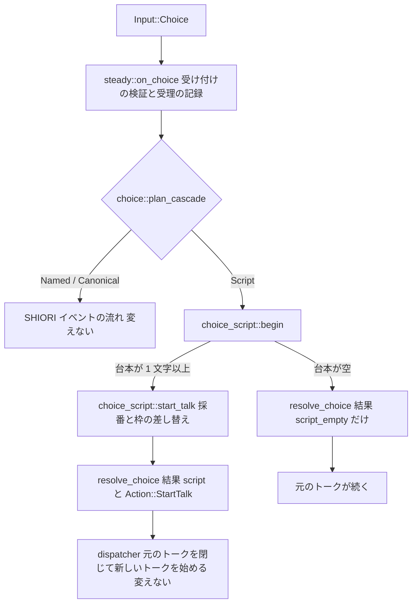
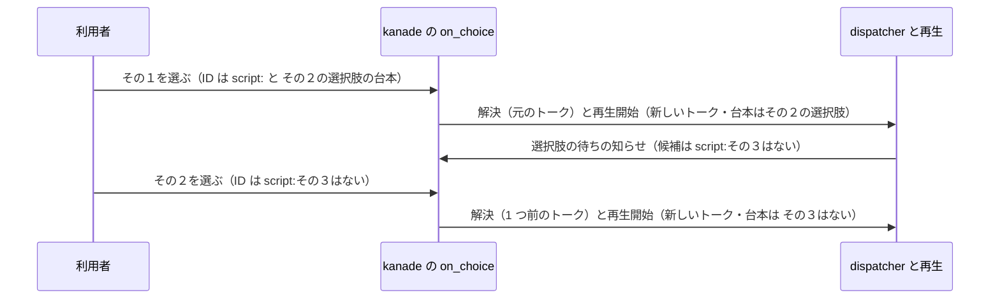

# Design Document: areka-P0-choice-script-prefix

## Overview

**Purpose**: `\q[タイトル,script:台本]` の選択肢を選んだときに、`script:` の後ろの台本を新しいトークとして再生する。今は「未対応」として選択肢の待ちを閉じるだけになっている 1 つの分かれ道を、「台本を実行する」に替える。

**Users**: 選択肢からその場で台本を走らせたいゴースト作者（SHIORI を通さずに、閉じる・次の選択肢を出す・開く系のタグを走らせる、を選択肢 1 つで書く）。

**Impact**: kanade（会話の進行を決める層）の選択肢の振り分けの結論が 1 つ変わる。選択肢の表示・選び方・待ち・タイムアウト・通常の選択肢のイベント・さくらスクリプトの読み方・翻訳（`OnTranslate`・MAKOTO）の経路・再生の仕組みは変えない。

### Goals

- `script:` の選択肢を選ぶと、その台本が新しいトークとして始まる（要件 1・2）。
- 空の `script:` と余分な引数を、会話を止めずに記録つきで扱う（要件 3）。
- 結末のどちらでも記録が残り、「未対応の選択肢」の警告は消える（要件 5）。
- 網羅台帳と互換の記録が今の動きと一致する（要件 6）。
- 分かれ道のすべてを実機なしのテストで固定する（要件 7）。

### Non-Goals

- `\__q[script:…]`（`range-choice-tag` が本仕様の道を使う）。
- 開く系のタグそのものの実行（`open-external-tags`）。
- 台本の出どころの印を運ぶ仕組み（`script-security-level`）・影響の段と同意の窓（`script-impact-tiers`）。
- `script:` の台本を翻訳に通すこと（要件 1.7 で通さないと決着済み）。
- 新しいトークを始める既存の 3 か所（`steady.rs` の `on_cascade_reply`・`on_timeout_reply`・`on_reply`）を 1 つの関数へ寄せる整理（本仕様は新しい道の分だけを作る）。
- MCP の `sakurascript` の実装（`mcp-kanade-tools`）。

## Boundary Commitments

### This Spec Owns

- 選択肢の ID が `script:` で始まるときの、受け付けた後の結末（台本で新しいトークを始める／空なので待ちを閉じるだけ）。
- その結末の記録の語彙（`choice_script_started`・`choice_script_empty`・`choice_script_unused_args`、解決の記録 `choice_resolved` の結果の語 `"script"`・`"script_empty"`）。
- 「台本 1 つを新しいトークとして始める」小さな関数（`start_talk`）。
- 網羅台帳の `\q[タイトル,script:実行内容]` の行と、`doc/choice-cascade-compat.md` の 7a の行、`doc/COMPAT_ARCHITECTURE.md` の選択肢の行の該当の句。

### Out of Boundary

- 選択肢を受け付けるかどうかの検証（候補に無い ID・遅れたクリック・二重の選択を捨てる）＝`on_choice` の前半。変えない。
- `On` で始まる ID・通常の ID の流れ（`OnChoiceSelectEx` → `OnChoiceSelect`）とタイムアウト。変えない。
- さくらスクリプトの読み込み（`areka-parsers` の本番のコード）と再生（`areka-sakura`・`areka-ghost`）。変えない。
- 翻訳の出口の規則（`schedule/translate.rs`）。触らない。
- `State`・`Action`・`Input`・`ChoiceInput` の型の形。変えない（新しい欄も新しい種類も足さない）。

### Allowed Dependencies

- `schedule/mod.rs` が公開している型と欄（`State` の `phase`・`next_talk_id`・`choice_prev_talk`、`ActiveTalk`、`Action::StartTalk`、`Phase::Steady`）を読む・書く。
- `crate::talk` の `StartTalk`・`TalkId`、`crate::msg` の `ChoiceInput`。
- `steady.rs` の `resolve_choice`（解決を発行する唯一の関数）は `steady.rs` の中からだけ呼ぶ。新しいファイルからは呼ばない。
- テストでは `schedule/log_capture.rs`（`capture`・`assert_logged`・`assert_not_logged`）を使う。新しいテストは `steady` の子の子になるので、`steady.rs` の `test_support` の補助（`steady_with_ledger`・`choice_input_of`）をそのまま使う（見える範囲は広げない）。
- `Cargo.*` には触らない（依存を足さない）。`areka-kanade` から `areka-parsers` への依存は作らない。

### Revalidation Triggers

- `start_talk` の引数・戻り値・前提（下の契約）を変えるとき → `mcp-kanade-tools`（`sakurascript`）・`range-choice-tag` が確かめ直す。
- `script:` の判定の規則（小文字の `script:` で始まる）や、ID を書き替えない約束を変えるとき → `range-choice-tag`・`link-context-copy`。
- `script:` の台本を翻訳に通すように変えるとき → 要件 1.7・6.2 と `doc/choice-cascade-compat.md` の記録の改訂が要る。
- 記録の語彙（上の 3 つの event 名と結果の語）を変えるとき → 記録を読むテストと実機の確認の手順。
- `ActiveTalk`・`StartTalk` に出どころの欄が足されたとき（`script-security-level`）→ 本仕様の `begin` で元のトークの値を引き継ぐ 1 か所を足す。

## Architecture

### Existing Architecture Analysis

- 選択肢を選ぶと、`steady.rs` の `on_choice` が ①受け付けの検証 → ②受理の記録 `choice_accepted` → ③`choice.rs` の純粋な関数 `plan_cascade` の結論で分岐、の順に動く。`script:` で始まる ID の結論は今 `CascadePlan::Unsupported` で、`on_choice` はその腕で警告 `choice_unsupported_category` を出し、`resolve_choice(…, "unsupported")` の 1 つだけを返す。
- 「選択肢の SHIORI イベントが台本を返したとき」の道（`on_cascade_reply` の `ShioriOutcome::Value` の腕）は、新しい `TalkId` を採番し、`Phase::Steady` の枠を新しい `ActiveTalk` に差し替え、元のトークの番号を `State::choice_prev_talk` に 1 世代だけ控え、`[resolve_choice(元), Action::StartTalk(新)]` をこの順で同じ一括に載せる。受け取った側（`areka-ghost` の dispatcher）は元のトークを閉じてから新しいトークを始め、元のトークの遅れた完了の知らせは捨てる。**本仕様はこの形をそのまま使う**。
- 選択肢のイベントが何も返さなかったとき（同じ関数の末尾の、残りの段が無い腕）は `[resolve_choice(元)]` だけを返し、元のトークが続く。**空の `script:` はこの形を使う**。
- 翻訳の出口の規則（`translate.rs` の `capture`）は、`translate::before` が作る材料の `script` が `Some` のとき＝入力が `Input::ShioriReply` で結果が台本のときだけ働く。`Input::Choice` から出す `Action::StartTalk` は捕まえられないので、何も足さなくても `script:` の台本は翻訳に通らない（要件 1.7）。
- `on_choice` は検証のために帳簿（`State::choice`）を `take()` で取り出しており、受理の後に戻さなければ帳簿（期限を含む）はそのまま消える（要件 1.3 のタイムアウトの計測の終わり）。
- `steady.rs` は 947 行。本仕様の後は `Unsupported` の腕が短くなり、子のファイルの宣言が 2 行増える（950 行前後＝1,000 行未満を保つ）。

### Architecture Pattern & Boundary Map



**Architecture Integration**:

- 選んだ形: 既存の「純粋な判定（`choice.rs`）＋調停（`steady.rs`）」の分け方を保ち、`script:` の後ろを取り出す純粋な関数は `choice.rs` に、状態を書き替えて記録を出す結末は `steady.rs` の子の新しいファイルへ置く（`choice.rs` は「判断の分かれ道だけ・記録も出さない」層のまま。設計ディスカッション議題 1）。`on_choice` の腕は呼び出しの付け替えだけになる。
- 解決（`Action::ResolveChoice`）を発行する場所は `steady.rs` の `resolve_choice` の 1 か所のまま（「1 回の選択につき解決は高々 1 回」を、発行する場所が 1 つであることで保つ）。新しいファイルは解決を作らない。
- 新しい再生の仕組み・新しい入力・新しい状態の欄は作らない。
- 依存の向き: `steady_choice_script.rs` → `schedule/mod.rs` の型（読む・書く）。`steady_choice_script.rs` → `choice.rs` の `script_body`（呼ぶ）。`steady.rs` → `choice.rs`・`steady_choice_script.rs`（呼ぶ）。逆向きの呼び出しは作らない。

### Technology Stack

| Layer | Choice / Version | Role in Feature | Notes |
|-------|------------------|-----------------|-------|
| 会話の進行（kanade） | Rust・既存の `areka-kanade` | 判定と結末の実装 | 依存の追加なし |
| 記録 | 既存の `tracing`（`target: "kanade"`） | 結末の記録 | 語彙を 3 つ足し 1 つ消す |
| 文書 | TOML（網羅台帳）・Markdown | 対応状況の更新 | 報告は `ukadoc-survey` が作り直す |

## File Structure Plan

### Directory Structure

```
crates/areka-kanade/src/schedule/
├── choice.rs                 # 変更: 結論の名前を Script に・純粋な関数 script_body・正典 URL の行
├── steady_choice_script.rs          # 新規: script: の結末（begin・start_talk）
├── steady_choice_script_tests.rs    # 新規: 上のテスト（最上位の step から通す）
└── steady.rs                 # 変更: on_choice の Script の腕を呼び出しに付け替え・子のファイルの宣言
```

### Modified Files

**ウェーブ C4 の約束の内**

- `crates/areka-kanade/src/schedule/choice.rs`
  - `CascadePlan::Unsupported` を `CascadePlan::Script` に改名し、説明を「`script:` の後ろの台本を新しいトークとして始める」に替える。
  - 純粋な関数 `script_body` を足し、`plan_cascade` の `script:` の腕は `script_body(id).is_some()` で判定する（`"script:"` の綴りを 1 か所に置く）。この腕の定義行に、正典 URL のコメント 1 行（`// ukadoc: https://ssp.shillest.net/ukadoc/manual/list_sakura_script.html#_5cq_5b_30bf_30a4_30c8_30eb_2cscript_3a_5b9f_884c_5185_5bb9_5d:1`）を置く（網羅台帳の `implemented` の根拠）。
  - ファイルの先頭の説明（「判断の分かれ道だけ・記録も出さない」）、`CascadePlan` と `plan_cascade` の説明（「未対応」「裁定 7」の句）、近い綴りのテストの言い回しを今の動きに合わせる。
  - ファイル内のテスト `plan_cascade_unsupported_for_script_prefix` と、`script:` を含む決定論のテストを新しい名前に合わせる（境目の ID `script`・`Script:x`・`xscript:y` が通常の選択肢になる確認は今のまま残す）。
- `crates/areka-kanade/src/schedule/steady_choice_script.rs`（新規）— 下の「Components and Interfaces」の `begin`・`start_talk`。末尾に `#[cfg(test)] #[path = "steady_choice_script_tests.rs"] mod tests;`。
- `crates/areka-kanade/src/schedule/steady_choice_script_tests.rs`（新規）— 「Testing Strategy」の kanade の項目。
- `crates/areka-kanade/src/schedule/steady.rs`
  - `on_choice` の `CascadePlan::Unsupported` の腕を、`choice_script::begin` を呼んで `resolve_choice` と並べる数行に替える（警告 `choice_unsupported_category` と結果の語 `"unsupported"` は消える）。
  - `use` の行、`on_choice` の説明の該当の 1 項、`resolve_choice` の説明の「未対応カテゴリの即時解決」の句を今の動きに合わせる。
  - 子のファイルの宣言 `#[path = "steady_choice_script.rs"] mod choice_script;` を置く（`schedule/mod.rs` に宣言を足さない）。
  - 受理の記録 `choice_accepted` は event 名も欄も変えない。添えた文言「カスケードを開始」だけ、`script:` にも当たる言い回しに直す。

**ウェーブ C4 の約束の外（2026-10-05 設計ディスカッション議題 2 で開発者が 4 つとも了解）**

| ファイル | 触り方 | 理由 | 並走との重なり |
|---|---|---|---|
| `crates/areka-kanade/src/schedule/mod.rs` | `Action::ResolveChoice` の説明のコメントの 1 句（「未対応カテゴリの即時解決」→「`script:` の選択肢の解決」）。コードは変えない | 説明が今の動きと食い違うのを残さない | `balloon-lifecycle-events` が同じファイルを触る。コメント 1 行なので、重なるなら後に入る側が直せば済む |
| `crates/areka-kanade/src/schedule/steady_choice_tests.rs` | テスト `unsupported_choice_resolves_without_emitting_any_event` を消す（消すだけ） | 要件 7.4（古い前提のテストを残さない）。同じ確認は新しい `steady_choice_script_tests.rs` が持つ | なしの見込み |
| `crates/areka-kanade/src/schedule/schedule_log_firing_tests.rs` | テスト `warn_choice_unsupported_category_logs` を消す（消すだけ） | 同上。新しい警告の確認は `steady_choice_script_tests.rs` が持つ | なしの見込み |
| `crates/areka-parsers/src/sakura/decode_tests.rs` | 正典の入れ子の記述例の読みのテストを 1 本足す（本番のコードは変えない） | 要件 2.2・7.2 の「読み」は読み込みの層でしか確かめられない（kanade は読み込みに依存しない） | `open-external-tags` が同じ列（`decode.rs`）を触る。テストのファイルに 1 本足すだけ |

**文書（要件 6）**

- `doc/ukadoc-coverage/ledger/sakura-script.toml` — `\q[タイトル,script:実行内容]` の行（`ukadoc:list_sakura_script:_5cq_5b_30bf_30a4_30c8_30eb_2cscript_3a_5b9f_884c_5185_5bb9_5d:1`）の `status` を `"implemented"`・`owner` を `"areka-P0-choice-script-prefix"` にし、`note` を今の動きに書き替える（`links`・`priority`・`values`・`introduced` は変えない）。
- `doc/ukadoc-coverage/report/sakura-script.md`・`doc/ukadoc-coverage/report/summary.md` — 手で直さず `cargo run -p ukadoc-survey -- report` と `cargo run -p ukadoc-survey -- report-summary` で作り直す。
- `doc/choice-cascade-compat.md` — 7a-i・7a-ii の行を書き替え、正典が黙っている所の決めごとの行を足す（下の「文書の更新」）。
- `doc/COMPAT_ARCHITECTURE.md` — 選択肢の行の「`script:` 前置と CROW 複数 ID 形の M1 非対応縮退」の句から `script:` を外し、「`script:` 前置の正典が黙っている所の決めごと」を挙げる。

## System Flows

正典の入れ子の記述例 `\q[その１,"script:\q[その２,script:その３はない]"]` の流れ。



- どちらの段でも SHIORI への往復と翻訳の依頼は 0 回。
- 解決と再生開始は同じ一括で渡る（要件 1.3）。順は「解決 → 再生開始」で、`on_cascade_reply` の `Value` の腕と同じ。

### 保留中の終了・切替・利用者の中断との重なり

`on_cascade_reply` の `Value` の腕は、保留中の終了（`pending_close`）・切替・利用者の中断の帳簿・シェル切替の見張りに一切触れずに枠だけを差し替える。本仕様の `begin` も同じく触れない。したがって、それらが重なったときの動きは「選択肢の SHIORI イベントが台本を返したとき」と同じになる。本仕様で新しい取り決めは作らない。

## Requirements Traceability

| Requirement | Summary | Components | Interfaces | Flows |
|-------------|---------|------------|------------|-------|
| 1.1 | `script:` の後ろを新しいトークで再生 | `steady::choice_script` | `begin`・`start_talk` | 分岐図の Script の枝 |
| 1.2 | SHIORI のイベントを起こさない | `on_choice` の Script の腕 | 返す一括に `Action::ShioriRequest`・`Action::Translate` を含めない | 流れ図 |
| 1.3 | 待ちを同じときに閉じる | `on_choice` の Script の腕 | `[resolve_choice, StartTalk]` を 1 つの一括で返す・帳簿を戻さない | 流れ図 |
| 1.4 | 元のトークを置き換える | `steady::choice_script` | `start_talk`（枠の差し替え）・`begin`（`choice_prev_talk` の控え） | 既存の dispatcher の動き |
| 1.5 | 応答の台本と同じ読み方・再生 | `steady::choice_script` | 台本の文字列を加工せず `StartTalk` に渡す | — |
| 1.6 | 小文字の `script:` だけ | `choice.rs` | `script_body`・`plan_cascade` | — |
| 1.7 | 翻訳に通さない | （既存の `translate.rs` の規則のまま） | `Input::Choice` 由来の `StartTalk` は捕まえられない | — |
| 2.1 | `\e` の例 | `steady::choice_script` | `begin`（台本 `\e`） | — |
| 2.2 | 入れ子の第 2 引数の読み | （既存の読み込み・変更なし） | `decode_tests.rs` のテストで固定 | — |
| 2.3 | 「その１」→ 選択肢「その２」 | `steady::choice_script` | `begin` | 流れ図の 1 段目 |
| 2.4 | 「その２」→「その３はない」 | `steady::choice_script` | `begin` | 流れ図の 2 段目 |
| 2.5 | 開く系のタグは応答の台本と同じ | `steady::choice_script` | 台本を加工しない（1.5 と同じ） | — |
| 3.1 | 空の `script:` は始めず警告・待ちを閉じる | `steady::choice_script`・Script の腕 | `begin` が `None`・`choice_script_empty`・`resolve_choice(…, "script_empty")` | 分岐図の空の枝 |
| 3.2 | 空なら元のトークを続ける | Script の腕 | `[resolve_choice]` だけ・枠を変えない | 分岐図の空の枝 |
| 3.3 | 第 3 引数以降は使わず数を記録 | `steady::choice_script` | `begin` が `input.references` をどこへも渡さない・`choice_script_unused_args`（`count`） | — |
| 4.1 | 元と同じ出どころ・制限を足さない | `steady::choice_script` | `start_talk`（他のトークと同じ `Action::StartTalk` の入口） | — |
| 4.2 | 区別が無い間は応答の台本と同じ扱い | `steady::choice_script` | 同上 | — |
| 5.1 | 実行の記録 1 件 | `steady::choice_script` | `choice_script_started`（info・`choice_id`・`talk_id`・`prev_talk_id`） | — |
| 5.2 | 未対応の警告を出さない | `steady.rs` | `choice_unsupported_category` を消す | — |
| 5.3 | 記録なしで終わる道が無い | `steady::choice_script`・Script の腕 | 下の「結末と記録の表」 | — |
| 6.1 | 網羅台帳の行 | 文書 | `sakura-script.toml`・`choice.rs` の正典 URL の行 | — |
| 6.2 | 互換の記録 | 文書 | `choice-cascade-compat.md`・`COMPAT_ARCHITECTURE.md` | — |
| 6.3 | 台帳の検査が通る | 文書 | `report`・`report-summary` の作り直しと `cargo test -p ukadoc-survey` | — |
| 7.1 | `\e` の例のテスト | `steady_choice_script_tests.rs` | テスト 1 | — |
| 7.2 | 入れ子の例のテスト | `decode_tests.rs`・`steady_choice_script_tests.rs` | テスト 2・テスト 6 | — |
| 7.3 | 空・余分な引数・境目の ID のテスト | `steady_choice_script_tests.rs`・`choice.rs` のテスト | テスト 3・4・5・5b | — |
| 7.4 | 古い前提のテストを残さない | 既存のテスト 3 本 | 改名 1 本・削除 2 本 | — |

## Components and Interfaces

| Component | Domain/Layer | Intent | Req Coverage | Key Dependencies | Contracts |
|-----------|--------------|--------|--------------|------------------|-----------|
| `choice.rs` の `plan_cascade`／`CascadePlan::Script` | kanade・純粋な判定 | `script:` の ID を「台本を実行する」結論にする | 1.6 | `script_body`（P0） | Service |
| `steady_choice_script.rs`（`schedule::steady::choice_script`） | kanade・結末 | 空と余分な引数の判定・新しいトークの開始・記録 | 1.1, 1.4, 1.5, 2.1, 2.3, 2.4, 2.5, 3.1, 3.3, 4.1, 4.2, 5.1, 5.3 | `State`・`ActiveTalk`・`StartTalk`（P0） | Service, State |
| `steady.rs` の `on_choice` の Script の腕 | kanade・調停 | 結末を受けて解決と並べて返す | 1.2, 1.3, 3.1, 3.2, 5.2, 5.3 | `choice_script::begin`・`resolve_choice`（P0） | Service |

### kanade の選択肢

#### `steady_choice_script.rs`（モジュール `schedule::steady::choice_script`）

| Field | Detail |
|-------|--------|
| Intent | `script:` の選択肢を受け付けた後の結末を決め、台本があれば新しいトークを始める |
| Requirements | 1.1, 1.4, 1.5, 2.1, 2.3, 2.4, 2.5, 3.1, 3.3, 4.1, 4.2, 5.1, 5.3 |

**Responsibilities & Constraints**

- `script:` の後ろの文字列を 1 バイトも加工せずに台本として扱う（括りを外すのは読み込みの層が済ませている）。
- 解決（`Action::ResolveChoice`）は作らない。選択肢の帳簿（`State::choice`）にも触らない（`on_choice` が取り出し済み）。
- SHIORI への往復・翻訳の依頼を作らない。
- 記録を出さずに戻る道を持たない。

**Dependencies**

- Inbound: `steady.rs` の `on_choice` — Script の腕から `begin` を呼ぶ（P0）。
- Outbound: `choice.rs` の `script_body`（P0）。`schedule/mod.rs` の `State`・`ActiveTalk`・`Phase`・`Action`（P0）。`crate::talk` の `StartTalk`・`TalkId`（P0）。

**Contracts**: Service [x] / API [ ] / Event [ ] / Batch [ ] / State [x]

##### Service Interface

```rust
/// 選択肢の ID が `script:` で始まるとき、その後ろの台本を返す（純粋・記録なし）。
/// 判定はバイト列の前方一致で、大文字小文字を区別する。置き場は `choice.rs`（純粋な層）。
pub(crate) fn script_body(id: &str) -> Option<&str>;

/// `script:` の選択肢を受け付けた後の結末を決める。
/// 台本が 1 文字以上なら新しいトークを始めて `Some(Action::StartTalk(..))` を返し、
/// 空なら何も始めず `None` を返す。
pub(in crate::schedule) fn begin(
    state: &mut State,
    prev_talk_id: TalkId,
    input: &ChoiceInput,
) -> Option<Action>;

/// 台本 1 つを新しいトークとして始める（採番・枠の差し替え・再生開始の行動を返す）。
pub(in crate::schedule) fn start_talk(
    state: &mut State,
    origin: &'static str,
    script: String,
) -> (TalkId, Action);
```

**`script_body`**

- 事後条件: `id` が `script:` で始まれば `Some(残り)`（残りが空なら `Some("")`）。それ以外（`script`・`Script:x`・`xscript:y`・空文字列）は `None`。

**`begin`**

- 事前条件: `on_choice` の検証を通った後で、`state.phase` は `Phase::Steady { talk: Some(元のトーク) }`、`prev_talk_id` はそのトークの番号、`plan_cascade(&input.id)` は `CascadePlan::Script`。
- 手順と事後条件:
  1. `input.references` が 1 つ以上あれば、警告 `choice_script_unused_args`（`choice_id`・`talk_id` = 元のトーク・`count` = 個数）を 1 件出す。`references` の中身はどこへも渡さない（要件 3.3）。
  2. `body(&input.id)` が空（または、構造上は起きないが `None`）なら、警告 `choice_script_empty`（`choice_id`・`talk_id` = 元のトーク）を 1 件出し、`state` を変えずに `None` を返す（要件 3.1）。
  3. それ以外は `start_talk(state, "choice_script", 台本)` を呼び、`state.choice_prev_talk = Some(prev_talk_id)` を書き（元のトークの遅れた完了の知らせをエラーにしないための 1 世代の控え。`on_cascade_reply` の `Value` の腕と同じ）、情報の記録 `choice_script_started`（`choice_id`・`talk_id` = 新しいトーク・`prev_talk_id` = 元のトーク）を 1 件出して `Some(再生開始の行動)` を返す（要件 1.1・1.4・5.1）。
- 不変条件: `state.choice` と、保留中の終了・切替・中断の欄には触れない。

**`start_talk`**

- 事前条件: 呼び手が、`Phase::Steady` の枠に新しいトークを置いてよいと決めている（選択肢の帳簿・`choice_prev_talk`・解決は呼び手の仕事）。
- 事後条件: `TalkId(state.next_talk_id)` を新しい番号とし、`state.next_talk_id` を 1 進め、`state.phase` を `Phase::Steady { talk: Some(ActiveTalk { talk_id, origin, script }) }` にし、`(番号, Action::StartTalk(StartTalk::new(番号, script)))` を返す。記録は出さない（呼び手が自分の語彙で出す）。
- 後の `mcp-kanade-tools` の `sakurascript` は、この関数を「台本 1 つを渡してトークを始める口」として呼べる（置き換えのときの帳簿の掃除は呼び手側で行う。置き場を移すのも自由）。本仕様ではそのための追加の作りは置かない。

##### State Management

- 書く欄: `State::phase`・`State::next_talk_id`・`State::choice_prev_talk` の 3 つだけ（どれも `on_cascade_reply` の `Value` の腕が書く欄と同じ）。
- 新しいトークの `ActiveTalk::origin` は固定の語 `"choice_script"`（何がトークを始めたかを示す記録用のラベル。今はどこからも読まれない）。

**Implementation Notes**

- 出どころ（要件 4）: 今の `ActiveTalk`・`StartTalk` には出どころの区別が無く、`script:` の台本は他のトークと同じ `Action::StartTalk` の入口から始まるので、扱いは SHIORI の応答の台本と変わらない。`script-security-level` が出どころの欄を足したら、`begin` が枠を差し替える前に元の `ActiveTalk` から値を読み、新しいトークへ写す（引き継ぎは `begin` の 1 か所）。
- 括り忘れ: `\q[メモ帳を開く,script:\![open,file,notepad.exe]]` は ID が `script:\![open`・余分な引数が 2 個になる。台本 `\![open` は応答の台本と同じ読み方で扱われ（要件 1.5）、`choice_script_unused_args` の `count = 2` で括り忘れに気付ける。

#### `steady.rs` の `on_choice` の Script の腕

| Field | Detail |
|-------|--------|
| Intent | `begin` の結末を、解決と並べて 1 つの一括で返す |
| Requirements | 1.2, 1.3, 3.1, 3.2, 5.2, 5.3 |

**Responsibilities & Constraints**

- `choice_script::begin(&mut state, talk_id, &input)` を**先に**呼ぶ（`resolve_choice` は解決の記録 `choice_resolved` を出すので、後に呼ぶことで下の表の記録の順になる）。
- 結果の語を決める: 戻り値が `Some` なら `"script"`、`None` なら `"script_empty"`。
- `resolve_choice(talk_id, input.id, 結果の語)` を先頭に、再生開始の行動があればその後ろに並べて返す。帳簿（`ledger`）は戻さない。
- 警告 `choice_unsupported_category` と結果の語 `"unsupported"` は消す。

**Contracts**: Service [x]

- 事後条件（台本あり）: 返す一括は `[Action::ResolveChoice { talk_id: 元, id }, Action::StartTalk(新)]` のちょうど 2 つ・この順。`state.choice` は `None`。
- 事後条件（空）: 返す一括は `[Action::ResolveChoice { talk_id: 元, id }]` のちょうど 1 つ。`state.phase`・`state.next_talk_id` は変わらない。`state.choice` は `None`。
- `Action::ResolveChoice` の `id` は選択肢の ID をそのまま（`script:` を外さない。今の `Unsupported` の腕と同じ）。

### 結末と記録の表（要件 5.3）

`script:` の選択肢を受け付けた後の道はこの 2 つで全部である。受理の記録 `choice_accepted`（info・`plan = Script`）はどちらでも先に出ている。

| 結末 | 条件 | 返す一括 | 記録（出る順） |
|---|---|---|---|
| 台本を始めた | `script:` の後ろが 1 文字以上 | 解決 → 再生開始 | （余分な引数があれば warn `choice_script_unused_args`）→ info `choice_script_started` → info `choice_resolved`（`outcome = "script"`） |
| 空で閉じた | `script:` の後ろが 0 文字 | 解決だけ | （余分な引数があれば warn `choice_script_unused_args`）→ warn `choice_script_empty` → info `choice_resolved`（`outcome = "script_empty"`） |

記録はすべて `target: "kanade"`。段は、実行の記録が受理の記録と同じ info（要件 5.1）、作者の書き損じの疑い（空・余分な引数）が warn。

### 文書の更新（要件 6）

- **網羅台帳の `note`**: 「壊れ方」「ログ」の 2 行の形を保って、今の動きを書く — 選ぶと `script:` の後ろを新しいトークとして再生する（SHIORI のイベントも翻訳も通さない）・空の `script:` は警告を出して待ちを閉じるだけ・第 3 引数以降は使わず警告に数を残す・記録は `choice_script_started`／`choice_script_empty`／`choice_script_unused_args`。転記元・兄弟の ID・テーマ・頻度の角括弧の行は残す。
- **`doc/choice-cascade-compat.md`**: 7a-i の「語彙は…未対応カテゴリとして表現する」の欄を、実行する結論（`CascadePlan::Script`）に改める。7a-ii を「`script:` の後ろを新しいトークとして再生する（`areka-P0-choice-script-prefix`）」に書き替え、出どころを `ukadoc`（「選択後、script:以下の内容をさくらスクリプトとして実行する」）にする。続けて、正典が黙っている所の areka の決めごとを出どころ `areka_discretion` で 4 行足す:
  1. SHIORI のイベント（`OnChoiceSelectEx`・`OnChoiceSelect`・`On` で始まる名前のイベント）を起こさない。
  2. 翻訳（`OnTranslate`・MAKOTO）に通さない。理由＝選択肢を含んでいた元の台本が翻訳を通るときに一部として 1 回通っており、もう一度通すと台本全体を置き換える翻訳が二重に掛かる。併記＝タグの中を避けて翻訳するゴーストでは、`script:` の台本は翻訳されないまま再生される。
  3. 第 3 引数以降は使わない（台本に含めず、どこへも渡さず、数を警告に残す）。
  4. 空の `script:` は新しいトークを始めず、警告を出して待ちを閉じるだけ（元のトークが続く）。
  - 同じ文書の下の方にある根拠の表にも 7a の行があるので、上の書き替えと食い違わないように合わせる。
- **`doc/COMPAT_ARCHITECTURE.md`**: 選択肢の行の列挙から `script:` の縮退を外し、「`script:` 前置の正典が黙っている所の決めごと（イベントなし・翻訳なし・余分な引数・空）」を挙げる（詳細は `choice-cascade-compat.md` を指すまま）。

## Error Handling

### Error Strategy

選択肢まわりの失敗は会話を止めない（既存の方針）。本仕様に、失敗して止まる道は無い。

| 場合 | 扱い | 記録 |
|---|---|---|
| 空の `script:` | トークを始めず、待ちを閉じて元のトークを続ける | warn `choice_script_empty` |
| 余分な引数 | 使わずに台本を実行する | warn `choice_script_unused_args`（`count`） |
| 崩れた書き方の台本（閉じない角括弧など） | 応答の台本と同じ読み込みの寛容な扱いに任せる（本仕様は判定しない） | 読み込み・再生の側の既存の記録 |
| 候補に無い ID・遅れたクリック・二重の選択 | `on_choice` の検証が今までどおり捨てる（`begin` まで来ない） | 既存の `choice_rejected_*` |

### Monitoring

`choice_accepted`（`plan = Script`）→ `choice_script_started` または `choice_script_empty` → `choice_resolved` の並びで、選択肢から何が走ったかを後から追える。

## Testing Strategy

実機なしで毎回同じ結果になるテストだけを置く。固定するのは判定の分かれ道で、既存の配線（dispatcher が元のトークを閉じる・再生が `\e` で閉じる・再生が選択肢の待ちに入る）は確かめ直さない。

### kanade（`steady_choice_script_tests.rs`・最上位の `schedule::step` から `Input::Choice` を通す）

1. **`\q[バルーンを閉じる,script:\e]`**（要件 7.1・1.1〜1.4・1.7・2.1・5.1・5.2）: 候補 `script:\e` の待ちがある状態で ID `script:\e` を選ぶ。返る一括がちょうど `[ResolveChoice{元, "script:\e"}, StartTalk{新, "\e"}]` であること（`Action::ShioriRequest`・`Action::Translate` が無い）、帳簿が消えること、枠が新しいトーク（台本 `\e`・`origin = "choice_script"`）であること、`choice_prev_talk` が元のトークであること、採番が 1 進むこと。記録に info `choice_script_started`（3 つの欄）と `choice_resolved`（`outcome = "script"`）があり、`choice_unsupported_category` と `choice_script_unused_args` が無いこと。
2. **入れ子の例の 2 段**（要件 7.2・2.3・2.4）: ID `script:\q[その２,script:その３はない]` を選ぶと `StartTalk` の台本が `\q[その２,script:その３はない]` であること。続けて、新しいトークの選択肢の待ちの知らせ（`Input::ChoiceWaiting`・候補 `script:その３はない`）を入れ、ID `script:その３はない` を選ぶと `StartTalk` の台本が `その３はない` であること。
3. **空の `script:`**（要件 7.3・3.1・3.2・5.3）: ID `script:` を選ぶと、返る一括がちょうど `[ResolveChoice{元, "script:"}]`、枠と採番が変わらず、帳簿が消えること。記録に warn `choice_script_empty` と info `choice_resolved`（`outcome = "script_empty"`）があること。
4. **第 3 引数以降**（要件 7.3・3.3）: ID `script:\![open`・付随の引数 `file`・`notepad.exe` で選ぶと、`StartTalk` の台本が `\![open` だけであること、記録に warn `choice_script_unused_args`（`count = 2`）があること。

### kanade（`choice.rs` のファイル内のテスト）

5. **判定の境目**（要件 7.3・1.6）: `plan_cascade` が `script:\e`・`script:`・`script:OnFoo` を `CascadePlan::Script`、`script`・`Script:x`・`xscript:y` を `CascadePlan::Canonical` にすること（既存のテストの名前と期待の型名を直す）。

### kanade（`steady_choice_script_tests.rs` にもう 1 本）

5b. **境目の ID の扱いと記録**（要件 7.3）: 最上位の `schedule::step` から ID `Script:x` を選ぶと、返る一括が `OnChoiceSelectEx` の依頼 1 つ（解決も再生開始も無い）で、記録に `choice_script_started`・`choice_script_empty`・`choice_script_unused_args` が 1 つも無いこと。`script`・`xscript:y` は同じ腕を通るので、判定はテスト 5 に任せて繰り返さない。

### 読み込み（`crates/areka-parsers/src/sakura/decode_tests.rs` に 1 本）

6. **入れ子の例の読み**（要件 7.2・2.2）: `\q[その１,"script:\q[その２,script:その３はない]"]` を読むと、選択肢 1 つ（表示 `その１`・ID `script:\q[その２,script:その３はない]`・付随の引数なし）になること。その ID から `script:` を外した `\q[その２,script:その３はない]` を読むと、ID が `script:その３はない` の選択肢になること。

### 消すテスト（要件 7.4）

- `steady_choice_tests.rs` の `unsupported_choice_resolves_without_emitting_any_event`（テスト 1・3 が置き換える）。
- `schedule_log_firing_tests.rs` の `warn_choice_unsupported_category_logs`（テスト 3・4 が置き換える。新しい警告 2 つの確認は `steady_choice_script_tests.rs` に置き、このファイルには足さない）。

### 文書の検査（要件 6.3）

- `cargo run -p ukadoc-survey -- report`・`cargo run -p ukadoc-survey -- report-summary` の後、`cargo test -p ukadoc-survey` が通ること（`implemented` の根拠＝`choice.rs` の正典 URL の行が拾われること）。

## Supporting References

- 判断の経緯（解決を発行する場所・結論の名前・`origin` と記録の形・`sakurascript` の口・読みのテストの置き場）は `research.md` の「9. 設計の段の決定」。
