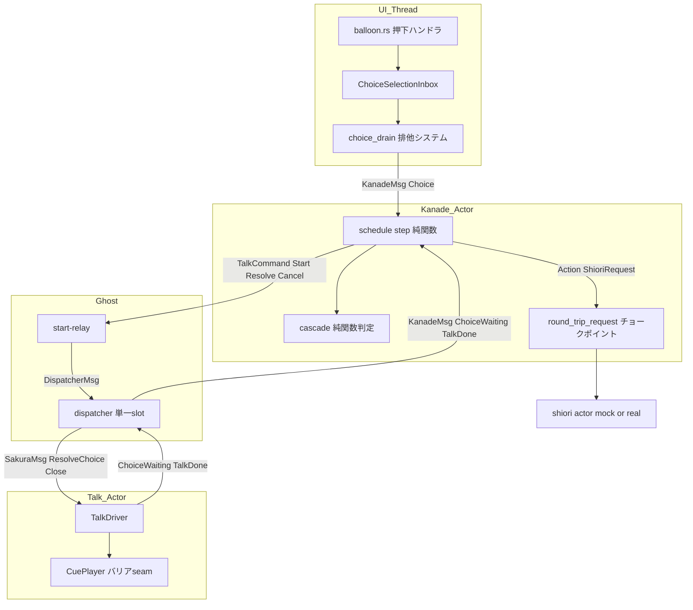
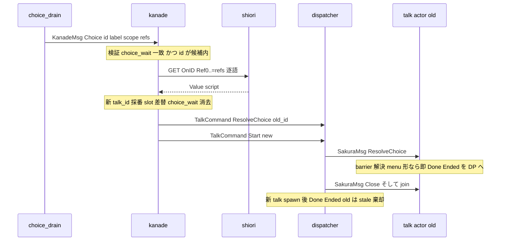
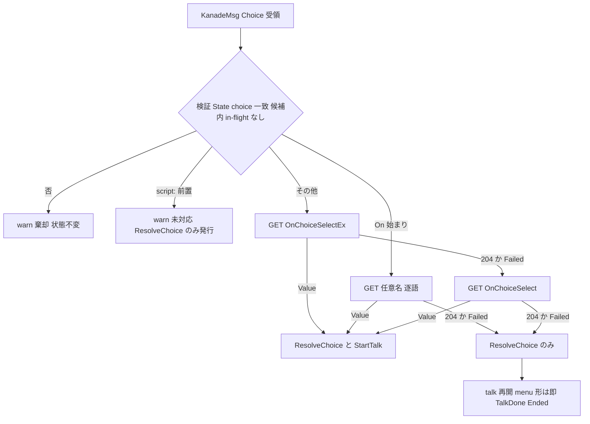
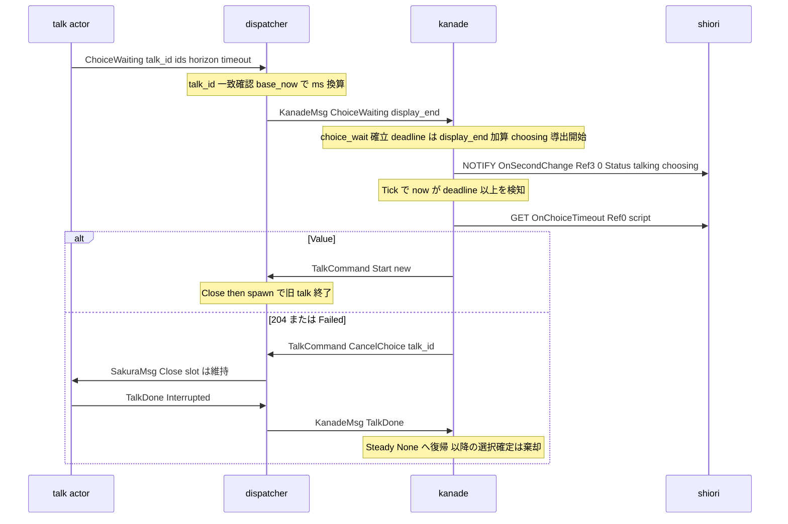

# 技術設計書 — areka-P0-choice-select-events

> 生成: 2026-07-31（design フェーズ）／入力: `requirements.md`（Req1〜9）・`research.md`（ギャップ分析＋DD-1〜DD-16）・`brief.md`・`.kiro/steering/`
> 実測アンカーは本ワークツリー HEAD（branch `claude/areka-p0-choice-select-events-914e0c`）で 2026-07-31 に再検証済み。

## Overview

**Purpose**: バルーン上で確定した選択肢（選択確定通知 `ChoiceSelection`）を SHIORI へ ukadoc 準拠のカスケード（`OnChoiceSelectEx`→`OnChoiceSelect`・`On` 始まり任意名の直接発火）で届け、応答を既存トーク起動経路へ合流させ、同時にトーク側の選択待ちバリアを正規の型付き入力で解決して会話を継続させる。選択待ち中の実行状態 `choosing` と選択肢タイムアウト規律（起点＝トーク表示完了・既定値・`OnChoiceTimeout`・204 で解除）も本設計で確定する。

**Users**: ukadoc 互換資産を持つゴースト作者・利用者（M1 適合対象は実 emo2＋実 pasta.dll）。emo2 のメニュー（ダブルクリック→メニュー→項目選択→サブメニュー→もどる→閉じる）が一周することが到達目標。

**Impact**: 上流（choice-interact / sakura-dialogue-tags / cue-playback / input-events / idle-talk）が着地させた「発生源・バリア解決口・`Status` 語彙」を**結ぶ駆動側 1 本**を新設する。編集の支配的性格は「新規ロジック」より「既存の型の壁を additive に開ける」であり、5 クレート（areka bin / areka-kanade / areka-talk / areka-sakura / areka-ghost）＋ dola に小さな増分が入る。

### Goals

- 1 回の選択確定＝高々 1 回のカスケード・高々 1 回のバリア解決・高々 1 つの StartTalk（Req1.1/4.6/5.4）。
- `\q` の全書式（正典形・OnID 任意名形）のカスケード判定を**純関数**として確定し、全判断分岐を mock SHIORI・注入通知・注入時刻のみで檻に入れる（Req2.5/9.1/9.2）。
- 選択待ち中の `Status: choosing` 導出と、areka 側調停のみで成立する自発トーク抑止（Req6）。
- 選択肢タイムアウトの完全語彙（既定／無効化／明示値）と既定値の確定・対応表記録（Req7/8）。
- 実機（実 emo2・実 pasta・実 DPI）でメニュー一周の人間サインオフ（Req9.3/9.4）。

### Non-Goals

- 選択肢の表示・行ジオメトリ・hover・クリック解決（`areka-P0-choice-interact` 完了成果の消費のみ）。
- `\q`／`\![set,choicetimeout]`／`\*` 等さくらスクリプトタグの**解釈**・cue へのコンパイル（`compile.rs` は触らない。タイムアウト値の供給は追跡 spec `areka-P0-sakura-time-directives` の領分）。
- `script:` 前置 ID のスクリプト直接実行（M1 明示縮退・Req2.7）・アンカー系（`\_a`）・`OnChoiceEnter`/`OnChoiceHover`・ホイール・owner-draw。
- メニュー一周の適合判定そのもの（下流 `areka-P0-emo2-conformance-e2e`）。

## Boundary Commitments

### This Spec Owns

- **選択確定の配送経路**: `ChoiceSelectionInbox` の drain（areka bin）→ `KanadeMsg::Choice` → kanade 調停（受領・一回性・棄却・カスケード・Reference 割付・StartTalk 合流・バリア解決指示・タイムアウト計測）→ `TalkCommand`（解決／中断指示）→ dispatcher 中継。
- **カスケード判定の純関数**と選択関連イベントの Reference 構築関数（events.rs 様式）。
- **「選択待ち中」事実の搬送経路**: talk アクター発 `ChoiceWaiting` 通知（候補 id・表示完了時刻・タイムアウト指令）→ dispatcher 換算 → kanade 帳簿。
- **`choosing` の導出**（`ExecutionSnapshot` への 1 フィールド追加と導出表 1 行の差し替え）。
- **タイムアウトの完全語彙と既定値**（`KanadeConfig.choice_timeout_default_ms`）・計測・`OnChoiceTimeout` 発行・204 時の解除経路。
- **互換対応表** `doc/choice-cascade-compat.md`（新設）と `doc/emo2-conformance-scope.md:24` の訂正。
- 上記全判断分岐の決定論檻＋実機サインオフ手順。

### Out of Boundary

- `ChoiceSelection` の発行判定（表示中判定・ヒット確定・一度きり発行）＝ choice-interact 所有（`crates/areka/src/input_events/balloon.rs` の押下ハンドラ群は無改変）。
- `CuePlayer` のバリア状態機械・`resolve_choice` の照合意味論（dola 所有・本設計は照会 getter 1 本のみ additive 追加）。
- `SakuraMsg` の口の形（sakura-dialogue-tags 確定済み・本設計は**投函するだけ**）。
- `Status` ヘッダの書式（連結順序・区切り・空集合省略）＝ idle-talk 確定済み `status.rs` の送出契約（無改変）。
- compile の barrier 発行（`timeout: None` のまま・値の供給は time-directives）。
- 他の実行状態 8 種の導出（`areka-P0-status-execution-states` 台帳）。

### Allowed Dependencies

- 上流実物: `ChoiceSelection`/`ChoiceSelectionInbox`（balloon.rs:43/:130）・`SakuraMsg::ResolveChoice`（contract.rs:38）＋`on_resolve_choice`（drive.rs:350-419）・`CuePlayer` バリア seam（runtime.rs）・`ExecutionState::Choosing`（status.rs:26/:60）・kanade StartTalk 棚（steady.rs:159-217）・dispatcher 単一 slot（dispatcher.rs）。
- 依存方向: areka bin → areka-ghost → areka-kanade / areka-sakura → areka-talk / dola。**逆方向 import 禁止**（kanade は sakura/dola を知らない——授受は areka-talk の契約型のみ）。
- 新規 crates.io 依存なし・tokio 不使用（Rust 2024・std mpsc・areka-actor）。

### Revalidation Triggers

- kanade→ghost チャンネルの型変更（`Sender<StartTalk>` → `Sender<TalkCommand>`）: ghost 結線・`MockSakura`・spine e2e の再確認。
- `ShioriCall.id` の `EventId` 化: mock/real 両 SHIORI バックエンド・kanade 檻ヘルパの一括適応。
- `spawn_talk` の done 境界拡張（`D: From<TalkDone> + From<ChoiceWaiting>`）: sakura テストの `D` 型全点。
- `BarrierKind::WaitForChoice{timeout}` の意味論確定（`None`＝既定へ委譲）: `areka-P0-sakura-time-directives` が値を流すとき本表の写像規則に従うこと。
- 対応表 `doc/choice-cascade-compat.md` の裁定変更: 下流 e2e（emo2-conformance-e2e）の期待値。

## Architecture

### Existing Architecture Analysis

- **kanade は純粋状態機械＋同期往復シェル**: `step(State, Input) -> (State, Vec<Action>)`（schedule/mod.rs:147）が唯一の遷移入口。actor.rs の drive ループは execute-batch/reinject-last（Action バッチ全実行→最後の SHIORI 応答のみ再投入→Actions が尽きるまで反復）であり、**多段カスケードは 1 メッセージ処理内で同期完結する**——段状態が他入力とインターリーブしないことが構造保証される（本設計の要石）。
- **SHIORI egress は単一チョークポイント**: `round_trip_request`（actor.rs:180-206）が許可判定（`is_allowed_event_id ∨ is_allowed_resource_id`）を持つ。`events.rs:54-58` の SEAM が「任意名は表への ID 追加でなく受理規則へのカテゴリ追加」と申し送り済み。
- **talk 側は完成済み**: `CuePlayer::resolve_choice`（runtime.rs:291-305）・`on_resolve_choice`（drive.rs:350-419・解決成功時は次 Tick を待たず即 settle）・dispatcher の Close-then-spawn／stale 棄却（dispatcher.rs:99-148）。欠けているのは**到達経路**（`Sender<StartTalk>` の壁・`DispatcherMsg` の欠落アーム）のみ。
- **タイムアウトの死んだ seam**: `TimedSchedule` はバリア自動解除機構（`barrier_timeout_offset`・schedule.rs:171-181）を持つが、`CuePlayer::tick` は `WaitingForChoice` で早期 return（runtime.rs:183-187）するため choice バリアには**到達不能**。かつ自動解除は「無条件再開」であり正典（`OnChoiceTimeout` GET→204 で解除）と一致しない。本設計はタイムアウトの権威を kanade に一本化し、schedule 側 seam は不使用と明記する（二重権威の禁止）。

### Architecture Pattern & Boundary Map



**Architecture Integration**:

- 採用パターン: **kanade 単一調停**（research Option A ＋ Option C の段階順）。1 選択の全帰結（カスケード・解決・タイムアウト・`choosing`）が kanade 1 箇所で調停され、Req1.1/4.6/5.3/5.4/6.5 が構造的に成立する。既存 SEAM コメント（events.rs:54-58・status.rs:170・contract.rs:38・balloon.rs:123-129）が全てこの形を前提に書かれている。
- 保存する既存パターン: 純粋 step 層／Phase 外帳簿は `State`（`pending_close` 前例）／events.rs の Reference 表様式／dispatcher の Close-then-spawn と stale 棄却／`From` 変換 relay。
- 新規コンポーネントの理由: 到達経路が物理的に存在しない 3 箇所（drain・TalkCommand・ChoiceWaiting）だけを新設し、調停規則は既存の単一 slot 規律へ**合流**する（新しい調停を発明しない・Req4.4）。

### 設計裁定一覧（research §9 DD-1〜DD-16 の決着）

| DD | 裁定 | 根拠（要点） |
|---|---|---|
| DD-1 | `ShioriCall.id` を `EventId { Static(&'static str), Choice(String) }` へ。`origin` は `&'static str` 維持（`Static`→id 転記・`Choice`→固定ラベル `"OnChoiceEvent"`）。応答ルーティングは origin 文字列でなく **`State` の choice in-flight 帳簿照合を先行**させる | 出所（スケジューラ起源／選択起源）を**型で**運び、チョークポイントがカテゴリ別ガードを適用できる（`Cow` 案は出所が消える・`GetDynamic` variant 案より match 波及が小さい）。既存 8 ID・構築関数・檻は `Static` のまま機械的適応のみ |
| DD-2 | ✅要件確定済（Req2.9）。実装形: `EventId::Choice` は `is_allowed_choice_event`（`On` 接頭・逐語・`OnTalk` も発火）で検証。固定 3 ID（`OnChoiceSelectEx`/`OnChoiceSelect`/`OnChoiceTimeout`）は `ALLOWED_EVENT_IDS` へ追加（マウス 2 イベント追加と同じ前例・「表＝正典固定 ID の部分集合」の性質は不変） | スケジューラ起源の檻（固定表）と選択起源の受理規則（カテゴリ）が**型で分離**され、`OnTalk` 恒久禁止（スケジューラ側）と逐語発火（choice 側）が両立する |
| DD-3 | `State.choice: Option<ChoiceState>`（Phase 不変・`pending_close` と同型） | Req4.4「既存の決定的状態機械の観測資産を変更しない」に最忠実。Phase の網羅 match 全点が無傷 |
| DD-4 | **カスケード完了後に解決**。最終段が Value → 同一バッチで `[Action::ResolveChoice, Action::StartTalk]`（この順）。最終段 204／失敗 → `[Action::ResolveChoice]` のみ。両 Action は**同一チャンネル**（`TalkCommand`）を流れ FIFO 順序が保存される | 解決先行だと旧 talk の `TalkDone{Ended}` が slot 差替と恒常的に競合する。カスケード後発なら dispatcher 単一 inbox の FIFO＋同期 join で概ね決定的——唯一の残余レース（resolve 起因の即時 `Done{Ended}` が `Start` を追い越す）は kanade の 1 世代 stale 帳簿 `choice_prev_talk` で info 降格して吸収する（F1 注記・遷移規則 9） |
| DD-5 | G3-a。kanade の outbound を `Sender<TalkCommand>` へ差替（`TalkCommand { Start, ResolveChoice, CancelChoice }`・物理定義は areka-talk）。ghost start-relay は `From<TalkCommand> for DispatcherMsg`、dispatcher に `ResolveChoice`/`CancelChoice` アーム追加 | 単一調停・順序保存（DD-4 前提）・`deferral` なしの単一真実源。波及（MockSakura 等）は機械的 |
| DD-6 | G4-a。talk アクターが `WaitingForChoice` 遷移時に `ChoiceWaiting` 通知（候補 id 列・表示完了時刻・タイムアウト指令同梱）を done ポートへ送出 | 真実源＝再生層（duration 権威直結・Req7.2）。brief 4 の方針（kanade は自分の配送状態を保持）と Req9.1（mock のみで決定論）に整合。UI 監視案（G4-b）は責務三分と決定論檻に反するため却下 |
| DD-7 | (a) 通知に候補 id 集合を同梱し kanade が照合（id のみで足りる——references は `ChoiceSelection` 自身が運ぶ）。talk 側 `resolve_choice` の照合は二重防御として温存 | 往復追加（案 b）なし・上流依存のみ（案 c）は Req1.4 と衝突 |
| DD-8 | 入口は dola `BarrierKind::WaitForChoice{timeout: Option<f64>}` のまま意味論を確定: **`None`＝未指定（既定値へ委譲）・`Some(v) (v<=0.0)`＝無効化・`Some(v) (v>0.0)`＝明示秒指定**。既定値は `KanadeConfig.choice_timeout_default_ms = 30_000`（areka 裁量・対応表記録）。compile は無改変（`None` を書き続ける＝M1 は既定値が流れる・Req7.7） | 完全語彙（既定/無効/明示）を型合成（`Option<f64>` の規約＋config）で表現。compile 側の値供給は time-directives の領分（境界明示・DD-8 注記を compile.rs コメントへ 1 行反映） |
| DD-9 | 計測は **kanade**（`MonotonicMs`・注入 Tick）。起点＝talk が通知する占有 horizon（絶対 elapsed 秒・duration 権威）を **dispatcher が `base_now` で ms へ換算**（Tick 中継と同じ換算点の逆写像・時間基準を新設しない） | SHIORI 発火と同一アクターで一回性・締切判定が閉じる。Req7.2 の duration 権威は「起点値の出所」で満たす |
| DD-10 | `ActiveTalk` に `script: String` を additive 追加（kanade が `StartTalk::new` で自ら作った値の保持・steady.rs:175）→ `OnChoiceTimeout` Ref0 | 通知同梱案より単純・kanade 内で完結 |
| DD-11 | R7.5「解除して終了」は **Close funnel**: kanade が `TalkCommand::CancelChoice{talk_id}` → dispatcher が **slot を維持したまま** `SakuraMsg::Close` を転送 → talk が `TalkDone{Interrupted}` を正規送出 → dispatcher が slot 一致で kanade へ転送 → `Steady{None}`。`skip_barrier` の外部到達口は**新設しない** | steering `areka-interrupt-single-close-funnel`（talk 中断は Close 単一）・`canonical-not-minimal-lifecycle`。dispatcher の `close_active_if_any`（即 join・slot 先行解放）を使うと Done が stale 化して kanade が復帰できないため、**転送のみ**の別アームとする。`Interrupted` は mod.rs の防御アーム（非 quit 扱い・info）で `Steady{None}` へ復帰する——「M1 では到達しない想定」だった経路が本設計で正規到達点になる（コメント更新） |
| DD-12 | choice in-flight（カスケード段／タイムアウト GET 応答待ち）の `Failed` は、mod.rs 横断 `Failed`→`Unloading{Fault}` アーム（mod.rs:317-323）より**先に**判定して steady へ委譲し 204 相当で継続（Req4.5）。prefetch の先行アーム（mod.rs:313-315）と同型 | 選択の失敗でゴーストを終了させない。既存 `failure_test.rs` は非 choice 経路ゆえ無改変で緑 |
| DD-13 | `scope` は検証・ログにのみ用いる（M1 talk は単一 slot＝解決対象特定の実需なし）。`ChoiceInput` に搬送は維持（将来 per-scope 化のシーム）・Reference には載せない（Req3.7） | 要件の文言（用途限定）をそのまま実装 |
| DD-14 | 対応表の住処＝ **`doc/choice-cascade-compat.md` 新設**。区別語彙 `provenance = ukadoc \| ssp_secondary \| areka_discretion`（`14.choice.toml` の既存語彙＋第 3 値） | `doc/shiori/fragments/` は生成物（手編集不可）・design.md 内表は completed 移動で参照性が落ちる |
| DD-15 | CROW 複数 ID 形（`\q[t,ID1,ID2,ID3]`）は**ワイヤ形で Ex 形と区別不能**＝M1 非対応の明示縮退として対応表へ記録（provenance=ssp_secondary・縮退=areka_discretion） | research §5-d。要件本文外だが Req2.8「対応表」の趣旨に含める |
| DD-16 | 単一 spec 内で全要件を実装する（追加の縮退・追跡 spec 不要）。tasks 生成は 3 段順序（①カスケード＋解決＝一周成立 → ②ChoiceWaiting＋choosing＋候補照合 → ③タイムアウト）を指針とする | G1〜G6 が本設計で全て閉じるため 4 点セット縮退は不要。emo2 実機一周は段①完了時点で観測可能 |

**カスケード則の正典裁定（Req2.8 の 4 明示対象＋α・対応表へ転記する内容の正本）**:

1. **OnID 形（`On` 始まり ID）では `OnChoiceSelectEx`/`OnChoiceSelect` を先行発火しない**（直接発火のみ）。provenance=areka_discretion（正典の OnID 記述は Ex/無印の先行に沈黙・emo2 実物は直接発火に依存・決定的で最単純な読み）。
2. **先行段が応答スクリプトを返したら後続段を発行しない**（Req2.4）。provenance=ukadoc（`\*` 記述「トークがなければ OnChoiceSelect」＋アンカー系明文「何も返さなかった場合のみ続けて」）。反証（`\q[…,r2…]` の「続いて…も発生する」）も併記。
3. **カスケード最終段が 204**: トーク起動なし・バリア解決は実行（選択待ちのまま停止させない・Req5.3）。provenance=areka_discretion。
4. **選択解決後の選択肢集合は破棄**（現行 `resolve_choice` 実装＝先積みクリア・runtime.rs:296）。provenance=areka_discretion（実装先行・正典沈黙）。
5. タイムアウト既定値 30_000ms（正典は数値を規定しない旨とともに記録・Req7.8）。0/-1 無効化は ukadoc。起点＝表示完了は ukadoc。
6. `Status` 複合値 wire: 選択待ち中は `talking,choosing`（talk slot 占有継続＝talking 真・正典順連結）。provenance=areka_discretion。
7. `script:` 前置＝M1 非対応（warn＋解決のみ・Req2.7）・CROW 複数 ID 形＝M1 非対応（DD-15）。
8. スケジューラ起源恒久禁止（`OnTalk`/`OnHour`）と choice 起源逐語発火の非交差（Req2.9・正典引用つき）。

### Technology Stack

| Layer | Choice / Version | Role in Feature | Notes |
|-------|------------------|-----------------|-------|
| 言語/ランタイム | Rust 2024・std mpsc・areka-actor | 全増分 | 新規 crates.io 依存なし・tokio 不使用（Constraints 遵守） |
| ログ | tracing | 全棄却・失敗経路の観測（log-first） | 新規 subscriber なし・既存 log_capture 檻を再利用 |
| テスト | cargo test（既存 kanade 檻一式） | Req9.1/9.2 | `Fixture`/`MockShiori`/`MockSakura`/`Harness` を拡張 |

## File Structure Plan

### New Files

```
crates/areka/src/input_events/choice_drain.rs   # C1: ChoiceSelectionInbox の drain 排他システム＋ChoiceInput 写像（純関数）＋結線 wire_choice_drain
crates/areka-kanade/src/schedule/choice.rs      # C3/C4: カスケード判定純関数（plan_cascade）・ChoiceState/PendingCascade 型・steady から呼ぶ選択調停ヘルパ
crates/areka/tests/kanade/choice_test.rs        # C11: Req9.2 (a)〜(e) の決定論檻（kanade 檻ドメイン配下・実配置は既存 tests/kanade/ 構成に従う）
doc/choice-cascade-compat.md                    # C10: 互換対応表（provenance 3 値）
```

> kanade 檻の実配置は既存の `tests/{domain}.rs` 束ね構成（`crates/areka-kanade/tests/`）に従う。上記パスの `tests/kanade/` は当該ドメインディレクトリを指す。

### Modified Files

| ファイル | 変更 |
|---|---|
| `crates/areka-talk/src/lib.rs` | `TalkCommand`（Start/ResolveChoice/CancelChoice）・`ChoiceWaiting` を additive 追加（kanade↔sakura 授受契約の唯一の物理定義） |
| `crates/areka-kanade/src/msg.rs` | `EventId` 型・`ShioriCall.id: EventId` 化・`ChoiceInput`・`KanadeMsg::{Choice, ChoiceWaiting}`・`KanadeConfig.choice_timeout_default_ms` |
| `crates/areka-kanade/src/schedule/mod.rs` | `Input::{Choice, ChoiceWaiting}`・`State.choice`・`ActiveTalk.script`・choice in-flight の Failed 先行アーム（DD-12）・`snapshot_of` の供給拡張 |
| `crates/areka-kanade/src/schedule/events.rs` | `ALLOWED_EVENT_IDS` へ 3 ID 追加・`is_allowed_choice_event`・構築関数 4 本（`on_choice_select_ex`/`on_choice_select`/`on_choice_named`/`on_choice_timeout`）・既存構築関数の `EventId::Static` 適応 |
| `crates/areka-kanade/src/schedule/steady.rs` | 選択調停アーム（受領検証・カスケード応答・ChoiceWaiting・タイムアウト Tick・`State.choice` 帳簿の掃除）＝ `schedule/choice.rs` のヘルパへ委譲 |
| `crates/areka-kanade/src/status.rs` | `ExecutionSnapshot.choice_active: bool` 追加・導出表 1 行目（choosing）差し替え |
| `crates/areka-kanade/src/actor.rs` | `sakura: Sender<TalkCommand>` 差替・`Action::{ResolveChoice, CancelChoice}` の送出・origin 転記の `EventId` 対応・チョークポイントのカテゴリ別ガード |
| `crates/areka-kanade/src/shiori/real.rs`（＋shiori/mod.rs） | `ShioriCall` の id 取り出しを `EventId::as_str()` へ適応（wire 形は不変） |
| `crates/areka-sakura/src/drive.rs` | `spawn_talk` の done 境界 `D: From<TalkDone> + From<ChoiceWaiting>`・`TalkDriver` に `choice_notified` フラグ＋`WaitingForChoice` 遷移検出→通知送出（候補 id・horizon・barrier timeout 同梱） |
| `crates/dola/src/cue/runtime.rs`（＋`schedule.rs`） | `CuePlayer::occupancy_horizon()`（`TimedSchedule` の `start_time + horizon` を返す getter 連鎖）additive 追加 |
| `crates/areka-ghost/src/dispatcher.rs` | `DispatcherMsg::{ResolveChoice, CancelChoice, ChoiceWaiting}`・`From<TalkCommand>`／`From<ChoiceWaiting>` 変換・stale ガード付き中継・`base_now` による ms 換算 |
| `crates/areka-ghost/src/runtime.rs` | 中継チャンネルを `mpsc::channel::<TalkCommand>()` へ・start-relay の型引数更新 |
| `crates/areka/src/input_events/mod.rs`・`crates/areka/src/main.rs` | `choice_drain` モジュール登録・`wire_choice_drain(world, runtime.kanade().clone())` 結線（`wire_mouse_input` と同型・main.rs:345 前例） |
| `crates/areka-sakura/src/compile.rs` | コメント 1 行更新のみ（`timeout: None`＝「M1 無期限」→「未指定＝下流既定値へ委譲」・コード無変更） |
| `doc/emo2-conformance-scope.md` | :24 の Reference 割付誤記訂正（Ref0=ラベル・Ref1=ID・Req8.3） |
| 既存檻の機械的適応 | `tests/kanade/common/mod.rs`（MockSakura→`TalkCommand` 記録）・`events.rs`/`steady.rs`/`actor.rs` 各テストの `EventId` 適応・sakura `drive` テストの `D` 型 From 追加・dispatcher テスト |

## System Flows

### F1: OnID 形選択の happy path（emo2 メニュー・Value 応答）



- **順序の決定性と残余レース**: `ResolveChoice`→`Start` は同一 `TalkCommand` チャンネル＋単一 relay ＋ dispatcher 単一 inbox で FIFO 保存。Close 起因の `Done{Interrupted}` は `Start` 処理内の同期 join より前に enqueue 済みのため slot 差替後に stale 棄却される。ただし **resolve 起因の即時 `Done{Ended}`**（drive.rs:372-376 の即 settle）は talk アクタースレッドから投函されるため、relay が `ResolveChoice` と `Start` の 2 send の間で停滞すると inbox 順が `[ResolveChoice, Done{Ended,old}, Start]` になり得る——このとき dispatcher は slot 未差替ゆえ転送する。kanade は **1 世代 stale 帳簿 `choice_prev_talk`**（遷移規則 9）で当該 id の遅延 `Done` を `talk_done_stale_choice`（info）へ降格して棄却し、`unknown_talk_done`（error）を真に未知の id 専用に保つ（正常系で error が発火しない保証は帳簿側で成立）。
- カスケード全段（正典形の Ex→204→無印を含む）は kanade の drive ループ内で**同期完結**する（execute-batch/reinject-last）。段の途中に Tick や別の選択確定が割り込むことは構造的にない。

### F2: 正典形カスケードと最終 204



- `Failed` は error! 記録の上 204 と同一遷移（Req4.5・DD-12 の先行アームが `Unloading{Fault}` 化を免除）。
- `ResolveChoice` 発行は分岐に依らず**ちょうど 1 回**（Req5.3/5.4）・`StartTalk` は高々 1 回（Req4.6）。

### F3: 選択待ち成立とタイムアウト



- deadline 写像（kanade・Req7.6/7.7）: `timeout_directive = None` → `display_end + config.choice_timeout_default_ms`／`Some(v), v<=0.0` → 無期限（deadline なし）／`Some(v), v>0.0` → `display_end + v*1000 ms`。
- 選択待ち中の pump は既存規律のまま NOTIFY（Ref3="0"）＝応答スクリプトを運べない型（Req6.4/6.5 構造充足）。

## Requirements Traceability

| Requirement | Summary | Components | Interfaces / Flows |
|-------------|---------|------------|--------------------|
| 1.1 | 受領と一回性（カスケード・解決 各高々 1 回） | C1, C4 | drain FIFO→`KanadeMsg::Choice`・in-flight/解決済みガード・F1/F2 |
| 1.2 | 到着順処理・暗黙破棄禁止 | C1 | drain の try_recv ループ（mpsc FIFO・全件転送・送出失敗 warn） |
| 1.3 | 終了済み選択待ちへの遅延通知棄却＋警告 | C4, C9 | `choice_wait` 不在/不一致→warn 棄却・dispatcher stale ガード（二重防御） |
| 1.4 | 候補集合不一致の棄却 | C4 | `ChoiceWaiting.choice_ids` 照合（DD-7）＋talk 側 `resolve_choice` の None（二重防御） |
| 1.5 | ラベル・参照列の不透明転写 | C1, C2, C3 | `ChoiceInput`→Reference 構築まで無改変 String 搬送 |
| 1.6 | 無記録打切り禁止 | C1, C4, C9 | ログ語彙表（Error Handling）・log_firing 檻 |
| 2.1 | OnID 同名イベント発火＋Ref0 起点割付 | C3 | `plan_cascade`→`on_choice_named` |
| 2.2 | 正典形は Ex 先行→無印後続 | C3, C4 | `plan_cascade` 段列・F2 |
| 2.3 | 204 で次段発行 | C4 | `PendingCascade` 前進・F2 |
| 2.4 | Value で以降の段を発行しない | C4 | Value 短絡（F2） |
| 2.5 | 判定は純関数・同一入力同一列 | C3 | `plan_cascade(id) -> CascadePlan`（副作用なし・全網羅檻） |
| 2.6 | 任意名の事前登録不要 | C2, C6 | `EventId::Choice(String)`＋カテゴリガード |
| 2.7 | `script:` 前置の明示縮退（warn＋解決のみ） | C3, C4 | `CascadePlan::Unsupported`・F2 |
| 2.8 | 正典沈黙分岐の対応表記録 | C10 | `doc/choice-cascade-compat.md`（裁定 1〜8） |
| 2.9 | スケジューラ起源禁止の非適用・逐語発火 | C2, C6 | `EventId` の型分離＋`is_allowed_choice_event`（`OnTalk` も choice 起源なら発火） |
| 3.1 | Ex: Ref0=ラベル/Ref1=ID/Ref2+=参照列 | C3 | `on_choice_select_ex` |
| 3.2 | 無印: Ref0=ID | C3 | `on_choice_select` |
| 3.3 | 任意名: Ref0+=参照列のみ | C3 | `on_choice_named` |
| 3.4 | Timeout: Ref0=スクリプト | C3, C4 | `on_choice_timeout`（`ActiveTalk.script`・DD-10） |
| 3.5 | 空参照列は位置を作らない | C3 | 構築関数の空 Vec→Reference 位置なし（`on_mouse_move` の `None→""` とは**非対称**と明記） |
| 3.6 | 共通ヘッダ欠落禁止 | C2 | `ShioriCall.status` 必須フィールド（既存構造の保存） |
| 3.7 | scope 非搬送（Reference に載せない） | C1, C4 | `ChoiceInput.scope` はログ/検証のみ（DD-13） |
| 4.1 | 一意 talk_id で既存経路から起動 | C4 | 既存採番＋`Action::StartTalk`（steady.rs 棚） |
| 4.2 | 204 は起動せず周期送出継続 | C4 | F2 RO 経路・pump 無停止 |
| 4.3 | slot 占有中の応答は単一 slot 調停で差替 | C4, C9 | 置換アーム＋dispatcher Close-then-spawn（F1） |
| 4.4 | additive・既存観測資産不変 | 全体 | Phase/Action 既存 variant 無傷・既存檻は型適応のみ |
| 4.5 | 発行失敗＝204 相当で継続 | C4 | DD-12 先行アーム・error! 記録 |
| 4.6 | 1 選択＝高々 1 StartTalk | C4 | カスケード Value 短絡（F2） |
| 5.1 | 選択肢 ID でバリア解決・台本再開 | C4, C7, C9 | `Action::ResolveChoice`→`TalkCommand`→`SakuraMsg::ResolveChoice` |
| 5.2 | 残台本なしなら完了通知へ | C8 | 既存 `on_resolve_choice` の即 settle（drive.rs:356-376・無改変消費） |
| 5.3 | 204/失敗でも解決を取りやめない | C4 | F2 RO 経路（DD-4） |
| 5.4 | 解決は高々 1 回 | C4 | 発行点単一（カスケード終端）＋talk 側 id 照合の冪等 |
| 5.5 | 解決対象不在は警告＋継続 | C4, C8, C9 | kanade warn／dispatcher stale info／talk debug の三層 |
| 5.6 | 正規の型付き入力経由・独自バリア状態なし | C7, C9 | `SakuraMsg::ResolveChoice` のみ・kanade の `choice_wait` は配送帳簿（バリア状態の複製ではない） |
| 6.1 | 選択待ち中 `choosing` アクティブ | C5 | `ExecutionSnapshot.choice_active`＋導出表 1 行目 |
| 6.2 | 解決/タイムアウトで非アクティブへ | C4, C5 | `choice_wait` 消去点（解決・Cancel・TalkDone・差替） |
| 6.3 | 連結順序・省略は既存規律 | C5 | `status.rs` 送出契約無改変（`canonical_index` 済み） |
| 6.4 | 選択待ち中は再生中扱い・NOTIFY・Ref3=0・応答非再生 | C4, C5 | `Steady{Some}` 維持→既存 pump 分岐が構造充足 |
| 6.5 | 抑止は areka 側調停のみで成立 | C4 | NOTIFY は Value を運べない型（msg.rs 構造保証） |
| 7.1 | 表示完了で計測開始 | C8, C9, C4 | `occupancy_horizon`→`ChoiceWaiting.display_end_elapsed`→ms 換算→deadline |
| 7.2 | 起点は duration 権威・独自時間基準なし | C8, C9 | horizon getter＋dispatcher `base_now` 換算（F3） |
| 7.3 | 到達で `OnChoiceTimeout` 発行 | C4 | steady Tick アーム（F3） |
| 7.4 | 応答スクリプトは既存経路で再生 | C4 | Value→StartTalk（置換・F3） |
| 7.5 | 204 で解除・トーク終了・以降棄却 | C4, C9 | `CancelChoice`→Close funnel（DD-11・F3）＋`choice_wait` 消去 |
| 7.6 | 0/-1 は無効化（無期限） | C4 | deadline 写像（`Some(v<=0)`→None・DD-8） |
| 7.7 | 単一の入口値・同一規律 | C4, C8 | `timeout_directive` 1 本の写像（既定/明示/無効が同一関数） |
| 7.8 | 既定値の確定と対応表記録 | C2, C10 | `choice_timeout_default_ms=30_000`＋裁定 5 |
| 8.1 | Reference/カスケード/既定値の正典対応記録 | C10 | 対応表（裁定 1〜8・正典引用） |
| 8.2 | 正典根拠と areka 裁量の区別可能な記録 | C10 | provenance 3 値語彙 |
| 8.3 | scope 文書の誤記訂正 | C10 | `doc/emo2-conformance-scope.md:24` |
| 9.1 | 全分岐を mock・注入のみで検証 | C11 | kanade 檻（MockShiori/MockSakura/注入 Tick）＋sakura/dola/dispatcher 単体檻 |
| 9.2 | (a)〜(e) の単一 pass/fail 観測 | C11 | `choice_test.rs`（Testing Strategy 参照） |
| 9.3 | 実機メニュー一周サインオフ | C11 | 手順書（有界 auto-exit＋ログ grep） |
| 9.4 | 複合 Status 下の抑止実機観測 | C11 | サインオフ手順のチェック項目（choosing 中の自発トーク不在 grep） |

## Components and Interfaces

| Component | Domain/Layer | Intent | Req Coverage | Key Dependencies | Contracts |
|-----------|--------------|--------|--------------|------------------|-----------|
| C1 ChoiceDrain | areka bin / UI | Inbox drain→kanade 転送 | 1.1,1.2,1.5,1.6,3.7 | ChoiceSelectionInbox (P0), kanade Sender (P0) | Service |
| C2 kanade 契約増分 | kanade / 型 | EventId・ChoiceInput・KanadeMsg・Config | 2.6,2.9,3.6,7.8 | — | State |
| C3 カスケード判定・Reference 構築 | kanade / 純関数 | 段列決定と正典 layout | 2.1-2.5,2.7,3.1-3.5 | events.rs 様式 (P0) | Service |
| C4 steady 選択調停 | kanade / 状態機械 | 受領検証・カスケード駆動・解決/中断発行・タイムアウト | 1.1,1.3,1.4,2.3,2.4,4.x,5.1,5.3,5.4,6.2,6.4,7.3-7.7 | C3 (P0), State 帳簿 (P0) | State |
| C5 choosing 導出 | kanade / status | Snapshot 1 フィールド＋導出行 | 6.1-6.3 | status.rs (P0) | State |
| C6 actor 送出面 | kanade / シェル | TalkCommand 送出・カテゴリ別 egress ガード | 2.6,2.9,4.5 | チョークポイント (P0) | Service |
| C7 talk 契約 | areka-talk | TalkCommand・ChoiceWaiting の物理定義 | 5.1,5.6,7.1 | — | Event |
| C8 talk 側通知 | areka-sakura + dola | WaitingForChoice 検出→通知・horizon getter | 5.2,5.5,7.1,7.2 | CuePlayer (P0) | Event |
| C9 dispatcher 増分 | areka-ghost | 中継 3 アーム＋stale ガード＋ms 換算 | 1.3,4.3,5.5,7.2,7.5 | 単一 slot (P0), base_now (P0) | Event |
| C10 互換記録 | doc | 対応表新設＋scope doc 訂正 | 2.8,8.1-8.3 | ukadoc MCP 証跡 (P2) | — |
| C11 檻・サインオフ | tests / 手順 | 決定論檻と実機手順 | 9.1-9.4 | 既存 kanade 檻 (P0) | — |

### areka bin

#### C1 ChoiceDrain（`crates/areka/src/input_events/choice_drain.rs`・新規）

| Field | Detail |
|-------|--------|
| Intent | UI スレッドの `ChoiceSelectionInbox` を毎フレーム drain し、`KanadeMsg::Choice` へ写像して kanade へ転送する |
| Requirements | 1.1, 1.2, 1.5, 1.6, 3.7 |

**Responsibilities & Constraints**
- Input スケジュール上の排他システム（`wire_balloon_choice` が挿入済みの NonSend `ChoiceSelectionInbox` を借用・donor `MouseWiring` 系と同型）。
- `try_recv` ループで**全件・到着順**に転送（Req1.2）。判断・フィルタ・重複排除は行わない（一回性の調停は kanade 側＝単一真実源。上流は既に一度きり発行を保証しており本層は素通し）。
- 写像は純関数 `fn to_choice_input(sel: ChoiceSelection) -> ChoiceInput`（id/label/references は無改変 move・scope は usize→u32）。檻はこの純関数と送出失敗分岐のみ（配線は再テストしない）。
- 送出失敗（kanade 停止後）: `warn!(event="choice_forward_failed")`＋継続（終了系では正常・Req1.6）。

**Dependencies**
- Inbound: `ChoiceSelectionInbox`（balloon.rs:130・所有は choice-interact）— P0。
- Outbound: `Sender<KanadeMsg>`（`runtime.kanade().clone()`・main.rs 結線）— P0。

**Contracts**: Service [x]

```rust
pub(crate) fn wire_choice_drain(world: &mut World, kanade: Sender<KanadeMsg>);
fn to_choice_input(sel: ChoiceSelection) -> ChoiceInput;  // 純関数・不透明転写
```
- Preconditions: `wire_balloon_choice` 済み（Inbox 存在）。Postconditions: 受信済み通知は全件送出試行済み・失敗は warn 記録。

**Implementation Notes**
- Integration: main.rs の `wire_balloon_choice` 呼出（:363 近傍）の直後に結線。`wire_mouse_input`（main.rs:345）と同型。
- Risks: W6.5 `test-cage-determinism` と同ファイル群衝突（先着＝本 spec が正・後着 rebase）。

### areka-talk（契約層）

#### C7 talk 契約（`crates/areka-talk/src/lib.rs`・追記）

| Field | Detail |
|-------|--------|
| Intent | kanade↔sakura 授受契約への additive 追加（唯一の物理定義点） |
| Requirements | 5.1, 5.6, 7.1 |

**Contracts**: Event [x]

```rust
/// kanade → talk 再生系への指示（Sender<StartTalk> の後継・順序保存が契約）。
pub enum TalkCommand {
    /// talk 起動（従来の StartTalk 素送りの包み）。
    Start(StartTalk),
    /// 選択待ちバリアの解決指示（talk_id は stale ガード用・id は選択肢 ID）。
    ResolveChoice { talk_id: TalkId, id: String },
    /// 選択待ちの解除＋トーク終了指示（R7.5・Close funnel へ写像される）。
    CancelChoice { talk_id: TalkId },
}

/// talk → kanade への選択待ち成立通知（TalkDone と同じ done ポートを流れる）。
pub struct ChoiceWaiting {
    pub talk_id: TalkId,
    /// 候補選択肢 ID 列（照合用・表示順）。
    pub choice_ids: Vec<String>,
    /// トーク表示完了時刻（talk 経過秒・占有 horizon＝duration 権威）。
    pub display_end_elapsed_secs: f64,
    /// バリアのタイムアウト指令（秒・None=未指定→下流既定値・v<=0.0=無効化）。
    pub timeout_directive_secs: Option<f64>,
}
```
- Ordering / delivery: `TalkCommand` は単一チャンネル＋relay＋dispatcher 単一 inbox で FIFO 保存（DD-4 の前提・**契約として明記**）。`ChoiceWaiting` は `TalkDone` と同一ポート（因果順保存）。
- 契約の re-export: `areka_sakura::contract`・kanade `talk` ファサードから既存型と同様に公開。

### areka-kanade

#### C2 契約増分（`msg.rs`）

| Field | Detail |
|-------|--------|
| Intent | 送出イベント ID の出所を型で分離し、選択入力・選択待ち通知・タイムアウト既定値を境界型に追加する |
| Requirements | 2.6, 2.9, 3.6, 7.8 |

**Contracts**: State [x]

```rust
/// 送出イベント ID（出所カテゴリを型で保持・DD-1）。
pub enum EventId {
    /// スケジューラ起源の固定 ID（events.rs 構築関数のみが構成・固定表で検証）。
    Static(&'static str),
    /// 選択起源の任意名イベント（\q の On 始まり ID・逐語・カテゴリ規則で検証）。
    Choice(String),
}
impl EventId { pub fn as_str(&self) -> &str; }

pub enum ShioriCall {
    Get    { id: EventId, references: Vec<String>, status: ExecutionStatus },
    Notify { id: EventId, references: Vec<String>, status: ExecutionStatus },
}

/// 選択確定入力（UI 配線層 → kanade・MouseInput と同型の値オブジェクト）。
pub struct ChoiceInput {
    pub id: String,          // 選択肢 ID（不透明）
    pub label: String,       // 表示ラベル（不透明）
    pub scope: u32,          // 発生元 scope（ログ/検証のみ・Reference 非搬送・DD-13）
    pub references: Vec<String>, // 付随参照列（不透明・記述順）
}

pub enum KanadeMsg {
    /* 既存 8 variant 不変 */
    Choice(ChoiceInput),                       // 選択確定（additive）
    ChoiceWaiting {                            // dispatcher が換算済みで投函（additive）
        talk_id: TalkId,
        choice_ids: Vec<String>,
        display_end: MonotonicMs,              // dispatcher が base_now で換算済み
        timeout_directive_secs: Option<f64>,   // 写像は kanade（DD-8）
    },
}

pub struct KanadeConfig {
    /* 既存フィールド不変 */
    /// 選択肢タイムアウト既定値 ms（areka 裁量・対応表記録・既定 30_000）。
    pub choice_timeout_default_ms: u64,
}
```
- 不変条件: `EventId::Choice` は `schedule/choice.rs` の planner のみが構成する（`On` 始まり保証）。wire 形（SHIORI へ渡る文字列）は `as_str()` のみで従来と同一。
- `ShioriFailure`/`ShioriOutcome`/origin の型は不変。

**Implementation Notes**
- Integration: 既存構築点は `EventId::Static("OnBoot")` 等への機械的適応（wire 挙動不変・檻は id 比較を `as_str()` へ適応）。
- Validation: `Send + 'static` 静的アサーションへ新型を追加。
- Risks: `real.rs`／mock の match 網羅はコンパイラが強制（漏れは型エラー）。

#### C3 カスケード判定・Reference 構築（`schedule/choice.rs` 新規＋`schedule/events.rs` 追記）

| Field | Detail |
|-------|--------|
| Intent | `\q` の書式から発火段列を一意に決める純関数と、選択関連 4 イベントの正典 Reference 構築 |
| Requirements | 2.1, 2.2, 2.3, 2.4, 2.5, 2.7, 3.1, 3.2, 3.3, 3.4, 3.5 |

**Contracts**: Service [x]

```rust
// schedule/choice.rs（純関数・副作用なし・全網羅檻対象）
pub(crate) enum CascadePlan {
    /// On 始まり ID → 任意名 1 段のみ（先行 Ex/無印なし・裁定 1）。
    Named,
    /// 正典形 → Ex 先行・204 で無印（裁定 2）。
    Canonical,
    /// M1 未対応カテゴリ（script: 前置）→ イベント発行なし・解決のみ（Req2.7）。
    Unsupported,
}
pub(crate) fn plan_cascade(id: &str) -> CascadePlan;
// 判定規則: id.starts_with("script:") → Unsupported / id.starts_with("On") → Named / それ以外 → Canonical

// schedule/events.rs（Reference 表の単一実装点へ追記・全て GET）
pub fn on_choice_select_ex(label: &str, id: &str, references: &[String], snapshot: &ExecutionSnapshot) -> ShioriCall;
// Ref0=label / Ref1=id / Ref2..=references 記述順。references 空 → Ref2 以降の位置を作らない（Req3.5）
pub fn on_choice_select(id: &str, snapshot: &ExecutionSnapshot) -> ShioriCall;   // Ref0=id のみ
pub fn on_choice_named(id: String, references: &[String], snapshot: &ExecutionSnapshot) -> ShioriCall;
// EventId::Choice(id)・Ref0..=references 記述順・ラベル/ID を含めない（Req3.3）。空 → References なし
pub fn on_choice_timeout(script: &str, snapshot: &ExecutionSnapshot) -> ShioriCall; // Ref0=script（Req3.4）

pub const ALLOWED_EVENT_IDS: &[&str] = &[ /* 既存 8 */ "OnChoiceSelectEx", "OnChoiceSelect", "OnChoiceTimeout" ];
/// 選択起源の任意名カテゴリ受理規則（Req2.9・逐語＝ OnTalk/OnHour も許可）。
pub fn is_allowed_choice_event(id: &str) -> bool { id.starts_with("On") }
```
- 事前条件: 呼び手（C4）が空参照列規約を意識せず渡せる（空判定は構築関数内部）。
- 明記事項: 空参照列の扱いは `on_mouse_move` の `None→""`（位置保持）と**逆**の規約（正典が「位置ごと存在しない」形のため・Req3.5）。

#### C4 steady 選択調停（`schedule/steady.rs`＋`schedule/mod.rs`＋`schedule/choice.rs` ヘルパ）

| Field | Detail |
|-------|--------|
| Intent | 選択確定の受領検証→カスケード駆動→解決/起動/中断の Action 発行と、選択待ち帳簿・タイムアウト計測 |
| Requirements | 1.1, 1.3, 1.4, 2.3, 2.4, 4.1-4.6, 5.1, 5.3, 5.4, 6.2, 6.4, 7.3-7.7 |

**Contracts**: State [x]

**State 帳簿（Phase 不変・DD-3）**:

```rust
pub(crate) struct State {
    /* 既存 4 フィールド不変 */
    /// 選択待ち〜choice 系 in-flight の帳簿（バリア状態の複製でなく kanade の配送状態）。
    pub choice: Option<ChoiceState>,
    /// choice 起因 slot 差替の旧 talk_id を 1 世代保持（遅延 TalkDone の info 降格用・F1 残余レース対策）。
    pub choice_prev_talk: Option<TalkId>,
}
pub(crate) struct ChoiceState {
    pub talk_id: TalkId,                 // 対象 talk（ActiveTalk と一致が不変条件）
    pub candidates: Vec<String>,         // 照合用候補 id（DD-7）
    pub deadline: Option<MonotonicMs>,   // None=無期限（DD-8 写像済み）
    pub phase: ChoicePhase,
}
pub(crate) enum ChoicePhase {
    Waiting,                                             // 入力待ち
    Cascading { choice_id: String, next: Option<CascadeNext> }, // SHIORI 応答待ち（drive 内で同期完結）
    TimeoutInFlight,                                     // OnChoiceTimeout 応答待ち（同上）
}
pub(crate) enum CascadeNext { Select }                   // 残段（M1 は無印 1 段のみ）

pub(crate) struct ActiveTalk {
    pub talk_id: TalkId,
    pub origin: &'static str,
    /// OnChoiceTimeout Ref0 用に保持する起動スクリプト（DD-10・additive）。
    pub script: String,
}

pub(crate) enum Action {
    /* 既存 5 variant 不変 */
    ResolveChoice { talk_id: TalkId, id: String },  // → TalkCommand::ResolveChoice
    CancelChoice { talk_id: TalkId },               // → TalkCommand::CancelChoice
}
pub(crate) enum Input {
    /* 既存 8 variant 不変 */
    Choice(ChoiceInput),
    ChoiceWaiting { talk_id: TalkId, choice_ids: Vec<String>, display_end: MonotonicMs, timeout_directive_secs: Option<f64> },
}
```

**遷移規則（正本）**:

1. **`Input::Choice` 受領（mod.rs 横断ルーティング）**: `Steady` のみ `steady::on_choice` へ委譲。他フェーズ／`choice_wait` 不在／`talk_id` 不一致／`ChoicePhase != Waiting`（in-flight 中の二重確定）→ **warn 棄却・状態不変・継続**（Req1.1/1.3）。候補照合: `input.id ∉ candidates` → warn 棄却・状態不変（Req1.4）。
2. **受理**: `plan_cascade(id)` で段列決定。`Unsupported` → warn＋`[ResolveChoice]` 発行＋`choice=None`（Req2.7）。`Named`/`Canonical` → `ChoicePhase::Cascading` へ・第 1 段 GET を発行。
3. **カスケード応答（`on_reply` の choice 先行アーム・origin 非依存）**: `Cascading` 中の応答は既存 origin 政策 match より**先に**捌く。`Value(script)` → 新 talk_id 採番・`Steady{Some(new)}` へ差替（`origin="OnChoiceEvent"` 等応答出所転記）・`choice=None`・`[ResolveChoice{old}, StartTalk(new)]`（この順・Req4.3/4.6/5.1）。`NoContent`/`Failed`（error! 記録・Req4.5）→ 残段あり: 次段 GET・残段なし: `choice=None`・`[ResolveChoice{old}]`（Req2.3/5.3）。
4. **`Input::ChoiceWaiting`**: `Steady{Some(talk)}` かつ `talk_id` 一致のみ受理（他は warn 棄却）。`deadline` を DD-8 写像で確定し `ChoiceState{Waiting}` 確立（info）。
5. **Tick（steady）**: 既存 pump 処理に**先行して** `choice_wait` の deadline 判定。`Waiting` かつ `now >= deadline` → `ChoicePhase::TimeoutInFlight`・`[GET OnChoiceTimeout(Ref0=active.script)]` を発行（この Tick は pump を発行しない・次 Tick から再開・Req7.3）。
6. **タイムアウト応答**: `Value` → 置換起動（新 talk_id・`choice=None`・Req7.4）。`NoContent`/`Failed` → `choice=None`・`[CancelChoice{talk_id}]`（Req7.5・F3）。
7. **帳簿の掃除（不変条件: `choice.talk_id` ≠ active talk → 即 `None`）**: `TalkDone`（当該 talk）・slot 置換（マウス由来含む）・close 系遷移で `choice=None`（Req1.3/6.2）。
8. **mod.rs 横断 Failed アームの免除（DD-12）**: `on_shiori_reply` で `state.choice` が `Cascading|TimeoutInFlight` かつ `Steady` の場合、prefetch と同型に横断 `Failed`→Fault より先へ steady へ委譲。
9. **1 世代 stale 防御（F1 残余レース）**: choice 起因の slot 差替（カスケード Value・タイムアウト Value）で旧 `talk_id` を `choice_prev_talk` へ保持。当該 id の遅延 `TalkDone` は `talk_done_stale_choice`（info）で棄却し、現 talk の `TalkDone` 到達または次の slot 差替で消去する。`unknown_talk_done`（error）は真に未知の id 専用のまま保つ（Req1.6・log-first 規律）。

**Implementation Notes**
- Integration: `snapshot_of(&Phase)` は選択待ちを知れないため、**供給側の署名を広げる**（status.rs:209-219 の NOTE どおり）: `State::snapshot(&self) -> ExecutionSnapshot`（phase＋choice から導出）を新設し、steady.rs の 5 呼出点を差し替える。
- Validation: `steady_value_during_talk`（DD-6 防御）の意味は「非マウス・非 choice origin 限定」へさらに狭まる——choice 応答は先行アームで捌かれ本アームに到達しない（檻で固定）。
- Risks: choice 先行アームの入れ忘れ→選択応答が warn 破棄で沈黙（research 既知の罠）。檻 9.2(a)(b) が直接固定する。

#### C5 choosing 導出（`status.rs`）

| Field | Detail |
|-------|--------|
| Intent | `ExecutionSnapshot` に `choice_active` を追加し導出表 1 行目を実導出へ差し替える |
| Requirements | 6.1, 6.2, 6.3 |

```rust
pub struct ExecutionSnapshot {
    pub talk_active: bool,
    /// 選択待ち継続中か。源＝kanade State.choice（Waiting|Cascading|TimeoutInFlight）。
    pub choice_active: bool,
}
```
- `derive` 行 1: `if snapshot.choice_active { states.push(ExecutionState::Choosing); }`（SEAM 充填・他 8 行は不変）。
- 送出契約（正典順ソート・カンマ連結・空→行省略）は無改変＝`talking,choosing` の複合 wire は既存 `canonical_index` が保証（Req6.3）。`INACTIVE` 定数は両 false へ拡張。

#### C6 actor 送出面（`actor.rs`）

| Field | Detail |
|-------|--------|
| Intent | 新 Action の TalkCommand 写像・EventId 対応の origin 転記・カテゴリ別 egress ガード |
| Requirements | 2.6, 2.9, 4.5 |

- `spawn_kanade(config, shiori, sakura: Sender<TalkCommand>, resource_sink)`（シグネチャ変更・結線側は runtime.rs のみ）。
- drive の Action 写像: `StartTalk(s)` → `TalkCommand::Start(s)`／`ResolveChoice{..}`／`CancelChoice{..}` をそのまま包んで送出。送出失敗は `error!`（`talk_command_send_failed`）＋運行継続（StartTalk 失敗の既存規律と同一）。
- origin 転記: `EventId::Static(s) → s`／`EventId::Choice(_) → "OnChoiceEvent"`（固定ラベル・ログ/防御用。応答ルーティングは C4 の帳簿照合が正）。
- egress チョークポイント（カテゴリ別・DD-2 実装形）:

```rust
let allowed = match &id {
    EventId::Static(s) => is_allowed_event_id(s) || is_allowed_resource_id(s),
    EventId::Choice(name) => is_allowed_choice_event(name),
};
```
  違反は従来どおり送出せず `error!(event="event_id_not_allowed")`＋`Failed(Internal)`（スケジューラ檻・`OnTalk` 恒久禁止は `Static` 側で不変・Req2.9 の逐語発火は `Choice` 側で成立）。

### areka-sakura / dola

#### C8 talk 側通知（`areka-sakura/src/drive.rs`＋`dola/src/cue/runtime.rs`）

| Field | Detail |
|-------|--------|
| Intent | `WaitingForChoice` 遷移の一度きり検出と `ChoiceWaiting` 通知・占有 horizon の照会口 |
| Requirements | 5.2, 5.5, 7.1, 7.2 |

**Contracts**: Event [x]

- dola additive getter（唯一の dola 変更）:

```rust
impl CuePlayer { /// 占有 horizon の絶対時刻（アンカー + 相対 horizon・duration 権威）。
    pub fn occupancy_horizon(&self) -> f64; }
impl<T> TimedSchedule<T> { pub fn occupancy_horizon(&self) -> f64 { self.start_time + self.horizon } }
```
- `spawn_talk` 境界: `D: From<TalkDone> + From<ChoiceWaiting>`（additive・dispatcher は両 From を実装）。
- `TalkDriver` に `choice_notified: bool`（初期 false）。`settle_after_tick` の未完了書き戻し直後（tick 経路）に判定: `player.state() == WaitingForChoice && !choice_notified` → `pending_choices()` から id 列・`current_barrier()` から `WaitForChoice{timeout}`・`occupancy_horizon()` を集めて `done.send(D::from(ChoiceWaiting{..}))`・フラグ true・`info!`。送信失敗は `error!`（TalkDone 送出と同規律）。
- `on_resolve_choice` の `Some` 経路でフラグ false へ戻す（将来の複数バリア対応シーム・M1 は talk あたり高々 1 バリア）。
- **既存挙動の保存**: `on_resolve_choice` の即 settle（menu ケース）・`None` の debug 記録・`Armed`/`Idle` 誤投函 warn は無改変で本設計の消費先（Req5.2/5.5）。
- **注記（二重権威の禁止）**: `TimedSchedule` のバリア自動解除 seam（`barrier_timeout_offset`）は `CuePlayer` の `WaitingForChoice` 早期 return により choice バリアへ**到達不能**であり、本設計はタイムアウト権威を kanade に一本化する（schedule 側 seam は不使用・対応表に記録）。

### areka-ghost

#### C9 dispatcher 増分（`dispatcher.rs`＋`runtime.rs`）

| Field | Detail |
|-------|--------|
| Intent | TalkCommand/ChoiceWaiting の中継（stale ガード・時刻換算・Close funnel 写像） |
| Requirements | 1.3, 4.3, 5.5, 7.2, 7.5 |

**Contracts**: Event [x]

```rust
pub enum DispatcherMsg {
    /* 既存 4 アーム不変 */
    ResolveChoice { talk_id: TalkId, id: String },
    CancelChoice { talk_id: TalkId },
    ChoiceWaiting(ChoiceWaiting),
}
impl From<TalkCommand> for DispatcherMsg { /* Start→Start / ResolveChoice→同 / CancelChoice→同 */ }
impl From<ChoiceWaiting> for DispatcherMsg { .. }
```
- `on_resolve_choice`: `active.talk_id == talk_id` のみ `active.handle.inbox.send(SakuraMsg::ResolveChoice{id})`（slot・base_now 不変）。不一致/空 → `info!` stale 棄却（Done stale と同型・Req1.3/5.5）。送出失敗（talk 消滅直後）→ debug。
- `on_cancel_choice`（DD-11）: 一致のみ `SakuraMsg::Close` を**転送**（`close_active_if_any` は使わない——slot と join を保持し、talk 発の `TalkDone{Interrupted}` を正規経路で kanade へ転送させる）。不一致 → info stale。
- `on_choice_waiting`: 一致のみ `display_end_ms = base_now + round(display_end_elapsed_secs * 1000)` へ換算（`base_now` は Tick 中継の既存起点＝時間基準を新設しない・Req7.2）し `KanadeMsg::ChoiceWaiting` を kanade へ転送。`base_now == None`（構造上 tick 前に通知は出ない）→ warn 防御。不一致 → info stale。
- `runtime.rs`: `mpsc::channel::<TalkCommand>()`・`spawn_relay::<TalkCommand, DispatcherMsg>("start-relay", ..)`・`spawn_kanade(.., start_tx, ..)` の型追随のみ（結線トポロジ不変）。

### doc

#### C10 互換記録（`doc/choice-cascade-compat.md` 新設＋`doc/emo2-conformance-scope.md` 訂正）

- 対応表の書式: 行 = 裁定項目／列 = `挙動 | provenance (ukadoc / ssp_secondary / areka_discretion) | 正典引用・根拠 | 反証・注記`。内容の正本は本設計「カスケード則の正典裁定」1〜8（正典引用は research §5 の実測文を転記）。
- scope doc 訂正（Req8.3）: `doc/emo2-conformance-scope.md:24` を「`OnChoiceSelectEx` — メニュー選択肢確定（Reference0=選択肢ラベル・Reference1=`\q[title,id]` の id・Reference2 以降=拡張引数）」へ。

## Error Handling

### Error Strategy

選択系の失敗は**会話を止めない**（棄却＝warn＋継続・SHIORI 失敗＝error＋204 相当継続・choice 起源で `Unloading{Fault}` へ倒さない）。全棄却・失敗経路にログを義務付け（steering `areka-log-first-no-silent-failure`）、log_firing 檻でログの存在自体を回帰固定する。

### ログ語彙表（新設・target="kanade" ほか）

| event | level | 発火点 | 対応要件 |
|---|---|---|---|
| `choice_forward_failed` | warn | C1 drain 送出失敗 | 1.6 |
| `choice_rejected_no_wait` | warn | 選択待ち不在/終了済み/非 Steady | 1.3, 7.5 |
| `choice_rejected_unknown_id` | warn | 候補集合不一致 | 1.4 |
| `choice_rejected_busy` | warn | in-flight 中の二重確定 | 1.1 |
| `choice_unsupported_category` | warn | `script:` 前置（解決は実行） | 2.7 |
| `choice_accepted` | info | 受理・カスケード開始（id/label/scope/plan） | 1.6 |
| `choice_cascade_stage` | trace | 各段 GET 送出 | 6.2(9 系観測) |
| `choice_shiori_failed_as_204` | error | 段/タイムアウト GET の Failed（継続） | 4.5 |
| `choice_resolved` | info | ResolveChoice 発行（talk_id/id/outcome 種別） | 5.1 |
| `choice_waiting_established` | info | 帳簿確立（candidates 数/deadline） | 6.1 |
| `choice_waiting_stale` | warn | kanade 側 talk_id 不一致等の通知棄却 | 1.3 |
| `choice_timeout_fired` | info | OnChoiceTimeout 発行 | 7.3 |
| `choice_timeout_cancelled` | info | 204→CancelChoice 発行 | 7.5 |
| `talk_command_send_failed` | error | actor 送出失敗（継続） | 1.6 |
| `talk_done_stale_choice` | info | choice 差替後 1 世代の遅延 TalkDone 棄却（F1 残余レース） | 1.6, 4.3 |
| `resolve_choice_stale` / `cancel_choice_stale` / `choice_waiting_stale`（dispatcher） | info/warn | stale 棄却・防御 | 1.3, 5.5 |

- 既存語彙の意味変更: `talk_done_interrupted_as_non_quit`（info）は CancelChoice 経路の**正規到達点**になる（コメント更新・檻は既存のまま緑）。
- チョークポイント違反（`event_id_not_allowed`）・未知 talk_id（`unknown_talk_done`）は既存規律のまま。

### Monitoring

実機サインオフは `RUST_LOG` grep（`choice_accepted`→`choice_cascade_stage`→`steady_talk`→`choice_resolved` の系列と、`choosing` を含む `shiori_request` trace）で決定論判定する（steering `areka-real-machine-signoff-bounded-auto-exit`）。

## Testing Strategy

> 器は既存（`Fixture`/`MockShiori`/`MockSakura`/`Harness`＋log_capture）。MockSakura は `TalkCommand` 記録へ更新（Start/Resolve/Cancel の到着順を記録・既存 StartTalk 検証は `TalkCommand::Start` 経由で意味不変）。全檻は mock SHIORI・注入 `ChoiceInput`/`ChoiceWaiting`/`Tick` のみで実時間待機なし（Req9.1・`deterministic-test-coverage-mandate`）。

### Unit Tests（純関数・判断分岐の全網羅）

1. `plan_cascade`: `On` 始まり／正典形／`script:` 前置／境界（`"On"` 単独・`"on"` 小文字→正典形）の全分岐（Req2.5）。
2. Reference 構築 4 関数: 正典 layout 完全一致・空参照列で位置を作らない（Ex の Ref2 以降なし／任意名の References なし・Req3.1-3.5）。
3. `EventId` egress ガード: `Static` の許可/拒否（既存檻保存＋3 ID 追加）・`Choice("OnTalk")` 許可（Req2.9）・`Choice("foo")` 拒否＋`event_id_not_allowed`。
4. deadline 写像: `None`→既定加算／`Some(0.0)`・`Some(-1.0)`→無期限／`Some(v>0)`→秒加算（Req7.6/7.7）。
5. C1 `to_choice_input` の不透明転写・drain 送出失敗 warn（Req1.5/1.6）。

### Integration Tests（kanade 檻 `choice_test.rs`＝Req9.2 の 5 項目を単一 pass/fail 群で固定）

- **(a) OnID 形**: 注入 `ChoiceWaiting`→`Choice{id:"Onおしゃべり頻度メニュー"}`→mock が任意名 GET を受領（Ex/無印は**受領しない**）→Value→`TalkCommand::Resolve`→`Start` の順で MockSakura が記録・新 talk_id。
- **(b) 正典形**: Ex GET（Ref0=ラベル/Ref1=ID/Ref2+=参照列）先行→mock 204→無印 GET（Ref0=ID）→204→`Resolve` のみ・StartTalk なし。Ex が Value の場合は無印不発行＋`Resolve`→`Start`。
- **(c) choosing**: `ChoiceWaiting` 確立後の Tick pump が NOTIFY・`Status: talking,choosing`／解決後の pump から `choosing` が消える（`shiori_request` 記録の status 検証）。
- **(d) タイムアウト**: 注入 Tick で deadline 到達→`OnChoiceTimeout`（Ref0=起動 script）GET→204→`TalkCommand::Cancel` 記録→（`TalkDone{Interrupted}` 注入で）`Steady{None}` 復帰→以降の `Choice` 注入が warn 棄却。Value 側は置換 StartTalk。
- **(e) 一回性**: 1 注入=1 カスケード＋1 Resolve・カスケード中の二重注入棄却・解決後の遅延注入棄却・候補外 id 棄却（log_capture で warn 語彙も固定）。
- **(e) 補足（in-flight 分岐の檻方式）**: カスケード／タイムアウト in-flight は 1 drive 内で同期完結し `Harness` 注入ではメッセージ境界を跨いで観測できないため、`choice_rejected_busy` 分岐は **`step()` 直呼びの純関数檻**（`State` に `ChoicePhase::Cascading`／`TimeoutInFlight` を直接構成して `Input::Choice` を注入）で固定する。`talk_done_stale_choice`（遷移規則 9 の 1 世代 stale 防御）も同様に `step()` 直呼びで固定する（既存檻流儀＝判断分岐のみ檻・配線は再テストしない、と一致）。
- **DD-12 檻**: 段 GET を Failed で返し、`Unloading{Fault}` へ**倒れず** 204 相当遷移すること＋既存 `failure_test.rs` の非 choice 経路が不変であること。
- **sakura 檻（drive）**: `\q` 台本＋注入 Tick で `ChoiceWaiting` が一度だけ届く（id 列・horizon・timeout=None）・resolve 後の再バリアなし・通知後の Close/resolve 順序。
- **dispatcher 檻**: Resolve/Cancel/ChoiceWaiting の一致中継・不一致 stale 棄却・Cancel→Close 転送→`Done{Interrupted}` が kanade へ届く（slot 維持の直接検証）・換算（base_now+秒×1000）。
- **dola 檻**: `occupancy_horizon()` がアンカー＋相対 horizon を返す。

### E2E / 実機サインオフ（Req9.3/9.4・手順の明文化）

1. 実 emo2＋実 pasta.dll＋実 DPI・**絶対パス起動**（`areka-emo2-signoff-needs-absolute-paths`）・`AREKA_APP_SMOKE_EXIT_MS` 大きめ＋`RUST_LOG` 有界 auto-exit。
2. メニュー一周: ダブルクリック→メニュー→「おしゃべり頻度」→サブメニュー→「もどる」→「閉じる」を人間が確認（頻度変化は遷移 talk で判定）。
3. ログ突合: `choice_accepted`→任意名 GET→`steady_talk`→`choice_resolved` の系列・`choosing` 中に `steady_talk`（自発 talk 起動）が**現れない**こと（Req9.4・複合 Status wire の消費側互換観測）。

## Supporting References

- 正典実測証跡（`\q` 6 形・OnID 形正典文・字面の揺れ・タイムアウト記述・Reference 割付）: `research.md` §5（対応表作成時にそのまま転記する一次資料）。
- 実装アンカー一覧・工数リスク・却下案（G4-b/G4-c/G3-b/G3-c）の根拠: `research.md` §2/§4/§6/§7。
