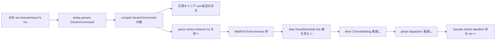
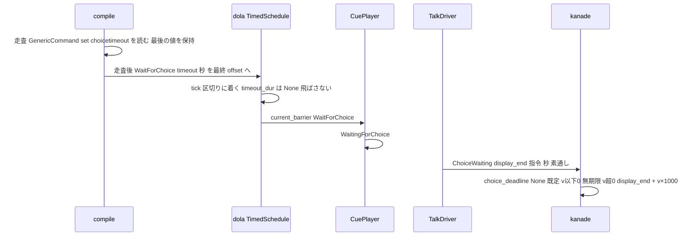

# Design Document: areka-P0-choice-timeout-directive

> 設計日 2026-10-03・ブランチ `claude/areka-p0-choice-timeout-1b7ecf`（`main` `1ce4c74e` の上）。コードは「何の定義か」（関数名・型名・腕・欄）で指す。調査の経緯と案の比較は `research.md`（§2〜§4・§9）にあり、本書は決定だけを書く。

## Overview

**Purpose**: 台本に書かれた `\![set,choicetimeout,時間]` を areka が読み、その台本の選択肢が待つ時間に反映させる。ゴーストの作者が「時間切れなし」や早押しのような短い待ちを台本で作れるようになる。

**Users**: ゴーストの作者（台本を書く人）と利用者（メニューが勝手に閉じなくなる）。

**Impact**: 変わるのは 2 か所である。⑴ 台本を cue へ写す `compile`（`crates/areka-sakura/src/compile.rs`）が、汎用コマンドの転記はそのままに、`set,choicetimeout` の時間の欄だけを読んで、走査の後に置く選択待ちの区切り `BarrierKind::WaitForChoice { timeout }` へ秒の値を入れる。⑵ 再生層 dola の時刻表 `TimedSchedule::tick`（`crates/dola/src/cue/schedule.rs`）が、選択待ちの区切りの値を「自分で解く期限」として扱わなくなる（値は上位層へ運ぶ指令であり、時間切れの判定は kanade だけが行う）。下流（通知・中継・kanade の期限の判定）は 1 行も変えない。

### Goals
- `\![set,choicetimeout,N]` の正の N を「表示の終わり＋N ミリ秒」の期限にする（1.1〜1.5）。
- `0`・`-1`（とその他の負の値）を時間切れなしに、省略・空欄・指定なしを既定にする（2.1〜2.4）。
- 書いた位置と回数に依らず最後の指定が効き、終わりのタグより後ろは数えない（3.1〜3.4）。効くのはその台本の中だけ（4.1〜4.2）。
- 値に依らず選択待ちが必ず成り立つ（5.1〜5.4）。
- 読めない値は既定として扱い警告を残す（6.1〜6.3）。転記と時刻の並びを変えない（7.1〜7.3）。単位の変換は 1 か所（8.1〜8.2）。
- 決定論テスト（9.1〜9.6）と記録の更新（10.1〜10.6）。

### Non-Goals
- `\![set,balloontimeout,時間]`・`quicksection`・`balloonwait`・`embed`・`sound,wait`・`syncobject`・`move` の時間の引数（`areka-P0-sakura-time-directives` に残す）。
- 既定の 30 秒（`KanadeConfig::choice_timeout_default_ms`）の見直し。
- 時間切れの発火と `OnChoiceTimeout` の送り方（完了 `areka-P0-choice-select-events` のまま）。
- クリック待ち（`WaitForInput`）・時間待ち（`Timeout`）の区切りの振る舞いの変更。
- `compile` が中身を読んでよいコマンドの一覧の拡張（`set,choicetimeout` 以外は読まない）。

## Boundary Commitments

### This Spec Owns
- `compile` の `Instruction::GenericCommand` の腕での `set,choicetimeout` の時間の欄の読み取り（新しい純関数 `parse_choice_timeout`）と、その値の選択待ちの区切りへの焼き込み。
- ミリ秒→秒の変換（`parse_choice_timeout` のただ 1 か所）。
- 読めない値の警告（`compile` の中で `warn!`・語彙 `choice_timeout_unreadable`）。
- dola `TimedSchedule::tick` の `timeout_dur` の `WaitForChoice` の腕（選択待ちの区切りの値を自分で解く期限として扱わない）。
- 本 spec のテスト 4 群（compile／drive／dola／ghost・kanade）と、要件 10 の文書・台帳の連鎖。

### Out of Boundary
- 選択待ちの通知（`TalkDriver::notify_choice_waiting_if_newly_waiting`・`areka_talk::ChoiceWaiting`）と中継（`DispatcherState::on_choice_waiting`・`KanadeMsg::ChoiceWaiting`）: 読むだけ・改変 0。
- kanade の期限の判定（`schedule/choice.rs` の `choice_deadline`）と発火（`fire_choice_timeout_if_due`）: 読むだけ・`crates/areka-kanade/src/schedule/` の下は 0 ファイル。
- `crates/areka-parsers/`（`scan_bracket_args`・`decode_passthrough_bang` は今日の出力のまま）・`crates/areka-emo-text/`・`crates/areka/src/emo2_boot/`・`crates/areka/src/input_events/`: 0 ファイル。
- `BarrierKind` の形（欄の追加・名前の変更）: 変えない（研究の案 C を取らない）。
- `WaitForInput`・`Timeout` の腕: 触らない。

### Allowed Dependencies
- 依存の向き: `areka-parsers` → `dola` → `areka-sakura` → `areka-ghost` → `areka-kanade`（本 spec は向きを変えず、新しい依存を 1 つも足さない。`Cargo.toml`・`Cargo.lock` に触れない）。
- `compile` は `areka_parsers::sakura::Instruction` の `GenericCommand { name, raw_args }` を読み、`crate::contract::BarrierKind`（dola の再公開）を作る。
- テストは既存の道具だけを使う: areka-sakura の `compile_test_support`／`drive_test_support`、areka-ghost の `test_log_capture`（`log-capture-kit` は areka-ghost の開発時依存に既にある）と `dispatcher_test_support`（`spawn_dispatcher` は `dispatcher_test_support` ではなく `dispatcher.rs` の `pub fn`。兄弟テストからは `super::spawn_dispatcher`）、kanade の `tests/kanade/choice_test_test_support.rs`、dola の `tests/cue/schedule_test.rs`。
- 文書の生成は `cargo run -p ukadoc-survey -- report` と `-- report-summary`（手で数を直さない）。

### Revalidation Triggers
- `BarrierKind::WaitForChoice` の `timeout` の意味（「上位層へ運ぶ指令・再生層は解かない」）を変えるとき → `doc/choice-cascade-compat.md` の行 5d と本設計を改訂する。
- `choice_deadline` の写像（`None`＝既定・`<= 0`＝無期限・`> 0`＝秒）を変えるとき → `parse_choice_timeout` の出力の意味を再確認する。
- `scan_bracket_args` の規則（空欄・引用符・空白）を変えるとき → `parse_choice_timeout` の表（下記）を再確認する。
- 早送り（`areka-P0-talk-fast-forward`）が時計を飛ばす実装を入れるとき → dola の檻（区切りの時刻と値を越えて進めても止まる）が守りになっている。
- 後続の `areka-P0-sakura-time-directives`・`areka-P0-anchor-tag-canon` が同じ `GenericCommand` の腕を触るとき → 腕の中の「転記＋読み取り」の並びを保つ。

## Architecture

### Existing Architecture Analysis

値の通り道（要件の序文と `research.md` §2.1 で確認済み・本 spec で変わる段に ★）:

| 段 | 定義 | 今日 | 本 spec の後 |
|---|---|---|---|
| ★① compile | `compile` の `Instruction::GenericCommand` の腕 → 走査後の `emit_barrier(scope, offset, BarrierKind::WaitForChoice { timeout })` | 転記のみ・`timeout: None` 固定 | 転記はそのまま・時間の欄を読んで `timeout` へ秒を入れる |
| ★② 再生層 | dola `TimedSchedule::tick` の `timeout_dur` の腕 | `WaitForChoice { timeout } => *timeout`（値があれば着いたときに飛ばす／止まっている間に自分で解く） | `WaitForChoice { .. } => None`（値は見ない・外部解決だけで解ける） |
| ③ 通知 | `TalkDriver::notify_choice_waiting_if_newly_waiting`（`player.current_barrier()` の `timeout` を `ChoiceWaiting.timeout_directive_secs` へ素通し） | 変えない | 変えない |
| ④ 中継 | `DispatcherState::on_choice_waiting`（`display_end = base_now + round(秒×1000)`・指令は素通し） | 変えない | 変えない |
| ⑤ 期限 | kanade `choice_deadline(display_end, timeout_directive_secs, default_ms)` | 変えない | 変えない |

既存の約束で本設計が乗るもの:
- DD-8（完了 `areka-P0-choice-select-events`）: 値の正本は区切りの `timeout` 1 か所。`None`＝未指定、`Some(v≤0)`＝無効化、`Some(v>0)`＝秒。
- `doc/choice-cascade-compat.md` 行 5d: 時間切れの権威は kanade に一本化し、dola の自動解除は選択の区切りには使わない。今日は `CuePlayer::tick` が `WaitingForChoice` の間 `schedule.tick` を呼ばないので「止まっている間の自動解除」は到達しないが、「着いたときに飛ばす」判定は到達する（`research.md` §2.3）。本 spec はこれを構造で塞ぐ。
- `compile` の `End`／`Quit` での `break` と、区切りを走査の後に置く作り: 3.1・3.3 を追加の仕組みなしに満たす。

### Architecture Pattern & Boundary Map



- 選んだ型: 既存の「区切りの値が正本」（DD-8）を保ち、読む側（compile）と解く側（kanade）の間にある再生層を「運ぶだけ」にする。研究の案 A。
- 境界の分け方: compile は「読む・変換する・焼く」、dola は「運ぶ・止まる」、kanade は「期限を決める・発火する」。同じ値を 2 か所で解釈しない。
- 残す既存の型: `\!` の汎用キャリア 1 本（転記は残す・7.1）、`compile` の純関数性（talk_id を知らない）、`BarrierKind` の形。
- 新しい部品の理由: `parse_choice_timeout` だけ（時間の欄の読み方の規則を 1 か所に閉じ、台本の文字列から直に檻を張れるようにする）。
- 案 B（区切りには `None` を書き、値を `CompiledTalk` の別の欄で drive.rs まで運ぶ）を取らない理由: 正本が 2 か所になり DD-8 と `areka_talk::ChoiceWaiting` の注記「バリアのタイムアウト指令」が嘘になる・要件 9.1 の文言（区切りに入る値）と合わない・dola の「着いたら飛ばす」判定が残るので将来だれかが区切りに値を入れれば同じ穴が開く。案 A は 1 腕の変更で既存テストの書き換えが 0 本である（`WaitForChoice` に `Some` を入れて tick する既存テストは無い・`research.md` §2.3）。

### Technology Stack

| Layer | Choice / Version | Role in Feature | Notes |
|-------|------------------|-----------------|-------|
| 台本のコンパイル | `areka-sakura`（Rust 2024・既存） | 時間の欄の読み取り・変換・焼き込み | 新しい依存なし |
| 再生層 | `dola`（既存・`publish = true`・0.0.1 の名前確保のみ） | 選択待ちの区切りで止まる・値は運ぶだけ | 意味の変更だが公開前。`doc/choice-cascade-compat.md` 行 5d と `command.rs` の注記に残す |
| 記録 | `tracing`（既存） | 読めない値の `warn!` | `log-capture-kit` はテストで areka-ghost 経由 |
| 台帳 | `ukadoc-survey`（既存） | 報告 2 本の生成・整合の検査 | `report`・`report-summary` |

## File Structure Plan

### Modified Files（本番）
- `crates/areka-sakura/src/compile.rs` — `Instruction::GenericCommand` の腕に `set,choicetimeout` の読み取り（転記の後に `parse_choice_timeout` を呼び、`last_choice_timeout` を上書き）。走査後の `emit_barrier(.., WaitForChoice { timeout: last_choice_timeout })`。新しい純関数 `parse_choice_timeout(raw_args: &[String]) -> ChoiceTimeoutDirective` と型 `ChoiceTimeoutDirective`（この定義の箇所に `// ukadoc:` の証拠の行）。区切りの注記（「本層は値を供給しない」）の書き直し。末尾に接続宣言 `#[cfg(test)] #[path = "compile_choice_timeout_tests.rs"] mod choice_timeout_tests;` を 1 行。
- `crates/dola/src/cue/schedule.rs` — `TimedSchedule::tick` の `timeout_dur` の腕を `BarrierKind::WaitForChoice { .. } => None` へ。腕の上の注記に理由（値は上位層へ運ぶ指令・再生層は解かない・解けるのは `notify_barrier_resolved` だけ）。
- `crates/dola/src/cue/command.rs` — `BarrierKind::WaitForChoice` の doc 注記に「`timeout` は上位層へ運ぶ指令で、`TimedSchedule` はこれで区切りを飛ばしも解きもしない」を 1〜2 行。
- `crates/areka-sakura/src/drive.rs` — 接続宣言 `#[cfg(test)] #[path = "drive_choice_timeout_tests.rs"] mod choice_timeout_tests;` を 1 行（本体の改変 0）。
- `crates/areka-ghost/src/dispatcher.rs` — 接続宣言 `#[cfg(test)] #[path = "dispatcher_choice_timeout_tests.rs"] mod choice_timeout_tests;` を 1 行（本体の改変 0）。
- `crates/areka-kanade/tests/kanade/choice_test.rs` — 接続宣言 `#[cfg(test)] #[path = "choice_test_timeout_directive_tests.rs"] mod timeout_directive_tests;` を 1 行。

### New Files（テスト）
- `crates/areka-sakura/src/compile_choice_timeout_tests.rs` — 9.1 の表のテスト（台本の文字列 → `areka_parsers::sakura::parse` → `compile` → 区切りの値）。
- `crates/areka-sakura/src/compile_test_support.rs` — `barrier_of(cue) -> &BarrierKind` を `compile_arm_tests.rs` から移す（共有ヘルパは `test_support` へ集約する規約）。`compile_arm_tests.rs` は import を 1 行変えるだけで、`timeout: None` を固定している 6 か所の assert は無改変（9.6）。
- `crates/areka-sakura/src/drive_choice_timeout_tests.rs` — 9.3（時計を一度に進めても選択待ちに入る・通知の値）。
- `crates/dola/tests/cue/schedule_test.rs`（既存ファイルへ追記） — 選択の区切りの値を dola が解かない檻（下記 Testing Strategy）。
- `crates/areka-ghost/src/dispatcher_choice_timeout_tests.rs` — 9.2（警告の記録の捕捉）と 9.4 の前半（台本 → `KanadeMsg::ChoiceWaiting` の `display_end` と `timeout_directive_secs`）。
- `crates/areka-kanade/tests/kanade/choice_test_timeout_directive_tests.rs` — 9.4 の後半（`Some(N/1000)` を受けた kanade が `display_end + N` ちょうどで `OnChoiceTimeout` を出す）。

### Modified Files（文書・台帳）
- `doc/ukadoc-coverage/ledger/sakura-script.toml` — `\![set,choicetimeout,時間]` の項目: `status = "implemented"`・`owner = "areka-P0-choice-timeout-directive"`・`note` を今の振る舞いへ（10.1）。
- `doc/ukadoc-coverage/roadmap-draft.md` — `[[spec]]` に本 spec の行（`stage = "A"`・`bundle = "会話"`・`owner_count = 1`・`wave = "C1-②"`）、`areka-P0-sakura-time-directives` の `owner_count` 11 → 10、`[briefs].count` 39 → 40、段階ごとの表と「会話」の節の「依存する既存 spec」の欄（`sakura-time-directives` の件数を数え直し・本 spec を件数付きで足す）、追加の理由の段落（前例「2026-09-29 の 2 行目の追加」の型）、`snapshot_on`（10.5）。数はすべて数え直した値を書く（引き算で出さない）。
- `doc/ukadoc-coverage/report/sakura-script.md`・`doc/ukadoc-coverage/report/summary.md` — 生成器で作り直す（10.5）。同じ C1 の `status-execution-states` も `ledger/sakura-script.toml` に 3 項目を持つので、`main` へ後から着地する側が作り直す（手で数を直さない）。
- `doc/COMPAT_ARCHITECTURE.md` §8 — 「compile 側時間指令 allowlist」の行に `set,choicetimeout` は本 spec で実際に読むようになったことを書き足し（10.4）、裁量の 1 行を足す（10.3）。
- `doc/choice-cascade-compat.md` — 行 5b（既定値だけが流れる → 台本の指定が流れる）・行 5d（着いたときに飛ばす判定も選択の区切りには効かない、と本 spec で構造にした）（10.6）。
- `doc/ukadoc-coverage/briefing-sakura-script.md` — ⑵ 消費側の表の `set,choicetimeout` の行（「消費されない」→ compile が読む）と ⑶ 担当の突合表の行（引受先を本 spec へ）、および「語彙の登記」の表の `set,choicetimeout` の行（`COMPAT_ARCHITECTURE.md` §8 の allowlist の行を指すので、§8 の行を書き足した後に指す先が合っているか見る）（10.6）。

### 触らない（0 と明記）
- `crates/areka-kanade/src/`（`schedule/` を含む）・`crates/areka-parsers/`・`crates/areka-emo-text/`・`crates/areka/src/emo2_boot/`・`crates/areka/src/input_events/`・`crates/areka-talk/`・`crates/areka-ghost/src/dispatcher.rs` の本体・`crates/areka-sakura/src/drive.rs` の本体・各 `Cargo.toml`・`Cargo.lock`。

## System Flows



流れの決め事:
- compile は台本を頭から 1 回だけ走査する。`End`／`Quit` で `break` するので、終わりのタグより後ろの指定は読まれない（3.3）。指定は読むたびに上書きし、走査後に 1 回だけ区切りへ入れる（3.1・3.2・6.2）。選択肢が無ければ区切り自体を出さず、読んだ値は捨てる（3.4）。
- compile は talk ごとに呼ばれる純関数で、状態を持たない。前の台本の値が次の台本へ残る経路は構造上ない（4.1・4.2）。
- dola は区切りに着いたら必ず止まり、止まっている間は `notify_barrier_resolved` でしか解けない（5.1〜5.3）。`WaitForInput`・`Timeout` の腕は今日のまま（5.4）。

## Requirements Traceability

| Requirement | Summary | Components | Interfaces | Flows |
|---|---|---|---|---|
| 1.1 | 正の N で N ms の時間切れ | compile・`parse_choice_timeout`・kanade `choice_deadline`（既存） | `ChoiceTimeoutDirective::Secs(N/1000)` → `WaitForChoice { timeout: Some }` | 上の sequence |
| 1.2 | 既定と同じ経路で `OnChoiceTimeout` | kanade（既存・読むだけ） | — | — |
| 1.3 | 期限前に選べる | dola（外部解決だけで解ける）・kanade（既存） | `notify_barrier_resolved` | — |
| 1.4 | 端数の誤差なし | `parse_choice_timeout`（`N as f64 / 1000.0`）・`choice_deadline`（`round(v×1000)`） | — | 整数 N は往復で一致（`research.md` §2.4） |
| 1.5 | 大きすぎる N | `parse_choice_timeout`（`PosOverflow` → `i64::MAX` ms へ飽和） | — | kanade の飽和加算で落ちない |
| 2.1 | `0`・`-1` で時間切れなし | `parse_choice_timeout`（`Secs(0.0)`・`Secs(-0.001)`）・dola（飛ばさない）・kanade（`<= 0` → 無期限） | — | — |
| 2.2 | その他の負の値も時間切れなし | 同上（`Secs(-0.005)` など。`NegOverflow` → `i64::MIN` ms） | — | — |
| 2.3 | 省略・空欄で既定 | `parse_choice_timeout`（欄なし・空文字 → `Default`） | `None` | — |
| 2.4 | 指定なしで既定 | compile（`last_choice_timeout` の初期値 `None`） | `None` | — |
| 3.1 | 選択肢より後ろでも効く | compile（区切りは走査後に置く） | — | — |
| 3.2 | 最後の指定が勝つ | compile（読むたびに上書き・`Default` も上書き） | — | — |
| 3.3 | 終わりのタグより後ろは数えない | compile（`End`／`Quit` の `break`） | — | — |
| 3.4 | 選択肢の無い台本では何も変えない | compile（`has_choice` が偽なら区切りを出さない） | — | — |
| 4.1 | 後の台本は既定 | compile（純関数・talk ごとに `last_choice_timeout` は `None` から始まる） | — | — |
| 4.2 | 選択・時間切れの応答の台本も引き継がない | compile（同上。新しい台本は新しい `compile` の呼び出し） | — | — |
| 5.1 | 値に依らず選択待ちに入る | dola `timeout_dur` の `WaitForChoice { .. } => None` | — | — |
| 5.2 | 時計を一度に進めても飛ばさない | 同上 | — | — |
| 5.3 | 再生の側が自分で解かない | 同上（`barrier_timeout_offset` に値が入らない） | — | — |
| 5.4 | 他の区切りは今日のまま | dola（`WaitForInput`・`Timeout` の腕は無改変） | — | — |
| 6.1 | 読めない値は既定＋警告 | compile（`Unreadable` → `None`・`warn!`） | ログ語彙 `choice_timeout_unreadable` | — |
| 6.2 | 読めない後に読める値 | compile（上書き） | — | — |
| 6.3 | 止まらない・他を変えない | compile（警告だけ・cue 列は不変） | — | — |
| 7.1 | 汎用コマンドの転記を続ける | compile（腕の先頭の `command_carrier` は不変） | — | — |
| 7.2 | 他の出来事の内容と時刻を変えない | compile（offset を進めない・cue を足さない） | — | — |
| 7.3 | 他のコマンドを読まない | compile（`name == "set"` かつ `raw_args[0] == "choicetimeout"` だけ） | — | — |
| 8.1 | 変換は 1 か所 | `parse_choice_timeout` | — | — |
| 8.2 | 下流は秒のまま | 通知・中継・kanade 無改変 | — | — |
| 9.1 | 区切りの値の表のテスト | compile の兄弟テスト `compile_choice_timeout_tests.rs` | `test_support::compile`・`barrier_of` | Testing Strategy |
| 9.2 | 警告の記録の捕捉 | ghost の兄弟テスト `dispatcher_choice_timeout_tests.rs` | `test_log_capture::capture`・`assert_logged_event` | Testing Strategy |
| 9.3 | 時計を一度に進めても選択待ち | drive の兄弟テスト `drive_choice_timeout_tests.rs`・dola `schedule_test.rs` | `spawn_talk`・`TalkNotice` | Testing Strategy |
| 9.4 | 台本から期限まで通し | ghost のテスト（入口まで）＋ kanade の外側のテスト（入口から期限まで）の 2 本の合成・境の値 `1234` を共有し互いの名前を doc 注記に書く | `KanadeMsg::ChoiceWaiting`・`OnChoiceTimeout` | Testing Strategy |
| 9.5 | 注入時刻・実機なし | 4 群すべて（注入 Tick・mock shiori） | — | — |
| 9.6 | 既存の `None` の檻を書き換えずに通す | compile の既存檻 7 か所・drive の既存檻 1 本 | — | — |
| 10.1 | 台帳の行を実装済みへ | `ledger/sakura-script.toml` | — | — |
| 10.2 | 台帳の検査を通す | `cargo test -p ukadoc-survey` | — | — |
| 10.3 | §8 に裁量の 1 行 | `doc/COMPAT_ARCHITECTURE.md` | — | — |
| 10.4 | §8 の allowlist の行に書き足し | `doc/COMPAT_ARCHITECTURE.md` | — | — |
| 10.5 | 台帳の連鎖（roadmap-draft・報告 2 本・証拠の行） | `roadmap-draft.md`・生成器・compile.rs の `// ukadoc:` 行 | — | — |
| 10.6 | 古くなる記述の書き直し | `choice-cascade-compat.md`・`briefing-sakura-script.md`・compile.rs の注記 | — | — |

## Components and Interfaces

| Component | Domain/Layer | Intent | Req Coverage | Key Dependencies | Contracts |
|---|---|---|---|---|---|
| `parse_choice_timeout` | areka-sakura compile | 時間の欄 → 秒の指令（純関数・変換 1 か所） | 1.4, 1.5, 2.1〜2.3, 6.1, 8.1 | なし（std のみ） | Service |
| compile の `GenericCommand` の腕と区切りの発行 | areka-sakura compile | 転記＋読み取り＋最後の値の焼き込み | 2.4, 3.1〜3.4, 4.1〜4.2, 6.2〜6.3, 7.1〜7.3 | `parse_choice_timeout`（P0）・`emit_barrier`（既存） | State |
| dola `TimedSchedule::tick` の `timeout_dur` | dola 再生層 | 選択の区切りの値を解かない | 5.1〜5.4 | なし | State |

### areka-sakura compile

#### `parse_choice_timeout`

| Field | Detail |
|---|---|
| Intent | `set,choicetimeout` の `raw_args` から、区切りへ入れる秒の指令を決める |
| Requirements | 1.4, 1.5, 2.1, 2.2, 2.3, 6.1, 8.1 |

**Responsibilities & Constraints**
- 入力は `Instruction::GenericCommand { name: "set", raw_args }` の `raw_args`（`raw_args[0] == "choicetimeout"` は呼び手が確かめる）。時間の欄は `raw_args.get(1)`。3 欄目以降は見ない。
- 純関数・no I/O・記録を出さない（記録は呼び手の腕が出す。純関数の檻を記録に依存させない）。
- 変換は `ms as f64 / 1000.0` のただ 1 か所。値の正規化（`-1` を `0.0` にそろえる等）はしない——kanade の写像はどの負の値でも同じ結果になり、記録に台本の値がそのまま残る方が追いやすい。

##### Service Interface
```rust
/// `\![set,choicetimeout,時間]` の時間の欄の読み取りの結果。
pub(crate) enum ChoiceTimeoutDirective {
    /// 欄なし・空欄 → 既定へ戻す（区切りには `None` を書く）。
    Default,
    /// 整数で読めた → 秒（区切りには `Some(secs)` を書く）。`0`・負は無期限、正は期限。
    Secs(f64),
    /// 整数として読めない → 呼び手が警告を出し、既定として扱う（区切りには `None` を書く）。
    Unreadable,
}

// ukadoc: https://ssp.shillest.net/ukadoc/manual/list_sakura_script.html#_5c_21_5bset_2cchoicetimeout_2c_6642_9593_5d:1
pub(crate) fn parse_choice_timeout(raw_args: &[String]) -> ChoiceTimeoutDirective;
```

読み方の表（`scan_bracket_args` の出力に対して・`research.md` §2.2）:

| `raw_args`（先頭 `"choicetimeout"` を除く） | 結果 | 根拠 |
|---|---|---|
| なし（`\![set,choicetimeout]`） | `Default` | 正典「時間指定を省略：デフォルト値に戻す」 |
| `""`（`\![set,choicetimeout,]`） | `Default` | 空欄は省略と同じ（裁量・§8 に記録） |
| `"500"` | `Secs(0.5)` | 正典 |
| `"0"`／`"-1"`／`"-5"` | `Secs(0.0)`／`Secs(-0.001)`／`Secs(-0.005)` | 正典（`0`・`-1`）／裁量（他の負） |
| `" 500 "`（前後の空白） | `Secs(0.5)` | `str::trim` してから読む（裁量） |
| `"+500"` | `Secs(0.5)` | `i64` の読み取りがそのまま受ける（裁量・わざわざ弾かない） |
| `"99999999999999999999"`（桁あふれ・正） | `Secs(i64::MAX as f64 / 1000.0)` | `IntErrorKind::PosOverflow` を飽和（1.5） |
| `"-99999999999999999999"`（桁あふれ・負） | `Secs(i64::MIN as f64 / 1000.0)` | `IntErrorKind::NegOverflow` を飽和（2.2 と同じ側） |
| `"abc"`／`"1.5"`／`"500ms"`／全角数字 | `Unreadable` | `IntErrorKind::InvalidDigit`（6.1） |
| `"500"`, `"x"`（余分な欄） | `Secs(0.5)` | 2 欄目だけを読む（裁量） |

- Preconditions: なし（どんな `raw_args` でも落ちない）。
- Postconditions: `Secs(v)` の `v` は有限（`NaN`・`∞` を作らない。`CueSheet` の serde の往復で `null` に化ける値を区切りへ入れない）。整数 N（|N| < 2^51）について `round(v × 1000) == N`。
- Invariants: 同じ入力に同じ出力（決定論）。

#### compile の `GenericCommand` の腕と選択待ちの区切り

| Field | Detail |
|---|---|
| Intent | 転記を保ったまま `set,choicetimeout` を読み、最後の値を走査後の区切りへ入れる |
| Requirements | 2.4, 3.1, 3.2, 3.3, 3.4, 4.1, 4.2, 6.1, 6.2, 6.3, 7.1, 7.2, 7.3 |

**Responsibilities & Constraints**
- 腕の先頭の `cues.push(emit(.., command_carrier(name, raw_args)))` は無改変（7.1）。その**後**に、`name == "set"` かつ `raw_args.first() == Some("choicetimeout")`（綴りは逐語・小文字）のときだけ `parse_choice_timeout` を呼ぶ（7.3）。offset は進めず cue も足さない（7.2）。
- 走査の局所変数 `last_choice_timeout: Option<f64>`（初期値 `None`＝未指定）。結果ごとに `Default → None`・`Secs(v) → Some(v)`・`Unreadable → None` で**上書き**する（3.2・6.2）。
- `Unreadable` のとき、その場で `tracing::warn!(event = "choice_timeout_unreadable", raw = %欄の文字列, "[compile] set,choicetimeout の時間が整数として読めないので既定として扱う")` を出す（6.1）。警告文にタグの綴り `\!` は書かない（Rust の文字列では不正なエスケープになる。`event` と `raw` の欄で何の話かは分かる）。選択肢の有無で出し分けない（走査中はまだ分からない・読めない綴りは作者が直すべきもの。要件 3.4「誤りとしても扱わない」は「失敗にしない・台本の振る舞いを変えない」の意味で、記録の 1 行はこれに反しない）。読めない指定の後に読める指定があっても、読めない方の警告は出る（1 回の読めない指定につき 1 行）。
- 走査後の区切りは `emit_barrier(scope, offset, BarrierKind::WaitForChoice { timeout: last_choice_timeout })`。`has_choice` が偽なら区切りを出さず、値は捨てる（3.4）。

##### State Management
- State model: 走査の局所変数 1 つ（`last_choice_timeout`）。関数の外に状態を持たない（4.1・4.2）。
- Persistence & consistency: なし。
- Concurrency strategy: 純関数ゆえ不要。

**Implementation Notes**
- Integration: 腕は catch-all（`other =>`）の前にある既存の `GenericCommand` の腕そのもの。`Font` の腕と同じく「転記のあとに読む」形で、腕の順序は変えない。
- Validation: compile の兄弟テスト（9.1）が台本の文字列から区切りの値を固定する。既存の `timeout: None` の assert 7 か所（`compile_arm_tests.rs` 6・`compile_sheet_tests.rs` 1）は指定の無い台本なので無改変で緑（9.6）。
- Risks: 後続 spec（`sakura-time-directives`・`anchor-tag-canon`）が同じ腕を触る。本 spec は腕の中を「転記 → 読み取り」の 2 段に保ち、読み取りの条件を 1 つの `if` に閉じる。

### dola 再生層

#### `TimedSchedule::tick` の `timeout_dur` の腕

| Field | Detail |
|---|---|
| Intent | 選択待ちの区切りの `timeout` を「自分で解く期限」として扱わない |
| Requirements | 5.1, 5.2, 5.3, 5.4 |

**Responsibilities & Constraints**
- 変更は `timeout_dur` の 1 腕: `BarrierKind::WaitForChoice { timeout } => *timeout` → `BarrierKind::WaitForChoice { .. } => None`。これで「着いたときに `offset >= barrier_offset + dur` なら飛ばす」も「止まっている間に `barrier_timeout_offset` で自分で解く」も、選択の区切りには効かなくなる（1 腕で両方・研究 §6-2 は「両方」で決める）。
- `WaitForInput { timeout }`・`Timeout { duration }` の腕は無改変（5.4）。既存の檻 `input_barrier_with_timeout_skipped_when_jumped_past`・`barrier_timeout_auto_releases`・`timeout_barrier_skipped_when_already_past` が守る。
- 区切りの値は `current_barrier()` から今日どおり読める（`notify_choice_waiting_if_newly_waiting` が `Some(v)` を運ぶ）。
- `TimedSchedule` を直接使うのは `CuePlayer`（`runtime.rs`）と `to_talk_schedule`（`sheet.rs`）とテストだけ（`research.md` §7 の確認事項・設計で grep 済み）。dola の設計文書に `WaitForChoice` の自己解除を約束した記述は無い（完了 `wintf-P0-cue-system` の要件は `WaitForInput` の時間切れだけ）。

##### State Management
- State model: `current_barrier` と `barrier_timeout_offset`。選択の区切りでは後者が常に `None`。
- Concurrency strategy: 変更なし（単一スレッドの tick）。

**Implementation Notes**
- Integration: `doc/choice-cascade-compat.md` 行 5d の「使用しない」を、本 spec で「構造として効かない」へ書き換える。`command.rs` の `WaitForChoice` の doc に意味を残す。
- Validation: `schedule_test.rs` に選択の区切りの檻（下記）。
- Risks: `dola` は `publish = true` だが 0.0.1 の名前確保だけで本格の公開は C2 の `crates-io-publish` から。公開前の意味の変更として注記に残す。

## Data Models

### Domain Model
- 変わる値は `BarrierKind::WaitForChoice { timeout: Option<f64> }` の中身だけ。意味は DD-8 の 3 値のまま: `None`＝未指定（既定へ委譲）・`Some(v≤0)`＝無効化（無期限）・`Some(v>0)`＝秒の期限。本 spec で `Some(v)` が実際に流れるようになる。
- 不変条件: `Some(v)` の `v` は有限。`CueSheet` の serde の形（`command_tests.rs` の JSON の期待値）は変わらない。

### Data Contracts & Integration
- `areka_talk::ChoiceWaiting.timeout_directive_secs`・`KanadeMsg::ChoiceWaiting.timeout_directive_secs`: 形も意味も不変。kanade の記録 `choice_waiting_established` の `timeout_directive_secs` に台本の値（例 `Some(-0.001)`）がそのまま出る。

## Error Handling

### Error Strategy
- 読めない値は**失敗にしない**（台本は止めない・他の cue は変えない）。既定として扱い、`warn!` 1 行で理由を残す（6.1〜6.3・開発方針「ログ無し失敗経路の禁止」）。
- 桁あふれは読めない値ではなく飽和（1.5・2.2）。`parse::<i64>()` の `Err` は `IntErrorKind` で `PosOverflow`／`NegOverflow`／それ以外に分ける。
- `compile` は `Result` を返さない（今日の署名のまま）。診断を値として返す形は取らない（talk_id を警告に載せるために drive.rs を広げる価値が無い。記録の `target` は `areka_sakura::compile` で、同じ時刻の `choice barrier reached; notifying ChoiceWaiting`（talk_id 付き・drive.rs の既存 info）と並べれば talk は特定できる）。

### Monitoring
| 記録 | レベル | target | 語彙（`event`） | 欄 |
|---|---|---|---|---|
| 読めない時間の欄 | WARN | `areka_sakura::compile` | `choice_timeout_unreadable` | `raw`（台本の欄の文字列） |

既存のまま: drive.rs の `choice barrier reached; notifying ChoiceWaiting`（INFO・`timeout_directive_secs` 付き）、kanade の `choice_waiting_established`。

## Testing Strategy

すべて注入時刻・実物の SHIORI なし・ネットなし（9.5）。`Cargo.toml`・`Cargo.lock` に触れない置き場だけを使う。

### Unit Tests（compile・`crates/areka-sakura/src/compile_choice_timeout_tests.rs`・9.1／9.2 の一部）
台本の文字列を `areka_parsers::sakura::parse` → `test_support::compile` に通し、`barrier_of(最後の cue)` の `timeout` を固定する。期待値は `Some(N as f64 / 1000.0)` の形で書く（1.4 の往復の前提と同じ式）。
1. 指定なし → `None`（9.6 の既存檻と同じ値）。正の値 `500` → `Some(0.5)`。`0` → `Some(0.0)`。`-1` → `Some(-0.001)`。`-5` → `Some(-0.005)`。
2. 省略 `\![set,choicetimeout]` と空欄 `\![set,choicetimeout,]` → `None`。前後の空白・`+500`・余分な欄 → 表のとおり。
3. 選択肢の後ろ `…\q[a,b]\![set,choicetimeout,700]\e` → `Some(0.7)`（3.1）。複数回 `500` → `700` → `Some(0.7)`、`500` → 省略 → `None`（3.2）。
4. `\e` の後ろにだけ書いた台本 → `None`（3.3）。`\-` も同じ。選択肢の無い台本に書いても cue 列は書かない台本と同一（3.4・`cue_eq` で全 cue 比較）。
5. 読めない値 `abc`・`1.5`・`500ms` → `None`（6.1）。読めない → 読める `700` → `Some(0.7)`（6.2）。読めない値があっても他の cue の列（`Text`・`Emote`・`Wait`・`Choice`・転記された `set` キャリア）は読める値のときと同一（6.3・7.1・7.2）。
6. 桁あふれ `99999999999999999999` → `Some(i64::MAX as f64 / 1000.0)`（1.5）、負の桁あふれ → `Some(i64::MIN as f64 / 1000.0)`（2.2）。
7. `parse_choice_timeout` 単体: 表の全行。整数 N ∈ {1, 999, 1000, 1001, 30000, 2147483647} で `(secs * 1000.0).round() as i64 == N`（1.4・8.1）。

### Unit Tests（dola・`crates/dola/tests/cue/schedule_test.rs` へ追記・5.1〜5.4）
1. `WaitForChoice { timeout: Some(0.0) }` を 1.0 に置き `tick(1.0)` → `current_barrier()` は `Some(WaitForChoice)`・後続の payload は配られない（今日の実装なら飛ばされて落ちる）。
2. `Some(-0.001)` で同じ。
3. `Some(0.5)` を 1.0 に置き `tick(2.0)`（区切り＋値を一度に越える）→ 止まる（5.2。`input_barrier_with_timeout_skipped_when_jumped_past` の `WaitForChoice` 版で、期待が逆）。
4. `Some(0.5)` で止まった後 `tick(10.0)` → まだ止まっている（自分で解かない・5.3）。`notify_barrier_resolved(Some("yes"))` → 解けて後続が配られる。
5. 5.4 は既存の `WaitForInput`・`Timeout` の檻が無改変で緑であることで示す（新しいテストは足さない）。

### Integration Tests（drive・`crates/areka-sakura/src/drive_choice_timeout_tests.rs`・9.3）
`drive_test_support` の `spawn_talk`＋`TalkNotice`＋`NEG_WINDOW` を使う。台本 `\s[10]hello\_w[100]\q[選択A,targetA]\![set,choicetimeout,X]\e`（区切り 0.35）。
1. X ∈ {`500`, `0`, `-1`, 省略} の各値で、`Tick(0.0)` の次に `Tick(50.0)`（区切りと値を一度に越える）を注入 → `ChoiceWaiting` が 1 通届き、`timeout_directive_secs` が `Some(0.5)`／`Some(0.0)`／`Some(-0.001)`／`None`、`display_end_elapsed_secs` が 0.35（5.1・5.2・9.3）。その後 `Tick(100.0)` でも `TalkDone` は来ない（`recv_done(NEG_WINDOW).is_err()`・5.3）。
2. 既存 `choice_waiting_notifies_exactly_once_with_ids_horizon_and_timeout`（`timeout_directive_secs: None`）は無改変で緑（9.6）。

### Integration Tests（ghost・`crates/areka-ghost/src/dispatcher_choice_timeout_tests.rs`・9.2／9.4 前半）
1. **警告の記録（9.2）**: `test_log_capture::capture` の窓の中で `areka_sakura::compile(&parse(台本), &SystemVarSnapshot::default())` を呼ぶ（前例 `sink.rs` の `diagnostic_default_wiring_logs_each_cue_exactly_once_through_broadcast`）。読めない値 `abc` で `assert_logged_event(WARN, "areka_sakura::compile", "choice_timeout_unreadable")`。正しい値 `500` では同じ語彙の WARN が 0 件（窓は番兵で空振りを検出する）。
2. **台本 → kanade の入口（9.4 前半）**: `spawn_dispatcher` に `\s[10]hello\_w[100]\q[選択A,targetA]\![set,choicetimeout,1234]\e` を `Start` → `Tick{1_000}`・`Tick{1_500}` → `KanadeMsg::ChoiceWaiting { display_end: MonotonicMs(1_350), timeout_directive_secs: Some(1.234), .. }`（前例 `menu_talk_choice_waiting_reaches_kanade_and_resolve_resumes_it_to_completion` の `None` を `Some(1.234)` に替えた形）。

### Integration Tests（kanade の外側・`crates/areka-kanade/tests/kanade/choice_test_timeout_directive_tests.rs`・9.4 後半）
`choice_test_test_support` のハーネス（mock shiori・mock sakura・注入 Tick）で、`KanadeMsg::ChoiceWaiting { display_end: MonotonicMs(1_000), timeout_directive_secs: Some(1.234), .. }` を投函する（`establish_choice_wait` は `timeout_directive_secs: None` を固定で送る補助関数なので使わず、同じ注入列を本テストの中に自前で書いて指令だけ `Some` にする）。
1. `Tick{1_000 + 1_234 - 1}` では `OnChoiceTimeout` が出ず、`Tick{1_000 + 1_234}` で出る（期限が「表示の終わり＋N ミリ秒」ちょうど・1.1・1.4）。前例 `choice_timeout_fires_then_204_cancels_and_rejects_later_choice` の期限の両側の注入と同じ弁別。
2. `Some(0.0)` と `Some(-0.001)` では `Tick{1_000 + 60_000}` でも `OnChoiceTimeout` が出ない（2.1・2.2。既定の 30 秒を越えても閉じない）。

ghost のテストと kanade のテストは、同じ `N = 1234`・同じ `Some(1.234)` を境の値として共有し、**2 本の合成**で「台本から期限まで通し」（9.4）を示す（kanade の `choice_deadline` は `pub(crate)` で `schedule/` は 0 ファイルの約束のため、1 本で貫くことはできない）。2 本は別クレートにあり定数を共有できないので、両方の doc 注記に「対になるテストは ○○（境の値 `1234`）」と互いの名前を書き、片方だけ値を変えたときに読み手が気付けるようにする。

### 文書・台帳の検査（10.2・10.5）
- `cargo test -p ukadoc-survey`（整合の判定 ⑸ の腕 a・c・f と判定 ⑹・`check_evidence`）が緑。報告 2 本は生成器で作り直す。

## Supporting References
- `research.md` §2（通り道・字句の出力の形・dola の判定・単位の往復・台帳の連鎖）・§4（案 A〜C の比較）・§9（設計フェーズの決定）。
- 正典: ukadoc `\![set,choicetimeout,時間]`（`https://ssp.shillest.net/ukadoc/manual/list_sakura_script.html#_5c_21_5bset_2cchoicetimeout_2c_6642_9593_5d:1`）。
- 完了 spec: `areka-P0-choice-select-events`（DD-8・`choice_deadline`）・`areka-P0-sakura-dialogue-tags`（R4.3 の allowlist）・`cue-playback-duration`（区切り）。
