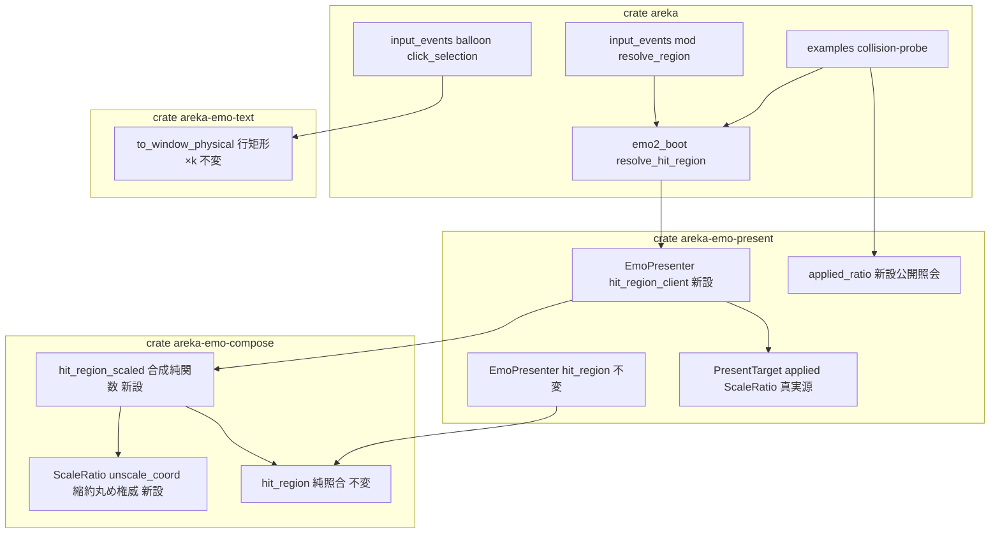
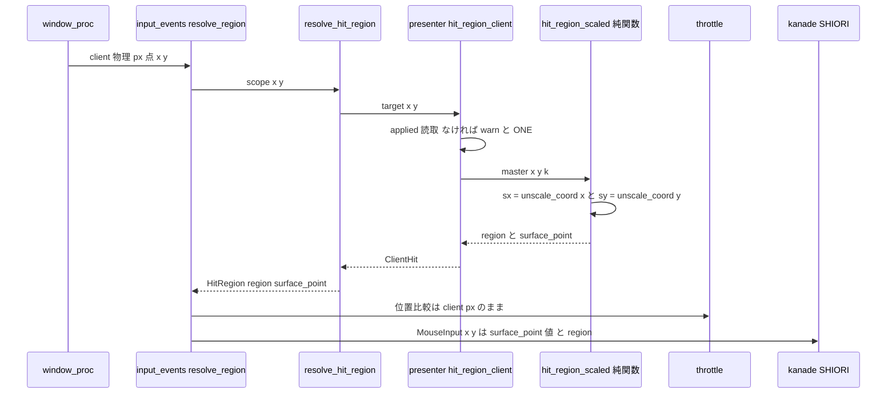

# 技術設計書: areka-P0-collision-dpi-hittest

> 対象要件: `requirements.md`（R1〜R6・全 45 criteria）／ギャップ分析・設計判断ログ: `research.md`
> 言語: 日本語（spec.json.language=ja）／設計判断 DD-1〜DD-11 の裁定結果は本書が正本（経緯は research.md §6）

## Overview

**Purpose**: DPI追従（[[areka-dpi-following-core-design]]）下で k≠1.0 拡大表示中のマスコットに対し、窓 client 物理 px の点を実適用スケール k で厳密に縮約（÷k）してから作者定義サーフェス px の当たり判定矩形と照合し、「見えているとおりの部位が当たる」を成立させる。あわせて SHIORI へ配信するマウス座標を縮約後のサーフェス px 空間へ正準化し（areka 裁定・R1.8）、`collision-geometry` の k=1.0 限定契約を解除して座標契約文書を実態へ整合させる。

**Users**: エンドユーザ（高 DPI モニタでの撫で・クリック）／ゴースト作者（サーフェス px 空間で一貫した座標を受け取る）／保守者（座標契約文書と檻）。

**Impact**: 変更は「点の縮約の挿入」と「配信座標の空間切替」に限定される。純照合関数 `areka_emo_compose::hit_region` は不変（R6.1）。バルーン窓のヒット判定挙動は不変（R6.4——既に逆向きに正しく k 整合済み。§Architecture 参照）。

### Goals

- k≠1.0 の shell 窓で client 物理 px → ÷k → サーフェス px 照合による Head/Bust/None 解決（R1）
- 縮約の単一丸め規約＝**resample 画素中心写像の最近傍逆写像**を整数演算のみで確定（R2・DD-1）
- 任意 k 注入・GPU 不要の決定論檻（R3）と、実 DPI 2 水準・emo2 実機での目視サインオフ（R4）
- k=1.0 限定契約・素通し規約・バルーン側理由説明の文書改訂（R5）
- k の厳密消費（f32 非経由）——`applied: Option<ScaleRatio>` を真実源として整数のみで縮約（R1.4・R2.2）

### Non-Goals

- マスコットの k× 拡大レンダリングと k の導出（上流 `areka-P0-emo-dpi-scaling`・完了済み。本仕様は消費のみ）
- バルーン窓ヒット**判定挙動**の変更（÷k 追加は二重縮約＝禁止。許すのはコメント改訂＋檻のみ・R6.4）
- SHIORI 配信の送出契機・頻度・イベント種別・撫で意味論（`input-events` 領分・R6.3）
- `TextSlotView` 経路の f32 スケール積の 1px 誤差是正（`areka-P0-scale-exact-rational`・W6.5）
- 混在 DPI の窓消失（`areka-P0-dpi-window-vanish`・W5 同居）
- 当たり判定矩形の作者定義値の解釈変更・collision 集合の決まり方の変更（`collision-geometry` 再検証トリガ 5 領分）

## Boundary Commitments

### This Spec Owns

- **点÷k 縮約の丸め権威**: `ScaleRatio::unscale_coord`（除算方向の座標縮約・整数のみ）——`scaled_extent`（乗算方向の寸法丸め権威）と対になる新権威
- **縮約＋照合の合成純関数**: `areka_emo_compose::hit_region_scaled`（k を明示引数で受ける・檻の最小単位）
- **production 配線**: `EmoPresenter::hit_region_client`（私有 `applied` を厳密消費）と `resolve_hit_region` の切替
- **SHIORI 配信マウス座標の空間**: 縮約後サーフェス px（areka 裁定・R1.8）——`MouseInput{x,y}` の値のみ（送出意味論は不変）
- **座標契約文書**: shell 経路の ÷k 規約・バルーン経路の逆向き整合理由・`collision-geometry` k=1.0 契約の解除追記（R5 の 7 箇所）
- **檻と実機受け入れ**: R3 決定論檻（shell ÷k＋balloon 無変換不変条件）・R4 probe 改修＋2 水準サインオフ＋受け入れ記録

### Out of Boundary

- `areka_emo_compose::hit_region` 純関数の入出力契約（不変・R6.1）／`EmoPresenter::hit_region` 既存メソッド（不変・姉妹メソッド新設で対応）
- 作者定義 collision 矩形値（不変・R6.2）／矩形側を ×k する方式（不採用・R6.2）
- `input_events/balloon.rs` の判定ロジック（コメント＋テスト追加の異ハンクのみ許可・R6.7 例外条項）
- `throttle.rs`（無変更——位置比較は縮約前 client px 空間を維持・R6.8）
- `ScaleRatio` の乗算方向 API（`scale_len`/`scaled_extent`）と resample 本体（不変）
- W5 同居 spec の単独所有面: `placement/`（vanish）・`input_events/balloon.rs` の drain/status（choice-select-events）・`measure.rs`/`frame.rs`/`assets.rs`（kero-balloon）

### Allowed Dependencies

- `areka-emo-compose`（`ScaleRatio`・`hit_region`・`SurfaceMaster`）← 縮約権威と合成純関数の住処
- `areka-emo-present`（`EmoPresenter`・`applied`）← k の単一真実源。**`derive_scale` の再呼出は禁止**（R1.4——`applied` は失敗経路で導出値と乖離し得るため、`applied` だけが真実）
- `areka` bin: `emo2_boot/hit_region.rs`（`#[path]` include 制約: 非テストコードで `crate::` パス禁止＝ヘルパは外部 crate 供給）・`input_events/mod.rs`
- 依存方向: `areka-emo-compose` ← `areka-emo-present` ← `areka` bin（左から右へのみ import。新規外部依存なし・Rust 2024・R6.6）

### Revalidation Triggers

1. `ScaleRatio::unscale_coord` の丸め規約変更 → R3.5 期待値・R4 実機受け入れの再実施が必須
2. `applied` の更新点（表示成立点）の変更 → R1.4/R1.7 の真実源前提が破れる
3. SHIORI 配信座標空間の変更 → ゴースト可視の破壊的変更（一度リリース後は変更不可・R1.8 裁定の根拠 (e)）
4. バルーン行矩形の空間変更（`to_window_physical` が窓物理 px を返さなくなる等・W6.5 の有理化含む） → R3.7 檻と R5.7 文書の再整合
5. `hit_region` 純関数の契約変更（collision-geometry 側トリガ） → 合成純関数 `hit_region_scaled` の再検証

## Architecture

### Existing Architecture Analysis

当たり判定経路は 4 層（詳細実測: research.md §2.1）で、**空間の断裂点は `resolve_hit_region` → `presenter.hit_region` の呼出境界 1 箇所**（`emo2_boot/hit_region.rs:71`）に集約されている:

| 層 | 実体 | 現契約 | 本設計での扱い |
|---|---|---|---|
| 入力 | `input_events/mod.rs` `PointerState.client_point`（i64） | 窓 client 物理 px | 不変（throttle も client px 維持） |
| 配線 | `MouseWiring::resolve_region`（DD-IE-10 素通し規約） | 無変換 | 配信座標のみ surface px へ切替＋doc 改訂 |
| 結線 | `resolve_hit_region`（`hit_region.rs:69-73`） | 無変換（k=1.0 契約） | **÷k 吸収点**——`hit_region_client` へ切替 |
| 読み口 | `EmoPresenter::hit_region` → 純関数 `hit_region` | native サーフェス px | 不変（姉妹メソッド新設） |

前提となる W4 の席（実測確認済み）: `PresentTarget.applied: Option<ScaleRatio>`（presenter.rs:108・既約有理・表示成立点でのみ更新）／`applied_scale() -> Option<f32>`（:705・doc :704 が本 spec を名指し）／`target_physical_size`（:687・`scaled_extent` 経由の物理寸権威）。同 :678-681 は「f32 から掛け算で復元してはならない（7/6 で権威と 1px 食い違う）」を実測付きで警告しており、**本設計は f32 を一切経由しない**（要件レベルで排除済み・research.md §6.1）。

バルーン側は**逆向きに正しく整合済み**（research.md §2.7 訂正実測）: `to_window_physical`（choice.rs:260）が行矩形を実適用 k で窓物理 px へ持ち上げ、`click_selection` は client 物理 px の点を無変換で照合する。シェル＝「矩形は surface px のまま・点を ÷k」、バルーン＝「点はそのまま・矩形を ×k」の逆向き等価。**バルーンへ ÷k を追加すると二重縮約で破壊**——本設計はコメント改訂と不変条件の檻のみを加える。

### Architecture Pattern & Boundary Map



**Architecture Integration**:

- Selected pattern: **縮約権威の下層集約＋薄い配線**——丸め規約は `ScaleRatio`（最下層）に 1 箇所、÷k＋照合の合成は純関数 1 本、production は presenter の薄いメソッド経由で 1 行結線。「÷k の呼び忘れ」という本欠陥クラスそのものを合成粒度の檻で防護する（DD-6）
- Domain boundaries: 縮約算術＝emo-compose／k の供給と配線＝emo-present／scope→target 写像と SHIORI 配信＝areka bin。バルーン経路は emo-text の ×k 持ち上げで完結（本 spec 不介入）
- Existing patterns preserved: 純関数不変＋caller 吸収（collision-geometry 流儀）／log-first（R1.6）／in-source 檻（hit.rs:102-211 の流儀を踏襲）
- New components rationale: `unscale_coord`（除算方向の丸め権威が存在しないため・research.md §2.3）／`hit_region_scaled`（R3.1 GPU 不要・任意 k 注入は k 明示引数の純関数でのみ成立＝要件帰結）／`hit_region_client`（私有 `applied` の厳密消費で f32 公開面を経由しない）
- Steering compliance: [[deterministic-test-coverage-mandate]]・[[test-only-decision-branches-not-proven-wiring]]・[[areka-log-first-no-silent-failure]]・[[areka-collision-overlap-painter-algorithm]]（画家則は純関数不変により自動保存）

### 設計決定（DD 裁定・本書が正本）

#### DD-1: ÷k の丸め規約 = 候補 B（resample 画素中心写像の最近傍逆写像）【確定】

物理座標 `v: i64`・`k = num/den`（既約・正・`ScaleRatio` 不変条件）に対し:

```text
s(v) = ⌊ ((2v + 1) · den) / (2 · num) ⌋    （⌊⌋ は Euclid 除算＝負値も床方向・中間値は i128）
```

- **意味**: resample が実際に用いた画素中心写像 `src = (v+1/2)·den/num − 1/2` の**最近傍整数**（=「その表示画素に主として描かれている元画素」）。R1.2 の目的文「見えているとおりの部位が当たる」と定義的に一致する
- **「上流の寸法丸め規約と整合」（R2.2）の解釈確定**: `resample` の実写像との整合（候補 B）と解釈する。`scale_len` の round half away from zero（候補 C）は「長さ」の丸めであって「座標」の丸めではなく、鏡写しすると整数倍 k で半画素ずれる（k=2 の表示画素 101 は元画素 50 を映すのに 51 を返す）ため棄却。素の floor（候補 A）は k>1 で系統的に半画素ずれる（k=5/4 の表示画素 1 は元画素 1 が主に見えるのに 0 を返す）ため棄却
- **性質**（檻で固定する）: (a) k=1.0 で厳密恒等 `s(v)=v`（全整数・負値含む＝R1.5/R1.9/R3.4 の no-op 保存） (b) v について単調非減少＝サーフェス px の閉区間矩形の逆像が物理空間でも連続区間になり、境界画素の内外一貫が k によらず保存（R2.3） (c) 決定論・整数のみ（R2.1・R2.2）
- **代表値**: k=2: 100→50・101→50／k=5/4: 1→1・6→5／k=1: v→v（R3.2/R3.5 の期待値として固定）
- **端の注意**（doc に明記）: `scaled_extent` が切り上げた最終物理画素（例 native 27・k=7/6 → 物理 32px の最終列）では s(v) が native 寸を 1 だけ超え得る。collision 矩形は native 寸内にあるため自然に None となり、定義された結果を返す（R2.5 と整合・panic なし）
- **桁溢れ**: `(2v+1)·den` は i128 で受ける（`v: i64`・`den ≤ u32::MAX` ゆえ溢れない）。`num ≥ 1` 保証（`ScaleRatio` 不変条件）ゆえゼロ除算なし

#### DD-2 × DD-6: 着地層と檻の粒度 = 合成純関数（emo-compose）＋ presenter 薄配線【確定】

- 純関数 `hit_region_scaled(master, x, y, k, priority)` を `areka-emo-compose/src/hit.rs` に姉妹関数として新設（÷k＋照合の**合成粒度**）。「÷k の呼び忘れ」が本仕様の欠陥クラスそのものである以上、縮約単体でなく合成が檻の最小単位（research.md §6.1 の帰結を採用）
- production 配線は `EmoPresenter::hit_region_client` 新設 → `resolve_hit_region` の呼出切替 1 行。brief Approach 1（既存 `hit_region` 内で ÷k）は W4 の明文契約（presenter.rs:858-861「÷k は呼び手責務・本メソッド責務外」）と衝突するため**不採用**——既存 `hit_region` は不変のまま、doc を「÷k は姉妹メソッド `hit_region_client` が吸収する」へ改訂する（R5.3 の範囲に含める）
- R6.1 との整合: 既存純関数 `hit_region` の入出力契約は不変。k 明示引数の縮約純関数の新設・合成は R6.1 が明文で許容する形そのもの

#### DD-3: k の厳密性と公開面 = β/γ 折衷【確定】

- 丸め権威は `ScaleRatio::unscale_coord`（emo-compose）に集中（`scaled_extent` と対）。num/den アクセサは**新設しない**（W6.5 が計画する `ratio()` との名前二重化を回避）
- `hit_region_client` は私有 `applied: Option<ScaleRatio>` を直読——**f32 を経由しない**。公開 f32 面 `applied_scale` は照会用出口ビューとして不変
- probe の期待ゲート用に `applied_ratio(target) -> Option<ScaleRatio>` を公開新設し、`areka-emo-present` の lib.rs から `ScaleRatio` を再輸出（既に公開署名 `derive_scale -> ScaleRatio` に現出済み・型の命名可能化のみ）。`ScaleRatio` に `PartialEq/Eq` derive が無ければ追加する（既約不変条件ゆえ構造等価＝値等価）
- **W6.5 への申し送り**（Adjacent expectations 履行）: 本 spec が `areka-emo-compose/src/scale.rs` へ置く公開面は `unscale_coord`（除算方向の座標縮約権威）のみ。W6.5 `scale-exact-rational` が同ファイルへ置く `ratio()` 等とは責務が重ならない。W6.5 は設計前に本 spec 着地後の `scale.rs` へ rebase すること（research.md §9 に登記）

#### DD-4: SHIORI 配信座標【CLOSED・要件反映済みの実装形のみ確定】

- `hit_region_scaled` が縮約後の点を返し（`ScaledHit.surface_point`）、`HitRegion` に `surface_point: (i64, i64)` を追加。`KanadeMsg::Mouse(MouseInput{x,y})` の生成点（`input_events/mod.rs` の move/double-click 2 箇所）を `surface_point` へ切替（R1.8——縮約は 1 箇所で実施し値を横流し・二重縮約なし）
- throttle（`plan_mouse_move`）の位置比較は**縮約前の client px のまま**（R6.8・`throttle.rs` 無変更）

#### DD-5: R1.6 の非空虚化 = 防御分岐＋私有状態檻＋到達性明記【確定】

- `hit_region_client` 内で `applied == None` かつ表示 surface が存在する状態は現行 presenter では構造的に到達不能（両者は同じ表示成立点で確定する）。それでも [[areka-log-first-no-silent-failure]] に従い防御分岐を実装する: `applied` 不在時は `warn!` を 1 回記録し `ScaleRatio::ONE` で続行（判定を失わせない）
- 檻: presenter の in-source テスト（同一モジュールゆえ私有フィールドへ直接アクセス可能）で「surface あり・applied なし」状態を構築し、(a) panic しない (b) k=1.0 と同一結果 (c) 縮退がログ経路を通る、を GPU なしで固定する
- doc に「本分岐は現行の公開 API 経由では到達不能（防御的実装）。到達し得るのは内部不変条件が破れた場合のみ」と明記（到達性の誤解防止）

#### DD-7: probe 改修 = 既存 probe の k 対応化（新設せず）【確定】

research.md §4.4 の裁定どおり候補 A（既存改修）一択（現行 probe は k≠1.0 実機で `assert_eq!(scale, 1.0)` が panic するため「凍結」は成立しない）。改修 6 点は Components の CollisionProbe 節で規定。

**R-1 は静的実測で解決済み（DPI 追従駆動の probe 追加は不要）**: wintf は窓生成時に `DPI` component を実モニタ値で初期化する——`on_window_add`（`wintf/src/ecs/window/components.rs:190-208`）が `GetDpiForSystem()` で事前設定し、`on_window_handle_add`（`wintf/src/ecs/window/window_handle.rs:207-245`）が `GetDpiForWindow(hwnd)` で生成直後に補正する。`apply_show` は show 時点の component を読むため、120dpi モニタ上の probe は初回表示から k=5/4 を得る。よって probe に `run_dpi_phase` 相当は持たせず、**1 実行 = 1 DPI 水準**（2 水準は OS スケール変更→再実行の 2 回で満たす）。初回実行時にログで k≠1.0 を確認する（残余検証・research.md §9）。

#### DD-9: R5 改訂方式 = (c) 折衷【確定】

- completed 配下（`specs/completed/areka-P0-collision-geometry/design.md` の k=1.0 契約・Revalidation Trigger 2、および `acceptance-record.md`）へは**日付付き追記注記**のみ（履歴を書き換えず「k=1.0 契約は areka-P0-collision-dpi-hittest で解除済み・点÷k 実装済み」と指し示す）
- 正準の座標契約は**コード doc 側を真実源**として全面改訂（`hit_region.rs`／`input_events/mod.rs`／`presenter.rs`／`hit.rs`／`balloon.rs` の 5 ファイル・対象行は File Structure Plan 参照）

#### DD-11: バルーン逆向き整合の明文化＋檻【確定】

- `balloon.rs` の理由文言（:445・:481-483 および move ハンドラ側の同趣旨 :137/:154/:279/:322）を「行矩形が `to_window_physical` で既に実適用 k ×済みの窓物理 px であるため、点は無変換が正しい（k=1.0 だからではない）」へ改訂（R5.6）。「シェルは点÷k・バルーンは矩形×k の逆向き等価。バルーンへ ÷k を足すと二重縮約」を併記（R5.7）
- 檻（R3.7）: `balloon.rs` in-source テストに、k=2.0 で `to_window_physical` により持ち上げた行矩形へ (a) **無変換の** client 物理 px 点が正しくヒットする (b) 同じ点を ÷k してしまうと外れる（二重縮約の退行検出）、を `click_selection` 純関数で固定する
- `balloon.rs` は W5 同居 `choice-select-events` の編集面だが、本増分は**コメント改訂＋in-source テスト追加のみ**（判定挙動を変えない異ハンク）＝R6.7 例外条項の範囲内。着地順に従い後着側が rebase して吸収する

### Technology Stack

| Layer | Choice / Version | Role in Feature | Notes |
|-------|------------------|-----------------|-------|
| 算術・照合 | Rust 2024（std のみ・i128 整数演算） | ÷k 縮約と照合の純関数 | 新規外部依存なし（R6.6）・f32 不使用 |
| k 供給 | `areka-emo-compose::ScaleRatio`（既存） | 既約有理 k の真実源型 | 乗算方向 API は不変・除算方向を新設 |
| ログ | `tracing`（既存規約） | R1.6 縮退 warn・R4.5 観測 debug | `RUST_LOG` grep で決定論判定 |
| 実機検証 | `examples/collision-probe.rs`（既存改修） | R4 の 2 水準サインオフ | `AREKA_` 名前空間 env で期待ゲート |

## File Structure Plan

新規ファイルは受け入れ記録のみ。他はすべて既存ファイルの改修（各ファイル 1 責務）。

### Modified Files

| ファイル | 変更内容 | 要件 |
|---|---|---|
| `crates/areka-emo-compose/src/scale.rs` | `ScaleRatio::unscale_coord(self, v: i64) -> i64` 新設（DD-1 の式・doc に規約と端の注意）＋in-source 檻（恒等・k=2/5/4/7/6 表・負値・i64 極値）。`PartialEq, Eq` derive 追加（無い場合）。W6.5 申し送りコメント | 2.1, 2.2, 1.5 |
| `crates/areka-emo-compose/src/hit.rs` | `ScaledHit`／`hit_region_scaled` 新設（合成純関数）＋R3 檻（5 分岐×k≠1.0・k=1.0 恒等・丸め期待値・負値/窓外・反転矩形・決定性）。Preconditions doc（:42-44）を「呼び手が ÷k 済み座標を渡す or `hit_region_scaled` を使う」へ改訂 | 3.1-3.5, 2.3-2.6, 5.3 |
| `crates/areka-emo-compose/src/lib.rs` | `hit_region_scaled`・`ScaledHit` の再輸出追加 | 3.1 |
| `crates/areka-emo-present/src/presenter.rs` | `ClientHit`／`hit_region_client`／`applied_ratio` 新設。R1.6 防御分岐（warn＋ONE）＋R4.5 用 debug ログ。doc 改訂: :858-861（÷k は姉妹メソッドが吸収済みへ）・:704 隣接。in-source 檻: 私有状態で R1.6 分岐・attach のみ target の縮退 | 1.1-1.7, 4.5, 5.3 |
| `crates/areka-emo-present/src/lib.rs` | `ScaleRatio` 再輸出追加 | 4.1 |
| `crates/areka/src/emo2_boot/hit_region.rs` | `HitRegion` へ `surface_point: (i64,i64)` 追加。`resolve_hit_region` を `hit_region_client` 呼出へ切替。doc :54-56 を新契約（client 物理 px を受け presenter が ÷k を吸収・配信座標は surface px）へ全面改訂。`crate::` パス禁止規律は維持（依存は `areka_emo_present` のみ） | 1.1, 1.8, 5.3, 5.4, 5.5 |
| `crates/areka/src/input_events/mod.rs` | `MouseInput{x,y}` 生成 2 箇所（move :153-159／double-click :184-190）を `surface_point` へ切替。DD-IE-10 記述（:97・:104-105・:135・:174-175・:287-288）を「resolver が ÷k を吸収・配信は surface px・throttle は client px」へ改訂 | 1.8, 1.9, 5.3, 5.4, 6.3, 6.8 |
| `crates/areka/src/input_events/balloon.rs` | **コメント改訂＋in-source テスト追加のみ**（DD-11。判定コード無変更・異ハンク） | 5.6, 5.7, 3.7, 6.4, 6.7 |
| `crates/areka/examples/collision-probe.rs` | DD-7 の 6 点改修（Components の CollisionProbe 節） | 4.1-4.6 |
| `.kiro/specs/completed/areka-P0-collision-geometry/design.md` | 日付付き追記: k=1.0 限定契約（:40/:50）へ「本 spec で解除済み」・Revalidation Trigger 2（:86）へ「消化済み」 | 5.1, 5.2 |
| `.kiro/specs/completed/areka-P0-collision-geometry/acceptance-record.md` | 日付付き追記: DPI追従下の受け入れは本 spec の新記録を参照 | 5.1 |

### New Files

| ファイル | 責務 | 要件 |
|---|---|---|
| `.kiro/specs/areka-P0-collision-dpi-hittest/acceptance-record.md` | R4 実機サインオフの受け入れ記録（2 水準の実測 k・物理寸・目視判定・実施条件・不一致時の記録） | 4.1, 4.7, 4.8 |

## System Flows

マウス移動 1 回の座標の流れ（k≠1.0・shell 窓）:



フロー上の決定: 縮約の実行は `unscale_coord` 経由に限り、正常経路では `hit_region_scaled` 内の 1 箇所（下流は縮約済み値を横流しするのみ＝二重縮約を構造的に排除）。throttle 比較が縮約前空間である点が唯一の「client px を保持し続ける」分岐（R6.8）。バルーン窓のイベントは本フローを通らない（`balloon.rs` 経路・無変更）。

## Requirements Traceability

| Req | 要旨 | 実現要素 |
|---|---|---|
| 1.1 | client 物理 px 点の ÷k 照合 | `hit_region_client` → `hit_region_scaled`（`unscale_coord` ×2） |
| 1.2 | 描画どおりの領域名解決 | DD-1 候補 B（resample 画素中心写像の最近傍逆）＋既存 `hit_region` |
| 1.3 | 領域外は None | 縮約後の既存純関数照合（不変） |
| 1.4 | k は実適用値・再導出禁止 | `hit_region_client` が私有 `applied` を直読。`derive_scale` 呼出禁止を doc 明記 |
| 1.5 | k=1.0 no-op 保存 | `unscale_coord` の厳密恒等（DD-1 性質 a）＋R3.4 檻 |
| 1.6 | k 取得不能時は warn＋続行 | DD-5 防御分岐（warn＋`ScaleRatio::ONE`）＋私有状態檻 |
| 1.7 | DPI 変化後は新 k | `applied` を判定ごとに読む（スナップショット保持なし）＝既存更新機構で自動充足 |
| 1.8 | SHIORI 配信座標は縮約後 surface px | `ScaledHit.surface_point` → `HitRegion.surface_point` → `MouseInput{x,y}` 切替 |
| 1.9 | k=1.0 の配信値不変 | 恒等縮約（1.5 と同根）＋mod.rs の切替が値を変えないことの檻 |
| 2.1 | 決定性 | 整数演算のみの純関数＋決定性檻（既存 `deterministic_repeated_calls` 流儀） |
| 2.2 | 単一丸め規約 | `unscale_coord` が唯一の除算方向権威（DD-1 で解釈確定・f32 不使用） |
| 2.3 | 境界閉区間の k 非依存保存 | 単調非減少写像（DD-1 性質 b）＋境界 ±1px 檻（R3.3） |
| 2.4 | 重なり優先の保存 | 縮約後に既存画家則へ委譲（`RegionPriority::Painter` 不変） |
| 2.5 | 負値・窓外で panic なし | Euclid 除算（負値 floor 一貫）＋i128 中間＋檻 |
| 2.6 | 反転・退化矩形の挙動維持 | 既存純関数不変＋k≠1.0 での反転矩形檻 |
| 3.1 | 任意 k 注入・GPU 不要檻 | `hit_region_scaled` が k を明示引数で受ける純関数（1.0/1.25/2.0 注入） |
| 3.2 | k=2 (100,100)≡(50,50) | hit.rs 檻に固定 |
| 3.3 | 5 分岐×k≠1.0 網羅 | 領域内/別領域/背景/境界内側 1px/境界外側 1px を k=2.0・k=1.25 で檻化 |
| 3.4 | k=1.0 恒等檻 | 同一 master・同一点で `hit_region` と完全一致を檻化 |
| 3.5 | 割り切れない縮約の期待値固定 | k=5/4: 1→1・6→5／k=2 奇数: 101→50 を檻に固定 |
| 3.6 | workspace 緑・GPU 運用不破壊 | 新規檻はすべて GPU 非依存（純関数＋私有状態）。既存 GPU テストに接触しない |
| 3.7 | バルーン無変換の不変条件檻 | DD-11: `to_window_physical`(k=2)×`click_selection` 合成檻＋÷k 退行検出 |
| 4.1 | 2 水準の異拡大寸証跡 | probe の k/物理寸ログ＋期待ゲート（2 実行）→ acceptance-record に記録 |
| 4.2 | 目視狙いと解決一致 | probe のカーソル経路（`GetCursorPos`→`ScreenToClient`→resolver）＋人間目視 |
| 4.3 | 合成入力禁止 | probe は `SetCursorPos`/`SendInput` 不使用を維持（現行どおり） |
| 4.4 | 直接注入を証跡と認めない | 判定証跡は実カーソル経路のみ。anchor 画素検査は描画証跡であり判定証跡に数えない旨を記録様式に明記 |
| 4.5 | k・縮約前後座標・結果のログ観測 | `hit_region_client` の debug ログ＋probe の greppable ログ＋有界 auto-exit |
| 4.6 | 本番ゴースト・絶対パス起動 | 手順に [[areka-emo2-signoff-needs-absolute-paths]] を明記（emo2＋pasta.dll 絶対パス） |
| 4.7 | 受け入れ記録文書 | `acceptance-record.md` 新設（判定・実測値・実施条件） |
| 4.8 | 不一致時は是正まで未完了 | 記録様式に不一致欄＋完了条件を明記（プロセス規定） |
| 5.1 | collision-geometry design 改訂 | DD-9: 日付付き追記（k=1.0 契約解除済み） |
| 5.2 | Revalidation Trigger 2 消化 | 同上（消化済み追記） |
| 5.3 | 座標契約宣言の更新 | hit_region.rs/mod.rs/presenter.rs/hit.rs の doc 全面改訂（正準はコード doc） |
| 5.4 | 空間・吸収点・配信空間の明記 | hit_region.rs doc に「client px 受領→presenter で ÷k→配信は surface px（正典沈黙ゆえ areka 裁定）」を集約記述 |
| 5.5 | 判定挙動変更は shell のみと明記 | 同 doc＋mod.rs 改訂に明記 |
| 5.6 | バルーン理由の是正 | DD-11 コメント改訂（k=1.0 理由の残置なし） |
| 5.7 | 逆向き等価＋二重縮約禁止の明記 | DD-11 コメント改訂（シェル÷k／バルーン×k の対比を明文化） |
| 6.1 | 純照合関数の契約不変 | `hit_region` 無変更。縮約は上流合成（要件が明文許容する姉妹純関数形） |
| 6.2 | 作者定義矩形の不変・矩形×k 不採用 | 点縮約方式（shell）。矩形側変換はバルーン既存実装のみ（本 spec 不介入） |
| 6.3 | 配信意味論の不変 | `MouseInput` の生成契機・種別・throttle 判定は無変更（値の空間のみ切替） |
| 6.4 | バルーン判定挙動の不改変 | balloon.rs はコメント＋テストのみ（判定コード無変更） |
| 6.5 | collision 集合の決まり方不変 | `current_surface` 由来の master 参照経路は無変更 |
| 6.6 | 新規依存なし・Rust 2024・既存テスト緑 | std 整数演算のみ。既存檻の期待値は k=1.0 恒等により不変 |
| 6.7 | W5 同居エスケープ条項 | 編集面は research.md §2.8 実測で互いに素。balloon.rs のみ例外条項どおりコメント＋テスト異ハンク |
| 6.8 | throttle は縮約前空間 | `throttle.rs` 無変更・呼出側も client px を渡し続ける（mod.rs 檻で固定） |

## Components and Interfaces

| Component | Domain/Layer | Intent | Req Coverage | Key Dependencies | Contracts |
|-----------|--------------|--------|--------------|------------------|-----------|
| ScaleRatio::unscale_coord | emo-compose / 算術 | 除算方向の座標縮約丸め権威 | 2.1, 2.2, 2.5, 1.5 | なし（std のみ） | Service |
| hit_region_scaled | emo-compose / 照合 | ÷k＋照合の合成純関数（檻の最小単位） | 1.1-1.3, 2.3-2.6, 3.1-3.5 | unscale_coord (P0), hit_region (P0) | Service |
| EmoPresenter::hit_region_client | emo-present / 配線 | 実適用 k の厳密消費と production 判定入口 | 1.4-1.7, 4.5 | applied (P0), hit_region_scaled (P0) | Service, State |
| resolve_hit_region 拡張 | areka bin / 結線 | scope→target 写像＋surface_point 授受 | 1.1, 1.8, 5.3-5.5 | hit_region_client (P0) | Service |
| input_events 配信切替 | areka bin / 配信 | SHIORI 座標の surface px 化・throttle 空間維持 | 1.8, 1.9, 6.3, 6.8 | resolve_hit_region (P0), throttle (P1) | Event |
| バルーン明文化＋檻 | areka bin / 防護 | 逆向き整合の理由是正と二重縮約退行検出 | 3.7, 5.6, 5.7, 6.4 | to_window_physical (P1), click_selection (P0) | State |
| CollisionProbe 改修 | areka bin examples / 実機 | R4 の 2 水準サインオフ実行体 | 4.1-4.6 | applied_ratio (P0), target_physical_size (P0) | Batch |
| 文書改訂 | specs / 契約 | k=1.0 契約解除の登記と正準契約の集約 | 5.1, 5.2, 4.7 | なし | — |

### 算術・照合層（areka-emo-compose）

#### ScaleRatio::unscale_coord

| Field | Detail |
|-------|--------|
| Intent | 物理画素座標 → native 画素座標の唯一の縮約写像（DD-1 の式） |
| Requirements | 2.1, 2.2, 2.5, 1.5 |

**Responsibilities & Constraints**
- DD-1 の式を i128 中間・Euclid 除算で実装。丸め規約の変更は本メソッド 1 箇所（Revalidation Trigger 1）
- `scaled_extent`（乗算方向の寸法権威）とは責務が対になる旨を doc で相互参照
- 座標（点）専用——長さの縮約には使わない（`scale_len` の逆関数ではない）ことを doc 明記

##### Service Interface

```rust
impl ScaleRatio {
    /// 物理画素座標 v を native 画素座標へ縮約する（除算方向の丸め権威）。
    /// 規約: resample の画素中心写像 src = (v+1/2)·den/num − 1/2 の最近傍整数。
    /// s(v) = ((2v+1)·den).div_euclid(2·num)  — i128 中間・整数のみ・panic なし。
    pub fn unscale_coord(self, v: i64) -> i64;
}
```

- Preconditions: なし（全 i64 で定義・負値可）
- Postconditions: k=1 で `s(v)=v`。v について単調非減少。同一入力→同一出力
- Invariants: `num ≥ 1`・`den ≥ 1`（`ScaleRatio` 既存不変条件に依拠）

#### hit_region_scaled

| Field | Detail |
|-------|--------|
| Intent | k 明示引数の ÷k＋照合合成純関数（GPU 不要檻の対象単位） |
| Requirements | 1.1, 1.2, 1.3, 2.3, 2.4, 2.5, 2.6, 3.1-3.5 |

**Responsibilities & Constraints**
- 縮約と照合の合成のみ。master・優先規約・矩形解釈は既存 `hit_region` へ完全委譲（重なり・反転・閉区間の意味論を一切再実装しない）
- 正常経路（master あり）における `surface_point` の生成点（R1.8 の値の出所。下流は本値を横流しするのみで再縮約しない）
- `hit.rs` モジュール doc の「DPI を参照しない」宣言は維持——k は DPI ではなく表示比であり、DPI→k の導出は上流（emo-present）の責務のままである旨を doc に補足（R5.3）

##### Service Interface

```rust
/// ÷k 縮約済みの照合結果。region は master 内 collision 名への借用。
pub struct ScaledHit<'a> {
    pub region: Option<&'a str>,
    /// 縮約後のサーフェス px 座標（SHIORI 配信の正準値・R1.8）
    pub surface_point: (i64, i64),
}

/// 窓 client 物理 px の点を k で縮約してから hit_region へ委譲する合成純関数。
pub fn hit_region_scaled<'a>(
    master: &'a SurfaceMaster,
    x: i64,
    y: i64,
    k: ScaleRatio,
    priority: RegionPriority,
) -> ScaledHit<'a>;
```

- Preconditions: `(x, y)` は当該表示ターゲットの窓 client 物理 px（k 適用済み空間）
- Postconditions: `k == ScaleRatio::ONE` のとき `region` は `hit_region(master, x, y, priority)` と完全一致し `surface_point == (x, y)`
- Invariants: 決定論・panic なし・master 不変借用のみ

### 配線層（areka-emo-present）

#### EmoPresenter::hit_region_client

| Field | Detail |
|-------|--------|
| Intent | production 判定入口——実適用 k を厳密に消費し合成純関数へ委譲 |
| Requirements | 1.1, 1.4, 1.5, 1.6, 1.7, 4.5 |

**Responsibilities & Constraints**
- k の真実源は `self.targets[target].applied` の直読のみ（f32 非経由・`derive_scale` 再呼出禁止＝R1.4）。判定ごとに読むため k 更新へ自動追従（R1.7・スナップショット保持禁止）
- `applied` 不在時: `warn!`（target・座標を含む）→ `ScaleRatio::ONE` で続行（R1.6・DD-5）。現行公開 API では到達不能な防御分岐である旨を doc 明記
- 表示 surface 不在（未表示 scope）: `region: None`・`surface_point` は有効 k（不在なら ONE）で縮約した値を返す（既存 `hit_region` の None 縮退と整合）
- R4.5 観測: `debug!` で `k`（num/den）・縮約前後座標・解決 region を 1 行構造化出力（`RUST_LOG=areka_emo_present=debug` で grep 可能）
- 既存 `hit_region`（native px 受け）は不変。doc :858-861 は「÷k は呼び手責務——その正準の呼び手が本メソッド」へ改訂（R5.3）

**Dependencies**
- Inbound: `resolve_hit_region`（areka bin）— production 結線（P0）／collision-probe — 実機経路（P1）
- Outbound: `hit_region_scaled`（emo-compose）— 縮約＋照合（P0）
- External: なし

##### Service Interface

```rust
/// client 物理 px 点の判定結果（所有権なし・presenter 借用に紐づく）。
pub struct ClientHit<'a> {
    pub region: Option<&'a str>,
    pub surface_point: (i64, i64),
}

impl EmoPresenter {
    /// 窓 client 物理 px の点を実適用 k で縮約して照合する（DPI 追従の正準判定入口）。
    pub fn hit_region_client(&self, target: TargetId, x: i64, y: i64) -> ClientHit<'_>;

    /// 実適用スケールの厳密照会（probe の期待ゲート用・f32 版 applied_scale と併存）。
    pub fn applied_ratio(&self, target: TargetId) -> Option<ScaleRatio>;
}
```

- Preconditions: なし（未登録 target も定義された結果＝`region: None`）
- Postconditions: k=1.0 のとき既存 `hit_region(target, x, y)` と region が完全一致（R1.5 檻で固定）
- Invariants: `&self` のみ（World・GPU 非依存）・panic なし

### 結線・配信層（areka bin）

#### resolve_hit_region 拡張 ＋ input_events 配信切替

| Field | Detail |
|-------|--------|
| Intent | scope→target 写像・surface_point の SHIORI 配信への横流し・throttle 空間の維持 |
| Requirements | 1.1, 1.8, 1.9, 5.3, 5.4, 5.5, 6.3, 6.8 |

**Responsibilities & Constraints**
- `HitRegion { scope, region: Option<String>, surface_point: (i64, i64) }` へ拡張。全構築点（`hit_region.rs` 本体・`mod.rs` の presenter 不在縮退・既存テスト）を更新。presenter 不在縮退時の `surface_point` は無変換の入力値（k 不明＝ONE 相当・R1.6 と同じ縮退規約）
- `MouseInput{x, y}` の生成 2 箇所（move／double-click）を `surface_point` 値へ切替。**それ以外の値・契機・種別は不変**（R6.3）
- throttle 呼出（`plan_mouse_move`）へは従前どおり client px の `pos` を渡す（R6.8・`throttle.rs` 無変更）。mod.rs の in-source 檻で「throttle 比較値が縮約されていない」ことを固定
- `hit_region.rs` の `#[path]` include 規律（非テストコード `crate::` 禁止）は維持——新規依存は `areka_emo_present`（外部 crate）のみで充足
- doc 改訂の集約点: `hit_region.rs` 冒頭 doc に R5.4 の全体像（受領空間・吸収点・配信空間・areka 裁定の旨・shell 限定の旨）を記述し、`mod.rs` DD-IE-10 各所はそこへの参照＋差分のみとする

**Contracts**: Event [x]

##### Event Contract
- Published: `KanadeMsg::Mouse(MouseInput { scope, x, y, region, kind })` — **x, y は縮約後サーフェス px（本 spec で空間切替）**。region と同一空間（R1.8）。k=1.0 では従前値と bit 同一（R1.9）
- 契機・順序・throttle 意味論: 不変（位置比較は client px・R6.8）

#### バルーン明文化＋檻（balloon.rs・異ハンク限定）

| Field | Detail |
|-------|--------|
| Intent | 逆向き整合の理由是正と二重縮約退行の檻（判定コード無変更） |
| Requirements | 3.7, 5.6, 5.7, 6.4, 6.7 |

**Implementation Notes**
- Integration: DD-11 のとおり。変更はコメント行と `#[cfg(test)]` ブロックのみ——`choice-select-events`（W5 同居）と同一ファイルだが異ハンク・後着 rebase で吸収
- Validation: in-source 檻 2 本——(a) k=2.0 の `to_window_physical` 矩形×無変換 client 点で `click_selection` が該当行を返す (b) 同じ点を ÷k した座標では外れる（÷k 追加退行の検出）
- Risks: `to_window_physical` の f32 積 1px（W6.5 領分）——檻の座標は矩形境界から 2px 以上内側/外側を選び、f32 誤差と無関係に成立させる

### 実機検証層（examples）

#### CollisionProbe 改修

| Field | Detail |
|-------|--------|
| Intent | R4 実機サインオフの実行体（1 実行 = 1 DPI 水準・有界 auto-exit＋ログ grep） |
| Requirements | 4.1, 4.2, 4.3, 4.4, 4.5, 4.6 |

**Responsibilities & Constraints**（DD-7 の 6 点）
1. 窓 resize 先を `surface_size()`（native 原寸）から `target_physical_size()`（k 適用後の物理寸権威）へ差し替え
2. `read_back` anchor の検査画素を native 中心から物理座標へ写像（矩形中心を `scale_len` で ×k。anchor は矩形内側≥2px を選び丸め差 1px と無関係に成立）。この画素検査は**描画証跡**であり判定証跡ではない旨をログ・記録様式に明記（R4.4）
3. `assert_eq!(scale, 1.0)` を撤去し、**期待ゲート**へ置換: env `AREKA_COLLISION_PROBE_EXPECT_K`（例 `"5/4"`・`"2"`）指定時は `applied_ratio` と `ScaleRatio::new` の等価を hard assert（≠1.0 の水準指定を含む）。未指定時は assert なしで実測ログのみ（開発機 k=1.0 でも実行可）
4. `GetClientRect == target_physical_size` の整合 assert（旧 `== surface_size` の置換）
5. DPI 追従駆動は**追加しない**（R-1 解決済み: wintf が窓生成時に実モニタ DPI を component へ初期化するため、初回表示で実 k が確定する）。2 水準は OS 表示スケール 125%／200% での 2 回実行
6. 陳腐化コメント（:446-447「本 example は k=1.0 相当」）を実態（実行機 DPI 依存で k が決まる）へ改訂
- 常設ログ（greppable・R4.1/4.5）: `collision-probe: k=<num>/<den> native=<w>x<h> physical=<w>x<h>` ＋ カーソル解決ごとの `client=(x,y) surface=(sx,sy) region=<name>`
- 反トートロジー維持: 狙点は `GetCursorPos`→`ScreenToClient` 経路のみ・`SetCursorPos`/`SendInput` 不使用（現行構造を維持・R4.3/4.4）
- 有界 auto-exit＋`RUST_LOG` grep（[[areka-real-machine-signoff-bounded-auto-exit]]）・emo2/pasta.dll 絶対パス起動（[[areka-emo2-signoff-needs-absolute-paths]]・R4.6）

**Contracts**: Batch [x]

##### Batch / Job Contract
- Trigger: 手動実行 ×2 水準（OS スケール 125% → 実行 → 200% → 実行）。各実行は `AREKA_APP_SMOKE_EXIT_MS` 相当の有界 auto-exit
- Input / validation: env `AREKA_COLLISION_PROBE_EXPECT_K`（水準ごとの期待 k・任意）
- Output / destination: 構造化ログ → grep 抽出 → `acceptance-record.md` へ転記（2 実行の physical 寸が互いに異なることを記録上で照合＝R4.1 証跡）
- Idempotency & recovery: 実行ごとに独立・状態を残さない。不一致時は記録に残し是正まで未完了（R4.8）

## Data Models

本仕様の本質は座標空間の写像規約である。永続データ・スキーマ変更はない。

| 空間 | 単位 | 生成点 | 消費点 |
|---|---|---|---|
| 窓 client 物理 px | 実表示画素（k 適用済み） | `PointerState.client_point`・`GetCursorPos`→`ScreenToClient` | throttle 位置比較（R6.8）・バルーン `click_selection`（無変換が正しい） |
| native サーフェス px | 作者定義画素 | `unscale_coord` による縮約（唯一の変換点） | `hit_region` 照合・**SHIORI 配信 `MouseInput{x,y}`（R1.8）**・当たり判定識別子と同一空間 |
| バルーン窓物理 px | 実表示画素 | `to_window_physical`（行矩形 ×k・既存） | `click_selection`（点と矩形が同一空間で一致） |

不変条件: (1) 縮約は `unscale_coord` 経由のみ。実行点は正常経路で `hit_region_scaled` 内の 1 箇所、未表示縮退時のみ `hit_region_client` 内の直接呼出（いずれも下流は縮約済み値を横流しするのみ＝二重縮約の構造的排除） (2) shell は「点を縮約」・バルーンは「矩形を持ち上げ」の逆向き等価——両空間を混ぜる変換追加は契約違反（R5.7・R6.4）。

## Error Handling

### Error Strategy

判定経路は panic フリー（R2.5）。異常は縮退＋ログで観測可能化する（[[areka-log-first-no-silent-failure]]）。

| 異常 | 検出点 | 応答 | ログ |
|---|---|---|---|
| `applied` 不在（防御分岐・現行到達不能） | `hit_region_client` | `ScaleRatio::ONE` で続行（判定を失わせない・R1.6） | `warn!`（target・座標） |
| 未登録 target／未表示 scope | `hit_region_client`／既存縮退 | `region: None`・surface_point は有効 k 縮約値 | 既存 doc どおり（正常縮退・ログ不要） |
| 負値・窓外座標 | `unscale_coord`（Euclid 除算） | 定義された縮約値→通常照合（大抵 None） | なし（正常入力の一部） |
| 縮約結果が native 寸+1（scaled_extent 切り上げ端） | 照合で自然に None | 定義された結果（DD-1 端の注意） | なし |
| probe 期待 k 不一致 | probe 期待ゲート | hard assert で loud fail（環境設定ミスの即検出） | assert メッセージに実測/期待 k |

### Monitoring

- `hit_region_client` の `debug!` 1 行（k・縮約前後・region）が R4.5 の観測面。実機サインオフは `RUST_LOG` フィルタ＋有界 auto-exit＋grep で決定論判定
- R-2（本番 emo2_boot での shell 実 k 確認）は同じ debug ログ＋既存 dpi 相ログの grep 手順として acceptance-record に記載する

## Testing Strategy

すべて GPU・実窓・合成入力・sleep 非依存（R3.1・R3.6）。既存 GPU テスト運用（共有オーナースレッド）に接触しない。

### Unit Tests（scale.rs — unscale_coord の丸め権威檻）

1. k=1（ONE）で全域恒等: 正・負・0・i64 極値近傍（i128 中間の桁溢れなし）——R1.5/R2.5
2. k=2 表: 100→50・101→50・0→0・-1→-1 相当の負値規約——R3.5
3. k=5/4 表: 1→1・6→5（割り切れない縮約）——R3.5
4. k=7/6 端: `scaled_extent(27)=32` の最終物理列で native 27（範囲外側）を返す＝DD-1 端の注意の固定
5. 単調非減少性の代表列検証（境界保存の根拠・R2.3）

### Unit Tests（hit.rs — hit_region_scaled の合成檻）

1. R3.3 の 5 分岐 × k=2.0・k=1.25: 領域内／別領域内／背景／矩形境界の内側 1px／外側 1px（既存 `closed_interval_edges_and_corners` の k 空間版。境界画素は物理空間で「縮約後に境界に乗る/外れる」点を明示的に選ぶ）
2. R3.2 固定: k=2.0・(100,100) の region == `hit_region(master, 50, 50)` の region、かつ surface_point == (50,50)
3. R3.4 恒等: k=1.0 で region・surface_point とも無縮約と完全一致
4. 重なり優先: k=2.0 で重なり点が画家則どおり後定義を返す——R2.4
5. 反転/退化矩形 × k≠1.0 で None——R2.6／負値・窓外点で panic なし——R2.5
6. 決定性: 同一入力の反復呼出で同一結果（既存流儀）——R2.1

### Unit Tests（presenter.rs in-source — 配線と縮退の檻）

1. R1.6 分岐: 私有状態で「surface あり・applied なし」を構築 → panic なし・k=1.0 と同一結果・warn 経路通過——DD-5
2. attach のみ（未表示）target: `region: None`・surface_point が ONE 縮約値——既存 GPU 不要檻の拡張
3. k=1.0 時に `hit_region_client` と既存 `hit_region` の region 一致（公開面同士の恒等・R1.5）

### Unit Tests（areka bin — 結線・配信・バルーン檻）

1. `resolve_hit_region`: 未表示 scope の縮退（既存テスト更新）＋ surface_point 伝播
2. mod.rs: `MouseInput{x,y}` が surface_point 値であること／throttle へ渡る pos が client px のままであること（R1.8/R1.9/R6.8）
3. balloon.rs（DD-11）: k=2.0 の `to_window_physical` 矩形 × 無変換 client 点で `click_selection` ヒット／÷k した点では外れる（二重縮約退行の檻・R3.7）

### 実機サインオフ（R4・自動テスト外のゲート）

- OS スケール 125%（期待 k=5/4・割り切れない縮約を実地に含む＝R-4 の充足確認）と 200%（期待 k=2）で probe を各 1 回、期待ゲート env 付きで実行
- 各実行: 異なる物理寸の証跡ログ採取 → 頭・胸・背景を人間の目視のみで狙い、`client=/surface=/region=` ログと目視の一致を確認 → `acceptance-record.md` へ判定・実測値・実施条件を記録。2 実行の physical 寸が異なることを記録上で照合（R4.1）
- 本番経路確認（R-2）: emo2 実ゴースト絶対パス起動＋有界 auto-exit で shell target の実 k を debug ログ grep（R4.6）
- 不一致が出た場合は記録に残し、是正して再実施するまで本 spec を完了としない（R4.8）

## Supporting References

### R5 文書改訂の対象一覧（実測・research.md §2.6）

| # | 対象 | 改訂内容 | 要件 |
|---|---|---|---|
| 1 | `completed/areka-P0-collision-geometry/design.md` :40/:50（C9） | 日付付き追記「k=1.0 限定契約は本 spec で解除・点÷k 実装済み」 | 5.1 |
| 2 | 同 design.md :86 Revalidation Trigger 2 | 日付付き追記「消化済み（areka-P0-collision-dpi-hittest）」 | 5.2 |
| 3 | `emo2_boot/hit_region.rs` :54-56 | 新契約へ全面改訂（R5.4 の集約記述点） | 5.3, 5.4, 5.5 |
| 4 | `input_events/mod.rs` :97/:104-105/:135/:174-175/:287-288 | DD-IE-10 を「resolver が ÷k 吸収・配信 surface px・throttle client px」へ | 5.3 |
| 5 | `presenter.rs` :858-861（＋:704 隣接） | 「÷k の正準の呼び手は hit_region_client（実装済み）」へ | 5.3 |
| 6 | `hit.rs` :42-44 Preconditions | 「呼び手が ÷k 済み座標を渡す（or hit_region_scaled 使用）」へ | 5.3 |
| 7 | `input_events/balloon.rs` :137/:154/:279/:322/:445/:481-483 | k=1.0 理由の全廃→「行矩形×k 済みゆえ点は無変換が正しい」＋逆向き等価と二重縮約禁止 | 5.6, 5.7 |
| 8 | `completed/areka-P0-collision-geometry/acceptance-record.md` | 日付付き追記「DPI追従下の受け入れは本 spec の記録を参照」 | 5.1 |
| 9 | `examples/collision-probe.rs` :446-447 | 「実行機 DPI 依存で k が決まる」へ | 4.1（付随） |
