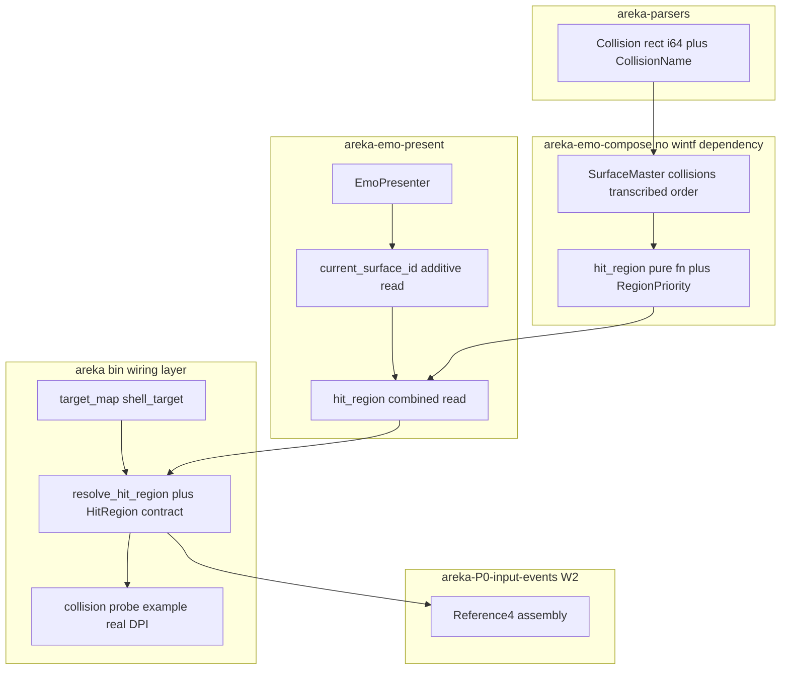
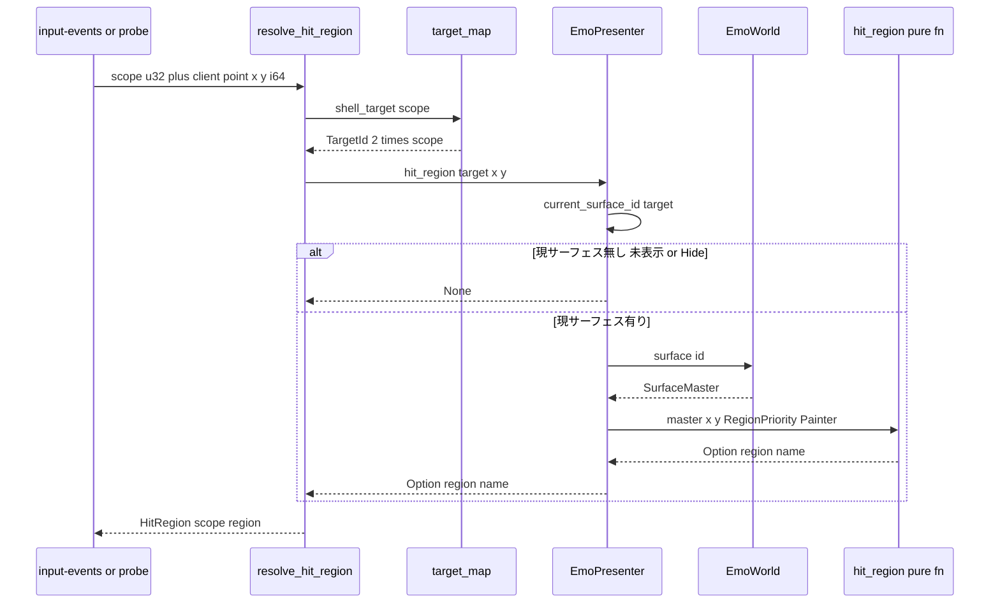
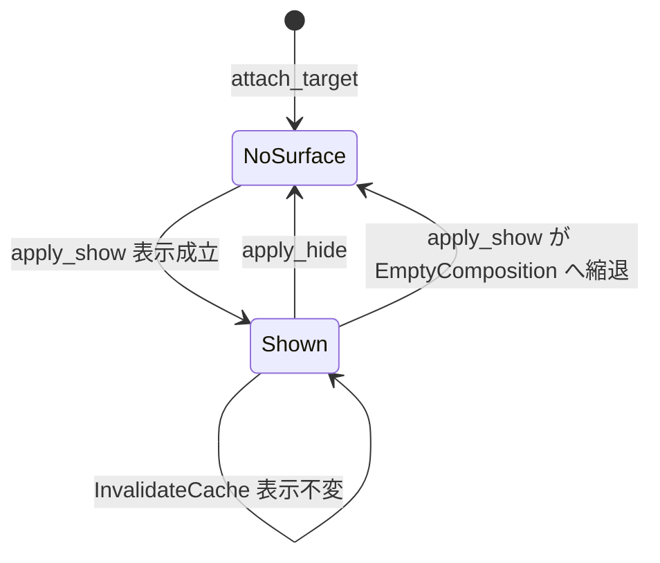

# Technical Design Document

## Overview

**Purpose**: マウス座標（窓 client 物理 px）と scope から当たり判定名（不透明 String・例 `"Head"`/`"Bust"`）を決定論で解決する純粋層を emo に確立し、`input-events`（③kanade）が消費する I/O 契約 `HitRegion { scope, region }` を正本として立てる。

**Users**: 第一消費者は `areka-P0-input-events`（`OnMouseMove`/`OnMouseDoubleClick` の Reference4 組立）。将来の消費者は `emo2-conformance-e2e`（撫で適合項目）。

**Impact**: 現状 `SurfaceMaster.collisions`（`normalized.rs:76`）は保持されるだけで実行時消費者がゼロである。本 spec は (1) emo-compose に純関数コア、(2) emo-present に現サーフェス id の additive 読み口、(3) areka 結線層に UI スレッド同期リゾルバ、の3部品を増設してこの死蔵データを初めて生かす。既存の表示（present）経路・`AlphaMask`（クリック透過）は不触である。

### Goals

- 座標→領域名の解決を、GPU/表示を要さない決定論的純関数として確立する（1.1–1.5・7.1）。
- 重なり優先を emo の合成規約＝画家のアルゴリズム（後定義が手前）へ一貫させ、差替シームを型で予約する（2.1–2.3）。
- `HitRegion { scope: u32, region: Option<String> }` を本 spec 正本として一意に確定し、`input-events` が再定義せず並走できる状態にする（5.1–5.4）。
- リゾルバの座標契約（窓 client 物理 px ＝ サーフェス px・k=1.0）を実 DPI（≠96）・本番 emo2 表示の実測証跡で実証する（7.3）。

### Non-Goals

- SHIORI への配信・Reference の組立・撫で意味論（連打解釈）＝`input-events` および SHIORI 側の領分。
- 不定形当たり判定 `collisionex`（rect/ellipse/circle/polygon/region）＝M2。本 spec は型シームも設けない（下記 Out of Boundary の理由を参照）。
- `collision-sort`（none/ascend/descend）の忠実解決＝画家則へ一本化（2.2・型シームのみ予約）。
- `AlphaMask`・クリック透過・マウスイベント取得経路の変更（完了済み基盤・不触）。
- アニメーション由来 collision（`animation*.collision*`・`base` 描画メソッドによる collision 差替）＝seriko-loop / mayuna-compose の領分（Revalidation Triggers に登録）。

## 正典確定表（design 冒頭の確定＝要件 1.4 / brief 指示）

> 出典: ukadoc MCP（`descript_shell_surfaces` の `collision`/`collision-sort`/`collisionex` 各節、`dev_shell`、`list_shiori_event:OnMouseMove` 他）。**「SILENT」は正典に記述が無いことを実地に確認した結果であり、記述を見落とした結果ではない。** SILENT 行は本 spec の設計判断として決定し、根拠と再検証トリガを明示する。

| # | 論点 | 正典（ukadoc）の記述 | 本 spec の確定 | 根拠・再検証トリガ |
|---|------|----------------------|----------------|--------------------|
| C1 | 座標の意味 | **STATED**（`dev_shell`）: サーフェス画像自体の左上を 0,0 とし、四角形の左上 x,y と右下 x,y の並び。`collision*,始点X,始点Y,終点X,終点Y,ID` | `left/top` = 左上、`right/bottom` = 右下。原点＝サーフェス画像左上。parsers の転記（`model.rs:150-165`・i64）と一致 | 転記層が既に正典順で写している（再定義しない） |
| C2 | **含端規則（境界の内外）** | **SILENT**。`collision` 節の幾何記述は「囲まれた範囲」のみ。境界画素の内外を述べた記述は正典に存在しない | **閉区間**＝`left <= x <= right && top <= y <= bottom`（4辺すべて含端） | 正典が沈黙ゆえリポジトリ内の既存前例へ揃える＝wintf `hit_region/mod.rs:365-368` が両端含む（`>=`/`<=`）。加えて「囲まれた範囲」に除外の明示が無い読みと整合。**再検証トリガ**: SSP 実挙動が排他境界を示した場合、変更点は純関数の比較式1箇所（`hit.rs`）に閉じる |
| C3 | 重なり優先 | **STATED**（`collision-sort`）: 既定 `none` ＝「IDによらず先に書かれている方が手前」。`ascend`＝昇順(1,2,3…)が手前、`descend`＝降順。ソート対象は collisionID（`collisionN` の N）であって名前ではない | **画家のアルゴリズム＝後に定義された矩形が手前**（正典 `none` とは**逆向き**・要件ディスカッション議題1の開発者裁定） | emo 合成規約（`blit.rs:83`「画家のアルゴリズム・下層から上層」）との一貫＝見た目で手前の層と撫で解決を一致させる（2.1）。**意図的な正典逸脱**であり、`RegionPriority` 型シームで将来 reconcile 可能（2.3） |
| C4 | collisionID の一意性 | **STATED**: collisionID は同じ surface 内で重複しない通し番号 | 一意性は前提とせず、重複時も画家則で決定論縮退（後定義が勝つ） | `surface.append` は末尾連結（`fold.rs:121-122`）ゆえ index 重複は正典外領域で発生しうる。防御的に決定論を保つ |
| C5 | 領域名の重複 | **STATED**（`dev_shell`）: 同じ名前の当たり判定を複数回設定してもよい（例: 手を Hand として2行に分ける） | 名前は**多対一のラベル**でありキーではない。純関数は最前面の矩形の名前を返すのみ | 名前による索引・集約を作らない設計上の根拠 |
| C6 | 1サーフェスの collision 上限 | **STATED**（`dev_shell`）: 最大 256 個 | 線形走査（最大 256 矩形）で十分＝索引構造を作らない | Performance 節を参照 |
| C7 | collision 無し時の Reference4 値 | **SILENT**。全マウスイベントの Reference4 は「当たり判定の識別子」の一文のみで、非該当時の値の規定が無い（空文字は里々/YAYA 等の**事実上の慣行**であって正典ではない） | **本 spec の管轄外**＝解決層は `region: None` を返すのみ（5.3）。`None`→空文字 Reference4 の転写は `input-events` の責務（要件 Adjacent expectations） | 正典が沈黙である事実を `input-events` へ申し送る（Coordination Notes C-2） |
| C8 | 透明画素と collision の関係 | **SILENT**。正典は透過色と「窓としてのクリック可否」（半透明部分はクリックできる／透明部分は完全な黒に）を述べるのみで、collision 判定を α が gate するか否かは述べていない | **別層**＝純関数は α を一切参照しない（6.1）。`AlphaMask` は不触（6.2） | α 由来の `AlphaMask` は領域名を持たない（`alpha_mask.rs:16-104`）＝データ上も直交。ただし**エンド一周では透明画素上のイベントが窓へ届かない**（クリック透過）ため実効経路が異なる＝Coordination Notes C-3 |
| C9 | マウス局所座標（Ref0/1）の座標空間 | **SILENT**。「ローカル座標」とのみ記され、collision 座標空間（サーフェス画像左上原点）との同一性は明記されていない。DPI/スケーリングとの関係も記述なし | **窓 client 物理 px ＝ サーフェス px（k=1.0）** として照合する（4.3） | 正典が沈黙ゆえ areka 側の座標契約（下表 C10）が唯一の根拠。**この同一性こそ 7.3 の probe が実証する対象**（正典の裏付けが無いため机上で担保できない） |

### 座標契約の確定表（研究 §10.3 指示・物理/論理・原点・scale k の3列）

| 面 | 物理 / 論理 | 原点 | scale k | 典拠（file:line） |
|----|------------|------|---------|-------------------|
| 窓 client 座標（入力点） | **物理 px** | 窓 client 左上 | — | `completed/areka-P0-window-placement`（物理 px 単一通貨）・`hit_test/mod.rs:150-153`（マスク原寸＝表示 surface 原寸＝物理 px で恒等写像） |
| サーフェス px（collision 矩形） | **物理 px** | サーフェス画像左上 | — | 正典 C1・`model.rs:150-165` |
| emo-present 合成 | **物理 px** | サーフェス画像左上 | **k = 1.0 恒常** | `presenter.rs:117-118` `CURRENT_COMPOSE_SCALE: f32 = 1.0`・`presenter.rs:108-114` `TextSlotView::scale()` doc |

**k=1.0 限定契約（要件 Adjacent expectations「k=1.0 依存の明文化」・研究 §10.3）**: 4.3「サーフェス px で照合」は等倍（k=1.0）への依存である。将来 emo-present が DPI スケーリング（k = モニタ DPI ÷ author_dpi）を導入する場合、**供給値の単一変更点は `TextSlotView::scale()`（`presenter.rs:110-111` の doc が宣言する1点）**であり、その時点で本 spec の純関数は「照合前に点を k で除す」変更を要する＝**再検証トリガ**として Revalidation Triggers に登録する。本 spec は k≠1.0 を実装しない（`scale()` が 1.0 以外を返す実装が存在しないため）。

## Boundary Commitments

### This Spec Owns

- **座標→領域名の純関数コア**（`areka-emo-compose`）: 含端規則（C2）・重なり優先（C3）・`None` 経路の決定論的解決。
- **重なり優先規則の型シーム** `RegionPriority`（画家則のみ実装・2.3）。
- **現サーフェス id の読み口**（`areka-emo-present` additive）: target 別「いま表示されているサーフェス id」の単一真実源。
- **`HitRegion { scope: u32, region: Option<String> }` 契約の正本**（5.4・roadmap「⑥ emo」増分が本 spec を正本と指名）。
- **UI スレッド同期リゾルバ** `resolve_hit_region(presenter, scope, x, y)`（結線層）。
- **リゾルバ座標契約の実測証跡**（実 DPI≠96・本番 emo2 表示の probe＋`acceptance-record.md`・7.3）。
- **`SurfaceMaster.collisions` の順序不変条件の doc 明文化**（研究 §10.4・型は不改変＝doc のみ additive）。

### Out of Boundary

- SHIORI 配信・Reference 組立・`None`→空文字 Reference4 の転写（`input-events`）。
- 撫で意味論（連打・撫でカウンタ）＝SHIORI 側。
- バルーン側 choice ヒット（`choice-render`・target 奇数）＝本 spec は shell 窓（target 偶数）専用。
- `collisionex`（rect/ellipse/circle/polygon/region＝M2）の**実装**。要件 Boundary Context / brief の「型シームのみ・矩形 enum の余地」は、**形状 enum を新設せずに満たす**: 純関数の署名 `hit_region(&SurfaceMaster, x, y, RegionPriority) -> Option<&str>` は**形状に言及しない**（入力＝正規化形・出力＝領域名）ため、既に形状非依存＝インターフェース側で余地が開いている（design-synthesis「インターフェースを一般化し、実装は一般化しない」）。形状の語彙は upstream `areka-parsers` の転記型（`Collision` と将来の `CollisionEx`）が持つべきものであり、本 spec が形状 enum を先取り新設すると (a) 正規化形の再定義（要件 Adjacent expectations が禁止）か (b) 単一 variant の投機的抽象（design-synthesis が禁止）のいずれかになる。よって M2 は parsers 増分＋純関数内の走査追加で届く。
- `AlphaMask`・クリック透過・マウスイベント取得/配信経路（完了済み基盤・不触）。
- アニメーション由来 collision（`animation*.collision*`・`base` 描画メソッドの collision 差替）＝bind 依存の collision 集合は seriko-loop / mayuna-compose の領分。
- 撫で一周（マウス→SHIORI→応答 talk）の統合実機サインオフ＝`input-events` Req8.3（撫でクラスタ合流サインオフ・7.4）。

### Allowed Dependencies

- **Upstream**: `areka-parsers`（`Collision`/`CollisionName` 転記型・再定義しない）／`areka-emo-compose`（`SurfaceMaster`・`EmoWorld`）／`areka-emo-present`（`EmoPresenter`・`TargetId`）／`crate::emo2_boot::target_map`（scope→target 写像の正本）。
- **依存方向（厳守・`areka-emo-present/src/lib.rs:19-23` が正本）**: `areka-parsers → areka-emo-atlas → areka-emo-compose → areka-emo-present → areka(bin)`。**逆方向の import はレビュー時にエラーとして扱う。**
- **禁止**: `areka-emo-compose` から wintf への依存（`lib.rs:21-26` の憲章＝crate charter）。純関数コアは wintf 型（`Shape`/`Size`/`PhysicalPoint`）を一切参照しない。
- 新規依存なし・tokio 不使用・Rust 2024。

### Revalidation Triggers

以下の変更は下流（`input-events`・`emo2-conformance-e2e`）または本 spec の再検証を強制する。

1. **`HitRegion` の形（`scope` 型・`region` の所有形）の変更** → `input-events` の消費面が破れる。
2. **k=1.0 契約の解除**（`TextSlotView::scale()` が 1.0 以外を返す実装の導入） → 4.3 の照合空間が破れ、純関数への点の受け渡しにスケール除算が要る。7.3 probe の再実行が必須。
3. **含端規則（C2）の変更**（SSP 実挙動との突合で排他境界が判明した場合） → 純関数の比較式1箇所＋境界檻の更新。
4. **重なり優先（C3）の変更**（`collision-sort` 忠実解決へ舵を切る場合） → `RegionPriority` へ variant 追加＝純関数内の網羅 match がコンパイルエラーで漏れを検出。データ配管は不要（`EmoWorld::collision_sort()`（`world.rs:150-152`）が既に world 面で参照可能＝本 spec は参照しない）。
5. **collision 集合が base surface id のみで決まらなくなる変更**（`animation*.collision*` の実装・`base` 描画メソッドによる collision 差替＝seriko-loop / mayuna-compose） → 現サーフェス読み口の契約（id だけで collision 集合が決まる）が破れ、bind を含む鍵が必要になる。
6. **`SurfaceMaster.collisions` の順序変更**（fold が末尾連結以外の順序へ変わる） → 画家則の意味論が転記順に依存するため檻が破れる。
7. **リゾルバの shell 専用契約の変更**（balloon target を扱う要求） → target 偶奇の互いに素性が前提（`target_map.rs` DD-3 不変条件）。
8. **tick 固定順（Input≪FrameFinalize）または `Emo2Wiring` の NonSend 常駐形の変更** → Resolver 節「リゾルバ到達性」の前提（ハンドラ実行時に wiring が必ず在る）が破れ、W2 配線の再検証を要する（順序の檻＝`world/mod.rs:508-520`・`tick_order_tests`）。

## Architecture

### Existing Architecture Analysis

- **データ経路は既に完成している**: `Surface.collisions`（`model.rs:70-71`・出現順）→ `SurfaceMaster.collisions`（`normalized.rs:76`・転記のまま）→ `EmoWorld::surface(id)`（`world.rs:107-111`）。本 spec は**消費層のみ**を足す。
- **実行時消費者はゼロ**: emo-present の `collisions` 参照は全てテスト補助の `Vec::new()`。
- **現サーフェス id の読み口は真の欠落**: `PresentTarget`（`presenter.rs:52-69`）に surface id のフィールドが無く、`ComposeKey`（`cache.rs:48-52`）は private で accessor も無い。`EmoPresenter` の公開面は `new`/`attach_target`/`apply`/`text_slot_view`/`read_back` の5つのみ。→ 新シームが必須。
- **additive read-only view の前例**: `TextSlotView`（`presenter.rs:80-115`・スナップショット値＋accessor のみ）と、その shell target 消費前例（`frame.rs:554-577`＝presenter 借用を解いてから `&mut World` を触る規律）。
- **既存の名前付きヒット領域（wintf `HitRegionMap`）は採用しない**: 座標が f32 DIP＋正規化・`Shape::Rect` は x/y/w/h（本 spec は i64 物理 px の left/top/right/bottom）・ECS Component 帰属・そして**定義順の先勝ち**（`hit_region/mod.rs:356`）＝画家則と**逆向き**。emo-compose は wintf 非依存が憲章ゆえ依存方向も破れる。→ Build vs Adopt の結論は「新規（A-1）」（研究 §9 の裁定が不一致をさらに増やす旨を確認済み）。
- **画家則の足場（順序）が未約束**: `normalized.rs:74` は `elements` に「layer 昇順・同 layer は登場順」を宣言する一方、`:76` の `collisions` は「転記のまま」のみで順序の約束が無い。画家則は転記順に意味論を載せるため、doc での不変条件明文化＋fold 出力を入力にした檻が要る（研究 §10.4）。

### Architecture Pattern & Boundary Map

**Selected pattern**: 純粋コア＋薄い合成（Functional Core / Imperative Shell）。判断分岐（含端・重なり・None）を全て GPU 不要の純関数へ寄せ、状態（現サーフェス id）は単一真実源として presenter が持ち、結線層は写像と組立のみを行う。



**Architecture Integration**:

- **Domain/feature boundaries**: 判断（純関数・emo-compose）／状態（現 id・emo-present）／写像と組立（結線層・areka bin）の三分。各層は単独でテスト可能。
- **Existing patterns preserved**: additive read-only accessor（`TextSlotView` 前例）／presenter 借用を解いてから `&mut World`（`frame.rs:554-577` 前例）／in-source `#[cfg(test)]`（parsers/compose 慣行）／bin crate の内部項目テストは in-crate（`areka` は lib target 無し）。
- **New components rationale**: 純関数コア＝消費層が皆無ゆえ新規（wintf 資産は座標系・依存方向・優先規則の3点で不一致）。現 id 読み口＝presenter に保持フィールドが無い真の欠落。リゾルバ＝scope→target→id→純関数を束ねる唯一の窓口（`input-events` はここだけを握る）。
- **Steering compliance**: emo が「見える・触れる」の窓口＝kanade へは解決済みイベントのみ（roadmap「emo の責務範囲」）／emo-compose の wintf 非依存憲章／物理 px 単一通貨／本番ゴースト先行の原則（7.3 probe）。

### Technology Stack

| Layer | Choice / Version | Role in Feature | Notes |
|-------|------------------|-----------------|-------|
| 純関数コア | Rust 2024 / std のみ | 座標→領域名の決定論解決 | `areka-emo-compose`（既存 crate へ module 追加）・新規依存なし |
| 状態読み口 | Rust 2024 / 既存 `areka-emo-present` | 現サーフェス id の単一真実源 | additive（新フィールド1＋accessor2） |
| 結線層 | Rust 2024 / `areka` bin crate | scope→target→解決の合成・`HitRegion` 契約 | `crate::` パス不使用（probe から `#[path]` 到達可能にするため） |
| 検証（probe） | `windows` crate（既存依存）・`wintf`・`areka-emo-present` | 実 DPI≠96・本番 emo2 表示の実測証跡 | `crates/areka/examples/`・`GetClientRect`/`GetCursorPos`/`ScreenToClient` |

新規依存は無い。

## File Structure Plan

### Directory Structure

```
crates/
├── areka-emo-compose/src/
│   ├── hit.rs                 # 【新規】純関数コア: hit_region() + RegionPriority（wintf 非依存・std のみ）
│   ├── lib.rs                 # 【変更】mod hit; と pub use（公開面の追加のみ）
│   ├── normalized.rs          # 【変更】collisions の順序不変条件を doc 明文化（型は不改変）
│   └── fold.rs                # 変更なし（末尾連結の既存挙動が画家則の足場・檻は hit.rs 側に置く）
├── areka-emo-present/src/
│   └── presenter.rs           # 【変更】PresentTarget に current_surface_id フィールド1個＋
│                              #         EmoPresenter::current_surface_id()/hit_region() の additive accessor 2個
└── areka/
    ├── src/emo2_boot/
    │   ├── hit_region.rs      # 【新規】HitRegion 契約 + resolve_hit_region()（crate:: パス不使用・super::target_map のみ）
    │   ├── mod.rs             # 【変更】pub mod hit_region; の1行追加
    │   └── target_map.rs      # 変更なし（scope→target 正本・既に crate:: フリー）
    └── examples/
        └── collision-probe.rs # 【新規】実 DPI probe（#[path] で target_map.rs / hit_region.rs / placement/mod.rs を私有 include）
```

### Modified Files

- `crates/areka-emo-compose/src/lib.rs` — `mod hit;` 宣言と `pub use hit::{hit_region, RegionPriority};`。公開面の追加のみ。
- `crates/areka-emo-compose/src/normalized.rs` — `collisions` フィールドの doc に順序不変条件を追記（「登場順。`surface.append` 由来は末尾へ連結される（`fold.rs:121-122`）。画家則（後定義が手前）はこの順序に意味論を載せる」）。**型・フィールド・挙動は不改変**＝「正規化形を再定義しない」に抵触しない。
- `crates/areka-emo-present/src/presenter.rs` — private フィールド `current_surface_id: Option<u32>` を `PresentTarget` へ追加し、`apply_show` の**表示成立時**と `apply_hide` でのみ更新。公開 accessor 2個を追加。既存の表示ロジック（合成・キャッシュ・swap chain・visual）は不改変（3.4）。
- `crates/areka/src/emo2_boot/mod.rs` — `pub mod hit_region;` の1行追加。

### 成果物（本 spec のリポジトリ外成果）

- `.kiro/specs/areka-P0-collision-geometry/acceptance-record.md` — 7.3 の実測証跡（`completed/areka-P0-window-placement/acceptance-record.md` の構造を踏襲＝probe の rustdoc 連番プロトコルと1:1 対応する表＋物理 px 実測値＋dpi≠96 の判定行）。

### 配置の決定的制約（要件 Adjacent expectations「リゾルバ合成の配置制約」の確定）

- `crates/areka` は **bin-only crate**（lib target 無し）ゆえ example から `use areka::...` は不可能。
- 前例（`window-placement.rs:99-113`）の機構は **`include!` ではなく `#[path]` モジュール宣言**である（リポジトリ内に `include!` は1件も存在しない）。成立条件は「対象モジュールの非テストコードが `super::` と外部 crate のみを参照する（`crate::` パスは `#[cfg(test)]` 内のみ）」こと。
- `emo2_boot/mod.rs` は**非テストコードに `crate::is_benign_boot_error` の実呼出（`:305`）**を持つため `#[path]` include 不能。`adapter.rs:16` も `crate::emo2_boot::target_map::...` を使う。
- → **`hit_region.rs` は `crate::` パスを一切使わず、`super::target_map::shell_target` と外部 crate のみを参照する**。これにより probe は次の2行で到達できる（`hit_region` の `super::target_map` が example ルートの `target_map` へ解決される）:

```rust
#[path = "../src/emo2_boot/target_map.rs"]
mod target_map;
#[path = "../src/emo2_boot/hit_region.rs"]
mod hit_region;
```

バイナリ側では `crate::emo2_boot::hit_region` の `super::target_map` が `crate::emo2_boot::target_map`（正本）へ解決される＝**写像の二重定義を作らない**。

## System Flows

### 解決フロー（UI スレッド同期・4.1–4.4）



**Key decisions**（図に現れない判断のみ）:

- リゾルバは全経路で `HitRegion` を返す（`Option<HitRegion>` にしない）。scope は常に既知であり、解決不能は `region: None` として表現する（4.4・5.3）＝呼び手に二重の `Option` を強いない。
- 借用は `&EmoPresenter` のみ。`&mut World` を要求しないため `frame.rs:554-577` の規律（借用を解いてから `&mut World`）と衝突しない。

### 現サーフェス id の状態遷移（3.1–3.4）



**Key decisions**:

- **不変条件**: `current_surface_id` は「**最後に表示が成立したサーフェス id**」である（「画面に見えている絵」ではない——全透明な合成でも表示は成立し、その id が collision 解決として正しい値である＝6.1「α を参照しない」と整合）。ゆえに (a) `apply_hide` は `None` へ倒す（`\s[-1]` 相当＝表示していない・4.4「未表示等」が Hide を含む）、(b) 合成が `EmptyComposition` へ縮退した経路は Hide と同じ表示結果ゆえ `None`、(c) **表示が成立しなかった失敗経路は前値を保持する**（直前のサーフェスが画面に残っているため `None` にすると画面と乖離する）、(d) `InvalidateCache` は表示を変えないため不変、(e) `attach_target` の再登録（`presenter.rs:157-169`）は `PresentTarget` ごと置換するため `None` へ戻る（mount/chain も drop され画面とも整合・doc に明記する）。
- この不変条件が `ComposeKey` 由来案（研究 §4 論点 B-2）を棄却する根拠である: `invalidate_all` でキーが消える一方で表示は残るため、画面と乖離する。
- **書き込み点は既存の `visible` 更新点と同一の3箇所**（分岐を1本も足さない）: 表示成立＝`presenter.rs:352`（`target.visible = true` の直後）／`EmptyComposition` 縮退＝`:237`（`visible = false` の隣）／`Hide`＝`:382`。**全ての失敗経路（合成失敗 `:249`・Compositor 不在 `:274-281`・GraphicsCore 不在 `:291-297`・chain 生成失敗 `:305-308`・mount 失敗 `:316-318`・upload 失敗 `:335`）は `:352` より手前で early return する**ため、(c)「失敗＝前値保持」は追加の分岐なしに自動的に成立する。

## Requirements Traceability

| Requirement | Summary | Components | Interfaces | Flows |
|-------------|---------|------------|------------|-------|
| 1.1 | 矩形内→領域名（不透明 String） | HitCore | `hit_region()` | 解決フロー |
| 1.2 | 矩形外→None | HitCore | `hit_region()` | 解決フロー |
| 1.3 | collision 未定義→None | HitCore | `hit_region()` | 解決フロー |
| 1.4 | 境界上→単一の含端規則で決定論解決 | HitCore | `hit_region()`（C2＝閉区間） | 正典確定表 C2 |
| 1.5 | 同一入力→同一結果（決定論） | HitCore | `hit_region()`（純関数・状態なし） | — |
| 2.1 | 重なり→後定義が手前（画家則） | HitCore | `hit_region()`（逆順走査・先勝ち） | 正典確定表 C3 |
| 2.2 | `collision-sort` 忠実解決に非依存 | HitCore | `EmoWorld::collision_sort()` を参照しない | 正典確定表 C3 |
| 2.3 | 優先規則の型シーム予約 | HitCore | `RegionPriority`（`#[non_exhaustive]`・`Painter` 単一 variant） | Revalidation Trigger 4 |
| 3.1 | 表示後→直近 id | CurrentSurfaceRead | `EmoPresenter::current_surface_id()` | 状態遷移 |
| 3.2 | 未表示→無し | CurrentSurfaceRead | 同上（`Option<u32>` の `None`） | 状態遷移 |
| 3.3 | 切替→新 id | CurrentSurfaceRead | 同上 | 状態遷移 |
| 3.4 | 本体ロジック無改変の additive | CurrentSurfaceRead | private フィールド1＋accessor（既存経路の分岐を足さない） | 状態遷移 |
| 4.1 | scope＋点→束ねて解決 | Resolver | `resolve_hit_region()` | 解決フロー |
| 4.2 | UI スレッド同期・channel/async 不要 | Resolver | `&EmoPresenter` 同期呼出（`EmoWorld` は非 Send/Sync） | 解決フロー |
| 4.3 | 同一座標空間（サーフェス px）で照合 | Resolver / Probe | i64 恒等・k=1.0 契約 | 座標契約の確定表 |
| 4.4 | 現 id 解決不能→region None | Resolver | `HitRegion { scope, region: None }` | 解決フロー |
| 5.1 | `HitRegion { scope, region }` 形の提供 | HitRegionContract | `pub struct HitRegion` | — |
| 5.2 | region は不透明 String・意味解釈しない | HitRegionContract | `Option<String>`（転写のみ） | — |
| 5.3 | 非該当→region None | HitRegionContract | 同上 | 解決フロー |
| 5.4 | 契約の正本性（input-events は再定義しない） | HitRegionContract | 単一定義箇所＝`emo2_boot/hit_region.rs` | Coordination Notes C-1 |
| 6.1 | 透明画素上でも矩形内なら解決 | HitCore | α を参照しない純関数 | 正典確定表 C8 |
| 6.2 | `AlphaMask` を変更せず独立に解決 | HitCore | `AlphaMask` 不触（別 crate・別データ） | 正典確定表 C8 |
| 7.1 | GPU/実描画なしで全経路単体テスト可能 | HitCore | 純関数（入力＝値・出力＝値） | Testing Strategy |
| 7.2 | fixture 実値で (a)–(e) 網羅 | HitCore | 単体テスト群 | Testing Strategy |
| 7.3 | 実 DPI≠96・本番 emo2 表示の probe 証跡 | Probe | `collision-probe.rs`＋`acceptance-record.md` | Probe プロトコル |
| 7.4 | 統合サインオフを撫でクラスタ合流へ帰属 | — | Coordination Notes C-4（本 spec では実施しない） | — |

## Components and Interfaces

| Component | Domain/Layer | Intent | Req Coverage | Key Dependencies (P0/P1) | Contracts |
|-----------|--------------|--------|--------------|--------------------------|-----------|
| HitCore | emo-compose（純粋層） | 座標→領域名の決定論解決 | 1.1–1.5, 2.1–2.3, 6.1–6.2, 7.1–7.2 | `SurfaceMaster` (P0), `Collision` (P0) | Service |
| CurrentSurfaceRead | emo-present（状態） | 現サーフェス id の単一真実源 | 3.1–3.4 | `EmoPresenter` (P0) | Service, State |
| HitRegionContract | areka bin（結線層） | region/actor I/O 契約の正本 | 5.1–5.4 | — | Service |
| Resolver | areka bin（結線層） | scope→target→id→純関数の合成 | 4.1–4.4 | `target_map` (P0), `EmoPresenter` (P0), HitCore (P0) | Service |
| Probe | areka examples（検証） | 実 DPI 座標契約の実測証跡 | 7.3 | Resolver (P0), `wintf` (P0), `windows` (P0) | Batch |

### emo-compose（純粋層）

#### HitCore

| Field | Detail |
|-------|--------|
| Intent | `SurfaceMaster.collisions` に対する座標照合を決定論で解く純関数 |
| Requirements | 1.1, 1.2, 1.3, 1.4, 1.5, 2.1, 2.2, 2.3, 6.1, 6.2, 7.1, 7.2 |

**Responsibilities & Constraints**

- 状態を持たない純関数。ログを出さない（マウス移動ごとの高頻度経路＝logging.md の `trace!` 相当だが、純粋層は観測を呼び手へ委ねる）。
- α（`AlphaMask`）・`collision-sort`・DPI・wintf 型を一切参照しない。
- 走査は `collisions` を**逆順**に見て最初に当たった領域を返す＝画家則（後定義が手前）の等価かつ決定論的実装（2.1）。上限 256 矩形（C6）ゆえ索引構造を持たない。
- 矩形比較は**閉区間**（C2）。反転/退化矩形（`left > right` 等）は正規化せず、そのまま比較する結果として**何にも当たらない**（決定論的縮退・正典に正規化の規定は無いため発明しない）。

**Dependencies**

- Inbound: CurrentSurfaceRead（`EmoPresenter::hit_region` が呼ぶ） — 解決の実行 (P0)
- Outbound: `areka_parsers::shell::Collision`（pub フィールド i64・`CollisionName::as_str()`） — 矩形と名前の読取 (P0)
- External: なし

**Contracts**: Service [x] / API [ ] / Event [ ] / Batch [ ] / State [ ]

##### Service Interface

```rust
/// 当たり判定の重なり解決規則（型シーム・2.3）。
///
/// 本 spec は `Painter` のみを実装する。SSP `collision-sort`（none/ascend/descend）の
/// 忠実解決は行わない（2.2・正典確定表 C3 の意図的逸脱）。
///
/// **シームの機序**: variant を追加すると `hit_region` 内の**網羅 match がコンパイルエラー**
/// となり実装漏れを機械的に検出する。これを成立させるため `hit_region` の match に
/// `_` アームを置いてはならない（実装制約＝レビュー担保）。
/// `#[non_exhaustive]` は定義 crate 内では効かないため検出機序ではない。下流（areka bin・
/// example）に wildcard を強制する副作用があるが、現状 `Painter` 決め打ちゆえ無害。
#[non_exhaustive]
#[derive(Debug, Clone, Copy, PartialEq, Eq, Default)]
pub enum RegionPriority {
    /// 画家のアルゴリズム: 後に定義された矩形が手前（emo 合成規約 `blit.rs:83` と一貫）。
    #[default]
    Painter,
}

/// サーフェス px 座標 `(x, y)` が属する当たり判定の領域名を返す。
///
/// 含端規則: 閉区間（`left <= x <= right && top <= y <= bottom`・正典確定表 C2）。
/// 重なり: `priority` に従う（`Painter` = 後定義が手前）。
/// α（透明画素）は参照しない（6.1）。
pub fn hit_region<'a>(
    master: &'a SurfaceMaster,
    x: i64,
    y: i64,
    priority: RegionPriority,
) -> Option<&'a str>;
```

- **Preconditions**: `(x, y)` は `master` と同一座標空間（サーフェス px・原点＝サーフェス画像左上）であること。呼び手が k=1.0 契約を保証する（4.3）。
- **Postconditions**: 当たりがあれば最前面矩形の `CollisionName::as_str()` を返す。無ければ `None`（1.2/1.3）。戻り値の寿命は `master` に従う（割当なし）。
- **Invariants**: 同一 `(master, x, y, priority)` に対し常に同一結果（1.5）。`master` を変更しない。

**Implementation Notes**

- Integration: 呼び出し元は `EmoPresenter::hit_region` の1箇所のみ（`EmoWorld` が presenter 私有のため）。
- Validation: 判断分岐（内/外/境界4辺・重なり・空・退化・同名重複）は全て純関数の単体テストで網羅（7.1/7.2）。
- Risks: 画家則は `collisions` の転記順に意味論を載せる（研究 §10.4）。順序不変条件を `normalized.rs` の doc で明文化し、fold 出力を入力にした檻で固定する（Revalidation Trigger 6）。
- 点の型は `i64` 2引数とする。`Collision` が i64 ゆえ変換・丸めが生じず整数厳密性を保つ（f32 DIP へ写す wintf `HitRegionMap` 再利用案を棄却した中心的理由）。

### emo-present（状態）

#### CurrentSurfaceRead

| Field | Detail |
|-------|--------|
| Intent | target 別「いま表示されているサーフェス id」の単一真実源と、それを用いた解決の窓口 |
| Requirements | 3.1, 3.2, 3.3, 3.4 |

**Responsibilities & Constraints**

- `PresentTarget` に private フィールド `current_surface_id: Option<u32>` を持ち、**表示成立の結果と一致させる**（状態遷移図の不変条件）。
- 既存の表示ロジック（合成・キャッシュ・swap chain・visual・reply）に分岐を足さない。書き込みは既存の `visible` 更新点と同一の3箇所のみ（3.4・状態遷移図の Key decisions）。
- **3.4「additive な読み取りのみ」との和解**: 3.1–3.3（表示後→id・切替→新 id）は状態の保持なしには充足不能であり、要件が依拠する研究 §4 論点 B-1 は**まさにこの形**を「本体無改変の純増（3.4）」と定義している。本設計の additive は「**読み口と状態の純増であり、表示の判断分岐を1本も増やさない**」の意である（既存の `visible` 代入と同じ行で id を刻むのみ）。
- `EmoWorld` を外部へ露出しない（`&SurfaceMaster` の借用を presenter 外へ出さない）ため、純関数の呼出は presenter 内で行う（研究 §4 論点 C-1）。

**Dependencies**

- Inbound: Resolver — 解決の実行 (P0)
- Outbound: HitCore — 座標照合 (P0)／`EmoWorld::surface(id)`（`world.rs:107-111`） — `SurfaceMaster` の取得 (P0)
- External: なし（新規依存なし）

**Contracts**: Service [x] / API [ ] / Event [ ] / Batch [ ] / State [x]

##### Service Interface

```rust
impl EmoPresenter {
    /// 対象 target がいま表示しているサーフェス id（3.1–3.3）。
    ///
    /// 未表示（一度も `ShowSurface` していない）・`Hide` 済み・空合成へ縮退した場合は `None`。
    /// 未登録 target も `None`。
    pub fn current_surface_id(&self, target: TargetId) -> Option<u32>;

    /// 現サーフェスの当たり判定を解決する（`current_surface_id` → `EmoWorld::surface` → 純関数）。
    ///
    /// 座標はサーフェス px（＝窓 client 物理 px・k=1.0 契約）。現サーフェス無しは `None`（4.4）。
    pub fn hit_region(&self, target: TargetId, x: i64, y: i64) -> Option<&str>;
}
```

- **Preconditions**: UI スレッドから同期呼出されること（`EmoPresenter` は `PhantomData<*const ()>`＝`presenter.rs:129` で UI スレッド固定を型で担保しており、`&EmoPresenter` を取る本 API はその制約を継承する）。
- **Postconditions**: `hit_region` の戻り値の寿命は `&self` に従う（マウス移動ごとの割当を生まない）。所有化は結線層が行う。
- **Invariants**: `current_surface_id(t) == Some(id)` ⟺ target `t` が id のサーフェスを表示中。

##### State Management

- **State model**: `PresentTarget.current_surface_id: Option<u32>`（private）。
- **Persistence & consistency**: 永続化しない。単一真実源＝本フィールド（`ComposeKey` からは導出しない＝`invalidate_all` で消えるため画面と乖離する）。
- **Concurrency strategy**: UI スレッド固定（既存 presenter と同一）。ロック・channel なし。

**Implementation Notes**

- Integration: `apply_show` の**表示が成立した経路**で `Some(surface_id)`、`apply_hide` および空合成縮退経路で `None`。失敗経路は前値保持（画面に残る前サーフェスと一致させるため）。
- Validation: 既存 present 挙動の非退行は既存テストスイートの緑で担保する（3.4・新規の観測を足さない＝証明済み配線を再テストしない）。
- Risks: 将来 `animation*.collision*` / `base` 描画メソッドが導入されると collision 集合が base surface id だけで決まらなくなる（Revalidation Trigger 5）。emo2 fixture には animation collision が存在しない（実測: collision 行は4行のみ）ため M1 では顕在化しない。

### areka bin（結線層）

#### HitRegionContract

| Field | Detail |
|-------|--------|
| Intent | region/actor I/O 契約の正本（`input-events` が参照し再定義しない） |
| Requirements | 5.1, 5.2, 5.3, 5.4 |

**Contracts**: Service [x] / API [ ] / Event [ ] / Batch [ ] / State [ ]

##### Service Interface

```rust
/// 当たり判定の解決結果（region/actor I/O 契約の**正本**・5.4）。
///
/// `region` は**不透明 String**であり、本層は意味解釈しない（5.2）。
/// 非該当・現サーフェス無しは `None`（5.3・4.4）。`None` → 空文字 Reference4 の
/// 転写は `input-events` の責務（正典は Reference4 の非該当値に沈黙＝確定表 C7）。
#[derive(Debug, Clone, PartialEq, Eq)]
pub struct HitRegion {
    /// ゴースト scope（0=本体 / 1=相方 …）。型は `target_map` の正本へ揃える（研究 §10.5）。
    pub scope: u32,
    /// 当たり判定の領域名（不透明）。
    pub region: Option<String>,
}
```

- `scope: u32`（brief の `usize` から是正）＝`target_map.rs:19` `shell_target(scope: u32)` および `scope_of -> Option<u32>` の実測に一本化する（研究 §10.5）。
- **窓種別の識別子は持たない**: リゾルバは **shell 窓専用**（target 偶数）であり、balloon（target 奇数・`choice-render` の領分）は扱わない。正典 `OnMouseMove` の Reference にバルーン識別子は存在しないため、区別は areka 側の結線規律で担保する（研究 §10.5）。この制約を型 doc とリゾルバ doc に明記する。
- **定義箇所の根拠**: `scope` は結線層の概念（`target_map` が正本を持つ層）であり、emo-present は `TargetId` しか知らない。契約型を emo-present へ置くと下流固有の概念（scope）を上流へ漏らす（design-principles「Do not leak downstream-specific behavior into upstream boundaries」）。第一消費者 `input-events` の UI 配線も areka bin（roadmap W2＝「kanade＋spawn.rs＋ポインタ配線」）に居るため、同一 crate で完結する。

#### Resolver

| Field | Detail |
|-------|--------|
| Intent | scope→target→現サーフェス id→純関数を束ねる唯一の窓口 |
| Requirements | 4.1, 4.2, 4.3, 4.4 |

**Dependencies**

- Inbound: `input-events`（W2） — 撫で/メニューの配信 (P0)／Probe — 座標契約の実測 (P0)
- Outbound: `super::target_map::shell_target` — scope→target 写像の正本 (P0)／`EmoPresenter::hit_region` — 解決 (P0)
- External: `areka_emo_present`（既に areka の通常依存） (P0)

**Contracts**: Service [x] / API [ ] / Event [ ] / Batch [ ] / State [ ]

##### Service Interface

```rust
/// (scope, 窓 client 物理 px) → 解決済み `HitRegion`（4.1–4.4）。
///
/// UI スレッド同期呼出（channel 化・非同期化は不要＝4.2）。**shell 窓専用**（target 偶数）。
/// 座標は窓 client 物理 px であり、k=1.0 契約によりサーフェス px と同一空間で照合される（4.3）。
pub fn resolve_hit_region(
    presenter: &EmoPresenter,
    scope: u32,
    x: i64,
    y: i64,
) -> HitRegion;
```

- **Preconditions**: `(x, y)` は当該 shell 窓の client 座標（物理 px）。UI スレッド。
- **Postconditions**: 常に `HitRegion { scope, .. }` を返す。現サーフェス未解決（未表示・Hide・未登録 target）は `region: None`（4.4）。
- **Invariants**: `scope` は入力をそのまま反映する（写像しない）。

**Implementation Notes**

- Integration: 非テストコードは **`crate::` パスを使用しない**（`super::target_map` と外部 crate のみ）。この規律が probe からの `#[path]` include を成立させる唯一の条件であり、破ると 7.3 の証跡取得経路が失われる（File Structure Plan「配置の決定的制約」）。
- Validation: 未表示 scope → `region: None` は GPU 不要で檻に入る（`EmoPresenter::new()` ＋未 attach target）。scope→target の写像自体は `target_map` の既存テストが持つ＝再テストしない（証明済み配線）。
- Risks: `resolve_hit_region` は所有 `String` を作る（`Option<&str>` → `Option<String>`）。マウス移動ごとの割当だが、対象は最大 256 矩形中の1名前・撫では低頻度（人間の手の速度）ゆえ許容する。

##### リゾルバ到達性（設計討議#1・2026-07-17）

R4「同期で得られる単一の窓口」の到達性は以下の実測事実で担保される。本 spec は到達経路を**実装しない**——ポインタ配線は roadmap 台帳の W2 割当であり、resolver の保持方式と粒度（per-scope／per-window）は `input-events` design の予約事項。線引きは「**呼び手が spec 内に居るもの＝実物を作る・次ウェーブに居るもの＝地図を残す**」（呼び手ゼロの配線は正しさを証明できない）。以下が W2 へ残す地図である。

- **呼出文脈**: ポインタハンドラは排他 system `dispatch_pointer_events(world: &mut World)`（`dispatch/mod.rs:209-253`・Input schedule）から UI スレッドで呼ばれる。wndproc は hit_test＋バッファ蓄積のみでハンドラを呼ばない。
- **`Emo2Wiring` の可用性**: remove→insert 窓（`frame.rs:648-659`）は FrameFinalize（tick 13本の最後尾）に閉じ、Input（先頭）との関係は同一 tick 内の固定順で完全直列（`world/mod.rs:508-520`・`tick_order_tests` が檻）。tick 中の wndproc 再入は try_borrow スキップ（`wndproc_bridge.rs:78`）＋`IS_TICK_FLUSH_IN_PROGRESS`（`vsync.rs:37-46`）＋SetWindowPos 遅延 flush（`tick_bridge.rs:199-200`）の三重防御で遮断される。**ゆえにハンドラ実行時点で `world.get_non_send_resource::<Emo2Wiring>()` は（`wire_emo2_boot` 済みなら）必ず `Some`**。`None` は wire 前のフォールバック boot のみ＝`region: None` 縮退がその状態の正しい写像（race の隠蔽ではない）。
- **座標**: `PointerState.client_point: PhysicalPoint`＝窓 client 物理 px（`types/mod.rs:92-94`・WM_MOUSEMOVE lparam 直系）＝リゾルバ入力契約と同一空間・無変換で渡せる。
- **scope**: `CharWindowMarker { scope: usize }`（`spawn.rs:65-68`）で entity→scope が O(1)。shell/balloon の判別（balloon 除外規律の実装点）も同 marker で足りる。
- **読みの鮮度**: presenter の読みは前フレーム FrameFinalize の確定値（最大1フレーム遅延）。欠陥ではなく仕様注記として W2 へ申し送る。

#### Probe

| Field | Detail |
|-------|--------|
| Intent | リゾルバの座標契約を実 DPI（≠96）・本番 emo2 表示で実測し証跡化する |
| Requirements | 7.3 |

**Contracts**: Service [ ] / API [ ] / Event [ ] / Batch [x] / State [ ]

##### Batch / Job Contract

- **Trigger**: `cargo run -p areka --example collision-probe`（手動実行・実 DPI≠96 のモニタ上）。
- **Input / validation**: emo2 fixture（`crates/pilot/examples/shiori-host-32/fixtures/emo2/shell/master/`）。次の3点を**実値で固定する**（donor の既定値をそのまま流用すると probe は成立しない・下記「donor からの必須逸脱」）:
  1. **表示対象＝`surface1000`**。実測により emo2 さくら側で collision を持つのは `surface1000` のみであり、`surface0`（`emo-present.rs`/`window-placement.rs` の既定表示）は **collision を1つも持たない**。`surface0` を出す probe は空集合しか観測できず証跡にならない。
  2. **`BindSet` は有効 bind の実値集合**（donor `emo-present.rs:170` の `BindSet::from_ids([1101, 1206, 1302, 1502, 1800])` 相当）。`surface1000` は**静的 element を持たず全パーツが bind 制御**（`surfaces.txt:17-19`）であるため、`BindSet::default()` では合成 ops が空になり——`compute_extent` は bind 非依存（`plan.rs:366-383`）ゆえ extent が非ゼロで `EmptyComposition`（`plan.rs:448-455`＝0×0 のときのみ）にも該当せず——**成功経路を通って全透明の窓が出る**。人が狙える絵が無く、失敗としても観測されない。
  3. **窓 client 寸法は本番の窓寸規則で与える（設計討議#2で確定・事前計算ハンドセットの廃止）**: `spawn_ghost_windows`（placement donor）を**意図的に誤った placeholder 寸**（例 100×100）で呼んで窓を作り、`apply(ShowSurface{1000, binds})` 成立後に `text_slot_view(shell_target(0)).surface_size()`（=`chain.size()`・現表示実寸）を読み、**本番の反映関数 `placement::follow::resize_window_to`**（`follow.rs:551`・pub・placement `#[path]` include で到達＝read-only 再利用・production 不改変）で窓へ適用する（戻り値 true を assert）。placeholder を誤寸にするのは「最終一致が本番 resize 経路を通ってしか成立しない」ことを構図で保証するため。donor `emo-present.rs` の窓は `Anchored` 欠落で `resize_window_to` が不発（`follow.rs:554`）ゆえ、窓生成は `window-placement.rs` 前例の `spawn_ghost_windows`（`Anchored` 無条件付与・`spawn.rs:190`・`MonitorSnapshot` 挿入は `window-placement.rs:259-261` 前例）を用いる。なお donor 既定のまま `surface_id: 0` 決め打ち寸（434×687）を流用すると k=1.0 assert は構成上必ず失敗する（窓 434×687 vs `chain.size()` 382×547＝`chain.rs:173-193` の upload が composed 寸へ resize するため）——本規則はこの罠も同時に除去する。旧案（`compose(1000, binds)` extent の事前計算）は棄却: extent と `chain.size()` は同一関数 `compute_extent` の出力（`plan.rs:444,366`）ゆえ事前計算に固有の証拠価値は無く、本番 resize 経路の検証を完全に取り逃がしていた。
- **Output / destination**: 標準ログ（`tracing`）＋ `.kiro/specs/areka-P0-collision-geometry/acceptance-record.md`（`window-placement` の acceptance-record 構造を踏襲）。
- **Idempotency & recovery**: 読取専用（永続状態を書かない）。何度でも再実行可能。

**プロトコル（rustdoc に連番で記載し acceptance-record と1:1 対応させる）**

1. **環境**: per-monitor v2・実 DPI ≠ 96（125%/150%/200% ＝ dpi 120/144/192 のいずれか2水準以上）。**dpi=96 のみの確認は不合格**（`window-placement.rs:41-68` の前例に倣う）。
2. **表示**: 本番 emo2 の `surface1000` を有効 bind 実値付きで shell target（scope=0 → `shell_target(0)`）へ実表示する。窓生成は `window-placement.rs` donor（`spawn_ghost_windows`＋`MonitorSnapshot` 挿入）、emo 起動系は `emo-present.rs` donor（fixture ロード→`EmoWorld` 構築→`attach_target`→`apply(ShowSurface)`）を合成する。Input 契約 1.–3. の3点（表示 id・bind 実値・窓寸規則）は donor 既定から**必ず逸脱させる**。
3. **k=1.0 の assert（7.3(b)・自動・hard assert・設計討議#2改稿）**: 本番 resize 適用の**次フレーム以降**に assert する（`SetWindowPosCommand` は発行 tick の World 借用解放後に flush される＝`tick_bridge.rs:199-200`。同 tick 内の `GetClientRect` は旧寸を返す）。内容: Win32 `GetClientRect(hwnd)` の client 矩形寸法が `presenter.text_slot_view(shell_target(0))` の `surface_size()`（現表示サーフェスの物理 px 原寸）と**一致**し、かつ `scale() == 1.0` であること。突合せの構造は「emo 合成パイプライン（値の源）」対「areka＋OS 窓パイプライン（`project_anchor`→`enqueue_window_set_pos`→SetWindowPos→`GetClientRect`）」の**経路独立な単位保存性検査**である（旧文面「独立な2源」の精密化＝導出独立は元々存在しない）。捕捉する欠陥クラス: 本番 resize 経路への dpi/96 再スケール・論理 px 解釈の混入＝**window-placement v1 を廃案にした実在欠陥クラス**（`wire_drag` の dpi/96 再スケール）。**assert は必ず実窓（`GetClientRect`）に対して行う**——`WindowPos.size` は enqueue 時点で bypass ミラー済み（`follow.rs:760-767`）のため、`WindowPos` を読むと SetWindowPos が一度も走らなくても緑になる偽檻となる。追加の檻（任意）: 同寸での二度目の `resize_window_to` が false（べき等 skip・`follow.rs:600-608`）、Bottom アンカー不変条件 `WindowPos.position.y + h == work_area.bottom`（resize 後の再吸着の観測）。なお枠なし popup（`WS_POPUP`・caption 無し）ゆえ client 寸≡outer 寸（`window_pos/tests.rs:254-267` が檻化済み）＝placement 経路の前提そのものを本 assert が檻に入れる。**取り逃がすもの**: 窓 client 原点 ⇄ 合成ビットマップ原点の平行移動（寸法一致のまま生じうる）と、マウス経路のスケーリング（→ 5. と C-4）。ただし**合成ビットマップ原点 ≡ サーフェス画像原点は構造的に保証される**——`compute_extent` は原点 (0,0) 固定・負オフセットを原点でクリップして外形を取る（`plan.rs:355-383`）ため、合成結果の原点がサーフェス画像原点からずれる自由度が存在しない。よって原点の未検証な自由度は「**窓 client ⇄ 合成**」の1リンクのみに縮み、それは 5. の目視（描かれた頭/胸と解決結果の一致）が捕捉する。
4. **描画一致の anchor（自動・マウス経路非依存）**: `EmoPresenter::read_back()`（`presenter.rs:419`＝表示画素の CPU 読み戻し）で Head（`93,62`–`271,130`）／Bust（`133,270`–`229,326`）各矩形の中心画素が**不透明**（実際に絵が描かれている）ことを assert する。**collision 値と実描画画素の対応**を機械的に固定する検査であり、マウスを介さないため 5. のトートロジー問題と独立に成立する。
5. **解決一致（7.3(a)・目視が証拠力の中核）**: 点は**実表示窓の client 座標経路からのみ取得する**——`GetCursorPos`（実カーソル位置・screen）→ `ScreenToClient` → 得られた client 点を `resolve_hit_region(presenter, 0, x, y)` へ渡し、結果を live にログする。操作者（人間または agent）は**画面に見えているゴーストの頭／胸／背景を目視で狙って**カーソルを動かし、「視覚上その部位に載っていること」と解決結果（`"Head"`／`"Bust"`／`None`）の一致を記録する。実測 client 座標と解決結果を物理 px で表に残す（`window-placement` acceptance-record の「実測証跡（物理 px）」列と同形）。
   - **禁止（7.3(a) の反トートロジー条件の実装）**: **collision 実値から合成した screen 座標への `SetCursorPos`/`SendInput` を証跡としてはならない**。`ClientToScreen` と `ScreenToClient` は client 原点の平行移動の**厳密な逆写像**であるため、collision 由来の点を狙って撃ち戻すと「注入した点をそのまま読み戻して純関数へ渡す」＝要件が「証跡と認めない」と名指しした自己整合の罠に落ちる（文面上は client 経路を通っていても実質は違反）。狙点の供給源は**目視**（または 4. の read_back から導出した描画由来の点）に限る。
6. **判定**: 全項目 PASS かつ dpi≠96 を2水準で充足したことを acceptance-record の判定行に明記する。

**Implementation Notes**

- Integration: `#[path]` で `target_map.rs`・`hit_region.rs`（File Structure Plan の2行）に加え `placement/mod.rs` を私有 include（`resize_window_to` の read-only 再利用・`window-placement.rs:107-113` と同型）。`#[allow(dead_code)]` を include 側に付す。
- Validation: steering `tech.md:61-63`「examples は手動検証とグラフィックス挙動確認の補助であり、テストの代替ではない」＝probe は 7.1/7.2 の決定論檻を代替しない。両者は併存する（観測の2段構え）。
- Risks: probe が捕捉するのは**表示側の座標契約**まで。マウス由来座標との空間一致（撫で一周）は撫でクラスタ合流サインオフ（7.4）が所有する＝両 spec で検証の空白を作らない。

## Data Models

### Domain Model

新規の永続エンティティは無い。既存の正規化形を消費するのみ。

- **`SurfaceMaster.collisions: Vec<Collision>`（既存・型不改変）** — 本 spec が doc で明文化する不変条件（研究 §10.4）:
  - **登場順**（parsers の転記順・`model.rs:70-71`「出現順」）。
  - **`surface.append` 由来は末尾へ連結される**（`fold.rs:121-122`・elements と異なり再ソートしない）。
  - **画家則（後定義が手前）はこの順序に意味論を載せる** ⇒ append 由来の collision が base 由来へ常に勝つ（正典 `collision-sort none` なら逆に base が勝つ＝**意図的逸脱**）。
- **`Collision`（upstream・不改変）** — `index: u32` / `left,top,right,bottom: i64`（pub） / `name: CollisionName`（accessor `as_str()` のみ）。
- **`HitRegion`（新規・本 spec 正本）** — `scope: u32` / `region: Option<String>`。値オブジェクト（同一性なし・所有形＝`input-events` への搬送に必要）。

### Data Contracts & Integration

- **上流**: `SurfaceMaster` を読むのみ（再定義・再正規化をしない）。
- **下流**: `HitRegion` を `input-events` へ同期戻り値として渡す（イベント/永続化/シリアライズを介さない）。
- **参照しないもの**: `Shell.collision_sort`（`model.rs:30-31`）および `EmoWorld::collision_sort()`（`world.rs:150-152`）＝画家則一本ゆえ本 spec は読まない（2.2）。**将来 reconcile 時にデータ配管は不要**（world 面に既に露出済み）＝`RegionPriority` へ variant を足すだけで届く。

## Error Handling

### Error Strategy

本 spec に**失敗経路は存在しない**。すべての「解決できない」は正常結果 `None` として型で表現する（1.2/1.3/4.4/5.3）。`Result`／panic／`thiserror` enum を新設しない。

| 事象 | 分類 | 応答 |
|------|------|------|
| 点がどの矩形にも含まれない | 正常 | `region: None`（1.2） |
| サーフェスに collision が無い（例: emo2 `surface0`・`\s[1010]` 切替後） | 正常 | `region: None`（1.3・実データが典拠） |
| 未表示・`Hide` 済み・未登録 target | 正常 | `region: None`（4.4） |
| 反転/退化矩形 | 正常（決定論縮退） | 当たらない＝`None` |
| `EmoWorld::surface(id)` が `None`（現 id に対応する master 不在） | 正常 | `region: None` |

### Monitoring

- 純関数・presenter accessor は**ログを出さない**（マウス移動ごとの高頻度純粋経路・呼び手が観測を所有する）。
- リゾルバは必要に応じ `trace!` のみ（logging.md「高頻度イベントは `trace!`」・構造化フィールド `scope`/`x`/`y`/`region`・関数名ベースのスコープ接頭辞 `[resolve_hit_region]`）。**`warn!`/`error!` は用いない**——本 spec の `None` は失敗ではなく正常結果であり、`warn` を出すと撫で外の移動で膨大なノイズになる（「ログ無し失敗経路の禁止」は失敗経路に対する規律であって、正常な `None` を warn 化する要求ではない）。
- probe（example）は `tracing-subscriber` を自前初期化する（logging.md「アプリケーション（areka, examples）」）。

## Testing Strategy

観測は**2段構え**（7.1–7.4）。純粋層＝GPU/表示なしの決定論全網羅、リゾルバ座標契約＝実 DPI probe、撫で一周＝合流サインオフへ帰属。

### Unit Tests（`areka-emo-compose` / in-source `#[cfg(test)]`・GPU 不要）

1. **矩形内→領域名**: emo2 実値 `surface1000` の Head（`93,62`–`271,130`）・Bust（`133,270`–`229,326`）の内部点で `"Head"`/`"Bust"`（1.1・7.2(a)）。
2. **矩形外→None**: 両矩形の外部点（1.2・7.2(b)）。
3. **境界 on/off（含端＝閉区間）**: 4辺と4隅の on 点（`left`/`top`/`right`/`bottom` ちょうど）で `Some`、1px 外側で `None`（1.4・7.2(c)・C2 の檻）。
4. **重なり→後定義が勝つ**: 人工の重なり値（emo2 の Head/Bust は非重なりのため）で、後に定義した矩形の名前が返る（2.1・7.2(d)）。
5. **collision 未定義→None**: `collisions` 空の `SurfaceMaster`（実データ典拠＝emo2 `surface0` は collision 皆無）（1.3・7.2(e)）。
6. **反転/退化矩形→None**: `left > right` 等が当たらないことを固定。
7. **同名重複→最前面の名前**: 正典が名前重複を許容する（C5）ため、重複名でも決定論で最前面が返る。
8. **fold 出力を入力にした檻（研究 §10.4(b)）**: `surface.append` を fold した `SurfaceMaster` を入力に、**append 由来の collision が base 由来に勝つ**ことを意図として固定する（画家則＋末尾連結の合成結果・Revalidation Trigger 6 の檻）。
9. **決定論**: 同一入力の反復呼出が同一結果（1.5）。

> **2.3 のシームはテストで担保しない**（実行可能なテストとして書けないため）。「`hit_region` の match に `_` アームを置かない」＝variant 追加時にコンパイルエラーで漏れを検出する、という**実装制約としてコード doc に明記しレビューで担保する**（Service Interface の doc を参照）。

### Unit Tests（`areka-emo-present` / 既存 presenter テスト方式に準拠）

10. **未表示→None**: `attach_target` 直後の `current_surface_id` が `None`（3.2）。
11. **表示後→直近 id**: `ShowSurface(id)` 適用後に `Some(id)`（3.1）。
12. **切替→新 id**: 別 id を適用後に新 id（3.3）。
13. **Hide→None**: `apply_hide` 後に `None`（3.2/4.4「未表示等」の確定）。
14. **InvalidateCache→不変**: キャッシュ無効化は表示を変えないため id 不変（`ComposeKey` 由来案を棄却した根拠の檻）。
15. **未登録 target→None**: `current_surface_id`/`hit_region` とも `None`。
16. **非退行**: 既存 present テストスイートが緑のままであること（3.4）＝新規の観測を足さない（証明済み配線を再テストしない）。

### Unit Tests（`areka` bin / in-crate `#[cfg(test)]`・GPU 不要）

17. **未表示 scope→`HitRegion { scope, region: None }`**: `EmoPresenter::new()` ＋未 attach で 4.4 を檻に入れる。`areka` は bin-only ゆえ `tests/` 不可＝in-crate `#[cfg(test)]` に置く。

> scope→target 写像（`shell_target`）の正しさは `target_map.rs` の既存テストが所有する＝本 spec で再テストしない（証明済み配線）。

### Manual / Acceptance（7.3）

18. **実 DPI probe**: 上記「プロトコル」1–6 を実行し `acceptance-record.md` に記録。**k=1.0 assert**（自動・hard assert）＋**Head/Bust/None の OS 往復経路一致**（実測表）。dpi≠96 の2水準必達。

### 本 spec で実施しないもの

19. **撫で一周（マウス入力→SHIORI→応答 talk）の統合実機サインオフ** — `input-events` Req8.3（撫でクラスタ合流サインオフ）が1回で実施する（7.4）。本 spec の resolver が main へマージ済みであることがその前提であり、mock resolver では完了と見なさない。

## Performance & Scalability

- 走査は最大 256 矩形（正典上限・C6）の線形逆順走査＝索引・空間分割を導入しない（実 emo2 は 2 矩形）。
- 呼出頻度は撫で（人間の手の速度）に律速され、UI スレッド同期で問題にならない（4.2）。
- 割当は `resolve_hit_region` の `String` 化1回のみ。純関数と presenter accessor は `&str` を返し割当しない。

## Coordination Notes

> 本 spec の決定が隣接 spec へ及ぼす申し送り。契約の再定義を防ぐための明示。

- **C-1（`input-events` W2 へ）**: `HitRegion { scope: u32, region: Option<String> }` の定義箇所は `crates/areka/src/emo2_boot/hit_region.rs` の1点。`input-events` はこれを参照し**再定義しない**（5.4）。`scope` は `usize` ではなく **u32**（brief からの是正・研究 §10.5）。リゾルバは **shell 窓専用**（target 偶数）＝balloon は `choice-render` の領分。
- **C-2（`input-events` W2 へ）**: **正典は Reference4 の非該当時の値に沈黙している**（確定表 C7）。空文字は里々/YAYA 等の事実上の慣行であって正典の規定ではない。`region: None` → 空文字 Reference4 の転写は `input-events` の責務であり、その根拠が正典でなく慣行である事実を承知の上で決めること。
- **C-3（`input-events` W2 へ）**: 6.1 は「**解決関数は α を参照しない**」の意であり、「透明画素上でマウスイベントが窓へ届く」ことを意味しない。クリック透過（`AlphaMask::is_hit`・α<128 → `WS_EX_TRANSPARENT`）により、透明画素上のイベントはそもそも窓へ届かない可能性がある。エンド一周の挙動は配信経路（wintf 完了基盤）が決める。
- **C-4（`input-events` Req8.3 へ）**: 撫で一周の統合実機サインオフは合流サインオフが1回で実施（7.4）。本 spec の probe 証跡は**表示側座標契約に限られ**、マウス由来座標との空間一致は合流サインオフのみが検証する。
- **C-5（`emo2-conformance-e2e` W5 へ）**: 本 spec の重なり優先は**画家則＝SSP `collision-sort none` とは逆向き**の意図的逸脱である（確定表 C3）。emo2 fixture には重なり collision も `collision-sort` 宣言も存在しない（実測）ため、**この逸脱は e2e では永久に検出されない**。e2e が主張できるのは「SSP 完全適合」ではなく「**emo2 適合**」である（研究 §10.6 の申し送り）。
- **C-6（`seriko-loop` / `mayuna-compose` W2–W3 へ）**: 現サーフェス読み口の契約は「**collision 集合は base surface id だけで決まる**」ことに依存する。正典には `animation*.collision*`（アニメーション動作中限定の collision）と `base` 描画メソッド（「collision もコマのサーフェスに定義されたものに更新される」）が存在する。これらを実装する時点で本契約は破れ、bind を含む鍵が必要になる（Revalidation Trigger 5）。emo2 fixture は animation collision を持たない（collision 行は4行のみ・実測）ため M1 では顕在化しない。
- **C-7（W1 内・`sakura-dialogue-tags` へ）**: 本 spec が areka bin で触るのは `emo2_boot/hit_region.rs`（新規）と `emo2_boot/mod.rs` の**1行追加**（`pub mod hit_region;`）のみ。`frame.rs`・`adapter.rs`・`spawn.rs`・`follow.rs` は不触＝W1 の「共有ファイル 0」を維持する。probe（example・新規ファイル）は `placement/mod.rs` を `#[path]` include して `resize_window_to` を呼ぶが、これは **read-only 再利用**（`window-placement.rs:107-113` と同型）であり placement 側の編集はゼロ＝共有ファイル勘定に入らない。
- **C-8（`input-events` W2 へ・`completed` 成果物を壊す罠）**: **`crates/areka/src/placement/` の非テストコードは現在 `crate::` パスを1つも含まない**（`crate::` の出現は全ファイルとも `#[cfg(test)]` 以降に限られる・実測）。この性質が `examples/window-placement.rs:99-113` の `#[path]` include（completed spec `areka-P0-window-placement` の**実 DPI 受け入れ成果物**）を成立させている唯一の条件である。input-events の配線点は `placement/spawn.rs`（brief が `on_ghost_pressed` を名指し）であり、そこから本 spec の resolver を呼ぶには `crate::emo2_boot::hit_region::...` の**絶対パスが不可避**（`super::` ＝ `crate::placement` では届かない）。**この1行を入れた瞬間 `window-placement.rs` はコンパイル不能になる**。回避の推奨形（設計討議#1で検証済み）: **ハンドラも装着も emo2_boot 側に置く**——`OnPointerMoved` は wintf::ecs 再export（外部 crate import・placement 非改変）であり、装着は `run_attach_phase`（`&mut World` 保持・GhostWindows ゲート済み・`frame.rs:257-281`）または `Added<WindowHandle>` system（`spawn.rs:288-293` 前例）を emo2_boot 側から行えば、spawn.rs へ `crate::` を持ち込まず本罠は構造的に踏めない。
- **C-9（`input-events` W2 へ・到達口は W2 が開ける・設計討議#1）**: `Emo2Wiring.presenter` は private（`frame.rs:171`・本番用 read 口なし）。リゾルバへ届くには **W2 が frame.rs へ `pub(crate) fn presenter(&self) -> &EmoPresenter` 相当のアクセサ（3行規模）を自ら追加する**こと（W2 相方 mayuna-compose は frame.rs 不触＝roadmap 台帳ゆえ無衝突）。本 spec が先作りしない理由: 呼び手ゼロの配線は正しさを証明できず、保持の方式と粒度は `input-events` design の予約事項＝形は呼び手が決める。到達可能性そのものは Resolver 節「リゾルバ到達性」が実測で担保済み。W2 ハンドラの参考形（本 spec は実装しない）:

  ```rust
  fn on_shell_pointer_moved(world: &mut World, _s: Entity, entity: Entity,
                            ev: &Phase<PointerState>) -> bool {
      let Phase::Bubble(state) = ev else { return false };
      let Some(m) = world.get::<CharWindowMarker>(entity) else { return false };
      let (scope, p) = (m.scope as u32, state.client_point);
      let hit = match world.get_non_send_resource::<Emo2Wiring>() {
          Some(w) => resolve_hit_region(w.presenter(), scope, p.x as i64, p.y as i64),
          None => HitRegion { scope, region: None }, // wire_emo2_boot 前のみ・正常縮退
      };
      let _ = hit; // → kanade へ投函（W2 の領分）
      false
  }
  ```

## Open Risks

1. **含端規則（C2）が正典の裏付けを持たない**: 閉区間はリポジトリ内前例（wintf）と「囲まれた範囲」の読みに基づく決定であり、SSP 実挙動との突合はしていない。影響範囲は境界1px＝撫で体験に実害はほぼ無いが、変更点を純関数の比較式1箇所に閉じ、境界檻で固定することで是正コストを最小化する（Revalidation Trigger 3）。
2. **画家則の SSP 逸脱が e2e で検出されない**（C-5）: 検出手段が無いこと自体を記録として残す以上の緩和策は無い（意図的逸脱ゆえ）。
3. **probe の証跡は表示側に限られる**（C-4）: マウス由来座標との一致は合流サインオフ待ち。両 spec の分担を要件本文（7.3/7.4）と本節で二重に明示し、「双方が相手に任せて誰も検証しない」最悪形を封じる。
4. **`emo2_boot/hit_region.rs` の `crate::` パス禁止規律は常設ゲートが機械的に強制する**: `collision-probe.rs` が当該ファイルを `#[path]` include するため、規律を破れば example がコンパイル不能となり `cargo build --examples`／`cargo test --workspace`（examples をビルドする）で即座に発覚する。ファイル冒頭の doc に規律と理由を明記する（`window-placement.rs:99-113` 前例と同様）のは、発覚時に**理由**を伝えるためであって検出のためではない。**強制が効かないのは W2 側**（C-8）: `spawn.rs` へ `crate::` を1行入れて壊れるのは無関係な completed spec の `window-placement.rs` であり、W2 実装者は因果を掴みにくい。
5. **probe の証拠力の中核は目視である**（プロトコル 5.）: 3.（k=1.0）と 4.（read_back による描画一致）は自動化できるが、「collision 矩形が**視覚上の頭/胸**と対応する」ことの最終判断は人間または agent の目視に依存する。これは自動化不足ではなく**本番ゴースト先行の原則の必然**（狙点を collision 値から機械生成した瞬間にトートロジーへ落ちる＝7.3 が明示的に禁じた形）。`window-placement` の acceptance-record も同じ性質の記録である。
6. **probe は donor から必ず逸脱する3点を持つ**（表示 id・BindSet・窓寸規則＝Batch の Input 契約。設計討議#2で窓寸規則は「placeholder 誤寸で spawn→本番 `resize_window_to` 駆動」へ確定）: donor（`emo-present.rs`）をそのまま流用すると (a) 窓が `Anchored` 欠落で本番 resize が不発になり（`follow.rs:554`）、(b) `surface_id: 0` 決め打ち寸のまま k=1.0 assert が構成上必ず失敗し、(c) `BindSet::default()` では全透明の窓が「成功」として表示される。窓生成は `window-placement.rs` donor（`spawn_ghost_windows`）を用い、実装時に donor のコピーで済ませないこと。
</content>
