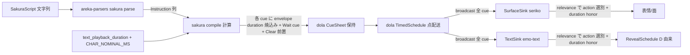
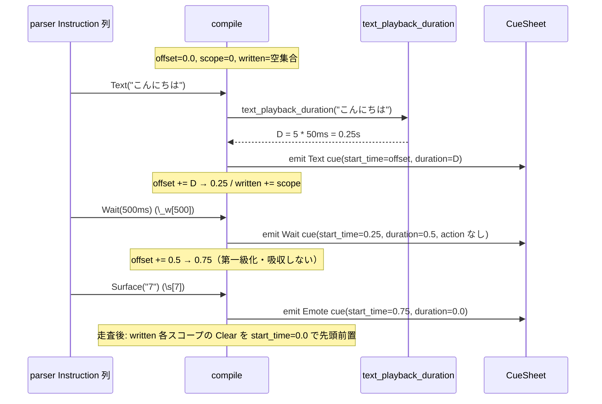
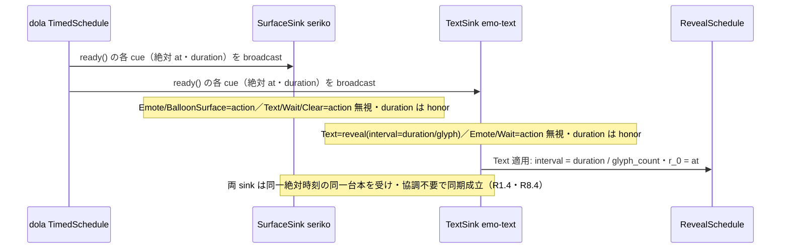

# 技術設計書 — areka-P0-cue-playback-duration

## Overview

さくらスクリプトの**テキスト再生には時間がかかる**が、areka の cue タイムラインはこの再生時間をモデル化せず、テキスト cue を「点（0 時間）」扱いし、明示 `\_w` を compile が offset へ吸収して cue を残さない。結果、テキストを喋り終わる前に後続 cue（次テキスト・`\s` 表情・`\n` 改行）が発火し、`areka-P0-emo2-boot` R9.3 実機サインオフの綻び（#3 ウェイト不発・#4 改行早発・#6 前会話が消えない・`\s` 非同期）を招いた。

病理は二層。第一に「文字数→文字ウェイト量」ロジックが emo-text（`char_wait=0.05`）・wintf typewriter に**二重実装**され、タイムライン（cue 発火）と reveal が協調しない——**単一の権威が「このテキストの再生には XXX 秒かかる」を保持していない**。第二に、より根源的に——**cue の再生時間（duration）が第一級データとしてタイムラインに載っておらず、純粋な待ち（`\_w`）が compile で吸収されて台本から消え、各表現者がコマンド種別で振り分けられて同一台本を共有しない**。dola の「同一台本を複数表現者へ同一絶対時刻で配送し協調なしに同期する」本質が、cue モデルと配送経路の両方で満たされていない。

本 spec は開発者決定の**案A（duration 付き cue の三権分立）**を、次の統合モデルで実現する:

- **保持＝dola**: 再生時間 duration を **`Cue` envelope の一律フィールド**として全 presentation cue へ持たせる（瞬時は明示的 0・「duration フィールドを持たない cue command」概念は作らない）。さらに **`CueSheet` が絶対開始時刻 `absolute_start_time` を保持**し（dispatch 時に刻印）、各 cue の相対 `start_time` ＋ duration と併せて**台本 1 枚が「いつ始まり・各 cue がいつ鳴り・いつ終わるか」を絶対時刻で自己完結**する。dola は絶対時刻を導出せず保持し、全表現者へ **broadcast** 配送する。
- **計算＝sakura**: テキスト→暗黙再生時間 D を算出する**単一の純関数** `text_playback_duration` を所有し、compile が各テキスト cue へ D を焼き込みつつ `offset += D` で絶対時刻を確定。明示 `\_w` は **action を持たず duration のみの第一級 `CueCommand::Wait` cue** として発行し、台本を自己完結した楽譜にする。talk 冒頭に Clear を前置（#6）。
- **服従＝全表現者（emo-text/seriko/未来の演者）**: **同期契約**——受け取った任意 cue の duration を、その action を処理するか否かに関わらず必ず honor する。無視するのは action だけで duration は決して落とさない。action 対象は演者側 relevance で選別（中央 router に依存しない）。emo-text は reveal を配送 D に従わせ自前 char_wait を撤去する。

決定論（注入時刻 `talk_time` 駆動・sleep/`Instant` 不使用）と serde 後方互換を維持する。新規クレート・新規依存なし。

### Goals
- 再生時間 duration を cue タイムラインへ**第一級・一律モデル化**する（`Cue` envelope・全 presentation cue が保持・瞬時 0）。
- 「テキスト→再生時間」を計算する**単一の純関数**を sakura に置き per-char 定数を一元化（二重実装を絶滅）。
- **純粋 Wait cue の第一級発行**で台本を自己完結させる（末尾・単独の待ちを失わない）。
- **全 cue の broadcast 配送＋全表現者の duration honor 契約**で、協調なしの時刻同期基盤を成立させる。
- emo-text reveal を配送 D に服従させ自前 char_wait を撤去する。
- 実機で #3・#4・#6・`\s` 同期が観測可能に解消される。

### Non-Goals
- テキストの**レイアウト/描画**（縦書き・折返し・フォントメトリクス）の変更（emo-text 既存領分）。
- bind/mayuna 合成（#2）・実行時サーフェスリサイズ（#1）。
- 選択肢・一時停止の**動的制御フロー**（`\q`/`\x`＝Barrier シームからの再開・dola へ pause/resume 状態を持ち込まない）。
- **Barrier / Routing ペイロードの duration 化**（presentation でなく duration 概念が本質的に非該当・§Design Decisions）。
- wintf `Typewriter` widget の統合（実行経路外）。
- ユーザー文字送り速度 UI・`\__w`・`\C`。

## Boundary Commitments

### This Spec Owns
- **保持（dola）**: `Cue` envelope の `duration: f64` フィールド（additive・`#[serde(default)]`・全 presentation cue が保持）。`CueCommand::Wait`（action 空・duration のみ・additive 追加）。**`CueSheet.absolute_start_time: f64`**（dispatch 刻印・`#[serde(default)]`）＝自己完結絶対時刻台本。`TimedSchedule` の horizon 保持と `is_completed`（entry 枯渇かつ現在≥horizon）による占有終了判定。dola は duration/絶対時刻を不透明に保持・**broadcast 配送**するのみ。
- **計算（sakura）**: 純関数 `text_playback_duration(text) -> f64`（暗黙 per-char）と per-char 定数 `CHAR_NOMINAL_MS` の**唯一の定義**。compile による各テキスト cue への D 付与・`offset += D` 焼き込み・**`\_w` の第一級 Wait cue 発行**・talk 冒頭 Clear 前置。
- **配送（sakura drive）**: 全 cue を全 sink へ **broadcast** する `on_tick`（中央 1→1 振り分けの廃止）。`TalkCue` エンベロープの `duration` フィールド（serde 非依存の搬送体）。
- **服従（全表現者）**: **duration honor 契約**——任意 cue の duration を action 可否に関わらず honor。emo-text reveal を配送 D から導出・`char_wait` 撤去。seriko が broadcast を許容（非 Shell action 無視・duration honor・良性ログ）。
- **実機受け入れ**: #3・#4・#6・`\s` 同期の人間サインオフ観測手順。

### Out of Boundary
- **描画・レイアウト**: emo-text の `LayoutEngine`／`ViewboxExecutor`／`TextRegion` 等（時間の権威のみ扱い描画に触れない）。
- **dola の時刻導出**: dola は配送時に時刻を導出・変換しない（絶対時刻をそのまま配送）。占有機構を `TimedSchedule` へ追加しない（整列は sakura が焼き込む）。
- **dola の動的制御**: pause/resume/選択肢の状態（`\x`/`\q`）。Barrier シームでのオーケストレーター再調停は dola の外側。
- **Barrier / Routing の duration**: `BarrierKind`（動的停止点・静的タイムライン外）と `RoutingCommand`（制御・`ready()` 未到達で表現者未配送）は **duration 概念が本質的に非該当**。envelope duration は presentation cue（`CueCommand`）のみ対象（§Design Decisions）。
- **wintf `Typewriter` widget**: 実行経路外ゆえ現状維持。
- **mayuna/bind・surface-resize**: 隣接 spec へ委譲。ただし本 spec が確定する「全 cue が envelope duration を持つ」形へ mayuna の瞬時 bind cue（D=0）が additive に載れることを保証する。

### Allowed Dependencies
- **dola `cue` モジュール**（`Cue`/`CueCommand`/`CuePayload`/`TimedSchedule`/`CueSheet`）— duration の保持場所・Wait 追加先。既存 variant のワイヤ形は不変。
- **areka-parsers `sakura`**（`Instruction` 列・`Wait(Duration)`/`Text(String)`）— compile の入力。`\_w`→`Wait`、`\w`→`Wait` の既存正規化に依存（`WAIT_UNIT_MS=50` は別概念で流用しない）。
- **areka-sakura contract**（`TalkCue`/`cue_target_of`）・drive（`to_schedule`/`on_tick`）— D の搬送・broadcast 配送経路。
- **areka-emo-text state/actor**・**areka-seriko actor** — honor 契約・reveal 服従の実装先。
- 新規 crates.io 依存の追加は**禁止**（Rust 2024・bevy_ecs・serde の既存スタックのみ）。

### Revalidation Triggers
- `Cue`/`TalkCue` エンベロープの `duration` の型・意味・serde 属性変更 → dola を消費する全経路（wintf `cue/`・emo-text・seriko）と serde 済み資産の再検証。
- `CueCommand` variant 追加（Wait 等）→ 全表現者の `apply_cue`／`handle_message` の網羅性（catch-all 無しゆえコンパイラ強制）。
- broadcast 配送への変更 → 全 sink の relevance フィルタ・honor 契約・ログ規律の再検証。`cue_target_of` を relevance の**単一権威**とし、`CueCommand` variant 追加時は各表現者の action 判定が `cue_target_of` の分類と一致すること（partition）を再確認する。
- **`CueSheet.absolute_start_time` / `TimedSchedule` horizon / 完了判定（`is_completed`・`TalkDone` 発火条件）の変更** → talk 終端の早期終了・跨プロセス完了同期・kanade 単一 slot 解放タイミングの再検証（drive-level 注入 tick 檻が必須・compile-level extent 檻では捕捉不能）。
- per-char ノミナル定数値・`text_playback_duration` シグネチャ変更 → 実機再生タイミングと emo-text reveal の再検証。
- `\C`（追記モード）対応の着手 → **Clear 前置の無条件性を条件化**する必要（現状 `\C` 未対応ゆえ無条件で妥当）。

## Architecture

### Existing Architecture Analysis

三権の物理分離は既に成立。本 spec は既存構造に「duration」という 1 データを一律に貫通させ、配送を broadcast へ正す。

- **保持＝dola** `crates/dola/src/cue/command.rs`: `Cue { actor, start_time, payload }`（`Clone/Debug/Serialize/Deserialize`・**PartialEq 非導出**・**duration なし**）。`CueCommand` は 8 variant・externally tagged・**時間コマンドを一つも持たない（データ系のみ）**。時間占有は `BarrierKind::Timeout{duration}`（`CuePayload::Barrier` アーム）にのみ存在＝presentation でなく別概念。`TimedSchedule<T>` は `tick(t)`→`ready()` の 2 フェーズ**点配送**で、Payload は duration を持たず**時間を占有しない**（Barrier のみが全スケジュールを停止）。
- **計算＝sakura** `crates/areka-sakura/src/`: `compile(&[Instruction]) -> CompiledTalk` は純粋・決定的。現状 `Wait(d)` のみ `offset += d.as_secs_f64()` で進め **cue を残さず**、`Text(t)` は `emit(scope, offset, Text)` するが **offset を進めない（0 時間）**＝中核欠落。冒頭 Clear 前置なし。`TalkCue { at, actor, command }`（serde 非依存）が搬送体。`drive.rs::on_tick` が `ready()` の各 cue を `cue_target_of` で分類し **1 つの sink にだけ** emit（SurfaceSink/TextSink）＝**型による中央振り分け**。
- **服従＝emo-text** `crates/areka-emo-text/src/`: `TextLayerConfig.char_wait=0.05`（撤去対象）。`RevealSchedule::extend_chunk` が `r_i = max(r_{i-1}+char_wait, chunk_start)` を確定。`apply_cue` は catch-all 無しの網羅 match で、非担当（Emote 等）を**明示的に無視**（既に relevance フィルタを持つ）。
- **服従＝seriko** `crates/areka-seriko/src/`: 実装済み SurfaceSink。受け取った cue を**自分で** `cue_target_of` にかけ Shell 系のみ処理・他は warn+skip（**既に演者側 relevance フィルタを持つ**）。
- **二重フィルタの現状**: 中央 `on_tick` が Shell を seriko にだけ渡し、seriko も再度 Shell 判定＝**冗長**。broadcast 化で中央振り分けを外せば、既存の演者側フィルタが本来の役目を果たす。

### Architecture Pattern & Boundary Map

**選択パターン**: 三権分立（Compute / Hold / Obey）＋**全 cue broadcast ＋ envelope 一律 duration ＋ 全演者 honor 契約**。単一真実源は**計算層**（`text_playback_duration` 1 本）にあり、絶対 `start_time` と envelope `duration` は同一計算の 2 投影を不変台本へ凍結したもの。同期の真実源は焼き込み絶対 `start_time`、duration はその累積の原始量かつ presentation メタデータ（二重待ち禁止）。



**Architecture Integration**:
- **保持の一律性（R1）**: duration は `Cue` envelope の一律フィールド。全 presentation cue が保持し（瞬時は 0）、「duration フィールドを持たない cue command」概念は作らない。これにより表現者は**コマンドを解釈せずに `cue.duration` を一律 honor** できる——honor 契約が例外なく回る前提。
- **配送の broadcast（R2）**: `on_tick` は全 cue を全 sink へ broadcast。型による中央振り分けを廃し、無視は演者側 relevance フィルタ（既存）で行う。dola の「同一台本を全表現者へ」を配送経路でも成立させる。
- **honor 契約（R2）**: 各表現者は受け取った任意 cue の duration を、action 可否に関わらず honor（自身の timeline 整合・末尾の hold）。action は選択的無視可、duration は不可。
- **Wait の第一級化（R5）**: `\_w` を offset へ吸収せず `CueCommand::Wait`（action 空・duration のみ）として発行し `offset += d`。台本が自己完結（末尾・単独の待ちも cue として残る＝プロセス跨ぎで全時間範囲復元可能）。
- **整列は 2 段の焼き込み（案 2-A）**: sakura compile が `offset += D`／`offset += d` で各 cue の**相対** `start_time`（台本内 0 基準）を焼き込み、**絶対アンカー `CueSheet.absolute_start_time` は dispatch 時に刻印**する。dola は配送時に時刻を導出せず（相対＋アンカーの和で各表現者が独立に同一絶対時刻を得る）。時刻を配送時導出すると表現者ごと独立計算＝desync ゆえ絶対時刻は同期の必須要件（開発者決裁・research §7.4）。
- **保持場所（案 1-A）**: envelope フィールド。`CueCommand::Text` 等のワイヤ形不変（R9.3）。中身埋め込み（payload）は honor 契約と両立不能（知らないコマンドの duration を取り出せない）ゆえ棄却（§Design Decisions）。

### Technology Stack

| Layer | Choice / Version | Role in Feature | Notes |
|-------|------------------|-----------------|-------|
| 演出定義（保持） | dola（`serde` 1・externally tagged） | `Cue.duration` 保持・`CueCommand::Wait`・broadcast 配送・serde 後方互換 | 既存 variant ワイヤ形不変・`#[serde(default)]`・Wait は additive |
| 計算（台本） | areka-sakura（Rust 2024・純粋関数） | `text_playback_duration`・compile 焼込み・Wait 発行・Clear 前置・broadcast on_tick | GPU/COM 非依存・全分岐単体テスト可 |
| 服従（reveal/honor） | areka-emo-text・areka-seriko | 配送 D から reveal・duration honor・`char_wait` 撤去 | 注入時刻駆動・`Instant` 不使用 |
| 入力 | areka-parsers sakura（既存） | `\_w`→`Wait(Duration)`・`Text(String)` | `WAIT_UNIT_MS=50` は別概念・流用しない |

新規依存の追加なし。tokio 不使用。

## File Structure Plan

### Directory Structure
```
crates/
├── dola/src/cue/
│   ├── command.rs            # [変更] Cue に duration: f64 追加（#[serde(default)]）／CueCommand::Wait 追加（additive）
│   ├── sheet.rs              # [変更] CueSheet に absolute_start_time: f64 追加（dispatch 刻印・#[serde(default)]）＝自己完結絶対時刻台本
│   └── schedule.rs           # [変更] TimedSchedule に horizon=max(offset+duration) を保持（insert 時に duration から更新）・is_completed は entry 枯渇かつ現在≥horizon で真（占有終了まで完了扱いしない）
├── areka-sakura/src/
│   ├── duration.rs           # [新規] text_playback_duration + CHAR_NOMINAL_MS（純粋・唯一の権威）
│   ├── lib.rs                # [変更] pub mod duration;
│   ├── compile.rs            # [変更] Text へ D 付与＋offset+=D・Wait cue 発行＋offset+=d・Clear 前置・emit に duration
│   ├── contract.rs           # [変更] TalkCue に duration: f64／cue_target_of は relevance ヘルパとして存置（Wait を分類へ追加）
│   └── drive.rs              # [変更] on_tick が全 cue を両 sink へ broadcast／to_schedule が duration 複写
├── areka-emo-text/src/
│   ├── state.rs              # [変更] char_wait 撤去・apply_cue が cue.duration からペース導出・honor 契約
│   └── actor.rs              # [変更] apply_cue の config 引数除去・honor
└── areka-seriko/src/
    └── actor.rs              # [変更] broadcast 許容（非 Shell action 無視・duration honor・warn→良性 debug）
```

### Modified Files
- `crates/dola/src/cue/command.rs`
  - `Cue` に `#[serde(default)] pub duration: f64`（既定 0.0＝瞬時点）。doc に「この cue の presentation 占有時間（秒）・全表現者が action 可否に関わらず honor する・後続 cue の絶対時刻はこの分だけ焼き込まれる」を明記。全 in-source `Cue { ... }` リテラルへ `duration` 追加。後方互換 serde テスト（duration 欠落 JSON→0.0）追加。
  - `CueCommand::Wait` を additive 追加（unit variant `"Wait"`・action を持たず時間は envelope duration が担う）。doc に「純粋な待ち・action なし・duration のみ・全表現者が honor」を明記。variant 数 8→9・`cue_command_eight_variants` テストを 9 へ更新。既存 variant ワイヤ形不変を固定する檻を維持。
- `crates/areka-sakura/src/duration.rs` — **新規**。`pub const CHAR_NOMINAL_MS: u64 = 50;` と `pub fn text_playback_duration(text: &str) -> f64`（暗黙 per-char のみ）。純粋・決定的・no I/O。入力依存全分岐の単体テストを同ファイル `#[cfg(test)]` に。
- `crates/areka-sakura/src/lib.rs` — `pub mod duration;`。
- `crates/areka-sakura/src/compile.rs`
  - Text arm: `D = text_playback_duration(text)` を算出、Text cue へ `duration=D` 付与、直後 `offset += D`。
  - Wait arm: `d = duration.as_secs_f64()` で **`CueCommand::Wait` cue を `duration=d` で emit**、直後 `offset += d`（吸収を廃し第一級化）。
  - 他の emit（Emote/BalloonSurface/NewLine/Clear）: `duration=0.0`。
  - 走査後、**書き込み balloon スコープ集合**（Text/NewLine を emit したスコープ）を `BTreeSet<u32>` で収集し `Clear`（`start_time=0.0`・duration 0.0）を各スコープぶん先頭前置。
  - `emit` は `duration` 引数を取る。既存テスト更新＋新規（D 焼込み・Wait cue・Clear 前置・非退行）。
- `crates/areka-sakura/src/contract.rs` — `TalkCue` に `pub duration: f64`。`cue_target_of` は**中央 router でなく演者側 relevance ヘルパ**として存置し、`Wait => None`（どの sink の担当でもない＝全員が action 無視・duration のみ honor）を追加（catch-all 無しゆえ variant 追加でコンパイラ強制）。
- `crates/areka-sakura/src/drive.rs`
  - `to_schedule` の `TalkCue` 構築に `duration: cue.duration` 追加。`CueSheet.absolute_start_time` を `TimedSchedule` の絶対アンカーへ流し、各 Payload の duration を horizon 更新へ供給。
  - `on_tick`: `ready()` の各 cue を**両 sink（surface_sink と text_sink）へ broadcast** emit（型による 1→1 振り分けを撤去）。`None` の中央エラーログを廃し、無視は演者側に委ねる。
  - **完了判定**: `TalkDone`（自然終了）は entry 枯渇の瞬間でなく、**`is_completed()`（entry 枯渇かつ現在時刻 ≥ horizon）が真になったとき**に発火する。末尾・単独の Wait／最終 Text の duration が talk 終端で落ちない（早期終了しない）。in-source テストの `TalkCue { ... }` リテラルへ `duration` 追加。
- `crates/areka-emo-text/src/state.rs` — `TextLayerConfig.char_wait` 撤去（`line_pitch_factor` 残置）。`apply_cue` から `config` 引数除去（reveal ペースは `cue.duration` 由来）。`RevealSchedule::extend_chunk` 第 3 引数を `char_wait`→`interval`（=`D/N`）へ意味変更。**honor 契約**: 非担当 cue（Emote/Wait/BalloonSurface 等）は action 無視・duration は honor（talk extent 整合）。reveal 系テストを D 駆動へ更新。
- `crates/areka-emo-text/src/actor.rs` — `apply_cue` の config 引数除去。`config`（`line_pitch_factor`）は `DWriteMetrics::new` 用に保持。in-source テストヘルパへ `duration` 追加。
- `crates/areka-seriko/src/actor.rs` — broadcast 許容: 受け取った全 cue のうち Shell 系のみ action、他（Text/Wait/Clear/NewLine/Choice）は **action 無視・duration honor**。非 Shell 受信は「想定外」でなく**正常**ゆえ `warn` → 良性 `debug` へ。in-source テストヘルパへ `duration` 追加。
- **横断機械変更**: `Cue { ... }` / `TalkCue { ... }` リテラルは全構築点で `duration` 追加が必要（コンパイラ強制）。`CueCommand::Wait` 追加で全 `apply_cue`/`handle_message`/`cue_target_of` の網羅 match がコンパイラ強制更新。
- **前提条件の再確認**: 着手時に `crates/**` を `punctuation_wait` と drive.rs 生スクリプト診断ログで再 grep（現状ゼロ・撤去作業は発生しない見込み）。

## System Flows

### compile による絶対時刻焼き込みと Wait 第一級化（計算）



`\_w` は **Wait cue として台本に残る**（末尾・単独でも）。`\s`（Emote）はテキスト D と `\_w` を焼き込んだ offset（=0.75）で発火＝**喋り完了後に表情切替**（R8.4）。整列は compile が絶対 `start_time` へ焼き込み、dola は導出せず配送するのみ。

### broadcast 配送と全演者の duration honor（保持→服従）



**honor 契約の帰結**: どの表現者も、自分が action しない cue の duration も honor するため、末尾 Wait を含む talk の全時間範囲を各自で復元でき、早期終了しない（R5.3）。同期の真実源は焼き込み絶対 `start_time`、duration は presentation メタデータ兼その原始量（二重待ち禁止）。

**縮退**: `duration=0`（瞬時 cue・後方互換 cue）かつ `glyph_count>0` → reveal `interval=0` → 全グリフが `at` で即時可視（R1.2・R7.3）。`glyph_count=0`（空テキスト）→ reveal 追記なし（除算しない）。

## Requirements Traceability

| Requirement | Summary | Components | Flows |
|-------------|---------|------------|-------|
| 1.1 | duration を envelope 一律フィールドで保持 | dola `Cue.duration`・sakura `TalkCue.duration` | 焼き込み |
| 1.2 | 瞬時は明示 0・フィールド欠落なし | `duration: f64` default 0・reveal 縮退 | broadcast honor |
| 1.3 | 絶対 start_time を導出せず保持配送 | `Cue.start_time`・`TimedSchedule` | 焼き込み |
| 1.4 | 同一台本を全表現者へ同一絶対時刻で配送（絶対アンカーを台本が保持） | `CueSheet.absolute_start_time`・broadcast on_tick | broadcast honor |
| 1.5 | duration は不透明秒数・50ms 焼かない | `Cue.duration`・`CHAR_NOMINAL_MS`(sakura) | — |
| 1.6 | Barrier/Routing は duration 非該当 | `CuePayload` 別アーム | — |
| 1.7 | CueSheet が絶対開始時刻を保持し台本のみから絶対発火/終了時刻を復元 | `CueSheet.absolute_start_time`・horizon | 焼き込み・完了 |
| 2.1 | 全 cue を全表現者へ broadcast | drive `on_tick`（両 sink emit） | broadcast honor |
| 2.2 | 葉の表現者はローカル遅延を生じさせない（否定的 no-op） | emo-text/seriko honor（no-op 制約） | broadcast honor |
| 2.3 | action は無視可・duration は不可 | emo-text/seriko honor arms | broadcast honor |
| 2.4 | action 対象は演者側 relevance で選別 | `cue_target_of`(演者側)・apply_cue match | broadcast honor |
| 2.5 | ライフサイクルは絶対終了時刻まで早期終了しない | drive 完了判定(horizon)・`CueSheet.absolute_start_time` | 完了 |
| 3.1 | 暗黙 per-char の単一純関数 | `text_playback_duration` | 計算 |
| 3.2 | 実時間/描画非依存で決定的 | `text_playback_duration` | — |
| 3.3 | per-char 定数を sakura に一元化 | `CHAR_NOMINAL_MS` | — |
| 3.4 | 純関数は `\_w` を畳まない（compile 合成） | 純関数＋compile 累積 | 計算 |
| 3.5 | GPU/窓/COM 非依存・全分岐単体テスト | `text_playback_duration` | — |
| 4.1 | compile が各テキスト cue へ D 付与 | compile Text arm・`emit(duration)` | 焼き込み |
| 4.2 | 後続 cue の絶対時刻を text+D 以降へ | compile `offset += D` | 焼き込み |
| 4.3 | 明示ウェイト無しは暗黙のみ加算 | compile Text arm | 焼き込み |
| 4.4 | 明示 `\_w` を暗黙に加えて累積・非退行 | compile Wait arm | 焼き込み |
| 5.1 | `\_w`→第一級 Wait cue 発行＋offset 進行 | compile Wait arm・`CueCommand::Wait` | 焼き込み |
| 5.2 | Wait は additive・ワイヤ形不変 | `CueCommand::Wait`(unit) | — |
| 5.3 | 純粋待ちも cue に含め台本のみで全時間復元 | Wait cue・honor 契約 | broadcast honor |
| 5.4 | Wait cue は duration を honor（action なし） | 全表現者 honor | broadcast honor |
| 6.1 | talk 冒頭へ Clear cue 前置 | compile Clear 前置 post-pass | 焼き込み |
| 6.2 | 新 talk で前 talk テキスト除去 | compile Clear＋emo-text Clear | broadcast honor |
| 6.3 | 書き込む各スコープをクリア | compile 書込スコープ集合→per-scope Clear | 焼き込み |
| 7.1 | reveal が配送 D からタイミング決定 | emo-text `apply_cue`(cue.duration) | broadcast honor |
| 7.2 | 独自 per-char 定数を保持しない | `TextLayerConfig`(char_wait 撤去) | — |
| 7.3 | N 文字を概ね D 秒で表示 | `RevealSchedule`(interval=D/N) | 縮退込 |
| 7.4 | Clear cue で未表示分含め消去 | emo-text Clear（既存） | broadcast honor |
| 7.5 | 非担当 cue も action 無視で duration honor | emo-text honor arm | broadcast honor |
| 8.1–8.5 | 実機 #3/#4/#6/`\s`・人間サインオフ・絶対パス | 全パイプライン（実機） | 全 |
| 9.1 | 注入時刻駆動・sleep/Instant 不使用 | 全層（無改変で維持） | — |
| 9.2 | dola は per-char 意味を内包しない汎用基盤 | `CHAR_NOMINAL_MS`(sakura のみ) | — |
| 9.3 | duration/Wait を additive 拡張 | `Cue.duration`(serde default)・`CueCommand::Wait`・既存 variant 無改変 | — |
| 9.4 | duration 無し serde 済みを 0 解釈 | serde(default)=0.0 | — |
| 9.5 | 「duration 欠落 command」概念を作らない | `Cue.duration` 一律・全 presentation cue 保持 | — |
| 10.1–10.5 | スコープ境界・前提・動的制御は dola 外 | Out of Boundary | — |

## Components and Interfaces

### 計算層（sakura）

#### text_playback_duration（単一純関数）

| Field | Detail |
|-------|--------|
| Intent | テキストから暗黙 per-char 再生時間 D を算出する唯一の権威 |
| Requirements | 3.1, 3.2, 3.3, 3.4, 3.5 |

**Responsibilities & Constraints**
- 入力は `Instruction::Text` のペイロード文字列（1 チャンク）。グリフ単位は Rust `char`（emo-text と同一の M1 正準）。
- `CHAR_NOMINAL_MS: u64 = 50` を**唯一の定義箇所**として持つ（3.3）。parser `WAIT_UNIT_MS`（`\w` 単位）・emo-text `char_wait`（撤去）と混同・統合しない。
- 純粋・決定的・no I/O・GPU/窓/COM 非依存（3.2, 3.5）。明示 `\_w` を畳まない（3.4）——`\_w` は parser が `Instruction::Wait` へ分離済みで、その合成は compile が担う（純関数への二重計上回避）。
- FP 決定性のため整数 ms 算術＋単一変換（`Duration::from_millis(N*CHAR_NOMINAL_MS).as_secs_f64()`）で既存の `Duration→f64` 規律に揃える。

**Contracts**: Service [x]

##### Service Interface
```rust
/// per-char ノミナルウェイト（ms・唯一の定義箇所）。parser WAIT_UNIT_MS とは別概念。
pub const CHAR_NOMINAL_MS: u64 = 50;

/// テキスト 1 チャンクの暗黙再生時間 D（秒）を算出する純関数。
/// D = char_count(text) * CHAR_NOMINAL_MS を秒へ変換した値。明示 \_w は含まない。
pub fn text_playback_duration(text: &str) -> f64;
```
- Preconditions: なし（任意の `&str`）。
- Postconditions: 戻り値は有限・非負。同一入力へ常に同一値。空文字列は 0.0。
- Invariants: SakuraScript の明示ウェイト値（`\_w`/`\w` の ms）を内包しない（parser が `Instruction::Wait` へ分離済み）。

#### compile（duration 焼き込み＋Wait 発行＋Clear 前置）

| Field | Detail |
|-------|--------|
| Intent | 各テキスト cue へ D を付与し絶対 start_time へ焼き込み、`\_w` を第一級 Wait cue として発行し、talk 冒頭へ Clear を前置する |
| Requirements | 4.1, 4.2, 4.3, 4.4, 5.1, 6.1, 6.3 |

**Responsibilities & Constraints**
- **D 付与＋焼込み（4.1/4.2/4.3）**: `Text(t)` で `D = text_playback_duration(t)` を算出、当該 Text cue の `duration=D` として emit、直後 `offset += D`。
- **Wait 第一級化（5.1/4.4）**: `Wait(d)` で `CueCommand::Wait` cue を `duration=d.as_secs_f64()` として当該 offset へ emit、直後 `offset += d.as_secs_f64()`。吸収を廃し台本に残す（末尾・単独でも）。既存 `Wait` 累積の非退行を保つ。
- **Clear 前置（6.1/6.3）**: 走査中に Text/NewLine を emit したスコープを `BTreeSet<u32>` へ収集。走査後、各スコープの `Clear`（`start_time=0.0`・`duration=0.0`）を cue 列の**先頭へ前置**。`CueSheet::new` の安定ソートと `on_tick` の同一 `at` FIFO により Clear が先に配送される。
- 純粋・決定的・no I/O を維持。`emit` は `duration` 引数を追加（各 arm が適切な値を渡す・瞬時は 0.0）。

**Contracts**: Service [x] / State [x]

##### Service Interface
```rust
// emit は duration を受ける（Text は D、Wait は d、他は 0.0）。
fn emit(scope: u32, offset: f64, duration: f64, command: CueCommand) -> Cue;
// compile シグネチャは不変（内部で D 焼込み・Wait 発行・Clear 前置）。
pub fn compile(instructions: &[Instruction]) -> CompiledTalk;
```
- Postconditions: `sheet` 内 `start_time` は有限・非負・非減少。各 Text cue の `duration>0`（N>0 時）。各 Wait cue の `duration>0`。書込スコープの Clear が `start_time=0.0` で先頭に存在。台本のみから talk 全時間範囲（`max(start_time+duration)`）が復元可能。
- Invariants: 同一入力→同一出力。`Wait` の累積挙動（`offset += d`）は不変。

### 保持層（dola）／搬送（sakura）

#### Cue.duration / TalkCue.duration / CueCommand::Wait

| Field | Detail |
|-------|--------|
| Intent | duration を不透明秒数として全 presentation cue へ一律保持し、純粋待ちを Wait コマンドとして持つ |
| Requirements | 1.1, 1.2, 1.3, 1.5, 1.6, 5.2, 9.3, 9.4, 9.5 |

**Responsibilities & Constraints**
- `dola::cue::Cue` に `#[serde(default)] pub duration: f64`（既定 0.0）。**全 presentation cue が保持**（瞬時は 0・欠落フィールド概念なし＝9.5）。既存 `CueCommand` variant のワイヤ形は不変（9.3）。既存 serde 済みデータ（duration 欠落）は default で 0.0（9.4・1.2）。
- `CueCommand::Wait`（unit variant）を additive 追加。action を持たず、時間は envelope `duration` が担う（Wait 単体では `Cue{payload:Command(Wait), duration:d}`）。
- `areka_sakura::contract::TalkCue` に `pub duration: f64`（serde 非依存の搬送体）。`to_schedule` が `Cue.duration` を無変形複写。
- dola は duration を SakuraScript 意味に解釈しない（1.5）。`start_time` は絶対時刻として保持し導出しない（1.3）。
- **Barrier/Routing は duration 非該当（1.6）**: `CuePayload::Barrier`/`Routing` は presentation でなく（Barrier＝動的停止点・Routing＝表現者未配送）、静的 duration タイムラインの外。envelope duration は presentation cue のみ意味を持つ。

**Contracts**: State [x]

##### State Management
- **表現**: `duration: f64`（`Option` ではない）。根拠: 1.2 が「未占有＝0（フィールドは在る）」と規定し、0.0 と「未指定」を区別する意味論的必要がない。`#[serde(default)]` で後方互換（9.4）と算術単純性（`offset += duration` が常に有効）を両立。**「フィールドを持たない cue command」概念を作らない**ことで、表現者は command を解釈せず `cue.duration` を一律 honor できる（honor 契約の前提・9.5）。
- **永続性/一貫性**: `Cue` は `PartialEq` 非導出のためテストはフィールド比較（`duration` 込みへ拡張）。roundtrip 檻＋「duration 欠落 JSON→0.0」の後方互換檻＋`CueCommand::Wait` の `"Wait"` ワイヤ形檻を追加。既存 `{"BalloonSurface":{"key":"2"}}` 等の不変を維持（9.3）。

### 服従層（全表現者：emo-text／seriko）

#### duration honor 契約 ＋ reveal 服従

| Field | Detail |
|-------|--------|
| Intent | 全表現者が任意 cue の duration を honor し、emo-text は配送 D から reveal ペースを導出する |
| Requirements | 2.1, 2.2, 2.3, 2.4, 5.4, 7.1, 7.2, 7.3, 7.4, 7.5 |

**Responsibilities & Constraints**
- **broadcast 受信（2.1）**: `on_tick` が全 cue を両 sink へ配送。各表現者は全 cue を受け取る。
- **honor 契約＝2 段（2.2/2.3/2.5/5.4/7.5）**: 「honor」は二段で成立し、いずれも**新たなローカル遅延を生まない**（タイミングは焼き込み絶対時刻が担う・二重待ち禁止）:
  - **葉の表現者（本 spec 内: emo-text/seriko）**: 自分が action しない cue の duration は**ローカル時計を進めず・後続 action を遅延させない**＝葉の局所挙動としては実質 no-op の**否定的制約**。担当 cue は焼き込み絶対時刻で action する。duration が envelope 一律ゆえ command を解釈せず読める、という**将来 honor の前提**を確保することが本 spec での眼目。
  - **talk ライフサイクル（自己完結台本 → drive の完了判定）**: talk の**絶対終了時刻** = `CueSheet.absolute_start_time + max(cue.start_time + cue.duration)`。これは**台本 1 枚から導ける絶対時刻**で、drive／kanade／任意の表現者が同一台本から同一値を独立算出する（協調なしの跨プロセス完了同期）。drive の `TalkDone`（自然終了）は cue を配り終えた瞬間（entry 枯渇）でなく、この**絶対終了時刻に達したとき**に発火する＝末尾 Wait・最終 Text の duration を落とさず早期終了しない。**注意**: `CompiledTalk.end` は終端**理由**（`TalkEndReason` enum: Ended/Quit）であって時間量ではない——終了「時刻」の権威は台本の `absolute_start_time + horizon`（`is_completed` が duration を含めて判定）であり、両者は別概念。
- **relevance 選別（2.4・単一権威）**: action 対象の判定権威は `cue_target_of` **単一**とする。seriko は `cue_target_of==Shell`、emo-text は `cue_target_of==Balloon` を action ゲートとし（emo-text の網羅 match の担当 arm はこの分類と**一致**させる）、両者が独立に発散しないようにする。中央 router には依存しない。
- **emo-text reveal（7.1/7.3）**: Text cue 適用時 `interval = if glyph_count>0 { cue.duration / glyph_count as f64 } else { 0.0 }`、`extend_chunk(glyph_count, cue.at, interval)` で `r_i = max(r_{i-1}+interval, cue.at)`（`r_0=cue.at`）を確定。
- **char_wait 撤去（7.2）**: `TextLayerConfig.char_wait` 削除。`apply_cue` は `config` 引数を持たない。
- **Clear（7.4）**: 未リビール分含む actor 状態全消去は既存挙動維持（無改変）。
- **seriko broadcast 許容**: Shell 系のみ action、他（Text/Wait/Clear/NewLine/Choice）は action 無視・duration honor。非 Shell 受信は正常ゆえ `warn`→良性 `debug`。
- **縮退（1.2）**: `duration=0`（瞬時/後方互換）かつ N>0 → interval=0 → 全グリフが `cue.at` で即時可視。N=0（空テキスト）→ 追記なし・除算しない。跨チャンク tail 追従（`max` 追従）温存。

**Contracts**: State [x]

**Implementation Notes**
- Integration: `cue.duration=N×50ms`（sakura の既定）のとき interval=`D/N` は実効 50ms 相当となり、reveal 時刻は旧 `char_wait=0.05` 挙動と**機能等価**（全注入時刻 tick で可視グリフ数が一致）。**厳密なビット等価は主張しない**: `Duration::from_millis(N*CHAR_NOMINAL_MS).as_secs_f64() / (N as f64)` は f64 リテラル `0.05` と一般に一致しない（例 N=3 で ≈0.049999999999999996・約 1 ULP 差）が可視グリフ数は不変。dola 契約上 emo-text が受け取るのは**不透明 f64 秒**ゆえ interval は f64 除算で導出し（整数 ms へ戻さない）、この除算は決定的。
- Validation: 既存 reveal テスト群を D 駆動へ更新（config.char_wait でなく cue.duration を与える）。**期待 reveal 時刻は実装と同一の `D/N`（f64 除算＋`max` 追従）算術で再計算し、旧 `0.05` リテラル由来の期待値を使わない**（FP 差の flaky 回避・memory: deterministic-test-coverage-mandate 整合）。縮退（D=0 即時／N=0 無追記）を新規檻で網羅。honor 契約は「非担当 cue（Emote/Wait）受信で action せず talk extent が duration を含む」ことを檻で固定。

## Data Models

### Domain Model
- **不変台本（CueSheet）**: `CueSheet { absolute_start_time, cues: Vec<Cue> }`。`Cue { actor, start_time, payload, duration }` の列。`start_time` は talk 起点（台本先頭 0）からの相対（焼き込み済み・compile 確定）秒、`absolute_start_time` は talk が再生開始する壁時計の絶対秒（dispatch 刻印）——**各 cue の絶対発火時刻 = `absolute_start_time + start_time`**。`duration` は当該 cue の presentation 占有秒（Text=reveal D／Wait=待ち／瞬時=0）＝cue は区間 `[start_time, start_time+duration)`。start_time/duration は `text_playback_duration` の単一計算の 2 投影を不変台本へ凍結（実行時ドリフト不能・再タイミング＝再 compile）。**全 presentation cue が duration を保持**し、フィールド欠落は存在しない。**talk 絶対終了時刻 = `absolute_start_time + max(start_time + duration)`**（台本のみから復元可能・完了判定の権威）。
- **`CueCommand`（9 variant）**: 既存 8（Text/Clear/Emote/Choice/EntityRef/Custom/NewLine/BalloonSurface）＋ **Wait（unit・action 空）**。時間は常に envelope `duration` が担い、コマンドは action の種別のみを表す。
- **搬送体（TalkCue）**: `{ at, actor, command, duration }`。`Cue` の実行時投影（serde 非依存）。全 sink が broadcast で受け、各自 duration を honor・reveal は `duration` を読む。

### Data Contracts & Integration
- **serde 拡張**: `Cue` へ `duration` を `#[serde(default)]` で追加＝旧 JSON（3 フィールド）は `duration=0.0`、新 JSON は 4 フィールド目を持つ（additive・9.3/9.4）。`CueCommand::Wait` は additive variant（`"Wait"`）・既存 variant のワイヤ形完全不変。
- **後方互換の検証**: `{"actor":"0","start_time":0.0,"payload":{"Command":{"Text":"hi"}}}` を deserialize → `duration==0.0`。新規 `Cue`（duration=0.25）と `CueCommand::Wait` の roundtrip 一致。
- **duration 非該当ペイロード**: `CuePayload::Barrier`/`Routing` を持つ cue も型上は `duration` フィールドを持つ（envelope 一律）が、それらは静的 duration タイムライン外ゆえ意味を持たず 0 とする（presentation でない・1.6）。

## Error Handling

### Error Strategy
本 spec は失敗経路を新設しない。既存の log-first 規律（`error!`＋継続・panic は致命限定）を踏襲する。

### Error Categories and Responses
- **縮退（正常経路）**: `duration=0` かつ N>0 → 即時可視。`duration<0`（想定外）→ `interval<0` は `max(r_{i-1}+interval, at)` が `at` 下限で吸収（monotonic 保持）。負値は sakura が生成しないため防御的縮退に留める。
- **N=0（空テキスト）**: reveal 追記なし・除算回避。
- **broadcast の非担当 cue**: 各表現者は action せず duration を honor（エラーでない・正常）。旧「unclassifiable」中央エラーログは撤去（broadcast では非担当受信が正常）。
- **非有限 tick**: drive `on_tick` の既存 NaN/inf ガード（schedule を進めず `error!`・ループ継続）を無改変で維持（9.1）。**duration が offset へ流れるため、`text_playback_duration` の戻り値の有限・非負を計算層で保証**（`TimedSchedule` の非負ガードは debug-only ゆえ release で NaN が partition_point を壊す・D3-V/P25）。
- **serde 欠損**: `#[serde(default)]` により欠落 duration は 0.0（エラーにしない・9.4）。

### Monitoring
既存の `tracing` 構造化ログを踏襲。broadcast 化で seriko の非 Shell 受信ログは `warn`→良性 `debug` へ格下げ（正常経路ゆえ）。

## Testing Strategy

### Unit Tests（純粋・決定論・GPU 不要）
- **`text_playback_duration`（3.1–3.5）**: 空文字＝0.0／`"こんにちは"`＝5×50ms／多バイト（`"aあ🦆"`）が 3 char＝3 単位／決定性。`\_w` を畳まないこと（純関数は `&str` のみで Wait を観測不能）を型で担保。
- **compile D 焼込み（4.1–4.3）**: `Text→Surface` で Emote の `start_time` が text の D 後。連続 Text で累積 D。Text cue の `duration>0`。
- **compile Wait 第一級化（5.1/5.3/4.4）**: `Text\_w[500]Text` で ①中央に `CueCommand::Wait` cue が `duration=0.5` で存在 ②2 つ目 Text の start_time が D+0.5。**末尾 `\_w`**（`Text\_w[800]`）で Wait cue が台本末尾に残り、`max(start_time+duration)` が text 完了＋0.8 になる（自己完結）。`wait_accumulation_is_monotonic` を D 込みで再固定。
- **compile Clear 前置（6.1/6.3）**: 単一/マルチスコープで先頭 Clear@0.0・balloon 未書込スコープには前置しない。
- **serde 後方互換（9.3/9.4/9.5）**: duration 欠落 JSON→0.0。新 `Cue` roundtrip。`CueCommand::Wait` ワイヤ形 `"Wait"`。既存 variant ワイヤ形不変（既存檻維持）。
- **emo-text reveal 縮退（1.2/7.3）**: D=0＋N>0 で全グリフ即時（`at`）。N=0 で無追記。interval=D/N の reveal 時刻式（期待値は同一算術で再計算）。

### Integration Tests（クロス層・実 channel/schedule）
- **broadcast 配送（2.1/2.2）**: 1 台本を on_tick へ流し、**両 sink（surface_sink/text_sink）が同一 cue 列を受信**する（旧「片方だけ受信」を broadcast へ更新）。emo-text は Emote/Wait を action 無視・seriko は Text/Wait を action 無視、両者とも duration を honor。
- **honor 契約（2.2/2.3/2.5/5.4/7.5）**: ①葉の表現者——emo-text が非担当 cue（Emote/Wait）を受けても、後続の担当 Text cue の reveal `r_0 = cue.at` は**当該 duration ぶんの遅延を受けない**（ローカル遅延を生まない・no-op 否定制約）。②**ライフサイクル（drive-level・注入 tick）**——末尾 `\_w[800]`（Text@0 dur D／Wait@D dur 0.8）および裸の末尾 Text（at=0 dur D）を drive へ流し、`TalkDone` が entry 枯渇時刻（前者 D・後者 ≈0）でなく**絶対終了時刻**（前者 D+0.8・後者 D）に達するまで**発火しない**ことを注入 tick で固定する（compile-level の extent 檻だけでは早期終了を捕捉できず drive-level 檻が必須）。加えて `CompiledTalk.end` は `TalkEndReason` であって終了「時刻」でないことを型で固定。③relevance partition——全 `CueCommand` variant について `cue_target_of` の分類と emo-text の action 判定が**一致**し、variant ごとに action する表現者が高々一つ（発散なし・partition 檻）。
- **2 sink 同期（1.4/8.4）**: `\s[7]` を含む台本で、Emote が該当テキストの D 後の絶対時刻で発火し、両 sink が同一絶対時刻の同一台本を受ける（`\s` 表情同期）。
- **Clear 前置 FIFO（6.2）**: 前 talk のテキストが新 talk 冒頭 Clear で消え、同一 `at=0.0` で Clear→Text の順に配送（`same_at_cues_preserve_script_order_fifo` 相当）。
- **duration 搬送（1.1/7.1）**: compile→to_schedule→sink→apply_cue で `TalkCue.duration` が無変形に届き reveal 時刻が D 由来になる。

### E2E / 実機受け入れ（人間サインオフ・8.1–8.5）
- 実 emo2 ゴーストを実 pasta.dll・実 DPI・**絶対パス**で起動（相対パスは helper の pasta.dll LoadLibrary 失敗＝MOD_NOT_FOUND を招くため必須）。
- **#3**: `\_w[ms]` が pause として体感できる。**#4**: 1 行表示直後の `\n` 直前 `\_w` 分だけ改行が遅れる。**#6**: 新 talk 開始で前会話のバルーンテキストが消える。**`\s` 同期**: 表情切替が当該テキストの再生完了後に発火する。
- 人間サインオフを受け入れ要件とする（決定論外の観測ゲート）。

## Design Decisions

### D1: 整列は sakura 焼込み・dola は不透明保持（案 2-A / 案 1-A）
- **Context**: 後続 cue をテキスト再生完了後に発火させる整列主体（R1/R4・Topic 1 開発者決裁）。
- **Selected**: sakura compile が `offset += D`／`offset += d` で絶対 `start_time` へ焼き込み、当該 cue へ同一 duration を envelope 付与。dola は焼込み済み絶対時刻と不透明 duration を保持・broadcast 配送。emo-text は配送 duration から reveal。
- **Rationale**: dola の同期配送責務（同一台本を複数表現者へ同一絶対時刻で・プロセス跨ぎ）。配送時導出は desync ゆえ絶対時刻は同期の必須要件。単一真実源は計算層で start_time と duration は 2 投影を不変台本へ凍結。

### D2: duration は payload でなく envelope（honor 契約が強制）
- **Context**: duration を `CueCommand` の中身へ埋めるか（`Text(text, d)`）、`Cue` envelope フィールドにするか。
- **Selected**: **envelope** フィールド（`Cue.duration`）。
- **Rationale**: honor 契約（R2.2）＝「表現者は自分が処理しないコマンドの duration も honor する」を満たすには、表現者が**コマンドを解釈せずに duration を取り出せる**必要がある。payload 埋め込みだと、そのコマンドを解釈できない表現者は duration を抽出できず同期が壊れる。envelope なら command-agnostic に一律 honor できる。ゆえに envelope は honor 契約から**強制**される（開発者裁定）。加えて 8 variant のワイヤ形不変（9.3）も満たす。

### D3: Wait は第一級 cue・duration は envelope（吸収でなく発行）
- **Context**: `\_w` を compile が offset へ吸収する（cue を残さない）か、第一級 cue として発行するか。
- **Selected**: **`CueCommand::Wait`（action 空・unit variant）を発行**し duration は envelope。同時に `offset += d` で後続整列も焼く。
- **Rationale**: 吸収は「次に cue がある時」だけ成立する局所最適で、**末尾・単独の待ちが台本から消える**。dola は同一台本を複数プロセスの表現者へ配る＝**台本は自己完結した楽譜**でなければならず、台本のみから全時間範囲が復元可能である必要がある（R5.3）。吸収された末尾待ちは別プロセスの表現者に見えず早期終了＝desync。Wait を第一級化すれば台本が完結し、待ち中に演じたい表現者（将来のバルーンスクロール）も待ちを cue として観測できる。`BarrierKind::Timeout` は不採用（Barrier は全スケジュール停止の外部解決待ち seam で、非ブロッキングな既知累積待ちの意味論と不一致・research §7.5）。

### D4: 配送は broadcast・型による中央振り分けを廃す
- **Context**: 現状 `on_tick` が `cue_target_of` で各 cue を 1 sink へ振り分け＝表現者は同一台本を共有しない。
- **Selected**: **全 cue を全 sink へ broadcast**。`cue_target_of` は中央 router でなく**演者側 relevance ヘルパ**へ降格（seriko は既にそう使用）。`CueTarget::All` 等の新機構は不要。
- **Rationale**: dola の本質「同一台本を全表現者へ同一絶対時刻で」を配送経路でも成立させる。現状は中央振り分けと演者側フィルタの**二重フィルタ**で冗長。broadcast へ寄せれば既存の演者側フィルタが本来の役目を果たし、honor 契約（全 cue の duration を全員が honor）も成立する。挙動は保存（各表現者は同じ relevance で同じ action・duration honor を追加）。
- **単一権威**: 中央 router が消えるため relevance の権威を `cue_target_of` に一本化し、各表現者の action ゲートをそれに一致させる（emo-text=Balloon／seriko=Shell）。将来 variant が両表現者で別分類され二重 action/暗黙ドロップする発散を、partition 檻（§Testing）と Revalidation Trigger で防ぐ。

### D5: duration=0 と「フィールド欠落」を峻別（欠落概念を作らない）
- **Context**: 瞬時コマンド（Clear/Emote/NewLine/BalloonSurface/Choice/EntityRef）の duration。
- **Selected**: **全 presentation cue が envelope duration を持ち、瞬時は明示的 0**。「duration フィールドを持たない cue command」概念は導入しない。
- **Rationale**: honor 契約は「全 cue の duration を一律 honor」を前提とし、フィールド欠落があると表現者側に分岐（このコマンドは duration を持つか？）が生じ契約に穴が空く。`#[serde(default)]` で 0 はワイヤ省略・型には常在。**本質的に duration 非該当なのは Barrier/Routing のみ**（`CueCommand` でなく `CuePayload` 別アーム・静的タイムライン外）ゆえ、presentation cue に欠落は生じない。

### D6: CueSheet が絶対開始時刻を持つ自己完結楽譜・完了は占有 horizon（Topic 1 / 討議 #2）
- **Context**: R2.2「早期終了しない」の実機構。当初設計は honor を `CompiledTalk.end` に帰していたが、それは `TalkEndReason` enum（終端理由 Ended/Quit）で**時間量でなく**、drive の自然終了は entry 枯渇（＝最終 cue の**配送時刻**）で `TalkDone` を発火し duration を落とす＝末尾 Wait／最終 Text の再生が talk 終端で消える（早期終了・#3 が kanade 単一 slot 境界で再発）。design が「配送し終えた」と「再生し終えた」を混同していた。
- **Selected**: **`CueSheet` へ `absolute_start_time: f64` を追加**（dispatch 時刻印・`#[serde(default)]`）し、各 cue の相対 `start_time` ＋ envelope duration と併せて台本を**絶対時刻で自己完結**させる。**cue は点でなく区間 `[start_time, start_time+duration)`**。talk の**絶対終了時刻** = `absolute_start_time + max(cue.start_time + cue.duration)`。配送は従来どおり各 cue の絶対時刻で点配送（二重待ちなし）だが、**完了**（`is_completed`／`TalkDone`）は entry 枯渇でなく**現在時刻 ≥ 絶対終了時刻**で判定する（`TimedSchedule` が horizon を保持）。
- **Rationale**: (1) **同期**——絶対アンカーが台本に載るため、broadcast された台本を受けた任意の表現者（プロセス跨ぎ）が協調なしに同一絶対発火時刻・同一完了時刻を独立算出できる（dola の本質「同一台本を同一絶対時刻で」の物理的な形）。(2) **自己完結**——R5.3 を最強形へ：extent だけでなく絶対的配置が台本で閉じる。(3) **早期終了解決**——完了が「台本から導ける絶対終了時刻」になり、drive／kanade／表現者のどこで判定しても同一値。ゆえに「horizon をどの層に置くか」は些末事化し、決めるべきは**データ配置**（台本に `absolute_start_time`・各 cue に `duration`）だった。`CompiledTalk.end`（終端理由 enum）と終了「時刻」を峻別する。
- **棄却案**: (乙) horizon を sakura `CompiledTalk` のみに持たせ dola schedule を点配送の素の道具に留める案は、duration 普遍（D5）の下では「cue を零幅点と見なす timeline」＝「duration 欠落 command」のタイムライン版という同種の穴を残すため不採用。占有はタイムラインの本性とする。

## Supporting References
- 詳細な選択肢比較・Topic 1 開発者決裁・dola 表現範囲の外壁・設計ディスカッション #1（envelope/Wait/broadcast/honor）の全経緯は `research.md`（§3・§6・§7・§9）に記録。design.md は結論を自足的に保持する。
