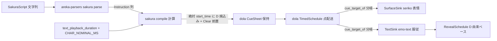
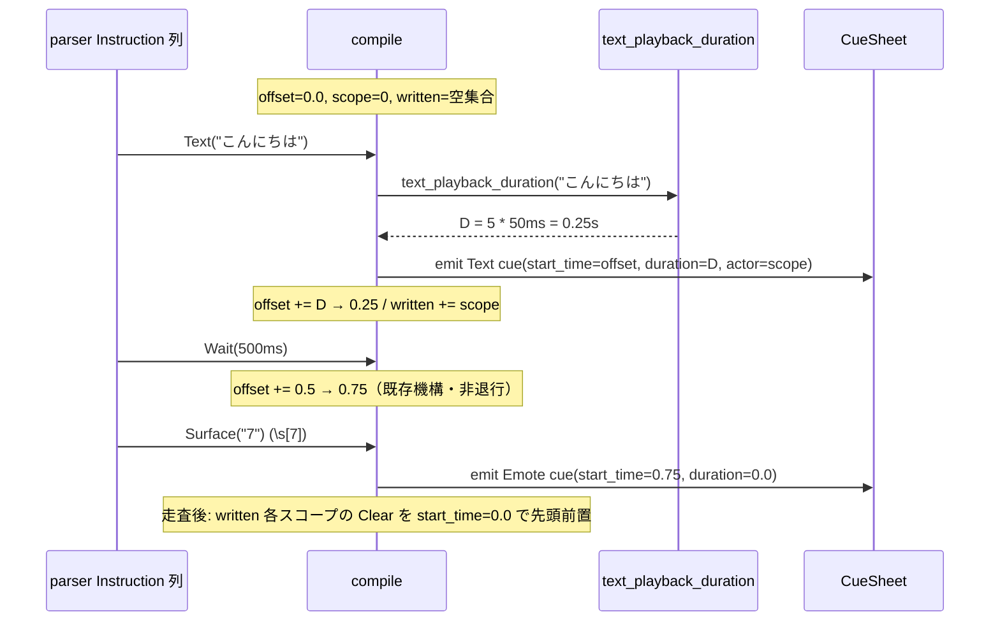
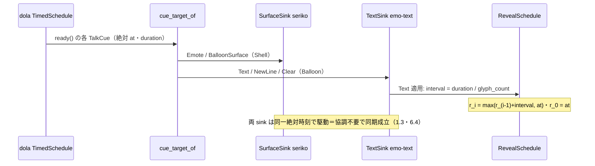

# 技術設計書 — areka-P0-cue-playback-duration

## Overview

さくらスクリプトの**テキスト再生には時間がかかる**（1 文字あたりの暗黙ノミナルウェイト＋明示 `\_w[ms]`）が、areka の cue タイムラインはこの再生時間を一切モデル化しておらず、テキスト cue を「点（0 時間）」として扱っている。結果、テキストを喋り終わる前に後続 cue（次テキスト・`\s` 表情・`\n` 改行）が発火し、`areka-P0-emo2-boot` R9.3 実機サインオフの綻び（#3 ウェイト不発・#4 改行早発・#6 前会話が消えない・`\s` 非同期）を招いた。根本病理は「文字数→文字ウェイト量」を計算するロジックが emo-text（`char_wait=0.05`）・wintf typewriter に**独自実装で二重化**され、タイムライン（cue 発火時刻）と reveal（typewriter 表示）が協調しないこと——**単一の権威が「このテキストの再生には XXX 秒かかる」を保持していない**。

本 spec は開発者決定の**案A（duration 付き cue の三権分立）**で解決する。**計算＝sakura**（テキスト→再生時間 D を算出する単一の純関数 `text_playback_duration` を所有し、compile が各テキスト cue へ D を第一級データとして付与しつつ絶対 `start_time` へ `offset += D` で焼き込む）・**保持＝dola**（cue エンベロープに D フィールドを additive 追加し、焼き込み済みの絶対時刻と D を忠実に保持・配送する）・**服従＝emo-text**（自前 `char_wait` を撤去し、配送された D から reveal のペースを導出する）。dola は既存 `Wait` 累積と対称な点配送のままで、`TimedSchedule` の中核挙動を変えない。

本改修は新規クレート・新規アーキテクチャを伴わない**横断改修**であり、3 層（dola/sakura/emo-text）に「テキスト再生 duration」という 1 個の新データを貫通させる。決定論（注入時刻 `talk_time` 駆動・実時間 `sleep`/`Instant` 不使用）と serde 後方互換を維持する。

### Goals
- テキスト再生 duration D をタイムラインへ**第一級モデル化**する（後続 cue がテキスト再生完了後に発火する）。
- 「テキスト→再生時間」を計算する**単一の純関数**を sakura に置き、per-char ノミナル定数を一元化する（二重実装を絶滅）。
- 新 talk 冒頭で書き込みスコープのバルーンを**自動クリア**する（#6）。
- emo-text reveal を**配送された D に服従**させ、自前 char_wait を撤去する。
- 実機（実 emo2・実 pasta.dll・実 DPI）で #3・#4・#6・`\s` 同期が観測可能に解消される。

### Non-Goals
- テキストの**レイアウト/描画**（縦書き・折返し・フォントメトリクス）の変更（emo-text の既存領分）。
- bind/mayuna 合成による表情変化（#2＝`mayuna-compose` へ委譲）・実行時サーフェスリサイズ（#1＝`surface-resize-resnap` へ委譲）。
- 選択肢・一時停止・対話タグ（`\q`/`\x` 等の M-dialogue）。**dola へ pause/resume 状態を持ち込まない**（動的制御フローは dola の外側＝オーケストレーターの領分）。
- wintf `Typewriter` widget の統合（第 3 の独自 char_wait だが areka バルーンは emo-text 経路ゆえ実行経路外）。
- ユーザーによる文字送り速度 UI（M2 送り・本 spec は単一既定定数で足る）。
- `\__w`（基準からの累積ウェイト・文字表示時間を差し引く形）と `\C`（追記モード）の対応（現状 parser 未対応・M-dialogue 以降）。

## Boundary Commitments

### This Spec Owns
- **計算（sakura）**: 純関数 `text_playback_duration(text) -> f64`（暗黙 per-char ノミナル）と per-char ノミナル定数 `CHAR_NOMINAL_MS` の**唯一の定義**。compile による各テキスト cue への D 付与・`offset += D` の絶対時刻焼き込み・talk 冒頭 Clear 前置。
- **保持（dola）**: `Cue` エンベロープの `duration` フィールド（additive・serde 後方互換）。dola はこれを不透明な秒数として保持・配送するのみ。
- **服従（emo-text）**: reveal ペースを配送 D から導出する遷移規則。`TextLayerConfig` からの `char_wait` 撤去。
- **搬送**: sakura `TalkCue` エンベロープの `duration` フィールド（cue を sink へ運ぶ実行時搬送体・serde 非依存）。
- **実機受け入れ**: #3・#4・#6・`\s` 同期の人間サインオフ観測手順。

### Out of Boundary
- **描画・レイアウト**: emo-text の `LayoutEngine`／`ViewboxExecutor`／`TextRegion` 等（時間の権威のみを扱い、描画に触れない・8.2）。
- **dola の時刻導出**: dola は配送時に時刻を導出・変換しない（絶対時刻をそのまま配送）。占有（occupancy）機構を `TimedSchedule` へ追加しない（整列は sakura が焼き込む）。
- **dola の動的制御**: pause/resume/選択肢の状態（`\x`/`\q`）。Barrier シームでのオーケストレーター再調停は dola の外側（8.4）。
- **wintf `Typewriter` widget**: 実行経路外ゆえ現状維持・撤去も統合もしない（8.1）。
- **mayuna/bind・surface-resize**: 隣接 spec へ委譲（8.4）。ただし本 spec が確定する cue の duration 形へ mayuna の瞬時 bind cue（D=0）が additive に載れることを保証する。

### Allowed Dependencies
- **dola `cue` モジュール**（`Cue`/`CueCommand`/`CuePayload`/`TimedSchedule`/`CueSheet`）— duration の保持場所。既存 variant のワイヤ形は不変。
- **areka-parsers `sakura`**（`Instruction` 列・`Wait(Duration)`/`Text(String)`）— compile の入力。`\_w`→`Wait`、`\w`→`Wait` の既存正規化に依存（`WAIT_UNIT_MS=50` は別概念で流用しない）。
- **areka-sakura contract**（`TalkCue`/`cue_target_of`）・drive（`to_schedule`/2 sink 振り分け）— D の搬送経路。
- **areka-emo-text state/actor**（`TextLayerState`/`RevealSchedule`/`TextLayerRuntime`）— reveal 服従の実装先。
- 新規 crates.io 依存の追加は**禁止**（Rust 2024・bevy_ecs・serde の既存スタックのみ）。

### Revalidation Triggers
- `Cue`/`TalkCue` エンベロープの形状変更（`duration` の型・意味・serde 属性）→ dola を消費する全経路（wintf `cue/`・emo-text・seriko）と serde 済み資産の再検証。
- `cue_target_of` の分類変更・`CueCommand` variant 追加 → 2 sink 振り分けと emo-text `apply_cue` の網羅性。
- per-char ノミナル定数値・`text_playback_duration` のシグネチャ変更 → 実機再生タイミングと emo-text reveal の再検証。
- `\C`（追記モード）対応の着手 → **Clear 前置の無条件性を条件化**する必要（現状は `\C` 未対応ゆえ無条件で妥当・§Design Decisions 参照）。

## Architecture

### Existing Architecture Analysis

三権分立の物理的分離は既に成立しており、本 spec は既存構造に 1 データを貫通させる。

- **保持＝dola** `crates/dola/src/cue/`: `Cue { actor, start_time, payload }`（`Clone/Debug/Serialize/Deserialize` 派生・**PartialEq 非導出**）。`CueCommand` は 8 variant・externally tagged serde（`Text(String)` のワイヤ形 `{"Text":"..."}`）。`BalloonSurface` を additive 追加した実績あり。`TimedSchedule<T>` は `tick(t)`→`ready()` の 2 フェーズ点配送で、duration/占有の概念を持たない。
- **計算＝sakura** `crates/areka-sakura/src/`: `compile(&[Instruction]) -> CompiledTalk` は純粋・決定的・no I/O。現状 `Wait(d)` のみ `offset += d.as_secs_f64()` で進め、**`Text(t)` は offset を進めない（0 時間）**＝本 spec の中核欠落。冒頭 Clear 前置も存在しない。`TalkCue { at, actor, command }`（serde 非依存・`Clone/Debug/PartialEq`）が 2 sink への搬送体。`drive.rs::to_schedule` が `Cue`→`TalkCue` を複写し `on_tick` が `cue_target_of` で SurfaceSink/TextSink へ振り分ける。
- **服従＝emo-text** `crates/areka-emo-text/src/`: `TextLayerConfig.char_wait=0.05`（**撤去対象の重複 #1**）。`RevealSchedule::extend_chunk(glyph_count, chunk_start, char_wait)` が自前ペースで `r_i = max(r_{i-1}+char_wait, chunk_start)`（先頭 `r_0=chunk_start`）を確定。`TextLayerState::apply_cue(cue, config)` が Text 追記＋reveal 時刻確定、Clear で actor 状態を全消去（未リビール分含む）。注入時刻駆動（`Instant` 不使用）。
- **実行経路外の重複 #2**: wintf `typewriter` の `default_char_wait=0.05`。areka バルーンは emo-text 経路ゆえ非実行（8.1 で対象外）。
- **別概念の 50ms**: parser `WAIT_UNIT_MS=50`（`\w[n]`＝n×50ms の**明示ウェイト単位**）。per-char ノミナルとは別物ゆえ流用も統合もしない。

### Architecture Pattern & Boundary Map

**選択パターン**: 三権分立（Compute / Hold / Obey）＋既存 `Wait` 累積と対称な焼き込み配送。単一真実源は**計算層**（`text_playback_duration` 1 本）にあり、絶対 `start_time` と cue の `duration` は同一計算の 2 投影を不変台本へ凍結したもの（実行時ドリフト不能）。



**Architecture Integration**:
- **選択パターンの根拠**: 案 2-A（sakura が `offset += D` を焼き込み・dola は保持のみ）を採る。採否根拠は「リスク」ではなく**dola の同期配送責務**——同一 CueSheet を複数の独立表現者（SurfaceSink/TextSink・プロセス境界跨ぎを含む）へ渡し、表現者が協調せずとも同一絶対時刻で発火する保証（1.3）。時刻を配送時に導出すると表現者ごとに独立計算＝desync ゆえ、絶対時刻は同期の必須要件。案 2-B（dola が occupancy を能動導出）は棄却（開発者決裁・research §7.4）。
- **責務境界**: 計算（sakura）／保持（dola）／服従（emo-text）が単一責務。二領域が同一データを co-own しない（D の唯一の生成点は compile、唯一の消費点は emo-text reveal、dola は不透明保持）。
- **保持パターン**: 案 1-A（`Cue`/`TalkCue` エンベロープの `duration` フィールド）。`CueCommand::Text` のワイヤ形を不変に保ち（7.3）、テキスト以外の cue（D=0）も同一形に自然に載る汎用データとする（7.2）。案 1-B（variant 分裂）・案 1-C（Barrier 再利用）は棄却（§Design Decisions）。
- **既存パターンの保存**: `Wait` 累積機構（`offset += d`）と完全対称に `offset += D` を追加。`TimedSchedule` の点配送・冪等/単調/NaN ガードは無改変。serde additive 拡張の実績（`BalloonSurface`）に倣う。
- **steering 整合**: dola はプラットフォーム非依存の演出定義層に留まり SakuraScript 固有意味（per-char 値）を内包しない（7.2）。決定論は注入時刻駆動を維持（7.1）。

### Technology Stack

| Layer | Choice / Version | Role in Feature | Notes |
|-------|------------------|-----------------|-------|
| 演出定義（保持） | dola（`serde` 1・externally tagged） | `Cue.duration` の保持・配送・serde 後方互換 | 既存 variant ワイヤ形不変・`#[serde(default)]` |
| 計算（台本） | areka-sakura（Rust 2024・純粋関数） | `text_playback_duration`・compile 焼込み・Clear 前置 | GPU/COM 非依存・全分岐単体テスト可 |
| 服従（reveal） | areka-emo-text（純粋状態機械＋UI 結線） | 配送 D から reveal ペース導出・`char_wait` 撤去 | 注入時刻駆動・`Instant` 不使用 |
| 入力 | areka-parsers sakura（既存） | `\_w`→`Wait(Duration)`・`Text(String)` | `WAIT_UNIT_MS=50` は別概念・流用しない |

新規依存の追加なし。tokio 不使用。

## File Structure Plan

### Directory Structure
```
crates/
├── dola/src/cue/
│   └── command.rs            # [変更] Cue に duration: f64 追加（#[serde(default)]）
├── areka-sakura/src/
│   ├── duration.rs           # [新規] text_playback_duration + CHAR_NOMINAL_MS（純粋・唯一の権威）
│   ├── lib.rs                # [変更] pub mod duration; 公開
│   ├── compile.rs            # [変更] Text へ D 付与＋offset+=D・Clear 前置・emit に duration
│   ├── contract.rs           # [変更] TalkCue に duration: f64 追加
│   └── drive.rs              # [変更] to_schedule が Cue.duration→TalkCue.duration を複写
└── areka-emo-text/src/
    ├── state.rs              # [変更] TextLayerConfig から char_wait 撤去・apply_cue が cue.duration からペース導出
    └── actor.rs              # [変更] apply_cue 呼び出しの config 引数除去・config は line_pitch のみ保持
```

### Modified Files
- `crates/dola/src/cue/command.rs` — `Cue` に `#[serde(default)] pub duration: f64`（既定 0.0＝瞬時点）。doc に「この cue が占有する再生時間（秒）・後続 cue はこの分だけ絶対時刻が後ろへ焼き込まれる」を明記。`Cue { ... }` リテラル（in-source テスト内）へ `duration` 追加。後方互換 serde テスト（duration 欠落 JSON→0.0）追加。
- `crates/areka-sakura/src/duration.rs` — **新規**。`pub const CHAR_NOMINAL_MS: u64 = 50;`（per-char ノミナルの唯一の定義）と `pub fn text_playback_duration(text: &str) -> f64`。純粋・決定的・no I/O。入力依存全分岐の単体テストを同ファイル `#[cfg(test)]` に置く。
- `crates/areka-sakura/src/lib.rs` — `pub mod duration;`（`text_playback_duration`/`CHAR_NOMINAL_MS` を公開）。
- `crates/areka-sakura/src/compile.rs` — Text arm で `D = text_playback_duration(text)` を算出し、当該 Text cue へ `duration=D` を付与、直後に `offset += D`。`emit` は `duration` 引数を取り Text 以外は 0.0。走査後に**書き込み balloon スコープ集合**（Text/NewLine を emit したスコープ）を `BTreeSet<u32>` で収集し、`Clear`（`start_time=0.0`・duration 0.0）を各スコープぶん**先頭へ前置**。既存テスト更新＋新規（D 焼込み・Clear 前置・非退行）追加。
- `crates/areka-sakura/src/contract.rs` — `TalkCue` に `pub duration: f64`。`cue_target_of` は無変更（分類は command 依存で duration に非依存）。
- `crates/areka-sakura/src/drive.rs` — `to_schedule` の `TalkCue` 構築に `duration: cue.duration` を追加。in-source テストの `TalkCue { ... }` リテラルへ `duration` 追加。
- `crates/areka-emo-text/src/state.rs` — `TextLayerConfig` から `char_wait` フィールド・その `Default` を撤去（`line_pitch_factor` は残置）。`TextLayerState::apply_cue` から `config` 引数を除去（reveal ペースは `cue.duration` 由来）。`RevealSchedule::extend_chunk` の第 3 引数を `char_wait` から `interval`（＝`D/N`）へ意味変更。reveal 系テストを D 駆動へ更新。
- `crates/areka-emo-text/src/actor.rs` — `TextLayerRuntime::apply_cue` の `self.state.apply_cue(cue, &self.config)` を `self.state.apply_cue(cue)` へ。`config`（`line_pitch_factor`）は `DWriteMetrics::new` 用に保持。in-source テストの `TalkCue` ヘルパへ `duration` 追加。
- **横断機械変更**: `TalkCue { ... }` リテラルは serde 非依存の全構築点で `duration` 追加が必要（production は `drive.rs::to_schedule` の 1 点、他は各クレートのテストヘルパ＝`state.rs`/`actor.rs`/`sink.rs`）。コンパイラが未指定を強制検出する。
- **前提条件の再確認（8.3）**: 着手時に `crates/**` を `punctuation_wait` と drive.rs 生スクリプト診断ログで再 grep（現状ゼロ・撤去作業は発生しない見込み）。

## System Flows

### compile による絶対時刻焼き込み（計算）



`\s`（Emote）はテキストの D 焼き込み後の offset（=0.75）で発火するため、**喋り完了後に表情が切り替わる**（6.4）。整列は compile が絶対 `start_time` へ焼き込み、dola は導出せず配送するのみ。

### 同一台本の 2 sink 同期配送（保持→服従）



**縮退**: `duration=0`（後方互換 cue・非テキスト源）かつ `glyph_count>0` → `interval=0` → 全グリフが `at` で即時可視（1.5）。`glyph_count=0`（空テキスト）→ reveal 追記なし（除算しない）。

## Requirements Traceability

| Requirement | Summary | Components | Interfaces | Flows |
|-------------|---------|------------|------------|-------|
| 1.1 | dola が D を第一級配送データとして保持 | dola `Cue.duration`・sakura `TalkCue.duration` | エンベロープ field | 保持→服従 |
| 1.2 | 各 cue の絶対 `start_time` を導出せず保持・配送 | dola `Cue.start_time`・`TimedSchedule` | 点配送（無改変） | 焼き込み |
| 1.3 | 同一台本を複数表現者へ同一絶対時刻で配送 | `CueSheet`・`cue_target_of`・2 sink | serde `Cue`・分岐 | 2 sink 同期 |
| 1.4 | D は不透明秒数・dola に 50ms を焼かない | `Cue.duration: f64`・`CHAR_NOMINAL_MS`(sakura) | opaque f64 | — |
| 1.5 | D 未付与→即時点（0 相当・後方互換） | serde(default)=0.0・reveal 縮退 | `#[serde(default)]` | 縮退 |
| 2.1 | テキスト→再生時間の単一純関数 | `text_playback_duration` | `fn(&str)->f64` | 計算 |
| 2.2 | 実時間/レイアウト/描画非依存で決定的 | `text_playback_duration` | 純関数契約 | — |
| 2.3 | per-char ノミナル定数を sakura に一元化 | `CHAR_NOMINAL_MS` | 単一 const | — |
| 2.4 | 暗黙＋明示ウェイトの換算（合成） | `text_playback_duration`＋compile 累積 | 純関数＋offset 累積 | 計算 |
| 2.5 | GPU/窓/COM 非依存・全分岐単体テスト | `text_playback_duration` | 純関数契約 | — |
| 3.1 | compile が各テキスト cue へ D 付与 | compile Text arm・`emit(duration)` | `emit` シグネチャ | 焼き込み |
| 3.2 | 後続 cue の絶対時刻を text+D 以降へ確定 | compile `offset += D` | offset 累積 | 焼き込み |
| 3.3 | 明示ウェイト無しは暗黙 per-char のみ加算 | compile Text arm | offset 累積 | 焼き込み |
| 3.4 | 明示 `\_w` を暗黙に加えて累積・非退行 | compile Wait arm（無改変） | 既存 offset 累積 | 焼き込み |
| 4.1 | talk 冒頭へ Clear cue 前置 | compile Clear 前置 post-pass | 先頭前置 | 焼き込み |
| 4.2 | 新 talk で前 talk テキスト除去 | compile Clear＋emo-text Clear | Clear cue | 2 sink 同期 |
| 4.3 | 書き込む各スコープをクリア | compile 書込スコープ集合→per-scope Clear | `BTreeSet<u32>` | 焼き込み |
| 5.1 | reveal が配送 D からタイミング決定 | emo-text `apply_cue`（cue.duration） | apply_cue | 2 sink 同期 |
| 5.2 | 独自 per-char 定数を保持しない | `TextLayerConfig`（char_wait 撤去） | 型変更 | — |
| 5.3 | N 文字を概ね D 秒で表示 | `RevealSchedule`（interval=D/N） | `extend_chunk` | 縮退込 |
| 5.4 | Clear cue で未表示分含め消去 | emo-text Clear（既存・無改変） | apply_cue | 2 sink 同期 |
| 6.1 | 実機 `\_w` を pause として体感 | 全パイプライン（実機） | 実機観測 | — |
| 6.2 | `\n` を直前 `\_w` 分だけ遅らせる | compile offset 累積（実機） | 実機観測 | 焼き込み |
| 6.3 | 新 talk で前会話が消える（#6） | Clear 前置（実機） | 実機観測 | — |
| 6.4 | `\s` を喋り完了後に同期切替 | 同一台本 2 sink 同期（実機） | 実機観測 | 2 sink 同期 |
| 6.5 | 人間サインオフ・絶対パス起動 | 検証手順 | 手順 | — |
| 7.1 | 注入時刻駆動・sleep/Instant 不使用 | 全層（無改変で維持） | 注入時刻 | — |
| 7.2 | dola は per-char 意味を内包しない汎用基盤 | `CHAR_NOMINAL_MS`(sakura のみ) | opaque f64 | — |
| 7.3 | 既存 variant ワイヤ形不変で additive 拡張 | `Cue.duration`(serde default)・CueCommand 無改変 | serde | — |
| 7.4 | duration 無し serde 済みデータを従来解釈 | serde(default)=0.0 | serde | — |
| 8.1 | wintf Typewriter を対象外 | Out of Boundary | — | — |
| 8.2 | レイアウト・描画を変更しない | Out of Boundary | — | — |
| 8.3 | punctuation_wait/診断ログ不在の再確認 | 着手前提条件 | grep | — |
| 8.4 | bind/mayuna・resize を委譲 | Out of Boundary | — | — |

## Components and Interfaces

| Component | Domain/Layer | Intent | Req Coverage | Key Dependencies (P0/P1) | Contracts |
|-----------|--------------|--------|--------------|--------------------------|-----------|
| `text_playback_duration` | 計算（sakura） | テキスト→再生時間 D の唯一の純関数 | 2.1–2.5 | なし（純粋） | Service |
| compile（duration 焼込み＋Clear 前置） | 計算（sakura） | 各テキスト cue へ D 付与・絶対時刻焼込み・冒頭 Clear | 3.1–3.4, 4.1, 4.3 | parser Instruction (P0), `text_playback_duration` (P0), dola `Cue` (P0) | Service |
| `Cue.duration` / `TalkCue.duration` | 保持（dola）／搬送（sakura） | D を不透明秒数として保持・配送 | 1.1, 1.2, 1.4, 1.5, 7.2, 7.3, 7.4 | serde (P0) | State |
| emo-text reveal 服従 | 服従（emo-text） | 配送 D から reveal ペース導出・char_wait 撤去 | 5.1–5.4, 1.5 | `TalkCue.duration` (P0) | State |
| 実機受け入れパイプライン | 統合 | #3/#4/#6/`\s` を実機で観測 | 6.1–6.5 | 全上流 (P0), 実 pasta.dll (P0) | Batch |

### 計算層（sakura）

#### text_playback_duration（単一純関数）

| Field | Detail |
|-------|--------|
| Intent | テキスト（decode 済み Text チャンク）から暗黙 per-char 再生時間 D を算出する唯一の権威 |
| Requirements | 2.1, 2.2, 2.3, 2.4, 2.5 |

**Responsibilities & Constraints**
- 入力は `Instruction::Text` のペイロード文字列（1 チャンク）。グリフ単位は Rust `char`（emo-text と同一の M1 正準）。
- `CHAR_NOMINAL_MS: u64 = 50` を**唯一の定義箇所**として持つ（2.3）。parser `WAIT_UNIT_MS`（`\w` 単位）・emo-text `char_wait`（撤去）と混同・統合しない。
- 純粋・決定的・no I/O・GPU/窓/COM 非依存（2.2, 2.5）。実時間・レイアウト・描画状態を読まない。
- FP 決定性のため整数 ms 算術＋単一変換（`Duration::from_millis(N*CHAR_NOMINAL_MS).as_secs_f64()`）で既存の `Duration→f64` 規律に揃える。

**Contracts**: Service [x]

##### Service Interface
```rust
/// per-char ノミナルウェイト（ms・唯一の定義箇所）。parser WAIT_UNIT_MS とは別概念。
pub const CHAR_NOMINAL_MS: u64 = 50;

/// テキスト 1 チャンクの暗黙再生時間 D（秒）を算出する純関数。
/// D = char_count(text) * CHAR_NOMINAL_MS を秒へ変換した値。
pub fn text_playback_duration(text: &str) -> f64;
```
- Preconditions: なし（任意の `&str`）。
- Postconditions: 戻り値は有限・非負。同一入力へ常に同一値（決定的）。空文字列は 0.0。
- Invariants: SakuraScript 固有の明示ウェイト値（`\_w`/`\w` の ms）を内包しない（それらは `Instruction::Wait` として parser が分離済み）。

**Implementation Notes**
- Integration: compile の Text arm がこの関数を呼び、cue の `duration` と `offset += D` の両方へ同一戻り値を用いる（2 投影・単一計算）。
- Validation: 単体テスト（空文字＝0.0／N 文字＝N×50ms／多バイト文字が 1 char＝1 単位）を同ファイルに置く。
- Risks: 巨大 N の `u64` 乗算オーバーフローは現実的トーク長で非問題（`saturating_mul` を用いてもよい）。

#### compile（duration 焼き込み＋Clear 前置）

| Field | Detail |
|-------|--------|
| Intent | 各テキスト cue へ D を付与し絶対 start_time へ焼き込み、talk 冒頭へ書込スコープの Clear を前置する |
| Requirements | 3.1, 3.2, 3.3, 3.4, 4.1, 4.3 |

**Responsibilities & Constraints**
- **D 付与＋焼込み（3.1/3.2/3.3）**: `Instruction::Text(t)` で `D = text_playback_duration(t)` を算出し、当該 Text cue の `duration=D` として `emit`。直後に `offset += D`。これにより後続 cue（次テキスト・`\s` Emote・`\n` NewLine）の絶対 `start_time` が text 発火時刻＋D 以降へ確定する。
- **明示ウェイト非退行（3.4）**: `Instruction::Wait(d)` の `offset += d.as_secs_f64()` は無改変。テキストの D と明示 `\_w` は offset 上で加算合成される（暗黙のみ／明示のみ／両方の 3 経路とも単調累積）。
- **Clear 前置（4.1/4.3）**: 走査中に Text/NewLine を emit したスコープを `BTreeSet<u32>` へ収集。走査後、各スコープの `CueCommand::Clear`（`start_time=0.0`・`duration=0.0`・actor=スコープ）を cue 列の**先頭へ前置**。`CueSheet::new` の安定ソートと `to_schedule` の同一 `at` FIFO 配信により、Clear は同スコープの最初のテキストより前に配送される。
- 純粋・決定的・no I/O を維持。`emit` は `duration` 引数を追加（Text 以外は 0.0）。

**Dependencies**
- Inbound: drive `on_start`（parse→compile）— talk 起動時の呼び出し（P0）。
- Outbound: `text_playback_duration` — D 算出（P0）。dola `Cue` — 発火列の構築（P0）。

**Contracts**: Service [x] / State [x]

##### Service Interface
```rust
// emit は duration を受ける（Text は D、他は 0.0）。
fn emit(scope: u32, offset: f64, duration: f64, command: CueCommand) -> Cue;
// compile シグネチャは不変（内部で D 焼込みと Clear 前置を行う）。
pub fn compile(instructions: &[Instruction]) -> CompiledTalk;
```
- Preconditions: `instructions` は parser 出力（再パースしない）。
- Postconditions: `sheet` 内 `start_time` は有限・非負・非減少。各 Text cue の `duration>0`（N>0 時）。書込スコープの Clear が `start_time=0.0` で先頭に存在する。
- Invariants: 同一入力→同一出力（決定的）。`Wait` 累積の挙動は不変。

**Implementation Notes**
- Integration: `offset += D` は既存 `Wait` 累積（`offset += d`）と対称。テストパターン（`wait_accumulation_is_monotonic` 系）を D 版へ流用。
- Validation: D 焼込み（Text 後続 cue の start_time が text+D）・Clear 前置（先頭・per written-scope・非書込スコープには前置しない）・暗黙/明示合成・決定性・非減少を単体テストで網羅。
- Risks: Clear 前置の順序は「先頭前置＋安定ソート＋同一 at FIFO」に依存（load-bearing）。`same_at_cues_preserve_script_order_fifo_within_a_sink` 相当の統合テストで固定する。

### 保持層（dola）／搬送（sakura）

#### Cue.duration / TalkCue.duration

| Field | Detail |
|-------|--------|
| Intent | D を不透明な秒数として保持・配送する（dola は意味を持たない） |
| Requirements | 1.1, 1.2, 1.4, 1.5, 7.2, 7.3, 7.4 |

**Responsibilities & Constraints**
- `dola::cue::Cue` に `#[serde(default)] pub duration: f64`（既定 0.0）。`CueCommand` は無改変ゆえ既存 variant のワイヤ形は不変（7.3）。既存 serde 済みデータ（duration 欠落）は default で 0.0 として読める（7.4・1.5）。
- `areka_sakura::contract::TalkCue` に `pub duration: f64`（serde 非依存の実行時搬送体）。`to_schedule` が `Cue.duration` を無変形で複写。
- dola は D を SakuraScript 意味に解釈しない（7.2）。`start_time` は絶対時刻として保持し配送時に導出・変換しない（1.2）。

**Contracts**: State [x]

##### State Management
- **表現**: `duration: f64`（`Option` ではない）。根拠: 1.5 が「未付与＝再生時間 0 相当（即時点）」と規定し、0.0 と「未指定」を区別する意味論的必要がない。`#[serde(default)]` で後方互換（7.4）と算術単純性（`offset += duration` が常に有効）を両立。
- **永続性/一貫性**: `Cue` は `PartialEq` 非導出のためテストはフィールド比較（`cue_eq` を `duration` 込みへ拡張）。roundtrip 檻＋「duration 欠落 JSON→0.0」の後方互換檻を追加。

**Implementation Notes**
- Integration: 伝播経路は `compile → Cue.duration → CueSheet(serde) → to_schedule → TalkCue.duration → sink → apply_cue`。プロセス跨ぎは serde 化 `CueSheet` が D を運ぶ（1.3）。
- Validation: `cue_command_balloon_surface_serde_roundtrip`（`{"BalloonSurface":{"key":"2"}}`）が不変であることで CueCommand ワイヤ形不変を固定（7.3）。
- Risks: `TalkCue { ... }` リテラルへの `duration` 追加漏れはコンパイルエラーで検出（未指定不可）。

### 服従層（emo-text）

#### reveal 服従（RevealSchedule / apply_cue）

| Field | Detail |
|-------|--------|
| Intent | 配送された D から reveal ペースを導出し、自前 char_wait を撤去する |
| Requirements | 5.1, 5.2, 5.3, 5.4, 1.5 |

**Responsibilities & Constraints**
- **D 由来ペース（5.1/5.3）**: Text cue 適用時、`interval = if glyph_count>0 { cue.duration / glyph_count as f64 } else { 0.0 }` を導出し、`extend_chunk(glyph_count, cue.at, interval)` で `r_i = max(r_{i-1}+interval, cue.at)`（`r_0=cue.at`）を確定。N 文字を概ね D 秒で表示する。
- **char_wait 撤去（5.2）**: `TextLayerConfig.char_wait` を型から削除。`TextLayerState::apply_cue` は `config` 引数を持たない（reveal ペースは cue.duration 由来）。`config`（`line_pitch_factor`）は `DWriteMetrics::new` 用に `TextLayerRuntime` が保持し続ける。
- **Clear（5.4）**: 未リビール分を含む actor 状態全消去は既存挙動を維持（`apply_cue` の Clear arm・`ViewboxExecutor::request_clear` 連動）。無改変。
- **縮退（1.5）**: `duration=0`（後方互換/非テキスト源）かつ N>0 → interval=0 → 全グリフが `cue.at` で即時可視。N=0（空テキスト）→ 追記なし・除算しない。跨チャンク tail 追従（`max` 追従）は温存し既存の無損失挙動を維持。

**Contracts**: State [x]

##### State Management
- **状態モデル**: `RevealSchedule.times: Vec<f64>`（単調非減少・二分探索で `visible(t)`）は無改変。`extend_chunk` の第 3 引数の**意味のみ** char_wait→interval へ変更。
- **並行**: 注入時刻 `talk_time` 駆動を維持（`Instant`/sleep 不使用・7.1）。

**Implementation Notes**
- Integration: `cue.duration=N×50ms`（sakura の既定）のとき interval=`D/N` は実効 50ms 相当となり、reveal 時刻は旧 `char_wait=0.05` 挙動と**機能等価**（全注入時刻 tick で可視グリフ数が一致）——reveal 挙動を保存しつつタイムラインのみを是正する（回帰リスク最小）。**厳密なビット等価は主張しない**: `Duration::from_millis(N*CHAR_NOMINAL_MS).as_secs_f64() / (N as f64)` は f64 リテラル `0.05` と一般に一致しない（例 N=3 で ≈0.049999999999999996・約 1 ULP 差）が、`max` 追従の累積でも可視グリフ数は不変。dola 契約上 emo-text が受け取るのは**不透明 f64 秒**ゆえ interval は f64 除算で導出し（整数 ms へ戻さない）、この除算は決定的（同一入力→同一 f64）＝決定論檻と両立する。
- Validation: 既存 reveal テスト群（`reveal_times_follow_char_wait_formula_from_chunk_start` 等）を D 駆動へ更新（config.char_wait ではなく cue.duration を与える）。**期待 reveal 時刻は実装と同一の `D/N`（f64 除算＋`max` 追従）算術で再計算して比較し、旧 `0.05` リテラル由来の期待値を使わない**（FP 差で flaky 化するため・memory: deterministic-test-coverage-mandate 整合）。縮退（D=0 即時／N=0 無追記）を新規檻で網羅。
- Risks: `TalkCue` へ `duration` 追加で全テストヘルパ（state/actor/sink）が更新必要（コンパイラ強制）。既存テストは「陳腐化」ではなく「シグネチャ変更で要更新」（obsolete-vs-broken 方針）。

## Data Models

### Domain Model
- **不変台本（CueSheet）**: `Cue { actor, start_time, payload, duration }` の列。`start_time` は talk 起点からの絶対（焼き込み済み）秒、`duration` は当該 cue の占有秒（テキストのみ >0、他は 0.0）。両者は `text_playback_duration` の単一計算の 2 投影であり、不変台本へ凍結される（実行時ドリフト不能・再タイミングは再 compile）。
- **搬送体（TalkCue）**: `{ at, actor, command, duration }`。`Cue` の実行時投影（serde 非依存）。sink が消費し emo-text reveal が `duration` を読む。

### Data Contracts & Integration
- **serde 拡張**: `Cue` は externally-tagged ではなく通常 struct。`duration` を `#[serde(default)]` で追加＝旧 JSON（3 フィールド）は `duration=0.0` として読め、新 JSON は 4 フィールド目を持つ（additive・7.3/7.4）。`CueCommand` variant のワイヤ形は完全不変。
- **後方互換の検証**: `{"actor":"0","start_time":0.0,"payload":{"Command":{"Text":"hi"}}}` を deserialize → `duration==0.0`。新規 `Cue`（duration=0.25）の roundtrip 一致。

## Error Handling

### Error Strategy
本 spec は失敗経路を新設しない。既存の log-first 規律（`error!`＋継続・panic は致命限定）を踏襲する。

### Error Categories and Responses
- **縮退（正常経路）**: `duration=0` かつ N>0 → 即時可視。`duration<0`（想定外・非テキスト源の異常値）→ `interval=D/N<0` となり `max(r_{i-1}+interval, at)` が `at` 下限で吸収（早期可視化はしない・monotonic は `at` で保たれる）。負値は sakura が生成しないため防御的縮退に留める。
- **N=0（空テキスト）**: reveal 追記なし・除算回避。既存 `empty_text_cue_adds_no_reveal_times` 相当で固定。
- **非有限 tick**: drive `on_tick` の既存 NaN/inf ガード（schedule を進めず `error!`・ループ継続）を無改変で維持（7.1）。
- **cue 適用失敗（借用競合）**: emo-text `spawn_emo_text` の既存 `try_borrow_mut` Err→`error!`＋継続を無改変で維持。
- **serde 欠損**: `#[serde(default)]` により欠落 duration は 0.0（エラーにしない・7.4）。

### Monitoring
既存の `tracing` 構造化ログ（compile の無視ログ・emo-text の適用ログ）を踏襲。新規のログ経路は不要。

## Testing Strategy

### Unit Tests（純粋・決定論・GPU 不要）
- **`text_playback_duration`（2.1–2.5）**: 空文字＝0.0／`"こんにちは"`＝5×50ms／多バイト（`"aあ🦆"`）が 3 char＝3 単位／決定性（同一入力反復で同値）。
- **compile D 焼込み（3.1–3.3）**: `Text→Surface` で Emote の `start_time` が text の D 後。連続 Text で各 start_time が累積 D。Text cue の `duration>0`。
- **compile 明示ウェイト合成・非退行（3.4）**: `Text\_w[500]Text` で 2 つ目の start_time が D+0.5。`wait_accumulation_is_monotonic` を D 込みで再固定。
- **compile Clear 前置（4.1/4.3）**: 単一スコープ talk で先頭に Clear@0.0。マルチスコープ（`\0`/`\1` 両方に Text）で両スコープの Clear@0.0 が前置。balloon 未書込スコープには前置しない。
- **serde 後方互換（7.3/7.4）**: duration 欠落 JSON→0.0。新 `Cue` roundtrip。`CueCommand` ワイヤ形不変（既存檻を維持）。
- **emo-text reveal 縮退（1.5/5.3）**: D=0＋N>0 で全グリフ即時（`at`）。N=0 で無追記。interval=D/N の reveal 時刻式。

### Integration Tests（クロス層・実 channel/schedule）
- **2 sink 同期配送（1.3/6.4）**: `\s[7]` を含む台本で、Emote が該当テキストの D 後の絶対時刻で SurfaceSink へ、Text が TextSink へ、同一 `Tick` 列で同期配送される（`undue_cues_are_withheld_until_their_at_is_reached` 相当を D 込みで拡張）。
- **Clear 前置 FIFO（4.2）**: 前 talk のテキストが新 talk 冒頭 Clear で消え、同一 `at=0.0` で Clear→Text の順に配送される（`same_at_cues_preserve_script_order_fifo` 相当）。
- **duration 搬送（1.1/5.1）**: compile→to_schedule→sink→apply_cue で `TalkCue.duration` が無変形に届き、emo-text の reveal 時刻が D 由来になる。

### E2E / 実機受け入れ（人間サインオフ・6.1–6.5）
- 実 emo2 ゴーストを実 pasta.dll・実 DPI・**絶対パス**で起動（相対パスは helper の pasta.dll LoadLibrary 失敗＝MOD_NOT_FOUND を招くため必須）。
- **#3**: `\_w[ms]` が pause として体感できる。**#4**: 1 行表示直後の `\n` 直前 `\_w` 分だけ改行が遅れる（早発しない）。**#6**: 新 talk 開始で前会話のバルーンテキストが消える。**`\s` 同期**: 表情切替が当該テキストの再生完了後に発火する。
- 人間サインオフを受け入れ要件とする（決定論外の観測ゲート）。

## Supporting References
- 詳細な選択肢比較（軸 1/軸 2/軸 3）・Topic 1 開発者決裁・dola 表現範囲の外壁は `research.md`（§3・§6・§7）に記録。design.md は結論（案 1-A＋案 2-A＋3-ii・reconciliation）を自足的に保持する。
