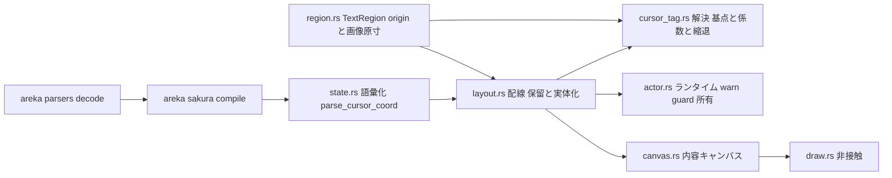
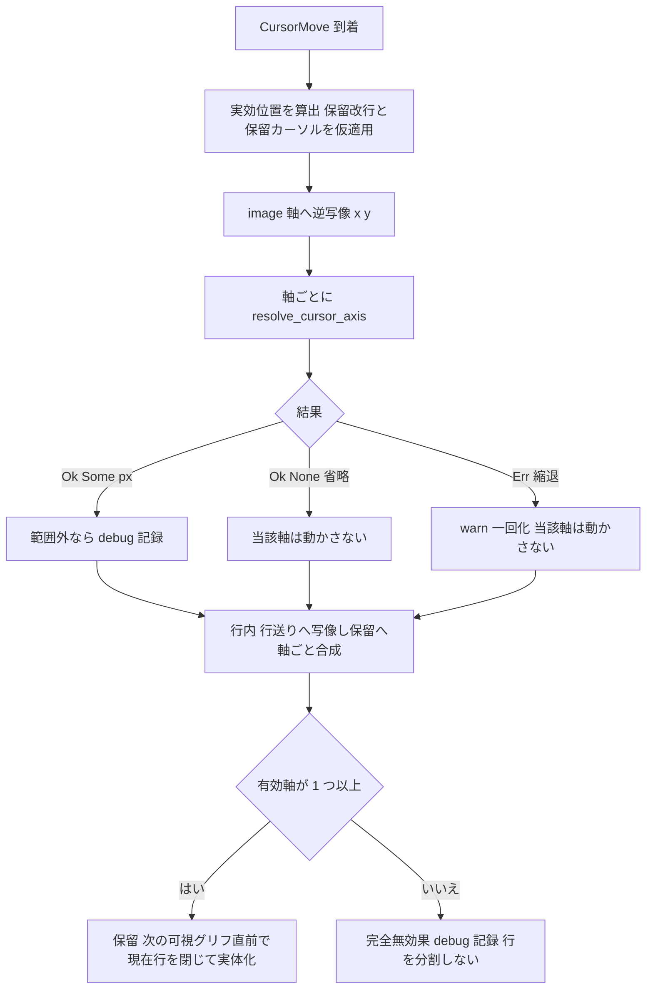

# 技術設計: areka-P0-cursor-tag-canon

> 作成: 2026-09-02 ／ 入力: `requirements.md`（Requirement 1〜10・付録 A＝SSP 2.8.83 逐語）・`research.md`（ギャップ分析 §1〜9・設計判断イシュー §8）・steering（`structure.md`／`tech.md`／`logging.md`／`roadmap.md`）
> 実測基準: ブランチ `claude/areka-p0-cursor-tag-canon-c24d2c`（origin/main へ rebase 済み・2026-09-02）。本書の file:line は当日実測値。

## Overview

**Purpose**: さくらスクリプトのカーソル移動タグ `\_l[x,y]` を、ukadoc（SSP 2.8.83）が定める全語彙について、3 つの書字方向（`horizontal_tb`／`vertical_rl`／`vertical_lr`）すべてで正典どおりに解決できるようにする。既存の伺かゴースト作者が SSP 向けに書いた台詞（字下げ・縦書きの列指定・相対微調整）が areka でも同じ位置に表示されるようになる。

**Users**: 既存ゴーストのスクリプト作者とその利用者。とくに縦書きバルーンで `\_l[0,0]`＝1 列目、負の X＝次の列という正典の書き方を使う作者。

**Impact**: 現行の実装は語彙表（`state.rs`）と換算（`layout.rs`）の 2 段のうち、換算が「非負の `px`／`em`／`lh` のみ」を返し、原点を validrect の辺（2.8.80 の旧文）から取っている。本設計は ⑴ 原点を「解決後の `origin`」（`TextRegion::start()`）へ切り替え、⑵ 換算を「基点＋値×係数」の式 1 本へ一般化して負値・`%`・`@` 相対・`centerx`／`centery` を実導出に加え、⑶ 縮退分岐を「解釈不能」だけに縮める。パーサ（`areka-parsers`）は引数を文字列のまま運んでおり改修しない。

本質は次の 2 行に尽きる（要件ディスカッションでの開発者の整理）:

- **受理**: `空 | centerx | centery | @?-?数値(em|lh|%)?` の 1 形式（語彙化は `parse_cursor_coord` が既に担い、足りないのは `centerx`／`centery` の 1 バリアントのみ）。
- **解決**: `位置 = 基点 + 値 × 係数`。基点 ∈ {解決後の `origin`（絶対）, 現在位置（`@`）, バルーン画像の中央（`centerx`／`centery`）}、係数 ∈ {1（px）, 文字高さ（em）, 行送り（lh）, 文字高さ/100（%）}。ぼやけていた原点は要件で裁定済み（Requirement 2.1／2.7／2.9）。

### Goals

- `\_l` の全座標書式を、軸ごとに独立に、書字方向に依らない単一の式で解決する（1.1〜1.6・3.1〜3.6・4.1〜4.5）。
- `vertical_rl` で `\_l[0,0]` が 1 列目の先頭に着地し、負の X が次の列を指す（2.3）。`horizontal_tb`／`vertical_lr` の既存表示結果は `origin` 未宣言バルーンで不変（2.7）。
- 縮退を「解釈不能」に限定し、キャラクター・分岐ごとの警告一回化と、範囲外・完全無効果の DEBUG 記録で観測可能にする（5.1〜5.5・2.6）。
- 3 書字方向 × 全語彙 × 縮退経路を、実 DPI・GPU・ウィンドウを要しない決定論テストで固定する（9.1〜9.6）。
- 完了仕様 `areka-P0-choice-render` からの所有移管と誤登記の是正を、アーカイブ非改変で記録する（8.1〜8.6）。
- 全語彙を一度に着地させる（10.1〜10.3）。

### Non-Goals

- `\f[align]`／`\f[valign]`／`\c[line]`／`\_q` の実装（7.5）。`\_l` との関係は登記のみ（7.1〜7.4）。
- `areka-parsers` の改修（7.6）。3 個目以降の引数が捨てられる件は登記のみ。
- あふれ判定（`visible_window`）の式の変更（2.8＝式を変えない）。
- 行に「分割の由来」を記録する拡張（6.4＝`\c[line]` を実装しないため、拡張の口を確認・登記するにとどめる）。
- バルーン縦書きの受口・`origin`／`validrect` の意味論（完了仕様 `areka-P0-balloon-vertical-canon` 所有）。表示倍率と単位空間（完了仕様 `areka-P0-balloon-offset-dpi` 所有）。

## Boundary Commitments

### This Spec Owns

- `\_l[x,y]` の**語彙**（`CursorCoord`／`CursorUnit`・`parse_cursor_coord`。`state.rs`）——`centerx`／`centery` の追加を含む。
- `\_l[x,y]` の**座標解決の意味論**（基点・係数・軸・書字方向別の原点・範囲外の扱い・縮退分類・警告一回化）——新設 `crates/areka-emo-text/src/cursor_tag.rs` に集約する。
- `\_l` の**配線**（到着時の解決・保留・次の可視グリフ直前での実体化・行の分割）——`layout.rs` の `CursorMove` 腕と保留の合成規則。
- `TextRegion` が**バルーン画像原寸を保持する**こと（`region.rs`。`centerx`／`centery` の基準）。
- `\_l` の縮退表の**正典**（本書「Error Handling」の表が、完了仕様 `areka-P0-choice-render` の縮退表 `\_l` 5 行を上書きする）。
- 正典文書 `doc/COMPAT_ARCHITECTURE.md` §8 の `\_l` 行の改訂と、所有移管・誤登記是正の上書き行。

### Out of Boundary

- `areka-parsers`（`decode.rs:212`・`:223-229`）——引数は既に文字列のまま届く。並走仕様 `areka-P0-sakura-bare-tag-lexer` と共有ファイル 0 を保つ。
- `draw.rs`（980 行・1,000 行上限まで残り 20 行）——**1 行も足さない**。描画は行矩形と bare 文字列の再レイアウトで行われ、本仕様の変更は行矩形の値として届く。
- `visible_window`（`layout.rs:512-558`）——式を変えない（2.8）。行が行送り方向へ後戻りする並びは、既存の式が返す値をそのまま採用し、決定論テストで固定する。
- `\f[align]` 系の実装と、`\_l` 直後の左寄せリセット・中央揃えのインデント相互作用（`areka-P0-text-decoration-canon` 所有）。
- `\c[line]` の実装（所有者不在。割当は `areka-P0-ukadoc-survey-sakura-script` の台帳）。
- 完了仕様のアーカイブ本体（`.kiro/specs/completed/areka-P0-choice-render/**`・`.kiro/specs/completed/areka-P0-balloon-vertical-canon/**`）——非改変。
- 表示倍率（DPI）への追従・物理 px への変換（`ScaleContract`）——本仕様の座標は image px で完結する。

### Allowed Dependencies

- `crate::state`（語彙）→ `crate::cursor_tag`（意味論）→ `crate::layout`（配線）→ `crate::actor`／`crate::canvas`（呼び手）。**左から右へのみ**依存する。`cursor_tag.rs` は `layout.rs` を参照しない。
- `crate::region::TextRegion`（解決済み `origin`・validrect・画像原寸）——`cursor_tag.rs`／`layout.rs` から読み取り専用で用いる。`crate::writing::WritingMode` は `layout.rs` の軸写像のみが参照する（`cursor_tag.rs` は書字方向を知らない）。
- `areka_sakura::contract::ActorKey`（警告一回化の鍵）・`tracing`（ログ）・`log_capture_kit`（テストのログ計数）——既存依存のみ。**新規依存なし**。
- 正典: `requirements.md` 付録 A（SSP 2.8.83 逐語）。ukadoc MCP スナップショット（2.8.80）は `centerx`／`centery` と縦書き段落を欠くため、本仕様では付録 A を正典とする。

### Revalidation Triggers

- `TextRegion` の公開面（`start()`・新設 `image_size()`）の形が変わったとき——`cursor_tag.rs` と `layout.rs` の基点供給を再確認する。
- `LayoutEngine::layout` の保留フラッシュ順序（(1) 現在行確定 → (2) 保留改行 → (3) 保留カーソル）、または `\n` 到着時のカーソル先行実体化（DD-11）が変わったとき——`@` の基点（実効位置）の定義と書かれた順の適用を再確認する。
- 正典（ukadoc）が `\_l` の座標定義を再改訂したとき（付録 B・SC13／SC14）——本書「Data Models」の解決表と `doc/COMPAT_ARCHITECTURE.md` §8 の `\_l` 行を追随させる。
- `areka-P0-text-decoration-canon` が `\f[align]` を実装するとき——本書「語彙登記と申し送り」の SC8 と相互登記を消費する。
- `PositionedLine` に分割の由来を持たせる変更（`\c[line]` の実装時）——本書「行構造」の拡張の口を消費する。

## Architecture

### Existing Architecture Analysis

`\_l` は次の経路を通る（`research.md` §2.1 実測）。本仕様が触るのは太字の段のみ。

| 段 | 所在 | 本仕様 |
|---|---|---|
| 字句・意味写像 | `areka-parsers/src/sakura/decode.rs:212`・`:223-229` | 非接触（引数は文字列のまま） |
| cue 化 | `areka-sakura/src/compile.rs:137-145` | 非接触 |
| 状態適用 | `areka-emo-text/src/state.rs:409-416` | 非接触（`parse_cursor_coord` を軸ごとに呼ぶ形は維持） |
| **語彙化** | `state.rs:108-133`・`:148-184` | `CenterX`／`CenterY` を追加 |
| **解決（換算・原点・縮退）** | `layout.rs:650-748`（`cursor_to_image_px`・`CursorDegrade`・`CursorWarnGuard`・`warn_cursor_degrade`） | 新設 `cursor_tag.rs` へ移し、式 1 本へ一般化 |
| **配線（保留・実体化）** | `layout.rs:449-478`（`CursorMove` 腕）・`:349-372`（保留フラッシュ） | 原点を `region.start()` へ・`@` の基点（実効位置）供給・保留の軸ごと合成 |
| **原点・画像原寸の供給** | `region.rs:203-260`（`TextRegion::resolve` は `image_size` を受け取っている） | `image_size` を保持し `image_size()` で返す |
| 描画 | `draw.rs`／`viewbox_draw.rs`／`canvas.rs:307-311` | 非接触（行矩形・グリフ位置の値として届く） |

保持する既存規律:

- **面引数は不透明文字列・解決は下流**（`state.rs` は語彙の転写のみ。非負ゲートや単位の意味は持たない）。
- **改行の遅延**（`layout.rs` モジュール doc）と **保留フラッシュの厳密順序**（`layout.rs:341-372`）。`\_l` は到着時に解決して保留し、次の可視グリフの直前で実体化する。末尾の `\_l` は蒸発する。
- **軸読み替え正準表**（`layout.rs:305-311`）。3 方向は軸の役割だけが回り、アルゴリズム分岐を持たない。本仕様も式に分岐を増やさない。
- **純粋層の失敗経路なし**（全入力で値を返す・縮退は値で表し呼び手が記録する）。
- **警告一回化はランタイム所有の持続 guard**（`actor.rs:240`・`CursorWarnGuard`）。

### Architecture Pattern & Boundary Map



- **選択したパターン**: 案 C（`research.md` §4）＝語彙は `state.rs`・意味論は新しい兄弟ファイル・配線は `layout.rs`。現行の層（転写 → 意味論 → 配線）をそのまま延ばした形で、完了仕様からの所有移管がファイル境界として残る。
- **新設 1 ファイルの理由**: `layout.rs`（764 行）が「行の組み立て」と「カーソル語彙の意味論」の 2 役を持ち続ける状態を解消し、意味論を純関数の集合として単体で全網羅できる形にする。
- **ファイル名は `cursor_tag.rs`**（`layout_cursor.rs` ではない）。理由は `structure.md` のテスト分離規約「最長 stem 優先」——`layout_cursor.rs` を本番ファイルにすると既存の `layout_cursor_tests.rs` が `layout` の `cursor_tests` ではなく `layout_cursor` の `tests` と解決され、`layout.rs` 側の接続宣言が規約違反になる。`cursor_tag` は仕様名 `cursor-tag-canon` と一致し、選択肢の `cursor.*`（ハイライト様式）との取り違えも避けられる。
- **依存方向**: `state` → `cursor_tag` → `layout` → `actor`／`canvas`。`cursor_tag.rs` は `region.rs`・`state.rs`（と `ActorKey`・`tracing`）のみを参照し、`writing.rs`／`layout.rs` を参照しない。
- **steering との整合**: 兄弟テストファイル＋接続宣言（`structure.md` Unit Tests）・1 ファイル 1,000 行以下・`tracing` の構造化フィールド（`logging.md`）・純粋層に `windows` 系依存を持ち込まない。

### Technology Stack

| Layer | Choice / Version | Role in Feature | Notes |
|---|---|---|---|
| テキスト層（純粋） | Rust 2024・`areka-emo-text` | 語彙・解決・配線 | 新規依存なし |
| ログ | `tracing` | 警告一回化（`warn!`）・範囲外／無効果（`debug!`） | `logging.md` の規約どおり |
| テスト | `cargo test`・`log_capture_kit::count_levels` | 決定論テストとログ件数の検査 | 実 DPI・GPU・ウィンドウ不要 |

## 設計判断（`research.md` §8 の残項目への回答）

| # | 問い（research §8） | 決定 | 根拠 |
|---|---|---|---|
| DD-1 | 1. 絶対座標の原点 | **裁定済み**（要件 2.1／2.7／2.9）＝`TextRegion::start()`（解決後の `origin`。未宣言成分は書字開始角） | `region.rs:222-240`。`vertical_rl` の書字開始角は `(right, top)`＝正典の「文字描画範囲の右上」。宣言バルーンの横書きが動くのは正典追随（2.9） |
| DD-2 | 2. バルーン画像原寸の配り方 | `TextRegion` に `image_size: (f32, f32)` を保持し `image_size()` で返す | `resolve` は既に `image_size` を受け取っている（`region.rs:203`）。呼び手（`TextRegion::resolve(` の全呼出・128 箇所）は無改変 |
| DD-3 | 3. `@` の基点（保留の扱い・連続 `\_l`） | 基点＝**実効位置**（走査ローカルの位置に、保留中の改行と保留中のカーソルをフラッシュと同じ順で仮適用した「次の文字が置かれる位置」）。連続する `\_l` は軸ごとに合成（後の `\_l` が動かした軸だけ上書き・動かさなかった軸は先の値を保つ） | `\_l[@0,@0]` がどこでも無効果になる（保留改行を無視すると `\n\_l[@0,@0]` が改行を取り消す）。里々 Wiki の実例 `\_l[,@-70]`＋`\_l[160,]`（2 段組メニュー）は軸ごとの合成を前提にしている。要件 3.5（基点はタグ実行時点で固定）・1.2（軸の独立）。**注**: 現行は後の `\_l` が先の保留を丸ごと上書きする（`layout.rs:470`）ため、`\_l[10,]\_l[,20]` のような既存形の**連続**だけは結果が変わる（X が失われなくなる）。2.8.80 の正典でも「省略＝移動しない」なので退行ではなく正典追随（要件 2.7 の但し書き・9.6・テスト H2） |
| DD-4 | 4. 軸写像と換算の順序 | **image 軸（x, y）で解決してから行内／行送りへ写す**（現行順序を保つ）。`@` の基点は走査ローカルの `(inline, block)` を逆写像して image 軸へ戻す（横書き `(x,y)=(inline,block)`・縦書き `(x,y)=(block,inline)`） | 正典は座標軸を「バルーン画像そのまま」と定めるため、意味論は image 軸で閉じるのが素直。逆写像は 1 行の `match` |
| DD-5 | 5. `centerx` を Y に・`centery` を X に書いたとき | 挙動は要件 1.5（当該軸不動）。記録は専用の分類 `CenterAxisMismatch` で警告一回化する | 書き手に「軸を取り違えた」と伝わる。分類が 1 つ増えるだけで式は変わらない |
| DD-6 | 6. `%` の係数 | `値 × 文字高さ / 100` | 正典「100%＝タグを書いた時点での文字高さ」＝`em` の 100 分の 1 刻み。係数表に 1 行 |
| DD-7 | 7. 縮退の分類 | 列挙型 `CursorDegrade` は残し、バリアントを **`Unparsable`（解釈不能）・`CenterAxisMismatch`（軸取り違え）の 2 つ**にする。範囲外（2.6）と完全無効果（5.4）は縮退ではなく DEBUG 記録（一回化しない） | 要件 5.3 が「分岐ごとに初回 1 回」と定めるため、分岐の鍵となる型が要る。負値・`%`・`@` は実導出へ移るので分類から消える（5.2） |
| DD-8 | 8. ファイルの置き場所 | 新設 `cursor_tag.rs`（意味論）＋ `cursor_tag_tests.rs`（純関数の全網羅）。配線のテストは `layout.rs` 配下に残し、縦書き用に `layout_cursor_vertical_tests.rs` を新設。`draw.rs` には足さない | 上の「Architecture Pattern」参照。`layout.rs` は約 120 行減る |
| DD-9 | 9. 行構造の観測 | **配置層は内容の無い行を出さない**（開発者裁定 2026-09-04：`\_l` は `\n` と同じく「実体が発行されるまで確定しない座標指定」）。`\_l` は実体化時に現在行を閉じる（行の分割点）が、行が生まれるのは文字が置かれたときだけ。`PositionedLine` にフィールドは足さない。`\c[line]` の「行」は**台本の構造**（タグ列を分割点で区切って数える）であり、その数え方（`\_l` が開いた内容の無い区間は数え、`\n` 系が開いたものは数えない・自動折返しは分割でない）は `\c[line]` の実装者が item 列の上で適用する | 正典 `\c[line,数値]` の記述例 `この行は削除されない。\_l[0,0]\c[line,1]` で `\_l` の区間が行に見えるのは **`\c` が発行されて保留が確定したから**であり、配置層が空行を持つ根拠ではない。また正典は自動折返しを分割に含めないので、配置層の行数（折返しを含む）は `\c[line]` に使えない。同日先に出た裁定「今回、空行が出るよう直す」（タスク 6.4）は誤った枠づけ（配置層が空行を出さないと要件 6.3 が満たせない）の上の選択で、これを覆して 6.4 を取り下げた（旧版の「フィールドを足せば付けられる」も、内容の無い行が出ない点と折返しを含む点の 2 つで不正確だった） |
| DD-10 | 12. ロードマップの編集集合 | **着地時**（文書タスク）に `roadmap.md:89` の編集集合と所有台帳を実態へ更新する | 要件 8.5。設計段階で先に直すと実装の差分と食い違う |
| DD-11 | 検証指摘 3: `\_l` の直後に `\n` が来たとき | **書かれた順に適用**。`LineBreak` 到着時に保留カーソルがあれば、その改行を保留する**前に**保留を**完全に**実体化する（(1) 現在行の確定 →(2) 保留改行 →(3) カーソル適用の **3 段**・`layout.rs` の `LineBreak` 腕）。**(1)(3) の 2 段では不足**——`\_l` より前に書かれた保留改行の Σ が (3) を追い越して残り、後から積む改行と合流して二重に効く（`あ\n\_l[,100]\nあ` が 100 + 2×13 = 126 になり、書かれた順の 113 にも旧正典の 100 にも一致しない）。完了仕様 `areka-P0-choice-render` が定めた「保留カーソルが改行に後勝ち＝カーソル明示位置が最終値」（`layout.rs:341-348` の②'）を上書きし、COMPAT §8 に上書き行を足す | SSP はタグを書かれた順に適用する。`あ\_l[@10,]\nあ` は SSP で (0, 13)・現行 areka で (20, 13)、`\_l[,100]\nあ` は SSP で y = 113・現行で y = 100。本仕様が所有するタグに順序依存の非互換を残さない（設計ディスカッション裁定 2026-09-02・開発者「書かれた順に適用が当然」） |

## File Structure Plan

### Directory Structure

```
crates/areka-emo-text/src/
├── state.rs                        # 語彙（CursorCoord に CenterX/CenterY 追加・parse_cursor_coord の 2 分岐）
├── state_cursor_coord_parse_tests.rs  # 語彙テスト（centerx/centery・@centerx は Invalid・説明文の更新）
├── cursor_tag.rs                   # 新設: `\_l` の解決意味論（基点・係数・軸・縮退分類・警告一回化・範囲外記録）
├── cursor_tag_tests.rs             # 新設: 解決の純関数テスト（全語彙 × 軸 × 基点・境界値・縮退・ログ）
├── region.rs                       # TextRegion に image_size を保持・image_size() 追加
├── layout.rs                       # 配線: 原点を start() へ・実効位置の供給・保留の軸ごと合成・旧換算 4 項目の撤去
├── layout_cursor_tests.rs          # 既存 13 本（横書きの非回帰）＋期待値の正典追随
├── layout_cursor_vertical_tests.rs # 新設: 3 書字方向の着地（縦書き 2 方向・宣言 origin・あふれ判定の不変）
├── actor.rs                        # `use crate::layout::CursorWarnGuard` → `use crate::cursor_tag::CursorWarnGuard`（1 行）
└── lib.rs                          # `pub mod cursor_tag;`＋層規律テストの PURE_SOURCES へ 5 件登録
```

### Modified / Created Files

| ファイル | 種別 | 変更内容 | 担当要件 |
|---|---|---|---|
| `crates/areka-emo-text/src/state.rs` | 変更 | `CursorCoord::CenterX`／`CenterY` を追加。`parse_cursor_coord` で `@` 剥離前の生文字列が `centerx`／`centery`（小文字完全一致）ならそのバリアントへ。doc コメント（`:102-107`・`:135-147`）を改訂後の正典へ | 1.1・4.1・4.2・8.6 |
| `crates/areka-emo-text/src/state_cursor_coord_parse_tests.rs` | 変更 | `centerx`／`centery`／`@centerx`（Invalid）／`CENTERX`（Invalid）の 4 件を追加。冒頭の説明文（`:1-9`）を改訂後の正典へ | 1.1・9.4・8.6 |
| `crates/areka-emo-text/src/cursor_tag.rs` | **新設** | `CursorAxis`・`CursorBasis`・`CursorDegrade`・`resolve_cursor_axis`・`unit_coefficient`・`CursorWarnGuard`・`warn_cursor_degrade`・`note_out_of_range` | 1.2〜1.5・2.1〜2.6・3.1〜3.4・3.6・4.1〜4.5・5.1〜5.3・5.5 |
| `crates/areka-emo-text/src/cursor_tag_tests.rs` | **新設** | 解決の全網羅（後述 Testing Strategy） | 9.1・9.3・9.4 |
| `crates/areka-emo-text/src/region.rs` | 変更 | `TextRegion { image_size: (f32, f32) }` と `image_size()`。doc に「`\_l` の `centerx`／`centery` の基準」を明記 | 4.3・8.6 |
| `crates/areka-emo-text/src/layout.rs` | 変更 | `CursorMove` 腕（`:449-478`）＝実効位置の算出 → `cursor_tag::resolve_cursor_axis` を軸ごとに呼ぶ → 警告・範囲外記録 → 保留の軸ごと合成。`cursor_to_image_px`／`CursorDegrade`／`CursorWarnGuard`／`warn_cursor_degrade`（`:634-748`）を撤去。モジュール doc・`:260-266`・`:449-457` の説明を改訂後の正典へ。`visible_window` は非接触 | 2.1〜2.5・2.8・3.5・5.4・6.1・6.2・8.6 |
| `crates/areka-emo-text/src/layout_cursor_tests.rs` | 変更 | 縮退 4 分岐 → 2 分岐（負値・`%`・`@` は実導出）。`cursor_to_image_px_*` 3 本は `cursor_tag_tests.rs` へ移して式で置換。軸ごと合成のテストを追加 | 2.7・5.3・9.6 |
| `crates/areka-emo-text/src/layout_cursor_vertical_tests.rs` | **新設** | `vertical_rl`／`vertical_lr` の着地・正典記述例・宣言 `origin` の 3 方向・あふれ判定の不変 | 2.2〜2.9・3.6・9.2・9.3・9.6 |
| `crates/areka-emo-text/src/actor.rs` | 変更 | import 1 行（`CursorWarnGuard` の住処が移る） | — |
| `crates/areka-emo-text/src/lib.rs` | 変更 | `pub mod cursor_tag;`。層規律の構造テスト `pure_layer_modules_have_no_windows_imports`（`:170-190`）の `PURE_SOURCES` に、新設 `cursor_tag.rs`・`cursor_tag_tests.rs`・`layout_cursor_vertical_tests.rs` と、従来未登録だった `layout_cursor_tests.rs`・`state_cursor_coord_parse_tests.rs` の 5 件を追加する（`structure.md:181`＝兄弟テストファイルも走査対象）。名前列挙型の検査は新設ファイルを黙って素通しするため、登録漏れは設計上の欠落として扱う | 8.6・9.1 |
| `doc/COMPAT_ARCHITECTURE.md` | 変更 | §8 `\_l` 行（`:183`）を実装済みへ改め既知非互換を取り下げ・逐語引用は維持。所有移管と誤登記是正の上書き行を `:153` を雛形に追加 | 8.1・8.2・8.4 |
| `.kiro/steering/roadmap.md` | 変更 | `:89`（編集集合・「完了 spec `emo-text-layer` 縮退表」の是正）・`:143` 追記(85) の所有者注記 | 8.2・8.5 |
| `.kiro/specs/areka-P0-cursor-tag-canon/brief.md` | 変更 | `:27`・`:44`・`:54`・`:75`・`:84` の「`emo-text-layer`」を「`choice-render`」へ是正（是正である旨と根拠を添える） | 8.2・8.3 |

各ファイルの責務は 1 つ。`cursor_tag.rs` は「解決の意味論」、`layout.rs` は「配線」、`state.rs` は「語彙」、`region.rs` は「解決済み領域の供給」に閉じる。

## System Flows



- **実効位置**（DD-3）: `inline`／`block` の走査ローカル値に、`pending`（Σratio の改行）と `pending_cursor`（先行 `\_l` の解決値）を、フラッシュの順序 (2)→(3) と同じ順で仮適用した値。走査ローカル状態は書き換えない（実体化は従来どおり次の可視グリフ直前）。
- **保留の合成**: `pending_cursor = (new.inline.or(old.inline), new.block.or(old.block))`。両軸 `None` の `\_l` は保留を変えない（先行の保留が残っていればその効果のみが残る）。
- **フラッシュ順序は不変**: (1) 現在行が非空なら確定 → (2) 保留改行 → (3) 保留カーソルの上書き。`\_l` が行の分割点になる（6.1）のは (1) による。
- **書かれた順の適用（DD-11・設計ディスカッション裁定 2026-09-02）**: `LineBreak` が到着した時点でカーソルが保留中なら、その改行を保留へ積む**前に**、それより前に書かれた保留を**完全に**実体化する（(1) 現在行が非空なら確定 →(2) 保留改行 →(3) カーソル適用の **3 段**を、フラッシュ本体と同じ実装で先に走らせる）。これで `\_l` → `\n` の順でも SSP と同じく改行が後勝ちになる。**(1)(3) の 2 段では足りない**——`\_l` より前に書かれた保留改行の Σ が (3) を追い越して保留に残り、直後に積む改行と合流して二重に効くからである（`あ\n\_l[,100]\nあ` が 100 + 2×13 = 126 になり、書かれた順の 113 にも旧正典の 100 にも一致しない＝前に書かれた改行がカーソルの後に効いてしまう）。`\n` → `\_l` の順は従来どおり (2) → (3)（到着時に保留カーソルが無いので先行実体化は不発火）。分岐の門は `pending_cursor` の有無に置く——カーソルが絡まない純粋な改行列は「連続改行＝単一累算 Σratio」の既存規則のまま 1 ビットも動かさない（門を `pending` へ広げると Σ が分割適用され、`pitch × Σ` と `Σ(pitch × ratio)` の丸めが分かれうる）。末尾の `\n`／`\_l` が行を作らない規則は不変（先行実体化は位置の更新と現在行の確定だけで、内容の無い行は作らない）。

## Requirements Traceability

| Requirement | Summary | Components | Interfaces | Flows |
|---|---|---|---|---|
| 1.1 | 全書式の受理 | 語彙（`state.rs`） | `parse_cursor_coord`・`CursorCoord::{CenterX,CenterY}` | — |
| 1.2 | 両軸独立 | 配線（`layout.rs`） | `resolve_cursor_axis` を軸ごとに呼ぶ・保留の軸ごと合成 | System Flows |
| 1.3 | 単位の意味 | 解決（`cursor_tag.rs`） | `unit_coefficient` | — |
| 1.4 | 単位は軸非依存 | 解決 | `unit_coefficient` は軸を引数に取らない | — |
| 1.5 | 解釈不能は当該軸不動 | 解決・配線 | `Err(CursorDegrade)` → 当該軸 `None` | System Flows |
| 1.6 | 両軸省略で無効果 | 配線 | 両軸 `None` → 保留を変えない・行を分割しない | System Flows |
| 2.1 | 原点＝解決後の `origin` | 解決・領域 | `CursorBasis::origin = TextRegion::start()` | — |
| 2.2 | 横書きの原点 | 領域 | `region.rs:224`（未宣言＝`(left, top)`） | — |
| 2.3 | `vertical_rl` の原点＝右上・負 X＝次の列 | 領域・配線 | `region.rs:225`（`(right, top)`）・`block_dir = −1` | — |
| 2.4 | `vertical_lr` は鏡像 | 領域・配線 | `region.rs:224`・`block_dir = +1` | — |
| 2.5 | 縦書きの Y は字送り | 配線 | 軸写像 `(inline, block) = (y, x)` | — |
| 2.6 | 範囲外は字義どおり＋DEBUG | 解決 | `note_out_of_range` | System Flows |
| 2.7 | 横書き・`vertical_lr` の非回帰 | テスト | `layout_cursor_tests.rs`（既存 13 本）・`layout_cursor_vertical_tests.rs`（`vertical_lr`） | — |
| 2.8 | あふれ判定は式不変 | 配線（非接触） | `visible_window` 非改変＋後戻り行の決定論テスト | — |
| 2.9 | 宣言 `origin` の横書きは正典追随 | 解決・テスト | `start()` が宣言値を返す・宣言 `origin` の 3 方向テスト | — |
| 3.1 | `@` は現在位置基点 | 解決・配線 | `CursorBasis::current`（実効位置） | System Flows |
| 3.2 | `@` と単位の共存 | 解決 | `Relative{value,unit}` × `unit_coefficient` | — |
| 3.3 | 相対の負値＝左／上 | 解決 | image 軸で加算（符号は共通） | — |
| 3.4 | 軸ごとに基準を独立に | 解決 | 軸ごとの `resolve_cursor_axis` | — |
| 3.5 | 基点はタグ実行時点で固定 | 配線 | 到着時に解決し絶対値で保留 | System Flows |
| 3.6 | 正典例 `\_l[@-1lh,0]`／`\_l[,@1em]` | テスト | `layout_cursor_vertical_tests.rs` | — |
| 4.1／4.2 | `centerx`／`centery`＝画像の半分 | 解決・領域 | `CursorBasis::image_size` | — |
| 4.3 | 基準はバルーン画像 | 領域 | `TextRegion::image_size()` | — |
| 4.4 | 書字方向に依らない | 解決 | 式は `mode` を参照しない | — |
| 4.5 | 混在時は軸ごと独立 | 配線 | 軸ごとの呼び出し | — |
| 5.1 | 縮退は当該軸不動・非致命 | 解決・配線 | `Result<Option<f32>, CursorDegrade>` | System Flows |
| 5.2 | 縮退分岐＝解釈不能のみ | 解決 | `CursorDegrade::{Unparsable, CenterAxisMismatch}` | — |
| 5.3 | キャラクター・分岐ごと初回 1 回 | 解決・ランタイム | `CursorWarnGuard`・`warn_cursor_degrade` | — |
| 5.4 | 両軸不成立は完全無効果＋DEBUG | 配線 | 両軸 `None` の腕 | System Flows |
| 5.5 | 省略は正常形・無音 | 解決 | `Omitted → Ok(None)`（warn なし） | — |
| 6.1 | 有効軸あり＝行の分割点 | 配線 | フラッシュ (1) | System Flows |
| 6.2 | 両軸不成立は分割しない | 配線 | 保留を変えない | System Flows |
| 6.3 | `\c[line]` が成立しうる行境界 | 配線・登記 | 内容のある行の境界は `Vec<PositionedLine>`。内容の無い区間と折返し除外は台本構造の数え方＝`\c[line]` 所有者が item 列で適用（DD-9） | H6・H6b |
| 6.4 | `\c[line]` を実装しない | 登記 | 本書「語彙登記と申し送り」 | — |
| 7.1 | `\f[align]` 相互作用の逐語登記・双方向 | 登記 | 本書「語彙登記と申し送り」・`text-decoration-canon` brief `:34`／`:47` | — |
| 7.2 | SC8 を未解決として登記 | 登記 | 同上 | — |
| 7.3 | `\c[line]` 所有者不在の登記 | 登記 | 同上 | — |
| 7.4 | SC9 解消の登記 | 登記 | 同上 | — |
| 7.5 | `\f`／`\c[line]`／`\_q` 非実装 | 境界 | Non-Goals | — |
| 7.6 | 3 個目以降の引数の登記 | 登記 | 本書「語彙登記と申し送り」 | — |
| 8.1 | `choice-render` からの所有移管の記録 | 文書 | COMPAT §8 上書き行・本書「正典文書・完了仕様への追随」 | — |
| 8.2 | 誤登記（`emo-text-layer`）の是正 | 文書 | brief・`roadmap.md:89`・COMPAT §8 | — |
| 8.3 | 上書き・訂正の根拠を明記 | 文書 | 同上（file:line つき） | — |
| 8.4 | COMPAT §8 `\_l` 行を実装済みへ | 文書 | `doc/COMPAT_ARCHITECTURE.md:183` | — |
| 8.5 | `roadmap.md` の行を実態へ | 文書 | `:89`・`:143` | — |
| 8.6 | ソース内の説明を正典と一致 | ソース | `layout.rs`・`state.rs`・`region.rs`・テストの説明文 | — |
| 9.1 | 3 方向 × 全語彙 × 縮退の決定論テスト | テスト | `cursor_tag_tests.rs`・`layout_cursor_tests.rs`・`layout_cursor_vertical_tests.rs` | — |
| 9.2 | 縦書きテストの新設 | テスト | `layout_cursor_vertical_tests.rs` | — |
| 9.3 | 正典記述例の検証 | テスト | 同上・`cursor_tag_tests.rs` | — |
| 9.4 | 境界値 | テスト | `cursor_tag_tests.rs`・`state_cursor_coord_parse_tests.rs` | — |
| 9.5 | emo2 の表示不変 | テスト | 既存 `tests/emo2_fixture_e2e_test.rs`・`choice_fixture_test.rs`（非改変で緑） | — |
| 9.6 | 期待値変更は正典追随 | テスト | 「現行値を固定 → 原点切替 → 差分を正典で説明」の手順 | — |
| 10.1 | 全書式を単一の統合単位として着地 | 運用 | Testing Strategy の順序 1.〜4. を 1 本の統合として扱う | — |
| 10.2 | 一部未達は完了と見なさない | 運用 | 解決表・縮退表・テスト表（V1〜V8・H1〜H6）の全行が緑であることを完了条件とする | — |
| 10.3 | 作業分割は可・着地は分割しない | 運用 | 語彙／解決／配線／文書／テストの作業分割を許し、統合は 1 本 | — |

## Components and Interfaces

| Component | Domain/Layer | Intent | Req Coverage | Key Dependencies | Contracts |
|---|---|---|---|---|---|
| 語彙 `CursorCoord` | `state.rs`（転写層） | 不透明文字列を語彙へ忠実転写 | 1.1・4.1・4.2 | — | Service |
| 解決 `cursor_tag` | `cursor_tag.rs`（純粋層） | 基点＋値×係数・縮退分類・警告一回化・範囲外記録 | 1.2〜1.5・2.1・2.6・3.1〜3.4・4.1〜4.5・5.1〜5.3・5.5 | `state`（P0）・`region`（P0） | Service・State |
| 領域 `TextRegion` | `region.rs` | 解決済み `origin`・validrect・画像原寸の供給 | 2.1〜2.4・4.3 | `areka_parsers::balloon`（P0） | Service |
| 配線 `LayoutEngine` | `layout.rs` | 実効位置・保留の合成・実体化・行の分割 | 1.2・1.6・2.5・2.8・3.5・5.4・6.1〜6.3 | `cursor_tag`（P0）・`region`（P0） | Service |
| 文書追随 | `doc/`・`.kiro/` | 所有移管・誤登記是正・登記 | 7.1〜7.6・8.1〜8.6 | — | — |

### 転写層

#### 語彙 `CursorCoord`（`state.rs`）

| Field | Detail |
|---|---|
| Intent | `\_l` の 1 軸の文字列を、後段が分岐できる語彙へ忠実に写す |
| Requirements | 1.1・4.1・4.2・8.6 |

**Responsibilities & Constraints**
- 受理形式: `"" | centerx | centery | @?数値(em|lh|%)?`。数値は `f32` として有限なもの。
- `centerx`／`centery` は**小文字の完全一致**のみ受理する（正典は小文字で記す。大小文字の扱いは正典沈黙＝`doc/COMPAT_ARCHITECTURE.md` §8 の「小文字の完全一致のみ」の先例に揃える）。`@centerx` は `@` を剥がした本体が数値でないため `Invalid`。
- 軸の情報を持たない（`centerx` が Y 軸に書かれた事実は解決層が判定する）。非負ゲート・単位の意味・原点の解釈を持たない（現行どおり）。

##### Service Interface
```rust
pub enum CursorCoord {
    Omitted,                                   // 空
    Absolute { value: f32, unit: CursorUnit }, // 負値・小数を含む
    Relative { value: f32, unit: CursorUnit }, // `@` 接頭・負値・小数を含む
    CenterX,                                   // 新設
    CenterY,                                   // 新設
    Invalid,                                   // 数値として解釈できない形・非有限
}
pub enum CursorUnit { Px, Em, Lh, Percent }
pub fn parse_cursor_coord(raw: &str) -> CursorCoord; // 全入力で値を返す・パニックなし
```
- 事後条件: `parse_cursor_coord("centerx") == CenterX`・`parse_cursor_coord("@centerx") == Invalid`・`parse_cursor_coord("CENTERX") == Invalid`。他は現行と同一。

### 純粋層（解決）

#### 解決 `cursor_tag`（`cursor_tag.rs`・新設）

| Field | Detail |
|---|---|
| Intent | `\_l` の 1 軸の語彙を、基点と係数から image px の絶対座標へ解決し、縮退を分類する |
| Requirements | 1.2〜1.5・2.1・2.6・3.1〜3.4・3.6・4.1〜4.5・5.1〜5.3・5.5 |

**Responsibilities & Constraints**
- 式は 1 本: `位置 = 基点 + 値 × 係数`。書字方向を参照しない（軸の役割は呼び手が写す）。
- 失敗経路なし（全入力で値を返す）。ログは `warn_cursor_degrade`（一回化）と `note_out_of_range`（DEBUG）の 2 口のみ。
- `layout.rs` を参照しない（依存方向）。

**Dependencies**
- Inbound: `layout.rs` — 軸ごとの解決を呼ぶ（P0）。`actor.rs` — `CursorWarnGuard` を所有する（P0）。
- Outbound: `state.rs` — `CursorCoord`／`CursorUnit`（P0）。`region.rs` — `TextRegion::{start, image_size, left, top, right, bottom}`（P0）。`areka_sakura::contract::ActorKey`（P1）。

**Contracts**: Service [x] / State [x]

##### Service Interface
```rust
/// `\_l` の軸（image 軸）。
pub enum CursorAxis { X, Y }

/// 解決の基点（すべて image px・呼び手が軸読み替え・metrics 解決済みで渡す）。
pub struct CursorBasis {
    pub origin: (f32, f32),     // 絶対座標の原点＝TextRegion::start()
    pub current: (f32, f32),    // `@` の基点＝実効位置（image 軸 x, y）
    pub image_size: (f32, f32), // centerx/centery の基準＝TextRegion::image_size()
    pub font_height: f32,       // em・% の係数の源
    pub line_pitch: f32,        // lh の係数の源
}

/// 縮退の分類（キャラクターごと・分岐ごとの警告一回化の鍵）。
pub enum CursorDegrade {
    Unparsable,          // CursorCoord::Invalid
    CenterAxisMismatch,  // centerx を Y に・centery を X に書いた
}

/// 単位の係数（軸に依らないスカラー・1.3/1.4）。Px=1・Em=font_height・Lh=line_pitch・Percent=font_height/100。
pub fn unit_coefficient(unit: CursorUnit, font_height: f32, line_pitch: f32) -> f32;

/// 1 軸の解決。Ok(Some(px))＝移動・Ok(None)＝省略（動かさない・無音）・Err＝縮退（動かさない・警告対象）。
pub fn resolve_cursor_axis(
    coord: CursorCoord,
    axis: CursorAxis,
    basis: &CursorBasis,
) -> Result<Option<f32>, CursorDegrade>;

/// 解決値（点。グリフ矩形ではない）が validrect の当該軸範囲 [min, max]（閉区間）の外なら `debug!` を
/// 1 件記録する（位置は動かさない・2.6）。境界上（`== min`／`== max`）は範囲内＝`vertical_rl` の
/// 正典 `\_l[0,0]`（x = right）は記録されない。
pub fn note_out_of_range(axis: CursorAxis, value: f32, region: &TextRegion);

/// キャラクターごと・分岐ごとの警告一回化（ランタイム所有・走査を跨いで持続）。
#[derive(Default)]
pub struct CursorWarnGuard { /* BTreeSet<(ActorKey, CursorDegrade)> */ }

/// 縮退を分類済みの形で受け取り、初回のみ `warn!` する（actor・axis・coord・degrade を構造化フィールドで）。
pub fn warn_cursor_degrade(
    actor: &ActorKey,
    axis: CursorAxis,
    coord: CursorCoord,
    degrade: CursorDegrade,
    guard: &mut CursorWarnGuard,
);
```
- 事前条件: `basis` の各値は image px。`line_pitch` は metrics が返す値（内部で算出しない）。
- 事後条件（解決表・Data Models 参照）: `Absolute → origin[axis] + value × coef`／`Relative → current[axis] + value × coef`／`CenterX` on X → `image_size.0 / 2`／`CenterY` on Y → `image_size.1 / 2`／`CenterX` on Y・`CenterY` on X → `Err(CenterAxisMismatch)`／`Invalid → Err(Unparsable)`／`Omitted → Ok(None)`。
- 不変条件: 同一入力 → 同一出力。負値・小数・範囲外の値をそのまま返す（内側へ寄せない）。

##### State Management
- `CursorWarnGuard` は `TextLayerRuntime`（`actor.rs:240`）が所有し、`LayoutEngine::layout_with_cursor_warn` へ `&mut` で渡す（現行どおり）。決定的な行出力へ影響しない。

**Implementation Notes**
- Integration: 現行 `layout.rs:634-748` の 4 項目を移し、`cursor_to_image_px` の非負ゲート（`:658`）と `Percent => None`（`:664`）を撤去して式へ置換する。
- Validation: `cursor_tag_tests.rs` で解決表の全行・境界値・縮退・ログ件数を固定する。
- Risks: 範囲外の座標は描画側のダーティ矩形クランプ（`viewbox.rs:722-746`）で「落ちないが見えない」——利用者から見える結果として Error Handling に明記する。

### 領域

#### `TextRegion`（`region.rs`）

| Field | Detail |
|---|---|
| Intent | 解決済み `origin`（`start()`）と validrect に加え、バルーン画像原寸を保持して返す |
| Requirements | 2.1〜2.4・4.3・8.6 |

##### Service Interface
```rust
impl TextRegion {
    pub fn resolve(model: &BalloonModel, image_size: (u32, u32), mode: WritingMode) -> TextRegion; // 既存・image_size を保持するようになる
    pub fn start(&self) -> (f32, f32);       // 既存: 絶対座標の原点（`\_l` の 2.8.83 正典）
    pub fn image_size(&self) -> (f32, f32);  // 新設: centerx/centery の基準
    // left/top/right/bottom/wrap_threshold は既存
}
```
- 呼び手（`TextRegion::resolve(` の全呼出・128 箇所）は無改変（`resolve` の引数は変わらない）。

### 配線

#### `LayoutEngine`（`layout.rs`）

| Field | Detail |
|---|---|
| Intent | `CursorMove` を到着時に解決して保留し、次の可視グリフの直前で実体化する（現行の遅延モデルを保つ） |
| Requirements | 1.2・1.6・2.5・2.8・3.5・5.4・6.1〜6.3・8.6 |

**Responsibilities & Constraints**
- `CursorMove` 腕の処理（System Flows）:
  1. 実効位置 `(eff_inline, eff_block)` を算出（`pending`／`pending_cursor` を仮適用。走査ローカルは書き換えない）。
  2. image 軸へ逆写像: `HorizontalTb → (x, y) = (eff_inline, eff_block)`／`VerticalRl`・`VerticalLr → (x, y) = (eff_block, eff_inline)`。
  3. `CursorBasis { origin: region.start(), current: (x, y), image_size: region.image_size(), font_height, line_pitch }` を組み、X・Y をそれぞれ `resolve_cursor_axis`。
  4. `Err` は `warn_cursor_degrade`（guard があれば）・`Ok(Some)` は `note_out_of_range` → 軸写像（`HorizontalTb → (inline, block) = (x, y)`／縦書き → `(y, x)`）。
  5. 保留の合成 `pending_cursor = Some((new_inline.or(old_inline), new_block.or(old_block)))`。両軸 `None` なら保留を変えず `debug!`（5.4・6.2）。
- 保留フラッシュの意味論（(1)→(2)→(3)）は非改変。3 段はそれぞれ私有ヘルパ（`finish_pending_line`／`apply_pending_newline`／`apply_pending_cursor`）へ括り出し、フラッシュ本体と `LineBreak` 腕が**同じ実装を共有**する（複製すると 2 経路で「行区切り」「改行送り」の意味が黙って分かれる）。`LineBreak` 腕には「保留カーソルがあれば、改行を積む前に 3 段を先に走らせる」を足す（DD-11。2 段では前に書かれた改行の Σ が (3) を追い越して漏れる）。`visible_window` は非改変（2.8）。
- 公開 API `layout`／`layout_with_cursor_warn` の署名は不変（`CursorWarnGuard` の型の住処だけが `cursor_tag` へ移る）。

**Implementation Notes**
- `vertical_rl` の `block_pos` は列の**右端**（`finish_line` の `left: block_pos − font_height`）。`\_l[@-1lh,0]` は `x = block_pos − pitch` を与え、自動列送り `block_pos += block_dir × pitch`（`block_dir = −1`）と同じ値になる＝正典「1 列ぶん左の列の先頭へ」。
- `\_l[0,0]` は `x = start().0 = right` を与え、1 列目の右端＝自動配置の 1 列目と厳密一致する（現行は `region.left()` を与えて列矩形が validrect の外側左方へ出ていた）。
- 行構造（DD-9）: 実体化のフラッシュ (1) で現在行が閉じる＝`\_l` は行の分割点。行が生まれるのは文字が置かれたときだけで、`\_l`／`\n` のどちらの保留も内容の無い行を作らない（末尾・連続・`\_l` → `\n` のいずれも）。`PositionedLine` にフィールドは足さない。`\c[line]` の行数は配置層から取らず、item 列の分割タグを数える（開発者裁定 2026-09-04）。

## Data Models

### Domain Model

- **語彙**（値オブジェクト・`Copy`）: `CursorCoord`（6 形）× `CursorUnit`（4 単位）。
- **基点**（値オブジェクト）: `CursorBasis`（原点・現在位置・画像原寸・文字高さ・行送り）。
- **縮退分類**（値オブジェクト・順序付き）: `CursorDegrade`（2 分岐）。警告一回化の鍵は `(ActorKey, CursorDegrade)`。
- **解決済み領域**（値オブジェクト）: `TextRegion`（validrect 4 辺・`start`・折返し閾値・**画像原寸**）。

### 解決表（正典 → 式・本仕様の正本）

| 語彙（1 軸） | 基点 | 係数 | 結果 | 正典（付録 A） |
|---|---|---|---|---|
| `""`（省略） | — | — | `Ok(None)`＝動かさない・無音 | 「移動しない」 |
| `N`（数値・負値・小数） | `origin[axis]`＝`TextRegion::start()` | 1 | `origin + N` | 「文字描画開始点（origin の位置）からのピクセル単位座標」 |
| `Nem` | 同上 | `font_height` | `origin + N × font_height` | 「1em＝タグを書いた時点での文字高さ」 |
| `Nlh` | 同上 | `line_pitch` | `origin + N × line_pitch` | 「1lh＝1em＋行間」（`line_pitch = ceil(font_height × 1.25)` は既存正準） |
| `N%` | 同上 | `font_height / 100` | `origin + N × font_height / 100` | 「100%＝タグを書いた時点での文字高さ」 |
| `@N`（単位付き可） | `current[axis]`＝実効位置 | 単位どおり | `current + N × coef` | 「現在の文字描画位置からの相対座標」「emや%指定との共存可能」 |
| `centerx` on X | 画像 | — | `image_size.0 / 2` | 「バルーン画像の中央（幅の半分）」 |
| `centery` on Y | 画像 | — | `image_size.1 / 2` | 「バルーン画像の中央（高さの半分）」 |
| `centerx` on Y・`centery` on X | — | — | `Err(CenterAxisMismatch)` | 正典沈黙（付録 B）＝解釈不能として当該軸不動 |
| 解釈不能・非有限 | — | — | `Err(Unparsable)` | 正典沈黙 |

軸の向きは 3 方向共通（X 正＝右・Y 正＝下＝「座標軸はバルーン画像そのまま」）。原点の位置だけが書字方向で変わる（`region.rs:222-226`）:

| 書字方向 | 未宣言 `origin` の原点 | `\_l[0,0]` の着地 | 次の列／行 |
|---|---|---|---|
| `horizontal_tb` | `(left, top)` | 1 行目の先頭 | `\_l[0,@1lh]` |
| `vertical_rl` | `(right, top)` | 1 列目の先頭（列の右端＝`block_pos`） | `\_l[@-1lh,0]` |
| `vertical_lr` | `(left, top)` | 1 列目の先頭（列の左端） | `\_l[@1lh,0]` |

宣言された `origin` 成分はそのまま原点になる（字義どおり・完了仕様 `balloon-vertical-canon` の裁定）。横書きでも宣言バルーンでは着地が変わる（2.9・正典追随）。

## Error Handling

### Error Strategy

純粋層は失敗経路を持たない（全入力で値を返す）。縮退は値（`Err(CursorDegrade)`／`Ok(None)`）で表し、配線層が記録する。`error!`／panic は使わない（致命扱いしない・5.1）。

### 縮退表（判断分岐の正本・テスト対象。完了仕様 `areka-P0-choice-render` design.md:609-624 の `\_l` 5 行を上書きする）

| 入力 | 挙動 | ログ | Req |
|---|---|---|---|
| `\_l` 軸省略 | 当該軸不動（正典の正常形） | なし | 5.5 |
| `\_l` 両軸省略／両軸縮退 | 完全無効果（保留を変えず・行を分割しない） | `debug!` | 1.6・5.4・6.2 |
| `\_l` 負値絶対 | **実導出**（原点から負方向へ） | なし（範囲外なら下行） | 2.3・5.2 |
| `\_l` `%`／`@` 相対（単位共存を含む） | **実導出** | なし | 3.1〜3.3・5.2 |
| `\_l` `centerx`／`centery`（正しい軸） | **実導出**（画像の半分） | なし | 4.1・4.2 |
| `\_l` `centerx` を Y に・`centery` を X に | 当該軸不動 | `warn!`（キャラクター・分岐ごと初回） | 1.5・5.3 |
| `\_l` 解釈不能・非有限 | 当該軸不動 | `warn!`（キャラクター・分岐ごと初回） | 1.5・5.1・5.3 |
| 解決後の位置（点）が文字描画範囲 [min, max]（閉区間）の外 | 字義どおり（寄せない） | `debug!`（軸・値・範囲。一回化しない。境界上は記録しない） | 2.6 |

**利用者から見える結果**: 文字描画範囲の外へ出した文字は、描画側のダーティ矩形クランプ（`viewbox.rs:722-746`）により**落ちないが見えない**（あるいは一部だけ見える）。本仕様はこれを変えない（変えるのは矩形の意味論を持つ別仕様の領分）。

### Monitoring

- `warn!` の構造化フィールド: `actor`・`axis`・`coord`・`degrade`（`logging.md` の規約）。
- `debug!` の構造化フィールド: 範囲外＝`axis`・`value`・`range_min`・`range_max`／完全無効果＝既存メッセージを踏襲。
- テストは `log_capture_kit::count_levels` で `warn`／`debug` の件数を数える（既存 `cursor_degrade_warns_once_per_actor_per_branch` と同型）。

## Testing Strategy

**順序（`research.md` §6・要件 9.6 の根拠を差分そのものにする）**:

1. **現行値の固定**: `layout_cursor_vertical_tests.rs` を新設し、`vertical_rl`／`vertical_lr` の `\_l[0,0]`・`\_l[10,10]` 等の**現行の着地値**（`vertical_rl` は validrect の外側左方）をそのまま固定する。
2. **原点の切替**: `layout.rs` の原点を `region.start()` にし、1. の期待値のうち変わったものを正典値へ書き換える。差分は `vertical_rl` の X だけであること（`horizontal_tb`／`vertical_lr` の未宣言バルーンは不変）を差分で示す。
3. **語彙の追加**: `centerx`／`centery`・負値・`%`・`@` を実導出へ。`layout_cursor_tests.rs` の縮退テストは 4 分岐 → 2 分岐へ書き換え、旧「None」の期待値が正典の位置に変わる差分を残す。
4. **文書**: 追随（下節）。

統合は 1 本（10.3）。1.〜3. は作業分割であって着地の分割ではない。

### Unit Tests（`cursor_tag_tests.rs`・純関数）

共通前提: `font_height = 10`・`line_pitch = 13`・`image_size = (400, 224)`・`origin = (0, 0)`／宣言例 `(50, 20)`・`current = (200, 30)`。

1. 解決表の全行 × X・Y（省略・数値・負値・小数・`em`・`lh`・`%`・`@`×4 単位・`centerx`／`centery`・軸取り違え・`Invalid`）——期待値は式で書く（例: `@-1650%` → `200 − 165 = 35`）。
2. 単位係数は軸に依らない（同じ `Nlh` を X と Y に与えて同じ量だけ動く・1.4）。
3. 境界値: `0`・`-0`・`0.5`・`-0.5em`・`@0`・`@-0`・大きな負値（範囲外）・`Invalid`（非有限は語彙層で `Invalid` になることを `state_cursor_coord_parse_tests.rs` が固定）。
4. `note_out_of_range` は範囲内で 0 件・範囲外で `debug` 1 件・位置を動かさない。境界: `== min`／`== max` → 0 件・`max + 0.5`／`min − 0.5` → 1 件。検査するのは点であり、`x = left` の列矩形 `[left − font_height, left]` が範囲外へ出ても記録しない（矩形の可視性は描画側の責務）。
5. `warn_cursor_degrade` は `(actor, degrade)` ごとに 1 件・別 actor で再び 1 件・`Omitted` と実導出は 0 件。

### Integration Tests（`layout_cursor_vertical_tests.rs`・`layout_cursor_tests.rs`・配線）

共通前提: `FixedMetrics`・font 10（全角 advance 10・pitch 13）・IMAGE `(400, 224)`・validrect 全域。

| # | 入力 | 方向 | 期待 | Req |
|---|---|---|---|---|
| V1 | `\_l[0,0]あ` | `vertical_rl` | 列矩形 `[390, 400]`（1 列目）・`inline = 0`・範囲外の `debug` 0 件（x = right は境界上＝範囲内） | 2.3・2.6・9.2 |
| V2 | `\_l[-13,0]あ` | `vertical_rl` | 列矩形 `[377, 387]`（2 列目＝自動列送りと同値） | 2.3 |
| V3 | `あ\_l[@-1lh,0]あ` | `vertical_rl` | 2 個目は列 `[377, 387]`・`inline = 0` | 3.6・9.3 |
| V4 | `あ\_l[,@1em]あ` | `vertical_rl` | 2 個目は同じ列・`inline = 20` | 3.6・2.5 |
| V5 | V1〜V4 の鏡像 | `vertical_lr` | `\_l[0,0]` → `[0, 10]`・`\_l[@1lh,0]` → `[13, 23]` | 2.4 |
| V6 | `\_l[centerx,centery]あ` | 3 方向 | X=200・Y=112（方向に依らない） | 4.4・4.5 |
| V7 | 宣言 `origin (50, 20)` で `\_l[0,0]あ` | 3 方向 | 横書き `(50, 20)`・`vertical_rl` は列右端 50・`vertical_lr` は列左端 50 | 2.9・9.6 |
| V8 | あふれ後に `\_l[,@-2lh]あ`（後戻り行） | `horizontal_tb` | `visible_window` の値を既存の式で手計算した値に固定（式は非改変） | 2.8 |
| H1 | 既存 13 本 | `horizontal_tb` | 未宣言バルーンで期待値不変（縮退テストのみ正典追随で更新） | 2.7・9.6 |
| H2 | `\_l[10,]\_l[,20]あ` | `horizontal_tb` | `(10, 20)`（軸ごとの合成） | 1.2・3.5 |
| H3 | `あ\_l[@0,@0]あ`／`あ\n\_l[@0,@0]あ` | `horizontal_tb` | 前者は続けて配置・後者は次行の先頭（実効位置） | 3.1・3.5 |
| H3b | `あ\_l[@10,]\nあ`／`\_l[,100]\nあ` | `horizontal_tb` | 前者は 2 個目が次行の先頭 (0, 13)・後者は y = 113（書かれた順＝改行が後勝ち・DD-11）。現行値 (20, 13)／100 との差分を正典追随として示す | 3.5・9.1・9.6 |
| H3c | `あ\n\_l[,100]\nあ`（混在順） | `horizontal_tb` | 2 行目の `top = 113`——前に書かれた `\n` が (2) で先に効き、`\_l` が (3) で後勝ちし、後に書かれた `\n` の送りが最後に乗る（書かれた順）。(2) を省いて 2 段にすると Σ が漏れて 126・4.3 前は 100 | 3.5・9.6 |
| H4 | `\_l[30,5em]`／`\_l[@-1650%,100]`／`\_l[,@-100]` | `horizontal_tb` | `(30, 50)`・`(current.x − 165, 100)`・`(現状維持, current.y − 100)` | 9.3 |
| H5 | `\_l[centery,centerx]あ` | `horizontal_tb` | 両軸不動・`warn` 1 件（分岐 `CenterAxisMismatch` は軸が違っても同一キャラクターで 1 回＝鍵は `(actor, degrade)`）・行を分割しない・`debug` 1 件（完全無効果） | 1.5・5.3・5.4 |
| H6 | 行構造: `あ\_l[10,]あ` は 2 行・`あ\_l[,]あ` は 1 行 | `horizontal_tb` | `Vec<PositionedLine>` の行数 | 6.1・6.2・6.3 |
| H6b | `あ\_l[,100]`（末尾）／`あ\n\_l[,100]\n` | `horizontal_tb` | どちらも **1 行**——内容の無い行は出ない（DD-9・既存檀 `layout_cursor_order_tests.rs::trailing_cursor_then_newline_creates_no_extra_line`／`layout_cursor_overflow_tests.rs` の ⑴） | 6.3 |

### E2E（既存・非改変で緑）

- `crates/areka-emo-text/tests/emo2_fixture_e2e_test.rs`／`choice_fixture_test.rs`／`vertical_fixture_test.rs`——emo2 の `\_l[5em,2lh]`（3 箇所・`menu.pasta:15,33,62`）は既存実導出形で `origin` 未宣言ゆえ表示不変（9.5）。
- ワークスペース全体 `cargo test --workspace` と 1,000 行番人（`file_length_guard_test.rs`）が緑であること（`draw.rs` 非接触・新設ファイルはいずれも 1,000 行未満）。

## 正典文書・完了仕様への追随（Requirement 8）

### 上書き記録（アーカイブ非改変・家法＝COMPAT §8 `:147`／`:153` の先例・完了仕様 `balloon-vertical-canon` design DD4）

本仕様は完了仕様 **`areka-P0-choice-render`** から `\_l` の語彙・換算・カーソル移動の所有を引き継ぎ、次の記述を上書きする。アーカイブ本体は改変しない。

| 出所（2026-09-02 実測） | 元の記述 | 本仕様での扱い |
|---|---|---|
| `requirements.md:47-56`（R2.4） | 「負値または省略 → 正典に定めた縮退挙動 … 語彙を保持したまま安全に縮退」 | 負値は実導出へ。省略は正常形（不変） |
| `requirements.md:95-105`（R6.5） | 「`\_l` の負値/省略 … 致命扱いせず語彙を保持したまま安全に縮退」 | 同上 |
| `design.md:31`（境界節） | 「`\_l` の語彙パース・em/lh/px→image px 換算・レイアウトカーソル移動」を自仕様の担当と宣言 | 所有は本仕様へ移った |
| `design.md:123`（単位表） | 「裸数値＝image px（**文字描画範囲＝validrect 左上原点**）」 | 原点は「文字描画開始点＝解決後の `origin`」（2.8.83） |
| `design.md:124`（縮退の要約） | 「`%`・`@`（相対）・負値絶対＝語彙保持＋warn-once＋状態不変スキップ」 | いずれも実導出へ |
| `design.md:607-625`（縮退表の `\_l` 5 行） | 軸省略／両軸省略・全縮退／負値絶対／`%`・`@`／パース不能 | 本書 Error Handling の表が正本 |
| `design.md:632`（検査計画） | `parse_cursor_coord`＋`cursor_to_image_px` の全網羅 | `cursor_to_image_px` は `cursor_tag::resolve_cursor_axis` へ |
| 保留フラッシュ規則②'（`layout.rs:341-348` が正典と称する行） | 「②' が (2) の改行送り/行内リセットに後勝ち＝カーソル明示位置が最終値」 | `\_l` → `\n` の順では改行が後勝ち（書かれた順・DD-11）。`\n` → `\_l` の順は不変 |

記録先: `doc/COMPAT_ARCHITECTURE.md` §8 に上書き行を 1 行追加（雛形 `:153`。項目＝「`\_l` の座標解決の正典所有と、原点定義の版差」、裁量＝上の表の要約、根拠＝正典 2.8.83 の逐語と出所 file:line、出典 spec＝本仕様）。

### 誤登記の是正（Requirement 8.2／8.3）

「`\_l` 縮退表の正典は `areka-P0-emo-text-layer`（R2.4／6.5）」は誤り。根拠: `.kiro/specs/completed/areka-P0-emo-text-layer/requirements.md` に `\_l`・縮退・警告一回化の記述は無く、Requirement 6 は 4 項目で R6.5 が存在しない（`research.md` §5 で再実測）。正しい所有者は `areka-P0-choice-render`。

| 所在 | 種別 | 扱い |
|---|---|---|
| `.kiro/specs/areka-P0-cursor-tag-canon/brief.md:27`・`:44`・`:54`・`:75`・`:84` | 生きている文書 | 直接書き換え（是正である旨と根拠を 1 行添える） |
| `.kiro/steering/roadmap.md:89`（「完了 spec `emo-text-layer` 縮退表」） | 生きている文書 | 直接書き換え（編集集合の更新と同時） |
| `.kiro/specs/completed/areka-P0-balloon-vertical-canon/design.md:628`・`research.md:283` | アーカイブ | 非改変。誤登記である旨と正しい所有者を COMPAT §8 の上書き行と本節に記録 |

### `doc/COMPAT_ARCHITECTURE.md:183` の改訂（Requirement 8.4）

- 裁量欄「**未実装（語彙記録＋既知非互換の登記）**」→「**実装済み**（`areka-P0-cursor-tag-canon`）」。「既知非互換＝… `\_l[0,0]` が … 描画範囲の外側左方へ着地する」を取り下げ、「本仕様は … 1 ビットも変えない」を削る。
- 正典写像の欄は維持し、`centerx`／`centery`（画像基準）と `%` を補う。逐語引用は維持。
- 疑義欄: SC9 は**解消**（正典文「これだけは文字描画開始点ではなくバルーン画像そのものが基準」）・SC8 は未解決のまま `text-decoration-canon` へ・SC15 は areka 内で発生しない（不変）。

### `roadmap.md`（Requirement 8.5）

- `:89`: 編集集合を `areka-emo-text/src/{cursor_tag(新設),layout,state,region,lib,actor(1 行)}.rs`＋兄弟テスト＋COMPAT §8＋brief へ。「完了 spec `emo-text-layer` 縮退表」を「完了 spec `choice-render` の縮退表（アーカイブ非改変・COMPAT §8 上書き行）」へ。
- `:143` 追記(85) に所有者の注記を添える。ウェーブの完走表示は完了手続き（`workflow.md` Step 6）が行う。

### ソース内の説明（Requirement 8.6）

`layout.rs` モジュール doc・`:260-266`・`:449-457`、`state.rs:102-107`・`:135-147`、`region.rs:187`、`state_cursor_coord_parse_tests.rs:1-9`・`:42-43`、`layout_cursor_tests.rs:9-13` を改訂後の正典（本書の解決表・縮退表）と一致させる。正典を称するコメントは本仕様名を指す。

## 語彙登記と申し送り（Requirement 7）

| 項目 | 登記 | 追跡先 | Req |
|---|---|---|---|
| `\_l` 直後の左寄せリセット | 正典逐語（付録 A）: 「`\_l`実行直後には、トラブル防止のため行揃えが左揃えにリセットされる」「`\_l`タグが来た場合は左寄せに戻る」 | `areka-P0-text-decoration-canon`（同 brief `:34`・`:47` が本仕様を「`\_l` 側の実装所有者」と指名済み。本仕様はここで指し返す＝双方向） | 7.1 |
| `\_l` 後の中央揃えインデント | 正典逐語: 「`\_l`タグで移動後に`\f[align]`タグで中央揃えを設定した場合、`\_l`タグのX座標分インデント処理されたと仮定して中央揃え処理される」 | 同上 | 7.1 |
| SC8（縦書きでのインデント軸） | 正典は X のまま。縦書きではインデント量は行内軸＝Y から来るはず。**未解決・本仕様は裁定しない** | 同上 | 7.2 |
| `\c[line]`／`\c[line,数値,開始位置]` | 実装所有者**不在**（2026-09-02 実測）。「行」＝`\_l[x,y]`・`\n`・`\n[half]`・`\n[パーセント]` による分割、`\_l` 以外で分割された内容の無いものは行と見なさない。**配置層の行数を使ってはならない**（折返しを含み・内容の無い区間を持たない）。行は台本構造＝item 列（`TextItem::LineBreak`／`CursorMove`）を分割点で区切って数え、`\c` 自身を保留の確定点（文字と同じ発行）として扱う（DD-9・開発者裁定 2026-09-04） | 割当は `areka-P0-ukadoc-survey-sakura-script` の台帳 | 6.3・7.3 |
| SC9（`centerx`／`centery` の基準） | **解消**。正典文「これだけは文字描画開始点ではなくバルーン画像そのものが基準」。本仕様が実装する | — | 7.4 |
| `\_l` の 3 個目以降の引数 | `crates/areka-parsers/src/sakura/decode.rs:224-229` が記録なく捨てる。正典は 2 引数のみ＝実害なし。「記録なく捨てる」の是正は所有者なし。本仕様は `areka-parsers` に触れない | なし | 7.6 |
| `\f[align]`／`\f[valign]`／`\c[line]`／`\_q` | 本仕様は実装しない | 上記各行 | 7.5 |

## Supporting References

- 正典逐語: `requirements.md` 付録 A（SSP 2.8.83・ライブ ukadoc・2026-09-02 取得）。
- ギャップ分析と設計判断の経緯: `research.md` §1〜§10。
- 先例: `doc/COMPAT_ARCHITECTURE.md` §8 `:147`・`:153`（アーカイブ非改変の上書き行）、`.kiro/specs/completed/areka-P0-balloon-vertical-canon/design.md` DD4。
