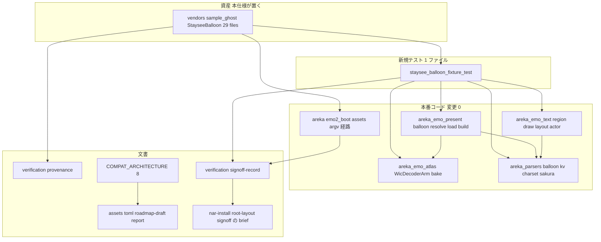
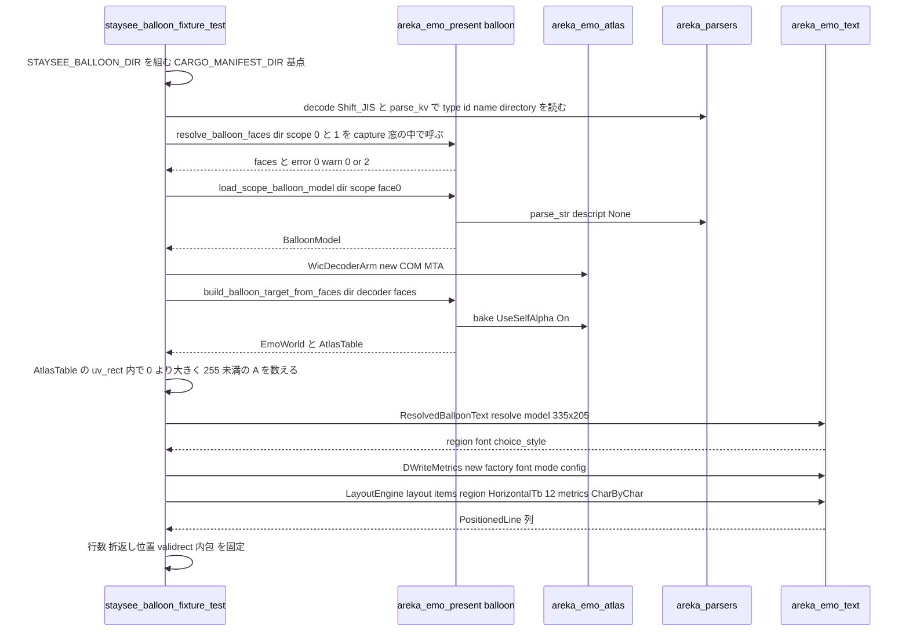

# Design Document: areka-P0-default-balloon-bundle

> 本文の file:line・件数・座標は **2026-09-18 の本ブランチと上流 `fe1b02f3` での実測値**（`research.md` §8）。着手時に引き直すこと。

## Overview

**Purpose**: areka を初めて手にする第三者が、バルーンを同梱しないゴーストを入れても「バルーンが無い」で止まらないよう、CC0 の既製バルーン `Balloon for Staysee Syncfield`（id `StayseeBalloon`・開発者裁定 2026-09-18「ukadoc 準拠のままそのまま採用」）を areka の既定バルーンとして確定し、リポジトリに原作無改変で保管し、areka で崩れずに表示されることを新規の決定論テストと実機目視で 1 周する。

**Users**: 第三者（既定バルーンで喋るゴーストを見る）・開発者（毎回のテストで表示保証を持つ）・下流 spec の実装者（`nar-install`＝畳む対象、`baseware-root-layout`＝既定 id、`alpha-release-signoff`＝zip と README の出典文）。

**Impact**: 本番コード（`crates/*/src/` の非テストファイル）の変更 **0 行**・`Cargo.toml` 変更 0・新規外部依存 0。増えるのは保管フォルダ 1 つ（29 ファイル）・新規テストファイル 1 本・`verification/` 2 本・文書 7 か所（`COMPAT_ARCHITECTURE.md` §8 の 1 行・台帳 1 項目・`roadmap-draft.md` 1 行＋count＋束表 1 欄・`briefing.md` の 2 数値・報告 2 本・隣接 brief 3 本）。

### Goals

- 既定バルーン `StayseeBalloon` の裁定と根拠を後から読める形で残す（1.1〜1.4）。
- `vendors/sample_ghost/StayseeBalloon/` に原作の 29 ファイルをバイト保存し、出典・ハッシュを記録する（2.1〜2.7・5.1〜5.4）。
- 起動時の焼き込みと同じ公開 API 経路を踏む決定論テストを**新規ファイル 1 本**で足し、既存ファイルの変更 0 行を保つ（3.1〜3.11・8.1〜8.5）。
- 実機で k=1／k≠1 の 2 通りを目視し、観察記録を残す（4.1〜4.3）。
- 「`use_self_alpha` は常に 1・`.pna` 非対応」を §8 と台帳に登記し、番人を緑で通す（6.1〜6.6）。
- 既定バルーン id を下流 3 spec の brief へ申し送る（7.1〜7.4）。

### Non-Goals

- `.pna`・`use_self_alpha,0`・`use_input_alpha`・`paint_transparent_region_black` の実装（3 鍵は読まない・`.pna` は画素を使わない・常に 1 の裁量。C4 の是正の註を参照）。台帳の隣 2 項目は触らない（6.3）。
- `thumbnail.pnr` の透過解釈・`balloonc*`／`arrow*`／`online*`／`marker.png`／`sstp.png`／`sstpmessage.*`／`number.*`／`communicatebox.*` の実装（列挙に載らないことだけを検証する）。
- 既定バルーン id の定数と解決順への配線（`baseware-root-layout`）・`.nar` 化と共有ヘルパ（`nar-install`）・配布 zip と第三者向け README（`alpha-release-signoff`）・ネットワーク更新・複数既定バルーン・`recommended.balloon`。
- 縦書き（descript に `vertical` 無し＝横書きのみ・縦書きの検証 0 件）。
- 既存検体 3 つの内容変更・既存テストの期待値変更。
- 決定論側での headless GPU 読み戻し PNG（`research.md` DD1・要件 4.2 の「観察記録」を採る）。

## Boundary Commitments

### This Spec Owns

- 保管フォルダ `vendors/sample_ghost/StayseeBalloon/`（29 ファイル・原作バイト列そのもの）の作成と、その出典記録 `verification/provenance.md`。
- 新規テスト `crates/areka-emo-text/tests/staysee_balloon_fixture_test.rs`（入口・検体パス定数 1 つを含む）と `crates/areka-emo-text/tests/staysee_balloon_fixture/` 配下のテーマ別ファイル。
- 記録 `verification/signoff-record.md`（裁定・テスト結果・実機目視・README 申し送り文・台帳検査・下流申し送りの実施記録）。
- `doc/COMPAT_ARCHITECTURE.md` §8 の透過の扱いの行（1 行）。
- 台帳 `doc/ukadoc-coverage/ledger/assets.toml` の 1 項目（`use_self_alpha_2c_5024:1`）の `status`／`owner`／`note`、`doc/ukadoc-coverage/roadmap-draft.md` の `[[spec]]` 1 行＋`[briefs].count`＋散文 1 文＋束表「絵の重ね方」の「依存する既存 spec」欄、`doc/ukadoc-coverage/briefing.md` の `[[barrier]] page = "descript_balloon"` の `degraded`／`absent` の 2 数値、報告 `doc/ukadoc-coverage/report/assets.md`・`report/summary.md` の作り直し。
- 隣接 brief 3 本（`areka-P0-nar-install`・`areka-P0-baseware-root-layout`・`areka-P0-alpha-release-signoff`）への申し送り 1 段ずつ。
- 既定バルーン id `StayseeBalloon`＝フォルダ名 `StayseeBalloon` という事実の権威（下流はこれを写す）。

### Out of Boundary

- 本番コード（`crates/*/src/` の非テストファイル）と `Cargo.toml`——1 行も触らない（8.1・8.2）。崩れが出ても本仕様内で直すのは「新規テストの期待値を実測へ合わせる」ことではなく areka 側の欠陥の是正であり、その場合は要件 3.9 の手順（引受先の実在確認か本仕様内での是正＝その時点で 8.1 の例外を `signoff-record.md` に明記）に従う。
- 既存の検体参照ファイル（`.rs` 46 本・`.md`／`.ps1`／`.py`／`.toml` 込みで 56 本）——`nar-install` の書き換え対象。
- `input_events/`・新規 `menu.rs`——`popup-menu-minimal` の接触面。
- `THIRD-PARTY-NOTICES.md`（`cargo about` の生成物）・第三者向け `README.md` 本文・配布 zip。
- 台帳の `use_input_alpha_2c_6570_5024:1`・`paint_transparent_region_black_2c_6570_5024:1`（`absent`・宛先空のまま）。
- `file_length_guard_test.rs` の例外表。

### Allowed Dependencies

- **公開 API（読み取りのみ・変更しない）**: `areka_emo_present::balloon::{resolve_balloon_faces, load_scope_balloon_model, build_balloon_target_from_faces, ResolvedFace, ChainTier}`／`areka_emo_atlas::{WicDecoderArm, AtlasTable, SetId}`／`areka_parsers::{balloon::{parse_str, BalloonModel}, charset::{decode, DefaultEncoding}, kv::parse_kv, sakura::parse}`／`areka_sakura::{compile, contract::*}`／`areka_emo_text::{region::{TextRegion, ScaleContract, ImagePx}, draw::{ResolvedFont, DWriteMetrics, DEFAULT_FONT_NAME}, layout::{LayoutEngine, GlyphMetrics, FixedMetrics, WrapPlan, PositionedLine}, state::{TextLayerState, TextLayerConfig}, actor::{ResolvedBalloonText, TextSlotBinding}, choice::{highlight_band_extent, ResolvedChoiceStyle}, writing::WritingMode}`／`log_capture_kit::capture`／`wintf::com::dwrite::dwrite_create_factory`／`windows::Win32::System::Com::CoInitializeEx`。すべて `crates/areka-emo-text/Cargo.toml` の既存の `[dependencies]`／`[dev-dependencies]` に在る。
- **保管慣行**: `vendors/sample_ghost/.gitattributes`（`* -text`）・`vendors/sample_ghost/.gitignore`（打ち消し）——本仕様は**読むだけ**で書き換えない。
- **番人**: `crates/ukadoc-survey/tests/consistency/spec_checks.rs` 腕 a〜f・`crates/log-capture-kit/tests/file_length_guard_test.rs`——通すだけで書き換えない。
- **実機目視の起動経路**: `areka.exe <ゴーストの根> <バルーンの根>`（`crates/areka/src/boot_config.rs` `resolve_config_inputs` の `args[2]`）——絶対パスで起動する（記憶 areka-emo2-signoff-needs-absolute-paths）。

### Revalidation Triggers

- 保管フォルダの**ファイル集合・バイト列**が変わる（新規テストの 29 本の名前集合・PNG 原寸・`warn!` 2 件・領域座標がすべて赤になる＝意図した検出。上流を取り直したなら `provenance.md` のハッシュ一覧を採り直す）。
- 既定バルーン id またはフォルダ名の綴りが変わる → `baseware-root-layout`・`nar-install`・`alpha-release-signoff` の申し送りを再送。
- `areka-emo-present` の `resolve_balloon_faces` の R6.2（縮退面の `warn!` の欄 `surface_id`／`prefix`）や `UseSelfAlpha::On` 固定が変わる → 新規テスト DD3 と §8 の行を見直す。
- `areka-emo-text` の既定書体（`DEFAULT_FONT_NAME`）・行送り式（`TextLayerConfig::line_pitch`）が変わる → DD4 の檻が赤（正典適合の後退検出器として意図どおり）。
- `nar-install` が共有ヘルパを導入する → 新規テストの検体パス定数 1 行を付け替える（それ以外は無変更）。
- 台帳の `use_self_alpha` 項目の宛先を別 spec へ移す → `roadmap-draft.md` の `owner_count` と行の要否を数え直す。

## Architecture

### Existing Architecture Analysis

- バルーンの起動経路は `crates/areka/src/emo2_boot/assets.rs` が scope ごとに `resolve_balloon_faces` → `build_balloon_target_from_faces`（`UseSelfAlpha::On` 固定）→ `load_scope_balloon_model` を呼ぶ。3 関数は `areka-emo-present` の公開 API で、`areka-emo-text` は同 crate を通常依存に持つ。よって**起動時と同じ経路**を `crates/areka-emo-text/tests/` から `Cargo.toml` 変更 0 で踏める。
- 文字の領域解決は `areka_emo_text::actor::ResolvedBalloonText::resolve(model, image_size)`（本番 `present_frame` と同じ入口）が `TextRegion::resolve`・`ResolvedFont::resolve`・`ResolvedChoiceStyle` を一点で解く。レイアウトは `LayoutEngine::layout`（image px・k 非依存・`&dyn GlyphMetrics` 注入）。物理化は `ScaleContract` の一点。
- `descript.txt` の読み手（`areka-parsers/src/balloon/parse.rs`）は `type`／`id`／`name`／`craftman`／`homeurl` を写像しない。同 crate の `kv::parse_kv` が任意の鍵を `BTreeMap` で返す（本番コードの `id` 消費点は 0）。
- 検体の保管慣行は `vendors/sample_ghost/<名>/` の展開フォルダ（`R_POST_and_KOMAINU` が前例）。`.gitattributes` の `* -text` は未作成のパスにも `unset` を返す（実測）。
- 台帳の宛先には番人（`spec_checks.rs` 腕 a〜f）があり、宛先に書いた spec 名は `roadmap-draft.md` の `[[spec]]` 行に載っていなければ赤。

### Architecture Pattern & Boundary Map



**Architecture Integration**:

- **Selected pattern**: 「資産＋外付けの檻」——本番コードには 1 行も触らず、資産を置き、公開 API を外から踏む統合テストで値を固定する。
- **Domain boundaries**: 資産（`vendors/`）／検証（`tests/` 新規 1 本）／記録（`verification/`）／登記（§8・台帳）／申し送り（brief）の 5 面で、互いにファイルを共有しない。
- **Existing patterns preserved**: 展開フォルダ保管（`R_POST_and_KOMAINU`）・実物 fixture 檻（`shipped_fixture_region_test.rs`／`kero_menu_capacity_test.rs`）・COM 初期化ヘルパ（`emo2_e2e.rs`）・ログ捕捉（`log_capture_kit::capture`）・`verification/` 記録（`charset-canon`）・§8 の 4 列表・台帳の `degraded` 前例 10 件。
- **New components rationale**: 新規テスト 1 本（既存ファイルに足すと `nar-install` と共有が生じる＝要件 3.1／8.3）・`verification/` 2 本（機械が照合する出典と、人が読む判断の分離）。
- **Steering compliance**: 依存方向は `areka-parsers → areka-emo-atlas → areka-emo-present → areka-emo-text`（テストは最下流の `areka-emo-text` から上流を読むだけ）。1,000 行の番人・log-first（テスト自身は `panic` で赤にする）・`tests/` の命名規約（`{feature}_fixture_test.rs`）。

### Technology Stack

| Layer | Choice / Version | Role in Feature | Notes |
|---|---|---|---|
| 資産 | PNG（RGBA8）・Shift_JIS テキスト・CC0-1.0 | 既定バルーンの実体 | 上流 `ponapalt/StayseeBalloon` `fe1b02f3`・無改変 |
| テスト | Rust 2024・`cargo test -p areka-emo-text --test staysee_balloon_fixture_test` | 決定論の檻 | 新規依存 0。WIC（COM MTA）と DirectWrite factory だけを使い GPU・実窓は使わない |
| 画像復号 | WIC（`areka_emo_atlas::WicDecoderArm`） | 面 6 枚の bake | `CoInitializeEx(None, COINIT_MULTITHREADED)` をテストスレッドで張る（`RPC_E_CHANGED_MODE` 許容） |
| 文字計測 | DirectWrite（`DWriteMetrics`・`ＭＳ ゴシック` 12px） | 折返し・行数の実測 | `ＭＳ ゴシック` が無い環境は赤（既存の `Yu Gothic UI` 前提と同じ扱い） |
| ログ捕捉 | `log-capture-kit`（dev 依存・既存） | `error!` 0・`warn!` 2 の固定 | 窓は解決関数 2 つに限る（DD3） |
| 文書 | Markdown・TOML（台帳）・`cargo run -p ukadoc-survey -- report`／`report-summary` | 登記と報告 | 番人 `cargo test -p ukadoc-survey` |

## File Structure Plan

### Directory Structure

```
vendors/sample_ghost/StayseeBalloon/          # 新規: 上流 fe1b02f3 の 29 ファイルをそのまま（サブフォルダ無し・.git 無し）
├── descript.txt  install.txt  readme.txt  LICENSE  thumbnail.pnr
├── balloons0.png … balloons3.png  balloonk0.png  balloonk1.png
├── balloonc0.png … balloonc4.png  arrow0.png  arrow1.png
└── online0.png … online8.png  marker.png  sstp.png

crates/areka-emo-text/tests/
├── staysee_balloon_fixture_test.rs           # 新規: 入口。検体パス定数 1 つと #[path] の mod 宣言だけを持つ
└── staysee_balloon_fixture/                  # 新規: テーマ別の実体（各 ≤1,000 行）
    ├── test_support.rs                       #   テーマ間で共有するヘルパ（1 か所へ集約）
    ├── assets.rs  definition.rs  faces.rs  bake.rs
    └── region.rs  wrapping.rs  script.rs  scale.rs

.kiro/specs/areka-P0-default-balloon-bundle/verification/
├── provenance.md                             # 新規: 取得元・コミット・日付・readme の版・29 本の sha256・.gitignore 照合・check-attr・id＝directory・2.6 の判定
└── signoff-record.md                         # 新規: 裁定 1.2・不採用理由・決定論テスト結果と較正差・実機目視の観察記録・3.9/4.3 の処理・README 申し送り文・台帳検査・下流申し送りの実施

doc/COMPAT_ARCHITECTURE.md                    # 変更: §8 の表に 1 行
doc/ukadoc-coverage/ledger/assets.toml        # 変更: use_self_alpha_2c_5024:1 の status/owner/note
doc/ukadoc-coverage/roadmap-draft.md          # 変更: [[spec]] 1 行・[briefs].count 28・散文 1 文・束表「絵の重ね方」の依存 spec 欄
doc/ukadoc-coverage/briefing.md               # 変更: [[barrier]] descript_balloon の degraded 6→7・absent 123→122（2 数値のみ）
doc/ukadoc-coverage/report/assets.md          # 再生成: cargo run -p ukadoc-survey -- report
doc/ukadoc-coverage/report/summary.md         # 再生成: cargo run -p ukadoc-survey -- report-summary
.kiro/specs/areka-P0-nar-install/brief.md              # 変更: 末尾に申し送り 1 段
.kiro/specs/areka-P0-baseware-root-layout/brief.md     # 変更: 末尾に申し送り 1 段
.kiro/specs/areka-P0-alpha-release-signoff/brief.md    # 変更: 末尾に申し送り 1 段
.kiro/specs/areka-P0-default-balloon-bundle/brief.md   # 変更: 「既定バルーン id ＝ StayseeBalloon」を追記（7.1）
```

### Modified Files

- `doc/COMPAT_ARCHITECTURE.md` — §8 の 4 列表に 1 行（C4）。他の節は触らない（`popup-menu-minimal` 等が別節を触る）。
- `doc/ukadoc-coverage/ledger/assets.toml` — 1 項目の `status`→`"degraded"`・`owner`→`"areka-P0-default-balloon-bundle"`・`note` の書き換え。`priority = "A15"`・`values`・`links`・`introduced` は不変。隣の 2 項目は不変。
- `doc/ukadoc-coverage/roadmap-draft.md` — `[[spec]]` 行の追加・`count = 28`・散文 1 文・束表「絵の重ね方」の「依存する既存 spec」欄に本仕様（A0・1 件）を書き足す（機械照合はされないが「表示するだけの数は必ず古びる」の再発を避ける）。`snapshot_on` 不変。
- `doc/ukadoc-coverage/briefing.md` — `[[barrier]] page = "descript_balloon"` の `degraded` 6→7・`absent` 123→122 の **2 数値だけ**（`briefing_arms.rs` の `distribution_findings` が台帳の数え直しと機械照合する行。台帳の `absent`→`degraded` で必ず動く）。他の数（`[stage.X]`・`[[after]]`・`[priority_blank]`・`[tally]`・§7「縮退 2」）は優先度か 4 状態の和か `[[template]]` との積で数えるので動かない（設計検証で確認済み）。
- `doc/ukadoc-coverage/report/assets.md`・`report/summary.md` — 道具で作り直す（手で編集しない）。
- 隣接 brief 3 本＋本仕様の brief — 末尾追記のみ。

**触らないことを明記するファイル**: `crates/*/src/**`（テストファイルを含め 0 行）・全 `Cargo.toml`・`THIRD-PARTY-NOTICES.md`・`README.md`・`vendors/sample_ghost/.gitattributes`／`.gitignore`・既存の `crates/areka-emo-text/tests/*.rs`・既存検体 3 つ・`file_length_guard_test.rs`。

## System Flows

### 決定論テストが踏む経路（起動時の焼き込みと同一の公開 API）



**流れの決定**: ログ捕捉の窓は `resolve_balloon_faces`＋`load_scope_balloon_model` に限る（bake の WIC 側の記録は主張しない・DD3）。bake は `Ok` であること（＝`error!`＋`Err` の経路を踏んでいない）で判定する。COM 初期化は各テスト関数の先頭で `let _ = CoInitializeEx(None, COINIT_MULTITHREADED)`（並列スレッドの二重初期化を許容・`emo2_e2e.rs` と同型）。

## Requirements Traceability

| Requirement | Summary | Components | Interfaces | Flows |
|---|---|---|---|---|
| 1.1 | 候補と選定根拠を本文に | C3 signoff-record（要件書 Introduction を参照し裁定欄に転記） | — | — |
| 1.2 | `StayseeBalloon` に確定・裁定を `verification/` に | C3 signoff-record §1 | — | — |
| 1.3 | ukadoc 既定 `ＭＳ ゴシック`／12 のまま・`DEFAULT_FONT_NAME` 不変・`font.name` を足さない | C2 檻 F（DD4）・C1（無改変） | `ResolvedFont::resolve` | — |
| 1.4 | 不採用理由（SSP 同梱・`emo2-kakukaku`） | C3 signoff-record §1 | — | — |
| 2.1 | 展開フォルダ保管・`.nar` を作らない | C1 | — | — |
| 2.2 | 29 ファイル無改変・欠落 0・余分 0 | C1・C2 檻 A（名前集合の一致）・C3 provenance（sha256） | `std::fs::read_dir` | — |
| 2.3 | 取得元・コミット・日付・版・ハッシュ一覧 | C3 provenance §1〜§3 | — | — |
| 2.4 | `.gitattributes` の効力（`check-attr` 全 `unset`） | C3 provenance §4（29 本の実測結果） | `git check-attr text` | — |
| 2.5 | `.gitignore` 照合 0 件 | C3 provenance §4 | — | — |
| 2.6 | 食い違いの是正 | C3 provenance §5（判定: 発動なし・研究 §8.2） | — | — |
| 2.7 | 既存検体 3 つ不変 | C1（置き場が別）・C8 非回帰（`git diff --stat` で 0） | — | — |
| 3.1 | 新規テストファイルのみ・既存 0 行 | C2・C8 | — | — |
| 3.2 | 検体パスは定数 1 か所 | C2 `STAYSEE_BALLOON_DIR` | — | — |
| 3.3 | descript の読み取り（宣言・未指定の縮退） | C2 檻 B | `parse_str`・`parse_kv`・`decode` | Flow |
| 3.4 | 面 0 を両 scope で解決・α 保持 | C2 檻 C・D | `resolve_balloon_faces`・`build_balloon_target_from_faces`・`AtlasTable` | Flow |
| 3.5 | 半角／全角／混在の折返しと validrect 内包 | C2 檻 F・G | `ResolvedBalloonText::resolve`・`DWriteMetrics`・`LayoutEngine::layout` | Flow |
| 3.6 | `\q`・`\_l` の位置 | C2 檻 H | `sakura::parse`・`compile`・`TextLayerState::apply_cue` | Flow |
| 3.7 | k≠1 の拡大と同一レイアウト | C2 檻 I | `TextSlotBinding::new`・`ScaleContract` | Flow |
| 3.8 | 使わない資産が列挙に載らない・`error!` 0 | C2 檻 C（DD3） | `resolve_balloon_faces`・`log_capture_kit::capture` | Flow |
| 3.9 | 崩れ時の処理 | C3 signoff-record §4・Error Handling | — | — |
| 3.10 | 既存の期待値を緩めない | C8（既存テスト無変更・`--workspace` 同本数） | — | — |
| 3.11 | 1,000 行以下・例外表不変 | C2（DD1・縮退先 Option C） | `file_length_guard_test.rs` | — |
| 4.1 | 実機で k=1／k≠1 を目視 | C7 | `areka.exe <ghost> <balloon>` | — |
| 4.2 | 目視の証跡（観察記録） | C3 signoff-record §5 | — | — |
| 4.3 | 目視で崩れ → 3.9 と同じ処理＋再現テスト | C3 §4・C2（再現檻の追加先） | — | — |
| 5.1 | 資産名・id・作者・ライセンス・URL・コミット・日付を 1 か所に | C3 provenance §1 | — | — |
| 5.2 | README に載せる文と `alpha-release-signoff` brief への申し送り | C3 signoff-record §6・C6 | — | — |
| 5.3 | `THIRD-PARTY-NOTICES.md` を編集しない | C8（`git diff` で 0） | — | — |
| 5.4 | `readme.txt`・`LICENSE`・`install.txt` をそのまま・追加告知ファイルを作らない | C1・C2 檻 A（29 本ちょうど） | — | — |
| 6.1 | §8 に 1 行 | C4 | — | — |
| 6.2 | 台帳 1 項目を `degraded`・owner・note | C5 | — | — |
| 6.3 | 隣の 2 項目を変えない | C5・C8（`git diff` の当該行 0） | — | — |
| 6.4 | `roadmap-draft.md` の行と count | C5（DD6） | `spec_checks.rs` 腕 a〜f | — |
| 6.5 | 報告 2 本の作り直し・`cargo test -p ukadoc-survey` 緑 | C5・C3 signoff-record §7 | `cargo run -p ukadoc-survey -- report`／`report-summary` | — |
| 6.6 | 本番コードに正典 URL コメントを足さない | C8 | — | — |
| 7.1 | `id`＝`directory` の実測・brief と `verification/` に記す | C2 檻 B・C3 provenance §6・本仕様 brief | `parse_kv` | — |
| 7.2 | 本番コードに id 定数を置かない | C8 | — | — |
| 7.3 | 3 brief への申し送り・実在確認 | C6 | — | — |
| 7.4 | `completed/` へ移っていれば `roadmap.md` へ | C6（分岐） | — | — |
| 8.1 | 本番コード 0 行 | C8 | `git diff --numstat <base> \| grep '/src/'`（下の C8 の註を読むこと） | — |
| 8.2 | 新規依存 0・`Cargo.toml` 不変 | C8 | `git diff --stat -- '**/Cargo.toml'` | — |
| 8.3 | 並走 2 spec と共有ファイル 0 | C2（新規ファイルのみ）・C8 | — | — |
| 8.4 | `--workspace` 同本数で緑・`fmt --check`・番人 | C8 | — | — |
| 8.5 | 列挙したファイル以外に触れない | C8（`git status` の全数を記録） | — | — |

## Components and Interfaces

| Component | Domain/Layer | Intent | Req Coverage | Key Dependencies (P0/P1) | Contracts |
|---|---|---|---|---|---|
| C1 保管フォルダ | 資産 | 上流 29 ファイルのバイト保存 | 2.1, 2.2, 2.4, 2.5, 2.7, 5.4 | `vendors/sample_ghost/.gitattributes`（P0） | State |
| C2 新規テスト | 検証 | 起動経路と同じ公開 API で値を固定 | 1.3, 2.2, 3.1〜3.8, 3.11, 5.4, 7.1 | `areka-emo-present`（P0）・`areka-emo-atlas` WIC（P0）・`log-capture-kit`（P1）・`ＭＳ ゴシック`（P1） | Batch |
| C3 記録 2 本 | 記録 | 出典（機械照合）と判断（人が読む） | 1.1, 1.2, 1.4, 2.3〜2.6, 3.9, 4.2, 4.3, 5.1, 5.2, 6.5, 7.1 | — | State |
| C4 §8 の行 | 登記 | 透過の扱いの裁量を対応表へ | 6.1 | `doc/COMPAT_ARCHITECTURE.md` 4 列表（P0） | State |
| C5 台帳文書 | 登記 | 項目の状態・宛先・分布・報告 | 6.2〜6.5 | `spec_checks.rs` 腕 a〜f（P0）・`briefing_arms.rs` `distribution_findings`（P0）・`ukadoc-survey` CLI（P0） | Batch |
| C6 下流申し送り | 申し送り | id と README 文を brief へ | 5.2, 7.3, 7.4 | 3 brief の実在（P0） | State |
| C7 実機目視 | 検証（手動） | k=1／k≠1 の見え方 | 4.1 | `areka.exe` argv・i686 helper（P0） | Batch |
| C8 非回帰の検査 | 検証 | 触っていないことの機械証明 | 2.7, 3.1, 3.10, 5.3, 6.3, 6.6, 7.2, 8.1〜8.5 | `git`・`cargo`（P0） | Batch |

### 資産

#### C1 保管フォルダ `vendors/sample_ghost/StayseeBalloon/`

| Field | Detail |
|---|---|
| Intent | 上流 `fe1b02f3` の 29 ファイルを、1 バイトも変えず・欠かさず・足さずに置く |
| Requirements | 2.1, 2.2, 2.4, 2.5, 2.7, 5.4 |

**Responsibilities & Constraints**
- 置くのは上流の作業木の 29 ファイルのみ（`.git/`・サブフォルダ・自前の告知ファイルは置かない）。`.nar` は作らない。
- 取得は `git clone`（作業用一時領域）→ ファイル複写。複写後に `sha256sum` を採り直し、取得時の一覧（`research.md` §8.2 で採取済み）と一致することを `provenance.md` に書く。
- `git check-attr text` を 29 本すべてに掛け全 `unset` を記録する（`.gitattributes` の効力）。`git add` 後の `git ls-files --eol` で `i/-text` を確認する（改行変換 0 の裏取り）。
- `.gitignore` 照合: 29 本の名前を小文字化し `*_test.txt`／`*_dump.txt` に当たる名前が 0 件（設計時実測 0）。

**Dependencies**
- Inbound: C2（読む）・C7（argv で指す）・`nar-install`（畳む対象・下流）
- External: `vendors/sample_ghost/.gitattributes`——効力を借りるだけ（P0）

**Contracts**: State [x]

##### State Management
- State model: 不変の資産。変更は「上流を取り直す」ときだけで、その時は `provenance.md` の全項目を採り直す。
- Persistence & consistency: git 追跡・`-text`。ハッシュ一覧が陳腐化検出の基準。

**Implementation Notes**
- Integration: `nar-install` が畳む対象に既に列挙している（brief 2026-09-18 追記）。本仕様は保管が終わった事実とファイル一覧を同 brief へ申し送る（C6）。
- Validation: C2 檻 A が名前集合を固定・C3 provenance がハッシュを固定。
- Risks: Windows の `core.autocrlf=true` でも `* -text` が勝つ（実測）。フォルダ名の大小（`StayseeBalloon`）は `install.txt` の `directory` と同綴りにする。

### 検証

#### C2 新規テスト `crates/areka-emo-text/tests/staysee_balloon_fixture_test.rs`

| Field | Detail |
|---|---|
| Intent | StayseeBalloon を検体に、起動時の焼き込みと同じ公開 API 経路で「読める・解ける・焼ける・収まる」を固定する |
| Requirements | 1.3, 2.2, 3.1〜3.8, 3.11, 5.4, 7.1 |

**Responsibilities & Constraints**
- 検体パスは `const STAYSEE_BALLOON_DIR: &str = "../../vendors/sample_ghost/StayseeBalloon";` の **1 定数**だけが持ち、`PathBuf::from(env!("CARGO_MANIFEST_DIR")).join(STAYSEE_BALLOON_DIR)` で実体化する（`nar-install` の共有ヘルパへ寄せるときはこの 1 行を付け替える）。
- 既存テストファイルから `use` はできない（各 `tests/*.rs` は独立クレート）ので、必要な小ヘルパ（COM 初期化・PNG IHDR 読み・descript の復号）はこのファイル内に持つ。
- 1,000 行以下。超える見込みが立ったらテーマ分割し、定数は親ファイルに残す（Option C・DD1）。**分割先は `tests/staysee_balloon_fixture/<テーマ>.rs`（サブディレクトリ）とし、親ファイル内の `#[cfg(test)] #[path = "staysee_balloon_fixture/<テーマ>.rs"] mod <テーマ>;` で繋ぐ。**
  - 当初この行は `staysee_balloon_fixture_test_<テーマ>.rs`（`tests/` 直下の平置き）と書いていたが、**その形は成立しない**（2026-09-18・タスク 2.3 で実測・レビュアーが独立に再現）。`tests/` 直下に置いたファイルは親から `#[path]` で繋いでも cargo が**独立したテストターゲットとしても自動収集**するため、同じテストが 2 か所で走る。`Cargo.toml` の `autotests` や明示ターゲットで止める手はあるが、要件 8.2 が `Cargo.toml` の変更を 0 に縛るので採れない。サブディレクトリは自動収集の対象外なのでこの問題が起きない。
  - この形は `.kiro/steering/structure.md` の統合テストの慣行（`tests/{ドメイン}.rs` を入口にし、実体を `tests/{ドメイン}/` 配下へ置き、ファイル名からドメイン接頭辞を落とす）と、同 crate の先例 `crates/areka-emo-text/tests/decoration_readback_test.rs` ＋ `decoration_readback/` に一致する。
  - テーマ間で共有するヘルパは structure.md の規約どおり 1 か所へ集約する（本仕様では `staysee_balloon_fixture/test_support.rs`。項目が 1 件でも複製しない）。
- 既存檻の期待値には触れない。`ＭＳ ゴシック` 前提を先頭の門で明示する（DD4 ⑶）。

**Dependencies**
- Outbound: `areka_emo_present::balloon`（P0）・`areka_emo_atlas::{WicDecoderArm, AtlasTable, SetId}`（P0）・`areka_parsers::{balloon, kv, charset, sakura}`（P0）・`areka_sakura::{compile, contract}`（P0）・`areka_emo_text::{actor, region, draw, layout, state, writing}`（P0）・`log_capture_kit::capture`（P1）・`wintf::com::dwrite::dwrite_create_factory`（P1）・`windows` COM（P1）
- External: `ＭＳ ゴシック` のインストール（P1・無ければ門で赤）

**Contracts**: Batch [x]

##### Batch / Job Contract（檻 A〜I）

| 檻 | 要件 | 入力 | 固定する述語（期待値は `research.md` §8.2 の実測・導出値） |
|---|---|---|---|
| A 名前集合 | 2.2, 5.4 | `read_dir` | 直下のエントリ名の集合 ＝ 29 本の固定集合（余分・欠落とも 0）。サブフォルダ 0。`balloons0〜3`・`balloonk0〜1` の IHDR 原寸 ＝ (335,205)(335,205)(335,395)(335,395)(335,135)(335,135) |
| B descript と install の読み | 3.3, 7.1 | `descript.txt`・`install.txt` を `decode(bytes, Ansi)`→`parse_kv` と `parse_str(descript, None)` | kv: `charset`=`Shift_JIS`・`type`=`balloon`・`id`=`StayseeBalloon`・`name`=`Balloon for Staysee Syncfield`・`install.txt` の `directory`=`StayseeBalloon`＝`id`。model: `validrect` (left 22, top 20, right −26, bottom −47)・`font.height`=Some(12)・`font.color`=(0,40,100)・`vertical_raw()`=None・`writing_mode()`=None・`wordwrappoint.x/y`=None・`font.name`=None・`WritingMode::resolve` → `HorizontalTb` |
| C 系列解決とログ | 3.4, 3.8 | `capture(|| resolve_balloon_faces(dir, s))` for s∈{0,1}、続けて `load_scope_balloon_model` | scope 0: faces の `(surface_id, prefix, file_name)` ＝ [(0,balloons,balloons0.png),(1,…,balloons1.png),(2,…,balloons2.png),(3,…,balloons3.png)]・`error!` 0・`warn!` 0。scope 1: [(0,balloonk,balloonk0.png),(1,balloonk,balloonk1.png),(2,balloons,balloons2.png),(3,balloons,balloons3.png)]・面 2・3 の `tier`=`Default`・`error!` 0・`warn!` **2**（欄 `surface_id`∈{2,3}・`prefix`=`balloons`）。両 scope とも `file_name` の集合に `balloonc*`・`arrow*`・`online*`・`marker.png`・`sstp.png`・`thumbnail.pnr`・`LICENSE`・`*.txt` を**含まない** |
| D 焼き込みと α | 3.4 | `WicDecoderArm::new()`（COM MTA）→ `build_balloon_target_from_faces(dir, &dec, &faces)` for s∈{0,1} | `Ok`。`AtlasTable::resolve(SetId(0), "balloons0.png")`（scope 1 は `"balloonk0.png"`）が `Some`・`entry.original`=(335,205)／(335,135)・`placement`=`Some`・`uv_rect` 内の画素で `0 < A < 255` の個数 > 0（premultiplied BGRA・`stride` で行を送る）。`errors` 空 |
| E 領域解決 | 3.3, 3.5 | `ResolvedBalloonText::resolve(&model, (335,205))`／`(335,135)` | scope 0: left 22・top 20・right 309・bottom 158・start (22,20)・`wrap_threshold` 309・`inline_limit` 309・`image_size` (335,205)。scope 1: bottom 88（他は同値） |
| F 既定書体の門 | 1.3, 3.5 | `ResolvedFont::resolve(&model)`・`DWriteMetrics::new(&factory, &font, HorizontalTb, &TextLayerConfig::default())` | `font.name == "ＭＳ ゴシック"` かつ `== DEFAULT_FONT_NAME`・`height == 12.0`・`advance('a',12) == 6.0`・`advance('あ',12) == 12.0`・`line_box_height(12) == 12.0`・`line_pitch(12) == 14.0`（実装時に実測で較正・差は `signoff-record.md` へ） |
| G 折返しと内包 | 3.5 | 全角のみ 60 字／半角のみ 120 字／混在（全角・半角交互 90 字）の 3 本文を `TextItem` 列にし `LayoutEngine::layout(items, len, &region, HorizontalTb, 12.0, &metrics, WrapPlan::CharByChar)` | 各グリフ矩形が `[22,309]×[20,158]` の内（1 画素も超えない）・行の上端は 20＋14(n−1)・全角のみは 1 行 23 字（3 行）・半角のみは 1 行 47 字（3 行）・混在は各行の送り幅合計 ≤ 287 かつ「次行の先頭グリフを足すと 287 を超える」（貪欲充填の性質）。scope 1 の高さ 68 で 5 行目の下端 88 ＝ 境界ちょうどであふれ非発火（`visible_window`） |
| H 選択肢とカーソル | 3.6 | 台本 `\_l[60,42]本文\n\q[はい,yes]\n\q[いいえ,no]` を `sakura::parse`→`compile`→`apply_cue`→`layout`（`kero_menu_capacity_test.rs` の経路） | `\_l` 直後のグリフ左上 ＝ (22+60, 20+42)＝(82,62)。選択肢 2 行のグリフ矩形と `highlight_band_extent(12, 12, 14)` の帯がすべて validrect の内（areka の「選択肢の目印」は現状 hover の帯であり、独立の目印画像は α 後の `choice-marker-styling`）。`choice_style` は `cursor.style,square` → SquareFill 実導出 |
| I スケール | 3.7 | `TextSlotBinding::new(slot, window, k, ceil(335k)×ceil(205k), (335,205))` for k∈{1.0, 1.25, 2.0}・`ScaleContract::new(k, None)` | `binding.image_size`（公開フィールド）は k に依らず (335,205)・`binding.scale == k`。`physical_extent(ImagePx(287))`＝ceil(287k)（k=1.25→359・k=2→574）・`to_physical(ImagePx(22))`＝22k。`ResolvedBalloonText::resolve(&model, binding.image_size)` の region が k に依らず檻 E と同値（本番の領域解決の入力が物理寸法でなく `image_size` であることの固定）。**`layout` 自体は k を引数に取らない**（image px）ので「k ごとに解き直して同一」は恒真＝檻に置かない |

- Trigger: `cargo test -p areka-emo-text --test staysee_balloon_fixture_test`（`--workspace` に含まれる）。
- Idempotency & recovery: 全檻は読み取り専用・一時ファイル 0・同一入力で同一結果。COM は各テストで初期化（二重は許容）。

**Implementation Notes**
- Integration: `capture` の窓は同期・同スレッドのイベントだけを集める（`resolve_balloon_faces` はスレッドを跨がない）。番兵検査により「捕捉 0 件のまま緑」にはならない。
- Validation: 檻 A〜E は GPU・フォント不要（純粋層＋WIC）、F〜I は DirectWrite factory のみ。`assert!` の失敗文言に「何の値がいくつ違うか」を書く（log-first の精神・`panic` は檻の赤として許容）。
- Risks: 期待値のうち導出値（檻 F の送り幅・行ボックス・檻 G の字数）は実装で実測して較正する。較正で値が動いた場合はその理由（フォント版）を `signoff-record.md` に書き、`ＭＳ ゴシック` 以外へ落ちていないことを檻 F の名前検査で保証する。

### 記録

#### C3 `verification/provenance.md`・`verification/signoff-record.md`

| Field | Detail |
|---|---|
| Intent | 出典（機械が照合できる値）と判断（人が読む記録）を 2 本に分けて残す |
| Requirements | 1.1, 1.2, 1.4, 2.3, 2.4, 2.5, 2.6, 3.9, 4.2, 4.3, 5.1, 5.2, 6.5, 7.1 |

**Contracts**: State [x]

##### State Management（各ファイルの節構成＝実装のテンプレート）

`provenance.md`（冒頭: 対象仕様・対象要件・実施日・「0. 結論（先に）」）
1. 資産の素性: 資産名・id・作者（readme「ぽな（ばぐとら研究所/整備班）」・descript `craftman,SSP BUGTRAQ`・`craftmanw`）・ライセンス CC0-1.0（`LICENSE` 先頭 3 行・readme の「License : CC0」）・出典 URL（GitHub・`homeurl`・`craftmanurl`）（5.1）
2. 取得: リポジトリ URL・コミット `fe1b02f30d5e263cf30df800c32b2b525a52e3ad`・コミット日時（+0900 と UTC）・取得日 2026-09-18・readme の版 v1.00A（2020/6/27）と更新履歴（2.3）
3. ハッシュ一覧: 29 本の sha256（保管後に採り直した値）（2.3）
4. 保管の検査: `git check-attr text` 29 本全 `unset`・`git ls-files --eol`・`.gitignore` 照合 0 件（2.4, 2.5）
5. 要件 2.6 の判定: 一覧・要点・LICENSE 種別の突合結果（発動なし。要件に無い鍵の一覧を参考として記す）
6. 既定バルーン id: `descript.txt` の `id`＝`install.txt` の `directory`＝`StayseeBalloon`（7.1）

`signoff-record.md`（冒頭同上）
1. 裁定: 2026-09-18・結論「ukadoc 準拠のまま StayseeBalloon を採用」・根拠 3 点（1.1, 1.2）／不採用の理由（1.4）／ukadoc 既定書体のまま・`DEFAULT_FONT_NAME` 不変（1.3）
2. 決定論テスト: 檻 A〜I の結果・較正で動いた期待値と理由・`cargo test --workspace` の本数（着手前／後）
3. 既知の縮退（事実の記録）: `face_origin_color` の白縮退（(0,0) α＝0）・`wordwrappoint` 未宣言の `debug!`・scope 1 の `warn!` 2 件（DD3・DD5）
4. 崩れの処理: 3.9／4.3 の発動有無と行き先（直した／引受先の実在確認の記録）
5. 実機目視の観察記録: 日付・ゴースト（emo2・絶対パス）・バルーンの絶対パス・表示スケール（k=1 と k≠1 の値）・観察項目（半角・全角・選択肢・枠の透け・文字の欠け）・所見（4.2）
6. README 申し送り文（そのまま写せる形・5.2）: 資産名・作者・CC0・出典 URL・既知の制限「areka は半透明前提のバルーンだけが正しく表示される」
   - ⚠ 当初この行は括弧内を「`use_self_alpha` は常に 1 として扱い、**`.pna` は読まない**」と書いていたが、後者は実測と違う（2026-09-18・タスク 3.1）。実際は**同名 `.pna` の存在だけは見て**おり、画素が使われないだけである。詳細は C4 の §8 の行と要件 6.1 の是正の註を参照。
   - **README 用の文は第三者が読むもの**なので、内部の鍵名や関数名を持ち込まず、利用者から見える結果（「半透明を前提に作られたバルーンだけが正しく表示されます」）で書くこと。
7. 台帳検査: `cargo test -p ukadoc-survey` の結果・報告 2 本の再生成（6.5）
8. 下流申し送りの実施記録: 3 brief の実在確認と追記の commit（7.3, 7.4）

### 登記

#### C4 `doc/COMPAT_ARCHITECTURE.md` §8 の行

| Field | Detail |
|---|---|
| Intent | 透過の扱いが areka の意図した裁量であることを対応表で読めるようにする |
| Requirements | 6.1 |

**Contracts**: State [x]

- 行（4 列）: 項目「バルーンの `use_self_alpha`／`use_input_alpha`／`paint_transparent_region_black` と `.pna`」｜裁量「宣言を読まず常に `use_self_alpha,1` 相当（PNG の α をそのまま尊重）で焼く。**`.pna` の画素は使わない**」｜根拠「開発者裁定 2026-09-18・`areka-emo-present/src/balloon.rs` のモジュール doc と `build_balloon_target_from_faces` の `UseSelfAlpha::On` 固定・**シェル側の同じ固定**＝`areka/src/emo2_boot/assets.rs`・既知の制限＝半透明前提のバルーンだけが正しく表示される」｜出典 spec「areka-P0-default-balloon-bundle」。
  - ⚠ 当初この行は裁量欄を「`.pna` は**読まない**」と書いていたが、実測と違う（2026-09-18・タスク 3.1）。実際は**同名 `.pna` の存在だけは見ている**（`areka-emo-atlas` の bake 本体が `probe_pna` を呼ぶ）。画素が使われないだけで、α を持つ PNG では α が勝ち、**α の無い PNG に `.pna` を添えた組合せは理由を載せた失敗になる**（`normalize.rs` の実装腕は `UseSelfAlpha::On` × α チャンネルの 1 本だけ）。着地した `doc/COMPAT_ARCHITECTURE.md` §8 の行と要件 6.1 の是正の註はこの実測どおりに書かれている。
  - ⚠ 根拠に挙げた `areka/src/emo2_boot/assets.rs` は**シェルの焼き付け経路**であって「バルーンの 2 か所目」ではない（バルーン側は同ファイルが `build_balloon_target_from_faces` へ委譲する）。当初この行は「同固定」とだけ書いていて誤読を招いたので、着地した §8 の行では「シェル側の同じ固定」と明示した。
- 既存行の間に挟まず表の末尾へ足す（`popup-menu-minimal` 等の別節と衝突しない）。

#### C5 台帳文書（`assets.toml`・`roadmap-draft.md`・`briefing.md`・報告 2 本）

| Field | Detail |
|---|---|
| Intent | 項目の状態と宛先を登記し、番人を緑で通す |
| Requirements | 6.2, 6.3, 6.4, 6.5 |

**Contracts**: Batch [x]

- `assets.toml` `[entry."ukadoc:descript_balloon:use_self_alpha_2c_5024:1"]`: `status = "degraded"`・`owner = "areka-P0-default-balloon-bundle"`・`note` を「壊れ方: 見た目の差（`0` と書いたバルーンでも 1 として扱う）。記録: なし。areka はこの欄を読まず常に `use_self_alpha,1` 相当で焼く（`areka-emo-present` の `balloon::build_balloon_target_from_faces` と `areka` の `emo2_boot::assets` が `UseSelfAlpha::On` を固定で渡す）。裁量は `COMPAT_ARCHITECTURE.md` §8 に登記（開発者裁定 2026-09-18）。担当 spec は areka-P0-default-balloon-bundle。」の趣旨で書く（実在する関数名だけを書く）。`priority`・`values`・`links`・`introduced` は不変。隣の 2 項目は不変（6.3）。
- `roadmap-draft.md`: `[[spec]]` 行 `name = "areka-P0-default-balloon-bundle"`／`stage = "A"`／`bundle = "絵の重ね方"`／`owner_count = 1`／`wave = "A0"` を表の末尾へ・`[briefs].count = 28`・`snapshot_on` 不変・表の直前の散文に「2026-09-18 に `areka-P0-default-balloon-bundle` の行を 1 行足した（台帳の宛先に書いたため宛先の検査が行を要求する）」を 1 文（DD6）。束表「絵の重ね方」の「依存する既存 spec」欄（現在 `areka-P0-shell-parse`（完了・1 件）のみ）に `areka-P0-default-balloon-bundle`（A0・1 件）を足す。
- `briefing.md`: `[[barrier]] page = "descript_balloon"` の `degraded = 6`→`7`・`absent = 123`→`122`。この 2 数値以外は触らない（DD8）。
- 報告: `cargo run -p ukadoc-survey -- report` と `-- report-summary` で作り直す。手で編集しない。
- 検査: `cargo test -p ukadoc-survey`（腕 a: count＝行数 28／b: 名前が `.kiro/specs/` 直下に実在／c: `owner_count` 1＝台帳の数え直し／d: 束「絵の重ね方」が `linkage.md` に実在／e: 該当なし／f: 宛先が `[[spec]]` に在る。加えて `briefing_arms.rs` の `distribution_findings`: `descript_balloon` ページの状態別件数が台帳と一致）。
- 順序: 台帳 → `roadmap-draft.md` → `briefing.md` の 2 数値 → 報告 → 検査（この順でないと c・f・分布が赤のまま報告を作る）。

### 申し送り

#### C6 下流 brief への追記

| Field | Detail |
|---|---|
| Intent | 既定バルーンの id・フォルダ名・README 文を 1 段ずつ届ける |
| Requirements | 5.2, 7.3, 7.4 |

**Contracts**: State [x]

- 前提: 追記先が `.kiro/specs/<名>/brief.md` として実在することを `test -f` で確かめる。`completed/` へ移っていれば追記せず `.kiro/steering/roadmap.md` の当該行へ書く（7.4）。
- `areka-P0-nar-install/brief.md`: 「2026-09-18 `default-balloon-bundle` 完了: `vendors/sample_ghost/StayseeBalloon/`（29 ファイル・sha256 は同 spec の `verification/provenance.md`）を展開フォルダで保管済み。畳む対象と共有ヘルパの検体名 `StayseeBalloon` を確定。新規テスト `crates/areka-emo-text/tests/staysee_balloon_fixture_test.rs` の定数 `STAYSEE_BALLOON_DIR` 1 行が付け替え先」。
- `areka-P0-baseware-root-layout/brief.md`: 「既定バルーン id ＝ `StayseeBalloon`（descript `id`＝`install.txt` `directory`）。解決順の最後に渡す定数 1 つは本 spec が足す（`default-balloon-bundle` は本番コードに定数を置かない）」。
- `areka-P0-alpha-release-signoff/brief.md`: 「zip に `balloon/StayseeBalloon/` を入れる（29 ファイル無改変）。README の出典文は `default-balloon-bundle` の `verification/signoff-record.md` §6 をそのまま写す（作者・CC0・URL・既知の制限＝半透明前提）」。
- 本仕様の `brief.md`: 末尾に「既定バルーン id ＝ `StayseeBalloon`」を 1 行（7.1）。

### 検証（手動）

#### C7 実機目視

| Field | Detail |
|---|---|
| Intent | 決定論テストが隠す欠陥（色味・にじみ・実機の DPI 切替）を開発者が 1 度目で確かめる |
| Requirements | 4.1 |

**Contracts**: Batch [x]

- 前提: 決定論テストが緑。i686 helper が `target/debug/` に在る（既存手順・記憶 workspace-test-needs-i686-host32-artifacts）。
- 手順: `areka.exe <emo2 の根の絶対パス> <vendors/sample_ghost/StayseeBalloon の絶対パス>` で起動（`boot_config.rs` の argv 経路・コード変更 0）。表示スケール k=1 で半角・全角・選択肢（ダブルクリックメニュー）を見る → Windows の表示スケールを k≠1（125% か 150%・既存検体の較正値と同じ）へ切り替えて同じ 3 項目を見る（切替直後の数分は計測に使えない＝記憶 present-gpu-transform-scale・見た目の確認だけなので待たなくてよい）。
- 記録: C3 signoff-record §5 の観察記録（4.2）。崩れがあれば Error Handling の経路（4.3）。
- 採否の関門ではない（1.2 で確定済み）。

#### C8 非回帰の検査

| Field | Detail |
|---|---|
| Intent | 触っていないことを機械で証明する |
| Requirements | 2.7, 3.1, 3.10, 5.3, 6.3, 6.6, 7.2, 8.1〜8.5 |

**Contracts**: Batch [x]

- ⚠ **`git diff -- 'crates/*/src'` 形のパス指定を使わないこと。** 2026-09-18・タスク 2.8 で実測: `crates/areka-emo-text/src/region.rs` に実際に 1 行足した状態で `git diff --numstat 082379b3 -- 'crates/*/src'` は**無出力・exit 0** を返した（原因は**既定のパス指定が道全体に一致することを要求する**こと。`crates/*/src` は「末尾が `src` で終わる道」にしか当たらず、その下のファイルには当たらない。`*` が `/` を跨がないからではない——実測で `-- 'crates/*region.rs'` は 3 段下の `crates/areka-emo-text/src/region.rs` に当たる）。変更が実在しても 0 に見える＝**判定になっていない恒真の 0**。当初この節と Requirements Traceability の 8.1 行はこの形を書いていた。
  - 正しい形は次のいずれか。⑴ 全差分を採ってから絞り込む: `git diff --numstat <base> | grep '/src/'`。⑵ 明示的に glob 指定する: `git diff --numstat <base> -- ':(glob)crates/*/src/**'`。いずれも上の実測で変更を捕捉することを確認済み。
  - **0 を主張する前に「変更を 1 行入れたら赤になる」ことを較正で示すこと**（この repo の規律。印字するだけの数は判定ではない）。
- `git diff --numstat <base>..HEAD | grep '/src/'` → 0 行（8.1, 6.6, 7.2）。`-- '**/Cargo.toml' Cargo.lock` → 0（8.2）。`-- THIRD-PARTY-NOTICES.md README.md` → 0（5.3）。`-- crates/pilot/examples/shiori-host-32/fixtures vendors/sample_ghost/R_POST_and_KOMAINU` → 0（2.7）。`-- crates/areka-emo-text/tests` の変更ファイルは新規のもののみ（3.1, 8.3）。台帳の隣 2 項目の行が diff に現れない（6.3）。
- `git status --porcelain` の全行が File Structure Plan の一覧に含まれる（8.5）。
- `cargo test --workspace`（着手前の本数を `Running` 行の本数と test result の合計で記録し、着手後は同本数＋新規檻の分）・`cargo fmt --check`・`cargo test -p log-capture-kit --test file_length_guard_test`（8.4, 3.10, 3.11）。壁時計デッドラインを持つ既存テストは他の `cargo` と並走させない。

## Data Models

### Domain Model（期待値の正本＝`research.md` §8.2 の実測・導出）

| 値 | scope 0（`balloons0.png` 335×205） | scope 1（`balloonk0.png` 335×135） | 出所 |
|---|---|---|---|
| validrect（left, top, right, bottom） | (22, 20, 309, 158) | (22, 20, 309, 88) | `validrect.*` 22／20／−26／−47 を原寸で解決 |
| 描画開始点 | (22, 20) | (22, 20) | `origin` 未宣言 → 書字開始角 |
| 折返し基準／遠辺 | 309／309 | 309／309 | `wordwrappoint` 未宣言 → 遠辺へ縮退 |
| 書体／高さ／色 | `ＭＳ ゴシック`／12／(0,40,100) | 同 | `font.name` 未宣言・`font.height,12`・`font.color.*` |
| 送り幅（全角／半角）・行ボックス・行送り | 12／6・12・14 | 同 | `ＭＳ ゴシック` upem 256・0.5em・行間 2 |
| 1 行の字数（全角／半角） | 23／47 | 23／47 | 22＋23×12＝298（次で 310>309）・22＋47×6＝304 |
| 収まる行数 | 10（10 行目下端 158） | 5（5 行目下端 88） | 20＋14(n−1)＋12 ≤ 遠辺・境界ちょうどは非あふれ |
| 系列（面 id → ファイル） | 0〜3 → `balloons0〜3.png` | 0,1 → `balloonk0/1.png`・2,3 → `balloons2/3.png`（`Default` 縮退・`warn!` 2） | `prefix_chain` |
| 半透明画素（0<α<255）の数（原画像） | 2,445 | 2,190 | 自前復号の全画素走査（檻は「> 0」だけを固定） |
| (0,0) の α | 0 | 0 | `face_origin_color` は白へ縮退（`debug!`） |

### Logical Data Model
- 検体パス: `STAYSEE_BALLOON_DIR`（1 定数・`CARGO_MANIFEST_DIR` 相対）。
- 名前集合: 29 本の固定配列（檻 A の期待値・`provenance.md` §3 と同じ順で並べる）。
- 台帳項目の鍵: `ukadoc:descript_balloon:use_self_alpha_2c_5024:1`（変えない）。`[[spec]]` 行の `name` は spec ディレクトリ名と同綴り。

## Error Handling

### Error Strategy
- **決定論テストの赤**（檻 A〜I）: 期待値が実測と違えば `assert!` の文言に値と出所を出して落ちる。導出値（檻 F・G）の較正差は「`ＭＳ ゴシック` のまま」であることを檻 F の名前検査で確かめた上で期待値を実測へ合わせ、理由を `signoff-record.md` §2 に書く。それ以外の差（領域座標・系列・名前集合・α）は保管フォルダか areka 側の欠陥の合図であり、期待値を緩めない（3.10）。
- **areka 側の崩れ**（3.9／4.3）: バルーンを改変して合わせない。⑴ 本仕様内で直す（その時点で 8.1 の例外になるので `signoff-record.md` §4 に「何を・なぜ」を明記し、同じ崩れを再現する檻を C2 に足す）か、⑵ 引受先の spec が `.kiro/specs/` 直下に実在し `completed/` でないことを `test -d` で確かめてから先送りし、引受先の brief に 1 段追記する。どちらにしたかを §4 に書く。
- **上流の食い違い**（2.6）: 保管前に一覧・要点・LICENSE を突合し、違えば要件書 Introduction を実測へ是正してから保管する（設計時の突合では発動なし）。
- **番人の赤**（6.4／6.5）: `spec_checks.rs` の所見はどの腕・どの行かを名指しする。順序（台帳 → `roadmap-draft.md` → `briefing.md` の 2 数値 → 報告 → 検査）を守る。
- **申し送り先の不在**（7.4）: `completed/` へ移っていれば `roadmap.md` の当該行へ書く。

### Monitoring
- 本番コードの記録は変えない。本仕様が観測するのは既存の `error!`／`warn!`／`debug!`（`resolve_balloon_faces` R6.1／R6.2・`load_scope_balloon_model` R6.3・`region.rs` の縮退 `debug!`・`face_origin_color` の `debug!`）。決定論テストは `error!` 0 と `warn!` の件数を固定し、`debug!` は固定しない（毎フレーム経路の記録量は本仕様の関心外）。

## Testing Strategy

### Unit / Integration Tests（新規ファイル 1 本・GPU 不要）
1. 檻 A・B（純粋・COM 不要）: 29 本の名前集合と IHDR 原寸・descript／install の kv と `BalloonModel` の宣言／未宣言（2.2, 3.3, 5.4, 7.1）。
2. 檻 C（ログ捕捉）: scope 0／1 の系列と `error!` 0・`warn!` 0／2・使わない資産が載らない（3.4, 3.8）。
3. 檻 D（WIC・COM MTA）: 両 scope の bake `Ok`・面 0 の原寸・半透明画素 > 0（3.4）。
4. 檻 E・F（純粋＋DirectWrite factory）: 領域座標と既定書体の門（1.3, 3.3, 3.5）。
5. 檻 G・H・I（DirectWrite factory）: 折返し・内包・`\q`／`\_l`・k∈{1, 1.25, 2}（3.5, 3.6, 3.7）。

### E2E（手動・実機）
- C7: emo2 × StayseeBalloon を k=1 と k≠1 で起動し、半角・全角・選択肢を目視（4.1）。証跡は観察記録（4.2）。

### 非回帰
- C8 の `git diff`／`git status`／`cargo test --workspace`／`cargo fmt --check`／1,000 行の番人／`cargo test -p ukadoc-survey`（2.7, 3.1, 3.10, 3.11, 6.3〜6.5, 8.1〜8.5）。

## Security Considerations
- 資産のライセンスは CC0-1.0（`LICENSE` 法典本文と readme の両方で確認）。帰属義務は無いが README に作者・出典を書く（5.2）。
- 取得は `git clone` の HTTPS・コミットハッシュで固定（`provenance.md`）。保管後のハッシュ一覧で改変・陳腐化を検出する。
- 新規の外部依存 0・ネットワークに触れるのは取得の 1 度だけ（テストはオフライン）。

## Migration Strategy
- 該当なし（既存資産・既存テスト・本番コードは不変）。`nar-install` が後で `.nar` へ畳むときは、展開フォルダをそのまま入力にし、新規テストの定数 1 行を共有ヘルパへ付け替える。
