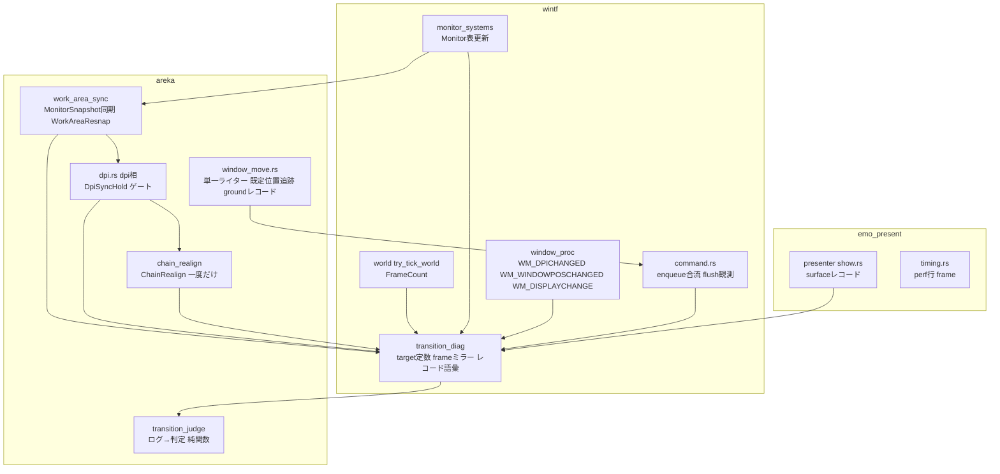
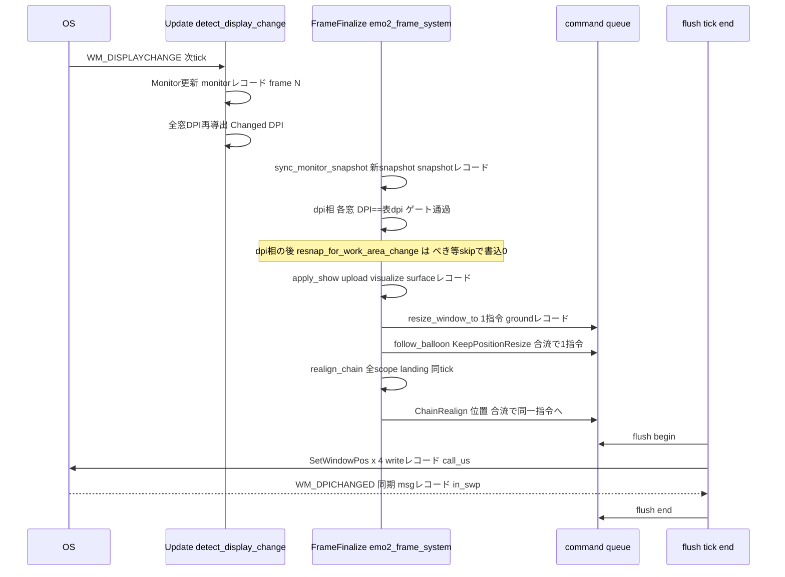
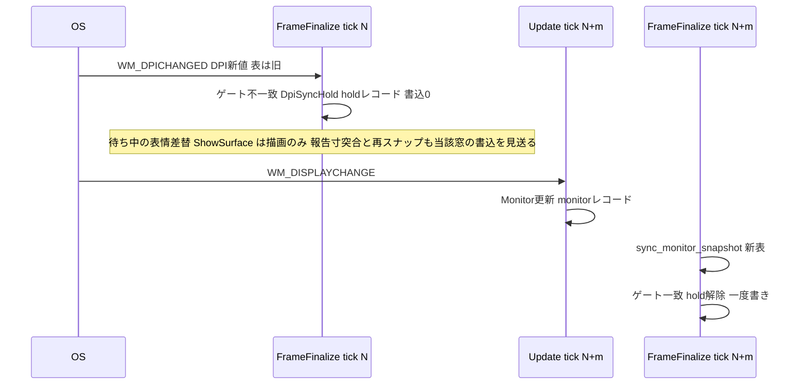
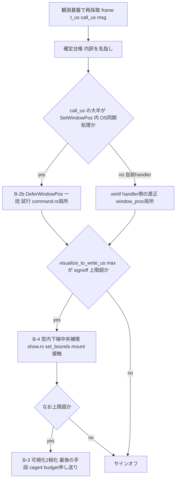

# Technical Design: areka-P0-dpi-transition-atomicity

- 作成日: 2026-08-15（設計生成・W6.75 単独）
- 入力: `requirements.md`（第 1 段再観測＝「残存」で確定済み）・`research.md`（ギャップ分析＋設計判断項目 16 件）・`reobservation-2026-08-15.md`・`brief.md`（棚卸⑨ブロック優先）
- 引用する `file:line` はすべて 2026-08-15 の現行ツリー（settled main 相当）で開いて確認した。
- 用語: 「決定論テスト」＝実機・GPU 無しで毎回同じ結果になる自動テスト。「一括 flush」＝フレーム末尾でキューに積まれた `SetWindowPos` をまとめて実行すること。「テスト間の状態汚染」＝フレーム番号・キュー・標識の残留が他テストの判定を変えること。

## Overview

**Purpose**: 拡大率（DPI）を切り替えたときにキャラとバルーンが跳ねずに新しい寸法・位置へ移り、遷移後の足元が新しい作業領域の下端に立ち、二体の隣接が保たれることを、目視ではなくログとテストで判定できる形で実現する。

**Users**: ゴーストを常駐させる利用者（見た目の品質）と、遷移の機序を判定・是正する開発者（観測基盤・確定台帳・回帰テスト）。

**Impact**: 第 1 段再観測（2026-08-15）で確定した事実——描画内容は 4 窓とも +13〜47ms に新寸で可視化されるが、窓矩形の書込は 1 tick 内の一括 flush の中で 1 枚ずつ 16〜78ms（初回が最も重い）かかり +63〜309ms まで旧矩形が残る／接地点は起動時の作業領域下端 1704 に固定され 192→96 で −48px 浮く／100% で二体の隙間が 359px 開く——に対して、⑴ フレーム番号つきの統合観測チャネル（恒久・既定 OFF）、⑵ 作業領域源 `MonitorSnapshot` の実行時同期＋作業領域変化を契機とする再スナップ、⑶ DPI 遷移後の連鎖再解決（一度だけ）、⑷ 同一 tick・同一窓のジオメトリ指令の合流（書込回数の下限化）、⑸ 遷移中の窓ごとの整合ゲート（一度書きの保証）を導入する。**逐次 `SetWindowPos` の内訳（1 回 16〜78ms が何に消えているか）は未特定**であり、その是正候補（OS 一括適用・窓内下端中央補償・可視化 2 相化）は観測基盤で内訳を名指ししてから選ぶ（後述「原子性の段階裁定」）。

### Goals

- 1 回の遷移に含まれる全窓書込・全サーフェス更新・モニタ表更新を**単一のフレーム番号系列**の 1 本の時系列に並べ、既定 OFF の専用 target で恒久提供する（Requirement 2）。
- 確定台帳を 2 証跡クラスで運用し、確定した機序だけを是正する（Requirement 3）。
- 遷移中の各キャラ窓の接地点を規約値に保ち、随伴バルーンを同一フレームで移し、有界のフレーム数・書込回数で完了する（Requirement 4）。
- 作業領域の変化に接地点が追随し、遷移と同時なら一度の窓書込で新寸・新下端へ移る（Requirement 5）。
- 一度きり確定（連鎖・キーワード基本位置）の寿命を裁定し、連鎖は遷移後に一度だけ解き直す（Requirement 6）。
- 上記を決定論テスト（x64・偽装境界）と有界の実機サインオフで検証する（Requirement 7・8）。

### Non-Goals

- 位置権威の正しさ（`dpi-window-vanish` R4）・合成コスト（`recompose-budget`）・描画負荷の SSP 同等圏（`draw-load-parity` W8）は扱わない。
- DPI の異なる別モニタへのドラッグ移動（`WM_DPICHANGED` 単独で届く遷移）は対象外。ただし本設計の変更で寸法追従を壊さない（10.7）。
- モニタ着脱・解像度変更・配置変更への全面追随、DPI 遷移を伴わない作業領域変化（タスクバー設定変更のみ）は必達対象ではない（設計が選ぶ機構が同じ経路で扱える範囲は妨げない）。
- `BalloonFollow.offset` の単位空間契約の実装（`areka-P0-balloon-offset-dpi`）。本設計は裁定だけを行う（6.5）。
- 合成アルゴリズム本体、SERIKO、GPU ドライバ差、ドラッグ中の追従。

## Boundary Commitments

### This Spec Owns

- **遷移観測チャネル**: wintf `ecs/window/transition_diag.rs`（専用 target 定数・フレーム番号のスレッド局所ミラー・レコード語彙の純関数）と、それを使う 3 crate（wintf・areka-emo-present・areka）の観測点。判定語の純関数固定テストと、ログ→判定の純関数 `transition_judge`。
- **一括 flush 経路の書込指令の合流と観測**: `crates/wintf/src/ecs/window/command.rs` の `SetWindowPosCommand`（要求語彙タグ）・`enqueue`（同一 hwnd ジオメトリ指令の合流）・`flush`（開始／終了／各書込のレコード）。Z のみの指令の適用順と結果は不変（10.3）。
- **作業領域源の実行時同期**: `MonitorSnapshot` を wintf の `Monitor` 表から作り直す areka 側の同期段（`emo2_boot/frame/work_area_sync.rs`）と、作業領域変化を契機とする再スナップ（新経路語 `WorkAreaResnap`）。`work_area.rs:17`「セッション内固定＝M1 受容」の撤回。
- **遷移中の整合ゲート**: 窓の DPI と帰属モニタの DPI 表が揃うまで当該窓の再導出を見送る `DpiSyncHold`（有界）。
- **一度きり確定の寿命**: DPI 遷移後の連鎖再解決 `ChainRealign`（`ChainFinalized` は起動時一度きりのまま保持し、別機構で解き直す）と既定位置 `default_char_pos` の追跡規則。キーワード基本位置は再導出しない（k 倍で済ませる＝`balloon-offset-dpi` が実装）。
- **確定台帳**（`mechanism-ledger.md`）と**サインオフ手順書**（`signoff-procedure.md`）。

### Out of Boundary

- OS 提案位置の採否判定（`window_pos.rs:406-409`）・可視性ガード・寸未確定時の現状維持＝`dpi-window-vanish` の規約。本設計は観測レコードを足すだけで判定を変えない。
- `presenter/show.rs` の予算域 :96-170（compose／resample／mask／insert）と定常アロケーション 0 の不変量＝`recompose-budget`。本設計が触るのは upload 直前の `chain.size()` 読取 1 行と :297 以降（upload 成功後・可視化後）の観測 2 行のみ（`chain.rs` 無改変）。**upload エラー分岐 :297-301 は移動しない**（`test-cage-determinism` ④の観測点）。
- `windowposition-limit` の表示位置補正（`window_move.rs:822`）とキーワード基本位置の一度きり再導出（`keyword_base.rs:59-163`）＝本設計は呼ばない・変えない。
- `scope-chain-gap` の起動時確定（`drain_resnap.rs:294-344`）＝`collect_chain_states` の可視性を広げて再利用するが判定・標識・停滞診断の意味は変えない。
- `BalloonFollow.offset` の単位空間と k 倍実装＝`areka-P0-balloon-offset-dpi`。
- 逐次 `SetWindowPos` の内訳が OS 側（DWM・同期メッセージ）にあると確定した場合の OS 挙動そのもの。

### Allowed Dependencies

- 依存方向: `wintf` ← `areka-emo-present` ← `areka`（`crates/areka-emo-present/Cargo.toml:17`・`crates/areka/Cargo.toml:19,51` で確認）。観測 target 定数・フレームミラー・共通レコード接頭語は wintf に置き、上位 2 crate が参照する。**wintf から areka／emo-present の語彙（scope・target_id）を参照しない**（wintf 側レコードは `&'static str` と数値だけを運ぶ）。
- 消費してよい着地物: `FrameCount`（`world/schedule_labels.rs:8`・u32）、`guarded_set_window_pos`／`is_self_initiated`（`command.rs:129,86`）、`Monitor` component（`monitor.rs:66-74`・bounds／work_area／dpi）、`MonitorSnapshot::from_monitors`（`work_area.rs:45`）、`project_anchor`（`anchor.rs:105`）、`resize_window_to`／`enqueue_window_set_pos`／`move_window_to`（`window_move.rs:182,549,42`）、`reproject_char_window_at_current_size`（`dpi.rs:409`）、`finalize_chain`／`ChainFinalizeStall`／`note_chain_deferral`（`chain_finalize.rs:108,169,298`）、`collect_chain_states`（`drain_resnap.rs:396`）、段階別計時 `FrameTiming`／`EmitContext`（`timing.rs:117,94・発行は :167`）、`PlacementRoute`（`diag.rs:162`）。
- 禁止: `MonitorSnapshot` の消費者（`resize_window_to`・ドラッグ・可視性ガード・limit 関門・永続復元）を wintf `Monitor` 直読へ変えること（C-2 却下）。dpi 相だけ別の作業領域源を持つこと（C-3 却下）。永続化経路（`persist.rs`）へ実行時 snapshot の変化を効かせること（5.7）。
  - **例外（task 2.4 のレビューで裁定・位置を一切決めない観測専用の読み取りは対象外）**: `placement::transition_diag::live_work_area_bottom` は wintf `Monitor` 表から作業領域下端を読むが、値は `GroundRecord.wa_bottom` にのみ流れ、位置の決定には 1 箇所も関与しない（`project_anchor` は `MonitorSnapshot` を読むまま・`window_move.rs:313`）。**接地点と同じ源から下端を引くと差が定義上つねに 0 になり、要件 5.3 と C6 の「`ground` レコード diff=0」が何も観測しなくなる**ため、観測にはもう一方の源が要る。C-2 の却下理由は消費者の多さと `MonitorSnapshot` の合成注入テスト戦略（偽装境界）を壊すこと（`research.md:167,316`）だが、`Monitor` は純データ（handle／bounds／work_area／dpi／is_primary）で素の `World` へ注入でき、偽装境界は保たれる。二重権威の懸念は C-3 の却下理由であって、位置を決めない読み取りには当たらない。**task 5.1 の同期後は 2 源が一致し、本観測は源の陳腐化を見張る口として残る**——task 5.1・5.2 はこの読み取りを撤去しないこと。

### Revalidation Triggers

- `SetWindowPosCommand` の形（タグ追加・合流規則）と `flush` の観測レコード語彙が変わる → `ghost-window-zorder` の維持系（`zorder_pair_maintain.rs:188-216`＝指令の組立、同 `:483`＝積み上げ）・`draw-load-parity`（W8・flush 経路）・`test-cage-determinism`・`emo2-conformance-e2e` が再確認。
- 観測チャネルのレコード語彙（`kind=`／`stage=`／フィールド名）が変わる → サインオフ手順書・`transition_judge`・後続 spec の判定が再確認。
- `MonitorSnapshot` が実行時に更新されるようになる（DD15 撤回）→ `MonitorSnapshot` の全消費者は「起動時値」前提を持たないことを確認済み（研究 §1.3）だが、`persist.rs` の復元判定は起動時 1 回のみ読む契約を維持する。
- `default_char_pos` の意味が「spawn 時の既定」から「システム由来の再アンカーで追随する既定」へ変わる → `scope-chain-gap` の R7.3 記述と `finalize_chain` の利用者が再確認。
- perf 行に `frame=` が追加される → `tools/perf/judge-perf.py` は `名前=値` 辞書化＋必須フィールド存在チェックのみ（研究 §2 で確認）ゆえ互換だが、DoD で `--selftest` を回す。
- 原子性の段階裁定（後述）で B-2b／B-4／B-3 のいずれかを採る → 採用時に本設計へ追記し、`recompose-budget`（B-3）・`collision-dpi-hittest`（B-4）へ申し送る。

## Architecture

### Existing Architecture Analysis

第 1 段再観測で確定した遷移 1 回の流れ（**設計時点の現行ツリー**・機序の断定は含まない）:

> **本表の file:line は設計時点（実装前）の値である**（task 6.4 で確認）。本仕様の実装で観測点を足したぶん行はずれており、行 6（`MonitorSnapshot` は起動時 1 回構築・以後不変）と行 8（同一 hwnd への 2 指令は合流されない）は**本仕様が意図して変えた当の挙動**なので、現在のコードとは一致しない。現在の所在は「Modified Files」の突合台帳と `mechanism-ledger.md` を正本とする。

| # | 事実 | 出所（現行ツリー） |
|---|---|---|
| 1 | `WM_DISPLAYCHANGE` → `App::mark_display_change` → 次 tick の `Update` で `detect_display_change_system` がモニタ表を更新し、同一 system で全窓の DPI を再導出（`Changed<DPI>`） | `lifecycle.rs:122-138`・`app.rs:20-23`・`world/mod.rs:213`・`monitor_systems.rs:195-239,253-381,438-480` |
| 2 | 同 tick の `FrameFinalize` で `emo2_frame_system` が dpi 相を回し、`Changed<DPI>` の全窓を 1 回の排他 system で処理（サーフェス寸変更 → 可視化 → 窓書込 enqueue）＝**全窓の enqueue は同一 tick 内** | `frame.rs:155,168`・`dpi.rs:232,242-252,287-301`・`show.rs:297,306,322,328` |
| 3 | 窓書込は thread_local キューに積まれ、World 借用解放後の `tick_one_frame` 末尾で enqueue 順に `SetWindowPos` される | `command.rs:127-130,155-167,173-206`・`tick_bridge.rs:181-202` |
| 4 | 【静的構造証跡】全窓の `Changed<DPI>` は 1 回の排他 system（`emo2_frame_system`）で処理され enqueue は同一 tick 内（事実 2・3）。【実機・時刻列】6 回の `SetWindowPos`（キャラ 1×2・バルーン 2×2）が 1 枚ずつ 16〜78ms（初回最重）を要し、各窓の最初の書込の内側で当該窓の `WM_DPICHANGED` が同期処理される（24/24）。経路 A の書込は 0/24。**「6 回が同一 tick 内」はフレーム番号未採取ゆえ構造からの推定であり、実機確定は実装フェーズ 2 の再採取で行う** | 事実 2・3／`reobservation-2026-08-15.md` §3.1・§5 |
| 5 | フレーム番号はどのログにも無い。flush 点は World 借用外ゆえ `FrameCount` を直接読めない | 研究 §1.2 |
| 6 | `MonitorSnapshot` は起動時 1 回構築・以後不変。作業領域変化を契機とする再スナップ経路は無い（`Resnap` 0 件） | `main.rs:530-538,569,573-574,611`・`work_area.rs:12-24` |
| 7 | 連鎖確定は一度きり（`ChainFinalized`）。既定位置は spawn 時値で、DPI 再射影の中央保存で X が動くと全スコープが「明示再配置」扱いになる | `drain_resnap.rs:299-301,333,370`・`chain_finalize.rs:108`・`spawn.rs:266,514` |
| 8 | 同一 hwnd への 2 指令（バルーン: 寸→位置）は合流されず 2 回書かれる | `command.rs:164-166`・再観測 §3.2 |

### Architecture Pattern & Boundary Map



**Architecture Integration**:
- 選択パターン: **観測チャネルの単一化＋既存機構の拡張（研究 Option C の段階実装）**。新規の tick 構造（遷移バリア・2 相コミット）は導入しない。
- 境界: wintf は「窓書込・メッセージ・モニタ表・フレーム番号」の事実だけを記録し、areka の語彙（scope・種別・route）は `&'static str`／数値のタグとして受け取る。emo-present は表示成立点（サーフェス寸）を記録する。判定（遷移の切り出し・不整合フレーム・回数・接地点差）は areka の純関数が担う。
- 保存する既存パターン: 専用 target・既定 OFF・純関数レコード（`placement::diag`）／`*_with(source, world)` の依存注入（`resnap_with`・`finalize_chain_once_with`）／単一ライター `enqueue_window_set_pos`／段階別計時 `FrameTiming`／偽装境界（`MonitorSnapshot` 注入・`FakeReports`・`FakeSizes`）。
- 新規要素の理由: `transition_diag`（フレーム番号を World 外へ運ぶ唯一の口）、`work_area_sync`（作業領域源の更新主体）、`DpiSyncHold`（一度書きの保証）、`chain_realign`（DPI 遷移後の連鎖）、合流（回数の下限化）、`transition_judge`（機械判定の単一実装）。
- Steering 準拠: `tracing` 構造化ログ・既定 OFF（`logging.md`）、テストは兄弟ファイル `<stem>_<module>.rs`（`structure.md`）、`thiserror`、依存方向 wintf←areka。

**キー決定（D 番号は研究 §7 の設計判断項目番号に対応）**:

- **D1 フレーム番号の配管＝World 資源を正、スレッド局所ミラーは World 外専用**（設計討議 A-1 で改訂）。`try_tick_world` が `FrameCount` を +1 する点（`world/mod.rs:517-524`）で、同時に Resource `TickStart(Instant)` を更新し、`transition_diag::begin_tick(frame, start)` で**スレッド局所ミラー**にも同じ値を写す。**World を持つ観測点（`monitor_systems`・`emo2_frame_system`・presenter・areka 側レコード）は `Res<FrameCount>`＋`Res<TickStart>` から `Stamp` を組む**——`Update` の `detect_display_change_system`（`monitor_systems.rs:195`）は既定の多スレッド実行器（`world/mod.rs:102`）でワーカースレッドに載り得るため、スレッド局所ミラーは読めない。**ミラーを読むのは World を借りられない点だけ**＝flush（`tick_bridge.rs:200` は借用解放後）と wndproc の同期経路（いずれも UI スレッド・tick 外は「直近 tick の番号」）。両者は同一点で同一値に更新されるので 1 系列が保たれる。コマンドへの焼き込み（i）は不要（enqueue と flush は同一 tick）。プロセス大域 atomic は 7.7（テスト間の状態汚染なし）と衝突するため採らない。
- **D2 観測 target＝単一定数を wintf に置く**: `TRANSITION_TARGET = "wintf::transition"`。3 crate が同じ文字列で emit し、`RUST_LOG` の directive は 1 語（`wintf::transition=debug`）。既定 OFF（`RUST_LOG=info` では無音）。
- **D3 書込レコードの一本化＝コマンドに要求語彙タグを載せる**: `SetWindowPosCommand.tag: WriteTag { origin: &'static str, scope: Option<u32>, kind: &'static str }`。flush 側の 1 行で「フレーム・窓（scope・種別）・矩形・同期／flush・経路語彙・所要 µs」が揃い、2 段 grep を要しない。`[diag.window_move]`（`diag.rs:355-374`）は変更しない。
- **D4 サーフェス記録点＝`show.rs`**（frame と target が揃う）。`resized` は **upload の直前に `let prev = chain.size();` を読み、:306 の `size` と比べて `size != prev` で得る**（設計討議 A-3 で改訂）。`chain.upload` の戻り値型も `chain.rs` も変えず、:297-301 の `if let Err(e) = chain.upload(...)` は**字面どおり不動**（旧案 `UploadOutcome` は `Ok` の中身を受け取るために :297 の字面を変えざるを得ず両立しなかった）。
- **D5 作業領域源の更新主体＝C-1（`MonitorSnapshot` を `Monitor` 表から作り直す）**。置き場は 2 点に分ける（設計討議 A-4 で改訂）: **資源の差替（`sync`）は `emo2_frame_system` の先頭（`run_dpi_phase` の前・同一 World 借用）**——同一 tick 内で dpi 相が新 snapshot を読むため、経路 (b) 由来の遷移は追加書込なしで新下端へ着地する。**変化契機の再射影（`WorkAreaResnap`）は dpi 相の後**——`Changed<DPI>` の窓は dpi 相が新 snapshot で 1 本書き終えているので べき等 skip で 0、DPI が変わらず作業領域だけ変わった窓だけが現寸で再射影される。旧案（再射影も先頭）は経路 (b) で同一窓に 2 度の enqueue（旧寸・新下端 → 新寸）を積み、`[diag.window_move]`／`ground` レコードが 2 件ずつ出て bypass ミラーに中間値が載るため退けた（SetWindowPos は合流で 1 回だったが記録が濁る）。変化フレームだけ再構築し、無変化は無操作。`work_area.rs:17` と `main.rs:569` の「セッション内固定」記述を撤回する。
- **D6 tick 跨ぎ分裂＝A-1（バリアを置かない）＋窓ごとの整合ゲート**。実測は全窓同一 tick（事実 2）。A-2（遷移バリア）は tick 構造への介入ゆえ却下、A-3（`WM_DPICHANGED` の反映を tick 冒頭へ寄せる）は `dpi-window-vanish` の受理契約を変える上に (a)-先行の問題を解かないため却下。
- **D7 1 tick 内の DWM 境界＝段階裁定**。合流（B-2a）は本設計で確定。OS 一括適用 `DeferWindowPos`（B-2b）・窓内下端中央補償（B-4）・可視化 2 相化（B-3）は観測基盤で内訳を名指ししてから選ぶ（「原子性の段階裁定」節）。
- **D8 連鎖は DPI 遷移後に解き直す（6.1 の裁定＝⑴）。`ChainFinalized` は解除しない**。理由: 実測で 100% の隙間が 359px（再観測 §7・幅変化の半分の和）と製品品質を損なう量であり、`scope-chain-gap` R7.4「確定後のサーフェス切替では再解決しない」は会話中の表情差替を守るための規定で DPI 遷移は想定外（brief 追記(63)）。起動時一度きりの意味を保ったまま、DPI 遷移後の解き直しを別機構 `ChainRealign` が担う。「遷移完了」＝全スコープが landing（既存条件）**かつ** どの窓も `DpiSyncHold` 中でない。停滞診断は `ChainFinalizeStall` を武装時に初期化して再利用する（6.3）。
- **D9／D16 既定位置の追跡規則**: `enqueue_window_set_pos` で、対象がキャラ窓であり route がシステム由来（`AnchorChange`・`Resnap`・`DpiReproject`・`ReportedSizeReconcile`・`WorkAreaResnap`・`ChainRealign`）**かつ書込前の現在位置が既定位置と一致していた**場合のみ既定位置を書込先へ追随させる。明示操作（`MoveCue`・`Restore`・ドラッグ・`BalloonLimitRelease`）では追随しない。既定位置 `None`（保存位置の復元）は `None` のまま。
- **D10 キーワード基本位置＝再導出しない**。DPI 遷移では `BalloonFollow.offset` を k 倍で追随させる（`balloon-offset-dpi` が実装）。理由: キーワード式 `(char_w−balloon_w)/2` は両寸が同じ k で伸びれば k 倍と ≤1px（`scale-exact-rational` の +1 許容）で一致し、再導出は素材保持と 2 度目の書込を要し原子性を損なう。両者は排他であり、本裁定を bod が従う（6.5）。
- **D11 flush 検査口＝`drain_window_pos_commands()`（実行せずに取り出す公開関数）＋合流の純関数**。決定論テストはキューの中身で回数・順序・合流を検証し、実 `SetWindowPos` は呼ばない。
- **D12 perf 行へ `frame=` を末尾追加し、`judge-perf.py --selftest` の互換確認を DoD に含める**。
- **D13 4.5 の回数＝キャラ 1・バルーン 1・経路 A 0**（合流後）。回帰テストはこの値を固定する。
- **D14 `FrameCount` の周回**: 判定は `wrapping_sub` の差分のみ。絶対値比較を判定語に使わない。
- **D15 5.8 一度書き＝D5 の配置（dpi 相より前・同一 tick）で経路 (b) を保証し、経路 (a) が先行する場合は `DpiSyncHold` で当該窓の**すべての窓書込**を見送って一度書きに保つ**（設計討議 議題 1 で範囲を確定・有界 `DPI_SYNC_HOLD_MAX_FRAMES = 30`・超過時は warn の上で現 snapshot で進める）。待ち札は dpi 相だけでなく、報告寸の突合 `reconcile_reported_sizes`（本体は `frame/scale_text.rs:141`・呼出は `frame.rs:206`）、**実表示寸の**再スナップ `resnap_shell_targets`（本体は `frame/drain_resnap.rs:169`→`resnap_with`:207・呼出は `frame.rs:214`）、**作業領域変化を契機とする**再スナップ `resnap_for_work_area_change`（本体は `frame/work_area_sync.rs:199`・ゲートは同 :238・呼出は `frame.rs:186`＝拡大率の相の直後）でも当該窓の窓書込を見送る——待ち中に drain 相の `ShowSurface`（会話中の表情差替・SERIKO）が新 k で描画しても、窓を書くのは表が揃ってからにする。**描画そのものは止めない**（発話・アニメは遅らせない）。**唯一の例外は随伴バルーンの追従**——ただし外れるのは**不変条件の監視**であって見送りではない（随伴の追従はそもそも 4 点を通らない）。詳細は C5 を参照（task 5.4 で確定・**4 点目は task 6.5 で追加**——当初の列挙は 3 点で、「再スナップ」という日本語が `resnap_shell_targets` と `resnap_for_work_area_change` の別々の 2 関数を指していたため後者が守備範囲の外に落ちていた。原則が「待ち札のある窓への**すべての**窓書込を見送る」である以上、これは裁定の変更ではなく列挙の抜けの是正である）。理由: Windows は `WM_DPICHANGED` と `WM_DISPLAYCHANGE` の順序を保証せず（実測は 6/6 が表更新先行だが）、dpi 相だけの防御では表情差替経路から 2 段書込がすり抜け、設計の「保証」とテストの範囲が食い違うため。

### Technology Stack

| Layer | Choice / Version | Role in Feature | Notes |
|---|---|---|---|
| Runtime / ECS | bevy_ecs 0.18・wintf 13 スケジュール tick | `FrameCount`（u32）を単一権威に、`Update`（モニタ表更新）→`FrameFinalize`（emo2 frame）→ flush の順序を利用 | 新スケジュール追加なし |
| Logging | tracing（専用 target・debug 水準） | 観測チャネル `wintf::transition`・既定 OFF | `RUST_LOG=wintf::transition=debug` |
| Win32 | `SetWindowPos`（現行）／`BeginDeferWindowPos` 群（候補 B-2b・段階裁定） | 一括 flush の実行 | B-2b は「同一 parent（top-level は NULL）」「per-window flags・hwndInsertAfter」「EndDeferWindowPos が WM_WINDOWPOSCHANGING/CHANGED を各窓へ送る」まで文書化済み。原子性の保証は無い（研究 §8） |
| Graphics | DXGI swap chain `Present`（現行） | サーフェス寸変更の記録点 | 窓矩形と同一 DWM フレームへ揃える API は文書化されていない（研究 §8） |
| Test | cargo test（x64・偽装境界・`SingleThreaded`） | 決定論テスト | `cargo test -p areka` に `--bins` を付けない |

## File Structure Plan

### Directory Structure

```
crates/wintf/src/ecs/window/
├── transition_diag.rs                 # NEW: target定数・frameミラー・tick/flush epoch・WriteTag・レコード純関数（monitor/write/flush/msg/enqueue）
├── transition_diag_tests.rs           # NEW: 語彙固定（正例/負例）・ミラー初期化
├── command.rs                         # MOD: SetWindowPosCommand.tag／enqueue合流／flush観測／drain_window_pos_commands
├── command_coalesce_tests.rs          # NEW: 合流の純関数テスト（Z専用は不合流・順序保存・フラグ非対称）
crates/areka-emo-present/src/
├── presenter/show.rs                  # MOD: upload 直前に prev=chain.size()／成功後・可視化後に surface レコード（:297-301 不動・chain.rs 無改変）
├── presenter/refresh.rs               # MOD: 見送り（k不変・不可視）に surface stage=skipped
├── presenter/timing.rs                # MOD: EmitContext.frame・perf行末尾に frame=
├── presenter/transition_record.rs     # NEW: surface レコード純関数（target_id・stage・寸）
├── presenter/transition_record_tests.rs  # NEW
crates/areka/src/placement/
├── transition_diag.rs                 # NEW: areka側レコード純関数（snapshot/hold/ground/chain）
├── transition_diag_tests.rs           # NEW
├── transition_judge.rs                # NEW: 行パーサ・遷移切り出し・判定量（純関数・I/O無し）
├── transition_judge_tests.rs          # NEW: 再観測ログ整形の正例／判定語破壊の負例／周回差分
├── transition_judge_verdict.rs        # NEW: 上限 2 系統・違反の列・judge/judge_transition_log/Report
├── transition_judge_verdict_tests.rs  # NEW: 2 系統の分離／上限の各分岐／是正前の赤
├── transition_judge_negative_tests.rs # NEW: 判定語破壊・欠落・量が静かに消える行・周回境界
├── transition_signoff_tests.rs        # NEW: #[ignore] 実機ログ判定ランナー（AREKA_TRANSITION_LOG）
├── dpi_sync.rs                        # NEW: DpiSyncHold component・純関数 dpi_sync_decision・MAX_FRAMES
├── dpi_sync_tests.rs                  # NEW
├── diag.rs                            # MOD: PlacementRoute に WorkAreaResnap・ChainRealign（ALL 12）
├── follow/work_area.rs                # MOD: MonitorDpiTable・order非依存比較・DD15撤回doc
├── follow/window_move.rs              # MOD: enqueue_window_set_pos のタグ／既定位置追跡／ground レコード／move_window_with_route
├── follow_default_pos_tests.rs        # NEW（facade follow.rs に接続・既存 follow_*_tests.rs と同形）
crates/areka/src/emo2_boot/frame/
├── work_area_sync.rs                  # NEW: sync_monitor_snapshot_with／resnap_for_work_area_change
├── chain_realign.rs                   # NEW: ChainRealignPending・arm・realign_chain_once_with
├── dpi.rs                             # MOD: DpiSyncHold ゲート・武装トリガ・reproject の route 引数
├── drain_resnap.rs                    # MOD: collect_chain_states を pub(super)・hold条件
crates/areka/src/emo2_boot/
├── frame.rs                           # MOD: 先頭に sync／末尾に realign の呼出
├── frame_test_support.rs              # MOD: 多フレーム駆動ハーネス（advance_frame・snapshot/dpi表注入・キュー drain）
├── frame_work_area_sync_tests.rs      # NEW
├── frame_dpi_sync_hold_tests.rs       # NEW
├── frame_chain_realign_tests.rs       # NEW: 隣接の是正（359→0）・一度きり・除外・見送り診断
├── frame_chain_realign_arm_tests.rs   # NEW(5.6): 武装条件の 3 連言の特異性＋size_changed の 3 分岐
├── frame_transition_atomicity_tests.rs # NEW(6.1): 経路 (b) の原子性（同一フレーム・窓ごと 1 回・経路 A の観測行 0・接地点 diff 0・有界）を 120／192 で
├── frame_transition_branch_tests.rs   # NEW(6.2): 整合待ちと作業領域追随の判断分岐（項目 2／3／6）を 120／192 の両水準で＋本番入口 emo2_frame_system の到達可能性 1 本
├── frame_work_area_resnap_hold_tests.rs # NEW(6.5): 整合ゲートの 4 点目（作業領域変化を契機とする再スナップ）を 120／192 の両水準で
crates/areka/src/main.rs               # MOD: 起動時に MonitorDpiTable も挿入・:569 注記の撤回
.kiro/specs/areka-P0-dpi-transition-atomicity/
├── mechanism-ledger.md                # NEW(4.3): 確定台帳（2 証跡クラス・L1〜L9）。L7（窓書込 1 回の内訳）と L8（積み上げ→一括書込）を名指しし、分解できない部分は「未特定」として残す。実機専用の上限の確定値（16,667µs）と採取機に依らない根拠、判定器を触った裁定、再判定の突合もここ
├── signoff-procedure.md               # NEW: サインオフ手順書
├── baseline-2026-08-20.md             # NEW(4.2): 是正前の基準値（フレーム番号つき時系列・§6.3 の 9 量・要件 1.3/1.4/1.6 と 9.1 の確認・task 7.3 への比較の単位）。生ログ・Report 全文・meta.txt はリポジトリ外（手順書 §7）で、本書へは引用と数字だけを転記する
├── remediation-evidence.md            # NEW(6.3): 是正の対証跡（要件 7.3）。4 件（作業領域追随・合流・整合待ち・連鎖再解決）について、是正前の赤（記録の引用＝file:line／コミット本文／台帳）と是正後の緑（実行の逐語）を対で載せ、各是正を無効化する変異で現在も赤になることを実行で示す。台帳 L1〜L9 との突合（L1・L7 の対は task 7.2 の持ち分）もここ
```

### Modified Files

| ファイル | 変更内容 | 所有権メモ |
|---|---|---|
| `crates/wintf/src/ecs/world/mod.rs` | `try_tick_world` の `FrameCount` 増分直後（増分は :517-524）で Resource `TickStart` を更新（:525-533）し `transition_diag::begin_tick(frame, start)`（:534・ミラーへ写す）。World 構築時（:76-77 の `FrameTime` 挿入と同所）に `TickStart` を初期挿入（:82-84） | tick 構造は変えない（13 スケジュール順不変） |
| `crates/wintf/src/ecs/window/mod.rs` | `pub mod transition_diag;` 再輸出 | — |
| `crates/wintf/src/runtime/tick_bridge.rs` | MOD(4.3): doc 3 箇所＋起動時 `debug!` の文字列 1 箇所（挙動不変・この文字列を読む消費者はコード上に無い）。`AsyncTickTask`（doc :136・型は :157）・`spawn`（doc :160）・`run_async_tick`（doc :212・本体は :218）と起動時の `debug!`（:219）が「60Hz tick ループ」と書いていたのを **vblank 駆動**へ是正し、実効のフレーム周期は画面の更新周期であること・固定 60Hz は DWM 失敗時のフォールバック（`vsync_loop` の `Err` 腕 :127-131）だけであることを明記した。**挙動は 1 つも変えていない**（判定の上限を「1 コマ」で置くときに 16.7ms を無条件の値と読む誤りが実際に起きたため・確定台帳 §4） | tick 構造は変えない |
| `crates/wintf/src/ecs/window/command.rs` | `tag` フィールド＋`with_tag`／`enqueue` の合流／`flush` の begin・write・end レコード／`drain_window_pos_commands`。MOD(5.3): 合流が着地（`COALESCIBLE_FLAGS`／`REQUIRED_FOR_COALESCE`／`is_coalescible`／`find_merge_target`／`merge_into`／`coalesce_geometry`）。`enqueue` は記録を**合流の後**に組む（合流先の通し番号は畳んでみるまで判らない） | `new()` の 7 引数は不変。Z 専用指令は合流対象外。**同一窓の畳めない指令は仕切りとして働く**（C2 の合流規則を参照） |
| `crates/wintf/src/ecs/window/zorder_pair_maintain.rs` | `pair_fix_command`（:188-216）にタグ `origin="zorder-pair"`（`.with_tag` は :212-215） | zorder の判定・順序不変 |
| `crates/wintf/src/ecs/graphics/systems/window_pos.rs` | enqueue（:90-106・`.with_tag` は :102-105）にタグ `origin="window-pos"` | — |
| `crates/wintf/src/ecs/window_proc/window_pos.rs` | `WM_DPICHANGED`（:325）と `WM_WINDOWPOSCHANGED`（:41）に `msg` レコード（:58-66／:335-343）／採用時の同期書込（:460-490・`guarded_set_window_pos` は :464）に `write stage=sync` レコード（:468-489） | 採否判定（`dpi_suggested_position_decision` の呼出 :406-409）不変（`dpi-window-vanish`） |
| `crates/wintf/src/ecs/window_proc/lifecycle.rs` | `WM_DISPLAYCHANGE`（:132）に `msg` レコード（:139-147） | 戻り値 `None` 不変 |
| `crates/wintf/src/ecs/layout/systems/monitor_systems.rs` | 値変化更新（`apply_monitor_snapshot` は :274・`differs_in_value` の腕は :301）の内側、値を書き戻した直後に `monitor` レコード（:347-356。刻印は `Res<FrameCount>`＋`Res<TickStart>` から組む＝D1）／`monitor_containing` を crate 外へ開く（C5 が帰属規則を共有するため）。MOD(5.4): **開く裁定を採り**、`monitor_containing` を `pub` かつ要素型に対して総称化した（新設の `pub trait MonitorBounds`＝境界矩形 1 つを返すだけの入力トレイト。`Monitor` の実装は `bounds` を返す）。あわせて `window_center` も `pub` 化した——帰属の入力である中心の求め方（`CW_USEDEFAULT` を未確定として弾く）を上位クレートが自前で書くと、窓生成前の窓で整数桁溢れを起こす | 既存 debug 行・`redrive`・帰属規則の中身は不変（半開区間・昇順先勝ちのまま。既存呼出は型推論で `M=Monitor` となり字面も不変） |
| `crates/areka-emo-present/src/presenter/show.rs` | upload 直前に `prev_size = chain.size()`（:305）／`surface stage=upload`（:348-358・`resized = size != prev_size` は :317）／`surface stage=visualize`（:389-399・`size_changed \|\| resized` のときのみ・前置ガードは共有の `observe_surface`（:347＝`transition_diag::is_enabled()`＝`tracing::enabled!` の薄い包み）で 1 度だけ評価する） | 予算域（`native_scratch` :99 から `Stage::MaskGen` :173 まで）と upload 失敗の早期 return（:306-310＝`test-cage-determinism` ④の観測点）は不動——本ファイルの差分ハンクは :4-8（use）・:300-305・:316-359・:385-399・:407-410・:478-480 の 6 つだけである。`chain.rs` 無改変 |
| `crates/areka-emo-present/src/presenter/refresh.rs` | :82-91（k 不変・`reason=k-unchanged` は :89）・:99-108（不可視・`reason=invisible` は :106）で `surface stage=skipped reason=` | 見送り判定は不変 |
| `crates/areka-emo-present/src/presenter/timing.rs` | `EmitContext.frame: u32`（:108）・perf 行末尾に `frame=`（:220・module doc は :31） | 既存フィールド順・文言不変 |
| `crates/areka/src/placement/diag.rs` | `PlacementRoute::WorkAreaResnap`／`ChainRealign` 追加・`ALL` 12。MOD(5.2): `WorkAreaResnap` に発行者が着いたので `#[allow(dead_code)]` を撤去。MOD(5.6): `ChainRealign` も発行者（`placement::chain_realign::realign_chain_once_with`）が着いたので撤去——12 経路すべてが実在トリガを持つ。MOD(5.5): `PlacementRoute::is_system_reanchor()`（網羅 match・D9 の 6 経路が `true`）を新設し、**システム由来か明示操作かの区分の単一定義元**にした——同じ区分を読む 2 者（既定位置の追跡＝`enqueue_window_set_pos`／可視性の遷移ガード＝`route_applies_visibility_guard`）が列を 2 本持つと片方だけ直したときに静かに食い違うため | 1 語＝1 実在トリガ（D13）維持 |
| `crates/areka/src/placement/follow/work_area.rs` | `MonitorDpiTable`／`dpi_for_point`／`same_monitors`（順序非依存比較）／`MonitorSnapshot` の doc（:22-33）で DD15 を撤回。MOD(5.1): `MonitorDpiEntry`／`MonitorDpiTable`／**`MonitorSources`（2 源を同時に作る単一の構築関数＝起動時と同期段が共有）**／`same_monitors`（台の多重集合として比較・作業領域と矩形と拡大率の全成分）／`MonitorSnapshot` の doc から「セッション内固定＝M1 受容」を撤回。**`dpi_for_point` は入れていない**——帰属規則を表示基盤側の `monitor_containing` と共有するか同規則の述語を置くかの裁定は task 5.4 が持つので、先に別規則を発明して二重権威にしない。MOD(5.4): **共有する裁定**を採り `MonitorDpiTable::dpi_for_point(cx, cy)` が着地（本体は `monitor_containing` を呼んで `dpi` を取り出すだけ＝規則を 1 文字も持たない）。areka 側が自前で持つのは `impl MonitorBounds for MonitorDpiEntry`（`bounds` を `RECT` へ転写するだけ）1 つで、それが `work_area` を読む向きへ壊れれば対比テストが落ちる | `MonitorSnapshot` の型と 51 箇所の構築リテラルは不変 |
| `crates/areka/src/placement/follow/window_move.rs` | `enqueue_window_set_pos`（:549-689）: タグ付与・既定位置追跡・キャラ Bottom の `ground` レコード／`move_window_with_route`（:60）追加（`move_window_to`（:42）は委譲で不変）。MOD(5.5): **既定位置追跡が着地**——`track_default_char_pos`（非公開ヘルパ・:729-784）を新設し、`WindowPos` の bypass ミラーを書き換える**前**に呼ぶ（後に呼ぶと一致判定が常に成立し、明示操作で動かした窓まで追随する）。追随の条件は D9 の 3 つ（route が `is_system_reanchor`／対象が `CharWindowMarker` を持つ／書込前の現在位置が既定位置と一致）で、`None`（復元位置）は `None` のまま。台帳・位置が引けない形は `debug!` を残す（書込自体は成立ゆえ失敗ではないが、無音にすると追随の有無が事後に判らない）。連鎖確定の書込は `MoveCue`＝明示操作ゆえ本規則に掛からず、`drain_resnap` 側の明示的な `set_default_char_pos` と重ならない。**`move_window_with_route` は task 5.5 の時点では不要だったが、task 5.6 で新設した**——遷移後の解き直しは「寸を変えずに位置だけを書き、随伴バルーンを連れて動く」＝`move_window_to` と同一の手続きでありながら、route だけが `ChainRealign`（システム由来）である必要がある。`MoveCue` のまま書くと既定位置の追跡（D9／D16）が効かず、次の遷移で当該スコープが「明示的に動かされた」へ倒れる。`move_window_to` は新関数への委譲になり、幾何・随伴バルーンの route（`BalloonFollow`）は 1 bit も変わらない。MOD(5.4): 待ち札の適用範囲の**不変条件の監視**を入口へ（`warn!`＋`debug_assert!`）。**随伴バルーンの追従（`PlacementRoute::BalloonFollow`）だけは監視の対象外**——随伴の追従は 4 つの見送り点を通らないので止まりはせず（当初は 3 点と書いていた——4 点目は MOD(6.5) で加わった。本文 :573・:579・:588 は 4 点で書かれている）、外す理由は止まらない書込をこの監視が「漏れ」として鳴らすからである（偽の警報を防ぐ）。C5 の Risks を参照。2 窓の中心が別モニタに乗る形は実装中に決定論テストが実際に踏んだ。MOD(6.5): 監視の**説明**を 3 点から 4 点へ是正（作業領域変化を契機とする再スナップを加えた）——監視の条件も水準も不変であり、`WorkAreaResnap` が鳴らなくなるのは見送り側が塞がったからである | 単一ライター維持。limit 関門・手順 5a 不変 |
| `crates/areka/src/emo2_boot/frame.rs` | MOD(5.6): `finalize_chain_once`（:218）の**直後**に `realign_chain_once`（:225）を 1 行入れた（既存 4 相の順序は不変・相順 doc も追随）。現在の呼出行は `sync_monitor_snapshot`（:169）→`run_attach_phase`（:171）→`run_dpi_phase`（:178）→`resnap_for_work_area_change`（:185-187）→`run_drain_phase`（:188）→`reconcile_reported_sizes`（:206）→`resnap_shell_targets`（:214）→`finalize_chain_once`（:218）→`realign_chain_once`（:225）である（**報告寸の突合での見送りは本ファイルではなく `frame/scale_text.rs` に入る**——設計当初は `frame.rs:187` と記していたが `file-slimming` の分割で本体が移っている）。MOD(5.1): `mod work_area_sync;` ＋ `emo2_frame_system` の**先頭**（`run_attach_phase` の前・`Emo2Wiring` 取得の直後）で `work_area_sync::sync_monitor_snapshot(world)`。MOD(5.2): 同期の戻り値を `work_area_change` で受け、`run_dpi_phase` の**直後**（`run_drain_phase` の前）で `if let Some(..)` ガードのうえ `work_area_sync::resnap_for_work_area_change(world, ..)` を呼ぶ。兄弟テスト `frame_work_area_sync_tests.rs`／`frame_work_area_resnap_tests.rs` を x64 限定で接続。MOD(5.4): 兄弟テスト `frame_dpi_sync_hold_tests.rs` を x64 限定で接続（**本ファイルの相順そのものは 1 行も変えていない**——整合ゲートは各相の内側に入る）。MOD(5.5): 兄弟テスト `frame_default_pos_track_tests.rs` を x64 限定で接続（相順は同じく不変）。MOD(6.1): 兄弟テスト `frame_transition_atomicity_tests.rs` を x64 限定で接続（**本ファイルの相順そのものは 1 行も変えていない**——検証タスクゆえ本番の挙動へは触れない）。MOD(6.2): 兄弟テスト `frame_transition_branch_tests.rs` を x64 限定で接続（同上・相順は 1 行も変えていない）。なお **本ファイルの 3 呼出（`sync_monitor_snapshot`／`run_dpi_phase`／`resnap_for_work_area_change`）の到達可能性は、同兄弟の `the_production_frame_system_reaches_all_three_placement_call_sites` が `emo2_frame_system` をそのまま駆動して固定する**（task 5.2 のレビューが名指しした「呼出を残したまま `if false` で到達不能にすると全緑」の穴の引受先）。MOD(6.5): 4 点目の見送りの檻 `frame_work_area_resnap_hold_tests` を x64 門つきで接続 | 既存 4 段の順序不変 |
| `crates/areka/src/emo2_boot/frame/dpi.rs` | `dpi_phase_with` に hold ゲート・武装トリガ、`reproject_char_window_at_current_size` に route 引数。MOD(5.6): **武装トリガが着地**——`Some(new_size)` の腕で、書込**前**の窓寸を読んでから `reconcile_window_size` を呼び、⑴ 書込が起きた ⑵ キャラ窓である ⑶ 寸が変わった の 3 つが揃ったときだけ `chain_realign::arm_chain_realign` を呼ぶ（純関数 `size_changed` が ⑶ を担う。窓寸が引けない＝比較の相手が無い状態は「変わった」と数えない——数えると起動直後の初回 landing で毎回武装する）。書込前に読むのは、`reconcile_window_size` が bypass ミラーを新寸へ書き換えるため後から読むと必ず一致するからである。`None` の腕（現寸のまま再射影）は寸が変わらないので武装しない。**`size_changed` は `pub(super)` へ上げた**——3 分岐のうち i32 変換失敗の腕は `dpi_phase_with` からは構造的に踏めない（`reconcile_window_size` が先に超過を弾いて `false` を返し、武装条件の `&&` が短絡して本関数まで到達しない）ので、駆動テストだけでは永久に無検査の腕が残る。届かない腕を実行検査するには兄弟テストが直接呼べる可視性が要る（`frame_chain_realign_arm_tests.rs`）。ほかの 2 分岐（窓寸が引けない／寸比較）は駆動からも踏めるが、3 分岐を 1 箇所で対にして読めるようにするため同じテストへ集めた。MOD(5.4): hold ゲートが着地。対象は `Changed<DPI>` の窓と `DpiSyncHold` を持つ窓の**和集合**（見送った窓は変化を消費済みゆえ、和集合にしないと札が外れない）。**ゲートを 1 巡目・処理を 2 巡目に分ける**——1 巡で混ぜると、先に解除・処理されたキャラ窓の随伴書込がまだ札の付いたバルーンへ届き、不変条件を自分で破る。ゴースト窓でない窓はゲートに掛けない（札はゴースト窓の持ち物）。MOD(5.2): route 引数が着地（呼び手は拡大率の相＝`DpiReproject` と作業領域再スナップ＝`WorkAreaResnap` の 2 つ）。縮退ログ 2 本（破棄済みの `debug!`／寸未確定の `warn!`）へ `route` を載せ、本文の `dpi reproject:` 接頭語を `reproject:` へ改めた（どちらの呼び手が打ち切ったかがログで判る） | `reconcile_window_size`（:126）不変 |
| `crates/areka/src/emo2_boot/frame/drain_resnap.rs` | `resnap_with` で `DpiSyncHold` の窓を見送り（`hold site=resnap`）。MOD(5.6): 遷移後の解き直しの**駆動口**を新設した——`realign_chain_once`（本番・presenter を渡す）と `realign_chain_once_with_source`（`PhysicalSizeSource` 越しの一般化）。**`collect_chain_states` の可視性は上げていない**（設計の当初記述は `pub(super)` 化だった）——判断の本体は `placement::chain_realign` にあり、走査は**クロージャとして渡す**形にしたので、私有のままで足りる。この形を採った理由は placement の非テストコードが `crate::` パスを使えないこと（examples が `placement/mod.rs` を `#[path]` include するため）で、`PhysicalSizeSource`／`shell_target` は表示層の語彙ゆえ配置層へは移せない。走査を 2 実装に割らないという設計の要点（「起動時確定とまったく同じ判定を再利用する」）はそのまま保たれる。MOD(5.5): `collect_chain_states` が読む `default_char_pos` の意味（「最後にシステムが置いた既定位置」）と、`finalize_chain_once_with` の明示的な `set_default_char_pos` が単一の窓書込口の追随規則と**重ならない**理由（反映は `MoveCue`＝明示操作の経路）を注記した。**コメントのみ・判定と反映は 1 行も変えていない**。MOD(5.4): 見送りが着地（破棄済み窓の打ち切りの直後）。見送った寸は溜めない——本関数は毎フレーム表示側の現物理寸を読み直すので、待ちが解けたフレームに同じ食い違いがそのまま再び見える | `finalize_chain_once_with` の一度きり不変 |
| `crates/areka/src/placement/chain_realign.rs` | NEW(5.6): 遷移後の解き直しの**判断本体**——資源 `ChainRealignPending { armed_frame }`／`arm_chain_realign`（`ChainFinalized` が在り、まだ武装していないときだけ武装し、`ChainFinalizeStall::reset()` で停滞診断を初期化）／`realign_chain_once_with(world, collect)`（武装中なら、待ち札のゴースト窓が 0 かつ走査成功のときに `finalize_chain`→`move_window_with_route(..., ChainRealign)`→武装解除）／見送りの計数と一度きりの `warn!`。走査は**クロージャで受ける**——本モジュールは表示層（`PhysicalSizeSource`・target 採番）を知らず、`crate::` パスも使えない（examples の `#[path]` include）。**待ち札の検査を走査より先に置いた**のは診断のためで、待ち札のある窓は窓書込を見送られているので窓寸が実表示寸に追いつかないのは結果でしかなく、順序を逆にすると全ての見送りが `resnap-not-landed` として記録されて本当の理由が消える（判定は 2 条件の論理積ゆえ可否は不変）。**既定位置は自分で書かない**——`ChainRealign` はシステム由来ゆえ単一の窓書込口の追跡（D9／D16）が運ぶ。起動時確定が `MoveCue`＝明示操作で書くため自分で `set_default_char_pos` を呼ぶのとは非対称である | `ChainFinalized` 不変・`finalize_chain` 不変 |
| `crates/areka/src/placement/chain_finalize.rs` | MOD(5.6): `ChainFinalizeStall::reset()`（武装時に計数と一発フラグを初期化＝2 度目以降の待ちでも警告が一度は出る・6.3）／`ChainDeferReason::DpiSyncHeld { scope }` 1 変種（遷移後の解き直し専用・起動時確定では起こらない）／`ChainDeferReason::as_str()`（観測レコードの `reason=` に載せる**固定語**。`Display` の本文は寸・座標を含むので機械判定に使えない＝判定側が辞書引きする語の単一定義元）。`finalize_chain` の判定は 1 行も変えていない。MOD(5.5): `ScopeChainState.default_x` と module doc の意味を「spawn 時の既定」から「**最後にシステムが置いた既定位置**」へ改めた（doc のみ・`finalize_chain` の判定は 1 行も変えていない） | `finalize_chain` 不変 |
| `crates/areka/src/placement/spawn.rs` | MOD(5.5): `ScopeWindows.default_char_pos`／`GhostWindows::default_char_pos`／`set_default_char_pos` の doc を D9／D16 の意味（システム由来の再アンカーで追随する既定位置・`None` は復元位置のまま・書き手は連鎖確定と単一の窓書込口の 2 つで互いに重ならない）へ改めた。**doc のみ**——型（`ScopeWindows.default_char_pos` :281）・署名（`default_char_pos` :324／`set_default_char_pos` :341／`clear_default_char_pos` :358）・spawn 時の初期化（:543）は不変 | scg 7.3 の `None` 規約不変 |
| `crates/areka/src/main.rs` | `boot_monitor_snapshot`（:536-544）が `MonitorDpiTable` も返し :622-623 で挿入／`open_startup_window`（:570）の中の注記（:576-578）で「セッション内固定」を撤回。MOD(5.1): 戻り値を `MonitorSources` へ（構築は `MonitorSources::from_monitors` 1 本＝同期段と同一）・2 源を同時に `insert_resource`・「セッション内固定」の注記を撤回・復元マージへ渡すのは `sources.snapshot`（起動時に 1 度だけ読む契約を明記・要件 5.7） | 復元判定シーム不変 |
| `tools/perf/judge-perf.py` | 変更なし（`--selftest` で互換確認のみ） | budget 所有 |

**兄弟テストファイル・統合テストの行**（本表は「触ったファイル」の突合台帳ゆえテストも登記する。task 2.2 のレビューで漏れが判明し追記）:

| ファイル | 変更内容 | 起点タスク |
|---|---|---|
| `crates/wintf/src/ecs/window/transition_diag.rs` | NEW: target 定数・frame ミラー・TickStart・入れ子する flush epoch・`WriteTag`・レコード純関数・経路語 3 つ | 1.1・1.2・2.1・2.2 |
| `crates/wintf/src/ecs/window/transition_diag_tests.rs` | NEW: 語彙固定（正例／負例）・実濾過・刻印の権威 | 1.1・1.2 |
| `crates/wintf/src/ecs/window/command_transition_tests.rs` | NEW: 札・flush 観測・drain・入れ子 epoch・前置ガードの構造テスト。MOD(5.3): 偽ハンドル生成が 0x20 と 0x21 を同一値へ潰していたのを是正（識別子を左へ 1 桁ずらしてから奇数化）／「積み上げは指令を畳まない」を固定していた 1 本を**退役**させ、畳まれる側を固定する形へ書き換え | 2.1, 5.3 |
| `crates/wintf/src/ecs/window/command_coalesce_tests.rs` | NEW: 合流の決定論テスト（窓ごとの書込回数・後勝ちと札の合成・逐次適用との一致（4 種の全並び 256 通り）・Z 専用／表示状態／挿入位置／活性化／Z 移動／別窓の各不合流とその陽性の対・仕切りを跨がないこと・先着の選択・`merged_into_seq` の記録） | 5.3 |
| `crates/wintf/src/ecs/window_proc/window_pos_transition_tests.rs` | NEW: 3 メッセージ受理・同期書込・`WM_WINDOWPOSCHANGED` 再入 | 2.2 |
| `crates/wintf/src/ecs/window_proc/window_pos_tests.rs` | MOD: `dispatch_dpichanged*` 助走関数へ直列化の錠 | 2.2 |
| `crates/wintf/src/ecs/layout/systems/monitor_systems_transition_tests.rs` | NEW: モニタ表レコード・多スレッド刻印・構造テスト | 2.2 |
| `crates/wintf/src/ecs/layout/systems/monitor_systems_tests.rs` | MOD: `apply_monitor_snapshot` の `stamp` 引数追加に追随 | 2.2 |
| `crates/wintf/tests/window/monitor_hierarchy_test.rs` | MOD: 素の `World` へ `FrameCount`／`TickStart` を挿入（`detect_display_change_system` が読むため） | 2.2 |
| `crates/areka-emo-present/src/presenter.rs` | MOD: `mod transition_record;` ＋ サーフェス語彙 13 定数の再輸出（判定側 task 3.1 が参照する単一定義元） | 2.3 |
| `crates/areka-emo-present/src/presenter/transition_record.rs` | NEW: `surface` レコード純関数・語彙定数・World からの刻印取得。MOD(4.2): `SURFACE_REASON_ALL` の doc を実態へ是正（除外を駆動するのは `SURFACE_REASON_INVISIBLE` のみ・`SURFACE_REASON_K_UNCHANGED` は記録されるが除外しない）。**doc のみ・挙動と語の字面は不変** | 2.3, 4.2 |
| `crates/areka-emo-present/src/presenter/transition_record_tests.rs` | NEW: 語彙固定（正例／負例）・本文走査（前置ガード・ミラー禁止・perf 行末尾）・実駆動 | 2.3 |
| `crates/areka-emo-present/src/presenter/timing_tests.rs` | MOD: `EmitContext` の `frame` フィールド追加に追随（`ctx()` 助走関数） | 2.3 |
| `crates/areka-emo-present/src/presenter_perf_log_tests.rs` | MOD: `PERF_LINE_FIELDS` 15 → 16（`frame` 追加・完全一致照合ゆえ追加も RED） | 2.3 |
| `crates/areka/src/placement/transition_diag.rs` | MOD(5.6): `chain` レコードの**発行点** `log_chain`（`stage`／`scopes`／`moved`／`reason` を World の刻印つきで 1 行にする）を新設し、`CHAIN_STAGE_ARMED`／`CHAIN_STAGE_REALIGNED`／`CHAIN_STAGE_DEFERRED`・`ChainRecord`・`chain_line` の `#[allow(dead_code)]` を撤去（発行者が着いた）。module doc の「発行点はまだ全種そろっていない」も 4 種そろった旨へ改めた。NEW: areka 側レコード純関数（`snapshot`／`hold`／`ground`／`chain`）・語彙定数・World からの刻印取得（`stamp_of`）・書込タグ組立（`write_tag`）・**実行時 `Monitor` 表からの作業領域下端**（`live_work_area_bottom`＝観測専用。同源から引くと差が定義上 0 になり 5.3 が何も観測しないため）。MOD(5.1): `kind=snapshot` の**発行点** `log_monitor_snapshot_sync`（:497）を新設し `MonitorEntry`／`SnapshotRecord`／`snapshot_line` の `#[allow(dead_code)]` を撤去。`live_work_area_bottom` の doc を「task 5.1 が入れば差は 0 になる」から「**入った・撤去しない・源の陳腐化を見張る口として残る**」へ是正。MOD(5.4): `kind=hold` の**発行点** `log_hold`（:464）を新設し、`HoldRecord`／`hold_line`／判定語 3 つ・観測点語 3 つの `#[allow(dead_code)]` を撤去。`write_tag` と共有する marker 読み出しを `window_identity` へ括り出した（scope と `win_kind` の読み方を 2 つ持たない）。module doc の「到達できる発行点は 2 つ」を 3 つへ是正。MOD(6.5): 観測点語に `HOLD_SITE_WORK_AREA_RESNAP = "work-area-resnap"` を追加し `HOLD_SITE_ALL` を 4 語へ（`HOLD_SITE_RESNAP` と別語にするのは、日本語の「再スナップ」が `resnap_shell_targets` と `resnap_for_work_area_change` の 2 関数を指すため） | 2.4, 5.1, 5.4, 5.8 |
| `crates/areka/src/placement/transition_diag_tests.rs` | NEW: 語彙固定（正例／負例）・上流 2 crate の `kind` 語との非交差・同名フィールド禁止・刻印と書込タグの転写。MOD(5.6): 発行点 `log_chain` の檻（段階ごとに 1 行・見送りは理由語つき・見送り以外は番兵）を `log_char_ground` と同型で追加。MOD(6.5): 4 語目の観測点語の字面固定（`work-area-resnap`） | 2.4, 5.6, 5.8 |
| `crates/areka/src/placement/follow_transition_diag_tests.rs` | NEW: 接地点レコードが**源が古いとき −48px をそのまま出す**こと・単一書込口の札・実濾過（既定 OFF／directive で点灯）・前置ガードと既存 3 チャネル不動の本文走査。MOD(5.1): **module doc の見込みを実行で訂正**——「是正が入れば本ファイルは赤へ倒れる」は誤りだった（本ファイルは源が古い World を手で組んで `resize_window_to` を直接呼ぶので同期段を通らず、是正後も緑）。要件 7.3 の対テストは `frame_work_area_sync_tests.rs` が持つ旨を明記 | 2.4, 5.1 |
| `crates/areka/src/placement/mod.rs` | MOD: `pub mod transition_diag;`。MOD(5.1): 同期段の呼出点タグ `WORK_AREA_SYNC_CONTEXT`（起動時の構築点・列挙点に続く 3 つ目の出所）。MOD(5.4): `pub(crate) mod dpi_sync;` | 2.4, 5.1, 5.4 |
| `crates/areka/src/placement/follow.rs` | MOD: ファサード再束縛 `use super::transition_diag;`（`window_move` が `super::` で辿る）＋兄弟テスト接続。MOD(5.1): `MonitorDpiEntry`／`MonitorDpiTable`／`MonitorSources`／`same_monitors` の再輸出。MOD(5.4): `DpiSyncHold` のファサード再束縛（単一の窓書込口が不変条件を見張るために読む）。MOD(5.5): 兄弟テスト `follow_default_pos_track_tests.rs` を接続 | 2.4, 5.1, 5.4, 5.5 |
| `crates/areka/src/placement/follow/visibility.rs` | MOD: `route_applies_visibility_guard` の網羅 match に `WorkAreaResnap`／`ChainRealign` を**発火側**で追加（D9 のシステム由来 6 経路と同区分。書込元が未着地ゆえ現時点で挙動は不変）。MOD(5.5): その網羅 match を `PlacementRoute::is_system_reanchor()` への**委譲**に置き換えた（分類は 12 経路すべてで従前と同一＝挙動不変。列を 1 本にして、既定位置の追跡と静かに食い違う経路を塞ぐ）。MOD(5.1): 判定語 `VISIBILITY_OFFSCREEN_PULL_TAG`（`[visibility-guard] OffscreenPull`）を新設し、**clamp 先の解決で捨てられていた判別**（`evaluate_visibility_guard` の `raw × size` 側）を非ドラッグ経路で `warn!` へ昇格（要件 5.5 の記録側）。**位置は 1 bit も変えない**（裁定 2026-08-20）。発火条件は「帰属しない**かつ**どの work area とも交差しない」＝真に画面外に居た窓に限る——帰属だけを条件にすると下端吸着の正常な resize（入力の中心が work area 下端にちょうど載る）を叩く偽陽性になり、実装中に既存の檻 `frame_diag_route_tests` が実際に捕まえた。既存の「決めた位置」側の警告と語を分けたのは、あちらの檻が件数で判定しているため | 2.4, 5.1 |
| `crates/areka/src/placement/diag_tests.rs` | MOD: 経路語彙 12 種・`ALL` 12・一意性／空白なし／非番兵 | 2.4 |
| `crates/areka/src/placement/follow_visibility_char_wiring_tests.rs` | MOD: 発火 route 表 4 → 6 に追随。MOD(5.1): 射影の**入力**側の帰属不能を非ドラッグ経路で警告する檻 3 本（陽性＝画面外の窓が最近傍へ寄せられたとき 1 件・否定＝帰属している入力では 0 件・適用外 route では 0 件）。探針は「入力は最近傍・決めた位置は帰属」を毎回自己検査する（既存の「決めた位置」側の観測と区別が付かない形にしない） | 2.4, 5.1 |
| `crates/areka/src/placement/follow_visibility_balloon_wiring_tests.rs` | MOD: 発火する引き金 4 → 6 に追随（キャラ窓表の写し） | 2.4 |
| `crates/areka/src/placement/transition_judge.rs` | NEW: 行パーサ（`judge-perf.py` と同一の辞書化・同名フィールドは欠陥）・遷移切り出し・判定量の集計。消費者がテストとサインオフランナーだけなので `#[cfg(test)]` のモジュールとして置く（bin crate ゆえ本番ビルドでは全項目 dead_code になり、項目ごとの許可属性が以後の真の dead code を隠すため）。**`visualize_to_write_us` は遷移区間内の全ての（可視化, 同一フレームの書込）組にわたる真の最大**（最後の 1 組ではない）＝task 3.2 は `Bounds::signoff` の上限をこの最大に対して置く。`frames_indeterminate` は「一様に 0」と「`frame` が 1 つも読めなかった」の両方で立つ。MOD(3.2)＋MOD(4.2): 意味の裁定 3 件を持つ——⑴ 随伴の同一フレーム性は**バルーンの `origin=BalloonFollow` の書込**で測る（要件 4.3 の義務は位置の追従であり、`KeepPositionResize` の遅れは要件 4.6 の見送りゆえ欠陥ではない）、⑵ `frames_to_last_write` は**見送り窓への書込を数えない**（4.6 で現状維持となった窓が後で可視化された際の書込は当該遷移の続きではない。抜け穴にならないのは、見送り窓の随伴位置は `balloon_same_frame` が引き続き見張るため）、⑶ **理由による除外の限定**（MOD(4.2)）＝除外を駆動するのは `reason=invisible` のみで `reason=k-unchanged` は使わない（定常状態の空振りゆえ・4.6 の裁定の注記 2026-08-20）。併せて `transition_judge_verdict.rs` へ `Violation::AllWrittenWindowsExcluded` を新設した（同ファイルの行に登記） | 3.1, 3.2, 4.2 |
| `crates/areka/src/placement/transition_judge_tests.rs` | NEW: 解析・切り出し・集計の分岐テスト（`win_kind` 由来の窓キー・経路 A は `origin` で計数・見送り窓の除外・`target_id` 往復を `emo2_boot::target_map` の正本と突合）。MOD(3.2): 随伴の同一フレーム性は**バルーン側の見送りでは降りない**へ是正（要件 4.3 の引き金はキャラ窓の可視化であり、随伴の窓書込は不可視のバルーンにも出る）——`summarize_excludes_windows_whose_redisplay_was_skipped` の当該 2 行が追随。同テストの模す形は「**随伴の追従（`BalloonFollow`）そのものが遅れた場合**」＝要件 4.3 の欠陥形であり、再観測 §3.2 の遷移 2（位置は定刻・寸 `KeepPositionResize` だけが遅延＝非欠陥）**ではない**（コメントを是正） | 3.1, 3.2 |
| `crates/areka/src/placement/transition_judge_frame_tests.rs` | NEW: フレーム刻印の扱い（欠落と読めない値の区別・読めない系列の判定不能・一様 0 の判定不能・2 つの量の周回差分・実機専用量の同一フレーム条件と最大） | 3.1 |
| `crates/areka/src/placement/transition_judge_test_support.rs` | NEW: 種別ごとの観測行組立（フィールド名は発行側の `pub const` を参照）＋テーマ間で共有する助走 | 3.1 |
| `crates/areka/src/placement/transition_judge_reobservation_tests.rs` | NEW: 再観測 §3.1 を新語彙へ整形した埋め込みログの逐語再現（書込 6・経路 A 0・接地点差 −48px・フレーム量は是正前でも 0）。MOD(3.2): 埋め込みログを `pub(super)` にして上限判定・負例の入力として共有。**あわせて §3.2 の 6 遷移すべてを再構成し、レポートが「欠陥」と記述したものだけが違反として出ることを固定する**（判定の規則をテストの作った形に合わせて書き、レポートが「欠陥ではない」と明記した遷移を不合格にする事故が 2 度起きたため）。`t_us` の並びは忠実でないので実機専用側の判定には流用しない | 3.1, 3.2 |
| `crates/areka/src/placement/transition_judge_verdict.rs` | NEW: 上限（`Bounds::deterministic`／`Bounds::signoff`）・違反（`Violation`／`Quantity`）・`judge`／`judge_transition_log`／`Report`。実機専用の上限は**暫定値**で置き task 4.3 が実測から差し替える。判定量の集計（`transition_judge.rs`）と分けるのは、量が語彙に追随し上限が要件に追随する＝変更の理由が異なるため（1,000 行の目安も満たす）。MOD(4.2): `Violation::AllWrittenWindowsExcluded` を新設し、書込のあった窓が 1 つ残らず除外された遷移を「合格」ではなく**未測定**として立てる（⑼ の被覆検査が `judged_windows` を回る形ゆえ、全窓除外では 1 度も回らず恒真になっていた）。**MOD(5.4)**: `HOLD_FRAME_ALLOWANCE` を本番の `dpi_sync::DPI_SYNC_HOLD_MAX_FRAMES` の参照へ替え、task 3.2 が暫定で置いた同値の二重定義を解消した。**MOD(4.3)**: ⑴ 実機専用の上限を確定値へ差し替え（`PROVISIONAL_*_US_MAX = 16_700` → `VISUALIZE_TO_WRITE_US_MAX`／`FLUSH_TOTAL_US_MAX` = `16_667`）。根拠は採取機に依らない形へ替えた＝「提示される 1 フレームは 60Hz を下回らない限り高々 1/60 秒」（全文は `mechanism-ledger.md` §4・L9）。名から `PROVISIONAL_` を落としたのは確定後も「暫定」と読ませないため。⑵ `Report` の `Display` が**合否によらず判定量を刷る**ようにした（`量:`／`量(参考):`／`量(窓):`／`量(見送り窓):`・欠けた量は番兵 `-`）——`PASS` の系統の量が消えると是正前後の比較が毎回生ログからの手起こしになる（task 4.2 で実際に起きた） | 3.2, 4.2, 4.3 |
| `crates/areka/src/placement/transition_judge_verdict_tests.rs` | NEW: 2 系統の分離（片方の量がもう片方の合否を動かさない）・上限の各分岐・整合待ちの許容・違反が列で返ること・再観測ログが窓ごとの書込回数と接地点差で違反すること。実機専用の上限は**値を固定せず**結線と ±1 の分岐だけを固定する（この形ゆえ task 4.3 の確定値への差し替えは檻を 1 行も書き換えずに緑のまま通った）。MOD(4.3): 判定量が**合否によらず**刷られることの対テスト 2 本——⑴ 2 系統とも合格する対照で 9 量が字面で読めること（違反が 1 行も出ない入力なので「刷られているのは違反ではなく量」だと確かめられる）、⑵ 欠けている量が番兵 `-` で刷られ `0` に化けないこと。MOD(5.4): `HOLD_FRAME_ALLOWANCE` の**値**の固定を**結線**の固定へ替えた（正本が本番の `DPI_SYNC_HOLD_MAX_FRAMES` になったので、値を檻でも書くと解消した二重定義が檻の側で復活する） | 3.2, 4.3, 5.4 |
| `crates/areka/src/placement/transition_judge_negative_tests.rs` | NEW: 判定語の破壊（起点語・種別語）・必須フィールドの欠落・**本体側の数値だけが壊れた行**（`diff`／`total_us`／`target_id`＝`malformed_records` は 0 のまま量が消える）・書込 0 件・周回境界（`u32::MAX`→`0` で差 1）・一様 0 の判定不能 | 3.2 |
| `crates/areka/src/placement/transition_signoff_tests.rs` | NEW: `#[ignore]` の実機ログ判定ランナー（`AREKA_TRANSITION_LOG`）。判定は同一の純関数を回すだけで自前の判定を 1 行も持たない。環境変数未設定・パス不達・観測行 0 行はいずれも失敗（既定で走る 4 本がこの失敗経路を固定する） | 3.2 |
| `crates/areka/src/placement/transition_signoff_procedure_tests.rs` | NEW: サインオフ手順書（C10 `signoff-procedure.md`）の判定語が発行側・判定器の単一定義元と一致することの檻。⑴ 手順書に載る観測行の例が発行側の語彙だけで書かれていること（種別・段階・per-kind の必須フィールド）、⑵ レコード種別 10 種が**すべて**手順書に現れること（片側だけだと「例を書かなければ緑」の恒真になる）、⑶ ランナーの入口の語（環境変数名・観測 target・行頭タグ・Report の 2 系統名・ランナーのテスト名）が**トークン境界つき**で載っていること、⑷ Report の出力例に並ぶ違反行が**その上限系統で実際に出得る**ものであること——⑷ の分類は手書きせず、最大違反の判定量へ `Bounds::deterministic()`／`Bounds::signoff()` を当てて**判定器が実際に積んだ違反**から起こす（`frame_bound` の門の内外が変われば分類も自動で追随する）。検査述語そのものの較正（壊した行が落ちる／後ろに字が付いた誤記が通らない／帰属を入れ替えた例が両方向とも捕まる／門の外の共有違反は両系統で許される）を同ファイルに置く | 4.1 |
| `crates/areka/src/emo2_boot/frame_test_support.rs` | MOD(5.6): 遷移後の解き直しの駆動口 `FrameHarness::run_chain_realign`（本番の連鎖確定の直後の段と同一関数）を追加。MOD: 多フレーム駆動ハーネス `FrameHarness`（`advance_frame`＝World 資源＋写しを同一点で進める／作業領域源・実行時モニタ表・窓の拡大率の 3 差替口／二体ぶんのスコープ／`drain_writes`／DPI 相・再スナップ・連鎖確定の駆動）・`single_threaded_schedule`（要件 7.6）・x64 限定の `const _` assert（要件 7.5）。あわせて `PerTargetSizes`／`SPAWN_SIZE_*`／`settled_sizes` を `frame_chain_finalize_tests.rs` から集約（テーマ間共有ヘルパの置き場）。MOD(5.1): **モニタ別拡大率表の注入口**（`set_monitor_dpi_table`／`set_monitor_sources_for_dpi`）・2 源の読み口（`work_area_source`／`monitor_dpi_table`）・同期段の駆動口（`run_work_area_sync`）・`s2_monitors`／`s2_sources`（実行時のモニタ表と 2 源を同一の合成列から作る）。doc の「モニタ別拡大率表は持たない」節を撤回。MOD(5.2): 再スナップの駆動口（`run_work_area_resnap`）と**相順を 1 箇所へ写した**駆動口（`run_placement_phases`＝同期段 → 拡大率の相 → 再スナップ）・拡大率を動かさずに作業領域だけを動かす合成表（`s2_taskbar_hidden_work_area`／`s2_monitors_with_work_area`／`s2_monitors_with_neighbor_work_area`）・`s2_neighbor_work_area` をファイル内から `pub(super)` へ。MOD(5.4): 報告寸の突合の駆動口（`run_reconcile`）——待ち中の表情差替を組むのに要る。task 3.3 の申し送りは「`reconcile_reported_sizes` は具体型 `&mut EmoPresenter` を取るので注入シームが無い」としていたが、実際には既に `ScaleReportSource` 越しの総称であり、シームの新設は要らなかった | 3.3, 5.1, 5.2, 5.4 |
| `crates/areka/src/emo2_boot/frame_harness_tests.rs` | NEW: ハーネスそのものの檻——残留の非持越（写し・キュー）・同一プロセス連続 2 シナリオの判定不変・刻印 2 権威の一致・3 源の独立差替・二体同時／片方のみの駆動・単一スレッド実行器での捕捉・接続宣言の x64 門の本文走査・**再スナップの陽性駆動**（実表示寸が食い違うスコープだけを書き直す＋べき等）。最後の 1 本が要るのは、姉妹の「同寸なら書かない」が零件の主張ゆえ `run_resnap` を丸ごと無操作にしても恒真で通ってしまうため（task 3.3 のレビューで実測） | 3.3 |
| `crates/areka/src/emo2_boot/frame/work_area_sync.rs` | NEW(5.1): 作業領域源の実行時同期。`sync_monitor_snapshot`（World の `Monitor` 群を読む本番の入口）／`sync_monitor_snapshot_with`（合成表を渡せる形）／`SnapshotChange`（差し替え前後の作業領域源）。0 台は `warn!`＋現状維持、順序非依存比較で不変なら無操作、差し替え時だけ `kind=snapshot` と `[diag.monitor_snapshot]` を出す。**同期そのものは窓書込を 1 件も出さない**。MOD(5.2): `resnap_for_work_area_change(world, &SnapshotChange)` を追加（`SnapshotChange` の `#[allow(dead_code)]` は消費者が着いたので撤去）。対象は下端吸着のキャラ窓のうち、差し替え前後の源で `project_anchor` を 1 度ずつ通した結果が**変わる**窓だけ——帰属規則を別に発明せず本番の射影と同一関数へ委ねる（帰属規則の共有は task 5.4 の持ち分）。位置か寸が未確定の窓は接地点が無いので対象に入れない。再射影は `reproject_char_window_at_current_size(.., WorkAreaResnap)`（現寸のまま射影 T を一度通す＝べき等 skip で同値なら書込 0・随伴バルーンは同一呼出の内側で追従）。MOD(6.5): 整合ゲートの **4 点目**——対象選定の後で `dpi_sync::defers_window_write(.., HoldSite::WorkAreaResnap)` を通し、待ち札のある窓へは書かない。見送ったぶんは札が外れるフレームの dpi 相（`Changed<DPI>` と札の和集合を対象に取る）が差し替え済みの作業領域源で引き直すので取り残されない | 5.1, 5.2, 5.8 |
| `crates/areka/src/emo2_boot/frame_work_area_sync_tests.rs` | NEW(5.1): 是正の対テスト（拡大率を下げた遷移で接地点差 −48px→0・キャラ窓の書込 1 回）／零件の主張と陽性の対（無変化で作り直さない ↔ 変化で作り直す・順序だけの違い ↔ 1px の違い・0 台の警告 ↔ 正常表で無警告・同期単独で窓書込 0 ↔ 拡大率が動けば書く）／`kind=snapshot` の発行と非発行／呼出順（同期は拡大率の相より前）の本文走査／起動シームと同一構築関数 | 5.1 |
| `crates/areka/src/emo2_boot/frame_work_area_resnap_tests.rs` | NEW(5.2): 是正の対テスト（拡大率を動かさず作業領域だけを動かし、接地点が新下端へ **1 書込**で移る・経路語は `PlacementRoute::WorkAreaResnap`）／随伴バルーンの同一フレーム追従と追従 offset 不変（絶対位置は動くことも併せて主張＝恒等式の空虚化を防ぐ）／零件の主張と陽性の対を**同じテスト本体**で連結（同一表で書込 0 ↔ 表を動かせば書く・定常 5 コマで書込 0 ↔ 作業領域が再び動けば書く・隣接モニタだけの変化で書込 0 ↔ 自分のモニタなら書く）／Free・Top アンカーは対象外 ↔ 同フレームの下端吸着窓は書かれる（Top の側は作業領域の上端も動く構成で問う＝下端吸着だけを選ぶ絞りを load-bearing にする。実測で当該絞りを潰すと本件だけが赤化）／探針の非退化（タスクバー表示切替で下端が動く）／拡大率と作業領域が同時に動いたフレームで書込は 1 回のまま／呼出順（再スナップは拡大率の相の後・報告寸の突合の前）の本文走査 | 5.2 |
| `crates/areka/src/placement/dpi_sync.rs` | NEW(5.4): 窓ごとの整合ゲート。純判定 `dpi_sync_decision`（表なし・一致→`Proceed`／不一致は上限未満なら `Hold`・以上なら `ProceedAfterTimeout`。経過は `wrapping_sub`＝フレーム番号の周回で待ちが 1 周に 1 度だけ効かなくなるのを防ぐ）／`DpiSyncHold { since_frame }`／`DPI_SYNC_HOLD_MAX_FRAMES = 30`（**判定器の `HOLD_FRAME_ALLOWANCE` はこれを参照する**）／World 越しの評価 `evaluate`（中心は wintf の `window_center`・帰属は `monitor_containing` 経由の `dpi_for_point`）／拡大率の相のゲート `apply_dpi_phase_gate`（**札の付け外しはここだけ**・上限超過は `warn!` の上で進む）／他 2 点のゲート `defers_window_write`（**読むだけ**）。待ちの経過は `FrameCount` を直接読む——刻印（`stamp_of`）は `TickStart` が欠けると 0 を返し、`now` が固着して有界が壊れる。MOD(6.5): `HoldSite` に 4 つ目の腕 `WorkAreaResnap` を追加（観測点語は `work-area-resnap`）。module doc の「止めるのは 3 点」を 4 点へ是正し、「再スナップ」が 2 関数を指していたという抜けの機序と、4 点目に「次の機会」が来ない理由（＝解除フレームの dpi 相へ合流する）を明記 | 5.4, 5.8 |
| `crates/areka/src/placement/dpi_sync_tests.rs` | NEW(5.4): 純判定の全分岐（一致／表なし／不一致の上限未満・上限ちょうど・超過／周回境界）・判定語と観測点語が単一定義元を引くこと・World 越しの評価（中心が乗るモニタの値を引く／窓生成前の `CW_USEDEFAULT` は溢れずに `Proceed`／表なしは `Proceed`）・札の付け外しは拡大率の相だけ（起点は据え置き・一致で外れる・上限で外れる）・他 2 点は読むだけ・**待ち札のある窓への窓書込がその場で落ちること**（`#[should_panic]`）とその陽性の対（札が無ければ通る）。MOD(6.5): 4 つ目の観測点語が単一定義元を引くことと、`Resnap` と `WorkAreaResnap` が**別語**であること | 5.4, 5.8 |
| `crates/areka/src/emo2_boot/frame/scale_text.rs` | MOD(5.4): `reconcile_reported_sizes` で `DpiSyncHold` の窓を見送り（`hold site=reconcile`）。**報告を取り出す前**に見送る——`take_scale_report` は取り出しで消えるので、後に反映する材料が失われる。設計の当初記述は本関数を `frame.rs:187` としていたが、`file-slimming` の分割で本ファイルへ移っている | 5.4 |
| `crates/areka/src/emo2_boot/frame_dpi_sync_hold_tests.rs` | NEW(5.4): 経路 (a) の是正の対テスト（拡大率通知が先に届く順序で、待ちフレームの書込 0 → 表が追いついたフレームで**新寸・新下端へ 1 回**・旧下端の中間矩形なし。是正前は旧下端 1444 の矩形が出て赤）／待ち中の表情差替（報告寸の突合・再スナップ）で書込 0 かつ報告を消費しない／上限フレームで警告の上で進む／**零件の陽性の対**（同じ 3 つの駆動口が札の無い状態では書く）／要件 10.7（別モニタへ移した二体は待たない）／随伴の追従は待ち札のあるバルーンへも届く（適用範囲の例外）／`kind=hold` の発行（本ファイルが駆動する 3 点それぞれの `site=`。4 点目 `site=work-area-resnap` は `frame_work_area_resnap_hold_tests.rs`＝task 6.5 が持つ・判定の下らない定常フレームでは 0 行 ↔ 遷移フレームでは `decision=proceed` が出る） | 5.4 |
| `crates/areka/src/emo2_boot/frame_dpi_reproject_none_tests.rs` | MOD(5.2): `reproject_char_window_at_current_size` の呼出へ route 引数（`DpiReproject`）を追加（本文の判定は不変） | 5.2 |
| `crates/areka/src/placement/follow_test_support.rs` | MOD(5.1): 判定語 `OFFSCREEN_PULL_TAG`（本番側は `visibility.rs:173` の `VISIBILITY_OFFSCREEN_PULL_TAG`）を檻側にも literal で持つ（既存 3 語と同じ流儀・手順書の grep 語と字面を揃える） | 5.1 |
| `crates/areka/src/placement/follow_work_area_tests.rs` | MOD(5.1): `MonitorDpiTable` の忠実転写（`bounds` と拡大率・列挙順・0 台）／`MonitorSources` が 1 つの列から 2 源を作ること／`same_monitors` の分岐（順序無視・1px・拡大率のみ・矩形のみ・台数・多重集合）。MOD(5.4): **帰属規則の対比テスト**——同じ `Monitor` 列に対する `monitor_containing` と、その列から作った表に対する `dpi_for_point` が 10 個の探針（半開区間の両端・共有辺・矩形内で作業領域外・非帰属・極端値）で一致すること＋探針の非退化（`Some` と `None` の双方・2 台とも引き当てる点が出る） | 5.1, 5.4 |
| `crates/areka/src/main_monitor_snapshot_seam_tests.rs` | MOD(5.1): `boot_monitor_snapshot` の戻り値が `MonitorSources` になったことへ追随（権威一致の檻）＋2 源が同一のモニタ列から作られる檻を追加 | 5.1 |
| `crates/areka/src/emo2_boot/frame_chain_finalize_tests.rs` | MOD: `PerTargetSizes`／`SPAWN_SIZE_*`／`settled_sizes` の定義を `frame_test_support.rs` へ移し import に置換（本文の判定は不変） | 3.3 |
| `crates/areka/src/placement/follow_default_pos_track_tests.rs` | NEW(5.5): 既定位置の追跡規則そのものの檻。追随する側（`DpiReproject` の 1 件＋**システム由来 6 経路すべて**）／条件を 1 つずつ外す側（ドラッグ後の不一致・明示操作と従属量の 6 経路・バルーン窓）でそれぞれ**同じ書込先の陽性の対**を同一テスト本体に連結（零件の主張が実装除去で恒真にならないようにする）／`None`（復元位置）が `None` のまま／区分そのもの（`is_system_reanchor` が D9 の 6 経路ちょうど・可視性ガードが同一区分を読む＝委譲を解いた実装を弾く） | 5.5 |
| `crates/areka/src/placement/chain_finalize_tests.rs` | MOD(5.6): 新設した語と初期化の檻——見送り理由の**固定語**が全 9 経路そろい互いに異なる（空白を含まない＝1 行 1 レコードの分解が壊れない）／`ChainFinalizeStall::reset()` の前後で「初期化しなければ 2 度目は永久に黙る」→「初期化すれば 2 度目も閾値でちょうど 1 度報告する」を同一テスト本体で対にする（要件 6.3） | 5.6 |
| `crates/areka/src/emo2_boot/frame_chain_realign_tests.rs` | NEW(5.6): 実機 359px を決定論へ写した檻。高水準（幅 764／672）で起動して隣接を確定し、低水準（幅 382／336）へ遷移すると隙間が **359** 開く——是正前はここで赤くなり、解き直しが入ると 0 になる。ほかに⑴ 起動時の確定標識が解除されないこと⑵ 遷移 1 回につき解き直しはちょうど 1 回で、以後の定常フレームは窓書込 0（4.7 の側面）⑶ 会話中の表情差替（`take_scale_report` 経路）では 1 度も武装せず連鎖も動かない＋**同じ本体の末尾に「拡大率が動けば武装する」陽性の対**⑷ ドラッグ済みスコープは対象から外れたまま（934 に留まる・隣接位置 1173 へは動かない）＋陽性の対⑸ 待ち札があるあいだは見送り、外れたフレームで解決⑹ 有界（600 フレーム）を超えた警告が武装ごとに一度だけ（捕捉はスレッド局所 subscriber・駆動も同一スレッドの直接呼出＝要件 7.6）⑺ 武装と解決が同一 tick ゆえキャラ窓の書込は窓あたり 1 本のまま畳まれ、その 1 本が最終ジオメトリ（解き直し後の位置＋遷移後の寸）を持つ（C2 の合流・4.5 の側面） | 5.6, 4.5 |
| `crates/areka/src/emo2_boot/frame_chain_realign_arm_tests.rs` | NEW(5.6): **武装条件（3 連言）の特異性**だけを主題にする檻。隣接の是正を測る `frame_chain_realign_tests.rs` は 3 連言のどれを外しても緑のままだったので分離した。⑴ 拡大率を据え置いたまま**作業領域だけ**を動かし（＝位置書込は必ず起きる・寸は 1px も変わらない）武装しないこと＋**変えた入力を報告寸 1 つに絞った**陽性の対（同じ駆動関数・同じ作業領域の動き・同じ拡大率の再挿入）⑵ バルーン窓だけの寸変化で武装しないこと＋キャラ窓側の陽性の対⑶ 報告寸に 0 軸があり反映口が縮退して**何も書かなかった**フレームで武装しないこと（`assert_no_write` の witness と `drain_writes` の空で二重に固定）＋正しい寸の陽性の対⑷ `size_changed` の 3 分岐（寸比較・窓寸が引けない・i32 変換失敗）を純関数として直接呼ぶ。**ミューテーション検証**: 3 連言のどれを外しても対応する 1 本が赤になり（`wrote`→⑶／`kind`→⑵／`size_changed`→⑴）、`arm_chain_realign` を no-op にすると 3 本とも陽性の対で赤になる（零件の主張が空虚でないことの対照） | 5.6, 6.1, 6.6 |
| `crates/areka/src/emo2_boot/frame_default_pos_track_tests.rs` | NEW(5.5): 観察可能な完了条件を多フレーム駆動で固定する。拡大率 96→192（報告寸も 2 倍）を `run_placement_phases` で流し、**判定器そのもの**（`finalize_chain_once_with`→`collect_chain_states`＋`finalize_chain`）を通して scope1 が対象に残ること（連鎖が 910→710 へ解ける。是正前は既定位置が 1049 に据え置かれ 910 に留まって赤）／ドラッグ済みスコープは既定位置が動かず対象から外れたまま（1030 に留まる）＋ドラッグしない側は解ける陽性の対。ハーネスは同一スレッドで 1 つずつ生かす（`drain_writes` は 1 本のキューを共有するため） | 5.5 |
| `crates/areka/src/emo2_boot/frame_transition_atomicity_tests.rs` | NEW(6.1): 経路 (b)（表更新が先）の遷移 1 回を多フレーム駆動で回し、設計 Testing Strategy「Integration Tests」項目 1 を固定する。拡大率 **120 と 192** の 2 本（落ちた水準がテスト名で判るよう水準ごとに分ける）で、⑴ 同期段が先に作業領域源を新水準へ作り直したこと ⑵ 遷移フレームの窓書込がちょうど 4 本＝窓ごと `WRITES_PER_WINDOW_MAX` 回（合流を切ると 8 本になる＝実測）⑶ 経路 A の**観測行**が `PATH_A_WRITES_MAX` 件（`origin=dpi-suggested` と `stage=sync` を**別々に**数える＝判定器 `transition_judge.rs:609-614` と同一の述語。**キュー上の `tag.origin` では数えない**——経路 A は `window_pos.rs:464` で `guarded_set_window_pos` を直接呼びキューを通らず、`origin=dpi-suggested` を指令タグへ載せる経路は本番に 1 つも無いので、キューで数える形は如何なる退行でも赤にならない。ここでの 0 が言うのは「遷移フレームの観測窓に経路 A の行が出ていない」までで、**実機の 0 回は確定台帳 L2 と実機サインオフ（要件 8.3）の持ち分**である） ⑷ キャラ窓の 1 本が新しい作業領域下端に載る（中間矩形なし）・接地点の X は遷移前のまま ⑸ `kind=ground` を判定器の解析器（`parse_transition_line`）へ通して `diff` が `GROUND_DIFF_MAX`・`frame` が起点フレーム ⑹ 随伴の同一フレーム追従と `BalloonFollow.offset` の不変（絶対位置は動く＝恒等式の空虚化を防ぐ）⑺ 畳まれた 1 本が最終ジオメトリを持つ ⑻ 整合待ちの札が 1 つも付かない ⑼ 起点フレームの後 4 コマで書込 0＝`TRANSITION_FRAME_BOUND`。**判定器の集計（`summarize`）は使わない**——`writes_per_window`／`frames_to_last_write` が数える `kind=write` 行は実 `SetWindowPos` を呼ぶ一括 flush が出すもので、決定論テストは D11 でそこを通さない（`path_a_writes` は別扱い＝経路 A の `write` 行は flush 由来ではないので上記⑶のとおり観測行の側で数える）。集計はキュー（`drain_window_pos_commands`）で行い、**固定する値**は判定器の `pub const` を引く（回帰テストとサインオフが別の数字を持たないため）。零件の主張には同一本体の内側に陽性の対を置く（経路 A＝末尾で**本番の行組立** `write_line` を通した `stage=sync`／`origin=dpi-suggested` の観測行を 1 本流し、同じ述語が拾うことを見る。行を手で組まないのは、発行側が書式を変えたときに対照だけが生き残って零件の空虚さを隠すのを防ぐため／起点後 0 件と待ち 0 件＝起点フレームの 4 本が対）。複数モニタの観測条件そのものは `the_atomicity_cases_run_against_a_multi_monitor_work_area_table` が別に固定する（単一モニタへ退化しても上の 2 本は緑のまま通るため） | 4.1, 4.3, 4.4, 4.5, 7.2 |
| `crates/areka/src/emo2_boot/frame_transition_branch_tests.rs` | NEW(6.2): 整合待ちと作業領域追随の**判断分岐**を多フレーム駆動で固定し、設計 Testing Strategy「Integration Tests」項目 **2／3／6** を満たす。是正そのものの対テスト（是正前は赤・後は緑）は各是正の隣（`frame_dpi_sync_hold_tests.rs`＝5.4・`frame_work_area_sync_tests.rs`＝5.1・`frame_work_area_resnap_tests.rs`＝5.2・`frame_dpi_reproject_none_tests.rs`＝`dpi-window-vanish` S2・`placement/transition_judge_tests.rs`＝`reason=invisible`／`k-unchanged` の選り分け）にあり、本ファイルはそこに**無い**側を持つ——同じ分岐を要件 7.2 が名指しする **120 と 192 の両水準**で、かつ複数モニタの作業領域を注入した状態で走らせる。4 群 19 本: 群 A（経路 (a)）＝待ち → 解除で窓ごと `WRITES_PER_WINDOW_MAX` 本・旧下端の中間矩形なし／待ち中の表情差替（`reconcile_reported_sizes`／`resnap_shell_targets`）で書込 0・報告は持ち越し・寸も不変／上限（本番定数 `DPI_SYNC_HOLD_MAX_FRAMES` を引く）超過で **`warn!` の上で**進む（待っているあいだの警告 0 件を同じ本体で対にする）／**描画は止めない**は構造で問う（`run_drain_phase` の本文に整合ゲートの参照が 1 つも無い＋3 つの見送り点にはある＝陽性の対。GPU を持たない決定論テストが買える射程はここまでで、発話・アニメが遅れないことは実機サインオフの持ち分）。群 B（要件 10.7）＝別モニタへ移した窓は hold 0 かつ**寸法追従**（兄弟 5.4 は hold の不在だけを見ていた）。群 C＝作業領域だけの変化で `WorkAreaResnap` の 1 書込・随伴同一フレーム・追従 offset 不変／同一表で作り直し無し（要件 5.4）／定常 `STEADY_FRAMES` コマで**窓書込 1 件も無し**（要件 4.7・本タスクの観察可能な完了条件）／モニタ 0 台で現状維持＋警告 1 件・窓書込 0・接地点不動（要件 5.5）／**帰属不能を 0 台と混同しない**（どのモニタにも中心が乗らない窓は最近傍で**解決され**て動き、0 台のときだけ 1px も動かない＝開発者裁定 2026-08-20 を同一本体の対で固定）。群 D（要件 4.6）＝遷移時点で再導出結果が得られない窓は**寸**を変えず、隣の scope の遷移は継続する（現状維持されるのは寸であり、位置は現寸のまま射影 T を通る＝`dpi-window-vanish` R4.5／D7。**要件 4.6 本文の「位置と寸」を括弧書きの R4.5 束縛で狭めて読んでいることをモジュール doc に明記**）。さらに **本番入口の到達可能性**を 1 本持つ（`the_production_frame_system_reaches_all_three_placement_call_sites`）——他の 19 本と兄弟の 5.1／5.2／5.4 はすべて `FrameHarness::run_placement_phases`（本番の相順を**ハーネスへ写した実装**）を駆動し `emo2_frame_system` を通らないため、本番の呼出を残したまま `if false` で**到達不能**にしても 1 本も赤にならなかった（task 5.2 のレビューが実演で確定させた穴。本文走査は呼出の存在と前後関係しか押さえない）。本檻は `emo2_frame_system` をそのまま 2 フレーム回し、同期段（源の作り直し）・拡大率の相（`origin=DpiReproject` の書込）・作業領域再スナップ（`origin=WorkAreaResnap` の書込）を**別々のフレームの固有の観測**で分離して固定する（同一フレームでは C6 の合流で 1 本に畳まれ帰属が読めなくなるため、フレーム A＝源だけが古い状態／フレーム B＝拡大率を動かさずタスクバーを隠す、と分ける）。presenter は未装着でよい——`None` 腕が位置だけを現寸で射影するので窓書込は出る（GPU・実 fixture 不要）。零件の主張はすべて同一本体の内側に陽性の対を持つ。**ミューテーション検証**（本番はバイト単位で復元済み・sha256 照合）: 待ち札の判定を恒真化 → 群 A の 6 本が赤／上限判定を外す → 上限の 2 本が赤／`dpi_for_point` の帰属規則を潰す → 群 B の 2 本が赤／作業領域の変化検知を恒偽化 → 定常の 2 本が赤／0 台の腕を外す → 0 台と帰属不能の 3 本が赤／窓ごとの target 採番を潰す → 群 D の 2 本が赤／描画の相へゲート参照を持ち込む → 構造の 1 本が赤／**`frame.rs` の 3 呼出を「残したまま `if false` で到達不能」にする** → そのたびに本番入口の 1 本**だけ**が赤（`sync_monitor_snapshot`／`run_dpi_phase`／`resnap_for_work_area_change` の各々で他 19 本は緑のまま＝申し送りの穴が実際に塞がったことの実行証明）。MOD(6.5): 本文走査の見送り点を 3 つから 4 つへ（`frame/work_area_sync.rs` のゲートを加えた）——3 つのままだと 4 点目を外しても緑になる | 5.8, 4.6, 4.7, 5.4, 5.5, 10.7, 7.2 |
| `crates/areka/src/emo2_boot/frame_work_area_resnap_hold_tests.rs` | NEW(6.5): 整合ゲートの **4 点目**（`resnap_for_work_area_change`）の対テスト。到達条件 2 つ——⑴ 窓の拡大率と帰属モニタの表が食い違ったまま札が残る／⑵ その待ちのあいだに作業領域が動いて同期段が `Some` を返す——を `FrameHarness` で組み、**是正前は `enqueue_window_set_pos` の `debug_assert!` が落ちて赤**・是正後は当該窓への書込 0。零件の主張には同一本体の内側へ 2 つの陽性の対を置く: 札の無いキャラ窓は従来どおり `WorkAreaResnap` で書かれる（4 点目が再スナップを丸ごと止めていない）／札のあるバルーンへ随伴の追従（`BalloonFollow`）は届く（C5 の唯一の例外が生きている）。ほかに 4 語目の観測点語 `site=work-area-resnap` の発行（対＝札が無ければ 1 行も出ない）と、不変条件の監視が `WorkAreaResnap` では鳴らないこと（対＝見送り点を通らない経路なら同じ土台で今も `debug_assert!` が落ちる `#[should_panic]`）。要件 7.2 の 2 水準（120／192）で走る | 5.8, 7.2 |

> 本表は Requirement 10 の突合台帳である。触ったファイルの集合が本表（2 つの表の合併）と一致していなければならない。ファイルを 1 つでも触ったら同時に行を足すこと。
>
> **照合コマンド**（task 2.3 のレビューで是正。旧記載の `git diff --name-only <分岐点>...HEAD -- crates/` は**三点記法かつ HEAD 限定ゆえ未コミットの変更も未追跡の新規ファイルも見えず**、実装者が報告する状態に対して常に「漏れなし」を返していた——台帳の 2 度の乖離はこれが機序である）:
>
> ```bash
> cd "$(git rev-parse --show-toplevel)"
> SPEC=.kiro/specs/areka-P0-dpi-transition-atomicity/design.md
> comm -23 \
>   <({ git diff --name-only "$(git merge-base origin/main HEAD)" -- crates/
>       git ls-files --others --exclude-standard -- crates/; } | sort -u) \
>   <(sed -n '/^### Modified Files/,/^## System Flows/p' "$SPEC" \
>       | grep -E '^\| `crates/' | awk -F'|' '{print $2}' | tr -d ' `' | sort -u)
> ```
>
> **このコマンドが保証するのはファイル集合の一致だけである**（task 4.2 のレビューで確定）。既に台帳に行を持つファイルの記述がコードと食い違っても出力は空のままで、実際に本仕様で 3 箇所（:257・:563・:670）が古びたまま通過した。`comm -3` の逆向きも集合の話なので同じ盲点が残る。**既載のファイルへ意味のある変更を入れたら、そのファイルの行の主張を file:line で読み直して手で直すこと。**
>
> 出力が空なら一致。行が出たら「触ったのに行が無いファイル」なので、報告の**前に**行を足す。仕様の途中では**片方向のみ**を誤りとする（表は未着手タスクのファイルを先行して宣言しているため）。**task 6.4 の「過不足なく一致」では逆向きも見る**——`comm -23` を `comm -3` に替えて空を期待する。

## System Flows

### 遷移 1 回（経路 (b)＝モニタ表更新が先・全窓可視）



- ゲート条件（D15）: 窓の `DPI` と `MonitorDpiTable` で窓中心が属するモニタの dpi が一致するとき通過。不一致なら `DpiSyncHold { since_frame }` を付けて見送り（`hold` レコード）。次 tick 以降、一致すれば解除して処理、`DPI_SYNC_HOLD_MAX_FRAMES` 超過なら warn の上で処理。
- 連鎖再解決の武装: dpi 相でキャラ窓の `DpiReproject` 書込が**寸変化を伴って**発生したとき（k 変化）。`ChainFinalized` が無い（起動時確定前）ときは武装しない（起動時一度きりが引き受ける）。
- 合流: 同一 tick・同一 hwnd のジオメトリ指令は先着の枠へ畳まれ、flush は窓ごと 1 回。

### 経路 (a) が先行する場合（`WM_DPICHANGED` が先・観測上は未確認）



### 原子性の段階裁定（Requirement 3 → 4）



- 判定条件は台帳の数量で書く: Q1＝`Σcall_us` と `msg` レコードの位置（`write` の内側か）／Q2・Q3＝**`visualize_to_write_us` の窓ごとの最大値が `Bounds::signoff` の上限を超えるか**（C7 の実機専用量。「目視」は併記であって分岐条件そのものではない）。「合成コスト」帰着（perf 行）なら 3.5 に従い引受先へ申し送る（現状 30〜40ms・帰着せず）。
- 各候補の接触集合と申し送り先は「Components」節 C8 に列挙する。採用したら本設計へ追記し `Revalidation Triggers` を発火する。

## Requirements Traceability

| Requirement | Summary | Components | Interfaces / Flows |
|---|---|---|---|
| 1.1 | 採取条件の記録 | 実施済み（`reobservation-2026-08-15.md` §1）→ C9 へ転記 | — |
| 1.2 | セッション②同形・各方向 3 回以上 | 実施済み（同 §2） | — |
| 1.3 | 窓ごとの回数・順序・遅れ（時刻近似） | 実施済み（同 §3）。フレーム番号による確定は C1〜C3 着地後の再採取（C9） | — |
| 1.4 | 跳ね残存の判定 | 実施済み（同 §4） | — |
| 1.5 | 帰着（遷移経路） | 実施済み（同 §5） | — |
| 1.6 | 接地点差の数値 | 実施済み（同 §6・−48px） | — |
| 1.7 | 未特定の明記 | 実施済み（同 §8）→ C9 の L7・L8 | — |
| 2.1 | 窓書込レコード | C1 transition_diag・C2 command flush／window_pos sync | `write` レコード（frame・scope・kind・rect・stage・origin・call_us） |
| 2.2 | サーフェス寸レコード | C3 emo-present transition_record・show.rs | `surface` レコード（stage=upload／visualize／skipped） |
| 2.3 | モニタ表レコード | C1・monitor_systems | `monitor` レコード（frame・old/new dpi・work_area） |
| 2.4 | 単一フレーム系列で結合・不整合フレーム導出 | C1（ミラー）・C7 transition_judge | `judge_transition_log` |
| 2.5 | 既定 OFF・専用 target | C1 `TRANSITION_TARGET` | 実濾過テスト（既定 OFF・directive で ON） |
| 2.6 | 恒久観測 | C1〜C3・C4 | 削除しない・後続 spec が再利用 |
| 2.7 | 判定語の純関数固定 | C1・C3・C4 のレコード純関数＋C7 パーサ | 正例／負例テスト |
| 2.8 | perf 行と同一フレームで突合 | timing.rs `frame=` | D12 |
| 3.1 | 中間フレームの名指し（or 未特定） | C9 mechanism-ledger・C7 `mismatch_frames_per_window`・`t_us` 参考値 | 再採取 |
| 3.2 | 所要＝フレーム数と窓ごとの回数（実時間は参考） | C7 `frames_to_last_write`／`writes_per_window`／`wall` | — |
| 3.3 | 2 証跡クラスで登記 | C9 様式（実機／静的構造） | — |
| 3.4 | 確定項目以外を変更しない | C9＋File Structure Plan の突合台帳 | — |
| 3.5 | 合成コスト帰着時の申し送り | C9 | 引受先＝`.kiro/specs/` 直下 brief 実在確認 |
| 4.1 | 接地点を規約値に保つ | C5 dpi_sync（hold）・C6 work_area_sync・`resize_window_to` | `ground` レコード・hold |
| 4.2 | 食い違い可視フレームを提示しない | C8 段階裁定（B-2a 確定・B-2b/B-4/B-3 段階）・C7 判定 | 段階裁定フロー・サインオフ目視 |
| 4.3 | 随伴バルーン同一フレーム | 既存 `follow_balloon`（同一 dpi 相）＋合流 | 判定: バルーン write frame == キャラ write frame |
| 4.4 | 有界フレーム数 | C7 `TRANSITION_FRAME_BOUND = 0`（hold 中窓は `+DPI_SYNC_HOLD_MAX_FRAMES`） | 決定論テスト |
| 4.5 | 窓ごとの書込回数 | C2 合流・C7 `WRITES_PER_WINDOW_MAX = 1`・経路 A 0 | 決定論テスト |
| 4.6 | 再導出不能窓は現状維持 | 既存 `refresh_scale` の見送り＋`surface stage=skipped` で判定から除外 | — |
| 4.7 | 定常フレームで churn なし | C6（変化フレームのみ再構築）・べき等 skip・C4 realign の disarm | 決定論テスト（定常 N フレームで書込 0） |
| 5.1 | 作業領域変化で接地点再導出 | C6 work_area_sync（`WorkAreaResnap`） | `sync_monitor_snapshot_with` |
| 5.2 | 随伴バルーン | 既存 `follow_balloon` | — |
| 5.3 | 差 0 を観測出力 | `ground` レコード（ground_y・wa_bottom・diff） | C7 判定 |
| 5.4 | 変化なしなら書込 0 | C6 順序非依存比較・べき等 skip | 決定論テスト |
| 5.5 | 解決不能時は現状維持＋warn | C6（`Monitor` 0 台のみ。**帰属なしは適用対象外**＝最近傍で解決するのが正・開発者の裁定 2026-08-20・requirements.md 要件 5 項目 5 直下の注記） | `warn!`（`[work_area_sync]`）＋画面外から引き寄せた事実の記録 `[visibility-guard] OffscreenPull` |
| 5.6 | 位置権威不変・是正主体＝snapshot 更新 | D5 | — |
| 5.7 | 保存位置の追従なし | Allowed Dependencies 禁止項 | `persist.rs` 無改変 |
| 5.8 | 一度書き | D5 配置＋C5 hold（D15）。見送りは **4 点**——拡大率の相・報告寸の突合・**実表示寸の**再スナップ（`resnap_shell_targets`）・**作業領域変化を契機とする**再スナップ（`resnap_for_work_area_change`・4 点目は task 6.5 で追加。C5 当初の列挙は「再スナップ」の語が前者だけを指しており抜けていた） | 経路 (a)/(b) 両順序の決定論テスト＋`frame_work_area_resnap_hold_tests.rs`（4 点目・120／192） |
| 6.1 | 連鎖寿命の裁定＝解き直す | D8・C4 chain_realign | — |
| 6.2 | 中間フレームで解かない・一度だけ・明示再配置除外・既定位置追跡 | C4（landing＋hold なし）・D9/D16（`window_move.rs`） | 決定論テスト |
| 6.3 | 停滞診断の初期化 | C4 arm 時 `ChainFinalizeStall::reset()` | 2 度目の待ちで warn 一度 |
| 6.4 | （解き直さない分岐）該当なし | — | — |
| 6.5 | キーワード基本位置＝再導出しない（k 倍） | D10 | bod へ通知 |
| 6.6 | 一度だけ／表情差替で解かない | C4 テスト | 決定論テスト |
| 7.1 | 決定論的な量 | C7・テスト戦略 | 回数・フレーム・順序・接地点 |
| 7.2 | 120／192・複数モニタ注入 | ハーネス（`s2_snapshot`・`MonitorDpiTable` 注入） | — |
| 7.3 | 是正前失敗・是正後通過 | 各是正の対テスト | — |
| 7.4 | 判定語の正例／負例 | C7 テスト（再観測ログ整形の正例・破壊入力の負例） | — |
| 7.5 | x64 のみ | — | — |
| 7.6 | 捕捉できない実行形態で「発生しない」を主張しない | wintf 側は `SingleThreaded` 明示・排他 system は呼出スレッド | — |
| 7.7 | 状態汚染なし | `transition_diag::reset_for_test`・`drain_window_pos_commands`・World 単位 `FrameCount` | ハーネス冒頭で初期化 |
| 8.1 | 起動コマンド・target・水準・自動終了・grep 語 | C10 signoff-procedure | — |
| 8.2 | 充足＝遷移回数（各方向 3 回以上） | C10・C7 `split_transitions` で起点を数える | — |
| 8.3 | 4・5 の機械判定 | C7 `#[ignore]` ランナー | Report |
| 8.4 | 目視所見の併記・食い違いは不合格 | C10 | — |
| 8.5 | 消灯の観測点を「0 回」の根拠にしない | C10 点灯表 | — |
| 9.1 | 縮退／残存の判定 | 要件で確定（残存） | — |
| 9.2 | （縮退分岐）該当なし | — | — |
| 9.3 | 3 関心の単一継続 | 設計は (b) を tick 構造の大改造にしない（D6・D7・C8）。B-3 採用が要るときは設計討議で分割を再裁定 | — |
| 9.4 | 語彙の完全保持 | `PlacementRoute` 12 語・`kind`／`stage` 語彙の定数化 | — |
| 10.1 | 原点・追従基準・k 権威不変 | 変更なし（B-4 採用時のみ再確認） | — |
| 10.2 | 位置権威不変 | 変更なし | — |
| 10.3 | Z 指令の順序・結果不変 | C2 合流規則（Z 専用は不合流） | テスト |
| 10.4 | アロケーション 0・perf 行維持 | show.rs 観測は size 変化時のみ＋`enabled!` 守り・perf 行末尾追加のみ | 既存テスト維持 |
| 10.5 | wpl／scg の一度きり不変 | 触らない（R6 範囲外） | — |
| 10.6 | ドラッグ追従・定常書込 0 | 合流は終状態不変・C6 変化時のみ | — |
| 10.7 | 別モニタドラッグの寸法追従 | hold は表 dpi 一致で即通過（移動先モニタの dpi は表に既在） | 決定論テスト |

## Components and Interfaces

| Component | Domain/Layer | Intent | Req | Key Dependencies (P0/P1) | Contracts |
|---|---|---|---|---|---|
| C1 `transition_diag`（wintf） | 観測 | target・frame ミラー・レコード語彙 | 2.1–2.7 | `FrameCount`（P0） | Service, Event |
| C2 `command.rs` 合流＋flush 観測（wintf） | 窓書込 | タグ・合流・書込レコード・drain | 2.1, 4.5, 10.3 | C1（P0）・zorder 維持系（P1） | Service, Event |
| C3 `transition_record`（emo-present） | 表示 | サーフェス寸レコード | 2.2, 2.8 | C1（P0）・show.rs（P0） | Event |
| C4 `chain_realign`（areka） | 配置 | DPI 遷移後の連鎖一度だけ | 6.1–6.3, 6.6 | `collect_chain_states`・`finalize_chain`（P0）・C5（P0） | State, Batch |
| C5 `dpi_sync`（areka） | 配置 | 窓ごとの整合ゲート（dpi 相・報告寸突合・**実表示寸の**再スナップ・**作業領域変化を契機とする**再スナップの全窓書込点） | 4.1, 5.8, 10.7 | `MonitorDpiTable`（P0） | State |
| C6 `work_area_sync`（areka） | 配置 | snapshot 同期＋WorkAreaResnap | 5.1–5.5, 4.7 | `Monitor`（P0）・`reproject_char_window_at_current_size`（P0） | Batch |
| C7 `transition_judge`（areka） | 判定 | ログ→遷移→判定量→合否 | 2.4, 2.7, 4.4, 4.5, 7.x, 8.3 | C1/C3 語彙（P0） | Service |
| C8 原子性の段階裁定 | 配置／表示 | B-2a 確定・B-2b/B-4/B-3 段階 | 4.2, 3.4 | 台帳（P0） | — |
| C9 確定台帳 | 文書 | 2 証跡クラス | 3.1–3.5 | — | — |
| C10 サインオフ手順書 | 文書 | 有界実機手順 | 8.1–8.5 | C7 ランナー | — |

### 観測基盤（wintf）

#### C1 `transition_diag`

| Field | Detail |
|---|---|
| Intent | フレーム番号を World 外へ運び、遷移観測の語彙を 1 箇所に固定する |
| Requirements | 2.1, 2.3, 2.4, 2.5, 2.6, 2.7 |

**Responsibilities & Constraints**
- 単一 target `TRANSITION_TARGET`、単一のフレーム系列（`FrameCount` のミラー）、tick 開始／flush 開始の時刻基準、全レコードの共通接頭語 `[transition] frame=<u32> t_us=<u64> kind=<k>`。
- 純データ・World 非依存。レコードは純関数が組み、ログはそれを出すだけ（`placement::diag` の流儀・欠損は番兵 `-` でフィールドを落とさない）。
- 「tick 外」で読まれた番号は直近 tick の番号（wndproc の同期経路）。

**Dependencies**
- Inbound: `try_tick_world`（`begin_tick`）、C2、window_proc、monitor_systems、C3、C4〜C6 — レコード発行（P0）
- External: `tracing`（P0）

**Contracts**: Service [x] / Event [x]

##### Service Interface
```rust
pub const TRANSITION_TARGET: &str = "wintf::transition";
#[derive(Resource, Clone, Copy)] pub struct TickStart(pub Instant);   // FrameCount と同じ点で更新される tick 開始時刻（World 資源）
pub fn begin_tick(frame: u32, start: Instant);   // try_tick_world が FrameCount 増分・TickStart 更新の直後に呼び、スレッド局所ミラーへ写す
pub fn current_frame() -> u32;            // 直近 tick の番号（World 外＝flush・wndproc 専用）
pub fn since_tick_start_us() -> u64;      // 同上
pub fn stamp_from_world(frame: &FrameCount, start: &TickStart) -> Stamp;   // World を持つ観測点はこちら（ワーカースレッドでも正しい）
pub fn begin_flush() -> FlushEpoch;       // flush 開始時刻（RAII・終了で解除）
pub fn since_flush_us() -> Option<u64>;   // flush 外は None（レコードでは "-"）
#[doc(hidden)] pub fn reset_for_test();   // ミラーと時刻基準を初期化（テスト冒頭）

#[derive(Clone, Copy, Debug, PartialEq, Eq)]
pub struct WriteTag { pub origin: &'static str, pub scope: Option<u32>, pub kind: &'static str }
impl WriteTag { pub const UNTAGGED: WriteTag; }

/// 全レコード共通の刻印。発行点は `stamp()` で埋め、純関数は値を受け取るだけ（テストは任意の値で組める）。
#[derive(Clone, Copy, Debug, PartialEq, Eq)]
pub struct Stamp { pub frame: u32, pub t_us: u64 }
pub fn stamp() -> Stamp;                  // (current_frame(), since_tick_start_us())＝World 外専用。World を持つ点は stamp_from_world

pub enum WriteStage { Flush, Sync }
pub struct MonitorRecord { pub stamp: Stamp, pub entity: Entity, pub old_dpi: u32, pub new_dpi: u32, pub old_work_area: RECT, pub new_work_area: RECT }
pub struct WriteRecord { pub stamp: Stamp, pub stage: WriteStage, pub seq: u32, pub hwnd: HWND, pub tag: WriteTag,
    pub x: i32, pub y: i32, pub cx: i32, pub cy: i32, pub flags: u32,       // 要求値
    pub after: Option<RECT>,                                                // 書込後矩形（target 有効時のみ GetWindowRect で読み戻す・失敗は None＝"-"）
    pub call_us: u64, pub ok: bool }
pub struct FlushRecord { pub stamp: Stamp, pub stage: FlushStage /* Begin|End */, pub count: usize, pub since_tick_us: u64, pub total_us: Option<u64> }   // stage=begin では総所要が未確定ゆえ None＝"-"（0 と「未計測」を同一文字列にしない）
pub struct MsgRecord { pub stamp: Stamp, pub msg: &'static str /* WM_DPICHANGED|WM_WINDOWPOSCHANGED|WM_DISPLAYCHANGE */, pub hwnd: HWND, pub in_swp: bool, pub since_flush_us: Option<u64> }
pub struct EnqueueRecord { pub stamp: Stamp, pub hwnd: HWND, pub tag: WriteTag, pub merged_into_seq: Option<u32> }

pub fn record_prefix(stamp: Stamp, kind: &'static str) -> String;   // "[transition] frame=.. t_us=.. kind=.."
pub fn monitor_line(&MonitorRecord) -> String;
pub fn write_line(&WriteRecord) -> String;
pub fn flush_line(&FlushRecord) -> String;
pub fn msg_line(&MsgRecord) -> String;
pub fn enqueue_line(&EnqueueRecord) -> String;
```
- 事前条件: `begin_tick` は tick ごとに 1 回（`FrameCount` 増分＝`world/mod.rs:517-524` の直後）。
- 事後条件: 同一 tick 内の全レコードは同じ `frame` を持つ。`t_us` は tick 開始からの µs（参考値・判定語ではない）。
- 不変条件: フィールド名・`kind` 語・`stage` 語は本ファイルの `pub const` だけが定義する（テストと C7 が参照）。レコード純関数は `Stamp` を受け取り自分では時刻を読まない。

##### Event Contract
- 発行: 上記 5 種の行（`debug!(target: TRANSITION_TARGET, "{line}")`）。
- 購読: `RUST_LOG=wintf::transition=debug` を含む subscriber のみ。既定 OFF。
- 順序: 単一 UI スレッド上の発行順＝時系列。

**Implementation Notes**
- Integration: `begin_tick` は `FrameCount` 増分（`world/mod.rs:517-524`）の直後 1 行。flush の時刻基準は `command.rs::flush` 冒頭で `begin_flush()`。
- Validation: 実濾過テスト（既定 directive で 0 行・`wintf::transition=debug` で 1 行以上）、語彙固定（各 `*_line` の逐語一致・破壊した入力の不一致）、`reset_for_test` 後 `current_frame()==0`。**多スレッド実行器のまま `Update` を回し、`monitor` レコードの `frame` が `FrameCount` と一致すること**（ログ捕捉に依らず、レコード純関数へ渡した `Stamp` の値を検査する形＝ワーカースレッド上でも `stamp_from_world` が正しいことの証拠）。
- Risks: tick 外の番号は近似（wndproc の同期経路が tick 境界を跨ぐ場合）。判定は差分で行い、絶対値比較を判定語にしない（D14）。World を持つ点がうっかり `stamp()` を呼ぶ退行は、上記の多スレッドテストで赤になる。

#### C2 `command.rs` 合流＋flush 観測

| Field | Detail |
|---|---|
| Intent | 同一 tick・同一窓のジオメトリ指令を 1 本に畳み、各書込を frame・語彙・所要つきで記録する |
| Requirements | 2.1, 4.5, 10.3 |

**Responsibilities & Constraints**
- `SetWindowPosCommand` に `tag: WriteTag` を追加（`new()` の 7 引数は不変・`with_tag(tag)` ビルダ・既定 `UNTAGGED`）。
- **合流規則**（純関数 `coalesce_geometry(queue: &mut Vec<SetWindowPosCommand>, cmd: SetWindowPosCommand) -> Option<u32 /*merged_into_seq*/>`）:
  - 合流可能 := `hwnd_insert_after == None` かつ flags ⊇ {`SWP_NOZORDER`, `SWP_NOACTIVATE`} かつ flags ⊆ {`SWP_NOZORDER`, `SWP_NOACTIVATE`, `SWP_NOMOVE`, `SWP_NOSIZE`}。
  - 新指令が合流可能で、キュー内に同一 hwnd の合流可能な指令があれば**先着の枠**へ畳む: 位置は新指令が `NOMOVE` でなければ新指令の値、寸は `NOSIZE` でなければ新指令の値、`NOMOVE`／`NOSIZE` は双方が持つときだけ残す。タグは先着の値を保つ（`enqueue` レコードに `merged_into_seq` を出す）。
  - Z 専用指令（`NOMOVE|NOSIZE|NOACTIVATE`・`hwnd_insert_after` あり／なし）と `SHOWWINDOW`／`HIDEWINDOW`／`FRAMECHANGED` 等を含む指令は**合流対象にも合流先にもならない**＝enqueue 順のまま（10.3）。
  - **同一窓の畳めない指令は仕切りとして働く**（task 5.3 で確定）。畳めない指令を跨いで畳むと、当該窓のジオメトリ書込がその指令より**前へ移る**——最終状態は変わらないが Z 指令との相対順は変わり、10.3 の「適用順を変えない」に当たらない。よって畳み先の探索は同一 hwnd の畳めない指令に当たったところで仕切り直す。**別の窓**の指令は仕切りにならない（`SWP_NOZORDER` 付きの書込は他窓の状態に触れない）。
- `flush`: `begin_flush()`→`flush stage=begin count since_tick_us`→各指令を `Instant` で囲んで `write stage=flush seq call_us ok`（target 有効時のみ `GetWindowRect` で書込後矩形を読み戻して `after` に載せる＝2.1 の「書込後の物理矩形」）→`flush stage=end total_us`。失敗時の `warn!` は現行維持。target 無効時は計時も読み戻しも行わない（`tracing::enabled!` で分岐）。
- `#[doc(hidden)] pub fn drain_window_pos_commands() -> Vec<SetWindowPosCommand>`: 実行せずに取り出す。**areka 側の決定論テスト（別 crate）が一括 flush キューの中身を検査するために `pub` が要る**（crate 境界＝`#[cfg(test)]` では届かない）。本番からは呼ばない旨を doc に明記（設計討議 A-7）。

**Dependencies**
- Inbound: areka 単一ライター（`window_move.rs:549`）、zorder 維持系（`zorder_pair_maintain.rs:483`）、`apply_window_pos_changes`（`graphics/systems/window_pos.rs:90-106`）（P0）
- Outbound: C1（P0）、`guarded_set_window_pos`（P0）

**Contracts**: Service [x] / Event [x]

##### Service Interface
```rust
impl SetWindowPosCommand {
    pub fn with_tag(self, tag: WriteTag) -> Self;
    pub fn enqueue(cmd: SetWindowPosCommand);        // 合流を内包
    pub fn flush();                                   // 観測を内包
}
#[doc(hidden)] pub fn drain_window_pos_commands() -> Vec<SetWindowPosCommand>;   // テスト専用シーム（別 crate から検査するため pub）
pub(crate) fn coalesce_geometry(queue: &mut Vec<SetWindowPosCommand>, cmd: SetWindowPosCommand) -> Option<u32>;
```
- 事後条件: 合流後の flush が生む最終ジオメトリは、合流しない逐次適用の最終ジオメトリと一致する（各フィールド「後勝ち」）。Z 専用指令の相対順序は不変。

**Implementation Notes**
- Integration: 3 箇所の enqueue 元にタグを 1 行足す（areka: origin=`PlacementRoute::as_str()`・scope・kind、wintf: `"zorder-pair"`／`"window-pos"`）。
- Validation: 合流純関数のテスト（同一 hwnd 寸→位置＝1 指令・Z 専用は不合流・別 hwnd は不合流・`SHOWWINDOW` は不合流・順序保存）。既存 `command.rs:249-307` の 4 テストは不変。
- Risks: 合流が OS 側の所要（1 回 16〜78ms）を減らすかは R3 の再採取で測る（回数は確定量、時間は参考値）。

### 表示成立点（areka-emo-present）

#### C3 `transition_record`＋`show.rs`／`refresh.rs`／`timing.rs`

| Field | Detail |
|---|---|
| Intent | サーフェス寸の変更・可視化・見送りを frame つきで記録し、perf 行と突合できるようにする |
| Requirements | 2.2, 2.8, 4.6, 10.4 |

**Responsibilities & Constraints**
- `resized` は upload 直前の `chain.size()` と :306 の `size` の比較で得る（`chain.rs:178-194` の `ResizeBuffers` 分岐は外形変化のときだけ走るので同値）。`chain.rs` は無改変・:297-301 の `if let Err(e) = chain.upload(&entry.composed)` は字面不変。
- `show.rs`: `Stage::Upload` 到達後（:302 以降）に `surface stage=upload target_id w h resized`、可視化後（:328 以降）に `surface stage=visualize target_id w h`。**`size_changed || resized` のときのみ**、かつ `tracing::enabled!(target: TRANSITION_TARGET, Level::DEBUG)` の内側で組む（定常フレームでの確保 0 を維持・10.4）。
- `refresh.rs`: k 不変（分岐 :76・記録 :89）・不可視（分岐 :94・記録 :106）の見送りで `surface stage=skipped target_id reason=k-unchanged|invisible`。**このうち判定が要件 4.6 の窓として合否から除外するのは `reason=invisible` だけ**である（`reason=k-unchanged` は定常状態の空振りゆえ記録のみで、除外には使わない＝4.6 の裁定の注記〔2026-08-20〕）。発行側は 2 語とも従来どおり出す（見送り判定は不変）。
- `timing.rs`: `EmitContext { .., frame: u32 }`・perf 行の**末尾**に `frame=`（既存フィールド順・文言不変）。
- レコード純関数 `surface_line(&SurfaceRecord) -> String`（`presenter/transition_record.rs`）。scope・種別は運ばない（`target_id` の規則 shell=2·scope／balloon=2·scope+1 で areka の判定が写像する）。

**Dependencies**
- Inbound: `apply_show`（P0）・`refresh_scale`（P0）
- Outbound: C1（P0）

**Contracts**: Event [x]

**Implementation Notes**
- Validation: 既存 `presenter_perf_log_tests`／`presenter_budget_steady_state_tests` を維持（perf 行は末尾追加のみ）。新規: `surface_line` 語彙固定、`resized` の真偽（寸変化なしの再 upload で `resized=false`・`prev` 比較で判定）。
- Risks: emo-present が `TRANSITION_TARGET` を参照することで wintf への依存面が 1 定数増える（既に依存済み・許容）。

### 配置（areka）

#### C4 `chain_realign`

| Field | Detail |
|---|---|
| Intent | DPI 遷移後、全スコープが遷移後寸へ揃った最初のフレームで連鎖を一度だけ解き直す |
| Requirements | 6.1, 6.2, 6.3, 6.6, 4.5 |

**Responsibilities & Constraints**
- Resource `ChainRealignPending { armed_frame: u32 }`。武装は dpi 相（C5 通過後）でキャラ窓の `DpiReproject` が**寸変化を伴って**書込を発生させたとき、かつ `ChainFinalized` が存在するとき。武装時に `ChainFinalizeStall::reset()`（6.3）。
- 駆動: `emo2_frame_system` の `finalize_chain_once` の直後。**着地形（5.6）**: 判断本体は `placement::chain_realign::realign_chain_once_with(world, collect)` で、走査 `collect` は**クロージャとして受ける**——駆動口 `drain_resnap::realign_chain_once`／`realign_chain_once_with_source` が `collect_chain_states` を包んで渡す（設計当初は `collect_chain_states` を `pub(super)` 化して配置層から直接呼ぶ形だったが、placement の非テストコードは `crate::` パスを使えず〔examples が `placement/mod.rs` を `#[path]` include する〕、`PhysicalSizeSource`／`shell_target` は表示層の語彙ゆえ配置層へ移せない。走査を 2 実装に割らない要点は保たれ、`collect_chain_states` の可視性は私有のままで足りた）。
- 手順: pending が無ければ何もしない／**待ち札のゴースト窓が 0**（走査より**先**に見る＝待ちが原因の見送りが `resnap-not-landed` に化けない。判定は 2 条件の論理積ゆえ可否は不変）／走査成功なら `finalize_chain(&states)` → 移動は `move_window_with_route(world, entity, x, y, PlacementRoute::ChainRealign)`（task 5.6 で新設・随伴バルーンは既存の追従で `BalloonFollow` を名乗る）→ 既定位置は D9 の追跡で追随（**自分では `set_default_char_pos` を呼ばない**＝二重書きにしない）→ pending 除去 → `chain stage=realigned scopes moved`。条件未達なら `note_chain_deferral` で計数し、有界超過で一度だけ warn（`chain stage=deferred reason`・理由語は `ChainDeferReason::as_str()` が単一定義元）。
- 一度きり: 遷移 1 回につき武装→解決の 1 往復。表情差替（k 不変）は武装しない。
- 経路 (b) の通常ケースでは、武装と landing が同一 tick に起きるため解決も同一 tick＝ChainRealign の位置指令は C2 の合流でキャラ窓の `DpiReproject` 指令へ畳まれ、窓ごとの書込は 1 回のまま（4.5）。

**Dependencies**
- Inbound: dpi 相（武装）（P0）
- Outbound: `collect_chain_states`／`finalize_chain`／`move_window_with_route`（P0）、C1（P1）

**Contracts**: State [x] / Batch [x]

##### State Management
- 状態: `None`（平時）→ `Pending{armed_frame}`（武装）→ `None`（解決 or 起動時確定が未了なら武装しない）。
- 整合性: `ChainFinalized` は触らない。停滞計数は武装時に初期化。

**Implementation Notes**
- Validation: 「遷移 1 回で解き直し 1 回」「表情差替で 0 回」「hold 中は見送り→解除フレームで解決」「明示再配置スコープ（`default_x != current_x`）は動かさない」「同一 tick でキャラ窓の指令が 1 本に畳まれる」。
- Risks: `finalize_chain` はスコープ 0 を錨に左へ連ねる規則を維持する。X の再解決で `windowposition-limit` のバルーン補正（`window_move.rs:549` 関門）は元書込の route を保ったまま働く（変更なし）。

#### C5 `dpi_sync`

| Field | Detail |
|---|---|
| Intent | 窓の DPI と帰属モニタの DPI 表が揃うまで当該窓の再導出を見送り、一度書きを保つ |
| Requirements | 4.1, 4.6, 5.8, 10.7 |

**Responsibilities & Constraints**
- Component `DpiSyncHold { since_frame: u32 }`（ゴースト窓 entity）。定数 `DPI_SYNC_HOLD_MAX_FRAMES: u32 = 30`。
- 純関数 `dpi_sync_decision(window_dpi: u32, table_dpi: Option<u32>, held_since: Option<u32>, now: u32) -> DpiSyncDecision { Proceed, Hold, ProceedAfterTimeout }`: `table_dpi` が `None`（表なし・帰属モニタなし）または一致→`Proceed`；不一致で `held_since` から `wrapping_sub` が上限未満→`Hold`；上限以上→`ProceedAfterTimeout`（`warn!`）。
- dpi 相での適用: `Changed<DPI>` の窓と `DpiSyncHold` を持つ窓の和集合を対象に、`Proceed*` なら hold を外して現行処理へ、`Hold` なら hold を付けて（既存なら据え置き）`refresh_scale` も再導出も呼ばない（`hold` レコード）。
- **他の窓書込点での適用（議題 1・⑴）**: `reconcile_reported_sizes`（`frame/scale_text.rs:141`。設計当初は `frame.rs:187` と記していたが `file-slimming` の分割で移っている）と `resnap_shell_targets`（`frame/drain_resnap.rs:169`＝`resnap_with`:207）と `resnap_for_work_area_change`（`frame/work_area_sync.rs:199`・ゲートは同 :238）は、対象窓に `DpiSyncHold` があれば当該窓の窓書込を見送る（`pending_resize`／報告寸は消費せず次フレームへ持ち越す・`hold` レコード `site=reconcile|resnap|work-area-resnap`）。待ち札のある窓の描画（`apply_show`）は止めない。解除は dpi 相が一元的に行い、解除フレームで dpi 相が新 snapshot・新寸で 1 本書く（持ち越された報告寸は べき等 skip で吸収）。
- **4 点目＝`resnap_for_work_area_change`（task 6.5 で追加）**: 当初の列挙は 3 点だったが、それは裁定ではなく**列挙の抜け**であった——D15／議題 1 の原則は「待ち札のある窓への**すべての**窓書込を見送る」であり、例外は随伴バルーンの追従 1 つだけである。抜けた機序は語の重なりで、**「再スナップ」という日本語が別々の 2 関数を指していた**（本節が指していたのは `resnap_shell_targets` の側で、task 5.2 が新設した `resnap_for_work_area_change` ではない）。ゆえに観測点語も別語にする（`site=resnap` と `site=work-area-resnap`）——同じ語だと、どちらの点が見送ったのかがログから判らない。到達条件は ⑴ 窓の拡大率と帰属モニタの表が食い違ったまま札が残る（下の Risks の縁の配置）／⑵ その待ちのあいだに作業領域が動いて同期段が `Some` を返す、の 2 つで、書込の経路語は `WorkAreaResnap` ゆえ随伴の例外にも当たらず `enqueue_window_set_pos` の `debug_assert!` が落ちる（是正前の赤として実行で記録済み）。
- **4 点目だけは「次の機会」が自動では来ない——それでも取り残されない理由**: ほかの 3 点は毎フレーム走るが、4 点目は作業領域源が差し替わったフレームだけ走るので、見送ったフレームの `SnapshotChange` は二度と来ない。取り残されないのは**別の点が拾う**からである——札を外すのは dpi 相だけであり、その相は `Changed<DPI>` と札を持つ窓の**和集合**を対象に取る（下の「2 巡」の項）。解除フレームには当該窓が必ず対象へ入り、`reproject_char_window_at_current_size` が**差し替え済みの作業領域源**（同期段は札に関係なく源を差し替える）で接地点を引き直す。つまり見送りは作業領域の変化を捨てるのではなく、反映を解除フレームの 1 本へ合流させる（要件 5.8 の一度書きそのもの）。
- 待ち札の**適用範囲の不変条件**: 「`DpiSyncHold` を持つ窓に対する窓書込（`enqueue_window_set_pos` 到達）は 0」。これを `enqueue_window_set_pos` の入口で `debug_assert!`＋`warn!` として置き、すり抜け経路が増えたときに実機ログで見えるようにする（ログ無し失敗経路の禁止）。**この監視は実際に穴を 1 つ捕まえた**——task 6.2 のレビューで 4 点目（`resnap_for_work_area_change`）が名指しされ、task 6.5 で見送り側へ加えた。監視自体は 4 点目を足した後もそのまま残す（将来の書込口のために）。
- **不変条件の唯一の例外＝随伴バルーンの追従（task 5.4 で確定）**: `PlacementRoute::BalloonFollow` の書込は監視の対象外とする。バルーンの位置は独立した量ではなく**キャラ窓の従属量**であり、キャラ窓が動いた同一書込の一部として動く。**外れるのは監視であって見送りではない**——随伴の追従はそもそも 4 つの見送り点を通らないので、対象外にしなくても止まりはしない。外す理由は、止まらない書込をこの監視が「漏れ」として鳴らしてしまうからである（偽の警報を防ぐ）。2 窓の中心が別々のモニタに乗る配置（キャラ窓は表と揃い、バルーンだけまだ食い違う）では、待ち札の付いたバルーンへ随伴が**正当に**届く。しかも `dpi_sync_decision` は拡大率と表の値だけを見て作業領域を見ないので、表が古くても随伴の位置は壊れない。バルーン**自身**の書込（拡大率の相・報告寸の突合・**実表示寸の**再スナップ `resnap_shell_targets`・**作業領域変化を契機とする**再スナップ `resnap_for_work_area_change`）は 4 点の見送りが引き続き覆う（task 6.5 以前の本文はここを「再スナップ」の 1 語で書いており、`resnap_shell_targets` しか指していなかった＝4 点目が落ちた出所である）。この形は実装中に決定論テスト（要件 10.7）が実際に踏んで判明した。
- 帰属モニタの dpi は `MonitorDpiTable::dpi_for_point(cx, cy)`（窓矩形の中心）。**帰属規則は wintf 側の `monitor_containing`（中心点を含むモニタを半開区間で返す・非含有は `None`。`redrive_window_dpi_for_updated_monitors` が使うのと同一関数）を共有する**（設計討議 A-5・タスク健全性レビュー finding 1 で可視性を確認）。含有のみ規則で `None`（帰属なし）を返し、C5 は `None` を `Proceed` と扱う。`work_area_for_window` の最近傍フォールバックとは規則が違うため流用しない（食い違うと、どのモニタにも中心が乗らない窓で毎回上限まで待つ）。
- **裁定（task 5.4・開く側を採る）**: wintf 側の `monitor_containing` を `pub` かつ要素型に対して総称化し（新設の `pub trait MonitorBounds`＝境界矩形 1 つを返すだけの入力トレイト）、areka は `MonitorDpiEntry` へその実装を 1 つ書いて**同じ関数を呼ぶ**。「開かずに areka 側へ同規則の述語を置く」案を採らなかった理由は**検査可能性**である——`pub(crate)` のままでは areka から呼べないので、タスクが求める「両者が同一判定を返す対比テスト」を実行で書く術が無く、規則の写しが 2 つある状態を散文でしか守れない。あわせて `window_center`（帰属の入力＝中心の求め方。`CW_USEDEFAULT` を未確定として弾く）も `pub` 化した。自前で書くと窓生成前の窓で整数桁溢れを起こす（dev ビルドでは panic）。
- **ゲートの適用は 2 巡に分ける（task 5.4）**: 拡大率の相は、対象窓（`Changed<DPI>` と `DpiSyncHold` の和集合）の**札の付け外しを 1 巡目で全部済ませてから**、通過した窓を 2 巡目で処理する。1 巡で混ぜると、先に解除・処理されたキャラ窓の随伴書込が、まだ札の付いたバルーン窓へ届く（下の不変条件を自分で破る）。和集合にするのは、見送った窓が `Changed<DPI>` を既に消費しており、札を持つ側から拾わないと永遠に外れないためである。

**Dependencies**
- Inbound: dpi 相（P0）
- Outbound: `MonitorDpiTable`（C6 が同期）（P0）、C1（P1）

**Contracts**: State [x]

**Implementation Notes**
- Validation: 経路 (b)（表更新→DPI）で hold 0・書込 1／経路 (a)（DPI→表更新）で hold→解除→書込 1（旧下端の中間矩形なし）／**経路 (a) の待ち中に drain 相の `ShowSurface`（新 k・寸変化）が来ても書込 0 → 表更新フレームで 1 回（旧下端の中間矩形なし）**／上限超過で warn＋処理／別モニタへ移した窓（移動先 dpi が表に既在）は hold 0（10.7）。
- Risks: 窓の中心が属するモニタと OS が DPI を決めるモニタが食い違う縁の配置では上限まで待つ（最大 30 フレーム・warn で可視）。同じ縁の配置で、1 つの scope の 2 窓が別々のモニタに乗ると片方だけが待つ——随伴の追従は上の例外で通す。**この待ちのあいだに作業領域が動くと 4 点目が発火する**（task 6.5 の到達条件 ⑵）——見送ったぶんは解除フレームの dpi 相へ合流するので、接地点が旧下端に取り残されるのは待ちのあいだだけである（有界＝最大 30 フレーム）。

#### C6 `work_area_sync`

| Field | Detail |
|---|---|
| Intent | `MonitorSnapshot`／`MonitorDpiTable` を wintf の `Monitor` 表から作り直し、作業領域変化を契機にキャラ窓を現寸で再スナップする |
| Requirements | 5.1, 5.3, 5.4, 5.5, 5.8, 4.7 |

**Responsibilities & Constraints**
- `sync_monitor_snapshot(world) -> Option<SnapshotChange>`: `Monitor` component（`monitor.rs:66-74`）を読み、`MonitorSnapshot::from_monitors`（`work_area.rs:45`）と `MonitorDpiTable::from_monitors` で作り直す。**順序非依存の比較**（`same_monitors`）で不変なら何もしない（定常フレームで書込 0・4.7・5.4）。変化時は両 Resource を差し替え、`snapshot` レコード（frame・台数・各 dpi と work_area）と `[diag.monitor_snapshot]` を出す。**モニタ 0 台**は `warn!` の上で現状維持（5.5）。

- **「帰属不能」の扱い（開発者の裁定 2026-08-20・requirements.md 要件 5 項目 5 直下の注記と対）**: 窓中心がどのモニタにも属さない場合は 5.5 の「解決できない」に**当たらない**——それは最近傍フォールバックによる**解決**であり、現行挙動が正である（判断の軸＝ゴーストが触れなくなる事態を避ける。副モニタを引き抜いたとき現状維持を選ぶとゴーストが画面外に取り残される）。ゆえに C6 が持つ 5.5 の腕は**モニタ 0 台のときだけ**であり、位置権威（要件 5.6）には触れない。最近傍へ落ちたことは**警告として記録する**（位置は変えない）——発行は C6 ではなく可視性ガードの層で、射影が決めた位置（`[visibility-guard] NearestFallback`）と射影の入力（`[visibility-guard] OffscreenPull`・task 5.1 が追加。**画面外＝どの work area とも非交差**のときに限る）の 2 矩形に対して出す。
- `resnap_for_work_area_change(world, change)`（`work_area_sync.rs:199`・task 5.2 着地）: Bottom アンカーのキャラ窓のうち、差し替え**前後**の源で `project_anchor` を 1 度ずつ通した結果が**変わる**窓だけを `reproject_char_window_at_current_size(.., PlacementRoute::WorkAreaResnap)`（`dpi.rs:409` に route 引数を追加）で現寸再射影する。**ただし整合待ちの札のある窓は書かない**（C5 の 4 点目・`work_area_sync.rs:238` の `defers_window_write(.., HoldSite::WorkAreaResnap)`・task 6.5）。ゲートを置くのは対象選定の**後**である——選定は純粋な射影の突き合わせで何も消費しないので、見送りの記録が「本当に書くはずだった窓」だけに対応する。**帰属規則をここで発明せず本番の射影と同一関数へ委ねる**形であり（帰属規則そのものの共有は C5／task 5.4 の持ち分）、判定は「作業領域が変わった窓」より狭い側——下端吸着の位置に影響しない変化（左端だけが動く等）では再射影の呼び出しごと省く。位置か寸が未確定の窓は接地点が実在しないので対象に入れない。べき等 skip（`window_move.rs:332-341`）で無変化は書込 0。**置き場が dpi 相の後**ゆえ、同一 tick に dpi 相が既に書いた窓は導出値が現在値と一致して skip し、書込は dpi 相の 1 本に吸収される（合流）。随伴バルーンは `resize_window_to` の内側（手順 6）で同一フレームに追従し、追従 offset は補正しない（要件 10.1）。
- 置き場: `sync_monitor_snapshot` は `emo2_frame_system` の先頭（`frame.rs:169`・`run_attach_phase` の前・同一 World 借用）、`resnap_for_work_area_change` は `run_dpi_phase`（`frame.rs:178`）の直後（`frame.rs:186`・`run_drain_phase` の前ゆえ `reconcile_reported_sizes` :206 より前）。
- 起動時: `main.rs:536-544` の `boot_monitor_snapshot` が `MonitorDpiTable` も返し :622-623 で挿入（構築関数は同一＝二重権威にならない）。

**Dependencies**
- Inbound: `emo2_frame_system`（P0）
- Outbound: `Monitor`（P0）、`reproject_char_window_at_current_size`（P0）、C1（P1）

**Contracts**: Batch [x]

##### Batch / Job Contract
- Trigger: 同期は毎フレーム先頭（変化検査のみ・確保なし）、再スナップは**同期が差し替えを報告したフレームだけ**・拡大率の相の直後（変化の無いフレームは呼び出しごと起きない）。
- Input: `Monitor` の全 entity。
- Output: Resource 差替＋`WorkAreaResnap` 書込（変化時のみ・**整合待ちの札のある窓は除く**＝C5 の 4 点目。見送ったぶんは札が外れるフレームの dpi 相へ合流する）。
- Idempotency: 同一表なら無操作。

**Implementation Notes**
- Validation: 表差替でキャラ窓の接地点が新下端へ 1 書込で移る／同一表で書込 0／作業領域だけ変化（DPI 同じ）でも追随／DPI と作業領域が同時に変化した tick で書込 1（`ground` レコード diff=0）／`Monitor` 0 台で warn＋現状維持／**待ち札のある窓へは書込 0・札の無い窓へは従来どおり書く**（120／192 の 2 水準・`frame_work_area_resnap_hold_tests.rs`）。
- Risks: `Monitor` entity の順序と `enumerate_monitors` の順序が異なる可能性→順序非依存比較で吸収。

#### C7 `transition_judge`

| Field | Detail |
|---|---|
| Intent | 観測行を解析し、遷移ごとの判定量と合否を純関数で出す（決定論テストと実機サインオフの単一実装） |
| Requirements | 2.4, 2.7, 4.3, 4.4, 4.5, 5.3, 7.1, 7.4, 8.3 |

**Responsibilities & Constraints**
- 入力: `[transition]` 行の列（他の行は無視）。出力: `Vec<TransitionSummary>`＋`Verdict`。I/O を持たない。
- 遷移の切り出し: `kind=monitor` で `old_dpi != new_dpi` の行を起点、次の起点の直前まで。
- 判定量（`TransitionSummary`）: `frames_to_last_write`（起点 frame → 最終 `write` frame の `wrapping_sub`）／`writes_per_window: BTreeMap<(scope, kind), u32>`（キーの窓種別は行の **`win_kind=`** フィールドから読む＝下記「フィールド名の一意性」）／`path_a_writes`（**`origin=dpi-suggested` で数える**・`stage=sync` は裏取りとして別フィールド `sync_stage_writes` に持ち、両者の食い違いが均されずに見えるようにする＝task 2.2 の裁定）／`balloon_same_frame: bool`（キャラ write frame == 同 scope バルーン write frame）／`mismatch_frames_per_window`（`surface stage=visualize` の frame と当該窓 write frame の差）／`holds`／`chain_realigned: u32`／`ground_diff_max`（`ground` レコードの `|diff|` 最大）／`skipped_windows`（`stage=skipped` **かつ `reason=invisible`** の target だけを除外。`reason=k-unchanged` は除外に使わない——あれは拡大率が変わらない限り定常フレームで全窓が出し続ける空振りであり、遷移区間が次の起点まで伸びるので除外に使うと毎遷移で全窓が除外側へ入り、`frames_to_last_write`・`mismatch_frames_per_window`・`visualize_to_write_us` の 3 つが静かに空になる＝要件 4.6 の裁定の注記〔2026-08-20〕）／参考値 `wall: { first_write_t_us, last_write_t_us, sum_call_us }`。
- 定数（回帰テストが固定・`Bounds::deterministic`）: `TRANSITION_FRAME_BOUND = 0`、`WRITES_PER_WINDOW_MAX = 1`、`PATH_A_WRITES_MAX = 0`、`GROUND_DIFF_MAX = 0`、`CHAIN_REALIGN_PER_TRANSITION = 1`（k 変化のある遷移）。hold を含む遷移は `frames_to_last_write ≤ DPI_SYNC_HOLD_MAX_FRAMES`。
- **実機サインオフ専用の判定量（`Bounds::signoff`・設計討議 A-2 で追加）**: 第 1 段で確定した症状「描画内容は +13〜47ms に新寸・窓矩形は +63〜309ms まで旧寸」は**同一 tick の内側**の食い違いであり、上のフレーム単位の量では是正前でも 0 になる（`TRANSITION_FRAME_BOUND = 0` は現行コードで既に成立）。そこで `TransitionSummary` に窓ごとの `visualize_to_write_us`（同一 frame の `surface stage=visualize` の `t_us` から当該窓の `write` の `t_us` まで）と `flush_total_us`（`flush stage=end` の `total_us`）を持たせ、`Bounds::signoff` に上限を置く。**上限値は実装フェーズ 2 の再採取で確定**する（目安: 実測 vblank 周期 1〜2 回分。8.3ms@120Hz／16.7ms@60Hz を候補とし、台帳へ根拠つきで登記）。この量は非決定なので**回帰テストでは固定しない**——サインオフ手順書（C10）の合否と C8 の Q2 条件（B-2b→B-4→B-3 の分岐）にだけ使う。判定は決定論量と実機量の**両方**を Report に列挙し、`judge(summary, &Bounds::deterministic)` と `judge(summary, &Bounds::signoff)` を別々に呼ぶ。
- **要件 4.6 の適用範囲（裁定の注記 2026-08-20・requirements.md の 4.6 直下と対）**: 4.6 の「寸変化なし」は**遷移時点で**再導出結果が得られない窓を指す。遷移の冒頭で書かれた窓がその後の定常フレームで `k-unchanged` を出すことは 4.6 の現状維持ではない（区別は時間的）。ゆえに合否からの除外を駆動するのは `SURFACE_REASON_INVISIBLE` **のみ**であり、`SURFACE_REASON_K_UNCHANGED` は記録されるが除外しない。実装位置は `transition_judge.rs` の `summarize`（見送り窓の収集）。
- 語彙: `kind`／`stage`／フィールド名は C1・C3・areka 側レコード純関数から `pub const` を参照して解析（判定語の二重定義をしない）。

**Contracts**: Service [x]

##### Service Interface
```rust
pub fn parse_transition_line(line: &str) -> Option<TransitionRecord>;
pub fn split_transitions(records: &[TransitionRecord]) -> Vec<Vec<&TransitionRecord>>;
pub fn summarize(transition: &[&TransitionRecord]) -> TransitionSummary;
pub fn judge(summary: &TransitionSummary, bounds: &Bounds) -> Result<(), Vec<Violation>>;
pub fn judge_transition_log(log: &str) -> Report;   // 上 4 つの合成
```

**Implementation Notes**
- Integration: サインオフは `AREKA_TRANSITION_LOG=<絶対パス> cargo test -p areka transition_signoff -- --ignored --nocapture` で同じ純関数を回す（`transition_signoff_tests.rs`・`#[ignore]`）。Python 版は作らない。
- Validation: 正例＝再観測ログ §3.1 を新語彙へ整形した埋め込み文字列で `writes 6→合流後の期待値` 等を逐語再現／負例＝`kind=` を壊した行・フィールド欠落・周回境界（`u32::MAX`→`0`）で差分 1。
- Risks: 参考値（`t_us`・`call_us`）は判定語にしない（実時間は非決定）。

#### C8 原子性の段階裁定（是正候補の台帳）

| Field | Detail |
|---|---|
| Intent | 逐次 `SetWindowPos` の内訳を名指ししてから是正を選ぶ手順と、候補ごとの接触集合を固定する |
| Requirements | 4.2, 3.4, 9.3 |

| 候補 | 内容 | 接触集合 | 採用条件（台帳の数量） | 7.3 の対テスト（是正前赤／後緑） | 申し送り |
|---|---|---|---|---|---|
| B-2a 合流（**確定**） | 同一 tick・同一 hwnd のジオメトリ指令を 1 本へ | `command.rs` | 回数 6→4 は静的に確定。時間効果は R3 で測る | 決定論: `writes_per_window` 2→1（キュー検査） | zorder（Z 専用不変） |
| B-2b `DeferWindowPos` 一括 | flush を `Begin/Defer/EndDeferWindowPos` の 1 バッチへ（Z 専用は per-window flags で同居） | `command.rs::flush` のみ | `msg` レコードが各 `write` の内側に OS 同期処理（`WM_DPICHANGED` 等）を示し、`Σcall_us` が所要の大半 | 決定論: flush が 1 バッチ（`flush count` と `write` の `in_batch=1`）／時間効果は実機のみ（`flush_total_us`） | dlp（W8）・zorder |
| B-4 窓内下端中央補償 | 遷移中、サーフェスの visual を窓内で下端中央に置く（オフセット `((win_w−surf_w)/2, win_h−surf_h)`）→ 窓書込後に原点へ戻す | `show.rs:328` `set_bounds`／`mount.rs`／αマスク原点（`collision-dpi-hittest`） | B-2 後も `visualize_to_write_us` max が signoff 上限超 | 決定論: 遷移中の visual オフセット純関数（寸差から下端中央）／可視効果は実機のみ | col（当たり判定原点）・cage |
| B-3 可視化 2 相化 | `Present`／`set_visible`／`set_bounds` を窓書込直前へ遅らせる | `show.rs:295-401`（cage④・budget 隣接） | B-4 でも上限超が残る場合の最後の手段 | 決定論: 可視化が書込と同一 flush 内（`surface stage=visualize` の `t_us` ≥ `flush begin`）／実機で `visualize_to_write_us` | budget・cage④ |
| 自前 handler 是正 | `WM_WINDOWPOSCHANGED` 等の wintf 側処理が所要の主因のとき | `window_proc/window_pos.rs` | `msg` と `call_us` の突合で自前区間が主 | 内容次第（採用時に列を埋める） | — |

> 4.4 の決定論値 `TRANSITION_FRAME_BOUND = 0` は現行コードで既に成立するため、L1（逐次 flush）には**この量での対テストは存在しない**。L1 の是正候補を採る段で、上の列にある候補ごとの対テスト（または「実機のみ」）を必ず埋める（設計討議 A-8）。

- 採用は設計討議で確定し、本設計へ追記する。R4.2 の可視判定は実機サインオフ（目視＋`t_us` 参考値）で確定する。

**Open Questions / Risks（C8 に固有）**
- 逐次 `SetWindowPos` の内訳（L7）と enqueue→flush の 20〜80ms（L8）は本設計時点で未特定であり、B-2b／B-4／B-3／自前 handler のいずれを採るかは C1〜C3 着地後の再採取（実装フェーズ 2）で確定する。**採用候補は本表の外へ広げない**。
- B-4 は当たり判定の原点（`collision-dpi-hittest` の αマスク）と `mount.rs` の配置契約に触れるため、採用時は 10.1 の再確認と col への申し送りを伴う。B-3 は cage④・budget 予算域に隣接するため最後の手段とし、採用が tick 構造の大改造に及ぶ場合は 9.3 に従い分割を再裁定する。
- 合流（B-2a）が実時間を減らすかは未確定（回数の下限化は確定量、時間は参考値）。減らさなくても回数の下限化と R6 の同一 tick 解決に要るため採用は維持する。

#### C9 確定台帳 `mechanism-ledger.md`

- 様式: `ID | 項目 | 証跡クラス（実機／静的構造） | 根拠（ログ行引用 or file:line） | 状態（確定／未特定）| 是正の有無`。
- 初期登記（本設計時点）: L1 逐次 flush（実機・再観測 §3.1）／L2 経路 A 書込 0（実機 24/24）／L3 作業領域非追随（静的 `main.rs:573-574`＋実機 −48px）／L4 連鎖非再解決（静的 `drain_resnap.rs:299-301`＋実機 359px）／L5 同一 hwnd 2 指令（静的 `command.rs:164-166`＋実機）／L6 (a) 先行時の 2 段書込経路（静的: `zorder_pair_maintain.rs:475` の Z 書込 → 当該窓 `WM_DPICHANGED` が SWP 内で受理（実機 24/24）→ `window_pos.rs:352-363` → `dpi.rs:242-252` → 旧 snapshot 読み `window_move.rs:288`）／L7 `SetWindowPos` 1 回の内訳＝**未特定**／L8 enqueue→flush の 20〜80ms＝**未特定**。
- 3.5: 合成コスト帰着なら引受先は `.kiro/specs/` 直下に brief を持つ仕様（`areka-P0-draw-load-parity`）へ。
- **上の初期登記の file:line は本設計時点の値であり、群 1〜3 の観測点設置で 4 件がずれた**（L5 `command.rs:164-166`→`:240-242`／L6 `zorder_pair_maintain.rs:475`→`:483`・クレート名 `crates/wintf/src/ecs/window/` が落ちていた／L6 `window_pos.rs:352-363`→`:387-389`／L6 `dpi.rs:242-252`→`crates/areka/src/emo2_boot/frame/dpi.rs:232`。L3・L4 は記載のままで正しい）。**task 4.3 以降は `mechanism-ledger.md` が file:line の正本**であり、本節は初期登記の記録として読む。

#### C10 サインオフ手順書 `signoff-procedure.md`

- `dpi-window-vanish` 手順書 §6.2 と同形（ドラッグ・クリック禁止・`[start_preparing]` 0 件で有効）。`RUST_LOG=info,wintf::transition=debug,areka::placement::diag=debug,areka_emo_present=debug`・`AREKA_APP_SMOKE_EXIT_MS`（唯一の終了経路）・絶対パス起動。
- 充足: キャラ窓の各 scope・低→高／高→低 各 3 回以上（`kind=monitor` の起点で数える）。
- 判定: C7 ランナーの Report（`frames_to_last_write`・回数・経路 A・接地点差・連鎖）＋開発者目視の併記。食い違えば不合格。観測点×target×水準の点灯表を持ち、消灯の観測点を「0 回」の根拠にしない。

## Data Models

### Domain Model

- **遷移（Transition）**: `monitor` レコード（dpi 変化）を起点とする観測行の区間。集約ルートは C7 の `TransitionSummary`。
- **窓書込（Write）**: `(frame, seq, hwnd, tag, rect, stage, call_us)`。同一 tick・同一 hwnd のジオメトリ書込は合流で 1 件。
- **サーフェス更新（Surface）**: `(frame, target_id, stage, w, h)`。scope・種別は `target_id` から写像。
- **作業領域源**: `MonitorSnapshot { work_areas }`（型不変）＋新 `MonitorDpiTable { entries: Vec<MonitorDpiEntry { bounds: RectPx, dpi: u32 }> }`。両者は同一の `Monitor` 列から同時に構築される。
- **一度きり確定の状態**: `ChainFinalized`（起動時・不変）／`ChainRealignPending { armed_frame }`／`DpiSyncHold { since_frame }`／`ScopeWindows.default_char_pos`（意味: システム由来の再アンカーで追随する既定位置・`None` は復元位置）。

### Logical Data Model（レコード語彙）

| kind | 発行 crate／点 | 必須フィールド |
|---|---|---|
| `monitor` | wintf `monitor_systems.rs:347-356`（値変化の腕 :301 の内側） | `entity old_dpi new_dpi old_wa new_wa` |
| `snapshot` | areka C6 | `monitors m<i>=dpi:l,t,r,b …` |
| `surface` | emo-present `show.rs`／`refresh.rs` | `stage=upload\|visualize\|skipped target_id w h resized reason` |
| `enqueue` | wintf `command.rs::enqueue` | `hwnd origin scope win_kind merged_into_seq` |
| `flush` | wintf `command.rs::flush` | `stage=begin\|end count since_tick_us total_us`（`stage=begin` の `total_us` は `-`） |
| `write` | wintf flush／`window_pos.rs:468-489` | `stage=flush\|sync seq hwnd origin scope win_kind x y cx cy flags ax ay aw ah call_us ok`（`ax..ah` は書込後矩形・読み戻せなければ `-`） |
| `msg` | wintf window_proc | `msg hwnd in_swp since_flush_us` |
| `hold` | areka C5 | `entity scope win_kind window_dpi table_dpi since_frame decision site=dpi\|reconcile\|resnap` |
| `ground` | areka `resize_window_to`（Bottom） | `scope ground_y wa_bottom diff route` |
| `chain` | areka C4 | `stage=armed\|realigned\|deferred scopes moved reason` |

- 全行の接頭語 `[transition] frame=<u32> t_us=<u64> kind=<k>`。欠損は `-`。フィールドは `名前=値`・空白区切り（`judge-perf.py` と同じ辞書化規則で読める）。
- **フィールド名の一意性（1 行に同じ名前を 2 度出さない）**: `tools/perf/judge-perf.py:562,588-596` の `parse_fields` は同名キーを**後勝ち**で上書きするため、接頭語の `kind=<レコード種別>` と同じ名前を窓種別に使うと**レコード種別が消え**、`split_transitions` の起点判定（`kind=monitor`）が壊れる。よって窓種別のフィールド名は **`win_kind=`** とする（Rust 側の `WriteTag.kind` はそのまま）。同様に値には空白を含めない（`origin` に載る `PlacementRoute::as_str()` は 1 語）。

## Error Handling

- 観測点は失敗しない（純関数＋`debug!`）。`SetWindowPos` 失敗は現行どおり `warn!`＋`write ok=0`。
- `sync_monitor_snapshot`: `Monitor` 0 台 → `warn!`（`[work_area_sync]`）＋現状維持（5.5）。**帰属モニタなしはここへ来ない**——最近傍で解決するのが正（開発者の裁定 2026-08-20・C6 の該当項）で、記録は可視性ガードの層が `[visibility-guard] OffscreenPull` として出す。
- `DpiSyncHold` 上限超過 → `warn!`（entity・scope・待ちフレーム数）＋処理続行（ログ無し失敗経路の禁止）。
- `ChainRealign` の見送りが `CHAIN_FINALIZE_STALL_FRAMES` を超えたら一度だけ `warn!`（既存 `note_chain_deferral` の再利用・武装時に初期化）。
- `judge`: 判定違反は `Violation` の列で返し、ランナーが列挙して失敗させる（沈黙を PASS にしない）。

## Testing Strategy

### Unit Tests（純関数・語彙固定）
1. C1: `*_line` の逐語一致（正例）と `kind`／`stage` を壊した入力の不一致（負例）、`reset_for_test` 後の `current_frame()==0`、`since_flush_us()` が flush 外で `None`。実濾過: 既定 directive で 0 行・`wintf::transition=debug` で発行（`SingleThreaded` 明示は不要＝純関数呼出）。
2. C2 `coalesce_geometry`: 寸→位置の 2 指令が 1 本（位置・寸とも後勝ち・`NOMOVE`／`NOSIZE` は双方保持時のみ）／Z 専用は不合流・順序保存／`SHOWWINDOW` は不合流／別 hwnd は不合流／`merged_into_seq` が先着 seq。
3. C5 `dpi_sync_decision`: 一致→Proceed／表なし→Proceed／不一致→Hold／上限到達→ProceedAfterTimeout／周回境界。
4. C7: 再観測 §3.1 を新語彙へ整形した埋め込みログで `writes_per_window`（合流前の値）・`path_a_writes=0`・`frames_to_last_write=0`・`ground_diff=−48` を逐語再現／`WRITES_PER_WINDOW_MAX=1` で違反列挙／破壊入力の負例／`frame` 周回で差分 1。
5. C3 `surface_line`・areka `snapshot_line`／`hold_line`／`ground_line`／`chain_line` の語彙固定。`PlacementRoute::ALL` 12 と `as_str` の一意性。

### Integration Tests（多フレーム駆動ハーネス・偽装境界・x64）
1. 経路 (b): 表更新（`Monitor` 差替→`sync`）→ `dpi_phase_with(FakeReports)` で 120／192 の各 k → 全窓の書込が同一フレーム・キャラ 1・バルーン 1（`drain_window_pos_commands` で検査）・`ground diff=0`・hold 0（4.1, 4.3, 4.4, 4.5, 5.1, 5.8）。
2. 経路 (a): DPI を先に注入 → hold・書込 0 → 表更新 → 解除・書込 1・旧下端の中間矩形なし（5.8）。**待ち中に drain 相の `ShowSurface`（新 k・寸変化）を流し、`reconcile_reported_sizes`／`resnap_shell_targets` を回しても書込 0 → 表更新フレームで 1 回**。上限超過で warn＋処理。
3. 作業領域のみ変化（DPI 同じ）→ `WorkAreaResnap` 1 書込・随伴バルーン同一フレーム／同一表 → 書込 0（5.1, 5.4）。定常 N フレーム → 書込 0（4.7）。`Monitor` 0 台 → warn＋現状維持（5.5）。
4. 連鎖: k 変化 → 武装 → 同一フレームで解決（`chain realigned`）・キャラ指令 1 本に畳まれる／表情差替（k 不変）→ 0 回／hold 中は見送り→解除で解決／明示再配置スコープは不動／停滞 warn が 2 度目の待ちでも一度出る（6.2, 6.3, 6.6）。
5. 既定位置追跡: `DpiReproject` で既定位置一致→追随、ドラッグ後（不一致）→非追随、`None` は `None`（D9）。**着地形（5.5）**: 単位側は `follow_default_pos_track_tests.rs`（6 経路すべての追随・明示操作 6 経路の非追随・バルーン窓の非追随・区分の単一定義元）、多フレーム側は `frame_default_pos_track_tests.rs`（k 変化後に連鎖の対象判定が「明示的に動かされた」へ倒れないこと＋ドラッグ済みは外れたまま）。
6. 別モニタへ窓を移した状態で DPI 変更（表に既在）→ hold 0・寸法追従（10.7）。
7. wintf: `flush` が `begin`／`write`／`end` を発行（偽 hwnd・`ok=0`）、`begin_tick` 後の全レコード同一 frame。`WM_DPICHANGED` 経路の `msg` 行と採否判定 `applied=false` の並存（`window_pos_tests` に 1 本追加・`SingleThreaded`）。
8. emo-present: 寸変化なしの再 upload で `resized=false`／`surface` 行は寸変化時のみ／perf 行 `frame=` 末尾／定常アロケーション 0 の既存テスト緑。

### 是正前失敗・是正後通過（7.3）
- 合流（回数 2→1）、`WorkAreaResnap`（diff −48→0）、`ChainRealign`（隙間 359→0 の決定論版: 幅 764→382 と 672→336 で左端差）、hold（経路 (a) の 2 段→1 段）。各テストは是正コミットの前で赤・後で緑を実行で示す。

### 実機サインオフ（8）
- 手順書 C10 のとおり。`#[ignore]` ランナーで判定し、目視所見を併記。

## Performance & Scalability

- 定常フレームの追加コスト: `sync_monitor_snapshot` の順序非依存比較（モニタ数 N≤数台・確保なし）と `begin_tick` の `Instant::now()` 1 回。観測行は既定 OFF かつ変化時のみ。
- 遷移時: 合流により `SetWindowPos` 回数は 6→4（2 scope）。1 回あたりの所要は未特定（R3 で内訳を名指し）。

## Implementation Phase Order（tasks 生成の入力）

1. **観測基盤**（C1・C2 の観測部・C3・C7・areka 側レコード）——挙動を変えない増設のみ（3.4 の「変更」に数えない）。perf 行 `frame=`・`judge-perf.py --selftest`。
2. **再採取と確定台帳**（C9）——新語彙で 100↔200 を各方向 3 回以上。L7・L8 を名指しし、C8 の採用条件を評価する。**是正前の基準値**として保存。
3. **確定済み是正**——C6（作業領域同期＋`WorkAreaResnap`）・C5（整合ゲート）・C2 合流・C4（連鎖再解決）・D9（既定位置追跡）・D10（bod への裁定通知）。各是正は 7.3 の対テストつき。
4. **段階裁定の是正**（C8）——設計討議で採用を確定した候補のみ。採用時は本設計へ追記。
5. **実機サインオフ**（C10）——`#[ignore]` ランナー＋目視所見。

## Residual Risks

- 遷移時に不可視のキャラ窓（`refresh_scale` 見送り）は旧寸のまま landing 判定を通り、連鎖再解決がその旧幅で走る。後の表示で寸が変わっても再解決しない（`scope-chain-gap` R7.4 の受容と同じ）。実機の emo2 では発生しない（キャラ窓は常時可視）。
- 窓中心が属するモニタと OS が DPI を決めるモニタが食い違う配置では、整合ゲートが上限（30 フレーム）まで待ってから進む（warn で可視）。
- `t_us`／`call_us` は参考値であり、DWM 合成の 1 回ぶんの中間状態は tick 単位ログでは見えない。R4.2 の可視判定は目視と併記で確定する。

## 設計討議の裁定（2026-08-15/16）

| # | 議題 | 裁定 | 反映先 |
|---|---|---|---|
| A-1〜A-8 | 検証レポート Critical 1・2＋付録 B 1〜6 | フレーム刻印は World 資源が正（ミラーは World 外専用）／C7 に実機専用量 `visualize_to_write_us`・`flush_total_us`／`UploadOutcome` 撤回（`chain.size()` 前後比較）／`WorkAreaResnap` は dpi 相の後／帰属規則の純関数共有／証跡クラス表記／`#[doc(hidden)]`／C8 表に対テスト列 | D1・C1・C7・C8・D4・C3・D5・C6・Existing Architecture・C2 |
| 議題 1 | `DpiSyncHold` の守備範囲（Critical 3） | **⑴ 待ち札のある窓へのすべての窓書込（dpi 相・報告寸突合・再スナップ）を見送る**。描画は止めない。不変条件を `enqueue_window_set_pos` 入口の `debug_assert!`＋`warn!` で監視。開発者裁定＝推奨案。**task 5.4 の実装で例外 1 件が確定**＝随伴バルーンの追従（`BalloonFollow`）は通す（C5 参照） | D15・C5・System Flows・Testing・Modified Files |

## Supporting References

- 研究ログ `research.md` §8（Win32 文書調査: `DeferWindowPos` 群・`WM_DPICHANGED`・`SetWindowPos` フラグ・DWM 同一フレーム同期の非文書化）、§9（設計判断 D1〜D16 の代替案と根拠）。
- 先行設計: `completed/areka-P0-dpi-window-vanish/design.md`（診断観測の流儀）、`completed/areka-P0-recompose-budget/design.md`（perf 行契約）、`completed/areka-P0-scope-chain-gap/design.md`（連鎖確定）、`completed/areka-P0-windowposition-limit/design.md`（キーワード基本位置）、`completed/areka-P0-surface-resize-resnap/design.md`（再スナップの順序契約）。
