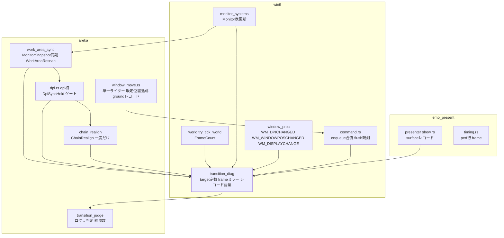
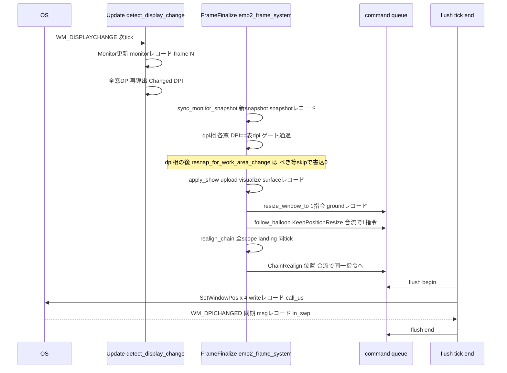
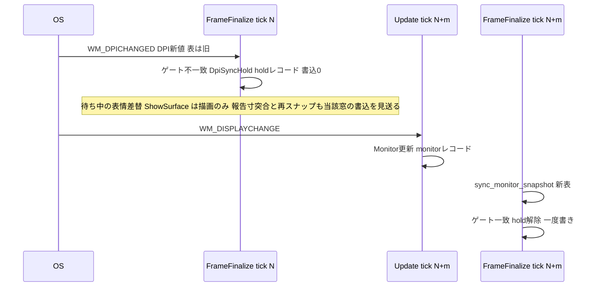
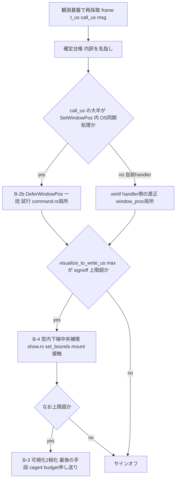

# Technical Design: areka-P0-dpi-transition-atomicity

- 作成日: 2026-08-15（設計生成・W6.75 単独）
- 入力: `requirements.md`（第 1 段再観測＝「残存」で確定済み）・`research.md`（ギャップ分析＋設計判断項目 16 件）・`reobservation-2026-08-15.md`・`brief.md`（棚卸⑨ブロック優先）
- 引用する `file:line` はすべて 2026-08-15 の現行ツリー（settled main 相当）で開いて確認した。
- 用語: 「決定論テスト」＝実機・GPU 無しで毎回同じ結果になる自動テスト。「一括 flush」＝フレーム末尾でキューに積まれた `SetWindowPos` をまとめて実行すること。「テスト間の状態汚染」＝フレーム番号・キュー・標識の残留が他テストの判定を変えること。

## Overview

**Purpose**: 拡大率（DPI）を切り替えたときにキャラとバルーンが跳ねずに新しい寸法・位置へ移り、遷移後の足元が新しい作業領域の下端に立ち、二体の隣接が保たれることを、目視ではなくログとテストで判定できる形で実現する。

**Users**: ゴーストを常駐させる利用者（見た目の品質）と、遷移の機序を判定・是正する開発者（観測基盤・確定台帳・回帰テスト）。

**Impact**: 第 1 段再観測（2026-08-15）で確定した事実——描画内容は 4 窓とも +13〜47ms に新寸で可視化されるが、窓矩形の書込は 1 tick 内の一括 flush の中で 1 枚ずつ 16〜78ms（初回が最も重い）かかり +63〜309ms まで旧矩形が残る／接地点は起動時の作業領域下端 1704 に固定され 192→96 で −48px 浮く／100% で二体の隙間が 359px 開く——に対して、⑴ フレーム番号つきの統合観測チャネル（恒久・既定 OFF）、⑵ 作業領域源 `MonitorSnapshot` の実行時同期＋作業領域変化を契機とする再スナップ、⑶ DPI 遷移後の連鎖再解決（一度だけ）、⑷ 同一 tick・同一窓のジオメトリ指令の合流（書込回数の下限化）、⑸ 遷移中の窓ごとの整合ゲート（一度書きの保証）を導入する。**逐次 `SetWindowPos` の内訳（1 回 16〜78ms が何に消えているか）は未特定**であり、その是正候補（OS 一括適用・窓内下端中央補償・可視化 2 相化）は観測基盤で内訳を名指ししてから選ぶ（後述「原子性の段階裁定」）。

### Goals

- 1 回の遷移に含まれる全窓書込・全サーフェス更新・モニタ表更新を**単一のフレーム番号系列**の 1 本の時系列に並べ、既定 OFF の専用 target で恒久提供する（Requirement 2）。
- 確定台帳を 2 証跡クラスで運用し、確定した機序だけを是正する（Requirement 3）。
- 遷移中の各キャラ窓の接地点を規約値に保ち、随伴バルーンを同一フレームで移し、有界のフレーム数・書込回数で完了する（Requirement 4）。
- 作業領域の変化に接地点が追随し、遷移と同時なら一度の窓書込で新寸・新下端へ移る（Requirement 5）。
- 一度きり確定（連鎖・キーワード基本位置）の寿命を裁定し、連鎖は遷移後に一度だけ解き直す（Requirement 6）。
- 上記を決定論テスト（x64・偽装境界）と有界の実機サインオフで検証する（Requirement 7・8）。

### Non-Goals

- 位置権威の正しさ（`dpi-window-vanish` R4）・合成コスト（`recompose-budget`）・描画負荷の SSP 同等圏（`draw-load-parity` W8）は扱わない。
- DPI の異なる別モニタへのドラッグ移動（`WM_DPICHANGED` 単独で届く遷移）は対象外。ただし本設計の変更で寸法追従を壊さない（10.7）。
- モニタ着脱・解像度変更・配置変更への全面追随、DPI 遷移を伴わない作業領域変化（タスクバー設定変更のみ）は必達対象ではない（設計が選ぶ機構が同じ経路で扱える範囲は妨げない）。
- `BalloonFollow.offset` の単位空間契約の実装（`areka-P0-balloon-offset-dpi`）。本設計は裁定だけを行う（6.5）。
- 合成アルゴリズム本体、SERIKO、GPU ドライバ差、ドラッグ中の追従。

## Boundary Commitments

### This Spec Owns

- **遷移観測チャネル**: wintf `ecs/window/transition_diag.rs`（専用 target 定数・フレーム番号のスレッド局所ミラー・レコード語彙の純関数）と、それを使う 3 crate（wintf・areka-emo-present・areka）の観測点。判定語の純関数固定テストと、ログ→判定の純関数 `transition_judge`。
- **一括 flush 経路の書込指令の合流と観測**: `crates/wintf/src/ecs/window/command.rs` の `SetWindowPosCommand`（要求語彙タグ）・`enqueue`（同一 hwnd ジオメトリ指令の合流）・`flush`（開始／終了／各書込のレコード）。Z のみの指令の適用順と結果は不変（10.3）。
- **作業領域源の実行時同期**: `MonitorSnapshot` を wintf の `Monitor` 表から作り直す areka 側の同期段（`emo2_boot/frame/work_area_sync.rs`）と、作業領域変化を契機とする再スナップ（新経路語 `WorkAreaResnap`）。`work_area.rs:17`「セッション内固定＝M1 受容」の撤回。
- **遷移中の整合ゲート**: 窓の DPI と帰属モニタの DPI 表が揃うまで当該窓の再導出を見送る `DpiSyncHold`（有界）。
- **一度きり確定の寿命**: DPI 遷移後の連鎖再解決 `ChainRealign`（`ChainFinalized` は起動時一度きりのまま保持し、別機構で解き直す）と既定位置 `default_char_pos` の追跡規則。キーワード基本位置は再導出しない（k 倍で済ませる＝`balloon-offset-dpi` が実装）。
- **確定台帳**（`mechanism-ledger.md`）と**サインオフ手順書**（`signoff-procedure.md`）。

### Out of Boundary

- OS 提案位置の採否判定（`window_pos.rs:372-374`）・可視性ガード・寸未確定時の現状維持＝`dpi-window-vanish` の規約。本設計は観測レコードを足すだけで判定を変えない。
- `presenter/show.rs` の予算域 :96-170（compose／resample／mask／insert）と定常アロケーション 0 の不変量＝`recompose-budget`。本設計が触るのは upload 直前の `chain.size()` 読取 1 行と :297 以降（upload 成功後・可視化後）の観測 2 行のみ（`chain.rs` 無改変）。**upload エラー分岐 :297-301 は移動しない**（`test-cage-determinism` ④の観測点）。
- `windowposition-limit` の表示位置補正（`window_move.rs:822`）とキーワード基本位置の一度きり再導出（`keyword_base.rs:59-163`）＝本設計は呼ばない・変えない。
- `scope-chain-gap` の起動時確定（`drain_resnap.rs:294-344`）＝`collect_chain_states` の可視性を広げて再利用するが判定・標識・停滞診断の意味は変えない。
- `BalloonFollow.offset` の単位空間と k 倍実装＝`areka-P0-balloon-offset-dpi`。
- 逐次 `SetWindowPos` の内訳が OS 側（DWM・同期メッセージ）にあると確定した場合の OS 挙動そのもの。

### Allowed Dependencies

- 依存方向: `wintf` ← `areka-emo-present` ← `areka`（`crates/areka-emo-present/Cargo.toml:17`・`crates/areka/Cargo.toml:19,51` で確認）。観測 target 定数・フレームミラー・共通レコード接頭語は wintf に置き、上位 2 crate が参照する。**wintf から areka／emo-present の語彙（scope・target_id）を参照しない**（wintf 側レコードは `&'static str` と数値だけを運ぶ）。
- 消費してよい着地物: `FrameCount`（`schedule_labels.rs:8`・u32）、`guarded_set_window_pos`／`is_self_initiated`（`command.rs:83,40`）、`Monitor` component（`monitor.rs:66-74`・bounds／work_area／dpi）、`MonitorSnapshot::from_monitors`（`work_area.rs:31`）、`project_anchor`（`anchor.rs:105`）、`resize_window_to`／`enqueue_window_set_pos`／`move_window_to`（`window_move.rs:158,514,42`）、`reproject_char_window_at_current_size`（`dpi.rs:335`）、`finalize_chain`／`ChainFinalizeStall`／`note_chain_deferral`（`chain_finalize.rs:99,159,249`）、`collect_chain_states`（`drain_resnap.rs:353`）、段階別計時 `FrameTiming`／`EmitContext`（`timing.rs:91-100,158`）、`PlacementRoute`（`diag.rs:162`）。
- 禁止: `MonitorSnapshot` の消費者（`resize_window_to`・ドラッグ・可視性ガード・limit 関門・永続復元）を wintf `Monitor` 直読へ変えること（C-2 却下）。dpi 相だけ別の作業領域源を持つこと（C-3 却下）。永続化経路（`persist.rs`）へ実行時 snapshot の変化を効かせること（5.7）。

### Revalidation Triggers

- `SetWindowPosCommand` の形（タグ追加・合流規則）と `flush` の観測レコード語彙が変わる → `ghost-window-zorder` の維持系（`zorder_pair_maintain.rs:187-207,475`）・`draw-load-parity`（W8・flush 経路）・`test-cage-determinism`・`emo2-conformance-e2e` が再確認。
- 観測チャネルのレコード語彙（`kind=`／`stage=`／フィールド名）が変わる → サインオフ手順書・`transition_judge`・後続 spec の判定が再確認。
- `MonitorSnapshot` が実行時に更新されるようになる（DD15 撤回）→ `MonitorSnapshot` の全消費者は「起動時値」前提を持たないことを確認済み（研究 §1.3）だが、`persist.rs` の復元判定は起動時 1 回のみ読む契約を維持する。
- `default_char_pos` の意味が「spawn 時の既定」から「システム由来の再アンカーで追随する既定」へ変わる → `scope-chain-gap` の R7.3 記述と `finalize_chain` の利用者が再確認。
- perf 行に `frame=` が追加される → `tools/perf/judge-perf.py` は `名前=値` 辞書化＋必須フィールド存在チェックのみ（研究 §2 で確認）ゆえ互換だが、DoD で `--selftest` を回す。
- 原子性の段階裁定（後述）で B-2b／B-4／B-3 のいずれかを採る → 採用時に本設計へ追記し、`recompose-budget`（B-3）・`collision-dpi-hittest`（B-4）へ申し送る。

## Architecture

### Existing Architecture Analysis

第 1 段再観測で確定した遷移 1 回の流れ（現行・機序の断定は含まない）:

| # | 事実 | 出所（現行ツリー） |
|---|---|---|
| 1 | `WM_DISPLAYCHANGE` → `App::mark_display_change` → 次 tick の `Update` で `detect_display_change_system` がモニタ表を更新し、同一 system で全窓の DPI を再導出（`Changed<DPI>`） | `lifecycle.rs:122-138`・`app.rs:20-23`・`world/mod.rs:213`・`monitor_systems.rs:195-239,253-381,438-480` |
| 2 | 同 tick の `FrameFinalize` で `emo2_frame_system` が dpi 相を回し、`Changed<DPI>` の全窓を 1 回の排他 system で処理（サーフェス寸変更 → 可視化 → 窓書込 enqueue）＝**全窓の enqueue は同一 tick 内** | `frame.rs:155,168`・`dpi.rs:232,242-252,287-301`・`show.rs:297,306,322,328` |
| 3 | 窓書込は thread_local キューに積まれ、World 借用解放後の `tick_one_frame` 末尾で enqueue 順に `SetWindowPos` される | `command.rs:127-130,155-167,173-206`・`tick_bridge.rs:181-202` |
| 4 | 【静的構造証跡】全窓の `Changed<DPI>` は 1 回の排他 system（`emo2_frame_system`）で処理され enqueue は同一 tick 内（事実 2・3）。【実機・時刻列】6 回の `SetWindowPos`（キャラ 1×2・バルーン 2×2）が 1 枚ずつ 16〜78ms（初回最重）を要し、各窓の最初の書込の内側で当該窓の `WM_DPICHANGED` が同期処理される（24/24）。経路 A の書込は 0/24。**「6 回が同一 tick 内」はフレーム番号未採取ゆえ構造からの推定であり、実機確定は実装フェーズ 2 の再採取で行う** | 事実 2・3／`reobservation-2026-08-15.md` §3.1・§5 |
| 5 | フレーム番号はどのログにも無い。flush 点は World 借用外ゆえ `FrameCount` を直接読めない | 研究 §1.2 |
| 6 | `MonitorSnapshot` は起動時 1 回構築・以後不変。作業領域変化を契機とする再スナップ経路は無い（`Resnap` 0 件） | `main.rs:530-538,569,573-574,611`・`work_area.rs:12-24` |
| 7 | 連鎖確定は一度きり（`ChainFinalized`）。既定位置は spawn 時値で、DPI 再射影の中央保存で X が動くと全スコープが「明示再配置」扱いになる | `drain_resnap.rs:299-301,333,370`・`chain_finalize.rs:108`・`spawn.rs:266,514` |
| 8 | 同一 hwnd への 2 指令（バルーン: 寸→位置）は合流されず 2 回書かれる | `command.rs:164-166`・再観測 §3.2 |

### Architecture Pattern & Boundary Map



**Architecture Integration**:
- 選択パターン: **観測チャネルの単一化＋既存機構の拡張（研究 Option C の段階実装）**。新規の tick 構造（遷移バリア・2 相コミット）は導入しない。
- 境界: wintf は「窓書込・メッセージ・モニタ表・フレーム番号」の事実だけを記録し、areka の語彙（scope・種別・route）は `&'static str`／数値のタグとして受け取る。emo-present は表示成立点（サーフェス寸）を記録する。判定（遷移の切り出し・不整合フレーム・回数・接地点差）は areka の純関数が担う。
- 保存する既存パターン: 専用 target・既定 OFF・純関数レコード（`placement::diag`）／`*_with(source, world)` の依存注入（`resnap_with`・`finalize_chain_once_with`）／単一ライター `enqueue_window_set_pos`／段階別計時 `FrameTiming`／偽装境界（`MonitorSnapshot` 注入・`FakeReports`・`FakeSizes`）。
- 新規要素の理由: `transition_diag`（フレーム番号を World 外へ運ぶ唯一の口）、`work_area_sync`（作業領域源の更新主体）、`DpiSyncHold`（一度書きの保証）、`chain_realign`（DPI 遷移後の連鎖）、合流（回数の下限化）、`transition_judge`（機械判定の単一実装）。
- Steering 準拠: `tracing` 構造化ログ・既定 OFF（`logging.md`）、テストは兄弟ファイル `<stem>_<module>.rs`（`structure.md`）、`thiserror`、依存方向 wintf←areka。

**キー決定（D 番号は研究 §7 の設計判断項目番号に対応）**:

- **D1 フレーム番号の配管＝World 資源を正、スレッド局所ミラーは World 外専用**（設計討議 A-1 で改訂）。`try_tick_world` が `FrameCount` を +1 する点（`world/mod.rs:503-505`）で、同時に Resource `TickStart(Instant)` を更新し、`transition_diag::begin_tick(frame, start)` で**スレッド局所ミラー**にも同じ値を写す。**World を持つ観測点（`monitor_systems`・`emo2_frame_system`・presenter・areka 側レコード）は `Res<FrameCount>`＋`Res<TickStart>` から `Stamp` を組む**——`Update` の `detect_display_change_system`（`monitor_systems.rs:195`）は既定の多スレッド実行器（`world/mod.rs:102`）でワーカースレッドに載り得るため、スレッド局所ミラーは読めない。**ミラーを読むのは World を借りられない点だけ**＝flush（`tick_bridge.rs:200` は借用解放後）と wndproc の同期経路（いずれも UI スレッド・tick 外は「直近 tick の番号」）。両者は同一点で同一値に更新されるので 1 系列が保たれる。コマンドへの焼き込み（i）は不要（enqueue と flush は同一 tick）。プロセス大域 atomic は 7.7（テスト間の状態汚染なし）と衝突するため採らない。
- **D2 観測 target＝単一定数を wintf に置く**: `TRANSITION_TARGET = "wintf::transition"`。3 crate が同じ文字列で emit し、`RUST_LOG` の directive は 1 語（`wintf::transition=debug`）。既定 OFF（`RUST_LOG=info` では無音）。
- **D3 書込レコードの一本化＝コマンドに要求語彙タグを載せる**: `SetWindowPosCommand.tag: WriteTag { origin: &'static str, scope: Option<u32>, kind: &'static str }`。flush 側の 1 行で「フレーム・窓（scope・種別）・矩形・同期／flush・経路語彙・所要 µs」が揃い、2 段 grep を要しない。`[diag.window_move]`（`diag.rs:355-374`）は変更しない。
- **D4 サーフェス記録点＝`show.rs`**（frame と target が揃う）。`resized` は **upload の直前に `let prev = chain.size();` を読み、:306 の `size` と比べて `size != prev` で得る**（設計討議 A-3 で改訂）。`chain.upload` の戻り値型も `chain.rs` も変えず、:297-301 の `if let Err(e) = chain.upload(...)` は**字面どおり不動**（旧案 `UploadOutcome` は `Ok` の中身を受け取るために :297 の字面を変えざるを得ず両立しなかった）。
- **D5 作業領域源の更新主体＝C-1（`MonitorSnapshot` を `Monitor` 表から作り直す）**。置き場は 2 点に分ける（設計討議 A-4 で改訂）: **資源の差替（`sync`）は `emo2_frame_system` の先頭（`run_dpi_phase` の前・同一 World 借用）**——同一 tick 内で dpi 相が新 snapshot を読むため、経路 (b) 由来の遷移は追加書込なしで新下端へ着地する。**変化契機の再射影（`WorkAreaResnap`）は dpi 相の後**——`Changed<DPI>` の窓は dpi 相が新 snapshot で 1 本書き終えているので べき等 skip で 0、DPI が変わらず作業領域だけ変わった窓だけが現寸で再射影される。旧案（再射影も先頭）は経路 (b) で同一窓に 2 度の enqueue（旧寸・新下端 → 新寸）を積み、`[diag.window_move]`／`ground` レコードが 2 件ずつ出て bypass ミラーに中間値が載るため退けた（SetWindowPos は合流で 1 回だったが記録が濁る）。変化フレームだけ再構築し、無変化は無操作。`work_area.rs:17` と `main.rs:569` の「セッション内固定」記述を撤回する。
- **D6 tick 跨ぎ分裂＝A-1（バリアを置かない）＋窓ごとの整合ゲート**。実測は全窓同一 tick（事実 2）。A-2（遷移バリア）は tick 構造への介入ゆえ却下、A-3（`WM_DPICHANGED` の反映を tick 冒頭へ寄せる）は `dpi-window-vanish` の受理契約を変える上に (a)-先行の問題を解かないため却下。
- **D7 1 tick 内の DWM 境界＝段階裁定**。合流（B-2a）は本設計で確定。OS 一括適用 `DeferWindowPos`（B-2b）・窓内下端中央補償（B-4）・可視化 2 相化（B-3）は観測基盤で内訳を名指ししてから選ぶ（「原子性の段階裁定」節）。
- **D8 連鎖は DPI 遷移後に解き直す（6.1 の裁定＝⑴）。`ChainFinalized` は解除しない**。理由: 実測で 100% の隙間が 359px（再観測 §7・幅変化の半分の和）と製品品質を損なう量であり、`scope-chain-gap` R7.4「確定後のサーフェス切替では再解決しない」は会話中の表情差替を守るための規定で DPI 遷移は想定外（brief 追記(63)）。起動時一度きりの意味を保ったまま、DPI 遷移後の解き直しを別機構 `ChainRealign` が担う。「遷移完了」＝全スコープが landing（既存条件）**かつ** どの窓も `DpiSyncHold` 中でない。停滞診断は `ChainFinalizeStall` を武装時に初期化して再利用する（6.3）。
- **D9／D16 既定位置の追跡規則**: `enqueue_window_set_pos` で、対象がキャラ窓であり route がシステム由来（`AnchorChange`・`Resnap`・`DpiReproject`・`ReportedSizeReconcile`・`WorkAreaResnap`・`ChainRealign`）**かつ書込前の現在位置が既定位置と一致していた**場合のみ既定位置を書込先へ追随させる。明示操作（`MoveCue`・`Restore`・ドラッグ・`BalloonLimitRelease`）では追随しない。既定位置 `None`（保存位置の復元）は `None` のまま。
- **D10 キーワード基本位置＝再導出しない**。DPI 遷移では `BalloonFollow.offset` を k 倍で追随させる（`balloon-offset-dpi` が実装）。理由: キーワード式 `(char_w−balloon_w)/2` は両寸が同じ k で伸びれば k 倍と ≤1px（`scale-exact-rational` の +1 許容）で一致し、再導出は素材保持と 2 度目の書込を要し原子性を損なう。両者は排他であり、本裁定を bod が従う（6.5）。
- **D11 flush 検査口＝`drain_window_pos_commands()`（実行せずに取り出す公開関数）＋合流の純関数**。決定論テストはキューの中身で回数・順序・合流を検証し、実 `SetWindowPos` は呼ばない。
- **D12 perf 行へ `frame=` を末尾追加し、`judge-perf.py --selftest` の互換確認を DoD に含める**。
- **D13 4.5 の回数＝キャラ 1・バルーン 1・経路 A 0**（合流後）。回帰テストはこの値を固定する。
- **D14 `FrameCount` の周回**: 判定は `wrapping_sub` の差分のみ。絶対値比較を判定語に使わない。
- **D15 5.8 一度書き＝D5 の配置（dpi 相より前・同一 tick）で経路 (b) を保証し、経路 (a) が先行する場合は `DpiSyncHold` で当該窓の**すべての窓書込**を見送って一度書きに保つ**（設計討議 議題 1 で範囲を確定・有界 `DPI_SYNC_HOLD_MAX_FRAMES = 30`・超過時は warn の上で現 snapshot で進める）。待ち札は dpi 相だけでなく、報告寸の突合 `reconcile_reported_sizes`（`frame.rs:187`）と再スナップ `resnap_shell_targets`（`frame.rs:195`）でも当該窓の窓書込を見送る——待ち中に drain 相の `ShowSurface`（会話中の表情差替・SERIKO）が新 k で描画しても、窓を書くのは表が揃ってからにする。**描画そのものは止めない**（発話・アニメは遅らせない）。理由: Windows は `WM_DPICHANGED` と `WM_DISPLAYCHANGE` の順序を保証せず（実測は 6/6 が表更新先行だが）、dpi 相だけの防御では表情差替経路から 2 段書込がすり抜け、設計の「保証」とテストの範囲が食い違うため。

### Technology Stack

| Layer | Choice / Version | Role in Feature | Notes |
|---|---|---|---|
| Runtime / ECS | bevy_ecs 0.18・wintf 13 スケジュール tick | `FrameCount`（u32）を単一権威に、`Update`（モニタ表更新）→`FrameFinalize`（emo2 frame）→ flush の順序を利用 | 新スケジュール追加なし |
| Logging | tracing（専用 target・debug 水準） | 観測チャネル `wintf::transition`・既定 OFF | `RUST_LOG=wintf::transition=debug` |
| Win32 | `SetWindowPos`（現行）／`BeginDeferWindowPos` 群（候補 B-2b・段階裁定） | 一括 flush の実行 | B-2b は「同一 parent（top-level は NULL）」「per-window flags・hwndInsertAfter」「EndDeferWindowPos が WM_WINDOWPOSCHANGING/CHANGED を各窓へ送る」まで文書化済み。原子性の保証は無い（研究 §8） |
| Graphics | DXGI swap chain `Present`（現行） | サーフェス寸変更の記録点 | 窓矩形と同一 DWM フレームへ揃える API は文書化されていない（研究 §8） |
| Test | cargo test（x64・偽装境界・`SingleThreaded`） | 決定論テスト | `cargo test -p areka` に `--bins` を付けない |

## File Structure Plan

### Directory Structure

```
crates/wintf/src/ecs/window/
├── transition_diag.rs                 # NEW: target定数・frameミラー・tick/flush epoch・WriteTag・レコード純関数（monitor/write/flush/msg/enqueue）
├── transition_diag_tests.rs           # NEW: 語彙固定（正例/負例）・ミラー初期化
├── command.rs                         # MOD: SetWindowPosCommand.tag／enqueue合流／flush観測／drain_window_pos_commands
├── command_coalesce_tests.rs          # NEW: 合流の純関数テスト（Z専用は不合流・順序保存・フラグ非対称）
crates/areka-emo-present/src/
├── presenter/show.rs                  # MOD: upload 直前に prev=chain.size()／成功後・可視化後に surface レコード（:297-301 不動・chain.rs 無改変）
├── presenter/refresh.rs               # MOD: 見送り（k不変・不可視）に surface stage=skipped
├── presenter/timing.rs                # MOD: EmitContext.frame・perf行末尾に frame=
├── presenter/transition_record.rs     # NEW: surface レコード純関数（target_id・stage・寸）
├── presenter/transition_record_tests.rs  # NEW
crates/areka/src/placement/
├── transition_diag.rs                 # NEW: areka側レコード純関数（snapshot/hold/ground/chain）
├── transition_diag_tests.rs           # NEW
├── transition_judge.rs                # NEW: 行パーサ・遷移切り出し・判定量・合否（純関数・I/O無し）
├── transition_judge_tests.rs          # NEW: 再観測ログ整形の正例／判定語破壊の負例／周回差分
├── transition_signoff_tests.rs        # NEW: #[ignore] 実機ログ判定ランナー（AREKA_TRANSITION_LOG）
├── dpi_sync.rs                        # NEW: DpiSyncHold component・純関数 dpi_sync_decision・MAX_FRAMES
├── dpi_sync_tests.rs                  # NEW
├── diag.rs                            # MOD: PlacementRoute に WorkAreaResnap・ChainRealign（ALL 12）
├── follow/work_area.rs                # MOD: MonitorDpiTable・order非依存比較・DD15撤回doc
├── follow/window_move.rs              # MOD: enqueue_window_set_pos のタグ／既定位置追跡／ground レコード／move_window_with_route
├── follow_default_pos_tests.rs        # NEW（facade follow.rs に接続・既存 follow_*_tests.rs と同形）
crates/areka/src/emo2_boot/frame/
├── work_area_sync.rs                  # NEW: sync_monitor_snapshot_with／resnap_for_work_area_change
├── chain_realign.rs                   # NEW: ChainRealignPending・arm・realign_chain_once_with
├── dpi.rs                             # MOD: DpiSyncHold ゲート・武装トリガ・reproject の route 引数
├── drain_resnap.rs                    # MOD: collect_chain_states を pub(super)・hold条件
crates/areka/src/emo2_boot/
├── frame.rs                           # MOD: 先頭に sync／末尾に realign の呼出
├── frame_test_support.rs              # MOD: 多フレーム駆動ハーネス（advance_frame・snapshot/dpi表注入・キュー drain）
├── frame_work_area_sync_tests.rs      # NEW
├── frame_dpi_sync_hold_tests.rs       # NEW
├── frame_chain_realign_tests.rs       # NEW
crates/areka/src/main.rs               # MOD: 起動時に MonitorDpiTable も挿入・:569 注記の撤回
.kiro/specs/areka-P0-dpi-transition-atomicity/
├── mechanism-ledger.md                # NEW: 確定台帳（2 証跡クラス）
├── signoff-procedure.md               # NEW: サインオフ手順書
```

### Modified Files

| ファイル | 変更内容 | 所有権メモ |
|---|---|---|
| `crates/wintf/src/ecs/world/mod.rs` | `try_tick_world` の `FrameCount` 増分直後（:503-505）で Resource `TickStart` を更新し `transition_diag::begin_tick(frame, start)`（ミラーへ写す）。World 構築時（:76-77 の `FrameTime` 挿入と同所）に `TickStart` を初期挿入 | tick 構造は変えない（13 スケジュール順不変） |
| `crates/wintf/src/ecs/window/mod.rs` | `pub mod transition_diag;` 再輸出 | — |
| `crates/wintf/src/ecs/window/command.rs` | `tag` フィールド＋`with_tag`／`enqueue` の合流／`flush` の begin・write・end レコード／`drain_window_pos_commands` | `new()` の 7 引数は不変。Z 専用指令は合流対象外 |
| `crates/wintf/src/ecs/window/zorder_pair_maintain.rs` | `pair_fix_command`（:187-207）にタグ `origin="zorder-pair"` | zorder の判定・順序不変 |
| `crates/wintf/src/ecs/graphics/systems/window_pos.rs` | enqueue（:89-98）にタグ `origin="window-pos"` | — |
| `crates/wintf/src/ecs/window_proc/window_pos.rs` | `WM_DPICHANGED`（:303）と `WM_WINDOWPOSCHANGED`（:36）に `msg` レコード／採用時の同期書込（:420-430）に `write stage=sync` レコード | 採否判定（:372-374）不変（`dpi-window-vanish`） |
| `crates/wintf/src/ecs/window_proc/lifecycle.rs` | `WM_DISPLAYCHANGE`（:122）に `msg` レコード | 戻り値 `None` 不変 |
| `crates/wintf/src/ecs/layout/systems/monitor_systems.rs` | 値変化更新（:280-316）の直後に `monitor` レコード | 既存 debug 行と `redrive` は不変 |
| `crates/areka-emo-present/src/presenter/show.rs` | upload 直前に `prev = chain.size()`／:302 以降に `surface stage=upload`（`resized = size != prev`）／:328 以降に `surface stage=visualize`（`size_changed \|\| resized` のときのみ・`tracing::enabled!` で守る） | 予算域 :96-170 と :297-301 は不動。`chain.rs` 無改変 |
| `crates/areka-emo-present/src/presenter/refresh.rs` | :70-73（k 不変）・:74-77（不可視）で `surface stage=skipped reason=` | 見送り判定は不変 |
| `crates/areka-emo-present/src/presenter/timing.rs` | `EmitContext.frame: u32`・perf 行末尾に `frame=` | 既存フィールド順・文言不変 |
| `crates/areka/src/placement/diag.rs` | `PlacementRoute::WorkAreaResnap`／`ChainRealign` 追加・`ALL` 12 | 1 語＝1 実在トリガ（D13）維持 |
| `crates/areka/src/placement/follow/work_area.rs` | `MonitorDpiTable`／`dpi_for_point`／`same_monitors`（順序非依存比較）／doc :12-19 の DD15 撤回 | `MonitorSnapshot` の型と 51 箇所の構築リテラルは不変 |
| `crates/areka/src/placement/follow/window_move.rs` | `enqueue_window_set_pos`（:514-611）: タグ付与・既定位置追跡・キャラ Bottom の `ground` レコード／`move_window_with_route` 追加（`move_window_to` は委譲で不変） | 単一ライター維持。limit 関門（:549,:822）・手順 5a（:342）不変 |
| `crates/areka/src/emo2_boot/frame.rs` | :168 の前に `sync_monitor_snapshot`、:168 の直後に `resnap_for_work_area_change`、:187 `reconcile_reported_sizes` で `DpiSyncHold` の窓を見送り（`hold site=reconcile`）、:199 の後に `realign_chain_once` | 既存 4 段の順序不変 |
| `crates/areka/src/emo2_boot/frame/dpi.rs` | `dpi_phase_with`（:232）に hold ゲート・武装トリガ、`reproject_char_window_at_current_size`（:335）に route 引数 | `reconcile_window_size`（:124）不変 |
| `crates/areka/src/emo2_boot/frame/drain_resnap.rs` | `collect_chain_states`（:353）を `pub(super)`・`ChainDeferReason::DpiSyncHold`・`resnap_with` で `DpiSyncHold` の窓を見送り（`hold site=resnap`） | `finalize_chain_once_with` の一度きり不変 |
| `crates/areka/src/placement/chain_finalize.rs` | `ChainFinalizeStall::reset()`・`ChainDeferReason` 1 変種 | `finalize_chain` 不変 |
| `crates/areka/src/main.rs` | `boot_monitor_snapshot`（:530-538）が `MonitorDpiTable` も返し :611 で挿入／:569 注記撤回 | 復元判定シーム不変 |
| `tools/perf/judge-perf.py` | 変更なし（`--selftest` で互換確認のみ） | budget 所有 |

> 本表は Requirement 10 の突合台帳である。実装が `git diff --name-only <分岐点>...HEAD -- crates/` と一致していなければならない。ファイルを 1 つでも触ったら同時に行を足すこと。

## System Flows

### 遷移 1 回（経路 (b)＝モニタ表更新が先・全窓可視）



- ゲート条件（D15）: 窓の `DPI` と `MonitorDpiTable` で窓中心が属するモニタの dpi が一致するとき通過。不一致なら `DpiSyncHold { since_frame }` を付けて見送り（`hold` レコード）。次 tick 以降、一致すれば解除して処理、`DPI_SYNC_HOLD_MAX_FRAMES` 超過なら warn の上で処理。
- 連鎖再解決の武装: dpi 相でキャラ窓の `DpiReproject` 書込が**寸変化を伴って**発生したとき（k 変化）。`ChainFinalized` が無い（起動時確定前）ときは武装しない（起動時一度きりが引き受ける）。
- 合流: 同一 tick・同一 hwnd のジオメトリ指令は先着の枠へ畳まれ、flush は窓ごと 1 回。

### 経路 (a) が先行する場合（`WM_DPICHANGED` が先・観測上は未確認）



### 原子性の段階裁定（Requirement 3 → 4）



- 判定条件は台帳の数量で書く: Q1＝`Σcall_us` と `msg` レコードの位置（`write` の内側か）／Q2・Q3＝**`visualize_to_write_us` の窓ごとの最大値が `Bounds::signoff` の上限を超えるか**（C7 の実機専用量。「目視」は併記であって分岐条件そのものではない）。「合成コスト」帰着（perf 行）なら 3.5 に従い引受先へ申し送る（現状 30〜40ms・帰着せず）。
- 各候補の接触集合と申し送り先は「Components」節 C8 に列挙する。採用したら本設計へ追記し `Revalidation Triggers` を発火する。

## Requirements Traceability

| Requirement | Summary | Components | Interfaces / Flows |
|---|---|---|---|
| 1.1 | 採取条件の記録 | 実施済み（`reobservation-2026-08-15.md` §1）→ C9 へ転記 | — |
| 1.2 | セッション②同形・各方向 3 回以上 | 実施済み（同 §2） | — |
| 1.3 | 窓ごとの回数・順序・遅れ（時刻近似） | 実施済み（同 §3）。フレーム番号による確定は C1〜C3 着地後の再採取（C9） | — |
| 1.4 | 跳ね残存の判定 | 実施済み（同 §4） | — |
| 1.5 | 帰着（遷移経路） | 実施済み（同 §5） | — |
| 1.6 | 接地点差の数値 | 実施済み（同 §6・−48px） | — |
| 1.7 | 未特定の明記 | 実施済み（同 §8）→ C9 の L7・L8 | — |
| 2.1 | 窓書込レコード | C1 transition_diag・C2 command flush／window_pos sync | `write` レコード（frame・scope・kind・rect・stage・origin・call_us） |
| 2.2 | サーフェス寸レコード | C3 emo-present transition_record・show.rs | `surface` レコード（stage=upload／visualize／skipped） |
| 2.3 | モニタ表レコード | C1・monitor_systems | `monitor` レコード（frame・old/new dpi・work_area） |
| 2.4 | 単一フレーム系列で結合・不整合フレーム導出 | C1（ミラー）・C7 transition_judge | `judge_transition_log` |
| 2.5 | 既定 OFF・専用 target | C1 `TRANSITION_TARGET` | 実濾過テスト（既定 OFF・directive で ON） |
| 2.6 | 恒久観測 | C1〜C3・C4 | 削除しない・後続 spec が再利用 |
| 2.7 | 判定語の純関数固定 | C1・C3・C4 のレコード純関数＋C7 パーサ | 正例／負例テスト |
| 2.8 | perf 行と同一フレームで突合 | timing.rs `frame=` | D12 |
| 3.1 | 中間フレームの名指し（or 未特定） | C9 mechanism-ledger・C7 `mismatch_frames_per_window`・`t_us` 参考値 | 再採取 |
| 3.2 | 所要＝フレーム数と窓ごとの回数（実時間は参考） | C7 `frames_to_last_write`／`writes_per_window`／`wall` | — |
| 3.3 | 2 証跡クラスで登記 | C9 様式（実機／静的構造） | — |
| 3.4 | 確定項目以外を変更しない | C9＋File Structure Plan の突合台帳 | — |
| 3.5 | 合成コスト帰着時の申し送り | C9 | 引受先＝`.kiro/specs/` 直下 brief 実在確認 |
| 4.1 | 接地点を規約値に保つ | C5 dpi_sync（hold）・C6 work_area_sync・`resize_window_to` | `ground` レコード・hold |
| 4.2 | 食い違い可視フレームを提示しない | C8 段階裁定（B-2a 確定・B-2b/B-4/B-3 段階）・C7 判定 | 段階裁定フロー・サインオフ目視 |
| 4.3 | 随伴バルーン同一フレーム | 既存 `follow_balloon`（同一 dpi 相）＋合流 | 判定: バルーン write frame == キャラ write frame |
| 4.4 | 有界フレーム数 | C7 `TRANSITION_FRAME_BOUND = 0`（hold 中窓は `+DPI_SYNC_HOLD_MAX_FRAMES`） | 決定論テスト |
| 4.5 | 窓ごとの書込回数 | C2 合流・C7 `WRITES_PER_WINDOW_MAX = 1`・経路 A 0 | 決定論テスト |
| 4.6 | 再導出不能窓は現状維持 | 既存 `refresh_scale` の見送り＋`surface stage=skipped` で判定から除外 | — |
| 4.7 | 定常フレームで churn なし | C6（変化フレームのみ再構築）・べき等 skip・C4 realign の disarm | 決定論テスト（定常 N フレームで書込 0） |
| 5.1 | 作業領域変化で接地点再導出 | C6 work_area_sync（`WorkAreaResnap`） | `sync_monitor_snapshot_with` |
| 5.2 | 随伴バルーン | 既存 `follow_balloon` | — |
| 5.3 | 差 0 を観測出力 | `ground` レコード（ground_y・wa_bottom・diff） | C7 判定 |
| 5.4 | 変化なしなら書込 0 | C6 順序非依存比較・べき等 skip | 決定論テスト |
| 5.5 | 解決不能時は現状維持＋warn | C6（`Monitor` 0 台・帰属なし） | `warn!` |
| 5.6 | 位置権威不変・是正主体＝snapshot 更新 | D5 | — |
| 5.7 | 保存位置の追従なし | Allowed Dependencies 禁止項 | `persist.rs` 無改変 |
| 5.8 | 一度書き | D5 配置＋C5 hold（D15） | 経路 (a)/(b) 両順序の決定論テスト |
| 6.1 | 連鎖寿命の裁定＝解き直す | D8・C4 chain_realign | — |
| 6.2 | 中間フレームで解かない・一度だけ・明示再配置除外・既定位置追跡 | C4（landing＋hold なし）・D9/D16（`window_move.rs`） | 決定論テスト |
| 6.3 | 停滞診断の初期化 | C4 arm 時 `ChainFinalizeStall::reset()` | 2 度目の待ちで warn 一度 |
| 6.4 | （解き直さない分岐）該当なし | — | — |
| 6.5 | キーワード基本位置＝再導出しない（k 倍） | D10 | bod へ通知 |
| 6.6 | 一度だけ／表情差替で解かない | C4 テスト | 決定論テスト |
| 7.1 | 決定論的な量 | C7・テスト戦略 | 回数・フレーム・順序・接地点 |
| 7.2 | 120／192・複数モニタ注入 | ハーネス（`s2_snapshot`・`MonitorDpiTable` 注入） | — |
| 7.3 | 是正前失敗・是正後通過 | 各是正の対テスト | — |
| 7.4 | 判定語の正例／負例 | C7 テスト（再観測ログ整形の正例・破壊入力の負例） | — |
| 7.5 | x64 のみ | — | — |
| 7.6 | 捕捉できない実行形態で「発生しない」を主張しない | wintf 側は `SingleThreaded` 明示・排他 system は呼出スレッド | — |
| 7.7 | 状態汚染なし | `transition_diag::reset_for_test`・`drain_window_pos_commands`・World 単位 `FrameCount` | ハーネス冒頭で初期化 |
| 8.1 | 起動コマンド・target・水準・自動終了・grep 語 | C10 signoff-procedure | — |
| 8.2 | 充足＝遷移回数（各方向 3 回以上） | C10・C7 `split_transitions` で起点を数える | — |
| 8.3 | 4・5 の機械判定 | C7 `#[ignore]` ランナー | Report |
| 8.4 | 目視所見の併記・食い違いは不合格 | C10 | — |
| 8.5 | 消灯の観測点を「0 回」の根拠にしない | C10 点灯表 | — |
| 9.1 | 縮退／残存の判定 | 要件で確定（残存） | — |
| 9.2 | （縮退分岐）該当なし | — | — |
| 9.3 | 3 関心の単一継続 | 設計は (b) を tick 構造の大改造にしない（D6・D7・C8）。B-3 採用が要るときは設計討議で分割を再裁定 | — |
| 9.4 | 語彙の完全保持 | `PlacementRoute` 12 語・`kind`／`stage` 語彙の定数化 | — |
| 10.1 | 原点・追従基準・k 権威不変 | 変更なし（B-4 採用時のみ再確認） | — |
| 10.2 | 位置権威不変 | 変更なし | — |
| 10.3 | Z 指令の順序・結果不変 | C2 合流規則（Z 専用は不合流） | テスト |
| 10.4 | アロケーション 0・perf 行維持 | show.rs 観測は size 変化時のみ＋`enabled!` 守り・perf 行末尾追加のみ | 既存テスト維持 |
| 10.5 | wpl／scg の一度きり不変 | 触らない（R6 範囲外） | — |
| 10.6 | ドラッグ追従・定常書込 0 | 合流は終状態不変・C6 変化時のみ | — |
| 10.7 | 別モニタドラッグの寸法追従 | hold は表 dpi 一致で即通過（移動先モニタの dpi は表に既在） | 決定論テスト |

## Components and Interfaces

| Component | Domain/Layer | Intent | Req | Key Dependencies (P0/P1) | Contracts |
|---|---|---|---|---|---|
| C1 `transition_diag`（wintf） | 観測 | target・frame ミラー・レコード語彙 | 2.1–2.7 | `FrameCount`（P0） | Service, Event |
| C2 `command.rs` 合流＋flush 観測（wintf） | 窓書込 | タグ・合流・書込レコード・drain | 2.1, 4.5, 10.3 | C1（P0）・zorder 維持系（P1） | Service, Event |
| C3 `transition_record`（emo-present） | 表示 | サーフェス寸レコード | 2.2, 2.8 | C1（P0）・show.rs（P0） | Event |
| C4 `chain_realign`（areka） | 配置 | DPI 遷移後の連鎖一度だけ | 6.1–6.3, 6.6 | `collect_chain_states`・`finalize_chain`（P0）・C5（P0） | State, Batch |
| C5 `dpi_sync`（areka） | 配置 | 窓ごとの整合ゲート（dpi 相・報告寸突合・再スナップの全窓書込点） | 4.1, 5.8, 10.7 | `MonitorDpiTable`（P0） | State |
| C6 `work_area_sync`（areka） | 配置 | snapshot 同期＋WorkAreaResnap | 5.1–5.5, 4.7 | `Monitor`（P0）・`reproject_char_window_at_current_size`（P0） | Batch |
| C7 `transition_judge`（areka） | 判定 | ログ→遷移→判定量→合否 | 2.4, 2.7, 4.4, 4.5, 7.x, 8.3 | C1/C3 語彙（P0） | Service |
| C8 原子性の段階裁定 | 配置／表示 | B-2a 確定・B-2b/B-4/B-3 段階 | 4.2, 3.4 | 台帳（P0） | — |
| C9 確定台帳 | 文書 | 2 証跡クラス | 3.1–3.5 | — | — |
| C10 サインオフ手順書 | 文書 | 有界実機手順 | 8.1–8.5 | C7 ランナー | — |

### 観測基盤（wintf）

#### C1 `transition_diag`

| Field | Detail |
|---|---|
| Intent | フレーム番号を World 外へ運び、遷移観測の語彙を 1 箇所に固定する |
| Requirements | 2.1, 2.3, 2.4, 2.5, 2.6, 2.7 |

**Responsibilities & Constraints**
- 単一 target `TRANSITION_TARGET`、単一のフレーム系列（`FrameCount` のミラー）、tick 開始／flush 開始の時刻基準、全レコードの共通接頭語 `[transition] frame=<u32> t_us=<u64> kind=<k>`。
- 純データ・World 非依存。レコードは純関数が組み、ログはそれを出すだけ（`placement::diag` の流儀・欠損は番兵 `-` でフィールドを落とさない）。
- 「tick 外」で読まれた番号は直近 tick の番号（wndproc の同期経路）。

**Dependencies**
- Inbound: `try_tick_world`（`begin_tick`）、C2、window_proc、monitor_systems、C3、C4〜C6 — レコード発行（P0）
- External: `tracing`（P0）

**Contracts**: Service [x] / Event [x]

##### Service Interface
```rust
pub const TRANSITION_TARGET: &str = "wintf::transition";
#[derive(Resource, Clone, Copy)] pub struct TickStart(pub Instant);   // FrameCount と同じ点で更新される tick 開始時刻（World 資源）
pub fn begin_tick(frame: u32, start: Instant);   // try_tick_world が FrameCount 増分・TickStart 更新の直後に呼び、スレッド局所ミラーへ写す
pub fn current_frame() -> u32;            // 直近 tick の番号（World 外＝flush・wndproc 専用）
pub fn since_tick_start_us() -> u64;      // 同上
pub fn stamp_from_world(frame: &FrameCount, start: &TickStart) -> Stamp;   // World を持つ観測点はこちら（ワーカースレッドでも正しい）
pub fn begin_flush() -> FlushEpoch;       // flush 開始時刻（RAII・終了で解除）
pub fn since_flush_us() -> Option<u64>;   // flush 外は None（レコードでは "-"）
#[doc(hidden)] pub fn reset_for_test();   // ミラーと時刻基準を初期化（テスト冒頭）

#[derive(Clone, Copy, Debug, PartialEq, Eq)]
pub struct WriteTag { pub origin: &'static str, pub scope: Option<u32>, pub kind: &'static str }
impl WriteTag { pub const UNTAGGED: WriteTag; }

/// 全レコード共通の刻印。発行点は `stamp()` で埋め、純関数は値を受け取るだけ（テストは任意の値で組める）。
#[derive(Clone, Copy, Debug, PartialEq, Eq)]
pub struct Stamp { pub frame: u32, pub t_us: u64 }
pub fn stamp() -> Stamp;                  // (current_frame(), since_tick_start_us())＝World 外専用。World を持つ点は stamp_from_world

pub enum WriteStage { Flush, Sync }
pub struct MonitorRecord { pub stamp: Stamp, pub entity: Entity, pub old_dpi: u32, pub new_dpi: u32, pub old_work_area: RECT, pub new_work_area: RECT }
pub struct WriteRecord { pub stamp: Stamp, pub stage: WriteStage, pub seq: u32, pub hwnd: HWND, pub tag: WriteTag,
    pub x: i32, pub y: i32, pub cx: i32, pub cy: i32, pub flags: u32,       // 要求値
    pub after: Option<RECT>,                                                // 書込後矩形（target 有効時のみ GetWindowRect で読み戻す・失敗は None＝"-"）
    pub call_us: u64, pub ok: bool }
pub struct FlushRecord { pub stamp: Stamp, pub stage: FlushStage /* Begin|End */, pub count: usize, pub since_tick_us: u64, pub total_us: u64 }
pub struct MsgRecord { pub stamp: Stamp, pub msg: &'static str /* WM_DPICHANGED|WM_WINDOWPOSCHANGED|WM_DISPLAYCHANGE */, pub hwnd: HWND, pub in_swp: bool, pub since_flush_us: Option<u64> }
pub struct EnqueueRecord { pub stamp: Stamp, pub hwnd: HWND, pub tag: WriteTag, pub merged_into_seq: Option<u32> }

pub fn record_prefix(stamp: Stamp, kind: &'static str) -> String;   // "[transition] frame=.. t_us=.. kind=.."
pub fn monitor_line(&MonitorRecord) -> String;
pub fn write_line(&WriteRecord) -> String;
pub fn flush_line(&FlushRecord) -> String;
pub fn msg_line(&MsgRecord) -> String;
pub fn enqueue_line(&EnqueueRecord) -> String;
```
- 事前条件: `begin_tick` は tick ごとに 1 回（`world/mod.rs:503-505` の直後）。
- 事後条件: 同一 tick 内の全レコードは同じ `frame` を持つ。`t_us` は tick 開始からの µs（参考値・判定語ではない）。
- 不変条件: フィールド名・`kind` 語・`stage` 語は本ファイルの `pub const` だけが定義する（テストと C7 が参照）。レコード純関数は `Stamp` を受け取り自分では時刻を読まない。

##### Event Contract
- 発行: 上記 5 種の行（`debug!(target: TRANSITION_TARGET, "{line}")`）。
- 購読: `RUST_LOG=wintf::transition=debug` を含む subscriber のみ。既定 OFF。
- 順序: 単一 UI スレッド上の発行順＝時系列。

**Implementation Notes**
- Integration: `begin_tick` は `FrameCount` 増分（`world/mod.rs:503-505`）の直後 1 行。flush の時刻基準は `command.rs::flush` 冒頭で `begin_flush()`。
- Validation: 実濾過テスト（既定 directive で 0 行・`wintf::transition=debug` で 1 行以上）、語彙固定（各 `*_line` の逐語一致・破壊した入力の不一致）、`reset_for_test` 後 `current_frame()==0`。**多スレッド実行器のまま `Update` を回し、`monitor` レコードの `frame` が `FrameCount` と一致すること**（ログ捕捉に依らず、レコード純関数へ渡した `Stamp` の値を検査する形＝ワーカースレッド上でも `stamp_from_world` が正しいことの証拠）。
- Risks: tick 外の番号は近似（wndproc の同期経路が tick 境界を跨ぐ場合）。判定は差分で行い、絶対値比較を判定語にしない（D14）。World を持つ点がうっかり `stamp()` を呼ぶ退行は、上記の多スレッドテストで赤になる。

#### C2 `command.rs` 合流＋flush 観測

| Field | Detail |
|---|---|
| Intent | 同一 tick・同一窓のジオメトリ指令を 1 本に畳み、各書込を frame・語彙・所要つきで記録する |
| Requirements | 2.1, 4.5, 10.3 |

**Responsibilities & Constraints**
- `SetWindowPosCommand` に `tag: WriteTag` を追加（`new()` の 7 引数は不変・`with_tag(tag)` ビルダ・既定 `UNTAGGED`）。
- **合流規則**（純関数 `coalesce_geometry(queue: &mut Vec<SetWindowPosCommand>, cmd: SetWindowPosCommand) -> Option<u32 /*merged_into_seq*/>`）:
  - 合流可能 := `hwnd_insert_after == None` かつ flags ⊇ {`SWP_NOZORDER`, `SWP_NOACTIVATE`} かつ flags ⊆ {`SWP_NOZORDER`, `SWP_NOACTIVATE`, `SWP_NOMOVE`, `SWP_NOSIZE`}。
  - 新指令が合流可能で、キュー内に同一 hwnd の合流可能な指令があれば**先着の枠**へ畳む: 位置は新指令が `NOMOVE` でなければ新指令の値、寸は `NOSIZE` でなければ新指令の値、`NOMOVE`／`NOSIZE` は双方が持つときだけ残す。タグは先着の値を保つ（`enqueue` レコードに `merged_into_seq` を出す）。
  - Z 専用指令（`NOMOVE|NOSIZE|NOACTIVATE`・`hwnd_insert_after` あり／なし）と `SHOWWINDOW`／`HIDEWINDOW`／`FRAMECHANGED` 等を含む指令は**合流対象にも合流先にもならない**＝enqueue 順のまま（10.3）。
- `flush`: `begin_flush()`→`flush stage=begin count since_tick_us`→各指令を `Instant` で囲んで `write stage=flush seq call_us ok`（target 有効時のみ `GetWindowRect` で書込後矩形を読み戻して `after` に載せる＝2.1 の「書込後の物理矩形」）→`flush stage=end total_us`。失敗時の `warn!` は現行維持。target 無効時は計時も読み戻しも行わない（`tracing::enabled!` で分岐）。
- `#[doc(hidden)] pub fn drain_window_pos_commands() -> Vec<SetWindowPosCommand>`: 実行せずに取り出す。**areka 側の決定論テスト（別 crate）が一括 flush キューの中身を検査するために `pub` が要る**（crate 境界＝`#[cfg(test)]` では届かない）。本番からは呼ばない旨を doc に明記（設計討議 A-7）。

**Dependencies**
- Inbound: areka 単一ライター（`window_move.rs:559`）、zorder 維持系（`zorder_pair_maintain.rs:475`）、`apply_window_pos_changes`（`graphics/systems/window_pos.rs:98`）（P0）
- Outbound: C1（P0）、`guarded_set_window_pos`（P0）

**Contracts**: Service [x] / Event [x]

##### Service Interface
```rust
impl SetWindowPosCommand {
    pub fn with_tag(self, tag: WriteTag) -> Self;
    pub fn enqueue(cmd: SetWindowPosCommand);        // 合流を内包
    pub fn flush();                                   // 観測を内包
}
#[doc(hidden)] pub fn drain_window_pos_commands() -> Vec<SetWindowPosCommand>;   // テスト専用シーム（別 crate から検査するため pub）
pub(crate) fn coalesce_geometry(queue: &mut Vec<SetWindowPosCommand>, cmd: SetWindowPosCommand) -> Option<u32>;
```
- 事後条件: 合流後の flush が生む最終ジオメトリは、合流しない逐次適用の最終ジオメトリと一致する（各フィールド「後勝ち」）。Z 専用指令の相対順序は不変。

**Implementation Notes**
- Integration: 3 箇所の enqueue 元にタグを 1 行足す（areka: origin=`PlacementRoute::as_str()`・scope・kind、wintf: `"zorder-pair"`／`"window-pos"`）。
- Validation: 合流純関数のテスト（同一 hwnd 寸→位置＝1 指令・Z 専用は不合流・別 hwnd は不合流・`SHOWWINDOW` は不合流・順序保存）。既存 `command.rs:249-307` の 4 テストは不変。
- Risks: 合流が OS 側の所要（1 回 16〜78ms）を減らすかは R3 の再採取で測る（回数は確定量、時間は参考値）。

### 表示成立点（areka-emo-present）

#### C3 `transition_record`＋`show.rs`／`refresh.rs`／`timing.rs`

| Field | Detail |
|---|---|
| Intent | サーフェス寸の変更・可視化・見送りを frame つきで記録し、perf 行と突合できるようにする |
| Requirements | 2.2, 2.8, 4.6, 10.4 |

**Responsibilities & Constraints**
- `resized` は upload 直前の `chain.size()` と :306 の `size` の比較で得る（`chain.rs:178-194` の `ResizeBuffers` 分岐は外形変化のときだけ走るので同値）。`chain.rs` は無改変・:297-301 の `if let Err(e) = chain.upload(&entry.composed)` は字面不変。
- `show.rs`: `Stage::Upload` 到達後（:302 以降）に `surface stage=upload target_id w h resized`、可視化後（:328 以降）に `surface stage=visualize target_id w h`。**`size_changed || resized` のときのみ**、かつ `tracing::enabled!(target: TRANSITION_TARGET, Level::DEBUG)` の内側で組む（定常フレームでの確保 0 を維持・10.4）。
- `refresh.rs`: k 不変（:70-73）・不可視（:74-77）の見送りで `surface stage=skipped target_id reason=k-unchanged|invisible`（判定が 4.6 の窓を除外するため）。
- `timing.rs`: `EmitContext { .., frame: u32 }`・perf 行の**末尾**に `frame=`（既存フィールド順・文言不変）。
- レコード純関数 `surface_line(&SurfaceRecord) -> String`（`presenter/transition_record.rs`）。scope・種別は運ばない（`target_id` の規則 shell=2·scope／balloon=2·scope+1 で areka の判定が写像する）。

**Dependencies**
- Inbound: `apply_show`（P0）・`refresh_scale`（P0）
- Outbound: C1（P0）

**Contracts**: Event [x]

**Implementation Notes**
- Validation: 既存 `presenter_perf_log_tests`／`presenter_budget_steady_state_tests` を維持（perf 行は末尾追加のみ）。新規: `surface_line` 語彙固定、`resized` の真偽（寸変化なしの再 upload で `resized=false`・`prev` 比較で判定）。
- Risks: emo-present が `TRANSITION_TARGET` を参照することで wintf への依存面が 1 定数増える（既に依存済み・許容）。

### 配置（areka）

#### C4 `chain_realign`

| Field | Detail |
|---|---|
| Intent | DPI 遷移後、全スコープが遷移後寸へ揃った最初のフレームで連鎖を一度だけ解き直す |
| Requirements | 6.1, 6.2, 6.3, 6.6, 4.5 |

**Responsibilities & Constraints**
- Resource `ChainRealignPending { armed_frame: u32 }`。武装は dpi 相（C5 通過後）でキャラ窓の `DpiReproject` が**寸変化を伴って**書込を発生させたとき、かつ `ChainFinalized` が存在するとき。武装時に `ChainFinalizeStall::reset()`（6.3）。
- 駆動: `emo2_frame_system` の `finalize_chain_once`（`frame.rs:199`）の直後。`realign_chain_once_with(source, world)`: pending が無ければ何もしない／`collect_chain_states`（`drain_resnap.rs:353`・`pub(super)` 化）を再利用し、追加条件「`DpiSyncHold` を持つゴースト窓が 1 つも無い」を満たしたら `finalize_chain(&states)`（`chain_finalize.rs:99`）→ 移動は `move_window_with_route(world, entity, x, y, PlacementRoute::ChainRealign)`（随伴バルーンは既存の追従）→ 既定位置は D9 の追跡で追随 → pending 除去 → `chain stage=realigned scopes moved`。条件未達なら `note_chain_deferral`（`chain_finalize.rs:249`）で計数し、有界超過で一度だけ warn（`chain stage=deferred reason`）。
- 一度きり: 遷移 1 回につき武装→解決の 1 往復。表情差替（k 不変）は武装しない。
- 経路 (b) の通常ケースでは、武装と landing が同一 tick に起きるため解決も同一 tick＝ChainRealign の位置指令は C2 の合流でキャラ窓の `DpiReproject` 指令へ畳まれ、窓ごとの書込は 1 回のまま（4.5）。

**Dependencies**
- Inbound: dpi 相（武装）（P0）
- Outbound: `collect_chain_states`／`finalize_chain`／`move_window_with_route`（P0）、C1（P1）

**Contracts**: State [x] / Batch [x]

##### State Management
- 状態: `None`（平時）→ `Pending{armed_frame}`（武装）→ `None`（解決 or 起動時確定が未了なら武装しない）。
- 整合性: `ChainFinalized` は触らない。停滞計数は武装時に初期化。

**Implementation Notes**
- Validation: 「遷移 1 回で解き直し 1 回」「表情差替で 0 回」「hold 中は見送り→解除フレームで解決」「明示再配置スコープ（`default_x != current_x`）は動かさない」「同一 tick でキャラ窓の指令が 1 本に畳まれる」。
- Risks: `finalize_chain` はスコープ 0 を錨に左へ連ねる規則を維持する。X の再解決で `windowposition-limit` のバルーン補正（`window_move.rs:549` 関門）は元書込の route を保ったまま働く（変更なし）。

#### C5 `dpi_sync`

| Field | Detail |
|---|---|
| Intent | 窓の DPI と帰属モニタの DPI 表が揃うまで当該窓の再導出を見送り、一度書きを保つ |
| Requirements | 4.1, 4.6, 5.8, 10.7 |

**Responsibilities & Constraints**
- Component `DpiSyncHold { since_frame: u32 }`（ゴースト窓 entity）。定数 `DPI_SYNC_HOLD_MAX_FRAMES: u32 = 30`。
- 純関数 `dpi_sync_decision(window_dpi: u32, table_dpi: Option<u32>, held_since: Option<u32>, now: u32) -> DpiSyncDecision { Proceed, Hold, ProceedAfterTimeout }`: `table_dpi` が `None`（表なし・帰属モニタなし）または一致→`Proceed`；不一致で `held_since` から `wrapping_sub` が上限未満→`Hold`；上限以上→`ProceedAfterTimeout`（`warn!`）。
- dpi 相での適用: `Changed<DPI>` の窓と `DpiSyncHold` を持つ窓の和集合を対象に、`Proceed*` なら hold を外して現行処理へ、`Hold` なら hold を付けて（既存なら据え置き）`refresh_scale` も再導出も呼ばない（`hold` レコード）。
- **他の窓書込点での適用（議題 1・⑴）**: `reconcile_reported_sizes`（`frame.rs:187`）と `resnap_shell_targets`（`frame.rs:195`＝`resnap_with`）は、対象窓に `DpiSyncHold` があれば当該窓の窓書込を見送る（`pending_resize`／報告寸は消費せず次フレームへ持ち越す・`hold` レコード `site=reconcile|resnap`）。待ち札のある窓の描画（`apply_show`）は止めない。解除は dpi 相が一元的に行い、解除フレームで dpi 相が新 snapshot・新寸で 1 本書く（持ち越された報告寸は べき等 skip で吸収）。
- 待ち札の**適用範囲の不変条件**: 「`DpiSyncHold` を持つ窓に対する窓書込（`enqueue_window_set_pos` 到達）は 0」。これを `enqueue_window_set_pos` の入口で `debug_assert!`＋`warn!` として置き、すり抜け経路が増えたときに実機ログで見えるようにする（ログ無し失敗経路の禁止）。
- 帰属モニタの dpi は `MonitorDpiTable::dpi_for_point(cx, cy)`（窓矩形の中心）。**帰属規則は wintf 側の `redrive_window_dpi_for_updated_monitors` の `monitor_containing`（`monitor_systems.rs:438-480`・含有のみ・非含有は skip）と同一の純関数を共有する**（設計討議 A-5）——含有のみ規則で `None`（帰属なし）を返し、C5 は `None` を `Proceed` と扱う。`work_area_for_window` の最近傍フォールバックとは規則が違うため流用しない（食い違うと、どのモニタにも中心が乗らない窓で毎回上限まで待つ）。

**Dependencies**
- Inbound: dpi 相（P0）
- Outbound: `MonitorDpiTable`（C6 が同期）（P0）、C1（P1）

**Contracts**: State [x]

**Implementation Notes**
- Validation: 経路 (b)（表更新→DPI）で hold 0・書込 1／経路 (a)（DPI→表更新）で hold→解除→書込 1（旧下端の中間矩形なし）／**経路 (a) の待ち中に drain 相の `ShowSurface`（新 k・寸変化）が来ても書込 0 → 表更新フレームで 1 回（旧下端の中間矩形なし）**／上限超過で warn＋処理／別モニタへ移した窓（移動先 dpi が表に既在）は hold 0（10.7）。
- Risks: 窓の中心が属するモニタと OS が DPI を決めるモニタが食い違う縁の配置では上限まで待つ（最大 30 フレーム・warn で可視）。

#### C6 `work_area_sync`

| Field | Detail |
|---|---|
| Intent | `MonitorSnapshot`／`MonitorDpiTable` を wintf の `Monitor` 表から作り直し、作業領域変化を契機にキャラ窓を現寸で再スナップする |
| Requirements | 5.1, 5.3, 5.4, 5.5, 4.7 |

**Responsibilities & Constraints**
- `sync_monitor_snapshot(world) -> Option<SnapshotChange>`: `Monitor` component（`monitor.rs:66-74`）を読み、`MonitorSnapshot::from_monitors`（`work_area.rs:31`）と `MonitorDpiTable::from_monitors` で作り直す。**順序非依存の比較**（`same_monitors`）で不変なら何もしない（定常フレームで書込 0・4.7・5.4）。変化時は両 Resource を差し替え、`snapshot` レコード（frame・台数・各 dpi と work_area）と `[diag.monitor_snapshot]` を出す。0 台・帰属不能は `warn!` の上で現状維持（5.5）。
- `resnap_for_work_area_change(world, change)`: 変化した作業領域に属する Bottom アンカーのキャラ窓を `reproject_char_window_at_current_size(.., PlacementRoute::WorkAreaResnap)`（`dpi.rs:335` に route 引数を追加）で現寸再射影。べき等 skip（`window_move.rs:310-318`）で無変化は書込 0。同一 tick に dpi 相が続く窓は dpi 相の書込 1 本に吸収される（合流）。
- 置き場: `sync_monitor_snapshot` は `emo2_frame_system` の先頭（`frame.rs:168` の前・同一 World 借用）、`resnap_for_work_area_change` は `run_dpi_phase` の直後（`frame.rs:168` の後・`reconcile_reported_sizes` :187 の前）。
- 起動時: `main.rs:530-538` の `boot_monitor_snapshot` が `MonitorDpiTable` も返し :611 で挿入（構築関数は同一＝二重権威にならない）。

**Dependencies**
- Inbound: `emo2_frame_system`（P0）
- Outbound: `Monitor`（P0）、`reproject_char_window_at_current_size`（P0）、C1（P1）

**Contracts**: Batch [x]

##### Batch / Job Contract
- Trigger: 毎フレーム先頭（変化検査のみ・確保なし）。
- Input: `Monitor` の全 entity。
- Output: Resource 差替＋`WorkAreaResnap` 書込（変化時のみ）。
- Idempotency: 同一表なら無操作。

**Implementation Notes**
- Validation: 表差替でキャラ窓の接地点が新下端へ 1 書込で移る／同一表で書込 0／作業領域だけ変化（DPI 同じ）でも追随／DPI と作業領域が同時に変化した tick で書込 1（`ground` レコード diff=0）／`Monitor` 0 台で warn＋現状維持。
- Risks: `Monitor` entity の順序と `enumerate_monitors` の順序が異なる可能性→順序非依存比較で吸収。

#### C7 `transition_judge`

| Field | Detail |
|---|---|
| Intent | 観測行を解析し、遷移ごとの判定量と合否を純関数で出す（決定論テストと実機サインオフの単一実装） |
| Requirements | 2.4, 2.7, 4.3, 4.4, 4.5, 5.3, 7.1, 7.4, 8.3 |

**Responsibilities & Constraints**
- 入力: `[transition]` 行の列（他の行は無視）。出力: `Vec<TransitionSummary>`＋`Verdict`。I/O を持たない。
- 遷移の切り出し: `kind=monitor` で `old_dpi != new_dpi` の行を起点、次の起点の直前まで。
- 判定量（`TransitionSummary`）: `frames_to_last_write`（起点 frame → 最終 `write` frame の `wrapping_sub`）／`writes_per_window: BTreeMap<(scope, kind), u32>`／`path_a_writes`（`stage=sync`）／`balloon_same_frame: bool`（キャラ write frame == 同 scope バルーン write frame）／`mismatch_frames_per_window`（`surface stage=visualize` の frame と当該窓 write frame の差）／`holds`／`chain_realigned: u32`／`ground_diff_max`（`ground` レコードの `|diff|` 最大）／`skipped_windows`（`stage=skipped` の target を除外）／参考値 `wall: { first_write_t_us, last_write_t_us, sum_call_us }`。
- 定数（回帰テストが固定・`Bounds::deterministic`）: `TRANSITION_FRAME_BOUND = 0`、`WRITES_PER_WINDOW_MAX = 1`、`PATH_A_WRITES_MAX = 0`、`GROUND_DIFF_MAX = 0`、`CHAIN_REALIGN_PER_TRANSITION = 1`（k 変化のある遷移）。hold を含む遷移は `frames_to_last_write ≤ DPI_SYNC_HOLD_MAX_FRAMES`。
- **実機サインオフ専用の判定量（`Bounds::signoff`・設計討議 A-2 で追加）**: 第 1 段で確定した症状「描画内容は +13〜47ms に新寸・窓矩形は +63〜309ms まで旧寸」は**同一 tick の内側**の食い違いであり、上のフレーム単位の量では是正前でも 0 になる（`TRANSITION_FRAME_BOUND = 0` は現行コードで既に成立）。そこで `TransitionSummary` に窓ごとの `visualize_to_write_us`（同一 frame の `surface stage=visualize` の `t_us` から当該窓の `write` の `t_us` まで）と `flush_total_us`（`flush stage=end` の `total_us`）を持たせ、`Bounds::signoff` に上限を置く。**上限値は実装フェーズ 2 の再採取で確定**する（目安: 実測 vblank 周期 1〜2 回分。8.3ms@120Hz／16.7ms@60Hz を候補とし、台帳へ根拠つきで登記）。この量は非決定なので**回帰テストでは固定しない**——サインオフ手順書（C10）の合否と C8 の Q2 条件（B-2b→B-4→B-3 の分岐）にだけ使う。判定は決定論量と実機量の**両方**を Report に列挙し、`judge(summary, &Bounds::deterministic)` と `judge(summary, &Bounds::signoff)` を別々に呼ぶ。
- 語彙: `kind`／`stage`／フィールド名は C1・C3・areka 側レコード純関数から `pub const` を参照して解析（判定語の二重定義をしない）。

**Contracts**: Service [x]

##### Service Interface
```rust
pub fn parse_transition_line(line: &str) -> Option<TransitionRecord>;
pub fn split_transitions(records: &[TransitionRecord]) -> Vec<Vec<&TransitionRecord>>;
pub fn summarize(transition: &[&TransitionRecord]) -> TransitionSummary;
pub fn judge(summary: &TransitionSummary, bounds: &Bounds) -> Result<(), Vec<Violation>>;
pub fn judge_transition_log(log: &str) -> Report;   // 上 4 つの合成
```

**Implementation Notes**
- Integration: サインオフは `AREKA_TRANSITION_LOG=<絶対パス> cargo test -p areka transition_signoff -- --ignored --nocapture` で同じ純関数を回す（`transition_signoff_tests.rs`・`#[ignore]`）。Python 版は作らない。
- Validation: 正例＝再観測ログ §3.1 を新語彙へ整形した埋め込み文字列で `writes 6→合流後の期待値` 等を逐語再現／負例＝`kind=` を壊した行・フィールド欠落・周回境界（`u32::MAX`→`0`）で差分 1。
- Risks: 参考値（`t_us`・`call_us`）は判定語にしない（実時間は非決定）。

#### C8 原子性の段階裁定（是正候補の台帳）

| Field | Detail |
|---|---|
| Intent | 逐次 `SetWindowPos` の内訳を名指ししてから是正を選ぶ手順と、候補ごとの接触集合を固定する |
| Requirements | 4.2, 3.4, 9.3 |

| 候補 | 内容 | 接触集合 | 採用条件（台帳の数量） | 7.3 の対テスト（是正前赤／後緑） | 申し送り |
|---|---|---|---|---|---|
| B-2a 合流（**確定**） | 同一 tick・同一 hwnd のジオメトリ指令を 1 本へ | `command.rs` | 回数 6→4 は静的に確定。時間効果は R3 で測る | 決定論: `writes_per_window` 2→1（キュー検査） | zorder（Z 専用不変） |
| B-2b `DeferWindowPos` 一括 | flush を `Begin/Defer/EndDeferWindowPos` の 1 バッチへ（Z 専用は per-window flags で同居） | `command.rs::flush` のみ | `msg` レコードが各 `write` の内側に OS 同期処理（`WM_DPICHANGED` 等）を示し、`Σcall_us` が所要の大半 | 決定論: flush が 1 バッチ（`flush count` と `write` の `in_batch=1`）／時間効果は実機のみ（`flush_total_us`） | dlp（W8）・zorder |
| B-4 窓内下端中央補償 | 遷移中、サーフェスの visual を窓内で下端中央に置く（オフセット `((win_w−surf_w)/2, win_h−surf_h)`）→ 窓書込後に原点へ戻す | `show.rs:328` `set_bounds`／`mount.rs`／αマスク原点（`collision-dpi-hittest`） | B-2 後も `visualize_to_write_us` max が signoff 上限超 | 決定論: 遷移中の visual オフセット純関数（寸差から下端中央）／可視効果は実機のみ | col（当たり判定原点）・cage |
| B-3 可視化 2 相化 | `Present`／`set_visible`／`set_bounds` を窓書込直前へ遅らせる | `show.rs:297-330`（cage④・budget 隣接） | B-4 でも上限超が残る場合の最後の手段 | 決定論: 可視化が書込と同一 flush 内（`surface stage=visualize` の `t_us` ≥ `flush begin`）／実機で `visualize_to_write_us` | budget・cage④ |
| 自前 handler 是正 | `WM_WINDOWPOSCHANGED` 等の wintf 側処理が所要の主因のとき | `window_proc/window_pos.rs` | `msg` と `call_us` の突合で自前区間が主 | 内容次第（採用時に列を埋める） | — |

> 4.4 の決定論値 `TRANSITION_FRAME_BOUND = 0` は現行コードで既に成立するため、L1（逐次 flush）には**この量での対テストは存在しない**。L1 の是正候補を採る段で、上の列にある候補ごとの対テスト（または「実機のみ」）を必ず埋める（設計討議 A-8）。

- 採用は設計討議で確定し、本設計へ追記する。R4.2 の可視判定は実機サインオフ（目視＋`t_us` 参考値）で確定する。

**Open Questions / Risks（C8 に固有）**
- 逐次 `SetWindowPos` の内訳（L7）と enqueue→flush の 20〜80ms（L8）は本設計時点で未特定であり、B-2b／B-4／B-3／自前 handler のいずれを採るかは C1〜C3 着地後の再採取（実装フェーズ 2）で確定する。**採用候補は本表の外へ広げない**。
- B-4 は当たり判定の原点（`collision-dpi-hittest` の αマスク）と `mount.rs` の配置契約に触れるため、採用時は 10.1 の再確認と col への申し送りを伴う。B-3 は cage④・budget 予算域に隣接するため最後の手段とし、採用が tick 構造の大改造に及ぶ場合は 9.3 に従い分割を再裁定する。
- 合流（B-2a）が実時間を減らすかは未確定（回数の下限化は確定量、時間は参考値）。減らさなくても回数の下限化と R6 の同一 tick 解決に要るため採用は維持する。

#### C9 確定台帳 `mechanism-ledger.md`

- 様式: `ID | 項目 | 証跡クラス（実機／静的構造） | 根拠（ログ行引用 or file:line） | 状態（確定／未特定）| 是正の有無`。
- 初期登記（本設計時点）: L1 逐次 flush（実機・再観測 §3.1）／L2 経路 A 書込 0（実機 24/24）／L3 作業領域非追随（静的 `main.rs:573-574`＋実機 −48px）／L4 連鎖非再解決（静的 `drain_resnap.rs:299-301`＋実機 359px）／L5 同一 hwnd 2 指令（静的 `command.rs:164-166`＋実機）／L6 (a) 先行時の 2 段書込経路（静的: `zorder_pair_maintain.rs:475` の Z 書込 → 当該窓 `WM_DPICHANGED` が SWP 内で受理（実機 24/24）→ `window_pos.rs:352-363` → `dpi.rs:242-252` → 旧 snapshot 読み `window_move.rs:288`）／L7 `SetWindowPos` 1 回の内訳＝**未特定**／L8 enqueue→flush の 20〜80ms＝**未特定**。
- 3.5: 合成コスト帰着なら引受先は `.kiro/specs/` 直下に brief を持つ仕様（`areka-P0-draw-load-parity`）へ。

#### C10 サインオフ手順書 `signoff-procedure.md`

- `dpi-window-vanish` 手順書 §6.2 と同形（ドラッグ・クリック禁止・`[start_preparing]` 0 件で有効）。`RUST_LOG=info,wintf::transition=debug,areka::placement::diag=debug,areka_emo_present=debug`・`AREKA_APP_SMOKE_EXIT_MS`（唯一の終了経路）・絶対パス起動。
- 充足: キャラ窓の各 scope・低→高／高→低 各 3 回以上（`kind=monitor` の起点で数える）。
- 判定: C7 ランナーの Report（`frames_to_last_write`・回数・経路 A・接地点差・連鎖）＋開発者目視の併記。食い違えば不合格。観測点×target×水準の点灯表を持ち、消灯の観測点を「0 回」の根拠にしない。

## Data Models

### Domain Model

- **遷移（Transition）**: `monitor` レコード（dpi 変化）を起点とする観測行の区間。集約ルートは C7 の `TransitionSummary`。
- **窓書込（Write）**: `(frame, seq, hwnd, tag, rect, stage, call_us)`。同一 tick・同一 hwnd のジオメトリ書込は合流で 1 件。
- **サーフェス更新（Surface）**: `(frame, target_id, stage, w, h)`。scope・種別は `target_id` から写像。
- **作業領域源**: `MonitorSnapshot { work_areas }`（型不変）＋新 `MonitorDpiTable { entries: Vec<MonitorDpiEntry { bounds: RectPx, dpi: u32 }> }`。両者は同一の `Monitor` 列から同時に構築される。
- **一度きり確定の状態**: `ChainFinalized`（起動時・不変）／`ChainRealignPending { armed_frame }`／`DpiSyncHold { since_frame }`／`ScopeWindows.default_char_pos`（意味: システム由来の再アンカーで追随する既定位置・`None` は復元位置）。

### Logical Data Model（レコード語彙）

| kind | 発行 crate／点 | 必須フィールド |
|---|---|---|
| `monitor` | wintf `monitor_systems.rs:280-316` 直後 | `entity old_dpi new_dpi old_wa new_wa` |
| `snapshot` | areka C6 | `monitors m<i>=dpi:l,t,r,b …` |
| `surface` | emo-present `show.rs`／`refresh.rs` | `stage=upload\|visualize\|skipped target_id w h resized reason` |
| `enqueue` | wintf `command.rs::enqueue` | `hwnd origin scope kind merged_into_seq` |
| `flush` | wintf `command.rs::flush` | `stage=begin\|end count since_tick_us total_us` |
| `write` | wintf flush／`window_pos.rs:420` | `stage=flush\|sync seq hwnd origin scope kind x y cx cy flags ax ay aw ah call_us ok`（`ax..ah` は書込後矩形・読み戻せなければ `-`） |
| `msg` | wintf window_proc | `msg hwnd in_swp since_flush_us` |
| `hold` | areka C5 | `entity scope kind window_dpi table_dpi since_frame decision site=dpi\|reconcile\|resnap` |
| `ground` | areka `resize_window_to`（Bottom） | `scope ground_y wa_bottom diff route` |
| `chain` | areka C4 | `stage=armed\|realigned\|deferred scopes moved reason` |

- 全行の接頭語 `[transition] frame=<u32> t_us=<u64> kind=<k>`。欠損は `-`。フィールドは `名前=値`・空白区切り（`judge-perf.py` と同じ辞書化規則で読める）。

## Error Handling

- 観測点は失敗しない（純関数＋`debug!`）。`SetWindowPos` 失敗は現行どおり `warn!`＋`write ok=0`。
- `sync_monitor_snapshot`: `Monitor` 0 台／帰属モニタなし → `warn!`（`[work_area_sync]`）＋現状維持（5.5）。
- `DpiSyncHold` 上限超過 → `warn!`（entity・scope・待ちフレーム数）＋処理続行（ログ無し失敗経路の禁止）。
- `ChainRealign` の見送りが `CHAIN_FINALIZE_STALL_FRAMES` を超えたら一度だけ `warn!`（既存 `note_chain_deferral` の再利用・武装時に初期化）。
- `judge`: 判定違反は `Violation` の列で返し、ランナーが列挙して失敗させる（沈黙を PASS にしない）。

## Testing Strategy

### Unit Tests（純関数・語彙固定）
1. C1: `*_line` の逐語一致（正例）と `kind`／`stage` を壊した入力の不一致（負例）、`reset_for_test` 後の `current_frame()==0`、`since_flush_us()` が flush 外で `None`。実濾過: 既定 directive で 0 行・`wintf::transition=debug` で発行（`SingleThreaded` 明示は不要＝純関数呼出）。
2. C2 `coalesce_geometry`: 寸→位置の 2 指令が 1 本（位置・寸とも後勝ち・`NOMOVE`／`NOSIZE` は双方保持時のみ）／Z 専用は不合流・順序保存／`SHOWWINDOW` は不合流／別 hwnd は不合流／`merged_into_seq` が先着 seq。
3. C5 `dpi_sync_decision`: 一致→Proceed／表なし→Proceed／不一致→Hold／上限到達→ProceedAfterTimeout／周回境界。
4. C7: 再観測 §3.1 を新語彙へ整形した埋め込みログで `writes_per_window`（合流前の値）・`path_a_writes=0`・`frames_to_last_write=0`・`ground_diff=−48` を逐語再現／`WRITES_PER_WINDOW_MAX=1` で違反列挙／破壊入力の負例／`frame` 周回で差分 1。
5. C3 `surface_line`・areka `snapshot_line`／`hold_line`／`ground_line`／`chain_line` の語彙固定。`PlacementRoute::ALL` 12 と `as_str` の一意性。

### Integration Tests（多フレーム駆動ハーネス・偽装境界・x64）
1. 経路 (b): 表更新（`Monitor` 差替→`sync`）→ `dpi_phase_with(FakeReports)` で 120／192 の各 k → 全窓の書込が同一フレーム・キャラ 1・バルーン 1（`drain_window_pos_commands` で検査）・`ground diff=0`・hold 0（4.1, 4.3, 4.4, 4.5, 5.1, 5.8）。
2. 経路 (a): DPI を先に注入 → hold・書込 0 → 表更新 → 解除・書込 1・旧下端の中間矩形なし（5.8）。**待ち中に drain 相の `ShowSurface`（新 k・寸変化）を流し、`reconcile_reported_sizes`／`resnap_shell_targets` を回しても書込 0 → 表更新フレームで 1 回**。上限超過で warn＋処理。
3. 作業領域のみ変化（DPI 同じ）→ `WorkAreaResnap` 1 書込・随伴バルーン同一フレーム／同一表 → 書込 0（5.1, 5.4）。定常 N フレーム → 書込 0（4.7）。`Monitor` 0 台 → warn＋現状維持（5.5）。
4. 連鎖: k 変化 → 武装 → 同一フレームで解決（`chain realigned`）・キャラ指令 1 本に畳まれる／表情差替（k 不変）→ 0 回／hold 中は見送り→解除で解決／明示再配置スコープは不動／停滞 warn が 2 度目の待ちでも一度出る（6.2, 6.3, 6.6）。
5. 既定位置追跡: `DpiReproject` で既定位置一致→追随、ドラッグ後（不一致）→非追随、`None` は `None`（D9）。
6. 別モニタへ窓を移した状態で DPI 変更（表に既在）→ hold 0・寸法追従（10.7）。
7. wintf: `flush` が `begin`／`write`／`end` を発行（偽 hwnd・`ok=0`）、`begin_tick` 後の全レコード同一 frame。`WM_DPICHANGED` 経路の `msg` 行と採否判定 `applied=false` の並存（`window_pos_tests` に 1 本追加・`SingleThreaded`）。
8. emo-present: 寸変化なしの再 upload で `resized=false`／`surface` 行は寸変化時のみ／perf 行 `frame=` 末尾／定常アロケーション 0 の既存テスト緑。

### 是正前失敗・是正後通過（7.3）
- 合流（回数 2→1）、`WorkAreaResnap`（diff −48→0）、`ChainRealign`（隙間 359→0 の決定論版: 幅 764→382 と 672→336 で左端差）、hold（経路 (a) の 2 段→1 段）。各テストは是正コミットの前で赤・後で緑を実行で示す。

### 実機サインオフ（8）
- 手順書 C10 のとおり。`#[ignore]` ランナーで判定し、目視所見を併記。

## Performance & Scalability

- 定常フレームの追加コスト: `sync_monitor_snapshot` の順序非依存比較（モニタ数 N≤数台・確保なし）と `begin_tick` の `Instant::now()` 1 回。観測行は既定 OFF かつ変化時のみ。
- 遷移時: 合流により `SetWindowPos` 回数は 6→4（2 scope）。1 回あたりの所要は未特定（R3 で内訳を名指し）。

## Implementation Phase Order（tasks 生成の入力）

1. **観測基盤**（C1・C2 の観測部・C3・C7・areka 側レコード）——挙動を変えない増設のみ（3.4 の「変更」に数えない）。perf 行 `frame=`・`judge-perf.py --selftest`。
2. **再採取と確定台帳**（C9）——新語彙で 100↔200 を各方向 3 回以上。L7・L8 を名指しし、C8 の採用条件を評価する。**是正前の基準値**として保存。
3. **確定済み是正**——C6（作業領域同期＋`WorkAreaResnap`）・C5（整合ゲート）・C2 合流・C4（連鎖再解決）・D9（既定位置追跡）・D10（bod への裁定通知）。各是正は 7.3 の対テストつき。
4. **段階裁定の是正**（C8）——設計討議で採用を確定した候補のみ。採用時は本設計へ追記。
5. **実機サインオフ**（C10）——`#[ignore]` ランナー＋目視所見。

## Residual Risks

- 遷移時に不可視のキャラ窓（`refresh_scale` 見送り）は旧寸のまま landing 判定を通り、連鎖再解決がその旧幅で走る。後の表示で寸が変わっても再解決しない（`scope-chain-gap` R7.4 の受容と同じ）。実機の emo2 では発生しない（キャラ窓は常時可視）。
- 窓中心が属するモニタと OS が DPI を決めるモニタが食い違う配置では、整合ゲートが上限（30 フレーム）まで待ってから進む（warn で可視）。
- `t_us`／`call_us` は参考値であり、DWM 合成の 1 回ぶんの中間状態は tick 単位ログでは見えない。R4.2 の可視判定は目視と併記で確定する。

## 設計討議の裁定（2026-08-15/16）

| # | 議題 | 裁定 | 反映先 |
|---|---|---|---|
| A-1〜A-8 | 検証レポート Critical 1・2＋付録 B 1〜6 | フレーム刻印は World 資源が正（ミラーは World 外専用）／C7 に実機専用量 `visualize_to_write_us`・`flush_total_us`／`UploadOutcome` 撤回（`chain.size()` 前後比較）／`WorkAreaResnap` は dpi 相の後／帰属規則の純関数共有／証跡クラス表記／`#[doc(hidden)]`／C8 表に対テスト列 | D1・C1・C7・C8・D4・C3・D5・C6・Existing Architecture・C2 |
| 議題 1 | `DpiSyncHold` の守備範囲（Critical 3） | **⑴ 待ち札のある窓へのすべての窓書込（dpi 相・報告寸突合・再スナップ）を見送る**。描画は止めない。不変条件を `enqueue_window_set_pos` 入口の `debug_assert!`＋`warn!` で監視。開発者裁定＝推奨案 | D15・C5・System Flows・Testing・Modified Files |

## Supporting References

- 研究ログ `research.md` §8（Win32 文書調査: `DeferWindowPos` 群・`WM_DPICHANGED`・`SetWindowPos` フラグ・DWM 同一フレーム同期の非文書化）、§9（設計判断 D1〜D16 の代替案と根拠）。
- 先行設計: `completed/areka-P0-dpi-window-vanish/design.md`（診断観測の流儀）、`completed/areka-P0-recompose-budget/design.md`（perf 行契約）、`completed/areka-P0-scope-chain-gap/design.md`（連鎖確定）、`completed/areka-P0-windowposition-limit/design.md`（キーワード基本位置）、`completed/areka-P0-surface-resize-resnap/design.md`（再スナップの順序契約）。
