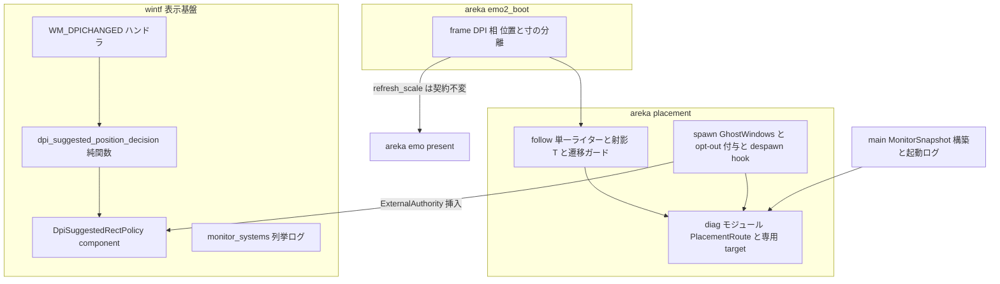
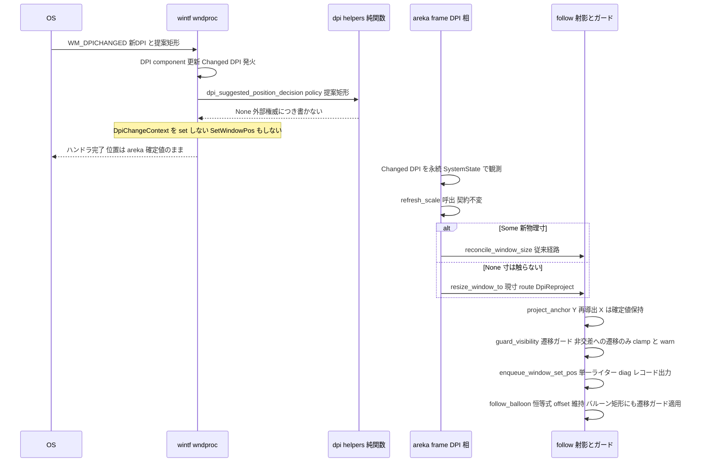
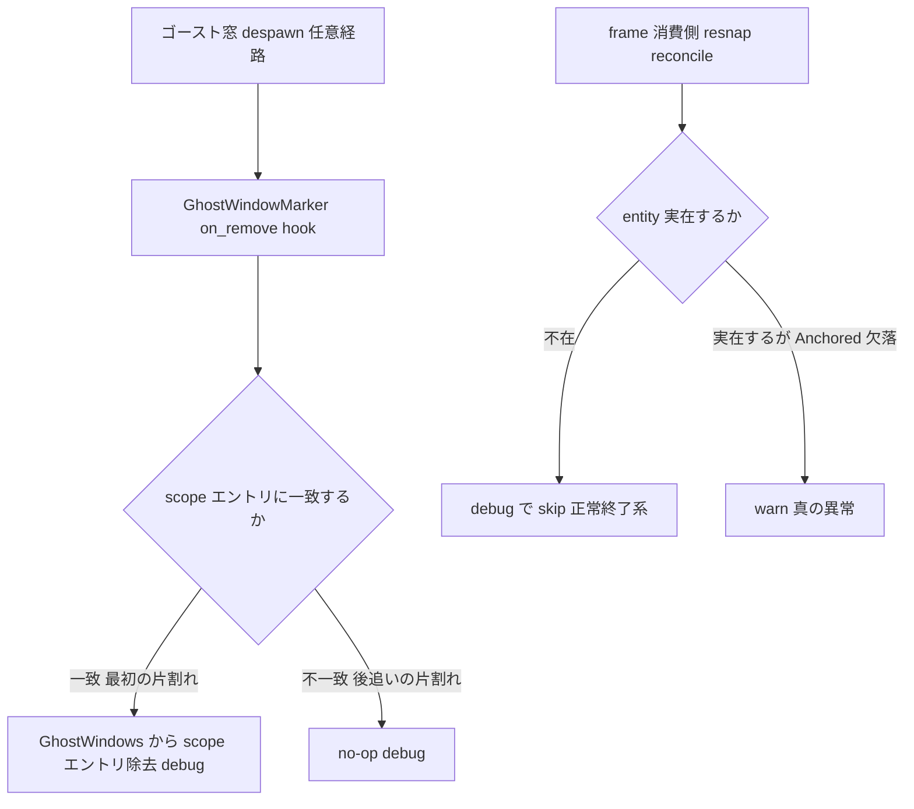

# 技術設計: areka-P0-dpi-window-vanish

## Overview

**Purpose**: 混在 DPI マルチモニタ実機でゴースト窓（キャラ・バルーン）が「知らないうちに消える」事象に対し、①事後再構成可能な恒久観測（診断）、②静的構造証跡で確定済みの位置権威欠陥 S1〜S3 の是正（修正）、③96 以外の DPI で欠陥を捕まえる決定論檻（回帰）、④同域のレジストリ掃除を提供する。

**Users**: 実機診断を行う開発者（ログだけから窓の所在を再構成できる）、および実機でゴーストを常駐させるユーザー（自分で動かしていないのにキャラが見えなくならない）。

**Impact**: 現行の位置権威は 3 本の書き手（OS 提案矩形の直書き・ECS 再発行・areka 射影）が同一フレームに並ぶ暗黙の相乗り構造である。本設計はこれを「ゴースト窓の位置の書き手は areka placement の単一ライターのみ」へ一本化し、`Changed<DPI>` 時の位置再射影を窓寸再導出の成否から独立させ、非ドラッグ経路に可視性の遷移ガードを敷く。

### Goals

- ゴースト窓の所在（モニタ構成・位置・寸・DPI・書込経路）を運転後のログだけから再構成できる恒久観測を、専用 target・既定 OFF で本体に焼き込む（Req 1）。
- 静的構造証跡 S1（OS 提案 X 素通し）・S2（位置再射影の `Some` ゲート）・S3（X 不変条件の不在＋最近傍フォールバックの無観測）を是正する（Req 3・4）。
- dpi=96 では隠れる欠陥を 120/192 と複数モニタ work area の注入で捕まえる決定論檻を常設する（Req 5）。
- `GhostWindows` の despawn 掃除と終了時警告の静穏化（Req 6）。
- 実機 2 セッション（ドラッグのみ／OS 設定変更のみ）の診断手順書と、Q1〜Q4＋S1〜S3 を一元登記する診断レポートを成果物として残す（Req 1・2）。

### Non-Goals

- DPI 変化に伴う窓寸の再導出そのもの（W4 `emo-dpi-scaling` 着地済み・本設計は消費のみ）。
- 当たり判定の DPI 対応（`collision-dpi-hittest`）・バルーン採寸の per-scope 化（`kero-balloon`）・位置永続化（`position-persist`）。
- モニタ構成変化（解像度・配置・接続）への運転中追随（M1 非対象。H6 が実機で確定した場合に限り最小範囲＝D10 裁定）。
- ユーザーが明示ドラッグで窓を可視領域外へ運んだ結果の不可視化（明示操作の尊重）。
- SSP 互換の位置復元 UI（M2）。

## Boundary Commitments

### This Spec Owns

- **ゴースト窓の位置権威の一本化**: `WM_DPICHANGED` 時に OS 提案位置を採用するか否かの判断（wintf・純関数）と、その判断を窓ごとに宣言する契約 `DpiSuggestedRectPolicy`。
- **DPI 変化時の位置再射影**: `Changed<DPI>` の char 窓が寸導出の成否に関わらず射影 T を通る経路（`emo2_boot/frame.rs` の DPI 相）。
- **非ドラッグ経路の可視性遷移ガード**: `guard_visibility` 純関数とその配線（`placement/follow.rs`）。
- **配置観測の語彙と配管**: `PlacementRoute` enum・専用 target `areka::placement::diag`・モニタスナップショット出力（`placement/diag.rs` 新設）。
- **ゴースト窓レジストリの despawn 掃除**: `GhostWindows` の scope 粒度除去（`placement/spawn.rs`）。
- **診断成果物**: 診断手順書・診断レポート（本 spec ディレクトリ配下）。

### Out of Boundary

- `placement/measure.rs`（バルーン採寸）＝ `kero-balloon`（W5）の所有。**本 spec は触らない**。
- `frame.rs` の `run_text_scale_phase`／`balloon_models`（同一ファイル・異ハンク）＝ `kero-balloon` の編集面。**本 spec のハンクは DPI 相・resnap 相・drain 相の消費側存在確認に限定**し、先着後 rebase を干渉台帳の流儀で申し送る。
- 復元時（起動時）の可視化保証＝ `position-persist`（完了済み）の所有。本 spec は**運転中に不可視位置を作らない**側のみを受け持ち、`Restore` 経路には遷移ガードを適用しない。
- `presenter.rs`（`areka-emo-present`）の `refresh_scale` 戻り値契約＝**不変**。位置と寸の分離は frame 側だけで解決する（D7）。
- ドラッグ経路（`BottomSnapPolicy::resolve`・wintf drag 配送）の挙動変更。ドラッグは明示操作＝ガード適用外（D5 裁定）。
- バルーン配置の**美観政策**（画面端での左右反転・SSP 互換の配置切替等）＝ M2 SSP 互換へ先送り。本 spec が持つのは「完全不可視への遷移を防ぐ安全網」（S3′ の遷移ガード＋warn）まで——warn 観測がこの先送りの縮退シームである（記憶〈先送りは完全語彙＋縮退シーム＋追跡明記〉）。
- SHIORI・talk・当たり判定・採寸・アトラス等、配置と表示基盤のウィンドウメッセージ以外の全系。

### Allowed Dependencies

- areka placement → wintf（`DPI`・`WindowPos`・`SetWindowPosCommand`・`enumerate_monitors`・新 component `DpiSuggestedRectPolicy` の挿入）。逆方向（wintf → areka）は**禁止**（wintf の判断材料は wintf 内の component のみ）。
- areka 内の依存方向: `placement/diag.rs`（最下流・純データ＋tracing のみ）← `placement/follow.rs` ← `placement/spawn.rs`・`emo2_boot/frame.rs` ← `main.rs`。
- テストは既存偽装境界のみに依存: `MonitorSnapshot` 合成注入・偽 HWND World・`ScaleReportSource`／`PhysicalSizeSource` シーム・`DPIS=[96,120,144,192]` パラメタ化。

### Revalidation Triggers

- `enqueue_window_set_pos`／`resize_window_to` の署名変更（`PlacementRoute` 引数追加）— placement 内の全呼出元と、`frame.rs` の resnap／reconcile 呼出（kero-balloon rebase 時に要突合）。
- `DpiSuggestedRectPolicy` の新設 — wintf の WM_DPICHANGED 挙動が窓ごとに分岐する。非ゴースト窓（examples・将来の通常窓）は既定値で従来挙動を維持することをもって非退行とする。
- `GhostWindows` からの scope エントリ除去 — `GhostWindows` を読む全消費者（`frame.rs`・`main.rs`）。W6 `balloon-visibility` が `spawn.rs` を触る場合に備え、**spawn.rs の編集内容（hook・opt-out 付与）を W6 へ申し送る**。
- 診断レポートの実機採取が S1〜S3 以外の新原因を確定した場合 — 修正フェーズの対象集合が変わる（Req 2.7 に従い、確定した機構のみ追加）。

## アーキテクチャ

### 既存アーキテクチャ分析（欠陥の構造）

`WM_DPICHANGED` 受信フレームには位置の書き手が 3 本並ぶ（research.md §1.1・設計セッションで実測再確認済み）:

- **書き手A**（`wintf/ecs/window_proc/window_pos.rs:359-369`）: OS 提案矩形の left/top を `SWP_NOSIZE` で実窓へ直書きし、同期 echo（`WM_WINDOWPOSCHANGED`）内で tick が回り得る。
- **書き手B**（`graphics/systems/window_pos.rs`）: `Changed<WindowPos>` からの再発行。ただしゴースト窓は areka 側が bypass ミラーで書くため通常は不発（書き手Aの echo 経由でのみ着火し得る）。
- **書き手C**（areka `placement/follow.rs` の単一ライター `enqueue_window_set_pos`）: 唯一 `Anchored`（接地点規約）を適用する経路。

確定済み欠陥（診断レポートに静的構造証跡として登記・Req 2.8）:

| ID | 欠陥 | 所在 | 未充足要件 |
| --- | --- | --- | --- |
| S1 | Bottom 射影が Y のみ再計算し、書き手Aが書いた OS 提案 X が最終位置に残る | `follow.rs:810-826`（`raw`=`WindowPos.position`）＋`follow.rs:85-112`（X 素通し）＋`window_pos.rs:359-369` | 4.3 |
| S2 | 位置再射影が `refresh_scale` の `Some` に条件付けられ、`None` 4 経路で位置再射影ごと欠落 | `frame.rs:835`・`presenter.rs:772-818` | 4.1・4.2・4.6 |
| S3 | X 軸に可視性不変条件が無く、`work_area_for_window` の最近傍フォールバックが「どのモニタにも属さない」を無観測で吸収 | `frame.rs:1157-1228`・`follow.rs:1132-1160` | 3.1 |
| S3′ | バルーン矩形はどの経路でも可視性を検査されない——`follow_balloon` は offset 恒等式（キャラの近くに置く）のみを適用し、バルーン矩形×work area の交差はどこにも不変条件が無い（キャラが端で clamp された合成でバルーンのみ完全不可視になり得る） | `follow.rs:880-907`（follow_balloon 経路） | 3.4 |

### アーキテクチャ・パターンと境界マップ

選択パターン: **単一ライター強化＋判断の純関数化**（既存 placement 規律の延長。新レイヤは足さず、暗黙の書き手を明示契約で断つ）。



**キー決定**（詳細な選択肢比較は research.md §9.3）:

- **D3（採用: 源断ち＋下流保証）**: OS 提案位置の採用可否を wintf の純関数 `dpi_suggested_position_decision` へ切り出し、窓ごとの明示 component `DpiSuggestedRectPolicy`（既定 `ApplyPosition`＝従来挙動）で宣言する。areka はゴースト窓（char・balloon 両方）へ `ExternalAuthority` を spawn 時に付与する。`None`（書かない）判定のときは **`DpiChangeContext` も set しない**（残置コンテキストを areka 自身の後続 SetWindowPos が echo と誤認して中心保持補正を誤適用する競合を封じる）。源断ちにより `WindowPos.position` は汚染されず、D4 裁定「直前の areka 確定接地点の物理 X を保持」は**新規 component なし**で成立する。
- **D7（採用: frame 側のみで分離）**: `dpi_phase_with` は `Changed<DPI>` の char 窓を `refresh_scale` の戻り値に関わらず必ず射影 T へ通す。`Some(new_size)` → 従来どおり `reconcile_window_size`。`None` → 現寸のまま `resize_window_to`（同寸ゆえ中央付替えは恒等・`project_anchor` が Y を新 work area へ再導出・べき等 skip が無変化を吸収）。presenter の戻り値契約は不変。
- **D6（採用: 観測化＋遷移ガード）**: `work_area_for_window` の契約は不変のまま判別付き版 `work_area_for_window_with_origin` を追加し、可視性は遷移ガード純関数 `guard_visibility` を `project_anchor` の下流・外側（D5 裁定）に置く。「非交差への**遷移**」だけを clamp＋warn し、既に非交差（ユーザー留置）は尊重する。
- **D8（採用: scope 粒度＋hook＋消費側存在確認）**: 対（char+balloon）は spawn/despawn とも原子的な生存単位（実測: `despawn_smoke_targets` は同一 World 変異内で一括）。`GhostWindowMarker` の `on_remove` hook が最初の片割れで scope エントリごと除去し、消費側は「entity 不在＝debug skip」と「実在するが `Anchored` 欠落＝warn」を区別する。
- **D11（採用: enum 引数配管）**: `PlacementRoute` を単一ライターへ**引数**で配管する（ラッパ乱立にしない）。route はログ語彙であると同時に遷移ガードの発火条件・warn 水準分岐の第一級入力である。
- **D12（採用: areka 構築点を正典）**: Req 1.1 の正典出力は `MonitorSnapshot` 構築点（placement の全判断が読む権威の忠実転写点）。wintf 列挙ログはフィールド補強のみ。3 箇所の列挙は同一関数呼出ゆえ専用突合機構は新設せず、共有語彙の grep 突合で食い違いを検出可能にする。
- **D13（採用: route 語彙の完全化 9 種・改訂 2026-07-31・タスク 1.4 実装レビュー #1 起因）**: 当初の 7 語彙は実在の書込トリガ 2 つを覆えないことが実装レビューで確定した。①`reconcile_window_size`（`frame.rs:690`）は 2 呼出元の共通末端であり、`dpi_phase_with` 経由（`frame.rs:841`・真に `Changed<DPI>` 由来）と `reconcile_reported_sizes` 経由（`frame.rs:1028`・drain 相＝「表示成立・**初回表示の k₀ 補正を含む**」で `Changed<DPI>` 非依存・`frame.rs:983` の doc が明言）の両方へ `DpiReproject` を貼ると、**DPI 変化ゼロの起動直後にも「DPI 由来」の偽レコードが毎回出る**（混在 DPI 実機でほぼ必発）＝セッション②の受理回数突合（Req 1.9）に偽陽性が混入し Req 1.2「変化を引き起こした経路」に違反する。②`\![move]` cue（`move_cue.rs:619`→`move_window_to`）の対象窓書込に対応語が無く無記録＝Q3（ドラッグ以外の経路での消失）の観測に穴。**検討 3 案**: (a) `ReportedSizeReconcile`＋`MoveCue` の 2 語追加＝全書込トリガと語彙が 1:1 で対応（解決: 偽陽性根絶・Req 1.2 全経路充足・Q3 完備）／(b) drain 語のみ追加＝`\![move]` の識別不能が恒久化／(c) `DpiReproject` の定義拡張＝1 語が 2 トリガを指し route 名での切り分けが不能に。**開発者裁定（2026-07-31 チャット）**「分かるようにログを出せばいい。あとで識別できることが重要。方法は任せる」——識別可能性を満たすのは (a) のみゆえ **(a) 採用**。帰結: ⑴遷移ガードの発火経路集合に `ReportedSizeReconcile` を追加（drain 相の書込も非ドラッグ自動配置＝S3 ガードの保護対象）、⑵`MoveCue` はガード適用外（スクリプト明示操作の尊重＝ドラッグ・Restore と同族）、⑶**requirements.md は無改変**（Req 1.2/2.4 は経路を一般語で要求しており語彙列挙は設計の所有＝要件 gap ではない）、⑷`SpawnInitial`/`Restore` が単一ライター非経由である現状は変えない（語彙のみ保持・将来の配線先として予約）。
- **D14（採用: 同一性判定と値の変化検出の分離・追加 2026-07-31・タスク 4.5 セッション②起因＝S4 是正）**: OS 表示設定から拡大率を 7 回変更しても `WM_DPICHANGED` が 0 件・`[diag.window_move]` が 0 件・`Updating Monitor entity` が 0 件で、ゴーストは旧 DPI の寸法と旧 work area の接地点に取り残された（診断レポート §2.7 に実測登記）。**根本原因**: `impl PartialEq for Monitor`（`crates/wintf/src/ecs/window/monitor.rs:103-107`）は `handle` のみで等価判定する**同一性の意味論**であるのに、`detect_display_change_system`（`crates/wintf/src/ecs/layout/systems/monitor_systems.rs:229-236`）がその `!=` を**値の変化検出**に流用している。モニタの `handle` は拡大率を変えても不変ゆえ、更新分岐は**構造的に恒偽**——`Monitor` の `bounds`／`work_area`／`dpi` は起動時の値のまま永久に凍結する。**検討 3 案**: (a) `PartialEq` を全フィールド比較へ変更＝同一性で引く既存利用（`existing_map` の `handle` キー引き・将来の同一モニタ追跡）が壊れ、`test_partial_eq_compares_handle_only` が固定している契約も破れる（未解決: 同一性が必要な文脈が消える）／(b) 消費側で全フィールドを直接展開比較＝その場は直るが、フィールド追加時に静かに追随漏れする（未解決: 将来の漏れを構造的に防げない）／(c) **`Monitor` に値差分の述語を新設し、消費側をそれへ切り替える**＝同一性（`PartialEq`）と値の変化（新述語）が別の名前で共存し、どちらの意味論を要求しているかが呼出点で明示される。**採用: (c)**。**帰結**: ⑴`PartialEq` の実装と既存檻 `test_partial_eq_compares_handle_only`（`monitor.rs:254-264`）は**無改変**（Req 7.6）——誤りは同一性判定ではなく流用した側にある、⑵新述語は追従対象フィールドを網羅し、フィールド追加時にコンパイラが漏れを指摘できる形（構造体分解パターン）で書く、⑶更新の実施を檻で固定する（`handle` 不変・値のみ変化の探針で赤→緑・Req 7.5）、⑷モニタ表更新後に窓の DPI・寸・位置の再導出を `WM_DPICHANGED` 非依存で駆動する（Req 7.3）——`WM_DPICHANGED` が 0 件である機序は未確定であり、**それに依存しない駆動路を用意することが是正の本体**である、⑸`SetProcessDpiAwarenessContext` の戻り値が `runtime/mod.rs:111` で `let _ =` により捨てられているため設定失敗が観測できない＝Req 1.5 の直接違反ゆえログ化する（Req 7.4）。**本裁定は S1〜S3 の被検体に一切触れない**——編集面は `monitor.rs`／`monitor_systems.rs`／`runtime/mod.rs` の 3 ファイルで、S1（`window_pos.rs`）・S2（`frame.rs`）・S3（`follow.rs`）と交差しない（＝Phase B′ に置ける理由）。
- **確定済み裁定の継承**: D1（恒久観測・専用 target・既定 OFF）、D2（挙動不変リファクタ・観測増設は Req 2.7 の「変更」外）、D4（X＝直前の areka 確定接地点の物理 X・物理 px 座標系）、D5（ガードは非ドラッグ経路のみ・`project_anchor` の外）、D10（構成食い違いは warn＋動かさない・追随は H6 確定時のみ）。

### Technology Stack

| Layer | Choice / Version | Role in Feature | Notes |
| --- | --- | --- | --- |
| 言語/実行 | Rust 2024（既存） | 全実装 | 新規依存ゼロ |
| ECS | bevy_ecs 0.18（既存） | component hook（`on_remove`）・`SystemState` 永続観測 | `Monitor::on_add` 先例 |
| ログ | tracing（既存） | 専用 target `areka::placement::diag`（debug 水準・既定 OFF） | `areka::persist::save` 先例の target 切り分け |
| Win32 | windows 0.62（既存） | `WM_DPICHANGED` 契約（提案矩形は勧告・不採用は契約違反でない） | Per-Monitor v2 |

## File Structure Plan

### 新規ファイル

```
crates/areka/src/placement/
└── diag.rs                  # PlacementRoute enum・DIAG_TARGET 定数・log_monitor_snapshot・
                             # 窓移動レコード出力ヘルパ（純データ＋tracing のみ・World 非依存）

.kiro/specs/areka-P0-dpi-window-vanish/
├── diagnosis-procedure.md   # 診断手順書（Req 1.4/1.5/1.8/1.9・5.5 実機サインオフ）
└── diagnosis-report.md      # 診断レポート＝確定台帳（Req 2.1-2.6/2.8/2.9・S1〜S3 を静的構造証跡として先行登記）
```

### 変更ファイル

| ファイル | 変更内容 | 所有権メモ |
| --- | --- | --- |
| `crates/wintf/src/ecs/window/dpi.rs` | `DpiSuggestedRectPolicy` component 新設（`DPI` 併置・既定 `ApplyPosition`） | wintf 側は W5 単独所有 |
| `crates/wintf/src/ecs/window_proc/dpi_helpers.rs` | 純関数 `dpi_suggested_position_decision` 追加＋in-source 檻（既存テスト群が donor） | 同上 |
| `crates/wintf/src/ecs/window_proc/window_pos.rs` | WM_DPICHANGED: 決定関数の消費・`None` なら `DpiChangeContext` を set せず SetWindowPos もしない・実施可否ログを `trace!`→`debug!` へ是正（Req 1.3） | 同上 |
| `crates/wintf/src/ecs/layout/systems/monitor_systems.rs` | 列挙 `debug!` に work_area・handle フィールド追加（Req 1.1 補完） | 同上 |
| `crates/areka/src/placement/follow.rs` | `PlacementRoute` 引数配管・`guard_visibility`／`work_area_for_window_with_origin`／`VisibilityVerdict` 追加・`enqueue_window_set_pos` 成功時 diag レコード・「entity 不在」と「`Anchored` 欠落」の区別 | 本 spec 単独所有 |
| `crates/areka/src/placement/spawn.rs` | `GhostWindows::remove_entry_of`・`GhostWindowMarker` `on_remove` hook・ゴースト窓 2 種への `ExternalAuthority` 付与＋檻 | **W6 balloon-visibility へ申し送り** |
| `crates/areka/src/placement/mod.rs` | `pub mod diag;` 公開・`prepare_ghost_windows` 列挙点で `log_monitor_snapshot` 呼出 | 本 spec 単独所有 |
| `crates/areka/src/emo2_boot/frame.rs` | `dpi_phase_with` の位置/寸分離（`None` 経路の char 再射影）・`resnap_with`／`reconcile_reported_sizes` の存在確認・`reconcile_window_size` への route 引数配管（DPI 相＝`DpiReproject`／drain 相＝`ReportedSizeReconcile`・D13） | **kero-balloon と同一ファイル・異ハンク＝先着後 rebase 申し送り** |
| `crates/areka/src/main.rs` | `MonitorSnapshot` 構築点（`main.rs:645` 近傍）で `log_monitor_snapshot` 呼出（Req 1.1 正典）・`despawn_smoke_targets`（`main.rs:795-810`）への存在確認（Req 6.2・4.5 セッション①が `TEARDOWN-SILENCE: FAIL` を実測） | 本 spec 単独所有 |
| `crates/wintf/src/ecs/window/monitor.rs` | **値差分の述語を新設**（`PartialEq` と既存檻は無改変）＋その檻（D14・Req 7.2/7.5/7.6） | 本 spec 単独所有（S4） |
| `crates/wintf/src/ecs/layout/systems/monitor_systems.rs` | `detect_display_change_system` の更新分岐を新述語へ切替＋モニタ表更新後の再導出駆動（D14・Req 7.1/7.3） | 本 spec 単独所有（S4） |
| `crates/wintf/src/runtime/mod.rs` | `SetProcessDpiAwarenessContext` の戻り値ログ化（`let _ =` 撤去・D14・Req 7.4） | 本 spec 単独所有（S4） |

> 依存方向（レビューで違反を検出可能にする規約）: `diag.rs` ← `follow.rs` ← `spawn.rs`・`frame.rs` ← `main.rs`。wintf → areka の import は禁止。`diag.rs` は World・wintf 型に依存しない（`Entity`・数値・文字列のみ）。

## System Flows

### WM_DPICHANGED（是正後・ゴースト窓）



フロー上の決定: 非ゴースト窓（policy 既定値）は従来どおり提案位置を書き `DpiChangeContext` を set する＝完全な後方互換。ゴースト窓では書き手Aと echo 連鎖（`WM_WINDOWPOSCHANGED` 内 tick の実行順非決定性）が消える。

### despawn 掃除（Req 6）



## Requirements Traceability

| Requirement | Summary | Components | Interfaces / Flows |
| --- | --- | --- | --- |
| 1.1 | 全モニタの識別子・bounds・work_area・DPI・primary を物理 px で出力 | placement::diag・main.rs 構築点・monitor_systems | `log_monitor_snapshot` |
| 1.2 | 窓の位置/寸変化を経路・種別・scope・DPI 付きで出力 | placement::diag・follow 単一ライター | `PlacementRoute`・diag レコード |
| 1.3 | DPI 変化の新旧・提案矩形・位置書込の実施可否を出力 | wintf window_pos ハンドラ | 実施可否 `debug!`（旧 `trace!` の水準是正） |
| 1.4 | 再実行可能な診断手順書 | diagnosis-procedure.md | 起動絶対パス・RUST_LOG・有界終了・grep 語 |
| 1.5 | 観測点と手順のログ水準整合の明示 | diagnosis-procedure.md | 観測点×target×水準の対応表 |
| 1.6 | 有界自動終了 | 既存 `AREKA_APP_SMOKE_EXIT_MS`（充足済・手順書が消費） | — |
| 1.7 | 観測は恒久・既定無効・設定で有効化 | placement::diag（専用 target・debug 水準） | D1 裁定 |
| 1.8 | 実機採取 2 セッション（ドラッグのみ／OS 設定変更のみ） | diagnosis-procedure.md | セッション別ログ保存 |
| 1.9 | 充足条件＝受理回数（各 scope×各方向×3＝12 回以上） | diagnosis-procedure.md | WM_DPICHANGED 受理ログの機械計数語 |
| 2.1 | Q1〜Q4 の実機ログ引用回答 | diagnosis-report.md | 2 セッションのログ | 
| 2.2 | 消失時矩形×全 work area の交差判別 | diagnosis-report.md | 1.1/1.2 の出力突合 |
| 2.3 | ドラッグ追従の数値評価 | diagnosis-report.md | 既存 `[drag]` ログ |
| 2.4 | 最終位置の書き手を名指しで記録 | diagnosis-report.md・PlacementRoute 語彙 | D11・D13（結論語彙＝route 名 9 種＋wintf 2 語） |
| 2.5 | バルーン随伴の実測確認 | diagnosis-report.md | `balloon_pos − char_pos ≡ offset` 恒等式 |
| 2.6 | 「再現しない」結論の条件と除外範囲 | diagnosis-report.md | 受理回数下限＋縮退条項（残余仮説のみ除外） |
| 2.7 | 確定した機構以外を変更しない | 本設計の Phase 構成・Boundary | 挙動不変リファクタ・観測増設は対象外（D2） |
| 2.8 | S1〜S3 の静的構造証跡登記 | diagnosis-report.md（先行登記） | file:line 引用＋未充足 AC 明記 |
| 2.9 | S1〜S3 の実機痕跡有無の記録 | diagnosis-report.md | 実機採取後に追記（確定は取り消さない） |
| 3.1 | 非ドラッグ要因で全 work area 非交差にしない | guard_visibility（follow） | 遷移ガード・route 条件 |
| 3.2 | 構成食い違いは warn し不可視位置へ動かさない | work_area_for_window_with_origin＋ガード warn | D10・D12（共有語彙 grep 突合） |
| 3.3 | 入力欠落時は現状維持＋警告 | follow 縮退群（既存）＋非ドラッグ経路の warn 昇格 | route 条件の水準分岐 |
| 3.4 | 混在 DPI 跨ぎで両窓を不可視化しない | キャラ＝ガード＋D7 再射影／バルーン＝follow_balloon 恒等式＋**バルーン矩形への遷移ガード（S3′ 是正）** | WM_DPICHANGED フロー |
| 4.1 | DPI 変化前後で接地点（下端中央）保持 | dpi_phase 分離（frame）＋resize_window_to 3b | S2 是正 |
| 4.2 | 処理完了時の最終位置＝接地点規約準拠 | 同上＋単一ライター | 同一フレーム完結 |
| 4.3 | OS 提案位置を最終位置として残さない | DpiSuggestedRectPolicy＋decision 純関数（wintf） | S1 是正・D3/D4 |
| 4.4 | 窓寸変化時もバルーン相対位置維持 | resize_window_to 手順 6（既存）＋S2 是正で発火条件拡大 | follow_balloon |
| 4.5 | 再導出不能なら現状維持 | refresh_scale None＝寸不変（既存充足）＋位置は D7 で独立判断 | — |
| 4.6 | 不可視中の DPI 変化→可視化時に整合 | pending_resize→reconcile_reported_sizes（既存）＋D7 で位置も再射影 | drain 相 |
| 5.1 | 96 以外（120/192 含む）＋複数モニタ注入で判断分岐を実行検証 | 回帰檻（follow/frame/dpi_helpers の in-source） | S1〜S3 対象確定済み |
| 5.2 | 実 GPU・実高 DPI 不要の決定論判定 | 偽 HWND World・MonitorSnapshot 注入・fake ScaleReportSource | 既存偽装境界 |
| 5.3 | 全 work area 非交差にならないことを合成レイアウトで検証 | guard_visibility 檻 | 混在 DPI 複数モニタ注入 |
| 5.4 | 是正前コードが 96 で通り 96 以外で落ちる赤→緑（S1・S2） | decision 純関数檻（S1）・dpi_phase 檻（S2） | 後述 Testing Strategy |
| 5.5 | 決定論化できない残余の実機サインオフ手順 | diagnosis-procedure.md | 有界終了＋grep 判定語 |
| 5.6 | 判定は絶対 px でなく比・不変条件 | 全檻共通規約 | `DPIS`＋`px()` 先例踏襲 |
| 6.1 | despawn 時にレジストリから除去 | GhostWindows::remove_entry_of＋on_remove hook | despawn フロー |
| 6.2 | 破棄済み窓へ警告以上のログを出さない | 消費側存在確認（debug skip） | 「不在」と「Anchored 欠落」の区別 |
| 6.3 | 参照先不在は正常系打ち切り・他 scope 継続 | resnap_with／reconcile_reported_sizes の per-scope continue | 同上 |
| 6.4 | 掃除前後で生存窓の位置・寸・追従不変 | hook は Resource のみ操作（component 不変） | spawn.rs 檻 |
| 7.1 | 表示構成変更で全モニタの矩形・work_area・DPI・primary を再取得しモニタ表へ反映 | `detect_display_change_system`（wintf monitor_systems） | D14・S4 是正 |
| 7.2 | 反映要否は**同一性**でなく**値の変化**で判定 | `Monitor::differs_in_value`（新設・`PartialEq` は不変） | D14 |
| 7.3 | モニタ表更新後の窓 DPI・寸・位置の再導出を `WM_DPICHANGED` 非依存で駆動 | monitor_systems → placement 追従層（再スナップ相） | D14 |
| 7.4 | DPI awareness 設定の成否をログに残す | `WinApp::new`（wintf runtime） | `let _ =` の撤去（Req 1.5 の直接適用） |
| 7.5 | 識別子不変・値のみ変化の構成でモニタ表が更新されることの檻 | monitor_systems の in-source 檻 | 赤→緑（S4） |
| 7.6 | 同一性判定の契約自体は変更しない | `impl PartialEq for Monitor`（無改変）＋既存檻 `test_partial_eq_compares_handle_only`（無改変） | D14 帰結⑵ |

## Components and Interfaces

| Component | Domain/Layer | Intent | Req Coverage | Key Dependencies | Contracts |
| --- | --- | --- | --- | --- | --- |
| DpiSuggestedRectPolicy | wintf/window | OS 提案位置の採用方針を窓ごとに宣言 | 4.3, 2.8 | なし（純 component） | State |
| dpi_suggested_position_decision | wintf/window_proc | 提案位置の書込可否を純関数で判断 | 4.3, 5.1, 5.4 | DpiSuggestedRectPolicy (P0) | Service |
| WM_DPICHANGED ハンドラ改修 | wintf/window_proc | 決定関数の消費と観測水準是正 | 1.3, 4.3 | decision (P0)・DpiChangeContext (P0) | Service |
| モニタ列挙ログ補強 | wintf/layout | 列挙 debug に work_area・handle 追加 | 1.1 | Monitor (P0) | — |
| placement::diag | areka/placement | 経路語彙・専用 target・観測レコード | 1.1, 1.2, 1.7, 2.4 | tracing (P0) | Service |
| PlacementRoute 配管 | areka/placement | 単一ライターへの経路タグ引数追加 | 1.2, 2.4, 3.3 | diag (P0) | Service |
| guard_visibility ＋ origin 判別 | areka/placement | 非ドラッグ経路の可視性遷移ガード | 3.1, 3.2, 3.3, 3.4, 5.3 | MonitorSnapshot (P0) | Service |
| dpi_phase 位置/寸分離 | areka/emo2_boot | Changed DPI で必ず射影 T を通す | 4.1, 4.2, 4.5, 4.6, 2.8 | resize_window_to (P0)・refresh_scale (P0 契約不変) | Service |
| GhostWindows 掃除 | areka/placement | scope 粒度の despawn 掃除 | 6.1, 6.2, 6.3, 6.4 | bevy hook (P0) | State |
| 診断手順書 | 成果物 | 第三者再実行可能な実機採取手順 | 1.4, 1.5, 1.8, 1.9, 5.5 | 観測実装 (P0) | — |
| 診断レポート | 成果物 | Q1〜Q4＋S1〜S3 の確定台帳（一元） | 2.1-2.6, 2.8, 2.9 | 手順書 (P0) | — |

### wintf 表示基盤（W5 単独所有）

#### DpiSuggestedRectPolicy（新規 component・`ecs/window/dpi.rs`）

| Field | Detail |
| --- | --- |
| Intent | WM_DPICHANGED の OS 提案位置を当該窓へ適用するかの明示宣言 |
| Requirements | 4.3, 2.8 |

**Responsibilities & Constraints**
- 純 component（データのみ）。未付与＝既定 `ApplyPosition`＝従来挙動（後方互換の非退行保証）。
- 付与の責務は窓の所有者側（areka spawn）。wintf は読むだけ。

##### State Management

```rust
/// WM_DPICHANGED の OS 提案矩形（位置）の適用方針。
/// 未付与の窓は ApplyPosition と同じ扱い（従来挙動・Per-Monitor v2 標準応答）。
#[derive(Component, Clone, Copy, Debug, Default, PartialEq, Eq)]
pub enum DpiSuggestedRectPolicy {
    /// 既定: OS 提案位置を SWP_NOSIZE で適用する（従来挙動）。
    #[default]
    ApplyPosition,
    /// 位置権威が外部（ECS 側の配置システム）にある窓:
    /// OS 提案位置を書かず、DpiChangeContext も set しない。
    ExternalAuthority,
}
```

#### dpi_suggested_position_decision（新規純関数・`ecs/window_proc/dpi_helpers.rs`）

| Field | Detail |
| --- | --- |
| Intent | 「提案位置を書くか・どこへ書くか」の判断分岐を wndproc から純関数へ抽出 |
| Requirements | 4.3, 5.1, 5.4 |

##### Service Interface

```rust
/// WM_DPICHANGED で OS 提案位置を採用するかの純判断。
/// Some((x, y)) = 提案位置を書く（DpiChangeContext も set する）。
/// None = 書かない（DpiChangeContext も set しない）。
pub(super) fn dpi_suggested_position_decision(
    policy: Option<&DpiSuggestedRectPolicy>,
    suggested: &RECT,
) -> Option<(i32, i32)>
```

- Preconditions: なし（`policy` は component 未付与を `None` で表現）。
- Postconditions: `policy` が `None` または `ApplyPosition` → `Some((suggested.left, suggested.top))`。`ExternalAuthority` → `None`。
- Invariants: World 非依存・副作用なし（in-source 檻で全分岐網羅・`correct_position_for_dpi_center_preserve` のテスト群が donor）。

**Implementation Notes**
- Integration: `WM_DPICHANGED` ハンドラ（`window_pos.rs:340-372`）は本関数の戻り値で②（`DpiChangeContext::set`）と③（`guarded_set_window_pos`）を**まとめて**分岐する。①（DPI component 更新・`Changed<DPI>` 発火）は無条件で従来どおり。
- Validation: 実施可否ログを `debug!` で出す（旧 `trace!`＝2026-07-18 偽陰性の直接原因の水準是正・Req 1.3）。フィールド: entity・policy・実施可否・提案 left/top。
- Risks: `ExternalAuthority` 窓で `DpiChangeContext` を set しないため、同フレームの後続 `WM_WINDOWPOSCHANGED`（areka 自身の SetWindowPos の echo）が DPI echo と誤認されない＝**意図どおり**。中心保持補正（`correct_position_for_dpi_center_preserve`）はゴースト窓で不発になり、`BoxStyle not found` の良性 warn ノイズ（research.md §1.1 補足）も同時に消える。

### areka placement（診断観測・位置権威・掃除）

#### placement::diag（新規モジュール・`placement/diag.rs`）

| Field | Detail |
| --- | --- |
| Intent | 配置観測の語彙（経路 enum）・専用 target・出力ヘルパの単一の住処 |
| Requirements | 1.1, 1.2, 1.7, 2.4 |

##### Service Interface

```rust
/// 恒久観測の専用 target（D1 裁定: 既定 OFF・診断手順が RUST_LOG で点灯）。
pub const DIAG_TARGET: &str = "areka::placement::diag";

/// 窓位置・寸法を書き込んだ経路（Req 1.2 の「経路」＝ Req 2.4 の結論語彙）。
#[derive(Clone, Copy, Debug, PartialEq, Eq)]
pub enum PlacementRoute {
    /// spawn 初期配置
    SpawnInitial,
    /// 位置永続化の復元マージ（可視化保証は position-persist 所有＝ガード適用外）
    Restore,
    /// アンカー変化トリガ（anchor_changed_system）
    AnchorChange,
    /// 毎フレーム resnap（resnap_from_sizes）
    Resnap,
    /// DPI 変化の位置再射影（**dpi_phase 限定**・S2 是正で新設される None 経路を含む。
    /// drain 相の報告回収は ReportedSizeReconcile が担い、本変種と混同しない＝D13）
    DpiReproject,
    /// balloon 窓の位置据置きリサイズ（resize_window_keep_position）
    KeepPositionResize,
    /// キャラ窓確定後のバルーン随伴（follow_balloon）
    BalloonFollow,
    /// drain 相の報告回収（reconcile_reported_sizes・初回表示の k₀ 補正を含む・
    /// `Changed<DPI>` 非依存＝DPI 変化ゼロでも発火し得るため DpiReproject と別語＝D13）
    ReportedSizeReconcile,
    /// `\![move]` cue によるスクリプト明示移動（move_window_to の対象窓。
    /// 明示操作の尊重ゆえ遷移ガード適用外＝ドラッグ・Restore と同族＝D13）
    MoveCue,
}

/// 起動時モニタスナップショット出力（Req 1.1 正典・物理 px）。
/// context = "monitor_snapshot" | "prepare_ghost_windows" など呼出点タグ。
pub fn log_monitor_snapshot(monitors: &[MonitorRecord], context: &str);

/// モニタ 1 台分の観測レコード（wintf Monitor からの忠実転写・純データ）。
pub struct MonitorRecord {
    pub handle: isize,
    pub bounds: (i32, i32, i32, i32),      // left, top, right, bottom（物理 px）
    pub work_area: (i32, i32, i32, i32),   // 同上
    pub dpi: u32,
    pub is_primary: bool,
}
```

- Invariants: World・wintf 型に依存しない（`MonitorRecord` は呼出側が転写）。全出力は `debug!(target: DIAG_TARGET, ...)`＝既定 `RUST_LOG=info` では無音（Req 1.7）。
- 窓移動レコード（Req 1.2）は `enqueue_window_set_pos` 成功時に出す: route・**entity**・窓種別（char/balloon）・scope・物理位置・物理寸・当該窓 DPI。種別と scope は `CharWindowMarker`/`BalloonWindowMarker`、DPI は `DPI` component から呼出側（follow.rs）が読んで渡す。**entity は wintf 側ログ（entity のみを持つ）との結合キー**であり、Req 1.9 の scope 別計数はこの結合で機械化される（手順書④の 2 段 grep 規則）。

**Implementation Notes**
- Validation: レコードのフィールド組立は純関数化し in-source 檻で固定（診断 grep 語の意図せぬ変更を檻が検出）。診断手順書の grep 語はこのモジュールの出力書式と 1:1 対応（Req 1.5 を「型で」担保する D11 の趣旨）。
- Risks: ドラッグ中の毎イベント経路（wintf `[drag]`）は本 target を通らない（wintf 所有・既存語彙のまま）＝手順書に両 target の対応表を明記。

#### PlacementRoute 配管＋guard_visibility（`placement/follow.rs`）

| Field | Detail |
| --- | --- |
| Intent | 単一ライターへの経路タグ配管と、非ドラッグ経路の可視性遷移ガード |
| Requirements | 1.2, 3.1, 3.2, 3.3, 3.4, 5.3 |

##### Service Interface

```rust
/// work_area_for_window の判別付き版。既存関数はこれへ委譲する（契約不変）。
pub enum WorkAreaResolution {
    /// 窓中心がモニタに帰属（half-open 判定）
    Contains,
    /// どのモニタにも属さず最近傍フォールバックが発火（Req 3.2 の観測点）
    NearestFallback,
}
pub fn work_area_for_window_with_origin(
    snapshot: &MonitorSnapshot,
    window: RectPx,
) -> Option<(RectPx, WorkAreaResolution)>;

/// 可視性の遷移ガード（純関数・非ドラッグ経路専用・D5/D6）。
/// - proposed が全 work area のいずれかと交差 → Keep（そのまま）
/// - 交差せず、old_rect は交差していた → ClampX（X を clamp_wa の水平範囲内へ引き戻す）
/// - 交差せず、old_rect も交差していなかった（明示ドラッグ留置）→ Keep（尊重・Out of scope）
/// - old_rect 不明（None・窓生成直後）→ ClampX（安全側）
pub enum VisibilityVerdict {
    Keep(PointPx),
    ClampX(PointPx),
}
pub fn guard_visibility(
    old_rect: Option<RectPx>,
    proposed_pos: PointPx,
    size: SizePx,
    clamp_wa: RectPx,          // 射影が Y に用いた work area（clamp 先）
    snapshot: &MonitorSnapshot,
) -> VisibilityVerdict;
```

- Preconditions: `size` は正寸（非正寸は呼出側＝`resize_window_to` の既存ガードが先に弾く）。
- Postconditions: `ClampX` の X は `clamp_wa.left ..= clamp_wa.right − size.w` へ `saturating` clamp（判定は交差＝比・不変条件であり絶対 px 固定値を持たない・Req 5.6）。Y は変更しない（Y は射影 T の所有）。
- Invariants: World 非依存・panic しない（既存 `BottomSnapPolicy` と同じ `saturating` 流儀）。

**Implementation Notes**
- Integration: `resize_window_to(world, char_window, new_size, route: PlacementRoute)` へ署名変更。手順 3b（中央付替え）→ `project_anchor`（不変）→ **`guard_visibility`（route が非ドラッグ配置系＝`AnchorChange`/`Resnap`/`DpiReproject`/`ReportedSizeReconcile` のときのみ・D13）** → べき等 skip → `enqueue_window_set_pos(.., route)`。`Restore` はガード適用外（position-persist の所有・Boundary）。`MoveCue` もガード適用外（スクリプト明示操作の尊重・D13）。ドラッグ経路（`policy_mapped_position`→`BottomSnapPolicy`）は**一切触らない**。
- **バルーン適用（S3′ 是正・Req 3.4 の構造的充足）**: `follow_balloon` は offset 恒等式で提案位置を出した**後**、同じ `guard_visibility` を**バルーン矩形**（旧矩形＝現 `WindowPos`・提案位置＋現寸）に適用する。`ClampX` 時は X のみ clamp＋`warn!`（完全不可視への遷移だけを防ぐ安全網）・既に非交差（ユーザー留置）は Keep で尊重——キャラ窓と完全に同一の遷移規則・同一の純関数（新規機構ゼロ）。clamp でバルーンがキャラと部分重なりし得るが、*見えない会話*より*重なった会話*を優先する（ユーザー目線裁定 2026-07-31）。画面端での左右反転等の**美観配置政策は M2 SSP 互換へ先送り**（本ガード＋warn がその縮退シーム）。
- Validation: `ClampX` 発火時は `warn!`（Req 3.1/3.2 の観測・非ドラッグ経路ゆえ spam しない）。`NearestFallback` 発火は非ドラッグ経路で `warn!`・ドラッグ経路は従来 `debug!` のまま（Req 3.3 の水準分岐＝route が第一級引数である理由）。
- 消費側の区別（Req 6.2/6.3）: `resize_window_to` 冒頭に `world.get_entity(char_window)` の存在確認を足し、**不在は `debug!` で skip（正常終了系）**・実在するが `Anchored` 欠落は従来どおり `warn!`（真の異常）。
- Risks: `clamp_wa` は Bottom 射影が選んだ work area（`work_area_for_window_with_origin` の戻り値）を貫通させる配線が要る＝`project_anchor` の内部変更ではなく `resize_window_to` 側で同じ wa を引いて渡す（`project_anchor` 契約は不変）。

#### GhostWindows 掃除（`placement/spawn.rs`）

| Field | Detail |
| --- | --- |
| Intent | despawn 時の scope 粒度レジストリ掃除と opt-out 付与 |
| Requirements | 6.1, 6.2, 6.3, 6.4（付与は 4.3） |

##### Service Interface / State Management

```rust
impl GhostWindows {
    /// entity が char/balloon いずれかに一致する scope エントリを除去して返す。
    /// 不一致（既に除去済み・非ゴースト entity）は None（no-op・panic しない）。
    pub fn remove_entry_of(&mut self, entity: Entity) -> Option<(usize, ScopeWindows)>;
}
```

- `GhostWindowMarker` に `on_remove` component hook を付与（`Monitor::on_add` 先例）: hook 内で `GhostWindows` Resource から `remove_entry_of(entity)`。除去成立は `debug!`（正常終了系）・no-op も `debug!`。Resource 未挿入は no-op。
- spawn 時、char 窓・balloon 窓の両方へ `DpiSuggestedRectPolicy::ExternalAuthority` を挿入する（D3。バルーン窓も OS 直書きから外すことで `balloon_pos − char_pos ≡ offset` 恒等式が DPI 跨ぎでも構造的に保たれる・Req 3.4/4.4）。

**Implementation Notes**
- Integration: hook は Resource のみ操作し、生存 entity の component には一切触れない（Req 6.4 の構造的保証）。`frame.rs` 消費側（`resnap_with`・`reconcile_reported_sizes`）は scope ループ内で entity 存在確認 → 不在は `debug!` continue（Req 6.3・他 scope 継続）。
- Validation: 檻＝「char 窓 despawn → 当該 scope が `GhostWindows` から消える」「片割れ despawn 後の後追い despawn が no-op」「掃除前後で他 scope の `WindowPos`・`BalloonFollow` が不変」「spawn 直後の全ゴースト窓に `ExternalAuthority` が付与済み」。
- Risks: 本ファイルは W6 `balloon-visibility` が触る可能性が roadmap に登記済み → **編集内容を W6 へ申し送る**（Boundary Context の契約）。

### areka emo2_boot（DPI 相の位置/寸分離）

#### dpi_phase 位置/寸分離（`emo2_boot/frame.rs`）

| Field | Detail |
| --- | --- |
| Intent | `Changed<DPI>` の char 窓を寸導出の成否に関わらず射影 T へ通す（S2 是正） |
| Requirements | 4.1, 4.2, 4.5, 4.6, 2.8 |

**Responsibilities & Constraints**
- `dpi_phase_with` の変更（判断分岐のみ・presenter 契約不変・D7）:
  - `refresh_scale` が `Some(new_size)` → 従来どおり `reconcile_window_size`（char は `resize_window_to`＝射影込み・balloon は `resize_window_keep_position`）。
  - `None` → **char 窓のみ**現 `WindowPos.size` を読んで `resize_window_to(world, char, 現寸, DpiReproject)`。同寸ゆえ中央付替えは恒等・`project_anchor` が Y を新モニタ work area 下端へ再導出・X は D4 裁定どおり確定値保持（書き手A遮断済みゆえ `WindowPos.position` は未汚染）・無変化はべき等 skip が吸収。balloon 窓の `None` は従来どおり何もしない（位置据置き・Req 4.5。char が動けば `follow_balloon` が随伴させる）。
  - `WindowPos.size` 不在（窓生成前）は skip（既存縮退と同型・log-first）。
- Req 4.6（不可視中の DPI 変化）: 寸は既存の `pending_resize`→`reconcile_reported_sizes`（drain 相）が可視化時に追い付く。位置は上記 `None` 経路が `Changed<DPI>` の時点で Y を再射影済み（不可視でも `WindowPos` は生きている）＋可視化時の `reconcile_reported_sizes`→`resize_window_to` が最終整合を取る。balloon は char 側の `follow_balloon` 恒等式で追随。

**Implementation Notes**
- Integration: 編集ハンクは `dpi_phase_with`（`frame.rs:782-839`）と消費側存在確認（`resnap_with` `frame.rs:1188-1228`・`reconcile_reported_sizes` `frame.rs:985-1026`）に限定。**`run_text_scale_phase`・`balloon_models` には触れない**（kero-balloon の編集面・同一ファイル異ハンク＝先着後 rebase 申し送り）。
- Validation: 檻は fake `ScaleReportSource`（`None` 固定／`Some` 固定）×合成 `MonitorSnapshot`×`DPI` 注入（`frame.rs:2655` 以降の先例）で S2 の赤→緑を実行で示す（Testing Strategy 参照）。
- Risks / Req 4.5 との整合: `None` 経路の再射影は**正常系ではべき等（無変化）**である——書き手A遮断（S1 是正）後の `WindowPos.position` は areka が射影済みの確定値であり、同寸・同 work area なら `resize_window_to` のべき等 skip が書込ゼロで抜ける＝4.5「窓位置と窓寸を変更せずに現状を維持」がそのまま成立する。位置の書込が発生するのは**現位置が接地点規約に違反しているとき**（残存汚染・モニタ帰属の変化）だけであり、それは 4.1/4.2 が要求する保全そのもの——Req 2.8 が S2（`Some` ゲートによる再射影欠落）を 4.1/4.2/4.6 未充足の欠陥として登記していることが、この場合に「維持」より「規約復元」が優先することの要件上の根拠である（矛盾ではなく優先順位）。寸が古いまま位置だけ正す瞬間は同一フレームの drain 相 reconcile（既存契約）が閉じる。

### 成果物（診断手順書・診断レポート）

- **diagnosis-procedure.md**（Req 1.4/1.5/1.8/1.9/5.5）: ①起動コマンド（絶対パス・記憶〈emo2 実走は絶対パス必須〉）・`RUST_LOG=info,wintf::ecs::window_proc=debug,wintf::ecs::drag=debug,areka::placement::diag=debug`・`AREKA_APP_SMOKE_EXIT_MS`（有界終了）・ログ保存先。②観測点×target×水準の対応表（1.5＝「手順で有効化されない水準の観測点を『発生 0 回』の根拠に用いない」の制度化）。③2 セッション規定: セッション①ドラッグによるモニタ跨ぎのみ／セッション② OS 設定側 DPI 変更のみ（ドラッグ禁止）。④充足条件: `[WM_DPICHANGED] DPI component directly updated` 行の grep 計数で、キャラ窓の各 scope×各方向（低→高・高→低）×3 回＝**12 回以上の受理**。**計数の機械化＝2 段 grep 規則**（wintf は scope を知らないため）: 第 1 段で diag レコード（entity・scope・種別を含む）から「scope→char 窓 entity」の対応表を作り、第 2 段で当該 entity の WM_DPICHANGED 受理行を数える。方向は同行の old/new DPI の大小比較で機械判定する。⑤合否判定語（消失痕跡: `ClampX`/`NearestFallback` warn・全 work area 非交差の突合手順）。⑥実機サインオフ（5.5）: OS が実際に提示する提案矩形・実モニタ列挙という決定論化できない 2 項の確認手順。
- **diagnosis-report.md**（Req 2.1-2.6/2.8/2.9）: 確定台帳の一元化。**設計時点で S1〜S3＋S3′（バルーン矩形の可視性不変条件の不在・Req 3.4 未充足・`follow.rs:880-907`）を「静的構造証跡」クラスとして file:line 付きで先行登記**（各項目に未充足 AC を明記・2.8 は「少なくとも S1〜S3」ゆえ S3′ の追加登記は要件改稿不要）。実機採取後に Q1〜Q4 の回答（2.1）・交差判別（2.2）・追従数値（2.3）・書き手名指し（2.4・語彙は `PlacementRoute` 名＋wintf `[drag]`/提案位置書込の 2 語）・バルーン随伴（2.5）・S1〜S3 の実機痕跡有無（2.9・痕跡が無くても確定は取り消さない）を追記。再現しない場合の結論規則（2.6）: 受理回数下限を踏破した 2 セッションのみを根拠に、除外できるのは**残余仮説への追加修正のみ**（S1〜S3 是正と檻は除外しない）。

## Error Handling

### Error Strategy

既存の log-first 規律（記憶〈ログ無し失敗経路の禁止〉）を継承し、本設計は**水準の割当**だけを新たに規定する:

| 事象 | 水準 | 根拠 |
| --- | --- | --- |
| 提案位置の書込可否（wintf） | `debug!`（旧 `trace!` から是正） | Req 1.3・2026-07-18 偽陰性の直接原因 |
| 単一ライター成功レコード | `debug!(target: DIAG_TARGET)` | Req 1.2/1.7（既定 OFF） |
| `ClampX`／非ドラッグ経路の `NearestFallback` | `warn!` | Req 3.1/3.2（異常を異常として観測） |
| ドラッグ経路の縮退（毎イベント） | `debug!`（従来どおり） | spam 回避（既存判断の維持） |
| despawn 済み entity の skip | `debug!` | Req 6.2（警告以上を出さない） |
| 実在 entity の `Anchored` 欠落 | `warn!`（従来どおり） | 真の異常の観測を殺さない |
| `SetWindowPos` 失敗・射影入力欠落 | `warn!`＋現状維持（既存） | Req 3.3 |

### Monitoring

- 恒久観測は専用 target `areka::placement::diag`（既定 OFF・D1）。診断手順書が `RUST_LOG` 点灯と grep 判定語を規定する（Req 1.4/1.5）。
- 起動時スナップショット（Req 1.1）は 1 回きり・有界（10 分運転でログが読み切れる・research §4.1 Option C の性格分離）。

## Testing Strategy

> 共通規約: 判定は絶対 px の固定値でなく**比・不変条件**（Req 5.6・`resolver.rs:303-318` の `DPIS=[96,120,144,192]`＋厳密整除 `px()` が donor）。檻に入れるのは**判断分岐（純関数）**のみ・実証済み配線は再テストしない（記憶〈檻は判断分岐のみ〉）。すべて x64 偽装境界（実 GPU・実高 DPI 不要・Req 5.2）。

### Unit Tests（純関数檻）

1. **`dpi_suggested_position_decision`**（wintf `dpi_helpers.rs` in-source）: policy 未付与／`ApplyPosition`／`ExternalAuthority` の全分岐。「決定結果を適用した最終 X が現接地点 X を保存する」不変条件檻を dpi=96（提案＝現位置ゆえ通過）と 120/192（モニタ跨ぎ相当の提案 X シフトを注入）で示す。**位置づけは分岐網羅の補助**——S1 の赤→緑（Req 5.4）の**正証跡は Integration Tests 5（wintf dispatch 檻）**である（是正前の欠陥は wndproc の無条件書込＝実配線に在るため、新設純関数上の模擬では「是正前のコードに対して失敗する」の証明力が足りない）。
2. **`guard_visibility`**（follow.rs in-source）: 交差維持→Keep／交差→非交差の遷移→ClampX（X が clamp_wa 水平範囲内・Y 不変）／もともと非交差（留置）→Keep／old 不明→ClampX。混在 DPI 複数モニタ（120+192 相当の非対称 work area・負座標・3200 超座標）の合成レイアウトで（Req 5.1/5.3）。**バルーン矩形ケース（S3′）**: キャラが端で clamp された合成でバルーンのみ非交差へ遷移→ClampX・ユーザー留置バルーン→Keep・clamp 後のバルーン矩形が work area と交差する事後条件（Req 3.4/5.3）。
3. **`work_area_for_window_with_origin`**: `Contains`/`NearestFallback` の判別が既存 `work_area_for_window` の戻り値と常に一致（委譲の等価性）。
4. **diag レコード組立**: `PlacementRoute` 表示語彙と grep 判定語の固定（手順書と 1:1）。
5. **`GhostWindows::remove_entry_of`**: char 一致・balloon 一致・不一致 no-op・二重除去 no-op。

### Integration Tests（偽 HWND World・in-crate）

1. **S2 の赤→緑（Req 5.4）**: `dpi_phase_with` × fake `ScaleReportSource`（`None` 固定）× `DPI` 注入（96→120／96→192／120→192 の各遷移）× 合成 `MonitorSnapshot`。是正前: char 窓 Y が新 work area 下端へ再射影されない（96 では旧 Y＝新 Y で自己整合し通過・120/192 で失敗）。是正後: 全水準で接地点不変条件（下端中央保存）が成立。
2. **`Some` 経路の非退行**: fake `Some(新寸)` で従来どおり `reconcile_window_size` が走り、balloon 随伴恒等式 `balloon_pos − char_pos ≡ offset` が保存される（Req 4.4・resize_window_to 檻の donor 拡張）。
3. **despawn 掃除**: hook 発火で scope エントリ除去・後追い no-op・他 scope の `WindowPos`/`BalloonFollow` 不変（Req 6.1/6.4）・掃除後の `resnap_with`/`reconcile_reported_sizes` が warn を出さず他 scope を処理し切る（Req 6.2/6.3・log 捕捉は既存 tracing テスト流儀）。
4. **spawn 付与檻**: 全 scope×char/balloon に `ExternalAuthority` が付与される（付与漏れ＝S1 再発の穴を檻で塞ぐ）。
5. **wintf dispatch 檻＝S1 の赤→緑の正証跡（Req 5.4）**（`window_proc/mod.rs` headless 先例の拡張）: `ExternalAuthority` 付き entity への `WM_DPICHANGED` dispatch 後、`DPI` component は更新され `DpiChangeContext` が **set されない**こと。policy 無し entity では set されること。**赤の採取**: 是正前コミット（Phase A 完了時点）に対して本檻を実行し「`DpiChangeContext` が set される＝OS 提案位置が採用される」失敗を記録、是正コミット直後に緑を記録する（Phase D の実行記録対象・tasks 生成時に赤採取のコミット位置を固定すること）。

### 実機サインオフ（Req 5.5・決定論化できない残余のみ）

- 対象: OS が実際に提示する提案矩形の実値（モニタ跨ぎ時の X 変位）・実モニタ列挙。手順書の 2 セッション＋受理回数充足＋grep 判定語で合否判定（記憶〈実機サインオフ＝有界 auto-exit＋ログ grep〉）。
- **順序制約**: 診断セッションの採取は「観測増設＋掃除まで（S1/S2 是正未投入）」のコミット時点のビルドで行う——是正投入後は消失の実機再現自体が起きなくなり Q1〜Q4 の確定材料が失われるため（research §9.4）。是正後に同手順を再実行し、消失痕跡ゼロ＋接地点保存を確認するのが最終サインオフ。

## 実装フェーズ順序（Req 2.7 の遵守構造）

1. **Phase A（観測＋掃除・診断前に着手可）**: diag.rs・wintf 水準是正＋列挙ログ補強・`MonitorSnapshot` 構築点ログ・`PlacementRoute` 配管（挙動不変リファクタ）・GhostWindows 掃除（Req 6）・診断手順書。純関数抽出（decision・guard の骨組み）もここ（D2 裁定＝Req 2.7 の「変更」外）。
2. **Phase B（実機診断）**: Phase A ビルドで 2 セッション採取 → 診断レポートへ Q1〜Q4・2.9 を登記。S1〜S3 は静的構造証跡として**先行登記済み**（Phase B の結果に依存しない）。
   **Phase B′（観測装置の修理・2026-07-31 追加）**: セッション②が **S4** を確定した——OS 経由の DPI 変化が全経路で無視されるため、②は受理回数下限に達し得ない。**S4 是正はこの Phase に属する**（S1〜S3 の被検体には一切触れず、`monitor.rs`／`monitor_systems.rs`／`runtime/mod.rs` のみを触る）。是正後に②を採り直して初めて Phase B が完了する。Req 2.10 が「観測装置の故障を被検体の健全性と読み替えること」を禁じている。
3. **Phase C（是正）**: S1（D3: `ExternalAuthority`＋decision 消費）・S2（D7: `None` 経路再射影）・S3（D6: 遷移ガード配線）。Phase B が新原因を確定した場合のみ対象を追加（Req 2.7）——**S4 がこれに該当したが、被検体ではなく観測経路の欠陥ゆえ Phase B′ へ置く**。
4. **Phase D（檻・C と交互）**: 各是正の赤→緑（Req 5.4）を是正コミットの直前後で実行記録。最終の実機再サインオフ。
