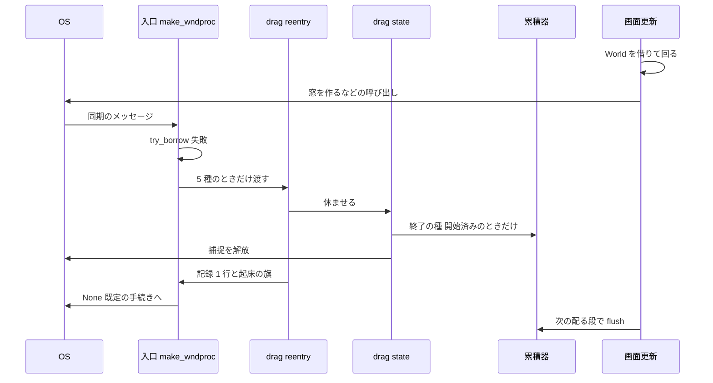

# Design Document: areka-P0-drag-cancel-borrow-miss

## Overview

**Purpose**: 画面更新の最中（wintf が World を借りている間）に OS から同期で届いたドラッグのメッセージが、窓のメッセージの入口でまるごと捨てられ、ドラッグが終わらずに残る穴を塞ぐ。

**Users**: wintf を使う開発者（終了の知らせの受け手を書く側）と、areka の利用者（キャラクターやバルーンを動かす側）。

**Impact**: 入口は、World を借りられないときでも、ドラッグに関わる 5 種のメッセージだけは World を使わないドラッグの扱いへ渡す。あわせて、終了の知らせの種を積む所を「ドラッグの状態を休ませる関数の中」の 1 か所へ移し、状態と種がずれる形そのものを無くす。ふつうの条件（World を借りられるとき）の知らせ・状態の移り変わり・追従は変えない。

### Goals

- 再入で届いた 5 種（ESC キー・メニューやダイアログの割り込み・マウスの捕捉の喪失・窓の非活性化・左ボタンを離す）で、ドラッグが終わり、マウスの捕捉が解放される。
- 閾値を越えたドラッグの終わりは、再入でも終了の知らせ 1 回。閾値に届く前の終わりは 0 回。
- 終了の知らせは、種を積んだ後に最初に回る「知らせを配る段」で配られる（再入でない場合と同じ規則・余計に待つ画面更新は 0 回）。
- World を待たない・横取りしない・画面更新を二重に回さない。
- 本番の入口（`make_wndproc` のクロージャ）を通る決定論のテストで、直す前の赤と直した後の緑を示す。

### Non-Goals

- ESC キー・メニューやダイアログの割り込みを受けた窓と、ドラッグ中の窓の一致の確認（今どおり確かめない）。
- 5 種以外のメッセージの、再入のときの扱い（今どおり捨てる）。左ボタンを押す・マウスを動かすメッセージを含む。
- 5 種のメッセージの、ドラッグ以外の処理の再入のときの扱い（沈降の観測の目印・ボタンを離した記録などは今どおり行わない）。
- 開始の知らせの種を積む所（`mouse_move.rs`）の移動。
- areka の終了の受け手・位置の記憶の形式。

## Boundary Commitments

### This Spec Owns

- 窓のメッセージの入口が、World を借りられないときに 5 種をどう扱うか（`runtime/wndproc_bridge.rs` の `make_wndproc`）。
- World を使わないドラッグの扱い（新しい `ecs/drag/reentry.rs`）。
- 終了の知らせの種を積む所（`ecs/drag/state/mod.rs` の `end_dragging`・`cancel_dragging` の中）と、そこから累積器へ届く道（`ecs/drag/accumulator.rs` の「wndproc 側の控え」）。
- 左ボタンを離したときの「離した窓とドラッグの窓の一致」の判断の根拠（マウスの捕捉を取った窓との一致へ揃える）。
- 上の扱いの記録（要件 7）と、決定論のテスト。
- 起床の旗を立てる本番ファイルの一覧への 1 行（`ecs/world/tick_gate_tests.rs` の `WINTF_PRODUCERS` と、`ecs/world/tick_wake.rs` の冒頭の名簿）。新しい `reentry.rs` が旗を立てるので、載せないと見張りのテスト `the_wintf_table_lists_every_file_that_marks_the_wake` が赤になる。要件の境界に書いた「World を組み立てる所」と同じ `ecs/world/` の下で、足すのは一覧の行と説明だけ（振る舞いの変更は 0 件）。

### Out of Boundary

- `ecs/window_proc/mouse_move.rs`（開始の種・閾値・追従）。1 行も触らない。
- `ecs/drag/dispatch.rs`（知らせを配る段）。1 行も触らない。ドラッグ中の印は今の `Ended` の腕が外す。
- `runtime/window_factory.rs`・`runtime/tick_bridge.rs`。1 行も触らない。
- `crates/areka/` の下すべて。1 行も触らない。
- 累積器の入口の判断（`DragAccumulator::set_transition` の「開始を積んでいない終了は捨てる」）。そのまま残す。

### Allowed Dependencies

- `ecs/drag/reentry.rs` は `crate::executor::util::WindowMessage`、Win32 の `ClientToScreen`、`ecs/drag/state`、`ecs/world/tick_wake` に依る。World には依らない（`EcsWorld` を引数に取らない）。
- `runtime/wndproc_bridge.rs` は `crate::ecs::drag::handle_message_while_world_busy` を呼ぶ。向きは今と同じ（runtime → ecs）。
- 新しいクレートの依存は 0 件。`Cargo.toml` の変更は 0 件（`ClientToScreen` の機能 `Win32_Graphics_Gdi` は有効済み）。

### Revalidation Triggers

- 画面更新の最中にメッセージを汲む呼び出し（モーダルな窓・メニューなど）を tick の中へ足したとき。今は 0 件で、足すと ESC キーと左ボタンを離すメッセージも再入で届くようになる（扱いは本設計で揃えてあるが、頻度と記録の量が変わる）。
- `DragConfig` を、押した窓より上の祖先へ付ける使い方を始めたとき（窓の一致の根拠が今の答えと分かれる。下の「窓の一致」を参照）。
- 1 つのスレッドで World を 2 つ以上、本番で持つようになったとき（wndproc 側の控えは 1 スレッドに 1 つ）。
- `end_dragging`・`cancel_dragging` を通らずにドラッグの状態を休ませる道を足したとき（終了の種が積まれない）。

## Architecture

### Existing Architecture Analysis

- 本番の窓の手続きは `make_wndproc` のクロージャだけである。配送表 `dispatch_window_message` を本番で呼ぶ所はこのクロージャの 1 か所だけ（他は 0 件）。
- クロージャは `world.try_borrow()` が失敗すると `None` を返す。例外は `WM_ENDSESSION`（wParam 真）の `warn!` だけ。
- 画面更新は `tick_bridge.rs` の `tick_one_frame_with` が `try_borrow_mut()` を握ったまま回す。13 本のスケジュールの 1 本目が `Input` で、`dispatch_drag_events`（知らせを配る段）はここにいる。窓を作る `create_windows` は 6 本目の `UISetup` にいる。
- ドラッグの状態は `drag/state/mod.rs` の `thread_local!` `DRAG_STATE`（1 スレッドに 1 つ）。World を使わずに読み書きできる。
- 累積器 `DragAccumulatorResource` は `Arc<Mutex<…>>` を包む `Clone` の型で、World の資源として 1 つ入っている。ハンドラは World を借りて資源を取り出し、終了の種を積む。積む所は `keyboard.rs` に 4 か所、`mouse_click.rs` の `handle_button_message` に 2 か所の計 6 か所。
- 離しの画面の座標は、`handle_button_message` の冒頭で「窓の中の座標＋`WindowPos.position`（クライアント領域の左上の画面の座標）」で作る。
- 窓の一致は、`Dragging` では状態が持つ `hwnd` と離した窓の `hwnd` の一致、`Preparing`／`JustStarted` では `find_owner_window(対象) == 離した窓の entity` で調べる。後者は World が要る。

### Architecture Pattern & Boundary Map



**Architecture Integration**:

- 選んだ形: 「状態を休ませる関数が、同じ所で終了の種も積む」。開始の知らせを配ったドラッグかどうかは状態（`JustStarted`／`Dragging`）が知っているので、状態と種を別々の所で動かす形を無くす。
- 入口の役目は「借りられないときに 5 種かどうかを見て渡す」だけ。ドラッグの中身は `ecs/drag/` が持つ。
- 保つ形: 累積器は World の資源のまま。配る段は資源から `flush` する。`Mutex` を握ったまま OS を呼ばない。`CaptureGuard` は `DRAG_STATE` の借用の外で落とす。
- steering との整合: 1 フレーム遅らせない／根本の 1 か所で直す／黙って捨てない／テストは到達する道を踏む／1 ファイル 1,000 行以下・テストは兄弟ファイル。

### 設計の判断（要件ディスカッションから持ち越した 5 件）

| # | 論点 | 決定 | コードの根拠 |
|---|---|---|---|
| 1 | 終了の種をどこで積むか | `end_dragging`・`cancel_dragging` の中の 1 か所。ハンドラの 6 か所は消す | どのハンドラも状態を休ませるときにこの 2 関数を通る。本番でこの 2 関数を通らずに `JustStarted`／`Dragging` を出る道は 0 件 |
| 2 | 再入の離しの画面の座標 | `ClientToScreen(離した窓, 窓の中の座標)` | ふつうの道は「窓の中の座標＋`WindowPos.position`」。`WindowPos.position` はクライアント領域の左上の画面の座標なので、同じ値になる |
| 3 | 窓の一致の判断 | 3 つの状態とも「離した窓の `hwnd` == マウスの捕捉を取った窓の `hwnd`」へ揃える（ふつうの道も） | 下の「窓の一致」 |
| 4 | 記録の level | ドラッグを終えた・取り消したときは `warn!`、何もしなかったときは `debug!`、読めなかった情報は `warn!` | 下の「Monitoring」 |
| 5 | `doc/COMPAT_ARCHITECTURE.md` §8 | 「【上書き】」の行を 1 行足す（完了 spec `wintf-winmsg-executor` 要件 4.3 の安全スキップを、5 種についてだけ変えた） | §8 には完了 spec の上書きを記す先例の行がある |

**窓の一致（判断 3 の根拠）**: `start_preparing` へ渡る `hwnd` は、押しを受けた窓のもの（`handle_button_message` が自分の `hwnd` を渡す）。ドラッグの対象は、その窓の中で当たった entity から `find_ancestor_with_drag_config` で探す。areka が `DragConfig` を付けるのはキャラクターの窓とバルーンの窓の entity そのもの（`placement/spawn.rs`）で、wintf の例（`taffy_flex_demo`）も窓かその中の部品に付ける。どちらも「対象を含む窓＝押した窓」なので、`find_owner_window(対象) == 離した窓` と「離した窓 == 捕捉を取った窓」は同じ答えになる。`Dragging` の `hwnd`（配る段が対象を含む窓の `WindowHandle` から写す）も同じ窓を指す。答えが分かれるのは `DragConfig` を押した窓より上の祖先に付けた場合だけで、areka では 0 件。その場合、今の判断は離しても終わらない（捕捉している窓へ離しが届くのに一致しない）ので、揃えた後の方が正しく終わる。

### 調査の結論（ギャップ分析 §5）

| 調べたこと | 結論 |
|---|---|
| ESC キー・左ボタンを離すメッセージが再入で届くか | 今のコードでは届く道は 0 件。この 2 つは待ち行列を通るので、tick の中でメッセージを汲む呼び出しが要る。汲む呼び出しは、右クリックメニュー（`areka/src/menu/win32.rs` の `TrackPopupMenuEx`）が tick の外のタスク、`MessageBoxW`（`areka/src/alert.rs`）が tick の外（`main.rs`）か背景スレッド、`wintf/src/com/wuc.rs` の汲み出しが終了時だけ。要件どおり扱いは 5 種とも揃える |
| 同期で届く 3 種が再入で届く道 | ある。`UISetup` の `create_windows` が窓を作って表示する（`window_factory.rs` の `ShowWindow`）と、活性化が移り、ドラッグ中の窓へ非活性化・捕捉の喪失が同期で届きうる。もう 1 つは毎回起こる道で、`handle_button_message` が World を可変で借りたまま `end_dragging` を呼び、`ReleaseCapture` が自分の窓へ捕捉の喪失を同期で送る（このとき状態はすでに休んでいるので、何もしない） |
| tick の途中で積んだ種が配られる回 | 積んだ後に最初に回る `dispatch_drag_events`。`Input` は 1 本目なので、`UISetup` から積んだ種は次の tick で配られる。これは「その tick の直後に再入でなく届いたメッセージ」と同じ回である。次の tick は、再入の扱いが立てる起床の旗と、`rearm_tick_while_dragging`（`DraggingState` が残っている間 `DRAG` の旗を立てる）の 2 つで必ず回る |
| ドラッグ中の印を World 無しでどう外すか | メッセージの時点では外さない。終了の種を積めば、配る段の `Ended` の腕が、再入でない場合と同じ回に `DraggingState` と `WindowDragging` を外す。外すための新しい道は 0 本 |
| 1 スレッドに World が複数あるとき（テスト） | wndproc 側の控えは `DRAG_STATE` と同じく 1 スレッドに 1 つ。最後に `install_drag_accumulator` を通った World の累積器を指す。本番は 1 スレッド 1 World。テストは 1 本 1 スレッドで、World の資源を別の累積器へ入れ替えない（下の Testing Strategy） |
| 再入で取り消した画面更新の、残りの段が見る状態 | 「ドラッグの状態は休んでいるが、`DraggingState`・`WindowDragging` はまだ付いている」状態で残りの段が回る（再入でない場合は、この間に段は回らない）。印が付いたままの間、印を読む段（wintf の窓の位置の段・`rearm_tick_while_dragging`、areka の追従・バルーンの表示の段）は「ドラッグ中」として 1 回分だけ余計に回る。累積器には新しい動きが積まれないので、窓は動かない。設計の検証でも害は見当たらなかった。テスト 7b が、この 1 回分を挟んだ後に印が外れることを確かめる |
| 新しく生まれる危険 | 入口が捕捉の喪失を通すようになると、`DRAG_STATE` を借りたまま OS を呼ぶ所で入れ子の借用が起こりうる。今は `start_preparing` が `DRAG_STATE` を借りたまま `SetCapture` を呼ぶ 1 か所。捕捉を取るのを借用の外へ出す |

### 直した後に利用者から見える変化

- wintf は窓を作ると、画面更新の途中で `ShowWindow(hwnd, SW_SHOW)` を呼ぶ（`runtime/window_factory.rs` の「4b. ウィンドウを表示」）。areka のゴーストの窓の作り（`placement/spawn.rs` の `window_style`）には「活性化しない」指定が無いので、新しい窓が活性化し、ドラッグ中の窓へ非活性化が同期で届く見込みが高い（ソースからの見立て・実機では未確認）。
- いまは、その非活性化が入口で捨てられ、ドラッグは続く。直した後は、要件 2.1 のとおりその場でドラッグが取り消され、位置が 1 件保存される。これは、画面更新の外で非活性化が届いたときのいまの振る舞いと同じである。
- areka が窓を作るのは `spawn_ghost_windows`（起動とゴーストの切り替え）だけ。したがって、この変化が出るのは「起動の直後・切り替えの最中に、ちょうどドラッグしている」ときに限られる。台詞を喋るたびに窓が増えることは無い（バルーンの窓もここで作る）。
- 記録の level（終えた・取り消したときは `warn!`）はこのまま保つ。上の場面でしか出ないので、量は増えない。
- 新しい窓を活性化させない作り（`SW_SHOWNOACTIVATE`）へ変えるのは、本 spec の境界の外（`window_factory.rs` は触らない）。

### Technology Stack

| Layer | Choice / Version | Role in Feature | Notes |
|-------|------------------|-----------------|-------|
| Runtime | Rust 2024・`windows` クレート（既存の版） | `ClientToScreen` で離しの画面の座標を作る | 新しい依存 0 件 |
| ECS | `bevy_ecs`（既存の版） | 累積器の資源・知らせを配る段 | 変更なし |
| 記録 | `tracing`（既存） | 要件 7 の記録 | テストの捕捉は `log-capture-kit` |

## File Structure Plan

### Directory Structure

```
crates/wintf/src/
├── runtime/
│   ├── wndproc_bridge.rs              # 入口: 借りられないとき 5 種を drag reentry へ渡す・冒頭の説明を直す
│   └── wndproc_bridge_drag_tests.rs   # 新規: 入口を通る再入の決定論テスト（本 spec の主な檻）
└── ecs/
    ├── drag/
    │   ├── reentry.rs                 # 新規: World を使わないドラッグの扱い（5 種の見分け・座標・記録・起床の旗）
    │   ├── accumulator.rs             # wndproc 側の控えと、控えを通して終了の種を積む関数を足す
    │   ├── accumulator_tests.rs       # 控えが無いときの記録のテストを足す
    │   ├── capture_guard.rs           # 捕捉を取った窓の hwnd を返す関数を足す
    │   ├── mod.rs                     # mod reentry と公開の宣言を足す
    │   └── state/
    │       ├── mod.rs                 # 休ませる関数が終了の種を積む・離しと捕捉の喪失の関数を足す・start_preparing の順を直す
    │       └── tests.rs               # 手直し（下記）
    ├── window_proc/
    │   ├── keyboard.rs                # 4 ハンドラから種を積む所を消し、休ませる関数を呼ぶだけにする
    │   ├── keyboard_tests.rs          # 累積器の取り方を手直し
    │   ├── mouse_click.rs             # 離しの 2 つの枝を end_dragging_on_release へ揃える
    │   └── mouse_click_tests.rs       # 累積器の取り方を手直し
    └── world/
        ├── mod.rs                     # 累積器を入れる 1 行を install_drag_accumulator へ替える
        ├── tick_wake.rs               # 冒頭の名簿へ drag/reentry.rs を 1 行（説明だけ）
        └── tick_gate_tests.rs         # 一覧 WINTF_PRODUCERS へ drag/reentry.rs を 1 行（8 行 → 9 行）
crates/wintf/tests/window/multiwindow_event_test.rs   # 説明文だけ直す
doc/COMPAT_ARCHITECTURE.md             # §8 へ 1 行
```

### Modified Files

- `runtime/wndproc_bridge.rs` — `try_borrow()` が失敗した枝に、`crate::ecs::drag::handle_message_while_world_busy(entity, &msg)` の呼び出しを 1 つ足す。`WM_ENDSESSION` の `warn!` と `None` を返すことは変えない。冒頭の「安全スキップ規律」の節と `make_wndproc` の手順 3 の説明に、5 種の例外を書く。ファイル内の既存テスト 4 本は主張を変えない（借用中のテストが使うメッセージは `WM_ERASEBKGND` で、5 種ではない）。
- `ecs/drag/accumulator.rs` — `install_drag_accumulator`・`push_ended_seed` と `thread_local!` の控えを足す。`DragAccumulatorResource::set_transition` と `flush` は、`Mutex` の毒化のとき `warn!` を出す（今はどちらも黙って何もしない）。
- `ecs/world/tick_gate_tests.rs`・`ecs/world/tick_wake.rs` — 起床の旗を立てる本番ファイルの一覧と名簿へ、`drag/reentry.rs` を 1 行ずつ足す。
- `ecs/window_proc/mouse_click_tests.rs` — 累積器の取り方のほか、`setup` の説明文（予備の枝の判断として `find_owner_window` を挙げている）を直す。
- `ecs/drag/state/mod.rs` — 下の Components を参照。
- `ecs/window_proc/keyboard.rs` — `WM_KEYDOWN`（ESC）・`WM_CANCELMODE` は `cancel_dragging()`、`WM_ACTIVATE`（非活性化）も `cancel_dragging()`（押していない状態では何もしない。今ある `info!`・`debug!` は戻り値で出し分ける）、`WM_CAPTURECHANGED` は `cancel_dragging_on_capture_lost()` を呼ぶだけにする。World の借用は `WM_ACTIVATE` の沈降の観測の目印の 1 か所だけが残る。
- `ecs/window_proc/mouse_click.rs` — 当たり判定の枝と予備の枝の左ボタンを離す所を、どちらも `end_dragging_on_release(hwnd, Some(画面の座標))` の 1 呼び出しにする。`find_owner_window` の呼び出し 2 か所と、種を積む 2 か所が消える。冒頭の画面の座標の計算は変えない。
- `ecs/world/mod.rs` — `insert_resource(DragAccumulatorResource::new())` の 1 行を `install_drag_accumulator(&mut world)` へ替える。
- `crates/wintf/tests/window/multiwindow_event_test.rs` — `test_drag_hwnd_guard_owner_window_check` の説明文だけ直す（今のハンドラの判断として `find_owner_window` を挙げているため）。主張（`find_owner_window` の答え）は変えず、緑のまま。

## System Flows

再入の流れは上の図のとおり。分かれ目は次の 3 つ。

- 入口: `try_borrow()` が失敗し、かつ 5 種のどれかのときだけ `reentry` へ渡す。5 種は「`WM_KEYDOWN` で wParam が ESC」「`WM_CANCELMODE`」「`WM_ACTIVATE` で wParam の下位が非活性化」「`WM_CAPTURECHANGED`」「`WM_LBUTTONUP`」。ESC でない `WM_KEYDOWN` と、活性化の `WM_ACTIVATE` は 5 種に入らない（今どおり捨て、記録も出さない）。
- 状態: 休ませる関数は、前の状態が `JustStarted`／`Dragging` のときだけ終了の種を積む。`Preparing` からは積まない。`Idle`／`JustEnded` では何もしない。
- 離し: 離した窓が捕捉を取った窓と違うときは、何もしない。

## Requirements Traceability

| Requirement | Summary | Components | Interfaces | Flows |
|-------------|---------|------------|------------|-------|
| 1.1 | 5 種を入口で捨てない | 入口・drag reentry | `handle_message_while_world_busy` | 入口の分かれ目 |
| 1.2 | 借用を待たない・横取りしない・二重に回さない | drag reentry | World を引数に取らない | — |
| 1.3 | ドラッグ以外の処理はしない・戻り値は今どおり | 入口・drag reentry | 入口は `None` を返す | — |
| 1.4 | 5 種以外は今どおり捨てる | 入口 | 5 種の見分け | 入口の分かれ目 |
| 2.1 | 取り消し 4 種で終了 1 回 | drag state・累積器の控え | `cancel_dragging`・`cancel_dragging_on_capture_lost` | 状態の分かれ目 |
| 2.2 | 離しで終了 1 回 | drag state・drag reentry | `end_dragging_on_release` | 離しの分かれ目 |
| 2.3 | 中身は同じ・位置は画面の座標 | drag reentry | `ClientToScreen` | — |
| 2.4 | 遅らせない | 累積器の控え・drag reentry | `push_ended_seed`・起床の旗 | 図の flush |
| 2.5 | ドラッグ中の印を外す | 既存の配る段（変更なし） | `Ended` の腕 | — |
| 3.1 | 再入の後のクリックで終了 0 件 | drag state・累積器の入口の判断 | 状態と種が同じ所で動く | — |
| 3.2 | 閾値前の取り消しで終了 0 件 | drag state | `Preparing` からは積まない | 状態の分かれ目 |
| 3.3 | 次のドラッグで開始→終了 1 回ずつ | drag state・累積器 | — | — |
| 4.1 | 離しで休ませ捕捉を解放 | drag state・drag reentry | `end_dragging_on_release` | — |
| 4.2 | 違う窓の離しでは終えない | drag state | 捕捉を取った窓との一致 | 離しの分かれ目 |
| 4.3 | 押していないのに始めない | drag state（残さないことで満たす） | — | — |
| 5.1 | 再入の取り消しでも位置を 1 件保存 | areka の受け手は変更なし。2.1 の終了の知らせ 1 件で満たす | `DragEndEvent` | — |
| 5.2 | 再入の離しでも同じ最終位置を 1 件保存 | areka の受け手は変更なし。2.2・2.3 の終了の知らせ 1 件（同じ画面の座標）で満たす | `DragEndEvent` | — |
| 5.3 | その後の動かさないクリックで保存 0 件 | areka の受け手は変更なし。3.1 の終了の知らせ 0 件で満たす | `DragEndEvent` | — |
| 6.1 | ふつうの条件の知らせは不変 | drag state・ハンドラ | 種の中身と順は今と同じ | — |
| 6.2 | ふつうの条件の状態・閾値・追従・捕捉は不変 | ハンドラ | — | — |
| 6.3 | 押す・動かすの再入は今どおり捨てる | 入口 | 5 種の見分け | — |
| 7.1 | 再入の扱いを 1 行記録 | drag reentry | `drag_reentry_handled` | — |
| 7.2 | 読めなかった情報を記録 | drag reentry・累積器の控え | `drag_reentry_pos_unreadable`・`drag_end_seed_unreachable` | — |
| 8.1 | 入口を通る再入のテストで、直す前の赤と直した後の緑 | Testing Strategy の表 1〜7・12 | — | — |
| 8.2 | 前後の結果を記録するテスト | Testing Strategy の表 8〜11 | — | — |
| 8.3 | 同じ回の配る段で配られること | Testing Strategy の表 7・7b | — | — |
| 8.4 | ふつうの条件と安全スキップが崩れていないこと | Testing Strategy の表 13・既存テスト | — | — |
| 8.5 | 決定論・兄弟ファイル・1,000 行以下 | Testing Strategy・File Structure Plan | — | — |
| 8.6 | 実機はふつうの条件だけ | Testing Strategy の「実機」 | — | — |
| 8.7 | 上書きの記録 | `doc/COMPAT_ARCHITECTURE.md` §8・`wndproc_bridge.rs` の冒頭の説明 | — | — |
| 8.8 | ワークスペース全体のテストが緑 | Testing Strategy の「完了の判定」 | — | — |

## Components and Interfaces

| Component | Domain/Layer | Intent | Req Coverage | Key Dependencies | Contracts |
|-----------|--------------|--------|--------------|------------------|-----------|
| 入口 | runtime | 借りられないとき 5 種だけ渡す | 1.1, 1.3, 1.4, 6.3 | drag reentry (P0) | Service |
| drag reentry | ecs/drag | World を使わないドラッグの扱い | 1.1〜1.3, 2.2, 2.3, 2.4, 4.1, 7.1, 7.2 | drag state (P0)・tick_wake (P1) | Service |
| drag state | ecs/drag | 休ませる所で終了の種を積む | 2.1, 2.2, 3.1〜3.3, 4.1〜4.3, 6.1, 6.2 | 累積器の控え (P0)・CaptureGuard (P0) | Service, State |
| 累積器の控え | ecs/drag | World 無しで累積器へ届く道 | 2.4, 7.2 | DragAccumulatorResource (P0) | State |
| ハンドラ | ecs/window_proc | ふつうの道。同じ関数を呼ぶ | 6.1, 6.2 | drag state (P0) | — |

### runtime

#### 入口（`make_wndproc` のクロージャ）

| Field | Detail |
|-------|--------|
| Intent | World を借りられないとき、5 種だけを drag reentry へ渡し、`None` を返す |
| Requirements | 1.1, 1.3, 1.4, 6.3 |

**Responsibilities & Constraints**
- `try_borrow()` が失敗した枝の中で、`WM_ENDSESSION` の `warn!` の後に `handle_message_while_world_busy` を呼ぶ。戻り値は使わず、今どおり `None` を返す。
- 5 種かどうかの見分けは drag reentry が持つ。入口はメッセージの中身を読まない。
- World は試しに借りるだけで、握らない（今と同じ）。

### ecs/drag

#### drag reentry（`ecs/drag/reentry.rs`）

| Field | Detail |
|-------|--------|
| Intent | 5 種を見分け、World を使わずにドラッグを終える・取り消す |
| Requirements | 1.1, 1.2, 1.3, 2.2, 2.3, 2.4, 4.1, 7.1, 7.2 |

**Contracts**: Service [x]

##### Service Interface

```rust
/// World を借りられないときに入口が呼ぶ。5 種のどれかなら扱って true、違えば何もせず false。
pub(crate) fn handle_message_while_world_busy(window_entity: Entity, msg: &WindowMessage) -> bool;
```

- Preconditions: UI スレッドで呼ぶ。World の借用の有無は問わない（触らない）。
- Postconditions（5 種のとき）:
  - ESC・`WM_CANCELMODE`・非活性化 → `cancel_dragging()`。
  - `WM_CAPTURECHANGED` → `cancel_dragging_on_capture_lost()`。
  - `WM_LBUTTONUP` → `ClientToScreen` で画面の座標を作り、`end_dragging_on_release(msg.hwnd, 座標)`。`ClientToScreen` が失敗したら `None` を渡し（状態が持つ最後の画面の座標で終える）、`warn!` を出す。
  - 起床の旗を立てる（`tick_wake::mark(tick_wake::wake_bits_for_message(msg.msg))`。配送表の入口と同じ式）。
  - 記録を 1 行出す（下の Monitoring）。
- Invariants: World を借りない。画面更新を呼ばない。ボタンを離した記録（`record_button_up`）・沈降の観測の目印・当たり判定は行わない。

**Implementation Notes**
- 非活性化は、ふつうの道と同じく、状態が `Preparing`／`JustStarted`／`Dragging` のどれでも取り消す（`cancel_dragging` が状態を見て種を積むかを決める）。
- 危険: `ClientToScreen` はテストの空の `hwnd` で失敗する。座標を確かめるテストは隠れた実物の窓を使う（Testing Strategy）。

#### drag state（`ecs/drag/state/mod.rs`）

| Field | Detail |
|-------|--------|
| Intent | ドラッグを休ませる 1 か所で、終了の種を積み、捕捉を解放する |
| Requirements | 2.1, 2.2, 3.1, 3.2, 3.3, 4.1, 4.2, 4.3, 6.1, 6.2 |

**Contracts**: Service [x] / State [x]

##### Service Interface

```rust
/// 休ませた結果。
#[derive(Debug, Clone, Copy, PartialEq, Eq)]
pub enum DragClose {
    /// 休ませた。notified は終了の種を積んだか（前の状態が JustStarted／Dragging のとき真）。
    Closed { entity: Entity, notified: bool },
    /// 離した窓が、捕捉を取った窓と違う（何もしていない）。
    OtherWindow,
    /// 押している状態ではなかった（何もしていない）。
    NotActive,
}

/// 既存。位置と取り消しの印を指定して休ませる。前の状態が JustStarted／Dragging なら終了の種を積む。
pub fn end_dragging(position: PhysicalPoint, cancelled: bool) -> DragClose;

/// 既存。押した位置で、取り消しの印つきで休ませる。種の規則は end_dragging と同じ。
pub fn cancel_dragging() -> DragClose;

/// 新規。捕捉を失ったとき。CaptureGuard に解放済みの印を付けてから cancel_dragging と同じことをする。
pub fn cancel_dragging_on_capture_lost() -> DragClose;

/// 新規。左ボタンを離したとき。hwnd が捕捉を取った窓と同じなら、取り消しの印なしで休ませる。
/// position が None のときは、状態が持つ最後の画面の座標（JustStarted／Dragging は current_pos、
/// Preparing は start_pos）を使う。
pub fn end_dragging_on_release(hwnd: HWND, position: Option<PhysicalPoint>) -> DragClose;
```

- Postconditions: `Closed` を返したとき、状態は `JustEnded`、`CaptureGuard` は落ちている（解放済みの印が無ければ `ReleaseCapture` が呼ばれている）。`notified` が真のとき、終了の種 `Ended { entity, end_pos, cancelled }` が 1 件、wndproc 側の控えを通して累積器へ渡っている。
- 種の中身: 取り消しは `end_pos` ＝ 押した位置、`cancelled` ＝ 真。離しは `end_pos` ＝ 渡された画面の座標、`cancelled` ＝ 偽。今ハンドラが積んでいる中身と同じ。
- 順: 状態を `JustEnded` へ移す → 終了の種を積む → `DRAG_STATE` の借用を返す → `CaptureGuard` を落とす。

##### State Management

- 不変条件 1: 本番で `JustStarted`／`Dragging` を出る道は `end_dragging`・`cancel_dragging`（とそれを呼ぶ 2 つの新しい関数）だけ。出るときに必ず種を積む。これで累積器の「ドラッグ中の対象」が置き去りにならない。
- 不変条件 2: `DRAG_STATE` を借りたまま OS を呼ばない。`start_preparing` は「押していないことを確かめる → 借用を返す → `CaptureGuard::acquire` → もう一度借りて `Preparing` を書く」の順にする（今は借りたまま `SetCapture` を呼ぶ）。
- 不変条件 3: 累積器の `Mutex` を握ったまま OS を呼ばない（今もそうで、変えない）。
- 累積器の入口の判断（開始を積んでいない終了は捨てる）は二重の守りとして残す。開始の種は今どおり `mouse_move.rs` が積むので、既存テストの「`start_dragging` は種を積まない・開始の種は手で積む」という前提は変わらない。

**Implementation Notes**
- `CaptureGuard` に `pub fn hwnd(&self) -> HWND` を足す（窓の一致に使う）。
- 既存の呼び出し元は戻り値を使わなくてよい（`end_dragging`・`cancel_dragging` は今 `()` を返す）。
- wintf は公開のクレートで、この 2 関数は公開の関数。「戻り値が `DragClose` になった」「呼ぶだけで終了の種が積まれる（呼び出し側で積むと二重になる）」を関数の説明に書き、完了時の PR の説明にも書く（リポジトリに変更の記録のファイルは 0 件）。
- 閾値前の取り消しで今出ている `debug!`「Ended without Started dropped」（累積器の入口）は、種を積まなくなるので出なくなる。この行を見ているテストは 0 件。

#### 累積器の控え（`ecs/drag/accumulator.rs`）

| Field | Detail |
|-------|--------|
| Intent | World を借りずに、World の資源と同じ累積器へ終了の種を渡す |
| Requirements | 2.4, 7.2 |

**Contracts**: State [x]

```rust
/// 新しい累積器を作り、World の資源と、このスレッドの wndproc 側の控えの両方へ同じ実体を置く。
pub fn install_drag_accumulator(world: &mut World);

/// 控えを通して終了の種を積む。控えが無ければ warn! を出して false。
pub(crate) fn push_ended_seed(entity: Entity, end_pos: PhysicalPoint, cancelled: bool) -> bool;
```

- State model: `thread_local!` の `RefCell<Option<DragAccumulatorResource>>`。`DragAccumulatorResource` は `Arc` を包む `Clone` なので、資源と控えは同じ実体を指す。
- Concurrency: 控えの `RefCell` は、複製を取り出す間だけ借りる（借りたまま累積器や OS を呼ばない）。
- 複数の World: 最後に `install_drag_accumulator` を通った World が勝つ。`EcsWorld::new` がこれを呼ぶ唯一の本番の所。

### ecs/window_proc

ハンドラ（`keyboard.rs`・`mouse_click.rs`）は新しい境界を持たない。drag state の関数を呼ぶだけになり、種を積む 6 か所と、本番では通らない「World を借りられなかった枝」が消える。ふつうの道と再入の道は、同じ drag state の関数を通る。

## Error Handling

### Error Strategy

どの失敗も致命ではない。止めずに記録して進む。

| 起こること | 扱い | 記録 |
|---|---|---|
| `ClientToScreen` が失敗（窓が無いなど） | 状態が持つ最後の画面の座標で終える | `warn!` `drag_reentry_pos_unreadable` |
| wndproc 側の控えが無い | 状態は休ませ、捕捉は解放する。種は積めない | `warn!` `drag_end_seed_unreachable` |
| 累積器の `Mutex` の毒化 | 種は積めない・配れない | `warn!`（`set_transition` と `flush` の中） |
| 離した窓が捕捉を取った窓と違う | 何もしない | 再入なら 1 行の中の `action = "none"`、ふつうの道は今の `trace!` |

### Monitoring

- `event = "drag_reentry_handled"`: 再入の扱いごとに 1 行。欄は `msg`（5 種の名前）・`entity`（ドラッグの対象。無ければ空）・`window`（受けた窓の entity）・`action`（`"ended"`・`"cancelled"`・`"none"`）。
  - `action` が `"ended"`・`"cancelled"` のとき `warn!`。ドラッグ以外の処理を飛ばした、まれな出来事だから。
  - `action` が `"none"` のとき `debug!`。左クリックのたびに、自分の `ReleaseCapture` が送る捕捉の喪失がこの道を通る（状態はすでに休んでいる）ので、頻度が高い。
- 実機で見るときの level: `RUST_LOG=info,wintf::ecs::drag=debug`。

## Testing Strategy

### 入口を通る再入のテスト（`runtime/wndproc_bridge_drag_tests.rs`・新規）

形: `EcsWorld::new()` → 対象の entity（`Window`＋`DragConfig`）→ `start_preparing` → 閾値を越える `WM_MOUSEMOVE` を入口から渡す（開始の種は本番の `mouse_move.rs` が積む）→ `dispatch_drag_events` を 1 回 → **`world.borrow_mut()` を握ったまま**入口へメッセージを渡す → 借用を返す → `dispatch_drag_events` を 1 回回して `Messages<DragEndEvent>` を数える。押しだけは `start_preparing` を直に呼ぶ（押しの当たり判定はレイアウトが要り、押しの道は本 spec の対象外）。実時間の待機は 0 か所。

| # | 確かめること | 要件 | 直す前 |
|---|---|---|---|
| 1 | 閾値を越えた後、取り消し 4 種のそれぞれで、状態が休み、終了の知らせが取り消しの印つきで 1 件、位置は押した位置 | 1.1, 2.1, 2.3 | 赤 |
| 2 | 閾値を越えた後の離しで、終了の知らせが印なしで 1 件。位置は、同じ操作を借用なしで渡した場合と同じ画面の座標（隠れた実物の窓を決まった位置に作り、`WindowPos` へ同じ原点を入れて比べる） | 2.2, 2.3 | 赤 |
| 3 | 1・2 の後、`DraggingState` と `WindowDragging` が外れている | 2.5 | 赤 |
| 4 | 閾値前の取り消し 4 種で、状態が休み、終了の知らせ 0 件 | 3.2 | 赤（状態が残る） |
| 5 | 閾値前の離しで状態が休む。実物の窓では `GetCapture()` がその窓でなくなる | 4.1 | 赤 |
| 6 | 4・5 の後、ボタンを押さずに閾値を越える `WM_MOUSEMOVE` を渡しても、開始の知らせ 0 件・状態は休んだまま | 4.3 | 赤 |
| 7 | 再入の終了の知らせは、借用を返した後の 1 回目の配る段で 1 件、2 回目は 0 件。借用なしで渡した場合も同じ 1 回目。再入の扱いの後、起床の旗が立っている | 2.4 (8.3) | 赤 |
| 7b | 本番の並び: 本物の `try_tick_world` を 2 回回す。1 回目の途中、`UISetup` に置いたテスト用のシステムが入口のクロージャ（`thread_local!` に預けておく）へ非活性化を渡す。1 回目の終わりでは終了の知らせ 0 件・状態は休んでいる・起床の旗が立っている。2 回目で終了の知らせ 1 件・`DraggingState` と `WindowDragging` が外れている。比べる相手: 同じメッセージを 1 回目と 2 回目の間に借用なしで渡した場合も、2 回目で 1 件 | 2.4 (8.3), 2.5 | 赤 |
| 14 | `start_preparing` の後、状態は `Preparing`、隠れた実物の窓では `GetCapture()` がその窓。捕捉を取る間、`DRAG_STATE` は借りられていない（`SetCapture` が同期で送る `WM_CAPTURECHANGED` を入口から受けても落ちない） | 不変条件 2 | 緑のまま（状態と捕捉） |
| 8 | 5 種でないメッセージ（`WM_MOUSEMOVE`・`WM_LBUTTONDOWN`・ESC でない `WM_KEYDOWN`・活性化の `WM_ACTIVATE`）は、借用中は状態も累積器も変えず `None`。`drag_reentry_handled` の記録 0 件 | 1.4, 6.3 | 緑のまま |
| 9 | 再入の後、動かさないクリックで終了の知らせ 0 件 | 3.1 | 前後を記録 |
| 10 | 再入の後、次の閾値越えのドラッグで開始 1 件 → 終了 1 件、対象は新しいドラッグのもの | 3.3 | 前後を記録 |
| 11 | 捕捉を取った窓と違う窓の離しでは、借用の有無に関わらず終えない（隠れた実物の窓 2 枚） | 4.2 | 前後を記録 |
| 12 | 再入の扱いで `drag_reentry_handled` が 1 行（終えたとき `warn!`・何もしなかったとき `debug!`）。空の `hwnd` の離しで `drag_reentry_pos_unreadable` が 1 行 | 7.1, 7.2 | 赤 |
| 13 | 再入の扱いは `None` を返し、非活性化でも沈降の観測の目印が付かない。借用は握られたまま（扱いの後も `try_borrow()` が失敗する）。画面更新の回数（`FrameCount`）は増えない | 1.2, 1.3 | 緑のまま |

起床の旗はプロセスで 1 つなので、旗を読む・立てるテスト（7・7b）は共有の錠 `ecs::world::TICK_WAKE_TEST_LOCK` を、毒化に耐える取り方で取ってから触る（`drag/systems.rs` のテストと同じ形）。

直す前の赤は、実装の前にテストを先に置いて走らせて確かめ、結果（赤・緑）を `tasks.md` の該当タスクへ記録する（8.1・8.2）。

### 既存テストの手直しと保つ主張

- `keyboard_tests.rs`・`mouse_click_tests.rs`: `EcsWorld::new()` の後に累積器を入れ直すのをやめ、World の資源の複製を使う（入れ直すと控えとずれる）。主張は変えない（6.1・6.2）。
- `drag/state/tests.rs`: 戻り値の型が変わる所だけ追随。`start_preparing` の順の変更は結果を変えない。このファイルは World を作らずに閾値後の `end_dragging` を呼ぶので、直した後は `drag_end_seed_unreachable` の `warn!` が出る（テストは落ちない。控えが無いスレッドでの正しい記録）。
- `accumulator_tests.rs`: 控えが無いとき `push_ended_seed` が `false` を返し `warn!` を 1 件出すテストを 1 本足す（7.2）。
- `wndproc_bridge.rs` の中の 4 本・`wintf/tests/drag/dispatch_test.rs`・`wintf/tests/layout/…/drag_lifecycle.rs`・areka の受け手のテスト（`follow_drag_tests.rs`・`follow_drag_end_gate_tests.rs`・`follow_drag_end_persist_tests.rs`）: 変更 0 行で緑のまま（8.4）。要件 5 は、上の表の 1・2・9 と、受け手の既存テスト（終了 1 件で保存 1 件・0 件で保存 0 件）を合わせて満たす。
- 新しいテストファイルは 1,000 行以下。越えそうなら「取り消し」「離し」で 2 ファイルに分け、共有の組み立ては `wndproc_bridge_drag_test_support.rs` へ置く（8.5）。

### 実機（8.6）

再入は狙って起こしにくい（出うるのは起動の直後・ゴーストの切り替えの最中のドラッグだけ）ので、判定はふつうの条件だけで行う。走らせたログに `action` が `"ended"`・`"cancelled"` の `drag_reentry_handled` が出たか出なかったかは、件数を記録に残す（0 件でも 0 件と書く。合否には使わない）。根と一時フォルダはワークツリーの `target\` の下。`RUST_LOG` は位置の保存・`[DragEndEvent] Dispatching`・`wintf::ecs::drag=debug` まで開ける。

- 閾値を越えたドラッグで保存 1 件。
- 動かさないクリックで保存 0 件（`drag_reentry_handled` は `action = "none"` の `debug!` だけ）。
- 閾値を越えた後の ESC キーで、今どおりの保存。

### 完了の判定（8.7・8.8）

- `doc/COMPAT_ARCHITECTURE.md` §8 へ 1 行（完了 spec のアーカイブ本体は書き換えない）。`wndproc_bridge.rs` の冒頭の説明を直す。
- ワークスペース全体のテストが緑。

## Supporting References

- 調査の詳しい記録と、取らなかった案は `research.md` の「設計フェーズ」の節。
