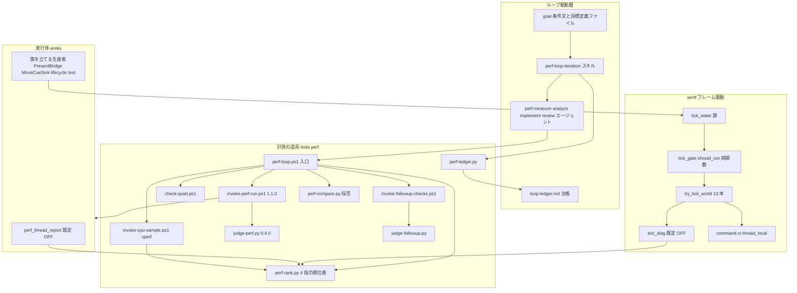
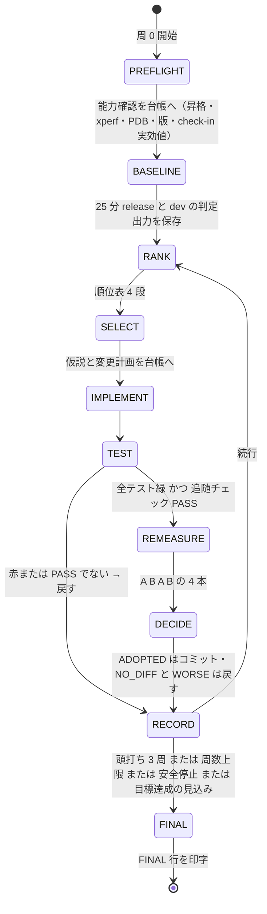
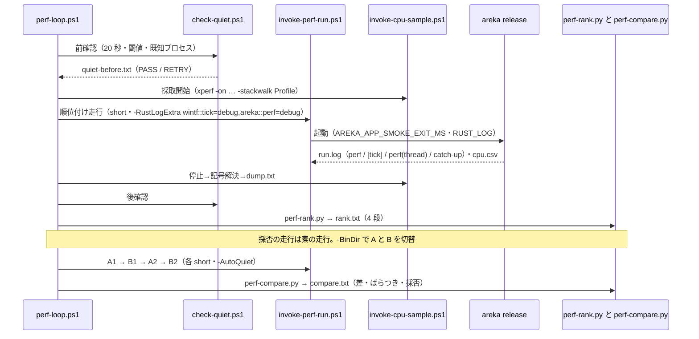
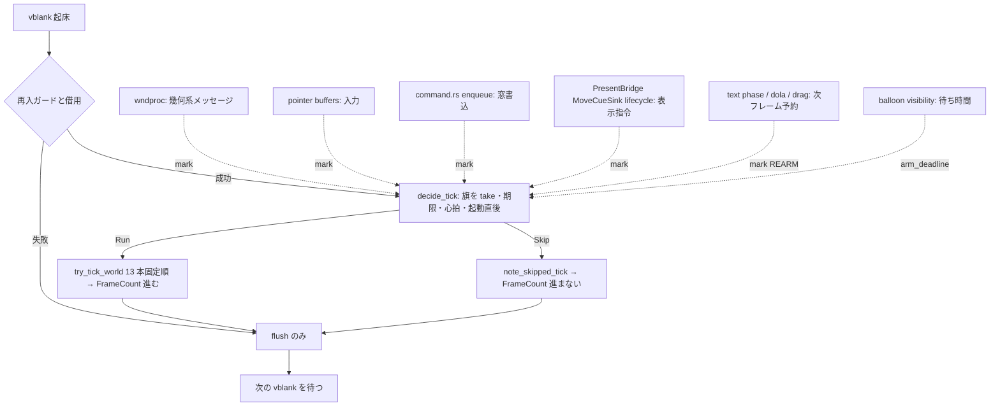

# Technical Design: areka-P0-draw-load-parity

> 作成 2026-08-22（`/kiro-spec-design`・Bevy 0.19.1 更新後の現行ツリー＝origin/main と同期済み・file:line は本日再突合）。**同日 設計ディスカッション（カテゴリ A）で反映**: 設計バリデーション Critical 1（終端行に走行固有トークン・見本は山括弧）・Critical 3（`PREFLIGHT` 相・段③の `UNAVAILABLE` 降格・`-Probe`）・軽微所見 2（`wake_bits_for_message` 純関数＋表のテスト）・3（ベースラインを 3 コマンド 3 ターンへ分割・check-in 実効値の確認）・4（catch-up は 3 系統とも `target=`）・file:line のずれ 5 件。Critical 2（スレッド別 CPU の採り方）は議題として別途解決。表記: 決定論テスト＝実機なしで走るテスト。「テスト間の状態汚染」＝並列実行する別テストの書き換えが見えてしまう問題。

## Overview

**Purpose**: 本機能は、areka の定常 CPU（release・ゴースト放置時のアイドル・1 コア換算）を **3.0% 未満**へ下げるために、「測る → 重い場所を突き止める → 直す → 測り直して採否を決める → 記録する」を**エージェントが自走で繰り返す仕組み**（目標定義・1 周の手順・計測の道具・台帳・停止条件）を整備し、その仕組みを実際に回して是正を着地させる。起動口は Claude Code 組み込みの `/goal` であり、本 spec は `/goal` に渡す条件文と、毎ターン同じ順で回るプロジェクトスキル、4 段（プロセス→スレッド→関数→フレーム駆動の相）の帰属を順位表として出す道具を供給する。

**Users**: 開発者は「開始の指示」と「停止後の報告の受領」だけを行う。ループの各ターンはメインのモデル（セッション設定・推奨 Fable・Opus 5 でも同じ手順）が回し、重い作業は Opus に固定した役割別サブエージェントが担う。後続の spec（`present-write-coherence`・`emo2-conformance-e2e`・`test-cage-determinism`）は、本 spec が着地させた tick の実形と `command.rs` の形を前提にする。

**Impact**: 既存の計測資産 `tools/perf/`（採取ランナー 1.0.0・判定スクリプト 0.3.2・fixture 17 件）を**壊さずに足す**（判定式・較正値・既存行の語彙と順序は不変、追加は末尾のみ）。wintf のフレーム駆動には「変化が無いときは 13 本を回さない」門（tick gate）と既定 OFF の相別観測（`wintf::tick`）が入る。areka には既定 OFF のスレッド別 CPU 報告（`areka::perf`）と、表示指令の到着を門へ知らせる 1 行ずつの結線が入る。`command.rs` の `SELF_INITIATED_DEPTH` はスレッド局所になる。`Cargo.toml` には触れない。

### Goals
- `/goal` へ渡すだけで、開発者の関与なしに「計測→順位付け→是正→再計測→採否→記録」が停止条件まで回る（要件 1）
- 4 段の帰属を**テキストの順位表**として決定論的に出す道具が 1 つの入口から回る（要件 2）
- 是正の候補（tick の門・実行器・areka 側の毎フレーム処理・tick 外の周期）を順位表で選び、安全側の規則で採否を決める（要件 3・5）
- 見た目の追随（クリック透過・ドラッグ・DPI・バルーン追従・Z 順）を劣化させず、エージェント自身が実走で確かめる（要件 4）
- 判断分岐は決定論テストで全網羅し、測り方・回し方を README に常設する（要件 6・7・8）

### Non-Goals
- 合成アルゴリズム本体（`build_plan`／`blit::execute`）の作り直し・表示 1 コマの適用経路（`presenter/show.rs`）の更なる最適化
- SSP の描画方式の調査・SSP の再採取（参考値 2026-08-15 を登記するのみ）
- DPI 遷移フレーム内の窓書込所要（`present-write-coherence` 所有）・メモリ常駐量やスレッド数そのものの削減（CPU との因果が出た場合のみ是正対象）
- テストハーネスの一本化・錠 `lock_self_initiated_for_test` の退役（`test-cage-determinism` 所有）

## Boundary Commitments

### This Spec Owns
- **自走ループの仕組み**: 目標定義ファイル `tools/perf/goals/draw-load-parity.toml`・`/goal` 条件文 `draw-load-parity.goal.md`・プロジェクトスキル `.claude/skills/perf-loop-iteration/`・役割別エージェント `.claude/agents/perf-*.md`・台帳 `loop-ledger.md`・STATUS 行の書式
- **計測の道具（`tools/perf/`）**: `perf-loop.ps1`（入口）・`check-quiet.ps1`・`invoke-cpu-sample.ps1`・`invoke-followup-checks.ps1`・`perf-rank.py`・`perf-compare.py`・`perf-ledger.py`・`judge-followup.py`・既存 `invoke-perf-run.ps1`（1.0.0→1.1.0）と `judge-perf.py`（0.3.2→0.4.0）の追加部分・fixture の追加
- **実行体の観測**: wintf `ecs/world/tick_diag.rs`（target `wintf::tick`）・areka `perf_thread_report.rs`（target `areka::perf`）
- **フレーム駆動の門**: wintf `ecs/world/tick_wake.rs`・`tick_gate.rs`・`tick_bridge.rs::tick_one_frame` の分岐・旗を立てる生産者の結線（wintf 内＋areka 内）
- **`crates/wintf/src/ecs/window/command.rs` 丸ごと**（`SELF_INITIATED_DEPTH` のスレッド局所化を含む）
- **`kiro-impl` の改修**（派遣モデルの規則）と `kiro-validate-impl` の同規則 1 節
- **是正候補の実装**（順位表で選ばれたもの）と、触った場所の改訂欄登記・他 spec への申し送り
- **登記**: `tools/perf/README.md` の新節・`doc/COMPAT_ARCHITECTURE.md` の性能目標・spec ディレクトリの結果台帳

### Out of Boundary
- `presenter/show.rs`・`mount.rs`（`present-write-coherence`）、`placement/follow` 系・`windowposition.rs`・`persist.rs`（`balloon-offset-dpi`）、テストハーネス本体（`test-cage-determinism`）——触る必要が生じたら担当 spec の実在と稼働を確認し（要件 8.5）、稼働中なら触らず即報告、非稼働なら変更して brief へ申し送る
- `Cargo.toml`（全ワークスペース）・`ghost-window-zorder` の Z 維持系の意味論（適用順と結果は不変のまま保つだけ）
- 判定式⑴〜⑷b の式そのもの・較正値の値（見直す場合は根拠欄と fixture 追加を伴う＝要件 5.8）
- `/goal` 本体・Claude Code の設定（`.claude/settings.json` の hooks／auto mode）

### Allowed Dependencies
- **下向き**: areka → wintf（旗を立てる結線は areka 側に置く）。wintf は areka／emo-text／seriko を知らない
- **道具**: Windows Performance Toolkit（`xperf.exe`・測定マシンに実在）・PowerShell 7・Python 3 標準ライブラリ（ビルドグラフ外）・Win32（`GetThreadTimes`・`GetThreadDescription`・`CreateToolhelp32Snapshot`・`GetProcessTimes`）
- **既存資産**: `invoke-perf-run.ps1` の出力ファイル規約（`run.log`・`cpu.csv`・`run-meta.txt`）・`judge-perf.py` の `parse_fields`／終了コード体系・`transition_diag` の前置ガード作法（`is_enabled`＝`tracing::enabled!`）・`AREKA_APP_SMOKE_EXIT_MS` の有界終了
- **禁止**: 実時間閾値をテストコードへ持ち込むこと・既存 perf 行／遷移観測行のフィールド名・順序・文言の変更・1 行内のフィールド名重複

### Revalidation Triggers
- `try_tick_world` の 13 本の順序や `FrameCount` の進め方を変えたとき（`present-write-coherence`・`emo2-conformance-e2e`・atom の決定論 8 遷移）
- `command.rs` の `SELF_INITIATED_DEPTH`／`flush` の意味論を変えたとき（`test-cage-determinism`）
- perf 行・遷移観測行・新設の `[tick]`／`perf(thread)` 行の語彙を変えたとき（`judge-perf.py` 0.4.0・fixture）
- `invoke-perf-run.ps1` の引数や `run-meta.txt` の項目を変えたとき（README・`perf-loop.ps1`）
- STATUS 行／FINAL 行の字面や `run=` トークンの形を変えたとき（`/goal` 条件文テンプレート・`perf-ledger.py`・README の見本）

## Architecture

### Existing Architecture Analysis
- **フレーム駆動は 1 系統**: vblank 検出スレッド `wintf-vsync`（`crates/wintf/src/runtime/tick_bridge.rs:65-68,114-134`・`DwmFlush` 待ち→全リスナ起床）と UI スレッドの `run_async_tick`（同 `:218-236`）→ `tick_one_frame`（同 `:187-210`・再入ガード→`try_borrow_mut`→`try_tick_world`→`flush_window_pos_commands`）。**スキップ判断は無い**。
- **`EcsWorld::try_tick_world`**（`crates/wintf/src/ecs/world/mod.rs:488-566`）: `measure_and_log_framerate`（:490・10 秒ごと `trace!`）→ `has_systems` 早期脱出（:493）→ `FrameCount` +1（:517-524）→ `TickStart`（:525-534）→ `FrameTime`（:536-541）→ ポインタ転送（:545）→ `try_run_schedule` ×13（:548-560）→ NCHITTEST キャッシュ消去（:563）。順序不変のテストは同 `:657-702`。
- **実行器**: `Cargo.toml:48-56` が `bevy_ecs` の `multi_threaded` を有効化。`world/mod.rs:104-160` で単スレッド固定は UISetup／GraphicsSetup／PreRenderSurface／RenderSurface／Composition／CommitComposition の 6 本（:117,135,141,146,151,156）。Input／Update／PreLayout／Layout／PostLayout／Draw／FrameFinalize の 7 本は既定（多スレッド・`bevy_ecs-0.19.1/src/schedule/executor/multi_threaded.rs:274` が毎 `run` でタスクプールの scope を開く）。`monitor_systems_transition_tests.rs:367-371` と `transition_diag_tests.rs:778-782` が「`schedules.insert(Schedule::new(Update));` の字面」を `assert!` で前提として固定している。
- **毎フレーム本体が走るもの**: `visual_hierarchy_sync_system`（`graphics/systems/visual_sync.rs:25-70`・全 `VisualGraphics` 走査）・`clear_transient_pointer_state`（`pointer/systems.rs:17-33`・全 `PointerState` 毎回書込）・areka `emo2_frame_system`（`crates/areka/src/emo2_boot/frame.rs:158-233`）→ `run_text_phase`（`frame/scale_text.rs:255-275`）→ `present_actor`（`crates/areka-emo-text/src/actor.rs:640` 起点・行レイアウト〜`render` は同 `:744-805`・毎フレーム再計算）・`run_balloon_visibility_phase`（`balloon_visibility_phase.rs:64-95`・毎フレーム観測）。
- **tick と独立に動くもの**: クリック透過の中継（`runtime/mod.rs:307-328`・vblank ごとに `click_wake` を叩く）と評価ループ（`clickthrough/controller.rs:416-457`）・カーソル監視 `wintf-cursor-monitor`（`clickthrough/monitor.rs:34` `POLL_INTERVAL=12ms`・`:87-88`）・ticker 3 系統（`crates/areka-ghost/src/ticker.rs:57-65`＝dispatcher 50ms／kanade 1000ms・`:262` ループ 16ms・catch-up 文言 `:203-206,223-226,305-308`・`target=` フィールドで系統を名乗る）・bevy タスクプール（`TaskPool (N)`）。
- **一括 flush と `command.rs`**: `SELF_INITIATED_DEPTH`（`command.rs:49`・`AtomicI32`）・錠 `lock_self_initiated_for_test`（`:76-79`・呼出 21 箇所／5 ファイル）・`SetWindowPosGuard`（`:96-114`）・`guarded_set_window_pos`（`:129-155`）。合流・1 バッチ適用・Z 指令不合流は atom が着地済み。
- **観測と道具**: `transition_diag.rs:54`（target `wintf::transition`）・`:622-627 is_enabled`・`:633-635 emit_line`。`invoke-perf-run.ps1:102-105`（`RUST_LOG_VALUE='info,areka_emo_present=debug'`・`-ConfirmQuiet` 必須・exit 2）。`judge-perf.py`: `SCRIPT_VERSION` :106・`WARMUP_EXCLUDE_SEC` :364・`IDLE_CPU_MAX_RELEASE_PCT` :380・`LONG_RUN_MIN_SPAN_SEC` :396・`J_CATCHUP_*` :451-452・`J_REQUIRED_LOG_KINDS` :466・`parse_fields` :588・`--selftest` :3470-3490。`crates/areka/src/main.rs:126-128`（subscriber）・`:793`（`AREKA_APP_SMOKE_EXIT_MS` の読取点）。
- **kiro-impl**: `.claude/skills/kiro-impl/SKILL.md` の Agent 派遣は実装者・レビュアー・デバッガーの 3 箇所（`model` 指定無し＝継承）。最終検証 `kiro-validate-impl` も subagent を派遣する（同 SKILL.md:72-84）。`.claude/agents/` は未作成。

### Architecture Pattern & Boundary Map



**Architecture Integration**:
- **選んだ形**: 「相単位で再入する状態機械（台帳が正本）＋旗方式の tick 門（判定は純関数）＋既定 OFF の観測 2 本＋1 入口の計測スクリプト群」。`/goal` は背景作業でターンを切り、判定役は会話しか見ないので、ループは**毎ターン 1 相だけ進めて STATUS 行を印字**する形に揃える（研究 §7.1〜7.2）。
- **境界**: ループ駆動層はファイルと標準出力だけで道具と話す（道具は Python 標準ライブラリ・PowerShell 7・ビルドグラフ外）。実行体側の変更は wintf の `ecs/world/`＋`runtime/tick_bridge.rs`＋`ecs/window/command.rs`、areka の結線 1 行ずつと報告モジュール 1 本に閉じる。
- **既存パターンの踏襲**: 前置ガード `is_enabled()`＝`tracing::enabled!`（`transition_diag`）・判定は純関数＋全組合せテスト（`should_run`）・採取は素の走行／順位付けは点灯した走行（`recompose-budget` の「合否に観測費用を混ぜない」）・判定スクリプトの自己較正 fixture（合格側と不合格側を両方）・構造検査は `include_str!` の字面（実行器前提テストの流儀）。
- **新設の理由**: 目標定義・スキル・エージェント（自走と模型の固定）／4 段の順位表（人の勘を使わない）／`tick_wake`＋`tick_gate`（変化の有無は World から引けない）／`tick_diag`（相別の所要はどこにも無い）／`perf_thread_report`（スレッド別の帰属を出す道具が無い）／`check-quiet`（人の確認を置換）／follow-up checks（立会いを置換）。
- **Steering 整合**: ログは `tracing`・構造化フィールド・既定水準で費用 0（logging.md）。テストは兄弟ファイル配置・1,000 行以下（structure.md）。本番 env は `AREKA_` 冠。wintf は areka を知らない（依存方向）。`main` への統合は PR のみ。

### Technology Stack

| Layer | Choice / Version | Role in Feature | Notes |
|-------|------------------|-----------------|-------|
| ループ駆動 | Claude Code 組み込み `/goal`（hooks 有効・auto mode）・プロジェクトスキル・`.claude/agents/*.md`（`model: opus`） | 開始・毎ターンの判定・役割別サブエージェント | `/loop` は不採用。`CLAUDE_CODE_GOAL_CHECKIN_MINUTES=60` |
| 道具（制御） | PowerShell 7（`#Requires -Version 7.0`・既存ランナーと同じ） | 実走・採取・xperf・操作注入・静寂確認 | `Add-Type` で user32（`SetCursorPos`・`SendInput`・`SetWindowPos`・`GetWindowLongPtr`） |
| 道具（解析） | Python 3 標準ライブラリのみ（既存 `judge-perf.py` と同じ制約） | 順位表・採否・台帳・追随判定・自己較正 | ビルドグラフ外。決定論的フォーマット |
| プロファイラ | Windows Performance Toolkit `xperf.exe`（測定マシンに実在） | CPU サンプリング＋呼出スタック・記号解決・テキスト dump | 記号は `CARGO_PROFILE_RELEASE_DEBUG=line-tables-only`（環境変数）で付与。代替 `wpaexporter` |
| 実行体 | Rust 2024・bevy_ecs 0.19.1（multi_threaded）・`tracing`・windows 0.62 | tick 門・相別観測・スレッド報告・`command.rs` | `Cargo.toml` 非接触。新規 crate 依存無し。`GetThreadTimes`／`GetThreadDescription`／ToolHelp の呼出は `windows` crate の feature を既に持つ側（wintf `api.rs`）に置く（下の補足） |

> 補足（上表の末尾）: `Cargo.toml` 非接触は要件 8.6 の要請である。`windows` crate の feature が足りない場合、feature 追加は `Cargo.toml` の変更になるので、**Win32 呼出は既に feature を持つ crate（wintf の `api.rs`）へ置き、areka はそれを呼ぶ**。実装時に `cargo tree -e features` で確認し、それでも足りなければ改訂欄に理由を登記し cage の brief へ申し送る（要件 8.6 の規定どおり）。

## File Structure Plan

### Directory Structure

```
tools/perf/
├── README.md                         # 既存。§13〜§17 を追加（ループの回し方・4 段の採り方・交互取得と静寂・SSP 参考値・追随チェック）
├── invoke-perf-run.ps1               # 既存 1.0.0 → 1.1.0: -AutoQuiet / -BinDir / -RustLogExtra / -OutDir 既定の変更なし（追加のみ）
├── judge-perf.py                     # 既存 0.3.2 → 0.4.0: catch-up 系統別＋時刻突合（集計モード）・[tick] 行の任意種読取・SSP 参考値の注記
├── perf-loop.ps1                     # 新規: 1 入口（measure-baseline / rank / prepare-ab / measure-ab / compare / followup / final / selftest）
├── check-quiet.ps1                   # 新規: 静寂確認の自動化（マシン全体 CPU・既知プロセス・再試行）
├── invoke-cpu-sample.ps1             # 新規: xperf 採取→停止→記号解決→dump.txt（1 コマンド）
├── invoke-followup-checks.ps1        # 新規: 有界実走＋操作注入（クリック透過・ドラッグ・DPI・バルーン追従）
├── perf-rank.py                      # 新規: 4 段の順位表（cpu.csv / perf(thread) / dump.txt / [tick] → rank.txt）
├── perf-compare.py                   # 新規: A→B→A→B の差とばらつき → ADOPTED / NO_DIFF / WORSE
├── perf-ledger.py                    # 新規: 台帳の追記・読取・状態・STATUS/FINAL 行の生成
├── judge-followup.py                 # 新規: 追随チェックのログ照合（PASS / FAIL / INCONCLUSIVE）
├── goals/
│   ├── draw-load-parity.toml         # 新規: 目標定義（判定式・閾値・版・水準・停止・静寂・check-in・追随チェック）
│   └── draw-load-parity.goal.md      # 新規: /goal へ渡す条件文（4,000 字以内）
├── fixtures/                         # 既存 17 件（judge-perf の自己較正）＋ judge-perf 追加分（catch-up 系統別・[tick] 行あり）
└── fixtures-loop/                    # 新規: rank / compare / ledger / followup の自己較正（合格側と不合格側を各 1 以上）
    ├── rank/<case>/…
    ├── compare/<case>/…
    ├── ledger/<case>/…
    └── followup/<case>/…
.claude/
├── skills/perf-loop-iteration/SKILL.md   # 新規: 1 周の手順（相単位・台帳駆動・STATUS 行）
├── agents/perf-measure.md                # 新規: model: opus（計測・順位表）
├── agents/perf-analyze.md                # 新規: model: opus（仮説の選択・候補カタログ参照）
├── agents/perf-implement.md              # 新規: model: opus（実装＋テスト）
├── agents/perf-review.md                 # 新規: model: opus（差分の独立レビュー・制約検査）
├── skills/kiro-impl/SKILL.md             # 既存: Preflight に「派遣モデルの決定」・派遣 3 箇所へ規則
└── skills/kiro-validate-impl/SKILL.md    # 既存: subagent 派遣へ同規則 1 節
crates/wintf/src/
├── ecs/world/tick_wake.rs            # 新規: 旗（AtomicU32 ビット集合＋期限）・mark / arm_deadline / take・wake_bits_for_message（純関数）
├── ecs/world/tick_wake_tests.rs      # 新規
├── ecs/world/tick_gate.rs            # 新規: TickGateInputs / TickDecision / should_run 純関数・定数
├── ecs/world/tick_gate_tests.rs      # 新規: 全組合せ・省略直後の反映・生産者一覧の字面検査
├── ecs/world/tick_diag.rs            # 新規: target wintf::tick・is_enabled・TickWindow 集約・行の組立
├── ecs/world/tick_diag_tests.rs      # 新規: 行の語彙（重複なし）・窓の切れ目・OFF で費用 0 の構造検査
├── ecs/world/mod.rs                  # 変更: decide_tick / try_tick_world の計時点・note_skipped / 再輸出
├── runtime/tick_bridge.rs            # 変更: tick_one_frame に門の分岐（Skip でも flush は呼ぶ）
├── ecs/window/command.rs             # 変更: SELF_INITIATED_DEPTH → thread_local! Cell<i32>・enqueue で mark(WINDOW_CMD)
├── ecs/window/command_threadlocal_tests.rs # 新規: スレッド隔離の決定論テスト
├── ecs/window_proc/dispatch.rs（既存の配送点） # 変更: メッセージ種別→旗の写像表で mark
├── ecs/pointer/buffers.rs            # 変更: 入力バッファ投入で mark(POINTER)
├── ecs/window/zorder_pair_maintain.rs# 変更: Z 順要求で mark(ZORDER)
├── ecs/drag/（ドラッグ状態の更新点）  # 変更: ドラッグ中は mark(DRAG)（self-rearm）
├── ecs/dola/mod.rs                   # 変更: 活性アニメータがあれば mark(REARM)
└── api.rs                            # 変更（必要時）: GetThreadTimes / GetThreadDescription / ToolHelp の安全ラッパ
├── ecs/graphics/systems/visual_sync.rs # 変更（候補 C18 採用時）: Added/Changed フィルタで母集合を絞る
├── ecs/pointer/systems.rs            # 変更（候補 C18 採用時）: 既定値のときは書かない
├── ecs/clickthrough/monitor.rs       # 変更（候補 C19 採用時）: 二段のポーリング周期
├── ecs/layout/systems/monitor_systems_transition_tests.rs # 変更（候補 C17 採用時）: 字面検査の対象文字列を新しい構築形へ
└── ecs/window/transition_diag_tests.rs # 変更（候補 C17 採用時）: 同上
crates/areka-emo-text/src/
└── actor.rs                          # 変更（候補 C18 採用時）: 入力鍵が同じならレイアウトと描画を省略
crates/areka-ghost/src/
└── ticker.rs                         # 変更（候補 C19 採用時）: ループ ticker の周期（SERIKO 制約を README へ）
crates/areka/src/
├── perf_thread_report.rs             # 新規: target areka::perf・perf(thread) / perf(process) 行・役割名の写像（純関数）・60 秒周期＋終了時
├── perf_thread_report_tests.rs       # 新規: 写像・行の語彙・決定論
├── main.rs                           # 変更: 起動時に報告器を（点灯時のみ）開始・終了時に最終スナップショット
├── emo2_boot/adapter.rs              # 変更: PresentBridge::send で mark(PRESENT)
├── emo2_boot/（MoveCueSink・lifecycle 送信端） # 変更: 送信で mark(PRESENT)
├── emo2_boot/frame/scale_text.rs     # 変更: talk 進行中は mark(REARM)
└── emo2_boot/balloon_visibility_phase.rs # 変更: 待ち時間の期限を arm_deadline
doc/COMPAT_ARCHITECTURE.md            # 変更: §8 に「areka 裁量の性能目標（CPU 絶対値 3.0% 未満・SSP 参考値）」
.kiro/specs/areka-P0-draw-load-parity/
├── loop-ledger.md                    # 新規（ループが生成・追記）
├── results/                          # 新規: baseline / iter-N / final の判定出力・順位表・対比表（日付付き）
└── requirements.md                   # 改訂欄へ（未達の登記・触った場所）
.kiro/specs/areka-P0-test-cage-determinism/brief.md ほか  # 申し送り（SELF_INITIATED_DEPTH 着地形・tick 構造・Cargo.toml）
```

### Modified Files（要点）
- `crates/wintf/src/ecs/world/mod.rs` — `try_tick_world` の各 `try_run_schedule` の前後で（点灯時のみ）計時し `TickWindow` へ加算、`FrameCount` 更新点は不変。新設 `decide_tick(now) -> TickDecision`（旗の `take`・心拍・起動直後）と `note_skipped_tick()`。既存テスト 2 本（:657,:707）は不変。
- `crates/wintf/src/runtime/tick_bridge.rs` — `tick_one_frame`: 再入ガード → `try_borrow_mut` → **`decide_tick`** → Run なら `try_tick_world`／Skip なら `note_skipped_tick` → 借用解放 → `flush_window_pos_commands()`（常に）。
- `crates/wintf/src/ecs/window/command.rs` — `static SELF_INITIATED_DEPTH: AtomicI32` → `thread_local! { static SELF_INITIATED_DEPTH: Cell<i32> }`。読み書き 3 箇所（`is_self_initiated` :86-88・`SetWindowPosGuard::new/drop` :96-114）のみ変更。`lock_self_initiated_for_test` は残し doc に「退役候補（cage が受ける）」を記す。`enqueue`（:657-679）で `tick_wake::mark(WINDOW_CMD)`。
- `tools/perf/invoke-perf-run.ps1` — 引数追加 `-AutoQuiet`（`-ConfirmQuiet` と排他・`check-quiet.ps1` を呼び `quiet-before.txt` を残す）・`-BinDir <dir>`（実行体の所在を上書き・run-meta に記録）・`-RustLogExtra <str>`（`RUST_LOG_VALUE` の末尾へ `,` 連結・run-meta に記録）。`SCRIPT_VERSION 1.1.0`。既存の引数・出力ファイル・CSV ヘッダは不変。
- `tools/perf/judge-perf.py` — `SCRIPT_VERSION 0.4.0`。集計モード §9 に catch-up の系統別（3 系統とも `target=` フィールドで識別）・各発生の時刻・直前の表示成立点との差・直前の `[tick]` 窓の壁時計を併記。`[tick]`／`perf(thread)` は**任意種**（`J_REQUIRED_LOG_KINDS` 不変）。較正値バナーへ SSP 参考値の注記。判定式は不変。fixture を両側で追加。
- `.claude/skills/kiro-impl/SKILL.md`・`.claude/skills/kiro-validate-impl/SKILL.md` — 下記 C4。

## System Flows

### Flow 1: `/goal` の 1 ターン＝1 相（状態機械）



- **各相の終わりに必ず STATUS 行**（`perf-ledger.py status`）を会話へ書き、ターンを終える。長い計測（BASELINE／REMEASURE／順位付け走行）は background Bash で起動し、相を `WAIT_<相名>` としてターンを終える。終了が新ターンとして届いたら `perf-loop.ps1 … --resume` で結果を回収して相を進める。
- **SELECT の規則**（要件 3.1）: 順位表の最上位から、⒜ Out of scope ⒝ 担当 spec が稼働中 ⒞ 台帳に「差なし／悪化」で既に記録、のいずれにも当たらない最初の項目。当たった項目は「選ばなかった理由」として台帳へ。
- **RECORD の判定**（要件 1.4・1.7・3.6）: `ADOPTED` → `git add <files> && git commit`（1 周 1 コミット）・streak=0。`NO_DIFF`／`WORSE`／テスト赤／追随 FAIL → `git restore --source=HEAD -- <files>`（新規は削除）・streak+1。計測失敗 → 道具を直す相（`TOOLFIX`）へ 1 回だけ入り、直らなければ `STOPPED reason=measure_failed`。
- **FINAL**: 短時間水準で採用が続き主指標が 3.0% を下回った周の次、または停止条件で入る。25 分 release＋dev を採り `judge-perf.py --mode verdict` を保存。全 PASS → `PERF-LOOP FINAL: GOAL_MET …`。それ以外 → `PERF-LOOP FINAL: STOPPED reason=… top_remaining=…` と requirements.md 改訂欄へ未達登記（要件 5.7）。

### Flow 2: 1 周の計測（順位付けの走行と採否の走行は別）



- 順位付けの走行は**点灯した走行**（観測行とサンプリングが CPU を押し上げるので合否には使わない）。採否の走行は**素の走行**（`RUST_LOG_VALUE` のまま）。
- ばらつき＝`|A1−A2|`（同一形を 2 回）。差＝`mean(B)−mean(A)`。`perf-compare.py` は副指標（⑴ p95・⑵ catch-up・⑶ 確保）も前後で並べ、悪化があれば `WORSE`。

### Flow 3: tick の門（変化が無いときは 13 本を回さない）



- `should_run` は純関数（入力の列挙は C16）。**疑わしいときは回す**: 起動直後（`TICK_GATE_WARMUP_FRAMES=600`）・心拍（`TICK_HEARTBEAT_FRAMES=30`）・旗の取得に失敗（あり得ないが `Err` 経路はログ＋Run）。
- 省略した tick は `FrameCount`／`FrameTime`／`TickStart` を進めない（D-2）。`flush_window_pos_commands()` は常に呼ぶ（D-3）。クリック透過の中継と評価（vblank 直結）は触らない（要件 4.1・4.2）。
- 旗は `take()` で原子的に読んで倒す。`take()` の後に立った旗は次の起床で拾われる（遅れは最大 1 画面更新周期＝要件 3.2）。

## Requirements Traceability

| Requirement | Summary | Components | Interfaces | Flows |
|---|---|---|---|---|
| 1.1 | 目標定義ファイル 1 つ | C1 | `goals/draw-load-parity.toml` スキーマ | Flow 1 |
| 1.2 | 1 周の順序・人の判断なし | C2, C5 | 相の遷移表・`perf-loop.ps1` サブコマンド | Flow 1, 2 |
| 1.3 | 台帳 1 ファイルへ追記 | C11 | 台帳エントリの固定キー | Flow 1 |
| 1.4 | 停止条件と報告 | C2, C11 | FINAL 行・`[stop]` 節 | Flow 1 |
| 1.5 | 開発者関与は開始と受領のみ | C1, C2, C6, C13 | 条件文に「開発者へ質問しない」・静寂自動化・追随自動化 | Flow 1 |
| 1.6 | 起動口は `/goal`・汎用の形 | C1, C2 | 条件文テンプレート・goal 名で切替 | Flow 1 |
| 1.7 | 差がばらつき内なら戻す | C10 | `perf-compare.py` の判定 | Flow 2 |
| 1.8 | 1 周 1 コミット・途中停止に強い | C2 | RECORD 相（選択的 add / restore） | Flow 1 |
| 1.9 | 決まった書式の表示行 | C11 | STATUS／FINAL 行の文法 | Flow 1 |
| 1.10 | メインのモデルを問わないスキル | C2 | `perf-loop-iteration` SKILL.md | Flow 1 |
| 1.11 | check-in 間隔・背景実行 | C1, C2 | `CLAUDE_CODE_GOAL_CHECKIN_MINUTES=60`・background Bash | Flow 1 |
| 1.12 | モデルの使い分け | C3 | `.claude/agents/perf-*.md`（`model: opus`） | Flow 1 |
| 1.13 | kiro-impl 改修 | C4 | 派遣モデルの規則 | — |
| 2.1 | 4 段の順位表 | C9, C14, C15, C8 | `rank.txt` 書式 | Flow 2 |
| 2.2 | プロセス全体は既存手段 | C7, C12 | `% Processor Time`・判定式不変 | Flow 2 |
| 2.3 | スレッド別 CPU＋役割名 | C14 | `perf(thread)` 行・役割写像 | Flow 2 |
| 2.4 | 関数別＝WPT サンプリング 1 コマンド | C8, C9 | `invoke-cpu-sample.ps1`・`CARGO_PROFILE_RELEASE_DEBUG` | Flow 2 |
| 2.5 | 相別の所要（既定 OFF・前置ガード） | C15 | `[tick] kind=window` 行 | Flow 3 |
| 2.6 | 壁時計と CPU の区別 | C14, C15, C9 | `wall_us`／`ui_cpu_us`・`perf(process)` | Flow 2 |
| 2.7 | 二水準の使い分け | C5, C1 | `[levels]`・`-Profile short|long` | Flow 1, 2 |
| 2.8 | 静寂確認の自動化 | C6, C7 | `check-quiet.ps1`・`-AutoQuiet` | Flow 2 |
| 2.9 | catch-up の系統別・時刻突合 | C12 | 集計モード §9 の拡張 | Flow 2 |
| 2.10 | 1 入口・決定論的出力 | C5, C9 | `perf-loop.ps1` サブコマンド | Flow 2 |
| 2.11 | 道具が壊れたら止める | C5, C8, C12 | `MEASURE_FAILED`・記号解決の関門・`--selftest` | Flow 1 |
| 2.12 | 行の語彙規律 | C14, C15, C12 | フィールド名重複なし・既存行不変 | — |
| 3.1 | 最上位から選ぶ・理由を残す | C2, C3 | SELECT の規則・台帳 `skipped_candidates` | Flow 1 |
| 3.2 | 変化なし tick の省略（候補） | C16 | `should_run`・遅れ上限 1 周期 | Flow 3 |
| 3.3 | 候補群 | C17, C18, C19 | 候補カタログ | Flow 1 |
| 3.4 | 13 本の順序不変 | C16 | `try_tick_world` 不変・既存テスト | Flow 3 |
| 3.5 | Z 指令の適用順・結果不変・未強制前提の文書化 | C20 | `command.rs` doc・`command_coalesce_tests.rs` 緑 | Flow 3 |
| 3.6 | 大きい変更の採否規則 | C10, C2 | 3 条件（全テスト・追随・ばらつき超え） | Flow 1 |
| 3.7 | 失敗経路は回す | C16 | `decide_tick` の `Err` 腕 | Flow 3 |
| 3.8 | 既定で観測費用 0 | C15, C14 | 前置ガード | Flow 3 |
| 4.1 | αマスク変化→次の画面更新で判定 | C16 | 中継を触らない・表示指令は旗 | Flow 3 |
| 4.2 | カーソル監視の周期に追随 | C16, C19 | `POLL_INTERVAL` 不変（候補で触るなら追随テスト） | — |
| 4.3 | ドラッグ中は毎画面更新 | C16 | `DRAG` 旗（self-rearm） | Flow 3 |
| 4.4 | DPI 遷移は回る・決定論 8 遷移 PASS | C16 | `WM_DPICHANGED`→旗・harness 非依存 | Flow 3 |
| 4.5 | バルーン表示・追従・Z 順 | C16, C20 | `PRESENT`／`WINDOW_CMD`／`ZORDER` 旗・既存テスト群 | Flow 3 |
| 4.6 | talk 中のタイミング不変 | C16, C10 | `REARM`（talk 進行中）・⑴ p95 不退行 | Flow 3 |
| 4.7 | 追随をエージェント自身が確認 | C13 | `invoke-followup-checks.ps1`＋`judge-followup.py` | Flow 1 |
| 5.1 | 目標＝CPU 絶対値 3.0% 未満 | C1, C12 | `IDLE_CPU_MAX_RELEASE_PCT=3.0` 継承 | Flow 1 |
| 5.2 | SSP 描画方式は調べない・参考値登記 | C12, C21 | バナー注記・README §16 | — |
| 5.3 | 判定式⑴〜⑷b をそのまま | C12 | `judge-perf.py --mode verdict` | Flow 1 |
| 5.4 | 発話中の頂を記録・合否外 | C9, C11 | 順位表①に頂を併記・台帳 | Flow 2 |
| 5.5 | リーク・単調上昇の再発なし | C12 | ⑷b 収束判定・25 分 | Flow 1 |
| 5.6 | 最終判定 25 分・出力保存 | C2, C5 | `results/final-<date>/` | Flow 1 |
| 5.7 | 未達の登記 | C2, C21 | requirements.md 改訂欄 | Flow 1 |
| 5.8 | 較正値見直しの根拠と fixture | C12 | バナー注記・`--selftest` | — |
| 5.9 | COMPAT への登記 | C21 | `doc/COMPAT_ARCHITECTURE.md` §8 | — |
| 6.1 | 変化判定の全組合せ | C16 | `tick_gate_tests.rs` | — |
| 6.2 | 省略直後の反映 | C16 | headless tick のテスト | — |
| 6.3 | 順序不変の維持 | C16 | 既存 `:657,:707`＋省略経路 | — |
| 6.4 | Z 指令テスト群を 1 本も赤にしない | C20 | `command_coalesce_tests.rs` ほか | — |
| 6.5 | 実時間閾値を合否に使わない | C16, C15 | 較正値はスクリプト側 | — |
| 6.6 | `SELF_INITIATED_DEPTH` の隔離・錠の申し送り | C20 | `command_threadlocal_tests.rs`・cage brief | — |
| 6.7 | 採否規則・順位表生成の fixture テスト | C9, C10, C11 | `fixtures-loop/`・`perf-loop.ps1 selftest` | — |
| 6.8 | 1,000 行・兄弟配置 | 全 | File Structure Plan | — |
| 7.1 | ループの回し方を README へ | C21 | README §13 | — |
| 7.2 | 4 段の採り方を README へ | C21 | README §14 | — |
| 7.3 | 交互取得と静寂自動化を README へ | C21 | README §15 | — |
| 7.4 | SSP 参考値と再採取手順を README へ | C21 | README §16 | — |
| 7.5 | 判定スクリプト拡張には fixture 両側 | C12 | `fixtures/` 追加 | — |
| 7.6 | 結果を日付付きで spec へ・対比表 | C2, C11 | `results/summary.md` | Flow 1 |
| 8.1 | 設計前 rebase・file:line 再突合 | — | 本書冒頭（origin/main 同期済み・再突合済み） | — |
| 8.2 | `SELF_INITIATED_DEPTH` 着地形を cage へ | C20, C21 | cage brief 追記 | — |
| 8.3 | tick 変更を pwc・e2e へ | C21 | 各 brief 追記 | — |
| 8.4 | 遷移フレームの未特定区間は合否外 | C21 | README／台帳の注記 | — |
| 8.5 | 別 spec 担当ファイルの扱い | C2, C3 | SELECT の規則（稼働確認） | Flow 1 |
| 8.6 | `Cargo.toml` 非接触 | C8, 全 | `CARGO_PROFILE_RELEASE_DEBUG` 環境変数・Win32 は wintf `api.rs` | — |

## Components and Interfaces

| Component | Domain/Layer | Intent | Req Coverage | Key Dependencies (P0/P1) | Contracts |
|---|---|---|---|---|---|
| C1 目標定義と条件文 | ループ駆動 | 目標を 1 ファイルに置き `/goal` へ渡す文を定める | 1.1, 1.5, 1.6, 1.11, 2.7, 5.1 | C11 (P0) | Batch, State |
| C2 `perf-loop-iteration` スキル | ループ駆動 | 毎ターン 1 相を進める手順 | 1.2, 1.4, 1.8, 1.10, 3.1, 3.6, 5.6, 5.7, 7.6, 8.5 | C3, C5, C11 (P0) | Batch |
| C3 `perf-*` エージェント | ループ駆動 | 重い作業を Opus で担う役割定義 | 1.12, 3.1, 8.5 | C5 (P0) | Service |
| C4 kiro-impl 改修 | 開発プロセス | 派遣モデルの規則 | 1.13 | — | Service |
| C5 `perf-loop.ps1` | 道具 | 1 入口（採取・順位表・比較・追随・最終・自己較正） | 1.2, 2.7, 2.10, 2.11, 5.6 | C6–C13 (P0) | Batch |
| C6 `check-quiet.ps1` | 道具 | 静寂確認の自動化 | 1.5, 2.8 | — | Batch |
| C7 `invoke-perf-run.ps1` 1.1.0 | 道具 | 採取ランナーの追加引数 | 2.2, 2.8 | C6 (P0) | Batch |
| C8 `invoke-cpu-sample.ps1` | 道具 | xperf 採取→記号解決→dump | 2.4, 2.11, 8.6 | WPT (P0) | Batch |
| C9 `perf-rank.py` | 道具 | 4 段の順位表 | 2.1, 2.6, 2.10, 5.4, 6.7 | C14, C15, C8 (P0) | Batch |
| C10 `perf-compare.py` | 道具 | 差・ばらつき・採否 | 1.7, 3.6, 4.6, 6.7 | C12 (P1) | Batch |
| C11 `perf-ledger.py` | 道具 | 台帳の追記・読取・STATUS 行 | 1.3, 1.4, 1.9, 5.4, 6.7, 7.6 | — | Batch, State |
| C12 `judge-perf.py` 0.4.0 | 道具 | catch-up 系統別・任意種読取・参考値注記 | 2.2, 2.9, 2.11, 2.12, 5.1–5.3, 5.5, 5.8, 7.5 | — | Batch |
| C13 追随チェック | 道具 | 実走＋操作注入＋ログ照合 | 1.5, 4.7 | C7 (P1) | Batch |
| C14 `perf_thread_report` | 実行体 areka | スレッド別 CPU 行（既定 OFF） | 2.3, 2.6, 2.12, 3.8 | wintf `api.rs` (P1) | Event |
| C15 `tick_diag` | 実行体 wintf | 相別の所要行（既定 OFF） | 2.5, 2.6, 2.12, 3.8, 6.5 | — | Event |
| C16 tick の門 | 実行体 wintf＋areka 結線 | 変化が無いとき 13 本を回さない | 3.2, 3.4, 3.7, 4.1–4.6, 6.1–6.3, 6.5 | C15 (P1) | Service, State |
| C17 実行器見直し（候補） | 実行体 wintf | 7 本の多スレッド実行器 | 3.3 | — | — |
| C18 areka 側の変化時のみ化（候補） | 実行体 areka／emo-text | 文字層レイアウト・全 visual 走査・ポインタ毎回書込 | 3.3 | — | — |
| C19 tick 外の周期（候補） | 実行体 wintf／ghost | カーソル監視 12ms・ループ ticker 16ms | 3.3, 4.2 | — | — |
| C20 `command.rs` | 実行体 wintf | `SELF_INITIATED_DEPTH` スレッド局所化・未強制前提の文書化 | 3.5, 4.5, 6.4, 6.6, 8.2 | — | State |
| C21 登記 | 文書 | README・COMPAT・brief 申し送り | 5.2, 5.7, 5.9, 7.1–7.4, 8.2–8.4 | — | — |

### ループ駆動層

#### C1 目標定義ファイルと `/goal` 条件文

| Field | Detail |
|---|---|
| Intent | 合否・水準・停止・静寂・check-in を 1 ファイルに置き、`/goal` に渡す条件文を同じ定数から作る |
| Requirements | 1.1, 1.5, 1.6, 1.11, 2.7, 5.1 |

**Responsibilities & Constraints**
- `tools/perf/goals/<goal>.toml` が唯一の所在。道具とスキルはこれだけを読む。人の判断を合否に使わない。
- `<goal>.goal.md` は `/goal` に貼る条件文（4,000 字以内）。達成／不可能の判定は **FINAL 行の字面**で行う形に書く。条件文と STATUS／FINAL 行の語は `perf-ledger.py` の定数から生成する（字面の二重管理を避ける）。
- **終端行には走行固有トークンを入れる**（設計バリデーション Critical 1）: 判定役は会話に現れた文字列しか見ず、テンプレートと実出力を区別できない。そこで `perf-ledger.py goal-check`（周 0）が 8 桁の乱数 `run=<token>` を生成して台帳の `状態` へ書き、FINAL 行は `PERF-LOOP FINAL: GOAL_MET run=<token> …`／`PERF-LOOP FINAL: STOPPED run=<token> reason=…` の形でのみ出す。`/goal` の条件文はこのトークン込みの字面を要求する（`draw-load-parity.goal.md` はテンプレートで、起動時に `perf-ledger.py goal-text` がトークンを埋めた文を出力し、それを `/goal` へ貼る）。**スキル本文・README・design・goal テンプレートの書式見本は実出力と一致しない書き方（山括弧プレースホルダ）に統一し、`perf-ledger.py --selftest` に「見本行が判定の正規表現に一致しないこと」を 1 ケース固定する**（`fixtures-loop/ledger/`）。

**Dependencies**: Outbound — C11（STATUS 行の語・P0）・C12（判定スクリプト版・P0）。

**Contracts**: Batch [x] / State [x]

##### 目標定義ファイル（TOML）
```toml
[goal]
name = "draw-load-parity"
spec_dir = ".kiro/specs/areka-P0-draw-load-parity"
ledger = "loop-ledger.md"              # spec_dir 相対
results_dir = "results"                # spec_dir 相対
judge_script = "tools/perf/judge-perf.py"
judge_version = "0.4.0"                # 版が違えば MEASURE_FAILED

[target]                               # 合否の定義（判定式は judge-perf.py のもの）
idle_cpu_release_max_pct = 3.0         # 狭義の未満・IDLE_CPU_MAX_RELEASE_PCT と一致していること
formulas = ["1_frame_interval_p95", "2_catchup_zero", "3_alloc_zero", "4a_idle_cpu_release", "4b_no_monotonic_rise"]
builds_final = ["release", "dev"]      # ⑴〜⑶ は両方・⑷ は release

[levels]
short_profile = "short"                # 7 分：順位付けと採否
long_profile = "long"                  # 25 分：ベースラインと最終判定
ab_sequence = ["A", "B", "A", "B"]
iteration_build = "release"            # 採否の走行ビルド
release_debug_env = "line-tables-only" # CARGO_PROFILE_RELEASE_DEBUG の値

[primary_metric]
name = "steady_idle_cpu_mean_pct"      # judge-perf 集計モードの定常平均
noise_floor_pct = 0.30                 # |A1-A2| がこれ未満でも床値を物差しにする
[secondary_metrics]                    # 悪化すると WORSE
must_not_regress = ["frame_interval_p95_ms", "catchup_count", "alloc_count"]

[stop]
max_no_gain_streak = 3
max_iterations = 30
toolfix_retry = 1

[quiet]
machine_cpu_max_pct = 10.0
sample_sec = 20
heavy_process_names = ["cargo", "rustc", "rust-analyzer", "msbuild", "link", "cl", "areka", "python"]
retry_max = 3
retry_wait_sec = 60

[followup]
required = ["clickthrough", "drag", "dpi", "balloon_follow"]
exit_ms = 120000

[goal_runtime]
checkin_minutes = 60                   # CLAUDE_CODE_GOAL_CHECKIN_MINUTES
main_model_recommended = "fable"       # README に記す推奨（Opus 5 でも同じ手順で回る）
```

##### `/goal` 条件文テンプレート（要旨・全文は `draw-load-parity.goal.md`）
```
目標: areka の release アイドル CPU（1 コア換算・定常平均）を 3.0% 未満にし、判定式⑴〜⑷b が 25 分の最終判定で全て合格すること。
毎ターンの手順: プロジェクトスキル `perf-loop-iteration` を引数 `draw-load-parity` で 1 回だけ呼び、その最後に出る `PERF-LOOP STATUS …` 行を一字も変えずに返答の最後の行として書く。スキルが相を 1 つ進めるので、1 ターンで 2 相以上進めない。背景コマンドが走っている間は待つ（check-in が届いたら出力を読んで待つと答える）。
達成の判定: 会話に `PERF-LOOP FINAL: GOAL_MET run=<token>`（<token> は起動時に埋めた 8 桁）で始まる行が現れたとき。
不可能の判定: 会話に `PERF-LOOP FINAL: STOPPED run=<token> reason=` で始まる行が現れたとき（頭打ち・安全停止・道具の故障・周数上限 30 のいずれか）。
注意: 上の 2 行は山括弧つきの見本であり、実出力とは一致しない（判定は実トークン込みの字面でのみ行う）。
制約: 開発者へ質問しない・合否は judge-perf.py 0.4.0 の出力だけで決める・Cargo.toml を変更しない・採用は 1 周 1 コミット・採用しない変更は戻す・台帳 loop-ledger.md 以外に判断の記憶を持たない。
```

**Implementation Notes**
- Validation: `perf-ledger.py goal-check` が TOML の必須キー・`judge_version` と `SCRIPT_VERSION` の一致・`idle_cpu_release_max_pct` と `IDLE_CPU_MAX_RELEASE_PCT` の一致を確かめ、違えば exit 3（ループの周 0 で必ず走る）。
- Risks: 条件文が 4,000 字を超える → テンプレートは 1,500 字程度に抑え、詳細は README へ。

#### C2 プロジェクトスキル `perf-loop-iteration`

| Field | Detail |
|---|---|
| Intent | どのモデルが回しても同じ順で 1 相を進める手順（台帳駆動・会話の記憶に依らない） |
| Requirements | 1.2, 1.4, 1.8, 1.10, 3.1, 3.6, 5.6, 5.7, 7.6, 8.5 |

**Responsibilities & Constraints**
- 入力は goal 名のみ。手順: ⒈ `perf-ledger.py state --goal <goal>` で `iteration`／`phase`／`pending_run`／`streak` を読む ⒉ 相の遷移表（下）に従い**1 相だけ**実行 ⒊ `perf-ledger.py append`／`set-phase` で台帳を更新 ⒋ `perf-ledger.py status` の出力行を**返答の最後の行**として書く。
- 重い作業は Agent ツールで C3 のエージェントへ（`subagent_type` にエージェント名）。サブエージェントには結論だけを返させる。
- 計測コマンドは background Bash で起動し `WAIT_*` 相で終える。再入時は `perf-loop.ps1 … --resume <run-dir>` で結果の存在を確かめる（未完なら STATUS に `waiting` を書いて終える）。
- git 操作はスキル（メイン）だけが行う: 採用＝台帳の `files_changed` を選択的に `git add`＋`git commit -m "perf(<goal>): iter <n> <hypothesis>"`。不採用＝`git restore --source=HEAD -- <files>`・新規ファイルは削除。`git add -A`・`reset --hard` は使わない。
- check-in（30/60 分）が届いたターンは、背景コマンドの出力の末尾を読み「進行中なら待つ」「終了していれば結果回収の相へ」と答える。

##### 相の遷移表（Batch 契約）
| 相 | 実行内容（誰が） | 終了条件 → 次の相 |
|---|---|---|
| `PREFLIGHT` | `perf-loop.ps1 preflight`（同期・1 回）: 昇格の有無・`xperf.exe` の実在・`CARGO_PROFILE_RELEASE_DEBUG` で PDB が出るか（直近ビルドの PDB 有無）・`judge_version` と `SCRIPT_VERSION` の一致・Python／PowerShell 版・`CLAUDE_CODE_GOAL_CHECKIN_MINUTES` の**実効値**（環境変数を読む）・`perf-loop.ps1 selftest`。結果を台帳 `状態` の `capabilities` 行と STATUS 行へ。**段③不可（昇格なし）は停止ではなく `function_stage=UNAVAILABLE` として記録**し、以後の順位表は段①②④で続行 | 道具の自己較正が赤／版不一致 → `TOOLFIX`。それ以外 → `BASELINE` |
| `BASELINE` | `perf-loop.ps1 measure-baseline -Build release`（background・25 分）→ 次ターン `-Build dev`（25 分）→ 次ターン `rank-run`（順位付け 7 分＋点灯＋サンプリング）。**3 コマンドに分け、各 1 ターン**（どれも check-in 間隔 30 分以内に収める＝要件 1.11） | 3 本完了 → `RANK`（結果は `results/baseline-<date>/`） |
| `RANK` | perf-measure エージェント: `perf-loop.ps1 rank <run>` → `rank.txt` | → `SELECT` |
| `SELECT` | perf-analyze エージェント: 順位表＋候補カタログ（C16〜C20）＋台帳の既試行を読み、仮説・変更計画・触るファイル・選ばなかった理由・規模見立てを返す | 候補が無い（全て Out of scope／稼働中／既試行）→ `FINAL`（`STOPPED reason=plateau`）。あれば → `IMPLEMENT` |
| `IMPLEMENT` | `perf-loop.ps1 prepare-ab`（A の実行体を退避）→ perf-implement エージェント（変更＋テスト追加） | → `TEST` |
| `TEST` | perf-review エージェント（差分レビュー・制約検査）→ `cargo test --workspace`（background 可）→ `perf-loop.ps1 followup` | 緑＋PASS → `REMEASURE`。赤／FAIL／REJECTED → `RECORD`（verdict=`TESTS_RED` or `FOLLOWUP_FAIL`） |
| `REMEASURE` | `perf-loop.ps1 measure-ab`（background・A1 B1 A2 B2） | 完了 → `DECIDE` |
| `DECIDE` | `perf-loop.ps1 compare` → `ADOPTED`／`NO_DIFF`／`WORSE`／`MEASURE_FAILED` | → `RECORD` |
| `RECORD` | 採用はコミット・不採用は戻す・台帳へ追記・streak 更新・`results/iter-<n>/` へ判定出力を複製 | streak≥3 or iter≥上限 → `FINAL`。主指標が目標未満で採用 → `FINAL`。それ以外 → `RANK` |
| `TOOLFIX` | 計測失敗（exit 4・自己較正赤・版不一致）時に 1 回だけ（能力不足 exit 5 はここへ来ない）: perf-implement エージェントが道具を直し `perf-loop.ps1 selftest` | 緑 → 直前の相へ戻る。赤 → `FINAL`（`STOPPED reason=measure_failed`） |
| `FINAL` | `perf-loop.ps1 final`（background・25 分 × release/dev）→ verdict 保存 → `results/summary.md`（brief 旧数値との対比表）→ 未達なら requirements.md 改訂欄へ登記 | FINAL 行を印字して終了 |

**Implementation Notes**
- Integration: スキルは `disable-model-invocation: true` にしない（`/goal` の条件文から名指しで呼ばれる）。
- Validation: 遷移表は `perf-ledger.py next-phase` の純関数として実装し、fixture で全遷移を固定する（要件 6.7）。
- Risks: メインが 1 ターンで相を 2 つ進めてしまう → 条件文とスキル冒頭の両方に「1 ターン 1 相」を明記する。機械的な強制はしない（ターン境界は道具から見えない）。STATUS 行の `phase` が毎ターン 1 つずつ進むことを判定役が会話で読める形に留める。

#### C3 役割別エージェント定義（`.claude/agents/perf-*.md`）

| Field | Detail |
|---|---|
| Intent | 重い作業を Opus で担わせ、誰が呼んでも Opus 以下で動く |
| Requirements | 1.12, 3.1, 8.5 |

**Responsibilities & Constraints**（frontmatter は全て `model: opus`・`tools` は最小）
- `perf-measure`（tools: Bash, Read, Glob, Grep）: `perf-loop.ps1 rank|compare` を回し、順位表（4 段・上位 10）と数値だけを返す。
- `perf-analyze`（tools: Read, Grep, Glob, Bash）: 順位表・候補カタログ（design C16〜C20）・台帳を読み、**最上位から**選ぶ。担当 spec の稼働確認（`.kiro/specs/` 直下の `spec.json.phase` が `implementation`/`tasks-generated` 以降かつ brief の担当ファイル集合に当たるか）を行い、選ばなかった理由を列挙して返す（要件 3.1・8.5）。
- `perf-implement`（tools: Read, Edit, Write, Bash, Glob, Grep）: 変更計画どおり実装し、決定論テスト（要件 6）を兄弟ファイルへ置き、`cargo test -p <crate>` まで通して触ったファイル一覧を返す。`Cargo.toml` は触らない。破壊的 git 禁止。
- `perf-review`（tools: Read, Bash, Grep, Glob）: `git diff` を読み、制約（13 本の順序不変・Z 指令テスト緑・既存行の語彙不変・前置ガード・1,000 行・兄弟配置・`Cargo.toml` 非接触）を検査し `APPROVED|REJECTED` と所見を返す。
- 全エージェントの本文冒頭: 「最初の 1 行に、システムプロンプトの『You are powered by the model named …』の名を `[agent-model] <name>` として印字する」（`model` 指定が効かない環境で黙って継承しないため）。

**Dependencies**: Outbound — C5（P0）。

**Implementation Notes**
- Validation: スキルはエージェントの返答冒頭 `[agent-model]` を読み、`opus` 系でなければ台帳に警告を記録して続行（停止はしない）。

#### C4 `kiro-impl` の改修（派遣モデルの規則）

| Field | Detail |
|---|---|
| Intent | kiro-impl を回すエージェントが Fable 系なら、派遣するサブエージェントを Opus 以下へ落とす |
| Requirements | 1.13 |

**Service Interface（SKILL.md への追記・要旨）**
```
### Preflight — Determine dispatch model (added by areka-P0-draw-load-parity)
- Read your own system prompt line "You are powered by the model named <NAME>".
- If <NAME> contains "Fable" (case-insensitive) OR the line cannot be found → DISPATCH_MODEL = "opus".
- Else (already Opus/Sonnet/Haiku) → DISPATCH_MODEL = inherit (omit the `model` argument).
- Apply to EVERY Agent tool dispatch made by this skill run: implementer (Step 3a), reviewer (3c), debugger (3g),
  and the subagents dispatched by `/kiro-validate-impl` when it is run from this skill (pass the rule on in its prompt).
- Record the decision once in the run output: "dispatch model: opus" or "dispatch model: inherit".
```
- `kiro-validate-impl/SKILL.md` の「Subagent Dispatch」へ 1 節: 「呼び出し元が DISPATCH_MODEL=opus を渡してきたら、各 subagent の Agent 呼出に `model: "opus"` を付ける。単独実行時は自分で同じ判別を行う」。
- 本改修は実装タスクの**先頭**（task 1）で行い、以後の全タスクがこの規則で回る。

### 計測の道具（`tools/perf/`）

#### C5 `perf-loop.ps1`（1 入口）

| Field | Detail |
|---|---|
| Intent | 採取・順位表・比較・追随・最終・自己較正を 1 つの入口から回す（要件 2.10） |
| Requirements | 1.2, 2.7, 2.10, 2.11, 5.6 |

##### Batch / Job Contract
- 呼び方: `pwsh -File tools/perf/perf-loop.ps1 <subcommand> -Goal <name> [-Iter <n>] [-RunDir <dir>] [-Resume]`。
- サブコマンド: `preflight`（能力確認＝昇格・`xperf.exe`・PDB・版一致・Python／PowerShell 版・`CLAUDE_CODE_GOAL_CHECKIN_MINUTES` 実効値・selftest。結果は `preflight.txt`＋標準出力。段③不可は exit 0 のまま `function_stage=UNAVAILABLE reason=<not_elevated|no_xperf|no_pdb>` を報告）／`measure-baseline -Build release|dev`（25 分 × 1 本）／`rank-run`（順位付け 7 分＋点灯＋サンプリング〔段③が UNAVAILABLE なら採取を省く〕）／`rank -RunDir`（`perf-rank.py` → `rank.txt`）／`prepare-ab`（`cargo build --release` with `CARGO_PROFILE_RELEASE_DEBUG`・実行体と PDB と 32bit helper を `<iter>/bin-A/` へ複製）／`measure-ab`（B をビルド→`bin-B/`→A1 B1 A2 B2 を `-AutoQuiet -BinDir`）／`compare`（`perf-compare.py` → `compare.txt`＋`compare.json`）／`followup`（C13）／`final`（25 分 × release/dev→`judge-perf.py --mode verdict`）／`selftest`（`judge-perf.py --selftest`・`perf-rank.py --selftest`・`perf-compare.py --selftest`・`perf-ledger.py --selftest`・`judge-followup.py --selftest`・`invoke-cpu-sample.ps1 -SelfTest`）。
- 出力先: `%LOCALAPPDATA%\areka-diag\perf-loop\<goal>\iter-<n>\{rank,A1,B1,A2,B2,bin-A,bin-B,followup}\`。各走行は既存ランナーの 3 ファイル＋`quiet-before.txt`／`quiet-after.txt`。
- 終了コード: 0 完了／1 実走失敗／2 静寂でない（再試行上限超）／3 引数／4 計測失敗（空採取・記号解決ゼロ・自己較正赤・判定スクリプト版不一致）／5 能力不足（昇格なし等＝`UNAVAILABLE`・段③のみ省いて続行可）。**4 は `MEASURE_FAILED`** として台帳へ。**5 は停止の理由にしない**（順位表の段③に `UNAVAILABLE` を記して続行）。
- 標準出力の末尾に必ず `PERF-LOOP RESULT <subcommand> code=<n> dir=<path>` の 1 行（背景終了で会話へ届く形）。
- 冪等: 同じ `-RunDir` で `-Resume` を付けると既存の成果物を再利用する。

**Implementation Notes**
- Integration: `cargo test --workspace` はスキル側で回す（道具ではない）。
- Risks: ベースラインは release 25 分・dev 25 分・順位付け 7 分を**別コマンド・別ターン**で回す（1 コマンド約 60 分にまとめると check-in が割り込む＝要件 1.11）。`preflight` が読んだ `CLAUDE_CODE_GOAL_CHECKIN_MINUTES` の実効値が 25 分未満なら台帳に警告を書き、25 分水準の背景実行中に届く check-in は「待つ」で受ける。

#### C6 `check-quiet.ps1`

| Field | Detail |
|---|---|
| Intent | 人の静寂確認を機械の確認へ置き換える |
| Requirements | 1.5, 2.8 |

##### Batch / Job Contract
- 入力: `-Goal`（閾値は TOML）または `-MachineCpuMaxPct -SampleSec -HeavyProcessNames -TargetPid`。
- 測るもの: `\Processor(_Total)\% Processor Time` を `sample_sec` 秒・1 秒刻み（`Get-Counter`）の平均。`Get-Process` で既知名のプロセス（`-TargetPid` の areka は除外）。
- 出力: `quiet-<stage>.txt`（平均・最大・該当プロセス一覧・判定・時刻）。exit 0 静か／2 静かでない。`retry_max` 回まで `retry_wait_sec` 待って再確認するのは呼び出し側（C7／C5）。
- 決定論: 同じ入力ファイルから同じ文面（時刻はフィールドとして持つ）。

#### C7 `invoke-perf-run.ps1` 1.1.0（追加のみ）

| Field | Detail |
|---|---|
| Intent | 既存ランナーに自動静寂・実行体の所在・追加ログ指定を足す |
| Requirements | 2.2, 2.8 |

- `-AutoQuiet`: `-ConfirmQuiet` と排他。`check-quiet.ps1` を起動前に呼び、`quiet-before.txt` を `-OutDir` へ。静かでなければ exit 2（文言「静寂状態の自動確認に失敗」）。run-meta に `quiet_mode = auto|confirmed`。
- `-BinDir <dir>`: 実行体・helper の所在を `target/<build>` から上書き。run-meta に `bin_dir` と実行体のハッシュ（SHA-256）を記録（A/B の取り違え防止）。
- `-RustLogExtra <str>`: `RUST_LOG = "$RUST_LOG_VALUE,$RustLogExtra"`。run-meta の `env_RUST_LOG` は連結後の値。**`RUST_LOG_VALUE` 自体は不変**（採取側較正値の版上げは `SCRIPT_VERSION` 1.1.0 のみ）。
- 既存の引数・終了コード・出力ファイル名・CSV ヘッダ・`LOG_MARKER_SMOKE_GATE` は不変。

#### C8 `invoke-cpu-sample.ps1`

| Field | Detail |
|---|---|
| Intent | CPU サンプリング＋呼出スタックを採り、記号解決済みのテキスト dump まで 1 コマンド |
| Requirements | 2.4, 2.11, 8.6 |

##### Batch / Job Contract
- `-Probe`: 昇格の有無（`WindowsPrincipal.IsInRole(Administrator)`）・`xperf.exe` の実在・5 秒だけ実採取して停止できるかを確かめ、`available=true|false reason=<not_elevated|no_xperf|start_failed>` を 1 行で返す（exit 0。`preflight` と `-SelfTest` が呼ぶ＝**自己較正が実採取の可否を含む**）。
- `-Start -Etl <path>`: `xperf -on PROC_THREAD+LOADER+PROFILE -stackwalk Profile -SetProfInt 1221 -BufferSize 1024 -MaxBuffers 512 -f <path>`（管理者権限が要る。無ければ exit 5＝`UNAVAILABLE`（計測失敗 4 とは区別）。呼び出し側 `rank-run` は段③を省いて続行し、順位表の `[3] 関数` を `UNAVAILABLE reason=not_elevated` とする）。
- `-Stop -Etl <path> -Out <dump.txt> -PdbDir <target/release>`: `xperf -d <merged.etl>` → `_NT_SYMBOL_PATH="srv*<cache>*https://msdl.microsoft.com/download/symbols;<PdbDir>"` → `xperf -i <merged.etl> -symbols -a dumper -o <dump.txt>`。
- `-SelfTest`: ⒜ 同梱の小さな dump 断片（`fixtures-loop/rank/sample_ok/dump.txt`）を `perf-rank.py` に通し、`areka.exe!` を含むフレームが ≥1 であることを確かめる ⒝ `-Probe` で実採取の可否を確かめる（不可は赤ではなく `UNAVAILABLE` の報告）。**実採取後も同じ関門**: 段③が利用可で走ったのに `perf-rank.py` が `areka.exe!` 解決フレーム 0 なら exit 4（計測失敗＝道具の不具合）。
- 記号: ループの release ビルドは `CARGO_PROFILE_RELEASE_DEBUG=line-tables-only`（環境変数・`Cargo.toml` 非接触）で行う。README に「`lto=true`・`opt-level='z'` のインライン化でスタックが浅くなる」注記。
- 代替（第一候補が環境で記号解決できない場合のみ）: `wpaexporter -i <etl> -profile tools/perf/wpa/cpu-sampled.wpaProfile -outputfolder <dir>`（`.wpaProfile` は版管理）。切替は TOML `[sampling] backend = "xperf-dumper" | "wpaexporter"`。

#### C9 `perf-rank.py`（4 段の順位表）

| Field | Detail |
|---|---|
| Intent | 1 走行の成果物から 4 段の順位表をテキストで出す |
| Requirements | 2.1, 2.6, 2.10, 5.4, 6.7 |

##### Batch / Job Contract
- 入力: `<run-dir>`（`run.log`・`cpu.csv`・`run-meta.txt`・`dump.txt` 任意）。`--stage process|thread|function|phase|all`・`--top N`（既定 10）・`--selftest`。
- 出力 `rank.txt`（決定論・固定幅）:
  - `[1] プロセス`: 定常平均／p50／p95／最大（1 コア換算 %）・発話中の頂（`apply(ShowSurface)` の前後 10 秒に重なる採取点の最大）・SSP 参考値（3.05／4.64）を併記（合否には載せない）。
  - `[2] スレッド`: `perf(thread)` 行の最終スナップショットと 60 秒前との差から、役割別・スレッド別の CPU 秒と占有率（プロセス CPU に対する %）・上位 N。壁時計と CPU の別を見出しに明記。
  - `[3] 関数`: 段③が `UNAVAILABLE` のときは見出し行に `UNAVAILABLE reason=<…>` とだけ書き（空欄を黙って出さない・台帳へも同じ語）、利用可なら dump の `SampledProfile`／`Stack` 行から、自己時間（最上位フレーム）と包含時間（スタックに含まれる）の上位 N を `module!function`（Rust legacy mangling は展開・ハッシュ除去）で、スレッド別の上位も併記。サンプル総数と `areka.exe!` 解決率。解決率 0 → exit 4。
  - `[4] 相`: `[tick] kind=window` 行を集計し、tick/秒・省略率（`skipped/(ticks+skipped)`）・心拍率・1 tick 平均壁時計・UI スレッド CPU/秒・13 本別の平均 µs と割合の上位 N。
- 自己較正: `fixtures-loop/rank/<case>/`（合格側＝既知の順位・不合格側＝dump 未解決・tick 行なし）。

**Implementation Notes**
- Validation: 同じ入力から byte 一致の出力（`--selftest` が fixture の期待出力と diff）。
- Risks: dump の書式が xperf の版で違う → パーサは列名行（ヘッダ）で列を引き、既知列が無ければ exit 4 と文言。

#### C10 `perf-compare.py`（採否）

| Field | Detail |
|---|---|
| Intent | A→B→A→B の 4 本から差とばらつきを出し採否を返す |
| Requirements | 1.7, 3.6, 4.6, 6.7 |

##### Batch / Job Contract
- 入力: `--a <dirA1> <dirA2> --b <dirB1> <dirB2> --goal <toml>`。各走行を `judge-perf.py --mode baseline` 相当の集計（同じ関数を import せず、`judge-perf.py` を subprocess で呼び出し JSON 風の区切り行を読む。`judge-perf.py` に `--emit-metrics` を足して主要指標を `metric=<name> value=<v>` 行で出す）。
- 指標: 主＝定常アイドル CPU 平均（%）。副＝⑴ p95 間隔（ms）・⑵ catch-up 件数・⑶ 確保件数・発話中の頂。
- 判定: `noise = max(|A1−A2|, noise_floor_pct)`、`delta = mean(B) − mean(A)`。`delta ≤ −noise` かつ副指標が悪化しない（p95 は +5% 以内・件数は増えない）→ `ADOPTED`。`|delta| < noise` → `NO_DIFF`。`delta ≥ noise` または副指標悪化 → `WORSE`。いずれかの走行が判定不能（exit 2）→ `MEASURE_FAILED`。
- 出力: `compare.txt`（表）と `compare.json`（`verdict`・数値）。終了コード 0（判定できた）／4（計測失敗）。
- 自己較正: `fixtures-loop/compare/{adopted,no_diff,worse,measure_failed}/`。

#### C11 `perf-ledger.py`（台帳と STATUS 行）

| Field | Detail |
|---|---|
| Intent | 台帳 1 ファイルの追記・読取・状態・STATUS／FINAL 行 |
| Requirements | 1.3, 1.4, 1.9, 5.4, 6.7, 7.6 |

##### State Management
- 台帳 `loop-ledger.md` の構造: 先頭に `## 状態`（機械が書き換える固定キー行）、以後 `## 周 <n> — <ISO 日時>` を追記。
```
## 状態
- goal: draw-load-parity
- iteration: 3
- phase: REMEASURE
- pending_run: C:\...\iter-3
- streak_no_gain: 1
- best_idle_cpu_pct: 6.12
- baseline_idle_cpu_pct: 9.31
- started_at: 2026-08-23T00:00:00Z

## 周 3 — 2026-08-23T01:23:45Z
- hypothesis: 変化が無い tick で 13 本を回さない（tick gate）
- candidate: stage=phase rank=1 item=tick 全走 share=…
- files_changed: crates/wintf/src/ecs/world/tick_gate.rs, …
- runs: A1=… B1=… A2=… B2=…
- before_idle_cpu_pct: 9.31
- after_idle_cpu_pct: 6.12
- delta_pct: -3.19
- noise_pct: 0.41
- secondary: p95_ms=…/…, catchup=…/…, allocs=…/…
- tests: green (5,640 passed)
- followup: PASS clickthrough=PASS drag=PASS dpi=PASS balloon_follow=PASS
- verdict: ADOPTED
- commit: abc1234
- skipped_candidates: stage=function rank=1 item=… reason=out_of_scope; …
- duration_min: 41
- reason: …
```
- サブコマンド: `state`（JSON）／`set-phase`／`append --from-json <file>`／`status`（STATUS 行 1 本）／`final`（FINAL 行・`run=` トークン込み）／`next-phase`（純関数・遷移表）／`goal-check`（必須キー・版一致・**トークン生成**）／`goal-text`（トークンを埋めた `/goal` 条件文を出力）／`summary`（`results/summary.md`＝brief 旧数値との対比表）／`--selftest`（往復・遷移表・**見本行が判定の正規表現に一致しないこと**）。
- **STATUS 行の文法**（`/goal` 条件文と同じ定数）:
  `PERF-LOOP STATUS iter=<n> phase=<相> judge=<PASS|FAIL|INCONCLUSIVE|NA> idle_cpu=<x.xx> baseline=<x.xx> delta=<±x.xx> noise=<x.xx> verdict=<ADOPTED|NO_DIFF|WORSE|TESTS_RED|FOLLOWUP_FAIL|MEASURE_FAILED|NA> streak=<k>/<max> iters_left=<m> next=<相>`
  `PERF-LOOP FINAL: GOAL_MET run=<token> idle_cpu=<x.xx> judge=PASS iters=<n> commits=<k>`
  `PERF-LOOP FINAL: STOPPED run=<token> reason=<plateau|safety|measure_failed|iteration_cap> best_idle_cpu=<x.xx> top_remaining=<stage:item:share> iters=<n>`
  （`<token>` は周 0 に生成した走行固有の 8 桁。文書中の見本は常に山括弧のまま書き、実出力と一致させない）
- 自己較正: `fixtures-loop/ledger/`（追記→読取の往復・壊れた行の拒否・遷移表の全遷移）。

#### C12 `judge-perf.py` 0.4.0

| Field | Detail |
|---|---|
| Intent | 判定式は不変のまま、catch-up の系統別・時刻突合と任意種の読取を足す |
| Requirements | 2.2, 2.9, 2.11, 2.12, 5.1, 5.2, 5.3, 5.5, 5.8, 7.5 |

- 集計モード §9: 3 系統とも `target=` フィールド（`dispatcher`／`kanade`／`loop_ticker`・`ticker.rs:203-206,223-226,305-308`）を `parse_fields` で読んで分け（文言による識別は不要）、各発生の `t`・直前の表示成立点との差（秒）・直前 10 秒の表示成立点数（発話再生中の代理）・同時刻の `[tick]` 窓の `wall_us`／`skipped`（あれば）を 1 行ずつ表に出す。「フレーム駆動の負荷が起床を遅らせる」仮説は、catch-up 発生秒の `wall_us` 平均と全体平均の比を数値で記す（成立／不成立の語を機械が付ける）。
- `--emit-metrics`: `metric=steady_idle_cpu_mean_pct value=…` などの行を末尾に出す（C10 が読む）。
- `[tick]`／`perf(thread)`／`perf(process)` は任意種（`J_REQUIRED_LOG_KINDS` 不変）。1 行内のフィールド名重複はテストで固定。
- 較正値バナー: `SSP_REFERENCE_IDLE_PCT = 3.05`／`SSP_REFERENCE_TALK_PEAK_PCT = 4.64`（2026-08-15・参考値・合否に不使用）を注記つきで追加。`IDLE_CPU_MAX_RELEASE_PCT = 3.0` の注記に「2026-08-22 裁定＝CPU 絶対値・SSP の描画方式で正規化しない」を追記。
- fixture: `fixtures/` に catch-up 系統別（dispatcher／kanade／loop 各 1 件以上・合格側と不合格側）・`[tick]` 行あり／なしを追加。`--selftest` 緑が DoD。

#### C13 追随チェック（`invoke-followup-checks.ps1`＋`judge-followup.py`）

| Field | Detail |
|---|---|
| Intent | クリック透過・ドラッグ・DPI・バルーン追従をエージェント自身が実走とログ照合で確かめる |
| Requirements | 1.5, 4.7 |

##### Batch / Job Contract
- 実走: `AREKA_APP_SMOKE_EXIT_MS=120000`・`RUST_LOG=info,wintf::ecs::clickthrough=debug,wintf::transition=debug,areka_emo_present=debug`・`-BinDir`。起動後、表示成立点（`apply(ShowSurface)`）を待ってから操作する。操作はキャラ窓の HWND（PID から列挙）に対して行い、時刻つきで `probe.log` へ記録する。
- 検査（いずれも OS 側の実状態とログの両方）:
  - `clickthrough`: `SetCursorPos`（窓の左上角＋2px＝透明）→ 200ms 後 `GetWindowLongPtr(GWL_EXSTYLE) & WS_EX_TRANSPARENT != 0`、`SetCursorPos`（下端中央−10px＝不透明）→ `== 0`。ログ `clickthrough: ex-style トグル適用`（`controller.rs:212`）が両方向で出ている。
  - `drag`: `SendInput` で不透明点から +80px 右へドラッグ → `[transition] kind=msg` の `WM_WINDOWPOSCHANGED` と、キャラ・バルーンの `kind=write` の新位置（差が +80 ± 2px）。
  - `dpi`: `SetWindowPos` でキャラ窓を別 DPI のモニタへ移す（モニタ表は `[transition] kind=monitor` から）→ `WM_DPICHANGED` の `kind=msg` と表示成立点 `k=` の変化、戻す。2 モニタ混在が無ければ `INCONCLUSIVE`。
  - `balloon_follow`: `drag`／`dpi` の前後で `win_kind=balloon` の位置がキャラ窓相対で一致（± 2px）。
- `judge-followup.py`: `run.log`＋`probe.log` → 各検査 `PASS|FAIL|INCONCLUSIVE`、総合は全 PASS のみ PASS。exit 0／1／2。`INCONCLUSIVE` は採用しない（安全側）。
- 自己較正: `fixtures-loop/followup/{all_pass, clickthrough_fail, dpi_inconclusive}/`。

### 実行体の観測

#### C14 `perf_thread_report`（areka・target `areka::perf`）

| Field | Detail |
|---|---|
| Intent | スレッド別 CPU 時間と役割名を既定 OFF の行で出す |
| Requirements | 2.3, 2.6, 2.12, 3.8 |

##### Event Contract
- 点灯: `tracing::enabled!(target: "areka::perf", DEBUG)` を起動時に 1 度評価。OFF なら報告スレッドを**起こさない**（費用 0）。ON なら `areka-perf-report` スレッドが 60 秒ごと（`AREKA_PERF_THREAD_REPORT_SEC` で変更可）と終了直前にスナップショットを出す。
- 採り方: `CreateToolhelp32Snapshot(TH32CS_SNAPTHREAD)` → 自 PID のスレッドを `OpenThread(THREAD_QUERY_LIMITED_INFORMATION)` → `GetThreadTimes`＋`GetThreadDescription`。プロセス全体は `GetProcessTimes`。Win32 呼出の安全ラッパは wintf `api.rs`（feature を持つ crate）に置き、areka は呼ぶだけ。
- 行（1 スレッド 1 行・フィールド名重複なし）: `perf(thread): スレッド別 CPU snap=<n> t_s=<経過秒> tid=<id> name=<OS 名 or -> role=<役割> cpu_us=<k+u> kernel_us=<k> user_us=<u>`。
- 行（プロセス）: `perf(process): プロセス CPU snap=<n> t_s=<経過秒> wall_ms=<壁時計> cpu_us=<k+u> kernel_us= user_us= threads=<数>`。
- 役割写像（純関数・`role_of(name, is_main)`）: `wintf-vsync`→`vblank`・`wintf-cursor-monitor`→`cursor_monitor`・`ticker`→`ticker_dispatcher_kanade`・`loop-ticker`→`ticker_loop`・`TaskPool (N)`→`taskpool`・main thread→`ui`・`areka-perf-report`→`perf_report`・その他の名前→`actor:<name>`・無名→`unnamed`。
- 費用: ON でも 60 秒に 1 回・スレッド数 ×数 µs。

#### C15 `tick_diag`（wintf・target `wintf::tick`）

| Field | Detail |
|---|---|
| Intent | フレーム駆動の相別所要・省略率・UI スレッド CPU を 1 秒窓で出す（既定 OFF） |
| Requirements | 2.5, 2.6, 2.12, 3.8, 6.5 |

##### Event Contract
- 前置ガード `tick_diag::is_enabled()`＝`tracing::enabled!(target: "wintf::tick", DEBUG)`。`try_tick_world` の冒頭で 1 度だけ評価し、偽なら `Instant::now()` を 1 回も呼ばない（構造検査で固定）。
- 集約: `TickWindow { t0, ticks, skipped, heartbeat, wall_us_sum, wall_us_max, ui_cpu_us, per_schedule[13] }`。窓は `TICK_DIAG_WINDOW_MS = 1000`。窓が閉じたら 1 行。
- 行: `[tick] kind=window frame=<最後に回った番号> t_ms=<窓長> ticks=<回った数> skipped=<省略数> heartbeat=<心拍で回った数> wall_us=<合計・壁時計> max_us=<最大・壁時計> ui_cpu_us=<UI スレッド CPU 差分> input_us= update_us= prelayout_us= layout_us= postlayout_us= uisetup_us= graphicssetup_us= draw_us= prerendersurface_us= rendersurface_us= composition_us= commitcomposition_us= framefinalize_us=`（13 本は壁時計 µs・窓内合計）。
- 点灯は順位付けの走行のみ（`-RustLogExtra wintf::tick=debug`）。

### フレーム駆動の門と是正候補

#### C16 tick の門（`tick_wake`＋`tick_gate`＋結線）

| Field | Detail |
|---|---|
| Intent | 変化が無いとき 13 本を回さず、変化が生じたら次の画面更新までに反映する |
| Requirements | 3.2, 3.4, 3.7, 4.1, 4.2, 4.3, 4.4, 4.5, 4.6, 6.1, 6.2, 6.3, 6.5 |

**Responsibilities & Constraints**
- `tick_wake`（プロセス共有・どのスレッドからでも `mark` できる）が旗を持つ。`tick_gate::should_run` は純関数で副作用なし。`EcsWorld::decide_tick` が両者をつなぐ。
- 13 本の順序・`try_tick_world` の中身は不変（門は手前）。省略 tick で `FrameCount`／`FrameTime`／`TickStart` は進まない。`flush_window_pos_commands()` は常に呼ぶ。
- **実装は無条件・既定値は採否で決める**: 旗・純関数・門の分岐・決定論テスト（要件 6.1〜6.3）は候補の採否に関わらず入れる。1 周の交互比較で `ADOPTED` なら既定 ON、`NO_DIFF`／`WORSE` なら既定 OFF のまま残す（要件 1.7 の「戻す」は既定値に適用し、判定の純関数とテストは残る）。`AREKA_TICK_GATE=1|0`（areka が起動時に読み `EcsWorld::set_tick_gate`）で上書きでき、同一実行体での A/B 比較と安全弁を兼ねる。

##### Service Interface
```rust
// crates/wintf/src/ecs/world/tick_wake.rs
pub struct WakeBits(u32);
pub const POINTER: WakeBits;      // 入力バッファへの投入（pointer/buffers.rs）
pub const DRAG: WakeBits;         // ドラッグ中（drag 状態更新点・self-rearm）
pub const WINDOW_CMD: WakeBits;   // 窓書込指令の積み上げ（command.rs enqueue）
pub const ZORDER: WakeBits;       // Z 順要求（zorder_pair_maintain / ReassertZOrder）
pub const WM_GEOMETRY: WakeBits;  // 幾何・DPI・表示構成・活性化系メッセージの受理（window_proc 配送点）
pub const PRESENT: WakeBits;      // 表示指令の到着（areka PresentBridge / MoveCueSink / lifecycle 送信端）
pub const ANIM: WakeBits;         // dola アニメータ活性（ecs/dola）
pub const REARM: WakeBits;        // 次フレーム予約（text phase・その他「まだ仕事がある」系）
pub const GRAPHICS: WakeBits;     // GraphicsCore 無効／初期化待ち
pub const FORCE: WakeBits;        // 明示の全走要求（起動・テスト）
pub fn mark(bits: WakeBits);                 // 原子的 OR
pub fn arm_deadline(at: Instant);            // 最も早い期限を保持
pub fn take(now: Instant) -> WakeSnapshot;   // swap(0)・期限到来なら deadline_due=true
pub struct WakeSnapshot { pub bits: u32, pub deadline_due: bool }

// crates/wintf/src/ecs/world/tick_gate.rs
pub const TICK_HEARTBEAT_FRAMES: u32 = 30;   // 旗が無くても約 4 回/秒は回す（安全側の網）
pub const TICK_GATE_WARMUP_FRAMES: u32 = 600; // 起動直後は全走
pub struct TickGateInputs { pub bits: u32, pub deadline_due: bool, pub frames_since_run: u32, pub frames_since_boot: u32, pub gate_enabled: bool }
pub enum TickDecision { Run(RunReason), Skip }
pub enum RunReason { Disabled, Warmup, Wake(u32), Deadline, Heartbeat }
pub fn should_run(i: &TickGateInputs) -> TickDecision;   // 純関数・全組合せテスト

// crates/wintf/src/ecs/world/mod.rs
impl EcsWorld {
    pub fn set_tick_gate(&mut self, enabled: bool);
    pub fn decide_tick(&mut self, now: Instant) -> TickDecision; // take → should_run → カウンタ更新 → diag へ記録
    pub fn note_skipped_tick(&mut self);
}
```
- Preconditions: `mark` は任意スレッドから何度でも呼べる（冪等）。Postconditions: `take` 後に立った旗は次の `take` で読める。Invariants: `should_run` は `gate_enabled=false`／`frames_since_boot < WARMUP`／`bits != 0`／`deadline_due`／`frames_since_run >= HEARTBEAT` のいずれかで必ず `Run`。

**生産者の結線（全て 1 行・依存方向は areka→wintf）**
- wintf: `window_proc` の配送点で純関数 `tick_wake::wake_bits_for_message(msg: u32) -> WakeBits`（既知メッセージの表・未知は `FORCE`）を呼ぶ。表の中身は決定論テストで固定する（`tick_wake_tests.rs`: 既知メッセージごとの期待ビット・`WM_DPICHANGED`→`WM_GEOMETRY`・未知→`FORCE`）。写像表（`WM_WINDOWPOSCHANGED/CHANGING`・`WM_SIZE`・`WM_MOVE`・`WM_DPICHANGED`・`WM_DISPLAYCHANGE`・`WM_SETTINGCHANGE`・`WM_ACTIVATE*`・`WM_SHOWWINDOW`・`WM_NCDESTROY`→`WM_GEOMETRY`／ポインタ系→`POINTER`／未知→`FORCE`＝疑わしいときは回す）・`pointer/buffers.rs` 投入→`POINTER`・`command.rs::enqueue`→`WINDOW_CMD`・`zorder_pair_maintain`／`ReassertZOrder`→`ZORDER`・`drag` 状態が `Dragging` の tick 末→`DRAG`・`tick_dola_animators` で活性あり→`ANIM`・`GraphicsCore::is_valid()` 偽→`GRAPHICS`・`App::display_configuration_changed` 設定点→`WM_GEOMETRY`。
- areka: `PresentBridge::send`（`emo2_boot/adapter.rs:87-94`）・`MoveCueSink`・lifecycle 送信端→`PRESENT`。`run_text_phase`（`scale_text.rs:255`）で talk 進行中（epoch 確立かつ未完）→`REARM`。`run_balloon_visibility_phase` の待ち時間→`arm_deadline`。`hover_inject` 有効時→`REARM`。
- 生産者一覧は `tick_gate_tests.rs` が `include_str!` で字面検査（各ファイルに `tick_wake::mark(` が在ること）。

**Implementation Notes**
- Integration: `tick_one_frame`（`tick_bridge.rs:187-210`）の分岐のみ。`try_tick_on_vsync`（旧経路・常に偽）は触らない。`FrameHarness` は `try_tick_world` を直接呼ばず自前で進めるので無関係。
- Validation: ⑴ `should_run` 全組合せ（bits 2^10 × deadline 2 × heartbeat 境界 × warmup 境界 × enabled 2）⑴' `wake_bits_for_message` の表（既知メッセージ全件＋未知 1 件＝要件 6.1 の DPI 分岐を字面でなく値で固定）⑵ headless `EcsWorld`: 省略 → `mark(PRESENT)` → 次 `decide_tick` が Run・`FrameCount` が省略中に進まない ⑶ 既存 `:657,:707` 緑・省略経路でも 13 本の順序（門が Run を返した tick の記録が `EXPECTED_ORDER`）⑷ 実走の追随チェック（C13）。
- Risks: 旗の立て忘れ → 心拍・起動直後・未知メッセージは `FORCE`・字面検査。`Messages::update`／`RemovedComponents` は tick を挟まない限り消えない（研究 §7.3）。

#### C17 実行器の見直し（候補）
- 内容: Input／Update／PreLayout／Layout／PostLayout／Draw／FrameFinalize の 7 本を `SingleThreadedExecutor` へ（`world/mod.rs:108-112,138,159`）。構築側に `fn single_threaded(label) -> Schedule` を置いて 13 本を同じ形で挿入する。
- 前提テストの改訂（削除しない）: `monitor_systems_transition_tests.rs:367-371`・`transition_diag_tests.rs:778-782` の字面検査を新しい構築形（`single_threaded(Update)`）へ。`frame_harness_tests.rs:397` は不変。
- 効果量は順位表（相別 UI CPU と関数別 `TaskPool` スレッドの占有）で判断。`propagate_global_arrangements` の並列伝播（`common/tree_system.rs`）は別経路で不変。

#### C18 areka 側の毎フレーム処理の変化時のみ化（候補）
- 文字層の提示（`present_actor`＝`actor.rs:640` 起点・レイアウト〜描画は `:744-805`）: 入力鍵（可視グリフ数・region・mode・font・wrap・hover・choices 署名・k）を保持し、前回と同じなら `layout`〜`render` を省略（`Present` は既に変化時のみ）。担当 spec は無い（要件 8.5 の確認を SELECT で行う）。
- `visual_hierarchy_sync_system`（`visual_sync.rs:25-70`）: `Added<VisualGraphics>`／`Changed<ChildOf>` のフィルタで母集合を絞る（P47 の再ペアレント未検出の現行挙動は変えない＝同じ検出条件を保つ）。
- `clear_transient_pointer_state`（`pointer/systems.rs:17-33`）: 既定値のときは書かない（`Changed` を汚さない）。

#### C19 tick 外の周期（候補）
- カーソル監視 `POLL_INTERVAL=12ms`（`monitor.rs:34`）: ゴースト窓の外接矩形＋余白の外では 50ms・内では 12ms の二段（要件 4.2＝内側の周期は現行と同じ）。
- ループ ticker 16ms（`ticker.rs:262`）: 変えるなら SERIKO の最短 interval 制約を README に記し、⑴ p95 不退行を必ず見る。
- catch-up の機序（要件 2.9 の突合結果）に応じて、ticker スレッドの起床精度（`timeBeginPeriod`）を候補に入れるかを台帳に記す。

#### C20 `command.rs`（所有・`SELF_INITIATED_DEPTH`）

| Field | Detail |
|---|---|
| Intent | カウンタをスレッド局所にし、Z 指令不合流の前提を文書化する |
| Requirements | 3.5, 4.5, 6.4, 6.6, 8.2 |

##### State Management
- `thread_local! { static SELF_INITIATED_DEPTH: Cell<i32> = const { Cell::new(0) }; }`。`is_self_initiated`／`SetWindowPosGuard::new`／`drop` の 3 箇所だけ変更。`EndDeferWindowPos` も呼出スレッド上で同期送達するので意味論は不変。
- 錠 `lock_self_initiated_for_test`（`:76-79`）は**残す**。doc を「スレッド局所化後は不要＝退役候補（`test-cage-determinism` が rebase で受ける・呼出 21 箇所／5 ファイル）」へ改める。
- 新テスト `command_threadlocal_tests.rs`: 別スレッドで `SetWindowPosGuard` を持ち上げている間、主スレッドの `is_self_initiated()` が偽（錠なしで並列に走らせても緑）。
- 未強制の前提（要件 3.5）を module doc に登記: 「`WM_WINDOWPOSCHANGED` ハンドラの再入 flush（`window_pos.rs:290`）が Z 指令と噛み合わない現状は、ウィンドウプロシージャ側が Z 指令を積まないことに依る。コードは強制していない。flush の駆動・順序を変えるときはこの前提の成立を確かめる」。
- `enqueue`（`:657-679`）→ `tick_wake::mark(WINDOW_CMD)`。`command_coalesce_tests.rs`（21）・`command_batch_tests.rs`（8）・`command_transition_tests.rs`（16）・`window_pos_transition_tests.rs`（9）・`frame_transition_atomicity_tests.rs`（4）は 1 本も赤にしない。

### 登記

#### C21 README・COMPAT・申し送り
- `tools/perf/README.md`: §13 自走ループの回し方（`/goal` 条件文の貼り方・推奨「Fable で起動」と Opus 5 での起動手順・`CLAUDE_CODE_GOAL_CHECKIN_MINUTES=60`・auto mode・スキル名・目標定義ファイル・台帳の形・停止条件・再開）／§14 4 段の採り方（コマンド・ビルド指定・`RUST_LOG` の target・前置ガードの有無・`GetThreadTimes` の粒度・インライン化の注意）／§15 交互取得（A→B→A→B・各 7 分・同一セッション・`-BinDir`）と静寂の自動確認／§16 SSP 参考値（2026-08-15・アイドル 3.05%・頂 4.64%・採取条件・再採取する場合の配置・拡大率・測定後の削除と記録＝§11 の穴を埋める）／§17 見た目の追随チェック。
- `doc/COMPAT_ARCHITECTURE.md` §8: 「areka 裁量の性能目標: release アイドル CPU 3.0% 未満（1 コア換算・定常平均・狭義）。SSP 参考値は描画方式で正規化しない（2026-08-22 裁定）」。
- 申し送り: cage brief（`SELF_INITIATED_DEPTH` の着地形・錠の退役可・21 箇所）／pwc・e2e brief（tick の門・省略 tick で `FrameCount` が進まない・`[tick]` 観測行）／bod・pwc の担当ファイルに触った場合はその brief へ。遷移フレームの未特定 47.5% と文字層再構築は合否外として README §11 の隣に登記。

## Data Models

### Domain Model
- **Goal**（目標定義）— 1 ファイル・不変条件: `judge_version == SCRIPT_VERSION`・`idle_cpu_release_max_pct == IDLE_CPU_MAX_RELEASE_PCT`。
- **Iteration**（周）— `n`・`phase`・`runs{A1,B1,A2,B2,rank}`・`verdict`・`files_changed`・`commit`。不変条件: 採用は 1 コミット・不採用は差分ゼロ。
- **Run**（走行）— 既存ランナーの 3 ファイル＋`quiet-*.txt`＋（順位付けのみ）`dump.txt`・`rank.txt`。`run-meta.txt` に `bin_dir`・実行体ハッシュ・`env_RUST_LOG`。
- **RankTable**（順位表）— 4 段 × 上位 N・各行 `rank item share_pct per_sec unit(wall|cpu)`。
- **WakeSnapshot／TickDecision** — C16。**TickWindow** — C15。**ThreadSnapshot** — C14。

### Data Contracts & Integration
- 行の語彙（要件 2.12）: 既存 `perf(apply_show)`（16 フィールド・末尾 `frame`）と `[transition]`（`kind=`・`win_kind=`）は不変。新設 `[tick]`／`perf(thread)`／`perf(process)` は**新しい文言と新しいフィールド名**で、1 行内の重複なし。`judge-perf.py`・`perf-rank.py` は `parse_fields` と同じ規則（`名前=値`・後勝ち）で読む。
- 走行ディレクトリの配置: `%LOCALAPPDATA%\areka-diag\perf-loop\<goal>\{baseline-<date>, iter-<n>, final-<date>}\`。spec ディレクトリ `results/` へは判定出力・順位表・比較表（テキスト）だけを複製（生ログは複製しない）。

## Error Handling

### Error Strategy
- **黙って続けない**（要件 2.11・3.7）: 道具は失敗を文言つき終了コード（4＝計測失敗）で返し、スキルは `MEASURE_FAILED` として台帳へ書き `TOOLFIX` を 1 回だけ試す。`judge-perf.py` の exit 2（判定不能）は採用しない。
- **実行体側**: 旗の取得や観測の組立に失敗し得る経路は `Err` を `error!` で記録し**回す側**へ倒す（`decide_tick` の `Err` 腕＝`Run(Disabled)`）。観測は前置ガードで既定 OFF。
- **ループ**: テスト赤で戻せない（`git restore` 失敗）→ `STOPPED reason=safety`。判定スクリプト版不一致・fixture 赤・記号解決ゼロ → `MEASURE_FAILED`。

### Error Categories and Responses
- 引数・前提（exit 3）: 文言で不足を列挙（既存ランナー踏襲）。
- 実走失敗（exit 1）: 起動不能・早期終了・応答なし → 1 回だけ再試行し、なお失敗なら `MEASURE_FAILED`。
- 静寂でない（exit 2）: `retry_max` 回まで待って再確認、超えたら `MEASURE_FAILED`（開発者に問わない）。
- 計測失敗（exit 4）: 空採取・記号解決ゼロ（段③が利用可で走ったのに）・`[tick]` 行ゼロ（点灯したのに）・判定不能。
- 能力不足（exit 5・`UNAVAILABLE`）: 昇格なし・`xperf.exe` 無し・PDB 無し。段③だけを省いて段①②④で続行し、台帳と順位表に理由を明記（黙って続けない＝要件 2.11 は満たす）。README §13 に「昇格した PowerShell から起動すると段③が使える」と書く。

### Monitoring
- 台帳の各周に `reason` と所要。STATUS 行に `verdict`。`results/` に判定出力。エージェントの `[agent-model]` 行を台帳へ。

## Testing Strategy

### Unit Tests（決定論・実機なし）
- `tick_gate_tests.rs`: `should_run` の全組合せ（入力の列挙は C16）・各 `RunReason` の優先順位・`Skip` は旗ゼロかつ期限なしかつ心拍未満かつ起動直後でないときのみ。
- `tick_wake_tests.rs`: `mark`／`take` の原子性（別スレッドからの `mark` が次の `take` で見える）・`arm_deadline` の最小保持・`wake_bits_for_message` の表（既知メッセージ全件の期待ビット・`WM_DPICHANGED`→`WM_GEOMETRY`・未知→`FORCE`）。
- `tick_diag_tests.rs`: 行のフィールド名に重複なし・13 本の名前と順序・窓の切れ目・OFF 時に `Instant::now` を呼ばない構造検査（`include_str!` で `is_enabled()` が `Instant::now()` より前に在る）。
- `command_threadlocal_tests.rs`: スレッド隔離。既存 `command_*_tests.rs`・`window_pos_*_tests.rs` 全緑。
- `perf_thread_report_tests.rs`: 役割写像の全分岐・行の語彙・スナップショット差分の計算。
- Python `--selftest`: `judge-perf.py`（既存 17＋追加）・`perf-rank.py`・`perf-compare.py`（4 判定）・`perf-ledger.py`（往復・遷移表）・`judge-followup.py`（3 ケース）。
- 1 ファイル 1,000 行以下・テストは本番ファイルの兄弟（`<stem>_<module>.rs`）。

### Integration Tests
- headless `EcsWorld`: 省略 → `mark` → 次 tick で反映（`FrameCount` が省略中に不変・`Changed` が拾える）。
- 既存 `try_tick_world_runs_thirteen_schedules_in_fixed_order`／`repeated_ticks_…` 緑。atom の決定論 8 遷移・zorder／scg／wpl の既存テスト緑（要件 4.4・4.5）。
- 生産者一覧の字面検査（`include_str!`）。実行器を変えた場合は前提テスト 2 本の改訂が同じ PR に入る。

### E2E（実走・有界）
- 追随チェック 4 項目（C13）が毎周 PASS。ベースライン・最終判定の 25 分 × release/dev。

### Performance
- 主指標: release アイドル CPU 定常平均 < 3.0%（狭義）。副指標: ⑴ p95 不退行・⑵ catch-up 0 件（目標）・⑶ 確保 0 件・⑷b 収束。観測 OFF の費用 0 は構造検査で固定（実時間の閾値はテストに置かない）。

## Performance & Scalability
- 目標と測り方は C1／C12。1 周の所要は約 45〜60 分（順位付け 7 分＋交互 28 分＋ビルド・テスト）。ベースラインと最終判定は各約 60 分。
- 門が効く上限: 変化なし tick の費用を「vblank 起床＋`decide_tick`」まで落とす。心拍 4 回/秒が下限の費用。

## Supporting References
- 候補カタログ（SELECT が読む・順位表の段→候補の対応）: 相 `framefinalize`/`draw` が上位 → C18（文字層・visual 走査）／C16（全走の省略）。スレッド `taskpool` が上位 → C17。スレッド `cursor_monitor`／`ticker_loop` が上位 → C19。関数 `SetWindowPos`／`DeferWindowPos` 系が上位 → `command.rs` の flush 駆動（C20 の前提文書化を先に読む）。関数 `compose`／`blit` 系 → Out of scope（台帳に理由）。
- 研究記録: `research.md` §6（ループと計測の補足分析）・§7（設計フェーズの調査・D-1〜D-18 の決着・`/goal` の受け取り方）。
