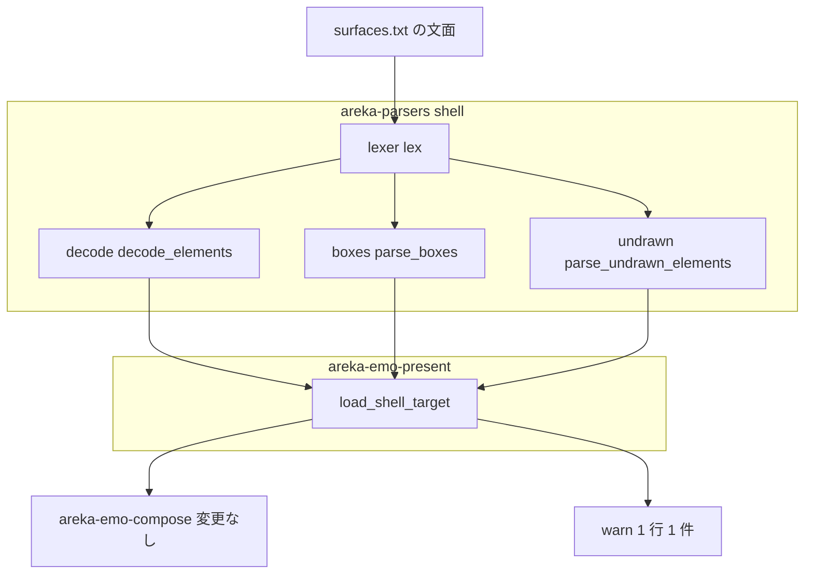
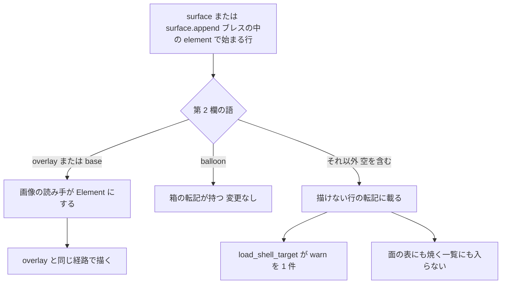

# Design Document: areka-P0-element-base-method

## Overview

**Purpose**: シェルの surfaces.txt の element定義で、描画メソッド `base` の行を描けるようにする。あわせて、areka が element定義で描けない描画メソッドの行を、黙って捨てずに警告 1 件として残す。

**Users**: ゴーストの利用者（キャラクターが消えなくなる）と、シェルの作者・areka の開発者（絵が欠けた原因が未対応の描画メソッドだと記録で分かる）。

**Impact**: 読み手（`areka-parsers` の `shell`）が element定義として値にする行を「`overlay` だけ」から「`overlay` と `base`」へ広げる。描けない行は、同じ文面を読む新しい小さな転記が一覧にし、シェルの読み込みの入口（`load_shell_target`）が読み込み 1 回につき 1 行 1 件で `warn!` する。畳み込み・面の表・合成器・焼く一覧・`Element` 型は 1 行も変えない。

### Goals

- `element*,base,<絵>,X,Y` の行が、同じ行を `overlay` と書いたときと同じ絵・同じ大きさで描かれる（どの element番号でも・`surface*`ブレスでも `surface.append*`ブレスでも）。
- areka が element定義で描けない描画メソッドの行について、見出し・element番号・書かれていた語を持つ警告が、読み込み 1 回につき 1 行 1 件だけ出る。
- 今正しく見えているサーフェス（`overlay` だけのサーフェス・`element0,base,surfaceN.png` のサーフェス・描けない行を持つサーフェス）の絵と大きさが変わらない。
- 上の 3 つが DLL を使わない決定論的なテストで固定され、無改変のクローディアで実機確認される。

### Non-Goals

- `base` 以外の描画メソッド（`overlayfast`／`overlay-fast`・`replace`・`interpolate`・`asis`・`reduce`・`blend-*`・`add`・`bind` ほか）を element定義で描くこと。本 spec は警告まで。描く仕事は本 spec の完了時に `/kiro-discovery` で追跡用の spec を起票する（開発者の方針 2026-10-05「合成の方法は Direct2D が支える全部に対応できるよう、wintf も含めて広げる」）。
- 描画メソッドごとの専用の描画コードを足すこと。合成器（`method.rs`・`plan.rs`・`blit.rs`）は触らない。
- `Element` 型へ描画メソッドの欄を足すこと（下の「設計上の決定 1」）。
- pattern定義（`animation*.pattern*`）の描画メソッド `base`・element定義のオプション（`element-clipping-option`）・動く絵の再生（`animated-image-playback`）・外形の規則（`extent-element-offset`）。
- 語の比べ方を緩めること（大文字・`-`／`_` の無視）。今の完全一致のままにする（設計上の決定 4）。

## Boundary Commitments

### This Spec Owns

- 読み手が「画像の element定義として値にする描画メソッドの語」の集合（`overlay`・`base` の 2 語）。定義点は `decode.rs` の 1 関数。
- 描けない element定義の行の転記（`parse_undrawn_elements` と `UndrawnElementLine`）と、その警告の文面・欄（`load_shell_target` の中の 1 か所）。
- 上の 2 つを固定するテスト、今の縮退を固定していた既存テスト 3 本の付け替え。
- 網羅台帳 `doc/ukadoc-coverage/ledger/assets.toml` の 2 行（element定義・`base`）と報告の作り直し、`doc/COMPAT_ARCHITECTURE.md` §8 の 1 行。
- 触った読み手の周りの説明文（`model.rs` の `Element`・`decode.rs`・`fold.rs` の `normalize_element`・`method.rs` の `Base` の注記）を実際の状態に合わせること。

### Out of Boundary

- 畳み込み（`fold.rs` の処理）・面の表・土台の絵の決定（`base_image.rs`）・外形（`plan.rs`）・実行器（`blit.rs`）・描画メソッドの登録簿（`method.rs` の `is_implemented`／`known_method`）の振る舞い。
- 焼く絵の一覧の作り方（`shell_target.rs` の `build_shell_target_with_boxes`・`manifest.rs`）。`surface.append*`ブレスにしか現れない絵が焼かれない既知の制約は `self-alpha-declaration` の議題（roadmap の「`shell-implicit-surface` の着地で残したもの」⑹）で、本 spec は直さない。
- 箱の転記（`boxes.rs` の `parse_boxes`）と描画メソッド `balloon` の扱い。
- 描けない描画メソッドの `element0` を持つサーフェスで `surface*.png` が土台に残るずれ（`self-alpha-declaration` の議題）。
- バルーンの合成用の文面（`areka-emo-present` の `balloon.rs` が自分で組む surfaces.txt）。`overlay` だけで書かれるので影響が無く、警告の対象にもしない。

### Allowed Dependencies

- クレートの向き: `areka-parsers` ← `areka-emo-compose` ← `areka-emo-present`（変えない）。新しい依存クレートは 0。
- `areka-parsers::shell` の中の向き: `model ← lexer ← decode ←（parse・boxes・undrawn）`。新しい `undrawn` は `lexer::lex` と `decode` の判定関数だけを使い、`model` の型は使わない。
- 読み手は記録を出さない（転記だけ）。記録は `areka-emo-present` の `load_shell_target` だけが出す。
- テストは `MemoryDecoder`（`areka-emo-atlas`）・`temp-path-kit`・`test_support::capture_events`（`areka-emo-present`）の今ある道具だけを使う。

### Revalidation Triggers

- 読み手が値にする描画メソッドの語を増やす・`Element` に欄を足す変更（追跡用の spec・`element-clipping-option`）。そのときは `parse_undrawn_elements` の対象が連動して減ること（「3 つの転記が element定義の行を漏れなく重なりなく分ける」テスト）を確かめ直す。
- `lexer::lex` の欄の切り方（前後の空白を落とす）を変える変更。語の完全一致の前提が動く。
- 見出しの判定順（`surface.append*` を `surface*` より先）を `decode.rs` で変える変更。`undrawn.rs` は同じ順を写している。
- 箱の転記（`boxes.rs`）が拾う描画メソッドの語を `balloon` から増やす変更。`undrawn.rs` の除外は同じ語の書き写しなので、合わせないと二重に拾う。
- `load_shell_target` 以外にシェルの surfaces.txt を読む製品の入口を足す変更。警告を出す場所が 1 か所である前提が動く。

## Architecture

### Existing Architecture Analysis

- 読み手の入口 `decode_elements` は、第 2 欄が `overlay` と完全に一致する行だけを `Element` にし、ほかを記録なしで捨てる（`crates/areka-parsers/src/shell/decode.rs:191-218`・判定は `:198-199`）。`surface*`ブレスと `surface.append*`ブレスの両方がここを通る（`:173`・`:422`）。
- 字句解析は欄の前後の空白を落とす（`lexer.rs:195-222` の `split_csv`・`:214` と `:220` の `trim()`）。したがって ` base ` は読み手に `base` として届く。大文字小文字は変えない。
- 畳み込みの `normalize_element` は、届いた `Element` を描画メソッドに関係なく `ComposeMethod::Overlay` で置き、X,Y を必ず位置にする（`crates/areka-emo-compose/src/fold.rs:283-291`）。土台の絵の決定（`base_image.rs:98-106`）・外形（`plan.rs:685-713`）・入れ子・当たり判定の持ち込みも、届いた `Element` を一律に扱う。
- 同じ文面を読む 2 つ目の転記の型が既にある。`parse_boxes` は描画メソッド `balloon` の行だけを原文のまま並べ、記録は出さない（`crates/areka-parsers/src/shell/boxes.rs:74-96`・判定は `:122`）。
- 読み込み 1 回につき 1 度だけ出す記録は `load_shell_target` が出す（`crates/areka-emo-present/src/shell_target.rs:301-341`）。面の表は読み込み 1 回の中で何度も組まれ、畳み込み・束縛・実行器の `warn!` は組むたび・合成のたびに出る（`shell_target.rs:217-227`・`blit.rs:89-97`）。
- 描画メソッドの登録簿は pattern定義と共用で、`add`・`bind` を `Overlay` に写す（`method.rs:167`）。`is_implemented()` は pattern定義の門でも使われる（`plan.rs:426`・`:490-491`・`nesting.rs:96`・`:186`）。

### Architecture Pattern & Boundary Map



**Architecture Integration**:

- 選んだ型: 「同じ文面を読む転記を 1 つ足し、事実を値で返して入口が記録する」。`parse_boxes` と入れ子の報告（`NestReport`）で使っている今の型そのもの。
- 責任の分け方: element定義の行は、第 2 欄の語で 3 つの転記のどれか 1 つに入る——`overlay`・`base` は画像の読み手（`Element`）、`balloon` は箱の転記、それ以外は描けない行の転記。
- 守る型: 読み手は記録を出さない・失敗しない／記録は `load_shell_target` の 1 か所／描けない行は面の表にも焼く一覧にも入れない／`is_implemented()` は変えない。
- 新しい部品の理由: `undrawn` だけ。描けない行を「どの見出しのどの行か」で運ぶ値が今は無い。
- steering との整合: 記録の無い失敗経路を作らない（`logging.md`）・DLL を使わない決定論のテスト・最小の変更。

### 設計上の決定

**1. 案 A（読み手だけを広げる・`Element` に欄を足さない）を採る。brief からの外れ。**

brief の Scope（In）は「読み手の `Element` へ描画メソッドの欄を足すこと」と書いている。本設計はこれを採らない。理由は次のとおり。

- 要件は欄の有無を縛っていない。要件 1.1・1.4 は「element定義の `base` は、どの番号でも `overlay` と書いた同じ行と同じ見え方」であり、下流には `base` と `overlay` を見分けて決めることが 1 つも無い。欄を足しても読む者がいない。
- 「同じ見え方」が作りで成り立つ。`base` の行と `overlay` の行が同じ `Element` の値になるので、`Shell` より下流（畳み込み・土台・外形・入れ子・当たり判定・焼く一覧・画像を読めないときの記録）は区別のしようが無い。要件 1.1・1.3〜1.7・3.5 を 1 つの判定（読み手の語の集合）で満たせる。
- ギャップ分析が挙げた 3 つの罠に入る道が無い。(a) `ComposeMethod::Base` を運ばないので「XY 無視」の枝が生まれない。(b) 登録簿の `from_name` を通さないので `add`・`bind` が黙って描かれない。(c) 描けない行が `Shell` に入らないので、土台・外形・入れ子・箱の報告・焼く一覧・合成のたびの `warn!` のどれも動かない。案 B は、生の `Shell.surfaces[].elements` を読む所（`fold.rs`・`shell_target.rs:394-399`・`manifest.rs:82-90`・`areka-emo-atlas` の試験用の入口 3 か所）の全部にふるいを当てる必要があり、当て漏れが見た目の変化になる。
- 後続の形を今は決められない。残りの描画メソッドは「Direct2D が支える全部へ・wintf も含めて」広げる方針で、欄が下流でどの型へ写るか（今の `ComposeMethod` のままか）は追跡用の spec が決める。`element-clipping-option` もオプションの転記で `Element` を広げる。欄の形は、それを読む者を持つ spec が決めるのが正しい。
- 欄を足すと、`Element` の構造体リテラル 46 か所（6 クレート・ほとんどテスト）に 1 行ずつ足すことになり、バグの修正に対して差分が広い。

後続への継ぎ目は 2 つだけ残す。⑴ 読み手が値にする語の集合は `decode.rs` の 1 関数にあり、追跡用の spec はここを広げる（そのとき `Element` に欄を足す）。⑵ 描けない行の転記は語を原文のまま運ぶので、広げた分だけ自動で対象から外れる。roadmap の本 spec の行（「読み手に描画メソッドの欄を足して」）は完了時に実際の形へ直す。

**2. `base` を `overlay` と同じにする場所は読み手。**

合成器で `Base` を実装済みにする道（案 C）は、`is_implemented()` が pattern定義の門と共用なので要件 3.3 に反し、得る画素は `Overlay` と同じである。採らない。読み手が `base` を `overlay` と同じ `Element` にすることは、読み手が今している「この行はどの転記の持ち物か」の選別（`overlay`→画像・`balloon`→箱）を 1 語広げるだけである。

**3. 描けない行は読み手の新しい転記が一覧にし、`load_shell_target` が記録する。**

- 値は行の単位（展開しない）。見出しは原文のまま 1 本の文字列で持つ（`surface0,1`・`surface.append10,2100-2110` など）。複数の番号を並べた見出しでも 1 行は 1 件になり、見出しに書かれた番号がすべて警告に載る（要件 2.1・2.3）。`surface*`ブレスか `surface.append*`ブレスかも見出しから分かる。
- 相手のサーフェスが無い `surface.append*`ブレスの中の行も載せる（文面の事実であり、作者が直す場所は同じ）。
- element番号は `element` に続く文字列を原文のまま持つ（数字でない番号もそのまま見える。箱の転記と同じ持ち方＝`boxes.rs:58-60`）。
- `ShellTarget` には載せない。読むのは `load_shell_target` の中の記録だけで、ほかに使う者がいない。

**4. 語の比べ方は今のまま（完全一致・小文字）。**

欄の前後の空白は字句解析が落とすので ` base ` は `base` と読まれる。`Base`・`Overlay`（大文字）は描かない側に入り、書かれた語のまま警告に載る。今 `Overlay` は描かれていないので、緩めると `overlay` の側の見え方が変わる（要件 3.1・2.5）。ukadoc の綴りは小文字である。

**5. `add`・`bind` は描かない側。**

ukadoc の `add` の項は「処理の内容はoverlayと同義」「着せ替えでないアニメーション・elementでの使用は未定義」と書く（`ukadoc:descript_shell_surfaces:add`）。element定義では未定義なので、要件 2.1 のとおり描かずに警告する。登録簿（pattern定義向け）の `add`・`bind`→`Overlay` の写しは変えない。`interpolate`・`asis`・`blend-*` などは ukadoc が「着せ替え・elementでも使用できる」と書くので、正典では描けるはずの語である——追跡用の spec の対象。

**6. `element0,base,surfaceN.png` で記録の内訳が変わることを認める。**

クローディアの surface19・29 は、今は `base` の行が捨てられて層 0 が空くので `surface*.png` が土台に敷かれている。本 spec の後は `element0` が値になり、`surface*.png` は「`element0` が在るので使わなかった」側に移る（`debug!` が増え、`info!` の `used`／`shadowed` の数が変わる）。絵と大きさは同じ（同じファイルを同じ透過の扱いで焼く）。要件 3.2 が認めている。

### Technology Stack

| Layer | Choice / Version | Role in Feature | Notes |
|-------|------------------|-----------------|-------|
| 読み手 | `areka-parsers`（今の版） | 語の集合を 1 語広げる・描けない行の転記を足す | 依存の追加なし |
| 入口 | `areka-emo-present`（今の版）・`tracing` | 描けない行の `warn!` を 1 か所で出す | 依存の追加なし |
| 台帳 | `ukadoc-survey`（今の道具） | 台帳 2 行の後に報告を作り直し、検査を通す | `cargo run -p ukadoc-survey -- report`／`report-summary`・`cargo test -p ukadoc-survey` |

## File Structure Plan

### Directory Structure

```
crates/areka-parsers/src/shell/
├── undrawn.rs            # 新規: 描けない element定義の行の転記（parse_undrawn_elements・UndrawnElementLine）
└── undrawn_tests.rs      # 新規: 上の判定の檻

crates/areka-emo-present/src/
└── shell_target_element_base_tests.rs   # 新規: base の外形と画素・見え方の不変・警告 1 件／0 件の檻
```

### Modified Files

- `crates/areka-parsers/src/shell/decode.rs` — `decode_elements` の判定を「画像の element定義の語か」を答える 1 関数（`is_image_element_method`・`pub(super)`）に置き換える。説明文を新しい約束に直す。
- `crates/areka-parsers/src/shell/mod.rs` — `mod undrawn;`・`#[cfg(test)] mod undrawn_tests;` と公開（`UndrawnElementLine`・`parse_undrawn_elements`）。
- `crates/areka-parsers/src/shell/model.rs` — `Element`・`Surface.elements` の説明文だけ（「`overlay` と `base` の行」）。型は変えない。
- `crates/areka-parsers/src/shell/decode_tests_lenient_input_tests.rs` — 「`base` は値にならない」を固定していた 2 本を付け替える（`base` は値になる／吸収される例は `replace` に替える）。`unknown.block.head` の中の `base` の行はそのまま（見出しが `surface*` でないので読まれない）。
- `crates/areka-parsers/src/shell/validation_tests.rs` — 公開の入口を通す同じ趣旨の 1 本を付け替える（`surface200` の `element0,base,bg.png`）。
- `crates/areka-parsers/src/shell/boxes_tests.rs` — `image_reader_ignores_box_lines` の説明文の「画像の element は `overlay` だけ」を直す（判定は変わらない）。
- `crates/areka-emo-present/src/shell_target.rs` — `load_shell_target` で `parse_undrawn_elements(&content)` の 1 件ごとに `warn!` を 1 行出す。モジュールの `#[cfg(test)] mod` に新しいテストファイルを足す。
- `crates/areka-emo-compose/src/fold.rs` — `normalize_element` の説明文だけ（「読み手が届けるのは `overlay` と `base` の行で、どちらも `Overlay` で置く」）。
- `crates/areka-emo-compose/src/method.rs` — `ComposeMethod::Base` の注記だけ（「XY 無視」は pattern定義の話で、element定義の `base` はこの値を通らないこと）。
- `doc/COMPAT_ARCHITECTURE.md` — §8 の表に 1 行（要件 4.4）。
- `doc/ukadoc-coverage/ledger/assets.toml` と `doc/ukadoc-coverage/report/*.md` — 台帳 2 行の書き換えと、道具による報告の作り直し（要件 4.5）。

## System Flows



- 分かれ目は語の完全一致の 1 か所だけ。3 つの枝は重ならず、漏れない。
- 「それ以外」の行は今も `Shell` に入っていない。本 spec で増えるのは警告だけである（要件 2.5）。

## Requirements Traceability

| Requirement | Summary | Components | Interfaces | Flows |
|-------------|---------|------------|------------|-------|
| 1.1 | `element0,base` を `overlay` と同じ絵・大きさで | 読み手の語の集合 | `is_image_element_method` | overlay または base の枝 |
| 1.2 | `base` の上に `overlay` を番号順に重ね、土台を含む大きさ | 読み手の語の集合（下流は今の経路） | 同上 | 同上 |
| 1.3 | `surface*.png` があっても `element0` の絵を土台に | 読み手の語の集合（`base_image.rs` の今の規則が働く） | 同上 | 同上 |
| 1.4 | `element1` 以降の `base` も `overlay` と同じ | 読み手の語の集合（番号を見ない） | 同上 | 同上 |
| 1.5 | `surface.append*`ブレスでも同じ | 読み手の語の集合（`decode_elements` は両方のブレスで共用） | 同上 | 同上 |
| 1.6 | 数字だけの欄は `overlay` と同じ番号の読み | 読み手の語の集合（`element_kind` は今のまま） | 同上 | 同上 |
| 1.7 | 画像を読めないときの記録が `overlay` と同じ | 読み手の語の集合（焼く段の脱落の `warn!` は今のまま） | 同上 | 同上 |
| 2.1 | 描けない語の行に見出しの番号・element番号・語を持つ警告 1 件 | 描けない行の転記・入口の記録 | `parse_undrawn_elements`・`UndrawnElementLine` | それ以外の枝 |
| 2.2 | 空の欄・ukadoc に無い語も同じ形の警告 | 描けない行の転記 | 同上 | 同上 |
| 2.3 | 読み込み 1 回・1 行につき 1 件、描画のたびに繰り返さない | 入口の記録（`load_shell_target` の 1 か所） | 同上 | 同上 |
| 2.4 | その行だけ描かず、ほかは描く | 読み手の語の集合（描けない行は `Element` にならない） | `is_image_element_method` | それ以外の枝 |
| 2.5 | 描けない行を持つサーフェスの見え方は前と同じ | 読み手の語の集合（描けない行について `Shell` が前と同じ） | 同上 | 同上 |
| 2.6 | 描ける語だけのシェルで警告 0 件 | 描けない行の転記（`overlay`・`base`・`balloon` を外す） | `parse_undrawn_elements` | 3 つの枝 |
| 3.1 | `overlay` だけのサーフェスは不変 | 読み手の語の集合（`overlay` の判定は完全一致のまま） | `is_image_element_method` | — |
| 3.2 | `element0,base,surfaceN.png` は同じ絵・大きさ | 読み手の語の集合（設計上の決定 6） | 同上 | — |
| 3.3 | pattern定義の `base` は今のまま | 合成器は変更なし（`is_implemented()` を触らない） | — | — |
| 3.4 | `element0` の無いサーフェスの土台は不変 | `base_image.rs` は変更なし | — | — |
| 3.5 | 外形の規則は変えず、`base` を `overlay` と同じに数える | `plan.rs` は変更なし（同じ `Element` が届く） | — | — |
| 4.1 | DLL なしで `base`＋`overlay` の大きさと画素を判定 | `shell_target_element_base_tests.rs` | `build_shell_target`・`MemoryDecoder` | — |
| 4.2 | 警告が 1 件（番号・element番号・語つき）・0 件を判定 | `undrawn_tests.rs`・`shell_target_element_base_tests.rs` | `capture_events` | — |
| 4.3 | 無改変のクローディアで `\s[6]`・`\s[11]`・`\s[26]` が 333×500 | 実機の確認（Testing Strategy） | — | — |
| 4.4 | COMPAT §8 に X,Y の裁量を記録 | `doc/COMPAT_ARCHITECTURE.md` | — | — |
| 4.5 | 台帳の 2 行を実際の状態と担当へ | `assets.toml`・報告 | — | — |

## Components and Interfaces

| Component | Domain/Layer | Intent | Req Coverage | Key Dependencies (P0/P1) | Contracts |
|-----------|--------------|--------|--------------|--------------------------|-----------|
| 読み手の語の集合（`decode.rs`） | areka-parsers／読み手 | 画像の element定義として値にする語を 1 か所で決める | 1.1〜1.7, 2.4, 2.5, 3.1, 3.2, 3.5 | `lexer`（P0） | Service |
| 描けない行の転記（`undrawn.rs`） | areka-parsers／読み手 | 描けない element定義の行を原文のまま一覧にする | 2.1, 2.2, 2.6 | `lexer`・読み手の語の集合（P0） | Service |
| 入口の記録（`shell_target.rs`） | areka-emo-present／入口 | 描けない行を読み込み 1 回につき 1 行 1 件で `warn!` する | 2.1, 2.3 | 描けない行の転記（P0） | Event |
| 文書（COMPAT §8・台帳） | doc | 裁量と実際の状態を記録する | 4.4, 4.5 | `ukadoc-survey`（P1） | — |

### areka-parsers／読み手

#### 読み手の語の集合

| Field | Detail |
|-------|--------|
| Intent | element定義の第 2 欄の語が、画像の element定義として値にするものかを答える |
| Requirements | 1.1, 1.2, 1.3, 1.4, 1.5, 1.6, 1.7, 2.4, 2.5, 3.1, 3.2, 3.5 |

**Responsibilities & Constraints**

- `decode_elements` は、キーが `element` で始まり、第 2 欄がこの関数で真になる行だけを `Element` にする。`Element` に写す欄（番号・ファイル名・X・Y）と並べ替えは今のまま。
- 真になるのは `overlay` と `base` の 2 語だけ（完全一致）。element番号は見ない（`element1` 以降の `base` も同じ）。
- 記録を出さない・失敗しない（今の読み手の約束のまま）。

**Dependencies**

- Inbound: `decode_elements`（`surface*`・`surface.append*` の両方）・`undrawn.rs` — 語の判定（P0）
- Outbound: なし

**Contracts**: Service [x] / API [ ] / Event [ ] / Batch [ ] / State [ ]

##### Service Interface

```rust
/// 画像の element定義として値にする描画メソッドの語か（完全一致・`overlay` と `base`）。
pub(super) fn is_image_element_method(word: &str) -> bool;
```

- Preconditions: `word` は字句解析が前後の空白を落とした欄。
- Postconditions: `"overlay"`・`"base"` で真、ほか（空文字列・大文字の綴り・`add`・`bind`・`balloon` を含む）で偽。
- Invariants: `parse(文面)` は、文面の element定義の `,base,` を `,overlay,` に書き替えた文面の `parse` と等しい。

#### 描けない行の転記

| Field | Detail |
|-------|--------|
| Intent | `surface*`ブレス・`surface.append*`ブレスの中の、areka が描けない描画メソッドの element定義の行を登場順に並べる |
| Requirements | 2.1, 2.2, 2.6 |

**Responsibilities & Constraints**

- 字句解析は画像の読み手と同じ `lexer::lex`。閉じたブレスだけを見る。見出しの判定は読み手と同じ（先頭の欄が `surface.append` で始まる、または `surface` で始まる）。ほかのブレス・ブレスの外の行は対象にしない。
- 対象の行: キーが `element` で始まり、第 2 欄が `is_image_element_method` で偽で、かつ `balloon` でない行。第 2 欄が無い行は語を空文字列として対象にする。
- 転記だけを行う。展開・検証・記録はしない（失敗しない・同じ文面から同じ結果）。

**Dependencies**

- Inbound: `load_shell_target` — 警告の材料（P0）
- Outbound: `lexer::lex`・`decode::is_image_element_method`（P0）

**Contracts**: Service [x] / API [ ] / Event [ ] / Batch [ ] / State [ ]

##### Service Interface

```rust
/// areka が描けない描画メソッドの element定義 1 行（欄は原文のまま）。
#[derive(Clone, Debug, PartialEq)]
pub struct UndrawnElementLine {
    /// ブレスの見出し（欄を `,` でつなぎ直した原文。例 `surface0,1`・`surface.append10,2100-2110`）。
    pub heading: String,
    /// `element` に続く番号の文字列（例 `0`）。
    pub element: String,
    /// 書かれていた描画メソッドの語（欄が無ければ空文字列）。
    pub method: String,
}

/// surfaces.txt の文面から、描けない描画メソッドの element定義の行を登場順に並べる（純粋・失敗しない）。
pub fn parse_undrawn_elements(text: &str) -> Vec<UndrawnElementLine>;
```

- Preconditions: `text` は文字コードを直した後の surfaces.txt の文面（`parse`・`parse_boxes` に渡すものと同じ）。
- Postconditions: 1 行につき 1 件（見出しが複数の番号を並べていても 1 件）。描ける語（`overlay`・`base`・`balloon`）だけの文面では空。
- Invariants: `surface*`・`surface.append*`ブレスの中の `element` で始まる行は、画像の読み手・箱の転記・本転記のちょうど 1 つに入る。

**Implementation Notes**

- Integration: 置き方は `boxes.rs` の `parse_boxes`（ブレスを開いて閉じるまで行をため、見出しで振り分ける）と同じ形。`boxes.rs` は触らない。
- Validation: 上の Invariants を 1 本のテストで数で確かめる（行の数＝3 つの転記の件数の和）。
- Risks: 追跡用の spec が語を広げるとき、`is_image_element_method` を広げれば本転記の対象は自動で減る。別の場所で語を足すと二重になる——Revalidation Triggers に書いた。

### areka-emo-present／入口

#### 入口の記録

| Field | Detail |
|-------|--------|
| Intent | 描けない element定義の行を、読み込み 1 回につき 1 行 1 件で `warn!` する |
| Requirements | 2.1, 2.3 |

**Responsibilities & Constraints**

- `load_shell_target` が、`parse`・`parse_boxes` に渡したのと同じ `content` で `parse_undrawn_elements` を 1 度呼び、ほかの「読み込み 1 回につき 1 度」の記録（入れ子・箱の報告）と同じ場所で、1 件につき `warn!` を 1 行出す。
- 面の表を組む側（`build_world`・`build_shell_target*`）・畳み込み・実行器では出さない。描けない行は面の表に入らないので、合成のたびの `warn!`（`blit.rs:89-97`）にも当たらない。

**Contracts**: Service [ ] / API [ ] / Event [x] / Batch [ ] / State [ ]

##### Event Contract

- 出す記録: 水準 `warn`・宛先は既定（`areka_emo_present::shell_target`）。本文「shell: areka が描けない描画メソッドの element定義を描かない」。欄は `heading`（見出しの原文）・`element`（番号の文字列）・`method`（書かれていた語）。
- 順序・回数: 文面の登場順。`load_shell_target` の呼び出し 1 回につき 1 行 1 件。

**Implementation Notes**

- Integration: `ShellTarget` に欄を足さない。`build_shell_target*`（fs を触らない核）の署名も変えない。
- Risks: `load_shell_target` は製品の中で複数の所から呼ばれる（起動の `emo2_boot/assets.rs:392`・窓の配置の測定 `placement/measure.rs:329`）。呼び出しごとに 1 度出るのは、入れ子・箱の報告と同じ今の型である。したがって実機のログでは、描けない行 1 行につき起動 1 回で警告が 2 件出るのが正しい。

## Data Models

新しい値は `UndrawnElementLine` だけ（上の Service Interface）。`Shell`・`Surface`・`Element`・`ShellTarget` の型は変えない。保存するデータ・スキーマの変更は無い。

## Error Handling

### Error Strategy

- 描けない描画メソッドの行は失敗ではなく縮退。読み込みは続け、その行だけ描かず、`warn!` を 1 件残す（要件 2.1・2.4）。
- `base` の行が指す画像を読めないときは、`overlay` の行と同じ今の経路（焼く段の脱落の `warn!`＝`shell_target.rs:315-317`・束縛の `warn!`＝`atlas_bind.rs:43-49`）に乗る。本 spec で足す枝は無い（要件 1.7）。
- 記録の無い失敗経路は足さない。今まで記録の無かった経路（`overlay` 以外の行を捨てる）は、`base` は描く・ほかは警告する、のどちらかになり、黙って捨てる行が無くなる。

### Monitoring

- 実機では、クローディアの読み込みで本 spec の警告が 0 件であること（`overlay`・`base` だけで書かれている）をログで見る。`shadowed`（画像が在るのに `element0` が在るので使わなかった番号）は surface19・29 の 2 件だけ増え、`used` が 2 件減る。surface6・11・26 は自分の番号の画像（`surface6.png` ほか）が無いので `shadowed` には載らない——成否は大きさ 333×500 で見る。

## Testing Strategy

判定の分かれ目（語の集合・描けない行の対象・記録の回数）を固定する。畳み込みから合成までの配線は既存の檻が持っているので、`overlay` と同じ `Element` が届くこと 1 点に寄せ、要件 4.1 が名指しする外形と画素だけを通しで見る。

### Unit Tests（`areka-parsers`）

1. `base` の行は `overlay` と同じ値になる（1.1・1.4・1.5・1.6・3.5）: `surface*`ブレスの `element0,base`・`element1` 以降の `base`・`surface.append*`ブレスの `base`・数字だけの欄の `base`・複数の番号を並べた見出しを含む文面について、`parse(文面)` が `,base,` を `,overlay,` に書き替えた文面の `parse` と等しい。較正として、`base` の行を除いた文面の `parse` より element の件数がちょうど `base` の行の数だけ多いことも見る（`overlay` の行だけで真になる「0 でない」では較正にならない）。
2. 描けない行は値にならず、隣の行は残る（2.4・2.5）: `replace`・空の欄・ukadoc に無い語・`Overlay`（大文字）・`add`・`bind` の行を含む文面の `parse` が、その行を除いた文面の `parse` と等しい。
3. 描けない行の転記（2.1・2.2）: 上の各語について `UndrawnElementLine` が見出し・element番号・語つきで 1 件ずつ返る。複数の番号を並べた見出し（`surface0,1`）と `surface.append0-1` で 1 行が 1 件・見出しが原文のまま。数字でない element番号は原文のまま。
4. 描ける語だけなら 0 件（2.6）: `overlay`・`base`・`balloon` だけの文面で空。`surface*` でないブレスの中・ブレスの外の `element` の行は対象にならない。
5. 3 つの転記が行を漏れなく重なりなく分ける: 全種類の語を混ぜた文面で、`element` の行の数＝`Element` の件数＋箱の element定義の件数＋`UndrawnElementLine` の件数。左辺はテストに手で書いた数（文面の `surface*`・`surface.append*`ブレスの中の `element` で始まる行を数えたもの。見出しは番号 1 つだけにして、展開で `Element` の件数が増えないようにする）。見出しの判定の書き写しがずれたら数で捕まるよう、文面には対象にならない行——`descript`ブレス・`balloon.*`ブレス・`kero.surface.alias`ブレス・未知の見出しのブレス・ブレスの外・閉じずに終わる `surface*`ブレス——の中の `element` の行も混ぜる（これらは左辺に数えない）。
6. 既存の 3 本の付け替え（`decode_tests_lenient_input_tests.rs` の 2 本・`validation_tests.rs` の 1 本）: 「`base` は値になる」「`replace` は吸収され隣は残る」へ書き替える（消さない）。

### Integration Tests（`areka-emo-present`・DLL なし・`MemoryDecoder`）

1. `base` の土台に `overlay` を重ねた外形と画素（4.1・1.2・1.3）: `surface26 { element0,base,body.png,0,0 / element1,overlay,face.png,X,Y }` を `build_shell_target` で焼いて合成し、外形が `body.png` の実寸、土台の位置の画素が `body.png` の色、部品の位置の画素が `face.png` の色であること。`surface26.png` を**大きさも色も違う絵**として復号器に入れておき、それが使われない（外形が動かない・`shadowed` に 26 が載る）ことを較正にする。
2. `element0,base,surfaceN.png` の不変（3.2）: その行を持つ文面と、ブレスごと除いた文面（`surface*.png` が土台に敷かれる今の経路）とで、合成した外形と画素が等しい。
3. 描けない `element0` を持つサーフェスの不変（2.5）: `element0,replace,x.png` と `surface*.png` を持つサーフェスの合成結果が、その行を除いた文面と等しく、`x.png` は焼かれていない。
4. 警告の回数（4.2・2.1・2.3・2.6）: `TempPath` に surfaces.txt を置いて `load_shell_target` を `capture_events` の中で呼ぶ。`surface0,1` の見出しの下に描けない行 1 行（と `overlay`・`base`・`balloon` の行。箱の警告が混ざらないよう、`balloon` の行には正しい `balloon.*`ブレスを添える）を置いた文面で、`warn` 以上の記録が本 spec の 1 行だけ（欄 `heading`・`element`・`method` の値まで一致）。描ける語だけの文面で `warn` 以上が 0 行。同じ文面で `load_shell_target` を 2 回呼ぶと本 spec の記録がちょうど 2 倍（呼び出し 1 回につき 1 行 1 件）。描画のたびに繰り返さないことは作りで成り立つ（描けない行は `Shell` に入らず、面の表を組む側は材料を持たない）ので、テストにしない。
5. 無改変のクローディアを読む（4.3 の檻・不具合の実物）: `sample-ghost-kit` に登記済みの `claudia` を、`shell_target` の既存の檻と同じ受け口で DLL なしに `load_shell_target` で読み、surface6・11・26 の外形が 333×500 であること、本 spec の警告が 0 件であること。

### 実機の確認（4.3）

- 無改変のクローディア（`sample-ghost-kit` の `claudia`）をワークツリーの `target\` の下の根で起動し、`\s[6]`・`\s[11]`・`\s[26]` を表示する。キャラクターが 333×500 で、土台の絵と顔の部品が重なって出ること。大きさは areka の MCP（`dump_surface`）かログで数値として取る。
- 同じ読み込みで本 spec の警告が 0 件であること、surface19・29 が前と同じに見えること。
- 当たり判定は見ない（クローディアは `collisionex` だけで書かれており、`collisionex-regions` の持ち物）。

### 文書の確認（4.4・4.5）

- `doc/COMPAT_ARCHITECTURE.md` §8 の表に 1 行: 項目「element定義の描画メソッド `base` の X,Y」／裁量「`overlay` の element定義と同じに扱う（位置として使う）」／根拠「ukadoc の `base` の項は『この描画メソッドが指定されたpattern定義では、XY座標は無視される』と pattern定義に限って書き、element定義については書いていない。`element0` では置き換えられる側が空なので `overlay` と同じ絵になり、`element1` 以降は正典が `overlay` に読み替えると書く」（`ukadoc:descript_shell_surfaces` の `base` の項と element定義の項を指す）／出典 spec。
- 台帳の 2 行:
  - element定義の行: 状態は `degraded` のまま（`overlay`・`base` 以外の描画メソッドの行は描かない）。注記を「`base` は描ける・ほかは描かずに `warn!` を残す・`overlay` と `base` 以外の `element0` を持つサーフェスで画像が土台に残るずれは残る」へ直し、記録を「なし」から `warn!` へ直す。担当は、残りの描画メソッドを描く追跡用の spec の名前（完了時の起票の後に書く。それまでは本 spec の名前）。
  - `base` の行（`ukadoc:descript_shell_surfaces:base:1`）: 状態を `vocabulary-only` から `degraded` へ（element定義では描ける・pattern定義では未対応のまま）。担当は本 spec。注記に、pattern定義の側の残りと、追跡用の spec が持つならその名前（完了時）を書く。
  - 書き換えの後に `cargo run -p ukadoc-survey -- report`・`report-summary` で報告を作り直し、`cargo test -p ukadoc-survey` を通す（報告の数を手で直さない）。

## Supporting References

- 背景の調べ（ギャップ分析・案 A／B／C の比較・設計の段の追記）は同じフォルダの `research.md`。結論はすべて本書に書いた。
- 正典: `ukadoc:descript_shell_surfaces`（element定義の項・`base` の項・`add` の項）。
