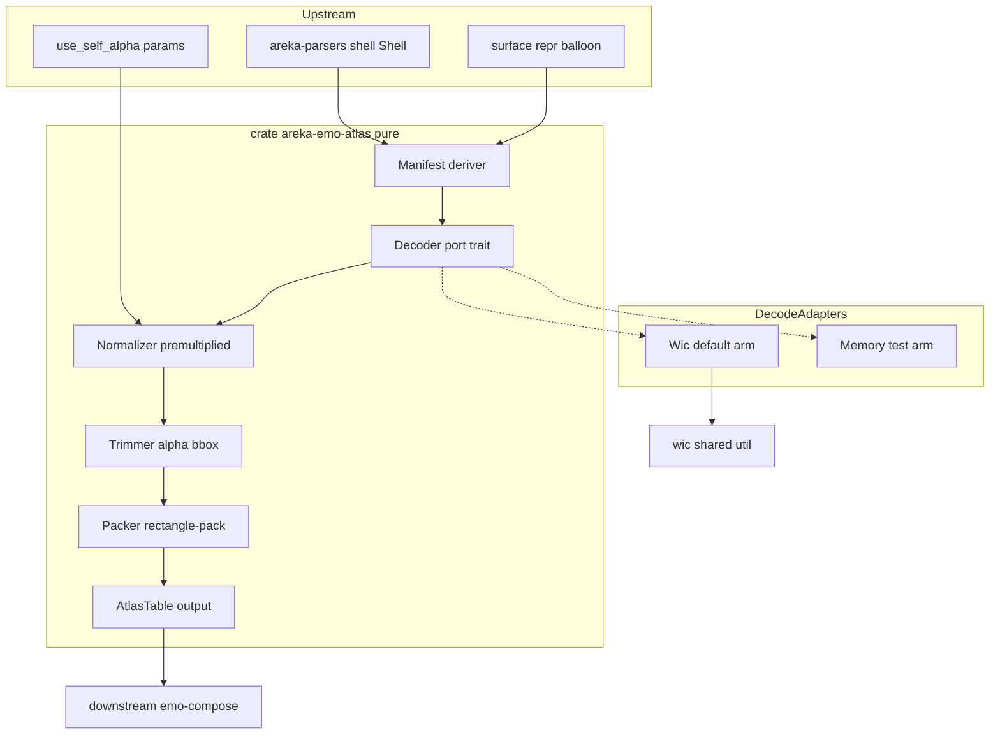
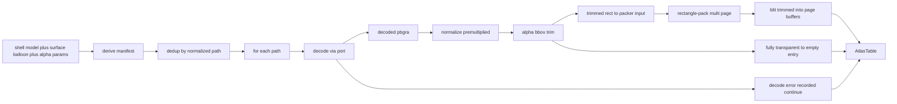

# 技術設計書 — areka-P0-emo-atlas

## Overview

**Purpose**: 本層は render エンジン **emo**（⑥）の自前合成チェーン（emo-atlas → emo-compose → emo-present）の 1/3、**素材基盤層**を提供する。shell／balloon の element 画像群を、透過正規化済み premultiplied BGRA として α=0 領域を除外したタイトなトリム矩形でアトラス（複数頁）へ焼き付け、`element path →（頁, UV 矩形, トリムオフセット, 原寸）`の索引表と頁バッファを、スレッド間で安全に手渡せる所有形で下流 emo-compose へ供給する。

**Users**: 唯一の消費者は下流合成層 **emo-compose**。emo-compose は本層の索引表を引き、頁バッファから矩形を転写するだけで合成でき、素材解釈（デコード・透過規則・トリム）を再実装しない。

**Impact**: 本層は既存 wintf の WIC デコード経路（`crates/wintf/src/com/wic.rs`）を **薄いユーティリティ経由で再利用**しつつ、ECS／表示に非依存な**新規純粋クレート `crates/areka-emo-atlas/`** を追加する。既存クレートへの機能追加は WIC 薄ラッパーの再配置のみ（後述 D2）。

### Goals

- shell／balloon（surface として表現）モデルから焼付対象 element 画像パスを漏れなく列挙する（間接 bind 参照解決・重複排除を含む）。
- 各 element を ukadoc 透過規則（`use_self_alpha`／`.pna`／キーカラー）に従い premultiplied BGRA へ正規化し、α>0 のタイト矩形のみを決定的にアトラスへ焼き付ける。
- `AtlasKey → AtlasEntry` ＋頁バッファの**共有契約を本層が正本として定義**し、emo-compose が再定義せず消費できる形（`Send`＋`Arc` 共有）で供給する。
- 通信非依存・表示非依存・オフスクリーン単体テストのみで pass/fail が確定する純粋層とする。

### Non-Goals

- element 配置・行列適用・レイヤー順の焼き込み（合成そのもの）＝ **emo-compose 所有**。
- 表示・wintf 接続・AlphaMask 生成 ＝ **emo-present 所有**。
- SERIKO アニメーション再生・毎フレーム再合成のタイミング制御 ＝ **seriko 所有**。
- 動的アトラス（実行時挿入）＝本層は静的バッチ（bake-once）のみ。
- emo2 が実際に使用しない透過腕（キーカラー腕・`.pna` 腕）の**実装**＝型シーム（拡張の口）としてのみ提供し、既定パニック等で未実装を明示。
- balloon 画像（`balloons*.png` 等）を surface 表現へ適合させる責務＝上流／隣接ユニット所有（後述 D1・本層外）。

## Boundary Commitments

### This Spec Owns

- **マニフェスト導出**: shell モデル（`areka-parsers::shell::Shell`）と surface 表現された balloon から、全 surface が参照する element 画像パス集合を列挙。間接 bind 参照（`Pattern.surface_id` → 参照先 surface の element パス）の解決と重複排除を含む（要件 1.1–1.6）。
- **透過正規化**: `use_self_alpha` 解釈・premultiplied BGRA 統一・優先順位（α ＞ `.pna` ＞ キーカラー）の**契約定義**（emo2 実装腕＝α のみ・他は型シーム）（要件 3.1–3.6）。
- **α トリミング**: α>0 タイト矩形算出・トリムオフセット／トリム寸／原寸の記録・全透明→空エントリ（要件 4.1–4.5）。
- **packing**: トリム済み矩形群の静的・決定的・複数頁配置・padding・重複排除（要件 5.1–5.6）。
- **成果物契約の正本定義**: `AtlasKey` / `AtlasEntry` / 頁バッファ（premultiplied BGRA・stride 明示）／空エントリ表現を**本層が定義**する（emo-compose と共有・要件 6.1–6.5）。
- **デコード抽象の契約**: デコード手段を差し替え可能にする trait とその既定 WIC 腕（要件 2.1–2.3）。

### Out of Boundary

- 合成（配置・行列・レイヤー焼込）／表示／AlphaMask 生成／SERIKO タイミング（それぞれ emo-compose／emo-present／seriko）。
- 元設定ファイル（shell/balloon descript）の読み取り。透過パラメータ（`use_self_alpha` 等）と element パスは**上流由来の入力として注入される**（要件 3.6・本層は自ら読みに行かない）。
- balloon 画像を「element を持つ surface」へ適合させる責務（D1・上流／隣接ユニット）。本層は完成した surface 表現を入力として受ける。
- 負 `surface_id`（レイヤクリア/停止センチネル）・`Range` append・alias の**意味解釈**（本層は列挙対象から除外するのみ・要件 5.5 の下流解釈方針を尊重）。

### Allowed Dependencies

- **上流モデル型**（P0）: `areka-parsers`（`shell::{Shell, Surface, Element, Animation, Pattern, ElementPath}`）。読み取りのみ。
- **WIC 薄ラッパー**（P0）: 既定デコード腕が使用。`crates/wintf/src/com/wic.rs` の ext トレイト群（`create_decoder_from_filename`／`create_format_converter`／`copy_pixels`／`get_size`）と `load_bitmap_source` 相当を**共有可能な薄ユーティリティとして参照**（D2 で所在を確定）。
- **packing クレート**（P0・**要承認**）: `rectangle-pack`（zero-dep・MIT/Apache）。`encoding_rs` 前例に倣い design で正式申請（後述 Technology Stack / Approval）。
- **標準ライブラリ + `windows`（WIC/COM 型のみ）**: 既定デコード腕内に隔離。純粋層（正規化以降）は `windows`/COM に非依存。

制約: 本クレートは **wintf 本体（ECS/D2D/GraphicsCore）へ依存してはならない**。WIC への唯一の依存はデコード腕に隔離し、`GraphicsCore`／`WintfTaskPool`／`bevy_ecs` を引き込まない。

### Revalidation Triggers

以下の変更は下流 emo-compose／emo-present の再確認を強制する。

- `ElementId` / `AtlasKey` / `AtlasEntry` / 頁バッファ表現（フィールド・premultiplied 前提・stride 契約・空エントリ表現・ID 採番規則）の形状変更。
- 座標意味論の変更（トリムオフセットと配置座標の合成規約＝「配置座標＋トリムオフセットで転写すれば見た目等価」の破棄）。
- premultiplied 統一点・α 閾値・padding 既定値・頁サイズ・golden ソート順の変更（決定性の再固定が必要）。
- デコード trait 署名・エラー継続契約の変更。
- 上流入力契約（shell モデル型・surface 表現された balloon の入力型）の変更。
- WIC 薄ラッパーの所在・公開面変更（D2 の帰結クレートが移動する場合）。

## Architecture

### Existing Architecture Analysis

- **WIC デコード経路（流用元）**: `crates/wintf/src/com/wic.rs` に薄い ext トレイト群（`WICImagingFactoryExt`／`WICBitmapDecoderExt`／`WICFormatConverterExt`／`WICBitmapSourceExt`）が存在し、`bitmap_source/systems.rs::load_bitmap_source` が `CreateDecoderFromFilename → GetFrame(0) → IWICFormatConverter で GUID_WICPixelFormat32bppPBGRA へ変換`して `IWICBitmapSource` を返す。**PBGRA（premultiplied）への正規化はここで既に行われる**が、これは「α 有→採用・α 無→100% 不透明」という WIC 既定挙動であり、`use_self_alpha`／キーカラー／`.pna` の伺か規則は一切解釈しない。CPU 画素抽出は `WICBitmapSourceExt::copy_pixels(rect, stride, buffer)` ＋ `get_size()` が既存。
- **MTA 前提**: `WicCore` は `IWICImagingFactory2` を保持し `CoInitializeEx(COINIT_MULTITHREADED)` 下で `unsafe impl Send + Sync`（WIC thread-free marshaling）。本層の COM 使用も同前提に従う（WIC を使うテストは COM 初期化が必要）。
- **α 走査の前例**: `AlphaMask::from_pbgra32`（`bitmap_source/alpha_mask.rs`）が行 stride を考慮して全画素の α を走査する。**「PBGRA バッファの α を stride 込みで走査する」パターンは実証済み**でトリム矩形算出に流用できる。
- **上流モデル（実装完了）**: `areka-parsers::shell::{Shell, Surface, Element, Animation, Pattern}`。`Element.path: ElementPath`（opaque・無加工）／`Pattern.surface_id: i64`（間接参照・負値センチネル）。parser は転記層であり **surface_id → element パスの解決（間接参照展開）は本層の責務**（記憶 areka-parser-transcribes-tree-downstream）。
- **配置規約（structure.md）**: CPU 非依存純粋層は `XxxResource` 系（デバイスロスト非対応）。責務ごとのクレート分割（`shiori-abi`／`areka-parsers` の最小依存分離流儀）。unsafe は COM ラッパー層に集約。

### Architecture Pattern & Boundary Map

**選択パターン**: ヘキサゴナル（ports & adapters）を軽量化した **「純粋コア＋デコードポート」**。デコード（COM/WIC 依存）を trait ポートとして外に出し、正規化・トリミング・packing・索引表は COM 非依存の純粋コアとする（D4）。三段直列パイプライン（列挙 → 正規化+トリム → packing+索引化）。



**Architecture Integration**:
- **Selected pattern**: 純粋コア＋デコードポート（ヘキサゴナル軽量版）。理由: 要件 2.3「デコード手段差替可・既定手段を上位に露出しない」と純粋オフスクリーンテスト方針を同時に満たす。
- **Domain boundaries**: 列挙／正規化／トリム／packing／索引化を単一責務コンポーネントに分離。COM 依存はデコードポートの WIC 腕にのみ隔離。
- **Existing patterns preserved**: WIC ext トレイト再利用・stride 込み α 走査・`XxxResource` 系 CPU 保持・最小依存クレート分離・MTA/COM 規律。
- **New components rationale**: 伺か透過規則の解釈層（既存 WIC は非解釈）・間接参照解決・トリム矩形算出・packing・共有契約型は既存に存在せず新規。
- **Steering compliance**: unsafe を COM 腕へ集約・依存方向厳守・純粋層は表示/通信非依存（記憶 areka-concurrency-model「通信非依存の純粋層」）。

### 主要設計決定（D2–D8 + 承認）

| ID | 決定 | 要旨 |
|----|------|------|
| **D2** | クレート境界＝新クレート `crates/areka-emo-atlas/`。WIC 薄ラッパーは wintf に残置し、デコード WIC 腕のみが最小 feature の `windows`＋wintf の WIC ユーティリティを利用。純粋コアは wintf 非依存 | 詳細 Decision D2 |
| **D3** | **識別子は二層**（ディスカッション #1）: ランタイムキー＝`ElementId(u32)`（密 index・決定的採番・毎フレーム O(1) 引き）／ソースキー＝`AtlasKey{ set, rel_path }`（無改変相対パス・重複排除／golden／**デバッグ逆引き用にテーブルへ保持**）。空エントリは `AtlasEntry.placement: Option<Placement>`（`None`＝転写スキップ）。頁バッファは `AtlasPage{ bytes: Arc<[u8]>, width, height, stride }` | 詳細 Decision D3 |
| **D4** | `trait ElementDecoder { fn decode(&self, path:&Path) -> Result<DecodedImage, DecodeError> }`。既定腕＝WIC（COM 必要）／テスト腕＝メモリ PBGRA。正規化以降は COM 非依存 | 詳細 Decision D4 |
| **D5** | ukadoc 2×2（`use_self_alpha`∈{1/true, full, 0} × `.pna` 有/無）動作表。emo2 実装腕＝`use_self_alpha=1` かつ `.pna` 無し（＝α チャンネル採用）のみ実装。他はシーム | 詳細 Decision D5 |
| **D6** | 間接参照解決: `Pattern.surface_id` を surface id 索引で辿り参照先 surface の element を列挙。負値・不在 id・`Range`/alias は画像を持たないため除外。訪問済み集合で循環検出 | 詳細 Decision D6 |
| **D7** | padding=1px（矩形を全周 +1px 拡張して packer へ渡し UV は非包含）・頁サイズ 2048（超過矩形は自頁）・golden 入力ソート順＝正規化パス昇順 | 詳細 Decision D7 |
| **D8** | premultiplied 統一点＝デコード腕出力（WIC PBGRA）で既に成立。シーム腕（キーカラー/`.pna`）実装時は正規化段末尾で premultiply。契約は「Normalizer 出力は常に premultiplied BGRA」 | 詳細 Decision D8 |
| **承認** | 新規依存 `rectangle-pack`（zero-dep・MIT/Apache）を正式申請。fallback `rect_packer` | Technology Stack |

各決定の背景・代替案・トレードオフは `research.md`「Design Decisions」に対応する。

### Technology Stack

| Layer | Choice / Version | Role in Feature | Notes |
|-------|------------------|-----------------|-------|
| Data / Storage | `areka-parsers` (workspace) | shell/surface モデル入力（読み取り） | 実装完了・opaque `ElementPath` を素通し |
| Infrastructure / Runtime | `windows` 0.62.2（WIC/COM feature 部分集合） | 既定デコード腕の WIC 経路 | デコード腕にのみ隔離・純粋コアは非依存 |
| Data / Storage | **`rectangle-pack` 0.5（新規・要承認）** | 静的バッチ packing・複数 bin＝頁 | zero-dep・MIT/Apache・padding は自前ラップ。fallback `rect_packer`（zero-dep・MIT・単頁 API＝複数頁 DIY） |
| Infrastructure / Runtime | `std` + `Arc` | 成果物の `Send`＋共有参照所有 | roadmap 並行モデル「大型データは Arc 手渡し」 |

> **新規依存申請（承認事項）**: `rectangle-pack` を workspace dependency へ追加する。zero-dep・活発維持・静的バッチ packing・複数 bin（頁）対応。padding は非内蔵ゆえ矩形を +1px 拡張して渡す自前ラップ（自明）。`encoding_rs` の意図的依存追加の前例に倣い、design で正式申請する。**未承認の場合は着手不可**（fallback は `rect_packer`＝単頁 API のため複数頁ループを自前実装）。詳細比較は `research.md`「Build vs Adopt」。

## File Structure Plan

### Directory Structure
```
crates/areka-emo-atlas/
├── Cargo.toml                  # 新規クレート。deps: areka-parsers, windows(WIC), rectangle-pack, tracing
├── src/
│   ├── lib.rs                  # 公開 API 再エクスポート（AtlasTable/AtlasEntry/AtlasKey/AtlasPage/bake 入口）
│   ├── manifest.rs             # マニフェスト導出（列挙・間接参照解決・重複排除）D6
│   ├── decode.rs               # ElementDecoder trait ＋ DecodedImage/DecodeError（ポート定義）D4
│   ├── decode/
│   │   └── wic_arm.rs          # 既定 WIC 腕（COM 隔離・wintf WIC util 利用）D4
│   ├── normalize.rs            # 透過正規化（use_self_alpha 解釈・premultiplied 統一）D5/D8
│   ├── trim.rs                 # α トリミング（bbox 算出・オフセット記録・全透明→空）R4
│   ├── pack.rs                 # packing 座標算出（rectangle-pack 結線・padding ラップ・複数頁・決定性・画素は焼かない）D7
│   ├── bake.rs                 # Baker: 頁バッファ確保・stride 決定・トリム矩形 blit（blit_trimmed）R4.3/R6.3
│   ├── table.rs                # AtlasTable/AtlasEntry/AtlasKey/AtlasPage 契約型（正本）D3
│   └── error.rs                # BakeError/DecodeError（診断可能なエラー・継続方針）R2
└── tests/                      # 統合テスト入口（束ね役）
    └── atlas.rs                # #[path] mod 宣言のみ
```

> in-source `#[cfg(test)]` を主軸（structure.md テスト慣行）。正規化以降（normalize/trim/pack/table）はメモリ PBGRA 入力で **COM init 不要**の純粋テスト。WIC 腕テストのみ `CoInitializeEx` を必要とし fixture スモークで確認。

### Modified Files
- `crates/wintf/src/com/wic.rs` — **（D2 確定に依存・最小変更）**: 既定デコード WIC 腕から `load_bitmap_source` 相当（`decoder→PBGRA raw バッファ抽出`）を呼べるよう、現在 `bitmap_source/systems.rs` にある `load_bitmap_source` を `com/wic.rs`（ECS 非依存の COM 層）へ移設または公開する。ECS 依存（`Entity`/`Command`/`GraphicsCore`）は移設対象外。移設に伴い `bitmap_source/systems.rs` は移設先を参照する（挙動不変のリファクタ）。**併せて（Critical Issue 1）**: 移設関数は PBGRA ソースに加え **変換前フレームのピクセルフォーマット由来の α 有無**を返り値へ追加し、WIC 腕が `DecodedImage.has_alpha` を確定できるようにする（既存 `bitmap_source` 呼出は追加返り値を無視すれば挙動不変）。
- `Cargo.toml`（workspace） — `rectangle-pack` を `[workspace.dependencies]` へ追加（**承認後**）。

> WIC ユーティリティ移設の是非（移設 vs 新クレート切出し vs デコード腕での再実装）は Decision D2 で「wintf 内 COM 層へ移設し、新クレートは wintf の WIC ユーティリティのみを最小 feature で参照」を選択。emo-compose/emo-present も同 WIC 経路を要さない（表示は emo-present が wintf 側で担う）ため、切出し新クレートは過剰と判断。

## System Flows

### Bake パイプライン（データフロー）



**フロー決定事項**:
- **エラー継続**: デコード失敗エントリは診断可能なエラーとして記録し、他エントリの処理を継続する（要件 2.2）。`bake` は成功エントリの索引表＋失敗エントリ集合を返す（fail-fast にしない）。
- **全透明スキップ**: トリムで α>0 画素ゼロと判明した画像は空エントリ（`placement: None`）として記録し packing に渡さない（要件 4.4）。
- **決定性**: 列挙後、packing 入力は**正規化パス昇順**にソートしてから packer へ渡す。同一入力→同一配置を golden テストで固定（要件 5.5・D7）。
- **packing と焼付の分離（Critical Issue 3）**: `blit trimmed into page buffers` ノードは **Baker** が所有する。Packer は座標（page/uv_rect）のみ算出し画素を持たない。Baker が `page_count` 分の頁を確保し `uv_rect` へ premultiplied のまま blit する。`bake`（`lib.rs`）が Packer→Baker→AtlasTable 構築を統括。

## Requirements Traceability

| Requirement | Summary | Components | Interfaces | Flows |
|-------------|---------|------------|------------|-------|
| 1.1 | 全 surface の element パス列挙 | ManifestDeriver | `derive_manifest` | Bake（derive） |
| 1.2 | base 自己参照も通常 element として列挙 | ManifestDeriver | `derive_manifest` | Bake（derive） |
| 1.3 | 間接 bind 参照先 element も列挙 | ManifestDeriver | `resolve_indirect` | Bake（derive） |
| 1.4 | surface 表現 balloon を shell と同一機構で列挙 | ManifestDeriver | `derive_manifest` | Bake（derive） |
| 1.5 | サブディレクトリパスを無改変で列挙 | ManifestDeriver | `AtlasKey`（正規化＝無改変保持） | Bake（derive） |
| 1.6 | 同一パス重複排除 | ManifestDeriver | `dedup` | Bake（dedup） |
| 2.1 | パス→画素バッファへデコード | ElementDecoder / WicArm | `ElementDecoder::decode` | Bake（decode） |
| 2.2 | 失敗を診断可能エラー・他エントリ継続 | ElementDecoder / BakeError | `DecodeError`, `bake` 戻り値 | Bake（err path） |
| 2.3 | デコード手段差替可・既定手段を上位非露出 | ElementDecoder (port) | `trait ElementDecoder` | — |
| 3.1 | α 有→α を透明度採用（use_self_alpha 有効時） | Normalizer | `normalize` | Bake（normalize） |
| 3.2 | α/.pna 無→左上キー色透過（シーム） | Normalizer (seam) | `normalize`（keycolor seam） | Bake（normalize） |
| 3.3 | 優先順位 α > .pna > キーカラー | Normalizer | `normalize` | — |
| 3.4 | 出力は premultiplied BGRA | Normalizer | `DecodedImage`→`NormalizedImage` | — |
| 3.5 | 未使用腕は実装せず型シーム | Normalizer (seam) | `AlphaSource` enum seam | — |
| 3.6 | 透過パラメータは入力・自ら読まない | Normalizer | `AlphaParams` 入力 | — |
| 4.1 | α>0 タイト矩形算出 | Trimmer | `trim` | Bake（trim） |
| 4.2 | トリムオフセット/トリム寸/原寸記録 | Trimmer / AtlasEntry | `Placement`, `AtlasEntry` | — |
| 4.3 | トリム後矩形のみ焼付 | Baker | `blit_trimmed` | Bake（bake） |
| 4.4 | 全透明→空エントリ・焼付スキップ | Trimmer / AtlasEntry | `placement: None` | Bake（empty） |
| 4.5 | 配置座標不変保証（配置座標＋トリムオフセット等価） | AtlasEntry（契約） | `trim_offset` 意味論 | — |
| 5.1 | 頁内非重複配置 | Packer | `pack` | Bake（pack） |
| 5.2 | padding 確保・bleed 防止 | Packer | `pack`（+1px ラップ） | Bake（pack） |
| 5.3 | UV は padding 非包含の実矩形 | Packer / AtlasEntry | `uv_rect` | — |
| 5.4 | 単頁超過→複数頁分割 | Packer | `pack`（multi bin） | Bake（pack） |
| 5.5 | 同一入力→同一配置（決定的） | Packer | `pack`（ソート＋固定） | Bake（決定性） |
| 5.6 | 同一パス 1 度焼付・単一エントリ索引 | ManifestDeriver / Packer | `dedup`, `AtlasKey` | Bake（dedup） |
| 6.1 | path→エントリ（頁/UV/オフセット/原寸）取得 | AtlasTable | `AtlasTable::resolve`（構築時 path→id）＋`entry`（ランタイム O(1)） | — |
| 6.2 | スキップ path→空エントリ返却 | AtlasTable | `AtlasEntry.placement: None` | — |
| 6.3 | 各頁 premultiplied BGRA バッファ・stride 明示 | AtlasPage | `AtlasPage{bytes,stride,...}` | — |
| 6.4 | スレッド間安全所有（共有参照可能） | AtlasTable / AtlasPage | `Arc<[u8]>`, `Send`/`Sync` | — |
| 6.5 | channel 非依存・値/共有参照で直接提供 | AtlasTable | `bake` 戻り値 | — |

## Components and Interfaces

| Component | Domain/Layer | Intent | Req Coverage | Key Dependencies (P0/P1) | Contracts |
|-----------|--------------|--------|--------------|--------------------------|-----------|
| ManifestDeriver | 列挙 | shell/surface から element パス集合を導出（間接解決・重複排除） | 1.1–1.6, 5.6 | areka-parsers shell (P0) | Service |
| ElementDecoder (port) | デコード | パス→画素バッファの差替可能ポート | 2.1–2.3 | — | Service |
| WicDecoderArm | デコード adapter | 既定 WIC 腕（COM 隔離） | 2.1, 2.2 | wintf WIC util (P0) | Service |
| Normalizer | 正規化 | use_self_alpha 解釈・premultiplied BGRA 統一 | 3.1–3.6 | ElementDecoder 出力 (P0) | Service, State |
| Trimmer | トリム | α>0 タイト矩形算出・オフセット記録・空判定 | 4.1–4.5 | Normalizer 出力 (P0) | Service |
| Packer | packing | 静的決定的複数頁**座標算出**・padding・重複排除（画素は焼かない） | 5.1–5.6 | rectangle-pack (P0) | Batch |
| Baker | 焼付 | 頁バッファ確保（`page_size²×4`）・stride 決定・トリム矩形 blit（`blit_trimmed`） | 4.3, 6.3 | Packer 座標出力・Trimmed 画素 (P0) | Service |
| AtlasTable / AtlasEntry / AtlasPage | 成果物契約 | 索引表＋頁バッファ（共有契約正本） | 6.1–6.5, 4.2 | Arc (P0) | Service, State |

### 列挙層

#### ManifestDeriver

| Field | Detail |
|-------|--------|
| Intent | shell モデルと surface 表現 balloon から焼付対象 element パス集合を導出する |
| Requirements | 1.1, 1.2, 1.3, 1.4, 1.5, 1.6, 5.6 |

**Responsibilities & Constraints**
- surface 群を走査し各 `Element.path`（自己参照 base 含む）を列挙（1.1/1.2）。
- 各 surface の `Animation.patterns[].surface_id` を surface id 索引で辿り、参照先 surface の element パスを列挙（間接解決・1.3・D6）。
- balloon は surface として shell と**区別せず**同一機構で扱う（1.4）。入力は「element を持つ surface」のセット（`SurfaceSet`＝surface 群＋基準 dir＋透過設定の束）として注入される（元 balloon 画像→surface 適合は上流責務・D1）。shell と balloon は基準 dir も descript も別ゆえ**セットを分けて**渡す。
- `ElementPath.as_str()` を無改変で保持（サブディレクトリ含む・1.5）。実パスへは変換しない（実パス化はデコード段内部の一度きり）。
- **(set, 相対パス)** をキーに重複排除し（1.6/5.6）、(SetId 昇順, 相対パス昇順) で `ElementId` を決定的に採番（識別子二層・D3/D7）。

**Dependencies**
- Inbound: `bake` エントリ — マニフェスト要求（P0）
- Outbound: ElementDecoder — 列挙結果を渡す（P0）
- External: `areka-parsers::shell` — モデル読み取り（P0）

**Contracts**: Service [x]

##### Service Interface
```rust
/// 出所単位の自己完結な入力束（shell で 1 個・balloon で 1 個…複数可）。
/// surface 群・基準 dir・透過設定が出所ごとに束で対応する（ディスカッション #1）。
pub struct SurfaceSet<'a> {
    pub surfaces: &'a [areka_parsers::shell::Surface], // element 相対パス＋bind pattern（ソース語彙）
    pub base_dir: &'a std::path::Path,                 // このセットの基準 dir（shell dir / balloon dir）
    pub alpha_params: AlphaParams,                     // このセットの descript 由来透過設定（shell/balloon 別定義）
}

/// SurfaceSet の序数（bake 入力スライス内の index・重複排除キーの一部）。
#[derive(Clone, Copy, PartialEq, Eq, Hash, Debug)]
pub struct SetId(pub u32);

/// マニフェスト＝ElementId 順に整列した AtlasKey 一覧（採番の正本）。
pub struct Manifest {
    pub keys: Vec<AtlasKey>,   // index == ElementId.0（密・決定的）
}

pub struct ManifestDeriver;

impl ManifestDeriver {
    /// 全セットの element パス（直接＋間接 bind 参照）を重複なく導出し、
    /// (SetId 昇順, 相対パス昇順) で ElementId を決定的に採番する（D7・golden 安定）。
    pub fn derive(&self, sets: &[SurfaceSet<'_>]) -> Manifest;
}
```
- Preconditions: 各セットの `surfaces` は id で参照解決可能（重複 id は先出優先・下流未定義動作を避ける）。
- Postconditions: `keys` は (SetId, 相対パス) 昇順・重複なし（重複排除キー＝**(set, rel_path)**——相対パス単独では shell と balloon の同名ファイルを誤同一視するため）。負 `surface_id`/不在 id/画像を持たない参照は含まない。
- Invariants: 入力を改変しない（読み取り専用）。実パスは生成しない（実パス化はデコード段の内部・一度きり）。

**Implementation Notes**
- Integration: `Pattern.surface_id: i64` の負値・不在 id は列挙対象外（D6）。循環（surface→surface の bind ループ）は訪問済み集合で検出し打ち切る（emo2 は 1 段だが構造として保証）。
- Validation: emo2 surface1000 の 30 本 bind が helper surface（1100 台等）へ解決し全 element が列挙されることを fixture で確認。
- Risks: 間接参照の意味論誤り＝素材欠落（合成空白）。golden 列挙テストで固定。

### デコード層

#### ElementDecoder（ポート）／ WicDecoderArm（既定腕）

| Field | Detail |
|-------|--------|
| Intent | element 画像パスを画素バッファへ復号する差替可能ポート。既定腕は WIC | 
| Requirements | 2.1, 2.2, 2.3 |

**Responsibilities & Constraints**
- ポート trait は「パス→デコード済み BGRA 画像」の最小面のみを公開し、WIC 詳細（COM 初期化・IWICBitmapSource 等）を上位（正規化以降）へ露出しない（2.3・D4）。
- 既定 WIC 腕は wintf の WIC ユーティリティ（PBGRA 抽出）を呼び、COM/unsafe をこの腕に隔離。
- デコード不能（不在・破損）は `DecodeError` として返し、`bake` が他エントリ処理を継続（2.2）。
- テスト腕はメモリ上 PBGRA を返し COM init 不要（純粋テストを可能に）。

**Dependencies**
- Outbound: Normalizer — デコード済み画像を渡す（P0）
- External: wintf WIC util（既定腕のみ）— PBGRA 抽出（P0）

**Contracts**: Service [x]

##### Service Interface
```rust
/// デコード済み画像（BGRA8・非トリム・原寸）。
/// WIC 腕は既に premultiplied を返すが、正規化段が premultiplied 保証の権威。
pub struct DecodedImage {
    pub width: u32,
    pub height: u32,
    pub stride: u32,
    pub bgra: Vec<u8>,          // len == stride * height
    pub has_alpha: bool,        // α チャンネル有無（正規化の腕選択に使用）
}

#[derive(Debug)]
pub enum DecodeError {
    NotFound { path: std::path::PathBuf },
    Decode  { path: std::path::PathBuf, source: String },
}

/// 差替可能デコードポート。既定手段（WIC）を上位へ露出しない（2.3）。
pub trait ElementDecoder {
    fn decode(&self, path: &std::path::Path) -> Result<DecodedImage, DecodeError>;
    /// 同名 `.pna` の有無（正規化の腕選択に供給・emo2 は常に false）。
    fn probe_pna(&self, path: &std::path::Path) -> bool { false }
}
```
- Preconditions: `path` は **bake パイプラインがデコード直前に `SurfaceSet.base_dir.join(rel_path)` で生成した実パス**（純粋な Path 演算・要件 3.6 と両立）。実パスが必要なのは**この読み込みの一度きり**で、テーブル等へは保存しない（診断 `DecodeError` にのみ残す）（ディスカッション #1）。
- Postconditions: 成功時 `bgra.len() == stride*height`。失敗時 `DecodeError`（パス付き）。
- Invariants: 副作用なし（ファイル読取のみ）。

**Implementation Notes**
- Integration: 既定腕は `wintf::com::wic` の `load_bitmap_source` 相当＋`copy_pixels`/`get_size` を使用（D2 で `com/wic.rs` へ移設・公開）。**注意（Critical Issue 1）**: 流用元 `load_bitmap_source` は `GUID_WICPixelFormat32bppPBGRA` へ**変換後**の `IWICBitmapSource` を返すため α 有無情報が失われる。よって `has_alpha` は **変換前フレームの `GetPixelFormat`**（α 付きフォーマットか）から確定する。移設ユーティリティは PBGRA ソースに加え**変換前ピクセルフォーマット（または α 有無フラグ）を返り値へ追加**して露出する（挙動不変リファクタの範囲に「返り値の追加」を含める）。emo2 経路は常に α 有（`use_self_alpha=On`）ゆえ AlphaChannel 腕に落ち実害はないが、`has_alpha` はシーム腕（`.pna`/keycolor/full）の分岐入力ゆえ静かな誤分岐を防ぐために正確な取得点が要る。
- Validation: 不在パスで `NotFound`・破損 PNG で `Decode` を返し `bake` が継続することを確認。
- Risks: COM 初期化漏れ＝WIC 呼失敗。既定腕テストは `CoInitializeEx` 前提を明示。

### 正規化層

#### Normalizer

| Field | Detail |
|-------|--------|
| Intent | use_self_alpha 解釈で透過を確定し premultiplied BGRA へ統一する |
| Requirements | 3.1, 3.2, 3.3, 3.4, 3.5, 3.6 |

**Responsibilities & Constraints**
- 透過パラメータ `AlphaParams` を入力として受ける（自ら descript を読まない・3.6）。
- ukadoc 規則（下表・D5）に従い α ソースを選択。**emo2 実装腕＝`use_self_alpha=1` かつ α チャンネル有り→α 採用**のみ実装（3.1）。`.pna` 腕・キーカラー腕は型シーム（`AlphaSource` enum の variant）として提供し、実装本体は未サポートを明示（3.2/3.5）。
- 優先順位 α ＞ `.pna` ＞ キーカラー（3.3）。
- 出力は常に premultiplied BGRA（3.4・D8）。

##### 動作表（D5・ukadoc 正典）

`seriko.use_self_alpha`（shell）／`use_self_alpha`（balloon）の値域と `.pna` 有無の組合せ:

| use_self_alpha | α チャンネル | `.pna` | 採用透過ソース | emo2 | 本層 |
|----------------|-------------|--------|----------------|------|------|
| 1 / true | 有 | — | α チャンネル | ✅ 該当 | **実装** |
| 1 / true | 無 | 有 | `.pna` グレースケール | 非該当 | シーム（型のみ） |
| 1 / true | 無 | 無 | 左上キー色 | 非該当 | シーム（型のみ） |
| full | 有 | — | α チャンネル | 非該当 | シーム（型のみ） |
| full | 無 | 有/無 | 全て不透明（キー色透過しない） | 非該当 | シーム（型のみ） |
| 0（既定） | — | 有 | `.pna`（旧挙動でも pna は参照） | 非該当 | シーム（型のみ） |
| 0（既定） | — | 無 | 左上キー色（従来挙動） | 非該当 | シーム（型のみ） |

> emo2 fixture 実測: shell descript `seriko.use_self_alpha,1`・`.pna` 無し・balloon 側も `use_self_alpha,1`。よって全 element/balloon が「α チャンネル採用」腕に落ちる。他行は `AlphaSource` の variant として型に存在するが実装せず（拡張の口）。`.pna` 命名規則（`surfaceN.png`⇔`surfaceN.pna`）は ukadoc 記載薄・SSP de-facto（research.md 参照）。

**Contracts**: Service [x], State [x]

##### Service Interface
```rust
/// 上流由来の透過パラメータ（SurfaceSet 単位で束ねて注入・自ら読まない・3.6）。
/// shell と balloon は descript が別定義ゆえ、各 SurfaceSet が自セットの値を持つ。
#[derive(Clone, Copy, Debug)]
pub struct AlphaParams {
    pub use_self_alpha: UseSelfAlpha,   // 1/true | full | 0
}

#[derive(Clone, Copy, Debug)]
pub enum UseSelfAlpha { On, Full, Off }

/// 採用された透過ソース（型シーム・emo2 は AlphaChannel のみ実装）。
#[non_exhaustive]
pub enum AlphaSource { AlphaChannel, Pna, KeyColor, Opaque }

pub struct NormalizedImage {
    pub width: u32,
    pub height: u32,
    pub stride: u32,
    pub pbgra: Vec<u8>,   // premultiplied BGRA（常に・3.4/D8）
}

pub struct Normalizer;

impl Normalizer {
    /// デコード済み画像を透過解釈し premultiplied BGRA へ統一する。
    /// emo2 腕（use_self_alpha=On かつ has_alpha）以外はシーム（未実装で明示エラー）。
    pub fn normalize(
        &self,
        img: DecodedImage,
        params: AlphaParams,
        has_pna: bool,
    ) -> Result<NormalizedImage, NormalizeError>;
}
```
- Preconditions: `img` は BGRA8・`stride*height` 長。
- Postconditions: 出力は premultiplied BGRA（α チャンネル腕は WIC PBGRA を素通し・D8）。
- Invariants: 出力の premultiplied 不変（straight α 混入禁止＝にじみ/暗縁防止）。

**Implementation Notes**
- Integration: α チャンネル採用腕は WIC が既に PBGRA を返すため実質恒等（D8）。シーム腕（`.pna`/keycolor/full/opaque）は `NormalizeError::Unsupported(AlphaSource)` を返し、実装本体は将来スコープ。
- Validation: emo2 element（α 付 PNG）が premultiplied のまま通ること・シーム腕が明示エラーを返すことをテスト。
- Risks: premultiplied 一貫性崩れ＝下流にじみ。契約を型（`NormalizedImage.pbgra` 命名）で明示し golden 画素一致で固定。

### トリム層

#### Trimmer

| Field | Detail |
|-------|--------|
| Intent | premultiplied 画像から α>0 タイト矩形を算出し配置量を最小化する |
| Requirements | 4.1, 4.2, 4.3, 4.4, 4.5 |

**Responsibilities & Constraints**
- α>0 の全画素を含む最小矩形（bbox）を算出（4.1）。stride 込み走査は `AlphaMask::from_pbgra32` の前例に倣う。
- `trim_offset`（原画像内の bbox 左上）・トリム後寸法・原寸を記録（4.2）。
- トリム後矩形のみ焼付（4.3）。
- α>0 画素ゼロ＝空エントリ（`placement: None`）・焼付スキップ（4.4）。
- 座標不変契約: 「配置座標＋トリムオフセットで転写すれば見た目が原画像全焼付と等価」を保証（4.5）。

**Contracts**: Service [x]

##### Service Interface
```rust
pub struct TrimResult {
    pub original: Size,               // 原寸（4.2/4.5）
    pub placement: Option<Trimmed>,   // None＝全透明（空エントリ・4.4）
}
pub struct Trimmed {
    pub trim_offset: Point,           // 原画像内 bbox 左上（4.2）
    pub size: Size,                   // トリム後寸（4.2）
    pub pbgra: Vec<u8>,               // トリム後 premultiplied BGRA（4.3）
    pub stride: u32,
}

pub struct Trimmer;
impl Trimmer {
    pub fn trim(&self, img: &NormalizedImage) -> TrimResult;
}
```
- Preconditions: `img` は premultiplied BGRA。
- Postconditions: `placement=None` iff 全 α==0。`Trimmed.size` は α>0 を過不足なく含む最小。
- Invariants: 原寸・trim_offset・トリム寸の三者整合（`trim_offset + size <= original`）。

**Implementation Notes**
- Integration: α 閾値は「α>0」（トリムはヒットテストと異なり閾値 128 ではなく厳密 >0・要件 4.1 の文言に忠実）。
- Validation: 片腕のみ不透明な emo2 element（use_self_alpha=1・腕のみ α）でタイト bbox・全透明画像で `None` を確認。
- Risks: bbox 誤りで見た目ズレ。座標不変を golden（配置座標＋trim_offset の等価再現）で固定。

### packing 層

#### Packer

| Field | Detail |
|-------|--------|
| Intent | トリム済み矩形群を決定的・複数頁・padding 付きで配置する |
| Requirements | 5.1, 5.2, 5.3, 5.4, 5.5, 5.6 |

**Responsibilities & Constraints**
- `rectangle-pack` に矩形群を渡し頁内非重複配置（5.1）。padding は矩形を全周 +1px 拡張して渡し、UV は非包含（実矩形）で記録（5.2/5.3・D7）。
- 頁サイズ既定 2048（単頁超過矩形は自頁）。全矩形が単頁に収まらなければ複数 bin（頁）へ分割（5.4）。
- 入力を正規化パス昇順にソート後 packer へ渡し、同一入力→同一配置を保証（5.5・D7）。
- 重複排除済みキーゆえ同一パスは 1 度焼付・単一エントリ索引（5.6）。

**Contracts**: Batch [x]

##### Batch / Job Contract
- Trigger: `bake` パイプライン末尾（全トリム完了後の一括配置）。
- Input / validation: `Vec<(ElementId, Trimmed)>`（空エントリ除外済み・ElementId 昇順）＋`PackConfig{ page_size, padding }`。
- Output / destination: **座標のみ**——頁数（`page_count`）＋各キーの `(page_index, uv_rect)`。**頁バッファ（画素）は生成しない**（Critical Issue 3: 焼付は Baker の責務）。
- Idempotency & recovery: 決定的（同一入力→同一出力）。単頁超過矩形は個別頁へ退避（loss なし）。

##### Service Interface
```rust
pub struct PackConfig { pub page_size: u32, pub padding: u32 } // 既定 2048 / 1

pub struct PackedEntry { pub id: ElementId, pub page: u32, pub uv_rect: Rect }
/// 座標のみ（画素バッファは持たない・焼付は Baker）。
pub struct PackOutput { pub page_count: u32, pub entries: Vec<PackedEntry> }

pub struct Packer;
impl Packer {
    /// トリム矩形群を頁へ決定的に配置し、座標（page/uv_rect）のみを返す。
    /// items は ElementId 昇順（＝マニフェスト採番順）で渡す（決定性・D7）。
    pub fn pack(&self, items: &[(ElementId, Trimmed)], cfg: PackConfig) -> PackOutput;
}
```

**Implementation Notes**
- Integration: `rectangle-pack` の `pack_rects` を複数 bin（頁）で呼ぶ。padding は `size + 2*padding` で登録し、配置後 UV から padding を差し引く。
- Validation: 同一入力二回で同一 `PackOutput`（決定性 golden）・多数矩形で複数頁生成・矩形非重複を確認。
- Risks: packer 内部の非決定性（ハッシュ順等）。入力ソート＋固定 config で吸収。fallback `rect_packer` 時は複数頁ループを自前実装（要 config 差替）。

### 焼付層

#### Baker（頁確保・blit・Critical Issue 3）

| Field | Detail |
|-------|--------|
| Intent | Packer が算出した座標に従い頁バッファを確保し、トリム済み premultiplied BGRA を blit する |
| Requirements | 4.3, 6.3 |

**Responsibilities & Constraints**
- `PackOutput.page_count` 分の `AtlasPage` を確保（`page_size` 正方・`stride = page_size*4`・初期値 0＝完全透明 premultiplied）（6.3）。
- 各 `PackedEntry` について、対応する `Trimmed.pbgra` を `uv_rect` 左上へ stride 込みで blit（`blit_trimmed`・トリム後矩形のみ・4.3）。
- 画素変換はしない（premultiplied のまま転写＝premultiplied 一貫性維持・D8）。**packing（座標）と焼付（画素）の責務分離**を保つ（Packer は画素を持たない）。

**Contracts**: Service [x]

##### Service Interface
```rust
pub struct Baker;
impl Baker {
    /// 座標（PackOutput）＋トリム画素から頁バッファ群を確保・blit する。
    /// 返り値は AtlasPage 群と、各キーの Placement（page/uv_rect/trim_offset）。
    pub fn bake_pages(
        &self,
        items: &[(ElementId, Trimmed)],
        pack: &PackOutput,
    ) -> (Vec<AtlasPage>, Vec<(ElementId, Placement)>);
}
```
- Preconditions: `pack.entries` のキーは `items` に存在。`uv_rect` は `page_size` 内。
- Postconditions: 各 `AtlasPage.bytes.len() == stride*height`。blit は premultiplied を保存（無変換）。
- Invariants: Packer 出力の座標を改変しない。padding 画素は 0（透明）のまま（UV 非包含・bleed 防止・5.2/5.3）。

**Implementation Notes**
- Integration: `bake`（`lib.rs` 入口）が Packer→Baker の順で呼び、Baker 出力の `Placement` 群と `Trimmer` の `original`/空エントリを統合して `AtlasTable` を構築する。
- Validation: blit 後の頁画素が原トリム矩形と一致（golden 画素）・padding 帯が透明・複数頁で各頁が正しく確保されることを確認。
- Risks: blit の stride 取り違え＝ずれ/破損。Packer の `uv_rect` と頁 stride の整合をテストで固定。

### 成果物契約層

#### AtlasTable / AtlasEntry / AtlasKey / AtlasPage（共有契約の正本・D3）

| Field | Detail |
|-------|--------|
| Intent | element path→エントリと頁バッファを供給する共有契約（emo-compose と共有・本層が正本） |
| Requirements | 6.1, 6.2, 6.3, 6.4, 6.5, 4.2 |

**Responsibilities & Constraints**
- 問い合わせは二層: 構築時に `resolve(set, rel_path)→ElementId`（一度きり）、ランタイムは `entry(ElementId)`（O(1)）で `AtlasEntry`（頁番号・UV 矩形・トリムオフセット・原寸）を返す（6.1/4.2）。デバッグは `key(id)` 逆引きで画像生成ツリーをダンプ可能。
- スキップ path→空エントリ（`placement: None`）を返す（6.2/4.4）。
- 各頁は premultiplied BGRA・stride 明示（6.3）。
- `Arc` 共有で `Send`＋`Sync`・スレッド間安全手渡し（6.4・roadmap 並行モデル）。
- channel 非依存・値/共有参照で直接提供（6.5）。

**Contracts**: Service [x], State [x]

##### State Management / Data Contract

識別子は二層（ディスカッション #1）: **`ElementId`（ランタイムキー・密 u32・毎フレーム O(1) Vec 引き）** と **`AtlasKey`（ソースキー・set＋無改変相対パス・重複排除／golden／デバッグ逆引き）**。実パスはどちらにも含まれない（ロード時一度きりの使い捨て）。相対パスをテーブルへ保持するのは**デバッグで画像生成ツリーを辿るため**（開発者要望）——`key(id)` の逆引きでいつでも「頁の矩形 → 元画像」をダンプできる。

```rust
/// ランタイムキー＝密 index（ECS エンティティ ID と同じ発想）。
/// (SetId 昇順, 相対パス昇順) で bake 時に決定的採番（D7・golden 安定）。
#[derive(Clone, Copy, PartialEq, Eq, Hash, Debug)]
pub struct ElementId(pub u32);

/// ソースキー＝出所セット＋無改変相対パス（1.5・環境非依存・デバッグ逆引き用に保持）。
#[derive(Clone, PartialEq, Eq, Hash, Debug)]
pub struct AtlasKey {
    pub set: SetId,        // shell / balloon 等の出所（同名ファイル誤同一視を防ぐ）
    pub rel_path: String,  // ElementPath 無改変（サブディレクトリ含む）
}

/// 幾何プリミティブ（wintf::types と別定義・純粋層自前・#[repr(C)] は不要）。
#[derive(Clone, Copy, PartialEq, Eq, Debug)] pub struct Point { pub x: i32, pub y: i32 }
#[derive(Clone, Copy, PartialEq, Eq, Debug)] pub struct Size  { pub w: u32, pub h: u32 }
#[derive(Clone, Copy, PartialEq, Eq, Debug)] pub struct Rect  { pub x: u32, pub y: u32, pub w: u32, pub h: u32 }

/// アトラス 1 エントリ。placement=None は転写スキップ（全透明・6.2/4.4）。
#[derive(Clone, Debug)]
pub struct AtlasEntry {
    pub original: Size,               // 原寸（4.2/4.5）
    pub placement: Option<Placement>, // None＝空エントリ（転写スキップ）
}
#[derive(Clone, Debug)]
pub struct Placement {
    pub page: u32,                    // 頁番号（6.1）
    pub uv_rect: Rect,                // 頁内 UV（padding 非包含・5.3）
    pub trim_offset: Point,           // 原画像内 bbox 左上（4.2/4.5）
}

/// 頁バッファ（premultiplied BGRA・stride 明示・Arc 共有・6.3/6.4）。
#[derive(Clone, Debug)]
pub struct AtlasPage {
    pub width: u32,
    pub height: u32,
    pub stride: u32,                  // 明示（6.3）
    pub bytes: Arc<[u8]>,             // premultiplied BGRA・共有参照（6.4）
}

/// 索引表＋頁群（bake の成果物・channel 非依存・6.5）。
/// entries/keys は ElementId (= index) で整列した密 Vec（毎フレーム O(1)）。
#[derive(Clone, Debug)]
pub struct AtlasTable {
    keys: Arc<[AtlasKey]>,       // index == ElementId.0（デバッグ逆引き・ツリーダンプ用）
    entries: Arc<[AtlasEntry]>,  // index == ElementId.0（ランタイム正準参照）
    resolve: std::collections::HashMap<AtlasKey, ElementId>, // 構築時の一度きり用
    pages: Arc<[AtlasPage]>,
}
impl AtlasTable {
    /// 【ランタイム正準・毎フレーム】ElementId→エントリ（O(1) Vec index・6.1）。
    pub fn entry(&self, id: ElementId) -> &AtlasEntry;
    /// 【構築時のみ】(set, 相対パス)→ElementId（emo-compose が自ツリー構築時に一度 resolve し、以後 ElementId を保持）。
    pub fn resolve(&self, set: SetId, rel_path: &str) -> Option<ElementId>;
    /// 【デバッグ】ElementId→ソースキー逆引き（画像生成ツリーのダンプ・「頁の矩形→元画像」追跡）。
    pub fn key(&self, id: ElementId) -> &AtlasKey;
    pub fn len(&self) -> usize;
    /// 頁バッファ（6.3）。
    pub fn page(&self, index: u32) -> Option<&AtlasPage>;
    pub fn pages(&self) -> &[AtlasPage];
}
```
- State model: `bake` が一度構築し以後不変（immutable snapshot）。`AtlasTable: Clone`（`Arc` 共有ゆえ安価）。
- Persistence & consistency: メモリ内・永続化なし（純粋層）。
- Concurrency strategy: `Send + Sync`（`Arc` 群＋`HashMap` の自動導出）。emo アクターのスレッドから共有参照（roadmap）。
- Runtime access pattern: 毎フレームの転写ループは `ElementId` の整数引きのみ（文字列 HashMap を毎フレーム引かない）。`resolve` は emo-compose の構築時（surface ツリー組立）に一度だけ・`key` はデバッグダンプ時のみ。

**Implementation Notes**
- Integration: `bake(&[SurfaceSet], decoder, cfg) -> BakeResult{ table: AtlasTable, errors: Vec<DecodeError> }` が公開入口（`lib.rs`・透過設定は各 SurfaceSet が内包）。emo-compose はこの型のみを import する（契約正本）。
- Validation: 既知 path→`resolve`→`Some(id)`＋`entry(id)`・全透明 path→`entry.placement: None`・未知 path→`resolve`→`None` を区別。頁 stride 明示・`Arc` 共有を型で保証。`key(id)` 逆引きでデバッグダンプ（頁の矩形→元画像相対パス）が再構成できることをテスト。
- Risks: 契約変更が下流 emo-compose を破壊（Revalidation Trigger）。フィールドは必要最小に保つ。

## Error Handling

### Error Strategy

- **デコード失敗はエントリ単位で継続**（fail-fast にしない・2.2）。`bake` は `BakeResult { table, errors: Vec<DecodeError> }` を返し、失敗パスは索引表に載せず（`get` が `None`）診断可能なエラー集合へ集約。
- **全透明はエラーでなく空エントリ**（`placement: None`）＝正常フロー（4.4/6.2）。
- **未実装透過腕は明示エラー**（`NormalizeError::Unsupported(AlphaSource)`）＝シーム到達を早期検出（3.5）。emo2 経路では発生しない。

### Error Categories and Responses

- **入力エラー**: 不在/破損画像 → `DecodeError{ NotFound | Decode }`（パス付・継続）。
- **契約外エラー**: 未実装腕到達 → `NormalizeError::Unsupported`（型シームの誤使用検出）。
- **システムエラー**: COM 初期化欠如（WIC 腕）→ デコード `Decode` エラーへ写像（純粋テストは COM 非依存腕で回避）。

### Monitoring

- `tracing` で `bake` の総数・成功/失敗/空エントリ数・頁数を記録（純粋層ゆえログのみ・メトリクス基盤なし）。

## Testing Strategy

### Unit Tests（COM 非依存・純粋）
- **Normalizer**: emo2 相当 α 付 PBGRA が premultiplied のまま通る／シーム腕（`.pna`/keycolor/full）が `Unsupported` を返す（3.1/3.4/3.5）。
- **Trimmer**: 片腕のみ不透明画像でタイト bbox・trim_offset/寸/原寸整合／全透明で `placement:None`（4.1/4.2/4.4）／座標不変（配置座標＋trim_offset で原画像全焼付と画素等価・4.5）。
- **Packer**: 同一入力二回で同一 `PackOutput`（決定性・5.5）／頁超過で複数頁（5.4）／矩形非重複・padding 分離（5.1/5.2）／UV padding 非包含（5.3）。
- **ManifestDeriver**: 間接 bind 参照解決（surface1000→helper surface の element 列挙・1.3）／負 surface_id・不在 id 除外（D6）／循環打ち切り／重複排除（1.6/5.6）。
- **AtlasTable**: 既知/全透明/未知 path の 3 分岐（6.1/6.2）。

### Integration Tests（fixture・一部 COM 必要）
- **WicDecoderArm**: emo2 fixture（`crates/pilot/examples/shiori-host-32/fixtures/emo2/`）の実 PNG をデコード→PBGRA 抽出（COM init 前提・2.1）。不在パスで `NotFound` 継続（2.2）。
- **bake E2E（emo2 shell）**: emo2 shell surface 集合を bake→全 element が索引表に載り頁が生成される（1.1–1.6, 5.x, 6.x 横断）。
- **bake E2E（emo2 balloon）**: surface 表現された emo2 balloon（`balloons0.png`/`balloonk0.png`）が shell と同一機構で載る（1.4）。

### Determinism（golden）
- 同一 emo2 入力の bake 出力（各キーの `(page, uv_rect, trim_offset, original)`）を golden 固定し、リグレッションを検出（5.5・D7）。

## Open Questions / Residual Design Items

以下は本層の内部設計を阻害しない（本層は「完成した surface 表現を入力として受ける」契約で閉じている）が、隣接ユニット設計時に確定すべき残余項目として記録する。

1. **balloon→surface 適合の所有者（D1 残余）**: balloon 画像（`balloons*.png`/`balloonk*.png`）を「element を持つ surface」表現へ適合させる責務を **どの上流/隣接ユニットが担うか**（balloon parser 拡張／package-mount の balloon dir 解決／専用アダプタ）と、その surface 表現の型（shell `Surface` と共通か balloon 専用か）。本層はこの結果を `SurfaceSet` として受けるのみで、要件・本層設計に影響しない（要件 1.4/3.6 は充足済み）。この項目は emo-compose/emo-present と balloon 隣接ユニットのスコープで解決する。
