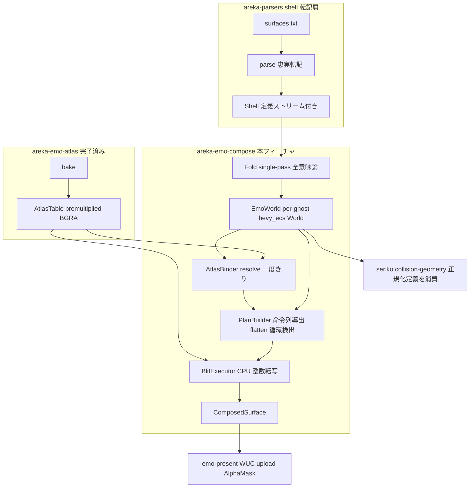
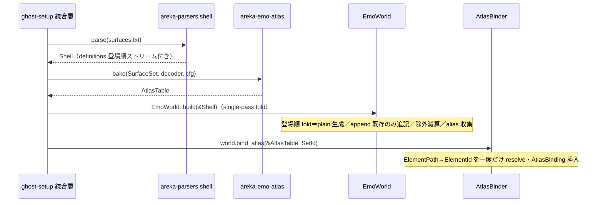
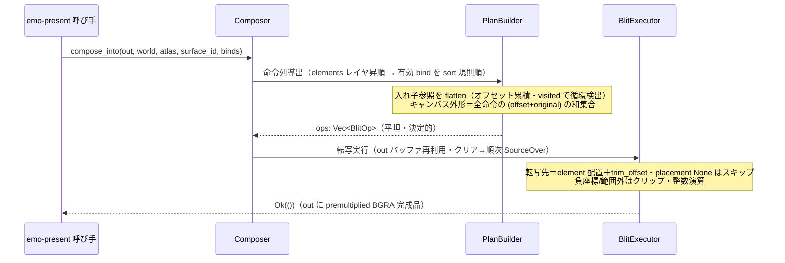

# Technical Design Document — areka-P0-emo-compose

## Overview

**Purpose**: 本フィーチャは emo（⑥ render engine）三段直列チェーンの 2/3 として、型付き Shell モデル（`areka_parsers::shell::Shell`）と焼付済みアトラス（`areka-emo-atlas::AtlasTable`）から、**指定 surface id ＋ 有効 bind 集合の合成済み1枚ビットマップ（premultiplied BGRA）を決定的に生成する合成コア**を提供する。下流 `emo-present` は `ComposedSurface` を無変換で WUC upload と `AlphaMask` 生成に使い、下流 `seriko`/`collision-geometry` は本フィーチャが公開する正規化 Surface 定義を同一結果として消費する。

**Users**: 直接の呼び手は `emo-present`／統合層（ghost-setup）。間接の消費者は `seriko`（アニメ定義）と `collision-geometry`（当たり判定）。開発者はオフスクリーン pixel 単体テストで合成の正しさを観測する。

**Impact**: 新設クレート `crates/areka-emo-compose` を追加する。加えて上流 `areka-parsers::shell` の転記層へ、既知の転記ギャップ4点（sort キー値・多 id ヘッダ・append 内 element・登場順単一定義ストリーム）を**記述のまま・意味論非解釈・登場順保持**の原則で小さく拡張する（要件 12.5）。既存の転記契約・parser テスト・`areka-emo-atlas` の `SurfaceSet` 消費（`&[shell::Surface]`）は不変。

### Goals

- Shell → 正規化 Surface 定義（collisions/animations 保持・公開形）への **single-pass fold**（疎 id・plain/append 意味論・alias 解決・emo 専用 bevy_ecs World 常駐）
- 正規化定義 → 転写命令列（レイヤ順・変換行列・合成メソッド・アトラス参照・入れ子 flatten・循環検出）→ premultiplied BGRA 1枚物合成（CPU・整数演算・決定的）
- `compose(surface_id, active_binds)` 形の合成入力（emo2 surface1000＝全 MAYUNA bind でも非空合成）
- 合成メソッド写像表の全量定義（式ステータス列付き）と emo2 使用分（overlay）のみの実装
- emo2 fixture による COM 非依存オフスクリーン pixel 観測（MemoryDecoder＋bake 経路）

### Non-Goals

- アトラス焼付・画像デコード・αトリミング（`areka-emo-atlas` 所有）
- 表示・WUC 連携・`AlphaMask` 生成・合成キャッシュ／無効化・surface 指令 API（`areka-emo-present` 所有）
- SERIKO ループ再生・bind の動的状態管理・着せ替え UI・blink 発火（`seriko` 所有）
- バルーン文字・glyph（`emo-text-layer` 所有）
- emo2 未使用合成メソッドの実装（型シームのみ）・DPI 拡縮（wintf 所有）
- 回転・拡縮の実挙動（M2 予約。行列表現の口のみ M1 で保持）

## Boundary Commitments

### This Spec Owns

- `crates/areka-emo-compose` の全体: 正規化 Surface 定義（公開形）・`BindSet`・`ComposedSurface`・`ComposeMethod` 写像表・emo 専用 per-ghost `bevy_ecs` World（`EmoWorld`）・single-pass fold・合成プラン導出・CPU アトラス転写合成
- `areka-parsers::shell` 転記層への**転記ギャップ4点の追加**（12.5 (a)〜(d)）と `balloon/model.rs:6` doc ドリフト修正（12.4）
- 正規化 Surface 定義の**唯一の展開実装**（下流 seriko/collision-geometry は再展開しない）

### Out of Boundary

- `AtlasTable`/`AtlasEntry`/`Placement`/`AtlasPage` 等の上流正本型の再定義（消費のみ）
- 合成結果のキャッシュ・無効化（emo-present）／bind 有効集合の決定（bindgroup default 解釈は呼び手）
- wintf の visual/window/WUC/描画 API への依存（一切知らない）
- スレッド生成・async・channel（通信非依存。UI スレッド常駐は統合側の配置規約）
- parser への意味論持ち込み（展開・存在判定・create/append 適用は emo 側のみ）

### Allowed Dependencies

- `areka-parsers`（path・転記層モデル）／`areka-emo-atlas`（path・アトラス正本型）
- `bevy_ecs`（workspace 0.18・wintf/areka 共通採用＝新規ではない）
- `tracing`（workspace・ログ規律）／`thiserror`（workspace 全クレート共通規約・エラー型）
- 上記以外の新規外部依存は**禁止**（要件 12.2）。tokio 禁止・Rust 2024（12.1）

### Revalidation Triggers

- `ComposedSurface`／`BindSet`／正規化 Surface 定義（`SurfaceMaster`）の形状変更 → emo-present・seriko・collision-geometry の再検証
- `areka-parsers::shell` モデルの形状変更（本チェーンの追加分含む）→ emo-atlas（`SurfaceSet` 消費）・本クレートの再検証
- 合成メソッドの実装追加（シーム解除）・parser への描画メソッド転記追加 → 写像表と plan 導出の再検証
- `AtlasTable` 契約（`Placement`/premultiplied/None=全透明）の変更 → blit 層の再検証
- emo World の所有・tick 協調モデルの変更（seriko 統合時）→ 並行モデル memory／ghost-setup の再検証

## Architecture

### Existing Architecture Analysis

- **上流契約は実在・安定**（research.md §2 正本）: `AtlasTable::{resolve, entry, page, pages}`・`Placement{page, uv_rect, trim_offset}`・`AtlasEntry{original, placement: Option<Placement>}`（None＝全透明＝転写スキップ）・`AtlasPage{width, height, stride, bytes: Arc<[u8]>}`（premultiplied BGRA）。`resolve` は構築時一度きり・`entry` は毎フレーム O(1)。
- **parser は転記層**: `Shell{surfaces, appends, aliases}` の3 Vec は各々出現順保持だが**種別間の interleaving を持たない**。plain ヘッダは `rest.parse::<u32>().unwrap_or(0)`（decode.rs L127）で多 id 形を破損。`animation-sort`/`collision-sort` は `Token::TopLevel` として破棄（decode.rs L87）。append ブロック内 element 行は未処理＝黙殺。**非 overlay の element/pattern 行は現行転記契約で吸収**（validation_tests 要件 4.5/5.7）＝ `Element`/`Pattern` に描画メソッドのフィールドは存在しない。
- **bevy_ecs 採用状況**: workspace dependencies に 0.18.0。wintf は単一 `EcsWorld`（`World` を所有し `Rc<RefCell<>>` で UI スレッド保持）。第2 World の前例はないが、`World` 自体は所有自由な普通の型であり専用 World の新設に障害はない。
- **循環検出の参考実装**: `areka-emo-atlas/src/manifest.rs` L97-126 `resolve_indirect`（`BTreeSet<i64>` visited・負センチネル拒否・未定義 id スキップ）。

### Architecture Pattern & Boundary Map

直列パイプライン（純粋データ変換の連鎖）＋ per-ghost 専用 ECS World をデータ常駐点とする。



**Architecture Integration**:

- **選択パターン**: fold → plan → execute の3層直列（brief Boundary Candidates 準拠）。plan（バックエンド非依存の命令列データ）と execute（CPU 実装）の分離が**バックエンド差替えシーム**を成す。
- **依存方向**（左からのみ import 可・違反はレビューエラー）:
  `areka-parsers` / `areka-emo-atlas` → `model層（method/bind/composed/normalized）` → `world（EmoWorld/components）` → `fold` → `atlas_bind` → `plan` → `blit` → `lib（facade Composer）`
- **既存パターンの踏襲**: NewType＋opaque inner・`#[non_exhaustive]` enum・thiserror 構造化エラー・tracing ログ規律・in-source テスト＋emo2 fixture スモーク（parsers/atlas と同規律）。
- **新設根拠**: 合成コアは既存クレートのどこにも存在しない欠落能力（research.md §3）。atlas への同居は責務肥大ゆえ却下（Option A 却下・§4）。
- **Steering 適合**: 責務ごとのクレート分割・COM/wintf 非依存の純粋層・Rust 2024・tokio 禁止。

### 主要アーキテクチャ決定（Key Decisions）

1. **バックエンド＝CPU ピクセル演算で開始（D2D オフスクリーン却下）**。根拠: (1) golden 安定性＝整数演算でバイト等価を保証（D2D はドライバ/WARP 差で丸めが揺れる） (2) headless テスト＝COM/デバイス不要 (3) emo2 使用メソッドは overlay のみ＝SourceOver の手書きで十分 (4) スレッド制約なし。**Backend trait は設けない**（実装が1つしかない指向の抽象は投機的）。plan（命令列）が既にバックエンド非依存のデータであり、将来 D2D 化する場合は同じ命令列を消費する別 executor を追加すればよい（要件 4 の趣旨を data-level seam で満たす）。
2. **入れ子参照は plan 時 flatten**。SourceOver は結合的（(A over B) over C ＝ A over (B over C)）なので、overlay のみの M1 では入れ子 surface の合成→転写は「入れ子の各層を平行移動合成して直接転写」と画素等価。PlanBuilder が入れ子参照を再帰的に inline 展開（オフセット累積・visited 集合で循環検出）し、**中間バッファ無しの平坦な命令列**を生成する。非 overlay の入れ子参照メソッドが現れた場合は未実装シーム（warn＋skip・8.4）。
3. **emo 専用 per-ghost World（wintf 本体 World と分離）**（議題2決定・再検討しない）。本 spec では World を**受動データストア＋同期呼び出しの合成実行体**として使う: fold/compose は `&mut World`/`&World` を取る普通の関数であり、Schedule/System は持たない（R1.8 の「system として実装し得る」構造は component スキーマで担保し、system 化は seriko 統合時の後続判断）。wintf schedule との tick 協調は発生しない（emo-present が UI スレッド上で同期に `compose` を呼ぶ）。emo→表示は `ComposedSurface` 値ハンドオフ。
4. **描画メソッドのシームは compose 側に置く**。現行転記層は非 overlay 行を吸収し `Element`/`Pattern` にメソッドのフィールドが無い（既存転記契約・12.5 は破壊禁止）。よって M1 の plan 命令は常に `ComposeMethod::Overlay` であり、写像表（全量 enum＋式ステータス）と未実装 warn 経路（8.4）は compose 側の型シーム＋直接構築テストで担保する。parser へのメソッド転記追加は将来の転記層拡張＝ revalidation trigger として記録。
5. **animation-sort の画素積層方向（ukadoc 確定）**: ukadoc は「手前から奥にどの順で表示するか。ascend で昇順(1,2,3...)、descend で降順(10,9,8...)。既定 descend」と明文。すなわち **descend（既定）＝大きい animation ID が手前 ⇒ 画家のアルゴリズムでは ID 昇順に描画（小 ID が奥・大 ID が上）**。ascend ＝小 ID が手前 ⇒ ID 降順に描画。brief の「ID 昇順合成」は既定 descend の描画順と一致する。
6. **決定性＝整数演算固定**。premultiplied SourceOver を u8/u32 整数で実装: `dst_c' = src_c + div255(dst_c × (255 − src_a))`、`div255(v) = (v + 127) / 255`。浮動小数を経路に持ち込まない（10.2）。

### ukadoc 調査結果（design 冒頭調査・正本引用の要約）

| 項目 | ukadoc 確定内容 | 本設計への反映 |
|---|---|---|
| `element*` | `element*,描画メソッド,ファイル名,X,Y(,オプション)`。element0 は surface*.png を破棄して置換・element1 以降は上に順次合成。オプション clipping/alpha/source（SSP 2.8.15+） | レイヤ昇順転写。透明キャンバスへの overlay は element0 でコピーと等価。オプションは転記層が吸収済（emo2 未使用・シーム外） |
| `animation*.pattern*` | `描画メソッド,サーフェス番号,ウェイト,X,Y(,オプション)`。**サーフェス番号 -1＝そのアニメ停止・-2＝全アニメ停止のセンチネル（描画なし・メソッド/XY 無視）**。パターンは番号の小さい方から積み重なる。alias 名指定可（SSP 2.8.25+）。旧書式 `*pattern*,ID,ウェイト,メソッド,X,Y` あり | 静的 bind 合成は pattern0（index 0）のみ使用。surface_id < 0 は非描画スキップ（debug ログ）。旧書式変換は転記層責務外（現行吸収） |
| `animation-sort` | 既定 **descend**。手前から奥への表示順（決定5参照） | `EmoWorld::animation_sort()` 既定 descend。bind 合成順に適用（5.3/5.6） |
| `collision-sort` | 既定 **none**（ID によらず先に書かれている方が手前） | 正規化結果に値を保持し下流 collision-geometry へ引き継ぐ（1.6）。compose の画素経路には不使用 |
| `overlay` | ベースレイヤに新規レイヤを単に重ねる（式は未明文） | **実装対象**。premultiplied SourceOver（de-facto 式・決定6） |
| `overlay-fast`（旧称 `overlayfast`） | ベースの**不透明度**に応じて重ねる（不透明部ほど濃く合成・全透明部は合成しない） | シーム。式 de-facto |
| `interpolate` | ベースの**透明度**に応じて重ねる（透明部ほど濃く・不透明部は合成しない）。overlayfast の対 | シーム。premultiplied DestOver 相当（de-facto） |
| `replace` | src 範囲内をαごと完全上書き。**src 範囲外は何も合成せず残る**（透明扱いではない） | シーム。式確定（copy） |
| `asis` | src の透過（透過色・自己α）を無視して重ねる＝不透明扱い。透過域は事実上黒 | シーム。挙動確定 |
| `base` | ベースを完全置換・collision もコマ側に更新。XY 無視。element/着せ替えでは先頭（element0/pattern0）のみ・それ以外は overlay 読替 | シーム（先頭層は透明キャンバス上 overlay と画素等価）。collision 更新は seriko 側の将来課題 |
| `add`／`bind` | **処理内容は overlay と同義**（着せ替え用の別名） | Overlay と同一経路へ写像（確定） |
| `reduce` | dst と src の**不透明度の乗算**（切り抜き）。RGB は無視。**src 範囲外は透明相当＝消去** | シーム。挙動確定・式 de-facto（premultiplied では全 ch × src_a/255） |
| `blend-*` 群（add/multiply/screen/overlay/darken/lighten/color-burn/color-dodge/hard-light/hard-mix/difference/exclusion/divide/hue/color/darker-color/lighter-color… 各 `-fast` 変種、旧称 overlaymultiply=blend-multiply-fast・overlayscreen=blend-screen-fast） | Photoshop 相当のレイヤ合成（SSP 2.8.35〜2.8.40）。`-fast` はベース不透明度変調 | シーム。`Blend(BlendMode)`＋`#[non_exhaustive]` で口のみ |
| `auto` | element の source オプション併用時のみレイヤ情報から自動推定（SSP 2.8.41） | シーム |
| `alternativestart/stop` 等の制御メソッド | 非描画（アニメ再生制御）。ID/ウェイト/XY 無視 | 描画写像表の対象外＝seriko 領分。転記層は現行吸収 |
| `collisionex*` | タイプ＝rect/ellipse/circle/polygon/region | M1 転記層は矩形 `collision*` のみ（現行契約）。正規化は転記された collisions を保持するのみ（型多様化は将来の転記層拡張） |
| `surface.append`（議題2確定・satori 実例） | plain `surfaceN,M`/`N-M` は**全 id を新設**・`surface.append` は**既存 id のみ追記**（存在条件付き）。ターゲットは単一/列挙/範囲/**除外 `!`**。append は element も持てる | fold の create/append 意味論（R2）。除外は展開時に減算適用 |

### Technology Stack

| Layer | Choice / Version | Role in Feature | Notes |
|-------|------------------|-----------------|-------|
| データ管理 | bevy_ecs 0.18.0（workspace） | emo 専用 per-ghost World・正規化定義の常駐 | wintf/areka 共通採用＝新規依存ではない（12.2） |
| 入力モデル | areka-parsers（path） | Shell 転記層モデル＋本チェーンの転記ギャップ4点追加 | 既存転記契約・テスト不変（12.5） |
| アトラス | areka-emo-atlas（path） | AtlasTable/Placement/AtlasPage 正本型の消費 | 再定義禁止。テストは MemoryDecoder＋bake |
| 合成実行 | 自前 CPU 整数演算 | premultiplied SourceOver・O(elements) 転写 | 決定1。外部画像クレート不使用 |
| ログ／エラー | tracing／thiserror（workspace） | 失敗経路のログ規律・構造化エラー | 全クレート共通規約 |

## File Structure Plan

### Directory Structure

```
crates/areka-emo-compose/
├── Cargo.toml               # areka-parsers, areka-emo-atlas, bevy_ecs, tracing, thiserror（全て既存基盤）
└── src/
    ├── lib.rs               # クレート docs・公開 re-export・Composer facade
    ├── error.rs             # ComposeError（thiserror）
    ├── method.rs            # ComposeMethod / BlendMode enum・写像表（全量列挙＋式ステータス）・dispatch シーム
    ├── bind.rs              # BindSet（有効 bind 集合・Send 所有・整列済み）
    ├── composed.rs          # ComposedSurface（premultiplied BGRA・size・stride・Send 所有）
    ├── normalized.rs        # SurfaceMaster / NormalizedElement / Transform（正規化公開形・行列表現）
    ├── world.rs             # EmoWorld（per-ghost bevy_ecs World）・SurfaceIndex/AliasMap/ShellSettings リソース・SurfaceId/SurfaceMaster/AtlasBinding コンポーネント
    ├── fold.rs              # single-pass fold（定義ストリーム→World・ターゲット展開＋除外・create/append 意味論・alias 収集）
    ├── atlas_bind.rs        # AtlasBinder（ElementPath→ElementId resolve 一度きり・AtlasBinding 挿入）
    ├── plan.rs              # BlitOp / PlanBuilder（レイヤ順・bind 順序規則・入れ子 flatten・循環検出・キャンバス外形）
    ├── blit.rs              # BlitExecutor（CPU 転写・SourceOver 整数式・trim_offset・クリップ）
    └── golden_tests.rs      # emo2 fixture pixel 観測（in-source #[cfg(test)]・MemoryDecoder+bake 経路）
```

各モジュールは in-source `#[cfg(test)]` の単体テストを併設する（parsers/atlas と同規律）。

### Modified Files

- `crates/areka-parsers/src/shell/model.rs` — 転記ギャップ4点のモデル追加: `SortOrder` enum・`Shell.animation_sort`/`collision_sort`・`Shell.definitions`（登場順ストリーム）・`Surface.targets`（多 id ヘッダ記述子）・`SurfaceAppend.elements`・`AppendTarget` に除外 variant 追加（`#[non_exhaustive]` ゆえ非破壊）
- `crates/areka-parsers/src/shell/decode.rs` — plain ヘッダの多 id 記述子パース（append と共通のターゲットパーサへ一本化）・`animation-sort`/`collision-sort` TopLevel 値化・append ブロック内 element の転記・definitions ストリームへの登場順 push
- `crates/areka-parsers/src/shell/decode_tests.rs`／`validation_tests.rs` — 4ギャップの転記テスト追加。既存テストは**アサーション意味不変のままリテラル機械追随**（議題1裁定・転記層拡張の節参照）
- `crates/areka-emo-atlas/tests/emo2_e2e.rs`（L66/290）・`src/manifest.rs`（L150）・`src/lib.rs`（L203） — テストヘルパの `shell::Surface` リテラルへ新フィールド初期値を機械追随（検証意味不変・議題1裁定）
- `crates/areka-parsers/src/balloon/model.rs` — L6 doc コメントの旧名 `areka-P0-text-layer`/`areka-P0-surface-engine` を現行エンジン固有名（emo-text-layer／emo）へ修正（12.4）

> ワークスペースは `members = ["crates/*"]` のため root Cargo.toml の変更は不要。

## System Flows

### 構築フロー（load-time・ゴーストごと1回）



### 合成フロー（runtime・毎呼び出し）



フロー上の決定: 循環検出は plan 導出時（visited 集合＝`Composer` スクラッチの再利用 Vec）。検出時は warn ログの上その参照枝のみ打ち切り、部分結果を返す（7.2/7.3・非パニック）。対象 surface 不在は `error!`＋`Err(SurfaceNotFound)`。**surface が存在し描画可能命令ゼロ（全透明・空 bind 集合）は正常＝静的外形どおりの全透明を返す**（議題2裁定・6.6）。キャンバス外形は有効 bind に依存しない静的算出（bind 切替でサイズ不変）。

## Requirements Traceability

| Requirement | Summary | Components | Interfaces / Flows |
|-------------|---------|------------|--------------------|
| 1.1 | 疎 id 解決・正規化生成 | Fold, EmoWorld | `EmoWorld::build`・`SurfaceIndex` |
| 1.2 | collisions/animations 保持の完全定義 | Fold, normalized | `SurfaceMaster` |
| 1.3 | 下流が再展開なしに消費できる公開形 | EmoWorld | `EmoWorld::surface(id)`／`surface_ids()` |
| 1.4 | 欠落 id 非パニック・warn | Fold, PlanBuilder | `warn!`＋欠落スキップ／`ComposeError::SurfaceNotFound` |
| 1.5 | 決定的（バイト等価）正規化 | Fold | 登場順 fold・BTree/整列走査 |
| 1.6 | sort キーの正規化引き継ぎ | Fold, world | `ShellSettings`・`animation_sort()`/`collision_sort()` |
| 1.7 | 登場順 single-pass・存在判定はその時点の状態 | Fold | `Shell.definitions` 順の fold ループ |
| 1.8 | emo 専用 per-ghost bevy_ecs World 管理 | EmoWorld | components スキーマ（Data Models） |
| 2.1 | plain surface（単一/列挙/範囲）＝全 id 新設＋共有ボディ | Fold | `expand_targets`＋create 意味論 |
| 2.2 | append＝既存 id のみ・両端含む・非新設 | Fold | append 意味論（存在条件付き） |
| 2.3 | 同一 surface への複数定義は登場順で決定的適用 | Fold | 定義ストリーム順 fold |
| 2.4 | append の element/collision/animation 反映 | Fold, parsers 拡張 | `SurfaceAppend.elements` 転記＋マージ規則 |
| 2.5 | 除外 `!N`/`!a-b` の展開時適用 | parsers 拡張, Fold | `AppendTarget::Exclude*`＋展開時減算 |
| 3.1 | alias キー→順序付き id リスト解決 | Fold, EmoWorld | `AliasMap`・`resolve_alias(key)` |
| 3.2 | alias 重複の決定的取り扱い | Fold | 後勝ち（workspace KV 規約と整合・de-facto 記録） |
| 3.3 | 未解決 alias 非パニック・warn | EmoWorld | `resolve_alias`→None＋`warn!` |
| 4.1 | 命令列導出（レイヤ順・行列・メソッド・参照） | PlanBuilder | `BlitOp`・`build_plan` |
| 4.2 | 変換行列表現・X,Y は単位行列特例 | normalized, PlanBuilder | `Transform::translate`・`is_translation()` |
| 4.3 | アトラス参照命令に ElementId/Placement | AtlasBinder, PlanBuilder | `AtlasBinding`→`BlitOp.element` |
| 4.4 | 入れ子 surface 参照命令 | PlanBuilder | flatten 再帰（決定2） |
| 4.5 | 命令列の決定性 | PlanBuilder | 整列規則固定・入力同一→ops 同一 |
| 5.1 | `compose(surface_id, active_binds)` 形 | Composer | `compose_into` シグネチャ |
| 5.2 | 有効 bind の pattern0 を合成対象化 | PlanBuilder | bind 層列挙（index 0） |
| 5.3 | animation-sort → ID 順の2段規則 | PlanBuilder | 決定5の描画順写像 |
| 5.4 | 全 bind surface（element ゼロ）でも非空合成 | PlanBuilder, BlitExecutor | emo2 surface1000 golden |
| 5.5 | 動的 bind 管理を持たない（静的集合のみ） | Composer | `BindSet` 入力・状態レス |
| 5.6 | animation-sort 未指定→既定 descend | EmoWorld | `animation_sort()` 既定値 |
| 6.1 | アトラス頁→合成先へ転写・1枚 premultiplied BGRA | BlitExecutor | `AtlasPage.bytes`→`ComposedSurface` |
| 6.2 | 転写先＝配置座標＋trim_offset・見た目不変 | BlitExecutor | オフセット合算・trim golden |
| 6.3 | placement None＝転写スキップ | PlanBuilder/BlitExecutor | None ガード |
| 6.4 | premultiplied SourceOver・straight α 禁止 | BlitExecutor | 決定6の整数式 |
| 6.5 | サイズ＝surface 外形（全定義層和集合・静的）・ピクセル等倍 | PlanBuilder | キャンバス外形規則（議題2裁定・bind 非依存） |
| 6.6 | 描画可能命令ゼロ＝全透明を正常返却 | PlanBuilder, Composer | 空 ops＋静的外形・Err は退化データ限定 |
| 7.1 | 入れ子参照の再帰合成 | PlanBuilder | flatten 再帰 |
| 7.2 | 循環＝訪問集合検出・非パニック打ち切り | PlanBuilder | visited（Composer スクラッチ） |
| 7.3 | 循環検出の warn 記録 | PlanBuilder | `warn!(surface_id, ...)` |
| 8.1 | 写像表の全量列挙 | Method Registry | `ComposeMethod`/`BlendMode`＋写像表（本書） |
| 8.2 | emo2 使用分（overlay）実装 | BlitExecutor | SourceOver 実装 |
| 8.3 | 未使用分は型シーム | Method Registry | `#[non_exhaustive]`・未実装 variant |
| 8.4 | 未実装メソッド参照＝非パニック・warn | BlitExecutor | dispatch の warn＋skip 経路 |
| 9.1 | `ComposedSurface`（BGRA/size/stride 明示） | composed | 型定義 |
| 9.2 | 入出力は Send 所有 | bind, composed | `static_assertions` 相当のテスト |
| 9.3 | 通信機構を介さず値/共有参照で返す | Composer | 同期関数戻り値 |
| 9.4 | キャッシュ非保持 | Composer | 状態＝スクラッチのみ（結果保持なし） |
| 10.1 | 同一入力→バイト等価 | 全層 | determinism テスト |
| 10.2 | 整数/固定小数演算 | BlitExecutor | div255 整数式 |
| 10.3 | バッファ再利用・O(elements)・途中アロケーションなし | Composer, BlitExecutor | `compose_into`＋スクラッチ再利用（定常状態ゼロアロケーション） |
| 10.4 | wintf 非依存・スレッド/async/channel 非所有・emo 専用 World 常駐 | クレート全体 | 依存グラフ（Cargo.toml） |
| 10.5 | 失敗＝error ログ＋Err・panic 致命限定 | error, 全層 | `ComposeError`＋ログ規律 |
| 10.6 | World は定義・構造のみ・ビットマップ非永続 | EmoWorld | components に画素バッファを持たない |
| 11.1 | surface0 golden 一致 | golden_tests | fixture＋MemoryDecoder |
| 11.2 | surface1000＋bind 集合＝非空 | golden_tests | 同上 |
| 11.3 | トリム等価 pixel テスト | golden_tests | trim あり/なし比較 |
| 11.4 | 実上流非依存のオフスクリーン観測 | golden_tests | fixture 直入力・COM 不要 |
| 12.1 | Rust 2024・tokio 不使用 | Cargo.toml | edition.workspace |
| 12.2 | 既存基盤依存のみ | Cargo.toml | 依存5点固定 |
| 12.3 | emo2 使用分のみ実装＋構造シーム | 全層 | 写像表/行列/入れ子/循環の構造保持 |
| 12.4 | balloon/model.rs:6 ドリフト修正 | Modified Files | doc コメント修正 |
| 12.5 | 転記層4ギャップの忠実転記拡張 | parsers 拡張 | (a)〜(d)・既存契約不変 |

## Components and Interfaces

| Component | Domain/Layer | Intent | Req Coverage | Key Dependencies | Contracts |
|-----------|--------------|--------|--------------|------------------|-----------|
| Parsers 転記層拡張 | areka-parsers::shell | 転記ギャップ4点の忠実転記 | 12.5, 2.5, 1.6, 1.7 | lexer 既存（P0） | State |
| Method Registry | emo-compose model | 合成メソッド全量列挙＋式ステータス＋dispatch シーム | 8.1–8.4 | なし | Service |
| 公開データ契約 | emo-compose model | SurfaceMaster/BindSet/ComposedSurface/Transform | 1.2, 4.2, 9.1, 9.2 | parsers 型（P0） | State |
| EmoWorld | emo-compose world | per-ghost bevy_ecs World・公開クエリ | 1.1, 1.3, 1.8, 3.1–3.3, 5.6, 10.6 | bevy_ecs（P0） | Service / State |
| Fold | emo-compose fold | 定義ストリームの single-pass 畳み込み（全意味論） | 1.1–1.7, 2.1–2.5, 3.1–3.2 | EmoWorld（P0）, parsers（P0） | Service |
| AtlasBinder | emo-compose atlas_bind | ElementPath→ElementId の一度きり resolve | 4.3 | AtlasTable（P0） | Service |
| PlanBuilder | emo-compose plan | 命令列導出・bind 順序・flatten・循環検出・外形 | 4.1–4.5, 5.2–5.4, 6.3, 6.5, 7.1–7.3 | EmoWorld/Binding（P0） | Service |
| BlitExecutor | emo-compose blit | CPU 転写・SourceOver 整数演算・トリム/クリップ | 6.1–6.4, 8.2, 8.4, 10.1–10.3 | AtlasTable（P0） | Service |
| Composer facade | emo-compose lib | compose 入口・スクラッチ所有・エラー集約 | 5.1, 5.5, 9.3, 9.4, 10.5 | 上記全て（P0） | Service |

### areka-parsers::shell — 転記層拡張

| Field | Detail |
|-------|--------|
| Intent | ukadoc 正典書式4点を「記述のまま・意味論非解釈・登場順保持」で転記に追加する |
| Requirements | 12.5, 2.5, 1.6, 1.7 |

**Responsibilities & Constraints**
- 展開・存在判定・create/append 適用・alias 解決は**行わない**（emo 側の責務）。
- **「非破壊」の定義（設計ディスカッション議題1裁定）**: 公開**読取**契約・既存テストの**アサーション意味**・**実行時挙動**の不変を指す。公開フィールド追加はソースレベルでは構造体リテラル構築箇所の追随を要する（Rust の言語特性上不可避）が、これは**機械的追随として許容**する——既存リテラル約20箇所（parsers 自身の validation_tests.rs L85-86/186・decode_tests.rs L25/40/57/100・parse_tests.rs L22/91-92/120・model_tests.rs L98/123-124/152 ＋ **完了済み `areka-emo-atlas` の4箇所**: emo2_e2e.rs L66/290・manifest.rs L150・lib.rs L203＝テストヘルパ）へ `targets: vec![AppendTarget::Single(id)]`／`elements: Vec::new()`／`definitions`・sort キー等の初期値を追記する。**テストの検証意味は一切変更しない**（アサーションの弱体化・削除は禁止）。隣接完了クレートへの追随は先例（host32-lifecycle「隣接クレート増分もスコープ可」）とワークツリー squash-merge 運用により正当。
- **`Default` 実装は導入しない**（却下理由: `Surface::default()` の `id=0` は実在 surface0 と衝突する意味のある値であり誤構築を型で防げない。spread 追記でも編集箇所は同数で手間も減らない）。コンストラクタ関数への全面移行も本チェーンでは行わない（YAGNI）。
- 非 overlay element/pattern の吸収という**現行転記契約は維持**する（メソッド転記の追加は本チェーン外）。

##### State（モデル追加・Rust シグネチャ）

```rust
/// (a) ソート順の値（記述のまま。既定の適用は下流）
#[non_exhaustive]
#[derive(Debug, Clone, Copy, PartialEq, Eq)]
pub enum SortOrder { Ascend, Descend }

pub struct Shell {
    pub surfaces: Vec<Surface>,           // 既存（不変）
    pub appends: Vec<SurfaceAppend>,      // 既存（不変）
    pub aliases: Vec<SurfaceAlias>,       // 既存（不変）
    pub animation_sort: Option<SortOrder>, // (a) 未指定は None（既定解釈しない）
    pub collision_sort: Option<SortOrder>, // (a) 同上（none 既定の解釈も下流）
    pub definitions: Vec<DefRef>,          // (d) 登場順の単一定義ストリーム（3 Vec への index）
}

/// (d) 種別間 interleaving を保持する参照ストリーム（データ重複なし）
#[non_exhaustive]
#[derive(Debug, Clone, Copy, PartialEq, Eq)]
pub enum DefRef { Surface(usize), Append(usize), Alias(usize) }

pub struct Surface {
    pub id: u32,                       // 既存: 記述子先頭の代表 id（単一形は従来どおり）
    pub targets: Vec<AppendTarget>,    // (b) ヘッダ記述子の忠実転記（単一形は [Single(id)]）
    pub elements: Vec<Element>,        // 既存
    pub collisions: Vec<Collision>,    // 既存
    pub animations: Vec<Animation>,    // 既存
}

pub struct SurfaceAppend {
    pub targets: Vec<AppendTarget>,    // 既存
    pub elements: Vec<Element>,        // (c) append 内 element の転記（従来黙殺）
    pub collisions: Vec<Collision>,    // 既存
    pub animations: Vec<Animation>,    // 既存
}

#[non_exhaustive]
pub enum AppendTarget {
    Single(u32),
    Range { start: u32, end: u32 },        // 両端含む・既存
    Exclude(u32),                          // (2.5) 除外 !N の記述子保持
    ExcludeRange { start: u32, end: u32 }, // (2.5) 除外 !a-b の記述子保持
}
```

- Preconditions: 入力は寛容パース対象の surfaces.txt テキスト（既存 `parse` 契約）。
- Postconditions: `definitions` の順序＝原文の登場順。`surface1-3` は `targets=[Range{1,3}]`・`id=1`（従来の `unwrap_or(0)` 破損を是正）。`surface0,5` は `targets=[Single(0), Single(5)]`・`id=0`。未知の `animation-sort` 値は None のまま吸収（寛容規約）。
- Invariants: 3 Vec の内容と順序は従来と同一（`DefRef` は index 参照であり複製しない）。

**Implementation Notes**
- decode.rs の plain ヘッダ経路（L127 近傍）を append の `parse_targets` と共通のターゲットパーサへ一本化。TopLevel 破棄経路（L87）に sort キー2種の値化を追加。append ボディに element 行の転記を追加。
- Risks: `Surface.id` の意味が「代表 id」へ拡がる（単一形では完全互換）。既存消費者（emo-atlas）は emo2 のような単一形のみ扱ってきたため実挙動不変。テストで固定する。

### Method Registry（method.rs）

| Field | Detail |
|-------|--------|
| Intent | ukadoc 由来メソッドの全量列挙・overlay 実装・他は明示的未実装シーム |
| Requirements | 8.1, 8.2, 8.3, 8.4 |

##### Service Interface

```rust
#[non_exhaustive]
#[derive(Debug, Clone, PartialEq, Eq)]
pub enum ComposeMethod {
    Overlay,                 // 実装（emo2 使用分）。add/bind は本 variant へ写像（ukadoc 同義明文）
    OverlayFast,
    Interpolate,
    Replace,
    Asis,
    Base,
    Reduce,
    Blend(BlendMode),        // blend-* 群（-fast 変種は BlendMode 側で保持）
    Auto,
    Unknown(Box<str>),       // 将来の転記層メソッド追加に備えた吸収口
}

#[non_exhaustive]
#[derive(Debug, Clone, PartialEq, Eq)]
pub enum BlendMode { /* Add, Multiply, Screen, Overlay, Darken, Lighten, ColorBurn,
    ColorDodge, HardLight, HardMix, Difference, Exclusion, Divide, Hue, Saturation,
    Color, Luminosity, DarkerColor, LighterColor …（各 fast: bool を保持） */ }

impl ComposeMethod {
    /// 実装済みか（M1: Overlay のみ true）
    pub fn is_implemented(&self) -> bool;
}
```

- Postconditions: `BlitExecutor` は `is_implemented()==false` の命令に対し `warn!`（メソッド名・surface id 付き）を発してその命令をスキップし、処理を継続する（8.4・非パニック）。

#### 合成メソッド写像表（全量・式ステータス列付き）

凡例 — **確定**: ukadoc に挙動が明文。**de-facto**: ukadoc は式未明文で SSP 実挙動が事実上の仕様（premultiplied 表現は本設計の写像）。**未確定**: 実測未了。`a`＝α(0..255)、`c`＝premultiplied 色 ch、`div255(v)=(v+127)/255`。

| メソッド | ukadoc 挙動 | premultiplied 合成式 | 式ステータス | M1 |
|---|---|---|---|---|
| `overlay` | 単に重ねる | `c' = c_src + div255(c_dst·(255−a_src))`（SourceOver・α同式） | de-facto（挙動は確定・式は未明文） | **実装** |
| `add` / `bind` | overlay と同義（着せ替え別名） | 同上 | **確定**（同義が明文） | Overlay へ写像 |
| `overlay-fast`（旧 `overlayfast`） | ベース不透明度に応じ重ねる | `src' = src·a_dst/255` を SourceOver | de-facto | シーム |
| `interpolate` | ベース透明度に応じ重ねる（overlayfast の対） | `c' = c_dst + div255(c_src·(255−a_dst))`（DestOver 相当） | de-facto | シーム |
| `replace` | src 範囲内をαごと上書き・範囲外は無操作 | `c' = c_src`（src 範囲内のみ） | **確定** | シーム |
| `asis` | src 透過を無視（不透明扱い）で重ねる | `c' = c_src_straight, a' = 255`（src 範囲内） | **確定**（透過域は黒挙動の注記あり） | シーム |
| `base` | ベース完全置換・collision 更新・XY 無視・先頭以外は overlay 読替 | キャンバスクリア→copy | **確定** | シーム（先頭層は透明上 overlay と画素等価） |
| `reduce` | 不透明度の乗算（切り抜き）・RGB 無視・src 範囲外は透明扱い＝消去 | `c'_dst = div255(c_dst·a_src)`（全 ch。範囲外は 0） | 挙動**確定**・式 de-facto | シーム |
| `blend-add(-fast)` | 加算合成 | Photoshop Add（-fast はベース不透明度変調） | de-facto | シーム |
| `blend-multiply(-fast)`（旧 `overlaymultiply`） | 乗算合成 | Photoshop Multiply | de-facto | シーム |
| `blend-screen(-fast)`（旧 `overlayscreen`） | スクリーン合成 | Photoshop Screen | de-facto | シーム |
| `blend-overlay(-fast)` | オーバーレイ合成（overlay メソッドとは無関係） | Photoshop Overlay | de-facto | シーム |
| `blend-darken / -lighten / -darker-color / -lighter-color (-fast)` | 比較合成群 | Photoshop 相当 | de-facto | シーム |
| `blend-color-burn / -color-dodge / -hard-light / -hard-mix (-fast)` | 焼込/覆焼/ハードライト/ハードミックス | Photoshop 相当 | de-facto | シーム |
| `blend-difference / -exclusion / -divide (-fast)` | 差の絶対値/除外/除算 | Photoshop 相当 | de-facto | シーム |
| `blend-hue / -saturation / -color / -luminosity (-fast)` | 色相/彩度/カラー/輝度 | Photoshop 相当 | **未確定**（HSL 変換の丸め実測未了） | シーム |
| `auto` | element source オプション時のみレイヤ情報から推定 | 推定先メソッドに委譲 | **確定**（挙動） | シーム |
| pattern サーフェス番号 `-1`/`-2` | アニメ停止/全停止センチネル（非描画） | 描画なし（compose は skip） | **確定** | skip 実装 |
| `alternativestart/stop` 等 制御系 | アニメ再生制御（非描画） | 写像対象外（seriko 領分） | **確定** | 対象外 |

> **M1 の実流入は Overlay のみ**: 現行転記層が非 overlay 行を吸収するため（既存契約）、plan に現れるメソッドは常に `Overlay`。未実装 warn 経路（8.4）は plan 直接構築の単体テストで検証する。parser へのメソッド転記追加は将来拡張（Revalidation Trigger）。

### 公開データ契約（bind.rs / composed.rs / normalized.rs）

| Field | Detail |
|-------|--------|
| Intent | emo-present／seriko／collision-geometry と共有する Send 所有の型契約 |
| Requirements | 1.2, 1.3, 4.2, 9.1, 9.2 |

##### State

```rust
/// 有効 bind 集合（animation ID の整列済み集合・Send 所有・重複なし）
#[derive(Debug, Clone, Default, PartialEq, Eq)]
pub struct BindSet(/* opaque */ Vec<u32>);
impl BindSet {
    pub fn from_ids(ids: impl IntoIterator<Item = u32>) -> Self; // 整列＋dedup
    pub fn contains(&self, animation_id: u32) -> bool;           // 二分探索
    pub fn ids(&self) -> &[u32];
}

/// 合成結果（premultiplied BGRA・Send 所有・無変換で WUC upload / AlphaMask 生成可能）
#[derive(Debug, Clone, Default)]
pub struct ComposedSurface {
    /* opaque */ // width: u32, height: u32, stride: u32（= width*4 明示）, bytes: Vec<u8>
}
impl ComposedSurface {
    pub fn width(&self) -> u32;
    pub fn height(&self) -> u32;
    pub fn stride(&self) -> u32;
    pub fn bytes(&self) -> &[u8];      // len == stride * height
    pub fn into_bytes(self) -> Vec<u8>;
}

/// 2D 変換（M1 実挙動は恒等＋平行移動のみ。回転・拡縮は M2 予約の口）
#[derive(Debug, Clone, Copy, PartialEq, Eq)]
pub struct Transform { /* opaque: 整数 2x2 部（M1 は単位固定）＋ tx/ty: i64 */ }
impl Transform {
    pub fn translate(x: i64, y: i64) -> Self;   // X,Y 特例＝単位行列＋平行移動
    pub fn is_translation(&self) -> bool;       // M1 は常に true
    pub fn offset(&self) -> (i64, i64);
}

/// 正規化 Surface 定義（公開形・collisions/animations 保持・下流はこれを唯一の正とする）
#[derive(Debug, Clone, PartialEq)]
pub struct SurfaceMaster {
    pub id: u32,
    pub elements: Vec<NormalizedElement>,            // layer 昇順・同 layer は登場順
    pub collisions: Vec<areka_parsers::shell::Collision>,
    pub animations: Vec<areka_parsers::shell::Animation>, // interval/pattern を転記のまま保持
}

#[derive(Debug, Clone, PartialEq)]
pub struct NormalizedElement {
    pub layer: u32,
    pub path: areka_parsers::shell::ElementPath, // デバッグ・atlas resolve キー
    pub transform: Transform,                    // 転記 x,y の行列表現（4.2）
    pub method: ComposeMethod,                   // M1 は常に Overlay（転記契約による）
}
```

- Invariants: `BindSet`/`ComposedSurface` は `Send`（コンパイル時 assert テストで固定・9.2）。`ComposedSurface.bytes` は常に premultiplied BGRA・`stride == width*4`。`SurfaceMaster.animations` は転記層の `Animation` をそのまま保持（seriko が再利用・1.2/1.3）。

### EmoWorld（world.rs）

| Field | Detail |
|-------|--------|
| Intent | wintf 本体と分離した per-ghost bevy_ecs World にサーフェス合成ツリーを常駐させ、公開クエリを提供する |
| Requirements | 1.1, 1.3, 1.8, 3.1–3.3, 5.6, 10.4, 10.6 |

**Responsibilities & Constraints**
- World は**定義・構造 component のみ**保持。合成済みビットマップ・アトラス頁の複製は component に持たない（10.6・スケール規律）。
- Schedule/System は本 spec では所有しない（決定3）。`world()`/`world_mut()` の脱出口で将来の seriko system 統合に備える。
- ゴースト unload ＝ `EmoWorld` drop で全 entity 一掃（per-ghost lifecycle）。

**Dependencies**
- Inbound: Fold — 構築（P0）／PlanBuilder — 読み取り（P0）／seriko・collision-geometry — 正規化定義の消費（P1・将来）
- External: bevy_ecs 0.18 — World/entity/component 基盤（P0）

##### Service Interface

```rust
pub struct EmoWorld { /* opaque: bevy_ecs::world::World */ }

impl EmoWorld {
    /// Shell から single-pass fold で構築（寛容・非パニック。欠落は warn ログ）
    pub fn build(shell: &areka_parsers::shell::Shell) -> EmoWorld;

    /// アトラス束縛（resolve は本呼び出しの一度きり・4.3）。未解決 element は warn＋None
    pub fn bind_atlas(&mut self, atlas: &areka_emo_atlas::AtlasTable,
                      set: areka_emo_atlas::SetId);

    /// 正規化 Surface 定義の公開クエリ（1.3・存在しない id は None）
    pub fn surface(&self, id: u32) -> Option<&SurfaceMaster>;
    pub fn surface_ids(&self) -> impl Iterator<Item = u32> + '_;   // 昇順（決定的）

    /// alias 解決（3.1/3.3。未解決は warn ログ＋None）
    pub fn resolve_alias(&self, key: &str) -> Option<&[u32]>;

    /// 実効ソート順（未指定は ukadoc 既定: descend / none 相当・1.6/5.6）
    pub fn animation_sort(&self) -> SortOrder;                      // 既定 Descend
    pub fn collision_sort(&self) -> Option<SortOrder>;              // 既定 None（記述順）

    /// 将来の system 統合用脱出口（seriko 側 spec の領分）
    pub fn world(&self) -> &bevy_ecs::world::World;
    pub fn world_mut(&mut self) -> &mut bevy_ecs::world::World;
}
```

- Preconditions: `bind_atlas` は `build` 後・compose 前に一度呼ぶ（未呼びで compose した場合は全 element 未束縛＝warn＋空 plan→Err）。
- Postconditions: `build` は同一 `Shell` に対して決定的な World 内容を生成（1.5）。
- Invariants: World には画素バッファを保持する component が存在しない（10.6）。

##### State Management（ECS スキーマは Data Models 参照）

- State model: entity＝surface 1件。`SurfaceIndex`（Resource）で疎 id → Entity を O(1) 解決。
- Concurrency strategy: 単一スレッド前提の同期 API（`&self`/`&mut self`）。スレッド生成・channel なし（10.4）。

### Fold（fold.rs）

| Field | Detail |
|-------|--------|
| Intent | 登場順定義ストリームを single-pass で畳み込み、create/append/alias の全意味論を適用して EmoWorld を構築する |
| Requirements | 1.1–1.7, 2.1–2.5, 3.1–3.2 |

**Responsibilities & Constraints**
- `Shell.definitions` の登場順に1回だけ走査（前方参照なし・多パス不要・1.7）。
- **plain surface**（`DefRef::Surface`）: `targets` を展開（単一/列挙/範囲・両端含む・除外減算）→ 各 id を**新設**し共有ボディを適用。既存 id との重複は**全置換（後勝ち）**＋ `warn!`（ukadoc に明文規則なし＝de-facto 記録・2.1）。
- **append**（`DefRef::Append`）: `targets` 展開後、**その時点でツリーに存在する id のみ**へ追記（非新設・2.2）。elements/collisions は末尾連結（正規化時に layer 昇順・安定ソート）、animations は同一 animation id なら**後勝ち置換**＋ `warn!`（de-facto）、新 id なら追加（2.4）。
- **除外 `!`**: 展開時に減算適用（2.5 の shall。記述子は parser が保持済み）。
- **alias**（`DefRef::Alias`）: `AliasMap` へ収集。同一キー重複は**後勝ち**（workspace KV 規約と整合・3.2 の決定的規則として記録）。
- 走査は added-order の追跡を含め決定的（1.5）。欠落・不整合は `warn!` で観測可能化しパニックしない（1.4）。

**Contracts**: Service [x]

```rust
/// EmoWorld::build の内部実装（&mut World を排他で受ける普通の関数。system 化は将来判断）
fn fold_shell(world: &mut bevy_ecs::world::World, shell: &Shell);
fn expand_targets(targets: &[AppendTarget]) -> impl Iterator<Item = u32>; // 除外減算込み・昇順でない点に注意（記述順）
```

**Implementation Notes**
- Integration: `expand_targets` は fold 専用（parser へ持ち込まない）。範囲は両端含む。展開結果の適用順は記述順（`surface2,1` は 2→1 の順に新設・決定的）。
- Validation: emo2 の `surface.append10,2100-2110,2200-2210`（多ターゲット範囲）と alias 重複キー（`100,[2100]` 2回）を fixture テストで固定。
- Risks: 巨大範囲（`surface0-65535`）の展開爆発 → 展開上限は設けず素直に生成（実シェルの規模で問題化しない・スケールは ECS が受ける）。

### AtlasBinder（atlas_bind.rs）

| Field | Detail |
|-------|--------|
| Intent | 正規化 element の `ElementPath` を `AtlasTable::resolve` で一度だけ `ElementId` へ束縛する |
| Requirements | 4.3 |

**Contracts**: Service [x]

```rust
/// SurfaceMaster.elements と平行な束縛結果を component として挿入する
/// （resolve は構築時一度きり＝atlas 契約。以後 plan は ElementId 直引き）
struct AtlasBinding(Vec<Option<areka_emo_atlas::ElementId>>); // None＝未解決（warn 済み）
fn bind_atlas(world: &mut World, atlas: &AtlasTable, set: SetId);
```

- Postconditions: 束縛後の compose 経路に `resolve` 呼び出しが存在しない（毎フレーム O(1) `entry` のみ）。
- Implementation Notes — Risks: parser の `ElementPath` は無加工文字列＝atlas の `rel_path` キーと同一規約（bake が同じ `ElementPath.as_str()` からキーを作る）ため正規化不一致は原理上生じない。fixture テストで固定。

### PlanBuilder（plan.rs）

| Field | Detail |
|-------|--------|
| Intent | surface id＋BindSet から平坦で決定的な転写命令列とキャンバス外形を導出する |
| Requirements | 4.1–4.5, 5.2–5.4, 6.3, 6.5, 7.1–7.3 |

**Responsibilities & Constraints**
- 層の列挙順:（i）`SurfaceMaster.elements` を layer 昇順（同 layer は登場順）→（ii）有効 bind（`BindSet` ∩ 当該 surface の `Interval::Bind`/`BindRandom` を持つ animation）の pattern0 を **sort 規則順**に積む。
  - **sort 規則（決定5）**: `animation_sort()==Descend`（既定）→ animation ID **昇順**に描画（大 ID が上）。`Ascend` → ID **降順**に描画（小 ID が上）。
- pattern0 の `surface_id >= 0` は**入れ子 surface 参照**として flatten（参照先 `SurfaceMaster` の **elements のみ**を、pattern の (x,y) をオフセット累積して inline 展開）。**`active_binds` の適用範囲は compose 対象 surface のみ**であり、参照先 surface 自身の bind animation は展開しない（emo2 の bind パーツ surface＝1100 系は element のみで構成され差は生じない。入れ子側 bind の活性化が必要になった場合は BindSet のスコープ設計ごと再検討＝シーム記録）。`surface_id < 0` はセンチネル＝非描画 skip（debug ログ）。element 自体は常にアトラス参照命令（4.3）。
- 循環検出: flatten 再帰の訪問集合（`Composer` スクラッチの `Vec<u32>`）。再訪検出で `warn!` の上その枝を打ち切り（7.2/7.3）。
- `AtlasBinding` が None または `AtlasEntry.placement` が None の element は命令化せずスキップ（6.3。前者は warn、後者は全透明の正常系）。
- **キャンバス外形（6.5 改訂・議題2裁定 (A)）**: 原点 (0,0) 固定・`extent = max(offset + AtlasEntry.original)` の和集合（負オフセット分は転写時クリップ）。**算出母集合は「surface の全定義層」＝全 element ＋ 全 bind animation の pattern0（有効 bind 集合に依存しない静的算出）**。`placement: None`（全透明）でも `AtlasEntry.original` は既知ゆえ外形へ寄与する。これにより **bind のオン/オフでキャンバスサイズが変わらない**（emo-present のバッファ再利用・キャッシュ・窓サイズの安定に必須）。element0 が (0,0) に原寸で置かれる通常形では「base surface 原寸」と厳密一致し、element ゼロの全 bind surface（emo2 surface1000）では全 bind パーツ群の外形＝事実上のベース原寸となる。SSP がベース外はみ出しを切るか広げるかは未実測＝ de-facto（research.md 記録・emo2 では差が生じない）。
- 対象 surface 不在 → `Err(SurfaceNotFound)`＋`error!`（10.5）。**surface が存在し描画可能命令ゼロ**（全 element が placement None・空の有効 bind 集合等）→ **正常系**: 空 ops＋静的外形を返し、blit はクリアのみ＝**外形どおりの全透明 `ComposedSurface` を正常返却**（6.3/6.6・議題2裁定）。定義層が皆無で外形 0×0 となる退化データのみ `Err(EmptyComposition)`＋`error!`（10.5）。

**Contracts**: Service [x]

```rust
/// バックエンド非依存の転写命令（これがバックエンド差替えシーム＝決定1）
#[derive(Debug, Clone, PartialEq, Eq)]
struct BlitOp {
    element: areka_emo_atlas::ElementId, // アトラス参照（placement 有効が保証済み）
    transform: Transform,                // flatten 済み最終配置（M1 は平行移動のみ）
    method: ComposeMethod,               // M1 は常に Overlay
}
fn build_plan(out_ops: &mut Vec<BlitOp>, visited: &mut Vec<u32>,
              world: &EmoWorld, surface_id: u32, binds: &BindSet)
              -> Result<Extent, ComposeError>;   // Extent = キャンバス外形 (w,h)
```

- Invariants: 同一入力→同一 ops（4.5/10.1）。ops はスクラッチ Vec 再利用（10.3）。

### BlitExecutor（blit.rs）

| Field | Detail |
|-------|--------|
| Intent | 命令列をアトラス頁から合成先バッファへ整数演算で転写する |
| Requirements | 6.1–6.4, 8.2, 8.4, 10.1–10.3 |

**Responsibilities & Constraints**
- 転写元＝`AtlasPage(placement.page)` の `placement.uv_rect`。転写先座標＝`transform.offset() + placement.trim_offset`（6.2・トリムが見た目を変えない）。
- 座標演算は i64 で行い、合成先境界 `[0, w)×[0, h)` へクリップ後に usize 化（負座標・はみ出し安全）。
- 合成式＝決定6の premultiplied SourceOver（6.4・straight α 式の混在禁止）。行単位のタイトループ・O(転写画素数)＝O(elements)（10.3）。
- 未実装メソッド命令→ `warn!`＋skip（8.4）。

**Contracts**: Service [x]

```rust
fn execute(out: &mut ComposedSurface, extent: Extent,
           ops: &[BlitOp], atlas: &AtlasTable);
// out は extent に合わせて resize（縮小時も容量維持）→ 全画素 0 クリア → ops 順に転写
```

### Composer facade（lib.rs）

| Field | Detail |
|-------|--------|
| Intent | compose 入口。スクラッチ（ops/visited）を所有し、キャッシュを持たない |
| Requirements | 5.1, 5.5, 9.3, 9.4, 10.3, 10.5 |

##### Service Interface

```rust
pub struct Composer { /* opaque scratch: ops: Vec<BlitOp>, visited: Vec<u32> */ }

impl Composer {
    pub fn new() -> Self;

    /// 合成先バッファ再利用形（毎フレーム経路・定常状態アロケーションなし）
    pub fn compose_into(&mut self, out: &mut ComposedSurface,
                        world: &EmoWorld, atlas: &areka_emo_atlas::AtlasTable,
                        surface_id: u32, active_binds: &BindSet)
                        -> Result<(), ComposeError>;

    /// 新規割り当て形（初回・テスト向け便宜）
    pub fn compose(&mut self, world: &EmoWorld, atlas: &areka_emo_atlas::AtlasTable,
                   surface_id: u32, active_binds: &BindSet)
                   -> Result<ComposedSurface, ComposeError>;
}

#[non_exhaustive]
#[derive(Debug, thiserror::Error)]
pub enum ComposeError {
    #[error("surface {0} not found")]
    SurfaceNotFound(u32),
    /// 定義層が皆無で外形 0×0 の退化データのみ（議題2裁定）。
    /// 「描画可能命令ゼロだが定義層あり」は正常系＝全透明返却であり本 variant を使わない。
    #[error("surface {0} has no layers at all (extent 0x0)")]
    EmptyComposition(u32),
}
```

- Preconditions: `bind_atlas` 済みの `EmoWorld`。`active_binds` は呼び手（emo-present/統合層）が bindgroup default 等から確定した**静的集合**（5.5）。
- Postconditions: 成功時 `out` は premultiplied BGRA 完成品（9.1）。`Composer` は合成結果を保持しない（9.4）。失敗は `error!` ログ＋`Err`（10.5）。
- Invariants: 同期呼び出し・channel/async 不使用（9.3）。BindSet 中の未知 animation id は `warn!`＋無視（観測可能）。

## Data Models

### Domain Model（EmoWorld の ECS スキーマ）

集約単位＝surface（entity 1件＝surface 1件）。バルーンも同一機構（統一グラフィック基盤）で、別 `EmoWorld` インスタンスまたは同 World の別 entity 群として載る（構造に差はない）。

| 種別 | 名前 | 内容 | 論拠 |
|---|---|---|---|
| Component | `SurfaceId(u32)` | surface 番号（entity のドメインキー） | 疎 id の明示（1.1） |
| Component | `SurfaceMaster` | 正規化定義（elements/collisions/animations） | 公開形の常駐（1.2/1.3） |
| Component | `AtlasBinding` | elements と平行な `Vec<Option<ElementId>>` | resolve 一度きり（4.3） |
| Resource | `SurfaceIndex` | `HashMap<u32, Entity>`（id→entity O(1)） | 疎 id 解決（1.1） |
| Resource | `AliasMap` | `BTreeMap<String, Vec<u32>>`（後勝ち確定済み） | alias 解決（3.1/3.2） |
| Resource | `ShellSettings` | `animation_sort`/`collision_sort: Option<SortOrder>` | sort 引き継ぎ（1.6/5.6） |

- **粒度の決定**: animation/element を個別 entity に分解しない（per-surface component の Vec 保持）。理由: compose の読み取り単位が surface 全体であり、entity 分解はアーキタイプ増と参照間接を増やすだけでスケールに寄与しない。seriko が将来 per-animation の動的状態を持つ場合は**同 entity への追加 component** または子 entity として拡張可能（構造シームは entity 単位で確保済み・1.8）。
- **不変条件**: 画素バッファを持つ component/Resource を追加しない（10.6）。`SurfaceIndex` と entity 集合は常に一対一。

### Data Contracts & Integration

- **emo-present への出力**: `ComposedSurface`（値ハンドオフ・Send 所有・9.1/9.2）。共有 entity 参照は渡さない。
- **seriko / collision-geometry への公開**: `EmoWorld::surface(id) -> &SurfaceMaster`（再展開禁止の唯一正・1.3）と `collision_sort()`（1.6）。
- **上流から**: `Shell`（definitions 付き）と `AtlasTable`＋`SetId`。いずれも借用消費・再定義なし。

## Error Handling

### Error Strategy

失敗経路のログ規律（steering logging／memory areka-log-first-no-silent-failure）に従う: **安易な panic 禁止・失敗は `error!`＋`Err`・欠落/未対応は `warn!`＋観測可能な継続**。panic は「契約違反＝プログラミングエラー」（例: `AtlasTable::entry` の密 index 範囲外）に限定し、直前ログを伴う。

### Error Categories and Responses

| 事象 | 分類 | 応答 | ログ | 要件 |
|---|---|---|---|---|
| 参照 surface id 不在（入れ子・alias 経由） | データ欠落 | その枝スキップ・合成継続 | `warn!(surface_id)` | 1.4 |
| compose 対象 surface 不在 | 呼び出しエラー | `Err(SurfaceNotFound)` | `error!` | 10.5 |
| alias キー未解決 | データ欠落 | `None` 返却 | `warn!(key)` | 3.3 |
| 循環参照検出 | データ不整合 | 枝打ち切り・部分結果 | `warn!(cycle path)` | 7.2/7.3 |
| 未実装メソッド命令 | シーム到達 | 命令 skip・継続 | `warn!(method)` | 8.4 |
| atlas 未束縛 element／resolve 失敗 | 統合順序/データ欠落 | 命令化せず skip | `warn!(path)` | 4.3 |
| placement None（全透明） | 正常系 | skip（ログ不要・外形には寄与） | — | 6.3 |
| surface 存在・描画可能命令ゼロ（全透明・空 bind 集合） | 正常系 | 静的外形どおりの全透明 `ComposedSurface` を正常返却 | — | 6.3/6.6 |
| 定義層皆無（外形 0×0 の退化データ） | 合成失敗 | `Err(EmptyComposition)` | `error!` | 10.5 |
| BindSet 中の未知 animation id | 呼び手データずれ | 無視・継続 | `warn!(animation_id)` | 5.5 |

### Monitoring

`tracing` の `target="areka_emo_compose"` で構造化フィールド（surface_id・animation_id・method・path）を付す。subscriber 初期化はアプリ層（既存規約）。

## Testing Strategy

すべて表示不要・COM 不要（MemoryDecoder＋bake＋fixture テキスト直入力・11.4）。golden は決定性（10.1）が前提。

### Unit Tests

1. **fold 意味論**: plain 多 id（`surface0,5`・`surface1-3`）＝全 id 新設＋共有ボディ／append（範囲・両端含む）＝既存のみ追記・非新設／除外 `!` 減算／同一 id 重複定義の後勝ち置換 warn（2.1–2.5, 1.7）
2. **alias**: 重複キー後勝ち・未解決 warn＋None・順序付き id リスト（3.1–3.3、emo2 の `100,[2100]` 重複を fixture で）
3. **plan 順序規則**: animation-sort 未指定（既定 descend）＝ID 昇順描画／`ascend` 指定＝ID 降順描画を、重なる2 bind の上下で画素検証（5.3/5.6・決定5）
4. **循環検出**: 自己参照・相互参照の合成が非パニックで warn＋打ち切り部分結果（7.1–7.3）
5. **method registry**: 未実装メソッド命令の warn＋skip（plan 直接構築・8.4）／`ComposeMethod` 全量列挙の網羅 match（8.1/8.3）
6. **SourceOver 整数式**: 既知画素値ペアの合成結果を式から手計算した期待値と一致（6.4/10.2）・境界クリップ（負座標・はみ出し）
7. **外形の静的安定と全透明正常返却（議題2裁定）**: 同一 surface で bind 集合を変えても `ComposedSurface` の size が不変（6.5）／全 element が placement None の surface・空 BindSet の bind-only surface が `Err` でなく外形どおりの全透明を正常返却（6.6）／定義層皆無のみ `Err(EmptyComposition)`（10.5）

### Integration Tests（golden_tests.rs・emo2 fixture）

1. **surface0 golden**（11.1）: fixture surfaces.txt を parse → 合成 → 合成結果が「element0 単層＝挿入画像そのもの」とバイト等価（MemoryDecoder に決定的な合成模様を挿入）
2. **surface1000＋bind 集合**（11.2, 5.4）: 全パーツ MAYUNA bind の surface に有効 bind 集合を与え、非空（α>0 画素あり）かつ bind 数に応じた重なりを要点サンプリングで検証
3. **トリム等価**（11.3, 6.2）: 透明マージン付き画像で bake（トリムあり）した合成結果＝トリム無し理論配置と全画素一致
4. **決定性**（10.1）: 同一入力で2回 compose しバイト等価／`compose_into` のバッファ再利用経路でも等価
5. **parser 転記4ギャップ**（12.5）: 多 id ヘッダ・append 内 element・sort キー値・definitions 登場順の転記を fixture＋自前断片で固定（parsers 側テスト）

### Performance/Load

1. **再合成予算**（10.3）: `compose_into` の定常状態（同一 surface を繰返し合成）でアロケーションが発生しないこと（スクラッチ/バッファ再利用のカウンタ検証または容量不変 assert）
2. **O(elements)**: 命令数＝描画層数（emo2 surface1000＋全 bind で数十命令規模）を assert

## Performance & Scalability

- 転写は行コピー基調のタイトループ（premultiplied SourceOver・分岐最小）。M-life の毎フレーム再合成（60Hz・数十 element）に対し十分な余裕を持つ。
- スクラッチ（ops/visited）と合成先バッファは単調成長・再利用（定常状態ゼロアロケーション）。初回・サイズ拡大時のみ確保（10.3 の運用解釈として記録）。
- World は定義のみ保持（10.6）: surface 数百件規模でも component は KB オーダー。ビットマップの寿命管理は emo-present の責務。

## Supporting References

- research.md §2（上流実シグネチャ正本）・§5/§5b（持ち越し研究の解決記録）・§8（design フェーズ discovery 追記）
- ukadoc: `descript_shell_surfaces`（element*/animation*.pattern*/animation-sort/collision-sort/各描画メソッド個別ページ/collisionex*）— 本文「ukadoc 調査結果」表に反映済み
- 循環検出参考実装: `crates/areka-emo-atlas/src/manifest.rs` L97-126（`resolve_indirect`＋visited）
