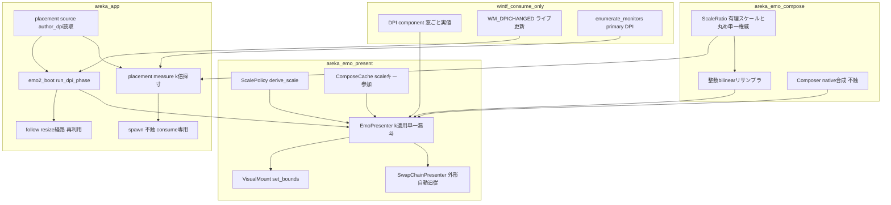
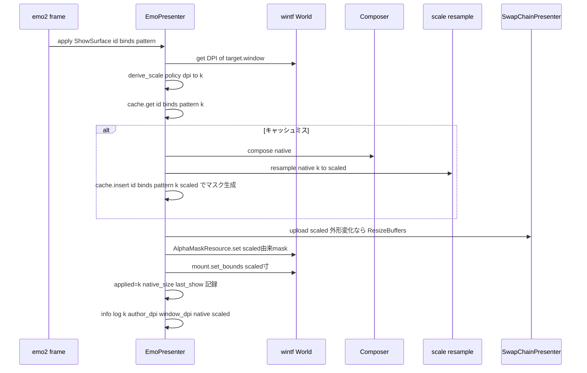
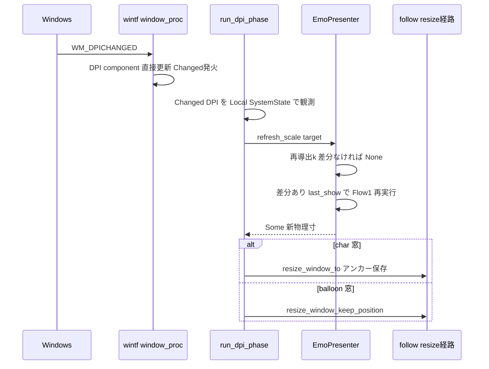

# 技術設計書: areka-P0-emo-dpi-scaling（DPI追従レンダリング基盤）

## Overview

**Purpose**: 本機能は、emo 層にハードワイヤされた合成スケール k=1.0（`presenter.rs:126` のコンパイル時定数）を廃し、**表示スケール係数 k = アプリ管理拡大率（本仕様 1.0 固定シーム）× 窓の実モニタ DPI ÷ 作者基準 DPI（author_dpi）** による実拡大レンダリングと、その k を返す照会契約を確立する。これにより areka の基本設計（DPI追従）が emo 表示で実際に成立し、下流 `areka-P0-collision-dpi-hittest`（W5）の観測条件（k 実拡大表示＋k 照会契約）が開通する。

**Users**: エンドユーザは高 DPI モニタでマスコットが DPI 相当寸に拡大表示され、モニタ跨ぎ移動・表示スケール変更にも追従する。下流仕様の保守者は `scale()` 照会値が常に実適用 k と一致する単一真実源を得る。

**Impact**: 変更の中心は emo-present（k 導出・適用・照会）と emo-compose（決定論リサンプラ＋丸め単一権威の新設・**合成経路 plan/blit は不触**）、および placement 採寸源（`measure_scope_sizes` の k 倍化）と emo2_boot（DPI 変化の動的追従フェーズ）。wintf は既存 DPI 機構（`DPI` component・`WM_DPICHANGED`・`enumerate_monitors`）の **consume のみ＝改造ゼロ**。`spawn.rs` は不触（W4 事前割当契約）。

### Goals

- k を表示ターゲット（窓）ごとに第一級で導出・保持し、照会契約（`scale()`）が実適用 k を返す（k=1.0 定数の廃止）。
- 合成結果の k× 実拡大表示（決定論の整数リサンプラ）と、窓 client・合成先（swapchain/visual）・配置採寸の k 追従。
- `WM_DPICHANGED`（モニタ跨ぎ・表示スケール変更）での k 再導出と表示・窓寸の一貫更新。
- 決定論檻（純関数全網羅＋オフスクリーン readback）と実 DPI 2 水準の実機サインオフ（本番ゴースト emo2 先行）。

### Non-Goals

- 当たり判定の点÷k・ヒット規約の k 対応（`areka-P0-collision-dpi-hittest`・W5）。
- 混在 DPI 窓消失バグの解消（`areka-P0-dpi-window-vanish`・W5）。
- アプリ管理拡大率の実設定手段（UI・タグ）——本仕様は 1.0 固定の縮退シームのみ予約。
- SSP scaling 語彙（`\![set,scaling]`・ユーザー拡大率固定・SERIKO scaling 乗算列）の輸入（2026-07-24 裁定・research.md §6）。
- DPI追従が波及する他消費者（window-placement 窓寸・emo-text-layer 行寸・balloon 寸・choice-render）の再検証実装（各 spec の Revalidation Trigger・W5）。
- バルーン採寸の per-scope 化（`areka-P0-kero-balloon`・W5。本仕様は席の保全のみ）。

## Boundary Commitments

### This Spec Owns

- **k の導出規約と単一真実源**: `ScaleRatio`（既約有理数）＋ `derive_scale`（author_dpi・窓 DPI・アプリ管理拡大率の乗算合成・失敗縮退）。
- **k 適用の単一漏斗**: presenter の表示経路（合成結果→リサンプル→表示・マスク・寸法）。合成スケール照会契約（`TextSlotView::scale()`／`EmoPresenter::applied_scale()`）。
- **丸め規約の単一権威**: `scaled_extent`（round half away from zero・非ゼロ最小 1px）。全 k 倍寸法消費点がこれを通る。
- **採寸源の k 倍化**: `measure_scope_sizes` の出力（`ScopeInput.char_size/balloon_size`）を k₀ 倍後の物理寸にする。
- **DPI 変化の動的追従**: emo2_boot frame の `run_dpi_phase`（`Changed<DPI>` 観測→再表示→窓寸 reconcile）。
- author_dpi の読み取り（shell `seriko.dpi`／balloon `dpi`・既定 96・ukadoc 正典）。

### Out of Boundary

- `hit_region` の座標変換（÷k）・wintf hit-test 機構の変更（R7.9・W5 領分）。
- `spawn.rs` の一切の変更（`position-persist` 単独所有・R7.6。設計上も改変不要と確認済み——窓寸は採寸源で k 倍済みの値を consume するのみ）。
- wintf 本体の改造（DPI 機構・monitor 列挙・window_proc は既存 public API を consume するのみ）。
- emo-compose の合成経路（`plan.rs`/`blit.rs`/`Composer` 公開 API）の変更——リサンプラは新設モジュール `scale.rs` に隔離し、native 合成の決定性檻を再検証させない。
- SHIORI・撫で意味論・入力イベント。

### Allowed Dependencies

- **依存方向（既存を維持・逆流禁止）**: `areka-emo-compose` ← `areka-emo-present` ← `areka`（emo2_boot／placement）。`wintf` ← `areka-emo-present`／`areka`。emo-compose は wintf へ依存しない。
- wintf 既存 public API: `DPI` component（`GetDpiForWindow` 実値補正・`WM_DPICHANGED` ライブ更新）・`enumerate_monitors()`／`Monitor{dpi, is_primary}`・`AlphaMaskResource`・`WucGraphicsResource`／`GraphicsCore`。
- placement 既存資産の再利用（呼び出し）: `resize_window_to`（アンカー保存リサイズ）・単一ライター経路 `enqueue_window_set_pos`。
- 新規 crates.io 依存: **なし**（R7.3）。Rust 2024・tokio 不使用（R7.4）。

### Boundary Deviation Notes（W4 同居契約との差分・明示）

W4 事前割当契約の編集面は「`measure.rs`＋emo-atlas/compose/present＋wintf」だが、本設計は以下の **additive** 増分を要する（いずれも既存行の変更なし・spawn.rs 不触は堅持）:

1. `placement/source.rs` — author_dpi 読取 accessor の追加（採寸源の入力供給・measure と同一領域）。
2. `placement/follow.rs` — balloon 窓の位置維持リサイズ `resize_window_keep_position` の追加（私有 `enqueue_window_set_pos` の薄い公開ラッパ・単一ライター規律を迂回しないための唯一の正規手段）。
3. `emo2_boot/`（frame.rs・assets.rs）＋ `main.rs` — 結線（DPI フェーズ・author_dpi 搬送・k₀ 導出）。

万一 W4 並走 spec と同一関数で衝突した場合、当該部分は R7.7 のエスケープ条項を準用して W5 へ送る。

**裁可（2026-07-24 設計ディスカッション #1・開発者裁定）**: 上記 additive 増分 4 点を裁可する。ただし placement 系（source.rs・follow.rs・measure.rs）は並走 `areka-P0-position-persist` と衝突し得るため、**実装順序を直列化**する:

1. `areka-P0-position-persist` の実装完了（main へのマージ）を先行させる。
2. 本仕様は**タスク生成後・実装開始前に main 同期（origin/main の取り込み）を必須ゲート**とする。同期後、placement 系の実測アンカー（measure.rs:62・follow.rs:553/:729・source.rs:102 ほか）を同期後の実体で再確認してから実装に入る（並走 brief 陳腐化規律の実装前 rebase 適用）。
3. `resize_window_keep_position` は position-persist の観測域（follow.rs DragEnd :319-350/:443-488）から離れた位置（ファイル末尾の公開ラッパ群）へ追記する。

R7.7（W5 送り）は発動しない（直列化により衝突を回避）。

**main 同期ゲートの実施記録（2026-07-25・タスク 1.1）**: `areka-P0-position-persist` は main へ squash マージ済み（`33aa384`）。本実装ブランチは `origin/main` と完全一致（ahead 0 / behind 0）を確認し、追加の同期コミットは不要であった。同期後の placement 系実測アンカーを再確認し、下表のとおり**行番号のみ**が変動（関数の存在・シグネチャ・責務は設計時と同一・設計判断に変更なし）:

| 対象 | 設計時アンカー | 同期後の実測 | 差分 |
|------|----------------|--------------|------|
| `measure.rs` `measure_scope_sizes` | :62 | :62 | ずれなし |
| `source.rs` `load_descript_source` | :102 | :102 | ずれなし |
| `follow.rs` `resize_window_to` | :553 | :786 | +233 |
| `follow.rs` `enqueue_window_set_pos`（私有単一ライター） | :729 | :1009 | +280 |
| `follow.rs` DragEnd 観測域（position-persist 所有） | :319-350 / :443-488 | `on_char_drag_end` :340-456 / `on_balloon_drag_end` :621-721 | 拡大 |

したがって `resize_window_keep_position` の追記位置は「公開 API 群の末尾＝`work_area_for_window`（:1132-1160）の直後・`#[cfg(test)] mod tests`（:1166）の直前」とする（DragEnd 観測域から十分に離れる）。

### Revalidation Triggers

下流・並走 spec は次の変化で再検証を要する:

- **照会契約の形**: `TextSlotView::scale()` が恒常 1.0 → 実 k を返す（`emo-text-layer` の行寸・`collision-dpi-hittest` の ÷k 前提値）。`surface_size()` は **native 原寸のまま**（物理寸 = `scaled_extent(k, surface_size)` と再定義）。
- **窓 client 物理寸**: k≠1.0 で「surface 原寸」から「round(k×原寸)」へ（`window-placement`・balloon 配置の寸法前提）。
- **`attach_target` シグネチャ**: `author_dpi: u16` 引数の追加（emo-present の全呼び手）。
- **`ComposeCache` キー形**: scale 参加（get/insert シグネチャ変更）。
- **`measure_scope_sizes` シグネチャ**: `MeasureScaling` 引数の追加（kero-balloon の per-scope 改造席は温存）。

## Architecture

### Existing Architecture Analysis

実測済みの現行構造（research.md §1・§7.1 で当日再検証済み）:

- **k=1.0 の実体**: `CURRENT_COMPOSE_SCALE`（presenter.rs:126）→ `TextSlotView.scale` 唯一代入（:435）。`scale()` doc が「DPI 導入時の変更点はここ 1 点」と自己宣言（:116-122）。
- **合成は native 整数**: `compute_extent`（plan.rs:451・k 乗算なし）・`blit.rs` は 1:1 整数 SourceOver（「浮動小数を経路に持ち込まない」規約）。
- **下流寸法は composed 外形従属**: `chain.upload` が外形変化を検知して `ResizeBuffers`＋テクスチャ再作成（chain.rs:178-194）・`mount.set_bounds` は表示成立ごとに呼ばれる（presenter.rs:370）→ **k 適用済みの合成結果を流せば供給面・visual・マスクは自動追従**する。
- **マスクは合成 bytes から挿入時 1 回生成**（cache.rs `insert`）→ k 適用済み bytes から生成すればマスク物理 px 契約が無修正整合。
- **wintf DPI 機構は完備・未消費**: `DPI`（dpi_x/dpi_y・`scale_x/y`・round half away from zero の `to_physical_*` 前例）・窓生成時 `GetDpiForWindow` 実値補正・`WM_DPICHANGED` → `Changed<DPI>` ライブ更新・`enumerate_monitors()`（primary モニタ DPI）。
- **窓寸の源と実行時リサイズ**: `measure_scope_sizes`（measure.rs:62・per-scope ループ・spawn は SizePx を consume するのみ）・`resize_window_to`（follow.rs:553・アンカー保存・べき等 skip）・単一ライター `enqueue_window_set_pos`（:729）。

### Architecture Pattern & Boundary Map

**選択パターン**: Strategy A2＝「合成は native のまま、提示（present）段で k× リサンプルした表示用サーフェスを単一漏斗で流す」拡張。合成基盤の決定性檻を不触に保ち、既存の「composed 外形従属」連鎖（swapchain/visual/マスク/窓寸）をそのまま k 追従に転用する。



**Architecture Integration**:

- 責務分界: k の**数学**（有理表現・丸め・リサンプル）は emo-compose `scale.rs`、k の**政策**（author_dpi・アプリ管理拡大率シーム・DPI 不在縮退）は emo-present `scale.rs`、k の**適用点**は presenter の表示経路 1 箇所、k の**時間軸**（DPI 変化・初期 k₀）は areka（emo2_boot／placement）。
- 既存パターン維持: 容量 1 `ComposeCache`・遅延生成 chain/mount・NonSend presenter・log-first 失敗経路・`Changed<T>` 観測の `Local<SystemState>` 先例（`anchor_changed_system`）。
- 新規コンポーネントの根拠: `ScaleRatio`（f32 を画素経路から排除し blit の整数規約と両立・キー等価の厳密化）・リサンプラ（リサンプラ不在が k× 表示の唯一の欠落資産）。
- Steering 準拠: WUC/D2D は UI スレッド固定・thiserror 構造化エラー・tracing 構造化ログ・新規依存ゼロ。

### Key Design Decisions（D1〜D10・根拠ログは research.md §7.2）

| # | 決定 | 内容 | 却下した代替 |
|---|------|------|--------------|
| D1 | author_dpi | shell=`seriko.dpi`／balloon=`dpi`・既定 96（ukadoc 正典）。既存生 KV から読む（パーサ改造なし）。不正・0 は warn＋96 | 固定 96 のみ（正典語彙の切り捨て） |
| D2 | k 導出規約 | **連続・単一スカラー・既約有理数** `ScaleRatio{num,den}` ＝ app_scale(1/1 固定) × dpi_x／author_dpi。dpi_x≠dpi_y は warn＋dpi_x | 整数段階（125% が表現不能・R2.2 違反）・f32 保持（画素経路の決定性と衝突） |
| D3 | 拡大方式 | **Strategy A2**: 合成 native 不触・present 段で k× リサンプルした表示用サーフェスを cache エントリ化 | B＝WUC transform（マスク不整合が W5 境界侵食・鮮明性欠如）・A1＝compose 内 k（合成 API/規約への侵食大） |
| D4 | 丸め規約 | round half away from zero（`DPI::to_physical_*` と同規約）・単一権威 `scaled_extent`・非ゼロ入力は最小 1px | 消費点ごとの個別丸め（不一致で見切れ/隙間） |
| D5 | リサンプラ | 整数固定小数点 **bilinear**（premultiplied BGRA ドメイン・α 込み・完全整数）。k=1/1 は恒等バイトコピー | nearest（連続 k で画素幅ムラ）・GPU stretch（決定論 readback 檻と不整合） |
| D6 | cache×再スケール | `ComposeKey` へ scale（既約有理）参加。エントリ＝k 適用済み composed＋その bytes 由来 mask。k 変化＝ミス→再合成＋再サンプル | k 変化時 invalidate_all（キー等価で表現できるものを命令で二重化） |
| D7 | 採寸時の初期 k₀ | primary モニタ DPI（`enumerate_monitors`）÷ author_dpi。取得不能は 96 相当＋error。窓生成後は窓 DPI が正（Changed<DPI>→reconcile が自己補正・べき等） | native 採寸＋初回表示で補正（起動時に必ず可視リサイズが走る） |
| D8 | 動的追従 | frame `run_dpi_phase`＝`Changed<DPI>` 観測 → `refresh_scale`（保持した最終 show 入力で再表示）→ 窓寸 reconcile（char=`resize_window_to`／balloon=`resize_window_keep_position`） | 新 PresentCommand variant（DPI は UI 側事象・talk actor 経由は迂遠） |
| D9 | テスト配置 | 純関数=各 crate in-crate／GPU readback=**emo-present in-crate（別プロセス）**／wintf tests/graphics へは wintf 自身の檻のみ（その場合 `on_gpu_owner_thread` 必須）——本仕様は wintf 新設なし。安全根拠＝バイナリ間は別プロセスで無縁＋同一バイナリ内は並列スレッド Compositor 生成の既存実績（`make_world_with_gpu` 型 14+ 本が現状緑） | wintf graphics への集約（2 個目 Compositor 制約を不要に背負う） |
| D10 | 実機観測 | 表示成立点 info ログ（k num/den・f32・author_dpi・window_dpi・native/scaled 寸）＋ 125%/200% 2 水準の有界起動（`AREKA_APP_SMOKE_EXIT_MS`）＋ RUST_LOG grep・絶対パス起動 | 目視のみ（決定論判定の欠如） |

### Technology Stack

| Layer | Choice / Version | Role in Feature | Notes |
|-------|------------------|-----------------|-------|
| 言語/ランタイム | Rust 2024・tokio なし | 全増分 | R7.4 |
| 合成 | areka-emo-compose（自前・整数 CPU） | `scale.rs` 新設（ScaleRatio・リサンプラ）・plan/blit 不触 | 浮動小数を画素経路に持ち込まない規約を維持 |
| 提示 | areka-emo-present ＋ WUC/DXGI（wintf 経由） | k 導出・適用・照会・cache キー拡張 | UI スレッド固定（NonSend）・R7.5 |
| 窓/DPI | wintf 0 改造 consume | `DPI`・`WM_DPICHANGED`・`enumerate_monitors` | R7.3・新規依存ゼロ |
| ログ | tracing | k 導出・適用・縮退の構造化ログ | log-first 規律 |

## File Structure Plan

### New Files

```
crates/areka-emo-compose/src/scale.rs   # ScaleRatio（既約有理・丸め単一権威 scaled_extent）＋整数 bilinear リサンプラ resample。純関数・in-crate 全網羅テスト
crates/areka-emo-present/src/scale.rs   # ScalePolicy（author_dpi＋アプリ管理拡大率シーム）＋ derive_scale（DPI 不在/異軸縮退・log-first）。純関数・in-crate テスト
```

### Modified Files

- `crates/areka-emo-compose/src/lib.rs` — `scale` モジュール公開（`ScaleRatio`・`scaled_extent`・`resample` の re-export）。
- `crates/areka-emo-present/src/presenter.rs` — `CURRENT_COMPOSE_SCALE` 廃止。`PresentTarget` へ `policy`/`applied`/`native_size`/`last_show` 追加。`attach_target(.., author_dpi)`。`apply_show` の k 導出＋リサンプル挿入＋info ログ。`applied_scale`/`refresh_scale` 新設。`text_slot_view` の scale/surface_size 契約更新。
- `crates/areka-emo-present/src/cache.rs` — `ComposeKey` へ `scale: ScaleRatio` 参加（`get`/`insert` シグネチャ拡張。エントリ構造・マスク生成コードは不変）。
- `crates/areka/src/placement/source.rs` — `DescriptSource::shell_author_dpi()`・`load_balloon_author_dpi()`・`parse_author_dpi()`（additive）。
- `crates/areka/src/placement/measure.rs` — `measure_scope_sizes(.., scaling: &MeasureScaling)`。native 採寸（既存ロジック・per-scope ループ温存）→ k 適用の 2 段へ関数分解（R7.8 の per-scope balloon 席を保全）。
- `crates/areka/src/placement/follow.rs` — `resize_window_keep_position()` 追加（additive・balloon 窓の k 追従。既存関数は不変）。
- `crates/areka/src/emo2_boot/assets.rs` — `BootAssets` へ `shell_author_dpi`/`balloon_author_dpi` 搬送。
- `crates/areka/src/emo2_boot/frame.rs` — `run_dpi_phase()` 新設＋ `emo2_frame_system` への組込。`run_attach_phase` の `attach_target` 呼び 2 箇所へ author_dpi 供給。
- `crates/areka/src/main.rs` — boot シーム: author_dpi 読取＋primary モニタ DPI → `MeasureScaling` 構築 → measure へ供給。
- `crates/areka/examples/emo-present.rs` ほか `attach_target`/`measure_scope_sizes` の既存呼び手 — シグネチャ追随（機械的・k=1 相当値で挙動不変）。

> `spawn.rs`・wintf 配下・emo-compose の `plan.rs`/`blit.rs`・`presenter.rs` の `hit_region` は**変更しない**。

## System Flows

### Flow 1: k 適用付き ShowSurface（表示の単一漏斗）



キー決定: k 導出は **show 適用ごと**に行う（導出は数命令・「照会値＝実適用 k」不変条件の維持点を 1 箇所にする）。`applied`・`current_surface_id`・`last_show` の更新は**表示成立点のみ**（失敗経路は手前で early return → 前値保持＝R4.4）。さらに表示成立点で今回 scaled 寸を前回適用寸と照合し、差分があれば新物理寸を呼び手（frame drain フェーズ）へ報告する——窓寸 reconcile は**表示成立という状態**に紐づき、`Changed<DPI>` エッジの消費順序に依存しない（設計ディスカッション #2 裁定・状態照合併用）。

### Flow 2: DPI 変化の動的追従（WM_DPICHANGED）



キー決定: (a) 表示更新（Flow1 再実行）→ 窓寸 reconcile を**同一フレーム・同一 UI スレッド呼出**内で行い、完了後に照会値・表示寸・窓 client が一致する（R4.2）。(b) `resize_window_to` のべき等 skip により k 不変・同寸なら書込ゼロ（振動しない）。(c) 進行中の talk/SERIKO は状態を presenter 外（上流）に持つため、再表示はキャッシュミス 1 回のコストのみで挙動を失わない（R4.3）。(d) 窓生成時の `GetDpiForWindow` 実値補正も `Changed<DPI>` を発火し**再表示のトリガ**となるが、窓寸 reconcile 自体はエッジに依存しない——初回 show を含む全表示成立点の状態照合（Flow 1 キー決定）が k₀ と実窓 DPI の差分を自己補正する（エッジが初回 show 前に消費されても不整合は残置しない・べき等 skip ゆえ常時照合でも振動しない・設計ディスカッション #2 裁定）。

### Flow 3: 起動時の初期 k₀（採寸→spawn→初回表示）

1. main boot: `load_descript_source` → `shell_author_dpi()`／`load_balloon_author_dpi()`（D1）。
2. `enumerate_monitors()` から primary モニタ DPI を取得（不能なら 96 相当＋error ログ）→ `MeasureScaling{ shell, balloon }` を構築（D7）。
3. `measure_scope_sizes(.., &scaling)`: native 採寸（既存経路）→ `scaled_extent` で k₀ 倍 → `ScopeInput` は k₀ 倍後の物理寸（R3.3）。
4. `spawn_ghost_windows`（**不触**）が k₀ 倍寸を consume して窓生成（R3.4/R7.6）。
5. attach（author_dpi 供給）→ 初回 ShowSurface＝Flow 1（窓 DPI 実値で k 導出）→ 表示成立点の状態照合が k₀ 倍窓寸との差分を検出し、drain フェーズが同一フレーム内で窓寸 reconcile（char=`resize_window_to`／balloon=`resize_window_keep_position`）を実行して補正（`Changed<DPI>` エッジの消費順序に依存しない）。

## Requirements Traceability

| Requirement | Summary | Components | Interfaces / Flows |
|-------------|---------|------------|--------------------|
| 1.1 | k 導出（窓 DPI ÷ author_dpi・単一権威） | ScaleRatio・ScalePolicy | `derive_scale`・Flow 1 |
| 1.2 | 照会値＝実適用 k・定数廃止 | EmoPresenter | `applied_scale`／`TextSlotView::scale`・`CURRENT_COMPOSE_SCALE` 削除 |
| 1.3 | DPI=author_dpi で k=1.0 恒等 | ScaleRatio・リサンプラ | `is_identity` 恒等バイトコピー |
| 1.4 | DPI 取得不能→error ログ＋k=1.0 縮退 | ScalePolicy | `derive_scale` 縮退分岐 |
| 1.5 | 窓ごと k 保持（混在 DPI） | EmoPresenter | `PresentTarget.policy/applied`（target=窓 単位） |
| 1.6 | 最終拡大率＝アプリ管理×k・1.0 固定シーム | ScalePolicy | `app_scale: ScaleRatio`（ONE 固定）× 乗算合成 |
| 2.1 | k≠1.0 で原寸 k 倍描画 | リサンプラ・EmoPresenter・SwapChainPresenter | Flow 1 |
| 2.2 | 2 水準で異なる物理寸（連続 k） | ScaleRatio（D2 連続） | GPU readback 檻＋実機 2 水準 |
| 2.3 | 全表示要素の単一 k 一貫 | EmoPresenter | 合成結果（element/SERIKO/mayuna 済み）への単一漏斗適用 |
| 2.4 | 切替後も同一 k | ComposeCache・EmoPresenter | show ごと導出＋scale キー・`last_show` |
| 2.5 | 欠け無し・単一丸め規約 | ScaleRatio | `scaled_extent`（D4・min 1px・出力外形=バッファ外形） |
| 3.1 | 窓 client＝round(k×原寸) | measure・run_dpi_phase | Flow 2/3 reconcile（同一 `scaled_extent` 経由で等値保証） |
| 3.2 | 合成先寸の整合（見切れ/余白なし） | SwapChainPresenter・VisualMount | `upload` 外形自動追従＋`set_bounds`（既存・scaled 入力） |
| 3.3 | 配置採寸は k 倍物理窓寸 | measure・MeasureScaling | Flow 3 手順 3 |
| 3.4 | 採寸源で吸収・窓生成/移動責務は不変 | measure | `spawn.rs` 不触（consume 専用） |
| 4.1 | DPI 変化で k 再導出・表示更新 | run_dpi_phase・EmoPresenter | Flow 2・`refresh_scale` |
| 4.2 | 窓寸・合成先寸・照会値の一貫更新 | run_dpi_phase | Flow 2 同一フレーム完結・applied 更新点限定 |
| 4.3 | 進行中挙動の継続・非クラッシュ | EmoPresenter | 再表示＝既存 show 経路・状態は上流保持・UI スレッド同期 |
| 4.4 | 再導出失敗→error ログ＋前 k 維持 | EmoPresenter | 失敗経路 early return（前値保持・log-first） |
| 5.1 | オフスクリーン readback 決定論 unit | emo-present in-crate tests | `read_back` golden（既存型の k 版拡張） |
| 5.2 | 純関数の GPU 不要全網羅 | scale.rs ×2・source.rs・measure.rs | in-crate `#[cfg(test)]` |
| 5.3 | 2 個目 Compositor AV 非再導入 | テスト配置（D9） | emo-present 別プロセス配置 |
| 5.4 | wintf graphics 配置時は fixture 必須・基準明文化 | テスト配置（D9） | 振り分け基準（Testing Strategy 節） |
| 5.5 | workspace 決定論的緑 | 全テスト | 既存期待値不変（R7.2）＋新テスト決定論 |
| 6.1 | 実 DPI 2 水準の観測可能化 | 観測ログ（D10） | info ログ＋GetClientRect 照合 |
| 6.2 | 本番ゴースト先行 | 実機手順 | emo2＋実 pasta.dll 実走 |
| 6.3 | 有界自動終了＋ログ決定論判定 | 実機手順 | `AREKA_APP_SMOKE_EXIT_MS`＋RUST_LOG grep |
| 6.4 | 絶対パス起動 | 実機手順 | pasta.dll ロード制約の遵守 |
| 7.1 | 既存テスト全緑 | 全増分 | `cargo test --workspace` exit 0 |
| 7.2 | k=1.0 で既存等価・期待値不変 | ScaleRatio・リサンプラ | 恒等バイトコピー・golden 不変 |
| 7.3 | 新規外部依存なし・wintf consume のみ | 全増分 | Allowed Dependencies |
| 7.4 | Rust 2024・tokio なし | 全増分 | Technology Stack |
| 7.5 | WUC/D2D UI スレッド固定 | EmoPresenter・run_dpi_phase | NonSend 維持・frame system 内実行 |
| 7.6 | spawn.rs 不触 | measure・Flow 3 | File Structure Plan（変更対象外明記） |
| 7.7 | エスケープ条項 | 設計確認 | spawn.rs 改変不要と確認済み（要すれば W5 送り） |
| 7.8 | per-scope balloon 席の保全 | measure 分解 | native 採寸＋k 適用の 2 段（`ScopeInput` ループ温存） |
| 7.9 | ÷k・ヒット規約不変 | hit_region 不触 | Out of Boundary |

## Components and Interfaces

| Component | Domain/Layer | Intent | Req Coverage | Key Dependencies | Contracts |
|-----------|--------------|--------|--------------|------------------|-----------|
| ScaleRatio＋scaled_extent | emo-compose/scale | 有理スケール表現と丸め単一権威 | 1.1, 1.3, 2.2, 2.5, 3.1 | なし（純関数） | Service |
| resample | emo-compose/scale | 決定論整数 bilinear の k× 転写 | 2.1, 2.5, 7.2 | ComposedSurface (P0) | Service |
| ScalePolicy＋derive_scale | emo-present/scale | k の政策（author_dpi・app シーム・縮退） | 1.1, 1.4, 1.6 | ScaleRatio (P0) | Service |
| ComposeCache scale キー | emo-present/cache | k 別合成結果の正しい引き当て | 2.4, 4.1 | ScaleRatio (P0) | State |
| EmoPresenter k 適用 | emo-present/presenter | 単一漏斗適用・照会契約・再スケール | 1.2, 1.5, 2.1-2.4, 3.2, 4.1-4.4, 6.1 | wintf DPI (P0)・resample (P0)・cache (P0) | Service, State |
| placement 採寸 k 適用 | areka/placement | k₀ 倍採寸・author_dpi 読取・balloon リサイズ | 3.1, 3.3, 3.4, 7.6, 7.8 | scaled_extent (P0)・enumerate_monitors (P1) | Service |
| emo2_boot DPI フェーズ | areka/emo2_boot | Changed DPI 観測→再表示→窓 reconcile | 4.1, 4.2, 3.1 | EmoPresenter (P0)・resize 経路 (P0) | Service |

### emo-compose / scale.rs

#### ScaleRatio・scaled_extent・resample

| Field | Detail |
|-------|--------|
| Intent | 表示スケールの数学（表現・丸め・リサンプル）を整数決定論で一元化する |
| Requirements | 1.1, 1.3, 2.1, 2.2, 2.5, 3.1, 7.2 |

**Responsibilities & Constraints**

- 有理数 `num/den` は構築時に gcd で**既約正準化**（`Eq`/`Hash` は正準形で厳密・cache キーの一意性を担保）。
- 画素・寸法演算に f32/f64 を**一切使わない**（blit.rs の整数規約と同格の決定性）。f32 は照会契約の出口ビュー `as_f32()` のみ。
- k=1/1 の恒等パスは**バイトコピー**（既存 golden との等価を構造で保証・R7.2）。

**Contracts**: Service [x]

##### Service Interface

```rust
/// 既約正準の有理スケール（num>0, den>0）。Eq/Hash は正準形で厳密。
#[derive(Debug, Clone, Copy, PartialEq, Eq, Hash)]
pub struct ScaleRatio { /* num: u32, den: u32（非公開・既約不変条件） */ }

impl ScaleRatio {
    pub const ONE: ScaleRatio;                       // 1/1（恒等）
    /// 0 を拒否して構築（既約化して保持）。
    pub fn new(num: u32, den: u32) -> Option<ScaleRatio>;
    /// 乗算合成（アプリ管理拡大率 × DPI 由来 k のシーム・R1.6）。桁溢れは u64 中間で既約化。
    /// ※実装時追補（2026-07-25・タスク 1.2 レビュー承認）: 既約化後も u32 域に収まらない
    ///   病的比は、大きい方の項を u32::MAX へピン留めして両項を同率縮小する単発の近似縮退
    ///   （u128 中間・floor・最小 1 クランプ）とし、`warn!` を出す（log-first・無言縮退禁止）。
    ///   比の保存ではなく近似であること・小さい方の項の相対誤差は大きくなり得ることを doc に明記する。
    pub fn mul(self, rhs: ScaleRatio) -> ScaleRatio;
    pub fn is_identity(self) -> bool;
    /// 照会契約の出口ビュー（num as f32 / den as f32）。
    pub fn as_f32(self) -> f32;
    /// 丸め単一権威: round half away from zero。len>0 なら最小 1 を保証（R2.5）。
    /// 演算は u128（(2*len*num + den) / (2*den)）・i32 超過は呼び手が検査。
    /// ※実装時是正（2026-07-25・タスク 1.2 レビュー承認）: 当初 u64 と記したが
    ///   len≈num≈u32::MAX で 2*len*num ≈ 3.69e19 > u64::MAX ≈ 1.84e19 となり
    ///   debug ビルドで panic する。式は不変のまま中間型のみ u128 へ widen する。
    ///   u32 超過は u32::MAX へ saturate（全て i32::MAX 超ゆえ呼び手の i32 検査は発火する）。
    pub fn scale_len(self, len: u32) -> u32;
    pub fn scaled_extent(self, w: u32, h: u32) -> (u32, u32);
}

/// native 合成結果を scale 倍の表示用サーフェスへ転写する（premultiplied BGRA・整数 bilinear）。
/// 事前条件: src 外形非ゼロ。事後条件: out 外形 == scale.scaled_extent(src 外形)。
/// scale.is_identity() なら src のバイト恒等コピー（R7.2）。パニックしない。
pub fn resample(src: &ComposedSurface, scale: ScaleRatio, out: &mut ComposedSurface);
```

- Preconditions: `src.width()>0 && src.height()>0`（0 寸は上流 `EmptyComposition` で先に落ちる）。
- Postconditions: 同一 `(src, scale)` に対しバイト決定論・出力外形は `scaled_extent` と厳密一致（欠け・切り捨てなし）。
- Invariants: 座標写像は den/num の有理逆写像＋固定小数点（整数のみ）。α は premultiplied ドメインで同式補間。

**Implementation Notes**

- Integration: `lib.rs` から re-export。`plan.rs`/`blit.rs` は不触（モジュール新設のみ）。
- Validation: 既約化・丸め表（96/120/144/168/192 と端数値）・min1px・恒等コピー・2x2→各 k の golden を in-crate 全網羅。
- Risks: bilinear の端画素外挿はエッジクランプで固定（決定論・テストで固定化）。

### emo-present / scale.rs

#### ScalePolicy・derive_scale

| Field | Detail |
|-------|--------|
| Intent | k の政策決定（author_dpi・アプリ管理拡大率シーム・DPI 不在縮退）を presenter の外で純関数化する |
| Requirements | 1.1, 1.4, 1.6 |

**Contracts**: Service [x]

##### Service Interface

```rust
/// target ごとの拡大政策（attach 時に確定・不変）。
#[derive(Debug, Clone, Copy, PartialEq, Eq)]
pub struct ScalePolicy {
    pub author_dpi: u16,          // 既定 96（0 は構築時に 96 へ正規化＋warn）
    pub app_scale: ScaleRatio,    // 本仕様は ScaleRatio::ONE 固定（縮退シーム・R1.6）
}

/// 実適用 k を導出する（表示 show 適用ごとに呼ぶ・数命令）。
/// - dpi None（DPI component 不在＝取得不能）: error! ＋ app_scale×1（R1.4 の k=1.0 縮退）
/// - dpi_x != dpi_y: warn!（毎回）＋ dpi_x 採用（D2）
///   ※実装時是正（2026-07-25・タスク 1.4 レビュー承認）: 当初「初回」と記したが、
///     抑止状態を持たせると本節 Invariants「同一入力→同一出力（純関数）」を破る。
///     さらに module 級 once は窓ごと政策（R1.5）の下で別窓の初回警告まで握り潰す。
///     `derive_scale` は毎フレームではなく ShowSurface 適用ごとの呼出ゆえログ量も許容。
/// - dpi_x == 0（窓 DPI 値そのものが不正）: error! ＋ app_scale×1（追加分岐・
///     `ScaleRatio::new(0,_)` が None ゆえ未処理だとパニックか無言縮退しか残らない）
/// - 正常: app_scale × ScaleRatio::new(dpi_x, author_dpi)
pub fn derive_scale(policy: ScalePolicy, dpi: Option<(u16, u16)>) -> ScaleRatio;
```

- Invariants: 同一入力→同一出力（純関数）。`author_dpi==window_dpi` かつ app=ONE なら `is_identity()`（R1.3）。

### emo-present / cache.rs（scale キー参加）

`ComposeKey` に `scale: ScaleRatio` を加える。エントリ構造（`composed`＋`mask`）・「挿入時にマスク 1 回生成」コードは**不変**——ただし `composed` の意味が「k 適用済み表示用サーフェス」となり、mask はその bytes 由来＝**k 寸のマスク**（AlphaMask 物理 px 契約が無修正整合）。

```rust
pub fn get(&self, surface_id: u32, binds: &BindSet, pattern: &PatternState,
           scale: ScaleRatio) -> Option<&CacheEntry>;
pub fn insert(&mut self, surface_id: u32, binds: BindSet, pattern: PatternState,
              scale: ScaleRatio, composed: ComposedSurface) -> &CacheEntry;
```

- State model: 容量 1 スロット維持。k 変化＝キー相違＝ミス（再合成＋再サンプル・稀イベント許容・D6）。
- 「キー＝合成入力の全体」不変条件は「合成入力＋表示スケール」へ拡張されるが、1 ビット相違＝必ずミスの規律は不変。

### emo-present / presenter.rs（k 適用の単一漏斗）

#### EmoPresenter（変更）

| Field | Detail |
|-------|--------|
| Intent | k の導出→適用→記録→照会を表示経路 1 箇所に束ねる（照会値＝実適用 k の構造的担保） |
| Requirements | 1.2, 1.5, 2.1, 2.3, 2.4, 3.2, 4.1-4.4, 6.1, 7.5 |

**Responsibilities & Constraints**

- `PresentTarget` 追加フィールド: `policy: ScalePolicy`（attach 時確定）・`applied: Option<ScaleRatio>`（**表示成立点のみ**更新・照会の単一真実源）・`native_size: Option<(u32,u32)>`（照会契約 `surface_size` の供給源）・`last_show: Option<(u32, BindSet, PatternState)>`（refresh の再表示入力）。
- `apply_show` 拡張（Flow 1）: `world.get::<DPI>(target.window)` → `derive_scale` → cache（scale キー）→ ミス時 `compose`（native）→ `resample` → `insert`。以降の upload／mask set／`set_bounds`／可視化は既存コードのまま scaled 値が流れる。表示成立点で `applied`/`native_size`/`last_show`/`current_surface_id` を記録し、**今回 scaled 寸が前回適用寸と異なる場合は新物理寸を適用結果として呼び手へ報告**（frame drain フェーズが窓寸 reconcile に使う・議題 #2 裁定）、**info ログ**（`target`, `k_num`, `k_den`, `k`(f32), `author_dpi`, `window_dpi`, `native_w/h`, `scaled_w/h`）を出す（R6.1/6.3 の判定素材）。
- 失敗経路は従来どおり表示成立点より手前で early return＝前 k・前表示を維持（R4.4）。
- NonSend・UI スレッド専有は不変（R7.5）。`hit_region` は不触（R7.9）。

**Contracts**: Service [x] / State [x]

##### Service Interface（追加・変更分）

```rust
impl EmoPresenter {
    /// author_dpi を target 政策として受け取る（呼び手＝emo2_boot attach／examples／tests）。
    pub fn attach_target(&mut self, world: &mut World, target: TargetId, window: Entity,
                         emo_world: EmoWorld, atlas: AtlasTable,
                         author_dpi: u16) -> Result<(), PresentError>;

    /// 下流照会契約（R1.2）: 実適用中の k。表示成立前・未登録は None。
    pub fn applied_scale(&self, target: TargetId) -> Option<f32>;

    /// DPI 変化時の再スケール（R4.1）。窓 DPI から再導出し、applied と異なり可視かつ
    /// last_show 保持時のみ内部で show を再実行（reply なし）。表示寸が変わったら
    /// Some(新物理寸)（呼び手が窓寸 reconcile に使う）。失敗は error!＋None＋前表示維持（R4.4）。
    pub fn refresh_scale(&mut self, world: &mut World, target: TargetId) -> Option<(u32, u32)>;
}
```

##### State Management（照会契約の更新）

- `TextSlotView::scale()` — **実適用 k**（`applied.as_f32()`）を返す（恒常 1.0 廃止・宣言済み単一変更点）。
- `TextSlotView::surface_size()` — **native 原寸**（`native_size`）を返す（従来の `chain.size()` 供給から変更。物理寸 = `scaled_extent(k, surface_size)` を契約として明文化——`GetClientRect ≒ surface_size × scale` の照合式を collision-probe/下流が使う）。
- 不変条件（R1.2/R4.2）: `applied`・表示バッファ・マスク・`set_bounds` は同一 `apply_show` 成功内でのみ揃って更新される（中間状態は UI スレッド外から観測不能）。

### areka / placement（採寸源の k 倍化・author_dpi 読取・balloon リサイズ）

#### measure.rs（k₀ 適用・R7.8 席保全）

```rust
/// 採寸時の表示スケール（boot が D7 で構築: primary モニタ DPI ÷ 各 author_dpi）。
#[derive(Debug, Clone, Copy)]
pub struct MeasureScaling { pub shell: ScaleRatio, pub balloon: ScaleRatio }

pub fn measure_scope_sizes(shell_dir: &Path, balloon_root: &Path, scope_ids: &[usize],
                           scaling: &MeasureScaling) -> Result<MeasuredSizes, PlacementError>;
```

- 関数分解: **(1) native 採寸**（既存ロジック・per-scope ループと `ScopeInput{scope, char_size, balloon_size}` を温存）→ **(2) k 適用**（`scaled_extent` 経由で char=shell k・balloon=balloon k を各 `ScopeInput` へ写像）。(2) は per-scope の写像として書き、balloon_size が scope 別値になり得る席（ループ内供給点）を**潰さない**（R7.8・kero-balloon 申し送り）。
- i32 通貨ガード: k 倍後が i32 超過なら既存の Measure エラー流儀で報告（silent wrap しない）。

#### source.rs（author_dpi・additive）

```rust
impl DescriptSource {
    /// shell descript `seriko.dpi`（ukadoc・SSP 2.7.21+）。無宣言=96・不正/0=warn+96（D1）。
    pub fn shell_author_dpi(&self) -> u16;
}
/// balloon descript.txt の `dpi`。ファイル不在・無宣言=96（lenient・log-first）。
pub fn load_balloon_author_dpi(balloon_root: &Path) -> u16;
```

#### follow.rs（additive・balloon 窓の k 追従）

```rust
/// 現在位置を維持して窓寸のみ更新する（balloon 窓の DPI 追従用・R3.1/R4.2）。
/// 私有単一ライター経路 enqueue_window_set_pos(Some(new_size)) の薄い公開ラッパ。
/// WindowPos/position 不在・非正寸は warn＋false。同寸はべき等 skip（振動しない）。
pub fn resize_window_keep_position(world: &mut World, window: Entity, new_size: SizePx) -> bool;
```

**Implementation Notes（placement 共通）**

- Integration: main.rs boot が `MeasureScaling` を構築して供給。`spawn.rs` はシグネチャ・挙動とも不変（k 倍済み SizePx を consume するのみ・R3.4/R7.6）。
- Validation: `parse_author_dpi`（無宣言/不正/0/宣言あり）・k 適用写像（per-scope 保全含む）・i32 ガードを純関数テストで全網羅。emo2 fixture 実採寸テストは `MeasureScaling{ONE, ONE}` で既存期待値（434×687 等）不変（R7.2）。
- Risks: W4 同居契約の編集面差分（source.rs/follow.rs への additive 追加）——Boundary Deviation Notes 参照。

### areka / emo2_boot（DPI 追従フェーズ）

#### run_dpi_phase（frame.rs）

| Field | Detail |
|-------|--------|
| Intent | `Changed<DPI>` を観測し、対象 target の再スケールと窓寸 reconcile を同一フレームで完結させる |
| Requirements | 3.1, 4.1, 4.2, 4.3 |

**Contracts**: Service [x]

```rust
/// emo2_frame_system の一フェーズ（attach → dpi → drain … の順・UI スレッド）。
/// Changed<DPI> の窓を Local<SystemState>（anchor_changed_system 先例）で観測し、
/// 当該窓に装着済みの各 target について presenter.refresh_scale を呼ぶ。
/// Some(new_size) なら char 窓は resize_window_to（アンカー保存）、balloon 窓は
/// resize_window_keep_position で窓 client を新物理寸へ reconcile する。
pub fn run_dpi_phase(wiring: &mut Emo2Wiring, world: &mut World);
```

- 初回 run の全窓マッチ（`SystemState::new` 仕様）は `refresh_scale` の「k 差分なし→None」と resize のべき等 skip が吸収する（`anchor_changed_system` と同じ流儀）。
- **窓寸 reconcile の第 2 経路（状態照合・議題 #2 裁定）**: drain フェーズが `apply_show` の scaled 寸変化報告を受けて同一フレーム内で resize（char=`resize_window_to`／balloon=`resize_window_keep_position`）を呼ぶ。`run_dpi_phase` のエッジ観測は「再表示のトリガ」に徹し、窓寸整合はエッジ消費順序に依存しない。
- `attach_target` 呼び 2 箇所（shell/balloon）へ `BootAssets` の author_dpi を供給する（assets.rs が搬送）。

## Error Handling

### Error Strategy

log-first（error!/warn!＋構造化 enum・panic 禁止）の既存規律を継承。**表示を失わない**縮退（k=1.0 or 前 k 維持）を全失敗経路の事後条件とする。

| 失敗分岐 | ログ | 縮退挙動 | Req |
|---------|------|---------|-----|
| 窓 DPI 取得不能（component 不在） | error! | k = app_scale×1（=1.0）で表示継続 | 1.4 |
| dpi_x ≠ dpi_y | warn! | dpi_x 採用（単一スカラー） | 1.1 |
| author_dpi 不正・0・無宣言 | warn!（無宣言は debug） | 96 採用 | 1.1 |
| primary モニタ DPI 取得不能（boot） | error! | k₀=96 相当（native 採寸）→窓生成後 Changed<DPI> reconcile が補正 | 1.4, 4.1 |
| refresh_scale 中の合成/デバイス失敗 | error!（既存経路） | 前 k・前表示を維持（early return） | 4.4 |
| k 倍寸の i32 超過（採寸） | error! | PlacementError::Measure（既存流儀） | 2.5 |
| リサンプラ | — | 純関数・失敗経路なし（0 寸は上流 EmptyComposition で先行遮断） | 2.5 |

### Monitoring

表示成立点の info ログ（`k_num`/`k_den`/`k`/`author_dpi`/`window_dpi`/`native`/`scaled`・D10）が実機決定論判定（R6.3）と障害調査の一次観測点。縮退分岐はすべて上表のログで観測可能（silent failure なし）。

## Testing Strategy

**テスト配置の振り分け基準（R5.4 の明文化・D9）**: (a) 判断分岐・純関数は各 crate の in-crate `#[cfg(test)]`（GPU 不要・全網羅）。(b) WUC/GPU を生成する檻は **areka-emo-present の in-crate テスト**（既存 `make_world_with_gpu` 型・別テストバイナリ＝別プロセスゆえ同一プロセス 2 個目 Compositor AV と構造的に無縁・R5.3）。(c) wintf `tests/graphics`（既存テストと同一プロセスで WUC を生成する場所）へは **wintf 自身の資産を檻に入れる場合のみ**新設し、必ず `on_gpu_owner_thread` fixture 経由とする——本仕様は wintf 改造ゼロゆえ新設なし（R5.4 は基準の宣言で満たす）。

追記㊺の「fixture 必須」は wintf tests/graphics（同一プロセス集約ターゲット）へスコープされる（要件ディスカッションで R5.3〔AV 非再導入の不変条件〕と R5.4〔wintf 配置時の fixture 条件〕に分離裁定済み）。emo-present テストバイナリは同一バイナリ内並列スレッドでの Compositor 生成 14+ 本が現状緑という経験的基盤を持つ。タスク化時に既存 GPU テスト群の事前フル実行を含め、この基盤を増分前に再確認する。

### Unit Tests（純関数・GPU 不要・全網羅）

- `ScaleRatio`: 既約正準化（120/96→5/4）・`mul` 合成（アプリ×DPI シーム）・`is_identity`・`as_f32` 厳密値（1.25/1.5/2.0）。
- `scale_len`/`scaled_extent`: DPI 対照表（96/120/144/168/192）×代表原寸・round half away from zero の境界（half ちょうど）・min 1px・大寸の非溢れ。
- `resample`: 恒等バイトコピー（k=1/1）・2 倍整数 k の golden・非整数 k（5/4）の決定論 golden・premultiplied α の不変条件・エッジクランプ固定。
- `derive_scale`: 正常／DPI 不在縮退（1.0）／dpi_x≠dpi_y／author_dpi=0 正規化の全分岐。
- `parse_author_dpi`／`shell_author_dpi`／`load_balloon_author_dpi`: 無宣言=96・宣言あり・不正・0。
- `measure` k 適用: per-scope 写像（char=shell k・balloon=balloon k）・`ScopeInput` 席保全・i32 超過ガード・`MeasureScaling{ONE,ONE}` で既存 emo2 期待値（434×687/336×400/400×224）不変。

### Integration Tests（GPU readback 決定論・emo-present in-crate・別プロセス）

- k=2/1 の ShowSurface → `read_back` 寸法 == `scaled_extent`・golden バイト一致（既存 golden 檻の k 版拡張・R5.1）。
- k=5/4（非整数）→ 寸法一致＋決定論バイト再現（2 回実行同値）。
- k 変化（1/1 で表示 → DPI 差替 → `refresh_scale`）→ chain の `ResizeBuffers` 自動追従・`read_back` 新寸・`applied_scale` 一致（R4.2 の照会=実表示）。
- マスク k 寸検証: k=2/1 表示後の `AlphaMaskResource` が scaled 寸（マスク物理 px 契約）。
- k=1/1 既存テスト群: 期待値不変で全緑（R7.2 の回帰の錨）。
- テスト World の前提: 窓 entity へ `DPI` component を明示挿入する（本番は窓生成時に必ず付与されるため。96 挿入＝恒等・192 挿入＝k=2）。未挿入による R1.4 縮退（error!＋k=1.0）を「正常系のふり」で通さない——縮退分岐そのものは DPI 不在ケースの専用テストで檻に入れる。

### E2E / 実機サインオフ（R6・本番ゴースト先行）

- 実 DPI 2 水準（OS 表示スケール 125%→200% の 2 回起動）× 本番ゴースト emo2（実 pasta.dll・**絶対パス起動**・R6.4）。
- `AREKA_APP_SMOKE_EXIT_MS` 有界自動終了＋ `RUST_LOG` grep: info ログの `k`（1.25/2.0）・`scaled` 寸・`GetClientRect` 照合（collision-probe 型）で決定論判定（R6.1/6.3）。
- 人間サインオフ: マスコットが各水準の相当寸で表示・窓追従・モニタ跨ぎ移動での追従を目視（R6.2）。

### Regression Gate

- `cargo test --workspace` exit 0 の決定論的緑（R5.5/R7.1・i686 host-32 成果物の事前ビルドを含む既存 DoD 流儀）。

## Performance & Scalability

- リサンプルは k 変化・合成入力変化時のみ（キャッシュヒット時ゼロコスト）。SERIKO コマ切替はもともと再合成イベントであり、追加コストはリサンプル 1 回（O(scaled 画素)・整数演算）。
- DPI 変化は稀イベント（モニタ跨ぎ・設定変更）＝再合成＋再サンプル 1 回＋窓リサイズ 1 コマンドで完結。定常フレームに新規コストなし（`run_dpi_phase` は Changed 無しなら実質 no-op）。
- メモリ: 容量 1 スロット維持のため k 別の複製保持なし（表示用サーフェスが native の k² 倍になるのみ）。
