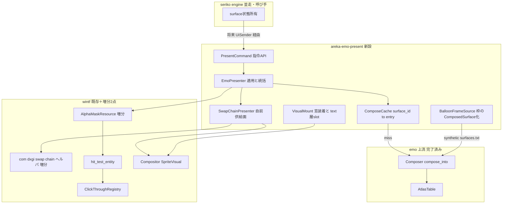
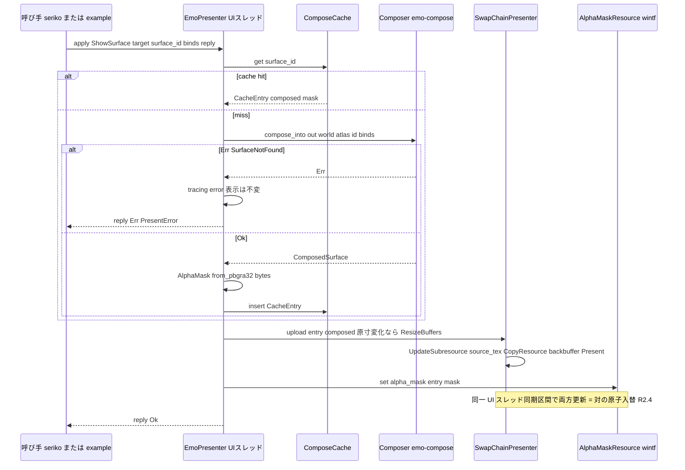
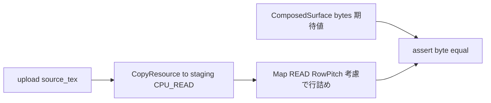

# Technical Design: areka-P0-emo-present

## Overview

**Purpose**: 本機能は ⑥ emo トラック直列チェーンの最終段（emo-atlas → emo-compose → **emo-present**）として、合成コア emo-compose が生成する 1枚物 premultiplied BGRA ビットマップ（`ComposedSurface`）を**画面に出す結線**を areka ランタイムへ提供する。表示供給・クリックスルー用 AlphaMask の同期生成・surface 切替の指令 API・合成キャッシュを備え、旧 emo-surface のゴール（emo2 の surface0＋バルーン枠表示・キャラ領域のみクリック捕捉）を専用 example で完走させる。

**Users**: 下流の `areka-P0-seriko-engine`（指令 API の呼び手）、`areka-P0-emo-text-layer`（表示済み surface 上の文字層）、および観測を行う開発者が利用する。

**Impact**: 新規クレート `areka-emo-present` を追加する。wintf には (a) 汎用の composition swap chain COM ヘルパ（`com/` 層・unsafe 隔離）と (b) hit-test への AlphaMask 供給コンポーネント `AlphaMaskResource` の 2 点のみを増分する（`BitmapSource` 経路は不侵）。本番 `main.rs` は変更しない。

### Goals

- `ComposedSurface`（メモリバッファ）を wintf の窓へ premultiplied BGRA のまま表示する（R1）
- 表示と同一の合成結果から AlphaMask を生成し、表示と対で原子的に入れ替える（R2）
- surface 切替・非表示（`\s[-1]` 相当）・キャッシュ無効化を運ぶ指令 API（メッセージ enum 転写可能形）を確立する（R3, R4）
- バルーン枠を同一の `ComposedSurface` 経路で表示する（R5・直 WIC バイパス禁止）
- コンポジター供給面を本レイヤ所有の読み戻し可能なオフスクリーン面（swap chain）とし、CPU readback 経路を確保する（R8）
- 実 DPI（dpi≠96）を含む観測用専用 example と、golden バイト一致の決定論的検証シーム（R6）

### Non-Goals

- surface 合成の実体（emo-compose）・アトラス構築（emo-atlas）の変更
- 窓の既定位置・配置・ドラッグの機構化（window-placement。example 内の窓は観測用仮設）
- バルーン内テキスト描画・テキスト有効描画領域の消費（emo-text-layer）
- SERIKO 再生・surface 状態の所有（seriko-engine）・channel/actor 契約の確定（kanade/seriko 結線時）
- arrow/marker/online 等バルーン付随マーカーの表示（後続）
- オフスクリーン面直読みによるヒットテスト当たり判定の**実導出**（R8 は経路確保まで。M-boot の当たり判定は R2 の CPU バイト経由）
- デバイスロスト完全復旧（invalidate＋再構築の口のみ・完全な再試行制御は後続）

## Boundary Commitments

### This Spec Owns

- **表示供給口**: `ComposedSurface` → 自前所有 swap chain → WUC SpriteVisual への装着（emo が wintf を知る唯一の層）
- **AlphaMask の生成と同期**: 合成結果からのマスク生成・表示との対入替・`AlphaMaskResource` への書込み
- **指令 API の契約正本**: `PresentCommand`（scope・surface id・BindSet・非表示・reply 口）の形は本 spec が定義し、seriko が消費する
- **合成キャッシュ**: surface id → (ComposedSurface, AlphaMask) の保持・無効化。emo-compose は純粋関数のまま
- **wintf 増分 2 点**: `com/dxgi.rs` の composition swap chain ヘルパ（汎用）・`AlphaMaskResource`＋hit-test 読み口（汎用）
- **DPI 表示契約の文書化**: 「合成＝物理 px・窓サイズ＝物理 px＝surface 原寸」の契約（window-placement が前提にする）

### Out of Boundary

- Window entity の生成・配置・ドラッグ（window-placement）。表示装着 API は窓 Entity を**受け取る**のみ
- バルーンのベースウェア選択・ghost 層の解決（M-boot は fixture 直指定）
- `BitmapSource` ウィジェット系（既存ファイル起点経路）の改変
- runtime の bind 状態所有（seriko。本ユニットは受けて合成するだけ）
- テキスト層の実描画（スロット予約のみ）

### Allowed Dependencies

- `areka-emo-compose`（`ComposedSurface`/`Composer`/`EmoWorld`/`BindSet` — 実シンボル消費・再定義禁止）
- `areka-emo-atlas`（`AtlasTable`/`bake`/`SurfaceSet` — 同上）
- `areka-parsers`（`shell::parse`・`kv` — バルーン synthetic surfaces.txt と descript 読取）
- `areka-actor`（`ReplySender`/`UiSender` — 指令の reply 口と将来の channel 化）
- `wintf`（`GraphicsCore`/`WucGraphicsResource`/`Visual`/`insert_visual`/`HitTest`/`ClickThroughRegistryHandle`/`GlobalArrangement`/`WindowPos` — 公開 API のみ）
- `windows` 0.62.2 / `bevy_ecs` / `thiserror` / `tracing`
- **禁止**: tokio・emo-present から dola/kanade/sakura への依存・wintf 内部（pub(crate)）への依存

### Revalidation Triggers

- `PresentCommand` の形（variant・フィールド）変更 → seriko-engine の再確認（`\s[-1]`＝`Hide` variant の突合を含む）
- DPI 表示契約（物理 px 等倍・窓サイズ＝surface 原寸）の変更 → window-placement の再確認
- text-layer スロット（surface visual の兄弟・上位 z）の構成変更 → emo-text-layer の再確認
- `AlphaMaskResource` の読み口優先順位変更 → wintf clickthrough/hit-test 系 spec の再確認
- swap chain 供給面の所有・readback 契約変更 → 将来の直読みヒットテスト後続ユニットの再確認

## Architecture

### Existing Architecture Analysis

- **表示基盤（wintf・✅）**: WUC 単独合成（ULW 撤去済み）。既存の表示は `BitmapSource`（ファイル path 起点）→ WIC → D2D CommandList → `CompositionDrawingSurface`（WUC 内部アトラス・**書き込み専用**）の一本道で、メモリ供給の入口が無い。`deferred_surface_creation_system` は `CreateDrawingSurface(B8G8R8A8, Premultiplied)`＋`CreateSurfaceBrushWithSurface`＋`SpriteVisual.SetBrush/SetSize` の型を確立している（流用の的）。
- **hit-test（wintf・✅）**: `hit_test_entity` は `HitTestMode::AlphaMask` 時に **`BitmapSourceResource.alpha_mask()` からのみ**マスクを読む（`hit_test/mod.rs`）。`GlobalArrangement.bounds` は**物理 px**。マスク座標は bounds 相対の比例変換。
- **クリックスルー（wintf・✅）**: `ClickThroughRegistryHandle::register(entity, hwnd)`（NonSend）だけで `WS_EX_TRANSPARENT` 動的トグルが機能。donor は `crates/areka/examples/mock-shell.rs`。
- **上流 emo（✅）**: `Composer::compose_into`（out 再利用・ゼロアロケーション）と `compose`。出力は premultiplied BGRA（stride=width*4）。キャッシュ責務は下流（本 spec）と emo-compose の rustdoc が明記。
- **swap chain**: wintf に `CreateSwapChainForComposition`/`IDXGISwapChain` の使用は**皆無**（検証済み）。`ICompositorInterop` は `com/wuc.rs` で cast 済み・`GraphicsCore` が `d3d()`/`dxgi()`/`d2d_device()` を公開。R8 の材料は揃っている。

### Architecture Pattern & Boundary Map



**Architecture Integration**:

- **Selected pattern**: Option C（ハイブリッド）＋ Option D（自前 swap chain 供給面・R8 要件化済み）。低レベル COM ヘルパのみ wintf `com/` 層（unsafe 隔離規約）、表示コンポーネント・キャッシュ・指令 API・マスク同期は emo-present に集約。
- **Domain boundaries**: 表示口＝emo-present が wintf を知る唯一の層。`BitmapSource` には触れない。hit-test への増分は「emo 専用」ではなく汎用 `AlphaMaskResource`（メモリ供給ウィジェット一般が使える形）。
- **Existing patterns preserved**: `CreateSurfaceBrushWithSurface`→`SpriteVisual` の装着型・`XxxResource`（CPU リソース）命名・NonSend 資源・ログ規律（error!＋Err・silent failure 禁止）。
- **New components rationale**: swap chain 供給は wintf に存在しない未踏経路（R8 必達）。`AlphaMaskResource` は hit-test の読み口が `BitmapSourceResource` 固定であるギャップの最小汎用解。
- **Steering compliance**: WUC 更新は UI スレッド固定（MTA＋`DQTAT_COM_NONE`）・COM→ECS の依存方向・unsafe は COM 層集約・tokio 非依存。

### 依存方向（強制）

```
areka-parsers → areka-emo-atlas → areka-emo-compose → areka-emo-present → (example: areka)
                                        wintf (com → ecs) ↗        areka-actor ↗
```

emo-present は上流 3 クレート＋wintf＋areka-actor のみ import できる。逆方向（wintf → emo-present 等）の import は実装・レビューでエラーとして扱う。

### Technology Stack

| Layer | Choice / Version | Role in Feature | Notes |
|-------|------------------|-----------------|-------|
| 表示合成 | Windows.UI.Composition（`windows` 0.62.2） | SpriteVisual＋SurfaceBrush への供給面装着 | `ICompositorInterop::CreateCompositionSurfaceForSwapChain` を新規使用 |
| GPU 供給面 | DXGI `IDXGIFactory2::CreateSwapChainForComposition` | 自前所有・読み戻し可能なオフスクリーン供給面（R8） | flip model・`DXGI_ALPHA_MODE_PREMULTIPLIED`・B8G8R8A8・BufferCount 2 |
| ピクセル転送 | D3D11 `UpdateSubresource`/`CopyResource`/staging `Map` | CPU→GPU アップロードと CPU readback | **D2D 非経由**＝バイト恒等転送（golden 決定論の根拠） |
| ECS | bevy_ecs 0.18 | 窓 Entity への visual/マスク装着 | wintf の World に相乗り（専用 World は不使用・表示は wintf 側） |
| 指令/応答 | areka-actor（`ReplySender`） | R3.6 reply 口・将来の `UiSender` 転写 | M-boot は直接呼出 |
| エラー/ログ | thiserror / tracing | `PresentError` 構造化・ログ規律 | panic は致命限定 |

## バルーン正典整理（ukadoc `descript_balloon`・3 分類表）

brief 必読指示に基づく分類。正典は ukadoc（`descript_balloon` 各キー・`manual_balloon`）。

### (a) 枠描画に効くキー（本 spec が意味論に従う）

| キー | 意味（1行） | M-boot 扱い |
|---|---|---|
| `use_self_alpha,値` | 1/true: アルファ付き PNG・.pna をそのまま透明度として使用（無ければ左上キー色透過）。full: アルファ無し画像も全不透明。バルーン全体一括・上書き不可 | emo2 kakukaku は PNG α のみ・`.pna` 無し → α 尊重で bake（`AlphaParams`） |
| `paint_transparent_region_black,数値` | 透過色領域だが透明度上は不透明な画素を 0=画像色 / 1=黒塗りで表示。既定は pna 画像=1 相当・self-alpha 画像=0 相当 | self-alpha 画像のみ → 0 相当＝追加処理不要 |
| `dpi,推奨DPI` | バルーン画像・座標系が前提とする画面 DPI（96=100%・SSP 2.7.21〜） | fixture は無指定＝96 前提。M-boot は物理 px 等倍表示のため無効果（将来のスケール入力として記録のみ） |

### (b) テキスト/有効描画領域キー（→ emo-text-layer へ引き継ぐ・本 spec は消費しない）

| キー | 意味 |
|---|---|
| `origin.x` / `origin.y` | テキスト開始位置座標 |
| `validrect.*` / `wordwrappoint` | テキスト有効領域・折返し点（areka-parsers `BalloonModel` が既にモデル化: `origin`/`wordwrappoint`/`validrect`/`font`） |
| `font.*` 系 | フォント指定 |

`areka_parsers::balloon::BalloonModel`（`windowposition`/`origin`/`wordwrappoint`/`validrect`/`font`）が公開形で存在し、emo-text-layer が同じ領域定義を消費できる（本 spec は再定義しない）。なお (a) 群は「バルーン全体一括・上書き不可」だが、(b) の座標群（origin/validrect/wordwrappoint 等）は `balloons*s.txt` 系のサーフェス個別ファイルで上書き可能（`manual_balloon`）——この差も text-layer への引継ぎ事項。

### (c) M1 対象外（枠以外のパーツ・挙動）

| キー/ファイル | 役割（1行） |
|---|---|
| `overlay_outside_balloon` | online/SSTP マーカー等をバルーン外にも描画可とするクリップ規則（マーカー非表示の M-boot では無効果） |
| `arrow0/1.png`・`arrows*/arrowk*` | スクロール矢印（0=上・1=下） |
| `marker.png`/`markers/markerk` | `\![*]` マーカー画像 |
| `online*.png` | ネットワーク受信中アニメ |
| `sstp.png`/`sstp_new*` | SSTP 受信時の送信者表示 |
| `balloonc*.png`・`use_input_alpha` | 入力ボックス（0=Send/1=Communicate/2=Teach/3=Input/4=AddressBar）とその半透明化キー |
| `windowposition.x/y/limit` ほか配置系 | バルーン基本位置からの位置調整（x: シェル側＋・y: 下＋・limit=画面内維持）＝バルーン窓配置は window-placement 領分 |
| `cursor.*`/`anchor.*` | 選択肢・アンカーの装飾（emo-text-layer 以降） |

### バルーンファイル役割（`manual_balloon`）と配置キー

- `balloons*.png`＝本体側吹き出し（偶数=左向き・奇数=右向きのセット）・`balloonk*.png`＝相方側（省略時は本体側代用）・`balloons*s.txt`＝ID 別上書き設定。
- 配置: `sakura.balloon.offsetx/offsety`（shell descript・X 基準「通常＝バルーンの左右端とサーフェスの右左端が揃う位置」・Y 基準「バルーン上端＝サーフェス上端」・`offsetxr` は X 逆符号）、surfaces.txt に surface 別上書き（`balloon.offsetx/offsety`）あり、`balloon.defaultsurface`（ghost descript・既定 0）。`sakura.balloon.alignment` の値域は none/left/right（MCP スナップショット脚注外＝低確度・実装時に ukadoc 実ページで確認）。**M-boot の example は fixture の値を `areka_parsers::kv` で読み、無指定時は既定整列（バルーン右端＝シェル左端・上端揃え）で置く**。バルーン追従の機構化は window-placement 領分（R5.4 は「与えられたオフセットで置ける」ことまで）。
- `\s[ID番号]` 正典: 「現スコープ側のサーフェスを ID 番号のサーフェスに変更する。**`\s[-1]` で非表示サーフェス**。alias/name 文字列も可」（`list_sakura_script`）。

## File Structure Plan

### Directory Structure

```
crates/areka-emo-present/
├── Cargo.toml                 # deps: areka-emo-compose/-atlas, areka-parsers, areka-actor,
│                              #       wintf, bevy_ecs, windows, thiserror, tracing
└── src/
    ├── lib.rs                 # 公開面 re-export＋クレート規約 rustdoc（指令 API 契約正本の宣言）
    ├── command.rs             # PresentCommand / TargetId / PresentError / PresentOutcome（wintf 非依存・純粋）
    ├── cache.rs               # ComposeCache: HashMap<u32, CacheEntry>・CacheEntry{ComposedSurface, AlphaMask}・invalidate
    ├── presenter.rs           # EmoPresenter: target 管理・apply(cmd)・compose/cache/表示/マスクの統括（UI スレッド）
    ├── chain.rs               # SwapChainPresenter: swap chain 生成/ResizeBuffers/アップロード/Present/readback（R8）
    ├── mount.rs               # VisualMount: 窓 Entity への SpriteVisual 装着・text-layer スロット予約・非表示切替
    └── balloon.rs             # BalloonFrameSource: synthetic surfaces.txt 生成→parse→bake→EmoWorld（枠の ComposedSurface 化）

crates/areka/examples/
└── emo-present.rs             # 観測用専用 example（mock-shell donor・golden assert・実 DPI 手順を rustdoc 記載）
```

### Modified Files

- `crates/wintf/src/com/dxgi.rs` — **追加**: `create_composition_swap_chain(d3d: &ID3D11Device, dxgi: &IDXGIDevice4, width, height) -> Result<IDXGISwapChain1>`（汎用・emo 非依存・unsafe 隔離）
- `crates/wintf/src/com/wuc.rs` — **追加**: `CompositorInteropExt::create_composition_surface_for_swap_chain(&self, swapchain) -> Result<ICompositionSurface>`（既存 Ext trait へメソッド増分）
- `crates/wintf/src/ecs/layout/hit_test/mod.rs` — **変更**: AlphaMask 読み出しを共有ヘルパへ抽出し、`hit_test_entity` と **`hit_test_entity_ex`**（clickthrough `evaluate_targets`→`hit_test_in_window` およびマウス系 window_proc が通る実経路）の**両 AlphaMask 分岐**で `AlphaMaskResource` を最優先（無ければ既存どおり `BitmapSourceResource` → フォールバック）。`AlphaMaskResource` 定義（`pub struct AlphaMaskResource`・`AlphaMask` を内包・set/get）を同モジュールに新設
- `crates/wintf/tests/…` — **追加**: `AlphaMaskResource` 優先読みの単体テスト（既存 hit_test テストドメインに追随）
- `crates/areka-emo-atlas/src/…` — **追加**: bake の element 取り込みで全透明（α=0 トリム後 0 寸）または元画像 0 寸を検出したら `warn!`（ゴースト制作者ミスの可能性が高いための早期警告。**動作は不変・ログのみの増分**。設計ディスカッション #1 決定）
- `crates/Cargo.toml`（workspace） — メンバ追加 `areka-emo-present`
- `crates/areka/Cargo.toml` — dev-dependency に `areka-emo-present`（example 用）

> `crates/areka/src/main.rs` は**変更しない**（R6.6）。

## System Flows

### 指令適用（切替・原子入替）



**フロー決定**: (1) キャッシュ miss 時のみ合成（R4.2）。(2) 失敗はログ＋スキップで表示を破壊しない（R3.4）。(3) バッファとマスクの更新は同一 UI スレッド呼出内で完結し、hit-test も同スレッドで走るため中間状態は観測不能＝構造で原子性を担保（R2.4）。(4) `Hide` は S への Present を伴わず `VisualMount` の非表示＋`HitTest::none()` 切替（R3.3）。

### golden 検証（R6.2/R6.7/R8.3 統合シーム）



供給面は D2D を経ない純粋なバイト転送（`UpdateSubresource`→`CopyResource`→`Map`）であり、readback 結果と `ComposedSurface.bytes()` のバイト一致を決定論的に assert できる。コンポジター提示そのものの pixel 検証は行わない（R6.7 後段・wintf 既存資産の責務）。ギャップ分析 §4 Option D の結論どおり、議論#1 のオフスクリーン検証は「自前所有面の読み戻し」に統合される。

## Requirements Traceability

| Requirement | Summary | Components | Interfaces | Flows |
|-------------|---------|------------|------------|-------|
| 1.1 | ComposedSurface を窓へ表示 | SwapChainPresenter, EmoPresenter | `EmoPresenter::attach`/`apply` | 指令適用 |
| 1.2 | premultiplied BGRA 無変換供給 | SwapChainPresenter | B8G8R8A8+PREMULTIPLIED 固定 | golden 検証 |
| 1.3 | 窓 Entity を受け取り装着 | VisualMount | `attach(window: Entity, …)` | — |
| 1.4 | visual 最小構成＋text 層予約 | VisualMount | surface visual＋TextLayerSlot | — |
| 1.5 | 原寸追随 | SwapChainPresenter | `ResizeBuffers` 規則 | 指令適用 |
| 1.6 | 実 DPI 等倍表示 | VisualMount, DPI 契約 | 物理 px 直結（Data Models 参照） | — |
| 2.1 | 同一合成結果からマスク生成 | EmoPresenter, ComposeCache | `AlphaMask::from_pbgra32(bytes)` | 指令適用 |
| 2.2 | 不透明領域クリック捕捉 | AlphaMaskResource＋wintf hit-test/CT | `hit_test_entity` 優先読み | — |
| 2.3 | 透明領域は背後へ透過 | 同上（`WS_EX_TRANSPARENT` トグル） | `ClickThroughRegistryHandle` | — |
| 2.4 | 表示とマスクの対原子入替 | EmoPresenter, CacheEntry | 同期区間更新＋同一エントリ同梱 | 指令適用 |
| 2.5 | 実 DPI で座標一致 | DPI 契約（恒等写像） | bounds=mask=原寸（物理） | — |
| 3.1 | scope+id+binds の指令 API | PresentCommand | `ShowSurface{target, surface_id, binds, reply}` | 指令適用 |
| 3.2 | 切替で表示・マスク更新 | EmoPresenter | `apply` | 指令適用 |
| 3.3 | 非表示（`\s[-1]` 相当） | PresentCommand::Hide, VisualMount | `Hide{target, reply}` | 指令適用 |
| 3.4 | 解決不能 id はログ＋スキップ | EmoPresenter, PresentError | `SurfaceNotFound` 写像 | 指令適用 |
| 3.5 | Send 所有データ・enum 転写可 | PresentCommand | `PresentCommand: Send + 'static`（静的 assert） | — |
| 3.6 | reply 口の同梱 | PresentCommand | `Option<ReplySender<PresentOutcome>>` | 指令適用 |
| 4.1 | surface id キーのキャッシュ | ComposeCache | `get`/`insert` | 指令適用 |
| 4.2 | ヒット時は再合成しない | ComposeCache, EmoPresenter | miss 時のみ `compose_into` | 指令適用 |
| 4.3 | 無効化の口 | ComposeCache, PresentCommand | `InvalidateCache` variant／`invalidate_all()` | — |
| 4.4 | キャッシュは本層所有・上流純粋 | ComposeCache | Composer は状態非保持のまま | — |
| 5.1 | 枠も ComposedSurface 化・同一経路 | BalloonFrameSource | synthetic surfaces.txt→parse→bake→compose | — |
| 5.2 | PNG α 尊重 | BalloonFrameSource | `AlphaParams`（use_self_alpha 相当） | — |
| 5.3 | M-boot は枠のみ | BalloonFrameSource（3 分類表） | balloons*.png のみ入力 | — |
| 5.4 | アンカーオフセット配置 | example＋VisualMount | kv 読取→窓位置オフセット | — |
| 6.1 | surface0＋バルーン枠表示 | example | 2 target 構成 | — |
| 6.2 | golden バイト一致の決定論検証 | example, SwapChainPresenter::read_back | readback→assert_eq | golden 検証 |
| 6.3 | クリック捕捉/透過の観測 | example（mock-shell donor） | CT 登録＋ログ観測 | — |
| 6.4 | 切替の観測 | example | タイマー/キーで `apply` | 指令適用 |
| 6.5 | 実 DPI で実施 | example | dpi≠96 実行手順を rustdoc 化 | — |
| 6.6 | mock-shell donor・main.rs 不変 | example | 窓生成/CT 登録コードを donor から移植 | — |
| 6.7 | 検証シーム（提示検証はしない） | SwapChainPresenter::read_back | staging Map readback | golden 検証 |
| 7.1 | 表示・マスク更新は UI スレッド | EmoPresenter（NonSend） | NonSend 資源＝型で強制 | 指令適用 |
| 7.2 | worker 合成→channel 引渡し | 契約文書＋PresentCommand | `ComposedSurface: Send`・`UiSender` 転写 | — |
| 8.1 | 書込専用でなく自前所有面 | SwapChainPresenter, com/dxgi | `CreateSwapChainForComposition` | — |
| 8.2 | 供給面と合成結果の一致 | SwapChainPresenter | upload＝バイト恒等転送 | golden 検証 |
| 8.3 | CPU readback 経路 | SwapChainPresenter | `read_back() -> Vec<u8>` | golden 検証 |
| 8.4 | 直読みヒットテスト基盤の形 | SwapChainPresenter | readback は公開 API（後続が消費） | — |
| 8.5 | 供給面の原寸追随 | SwapChainPresenter | `ResizeBuffers`（1.5 と整合） | — |

## Components and Interfaces

| Component | Domain/Layer | Intent | Req Coverage | Key Dependencies | Contracts |
|-----------|--------------|--------|--------------|------------------|-----------|
| PresentCommand | emo-present 純粋層 | 指令 API の契約正本 | 3.1–3.6, 4.3 | areka-actor (P0) | Service/Event |
| ComposeCache | emo-present 純粋層 | (composed, mask) 対の保持・無効化 | 4.1–4.4, 2.1, 2.4 | emo-compose (P0) | State |
| EmoPresenter | emo-present 表示層 | 指令適用の統括（UI スレッド） | 2.4, 3.2, 3.4, 4.2, 7.1 | Cache/Chain/Mount (P0) | Service |
| SwapChainPresenter | emo-present 表示層 | 自前供給面・アップロード・readback | 1.1, 1.2, 1.5, 6.7, 8.1–8.5 | wintf com/GraphicsCore (P0) | Service |
| VisualMount | emo-present 表示層 | 窓装着・最小 visual・text 層 slot・非表示 | 1.3, 1.4, 1.6, 3.3 | wintf ecs (P0) | Service |
| BalloonFrameSource | emo-present 入力適合層 | 枠 PNG → ComposedSurface 経路 | 5.1–5.3 | areka-parsers/emo-atlas (P0) | Service |
| AlphaMaskResource＋読み口 | wintf 増分 | hit-test へのマスク汎用供給 | 2.2, 2.3, 2.5 | wintf hit_test (P0) | State |
| com/dxgi ヘルパ | wintf 増分 | composition swap chain 生成（unsafe 隔離） | 8.1 | windows (P0) | Service |
| example emo-present | areka examples | 観測（golden/クリック/切替/実 DPI） | 6.1–6.7, 5.4 | mock-shell donor (P1) | — |

### emo-present 純粋層（wintf 非依存）

#### PresentCommand（command.rs）

| Field | Detail |
|-------|--------|
| Intent | 表示指令の契約正本（seriko が消費する形を本 spec が定める） |
| Requirements | 3.1, 3.3, 3.5, 3.6, 4.3 |

**Responsibilities & Constraints**
- 借用なし・`Send + 'static` 所有データのみ。将来メッセージ enum（`EmoMsg` 級）の variant へそのまま転写できる形（areka-actor envelope 規約準拠）
- 非表示は **`Hide` 専用 variant**で表す。`surface_id` は `u32` のまま（emo-compose 契約と一致）とし、`-1` 番兵は導入しない。`\s[-1]` → `Hide` への写像は**呼び手（seriko）の責務**（さくらスクリプト層の番兵はスクリプト層で解釈する）
- `\s[エイリアス]`（alias/name 文字列）の解決も呼び手側（surface 状態所有者）の責務。本 API は解決済み `u32` のみ受ける

##### Service Interface

```rust
/// 表示ターゲット識別子（0=sakura シェル・1=バルーン等。結線側が採番する不透明 id）
pub struct TargetId(pub u32);

pub type PresentOutcome = Result<(), PresentError>;

#[non_exhaustive]
pub enum PresentCommand {
    /// surface 切替（キャッシュ or 合成 → 表示＋マスク対入替）
    ShowSurface {
        target: TargetId,
        surface_id: u32,
        binds: areka_emo_compose::BindSet,
        reply: Option<areka_actor::ReplySender<PresentOutcome>>,
    },
    /// 非表示（`\s[-1]` 相当）。visual 非表示＋当たり判定停止。キャッシュは保持
    Hide {
        target: TargetId,
        reply: Option<areka_actor::ReplySender<PresentOutcome>>,
    },
    /// 合成キャッシュ全破棄（アトラス再構築・ghost 再読込用の口）
    InvalidateCache {
        target: TargetId,
        reply: Option<areka_actor::ReplySender<PresentOutcome>>,
    },
}

#[derive(Debug, thiserror::Error)]
#[non_exhaustive]
pub enum PresentError {
    #[error("compose failed: {0}")]
    Compose(#[from] areka_emo_compose::ComposeError),
    #[error("target {0:?} is not attached")]
    TargetNotAttached(TargetId),
    #[error("graphics device error: {hresult:#x} {context}")]
    Device { hresult: i32, context: &'static str },
}
```

- Preconditions: `binds` は解決済み有効集合（bind 状態所有は seriko）。
- Postconditions: `Ok` 返信時、表示バッファと AlphaMask は同一合成結果由来で更新済み。`Err` 時は表示・マスクとも**適用前の状態のまま**（R3.4）。
- Invariants: `PresentCommand: Send + 'static`（コンパイル時 static assert をテストに置く）。

#### ComposeCache（cache.rs）

| Field | Detail |
|-------|--------|
| Intent | surface id → (ComposedSurface, AlphaMask) 対の全保持キャッシュ |
| Requirements | 4.1, 4.2, 4.3, 4.4, 2.1, 2.4 |

**Responsibilities & Constraints**
- `CacheEntry { composed: ComposedSurface, mask: AlphaMask }` — 表示バッファと当たり判定マスクを**同一エントリに束ね**、対入替を構造で担保（R2.4）
- 全保持 `HashMap<u32, CacheEntry>`（emo2 規模で妥当・LRU 不採用＝簡素化）。`invalidate_all()` のみ提供（部分無効化は実需まで凍結）
- mask はエントリ挿入時に `AlphaMask::from_pbgra32(composed.bytes(), w, h, stride)` で 1 回だけ生成（表示のたびに再生成しない）
- Composer の out 再利用（`compose_into`）とは独立に、エントリは `compose` 値返しで所有（キャッシュが結果を保持する以上、out 共有の複雑さに対して利得がないため。将来ホットパス最適化の余地としてのみ記録）

##### State Management
- State model: target ごとに 1 個の `ComposeCache`（`PresentTarget` が所有）
- Persistence: なし（プロセス内・揮発）
- Concurrency: UI スレッド専有（`EmoPresenter` が NonSend）＝ロック不要

### emo-present 表示層（wintf 接触・UI スレッド固定）

#### EmoPresenter（presenter.rs）

| Field | Detail |
|-------|--------|
| Intent | target 管理と指令適用の統括（合成・キャッシュ・表示・マスクの一点結線） |
| Requirements | 2.4, 3.2, 3.4, 4.2, 7.1, 7.2 |

**Responsibilities & Constraints**
- **NonSend**（`Rc`/COM を内包）として wintf World に登録 or example が所有。UI スレッド専有を**型で**強制（R7.1）
- target ごとに `PresentTarget { world: EmoWorld, atlas: AtlasTable, composer: Composer, cache: ComposeCache, mount: VisualMount, chain: Option<SwapChainPresenter> }` を所有。シェルとバルーンは**同一機構の別 target**（R5.1 の統一原則）
- 失敗経路のログ規律: `ComposeError::SurfaceNotFound` → `tracing::error!`＋表示不変＋reply へ `Err`（silent failure 禁止・panic しない）
- 全透明退化（外形 0×0）: emo-compose は `Err(ComposeError::EmptyComposition)` を返す（`Ok` で 0×0 の `ComposedSurface` は返らない）。これを**許容される正常退化**として扱い、warn! ＋ **Hide 相当**（visual 非表示＋`HitTest::none()`）へ縮退し、reply は **`Ok`**（指令は適用された・swap chain は 0 寸を作れないため Present はしない・表示破壊なし）。サイズ 0 はゴースト制作者ミスの可能性が高いため、一次警告は atlas 変換時の warn（Modified Files 参照）が担い、本経路の warn は実行時の観測補助（設計ディスカッション #1 決定）

**Dependencies**
- Inbound: example／将来は seriko→（UiSender 経由）— 指令の発行（P0）
- Outbound: ComposeCache・SwapChainPresenter・VisualMount・AlphaMaskResource 書込（P0）
- External: emo-compose `Composer`（P0）

##### Service Interface

```rust
pub struct EmoPresenter { /* targets: HashMap<TargetId, PresentTarget> */ }

impl EmoPresenter {
    /// target を登録し、窓 Entity へ表示を装着する（窓生成は呼び手＝placement/example の責務）
    pub fn attach_target(
        &mut self,
        world: &mut bevy_ecs::world::World,   // wintf の World
        target: TargetId,
        window: bevy_ecs::entity::Entity,      // R1.3: 窓ハンドルを受け取る
        emo_world: areka_emo_compose::EmoWorld,
        atlas: areka_emo_atlas::AtlasTable,
    ) -> Result<(), PresentError>;

    /// 指令の適用（UI スレッド上で呼ぶ）。reply 同梱時は完了/失敗を 1 回返信する
    pub fn apply(&mut self, world: &mut bevy_ecs::world::World, cmd: PresentCommand);

    /// R6.2/R8.3: target の表示中画素を CPU へ読み戻す（検証・将来の直読みヒットテスト基盤）
    pub fn read_back(&self, target: TargetId) -> Result<Vec<u8>, PresentError>;
}
```

- Preconditions: `apply`/`attach_target` は UI スレッド（NonSend 到達可能スレッド）から呼ばれる。
- Postconditions: `apply(ShowSurface)` 成功後、`read_back` は当該 `ComposedSurface.bytes()` とバイト一致する内容を返す（R8.2）。
- Invariants: 1 target につき表示中エントリは高々 1。表示とマスクの更新は同一 `apply` 呼出内で完結。

**Implementation Notes**
- Integration: M-boot は example が直接 `apply` を呼ぶ。channel 化は kanade/seriko 結線時に `spawn_ui` の handler から `apply` を呼ぶ形へ**無改変で**移行できる（`PresentCommand: Send`・World アクセスは UI スレッド側）＝ R7.2。
- Validation: 静的 assert（Send）・apply 失敗時の表示不変テスト。
- Risks: World への `&mut` を要する適用タイミングは wintf の schedule（`UISetup`〜`Composition`）と干渉しない箇所（example では tick 外の直接呼出／将来は専用 system 化）で行う。設計上 `apply` は ECS system からも呼べる形（`&mut World` 引数）に固定。

#### SwapChainPresenter（chain.rs）

| Field | Detail |
|-------|--------|
| Intent | 自前所有・読み戻し可能なコンポジター供給面（R8 の実体） |
| Requirements | 1.1, 1.2, 1.5, 6.7, 8.1–8.5 |

**Responsibilities & Constraints**
- 供給面 = `IDXGIFactory2::CreateSwapChainForComposition`（HWND 無し・`DXGI_SWAP_EFFECT_FLIP_SEQUENTIAL`・`DXGI_ALPHA_MODE_PREMULTIPLIED`・`DXGI_FORMAT_B8G8R8A8_UNORM`・BufferCount=2）。`CompositionDrawingSurface`（WUC 内部アトラス・書込専用）は**使用しない**（R8.1）
- **単一の真実源**: `source_tex`（D3D11 DEFAULT usage・同寸）を所有し、更新は ①`UpdateSubresource(source_tex, bytes, stride)` ②`CopyResource(backbuffer, source_tex)` ③`Present(0)` の順。readback は `CopyResource(staging, source_tex)`→`Map(READ)`（flip model backbuffer は直接 Map 不可のため source_tex を読む）
- **D2D 非経由**＝ピクセル形式変換・サンプリング・ブレンドが介在しない純バイト転送。R1.2（無変換）と golden 決定論（R6.2）の根拠
- リサイズ規則（R1.5/R8.5）: 原寸変化時は backbuffer 参照を解放後 `ResizeBuffers(2, w, h, B8G8R8A8, 0)`＋`source_tex`/staging 再作成。brush/ICompositionSurface は swap chain 本体を包むため作り直し不要（実証は spike で確認・下記）
- `Map` の `RowPitch ≥ stride` を考慮し行単位で詰めて返す（readback の外形は `stride = width*4` の密配列＝`ComposedSurface` と同形）

##### Service Interface

```rust
pub(crate) struct SwapChainPresenter { /* swapchain, source_tex, staging, size */ }

impl SwapChainPresenter {
    pub(crate) fn new(gfx: &wintf::GraphicsCore, compositor: &Compositor, width: u32, height: u32)
        -> Result<(Self, ICompositionSurface), PresentError>;
    /// ComposedSurface の内容を供給面へ反映（必要ならリサイズ）。UI スレッド
    pub(crate) fn upload(&mut self, surface: &ComposedSurface) -> Result<(), PresentError>;
    /// 表示中画素の CPU 読み戻し（stride=width*4 の密配列）
    pub(crate) fn read_back(&self) -> Result<Vec<u8>, PresentError>;
    pub(crate) fn size(&self) -> (u32, u32);
}
```

- Invariants: `upload` 完了後の `read_back()` == 直前 `upload` の `surface.bytes()`（バイト一致・R8.2）。

**Implementation Notes**
- Integration: `ICompositionSurface` は `Compositor.CreateSurfaceBrushWithSurface` へ渡し `VisualMount` が装着。COM 生成は wintf `com/dxgi.rs`／`com/wuc.rs` の新ヘルパ経由（unsafe は wintf COM 層に集約）。
- Validation: **実装フェーズ先頭で小 spike**（swap chain 供給＋readback 往復＋リサイズ 1 回）を統合テストとして先行実装し、GO を確認してから本実装へ（ギャップ分析 §4 Option D の指示）。WARP でも成立するため CI 可。
- Risks: `ResizeBuffers` は未解放の backbuffer 参照で `DXGI_ERROR_INVALID_CALL` → backbuffer は転送中のみ取得しスコープで解放する規約。デバイスロストは `Device` エラーとして観測（error!＋Err）し、再構築は invalidate の口で次回 apply 時に再作成（最小限）。

#### VisualMount（mount.rs）

| Field | Detail |
|-------|--------|
| Intent | 窓 Entity への最小 visual 構成の装着・text 層スロット予約・非表示切替 |
| Requirements | 1.3, 1.4, 1.6, 3.3 |

**Responsibilities & Constraints**
- 窓あたりの構成（最小・入れ子合成なし）:
  1. **surface entity**: `wintf::insert_visual` で SpriteVisual を持たせ、`SetBrush(surface_brush)`・`SetSize(物理 w, h)`。`HitTest::alpha_mask()`＋`AlphaMaskResource` を同 entity に配置
  2. **text-layer slot**: surface entity の**兄弟・上位 z**として空 entity（`Name("emo-text-layer-slot")`＋`Visual` のみ・内容なし）を予約。M1 の独立レイヤ描画／M2 の合成パス内レイヤ化の両者を「この entity の差し替え」で吸収する seam（emo-text-layer が消費）
- 非表示（R3.3）: `Visual::set_visible(false)`＋`HitTest::none()` へ切替（swap chain・キャッシュは保持＝再表示は Present 不要で復帰）。窓自体の show/hide は所有しない（placement/ghost 領分）
- DPI（R1.6）: SetSize・WindowPos サイズとも**物理 px**（Data Models「DPI 表示契約」参照）。taffy の論理レイアウト（`BoxStyle`）を surface 表示経路に**使わない**
- bounds 確立: surface entity の `Arrangement`（→`GlobalArrangement.bounds`＝AlphaMask 座標変換の基準）は **VisualMount が装着時・原寸変更時に物理 px で直接設定**する（原点=窓クライアント 0,0・寸=surface 原寸。`BoxStyle`/taffy 非経由・伝播は既存 `propagate_global_arrangements` に委ねる）

**Implementation Notes**
- Integration: 既存 `deferred_surface_creation_system` は `GraphicsCommandList` 駆動のため emo の surface entity には発火しない（`GraphicsCommandList` を挿入しない）＝既存経路と競合しない。
- Validation: visual 子順（slot が surface より上位 z）のテスト。
- Risks: wintf の `Visual` on_add が `SurfaceGraphics` 等を自動挿入する — emo 側 brush 装着と衝突しないことを spike で確認（衝突時は `insert_visual_with` 相当の最小構成挿入に切替える判断を実装タスクに委ねる。境界: BitmapSource 系へは触れない）。

#### BalloonFrameSource（balloon.rs）

| Field | Detail |
|-------|--------|
| Intent | balloons*.png（fixture 直指定）を ComposedSurface 経路へ載せる入力適合 |
| Requirements | 5.1, 5.2, 5.3 |

**Responsibilities & Constraints**
- **公開 API のみで構成**（emo-atlas への新 API 追加は不要）:
  1. balloon dir の `balloons{N}.png` から **synthetic surfaces.txt テキスト**を生成（`surface{N} { element0,overlay,balloons{N}.png,0,0 }` 形式・転記層の流儀に従い最小）
  2. `areka_parsers::shell::parse(&text)` → `Shell`
  3. `SurfaceSet { surfaces, base_dir: balloon_dir, alpha_params }`（`use_self_alpha,1` 相当＝PNG α 尊重・R5.2）→ `areka_emo_atlas::bake`
  4. `EmoWorld::build(&shell)`＋`bind_atlas` → シェルと同一の compose/present 経路（R5.1・直 WIC バイパスなし）
- M-boot の入力は枠画像のみ（`balloonc*`/`arrow*`/`marker`/`online*` は列挙対象外・R5.3）
- balloon surface id は balloons の N をそのまま採用（`balloon.defaultsurface` 既定 0 と整合）

##### Service Interface

```rust
pub fn build_balloon_target(
    balloon_dir: &std::path::Path,
    decoder: &impl areka_emo_atlas::ElementDecoder,
) -> Result<(areka_emo_compose::EmoWorld, areka_emo_atlas::AtlasTable), PresentError>;
```

**Implementation Notes**
- Integration: 生成した (EmoWorld, AtlasTable) を `attach_target` へ渡すだけでシェルと同一機構に載る（統一原則の構造化）。
- Validation: synthetic テキスト→parse の往復単体テスト（element path/id の転記一致）。
- Risks: emo2 kakukaku は `.pna` 無し・PNG α のみ（fixture 実測済み）。`.pna` 対応は `ElementDecoder::probe_pna` の既存 seam に委ね、本 spec では追加しない。

### wintf 増分（汎用・emo 非依存）

#### AlphaMaskResource＋hit-test 読み口（hit_test/mod.rs）

| Field | Detail |
|-------|--------|
| Intent | BitmapSource 以外の供給者が hit-test へ AlphaMask を渡せる汎用読み口 |
| Requirements | 2.2, 2.3, 2.5 |

**Responsibilities & Constraints**
- `pub struct AlphaMaskResource`（CPU リソース命名規約準拠・`AlphaMask` を内包・`set`/`mask()` アクセサ・`Component`）
- `hit_test_entity` **および `hit_test_entity_ex`** の `HitTestMode::AlphaMask` 分岐で **`AlphaMaskResource` を最優先**で読み（読み出しは両者共有のヘルパへ抽出）、無ければ従来どおり `BitmapSourceResource` → 矩形フォールバック。既存挙動は完全後方互換（既存テスト不変）。clickthrough（`evaluate_targets`→`hit_test_in_window`→`hit_test_entity_ex`）とマウス系 window_proc はこの経路で恩恵を受ける
- 座標変換は既存ロジック（bounds 相対比例→マスク座標）を共有。emo-present では bounds（物理）＝マスク原寸ゆえ恒等写像（R2.5 の成立根拠）

##### State Management
- State model: entity 単位の Component。書き手は当該表示の所有者（emo-present は apply 内で更新）
- Concurrency: hit-test・clickthrough 評価と同一 UI スレッド＝競合なし

**Implementation Notes**
- Integration: `ClickThroughRegistry` / `evaluate_targets` は `hit_test_in_window`→`hit_test_entity_ex` 経由で（上記両分岐改修により）無改変のまま恩恵を受ける。
- Validation: 「`AlphaMaskResource` あり→優先」「なし→既存経路」の単体テスト追加。**`hit_test_in_window` 経由（`hit_test_entity_ex` 側）の優先読みを檻に含める**。
- Risks: なし（追加読み口のみ・既存経路不変）。

#### com/dxgi・com/wuc ヘルパ（wintf COM 層）

- `create_composition_swap_chain(d3d, dxgi, width, height) -> Result<IDXGISwapChain1>`: `IDXGIDevice4`→`GetParent`→`IDXGIFactory2`→`CreateSwapChainForComposition`。フォーマット等は上記固定値。汎用（emo 語彙を持たない）
- `CompositorInteropExt::create_composition_surface_for_swap_chain(&self, &IDXGISwapChain1) -> Result<ICompositionSurface>`: 既存 Ext trait への 1 メソッド追加（`ICompositorInterop::CreateCompositionSurfaceForSwapChain` の安全ラッパ）
- unsafe はこの 2 箇所（wintf COM 層）に隔離。emo-present は安全 API のみ触る（structure.md 規約）

### example（areka/examples/emo-present.rs）

- **構成**: mock-shell donor から窓生成（WS_POPUP・透過 ex-style）・`register_click_through_windows`（`Added<WindowHandle>`）・ドラッグ/終了操作を移植。シェル窓（target 0・emo2 surface0）＋バルーン窓（target 1・balloons0.png）の 2 窓。バルーン位置は shell descript の `sakura.balloon.offsetx/offsety` を `areka_parsers::kv` で読み（無指定時は「バルーン右端＝シェル左端」の既定整列）配置（R5.4）
- **起動時 golden assert（R6.2）**: `apply(ShowSurface)` 直後に `read_back(target)` し `ComposedSurface.bytes()` とバイト一致を `assert_eq!`（不一致は即 panic=観測失敗を silent にしない）。emo-compose の golden（surface0）と同一入力で合成するため二重に決定論
- **切替観測（R6.4）**: タイマー（数秒周期）で surface0 ⇄ surface1000（`BindSet::from_ids([1100,1200,1302])`＝bindgroup default 静的解決）⇄ `Hide` を巡回
- **クリック観測（R6.3）**: 不透明域クリックでログ＋視覚反応、透明域は背後アプリへ透過（pilot 実証済み機構の実挙動確認）
- **実 DPI（R6.5）**: dpi≠96 のモニタ／スケーリング設定での実行・確認手順（表示等倍・クリック一致の確認観点）を example の rustdoc に明記。dpi=96 のみの確認は不十分（検証記録に実 DPI 実行を必須とする）
- `main.rs` は不変（R6.6）

## Data Models

### Domain Model

```rust
/// キャッシュエントリ＝表示とマスクの原子対（R2.4 の構造的担保）
struct CacheEntry {
    composed: ComposedSurface,  // premultiplied BGRA・表示の真実源
    mask: AlphaMask,            // 同一 bytes から生成・当たり判定の真実源
}

/// target ごとの表示コンテキスト（シェル・バルーンで同一機構）
struct PresentTarget {
    emo_world: EmoWorld,        // 合成入力（構築時 bind_atlas 済み）
    atlas: AtlasTable,          // 不変・無効化トリガ源
    composer: Composer,
    cache: ComposeCache,        // HashMap<u32, CacheEntry>
    window: Entity,             // 装着先窓（R1.3）
    surface_entity: Entity,     // SpriteVisual＋HitTest＋AlphaMaskResource
    text_slot: Entity,          // 予約スロット（R1.4）
    chain: Option<SwapChainPresenter>,  // 初回表示時に生成（原寸確定後）
    visible: bool,
}
```

- 不変条件: `visible == true` のとき `chain` の内容・`AlphaMaskResource`・表示中 `CacheEntry` は同一合成結果由来。
- `InvalidateCache` は `cache` を破棄するのみ（表示中バッファは chain/mask に反映済みのため表示は継続。次回切替から再合成）。

### DPI 表示契約（R1.6 / R2.5 の正本・window-placement への引継ぎ文書）

| 量 | 座標系 | 根拠 |
|---|---|---|
| `ComposedSurface` 原寸 | **物理 px**（合成は物理 px 等倍） | emo 方針正本 |
| swap chain / source_tex / SetSize | **物理 px**（surface 原寸そのまま） | 供給面は無変換（R1.2） |
| `WindowPos`（位置・サイズ） | **物理 px** — 窓クライアント寸 ≔ surface 原寸 | wintf 契約（WindowPos=物理・実測済み） |
| `GlobalArrangement.bounds` | **物理 px**（スクリーン座標） | wintf 実装コメントで明記 |
| `BoxStyle`（論理 px） | **不使用**（surface 表示経路では経由しない） | 論理/物理混在事故（placement 欠陥の教訓）の構造的排除 |
| AlphaMask 原寸 | 物理 px＝surface 原寸＝bounds 寸 | rel→mask 変換が**恒等**＝任意 DPI でクリック座標一致（R2.5） |

**契約文**: 「emo-present が装着した窓のクライアント領域は surface 原寸（物理 px）に一致する。DPI による拡縮は行わない（等倍）。」window-placement はこの契約（窓サイズ=物理 px=surface 原寸）を前提に配置計算してよい。変更時は Revalidation Trigger。

### Data Contracts & Integration

- **指令契約（seriko→emo-present）**: `PresentCommand`（上記）。将来 `EmoMsg` enum の variant へ転写（areka-actor envelope 規約: Send 所有・reply 同梱・Close は enum 側で追加）。**`\s[-1]` → `Hide`・alias → u32 解決は発行側（seriko）**、という責務分界を両 spec の突合結果として固定する
- **readback 契約（後続の直読みヒットテスト基盤・R8.4）**: `read_back(target) -> Vec<u8>`（stride=width*4 の密 BGRA）。表示中内容とバイト一致（R8.2）。後続ユニットはこの経路から当たり判定を導出できる

## Error Handling

### Error Strategy

`PresentError`（thiserror）に集約し、**失敗経路は必ず `tracing::error!`/`warn!`＋`Err`**（silent failure 禁止・ログ無し panic 禁止）。表示状態は「適用成功まで旧状態を保持」を全経路の不変条件とする。

### Error Categories and Responses

- **指令エラー（呼び手起因）**: `Compose(SurfaceNotFound)`・`TargetNotAttached` → error! ＋ 当該指令 skip ＋ reply へ `Err`（表示不変・R3.4）
- **退化入力（許容）**: `Compose(EmptyComposition)`（全透明・外形 0×0） → warn! ＋ **Hide 相当へ縮退・reply `Ok`**（エラーで殺さない・skip 解釈は採らない＝二解釈の一意化・設計ディスカッション #1）。制作者ミスの一次警告は atlas 変換時（emo-atlas bake の全透明/0 寸 element warn）が担う
- **システムエラー**: `Device{hresult}`（swap chain/D3D 失敗） → error!（HRESULT・context 付き）＋ `Err`。デバイスロスト時は chain を破棄し次回 apply で再作成（graceful degradation）
- **example の検証失敗**: golden 不一致は `assert_eq!` で即 fail（観測装置としての単一 pass/fail・R6.2）

### Monitoring

`tracing` スパン: `apply`（target/surface_id/cache_hit）・`upload`（size/resize 有無）・`read_back`。切替 1 回につき 1 info!（低頻度・洪水なし）。

## Testing Strategy

### Unit Tests（emo-present crate 内・決定論）

1. **ComposeCache**: miss→合成 1 回・hit→Composer 不呼出（呼出カウンタ）・`invalidate_all` 後は再合成（4.1/4.2/4.3）
2. **CacheEntry 対生成**: mask が `composed.bytes()` から生成され原寸一致（2.1・任意ピクセルの is_hit と α≥128 の一致）
3. **PresentCommand 契約**: `Send + 'static` 静的 assert・`Hide`/`InvalidateCache` variant の存在（3.3/3.5・回帰檻）
4. **BalloonFrameSource**: synthetic surfaces.txt → `shell::parse` 往復で element path/surface id が転記一致（5.1/5.3）
5. **wintf hit-test 読み口**: `AlphaMaskResource` あり→優先・なし→`BitmapSourceResource` 既存経路。`hit_test_entity` 直接呼びと `hit_test_in_window` 経由（`hit_test_entity_ex`）の両方を檻に含める（2.2/2.3・wintf 側テストドメイン）
6. **emo-atlas 全透明 warn**: 全透明/0 寸 element を含む bake で warn ログが発火する（tracing capture で決定論 assert・bake 結果自体は既存挙動不変。emo-atlas 側テストドメイン）

### Integration Tests（GPU 経路・WARP 可＝CI 決定論）

1. **spike 昇格テスト（実装フェーズ先頭）**: composition swap chain 生成→`upload`→`read_back` バイト一致→`ResizeBuffers`→再 upload→一致（8.1/8.2/8.3/8.5・R6.7 シームの檻）
2. **apply 経路**: `attach_target`→`ShowSurface`→`read_back` == golden bytes・不正 id →表示 bytes 不変＋`Err`・全透明 surface（`EmptyComposition`）→ warn＋Hide 縮退＋reply `Ok`（1.1/1.2/3.2/3.4・ディスカッション #1）
3. **Hide→再表示**: `Hide` 後 visual 非表示＋`HitTest::none`、再 `ShowSurface` で復帰（3.3）

### E2E / 観測（example・単一 pass/fail）

1. **起動 golden assert**: surface0・balloons0 とも readback == `ComposedSurface.bytes()`（6.1/6.2）
2. **クリック透過の実挙動**: 不透明域=捕捉ログ・透明域=背後プロセス反応（6.3・手動観測）
3. **切替巡回**: surface0⇄surface1000（bind 3 本）⇄Hide の表示追随（6.4）
4. **実 DPI 実行**: dpi≠96 環境で 1〜3 を再実施（6.5・rustdoc 手順・検証記録に必須）。dpi=96 のみでは完了と見なさない

### Performance

- 切替コスト: cache hit 時 = memcpy（W×H×4）＋Present のみ（合成なし）。idle 時のフレーム毎処理ゼロ（イベント駆動）— 目標: emo2 実寸で切替 1 フレーム以内（手動確認・数値檻は設けない）

## Security Considerations

該当なし（ローカル画素データのみ・外部入力は fixture パス。パスは example 固定値）。

## Supporting References

- ギャップ分析・選択肢比較・ディスカッション決定（#1 オフスクリーン検証 / #2 バルーン統一経路 / #3 R8 昇格）: `research.md`
- ukadoc 参照 id: `list_sakura_script` `\s[ID番号]`（`\s[-1]`=非表示）・`descript_balloon` `use_self_alpha`/`paint_transparent_region_black`/`overlay_outside_balloon`・`descript_shell(_surfaces)` `sakura.balloon.offsetx/offsety`・`descript_ghost` `balloon.defaultsurface`・`manual_balloon`（ファイル役割）
- 上流実シンボル: `areka-emo-compose`（`ComposedSurface`/`Composer::compose_into`/`BindSet`）・`areka-emo-atlas`（`bake`/`SurfaceSet`/`AtlasTable`）— 本文の signature が正
